# 第九章：扩展你的训练任务

在前四章中，你学习了如何使用内置算法、框架或你自己的代码来训练模型。

在本章中，你将学习如何扩展训练任务，使其能够在更大的数据集上训练，同时控制训练时间和成本。我们将首先讨论如何根据监控信息和简单的指南来做出扩展决策。你还将看到如何使用**Amazon** **SageMaker Debugger**收集分析信息，以了解训练任务的效率。接着，我们将探讨几种扩展的关键技术：**管道模式**、**分布式训练**、**数据并行性**和**模型并行性**。之后，我们将在大型**ImageNet**数据集上启动一个大型训练任务，并观察如何进行扩展。最后，我们将讨论用于大规模训练的存储替代方案，即**Amazon** **EFS**和**Amazon** **FSx for Lustre**。

我们将讨论以下主题：

+   理解何时以及如何进行扩展

+   使用 Amazon SageMaker Debugger 监控和分析训练任务

+   使用管道模式流式传输数据集

+   分发训练任务

+   在 ImageNet 上扩展图像分类模型

+   使用数据并行性和模型并行性进行训练

+   使用其他存储服务

# 技术要求

你需要一个 AWS 账户才能运行本章中包含的示例。如果你还没有账户，请访问[`aws.amazon.com/getting-started/`](https://aws.amazon.com/getting-started/)创建一个。你还应熟悉 AWS 免费套餐([`aws.amazon.com/free/`](https://aws.amazon.com/free/))，它允许你在一定的使用限制内免费使用许多 AWS 服务。

你需要为你的账户安装并配置 AWS **命令行界面** (**CLI**) ([`aws.amazon.com/cli/`](https://aws.amazon.com/cli/))。

你需要安装并配置`pandas`、`numpy`等工具。

本书中的代码示例可以在 GitHub 上找到，链接为[`github.com/PacktPublishing/Learn-Amazon-SageMaker-second-edition`](https://github.com/PacktPublishing/Learn-Amazon-SageMaker-second-edition)。你需要安装 Git 客户端来访问这些示例([`git-scm.com/`](https://git-scm.com/))。

# 理解何时以及如何进行扩展

在我们深入了解扩展技术之前，让我们首先讨论在决定是否需要扩展以及如何扩展时应考虑的监控信息。

## 理解扩展意味着什么

训练日志告诉我们任务持续了多长时间。但单凭这一点，其实并不太有用。多长时间是*太长*了呢？这个问题似乎非常主观，不是吗？此外，即使在相同的数据集和基础设施上，改变一个超参数也可能显著影响训练时间。批次大小就是一个例子，且这种情况还有很多。

当我们关注训练时间时，我认为我们实际上是在尝试回答三个问题：

+   训练时间是否与我们的业务需求兼容？

+   我们是否在充分利用我们所支付的基础设施？我们是否进行了资源不足或过度配置？

+   我们能在不花更多钱的情况下训练得更快吗？

## 使训练时间适应业务需求

问问自己这个问题——如果您的训练任务运行速度加倍，直接对您的业务产生什么影响？在很多情况下，诚实的答案应该是*没有*。没有任何明确的业务指标会因此得到改善。

当然，一些公司运行的训练任务可能需要几天甚至几周——比如自动驾驶或生命科学领域。对他们来说，训练时间的任何显著减少意味着他们能够更快获得结果，进行分析，并启动下一个迭代。

其他一些公司希望拥有最新的模型，并且每小时都会重新训练。当然，训练时间需要控制在一定范围内，以确保能按时完成。

在这两种类型的公司中，扩展能力至关重要。对于其他公司而言，情况就不那么明确。如果您的公司每周或每月训练一次生产模型，训练时间提前 30 分钟能否带来明显的效果？可能不会。

有些人肯定会反对，说他们需要一直训练很多模型。我恐怕这是一种误解。由于 SageMaker 允许您根据需要随时创建按需基础设施，因此训练活动不会受到容量的限制。这种情况适用于物理基础设施，但不适用于云基础设施。即使您每天需要训练 1,000 个 **XGBoost** 任务，是否真的在乎每个任务需要 5 分钟而不是 6 分钟？可能不。

有人可能会反驳，“训练越快，成本越低。”再次提醒，这是一种误解。SageMaker 训练任务的成本是训练时间（以秒为单位）乘以实例类型的成本，再乘以实例数量。如果您选择更大的实例类型，训练时间很可能会缩短。它是否会缩短足够多，以抵消增加的实例成本？也许会，也许不会。某些训练工作负载能充分利用额外的基础设施，而某些则不能。唯一的办法就是进行测试并做出数据驱动的决策。

## 正确配置训练基础设施

SageMaker 支持一长串实例类型，看起来像一个非常诱人的糖果店 ([`aws.amazon.com/sagemaker/pricing/instance-types`](https://aws.amazon.com/sagemaker/pricing/instance-types))。您所需要做的，就是调用一个 API 启动一个 8 GPU 的 EC2 实例——它比您公司允许您购买的任何服务器都要强大。提醒注意——不要忘记 URL 中的“定价”部分！

注意

如果“EC2 实例”这几个词对您来说没有太大意义，我强烈建议您阅读一下关于 **Amazon** **EC2** 的资料，[`docs.aws.amazon.com/AWSEC2/latest/UserGuide/concepts.html`](https://docs.aws.amazon.com/AWSEC2/latest/UserGuide/concepts.html)。

当然，云基础设施不要求你提前支付大量资金购买和托管服务器。然而，AWS 的账单还是会在月底到来。因此，即使使用了诸如 **Managed Spot Training**（我们将在下一章讨论）等成本优化技术，正确配置你的训练基础设施仍然至关重要。

我的建议始终是一样的：

+   确定依赖于训练时间的业务需求。

+   从最小合理的基础设施开始。

+   测量技术指标和成本。

+   如果业务需求已满足，你是否过度配置了？有两种可能的答案：

    a) **是**：缩小规模并重复。

    b) **否**：你完成了。

+   如果业务需求未能满足，识别瓶颈。

+   进行一些扩展测试（更大的实例类型）和横向扩展（更多实例）。

+   测量技术指标和成本。

+   实施最适合你业务环境的解决方案。

+   重复。

当然，这个过程的效果取决于参与者的水平。要保持批判性思维！“太慢”不是一个数据点——它只是一个意见。

## 决定何时扩展

在监控信息方面，你可以依赖三个来源：训练日志、**Amazon** **CloudWatch** 指标，以及 **Amazon** **SageMaker Debugger** 中的性能分析功能。

注意

如果“CloudWatch”对你来说意义不大，我强烈推荐你阅读一下 [`docs.aws.amazon.com/AmazonCloudWatch/latest/monitoring/`](https://docs.aws.amazon.com/AmazonCloudWatch/latest/monitoring/)。

训练日志展示了总训练时间和每秒样本数。正如前一部分讨论的，总训练时间不是一个很有用的指标。除非你有非常严格的截止日期，否则最好忽略它。每秒样本数更为有趣。你可以用它来将你的训练任务与研究论文或博客文章中提供的基准进行比较。如果某人在相同的 GPU 上将同一个模型训练速度提高了一倍，你也应该能做到。当你接近那个数字时，你也能知道改进的空间不大，需要考虑其他扩展技术。

CloudWatch 提供了 1 分钟分辨率的粗粒度基础设施指标。对于简单的训练任务，这些指标足以检查你的训练是否高效利用了底层基础设施，并帮助你识别潜在的瓶颈。

对于更复杂的任务（分布式训练、自定义代码等），SageMaker Debugger 提供了细粒度、近实时的基础设施和 Python 指标，分辨率低至 100 毫秒。这些信息能帮助你深入分析并识别复杂的性能和扩展问题。

## 决定如何扩展

如前所述，你可以选择扩展（迁移到更大的实例）或横向扩展（使用多个实例进行分布式训练）。我们来看看各自的优缺点。

### 扩展

向上扩展很简单。你只需要更改实例类型。监控保持不变，而且只需要读取一个训练日志。最后但同样重要的是，单实例训练具有可预测性，并且通常能提供最佳的准确性，因为只有一组模型参数需要学习和更新。

另一方面，如果你的算法计算密集度不高或并行性不足，那么额外的计算能力可能不会带来好处。额外的 vCPU 和 GPU 只有在被充分利用时才有用。你的网络和存储层也必须足够快速，以确保它们始终保持繁忙，这可能需要使用 S3 以外的替代方案，从而增加一些额外的工程工作。即使你没有遇到这些问题，也有一个时刻，你会发现再没有更大的实例可以使用了！

### 通过多 GPU 实例进行扩展

尽管多 GPU 实例非常诱人，但它们也带来了特定的挑战。`ml.g4dn.16xlarge` 和 `ml.p3dn.24xlarge` 支持 100 Gbit 的网络和超快速的 SSD NVMe 本地存储。但这种性能水平是有代价的，你需要确保它真的是值得的。

你应该记住，更大并不总是更好。无论 GPU 之间的通信多么快速，它都会引入一些开销，这可能会影响较小训练任务的性能。这里，你也需要进行实验，找到最合适的平衡点。

根据我的经验，想要在多 GPU 实例上获得出色的性能需要一些努力。除非模型太大无法放入单个 GPU，或者算法不支持分布式训练，否则我建议首先尝试在单 GPU 实例上进行扩展。

### 扩展

扩展使你能够将大数据集分发到训练实例的集群中。即使你的训练任务无法线性扩展，与你的单实例训练相比，你仍然会看到明显的加速效果。你可以使用大量较小的实例，这些实例只处理数据集的一个子集，有助于控制成本。

另一方面，数据集需要以能够高效分发到训练集群的格式进行准备。由于分布式训练需要频繁的通信，网络 I/O 也可能成为瓶颈。不过，通常最大的问题是准确性，通常低于单实例训练的准确性，因为每个实例都使用自己的一组模型参数。这可以通过定期同步训练实例的工作来缓解，但这是一项成本高昂的操作，会影响训练时间。

如果你觉得扩展比看起来的要困难，你是对的。让我们尝试用第一个简单的例子将这些概念付诸实践。

## 扩展 BlazingText 训练任务

在 *第六章*，*训练自然语言处理模型* 中，我们使用 **BlazingText** 和 Amazon 评论数据集训练了情感分析模型。当时，我们只训练了 100,000 条评论。这一次，我们将使用完整的数据集进行训练：180 万条评论（1.51 亿个单词）。

重新利用我们的 SageMaker Processing 笔记本，我们在 `ml.c5.9xlarge` 实例上处理完整的数据集，将结果存储在 S3 中，并将其馈送到训练作业中。训练集的大小已增长到 720 MB。

为了给 BlazingText 增加额外工作量，我们应用以下超参数来提高任务将学习的词向量的复杂度：

```py
bt.set_hyperparameters(mode='supervised', vector_dim=300, word_ngrams=3, epochs=50)
```

我们在单个 `ml.c5.2xlarge` 实例上进行训练。它具有 8 个 vCPU 和 16 GB 的 RAM，并使用 `gp2` 类型（基于 SSD）。

该任务运行了 2,109 秒（略超过 35 分钟），最大速度为每秒 484 万个词。我们来看一下 CloudWatch 指标：

1.  从 **SageMaker Studio** 中的 **实验与试验** 面板开始，我们定位到训练作业，并右键点击 **在试验详情中打开**。

1.  然后，我们选择 **AWS 设置** 标签。向下滚动，我们看到一个名为 **查看实例指标** 的链接。点击它会直接带我们到训练作业的 CloudWatch 指标页面。

1.  让我们在 **所有指标** 中选择 `CPUUtilization` 和 `MemoryUtilization`，并按下图所示进行可视化：

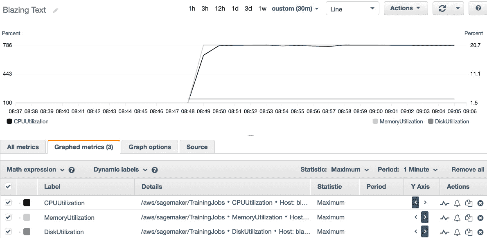

图 9.1 – 查看 CloudWatch 指标

在右侧的 Y 轴上，内存利用率稳定在 20%，所以我们肯定不需要更多的 RAM。

仍然在右侧的 Y 轴上，磁盘利用率在训练过程中约为 3%，当模型被保存时，磁盘利用率会上升到 12%。我们为这个实例分配了太多的存储。默认情况下，SageMaker 实例会获得 30 GB 的 Amazon EBS 存储，那么我们浪费了多少钱呢？在 `eu-west-1` 区域，SageMaker 的 EBS 成本为每 GB 每月 0.154 美元，因此 30 GB 在 2,117 秒内的费用为 0.154*30*(2109/(24*30*3600)) = 0.00376 美元。虽然这个金额非常低，但如果每月训练数千个任务，这些费用会累积起来。即使每年节省 10 美元，我们也应该节省！这可以通过在所有估算器中设置 `volume_size` 参数来轻松实现。

在左侧的 Y 轴上，我们看到 CPU 利用率稳定在 790% 左右，非常接近最大值 800%（8 个 vCPU 在 100% 使用率下）。这个任务显然是计算密集型的。

那么，我们有哪些选择呢？如果 BlazingText 支持监督模式下的分布式训练（但实际上不支持），我们可以考虑使用更小的 `ml.c5.xlarge` 实例（4 个 vCPU 和 8 GB 的 RAM）进行扩展。那样的 RAM 已经足够了，按小步增长容量是一种良好的实践。这就是右尺寸的核心：不多不少，正好合适。

无论如何，我们此时唯一的选择是扩展实例。查看可用实例列表，我们可以尝试 `ml.c5.4xlarge`。由于 BlazingText 支持单个 GPU 加速，`ml.p3.2xlarge`（1 个 NVIDIA V100 GPU）也是一个选项。

注意

写作时，成本效益较高的 `ml.g4dn.xlarge` 不幸未被 BlazingText 支持。

让我们尝试两者并比较训练时间和成本。

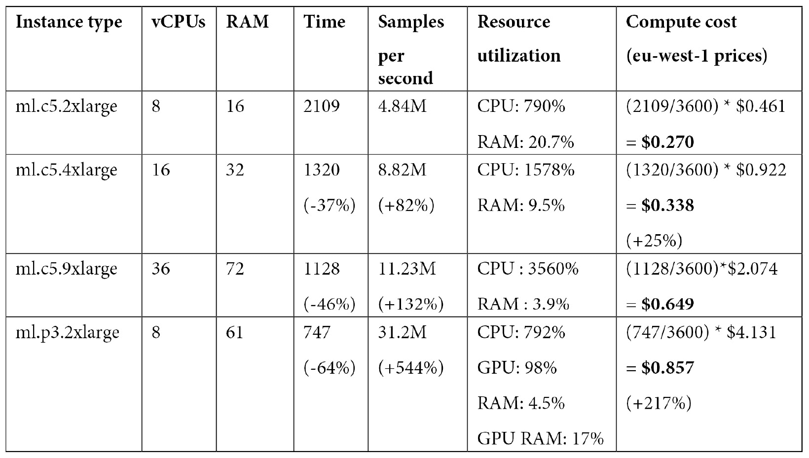

`ml.c5.4xlarge` 实例在适度价格增加的情况下提供了不错的加速效果。有趣的是，工作负载仍然是计算密集型的，因此我决定尝试更大的 `ml.c5.9xlarge` 实例（36 个 vCPU），以进一步测试，但加速效果足以抵消成本增加。

GPU 实例速度几乎是原来的 3 倍，因为 BlazingText 已经过优化，能够利用数千个核心。它的费用大约是原来的 3 倍，如果最小化训练时间非常重要，这可能是可以接受的。

这个简单的示例告诉我们，调整训练基础设施并非神秘难懂。通过遵循简单的规则，查看一些指标并运用常识，你可以为你的项目找到合适的实例大小。

现在，让我们介绍 Amazon SageMaker Debugger 中的监控和分析功能，它将为我们提供更多关于训练任务性能的信息。

# 使用 Amazon SageMaker Debugger 监控和分析训练任务

SageMaker Debugger 包含监控和分析功能，使我们能够以比 CloudWatch 更低的时间分辨率收集基础设施和代码性能信息（通常每 100 毫秒一次）。它还允许我们配置和触发内置或自定义规则，监控训练任务中的不良条件。

分析功能非常容易使用，事实上，它默认是开启的！你可能在训练日志中注意到类似下面这样的行：

```py
2021-06-14 08:45:30 Starting - Launching requested ML instancesProfilerReport-1623660327: InProgress
```

这告诉我们，SageMaker 正在自动运行一个分析任务，并与我们的训练任务并行进行。分析任务的作用是收集数据点，我们可以在 SageMaker Studio 中显示这些数据点，以便可视化指标并了解潜在的性能问题。

## 在 SageMaker Studio 中查看监控和分析信息

让我们回到 `ml.p3.2xlarge` 实例。我们右键点击它，然后选择 **打开调试器以获取洞察**。这会打开一个新标签，见下图所示：

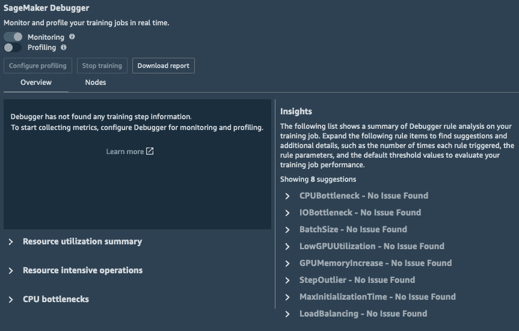

图 9.2 – 查看监控和分析信息

在顶部，我们可以看到监控默认是开启的，而分析功能没有开启。在 **概览** 标签页中展开 **资源使用情况总结** 项目，我们可以看到基础设施指标的总结，如下一个截图所示：

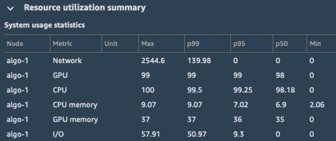

图 9.3 – 查看使用情况总结

注意

P50、p95 和 p99 是百分位数。如果你不熟悉这个概念，可以访问 [`docs.aws.amazon.com/AmazonCloudWatch/latest/monitoring/cloudwatch_concepts.html#Percentiles`](https://docs.aws.amazon.com/AmazonCloudWatch/latest/monitoring/cloudwatch_concepts.html#Percentiles) 了解更多信息。

继续讨论 `algo-1`。例如，您可以在下一个截图中看到其 GPU 使用情况：

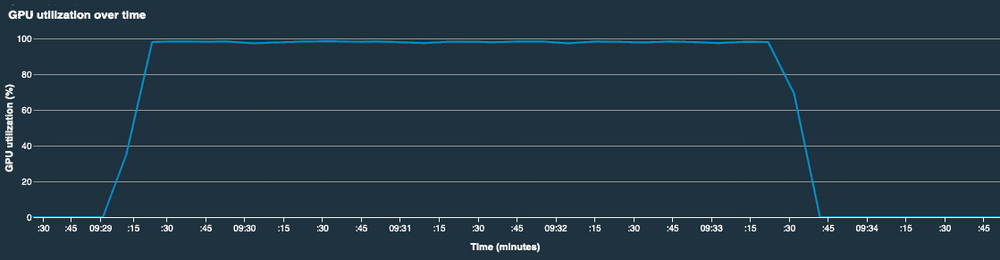

图 9.4 – 查看 GPU 使用情况随时间变化

我们还可以看到一个非常好的系统使用情况视图，按 vCPU 和 GPU 每个一条线，如下图所示：

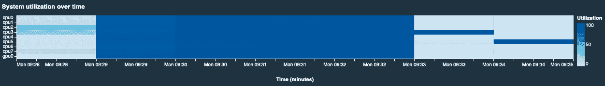

图 9.5 – 查看系统使用情况随时间变化

所有这些信息会在训练任务运行时近乎实时更新。只需启动一个训练任务，打开此视图，几分钟后，图表就会显示并更新。

现在，让我们看看如何在训练任务中启用详细的分析信息。

## 在 SageMaker Debugger 中启用分析

分析会收集框架指标（**TensorFlow**、**PyTorch**、**Apache** **MXNet** 和 XGBoost）、数据加载器指标和 Python 指标。对于后者，我们可以使用 **CProfile** 或 **Pyinstrument**。

分析可以在估算器中配置（这是我们将使用的选项）。你也可以在 SageMaker Studio 中的运行任务上手动启用它（见 *图 9.2* 中的滑块）。

让我们重用我们在 *第六章* 中的 TensorFlow/Keras 示例，*训练计算机视觉模型*，并每 100 毫秒收集一次所有分析信息：

1.  首先，我们创建一个 `FrameworkProfile` 对象，包含分析、数据加载和 Python 配置的默认设置。对于每一项配置，我们都可以指定精确的时间范围或步骤范围来进行数据收集：

    ```py
    from sagemaker.debugger import FrameworkProfile, DetailedProfilingConfig, DataloaderProfilingConfig, PythonProfilingConfig, PythonProfiler
    framework_profile_params = FrameworkProfile(
     detailed_profiling_config=DetailedProfilingConfig(), 
     dataloader_profiling_config=DataloaderProfilingConfig(),
     python_profiling_config=PythonProfilingConfig(
       python_profiler=PythonProfiler.PYINSTRUMENT)
    )
    ```

1.  然后，我们创建一个 `ProfilerConfig` 对象，设置框架参数和数据收集的时间间隔：

    ```py
    from sagemaker.debugger import ProfilerConfig 
    profiler_config = ProfilerConfig(
        system_monitor_interval_millis=100,
        framework_profile_params=framework_profile_params)
    ```

1.  最后，我们将这个配置传递给估算器，然后像往常一样进行训练：

    ```py
    tf_estimator = TensorFlow(
        entry_point='fmnist.py',
        . . .                        
        profiler_config=profiler_config)
    ```

1.  当训练任务运行时，分析数据会自动收集并保存在 S3 的默认位置（你可以通过 `ProfilingConfig` 中的 `s3_output_path` 参数定义自定义路径）。我们还可以使用 `smdebug` **SDK**（[`github.com/awslabs/sagemaker-debugger`](https://github.com/awslabs/sagemaker-debugger)）来加载并检查分析数据。

1.  训练任务完成后不久，我们会在 **概览** 标签中看到汇总信息，如下图所示：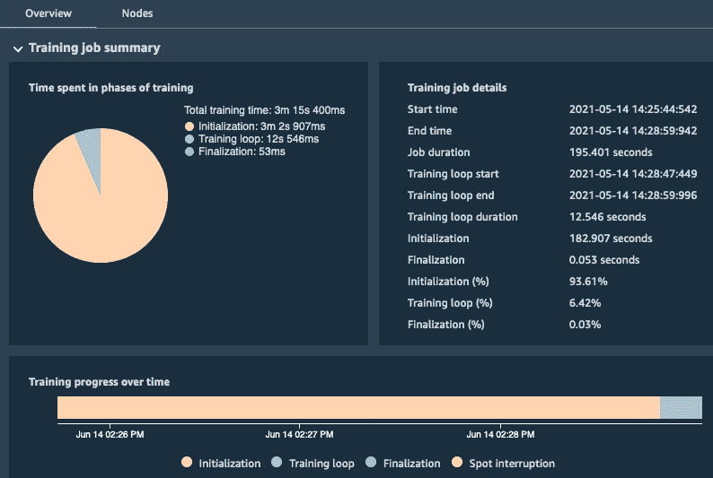

    图 9.6 – 查看分析信息

1.  我们还可以下载详细的 HTML 格式报告（见 *图 9.2* 中的按钮）。例如，它会告诉我们哪些是最昂贵的 GPU 操作。毫无意外地，我们看到我们的 `fmnist_model` 函数和用于二维卷积的 TensorFlow 操作，如下图所示：

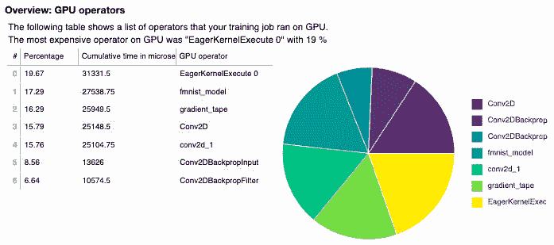

图 9.7 – 查看分析报告

报告还包含训练过程中触发的内置规则信息，提醒我们如 GPU 使用率低、CPU 瓶颈等情况。这些规则有默认设置，如果需要，可以进行自定义。我们将在下一章详细讨论规则，当时我们将讨论如何使用 SageMaker Debugger 调试训练任务。

现在，让我们来看看训练任务中的一些常见扩展问题，以及我们如何解决它们。在此过程中，我们将提到本章后面将介绍的几个 SageMaker 特性。

## 解决训练中的挑战

我们将深入探讨挑战及其解决方案，如下所示：

*我在训练实例上需要大量存储。*

如前面的例子所述，大多数 SageMaker 训练实例使用 EBS 卷，你可以在估算器中设置它们的大小。EBS 卷的最大大小为 16 TB，所以应该绰绰有余。如果你的算法需要大量临时存储来存放中间结果，这就是解决方案。

*我的数据集非常大，复制到训练实例上需要很长时间。*

定义一下“长时间”！如果你在寻找快速解决方案，你可以使用具有高网络性能的实例类型。例如，`ml.g4dn` 和 `ml.p3dn` 实例支持 **弹性结构适配器**（[`aws.amazon.com/hpc/efa`](https://aws.amazon.com/hpc/efa)），可以达到最高 100 Gbit/s 的速度。

如果这还不够，而且如果你正在对单个实例进行训练，你应该使用管道模式，它从 S3 流式传输数据，而不是复制数据。

如果训练是分布式的，你可以将 `FullyReplicated` 更改为 `ShardedbyS3Key`，这将仅将数据集的一部分分发到每个实例。这可以与管道模式结合使用，以提高性能。

*我的数据集非常大，无法完全装入内存。*

如果你想坚持使用单个实例，解决这个问题的快速方法是进行扩展。`ml.r5d.24xlarge` 和 `ml.p3dn.24xlarge` 实例具有 768 GB 的内存！如果分布式训练是一个选项，那么你应该配置它并应用数据并行处理。

*CPU 使用率很低。*

假设你没有过度配置，最可能的原因是 I/O 延迟（网络或存储）。CPU 被阻塞，因为它在等待从存储位置获取数据。

首先你应该检查数据格式。如前几章所述，**RecordIO** 或 **TFRecord** 文件是不可避免的。如果你使用的是其他格式（如 CSV、单独的图片等），你应该在调整基础设施之前从这些地方入手。

如果数据是从 S3 复制到 EBS 卷的，你可以尝试使用具有更多 EBS 带宽的实例。有关详细信息，请访问以下位置：

[`docs.aws.amazon.com/AWSEC2/latest/UserGuide/ebs-optimized.html`](https://docs.aws.amazon.com/AWSEC2/latest/UserGuide/ebs-optimized.html)

你还可以切换到具有本地 NVMe 存储的实例类型（g4dn 和 p3dn）。如果问题仍然存在，你应该检查读取数据并将其传递给训练算法的代码。它可能需要更多的并行处理。

如果数据是通过管道模式从 S3 流式传输的，那么你不太可能已经达到了 25 GB/s 的最大传输速度，但值得检查 CloudWatch 中的实例指标。如果你确定没有其他原因导致这种情况，你应该转向其他文件存储服务，如 **Amazon** **EFS** 和 **Amazon** **FSx for Lustre**。

*GPU 内存利用率低。*

GPU 没有从 CPU 获取足够的数据。你需要增加批次大小，直到内存利用率接近 100%。如果增加过多，你将会收到一个令人烦恼的 `out of memory` 错误信息，如下所示：

```py
/opt/brazil-pkg-cache/packages/MXNetECL/MXNetECL-v1.4.1.1457.0/AL2012/generic-flavor/src/src/storage/./pooled_storage_manager.h:151: cudaMalloc failed: out of memory
```

在使用数据并行配置的多 GPU 实例时，你应该将传递给估算器的批次大小乘以实例中 GPU 的数量。

增加批次大小时，你需要考虑可用的训练样本数量。例如，我们在 *第五章*《训练计算机视觉模型》中使用的 **Pascal** VOC 数据集只有 1,464 个样本，因此可能没有必要将批次大小增加到 64 或 128 以上。

最后，批次大小对作业收敛性有重要影响。非常大的批次可能会使收敛变慢，因此你可能需要相应地增加学习率。

有时，你只能接受 GPU 内存利用率低的事实！

*GPU 利用率低。*

也许你的模型根本没有足够大，无法充分利用 GPU。你应该尝试在更小的 GPU 上进行缩放。

如果你正在处理一个大型模型，GPU 可能会因为 CPU 无法提供足够的数据而停滞。如果你能够控制数据加载代码，应该尝试增加更多的并行性，例如为数据加载和预处理增加更多的线程。如果无法控制代码，你应该尝试使用更多 vCPU 的更大实例类型。希望数据加载代码能够充分利用它们。

如果数据加载代码中有足够的并行性，那么慢 I/O 很可能是罪魁祸首。你应该寻找更快的替代方案（如 NVMe、EFS 或 FSx for Lustre）。

*GPU 利用率高。*

这是一个好情况！你在高效地使用你为其支付的基础设施。正如前面示例中讨论的，你可以尝试扩展（更多 vCPU 或更多 GPU），或者横向扩展（更多实例）。将两者结合使用，适用于诸如深度学习之类的高度并行工作负载。

现在我们对作业扩展有了更多的了解，接下来让我们学习更多 SageMaker 的功能，从管道模式开始。

# 使用管道模式流式传输数据集

估算器的默认设置是将数据集复制到训练实例中，这被称为 **文件模式**。而 **管道模式** 则直接从 S3 流式传输数据。该功能的名称来自于它使用 **Unix** **命名管道**（也称为 **FIFOs**）：在每个 epoch 开始时，每个输入通道会创建一个管道。

管道模式消除了将数据复制到训练实例的需求。显然，训练任务开始得更快。它们通常也运行得更快，因为管道模式经过高度优化。另一个好处是，您不必为训练实例上的数据集预置存储。

减少训练时间和存储意味着您可以节省成本。数据集越大，节省的成本就越多。您可以在以下链接找到基准测试：

[`aws.amazon.com/blogs/machine-learning/accelerate-model-training-using-faster-pipe-mode-on-amazon-sagemaker/`](https://aws.amazon.com/blogs/machine-learning/accelerate-model-training-using-faster-pipe-mode-on-amazon-sagemaker/)

在实践中，您可以开始使用管道模式处理数百兆字节及以上的数据集。事实上，这项功能使您能够处理无限大的数据集。由于存储和内存需求不再与数据集大小挂钩，因此您的算法可以处理的数据量没有实际限制。可以在 PB 级别的数据集上进行训练。

## 使用管道模式与内置算法

管道模式的主要候选者是内置算法，因为大多数内置算法本身就支持此模式：

+   **线性学习器**、**k-均值**、**k-最近邻**、**主成分分析**、**随机切割森林**和**神经主题建模**：RecordIO 封装的 protobuf 或 CSV 数据

+   **因式分解机**、**潜在狄利克雷分配**：RecordIO 封装的 protobuf 数据

+   **BlazingText**（监督模式）：增强的清单

+   **图像分类** 或 **目标检测**：使用 RecordIO 封装的 protobuf 数据或增强的清单

+   **语义分割**：增强的清单。

您应该已经熟悉 `im2rec` 工具，该工具具有生成多个列表文件（`--chunks`）的选项。如果您已有现成的列表文件，当然也可以自己分割它们。

当我们讨论由 **SageMaker** **Ground Truth** 标注的数据集时，我们曾经查看过 **增强清单** 格式，详见 *第五章*，《训练计算机视觉模型》。对于计算机视觉算法，**JSON Lines** 文件包含 S3 中图像的位置及其标注信息。您可以在以下链接了解更多内容：

[`docs.aws.amazon.com/sagemaker/latest/dg/augmented-manifest.html`](https://docs.aws.amazon.com/sagemaker/latest/dg/augmented-manifest.html)

## 使用管道模式与其他算法和框架

TensorFlow 支持管道模式，感谢 AWS 实现的 `PipeModeDataset` 类。以下是一些有用的资源：

+   [`github.com/aws/sagemaker-tensorflow-extensions`](https://github.com/aws/sagemaker-tensorflow-extensions)

+   [`github.com/awslabs/amazon-sagemaker-examples/tree/master/sagemaker-python-sdk/tensorflow_script_mode_pipe_mode`](https://github.com/awslabs/amazon-sagemaker-examples/tree/master/sagemaker-python-sdk/tensorflow_script_mode_pipe_mode)

+   `medium.com/@julsimon/making-amazon-sagemaker-and-tensorflow-work-for-you-893365184233`

对于其他框架以及你自己的自定义代码，仍然可以在训练容器中实现管道模式。一个 Python 示例可以在以下链接找到：

[`github.com/awslabs/amazon-sagemaker-examples/tree/master/advanced_functionality/pipe_bring_your_own`](https://github.com/awslabs/amazon-sagemaker-examples/tree/master/advanced_functionality/pipe_bring_your_own)

## 使用 MLIO 简化数据加载

**MLIO** (https://github.com/awslabs/ml-io) 是一个 AWS 开源项目，允许你使用管道模式加载存储在内存、本地存储或 S3 中的数据。然后，可以将数据转换为不同的流行格式。

这里是一些高级特性：

+   **输入格式**：**CSV**、**Parquet**、RecordIO-protobuf、**JPEG**、**PNG**

+   **转换格式**：NumPy 数组、SciPy 矩阵、**Pandas** **DataFrame**、TensorFlow 张量、PyTorch 张量、Apache MXNet 数组以及 **Apache** **Arrow**

+   API 可用于 Python 和 **C++**

现在，让我们用管道模式运行一些示例。

## 使用管道模式训练分解机器

我们将重新访问在 *第四章* 中使用的示例，*训练机器学习模型*，当时我们在 **MovieLens** 数据集上训练了一个推荐模型。当时，我们使用了一个小版本的数据集，限制为 100,000 条评论。这一次，我们将使用最大版本：

1.  我们下载并解压数据集：

    ```py
    %%sh
    wget http://files.grouplens.org/datasets/movielens/ml-25m.zip
    unzip ml-25m.zip
    ```

1.  该数据集包括来自 162,541 个用户的 25,000,095 条评论，涉及 62,423 部电影。与 100k 版本不同，电影编号不是顺序的。最后一部电影的 ID 为 209,171，这无谓地增加了特征的数量。另一种选择是重新编号电影，但我们这里不这样做：

    ```py
    num_users=162541
    num_movies=62423
    num_ratings=25000095
    max_movieid=209171
    num_features=num_users+max_movieid
    ```

1.  就像在 *第四章**，训练机器学习模型* 中一样，我们将数据集加载到一个稀疏矩阵（来自 SciPy 的 `lil_matrix`），并将其拆分为训练集和测试集，然后将这两个数据集转换为 RecordIO 封装的 protobuf。考虑到数据集的大小，这个过程在一个小型 Studio 实例上可能需要 45 分钟。然后，我们将数据集上传到 S3。

1.  接下来，我们配置两个输入通道，并将它们的输入模式设置为管道模式，而不是文件模式：

    ```py
    From sagemaker import TrainingInput
    s3_train_data = TrainingInput (
        train_data,                                
        content_type='application/x-recordio-protobuf',
        input_mode='Pipe')
    s3_test_data = TrainingInput (
       test_data,                                        
       content_type='application/x-recordio-protobuf',                                           
       input_mode='Pipe')
    ```

1.  然后，我们配置估算器，并像往常一样在 `ml.c5.xlarge` 实例（4 个虚拟 CPU、8 GB 内存，$0.23 每小时，位于 `eu-west-1` 区域）上进行训练。

查看训练日志，我们看到如下信息：

```py
2021-06-14 15:02:08 Downloading - Downloading input data
2021-06-14 15:02:08 Training - Downloading the training image...
```

如预期的那样，复制数据集并未花费任何时间。文件模式下的相同步骤需要 66 秒。即使数据集只有 1.5 GB，管道模式依然非常有效。随着数据集的增大，这一优势将只会增加！

现在，让我们继续进行分布式训练。

# 分布式训练任务

分布式训练让你通过在 CPU 或 GPU 实例的集群上运行训练作业来扩展训练规模。它可以用来解决两个不同的问题：非常大的数据集和非常大的模型。

## 理解数据并行和模型并行

一些数据集太大，单个 CPU 或 GPU 在合理时间内无法完成训练。通过使用一种叫做*数据并行*的技术，我们可以将数据分配到训练集群中。完整的模型仍然加载到每个 CPU/GPU 上，但每个 CPU/GPU 只接收数据集的一部分，而不是整个数据集。理论上，这应该根据参与的 CPU/GPU 数量线性加速训练，但如你所料，现实往往不同。

信不信由你，一些最先进的深度学习模型太大，无法装载到单个 GPU 上。通过使用一种叫做*模型并行*的技术，我们可以将其拆分，并将各层分布到 GPU 集群中。因此，训练批次将跨多个 GPU 流动，由所有层共同处理。

现在，让我们看看在哪里可以在 SageMaker 中使用分布式训练。

## 为内置算法分发训练

数据并行几乎适用于所有内置算法（语义分割和 LDA 是显著的例外）。由于它们是用 Apache MXNet 实现的，因此会自动使用其原生的分布式训练机制。

## 为内置框架分发训练

TensorFlow、PyTorch、Apache MXNet 和**Hugging Face**都有原生的数据并行机制，并且都支持 SageMaker。**Horovod** ([`github.com/horovod/horovod`](https://github.com/horovod/horovod)) 也可用。

对于 TensorFlow、PyTorch 和 Hugging Face，你还可以使用更新的**SageMaker 分布式数据并行库**和**SageMaker 模型并行库**。这两者将在本章后面讨论。

分布式训练通常需要在训练代码中进行框架特定的修改。你可以在框架文档中找到更多信息（例如 [`www.tensorflow.org/guide/distributed_training`](https://www.tensorflow.org/guide/distributed_training)），以及在[`github.com/awslabs/amazon-sagemaker-examples`](https://github.com/awslabs/amazon-sagemaker-examples)上托管的示例笔记本：

+   `sagemaker-python-sdk/tensorflow_script_mode_horovod`

    b) `advanced_functionality/distributed_tensorflow_mask_rcnn`

+   `sagemaker-python-sdk/keras_script_mode_pipe_mode_horovod`

+   `sagemaker-python-sdk/pytorch_horovod_mnist`

每个框架都有其独特之处，但我们在前面章节中讨论的内容依然适用。如果你想最大限度地利用你的基础设施，需要关注批处理大小、同步等方面。进行实验、监控、分析并迭代！

## 为自定义容器分发训练

如果你使用的是自己的定制容器进行训练，你必须实现自己的分布式训练机制。说实话，这会是非常繁琐的工作。SageMaker 仅帮助提供集群实例的名称和容器网络接口的名称。这些信息可以在容器内的`/opt/ml/input/config/resourceconfig.json`文件中找到。

你可以在以下链接找到更多信息：

[`docs.aws.amazon.com/sagemaker/latest/dg/your-algorithms-training-algo-running-container.html`](https://docs.aws.amazon.com/sagemaker/latest/dg/your-algorithms-training-algo-running-container.html)

现在是时候进行分布式训练示例了！

# 在 ImageNet 上扩展图像分类模型

在*第五章*，《训练计算机视觉模型》中，我们使用包含狗和猫图像的小型数据集（25,000 张训练图像）来训练图像分类算法。这一次，我们来挑战一个稍大的数据集。

我们将从头开始在**ImageNet**数据集上训练一个 ResNet-50 网络——这是许多计算机视觉应用的参考数据集（[`www.image-net.org`](http://www.image-net.org)）。2012 版包含 1,281,167 张训练图像（140 GB）和 50,000 张验证图像（6.4 GB），涵盖 1,000 个类别。

如果你想在较小的规模上进行实验，可以使用数据集的 5-10%。最终的准确度可能不会那么好，但对我们的目的来说无关紧要。

## 准备 ImageNet 数据集

这需要大量的存储空间——数据集大小为 150 GB，因此请确保你有至少 500 GB 的可用空间，以存储 ZIP 格式和处理后的格式。你还需要大量的带宽和耐心来下载它。我使用的是运行在`us-east-1`区域的 EC2 实例，我的下载花费了*五天*。

1.  访问 ImageNet 网站，注册以下载数据集并接受条款。你将获得一个用户名和访问密钥，允许你下载数据集。

1.  其中一个 TensorFlow 的库包含一个很好的脚本，可以下载并解压数据集。使用`nohup`非常关键，这样即使会话终止，过程仍然会继续运行：

    ```py
    $ git clone https://github.com/tensorflow/models.git
    $ export IMAGENET_USERNAME=YOUR_USERNAME
    $ export IMAGENET_ACCESS_KEY=YOUR_ACCESS_KEY
    $ cd models/research/inception/inception/data
    $ mv imagenet_2012_validation_synset_labels.txt synsets.txt
    $ nohup bash download_imagenet.sh . synsets.txt >& download.log &
    ```

1.  一旦完成（再次强调，下载需要几天时间），`imagenet/train`目录包含训练数据集（每个类别一个文件夹）。`imagenet/validation`目录包含 50,000 张图片，存储在同一个文件夹中。我们可以使用一个简单的脚本按类别组织这些文件夹：

    ```py
    $ wget https://raw.githubusercontent.com/juliensimon/aws/master/mxnet/imagenet/build_validation_tree.sh
    $ chmod 755 build_validation_tree.sh
    $ cd imagenet/validation
    $ ../../build_validation_tree.sh
    $ cd ../..
    ```

1.  我们将使用 Apache MXNet 库中的`im2rec`工具来构建 RecordIO 文件。让我们先安装依赖项并获取`im2rec`：

    ```py
    $ sudo yum -y install python-devel python-pip opencv opencv-devel opencv-python
    $ pip3 install mxnet opencv-python –user
    $ wget https://raw.githubusercontent.com/apache/incubator-mxnet/master/tools/im2rec.py
    ```

1.  在`imagenet`目录中，我们运行`im2rec`两次——第一次构建列表文件，第二次构建 RecordIO 文件。我们创建了大约 1 GB 大小的 RecordIO 文件（稍后我们会解释为什么这很重要）。我们还将图像的较小尺寸调整为`224`，这样算法就不需要再做此操作：

    ```py
    $ cd imagenet
    $ python3 ../im2rec.py --list --chunks 6 --recursive val validation
    $ python3 ../im2rec.py --num-thread 16 --resize 224 val_ validation
    $ python3 ../im2rec.py --list --chunks 140 --recursive train train
    $ python3 ../im2rec.py --num-thread 16 --resize 224 train_ train
    ```

1.  最后，我们将数据集同步到 S3：

    ```py
    $ mkdir -p input/train input/validation
    $ mv train_*.rec input/train
    $ mv val_*.rec input/validation
    $ aws s3 sync input s3://sagemaker-us-east-1-123456789012/imagenet-split/input/
    ```

数据集现在已经准备好进行训练。

## 定义我们的训练作业

现在数据集已经准备好，我们需要思考一下训练作业的配置。具体来说，我们需要考虑以下内容：

+   输入配置，定义数据集的位置和属性

+   运行训练作业的基础设施要求

+   配置算法的超参数

让我们详细看看这些项目。

### 定义输入配置

考虑到数据集的大小，管道模式似乎是一个好主意。出于好奇，我尝试过使用文件模式进行训练。即使拥有 100 Gbit/s 的网络接口，将数据集从 S3 复制到本地存储也花费了近 25 分钟。所以，还是使用管道模式吧！

你可能会想，为什么我们要把数据集拆分成多个文件。原因如下：

+   一般来说，多个文件创造了更多的并行机会，使得编写快速数据加载和处理代码变得更加容易。

+   我们可以在每个训练周期开始时对文件进行洗牌，消除由于样本顺序导致的任何潜在偏差。

+   它使得处理数据集的一部分变得非常容易。

既然我们已经定义了输入配置，那基础设施要求呢？

### 定义基础设施要求

ImageNet 是一个庞大而复杂的数据集，需要大量训练才能达到良好的准确度。

经过快速测试，单个`ml.p3.2xlarge`实例在批量大小设置为 128 时，可以以每秒约 335 张图像的速度处理数据集。由于我们有大约 1,281,167 张图像，可以预计一个周期大约需要 3,824 秒（约 1 小时 4 分钟）。

假设我们需要训练 150 个周期以获得合理的准确率，我们预计作业将持续（3,824/3,600）*150 = 158 小时（约 6.5 天）。从商业角度来看，这可能不可接受。为了记录，在`us-east-1`区域，每小时$3.825 的实例费用下，这个作业大约需要花费$573。

我们来尝试使用`ml.p3dn.24xlarge`实例来加速我们的作业。每个实例配备八个 NVIDIA V100，每个有 32 GB 的 GPU 内存（是其他`p3`实例的两倍）。它们还配备 96 个**Intel** **Skylake**核心，768 GB 的 RAM，以及 1.8 TB 的本地 NVMe 存储。虽然我们在这里不会使用它，但后者对于长期运行的大规模作业来说是一个极好的存储选项。最后但同样重要的是，这种实例类型具有 100 Gbit/s 的网络连接，适合从 S3 进行数据流传输和实例间通信。

注意

每小时$35.894 的费用，你可能不想在家或工作时尝试，除非获得许可。你的服务配额可能根本不允许你运行如此多的基础设施，而且你必须首先联系 AWS 支持。

在下一章中，我们将讨论*托管抢占训练*—一种大幅降低训练成本的好方法。我们将在介绍完这一主题后再次回到 ImageNet 示例，因此你现在一定不要进行训练！

## 在 ImageNet 上训练

让我们配置训练任务：

1.  我们在两个输入通道上配置了管道模式。训练通道的文件会被打乱，以增加额外的随机性：

    ```py
    prefix = 'imagenet-split'
    s3_train_path = 
    's3://{}/{}/input/training/'.format(bucket, prefix)
    s3_val_path = 
    's3://{}/{}/input/validation/'.format(bucket, prefix)
    s3_output = 
    's3://{}/{}/output/'.format(bucket, prefix)
    from sagemaker import TrainingInput
    from sagemaker.session import ShuffleConfig
    train_data = TrainingInput(
       s3_train_path
       shuffle_config=ShuffleConfig(59),
       content_type='application/x-recordio',
       input_mode='Pipe')
    validation_data = TrainingInput(
       s3_val_path,
       content_type='application/x-recordio', 
       input_mode='Pipe')
    s3_channels = {'train': train_data, 
                   'validation': validation_data}
    ```

1.  首先，我们配置 `Estimator` 模块，使用一个单独的 `ml.p3dn.24xlarge` 实例：

    ```py
    from sagemaker import image_uris
    region_name = boto3.Session().region_name
    container = image_uris.retrieve(
        'image-classification', region)
    ic = sagemaker.estimator.Estimator(
         container,
         role= sagemaker.get_execution_role(),
         instance_count=1,                                 
         instance_type='ml.p3dn.24xlarge',
         output_path=s3_output)
    ```

1.  我们设置了超参数，首先使用合理的批量大小 1,024，然后启动训练：

    ```py
    ic.set_hyperparameters(
        num_layers=50,                 
        use_pretrained_model=0,        
        num_classes=1000,              
        num_training_samples=1281167,
        mini_batch_size=1024,
        epochs=2,
        kv_store='dist_sync',
        top_k=3)         
    ```

## 更新批量大小

每个 epoch 的时间是 727 秒。对于 150 个 epoch，这相当于 30.3 小时的训练（1.25 天），成本为 $1,087。好消息是我们加速了 5 倍。坏消息是成本增加了 2 倍。让我们开始扩展。

查看 CloudWatch 中的总 GPU 利用率，我们看到它没有超过 300%。也就是说，每个 GPU 的利用率为 37.5%。这可能意味着我们的批量大小太小，不能让 GPU 完全忙碌。让我们将批量大小提升到 (1,024/0.375)=2730，四舍五入到 2,736，以便能被 8 整除：

注意

根据算法版本，可能会出现 `out of memory` 错误。

```py
ic.set_hyperparameters(
    num_layers=50,                 
    use_pretrained_model=0,        
    num_classes=1000,              
    num_training_samples=1281167,
    mini_batch_size=2736,         # <--------
    epochs=2,
    kv_store='dist_sync',
    top_k=3)         
```

再次训练，现在每个 epoch 持续 758 秒。看起来这次将 GPU 内存使用率最大化并没有带来太大的差异。也许它被同步梯度的成本抵消了？无论如何，尽可能保持 GPU 核心的高负载是一个好习惯。

## 增加更多实例

现在，让我们添加第二个实例以扩展训练任务：

```py
ic = sagemaker.estimator.Estimator(
    container,
    role,
    instance_count=2,                 # <--------
    instance_type='ml.p3dn.24xlarge',
    output_path=s3_output)
```

现在每个 epoch 的时间是 378 秒！对于 150 个 epoch，这相当于 15.75 小时的训练，成本为 $1,221。与我们最初的任务相比，这速度提高了 2 倍，成本降低了 3 倍！

那四个实例怎么样？看看我们能否继续扩展：

```py
ic = sagemaker.estimator.Estimator(
    container,
    role,
    instance_count=4,                 # <--------
    instance_type='ml.p3dn.24xlarge',
    output_path=s3_output)
```

现在每个 epoch 的时间是 198 秒！对于 150 个 epoch，这相当于 8.25 小时的训练，成本为 $1,279。我们再次加速了 2 倍，且成本略有增加。

现在，我们是否要训练八个实例？当然！谁不想在 64 个 GPU、327K CUDA 核心和 2 TB（！）GPU 内存上进行训练呢？

```py
ic = sagemaker.estimator.Estimator(
    container,
    role,
    instance_count=8,                 # <--------
    instance_type='ml.p3dn.24xlarge',
    output_path=s3_output)
```

现在每个 epoch 的时间是 99 秒。对于 150 个 epoch，这相当于 4.12 小时的训练，成本为 $1,277。我们再次加速了 2 倍，而且没有增加任何额外成本。

## 总结一下

以最初成本的 2 倍，我们通过管道模式、分布式训练和最先进的 GPU 实例将训练任务加速了 38 倍。

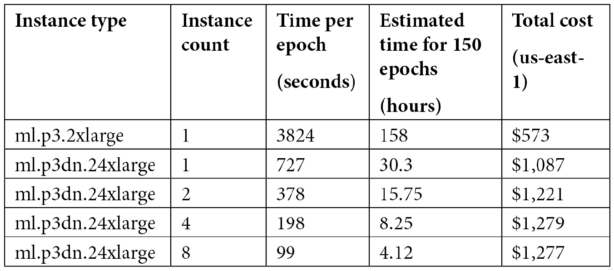

图 9.8 训练任务的结果

不错！节省训练时间有助于加快迭代速度，更快地得到高质量模型，并更早地进入生产阶段。我很确定这很容易抵消额外的成本。不过，在下一章中，我们将看到如何通过托管的抢占式训练大幅削减训练成本。

既然我们已经熟悉了分布式训练，接下来让我们看看两个新的 SageMaker 库，用于数据并行和模型并行。

# 使用 SageMaker 数据和模型并行库进行训练

这两个库是在 2020 年底推出的，显著提升了大规模训练任务的性能。

**SageMaker** **分布式数据并行（DDP）**库实现了 GPU 集群上计算的高效分布。它通过消除 GPU 间通信来优化网络通信，最大化它们在训练中所花费的时间和资源。你可以通过以下链接了解更多内容：

[`aws.amazon.com/blogs/aws/managed-data-parallelism-in-amazon-sagemaker-simplifies-training-on-large-datasets/`](https://aws.amazon.com/blogs/aws/managed-data-parallelism-in-amazon-sagemaker-simplifies-training-on-large-datasets/)

DDP 支持 TensorFlow、PyTorch 和 Hugging Face。前两个需要对训练代码进行小的修改，但最后一个则不需要。由于 DDP 仅在大规模、长时间运行的训练任务中才有意义，因此可用的实例类型包括`ml.p3.16xlarge`、`ml.p3dn24dnxlarge`和`ml.p4d.24xlarge`。

**SageMaker** **分布式模型并行（DMP）**库解决了另一个问题。某些大型深度学习模型过于庞大，无法适应单个 GPU 的内存。另一些模型勉强能够适应，但会迫使你使用非常小的批量大小，从而减慢训练速度。DMP 通过自动将模型分割到 GPU 集群中，并协调数据在这些分区之间流动，解决了这个问题。你可以通过以下链接了解更多内容：

[`aws.amazon.com/blogs/aws/amazon-sagemaker-simplifies-training-deep-learning-models-with-billions-of-parameters/`](https://aws.amazon.com/blogs/aws/amazon-sagemaker-simplifies-training-deep-learning-models-with-billions-of-parameters/)

DMP 支持 TensorFlow、PyTorch 和 Hugging Face。再次说明，前两个需要对训练代码进行小的修改，而 Hugging Face 则不需要，因为其`Trainer` API 完全支持 DMP。

让我们通过回顾我们在*第七章*中的 TensorFlow 和 Hugging Face 示例来尝试这两种方法，*使用内置框架扩展机器学习服务*。

## 使用 SageMaker DDP 进行 TensorFlow 训练

我们最初的代码使用了高级的 Keras API：`compile()`、`fit()`等。为了实现 DDP，我们需要重写这些代码，使用`tf.GradientTape()`并实现一个自定义训练循环。其实并不像听起来那么难，接下来让我们开始吧：

1.  首先，我们需要导入并初始化 DDP：

    ```py
    import smdistributed.dataparallel.tensorflow as sdp
    sdp.init()
    ```

1.  然后，我们获取实例上存在的 GPU 列表，并为它们分配一个本地的 DDP 排名，这是一个简单的整数标识符。我们还允许内存增长，这是 DDP 所需的 TensorFlow 功能：

    ```py
    gpus = tf.config.experimental.
                list_physical_devices('GPU')
    if gpus:
        tf.config.experimental.set_visible_devices(
            gpus[sdp.local_rank()], 'GPU')
    for gpu in gpus:
        tf.config.experimental.set_memory_growth(
            gpu, True)
    ```

1.  根据文档的建议，我们根据训练集群中 GPU 的数量增加批量大小和学习率。这对任务的准确性至关重要：

    ```py
    batch_size = args.batch_size*sdp.size()
    lr         = args.learning_rate*sdp.size()
    ```

1.  接着，我们创建一个损失函数和优化器。标签在预处理过程中已经进行了独热编码，所以我们使用 `CategoricalCrossentropy`，而不是 `SparseCategoricalCrossentropy`。我们还在所有 GPU 上初始化模型和优化器变量：

    ```py
    loss = tf.losses.CategoricalCrossentropy()
    opt = tf.optimizers.Adam(lr)
    sdp.broadcast_variables(model.variables, root_rank=0)
    sdp.broadcast_variables(opt.variables(), root_rank=0)
    ```

1.  接下来，我们需要编写一个 `training_step()` 函数，并用 `@tf.function` 装饰它，以便 DDP 能识别它。顾名思义，这个函数负责在训练集群中的每个 GPU 上运行训练步骤：预测一个批次，计算损失，计算梯度并应用它们。它基于 `tf.GradientTape()` API，我们只是将其包装成 `sdp.DistributedGradientTape()`。在每个训练步骤的结束时，我们使用 `sdp.oob_allreduce()` 来计算平均损失，使用来自所有 GPU 的值：

    ```py
    @tf.function
    def training_step(images, labels):
        with tf.GradientTape() as tape:
            probs = model(images, training=True)
            loss_value = loss(labels, probs)
        tape = sdp.DistributedGradientTape(tape)
        grads = tape.gradient(
            loss_value, model.trainable_variables)
        opt.apply_gradients(
            zip(grads, model.trainable_variables))
        loss_value = sdp.oob_allreduce(loss_value)
        return loss_value
    ```

1.  然后，我们编写训练循环。没有特别之处。为了避免日志污染，我们仅打印主 GPU（rank 0）的消息：

    ```py
    steps = len(train)//batch_size
    for e in range(epochs):
        if sdp.rank() == 0:
            print("Start epoch %d" % (e))
        for batch, (images, labels) in 
        enumerate(train.take(steps)):
            loss_value = training_step(images, labels)
            if batch%10 == 0 and sdp.rank() == 0:
                print("Step #%d\tLoss: %.6f" 
                      % (batch, loss_value))
    ```

1.  最后，我们只在 GPU #0 上保存模型：

    ```py
    if sdp.rank() == 0:
        model.save(os.path.join(model_dir, '1'))
    ```

1.  接下来，在我们的笔记本中，我们使用两个 `ml.p3.16xlarge` 实例来配置此任务，并通过在估算器中添加额外参数启用数据并行：

    ```py
    from sagemaker.tensorflow import TensorFlow
    tf_estimator = TensorFlow(
        . . .
        instance_count=2, 
        instance_type='ml.p3.16xlarge',
        hyperparameters={'epochs': 10, 
            'learning-rate': 0.0001, 'batch-size': 32},
        distribution={'smdistributed': 
            {'dataparallel': {'enabled': True}}}
    )
    ```

1.  我们照常训练，可以在训练日志中看到步骤在进行：

    ```py
    [1,0]<stdout>:Step #0#011Loss: 2.306620
    [1,0]<stdout>:Step #10#011Loss: 1.185689
    [1,0]<stdout>:Step #20#011Loss: 0.909270
    [1,0]<stdout>:Step #30#011Loss: 0.839223
    [1,0]<stdout>:Step #40#011Loss: 0.772756
    [1,0]<stdout>:Step #50#011Loss: 0.678521
    . . .
    ```

如你所见，使用 SageMaker DDP 扩展训练任务其实并不难，尤其是当你的训练代码已经使用了低级 API 时。我们这里使用了 TensorFlow，PyTorch 的过程非常相似。

现在，让我们看看如何使用这两个库训练大型 Hugging Face 模型。确实，最先进的 NLP 模型在不断变大和变得更加复杂，它们是数据并行和模型并行的理想候选者。

## 在 Hugging Face 上使用 SageMaker DDP 进行训练

由于 Hugging Face 的 `Trainer` API 完全支持 DDP，我们不需要修改训练脚本。太棒了！只需在估算器中添加一个额外的参数，设置实例类型和实例数量，就可以开始了：

```py
huggingface_estimator = HuggingFace(
   . . . 
   distribution={'smdistributed': 
                    {'dataparallel':{'enabled': True}}
                }
)
```

## 在 Hugging Face 上使用 SageMaker DMP 进行训练

添加 DMP 也不难。我们的 Hugging Face 示例使用了一个 **DistilBERT** 模型，大小大约为 250 MB。这个大小足以在单个 GPU 上运行，但我们还是来尝试用 DMP 进行训练：

1.  首先，我们需要将 `processes_per_host` 配置为小于或等于训练实例上 GPU 数量的值。在这里，我将使用一个带有 8 个 NVIDIA V100 GPU 的 `ml.p3dn.24xlarge` 实例：

    ```py
    mpi_options = {
       'enabled' : True,
       'processes_per_host' : 8
    }
    ```

1.  然后，我们配置 DMP 选项。这里，我设置了最重要的参数——我们希望的模型分区数（`partitions`），以及为了增加并行性而应复制多少次它们（`microbatches`）。换句话说，我们的模型将被分成四个部分，每个部分会被复制，并且这八个部分将分别运行在不同的 GPU 上。你可以在以下链接找到更多关于所有参数的信息：

    [`sagemaker.readthedocs.io/en/stable/api/training/smd_model_parallel_general.html`](https://sagemaker.readthedocs.io/en/stable/api/training/smd_model_parallel_general.html)

    ```py
    smp_options = {
        'enabled': True,
        'parameters": {
            'microbatches': 2,
            'partitions': 4
        }
    }
    ```

1.  最后，我们配置估算器并按常规进行训练：

    ```py
    huggingface_estimator = HuggingFace(
        . . .
        instance_type='ml.p3dn.24xlarge',
        instance_count=1,
        distribution={'smdistributed': 
            {'modelparallel': smp_options},
             'mpi': mpi_options}
    )
    ```

    您可以在这里找到更多示例：

    +   TensorFlow 和 PyTorch

    +   [`github.com/aws/amazon-sagemaker-examples/tree/master/training/distributed_training`](https://github.com/aws/amazon-sagemaker-examples/tree/master/training/distributed_training)

    +   Hugging Face：[`github.com/huggingface/notebooks/tree/master/sagemaker`](https://github.com/huggingface/notebooks/tree/master/sagemaker)

本章结束时，我们将查看您应考虑的针对大规模、高性能训练任务的存储选项。

# 使用其他存储服务

到目前为止，我们已经使用 S3 存储训练数据。在大规模情况下，吞吐量和延迟可能成为瓶颈，因此有必要考虑其他存储服务：

+   **Amazon 弹性文件系统**（**EFS**）：[`aws.amazon.com/efs`](https://aws.amazon.com/efs)

+   **Amazon FSx for Lustre**：[`aws.amazon.com/fsx/lustre`](https://aws.amazon.com/fsx/lustre)。

    注意

    本节内容需要一些关于 VPC、子网和安全组的 AWS 知识。如果您对此不熟悉，建议您阅读以下内容：

    [`docs.aws.amazon.com/vpc/latest/userguide/VPC_Subnets.html`](https://docs.aws.amazon.com/vpc/latest/userguide/VPC_Subnets.html)

    [`docs.aws.amazon.com/vpc/latest/userguide/VPC_SecurityGroups.html`](https://docs.aws.amazon.com/vpc/latest/userguide/VPC_SecurityGroups.html)

## 使用 SageMaker 和 Amazon EFS

EFS 是一个托管存储服务，兼容 **NFS** v4。它允许您创建可以附加到 EC2 实例和 SageMaker 实例的卷。这是一种方便的数据共享方式，您可以使用它来扩展大规模训练任务的 I/O。

默认情况下，文件存储在**标准**类中。您可以启用生命周期策略，自动将一段时间内未访问的文件移至**低频访问**，这种方式较慢，但更加具有成本效益。

您可以选择两种吞吐量模式中的一种：

+   **突发吞吐量**：突发积分会随着时间积累，突发容量取决于文件系统的大小：100 MB/s，并且每个 TB 的存储会额外增加 100 MB/s。

+   **预配置吞吐量**：您可以设置期望的吞吐量，范围从 1 到 1,024 MB/s。

您还可以选择两种性能模式中的一种：

+   **通用用途**：对于大多数应用程序来说，这种模式足够了。

+   **最大 I/O**：当数十个或数百个实例访问卷时，使用这个设置。吞吐量将最大化，但会牺牲延迟。

我们创建一个 8 GB 的 EFS 卷。然后，我们将在 EC2 实例上挂载它，复制之前准备好的**Pascal VOC**数据集，并训练一个目标检测任务。为了保持合理的成本，我们不会扩展该任务，但无论规模大小，整个过程都是相同的。

### 配置 EFS 卷

EFS 控制台使创建卷变得极其简单。你可以在 [`docs.aws.amazon.com/efs/latest/ug/getting-started.html`](https://docs.aws.amazon.com/efs/latest/ug/getting-started.html) 找到详细的操作说明：

1.  我们将卷名称设置为 `sagemaker-demo`。

1.  我们选择我们的默认 VPC，并使用 **区域** 可用性。

1.  我们创建了卷。一旦卷准备好，你应该会看到类似下面的截图：

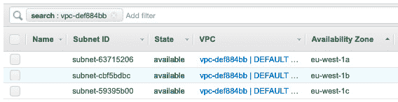

](img/B17705_09_8.jpg)

图 9.9– 创建 EFS 卷

EFS 卷已准备好接收数据。我们现在将创建一个新的 EC2 实例，挂载 EFS 卷，并复制数据集。

### 创建 EC2 实例

由于 EFS 卷位于 VPC 内部，它们只能由位于同一 VPC 中的实例访问。这些实例必须还拥有一个 *安全组*，该安全组允许进入的 NFS 流量：

1.  在 VPC 控制台中（[`console.aws.amazon.com/vpc/#vpcs:sort=VpcId`](https://console.aws.amazon.com/vpc/#vpcs:sort=VpcId)），我们记录下默认 VPC 的 ID。对我而言，它是 `vpc-def884bb`。

1.  仍然在 VPC 控制台中，我们转到 **子网** 部分（[`console.aws.amazon.com/vpc/#subnets:sort=SubnetId`](https://console.aws.amazon.com/vpc/#subnets:sort=SubnetId)）。我们记录下默认 VPC 中所有子网的子网 ID 和可用区。

    对我来说，它们看起来像下图所示：

    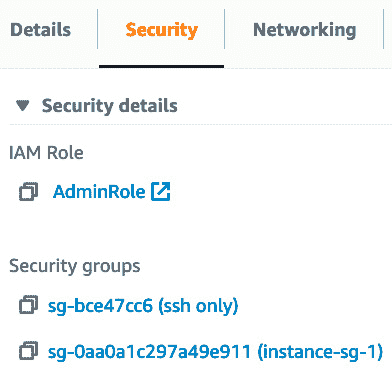

    ](img/B17705_09_9.jpg)

    图 9.10 – 查看默认 VPC 的子网

1.  进入 EC2 控制台，我们创建一个 EC2 实例。我们选择 Amazon Linux 2 镜像和 `t2.micro` 实例类型。

1.  接下来，我们设置 `eu-west-1a` **可用区**。我们还将其分配给我们刚刚创建的安全组，**IAM 角色**分配给具有适当 S3 权限的角色，以及 **文件系统**分配给我们刚刚创建的 EFS 文件系统。我们还确保勾选了自动创建并附加所需安全组的选项。

1.  在接下来的界面中，我们保持存储和标签不变，并附加一个允许 `ssh` 连接的安全组。最后，我们启动实例创建。

### 访问 EFS 卷

一旦实例准备好，我们可以通过 `ssh` 连接到它：

1.  我们看到 EFS 卷已自动挂载：

    ```py
    [ec2-user]$ mount|grep efs
    127.0.0.1:/ on /mnt/efs/fs1 type nfs4
    ```

1.  我们移动到该位置，并从 S3 同步我们的 PascalVOC 数据集。由于文件系统以 `root` 身份挂载，我们需要使用 `sudo`。

    ```py
    [ec2-user] cd /mnt/efs/fs1
    [ec2-user] sudo aws s3 sync s3://sagemaker-ap-northeast-2-123456789012/pascalvoc/input input
    ```

工作完成。我们可以退出并关闭或终止实例，因为我们不再需要它。

现在，让我们使用这个数据集进行训练。

### 使用 EFS 训练物体检测模型

训练过程是相同的，唯一不同的是输入数据的位置：

1.  我们不再使用 `TrainingInput` 对象来定义输入通道，而是使用 `FileSystemInput` 对象，传入我们 EFS 卷的标识符和卷内的绝对数据路径：

    ```py
    from sagemaker.inputs import FileSystemInput
    efs_train_data = FileSystemInput(
                     file_system_id='fs-fe36ef34',
                     file_system_type='EFS',
                     directory_path='/input/train')
    efs_validation_data = FileSystemInput(
                          file_system_id='fs-fe36ef34',
                          file_system_type='EFS',
                          directory_path='/input/validation')
    data_channels = {'train': efs_train_data, 
                     'validation': efs_validation_data}
    ```

1.  我们配置`Estimator`模块，传递托管 EFS 卷的 VPC 子网列表。SageMaker 将在那里启动训练实例，以便它们可以挂载 EFS 卷。我们还需要传递一个安全组，允许 NFS 流量。我们可以重用为 EC2 实例自动创建的那个安全组（不是允许 ssh 访问的那个）– 它在实例详情的**Security**标签中可见，如下图所示：

    ```py
    from sagemaker import image_uris
    container = image_uris.retrieve('object-detection', 
                                    region)
    od = sagemaker.estimator.Estimator(
         container,
         role=sagemaker.get_execution_role(),
         instance_count=1,                                         
         instance_type='ml.p3.2xlarge',                                         
         output_path=s3_output_location,
         subnets=['subnet-63715206','subnet-cbf5bdbc',
                  'subnet-59395b00'],                                        
         security_group_ids=['sg-0aa0a1c297a49e911']
    )
    ```

1.  为了测试目的，我们只训练一个周期。像往常一样，虽然这次数据是从我们的 EFS 卷加载的。

训练完成后，你可以在 EFS 控制台中删除 EFS 卷，以避免不必要的费用。

现在，让我们看看如何使用另一个存储服务——Amazon FSx for Lustre。

## 使用 SageMaker 和 Amazon FSx for Lustre

非常大规模的工作负载需要高吞吐量和低延迟存储——这正是 Amazon FSx for Lustre 所具备的两个特点。顾名思义，这项服务基于 Lustre 文件系统（[`lustre.org`](http://lustre.org)），这是一个流行的开源选择，适用于**HPC**应用。

你可以创建的最小文件系统是 1.2 TB（就像我说的，“非常大规模”）。我们可以为 FSx 文件系统选择两种部署选项之一：

+   **持久化**：应用于需要高可用性的长期存储。

+   **临时存储**：数据不会复制，如果文件服务器发生故障，数据将不会持久化。作为交换，我们获得了高爆发吞吐量，使其成为突发性短期作业的良好选择。

可选地，文件系统可以由 S3 桶支持。对象首次访问时，会自动从 S3 复制到 FSx。

就像 EFS 一样，文件系统存在于 VPC 中，我们需要一个安全组，允许传入 Lustre 流量（端口 988 和 1,021-2,023）。你可以在 EC2 控制台中创建它，它应该类似于以下截图：

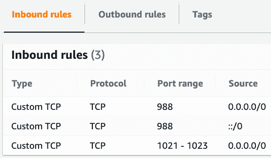

图 9.12 – 为 FSx for Lustre 创建安全组

让我们创建文件系统：

1.  在 FSx 控制台中，我们创建了一个名为`sagemaker-demo`的文件系统，并选择了**临时存储**部署类型。

1.  我们设置存储容量为 1.2 TB。

1.  在默认 VPC 的`eu-west-1a`子网中，我们将其分配给我们刚刚创建的安全组。

1.  在`s3://sagemaker-eu-west-1-123456789012`）和前缀（`pascalvoc`）中。

1.  在下一个屏幕上，我们检查我们的选择，如下图所示，然后创建文件系统。

    几分钟后，文件系统已投入使用，如下图所示：

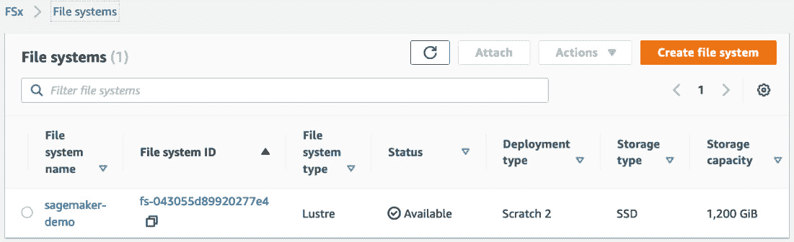

图 9.13 – 创建 FSx 卷

由于文件系统由 S3 桶支持，我们无需填充它。我们可以直接进行训练。

### 使用 FSx for Lustre 训练物体检测模型

现在，我们将使用 FSx 训练模型，具体如下：

1.  类似于我们刚刚在 EFS 中所做的，我们使用`FileSystemInput`定义输入通道。一个区别是目录路径必须以文件系统挂载点的名称开头。您可以在 FSx 控制台中找到它作为**挂载名称**：

    ```py
    from sagemaker.inputs import FileSystemInput
    fsx_train_data = FileSystemInput(
      file_system_id='fs-07914cf5a60649dc8',
      file_system_type='FSxLustre',                            
      directory_path='/bmgbtbmv/pascalvoc/input/train')
    fsx_validation_data = FileSystemInput(
      file_system_id='fs-07914cf5a60649dc8',
      file_system_type='FSxLustre',                            
      directory_path='/bmgbtbmv/pascalvoc/input/validation')
    data_channels = {'train': fsx_train_data, 
                     'validation': fsx_validation_data }
    ```

1.  所有其他步骤都是相同的。不要忘记更新传递给`Estimator`模块的安全组名称。

1.  当我们完成训练后，在控制台中删除 FSx 文件系统。

这结束了我们对 SageMaker 存储选项的探索。总结一下，这里是我的建议：

+   首先，您应尽可能使用 RecordIO 或 TFRecord 数据。它们便于移动，训练速度更快，并且可以同时使用文件模式和管道模式。

+   对于开发和小规模生产，文件模式完全没问题。您的主要关注点应始终是您的机器学习问题，而不是无用的优化。即使在小规模下，EFS 也可以作为协作的有趣选择，因为它便于共享数据集和笔记本。

+   如果您使用内置算法进行训练，管道模式是一个明智的选择，并且应该在每一个机会中使用它。如果您使用框架或自己的代码进行训练，实施管道模式将需要一些工作，可能不值得工程投入，除非您在进行大规模工作（数百 GB 或更多）。

+   如果您有大规模、分布式的工作负载，涉及数十个实例或更多，性能模式下的 EFS 值得一试。不要接近令人惊叹的 FSx for Lustre，除非您有疯狂的工作负载。

# 总结

在本章中，您学习了何时以及如何扩展训练作业。您看到，要找到最佳设置，肯定需要进行一些仔细的分析和实验：扩展与扩展，CPU 与 GPU 与多 GPU 等。这应该帮助您为自己的工作负载做出正确的决策，并避免昂贵的错误。

您还学习了如何通过分布式训练、数据并行、模型并行、RecordIO 和管道模式等技术实现显著加速。最后，您学习了如何为大规模训练作业设置 Amazon EFS 和 Amazon FSx for Lustre。

在下一章中，我们将介绍用于超参数优化、成本优化、模型调试等高级功能。
