# 第十章：高级训练技巧

在上一章中，你学习了如何使用**Pipe 模式**和**分布式训练**等特性来扩展训练任务，以及使用替代的**S3**存储数据集。

在本章中，我们将结束对训练技巧的探索。在本章的第一部分，你将学习如何通过**托管点训练**大幅降低训练成本，如何通过**自动模型调优**从模型中挤出每一滴精度，并且如何使用**SageMaker Debugger**拆解模型。

在本章的第二部分，我们将介绍两个新的 SageMaker 功能，帮助你构建更高效的工作流和更高质量的模型：**SageMaker Feature Store**和**SageMaker Clarify**。

本章涵盖以下主题：

+   使用托管点训练优化训练成本

+   使用自动模型调优优化超参数

+   使用 SageMaker Debugger 探索模型

+   使用 SageMaker Feature Store 管理特征和构建数据集

+   使用 SageMaker Clarify 检测偏差并解释预测

# 技术要求

你需要一个 AWS 账户来运行本章中包含的示例。如果你还没有账户，请访问[`aws.amazon.com/getting-started/`](https://aws.amazon.com/getting-started/)来创建一个。你还应该了解 AWS 免费层（[`aws.amazon.com/free/`](https://aws.amazon.com/free/)），它允许你在一定的使用限制内免费使用许多 AWS 服务。

你需要为你的账户安装并配置 AWS **命令行界面**（**CLI**）（[`aws.amazon.com/cli/`](https://aws.amazon.com/cli/)）。

你将需要一个可用的`pandas`、`numpy`等库。

本书中包含的代码示例可在 GitHub 上获取，链接为[`github.com/PacktPublishing/Learn-Amazon-SageMaker-second-edition`](https://github.com/PacktPublishing/Learn-Amazon-SageMaker-second-edition)。你需要安装 Git 客户端来访问它们（[`git-scm.com/`](https://git-scm.com/)）。

# 使用托管点训练优化训练成本

在上一章中，我们在**ImageNet**数据集上训练了**图像分类**算法。这个任务运行了不到 4 小时。按照每小时$290 计算，这个任务大约花费了我们$1,160。那是一大笔钱……但真的那么贵吗？

## 比较成本

在你抛开双手，喊出“*他在想什么？*”之前，请考虑一下让你的组织拥有并运行这个训练集群需要花费多少成本：

1.  一个粗略的资本支出计算（包括服务器、存储、GPU、100 Gbit/s 的网络设备）至少需要 150 万美元。就运营支出而言，托管成本不会便宜，因为每台等效的服务器需要 4-5 千瓦的电力。这足够填满你典型托管公司的一排机架，因此即使使用高密度机架，你也需要多个。再加上带宽、跨连接等，我的直觉告诉我每月大约需要 1.5 万美元（在某些地区可能更多）。

1.  我们需要添加硬件支持合同（比如，每年 10%，即 15 万美元）。将这个集群的折旧期设为 5 年，总月成本为($1.5M + 60*$15K + 5*$150K)/60 = 52.5K 美元。为了计算维护服务器等的人工成本，我们将其四舍五入到 55K 美元。

使用保守估计，这笔开支相当于使用我们为 ImageNet 示例所用的大型每小时$290 集群进行 190 小时的训练。正如我们在本章稍后将看到的，托管的 Spot 训练通常能提供 70%的节省。因此，现在这笔开支相当于每月大约 633 小时的 ImageNet 训练。

这意味着每月 87%的使用率（633/720），而且很不可能你会让你的训练集群保持如此繁忙。再加上停机时间、硬件创新带来的加速折旧、硬件保险费用、未将 150 万美元投资于其他项目的机会成本等等，物理基础设施的商业案例每分钟都在变得更差。

财务问题固然重要，但最糟糕的是你只能拥有一个集群。如果一个潜在的商业机会需要另一个集群怎么办？你会再花 150 万美元吗？如果不会，是否需要共享现有的集群？当然，只有你能决定什么对你的组织最有利。只要确保你从全局角度来看问题。

现在，让我们来看一下如何轻松享受 70%的成本降低。

## 了解 Amazon EC2 Spot 实例

在任何时候，**Amazon** **EC2**的容量都超过了实际需求。这使得客户可以根据需要随时向他们的平台添加按需容量。可以通过 API 调用显式创建按需实例，或者在配置了**Auto Scaling**的情况下自动创建。一旦客户获得了按需实例，他们将保留它，直到他们决定释放它，无论是显式释放还是自动释放。

**Spot 实例**是利用这些未使用容量并享受非常显著折扣（通常为 50-70%）的简单方法。您可以以相同的方式请求它们，它们的行为也相同。唯一的区别是，如果 AWS 需要容量来构建按需实例，您的 Spot 实例可能会被回收。在被强制终止之前，它会收到两分钟的中断通知。

这并不像听起来那么糟糕。根据区域和实例系列的不同，抢占式实例可能不会被频繁回收，客户通常可以将它们保留几天甚至更长时间。此外，您可以为此需求架构您的应用程序，例如，在抢占式实例上运行无状态工作负载，并依赖托管服务进行数据存储。成本优势非常明显，不容错过！

查看过去三个月`p3dn.24xlarge`的情况，抢占式价格比按需价格便宜 60-70%：

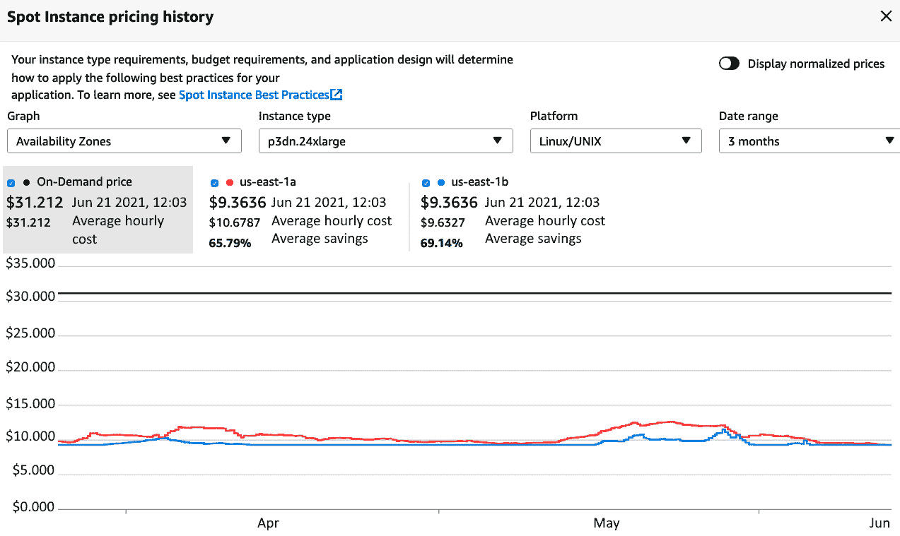

图 10.1 – 查看 p3dn.24xlarge 的抢占式价格

这些是 EC2 的价格，但相同的折扣率也适用于 SageMaker 价格。折扣因实例类型、区域，甚至可用区而异。您可以使用`describe-spot-price-history` API 以编程方式收集这些信息，并将其用于工作流中：

https://docs.aws.amazon.com/cli/latest/reference/ec2/describe-spot-price-history.html

现在，让我们看看这对 SageMaker 意味着什么。

## 理解托管抢占式训练

使用抢占式实例进行训练在所有 SageMaker 配置中都可用：单实例训练、分布式训练、内置算法、框架以及您自己的算法。

只需设置几个估算器参数即可。您无需担心处理通知和中断，SageMaker 会自动为您处理。

如果训练作业被中断，SageMaker 会恢复足够的抢占式容量并重新启动训练作业。如果算法使用了检查点，训练将从最新的检查点继续。如果没有，作业将从头开始。

实现检查点所需的工作量取决于您使用的算法：

+   三个用于计算机视觉和**XGBoost**的内置算法支持检查点功能。

+   所有其他内置算法则没有此功能。您仍然可以使用抢占式实例进行训练。然而，最大运行时间限制为 60 分钟，以减少潜在的浪费。如果您的训练作业超过 60 分钟，您应该考虑进行扩展。如果仍然不够，您将不得不使用按需实例。

+   **深度学习容器**适用于**TensorFlow**、**PyTorch**、**Apache** **MXNet**和**Hugging Face**，并内置了检查点功能，您无需修改训练脚本。

+   如果您使用其他框架或自己的自定义代码，您需要实现检查点功能。

在训练过程中，检查点会保存在训练容器内。默认路径为`/opt/ml/checkpoints`，您可以通过估算器参数进行自定义。SageMaker 还会自动将这些检查点持久化到用户定义的 S3 路径。如果您的训练作业被中断并重新启动，检查点会自动复制到容器内。您的代码可以检查它们的存在，并加载适当的检查点来继续训练。

注意

请注意，即使使用按需实例进行训练，检查点功能仍然可用。如果你希望将检查点存储在 S3 中以便进一步检查或进行增量训练，这将非常有用。唯一的限制是**本地模式**不支持检查点功能。

最后但同样重要的是，检查点功能确实会拖慢任务的速度，尤其是对于大模型来说。然而，这是一个值得支付的小代价，以避免从头开始重新启动长时间运行的任务。

现在，让我们将托管点训练添加到我们在*第五章*中运行的**目标检测**任务中，*训练计算机视觉模型*。

## 使用托管点训练进行目标检测

从按需训练切换到托管点训练非常简单。我们只需设置训练任务的最大持续时间，包括等待 Spot 实例可用的时间。

我们设置了 2 小时的最大运行时间，加上 8 小时的任何点延迟。如果超出了这两个限制，任务将自动终止。这对于终止运行时间过长或因为等待点实例而卡住的任务非常有帮助：

```py
od = sagemaker.estimator.Estimator(
     container,
     role,
     instance_count=2,                                 
     instance_type='ml.p3.2xlarge',                                 
     use_spot_instances=True,
     max_run=7200,                     # 2 hour
     max_wait=36000,                   # +8 hours
     output_path=s3_output_location)
```

我们使用与之前相同的配置进行训练：管道模式和`dist_sync`模式。当第一个 epoch 完成时，训练日志告诉我们检查点功能已经激活。每次验证指标改进时，都会自动保存一个新的检查点：

```py
Updating the best model with validation-mAP=1.615789635726003e-05
Saved checkpoint to "/opt/ml/model/model_algo_1-0000.params"
```

一旦训练任务完成，训练日志会告诉我们节省了多少：

```py
Training seconds: 7794
Billable seconds: 2338
Managed Spot Training savings: 70.0%
```

这个任务不仅比按需版本便宜 70%，而且价格还不到我们原来单实例任务的一半。这意味着我们可以使用更多的实例，并以相同的预算加速训练任务。实际上，托管点训练让你能够优化任务的持续时间和成本。你可以根据业务需求设定训练预算，然后尽可能地获取基础设施。

让我们尝试另一个例子，在**Keras**中实现检查点功能。

## 使用托管点训练和 Keras 中的检查点功能

在这个例子中，我们将在 TensorFlow 2.1 中构建一个简单的`Sequential` API。

### Keras 中的检查点功能

首先，让我们来看一下 Keras 脚本本身。为了简洁起见，这里只展示了重要的步骤。你可以在本书的 GitHub 仓库中找到完整的代码：

1.  使用脚本模式，我们存储数据集路径和超参数。

1.  接下来，我们加载数据集并将像素值归一化到[0,1]范围内。我们还对类别标签进行独热编码。

1.  我们构建了一个`Sequential`模型：两个卷积块（`Conv2D` / `BatchNormalization` / `ReLU` / `MaxPooling2D` / `Dropout`），然后是两个全连接块（`Dense` / `BatchNormalization` / `ReLU` / `Dropout`），最后是一个用于数据集中 10 个类别的`softmax`输出层。

1.  我们使用**分类交叉熵**损失函数和**Adam**优化器来编译模型：

    ```py
    model.compile(
        loss=tf.keras.losses.categorical_crossentropy,
        optimizer=tf.keras.optimizers.Adam(),
        metrics=['accuracy'])
    ```

1.  我们定义一个 Keras 回调，每当验证准确率提高时就保存一个检查点：

    ```py
    from tensorflow.keras.callbacks import ModelCheckpoint
    chk_dir = '/opt/ml/checkpoints'
    chk_name = 'fmnist-cnn-{epoch:04d}'
    checkpointer = ModelCheckpoint(
        filepath=os.path.join(chk_dir, chk_name),
        monitor='val_accuracy')
    ```

1.  我们训练模型，添加我们刚刚创建的回调：

    ```py
    model.fit(x=x_train, y=y_train, 
              validation_data=(x_val, y_val),
              batch_size=batch_size, epochs=epochs,
              callbacks=[checkpointer],
              verbose=1)
    ```

1.  训练完成后，我们将模型保存为 **TensorFlow Serving** 格式，这是在 SageMaker 上部署时所需的格式：

    ```py
    from tensorflow.keras.models import save_model
    save_model(model, os.path.join(model_dir, '1'),  
               save_format='tf')
    ```

现在，让我们看看我们的训练笔记本。

### 使用托管的 spot 训练和检查点保存进行训练

我们使用之前相同的工作流程：

1.  我们下载 Fashion-MNIST 数据集并将其保存在本地目录。我们将数据集上传到 S3，并定义 SageMaker 应该将检查点复制到的 S3 位置。

1.  我们配置一个 `TensorFlow` 估算器，启用托管的 spot 训练，并传递检查点的 S3 输出位置。这次，我们使用的是 `ml.g4dn.xlarge` 实例。这种非常具成本效益的 GPU 实例（在 `eu-west-1` 区域的价格为 $0.822）足以应对一个小模型：

    ```py
    from sagemaker.tensorflow import TensorFlow
    tf_estimator = TensorFlow(
        entry_point='fmnist-1.py',
        role=sagemaker.get_execution_role(),
        instance_count=1,
        instance_type='ml.g4dn.xlarge',     
        framework_version='2.1.0',
        py_version='py3',
        hyperparameters={'epochs': 20},
        output_path=output_path,
        use_spot_instances=True,
        max_run=3600,
        max_wait=7200,
        checkpoint_s3_uri=chk_path)
    ```

1.  我们像往常一样启动训练，任务达到了 93.11%的准确率。训练持续了 289 秒，我们只需为 87 秒支付费用， thanks to a 69.9%的折扣。总费用为 1.98 美分！谁说 GPU 训练必须昂贵？

1.  在训练日志中，我们看到每当验证准确率提高时，都会创建一个检查点：

    ```py
    INFO:tensorflow:Assets written to /opt/ml/checkpoints/fmnist-cnn-0001/assets
    ```

    在任务运行时，我们还看到检查点被复制到 S3：

    ```py
    $ aws s3 ls s3://sagemaker-eu-west-1-123456789012/keras2
    fashion-mnist/checkpoints/
    PRE fmnist-cnn-0001/
    PRE fmnist-cnn-0002/
    PRE fmnist-cnn-0003/
    PRE fmnist-cnn-0006/
    . . .
    ```

如果我们的 spot 任务被中断，SageMaker 会在容器内复制检查点，以便我们可以使用它们来恢复训练。这需要在我们的 Keras 脚本中添加一些逻辑，以加载最新的检查点。让我们看看如何实现。

### 从检查点恢复训练

这是一个非常简单的过程——查找检查点，并从最新的检查点继续训练：

1.  我们列出检查点目录：

    ```py
    import glob
    checkpoints = sorted(
        glob.glob(os.path.join(chk_dir,'fmnist-cnn-*')))
    ```

1.  如果有检查点，我们会找到最新的一个以及它的 epoch 编号。然后，我们加载模型：

    ```py
    from tensorflow.keras.models import load_model
    if checkpoints :
        last_checkpoint = checkpoints[-1]
        last_epoch = int(last_checkpoint.split('-')[-1])
        model = load_model(last_checkpoint)
        print('Loaded checkpoint for epoch ', last_epoch)
    ```

1.  如果没有检查点，我们像往常一样构建模型：

    ```py
    else:
        last_epoch = 0
        model = Sequential()
        . . .
    ```

1.  我们编译模型，启动训练，并传递最后一个 epoch 的编号：

    ```py
    model.fit(x=x_train, y=y_train, 
              validation_data=(x_val, y_val), 
              batch_size=batch_size,
              epochs=epochs,
              initial_epoch=last_epoch,
              callbacks=[checkpointer],
              verbose=1)
    ```

我们怎么测试这个呢？没有办法故意造成一个 spot 中断。

诀窍是：用 `checkpoint_s3_uri` 路径中的现有检查点启动一个新的训练任务，并增加 epoch 的数量。这将模拟恢复一个中断的任务。

将 epoch 数设置为 25，并将检查点保存在 `s3://sagemaker-eu-west-1-123456789012/keras2`

`fashion-mnist/checkpoints`，我们再次启动训练任务。

在训练日志中，我们看到最新的检查点被加载，训练从第 21 个 epoch 继续：

```py
Loaded checkpoint for epoch 20
. . .
Epoch 21/25
```

我们还看到每当验证准确率提高时，新的检查点会被创建，并被复制到 S3：

```py
INFO:tensorflow:Assets written to: /opt/ml/checkpoints/fmnist-cnn-0021/assets
```

如你所见，在 SageMaker 中设置检查点并不困难，你应该也能在其他框架中做到这一点。得益于此，你可以享受由托管的按需训练提供的深度折扣，而在中断发生时也无需担心丢失任何工作。当然，你也可以单独使用检查点来检查中间训练结果，或用于增量训练。

在接下来的部分，我们将介绍另一个重要特性：自动模型调优。

# 使用自动模型调优优化超参数

超参数对训练结果有巨大的影响。就像**混沌理论**中所说的那样，一个单一超参数的微小变化就可能导致准确率的剧烈波动。在大多数情况下，我们无法解释“为什么？”，这让我们对接下来该尝试什么感到困惑。

多年来，已经设计了几种技术来尝试解决选择最佳超参数的问题：

1.  **手动搜索**：这意味着依靠我们的最佳判断和经验来选择“最佳”超参数。说实话：这真的不起作用，尤其是在深度学习和众多训练及网络架构参数的情况下。

1.  **网格搜索**：这意味着系统地探索超参数空间，集中在热点区域，然后重复这一过程。这比手动搜索要好得多。然而，这通常需要训练成百上千的任务。即使有可扩展的基础设施，时间和预算仍然可能是巨大的。

1.  **随机搜索**：指的是随机选择超参数。虽然听起来不合常理，但詹姆斯·伯格斯特拉和约书亚·本吉奥（图灵奖得主）在 2012 年证明，这一技术在相同计算预算下能比网格搜索交付更好的模型。

1.  [`www.jmlr.org/papers/v13/bergstra12a.html`](http://www.jmlr.org/papers/v13/bergstra12a.html)

1.  **超参数优化**（HPO）：这意味着使用优化技术来选择超参数，例如**贝叶斯优化**和**高斯过程回归**。在相同的计算预算下，HPO 通常能以比其他技术少 10 倍的训练周期交付结果。

## 了解自动模型调优

SageMaker 包含一个**自动模型调优**功能，可以让你轻松探索超参数范围，并通过有限的任务数快速优化任何训练指标。

模型调优支持随机搜索和超参数优化（HPO）。前者是一个有趣的基准，帮助你检查后者是否确实表现更好。你可以在这篇精彩的博客文章中找到非常详细的比较：

https://aws.amazon.com/blogs/machine-learning/amazon-sagemaker-automatic-model-tuning-now-supports-random-search-and-hyperparameter-scaling/

模型调优对你使用的算法完全无关。它适用于内置算法，文档中列出了可以调优的超参数。它也适用于所有框架和自定义容器，且超参数传递方式相同。

对于我们想要优化的每一个超参数，我们需要定义以下内容：

+   一个名称

+   一种类型（参数可以是整数、连续的或分类的）

+   探索的值范围

+   一种缩放类型（线性、对数、反对数或自动）——这让我们控制特定参数范围的探索方式

我们还定义了要优化的指标。它可以是任何数值，只要它在训练日志中可见，并且您可以传递正则表达式来提取它。

然后，我们启动调优作业，传递所有这些参数以及要运行的训练作业数量和并行度。使用贝叶斯优化，您可以通过顺序作业（无并行）获得最佳结果，因为优化可以在每个作业后应用。话虽如此，运行少量并行作业是可以接受的。随机搜索对并行性没有限制，因为作业之间完全不相关。

调用`deploy()` API 在调优器对象上部署最佳模型。如果调优仍在进行中，它将部署迄今为止的最佳模型，这对于早期测试非常有用。

让我们使用内置算法运行第一个示例，并了解模型调优 API。

## 使用自动模型调优进行目标检测

我们将优化我们的目标检测作业。查看文档，我们可以看到可调超参数的列表：

https://docs.aws.amazon.com/sagemaker/latest/dg/object-detection-tuning.html

让我们尝试优化学习率、动量和权重衰减：

1.  我们使用管道模式设置输入通道。这里没有变化。

1.  我们还像往常一样配置估算器，设置托管现货训练以最小化成本。我们将在单个实例上训练以获得最高准确度：

    ```py
    od = sagemaker.estimator.Estimator(
         container,
         role,                                        
         instance_count=1,                                        
         instance_type='ml.p3.2xlarge',                                       
         output_path=s3_output_location,                                        
         use_spot_instances=True,
         max_run=7200,
         max_wait=36000,
         volume_size=1)       
    ```

1.  我们使用与之前相同的超参数：

    ```py
    od.set_hyperparameters(base_network='resnet-50',
                           use_pretrained_model=1,
                           num_classes=20,
                           epochs=30,
                           num_training_samples=16551,
                           mini_batch_size=90)
    ```

1.  我们定义了我们希望调优的三个额外超参数。我们明确设置学习率的对数缩放，以确保探索不同数量级：

    ```py
    from sagemaker.tuner import ContinuousParameter,
    hyperparameter_ranges = {
        'learning_rate': ContinuousParameter(0.001, 0.1, 
                         scaling_type='Logarithmic'), 
        'momentum': ContinuousParameter(0.8, 0.999), 
        'weight_decay': ContinuousParameter(0.0001, 0.001)
    }
    ```

1.  我们设置要优化的指标：

    ```py
    objective_metric_name = 'validation:mAP'
    objective_type = 'Maximize'
    ```

1.  我们将所有内容整合在一起，使用`HyperparameterTuner`对象。我们决定运行 30 个作业，其中两个作业并行运行。我们还启用了早停，以淘汰表现较差的作业，从而节省时间和金钱：

    ```py
    from sagemaker.tuner import HyperparameterTuner
    tuner = HyperparameterTuner(od,
                objective_metric_name,
                hyperparameter_ranges,
                objective_type=objective_type,
                max_jobs=30,
                max_parallel_jobs=2,
                early_stopping_type='Auto')
    ```

1.  我们在调优器对象（而不是估算器）上启动训练，而不等待它完成：

    ```py
    tuner.fit(inputs=data_channels, wait=False)
    ```

1.  目前，**SageMaker Studio** 没有提供方便的调优作业查看界面。相反，我们可以在 SageMaker 控制台的 **超参数调优作业** 部分跟踪进度，如下图所示：

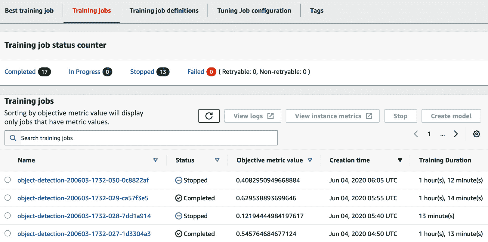

](img/B17705_10_2.jpg)

图 10.2 – 在 SageMaker 控制台中查看调优作业

作业运行了 17 小时（壁钟时间）。22 个作业完成，8 个作业提前停止。总训练时间为 30 小时 15 分钟。应用 70%的现货折扣，总成本为 25.25 * $4.131 * 0.3 = $37.48。

这个调优作业的表现如何？使用默认超参数，我们的独立训练作业达到了`0.2453`。我们的调优作业达到了`0.6337`，如下图所示：

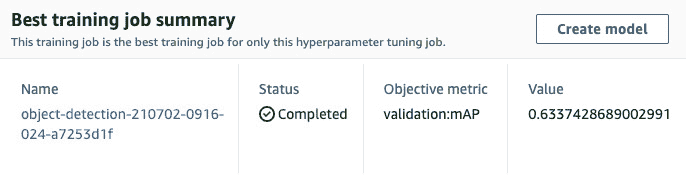

](img/B17705_10_3.jpg)

图 10.3 – 调优作业结果

验证 mAP 的图表显示在下一张图片中。它告诉我我们可能需要再训练一段时间，以获得更高的准确度：

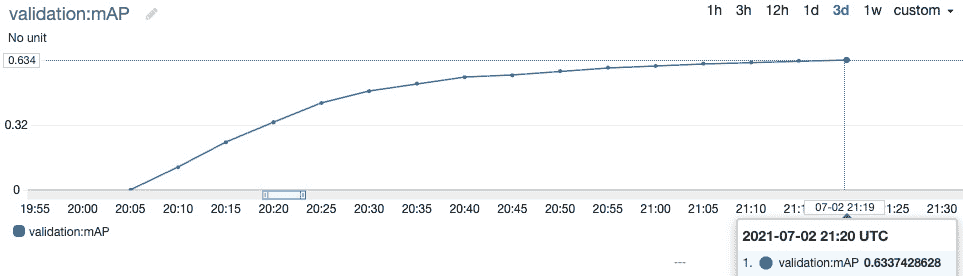

图 10.4 – 查看 mAP 指标

一种方法是使用最佳超参数启动单个训练作业，并让它运行更多周期。我们也可以通过在调优器对象上使用`deploy()`来恢复调优作业，并像任何 SageMaker 模型一样测试我们的模型。

正如你所见，自动模型调优非常强大。通过运行少量作业，我们将指标提高了 158%！与花费时间尝试其他技术相比，成本几乎可以忽略不计。

实际上，使用随机策略运行相同的调优作业可以得到最高准确率 0.52。我们肯定需要运行更多的训练作业才能希望达到 0.6315。

现在，让我们尝试优化我们在本章前面使用的 Keras 示例。

## 使用 Keras 进行自动模型调优

自动模型调优可以轻松应用于 SageMaker 上的任何算法，当然也包括所有框架。让我们看看 Keras 是如何工作的。

在本章的前面，我们在 Fashion MNIST 数据集上训练了我们的 Keras CNN，训练了 20 个周期，得到了 93.11%的验证准确率。让我们看看能否通过自动模型调优来提高这个结果。在此过程中，我们还将学习如何优化训练日志中存在的任何指标，而不仅仅是 SageMaker 中预定义的指标。

### 在自定义指标上的优化

修改我们的训练脚本，安装`keras-metrics`包（[`github.com/netrack/keras-metrics`](https://github.com/netrack/keras-metrics)），并将**精度**、**召回率**和**f1 得分**指标添加到训练日志中：

```py
import subprocess, sys
def install(package):
    subprocess.call([sys.executable, "-m", "pip",
                     "install", package])
install('keras-metrics')
import keras_metrics
. . . 
model.compile(
    loss=tf.keras.losses.categorical_crossentropy,
    optimizer=tf.keras.optimizers.Adam(),
    metrics=['accuracy',
              keras_metrics.precision(),
              keras_metrics.recall(),
              keras_metrics.f1_score()])
```

经过 20 个周期后，当前的指标如下所示：

```py
loss: 0.0869 - accuracy: 0.9678 - precision: 0.9072 - recall: 0.8908 - f1_score: 0.8989 - val_loss: 0.2301 - val_accuracy: 0.9310 - val_precision: 0.9078 - val_recall: 0.8915 - val_f1_score: 0.8996
```

如果我们想优化 f1 得分，可以像这样定义调优器指标：

```py
objective_metric_name = 'val_f1'
objective_type = 'Maximize'
metric_definitions = [
    {'Name': 'val_f1',
     'Regex': 'val_f1_score: ([0-9\\.]+)'
    }]
```

就是这样。只要在训练日志中打印出某个指标，你就可以用它来调优模型。

### 优化我们的 Keras 模型

现在，让我们运行我们的调优作业：

1.  我们像这样为`HyperparameterTuner`定义指标，优化准确度并同时显示 f1 得分：

    ```py
    objective_metric_name = 'val_acc'
    objective_type = 'Maximize'
    metric_definitions = [
        {'Name': 'val_f1', 
         'Regex': 'val_f1_score: ([0-9\\.]+)'},
        {'Name': 'val_acc', 
         'Regex': 'val_accuracy: ([0-9\\.]+)'}
    ]
    ```

1.  我们定义要探索的参数范围：

    ```py
    from sagemaker.tuner import ContinuousParameter, IntegerParameter
    hyperparameter_ranges = {
        'learning_rate': ContinuousParameter(0.001, 0.2, 
                         scaling_type='Logarithmic'), 
        'batch-size': IntegerParameter(32,512)
    }
    ```

1.  我们使用相同的估算器（20 个周期，使用 Spot 实例），并定义调优器：

    ```py
    tuner = HyperparameterTuner(
        tf_estimator,
        objective_metric_name,
        hyperparameter_ranges,                          
        metric_definitions=metric_definitions,
        objective_type=objective_type,
        max_jobs=20,
        max_parallel_jobs=2,
        early_stopping_type='Auto')
    ```

1.  我们启动调优作业。在作业运行时，我们可以使用**SageMaker SDK**来显示训练作业及其属性的列表：

    ```py
    from sagemaker.analytics import HyperparameterTuningJobAnalytics
    exp = HyperparameterTuningJobAnalytics(
       hyperparameter_tuning_job_name=
       tuner.latest_tuning_job.name)
    jobs = exp.dataframe()
    jobs.sort_values('FinalObjectiveValue', ascending=0)
    ```

    这将打印出下一个截图中可见的表格：

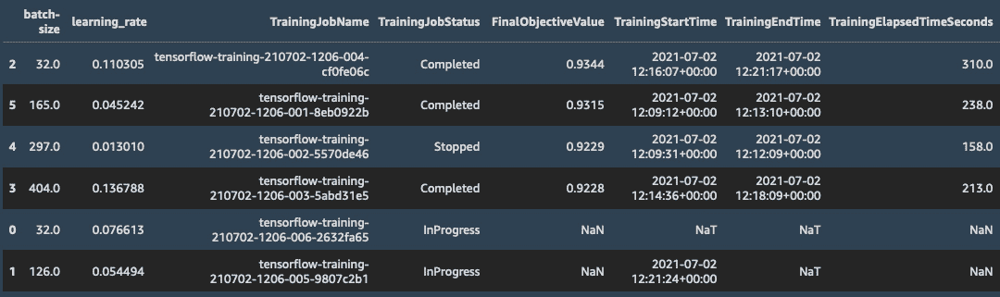

图 10.5 – 查看调优作业的信息

调优作业运行了 2 小时 8 分钟（墙时）。最高验证准确率为 93.46%——相比我们的基准，取得了不错的改进。

我们当然可以通过训练更长时间来做得更好。然而，训练时间越长，过拟合的风险越大。我们可以通过早停法来减轻这一问题，这可以通过 Keras 回调实现。然而，我们应该确保作业报告的是最佳周期的指标，而不是最后一个周期的指标。我们该如何在训练日志中显示这个信息？通过另一个回调！

### 为早期停止添加回调

为早期停止添加一个 Keras 回调非常简单：

1.  我们添加了一个基于验证准确率的早期停止内置回调：

    ```py
    from tensorflow.keras.callbacks import EarlyStopping
    early_stopping = EarlyStopping(
        monitor='val_accuracy',
        min_delta=0.0001,
        patience=10,
        verbose=1,
        mode='auto')
    ```

1.  我们添加了一个自定义回调，以便在每个 epoch 结束时保存验证准确率，并在训练结束时显示最佳结果：

    ```py
    from tensorflow.keras.callbacks import Callback
    class LogBestMetric(Callback):
        def on_train_begin(self, logs={}):
            self.val_accuracy = []
        def on_train_end(self, logs={}):
            print("Best val_accuracy:",
                  max(self.val_accuracy))
        def on_epoch_end(self, batch, logs={}):
            self.val_accuracy.append(
                logs.get('val_accuracy'))
            best_val_metric = LogBestMetric()
    ```

1.  我们将这两个回调添加到训练 API 中：

    ```py
    model.fit(. . . 
        callbacks=[checkpointer, early_stopping, 
                   best_val_metric])
    ```

    测试几个单独的作业时，训练日志的最后几行现在看起来是这样的：

    ```py
    Epoch 00048: early stopping
    Best val_accuracy: 0.9259
    ```

1.  在笔记本中，我们更新了指标定义，以便提取最佳验证准确率：

    ```py
    objective_metric_name = 'val_acc'
    objective_type = 'Maximize'
    metric_definitions = [
        {'Name': 'val_acc', 
         'Regex': 'Best val_accuracy: ([0-9\\.]+)'}
    ]
    ```

这次训练了 60 个 epochs（大约 3 小时的壁钟时间），当前的最高验证准确率为 93.78%。看起来通过调整学习率和批大小，已经达到了最佳效果。

## 使用自动模型调优进行架构搜索

我们的神经网络还有很多超参数：卷积滤波器的数量、dropout 等等。让我们也尝试优化这些参数：

1.  我们修改训练脚本，添加命令行参数，以便为模型中 Keras 层使用的以下网络参数提供支持：

    ```py
    parser.add_argument(
        '--filters1', type=int, default=64)
    parser.add_argument(
        '--filters2', type=int, default=64)
    parser.add_argument(
        '--dropout-conv', type=float, default=0.2)
    parser.add_argument(
        '--dropout-fc', type=float, default=0.2)
    ```

    正如你猜测的那样，参数允许我们为每一层的卷积滤波器数量、卷积层的 dropout 值和全连接层的 dropout 值设置值。

1.  相应地，在笔记本中，我们定义了这些超参数及其范围。对于学习率和批大小，我们使用了以之前调优作业发现的最佳值为中心的窄范围：

    ```py
    from sagemaker.tuner import ContinuousParameter, 
                                IntegerParameter
    hyperparameter_ranges = {
        learning-rate': ContinuousParameter(0.01, 0.14), 
        'batch-size': IntegerParameter(130,160),
        'filters1': IntegerParameter(16,256),
        'filters2': IntegerParameter(16,256),
        'dropout-conv': ContinuousParameter(0.001,0.5, 
                        scaling_type='Logarithmic'),
        'dropout-fc': ContinuousParameter(0.001,0.5, 
                      scaling_type='Logarithmic')
    }
    ```

1.  我们启动调优作业，运行 50 个作业，每次运行 2 个，总共训练 100 个 epochs。

调优作业运行了大约 12 小时，总费用约为 15 美元。最高验证准确率达到了 94.09%。与我们的基线相比，自动模型调优提高了模型的准确性近 1 个百分点——这是一个非常显著的提升。如果这个模型每天用于预测 100 万个样本，这将意味着多出 10,000 个准确的预测！

总的来说，我们在调优 Keras 模型上花费了不到 50 美元。无论是什么业务指标从额外的准确性中获益，可以公平地说，这笔支出很快就能收回。正如许多客户告诉我的那样，自动模型调优是自我盈利的，甚至会带来更多回报。

这结束了我们对自动模型调优的探索，这是 SageMaker 中我最喜欢的功能之一。你可以在 [`github.com/awslabs/amazon-sagemaker-examples/tree/master/hyperparameter_tuning`](https://github.com/awslabs/amazon-sagemaker-examples/tree/master/hyperparameter_tuning) 找到更多示例。

现在，让我们了解一下 SageMaker Debugger，以及它如何帮助我们理解模型内部发生了什么。

# 使用 SageMaker Debugger 探索模型

SageMaker Debugger 让您为训练作业配置*调试规则*。这些规则将检查作业的内部状态，并检测在训练过程中可能出现的特定不良条件。SageMaker Debugger 包含一长串内置规则（[`docs.aws.amazon.com/sagemaker/latest/dg/debugger-built-in-rules.html`](https://docs.aws.amazon.com/sagemaker/latest/dg/debugger-built-in-rules.html)），并且您可以添加自定义的 Python 编写规则。

此外，您还可以保存和检查模型状态（如梯度、权重等）以及训练状态（如指标、优化器参数等）。在每个训练步骤中，存储这些值的**张量**可以在接近实时的情况下保存到 S3 桶中，使得在模型训练过程中就可以对其进行可视化。

当然，您可以选择希望保存的张量**集合**，以及保存的频率等。根据您使用的框架，可用的集合有所不同。您可以在[`github.com/awslabs/sagemaker-debugger/blob/master/docs/api.md`](https://github.com/awslabs/sagemaker-debugger/blob/master/docs/api.md)中找到更多信息。最后但同样重要的是，您可以保存原始张量数据或张量的归约结果，以限制涉及的数据量。归约操作包括最小值、最大值、中位数等。

如果您使用的是支持版本的 TensorFlow、PyTorch、Apache MXNet 的内置容器，或者内置的 XGBoost 算法，您可以开箱即用地使用 SageMaker Debugger，而无需在脚本中更改一行代码。没错，您没有看错。您只需向估算器中添加额外的参数，就像我们接下来在示例中展示的那样。

对于其他版本，或者使用您自己的容器，仅需进行最小的修改。您可以在[`github.com/awslabs/sagemaker-debugger`](https://github.com/awslabs/sagemaker-debugger)找到最新的信息和示例。

调试规则和保存张量可以在同一个训练作业中进行配置。为了清晰起见，我们将运行两个独立的示例。首先，让我们使用来自*第四章*的 XGBoost 和波士顿住房示例，*训练机器学习模型*。

## 调试 XGBoost 作业

首先，我们将配置几个内置规则，训练我们的模型，并检查所有规则的状态：

1.  查看内置规则列表后，我们决定使用`overtraining`和`overfit`。每个规则都有额外的参数，我们可以进行调整。我们保持默认设置，并相应地配置`Estimator`：

    ```py
    from sagemaker.debugger import rule_configs, Rule
    xgb_estimator = Estimator(container,
      role=sagemaker.get_execution_role(),
      instance_count=1,
      instance_type='ml.m5.large',
      output_path='s3://{}/{}/output'.format(bucket, prefix),
      rules=[
        Rule.sagemaker(rule_configs.overtraining()),
        Rule.sagemaker(rule_configs.overfit())
      ]
    )
    ```

1.  我们设置超参数并启动训练，而无需等待训练作业完成。训练日志将不会在笔记本中显示，但仍然可以在**CloudWatch Logs**中查看：

    ```py
    xgb_estimator.set_hyperparameters(
      objective='reg:linear', num_round=100)
    xgb_estimator.fit(xgb_data, wait=False)
    ```

1.  除了训练作业外，每个规则下还会运行一个调试作业，我们可以查看它们的状态：

    ```py
    description = xgb_estimator.latest_training_job.rule_job_summary()
    for rule in description:
      rule.pop('LastModifiedTime')
      rule.pop('RuleEvaluationJobArn')
      print(rule)
    ```

    这告诉我们调试作业正在运行：

    ```py
    {'RuleConfigurationName': 'Overtraining',  
     'RuleEvaluationStatus': 'InProgress'}
    {'RuleConfigurationName': 'Overfit', 
     'RuleEvaluationStatus': 'InProgress'}
    ```

1.  在训练作业完成后重新运行相同的单元格时，我们看到没有任何规则被触发：

    ```py
    {'RuleConfigurationName': 'Overtraining',
     'RuleEvaluationStatus': 'NoIssuesFound'}
    {'RuleConfigurationName': 'Overfit', 
     'RuleEvaluationStatus': 'NoIssuesFound'}
    ```

如果触发了规则，我们会收到错误信息，训练任务将被停止。检查存储在 S3 中的张量有助于我们理解出了什么问题。

## 检查 XGBoost 任务

让我们配置一个新的训练任务，保存 XGBoost 的所有张量集合：

1.  我们配置`Estimator`，传入`DebuggerHookConfig`对象。在每个训练步骤中，我们保存三种张量集合：指标、特征重要性和平均**SHAP**（[`github.com/slundberg/shap`](https://github.com/slundberg/shap)）值。这些有助于我们理解数据样本中每个特征如何影响预测值的增减。

    对于更大的模型和数据集，这可能会生成大量数据，加载和分析这些数据需要较长时间。我们可以增加保存间隔，或保存张量缩减值而非完整张量：

    ```py
    from sagemaker.debugger import DebuggerHookConfig, CollectionConfig
    save_interval = '1'
    xgb_estimator = Estimator(container,
        role=role,
        instance_count=1,
        instance_type='ml.m5.large',
        output_path='s3://{}/{}/output'.format(bucket,  
                                               prefix),

        debugger_hook_config=DebuggerHookConfig(                
            s3_output_path=
            's3://{}/{}/debug'.format(bucket,prefix),
          collection_configs=[
            CollectionConfig(name='metrics',
              parameters={"save_interval": 
                          save_interval}),
            CollectionConfig(name='average_shap',  
              parameters={"save_interval": 
                          save_interval}),
            CollectionConfig(name='feature_importance', 
              parameters={"save_interval": save_interval})
          ]
        )
    )
    ```

1.  一旦训练任务开始，我们可以创建一个试验并加载已保存的数据。由于该任务非常短，我们将在一分钟左右查看到所有数据：

    ```py
    from smdebug.trials import create_trial
    s3_output_path = xgb_estimator.latest_job_debugger_artifacts_path()
    trial = create_trial(s3_output_path)
    ```

1.  我们可以列出所有已保存张量的名称：

    ```py
    trial.tensor_names()
    ['average_shap/f0','average_shap/f1','average_shap/f10', … 
     'feature_importance/cover/f0','feature_importance/cover/f1',…
     'train-rmse','validation-rmse']
    ```

1.  我们还可以列出给定集合中所有张量的名称：

    ```py
    trial.tensor_names(collection="metrics")
    ['train-rmse', 'validation-rmse']
    ```

1.  对于每个张量，我们可以访问训练步骤和数值。让我们绘制来自`average_shap`和`feature_importance`集合的特征信息：

    ```py
    def plot_features(tensor_prefix):
        num_features = len(dataset.columns)-1
        for i in range(0,num_features):
        feature = tensor_prefix+'/f'+str(i)
        steps = trial.tensor(feature).steps()
        v = [trial.tensor(feature).value(s) for s in steps]
        plt.plot(steps, v, label=dataset.columns[i+1])
        plt.autoscale()
        plt.title(tensor_prefix)
        plt.legend(loc='upper left')
        plt.show()
    ```

1.  我们构建`average_shap`图：

    ```py
    plot_features('average_shap')
    ```

1.  你可以在以下截图中看到——**dis**、**crim**和**nox**的平均值最大：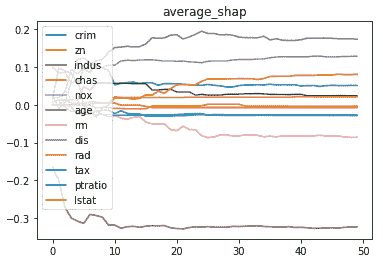

    图 10.6 – 绘制 SHAP 值随时间变化的图

1.  我们构建`feature_importance/weight`图：

    ```py
    plot_features('feature_importance/weight')
    ```

    你可以在以下截图中看到——**crim**、**age**和**dis**的权重最大：

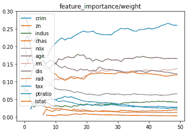

图 10.7 – 绘制特征权重随时间变化的图

现在，让我们在 Keras 和 Fashion-MNIST 示例中使用 SageMaker Debugger。

## 调试和检查 Keras 任务

我们可以通过以下步骤检查和调试 Keras 任务：

1.  TensorFlow 2.x 的默认行为是急切模式（eager mode），此时梯度不可用。因此，我们在脚本中禁用急切模式，这是唯一需要修改的地方：

    ```py
    tf.compat.v1.disable_eager_execution()
    ```

1.  我们从相同的估计器开始。数据集包含 70,000 个样本（60,000 个用于训练，10,000 个用于验证）。通过 30 个 epoch 和批次大小 128，我们的训练任务将有大约 16,400 个步骤（70,000 * 30 / 128）。在每个步骤保存张量可能显得有些过头。我们改为每 100 步保存一次：

    ```py
    from sagemaker.tensorflow import TensorFlow
    from sagemaker.debugger import rule_configs, Rule, DebuggerHookConfig, CollectionConfig
    save_interval = '100'
    tf_estimator = TensorFlow(entry_point='fmnist-5.py',
        role=role,
        instance_count=1,
        instance_type='ml.p3.2xlarge',
        framework_version='2.1.0', 
        py_version='py3',
        hyperparameters={'epochs': 30},
        output_path=output_path,
        use_spot_instances=True,
        max_run=3600,
        max_wait=7200,
    ```

1.  查看 TensorFlow 的内建规则后，我们决定设置`poor_weight_initialization`、`dead_relu`和`check_input_images`。我们需要指定输入张量中的通道信息索引。对于 TensorFlow 来说，它是 4（批次大小、高度、宽度和通道）：

    ```py
        rules=[      
    Rule.sagemaker(
        rule_configs.poor_weight_initialization()), 
    Rule.sagemaker(
        rule_configs.dead_relu()),
    Rule.sagemaker(
        rule_configs.check_input_images(), 
        rule_parameters={"channel": '3'})
        ],
    ```

1.  查看 TensorFlow 的集合后，我们决定保存指标、损失、输出、权重和梯度：

    ```py
        debugger_hook_config=DebuggerHookConfig(                
            s3_output_path='s3://{}/{}/debug'
                   .format(bucket, prefix),
            collection_configs=[
                CollectionConfig(name='metrics',  
                    parameters={"save_interval": 
                                save_interval}),
                CollectionConfig(name='losses', 
                    parameters={"save_interval": 
                                save_interval}),
                CollectionConfig(name='outputs', 
                    parameters={"save_interval": 
                                save_interval}),
                CollectionConfig(name='weights', 
                    parameters={"save_interval": 
                                save_interval}),
                CollectionConfig(name='gradients', 
                    parameters={"save_interval": 
                                save_interval})
            ],
        )
    )
    ```

1.  当训练开始时，我们在训练日志中看到规则被触发：

    ```py
    ********* Debugger Rule Status *********
    *
    * PoorWeightInitialization: InProgress        
    * DeadRelu: InProgress        
    * CheckInputImages: InProgress        
    *
    ****************************************
    ```

1.  训练完成后，我们检查调试规则的状态：

    ```py
    description = tf_estimator.latest_training_job.rule_job_summary()
    for rule in description:
        rule.pop('LastModifiedTime')
        rule.pop('RuleEvaluationJobArn')
        print(rule)
    {'RuleConfigurationName': 'PoorWeightInitialization', 
     'RuleEvaluationStatus': 'NoIssuesFound'}
    {'RuleConfigurationName': 'DeadRelu',
     'RuleEvaluationStatus': 'NoIssuesFound'}
    {'RuleConfigurationName': 'CheckInputImages', 
     'RuleEvaluationStatus': 'NoIssuesFound'}
    ```

1.  我们使用保存在 S3 中的相同张量创建一个试验：

    ```py
    from smdebug.trials import create_trial
    s3_output_path = tf_estimator.latest_job_debugger_artifacts_path()
    trial = create_trial(s3_output_path)
    ```

1.  让我们检查第一层卷积层中的过滤器：

    ```py
    w = trial.tensor('conv2d/weights/conv2d/kernel:0')
    g = trial.tensor(
    'training/Adam/gradients/gradients/conv2d/Conv2D_grad/Conv2DBackpropFilter:0')
    print(w.value(0).shape)
    print(g.value(0).shape)
    (3, 3, 1, 64)
    (3, 3, 1, 64)
    ```

    在我们的训练脚本中定义，第一层卷积层有 64 个过滤器。每个过滤器是 3x3 像素，具有单通道（2D）。因此，梯度具有相同的形状。

1.  我们编写一个函数来绘制过滤器权重和梯度随时间变化的图，并绘制第一层卷积层中最后一个过滤器的权重：

    ```py
    plot_conv_filter('conv2d/weights/conv2d/kernel:0', 63)
    ```

    你可以在以下截图中看到图表：

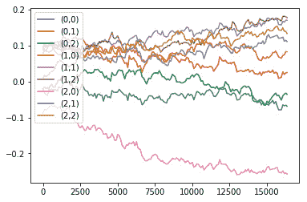

图 10.8 – 绘制卷积过滤器随时间变化的权重

如你所见，SageMaker Debugger 使得检查训练作业变得非常简单。如果你使用内置的支持它的容器，你无需修改代码。所有配置都在估算器中完成。

你可以在[`github.com/awslabs/amazon-sagemaker-examples`](https://github.com/awslabs/amazon-sagemaker-examples)找到更多示例，包括一些高级用例，如实时可视化和模型修剪。

这部分内容结束了，我们学习了如何通过托管的临时训练来优化训练作业的成本，通过自动模型调优来提高准确性，以及如何使用 SageMaker Debugger 检查它们的内部状态。

在第二部分中，我们将深入探讨两项高级功能，帮助我们构建更好的训练工作流——SageMaker Feature Store 和 SageMaker Clarify。

# 使用 SageMaker Feature Store 管理特征和构建数据集

直到现在，我们一直在笔记本或 SageMaker Processing 脚本中工程化我们的训练和验证特征，然后将它们存储为 S3 对象。然后，我们直接使用这些对象来训练和评估模型。这是一个完全合理的工作流。然而，随着你的机器学习工作流的增长和成熟，可能会出现以下问题：

+   我们如何对特征应用明确定义的模式？

+   我们如何选择特征的子集来构建不同的数据集？

+   我们如何存储和管理不同版本的特征？

+   我们如何发现并重用其他团队的特征工程？

+   我们如何在预测时访问工程化的特征？

SageMaker Feature Store 被设计用来回答这些问题。让我们将其添加到我们与 BlazingText 和 Amazon Reviews 一起构建的分类训练工作流中，见*第六章*，*训练自然语言处理模型*。

## 使用 SageMaker Processing 工程化特征

我们几乎可以直接重用之前的 SageMaker Processing 任务。唯一的区别是工程数据的输出格式。在原始任务中，我们将其保存为纯文本文件，按照 BlazingText 期望的输入格式。此格式对于 SageMaker Feature Store 来说不太方便，因为我们需要轻松访问每一列。CSV 格式也不行，因为评论中包含逗号，因此我们决定改用 TSV 格式：

1.  因此，我们在处理脚本中添加了几行：

    ```py
    fs_output_dir = '/opt/ml/processing/output/fs/'
    os.makedirs(fs_output_dir, exist_ok=True)
    fs_output_path = os.path.join(fs_output_dir, 'fs_data.tsv')  
    data.to_csv(fs_output_path, index=False,header=True, sep='\t')
    ```

1.  和之前一样运行我们的 SageMaker Processing 任务，我们现在看到两个输出：一个是 BlazingText 的纯文本输出（如果我们想直接对完整数据集进行训练），另一个是我们将摄取到 SageMaker Feature Store 中的 TSV 输出：

    ```py
    s3://sagemaker-us-east-1-123456789012/sagemaker-scikit-learn-2021-07-05-07-54-15-145/output/bt_data
    s3://sagemaker-us-east-1-123456789012/sagemaker-scikit-learn-2021-07-05-07-54-15-145/output/fs_data
    ```

1.  让我们将 TSV 文件加载到`pandas`数据框中，并显示前几行：

    ```py
    fs_training_output_path = 's3://sagemaker-us-east-1-123456789012/sagemaker-scikit-learn-2021-07-05-07-54-15-145/output/fs_data/fs_data.tsv'
    data = pd.read_csv(fs_training_output_path, sep='\t',
                       error_bad_lines=False, dtype='str')
    data.head()
    ```

    这将打印出下图所示的表格：

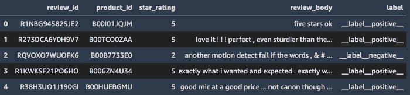

图 10.9 – 查看前几行

现在，让我们创建一个特征组，以便我们摄取这些数据。

## 创建特征组

**特征组**是一种资源，用于存储相关特征的集合。特征组按行组织，每行都有一个唯一标识符和时间戳。每行包含键值对，其中每一对代表一个特征名称和特征值。

1.  首先，让我们定义特征组的名称：

    ```py
    from sagemaker.feature_store.feature_group import FeatureGroup
    feature_group_name = 'amazon-reviews-feature-group-' + strftime('%d-%H-%M-%S', gmtime())
    feature_group = FeatureGroup(
        name=feature_group_name,    
        sagemaker_session=feature_store_session)
    ```

1.  接下来，我们设置包含唯一标识符的特征名称——`review_id`在这里完全适用，你可以使用数据源中任何唯一的值，如主键：

    ```py
    record_identifier_feature_name = 'review_id'
    ```

1.  然后，我们为`pandas`数据框中的所有行添加了时间戳列。如果你的数据源已经包含时间戳，你可以重用该值，无论是**float64**格式还是**UNIX**日期/时间格式：

    ```py
    event_time_feature_name = 'event_time'
    current_time_sec = int(round(time.time()))
    data = data.assign(event_time=current_time_sec)
    ```

    现在我们的数据框看起来如下所示：

    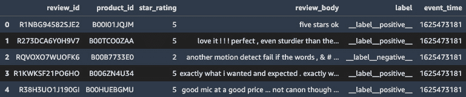

    图 10.10 – 查看时间戳

1.  下一步是为特征组定义模式。我们可以将其显式提供为 JSON 文档，或者让 SageMaker 从 pandas 数据框中自动提取。我们使用第二种方式：

    ```py
    data['review_id'] = data['review_id']
        .astype('str').astype('string')
    data['product_id'] = data['product_id']
        .astype('str').astype('string')
    data['review_body'] = data['review_body']
        .astype('str').astype('string')
    data['label'] = data['label']
        .astype('str').astype('string')
    data['star_rating'] = data['star_rating']
        .astype('int64')
    data['event_time'] = data['event_time']
        .astype('float64')
    ```

    接下来，我们加载特征定义：

    ```py
    feature_group.load_feature_definitions(
        data_frame=data)
    ```

1.  最后，我们创建特征组，传递将存储特征的 S3 位置。这是我们查询它们以构建数据集的地方。我们启用在线存储，这将使我们在预测时以低延迟访问特征。我们还添加了描述和标签，便于发现特征组：

    ```py
    feature_group.create(
      role_arn=role,
      s3_uri='s3://{}/{}'.format(default_bucket, prefix),
      enable_online_store=True,
      record_identifier_name=
          record_identifier_feature_name,
      event_time_feature_name=
          event_time_feature_name,
      description="1.8M+ tokenized camera reviews from the   
                   Amazon Customer Reviews dataset",
      tags=[
          { 'Key': 'Dataset', 
            'Value': 'amazon customer reviews' },
          { 'Key': 'Subset',
            'Value': 'cameras' },
          { 'Key': 'Owner',
            'Value': 'Julien Simon' }
      ])
    ```

几秒钟后，特征组准备就绪，并在 SageMaker Studio 中可见，位于**组件和注册表** / **特征存储**下，如下图所示：

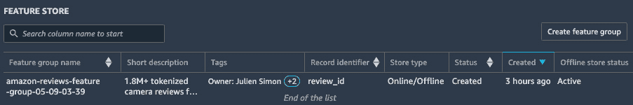

图 10.11 – 查看特征组

现在，让我们开始数据摄取。

## 摄取特征

SageMaker Feature Store 允许我们通过三种方式摄取数据：

+   调用`PutRecord()` API 以摄取单个记录。

+   调用`ingest()` API 上传`pandas`数据框的内容。

+   如果我们使用**SageMaker 数据 Wrangler**进行特征工程，可以使用自动生成的笔记本创建特征组并导入数据。

我们在这里使用第二个选项，它与以下代码一样简单：

```py
feature_group.ingest(data_frame=data, max_workers=10, 
                     wait=True)
```

一旦数据导入完成，特征将存储在我们指定的 S3 位置以及专用的低延迟后端中。我们可以使用前者来构建数据集。

## 查询特征以构建数据集

当我们创建特征组时，SageMaker 会自动在 **AWS Glue 数据目录** 中为其添加一个新表。这使得使用 **Amazon Athena** 查询数据并按需构建数据集变得更加容易。

假设我们希望构建一个包含至少有 1,000 条评论的畅销相机的数据集：

1.  首先，我们编写一个 SQL 查询，计算每台相机的平均评分，统计每台相机收到的评论数，仅保留至少有 1,000 条评论的相机，并按平均评分降序排列相机：

    ```py
    query_string = 
    'SELECT label,review_body FROM 
    "'+ feature_group_table +'"'
    + ' INNER JOIN (
          SELECT product_id FROM (
              SELECT product_id, avg(star_rating) as  
                     avg_rating, count(*) as review_count
              FROM "'+ feature_group_table+ '"' + '
              GROUP BY product_id) 
          WHERE review_count > 1000) tmp 
    ON "'+feature_group_table+'"'
    + '.product_id=tmp.product_id;'
    ```

1.  然后，我们使用 Athena 查询我们的特征组，将选中的行存储在 `pandas` 数据框中，并显示前几行：

    ```py
    dataset = pd.DataFrame()
    feature_group_query.run(query_string=query_string, output_location='s3://'+default_bucket+'/query_results/')
    feature_group_query.wait()dataset = feature_group_query.as_dataframe()
    dataset.head()
    ```

这会打印出下一张图片中可见的表格：

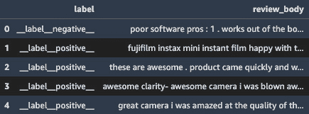

图 10.12 – 查看查询结果

从那时起，一切照常。我们可以将这个数据框保存为 CSV 文件，并用它来训练模型。你可以在 GitHub 仓库中找到一个完整的示例。

## 探索 SageMaker Feature Store 的其他功能

随着时间的推移，我们可以存储同一特征的不同版本——即具有相同标识符但时间戳不同的多个记录。这将允许我们通过简单的 SQL 查询来检索数据集的早期版本——在我们的数据中进行“时光旅行”。

最后但同样重要的是，功能也可以在在线商店中使用。我们可以通过 `GetRecord()` API 检索单个记录，并在预测时根据需要使用功能。

再次，你将在 GitHub 仓库中找到这两项功能的代码示例。

为了结束本章内容，让我们看看 Amazon SageMaker Clarify，这是一项通过检测数据集和模型中的潜在偏差，帮助我们构建更高质量模型的功能。

# 使用 SageMaker Clarify 检测数据集中的偏差并解释预测结果

**机器学习**（**ML**）模型的好坏取决于其构建的 dataset。如果数据集不准确或无法公平地代表其应该捕捉的现实情况，那么相应的模型很可能会学习到这种偏差的表示，并在预测中延续这种偏差。作为机器学习实践者，我们需要意识到这些问题，理解它们如何影响预测，并尽可能地减少这种影响。

在这个示例中，我们将使用**成人数据集**，该数据集可在**UCI 机器学习库**中找到（[`archive.ics.uci.edu/ml`](http://archive.ics.uci.edu/ml)，Dua, D.和 Graff, C.，2019）。这个数据集描述了一个二分类任务，我们尝试预测一个人是否年收入超过$50,000。这里，我们想检查这个数据集是否引入了性别偏差。换句话说，它是否有助于我们构建一个对男性和女性的预测效果一样好的模型？

注意

你在 GitHub 仓库中找到的数据集经过了轻微的处理。标签列已经根据 XGBoost 的要求被移到前面。类别变量已经进行了独热编码。

## 使用 SageMaker Clarify 配置偏差分析

SageMaker Clarify 计算训练前和训练后的指标，帮助我们理解模型的预测情况。

后训练指标显然需要一个已训练的模型，因此我们首先使用 XGBoost 训练一个二分类模型。这是我们已经看过很多次的内容，你可以在 GitHub 仓库中找到相关代码。这个模型的验证 AuC 达到了 92.75%。

一旦训练完成，我们就可以进行偏差分析：

1.  偏差分析作为 SageMaker 处理任务运行。因此，我们创建一个`SageMakerClarifyProcessor`对象，指定我们的基础设施需求。由于任务规模较小，我们使用一个实例。对于更大的任务，我们可以使用更多实例，并且分析将自动在**Spark**上运行：

    ```py
    from sagemaker import clarify
    clarify_processor = clarify.SageMakerClarifyProcessor(
        role=role,
        instance_count=1,
        instance_type='ml.m5.large',
        sagemaker_session=session)
    ```

1.  然后，我们创建一个`DataConfig`对象，描述要分析的数据集：

    ```py
    bias_report_output_path = 's3://{}/{}/clarify-bias'.format(bucket, prefix)
    data_config = clarify.DataConfig(
        s3_data_input_path=train_uri,
        s3_output_path=bias_report_output_path,
        label='Label',
        headers=train_data.columns.to_list(),
        dataset_type='text/csv')
    ```

1.  同样地，我们创建一个`ModelConfig`对象，描述要分析的模型：

    ```py
    model_config = clarify.ModelConfig(
        model_name=xgb_predictor.endpoint_name,
        instance_type='ml.t2.medium',
        instance_count=1,
        accept_type='text/csv')
    ```

1.  最后，我们创建一个`BiasConfig`对象，描述要计算的指标。`label_values_or_threshold`定义了正向结果的标签值（1，表示年收入高于$50K）。`facet_name`定义了我们希望分析的特征（`Sex_`），而`facet_values_or_threshold`定义了潜在弱势群体的特征值（1，表示女性）。

    ```py
    bias_config = clarify.BiasConfig(
        label_values_or_threshold=[1],
        facet_name='Sex_',
        facet_values_or_threshold=[1])
    ```

我们现在准备好运行分析了。

## 运行偏差分析

将所有内容整合在一起，我们使用以下命令启动分析：

```py
clarify_processor.run_bias(
    data_config=data_config,
    model_config=model_config,
    bias_config=bias_config)
```

一旦分析完成，结果将在 SageMaker Studio 中可见。报告也会生成并以 HTML、PDF 和 Notebook 格式存储在 S3 中。

在**实验和试验**中，我们找到我们的 SageMaker Clarify 任务，并右键点击**打开试验详情**。选择**偏差报告**，我们可以看到偏差指标，如下图所示：

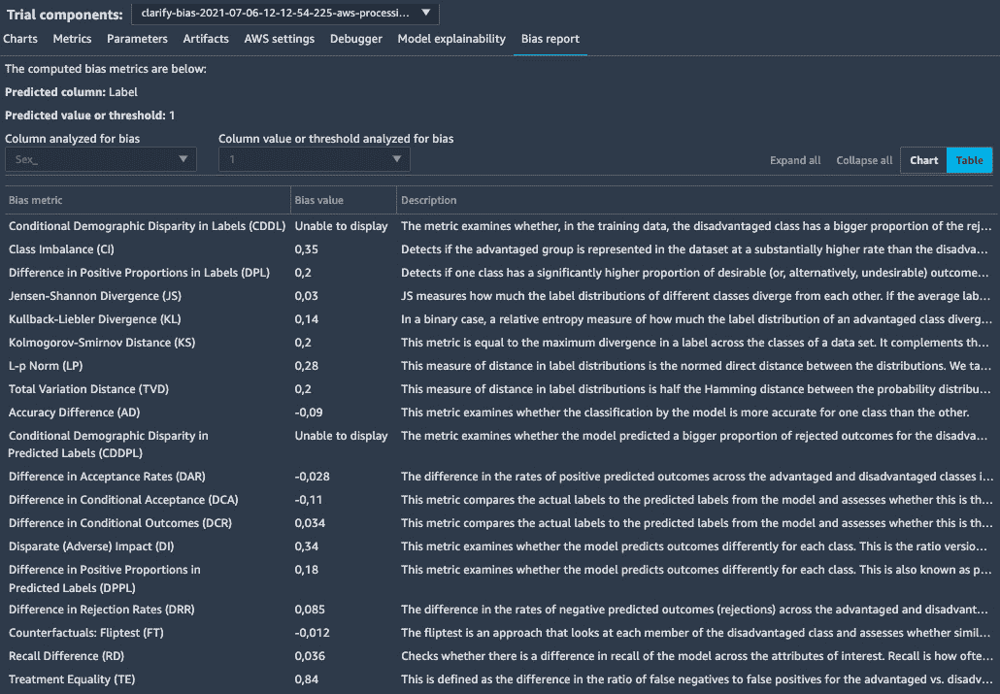

图 10.13 – 查看偏差指标

## 分析偏差指标

如果你想了解更多关于偏差指标的信息、它们的含义以及它们是如何计算的，我强烈推荐以下资源：

+   [`pages.awscloud.com/rs/112-TZM-766/images/Fairness.Measures.for.Machine.Learning.in.Finance.pdf`](https://pages.awscloud.com/rs/112-TZM-766/images/Fairness.Measures.for.Machine.Learning.in.Finance.pdf)

+   [`pages.awscloud.com/rs/112-TZM-766/images/Amazon.AI.Fairness.and.Explainability.Whitepaper.pdf`](https://pages.awscloud.com/rs/112-TZM-766/images/Amazon.AI.Fairness.and.Explainability.Whitepaper.pdf)

+   [`github.com/aws/amazon-sagemaker-clarify`](https://github.com/aws/amazon-sagemaker-clarify)

我们来看两个训练前的度量标准，**类别不平衡**（**CI**）和**标签中正类比例差异**（**DPL**），以及一个训练后的度量标准，**预测标签中正类比例差异**（**DPPL**）。

CI 的非零值表明数据集是不平衡的。这里，男性和女性比例的差异是 0.35。确实，男性组大约占数据集的三分之二，女性组约占三分之一。这并不是一个非常严重的失衡，但我们也应该查看每个类别的正类标签比例。

DPL 衡量每个类别是否具有相同的正类标签比例。换句话说，数据集中男性和女性赚取$50K 的比例是否相同？DPL 的值为非零（0.20），这告诉我们男性的$50K 收入者比例更高。

DPPL 是一个训练后度量，类似于 DPL。它的值（0.18）表明模型不幸地拾取了数据集中的偏差，只是轻微地减少了它。实际上，模型为男性预测了一个更有利的结果（过度预测$50K 收入者），而为女性预测了一个不太有利的结果（低估$50K 收入者）。

这显然是一个问题。尽管模型有一个相当不错的验证 AuC（92.75%），但它并没有同样好地预测两种类别。

在我们深入分析数据并尝试缓解这个问题之前，先进行一次可解释性分析。

## 运行可解释性分析

SageMaker Clarify 可以计算局部和全局的 SHAP 值（[`github.com/slundberg/shap`](https://github.com/slundberg/shap)）。它们帮助我们理解特征的重要性，以及各个特征值如何影响正面或负面的结果。

偏差分析作为 SageMaker 处理作业运行，过程类似：

1.  我们创建一个`DataConfig`对象，描述要分析的数据集：

    ```py
    explainability_output_path = 's3://{}/{}/clarify-explainability.format(bucket, prefix)
    data_config = clarify.DataConfig(
        s3_data_input_path=train_uri,
        s3_output_path= explainability_output_path,
        label='Label',
        headers=train_data.columns.to_list(),
        dataset_type='text/csv')
    ```

1.  我们创建一个`SHAPConfig`对象，描述我们希望如何计算 SHAP 值——即使用哪个基准（我使用了移除标签后的测试集），使用多少样本（特征数的两倍加 2048，这是一个常见的默认值），以及如何聚合值：

    ```py
    shap_config = clarify.SHAPConfig(
        baseline=test_no_labels_uri,
        num_samples=2*86+2048,
        agg_method='mean_abs',
        save_local_shap_values=True
    )
    ```

1.  最后，我们运行分析：

    ```py
    clarify_processor.run_explainability(
        data_config=explainability_data_config,
        model_config=model_config,
        explainability_config=shap_config
    )
    ```

结果可以在 SageMaker Studio 中查看，`Sex`特征是最重要的，这确认了偏差分析的结果。抛开伦理考虑不谈，从商业角度来看，这似乎并不太合理。像教育程度或资本收益这样的特征应该更为重要。


](img/B17705_10_14.jpg)

图 10.14 – 查看特征重要性

本地 SHAP 值也已经计算并存储在 S3 中。我们可以使用这些值来了解特征值如何影响每个单独样本的预测。

现在，让我们看看如何尝试缓解我们在数据集中检测到的偏差。

## 缓解偏差

这个数据集结合了两个问题。首先，它包含更多的男性而非女性。其次，男性组的正向结果比例较高。这两个问题的结合导致数据集中$50K 收入的女性数量比例异常低。这使得模型更难以公平地学习，并且倾向于偏向多数类。

偏差缓解技术包括以下内容：

+   通过删除多数样本来对多数类进行下采样，以重新平衡数据集

+   通过复制现有样本来对少数类进行过采样，增加更多样本

+   通过生成与现有样本具有相似统计属性的新样本，向少数类添加合成样本

    注意

    修改数据不应轻率进行，尤其是在受监管行业中运作的组织中。这可能会产生严重的业务、合规性和法律后果。在生产环境中进行此操作之前，请务必获得批准。

让我们尝试一种结合方法，基于**imbalanced-learn**开源库（https://imbalanced-learn.org）。首先，我们将使用**合成少数类过采样技术**（**SMOTE**）算法向少数类添加合成样本，以匹配多数类样本中$50K 收入者的比例。接着，我们将对多数类进行下采样，使其样本数与少数类相匹配。结果将是一个完全平衡的数据集，两个类别的大小相同，$50K 收入者的比例也相同。让我们开始吧：

1.  首先，我们需要计算两个类别的比例：

    ```py
    female_male_not_50k_count = train_data['Sex_'].where(
        train_data['Label']==0).value_counts()
    female_male_50k_count = train_data['Sex_'].where(
        train_data['Label']==1).value_counts()
    ratios = female_male_50k_count / 
             female_male_not_50k_count
    print(ratios)
    ```

    这给出了以下结果，显示多数类（类别 0）拥有远高于$50K 收入者的比例：

    ```py
    0.0    0.457002
    1.0    0.128281
    ```

1.  然后，我们生成少数类的合成样本：

    ```py
    from imblearn.over_sampling import SMOTE
    female_instances = train_data[train_data['Sex_']==1]
    female_X = female_instances.drop(['Label'], axis=1)
    female_Y = female_instances['Label']
    oversample = SMOTE(sampling_strategy=ratios[0])
    balanced_female_X, balanced_female_Y = oversample.fit_resample(female_X, female_Y)
    balanced_female=pd.concat([balanced_female_X, balanced_female_Y], axis=1)
    ```

1.  接下来，我们使用原始多数类和重新平衡的少数类重新构建数据集：

    ```py
    male_instances = train_data[train_data['Sex_']==0]
    balanced_train_data=pd.concat(
        [male_instances, balanced_female], axis=0)
    ```

1.  最后，我们对原始多数类进行下采样，以重新平衡比例：

    ```py
    from imblearn.under_sampling import RandomUnderSampler
    X = balanced_train_data.drop(['Sex_'], axis=1)
    Y = balanced_train_data['Sex_']
    undersample = RandomUnderSampler(
        sampling_strategy='not minority')
    X,Y = undersample.fit_resample(X, Y)
    balanced_train_data=pd.concat([X, Y], axis=1)
    ```

1.  我们再次计算两个类别的样本数，并重新计算它们的比例：

    ```py
    female_male_count= balanced_train_data['Sex_']    
        .value_counts()
    female_male_50k_count = balanced_train_data['Sex_']
        .where(balanced_train_data['Label']==1)
        .value_counts()
    ratios = female_male_50k_count/female_male_count
    print(female_male_count)
    print(female_male_50k_count)
    print(ratios)
    ```

    这显示了以下结果：

    ```py
    1.0    0.313620
    0.0    0.312039
    ```

在使用这个重新平衡的数据集进行训练，并使用相同的测试集时，我们得到了 92.95%的验证 AuC，相比之下原始模型为 92.75%。进行新的偏差分析时，CI 为零，DPL 和 DPPL 接近零。

我们不仅构建了一个预测更公平的模型，而且还稍微提高了准确性。难得的是，这次我们似乎做到了两全其美！

# 总结

本章总结了我们对训练技术的探索。你学习了受管训练（managed spot training），这是一种通过减少 70％或更多的训练成本的简单方法。你还了解了检查点（checkpointing）如何帮助恢复被中断的任务。接着，你学习了自动模型调优（automatic model tuning），这是一种通过探索超参数范围从模型中提取更多准确性的有效方法。你了解了 SageMaker 调试器（SageMaker Debugger），这是一个高级功能，能够自动检查训练任务中的不良条件，并将张量集合保存到 S3，以便检查和可视化。最后，我们发现了两个有助于你构建更高质量工作流和模型的功能，SageMaker 特征存储（SageMaker Feature Store）和 SageMaker Clarify。

在下一章，我们将详细学习模型部署。
