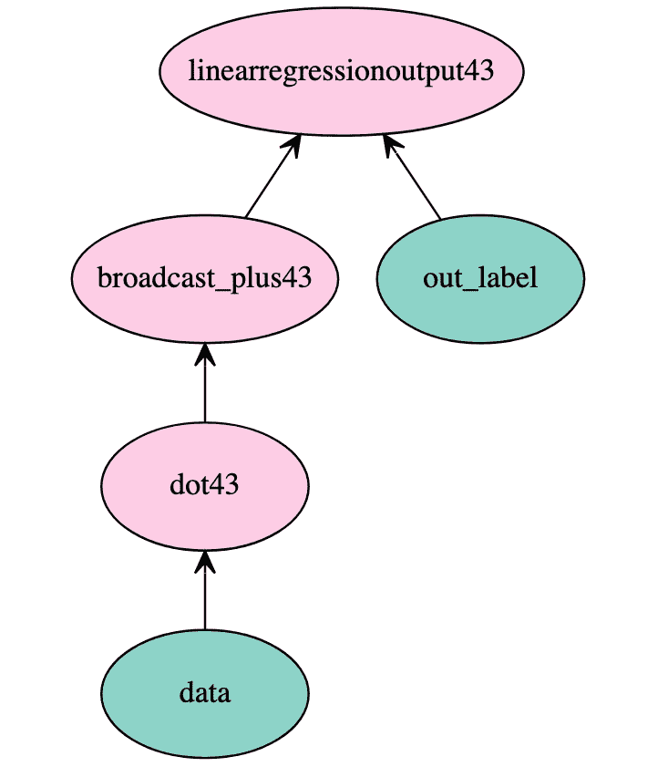
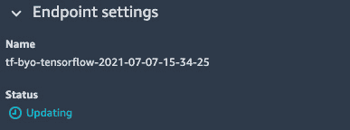
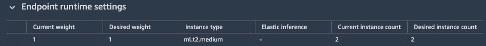
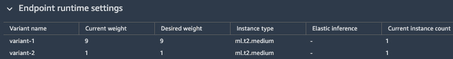
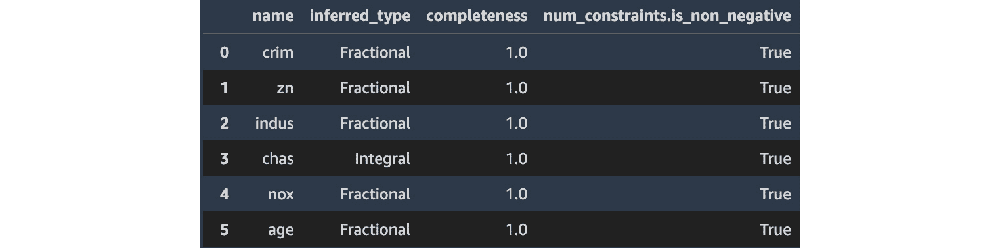
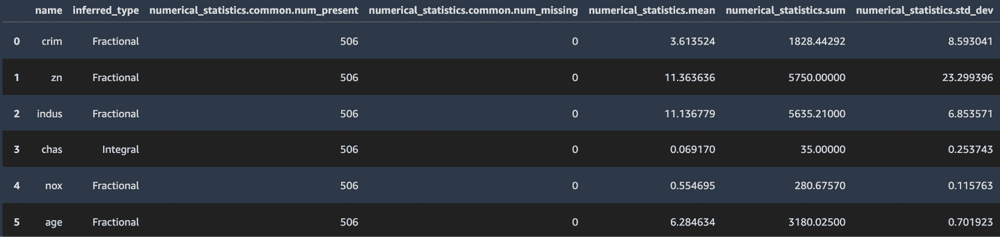
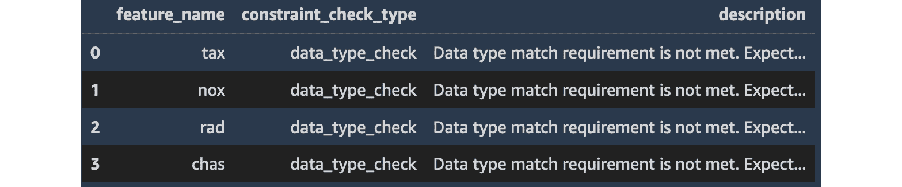
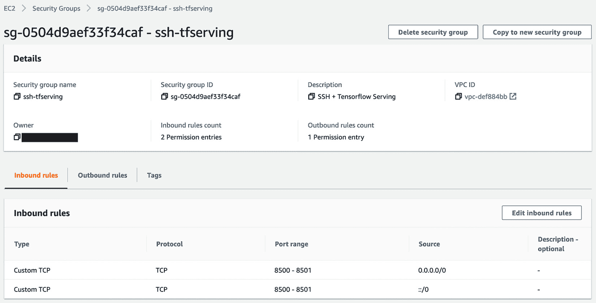

# 第十一章：部署机器学习模型

在前面的章节中，我们以最简单的方式部署了模型：通过配置估算器，调用 `fit()` 和 `deploy()` API 创建实时端点。这是开发和测试中最简单的场景，但并非唯一的方式。

模型也可以被导入。例如，你可以将自己在本地机器上训练的现有模型导入到 SageMaker，并像在 SageMaker 上训练一样进行部署。

此外，模型可以以不同的配置进行部署，如下所示：

+   一个单一模型部署在实时端点上，正如我们目前所做的那样，也可以在同一端点上部署多个模型变种。

+   一个最多包含五个模型的序列，称为 **推理管道**。

+   在同一端点上按需加载的任意数量的相关模型，称为 **多模型端点**。我们将在 *第十三章*，*优化成本与性能* 中详细探讨这种配置。

+   单一模型或一个推理管道，通过一种称为 **批量转换** 的特性进行批量模式预测。

当然，模型也可以被导出。你可以在 **简单存储服务**（**S3**）中获取训练工件，提取模型并将其部署到任何地方。

在本章中，我们将讨论以下主题：

+   检查模型工件并导出模型

+   在实时端点上部署模型

+   在批处理转换器上部署模型

+   在推理管道上部署模型

+   使用 Amazon SageMaker 模型监控器监控预测质量

+   在容器服务上部署模型

+   让我们开始吧！

# 技术要求

你需要一个 **亚马逊网络服务**（**AWS**）账户来运行本章中的示例。如果你还没有账户，请访问 [`aws.amazon.com/getting-started/`](https://aws.amazon.com/getting-started/) 创建一个。你还应该熟悉 AWS 免费套餐（[`aws.amazon.com/free/`](https://aws.amazon.com/free/)），它让你可以在某些使用限制内免费使用许多 AWS 服务。

你需要安装并为你的账户配置 AWS **命令行界面**（**CLI**）（[`aws.amazon.com/cli/`](https://aws.amazon.com/cli/)）。

你需要一个正常工作的 Python 3.x 环境。安装 Anaconda 发行版（[`www.anaconda.com/`](https://www.anaconda.com/)）不是强制的，但强烈建议安装，因为它包含了许多我们需要的项目（Jupyter、`pandas`、`numpy` 等）。

本书中的代码示例可以在 GitHub 上找到，网址为 [`github.com/PacktPublishing/Learn-Amazon-SageMaker-second-edition`](https://github.com/PacktPublishing/Learn-Amazon-SageMaker-second-edition)。你需要安装一个 Git 客户端才能访问它们（[`git-scm.com/`](https://git-scm.com/)）。

# 检查模型工件并导出模型

模型工件包含一个或多个由训练作业生成的文件，这些文件是模型部署所必需的。这些文件的数量和性质取决于所训练的算法。如我们所见，模型工件通常存储为`model.tar.gz`文件，位于估算器定义的 S3 输出位置。

让我们看看不同的示例，在这些示例中，我们重用之前训练作业中的工件。

## 检查和导出内置模型

几乎所有内置的算法都使用**Apache MXNet**实现，其工件也反映了这一点。有关 MXNet 的更多信息，请访问[`mxnet.apache.org/`](https://mxnet.apache.org/)。

让我们看看如何直接加载这些模型。另一种选择是使用**多模型服务器**（**MMS**）（[`github.com/awslabs/multi-model-server`](https://github.com/awslabs/multi-model-server)），但我们将按如下方式继续：

1.  让我们从我们在*第四章*中训练的**线性学习者**模型的工件开始，如以下代码片段所示：

    ```py
    $ tar xvfz model.tar.gz
    x model_algo-1
    $ unzip model_algo-1
    archive:  model_algo-1
    extracting: additional-params.json
    extracting: manifest.json
    extracting: mx-mod-symbol.json
    extracting: mx-mod-0000.params
    ```

1.  我们加载符号文件，该文件包含模型的**JavaScript 对象表示法**（**JSON**）定义，如下所示：

    ```py
    import json
    sym_json = json.load(open('mx-mod-symbol.json'))
    sym_json_string = json.dumps(sym_json)
    ```

1.  我们使用这个 JSON 定义来实例化一个新的 Gluon 模型。我们还定义了它的输入符号（`data`），如下所示：

    ```py
    import mxnet as mx
    from mxnet import gluon
    net = gluon.nn.SymbolBlock(
        outputs=mx.sym.load_json(sym_json_string),
        inputs=mx.sym.var('data')) 
    ```

1.  现在，我们可以轻松地绘制模型，如下所示：

    ```py
    mx.viz.plot_network(
        net(mx.sym.var('data'))[0],   
        node_attrs={'shape':'oval','fixedsize':'false'})
    ```

    这将生成以下输出：

    

    图 11.1 – 线性学习者模型

1.  然后，我们加载在训练过程中学到的模型参数，如下所示：

    ```py
    net.load_parameters('mx-mod-0000.params', 
                        allow_missing=True)
    net.collect_params().initialize()
    ```

1.  我们定义一个存储在 MXNet `NDArray`（https://mxnet.apache.org/versions/1.6/api/python/docs/api/ndarray/index.html）中的测试样本，如下所示：

    ```py
    test_sample = mx.nd.array(
    [0.00632,18.00,2.310,0,0.5380,6.5750,65.20,4.0900,1,296.0,15.30,4.98])
    ```

1.  最后，我们将其通过模型并读取输出，如下所示：

    ```py
    response = net(test_sample)
    print(response)
    ```

    该房子的预测价格为**美元**（**USD**）30,173，如下图所示：

    ```py
    array([[30.173424]], dtype=float32)
    ```

该技术应该适用于所有基于 MXNet 的算法。现在，让我们看看**计算机视觉**（**CV**）的内置算法。

## 检查和导出内置的计算机视觉（CV）模型

这三个内置的计算机视觉算法也基于 Apache MXNet。过程完全相同，如此处所述：

1.  以下是我们在*第五章*中训练的**图像分类**模型的工件，*训练计算机视觉模型*：

    ```py
    $ tar xvfz model.tar.gz
    x image-classification-0010.params
    x model-shapes.json
    x image-classification-symbol.json
    ```

1.  加载模型及其参数，如下所示：

    ```py
    import mxnet, json
    from mxnet import gluon
    sym_json = json.load(
               open('image-classification-symbol.json'))
    sym_json_string = json.dumps(sym_json)
    net = gluon.nn.SymbolBlock(
        outputs=mx.sym.load_json(sym_json_string),
        inputs=mx.sym.var('data'))
    net.load_parameters(
        'image-classification-0010.params',  
        allow_missing=True)
    net.collect_params().initialize()
    ```

1.  输入形状是一个 300x300 的彩色图像，具有三个通道（**红色、绿色和蓝色**，或 **RGB**）。因此，我们使用随机值创建一张假图像。我们将其通过模型并读取结果，如下所示：

    ```py
    test_sample = mx.ndarray.random.normal(
        shape=(1,3,300,300))
    response = net(test_sample)
    print(response)
    ```

    有趣的是，这张随机图片被分类为猫，正如以下代码片段中所定义的：

    ```py
    array([[0.99126923, 0.00873081]], dtype=float32)
    ```

重用**目标检测**更加复杂，因为训练网络需要针对预测进行修改。你可以在[`github.com/aws-samples/amazon-sagemaker-aws-greengrass-custom-object-detection-model/`](https://github.com/aws-samples/amazon-sagemaker-aws-greengrass-custom-object-detection-model/)找到一个示例。

现在，让我们来看一下**极限梯度提升**（**XGBoost**）工件。

## 检查和导出 XGBoost 模型

一个 XGBoost 工件包含一个文件——模型本身。然而，模型的格式取决于你使用 XGBoost 的方式。

使用内置算法时，模型是一个存储`Booster`对象的 pickle 文件。一旦工件被提取，我们只需解压并加载模型，如下所示：

```py
$ tar xvfz model.tar.gz
x xgboost-model
$ python
>>> import pickle
>>> model = pickle.load(open('xgboost-model', 'rb'))
>>> type(model)
<class 'xgboost.core.Booster'>
```

使用内置框架时，模型只是一个保存的模型。一旦工件被提取，我们直接加载该模型，如下所示：

```py
$ tar xvfz model.tar.gz
x xgb.model
$ python
>>> import xgboost as xgb
>>> bst = xgb.Booster({'nthread': 4})
>>> model = bst.load_model('xgb.model')
>>> type(bst)
<class 'xgboost.core.Booster'>
```

现在，让我们来看一下**scikit-learn**工件。

## 检查和导出 scikit-learn 模型

Scikit-learn 模型是通过`joblib`（https://joblib.readthedocs.io）保存和加载的，下面的代码片段展示了这一点。这个库提供了一组轻量级的流水线工具，但我们只使用它来保存模型：

```py
$ tar xvfz model.tar.gz
x model.joblib
$ python
>>> import joblib
>>> model = joblib.load('model.joblib')
>>> type(model)
<class 'sklearn.linear_model._base.LinearRegression'>
```

最后，让我们来看一下**TensorFlow**工件。

## 检查和导出 TensorFlow 模型

TensorFlow 和**Keras**模型以**TensorFlow Serving**格式保存，下面的代码片段展示了这一点：

```py
$ mkdir /tmp/models
$ tar xvfz model.tar.gz -C /tmp/models
x 1/
x 1/saved_model.pb
x 1/assets/
x 1/variables/
x 1/variables/variables.index
x 1/variables/variables.data-00000-of-00002
x 1/variables/variables.data-00001-of-00002
```

提供这种模型最简单的方式是运行 TensorFlow Serving 的**Docker**镜像，下面的代码片段展示了这一点。你可以在[`www.tensorflow.org/tfx/serving/serving_basic`](https://www.tensorflow.org/tfx/serving/serving_basic)找到更多细节：

```py
$ docker run -t --rm -p 8501:8501
  -v "/tmp/models:/models/fmnist"
  -e MODEL_NAME=fmnist
  tensorflow/serving
```

让我们来看一个最终的例子，其中我们导出一个 Hugging Face 模型。

## 检查和导出 Hugging Face 模型

Hugging Face 模型可以在 TensorFlow 或 PyTorch 上进行训练。让我们重用我们在*第七章*中的 Hugging Face 示例，*使用内置框架扩展机器学习服务*，我们使用 PyTorch 训练了一个情感分析模型，然后按以下步骤进行：

1.  我们从 S3 复制模型工件并进行解压，像这样：

    ```py
    $ tar xvfz model.tar.gz
    training_args.bin
    config.json
    pytorch_model.bin
    ```

1.  在 Jupyter 笔记本中，我们使用 Hugging Face API 加载模型配置。然后我们使用`DistilBertForSequenceClassification`对象构建模型，该对象对应我们在 SageMaker 上训练的模型。以下是实现此操作的代码：

    ```py
    from transformers import AutoConfig, DistilBertForSequenceClassification
    config = AutoConfig.from_pretrained(
             './model/config.json')
    model = DistilBertForSequenceClassification
           .from_pretrained('./model/pytorch_model.bin',  
                            config=config)
    ```

1.  接下来，我们获取与模型关联的分词器，如下所示：

    ```py
    from transformers import AutoTokenizer
    tokenizer = AutoTokenizer.from_pretrained(
                'distilbert-base-uncased') 
    ```

1.  我们写一个简短的函数，将`softmax`应用于模型输出层返回的激活值，如下所示：

    ```py
    import torch
    def probs(logits):
        softmax = torch.nn.Softmax(dim=1)
        pred = softmax(logits).detach().numpy()
        return pred
    ```

1.  最后，我们定义一个示例并使用我们的模型进行预测，如下所示：

    ```py
    inputs = tokenizer("The Phantom Menace was a really bad movie. What a waste of my life.", return_tensors='pt')
    outputs = model(**inputs)
    print(probs(outputs.logits))
    ```

    正如预期的那样，情感非常负面，正如我们在这里看到的：

    ```py
    [[0.22012234 0.7798777 ]]
    ```

这部分内容结束了从 SageMaker 导出模型的内容。如你所见，这其实一点也不难。

现在，让我们学习如何在实时端点上部署模型。

# 在实时端点上部署模型

SageMaker 端点使用托管在完全托管基础设施上的模型进行实时预测。它们可以使用 SageMaker `boto3` 创建和管理。

您可以在 SageMaker Studio 中的 **SageMaker 资源**/**端点** 下找到有关您端点的信息。

现在，让我们更详细地看一下 SageMaker SDK。

## 使用 SageMaker SDK 管理端点

SageMaker SDK 允许您以多种方式使用端点，如下所述：

+   配置估算器，使用 `fit()` 进行训练，使用 `deploy()` 部署端点，并使用 `predict()` 调用它

+   导入和部署模型

+   调用现有端点

+   更新现有端点

到目前为止，我们已经在许多示例中使用了第一个场景。让我们看看其他的。

### 导入和部署 XGBoost 模型

当您希望导入不在 SageMaker 上训练的模型或重新部署 SageMaker 模型时，这非常有用。在前一节中，我们看到了模型工件的样子，以及如何使用它们来打包模型。我们将按照以下步骤进行：

1.  从我们使用 `save_model()` 在本地训练并保存的 XGBoost 模型开始，我们首先通过运行以下代码创建一个模型工件：

    ```py
    $ tar cvfz model-xgb.tar.gz xgboost-model
    ```

1.  在 Jupyter 笔记本中，我们将模型工件上传到我们的默认存储桶，如下所示：

    ```py
    import sagemaker
    sess = sagemaker.Session()
    prefix = 'export-xgboost'
    model_path = sess.upload_data(
        path=model-xgb.tar.gz', 
        key_prefix=prefix)
    ```

1.  然后，我们创建一个 `XGBoostModel` 对象，传递工件的位置和推断脚本（稍后将详细介绍）。我们还选择了一个框架版本，它应该与我们用来训练模型的版本匹配。代码在以下片段中说明：

    ```py
    from sagemaker.xgboost.model import XGBoostModel
    xgb_model = XGBoostModel(
        model_data=model_path,
        entry_point='xgb-script.py',
        framework_version='1.3-1',
        role=sagemaker.get_execution_role())
    ```

1.  推断脚本非常简单。它只需要包含一个加载模型的函数，就像我们在 *第七章* 中讨论部署框架模型时所解释的那样。代码在以下片段中说明：

    ```py
    import os
    import xgboost as xgb
    def model_fn(model_dir):
        model = xgb.Booster()
        model.load_model(
            os.path.join(model_dir,'xgboost-model'))
        return model
    ```

1.  回到笔记本，然后我们像往常一样部署和预测，如下所示：

    ```py
    xgb_predictor = xgb_model.deploy(. . .)
    xgb_predictor.predict(. . .)
    ```

现在，让我们用 TensorFlow 模型做同样的事情。

### 导入和部署 TensorFlow 模型

这个过程非常类似，我们将在下面看到：

1.  我们首先使用 `tar` 打包了一个在 TensorFlow Serving 格式中训练并保存的 TensorFlow 模型。我们的工件应该像这样（请不要忘记创建顶级目录！）：

    ```py
    $ tar tvfz model.tar.gz
    1/
    1/saved_model.pb
    1/assets/
    1/variables/
    1/variables/variables.index
    1/variables/variables.data-00000-of-00002
    1/variables/variables.data-00001-of-00002
    ```

1.  然后，我们按如下方式将工件上传到 S3：

    ```py
    import sagemaker
    sess = sagemaker.Session()
    prefix = 'byo-tf'
    model_path = sess.upload_data(
       path='model.tar.gz', 
       key_prefix=prefix)
    ```

1.  接下来，我们从工件创建一个 SageMaker 模型。默认情况下，我们不必提供推断脚本。如果需要自定义预处理和后处理处理程序用于特征工程、异构序列化等等，我们会通过。您可以在 https://sagemaker.readthedocs.io/en/stable/frameworks/tensorflow/using_tf.html#deploying-from-an-estimator 找到更多信息。代码在以下片段中说明：

    ```py
    from sagemaker.tensorflow.model import TensorFlowModel
    tf_model = TensorFlowModel(
        model_data=model_path,
        framework_version='2.3.1',
        role=sagemaker.get_execution_role())
    ```

1.  然后，由于**TensorFlow**的**深度学习容器**（**DLC**），我们像往常一样部署和预测。

现在，让我们做一个最终的示例，在这个示例中，我们导入并部署一个 Hugging Face 模型，使用 PyTorch 的 DLC 和一个用于模型加载及自定义处理的推理脚本。

### 使用 PyTorch 导入并部署 Hugging Face 模型

我们将重用 Hugging Face 的示例，并首先关注推理脚本。它包含四个函数：模型加载、预处理、预测和后处理。我们将按以下步骤进行：

1.  模型加载函数使用我们导出模型时所用的相同代码。唯一的不同是我们从`model_dir`加载文件，这个路径由 SageMaker 传递给 PyTorch 容器。我们还只加载一次分词器。代码如下所示：

    ```py
    tokenizer = AutoTokenizer.from_pretrained(
                'distilbert-base-uncased')
    def model_fn(model_dir):
      config_path='{}/config.json'.format(model_dir)
      model_path='{}/pytorch_model.bin'.format(model_dir)
      config=AutoConfig.from_pretrained(config_path)
      model= DistilBertForSequenceClassification
             .from_pretrained(model_path, config=config)
      return model
    ```

1.  预处理和后处理函数很简单。它们只检查正确的内容和接受的类型。您可以在以下代码片段中看到它们：

    ```py
    def input_fn(serialized_input_data, 
                 content_type=JSON_CONTENT_TYPE):  
      if content_type == JSON_CONTENT_TYPE:
        input_data = json.loads(serialized_input_data)
        return input_data
      else:
        raise Exception('Unsupported input type: ' 
                        + content_type)
    def output_fn(prediction_output, 
                  accept=JSON_CONTENT_TYPE):
      if accept == JSON_CONTENT_TYPE:
        return json.dumps(prediction_output), accept
      else:
        raise Exception('Unsupported output type: '
                        + accept)
    ```

1.  最后，预测函数对输入数据进行分词，进行预测，并返回最可能的类别名称，如下所示：

    ```py
    CLASS_NAMES = ['negative', 'positive']
    def predict_fn(input_data, model):
        inputs = tokenizer(input_data['text'], 
                           return_tensors='pt')
        outputs = model(**inputs)
        logits = outputs.logits
        _, prediction = torch.max(logits, dim=1)
        return CLASS_NAMES[prediction]
    ```

现在我们的推理脚本已经准备好，接下来我们进入笔记本，导入模型并进行部署，如下所示：

1.  我们创建一个`PyTorchModel`对象，传递模型文件在 S3 中的位置和推理脚本的位置，如下所示：

    ```py
    from sagemaker.pytorch import PyTorchModel
    model = PyTorchModel(
        model_data=model_data_uri,
        role=sagemaker.get_execution_role(), 
        entry_point='torchserve-predictor.py',
        source_dir='src',
        framework_version='1.6.0',
        py_version='py36')
    ```

1.  我们使用`model.deploy()`进行部署。然后，我们创建两个样本并将它们发送到我们的端点，如下所示：

    ```py
    positive_data = {'text': "This is a very nice camera, I'm super happy with it."}
    negative_data = {'text': "Terrible purchase, I want my money back!"}
    prediction = predictor.predict(positive_data)
    print(prediction)
    prediction = predictor.predict(negative_data)
    print(prediction)
    ```

    如预期，输出结果为`positive`和`negative`。

本节关于导入和部署模型的内容到此结束。接下来，让我们学习如何调用已经部署的端点。

### 调用现有端点

当你想要与一个实时端点交互，但没有访问预测器的权限时，这非常有用。我们只需要知道端点的名称，按以下步骤进行：

1.  为我们之前部署的端点构建一个`TensorFlowPredictor`预测器。该对象是框架特定的。代码如下所示：

    ```py
    from sagemaker.tensorflow.model import TensorFlowPredictor
    another_predictor = TensorFlowPredictor(
        endpoint_name=tf_endpoint_name,
        serializer=sagemaker.serializers.JSONSerializer()
    )
    ```

1.  然后，像往常一样进行预测，如下所示：

    ```py
    another_predictor.predict(…)
    ```

现在，让我们学习如何更新端点。

### 更新现有端点

`update_endpoint()` API 允许你以非破坏性的方式更新端点的配置。端点仍然在服务中，你可以继续使用它进行预测。

让我们在 TensorFlow 端点上尝试这个，如下所示：

1.  我们将实例数量设置为`2`并更新端点，如下所示：

    ```py
    another_predictor.update_endpoint(
        initial_instance_count=2,
        instance_type='ml.t2.medium')
    ```

1.  端点会立即更新，如下图所示。

    图 11.2 – 端点正在更新

1.  一旦更新完成，端点将由两个实例支持，如下图所示：



图 11.3 – 由两个实例支持的端点

如你所见，使用 SageMaker SDK 导入、部署、重新部署和更新模型非常容易。然而，某些操作要求我们与更底层的 API 进行交互。它们可以在 AWS 语言 SDK 中找到，我们将利用我们亲爱的朋友`boto3`来演示这些操作。

## 使用 boto3 SDK 管理端点

`boto3`是 AWS 的 Python SDK（[`aws.amazon.com/sdk-for-python/`](https://aws.amazon.com/sdk-for-python/)）。它包括所有 AWS 服务的 API（除非它们没有 API！）。SageMaker API 可通过 https://boto3.amazonaws.com/v1/documentation/api/latest/reference/services/sagemaker.html 访问。

`boto3` API 是服务级别的 API，它们赋予我们对所有服务操作的完全控制。让我们来看看它们如何帮助我们以 SageMaker SDK 无法实现的方式部署和管理端点。

### 使用 boto3 SDK 部署端点

使用`boto3`部署端点是一个四步操作，概述如下：

1.  使用`create_model()` API 创建一个或多个模型。或者，我们可以使用已经训练或通过 SageMaker SDK 导入的现有模型。为了简洁起见，我们将在此进行演示。

1.  定义一个或多个**生产变体**，列出每个模型的基础设施需求。

1.  创建`create_endpoint_config()` API，传递之前定义的生产变体，并为每个变体分配一个权重。

1.  使用`create_endpoint()` API 创建端点。

让我们利用这些 API，部署一个运行我们在波士顿住房数据集上训练的 XGBoost 模型的端点，该端点包含两个变体，如下所示：

1.  我们定义了两个变体；它们都由一个单一实例支持。然而，它们将分别接收九成和一成的请求——也就是说，“变体权重/权重总和”。如果我们想要在生产环境中引入一个新模型并确保它正常工作，再向其发送流量时，可以使用这种设置。代码如以下片段所示：

    ```py
    production_variants = [
      { 'VariantName': 'variant-1',
        'ModelName': model_name_1,
        'InitialInstanceCount': 1,
        'InitialVariantWeight': 9,
        'InstanceType': 'ml.t2.medium'},
      { 'VariantName': 'variant-2',
        'ModelName': model_name_2,
        'InitialInstanceCount': 1,
        'InitialVariantWeight': 1,
        'InstanceType': 'ml.t2.medium'}]
    ```

1.  我们通过传递这两个变体并设置可选标签来创建端点配置，如下所示：

    ```py
    import boto3
    sm = boto3.client('sagemaker')
    endpoint_config_name = 'xgboost-two-models-epc'
    response = sm.create_endpoint_config(
        EndpointConfigName=endpoint_config_name,
        ProductionVariants=production_variants,
        Tags=[{'Key': 'Name', 
               'Value': endpoint_config_name},
              {'Key': 'Algorithm', 'Value': 'xgboost'}])
    ```

    我们可以使用`list_endpoint_configs()`列出所有端点配置，并使用`describe_endpoint_config()` `boto3` API 描述特定配置。

1.  我们基于此配置创建一个端点：

    ```py
    endpoint_name = 'xgboost-two-models-ep'
    response = sm.create_endpoint(
        EndpointName=endpoint_name,
        EndpointConfigName=endpoint_config_name,
        Tags=[{'Key': 'Name','Value': endpoint_name},
              {'Key': 'Algorithm','Value': 'xgboost'},
              {'Key': 'Environment',
               'Value': 'development'}])
    ```

    我们可以使用`list_endpoints()`列出所有端点，并使用`describe_endpoint()` `boto3` API 描述特定端点。

1.  创建`boto3`等待器是一种便捷的方式，用于等待端点投入使用。你可以在这里看到创建过程：

    ```py
    waiter = sm.get_waiter('endpoint_in_service')
    waiter.wait(EndpointName=endpoint_name)
    ```

1.  几分钟后，端点已投入使用。如以下截图所示，现在它使用了两个生产变体：

    图 11.4 – 查看生产变体

1.  然后，我们调用端点，如以下代码片段所示。默认情况下，预测请求会根据变体的权重转发：

    ```py
    smrt = boto3.Session().client(
        service_name='runtime.sagemaker') 
    response = smrt.invoke_endpoint(
       EndpointName=endpoint_name,
       ContentType='text/csv',
       Body=test_sample)
    ```

1.  我们还可以选择接收预测请求的变体。这对于 A/B 测试非常有用，在这种测试中，我们需要将用户固定在一个特定的模型上。以下代码示例展示了如何实现这一点：

    ```py
    variants = ['variant-1', 'variant-2']
    for v in variants:
      response = smrt.invoke_endpoint(
                     EndpointName=endpoint_name, 
                     ContentType='text/csv',
                     Body=test_sample,
                     TargetVariant=v)
      print(response['Body'].read())
    ```

    这将产生以下输出：

    ```py
    b'[0.0013231043703854084]'
    b'[0.001262241625227034]'
    ```

1.  我们还可以更新权重——例如，赋予两个变体相等的权重，使它们接收到相同的流量份额——如下所示：

    ```py
    response = sm.update_endpoint_weights_and_capacities(
        EndpointName=endpoint_name,
        DesiredWeightsAndCapacities=[
            { 'VariantName': 'variant-1', 
              'DesiredWeight': 5},
            { 'VariantName': 'variant-2', 
              'DesiredWeight': 5}])
    ```

1.  我们可以完全移除一个变体，并将所有流量发送到剩下的变体。这里，端点在整个过程中保持服务状态，且没有流量丢失。代码示例如下：

    ```py
    production_variants_2 = [
      {'VariantName': 'variant-2',
       'ModelName': model_name_2,
       'InitialInstanceCount': 1,
       'InitialVariantWeight': 1,
       'InstanceType': 'ml.t2.medium'}]
    endpoint_config_name_2 = 'xgboost-one-model-epc'
    response = sm.create_endpoint_config(
        EndpointConfigName=endpoint_config_name_2,
        ProductionVariants=production_variants_2,
        Tags=[{'Key': 'Name',
               'Value': endpoint_config_name_2},
              {'Key': 'Algorithm','Value': 'xgboost'}])
    response = sm.update_endpoint(
        EndpointName=endpoint_name,
        EndpointConfigName=endpoint_config_name_2)
    ```

1.  最后，我们通过删除端点和两个端点配置来进行清理，如下所示：

    ```py
    sm.delete_endpoint(EndpointName=endpoint_name)
    sm.delete_endpoint_config(
      EndpointConfigName=endpoint_config_name)
    sm.delete_endpoint_config(
      EndpointConfigName=endpoint_config_name_2)
    ```

如您所见，`boto3` API 更加冗长，但它也为我们提供了进行**机器学习**（**ML**）操作所需的灵活性。在下一章中，我们将学习如何自动化这些操作。

# 在批量转换器上部署模型

一些用例并不需要实时端点。例如，您可能希望每周一次性预测 10 **千兆字节**（**GB**）的数据，获取结果，并将其输入到下游应用程序。批量转换器是一种非常简单的实现方式。

在本示例中，我们将使用在波士顿房价数据集上训练的 scikit-learn 脚本，在*第七章*，*使用内建框架扩展机器学习服务*中进行训练。让我们开始，如下所示：

1.  按照惯例配置估算器，运行以下代码：

    ```py
    from sagemaker.sklearn import SKLearn
    sk = SKLearn(entry_point='sklearn-boston-housing.py',
       role=sagemaker.get_execution_role(),
       instance_count=1,
       instance_type='ml.m5.large',
       output_path=output,
       hyperparameters=
           {'normalize': True, 'test-size': 0.1})
    sk.fit({'training':training})
    ```

1.  让我们在批处理模式下预测训练集。我们去除目标值，将数据集保存为**逗号分隔值**（**CSV**）文件，并将其上传至 S3，如下所示：

    ```py
    import pandas as pd
    data = pd.read_csv('housing.csv')
    data.drop(['medv'], axis=1, inplace=True)
    data.to_csv('data.csv', header=False, index=False)
    batch_input = sess.upload_data(
        path='data.csv', 
        key_prefix=prefix + '/batch')
    ```

1.  创建转换器对象并启动批处理，如下所示：

    ```py
    sk_transformer = sk.transformer(
        instance_count=1, 
        instance_type='ml.m5.large')
    sk_transformer.transform(
        batch_input, 
        content_type='text/csv', 
        wait=True, logs=True)
    ```

1.  在训练日志中，我们可以看到 SageMaker 创建了一个临时端点并用它来预测数据。对于大规模任务，我们可以通过对样本进行小批量预测（使用`strategy`参数）来优化吞吐量，增加预测并发性（`max_concurrent_transforms`），以及增大最大负载大小（`max_payload`）。

1.  一旦作业完成，预测结果将在 S3 中可用，如下所示：

    ```py
    print(sk_transformer.output_path)
    s3://sagemaker-us-east-1-123456789012/sagemaker-scikit-learn-2020-06-12-08-28-30-978
    ```

1.  使用 AWS CLI，我们可以通过运行以下代码轻松地获取这些预测：

    ```py
    %%bash -s "$sk_transformer.output_path"
    aws s3 cp $1/data.csv.out .
    head -1 data.csv.out
    [[29.73828574177013], [24.920634119498292], …
    ```

1.  就像训练一样，转换器使用的基础设施在作业完成后立即关闭，因此无需进行清理。

在接下来的部分中，我们将讨论推理管道，以及如何使用它们部署一系列相关模型。

# 在推理管道上部署模型

现实中的机器学习场景通常涉及多个模型；例如，您可能需要对传入的数据执行预处理步骤，或者使用**主成分分析**（**PCA**）算法降低其维度。

当然，你可以将每个模型部署到独立的端点。然而，必须编写编排代码来按顺序将预测请求传递给每个模型。增加多个端点也会带来额外的成本。

相反，**推理管道** 允许你在同一个端点上部署最多五个模型，或者用于批量转换，并自动处理预测顺序。

假设我们想先运行 PCA，然后再运行 Linear Learner。构建推理管道将如下所示：

1.  在输入数据集上训练 PCA 模型。

1.  使用 PCA 处理训练集和验证集，并将结果存储在 S3 中。批量转换是实现这一目标的一个好方法。

1.  使用 PCA 处理后的数据集作为输入训练 Linear Learner 模型。

1.  使用 `create_model()` API 创建推理管道，如下所示：

    ```py
    response = sagemaker.create_model(
        ModelName='pca-linearlearner-pipeline',
            Containers=[
                {
                 'Image': pca_container,
                 'ModelDataUrl': pca_model_artifact,
                  . . .
                },
                {
                 'Image': ll_container,
                 'ModelDataUrl': ll_model_artifact,
                  . . .
                }
            ],
            ExecutionRoleArn=role
    )
    ```

1.  按照常规方式创建端点配置和端点。我们还可以使用批量转换器来使用管道。

你可以在 [`github.com/awslabs/amazon-sagemaker-examples/tree/master/sagemaker-python-sdk/scikit_learn_inference_pipeline`](https://github.com/awslabs/amazon-sagemaker-examples/tree/master/sagemaker-python-sdk/scikit_learn_inference_pipeline) 找到一个完整的示例，使用了 scikit-learn 和 Linear Learner。

**Spark** 是一种非常流行的数据处理工具，SageMaker 允许你使用内置的 **SparkML Serving** 容器（https://github.com/aws/sagemaker-sparkml-serving-container）部署 Spark 模型，该容器使用 **mleap** 库（[`github.com/combust/mleap`](https://github.com/combust/mleap)）。当然，这些模型可以作为 **推理管道** 的一部分。你可以在 [`github.com/awslabs/amazon-sagemaker-examples/tree/master/advanced_functionality`](https://github.com/awslabs/amazon-sagemaker-examples/tree/master/advanced_functionality) 找到几个示例。

这就是我们关于模型部署的讨论。接下来，我们将介绍一个 SageMaker 功能，帮助我们检测影响预测质量的数据问题：**SageMaker Model Monitor**。

# 使用 Amazon SageMaker Model Monitor 监控预测质量

SageMaker Model Monitor 具有两个主要功能，如下所述：

+   捕获发送到端点的数据以及端点返回的预测结果。这对于进一步分析或在新模型的开发和测试过程中重放真实流量非常有用。

+   将传入流量与基于训练集构建的基准进行比较，并发送关于数据质量问题的警报，例如缺失特征、拼写错误的特征和统计属性差异（也称为“数据漂移”）。

我们将使用来自*第四章*的**线性学习器**示例，*训练机器学习模型*，在该章节中我们使用波士顿房价数据集训练了一个模型。首先，我们将向端点添加数据捕获功能。然后，我们将建立一个**基准**并设置**监控计划**，以便定期将接收到的数据与基准进行比较。

## 捕获数据

我们可以在部署端点时设置数据捕获过程。我们也可以使用我们刚才在生产变体中使用的`update_endpoint()` API 在现有端点上启用它。

在撰写本文时，有一些注意事项需要你了解，具体内容如下：

+   如果要进行模型监控，你一次只能发送**一个样本**。虽然小批量预测会被捕获，但它们会导致监控任务失败。

+   同样，数据样本和预测必须是**平坦的、表格化的数据**。结构化数据（如列表中的列表和嵌套的 JSON）会被捕获，但模型监控任务无法处理它。你可以选择添加预处理脚本和后处理脚本将其扁平化。你可以在[`docs.aws.amazon.com/sagemaker/latest/dg/model-monitor-pre-and-post-processing.html`](https://docs.aws.amazon.com/sagemaker/latest/dg/model-monitor-pre-and-post-processing.html)找到更多信息。

+   内容类型和接受类型必须是**相同的**。你可以使用 CSV 或 JSON，但不能混合使用。

+   如果端点附加了监控计划，你无法删除该端点。你必须**先删除监控计划**，然后才能删除端点。

既然知道了这一点，我们来捕获一些数据吧！开始：

1.  训练像往常一样进行。你可以在 GitHub 仓库中找到代码。

1.  我们为 100%的预测请求和响应创建了一个数据捕获配置，将所有数据存储在 S3 中，如下所示：

    ```py
    from sagemaker.model_monitor.data_capture_config import DataCaptureConfig
    capture_path = 's3://{}/{}/capture/'.format(bucket, prefix)
    ll_predictor = ll.deploy(
        initial_instance_count=1,
        instance_type='ml.t2.medium',
        data_capture_config = DataCaptureConfig(     
             enable_capture = True,                    
             sampling_percentage = 100,                
             capture_options = ['REQUEST', 'RESPONSE'],
             destination_s3_uri = capture_path))
    ```

1.  一旦端点投入使用，我们就会发送数据进行预测。大约一两分钟内，我们可以在 S3 中看到捕获的数据，然后将其复制到本地，如下所示：

    ```py
    %%bash -s "$capture_path"
    aws s3 ls --recursive $1
    aws s3 cp --recursive $1 .
    ```

1.  打开其中一个文件，我们可以看到样本和预测，如下所示：

    ```py
    {"captureData":{"endpointInput":{"observedContentType":"text/csv","mode":"INPUT","data":"0.00632,18.00,2.310,0,0.5380,6.5750,65.20,4.0900,1,296.0,15.30,4.98","encoding":"CSV"},"endpointOutput":{"observedContentType":"text/csv; charset=utf-8","mode":"OUTPUT","data":"30.4133586884","encoding":"CSV"}},"eventMetadata":{"eventId":"8f45e35c-fa44-40d2-8ed3-1bcab3a596f3","inferenceTime":"2020-07-30T13:36:30Z"},"eventVersion":"0"}
    ```

如果这是实时数据，我们可以使用它来测试新的模型，以便将其性能与现有模型进行比较。

现在，让我们学习如何从训练集创建基准。

## 创建基准

SageMaker 模型监控包含一个内置容器，我们可以用它来构建基准，并可以直接与`DefaultModelMonitor`对象一起使用。你也可以带上自己的容器，在这种情况下你将使用`ModelMonitor`对象。让我们开始，如下所示：

1.  基准只能建立在 CSV 数据集和 JSON 数据集上。我们的数据集是空格分隔的，需要将其转换为 CSV 文件，如下所示。然后我们可以将其上传到 S3：

    ```py
    data.to_csv('housing.csv', sep=',', index=False)
    training = sess.upload_data(
       path='housing.csv', 
       key_prefix=prefix + "/baseline")
    ```

    注意

    这里有一个小注意事项：基线作业是在 **SageMaker Processing** 中运行的 Spark 作业。因此，列名称需要符合 Spark 规范，否则作业将以难以理解的方式失败。特别是，列名中不允许使用点号。我们这里没有这个问题，但请记住这一点。

1.  定义基础设施需求、训练集的位置及其格式如下：

    ```py
    from sagemaker.model_monitor import DefaultModelMonitor
    from sagemaker.model_monitor.dataset_format import DatasetFormat
    ll_monitor = DefaultModelMonitor(role=role,
        instance_count=1, instance_type='ml.m5.large')
    ll_monitor.suggest_baseline(baseline_dataset=training,
        dataset_format=DatasetFormat.csv(header=True))
    ```

1.  正如您猜测的那样，这是作为 SageMaker 处理作业运行的，您可以在 `/aws/sagemaker/ProcessingJobs` 前缀中找到其日志。

    其输出位置有两个 JSON 文档：`statistics.json` 和 `constraints.json`。我们可以通过运行以下代码使用 `pandas` 查看它们的内容：

    ```py
    baseline = ll_monitor.latest_baselining_job
    constraints = pd.io.json.json_normalize(
        baseline.suggested_constraints()
        .body_dict["features"])
    schema = pd.io.json.json_normalize(
        baseline.baseline_statistics().body_dict["features"])
    ```

1.  如下截图所示，`constraints` 文件提供了每个特征的推断类型、数据集的完整性以及是否包含负值：

    图 11.5 – 查看推断模式

1.  `statistics` 文件添加了基本统计信息，如下截图所示：



图 11.6 – 查看数据统计

它还包括基于 KLL sketches 的分布信息（https://arxiv.org/abs/1603.05346v2），这是定义分位数的一种紧凑方式。

创建了基线后，我们可以设置一个监控计划，以便将流入的流量与基线进行比较。

## 设置监控计划

我们只需传递端点名称、统计数据、约束条件以及分析应运行的频率。我们将选择每小时运行，这是允许的最短频率。代码如下片段所示：

```py
from sagemaker.model_monitor import CronExpressionGenerator
ll_monitor.create_monitoring_schedule(
    monitor_schedule_name='ll-housing-schedule',
    endpoint_input=ll_predictor.endpoint,
    statistics=ll_monitor.baseline_statistics(),
    constraints=ll_monitor.suggested_constraints(),
    schedule_cron_expression=CronExpressionGenerator.hourly())
```

在这里，分析将由内置容器执行。我们也可以提供自定义容器与特定的分析代码。您可以在[`docs.aws.amazon.com/sagemaker/latest/dg/model-monitor-byoc-containers.html`](https://docs.aws.amazon.com/sagemaker/latest/dg/model-monitor-byoc-containers.html)找到更多信息。

现在，让我们向端点发送一些恶劣的数据，并查看 SageMaker Model Monitor 是否能够检测到它。

## 发送不良数据

不幸的是，模型有时会接收到不正确的数据。也许源头已经损坏，也许负责调用端点的应用程序有 bug 等等。让我们模拟这种情况，看看这对预测质量有多大影响，如下所示：

1.  从有效样本开始，我们得到了正确的预测，如此所示：

    ```py
    test_sample = '0.00632,18.00,2.310,0,0.5380,6.5750,65.20,4.0900,1,296.0,15.30,4.98'
    ll_predictor.serializer =    
        sagemaker.serializers.CSVSerializer()
    ll_predictor.deserializer =  
        sagemaker.deserializers.CSVDeserializer()
    response = ll_predictor.predict(test_sample)
    print(response)
    ```

    这所房子的价格是 USD 30,173：

    ```py
    [['30.1734218597']]
    ```

1.  现在，让我们将第一个特征乘以 10,000，如下代码片段所示。在应用程序代码中，缩放和单位错误是相当常见的：

    ```py
    bad_sample_1 = '632.0,18.00,2.310,0,0.5380,6.5750,65.20,4.0900,1,296.0,15.30,4.98'
    response = ll_predictor.predict(bad_sample_1)
    print(response)
    ```

    哎呀！价格是负数，正如我们在这里所见。显然，这是一个错误的预测：

    ```py
    [['-35.7245635986']]
    ```

1.  让我们尝试通过运行以下代码否定最后一个特征：

    ```py
    bad_sample_2 = '0.00632,18.00,2.310,0,0.5380,6.5750,65.20,4.0900,1,296.0,15.30,-4.98'
    response = ll_predictor.predict(bad_sample_2)
    print(response)
    ```

    预测值比应该有的要高得多，正如我们在下面的代码片段中看到的那样。这是一个更隐蔽的问题，意味着它更难被发现，且可能带来严重的业务后果：

    ```py
    [['34.4245414734']]
    ```

您应该尝试使用错误数据进行实验，看看哪些特征最脆弱。所有这些流量都会被 SageMaker 模型监控捕获。一旦监控作业运行完成，您应该在其**违规报告**中看到条目。

## 检查违规报告

之前，我们创建了一个每小时监控的作业。如果您需要超过 1 小时才能看到结果，请不要担心；作业执行是由后端负载均衡的，短暂的延迟是很常见的：

1.  我们可以在 SageMaker 控制台中找到更多关于我们监控作业的信息，在 `describe_schedule()` API 中查看，并通过 `list_executions()` API 列出执行记录，具体如下：

    ```py
    ll_executions = ll_monitor.list_executions()
    print(ll_executions)
    ```

    在这里，我们可以看到三次执行：

    ```py
    [<sagemaker.model_monitor.model_monitoring.MonitoringExecution at 0x7fdd1d55a6d8>,
    <sagemaker.model_monitor.model_monitoring.MonitoringExecution at 0x7fdd1d581630>,
    <sagemaker.model_monitor.model_monitoring.MonitoringExecution at 0x7fdce4b1c860>]
    ```

1.  违规报告以 JSON 文件的形式存储在 S3 中。我们可以读取它，并使用 `pandas` 显示其内容，具体如下：

    ```py
    violations = ll_monitor.latest_monitoring_constraint_violations()
    violations = pd.io.json.json_normalize(
        violations.body_dict["violations"])
    violations
    ```

    这将打印出上次监控作业检测到的违规情况，如下图所示：

    

    图 11.7 – 查看违规情况

1.  当然，我们也可以在 S3 中获取文件并显示其内容，具体如下：

    ```py
    %%bash -s "$report_path"
    echo $1
    aws s3 ls --recursive $1
    aws s3 cp --recursive $1 .
    ```

    这是一个示例条目，警告我们模型接收到了一个`chas`特征的分数值，尽管在模式中它被定义为整数：

    ```py
    {
        "feature_name" : "chas",
        "constraint_check_type" : "data_type_check",
        "description" : "Data type match requirement is not met.
            Expected data type: Integral, Expected match: 100.0%.  
            Observed: Only 0.0% of data is Integral."
    }
    ```

    我们还可以将这些违规情况发送到 CloudWatch 指标，并触发警报以通知开发人员潜在的数据质量问题。您可以在[`docs.aws.amazon.com/sagemaker/latest/dg/model-monitor-interpreting-cloudwatch.html`](https://docs.aws.amazon.com/sagemaker/latest/dg/model-monitor-interpreting-cloudwatch.html)找到更多信息。

1.  完成后，别忘了删除监控计划和端点本身，具体如下：

    ```py
    response = ll_monitor.delete_monitoring_schedule()
    ll_predictor.delete_endpoint()
    ```

如您所见，SageMaker 模型监控帮助您捕获进来的数据和预测，这是一个对模型测试非常有用的功能。此外，您还可以使用内置容器或您自己的容器执行数据质量分析。

在接下来的部分，我们将不再关注端点，而是学习如何将模型部署到容器服务。

# 将模型部署到容器服务

之前，我们看到如何在 S3 中获取模型工件并如何从中提取实际的模型。了解这一点后，将其部署到容器服务上就变得相当简单，比如**Amazon Elastic Container Service**（**ECS**）、**Amazon Elastic Kubernetes Service**（**EKS**）或**Amazon Fargate**。

也许公司政策要求所有内容都部署在容器中，也许您就是喜欢容器，或者两者兼而有之！无论什么原因，您都完全可以做到。这里没有特定于 SageMaker 的内容，AWS 对这些服务的文档会告诉您所有需要了解的内容。

一个高层次的示例流程可能是这样的：

1.  在 SageMaker 上训练一个模型。

1.  当训练完成时，获取工件并提取模型。

1.  将模型推送到 Git 仓库。

1.  编写任务定义（适用于 ECS 和 Fargate）或 Pod 定义（适用于 EKS）。它可以使用内置容器之一，也可以使用您自己的容器。然后，它可以运行模型服务器或您自己的代码，从 Git 仓库克隆模型，加载它并提供预测服务。

1.  使用此定义，在您的集群上运行容器。

让我们将其应用到 Amazon Fargate。

## 在 SageMaker 上训练并在 Amazon Fargate 上部署

**Amazon Fargate**让您在完全托管的基础设施上运行容器（[`aws.amazon.com/fargate`](https://aws.amazon.com/fargate)）。无需创建和管理集群，这使得它非常适合那些不希望涉及基础设施细节的用户。然而，请注意，在撰写本文时，Fargate 尚不支持**图形处理单元**（**GPU**）容器。

### 准备模型

我们通过以下步骤来准备模型：

1.  首先，我们在 Fashion-MNIST 数据集上训练一个 TensorFlow 模型。一切照常进行。

1.  我们找到 S3 中模型工件的位置，并将其设置为环境变量，如下所示：

    ```py
    %env model_data {tf_estimator.model_data}
    ```

1.  我们从 S3 下载工件并将其提取到本地目录，如下所示：

    ```py
    %%sh
    aws s3 cp ${model_data} .
    mkdir test-models
    tar xvfz model.tar.gz -C test-models
    ```

1.  我们打开终端并将模型提交到公共 Git 仓库，如以下代码片段所示。我在这里使用的是我的一个仓库（[`gitlab.com/juliensimon/test-models`](https://gitlab.com/juliensimon/test-models)）；您应将其替换为您的仓库：

    ```py
    <initialize git repository>
    $ cd test-models
    $ git add model
    $ git commit -m "New model"
    $ git push
    ```

### 配置 Fargate

现在模型已在仓库中，我们需要配置 Fargate。这次我们将使用命令行。您也可以使用`boto3`或任何其他语言的 SDK 做同样的事情。我们按以下步骤进行：

1.  `ecs-cli`是一个方便的 CLI 工具，用于管理集群。让我们通过运行以下代码来安装它：

    ```py
    %%sh
    sudo curl -o /usr/local/bin/ecs-cli https://amazon-ecs-cli.s3.amazonaws.com/ecs-cli-linux-amd64-latest
    sudo chmod 755 /usr/local/bin/ecs-cli
    ```

1.  我们使用它来“创建”一个 Fargate 集群。实际上，这并不涉及创建任何基础设施；我们只是在定义一个集群名称，用于运行任务。请确保您有`ecs:CreateCluster`权限。如果没有，请在继续之前添加它。代码如下所示：

    ```py
    %%sh 
    aws ecs create-cluster --cluster-name fargate-demo
    ecs-cli configure --cluster fargate-demo --region eu-west-1
    ```

1.  我们在**CloudWatch**中创建一个日志组，容器将在其中写入输出。我们只需要做一次。以下是实现此操作的代码：

    ```py
    %%sh
    aws logs create-log-group --log-group-name awslogs-tf-ecs
    ```

1.  我们需要一个`8500`端口用于 Google 远程过程调用（`8501`端口用于**表述性状态转移**（**REST**）API）。如果您还没有，您可以在**弹性计算云**（**EC2**）控制台轻松创建一个。这里，我在我的默认**虚拟私有云**（**VPC**）中创建了一个。它看起来像这样：



图 11.8 – 查看安全组

### 定义任务

现在，我们需要编写一个**JSON**文件，其中包含**任务定义**：要使用的容器镜像、入口点以及其系统和网络属性。我们开始吧，如下所示：

1.  首先，我们定义任务允许消耗的**中央处理单元**（**CPU**）和内存的数量。与 ECS 和 EKS 不同，Fargate 只允许一组有限的值，详情请见 [`docs.aws.amazon.com/AmazonECS/latest/developerguide/task-cpu-memory-error.html`](https://docs.aws.amazon.com/AmazonECS/latest/developerguide/task-cpu-memory-error.html)。我们将选择 4 个 **虚拟 CPU**（**vCPU**）和 8 GB **随机存取内存**（**RAM**），如下面的代码片段所示：

    ```py
    {
      "requiresCompatibilities": ["FARGATE"],
      "family": "inference-fargate-tf-230",
      "memory": "8192",
      "cpu": "4096",
    ```

1.  接下来，我们定义一个容器，加载我们的模型并进行预测。我们将使用 TensorFlow 2.3.0 的 DLC。你可以在 [`github.com/aws/deep-learning-containers/blob/master/available_images.md`](https://github.com/aws/deep-learning-containers/blob/master/available_images.md) 找到完整的列表。代码如下所示：

    ```py
      "containerDefinitions": [{
        "name": "dlc-tf-inference",
        "image": "763104351884.dkr.ecr.us-east-1.amazonaws.com/tensorflow-inference:2.3.2-cpu-py37-ubuntu18.04",
        "essential": true,
    ```

1.  它的入口点创建一个目录，克隆我们推送模型的代码库，并启动 TensorFlow Serving，具体如下：

    ```py
        "command": [
           "mkdir -p /test && cd /test && git clone https://gitlab.com/juliensimon/test-models.git && tensorflow_model_server --port=8500 
    --rest_api_port=8501 --model_name=1 
    --model_base_path=/test/test-models/model"
        ],
        "entryPoint": ["sh","-c"],
    ```

1.  因此，我们映射了两个 TensorFlow Serving 端口，如下所示：

    ```py
        "portMappings": [
            {
              "hostPort": 8500,
              "protocol": "tcp",
              "containerPort": 8500
            },
            {
              "hostPort": 8501,
              "protocol": "tcp",
              "containerPort": 8501
            }
        ],
    ```

1.  我们定义了日志配置，指向我们之前创建的 CloudWatch 日志组，如下所示：

    ```py
        "logConfiguration": {
          "logDriver": "awslogs",
            "options": {
              "awslogs-group": "awslogs-tf-ecs",
              "awslogs-region": "eu-west-1",
              "awslogs-stream-prefix": "inference"
            }
        }
      }],
    ```

1.  我们设置容器的网络模式，如下代码片段所示。`awsvpc` 是最灵活的选项，它将允许我们的容器公开访问，具体说明请见 [`docs.aws.amazon.com/AmazonECS/latest/developerguide/task-networking.html`](https://docs.aws.amazon.com/AmazonECS/latest/developerguide/task-networking.html)。它将在我们选择的子网中创建一个**弹性网络接口**：

    ```py
      "networkMode": "awsvpc"
    ```

1.  最后，我们为任务定义一个 IAM 角色。如果这是你第一次使用 ECS，你应该在 IAM 控制台中创建这个角色。你可以在 [`docs.aws.amazon.com/AmazonECS/latest/developerguide/task_execution_IAM_role.html`](https://docs.aws.amazon.com/AmazonECS/latest/developerguide/task_execution_IAM_role.html) 找到相关说明。代码如下所示：

    ```py
      "executionRoleArn":  
      "arn:aws:iam::123456789012:role/ecsTaskExecutionRole"
    }
    ```

### 运行任务

我们现在准备使用之前创建的安全组和默认 VPC 中的一个子网来运行任务。具体操作如下：

1.  我们使用 `run-task` API 启动任务，传递任务定义的家族名称（不是文件名！）。请注意版本号，因为每次你注册新版本的任务定义时，它会自动增加，所以请确保使用的是最新版本。代码如下所示：

    ```py
    %%sh
    aws ecs run-task
      --cluster fargate-demo 
      --task-definition inference-fargate-tf-230:1 
      --count 1
      --launch-type FARGATE
      --network-configuration 
        "awsvpcConfiguration={subnets=[$SUBNET_ID],
         securityGroups=[$SECURITY_GROUP_ID],
         assignPublicIp=ENABLED}"
    ```

1.  几秒钟后，我们可以看到我们的预测容器正在运行（显示任务**标识符**（**ID**）、状态、端口和任务定义），如下所示：

    ```py
    %%sh
    ecs-cli ps --desired-status RUNNING
    a9c9a3a8-8b7c-4dbb-9ec4-d20686ba5aec/dlc-tf-inference  
    RUNNING  
    52.49.238.243:8500->8500/tcp, 
    52.49.238.243:8501->8501/tcp                         inference-fargate-tf230:1
    ```

1.  使用容器的公共**互联网协议**（**IP**）地址，我们构建一个包含 10 张样本图片的 TensorFlow Serving 预测请求，并将其发送到我们的容器，如下所示：

    ```py
    import random, json, requests
    inference_task_ip = '52.49.238.243'
    inference_url = 'http://' +   
                    inference_task_ip +  
                    ':8501/v1/models/1:predict'
    indices = random.sample(range(x_val.shape[0] - 1), 10)
    images = x_val[indices]/255
    labels = y_val[indices]
    data = images.reshape(num_samples, 28, 28, 1)
    data = json.dumps(
        {"signature_name": "serving_default", 
         "instances": data.tolist()})
    headers = {"content-type": "application/json"}
    json_response = requests.post(
        inference_url, 
        data=data, 
        headers=headers)
    predictions = json.loads(
        json_response.text)['predictions']
    predictions = np.array(predictions).argmax(axis=1)
    print("Labels     : ", labels)
    print("Predictions: ", predictions)
    Labels     :  [9 8 8 8 0 8 9 7 1 1]
    Predictions:  [9 8 8 8 0 8 9 7 1 1]
    ```

1.  当我们完成任务后，我们使用 `run-task` API 停止任务并删除集群，如下代码片段所示。当然，你也可以使用 ECS 控制台：

    ```py
    %%sh
    aws ecs stop-task --cluster fargate-demo \
                      --task $TASK_ARN
    ecs-cli down --force --cluster fargate-demo
    ```

ECS 和 EKS 的流程非常相似。您可以在 [`gitlab.com/juliensimon/dlcontainers`](https://gitlab.com/juliensimon/dlcontainers) 找到简单的示例。如果您希望构建自己的工作流，这些示例应该是一个不错的起点。

Kubernetes 爱好者还可以使用 `kubectl` 来训练和部署模型。有关详细的教程，请访问 [`sagemaker.readthedocs.io/en/stable/workflows/kubernetes/index.html`](https://sagemaker.readthedocs.io/en/stable/workflows/kubernetes/index.html)。

# 总结

在本章中，您了解了模型工件、它们包含的内容，以及如何将模型导出到 SageMaker 之外。您还学习了如何导入和部署现有模型，并详细了解了如何使用 SageMaker SDK 和 `boto3` SDK 管理端点。

然后，我们讨论了使用 SageMaker 的替代部署场景，既可以使用批量转换或推理管道，也可以使用容器服务在 SageMaker 之外进行部署。

最后，您学习了如何使用 SageMaker Model Monitor 捕获端点数据并监控数据质量。

在下一章，我们将讨论如何使用三种不同的 AWS 服务自动化 ML 工作流：**AWS CloudFormation**、**AWS 云开发工具包**（**AWS CDK**）和 **Amazon SageMaker Pipelines**。
