# 第十二章：自动化机器学习工作流

在上一章中，你学习了如何使用 `boto3` SDK 在不同配置中部署机器学习模型。我们在 **Jupyter** **Notebooks** 中使用了它们的 API——这也是快速实验和迭代的首选方式。

然而，将笔记本用于生产任务并不是一个好主意。即使你的代码经过了仔细测试，监控、日志记录、创建其他 AWS 资源、处理错误、回滚等问题怎么办？做到这一切正确将需要大量额外的工作和代码，这可能导致更多的错误。需要一种更工业化的方法。

在本章中，你将首先学习如何通过**AWS** **CloudFormation** 和 **AWS** **Cloud Development Kit**（**CDK**）配置 SageMaker 资源——这两个 AWS 服务专为实现可重复性、可预测性和可靠性而构建。你将看到如何在应用更改之前预览它们，以避免不可控和潜在的破坏性操作。

然后，你将学习如何使用另外两个服务——**AWS** **Step Functions** 和 **Amazon** **SageMaker Pipelines**——来自动化端到端的机器学习工作流。你将看到如何使用简单的 API 构建工作流，并如何在 **SageMaker Studio** 中可视化结果。

在本章中，我们将覆盖以下主题：

+   使用 AWS CloudFormation 自动化

+   使用 AWS CDK 自动化

+   使用 AWS Step Functions 构建端到端工作流

+   使用 Amazon SageMaker Pipelines 构建端到端工作流

# 技术要求

你将需要一个 AWS 账户来运行本章中包含的示例。如果你还没有账户，请访问 [`aws.amazon.com/getting-started/`](https://aws.amazon.com/getting-started/) 创建一个。你还应该熟悉 AWS 免费套餐 ([`aws.amazon.com/free/`](https://aws.amazon.com/free/))，该套餐让你在某些使用限制内免费使用许多 AWS 服务。

你需要为你的账户安装并配置 **AWS** **Command Line Interface**（**CLI**）([`aws.amazon.com/cli/`](https://aws.amazon.com/cli/))。

你需要一个可用的 `pandas`、`numpy` 等。

本书中包含的代码示例可以在 GitHub 上找到，地址是 [`github.com/PacktPublishing/Learn-Amazon-SageMaker-second-edition`](https://github.com/PacktPublishing/Learn-Amazon-SageMaker-second-edition)。你需要安装一个 Git 客户端来访问这些代码（[`git-scm.com/`](https://git-scm.com/)）。

# 使用 AWS CloudFormation 自动化

AWS CloudFormation 长期以来一直是自动化 AWS 上基础设施构建和操作的首选方式 ([`aws.amazon.com/cloudformation`](https://aws.amazon.com/cloudformation))。虽然你完全可以写一本关于这个话题的书，但我们在本节中将仅介绍基础知识。

使用 CloudFormation 的第一步是编写一个模板——即一个描述你想要构建的**资源**（如 **EC2** 实例或 **S3** 存储桶）的**JSON** 或 **YAML** 文本文件。几乎所有 AWS 服务的资源都可以使用，SageMaker 也不例外。如果我们查看 [`docs.aws.amazon.com/AWSCloudFormation/latest/UserGuide/AWS_SageMaker.html`](https://docs.aws.amazon.com/AWSCloudFormation/latest/UserGuide/AWS_SageMaker.html)，我们可以看到我们可以创建 SageMaker Studio 应用程序，部署端点等等。

模板可以（并且应该）包含参数和输出。前者有助于使模板尽可能通用，后者提供可以被下游应用程序使用的信息，如端点 URL 或存储桶名称。

一旦你编写好了模板文件，就将它传递给 CloudFormation 来创建一个**堆栈**——也就是一组 AWS 资源。CloudFormation 会解析模板并自动创建所有资源。依赖关系也会自动管理，资源会按正确的顺序创建。如果堆栈无法正确创建，CloudFormation 会回滚操作，删除已经创建的资源。

通过应用更新后的模板修订版，可以更新堆栈。CloudFormation 会分析更改，并相应地创建、删除、更新或替换资源。得益于**更改集**，你可以在执行之前验证更改，然后决定是否继续进行。

当然，堆栈也可以被删除，CloudFormation 会自动销毁所有其资源，这是清理构建并避免留下垃圾文件的好方法。

让我们运行一个示例，部署一个模型到实时端点。

## 编写模板

这个堆栈等同于我们在 *第十一章*《*部署机器学习模型*》中学习的调用 `boto3` API：`create_model()`、`create_endpoint_configuration()` 和 `create_endpoint()`。因此，我们将定义三个 CloudFormation 资源（一个模型，一个端点配置和一个端点）及其参数：

1.  创建一个名为 `endpoint-one-model.yml` 的新 YAML 文件，我们首先在 `Parameters` 部分定义堆栈的输入参数。每个参数都有名称、描述和类型。我们还可以选择提供默认值：

    ```py
    AWSTemplateFormatVersion: 2010-09-09
    Parameters:
        ModelName:
            Description: Model name
            Type: String
        ModelDataUrl:
            Description: Location of model artifact
            Type: String
        ContainerImage:
            Description: Container used to deploy the model
            Type: String
        InstanceType:
            Description: Instance type
            Type: String
            Default: ml.m5.large
        InstanceCount:
            Description: Instance count
            Type: String
            Default: 1
        RoleArn:
            Description: Execution Role ARN
            Type: String
    ```

1.  在 `Resources` 部分，我们定义一个模型资源，使用 `Ref` 内置函数来引用适当的输入参数：

    ```py
    Resources:
        Model:
            Type: "AWS::SageMaker::Model"
            Properties:
                Containers:
                    -
                        Image: !Ref ContainerImage
                        ModelDataUrl: !Ref ModelDataUrl
                ExecutionRoleArn: !Ref RoleArn
                ModelName: !Ref ModelName
    ```

1.  然后，我们定义一个端点配置资源。我们使用 `GetAtt` 内置函数来获取模型资源的名称。当然，这要求模型资源已经存在，CloudFormation 会确保资源按正确的顺序创建：

    ```py
        EndpointConfig:
            Type: "AWS::SageMaker::EndpointConfig"
            Properties:
                ProductionVariants:
                    -
                     ModelName: !GetAtt Model.ModelName
                     VariantName: variant-1
                     InitialInstanceCount: !Ref InstanceCount
                     InstanceType: !Ref InstanceType
                     InitialVariantWeight: 1.0
    ```

1.  最后，我们定义一个端点资源。同样，我们使用 `GetAtt` 来获取端点配置的名称：

    ```py
        Endpoint:
            Type: "AWS::SageMaker::Endpoint"
            Properties:
                EndpointConfigName: !GetAtt 
                EndpointConfig.EndpointConfigName
    ```

1.  在 `Outputs` 部分，我们返回端点的 CloudFormation 标识符以及其名称：

    ```py
    Outputs:
        EndpointId:
            Value: !Ref Endpoint
        EndpointName:
            Value: !GetAtt Endpoint.EndpointName
    ```

现在模板已经完成（`endpoint-one-model.yml`），我们可以创建堆栈。

注意

请确保您的 IAM 角色有权限调用 CloudFormation API。如果没有，请将 `AWSCloudFormationFullAccess` 管理策略添加到该角色中。

## 将模型部署到实时端点

让我们使用 `boto3` API 创建一个堆栈，部署一个 **TensorFlow** 模型。我们将重用一个用 **Keras** 在 **Fashion MNIST** 上训练的模型：

注意

由于我们的模板完全不依赖于区域，您可以选择任何您想要的区域。只需确保您已经在该区域训练了模型，并且正在使用适当的容器镜像。

1.  我们将需要 `boto3` 客户端来访问 SageMaker 和 CloudFormation：

    ```py
    import boto3
    sm = boto3.client('sagemaker')
    cf = boto3.client('cloudformation')
    ```

1.  我们描述了训练任务以查找其工件的位置，以及其执行角色：

    ```py
    training_job = 
        'tensorflow-training-2021-05-28-14-25-57-394'
    job = sm.describe_training_job(
          TrainingJobName=training_job)
    model_data_url =    
        job['ModelArtifacts']['S3ModelArtifacts']
    role_arn = job['RoleArn']
    ```

1.  我们设置了用于部署的容器。在某些情况下，这是不必要的，因为相同的容器既用于训练也用于部署。对于 **TensorFlow** 和其他框架，SageMaker 使用两个不同的容器。您可以在 [`github.com/aws/deep-learning-containers/blob/master/available_images.md`](https://github.com/aws/deep-learning-containers/blob/master/available_images.md) 上找到更多信息：

    ```py
    container_image = '763104351884.dkr.ecr.us-east-1.amazonaws.com/tensorflow-inference:2.1.0-cpu-py36-ubuntu18.04'
    ```

1.  然后，我们读取模板，创建一个新堆栈，并传递所需的参数：

    ```py
    import time
    timestamp = time.strftime("%Y-%m-%d-%H-%M-%S", time.gmtime())
    stack_name='endpoint-one-model-'+timestamp
    with open('endpoint-one-model.yml', 'r') as f:
      response = cf.create_stack(
          StackName=stack_name,
          TemplateBody=f.read(),
          Parameters=[
               { "ParameterKey":"ModelName",      
                 "ParameterValue":training_job+
                                  '-'+timestamp },
               { "ParameterKey":"ContainerImage",  
                 "ParameterValue":container_image },
               { "ParameterKey":"ModelDataUrl",   
                 "ParameterValue":model_data_url },
               { "ParameterKey":"RoleArn",       
                 "ParameterValue":role_arn }
          ]
    )
    ```

1.  跳转到 CloudFormation 控制台，我们看到堆栈正在创建，如下图所示。请注意，资源是按正确的顺序创建的：模型、端点配置和端点：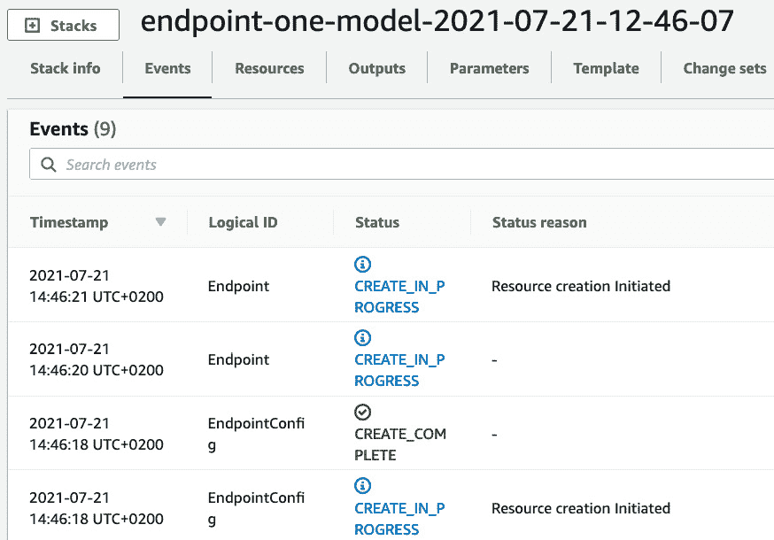

    图 12.1 – 查看堆栈创建

    正如我们预期的那样，我们也可以在 SageMaker Studio 中看到端点，如下图所示：

    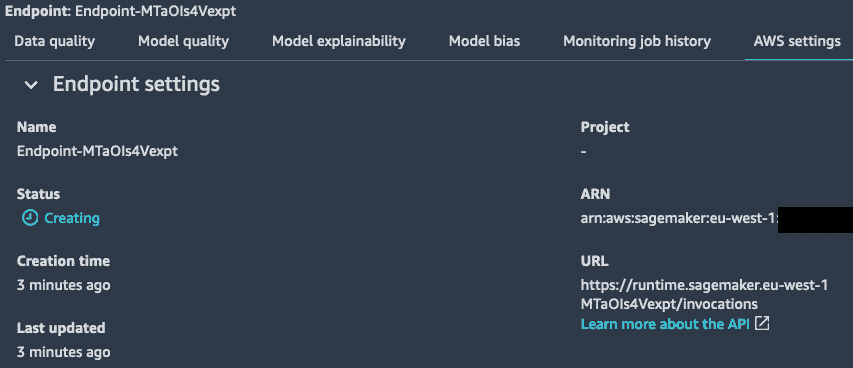

    图 12.2 – 查看端点创建

1.  一旦堆栈创建完成，我们可以使用其输出查找端点的名称：

    ```py
    response = cf.describe_stacks(StackName=stack_name)
    print(response['Stacks'][0]['StackStatus'])
    for o in response['Stacks'][0]['Outputs']:
        if o['OutputKey']=='EndpointName':
             endpoint_name = o['OutputValue']
    print(endpoint_name)
    ```

    这将打印出堆栈状态以及 CloudFormation 自动生成的端点名称：

    **CREATE_COMPLETE**

    **Endpoint-MTaOIs4Vexpt**

1.  我们可以像往常一样测试端点。然后，我们可以删除堆栈及其资源：

    ```py
    cf.delete_stack(StackName=stack_name)
    ```

然而，让我们暂时不要删除堆栈。相反，我们将使用更改集来更新它。

## 使用更改集修改堆栈

在这里，我们将更新支撑端点的实例数量：

1.  我们使用相同的模板和参数创建一个新的更改集，唯一不同的是 `InstanceCount`，我们将其设置为 `2`：

    ```py
    response = cf.create_change_set(
        StackName=stack_name,
        ChangeSetName='add-instance',
        UsePreviousTemplate=True,
        Parameters=[
          { "ParameterKey":"InstanceCount", 
            "ParameterValue": "2" },
          { "ParameterKey":"ModelName",
            "UsePreviousValue": True },
          { "ParameterKey":"ContainerImage",
            "UsePreviousValue": True },
          { "ParameterKey":"ModelDataUrl",
            "UsePreviousValue": True },
          { "ParameterKey":"RoleArn",
            "UsePreviousValue": True }
        ]
    )
    ```

1.  我们可以在 CloudFormation 控制台看到更改集的详细信息，如下图所示。我们也可以使用 `describe_change_set()` API：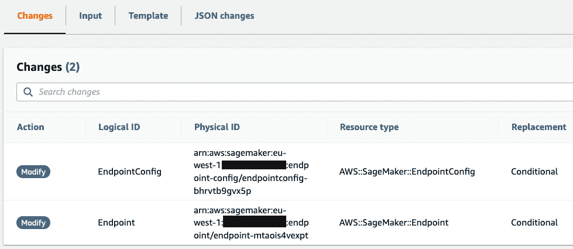

    图 12.3 – 查看更改集

    这告诉我们端点配置和端点需要被修改，甚至可能被替换。正如我们从*第十一章*《部署机器学习模型》所知，一个新的端点将会创建，并以非破坏性方式应用于现有的端点。

    注意

    在使用 CloudFormation 时，了解资源的 **替换策略**至关重要。每种资源类型的文档中都有详细信息。

1.  通过点击 `execute_change_set()` API。正如预期的那样，端点立即更新，如下图所示：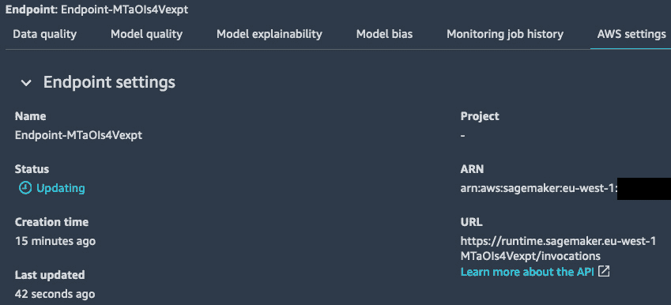

    图 12.4 – 更新端点

1.  更新完成后，我们可以在 CloudFormation 控制台中看到事件序列，如下图所示。已创建并应用了新的端点配置，之前的端点配置已被删除：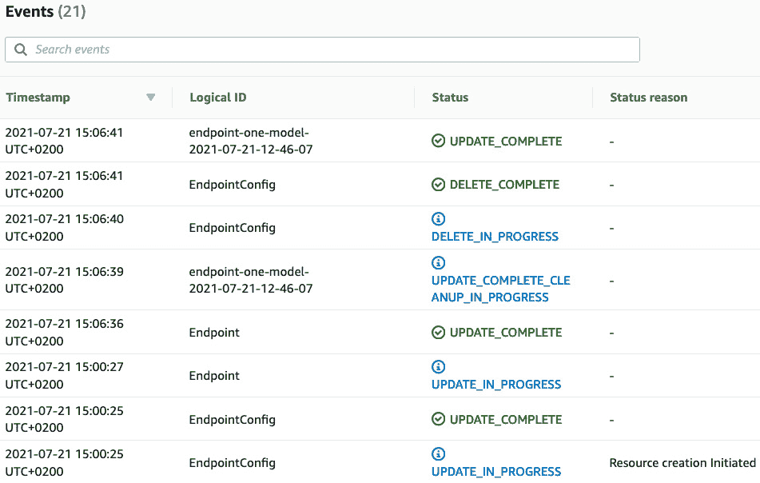

    图 12.5 – 更新堆栈

1.  我们可以检查端点现在由两个实例支持：

    ```py
    r = sm.describe_endpoint(EndpointName=endpoint_name)
    print r(['ProductionVariants'][0]
            ['CurrentInstanceCount'])
    ```

    这会打印出支持生产变种的实例数量：

    ```py
    2
    ```

让我们继续处理变更集，并向端点添加第二个生产变种。

## 向端点添加第二个生产变种

我们的初始模板只定义了一个生产变种。我们将更新它并添加另一个变种（`endpoint-two-models.yml`）：

1.  在 `Parameters` 部分，我们为第二个模型添加了条目：

    ```py
        ModelName2:
           Description: Second model name
           Type: String
        ModelDataUrl2:
           Description: Location of second model artifact
           Type: String
        VariantWeight2:
           Description: Weight of second model
           Type: String
        Default: 0.0
    ```

1.  我们在 `Resources` 部分做同样的事情：

    ```py
        Model2:
           Type: "AWS::SageMaker::Model"
           Properties:
               Containers:
                   - 
                       Image: !Ref ContainerImage
                       ModelDataUrl: !Ref ModelDataUrl2
           ExecutionRoleArn: !Ref RoleArn
           ModelName: !Ref ModelName2
    ```

1.  返回我们的笔记本，我们获取到另一个训练任务的信息。然后我们创建一个变更集，读取更新后的模板并传递所有必需的参数：

    ```py
    training_job_2 = 'tensorflow-training-2020-06-08-07-32-18-734'
    job_2=sm.describe_training_job(
          TrainingJobName=training_job_2)
    model_data_url_2=
          job_2['ModelArtifacts']['S3ModelArtifacts']
    with open('endpoint-two-models.yml', 'r') as f:
        response = cf.create_change_set(
            StackName=stack_name,
            ChangeSetName='add-model',
            TemplateBody=f.read(),
            Parameters=[
                 { "ParameterKey":"ModelName",      
                   "UsePreviousValue": True },
                 { "ParameterKey":"ModelDataUrl",   
                  "UsePreviousValue": True },
                { "ParameterKey":"ContainerImage", 
                  "UsePreviousValue": True },
                { "ParameterKey":"RoleArn",        
                  "UsePreviousValue": True }, 
                { "ParameterKey":"ModelName2",     
                  "ParameterValue": training_job_2+'-
                                    '+timestamp},
                { "ParameterKey":"ModelDataUrl2",  
                   "ParameterValue": model_data_url_2 }
            ]
        )
    ```

1.  查看 CloudFormation 控制台，我们可以看到由变更集引起的变化。创建一个新模型并修改端点配置和端点：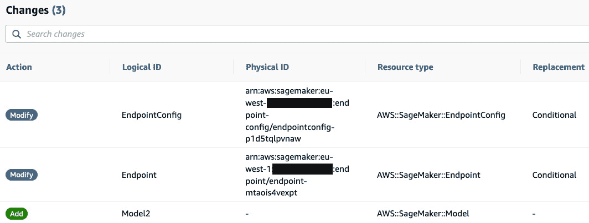

    图 12.6 – 查看变更集

1.  我们执行变更集。完成后，我们看到端点现在支持两个生产变种。注意，实例数量恢复到初始值，因为我们在更新的模板中将其定义为 `1`：

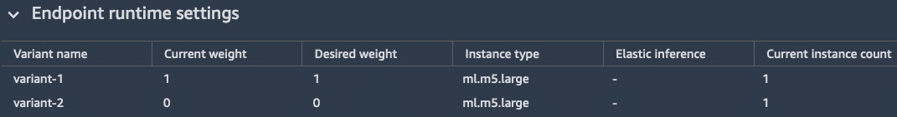

图 12.7 – 查看生产变种

新的生产变种的权重为 `0`，因此不会用于预测。让我们看看如何使用 **金丝雀部署**逐步引入它。

## 实现金丝雀部署

金丝雀部署是一种流行的渐进式应用部署技术（[`martinfowler.com/bliki/CanaryRelease.html`](https://martinfowler.com/bliki/CanaryRelease.html)），也可用于机器学习模型。

简单来说，我们将通过一系列堆栈更新，逐步增加第二个生产变体的权重，每次增加 10%，直到它完全替代第一个生产变体。我们还将创建一个 CloudWatch 警报，监控第二个生产变体的延迟——如果警报被触发，变更集将被回滚：

1.  我们创建了一个 CloudWatch 警报，监控第二个生产变体的 60 秒平均延迟。我们将阈值设置为 500 毫秒：

    ```py
    cw = boto3.client('cloudwatch')
    alarm_name = 'My_endpoint_latency'
    response = cw.put_metric_alarm(
        AlarmName=alarm_name,
        ComparisonOperator='GreaterThanThreshold',
        EvaluationPeriods=1,
        MetricName='ModelLatency',
        Namespace='AWS/SageMaker',
        Period=60,
        Statistic='Average',
        Threshold=500000.0,
        AlarmDescription=
            '1-minute average latency exceeds 500ms',
        Dimensions=[
            { 'Name': 'EndpointName', 
              'Value': endpoint_name },
            { 'Name': 'VariantName', 
              'Value': 'variant-2' }
        ],
        Unit='Microseconds'
    )
    ```

1.  我们找到警报的 ARN：

    ```py
    response = cw.describe_alarms(AlarmNames=[alarm_name])
    for a in response['MetricAlarms']:
        if a['AlarmName'] == alarm_name:
            alarm_arn = a['AlarmArn']
    ```

1.  然后，我们循环遍历权重并更新堆栈。在这里不需要更改集，因为我们清楚地知道从资源的角度会发生什么。我们将 CloudWatch 警报设置为**回滚触发器**，每次更新后给它五分钟的时间触发，然后再进行下一步：

    ```py
    for w in list(range(10,110,10)):
        response = cf.update_stack(
            StackName=stack_name,
            UsePreviousTemplate=True,
            Parameters=[
                { "ParameterKey":"ModelName",      
                  "UsePreviousValue": True },
                { "ParameterKey":"ModelDataUrl",
                  "UsePreviousValue": True },
                { "ParameterKey":"ContainerImage", 
                  "UsePreviousValue": True },
                { "ParameterKey":"RoleArn",   
                  "UsePreviousValue": True }, 
                { "ParameterKey":"ModelName2",
                  "UsePreviousValue": True },
                { "ParameterKey":"ModelDataUrl2",
                  "UsePreviousValue": True },
                { "ParameterKey":"VariantWeight",
                  "ParameterValue": str(100-w) },
                { "ParameterKey":"VariantWeight2", 
                  "ParameterValue": str(w) }
            ],
            RollbackConfiguration={
                'RollbackTriggers': [
                   { 'Arn': alarm_arn,: 
                     'AWS::CloudWatch::Alarm' }
                ],
                'MonitoringTimeInMinutes': 5
            }
        )
        waiter = cf.get_waiter('stack_update_complete')
        waiter.wait(StackName=stack_name)
        print("Sending %d% of traffic to new model" % w)
    ```

就这些。很酷，不是吗？

这个单元格会运行几个小时，所以不要停止它。在另一个笔记本中，下一步是开始向端点发送一些流量。为了简洁起见，我不会包括代码，它与我们在*第七章*《使用内置框架扩展机器学习服务》中使用的代码相同。你可以在本书的 GitHub 仓库中找到该笔记本（`Chapter12/cloudformation/Predict Fashion MNIST images.ipynb`）。

现在，我们只需要坐下来，喝杯茶，享受模型正在安全、自动地部署的事实。由于端点更新是无缝的，客户端应用程序不会察觉任何变化。

几个小时后，部署完成。下一张截图显示了两种变体随时间的调用情况。正如我们所见，流量逐渐从第一个变体转移到第二个变体：

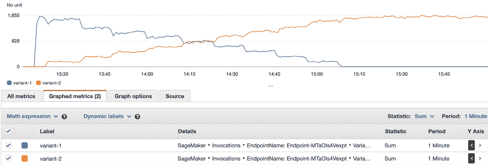

图 12.8 – 监控金丝雀部署

延迟保持在我们 500 毫秒的限制之下，警报没有被触发，正如下一张截图所示：

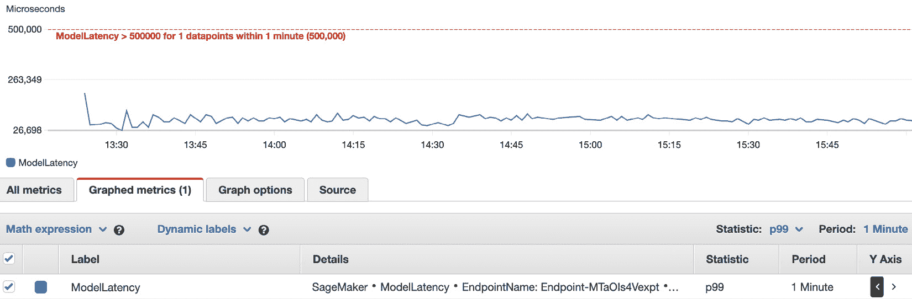

图 12.9 – 查看 CloudWatch 警报

这个示例可以作为你自己部署的起点。例如，你可以添加一个监控`4xx`或`5xx` HTTP 错误的警报。你还可以直接监控受预测延迟和准确性影响的业务指标，如点击率、转化率等。一个有用的补充是添加警报通知（电子邮件、短信，甚至 Lambda 函数），以便在模型部署失败时触发下游操作。可能性是无限的！

完成后，*别忘了删除堆栈*，可以在 CloudFormation 控制台中删除，也可以使用`delete_stack()`API。这样会自动清理堆栈创建的所有 AWS 资源。

**蓝绿部署**是另一种流行的技术。让我们看看如何在 SageMaker 上实现它。

## 实现蓝绿部署

蓝绿部署需要两个生产环境（[`martinfowler.com/bliki/BlueGreenDeployment.html`](https://martinfowler.com/bliki/BlueGreenDeployment.html)）：

+   运行版本 `n` 的实时生产环境（`blue`）

+   运行版本 `n+1` 的这个环境的副本（`green`）

我们来看两个可能的场景，这些场景可以通过我们为金丝雀发布所使用的相同 API 来实现。

### 使用单一端点实现蓝绿部署

从一个运行当前版本模型的现有端点开始，我们将执行以下步骤：

1.  创建一个包含两个生产版本的新端点配置：一个用于当前模型，一个用于新模型。初始权重分别设置为 `1` 和 `0`。

1.  将其应用到端点。

1.  在新生产版本上运行测试，使用 `invoke_endpoint()` 中的 `TargetVariant` 参数显式选择它。

1.  当测试通过后，更新权重为 `0` 和 `1`。这将无缝地将流量切换到新模型。如果出现问题，可以将权重还原为 `1` 和 `0`。

1.  部署完成后，更新端点以删除第一个生产版本。

这是一个简单而可靠的解决方案。然而，更新端点需要几分钟时间，这使得整个过程不如预期那样快速。让我们看看如何通过使用两个端点来解决这个问题。

### 使用两个端点实现蓝绿部署

从一个运行当前版本模型的现有端点开始，我们将实施以下步骤：

1.  创建一个运行新版本模型的第二个端点。

1.  在这个新端点上运行测试。

1.  当测试通过后，将所有流量切换到新端点。可以通过不同方式实现此操作；例如，更新业务应用中的参数，或更新私有 DNS 条目。如果出现问题，可以恢复到先前的设置。

1.  部署完成后，删除旧的端点。

这个设置稍微复杂一些，但它让你能够即时从一个模型版本切换到下一个，无论是部署还是回滚。

CloudFormation 是一个出色的自动化工具，任何学习它的时间都会得到回报。然而，一些 AWS 用户更喜欢编写代码而非编写模板，这就是我们引入 CDK 的原因。

# 使用 AWS CDK 自动化

AWS CDK 是一个多语言的 SDK，让你编写代码来定义 AWS 基础设施（[`github.com/aws/aws-cdk`](https://github.com/aws/aws-cdk)）。使用 CDK CLI，你可以在幕后使用 CloudFormation 来配置这些基础设施。

## 安装 CDK

CDK 是原生实现的，`npm` 工具需要安装在你的机器上（[`www.npmjs.com/get-npm`](https://www.npmjs.com/get-npm)）。

安装 CDK 过程就这么简单：

```py
$ npm i -g aws-cdk
$ cdk --version
1.114.0 (build 7e41b6b)
```

我们创建一个 CDK 应用并部署一个端点。

## 创建一个 CDK 应用

我们将部署与 CloudFormation 一起部署的相同模型。我将使用 Python，你也可以使用**JavaScript**、**TypeScript**、**Java**和**.NET**。API 文档可以在[`docs.aws.amazon.com/cdk/api/latest/python/`](https://docs.aws.amazon.com/cdk/api/latest/python/)找到：

1.  首先，我们创建一个名为`endpoint`的 Python 应用程序：

    ```py
    $ mkdir cdk
    $ cd cdk
    $ cdk init --language python --app endpoint
    ```

1.  这会自动创建一个虚拟环境，我们需要激活它：

    ```py
    $ source .venv/bin/activate
    ```

1.  这还会为我们的 CDK 代码创建一个默认的`app.py`文件，一个用于应用配置的`cdk.json`文件，以及一个用于安装依赖的`requirements.txt`文件。相反，我们将使用 GitHub 仓库中现有的文件：

1.  在`requirements.txt`文件中，我们安装 CDK 的 S3 和 SageMaker 包。每个服务需要不同的包。例如，我们需要为 S3 添加`aws_cdk.aws_s3`：

    ```py
    -e .
    aws_cdk.aws_s3
    aws_cdk.aws_sagemaker
    ```

1.  然后，我们像往常一样安装依赖：

    ```py
    $ pip install -r requirements.txt
    ```

1.  在`cdk.json`文件中，我们存储应用程序的上下文。也就是可以被应用程序读取的键值对，用于配置([`docs.aws.amazon.com/cdk/latest/guide/context.html`](https://docs.aws.amazon.com/cdk/latest/guide/context.html))：

    ```py
    {
      "app": "python3 app.py",
      "context": {
        "role_arn": "arn:aws:iam::123456789012:role/Sagemaker-fullaccess"
        "model_name": "tf2-fmnist",
        "epc_name": "tf2-fmnist-epc",
        "ep_name": "tf2-fmnist-ep",
        "image": "763104351884.dkr.ecr.us-east-1.amazonaws.com/tensorflow-inference:2.1-cpu",
        "model_data_url": "s3://sagemaker-us-east-1-123456789012/keras2-fashion-mnist/output/tensorflow-training-2020-06-08-07-46-04-367/output/model.tar.gz"
        "instance_type": "ml.t2.xlarge",
        "instance_count": 1
      }
    }
    ```

    这是将值传递给应用程序的首选方法。你应该使用版本控制来管理此文件，以便追踪堆栈的构建过程。

1.  我们可以使用`cdk context`命令查看我们应用程序的上下文：

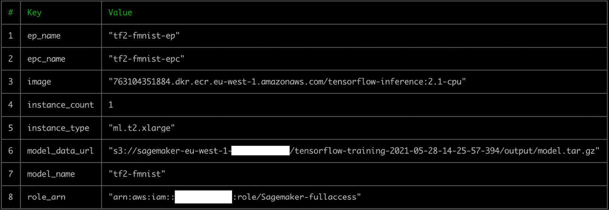

图 12.10 – 查看 CDK 上下文

现在，我们需要编写实际的应用程序。

## 编写 CDK 应用程序

所有代码都放在`app.py`文件中，我们将在接下来的步骤中实现：

1.  我们导入所需的包：

    ```py
    import time
    from aws_cdk import (
        aws_sagemaker as sagemaker,
        core
    )
    ```

1.  我们扩展`core.Stack`类来创建我们自己的堆栈：

    ```py
    class SagemakerEndpoint(core.Stack):
     def __init__(self, app: core.App, id: str, **kwargs) -> None:
         timestamp = 
             '-'+time.strftime(
                     "%Y-%m-%d-%H-%M-%S",time.gmtime())
         super().__init__(app, id, **kwargs)
    ```

1.  我们添加一个`CfnModel`对象，读取适当的上下文值：

    ```py
         model = sagemaker.CfnModel(
             scope = self,
             id="my_model",
             execution_role_arn= 
                 self.node.try_get_context("role_arn"),
             containers=[{ 
               "image": 
                 self.node.try_get_context("image"),
               "modelDataUrl":                  
                 self.node.try_get_context("model_data_url")
             }],           
             model_name= self.node.try_get_context(
                         "model_name")+timestamp
         )
    ```

1.  我们添加一个`CfnEndpointConfig`对象，使用内置的`get_att()`函数将其与模型关联。这会创建一个依赖关系，CloudFormation 将用来按正确的顺序构建资源：

    ```py
         epc = sagemaker.CfnEndpointConfig(
              scope=self,
              id="my_epc",
              production_variants=[{
                  "modelName": core.Fn.get_att(
                                   model.logical_id, 
                                   'ModelName'
                               ).to_string(),
                  "variantName": "variant-1",
                  "initialVariantWeight": 1.0,
                  "initialInstanceCount": 1,
                  "instanceType": 
                      self.node.try_get_context(
                      "instance_type")
              }],
              endpoint_config_name=                   
                      self.node.try_get_context("epc_name")
                      +timestamp
        )
    ```

1.  我们添加一个`CfnEndpoint`对象，使用内置的`get_att()`函数将其与端点配置关联起来：

    ```py
         ep = sagemaker.CfnEndpoint(
             scope=self,
             id="my_ep",
             endpoint_config_name=
                 core.Fn.get_att(
                     epc.logical_id,
                     'EndpointConfigName'
                 ).to_string(),
             endpoint_name=
                 self.node.try_get_context("ep_name")
                 +timestamp
         )
    ```

1.  最后，我们实例化应用程序：

    ```py
    app = core.App()
    SagemakerEndpoint(
        app, 
        "SagemakerEndpoint", 
        env={'region': 'eu-west-1'}
    )
    app.synth()
    ```

我们的代码完成了！

## 部署 CDK 应用程序

我们现在可以部署端点：

1.  我们可以列出可用的堆栈：

    ```py
    $ cdk list
    SagemakerEndpointEU
    ```

1.  我们还可以看到实际的 CloudFormation 模板。它应该与我们在前一节中编写的模板非常相似：

    ```py
    $ cdk synth SagemakerEndpointEU
    ```

1.  部署堆栈同样简单，如下图所示：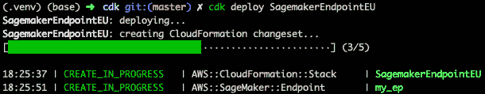

    图 12.11 – 部署端点

1.  查看 CloudFormation，我们看到堆栈是使用变更集创建的。几分钟后，端点已投入使用。

1.  编辑`app.py`时，我们将初始实例数设置为`2`。然后我们要求 CDK 部署堆栈，但不执行变更集，如下图所示：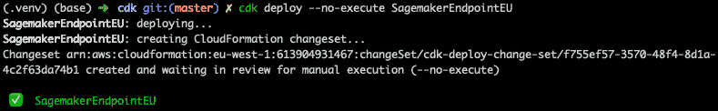

    图 12.12 – 创建变更集

1.  如果我们对变更集感到满意，可以在 CloudFormation 控制台中执行它，或者再次运行之前的命令，去掉 `--no-execute`。如预期所示，且如下图所示，端点已更新：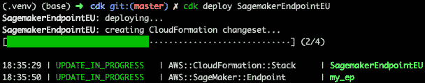

    图 12.13 – 更新端点

1.  当我们完成时，可以销毁堆栈：

    ```py
    $ cdk destroy SagemakerEndpointEU
    ```

如您所见，CDK 是一个有趣的替代方案，能够直接编写模板，同时仍然受益于 CloudFormation 的严格性和健壮性。

我们尚未完成的一件事是实现一个从训练到部署的端到端自动化工作流。我们将通过 AWS Step Functions 来完成这个任务。

# 使用 AWS Step Functions 构建端到端工作流

**AWS Step Functions** 让您基于 **状态机** 定义和运行工作流 ([`aws.amazon.com/step-functions/`](https://aws.amazon.com/step-functions/))。状态机是步骤的组合，这些步骤可以是顺序的、并行的或条件的。每个步骤接收来自前一个步骤的输入，执行操作，然后将输出传递给下一个步骤。Step Functions 与许多 AWS 服务集成，如 Amazon SageMaker、**AWS** **Lambda**、容器服务、**Amazon** **DynamoDB**、**Amazon** **EMR**、**AWS** **Glue** 等。

状态机可以使用 JSON 和 **Amazon States Language** 定义，您可以在服务控制台中可视化它们。状态机执行是完全托管的，因此您无需为其运行提供任何基础设施。

对于 SageMaker，Step Functions 提供了一个专门的 Python SDK，奇怪地被命名为 **Data Science SDK** ([`github.com/aws/aws-step-functions-data-science-sdk-python`](https://github.com/aws/aws-step-functions-data-science-sdk-python))。

让我们运行一个示例，自动化训练和部署一个基于 **Boston Housing** 数据集训练的 **scikit-learn** 模型。

## 设置权限

首先，请确保您的用户或笔记本实例的 IAM 角色具有调用 Step Functions API 的权限。如果没有，请将 `AWSStepFunctionsFullAccess` 管理策略添加到该角色中。

然后，我们需要为 Step Functions 创建一个服务角色，允许它代表我们调用 AWS API：

1.  从 IAM 控制台开始 ([`console.aws.amazon.com/iam/home#/roles`](https://console.aws.amazon.com/iam/home#/roles))，我们点击 **创建角色**。

1.  我们选择 **AWS 服务** 和 **Step Functions**。

1.  我们点击接下来的页面，直到可以输入角色名称。我们将其命名为 `StepFunctionsWorkflowExecutionRole`，然后点击 **创建角色**。

1.  选择该角色后，我们点击它的 **权限** 标签页，再点击 **添加内联策略**。

1.  选择 JSON 标签，我们用 `Chapter12/step_functions/service-role-policy.json` 文件的内容替换空的策略，然后点击 **查看策略**。

1.  我们将策略命名为 `StepFunctionsWorkflowExecutionPolicy`，然后点击 **创建策略**。

1.  我们记下角色的 ARN，然后关闭 IAM 控制台。

设置现在已经完成。现在，让我们创建一个工作流。

## 实现我们的第一个工作流

在这个工作流中，我们将按以下步骤顺序进行：训练模型、创建模型、使用模型进行批量转换、创建端点配置，并将模型部署到端点：

1.  我们将训练集上传到 S3，以及一个去除目标属性的测试集。我们将使用后者进行批量转换：

    ```py
    import sagemaker
    import pandas as pd
    sess = sagemaker.Session()
    bucket = sess.default_bucket()   
    prefix = 'sklearn-boston-housing-stepfunc'
    training_data = sess.upload_data(
        path='housing.csv', 
        key_prefix=prefix + "/training")
    data = pd.read_csv('housing.csv')
    data.drop(['medv'], axis=1, inplace=True)
    data.to_csv('test.csv', index=False, header=False)
    batch_data = sess.upload_data(
        path='test.csv', 
        key_prefix=prefix + "/batch")
    ```

1.  我们像往常一样配置估算器：

    ```py
    from sagemaker.sklearn import SKLearn
    output = 's3://{}/{}/output/'.format(bucket,prefix)
    sk = SKLearn(
        entry_point='sklearn-boston-housing.py',
        role=sagemaker.get_execution_role(),
        framework_version='0.23-1',
        train_instance_count=1,
        train_instance_type='ml.m5.large',
        output_path=output,
        hyperparameters={
            'normalize': True,
            'test-size': 0.1
        }
    )
    ```

1.  我们还定义了用于批量转换的 transformer：

    ```py
    sk_transformer = sk.transformer(
        instance_count=1,
        instance_type='ml.m5.large')
    ```

1.  我们导入工作流所需的 Step Functions 对象。您可以在[`aws-step-functions-data-science-sdk.readthedocs.io/en/latest/`](https://aws-step-functions-data-science-sdk.readthedocs.io/en/latest/)找到 API 文档：

    ```py
    import stepfunctions
    from stepfunctions import steps
    from stepfunctions.steps import TrainingStep, ModelStep, TransformStep
    from stepfunctions.inputs import ExecutionInput
    from stepfunctions.workflow import Workflow
    ```

1.  我们定义工作流的输入。我们将传递给它一个训练任务名称、一个模型名称和一个端点名称：

    ```py
    execution_input = ExecutionInput(schema={
        'JobName': str,
        'ModelName': str,
        'EndpointName': str}
    )
    ```

1.  工作流的第一步是训练步骤。我们将其传递估算器、数据集在 S3 中的位置以及一个训练任务名称：

    ```py
    from sagemaker.inputs import TrainingInput
    training_step = TrainingStep(
      'Train Scikit-Learn on the Boston Housing dataset',
      estimator=sk,
      data={'training': TrainingInput(
           training_data,content_type='text/csv')},
      job_name=execution_input['JobName']
    )
    ```

1.  下一步是模型创建步骤。我们将其传递已在前一步中训练的模型位置和模型名称：

    ```py
    model_step = ModelStep(
        'Create the model in SageMaker',
        model=training_step.get_expected_model(),
        model_name=execution_input['ModelName']
    )
    ```

1.  下一步是在测试数据集上运行批量转换。我们传递`transformer`对象、测试数据集在 S3 中的位置及其内容类型：

    ```py
    transform_step = TransformStep(
        'Transform the dataset in batch mode',
        transformer=sk_transformer,
        job_name=execution_input['JobName'],    
        model_name=execution_input['ModelName'],
        data=batch_data,
        content_type='text/csv'
    )
    ```

1.  下一步是创建端点配置：

    ```py
    endpoint_config_step = EndpointConfigStep(
        "Create an endpoint configuration for the model",
        endpoint_config_name=execution_input['ModelName'],
        model_name=execution_input['ModelName'],
        initial_instance_count=1,
        instance_type='ml.m5.large'
    )
    ```

1.  最后一步是创建端点：

    ```py
    endpoint_step = EndpointStep(
        "Create an endpoint hosting the model",
        endpoint_name=execution_input['EndpointName'],
        endpoint_config_name=execution_input['ModelName']
    )
    ```

1.  现在，所有步骤都已经定义，我们按顺序将它们链起来：

    ```py
    workflow_definition = Chain([
        training_step,
        model_step,
        transform_step,
        endpoint_config_step,
        endpoint_step
    ])
    ```

1.  我们现在构建我们的工作流，使用工作流定义和输入定义：

    ```py
    import time
    timestamp = time.strftime("%Y-%m-%d-%H-%M-%S", time.gmtime())
    workflow_execution_role = "arn:aws:iam::0123456789012:role/
    StepFunctionsWorkflowExecutionRole"
    workflow = Workflow(
        name='sklearn-boston-housing-workflow1-{}'
             .format(timestamp),
        definition=workflow_definition,
        role=workflow_execution_role,
        execution_input=execution_input
    )
    ```

1.  我们可以可视化状态机，这是检查我们是否按预期构建它的一个简便方法，如下图所示：

    ```py
    workflow.render_graph(portrait=True)
    ```

    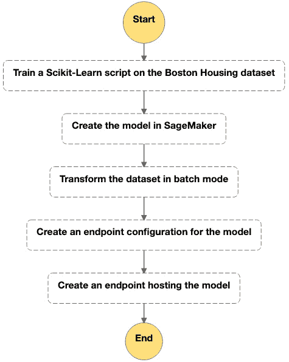

    图 12.14 – 查看状态机

1.  我们创建工作流：

    ```py
    workflow.create()
    ```

1.  它可以在 Step Functions 控制台中查看，如下图所示。我们可以看到它的图形表示以及基于 Amazon States Language 的 JSON 定义。如果需要，我们也可以编辑工作流：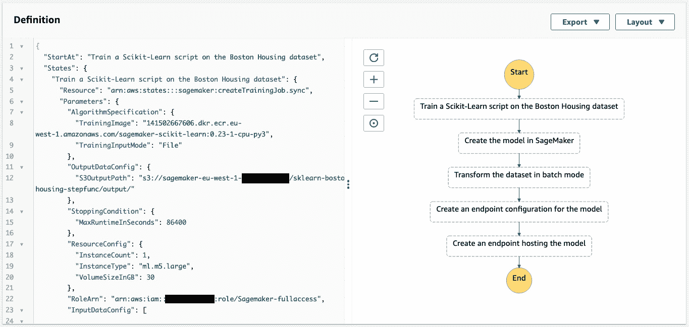

    图 12.15 – 在控制台中查看状态机

1.  我们运行工作流：

    ```py
    execution = workflow.execute(
     inputs={
       'JobName': 'sklearn-boston-housing-{}'
                  .format(timestamp),
       'ModelName': 'sklearn-boston-housing-{}'
                    .format(timestamp),
       'EndpointName': 'sklearn-boston-housing-{}'
                       .format(timestamp)
     }
    )
    ```

1.  我们可以通过`render_progress()`和`list_events()`API 跟踪其进度。我们也可以在控制台中看到它，如下图所示。请注意，我们还可以看到每个步骤的输入和输出，这对故障排除问题非常有帮助：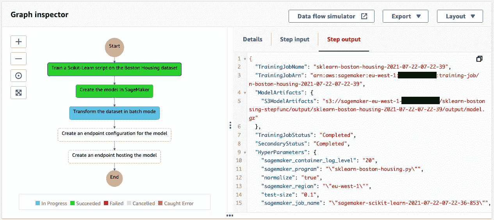

    图 12.16 – 运行状态机

1.  当工作流完成时，您可以像往常一样测试端点。*完成后别忘了在 SageMaker 控制台删除它*。

这个例子展示了使用这个 SDK 构建 SageMaker 工作流是多么简单。不过，我们可以通过让批量转换和端点创建并行运行来进一步改进它。

## 向工作流添加并行执行

下一张截图展示了我们将要构建的工作流。这些步骤本身完全相同，我们只是修改了它们的连接方式：

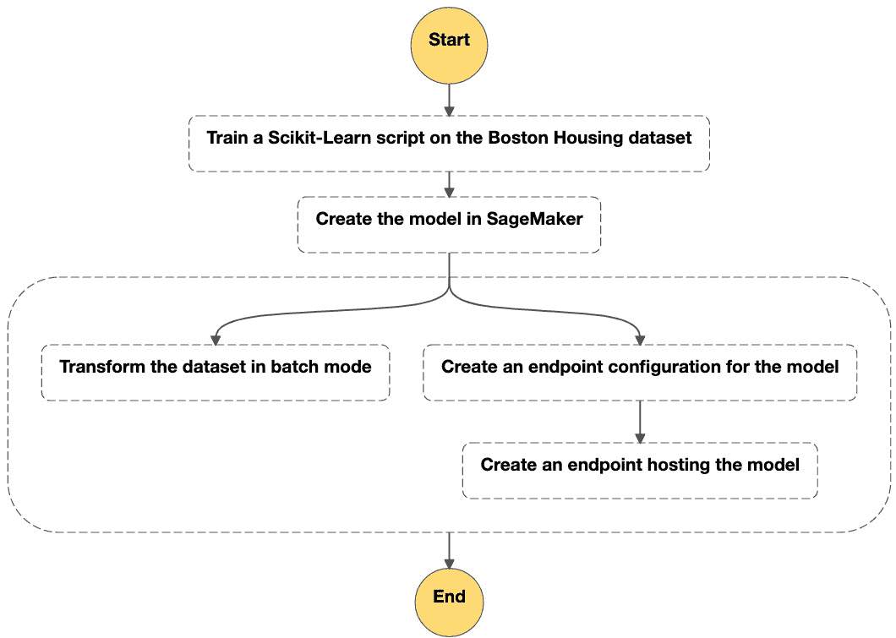

图 12.17 – 查看并行状态机

我们将按照以下步骤开始：

1.  我们的工作流有两个分支—一个用于批量转换，另一个用于端点：

    ```py
    batch_branch = Chain([
      transform_step
    ])
    endpoint_branch = Chain([
      endpoint_config_step,
      endpoint_step
    ]) 
    ```

1.  我们创建一个 `Parallel` 步骤，以便允许这两个分支并行执行：

    ```py
    parallel_step = Parallel('Parallel execution')
    parallel_step.add_branch(batch_branch)
    parallel_step.add_branch(endpoint_branch)
    ```

1.  我们将所有内容整合在一起：

    ```py
    workflow_definition = Chain([
        training_step,
        model_step,
        parallel_step
    ])
    ```

就是这样！现在我们可以像在之前的示例中那样创建并运行这个工作流。

查看 Step Functions 控制台，我们可以看到工作流确实并行执行了两个分支。不过，存在一个小问题。端点创建步骤显示为已完成，尽管端点仍在创建中。你可以在 SageMaker 控制台中看到该端点的状态为 `Creating`。如果客户端应用程序在工作流完成后立即尝试调用该端点，可能会出现问题。

让我们通过增加一个额外的步骤来改进这个流程，等待端点进入服务状态。我们可以通过 Lambda 函数轻松实现这一点，从而让我们在工作流中的任何位置运行自己的代码。

## 将 Lambda 函数添加到工作流

如果你从未了解过 **AWS** **Lambda** ([`aws.amazon.com/lambda`](https://aws.amazon.com/lambda))，那你就错过了！Lambda 是无服务器架构的核心，在这种架构下，你可以编写并部署在完全托管基础设施上运行的短小函数。这些函数可以由各种 AWS 事件触发，也可以按需调用。

### 设置权限

创建 Lambda 函数很简单。唯一的前提是创建一个 `DescribeEndpoint` API，并且有权限在 CloudWatch 中创建日志。我们将使用 `boto3` API 来实现这一点。你可以在 [`docs.aws.amazon.com/lambda/latest/dg/lambda-permissions.html`](https://docs.aws.amazon.com/lambda/latest/dg/lambda-permissions.html) 查找更多信息：

1.  我们首先为角色定义一个 **信任策略**，允许 Lambda 服务假设该角色：

    ```py
    {
      "Version": "2012-10-17",
      "Statement": [{
        "Effect": "Allow",
        "Principal": {
          "Service": "lambda.amazonaws.com"
        },
        "Action": "sts:AssumeRole"
      }]
    }
    ```

1.  我们创建一个角色并附加信任策略：

    ```py
    iam = boto3.client('iam')
    with open('trust-policy.json') as f:
        policy = f.read()
        role_name = 'lambda-role-sagemaker-describe-endpoint'
    response = iam.create_role(
        RoleName=role_name,
        AssumeRolePolicyDocument=policy,
        Description='Allow function to invoke all SageMaker APIs'
    )
    role_arn = response['Role']['Arn']
    ```

1.  我们定义一个列出允许 API 的策略：

    ```py
    {
      "Version": "2012-10-17",
      "Statement": [
        {
          "Effect": "Allow",
          "Action": "sagemaker:DescribeEndpoint",
          "Resource": "*"
        },
        {
          "Effect": "Allow",
          "Action": [
              "logs:CreateLogGroup",
              "logs:CreateLogStream",
              "logs:PutLogEvents"
          ],
          "Resource": "*"
         }
      ]
    }
    ```

1.  我们创建策略并将其添加到角色中：

    ```py
    with open('policy.json') as f:
        policy = f.read()
    policy_name = 'Sagemaker-describe-endpoint'
    response = iam.create_policy(
        PolicyName=policy_name,
        PolicyDocument=policy,
        Description='Allow the DescribeEndpoint API'
    )
    policy_arn = response['Policy']['Arn']
    response = iam.attach_role_policy(
        RoleName=role_name,
        PolicyArn=policy_arn
    )
    ```

IAM 设置现已完成。

### 编写 Lambda 函数

现在我们可以编写一个简短的 Lambda 函数。它接收一个 JSON 事件作为输入，事件中存储了 `EndpointStep` 步骤所创建的端点的 ARN。它简单地从 ARN 中提取端点名称，创建一个 `boto3` 等待器，并等待直到端点服务就绪。下面的截图展示了 Lambda 控制台中的代码：

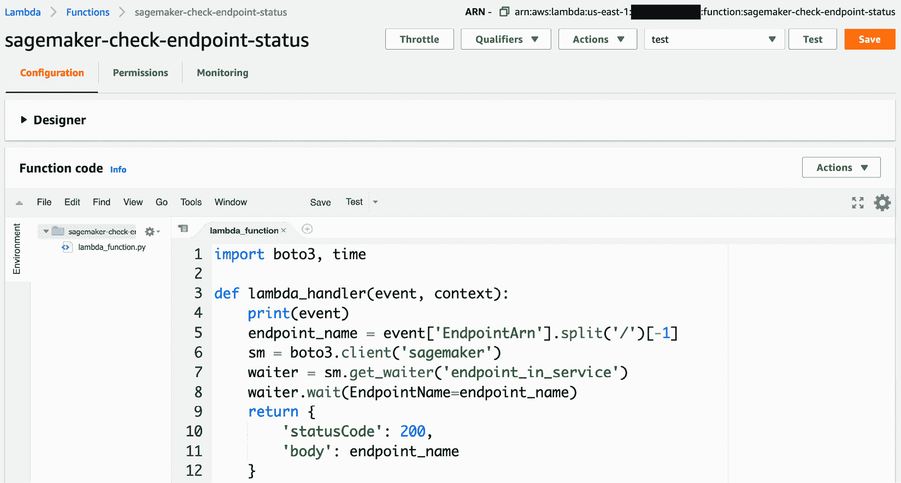

图 12.18 – 我们的 Lambda 函数

让我们部署这个函数：

1.  我们为 Lambda 函数创建一个部署包并将其上传到 S3：

    ```py
    $ zip -9 lambda.zip lambda.py
    $ aws s3 cp lambda.zip s3://my-bucket
    ```

1.  我们创建了一个超时为 15 分钟的函数，这是 Lambda 函数的最大运行时间。端点通常在不到 10 分钟的时间内部署完成，因此这个时间应该足够：

    ```py
    lambda_client = boto3.client('lambda')
    response = lambda_client.create_function(
        FunctionName='sagemaker-wait-for-endpoint',
        Role=role_arn,
        Runtime='python3.6',
        Handler='lambda.lambda_handler',
        Code={
            'S3Bucket': bucket_name,
            'S3Key': 'lambda.zip'
        },
        Description='Wait for endpoint to be in service',
        Timeout=900,
        MemorySize=128
    )
    ```

1.  现在 Lambda 函数已经创建完成，我们可以轻松地将其添加到现有的工作流中。我们定义一个 `LambdaStep` 并将其添加到端点分支。它的有效负载是从 `EndpointStep` 输出中提取的端点 ARN：

    ```py
    lambda_step = LambdaStep(
        'Wait for endpoint to be in service',
        parameters={
            'FunctionName': 'sagemaker-wait-for-endpoint',
            'Payload': {"EndpointArn.$": "$.EndpointArn"}
        },
        timeout_seconds=900
    )
    endpoint_branch = steps.Chain([
        endpoint_config_step,
        endpoint_step,
        lambda_step
    ])
    ```

1.  再次运行工作流，我们在下面的截图中看到，新的步骤接收端点 ARN 作为输入，并等待端点处于服务状态：

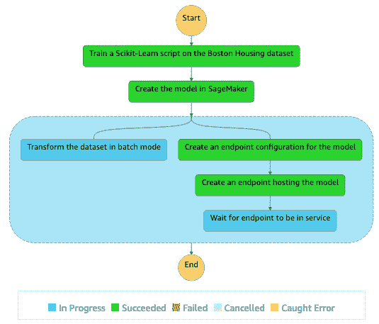

图 12.19 – 使用 Lambda 运行状态机

您还可以通过多种方式将 Lambda 函数与 SageMaker 一起使用。您可以提取训练指标、在端点上预测测试集等。可能性无穷无尽。

现在，让我们使用 Amazon SageMaker Pipelines 自动化端到端工作流。

# 使用 Amazon SageMaker Pipelines 构建端到端工作流

**Amazon SageMaker Pipelines** 允许我们基于 SageMaker 步骤（用于训练、调优、批处理转换和处理脚本）创建和运行端到端的机器学习 **工作流**，使用的 SageMaker API SDK 与我们在 Step Functions 中使用的非常相似。

与 Step Functions 相比，SageMaker Pipelines 增加了以下功能：

+   能够在 SageMaker Studio 中直接编写、运行、可视化和管理工作流，而无需跳转到 AWS 控制台。

+   **模型注册表**，使得管理模型版本、仅部署经过批准的版本以及跟踪 **血统** 更加容易。

+   **MLOps 模板** – 通过 **AWS 服务目录** 发布的一组 CloudFormation 模板，帮助您自动化模型的部署。提供了内置模板，您还可以添加自己的模板。您（或您的运维团队）可以在 [`docs.aws.amazon.com/sagemaker/latest/dg/sagemaker-projects.html`](https://docs.aws.amazon.com/sagemaker/latest/dg/sagemaker-projects.html) 上了解更多信息。

    注意

    SageMaker Pipelines 的一个缺点是缺少与其他 AWS 服务的集成。在撰写本文时，SageMaker Pipelines 仅支持 **SQS**，而 Step Functions 支持许多计算和大数据服务。在 SageMaker Pipelines 中，假设您的训练数据已经处理好，或者您将使用 SageMaker Processing 步骤来处理数据。

现在我们了解了 SageMaker Pipelines，接下来让我们基于 Amazon Reviews 数据集和我们在 *第六章* *训练自然语言处理模型* 和 *第十章* *高级训练技术* 中使用的 BlazingText 算法，运行一个完整的示例，结合到目前为止学到的许多服务。我们的工作流将包含以下步骤：

+   处理步骤，我们使用 **SageMaker Processing** 准备数据集。

+   一个数据摄取步骤，在此步骤中我们将处理过的数据集加载到 **SageMaker Feature Store** 中。

+   一个数据集构建步骤，在此步骤中我们使用 **Amazon Athena** 查询离线存储并将数据集保存到 S3。

+   一个训练步骤，在此步骤中我们在数据集上训练 BlazingText 模型。

+   一个模型创建步骤，在此步骤中我们将训练好的模型保存为 SageMaker 模型。

+   一个模型注册步骤，在此步骤中我们将模型添加到 SageMaker Pipelines 模型注册表中。

在实际操作中，你一开始不需要过于担心自动化问题。你应该首先使用 Jupyter Notebooks 进行实验，并迭代这些步骤。然后，随着项目的成熟，你可以开始自动化每个步骤，最终将它们组装成一个管道。

我的建议是首先自动化每个处理步骤，使用独立的 SageMaker Processing 任务。这不仅在开发阶段非常有用，而且会为完全自动化创建一个简单且逐步的路径。事实上，一旦步骤在 SageMaker Processing 上顺利运行，将它们与 SageMaker Pipelines 结合起来几乎不需要额外的努力。实际上，你可以使用完全相同的 Python 脚本。你只需要用 Pipelines SDK 编写代码。正如你将看到的，它与 Processing SDK 非常相似。

这是我在以下示例中采用的方法。在 GitHub 仓库中，你会找到用于数据处理、数据摄取和数据集构建步骤的 SageMaker Processing 笔记本，以及另一本用于端到端工作流的笔记本。在这里，我们将重点关注后者。让我们开始吧！

## 定义工作流参数

就像 CloudFormation 模板一样，你可以（并且应该）在工作流中定义参数。这样可以更方便地在其他项目中重用它们。参数可以是字符串、整数和浮点数，并可以设置一个可选的默认值。

1.  我们为 AWS 区域以及我们希望用于处理和训练的实例创建参数：

    ```py
    from sagemaker.workflow.parameters import ParameterInteger, ParameterString
    region = ParameterString(
        name='Region',
        default_value='eu-west-1')
    processing_instance_type = ParameterString(
        name='ProcessingInstanceType',
        default_value='ml.m5.4xlarge')
    processing_instance_count = ParameterInteger(
        name='ProcessingInstanceCount',
        default_value=1)
    training_instance_type = ParameterString(
        name='TrainingInstanceType',
        default_value='ml.p3.2xlarge')
    training_instance_count = ParameterInteger(
        name='TrainingInstanceCount',
        default_value=1)
    ```

1.  我们还为输入数据的位置、模型名称以及在模型注册表中设置的模型状态创建了参数（稍后会详细介绍）。

    ```py
    input_data = ParameterString(name='InputData')
    model_name = ParameterString(name='ModelName')
    model_approval_status = ParameterString(
        name='ModelApprovalStatus',
        default_value='PendingManualApproval')
    ```

现在，让我们定义数据处理步骤。

## 使用 SageMaker Processing 处理数据集

我们重用了在 *第六章* 中编写的处理脚本（`preprocessing.py`）。

1.  我们创建一个 `SKLearnProcessor` 对象，并使用我们刚才定义的参数：

    ```py
    from sagemaker.sklearn.processing import SKLearnProcessor
    sklearn_processor = SKLearnProcessor(
        framework_version='0.23-1',
        role=role,
        instance_type=processing_instance_type,
        instance_count=processing_instance_count)
    ```

1.  然后，我们定义数据处理步骤。请记住，它会创建两个输出：一个是 BlazingText 格式，另一个是用于摄取到 SageMaker Feature Store 的格式。如前所述，SageMaker Pipelines 语法与 SageMaker Processing 语法非常相似（输入、输出和参数）。

    ```py
    from sagemaker.workflow.steps import ProcessingStep
    from sagemaker.processing import ProcessingInput, ProcessingOutput
    step_process = ProcessingStep(
        name='process-customer-reviews'
        processor=sklearn_processor,
        inputs=[
            ProcessingInput(source=input_data, 
                destination="/opt/ml/processing/input")],
        outputs=[
            ProcessingOutput(output_name='bt_data',
                source='/opt/ml/processing/output/bt'),
            ProcessingOutput(output_name='fs_data',
                source='/opt/ml/processing/output/fs')],
        code='preprocessing.py',
        job_arguments=[
            '--filename', 
            'amazon_reviews_us_Camera_v1_00.tsv.gz',
            '--library', 
            'spacy']
    )
    ```

现在，让我们定义数据摄取步骤。

## 使用 SageMaker Processing 将数据集摄取到 SageMaker Feature Store 中

我们重用了在 *第十章* 中编写的处理脚本（`ingesting.py`）。

1.  我们首先为特征组定义一个名称：

    ```py
    feature_group_name = 'amazon-reviews-feature-group-' + strftime('%d-%H-%M-%S', gmtime())
    ```

1.  然后，我们定义了一个处理步骤，将数据输入设置为第一个处理作业的输出。为了演示步骤链式处理，我们定义了一个输出，指向由脚本保存的文件，该文件包含特征组的名称：

    ```py
    step_ingest = ProcessingStep(
        name='ingest-customer-reviews',
        processor=sklearn_processor,
        inputs=[
           ProcessingInput(
           source=
            step_process.properties.ProcessingOutputConfig
            .Outputs['fs_data'].S3Output.S3Uri,
           destination="/opt/ml/processing/input")],
        outputs = [
           ProcessingOutput(
           output_name='feature_group_name',
           source='/opt/ml/processing/output/')],
        code='ingesting.py',
        job_arguments=[
           '--region', region,
           '--bucket', bucket,
           '--role', role,
           '--feature-group-name', feature_group_name,
           '--max-workers', '32']
    )
    ```

现在，让我们处理数据集构建步骤。

## 使用 Amazon Athena 和 SageMaker 处理构建数据集

我们重用了在 *第十章* 中编写的处理脚本 (`querying.py`)。

我们将输入设置为摄取步骤的输出，以便检索特征组的名称。我们还为训练集和验证集数据集定义了两个输出：

```py
step_build_dataset = ProcessingStep(
    name='build-dataset',
    processor=sklearn_processor,
    inputs=[
      ProcessingInput(
        source=
          step_ingest.properties.ProcessingOutputConfig
          .Outputs['feature_group_name'].S3Output.S3Uri,
        destination='/opt/ml/processing/input')],
    outputs=[
      ProcessingOutput(
        output_name='training',
        source='/opt/ml/processing/output/training'),
      ProcessingOutput(
        output_name='validation',               
        source='/opt/ml/processing/output/validation')],
      code='querying.py',
      job_arguments=[
        '--region', region,
        '--bucket', bucket,]
)
```

现在，让我们继续进行训练步骤。

## 训练模型

没有意外：

1.  我们为这个任务定义了一个 `Estimator` 模块：

    ```py
    container = image_uris.retrieve(
        'blazingtext', 
        str(region))     # region is a ParameterString
    prefix = 'blazing-text-amazon-reviews'
    s3_output = 's3://{}/{}/output/'.format(bucket, prefix)
    bt = Estimator(container,
                   role,
                   instance_count=training_instance_count, 
                   instance_type=training_instance_type,
                   output_path=s3_output)
    bt.set_hyperparameters(mode='supervised')
    ```

1.  我们接着定义训练步骤，将训练集和验证集数据集作为输入：

    ```py
    from sagemaker.workflow.steps import TrainingStep
    from sagemaker.inputs import TrainingInput
    step_train = TrainingStep(
        name='train-blazing-text',
        estimator=bt,
        inputs={
          'train': TrainingInput(s3_data=
    step_build_dataset.properties.ProcessingOutputConfig
    .Outputs['training'].S3Output.S3Uri,
          content_type='text/plain'),
           'validation': TrainingInput(s3_data=
    step_build_dataset.properties.ProcessingOutputConfig
    .Outputs['validation'].S3Output.S3Uri,
          content_type='text/plain')
        }
    )
    ```

现在，让我们处理模型创建和模型注册步骤（管道中的最后几个步骤）。

## 在 SageMaker Pipelines 中创建并注册模型

一旦模型训练完成，我们需要将其创建为 SageMaker 模型并在模型注册表中注册它。

1.  我们创建模型，传递训练容器和模型工件的位置：

    ```py
    from sagemaker.model import Model
    from sagemaker.workflow.steps import CreateModelStep
    model = Model(
        image_uri=container,
        model_data=step_train.properties
                   .ModelArtifacts.S3ModelArtifacts,
        sagemaker_session=session,
        name=model_name,   # workflow parameter
        role=role)
    step_create_model = CreateModelStep(
        name='create-model',
        model=model,
        inputs=None)
    ```

1.  然后，我们将模型注册到模型注册表中，传递允许的实例类型列表以供部署，以及审批状态。我们将其关联到一个模型包组，该组将保存此模型以及我们未来训练的更多版本：

    ```py
    from sagemaker.workflow.step_collections import RegisterModel
    step_register = RegisterModel(
        name='register-model',
        estimator=bt,
        model_data=step_train.properties.ModelArtifacts
                   .S3ModelArtifacts,
        content_types=['text/plain'],
        response_types=['application/json'],
        inference_instances=['ml.t2.medium'],
        transform_instances=['ml.m5.xlarge'],
        model_package_group_name='blazing-text-on-amazon-customer-reviews-package',
        approval_status=model_approval_status
    )
    ```

所有步骤现在都已定义，让我们将它们组合成一个管道。

## 创建管道

我们只需将所有步骤和它们的参数组合在一起。然后，我们创建管道（如果之前已存在，则更新它）：

```py
from sagemaker.workflow.pipeline import Pipeline
pipeline_name = 'blazing-text-amazon-customer-reviews'
pipeline = Pipeline(
    name=pipeline_name,
    parameters=[region, processing_instance_type, processing_instance_count, training_instance_type, training_instance_count, model_approval_status, input_data, model_name],
    steps=[step_process, step_ingest, step_build_dataset, step_train, step_create_model, step_register])
pipeline.upsert(role_arn=role)
```

一切准备就绪。让我们运行管道吧！

## 运行管道

只需一行代码即可启动管道执行：

1.  我们为数据位置和模型名称参数分配值（其他参数使用默认值）：

    ```py
    execution = pipeline.start(
        parameters=dict(
            InputData=input_data_uri,
            ModelName='blazing-text-amazon-reviews')
    )
    ```

1.  在 SageMaker Studio 中，我们进入 **SageMaker 资源** / **管道**，并看到管道正在执行，如下图所示：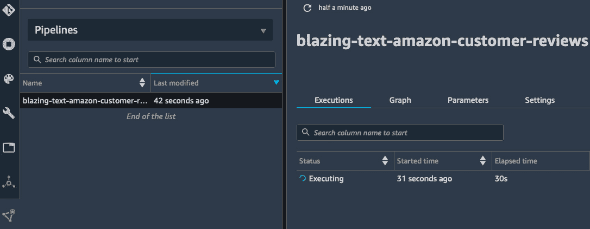

    图 12.20 – 执行管道

    一个半小时后，管道完成，如下图所示：

    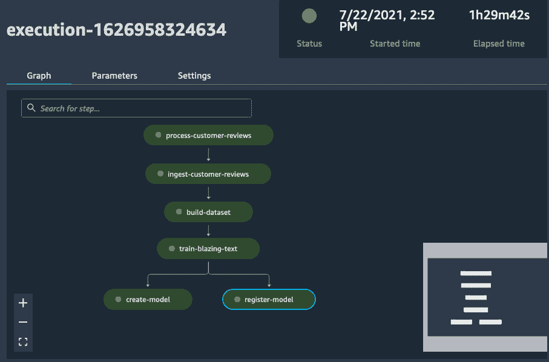

    图 12.21 – 可视化管道

1.  最后，对于管道中的每个步骤，我们都可以看到所有工件的血缘关系：

    ```py
    from sagemaker.lineage.visualizer import LineageTableVisualizer
    viz = LineageTableVisualizer(session)
    for execution_step in reversed(execution.list_steps()):
        print(execution_step)
    display(viz.show(
        pipeline_execution_step=execution_step))
    ```

    例如，训练步骤的输出在下图中展示。我们可以清楚地看到使用了哪些数据集和容器来训练模型：

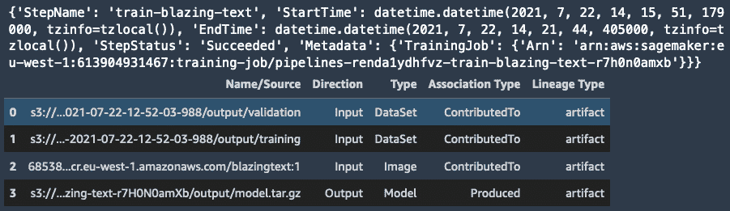

图 12.22 – 查看训练步骤的血缘关系

让我们看看如何部署这个模型。

## 从模型注册表部署模型

进入 **SageMaker 资源** / **模型注册表**，我们还可以看到该模型已经在模型注册表中注册，如下图所示。如果我们训练了更多版本的模型，它们也会出现在这里：

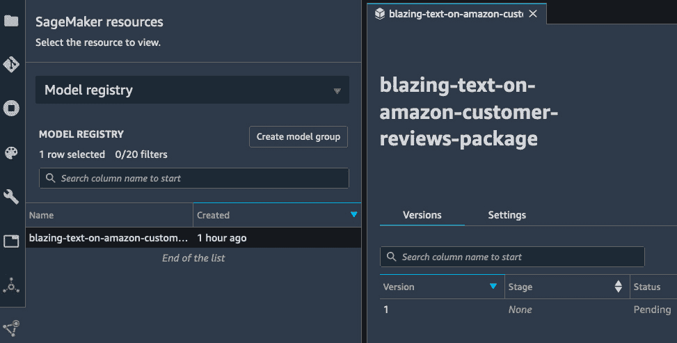

图 12.23 – 在模型注册表中查看模型

由于它的状态是 `Pending`，因此暂时无法部署。我们需要将其更改为 `Approved`，以便允许部署。这是一种安全的方式，可以确保只有经过所有适当测试的优质模型被部署。

我们右键点击模型并选择 `Approved`。我们还注意到模型 ARN，它在 **设置** 标签中是可见的。

现在，我们可以部署并测试模型：

1.  在我们的 Jupyter Notebook 中，我们创建一个指向我们想要部署的模型版本的 `ModelPackage` 对象：

    ```py
    from sagemaker import ModelPackage
    model_package_arn = 'arn:aws:sagemaker:eu-west-1:123456789012:model-package/blazing-text-on-amazon-customer-reviews-package/1'
    model = sagemaker.ModelPackage(
        role = role,
        model_package_arn = model_package_arn)
    ```

1.  我们像往常一样调用 `deploy()`：

    ```py
    model.deploy(
        initial_instance_count = 1,
        instance_type = 'ml.t2.medium',
        endpoint_name='blazing-text-on-amazon-reviews')
    ```

1.  我们创建一个 `Predictor` 并发送一个测试样本进行预测：

    ```py
    from sagemaker.predictor import Predictor
    bt_predictor = Predictor(
        endpoint_name='blazing-text-on-amazon-reviews',
        serializer=
            sagemaker.serializers.JSONSerializer(),       
        deserializer=
            sagemaker.deserializers.JSONDeserializer())
    instances = [' I really love this camera , it takes amazing pictures . ']
    payload = {'instances': instances, 
               'configuration': {'k': 3}}
    response = bt_predictor.predict(payload)
    print(response)
    ```

    这会打印出所有三个类别的概率：

    ```py
    [{'label': ['__label__positive__', '__label__neutral__', '__label__negative__'],
    'prob': [0.9999945163726807, 2.51355941145448e-05, 1.0307396223652177e-05]},
    ```

1.  一旦完成，我们可以删除终端节点。

    注意

    为了完全清理，你还应该删除管道、特征存储和模型包组。你可以在 GitHub 仓库中找到清理的笔记本。

如你所见，SageMaker Pipelines 为你提供了强大且高效的工具，帮助你构建、运行和跟踪端到端的机器学习工作流。这些工具在 SageMaker Studio 中得到了很好的集成，应该能帮助你提高生产力，并更快地将高质量模型投入生产。

# 总结

在这一章中，你首先学习了如何使用 AWS CloudFormation 部署和更新终端节点。你还看到了它如何用于实现金丝雀部署和蓝绿部署。

然后，你了解了 AWS CDK，这是一个专门为使用多种编程语言轻松生成和部署 CloudFormation 模板而构建的 SDK。

最后，你通过 AWS Step Functions 和 Amazon SageMaker Pipelines 构建了完整的端到端机器学习工作流。

在下一章也是最后一章中，你将了解更多关于 SageMaker 的功能，帮助你优化预测的成本和性能。
