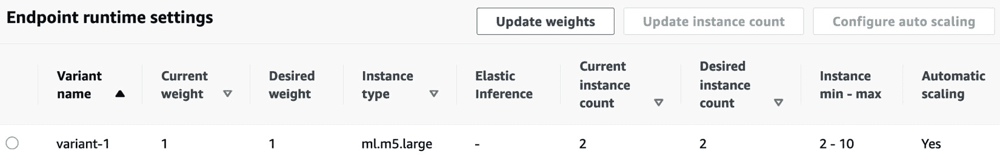
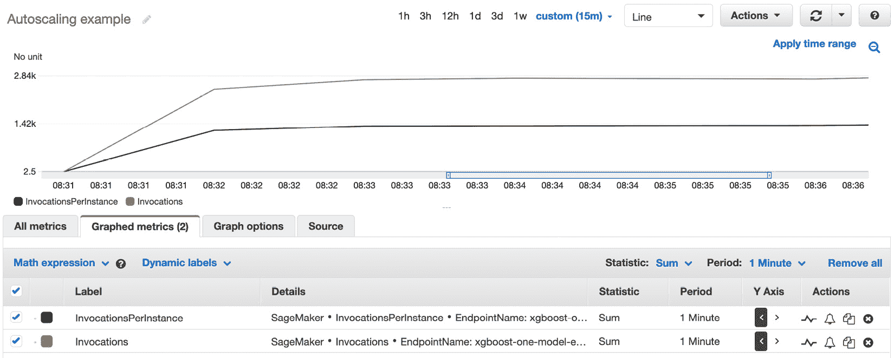
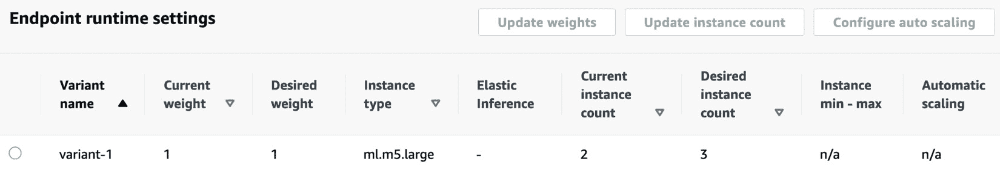
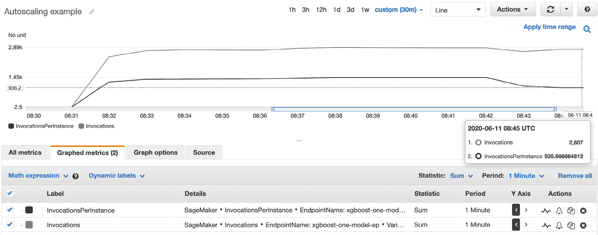
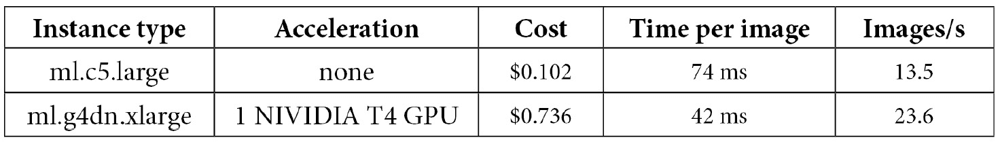
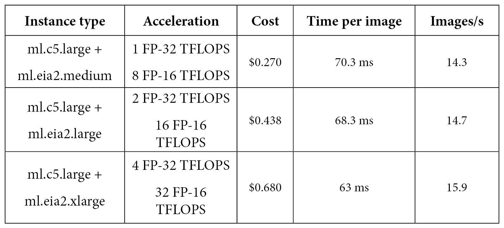
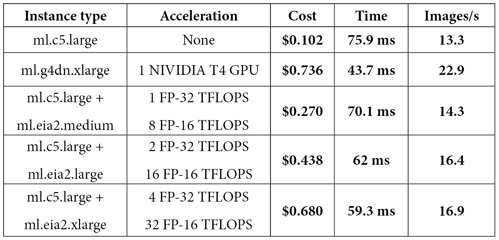

# 第十三章：优化预测成本和性能

在上一章中，你学习了如何自动化训练和部署工作流。

在本章的最后，我们将重点讨论如何优化预测基础设施的成本和性能，而预测基础设施通常占 AWS 客户机器学习开支的 90%。这个数字可能会让人吃惊，直到我们意识到，一个由单次训练任务构建的模型可能会在多个端点上运行，且这些端点会全天候运行，规模庞大。

因此，必须格外小心地优化预测基础设施，以确保你能最大化成本效益！

本章内容包括以下主题：

+   自动扩展端点

+   部署多模型端点

+   使用 Amazon Elastic Inference 部署模型

+   使用 Amazon SageMaker Neo 编译模型

# 技术要求

你需要一个 AWS 账户才能运行本章中的示例。如果你还没有账户，请访问 [`aws.amazon.com/getting-started/`](https://aws.amazon.com/getting-started/) 创建一个。你还应该熟悉 AWS 免费使用层 ([`aws.amazon.com/free/`](https://aws.amazon.com/free/))，该服务让你在一定的使用限制内免费使用许多 AWS 服务。

你需要为你的账户安装并配置 AWS **命令行界面**（**CLI**）([`aws.amazon.com/cli/`](https://aws.amazon.com/cli/))。

你需要一个工作中的 Python 3.x 环境。安装 Anaconda 发行版 ([`www.anaconda.com/`](https://www.anaconda.com/)) 不是必须的，但强烈建议这样做，因为它包含了我们需要的许多项目（Jupyter、`pandas`、`numpy` 等）。

本书中的代码示例可以在 GitHub 上获取，地址为 [`github.com/PacktPublishing/Learn-Amazon-SageMaker-second-edition`](https://github.com/PacktPublishing/Learn-Amazon-SageMaker-second-edition)。你需要安装 Git 客户端来访问它们 ([`git-scm.com/`](https://git-scm.com/))。

# 自动扩展端点

自动扩展长期以来一直是根据流量调整基础设施规模的最重要技术，并且它在 SageMaker 端点中可用。然而，它基于 **应用程序自动扩展** 而非 **EC2 自动扩展** ([`docs.aws.amazon.com/autoscaling/application/userguide/what-is-application-auto-scaling.html`](https://docs.aws.amazon.com/autoscaling/application/userguide/what-is-application-auto-scaling.html))，尽管这两者的概念非常相似。

让我们为我们在波士顿房价数据集上训练的 **XGBoost** 模型设置自动扩展：

1.  我们首先创建一个 **端点配置**，然后使用它来构建端点。这里，我们使用的是 m5 实例系列；不建议使用 t2 和 t3 实例系列进行自动扩展，因为它们的突发行为使得很难衡量其实际负载：

    ```py
    model_name = 'sagemaker-xgboost-2020-06-09-08-33-24-782'
    endpoint_config_name = 'xgboost-one-model-epc'
    endpoint_name = 'xgboost-one-model-ep'
    production_variants = [{
        'VariantName': 'variant-1',
        'ModelName': model_name,
        'InitialInstanceCount': 2,
        'InitialVariantWeight': 1,
        'InstanceType': 'ml.m5.large'}]
    sm.create_endpoint_config(
        EndpointConfigName=endpoint_config_name,
        ProductionVariants=production_variants)
    sm.create_endpoint(
        EndpointName=endpoint_name,
        EndpointConfigName=endpoint_config_name)
    ```

1.  一旦端点投入使用，我们定义希望扩展的目标值，即支持该端点的实例数量：

    ```py
    app = boto3.client('application-autoscaling')
    app.register_scalable_target(
     ServiceNamespace='sagemaker',
     ResourceId=
         'endpoint/xgboost-one-model-ep/variant/variant-1',
     ScalableDimension=
        'sagemaker:variant:DesiredInstanceCount',
     MinCapacity=2,
     MaxCapacity=10)
    ```

1.  然后，我们为这个目标值应用扩展策略：

    ```py
    policy_name = 'xgboost-scaling-policy'
    app.put_scaling_policy(
     PolicyName=policy_name,
     ServiceNamespace='sagemaker',
     ResourceId=
       'endpoint/xgboost-one-model-ep/variant/variant-1',
     ScalableDimension=
       'sagemaker:variant:DesiredInstanceCount',
     PolicyType='TargetTrackingScaling',
    ```

1.  我们使用 SageMaker 中唯一的内置指标 `SageMakerVariantInvocationsPerInstance`。如果需要，我们也可以定义自定义指标。我们将指标阈值设置为每分钟 1,000 次调用。这个值有点随意。在实际操作中，我们会对单个实例进行负载测试，并监控模型延迟，以找到应该触发自动扩展的实际值。你可以在 [`docs.aws.amazon.com/sagemaker/latest/dg/endpoint-scaling-loadtest.html`](https://docs.aws.amazon.com/sagemaker/latest/dg/endpoint-scaling-loadtest.html) 查找更多信息。我们还定义了 60 秒的冷却时间，用于扩展和收缩，这是平滑过渡流量波动的好做法：

    ```py
     TargetTrackingScalingPolicyConfiguration={
       'TargetValue': 1000.0,
       'PredefinedMetricSpecification': {
           'PredefinedMetricType': 
           'SageMakerVariantInvocationsPerInstance'
        },
       'ScaleInCooldown': 60,
       'ScaleOutCooldown': 60
     }
    )
    ```

1.  如下图所示，端点上已经配置了自动扩展：

    图 13.1 – 查看自动扩展

1.  使用无限循环，我们向端点发送一些流量：

    ```py
    test_sample = '0.00632, 18.00, 2.310, 0, 0.5380, 6.5750, 65.20, 4.0900, 1, 296.0, 15.30, 396.90, 4.98'
    smrt=boto3.Session().client(service_name='runtime.sagemaker') 
    while True:
        smrt.invoke_endpoint(EndpointName=endpoint_name,
                             ContentType='text/csv',
                             Body=test_sample)
    ```

1.  如下图所示，通过查看端点的**CloudWatch**指标，我们发现每个实例的调用次数超过了我们定义的阈值：1.42k 对比 1k:

    图 13.2 – 查看 CloudWatch 指标

1.  自动扩展迅速启动，并决定添加另一个实例，如下图所示。如果负载更高，它可能会决定一次添加多个实例：

    图 13.3 – 查看自动扩展

1.  几分钟后，额外的实例已经投入服务，每个实例的调用次数现在低于阈值（935 对比 1,000）：

    图 13.4 – 查看 CloudWatch 指标

    当流量减少时，会发生类似的过程。

1.  完成后，我们删除所有内容：

    ```py
    app.delete_scaling_policy(
     PolicyName=policy_name,
     ServiceNamespace='sagemaker',
     ScalableDimension='sagemaker:variant :DesiredInstanceCount',
     ResourceId='endpoint/xgboost-one-model-ep/variant/variant-1')
    sm.delete_endpoint(EndpointName=endpoint_name)
    sm.delete_endpoint_config(
      EndpointConfigName=endpoint_config_name)
    ```

设置自动扩展非常简单。它帮助你根据变化的业务条件自动调整预测基础设施及相关成本。

现在，让我们学习另一种技术，当你需要处理大量模型时，这种技术会非常有用：**多模型端点**。

# 部署多模型端点

多模型端点在你需要处理大量模型的情况下非常有用，在这种情况下，将每个模型部署到单独的端点是没有意义的。例如，想象一下一个 SaaS 公司为其 10,000 个客户构建回归模型。显然，他们不希望管理（并为此支付）10,000 个端点！

## 理解多模型端点

一个多模型终端可以提供来自任意数量存储在 S3 中的模型的 CPU 基础预测（截至写作时，不支持 GPU）。每个预测请求中都会传递所使用模型的路径。模型会根据使用情况和终端可用内存动态加载和卸载。你还可以通过简单地复制或删除 S3 中的工件来添加或删除终端中的模型。

为了提供多个模型，你的推理容器必须实现一组特定的 API，终端会调用这些 API：LOAD MODEL、LIST MODEL、GET MODEL、UNLOAD MODEL 和 INVOKE MODEL。你可以在 [`docs.aws.amazon.com/sagemaker/latest/dg/mms-container-apis.html`](https://docs.aws.amazon.com/sagemaker/latest/dg/mms-container-apis.html) 获取详细信息。

截至写作时，最新的内置容器如 **scikit-learn**、**TensorFlow**、**Apache MXNet** 和 **PyTorch** 原生支持这些 API。**XGBoost**、**kNN**、**Linear Learner** 和 **Random Cut Forest** 内置算法也支持这些 API。

对于其他算法和框架，最佳选择是构建一个包含 **SageMaker 推理工具包** 的自定义容器，因为它已经实现了所需的 API ([`github.com/aws/sagemaker-inference-toolkit`](https://github.com/aws/sagemaker-inference-toolkit))。

该工具包基于多模型服务器 ([`github.com/awslabs/multi-model-server`](https://github.com/awslabs/multi-model-server))，你也可以直接从 CLI 使用它来提供来自多个模型的预测。你可以在 [`docs.aws.amazon.com/sagemaker/latest/dg/build-multi-model-build-container.html`](https://docs.aws.amazon.com/sagemaker/latest/dg/build-multi-model-build-container.html) 获取更多信息。

## 使用 scikit-learn 构建多模型终端

让我们使用 **scikit-learn** 构建一个多模型终端，托管在波士顿住房数据集上训练的模型。仅支持 scikit-learn 0.23-1 及以上版本：

1.  我们将数据集上传到 S3：

    ```py
    import sagemaker, boto3
    sess = sagemaker.Session()
    bucket = sess.default_bucket()
    prefix = 'sklearn-boston-housing-mme'
    training = sess.upload_data(path='housing.csv', 
                                key_prefix=prefix + 
                                '/training')
    output = 's3://{}/{}/output/'.format(bucket,prefix)
    ```

1.  我们使用不同的测试大小训练三个模型，并将它们的名称存储在字典中。在这里，我们使用最新版本的 scikit-learn，它是第一个支持多模型终端的版本：

    ```py
    from sagemaker.sklearn import SKLearn
    jobs = {}
    for test_size in [0.2, 0.1, 0.05]:
        sk = SKLearn(entry_point=
                    'sklearn-boston-housing.py',
            role=sagemaker.get_execution_role(),
            framework_version='0.23-1',
            instance_count=1,
            instance_type='ml.m5.large',
            output_path=output,
            hyperparameters={ 'normalize': True,
                              'test-size': test_size }
        )
        sk.fit({'training':training}, wait=False)
        jobs[sk.latest_training_job.name] = {}
        jobs[sk.latest_training_job.name]['test-size'] =   
            test_size
    ```

1.  我们找到模型工件的 S3 URI 及其前缀：

    ```py
    import boto3
    sm = boto3.client('sagemaker')
    for j in jobs.keys():
        job = sm.describe_training_job(TrainingJobName=j)
        jobs[j]['artifact'] =
            job['ModelArtifacts']['S3ModelArtifacts']
        jobs[j]['key'] = '/'.join(
            job['ModelArtifacts']['S3ModelArtifacts']
            .split('/')[3:])
    ```

1.  我们删除 S3 中存储的任何先前的模型：

    ```py
    %%sh -s "$bucket" "$prefix"
    aws s3 rm --recursive s3://$1/$2/models
    ```

1.  我们将三个模型工件复制到这个位置：

    ```py
    s3 = boto3.client('s3')
    for j in jobs.keys():
        copy_source = { 'Bucket': bucket, 
                        'Key': jobs[j]['key'] }
        s3.copy_object(CopySource=copy_source,  
                       Bucket=bucket, 
                       Key=prefix+'/models/'+j+'.tar.gz')
    response = s3.list_objects(Bucket=bucket, 
                               Prefix=prefix+'/models/')
    for o in response['Contents']:
        print(o['Key'])
    ```

    这会列出模型工件：

    ```py
    sklearn-boston-housing-mme/models/sagemaker-scikit-learn-2021-09-01-07-52-22-679
    sklearn-boston-housing-mme/models/sagemaker-scikit-learn-2021-09-01-07-52-26-399
    sklearn-boston-housing-mme/models/sagemaker-scikit-learn-2021-09-01-08-05-33-229
    ```

1.  我们定义脚本的名称以及我们将上传代码归档的 S3 位置。在这里，我传递了训练脚本，其中包括一个 `model_fn()` 函数来加载模型。这个函数是唯一用于提供预测的函数：

    ```py
    script = 'sklearn-boston-housing.py'
    script_archive = 's3://{}/{}/source/source.tar.gz'.
                     format(bucket, prefix)
    ```

1.  我们创建代码归档并将其上传到 S3：

    ```py
    %%sh -s "$script" "$script_archive"
    tar cvfz source.tar.gz $1
    aws s3 cp source.tar.gz $2
    ```

1.  我们通过 `create_model()` API 创建多模型终端，并相应设置 `Mode` 参数：

    ```py
    import time
    model_name = prefix+'-'+time.strftime("%Y-%m-%d-%H-%M-%S", time.gmtime())
    response = sm.create_model(
      ModelName = model_name,
      ExecutionRoleArn = role,
      Containers = [{
        'Image': sk.image_uri,
        'ModelDataUrl':'s3://{}/{}/models/'.format(bucket, 
                        prefix),
        'Mode': 'MultiModel',
        'Environment': {
            'SAGEMAKER_PROGRAM' : script,
            'SAGEMAKER_SUBMIT_DIRECTORY' : script_archive
        }
      }]
    )
    ```

1.  我们像往常一样创建终端配置：

    ```py
    epc_name = prefix+'-epc'+time.strftime("%Y-%m-%d-%H-%M-%S", time.gmtime())
    response = sm.create_endpoint_config(
        EndpointConfigName = epc_name,
        ProductionVariants=[{
            'InstanceType': 'ml.m5.large',
            'InitialInstanceCount': 1,
            'InitialVariantWeight': 1,
            'ModelName': model_name,
            'VariantName': 'variant-1'}]
    )
    ```

1.  我们像往常一样创建终端：

    ```py
    ep_name = prefix+'-ep'+time.strftime("%Y-%m-%d-%H-%M-%S", time.gmtime())
    response = sm.create_endpoint(
        EndpointName=ep_name,
        EndpointConfigName=epc_name)
    ```

1.  一旦终端节点投入使用，我们就从数据集中加载样本并将其转换为 `numpy` 数组：

    ```py
    import pandas as pd
    import numpy as np
    from io import BytesIO
    data = pd.read_csv('housing.csv')
    payload = data[:10].drop(['medv'], axis=1)
    buffer = BytesIO()
    np.save(buffer, payload.values)
    ```

1.  我们使用这三种模型对这些样本进行预测，并将要使用的模型名称传递给每个预测请求，例如 **sagemaker-scikit-learn-2021-09-01-08-05-33-229**：

    ```py
    smrt = boto3.client('runtime.sagemaker')
    for j in jobs.keys():
        model_name=j+'.tar.gz'
        response = smrt.invoke_endpoint(
            EndpointName=ep_name,
            TargetModel=model_name,
            Body=buffer.getvalue(),
            ContentType='application/x-npy')
        print(response['Body'].read())
    ```

1.  我们可以训练更多的模型，将它们的工件复制到相同的 S3 位置，并直接使用它们，而无需重新创建终端节点。我们还可以删除那些不需要的模型。

1.  一旦完成，我们就删除终端节点：

    ```py
    sm.delete_endpoint(EndpointName=ep_name)
    sm.delete_endpoint_config(EndpointConfigName=epc_name)
    ```

如您所见，多模型终端节点是一个很好的方式，可以从单一终端节点提供您想要的多个模型，而且设置起来并不困难。

在下一节中，我们将研究另一种成本优化技术，它可以帮助您在 GPU 预测中节省大量费用：**Amazon Elastic Inference**。

# 使用 Amazon Elastic Inference 部署模型

部署模型时，您需要决定它是应该运行在 CPU 实例上，还是 GPU 实例上。在某些情况下，这个问题并不复杂。例如，有些算法根本无法从 GPU 加速中获益，因此应该部署到 CPU 实例上。另一方面，用于计算机视觉或自然语言处理的复杂深度学习模型，最好运行在 GPU 上。

在许多情况下，情况并不是那么简单明确。首先，您需要知道您应用程序的最大预测延迟是多少。如果您正在为实时广告技术应用预测点击率，那么每毫秒都至关重要；如果您是在后台应用程序中预测客户流失，那么就没那么重要。

此外，即使是能够从 GPU 加速中受益的模型，可能也不够大或复杂，无法充分利用现代 GPU 上数千个核心。在这种情况下，您会陷入两难境地：在 CPU 上部署可能会对您的需求稍显缓慢，而在 GPU 上部署则不具备成本效益。

这是 Amazon Elastic Inference 旨在解决的问题 ([`aws.amazon.com/machine-learning/elastic-inference/`](https://aws.amazon.com/machine-learning/elastic-inference/))。它让您可以将分段 GPU 加速附加到任何 EC2 实例上，包括笔记本实例和终端节点实例。**加速器**有三种不同的尺寸（中型、大型和超大型），可以帮助您找到最适合您应用的性价比。

Elastic Inference 可用于**TensorFlow**、**PyTorch** 和 **Apache MXNet**。您可以通过 AWS 提供的扩展，在 EC2 实例上运行自己的代码，使用 **深度学习 AMI**。您还可以与 **深度学习容器** 一起使用。更多信息请访问 [`docs.aws.amazon.com/elastic-inference/latest/developerguide/working-with-ei.html`](https://docs.aws.amazon.com/elastic-inference/latest/developerguide/working-with-ei.html)。

当然，**Elastic Inference**可以在 SageMaker 上使用。你可以在创建时将加速器附加到**Notebook Instance**，并使用内置的**conda**环境。你还可以将加速器附加到端点，接下来我们会展示如何操作。

## 使用 Amazon Elastic Inference 部署模型

让我们重新使用在 *第五章* 中训练的**图像分类**模型，这个模型基于 18 层**ResNet**网络，在卷积神经网络中算是比较小的：

1.  一旦模型训练完成，我们像往常一样将其部署到两个端点：一个由`ml.c5.large`实例支持，另一个由`ml.g4dn.xlarge`实例支持，后者是 SageMaker 上最具成本效益的 GPU 实例：

    ```py
    import time
    endpoint_name = 'c5-'+time.strftime("%Y-%m-%d-%H-%M-%S", time.gmtime())
    c5_predictor = ic.deploy(initial_instance_count=1,
                             instance_type='ml.c5.large',
                             endpoint_name=endpoint_name,
                             wait=False)
    endpoint_name = 'g4-'+time.strftime("%Y-%m-%d-%H-%M-%S", time.gmtime())
    g4_predictor = ic.deploy(
        initial_instance_count=1,
        instance_type='ml.g4dn.xlarge',
        endpoint_name=endpoint_name,
        wait=False)
    ```

1.  然后，我们下载一张测试图像，进行 1,000 次预测，并测量总时间：

    ```py
    with open(file_name, 'rb') as f:
        payload = f.read()
        payload = bytearray(payload)
    def predict_images(predictor, iterations=1000):
        total = 0
        for i in range(0, iterations):
            tick = time.time()
            response = runtime.invoke_endpoint(
                EndpointName=predictor.endpoint_name,                                 
                ContentType='application/x-image',
                Body=payload)
            tock = time.time()
            total += tock-tick
        return total/iterations
    predict_images(c5_predictor)
    predict_images(g4_predictor)
    ```

1.  结果显示在下表中（us-east-1 价格）：

    不出所料，GPU 实例大约是 CPU 实例的两倍速度。然而，CPU 实例更具成本效益，因为它的成本比 GPU 实例低四倍多。换句话说，你可以用四个 CPU 实例代替一个 GPU 实例，且以相同的成本获得更多的吞吐量。这也说明了为何了解你应用的延迟要求如此重要。 "快"和"慢"是非常相对的概念！

1.  然后，我们在三个不同的端点上部署相同的模型，这些端点由`ml.c5.large`实例支持，并通过中型、大型和超大型`deploy()` API 加速。以下是中型端点的代码：

    ```py
    endpoint_name = 'c5-medium-'
       +time.strftime("%Y-%m-%d-%H-%M-%S", time.gmtime())
    c5_medium_predictor = ic.deploy(
        initial_instance_count=1,
        instance_type='ml.c5.large',
        accelerator_type='ml.eia2.medium',
        endpoint_name=endpoint_name,
        wait=False)
    predict_images(c5_medium_predictor)
    ```

    你可以在下表中看到结果：

    

    相比裸机 CPU 端点，我们的速度提升了最多 20%，而且成本低于使用 GPU 实例的情况。让我们继续调整：

1.  细心的读者可能已经注意到，前面的表格中包含了 32 位和 16 位浮点值的 teraFLOP 值。事实上，这两种数据类型都可以用来存储模型参数。查看图像分类算法的文档，我们发现实际上可以通过`precision_dtype`参数选择数据类型，默认值是`float32`。这就引出了一个问题：如果我们以`float16`模式训练模型，结果会有所不同吗？只有一个办法知道答案，不是吗？

    ```py
    ic.set_hyperparameters(
        num_layers=18,                       
        use_pretrained_model=0,
        num_classes=2
        num_training_samples=22500,
        mini_batch_size=128,
        precision_dtype='float16',
        epochs=10)                   
    ```

1.  重新训练后，我们达到了与`float32`模式下相同的模型精度。再次进行部署基准测试，我们得到了以下结果：



在裸机实例上看不出明显的差异。使用**FP-16**模型在大规模和超大规模加速器上进行预测，相比于**FP-32**模型，能帮助我们将预测速度提高大约 10%。相当不错！与裸机 CPU 实例相比，这个性能水平无疑是一个不错的升级，而与 GPU 实例相比，它在成本上更具优势。

实际上，将单个终端实例从 `ml.g4dn.xlarge` 切换到 `ml.c5.large+ml.eia2.large`，每月将节省（$0.736–$0.438）x 24 x 30 = $214 美元。这可是大笔钱！

如你所见，Amazon Elastic Inference 非常易于使用，并且为你提供了额外的部署选项。一旦你定义了应用程序的预测延迟要求，你就可以快速进行实验，并找到最佳的性价比。

现在，让我们来谈谈另一个 SageMaker 功能，它可以让你为特定硬件架构编译模型：**Amazon Neo**。

# 使用 Amazon SageMaker Neo 编译模型

嵌入式软件开发人员早已学会如何编写高度优化的代码，使其既能快速运行，又能节约硬件资源。从理论上讲，同样的技术也可以用于优化机器学习预测。但在实践中，由于机器学习库和模型的复杂性，这是一项艰巨的任务。

这是 Amazon SageMaker Neo 旨在解决的问题。

## 了解 Amazon SageMaker Neo

Amazon Neo 有两个组件：一个优化模型以适应底层硬件的模型编译器和一个名为**深度学习运行时**（**DLR**）的小型运行时，用于加载优化后的模型并进行预测（[`aws.amazon.com/sagemaker/neo`](https://aws.amazon.com/sagemaker/neo)）。

Amazon SageMaker Neo 可以编译以下训练的模型：

+   **两个内置算法**：XGBoost 和图像分类。

+   **内置框架**：TensorFlow、PyTorch 和 Apache MXNet，以及 **ONNX** 格式的模型。支持许多运算符，你可以在 [`aws.amazon.com/releasenotes/sagemaker-neo-supported-frameworks-and-operators`](https://aws.amazon.com/releasenotes/sagemaker-neo-supported-frameworks-and-operators) 找到完整的列表。

训练照常进行，使用你选择的估算器。然后，使用 `compile_model()` API，我们可以轻松地为以下硬件目标编译模型：

+   以下系列的 Amazon EC2 实例：`c4`、`c5`、`m4`、`m5`、`p2`、`p3` 和 `inf1`（我们将在本章后面讨论），以及 Lambda

+   AI 驱动的相机：AWS DeepLens 和 Acer aiSage

+   NVIDIA Jetson 平台：TX1、TX2、Nano 和 Xavier

+   树莓派

+   来自 Rockchip、Qualcomm、Ambarella 等的系统级芯片平台

模型编译执行架构优化（如融合层）和代码优化（将机器学习运算符替换为硬件优化版本）。生成的工件存储在 S3 中，包含原始模型及其优化后的形式。

然后使用 DLR 加载模型并进行预测。当然，它也可以独立使用，例如在 Raspberry Pi 上。您可以在 [`neo-ai-dlr.readthedocs.io`](https://neo-ai-dlr.readthedocs.io) 找到安装说明。由于 DLR 是开源的（[`github.com/neo-ai/neo-ai-dlr`](https://github.com/neo-ai/neo-ai-dlr)），您也可以从源代码构建它，并为自己的硬件平台定制它！

当涉及使用 DLR 和 SageMaker 时，情况要简单得多。SageMaker 提供了带有 Neo 支持的内置容器，这些容器是您应该用于部署使用 Neo 编译的模型的容器（正如前面提到的，训练容器保持不变）。您可以在 [`docs.aws.amazon.com/sagemaker/latest/dg/neo-deployment-hosting-services-cli.html`](https://docs.aws.amazon.com/sagemaker/latest/dg/neo-deployment-hosting-services-cli.html) 找到 Neo 支持的容器列表。

最后但并非最不重要的，DLR 的一个好处是其体积小。例如，适用于 p2 和 p3 实例的 Python 包仅为 5.4 MB，比您通常使用的深度学习库及其依赖项小得多。这显然对嵌入式环境至关重要，同时也受到 SageMaker 的欢迎，因为容器也会更小。

让我们重用我们的图像分类示例，看看 Neo 是否能加速它。

## 在 SageMaker 上编译和部署图像分类模型

为了让 Neo 多做一些工作，这次我们训练一个 50 层的 ResNet。然后，我们将其编译并部署到端点，并与原始模型进行比较：

1.  将 `num_layers` 设置为 `50`，我们对模型进行 30 个 epochs 的训练。然后，像往常一样将其部署到 `ml.c5.4xlarge` 实例上：

    ```py
    ic_predictor = ic.deploy(initial_instance_count=1,
        instance_type='ml.c5.4xlarge',                         
        endpoint_name=ic_endpoint_name)
    ```

1.  我们使用 Neo 编译模型，目标是 EC2 c5 实例系列。我们还定义了模型的输入形状：一张图像，三个通道（红色、绿色、蓝色），以及 224 x 224 像素（图像分类算法的默认值）。由于内置算法是使用 Apache MXNet 实现的，我们相应地设置了框架：

    ```py
    output_path = 's3://{}/{}/output-neo/'
                  .format(bucket, prefix)
    ic_neo_model = ic.compile_model(
        target_instance_family='ml_c5',
        input_shape={'data':[1, 3, 224, 224]},
        role=role,
        framework='mxnet',
        framework_version='1.5.1',
        output_path=output_path)
    ```

1.  然后像往常一样部署编译后的模型，明确将预测容器设置为启用 Neo 的图像分类版本：

    ```py
    ic_neo_model.image = get_image_uri(
        session.boto_region_name, 
        'image-classification-neo', 
        repo_version='latest')
    ic_neo_predictor = ic_neo_model.deploy(
        endpoint_name=ic_neo_endpoint_name,
        initial_instance_count=1,
        instance_type='ml.c5.4xlarge')
    ```

1.  下载一个测试图像，并使用与 Amazon Elastic Inference 相同的基准测试函数，测量预测 1,000 张图像所需的时间：

    ```py
    predict_images(ic_predictor)
    predict_images(ic_neo_predictor)
    ```

    使用原始模型进行预测需要 87 秒。使用经过 Neo 优化的模型仅需 28.5 秒，快了三倍！那个编译步骤确实值回票价。您还会高兴地了解到，Neo 模型的编译是免费的，所以确实没有理由不尝试。

让我们来看看这些编译后的模型。

## 探索使用 Neo 编译的模型

查看传递给 `compile_model()` API 的输出位置，我们看到了 Neo 生成的模型文件：

```py
$ aws s3 ls s3://sagemaker-eu-west-1-123456789012/dogscats/output-neo/
model-ml_c5.tar.gz
```

将其本地复制并解压缩，我们看到其中包含原始模型及其编译版本：

```py
$ aws s3 cp s3://sagemaker-eu-west-1-123456789012/dogscats/output-neo/model-ml_c5.tar.gz .
$ tar xvfz model-ml_c5.tar.gz
compiled.meta
model-shapes.json
compiled.params
compiled_model.json
compiled.so
```

特别地，`compiled.so` 文件是一个本地文件，包含模型操作符的硬件优化版本：

```py
$ file compiled.so
compiled.so: ELF 64-bit LSB shared object, x86-64
$ nm compiled.so | grep conv | head -3
0000000000005880 T fused_nn_contrib_conv2d_NCHWc
00000000000347a0 T fused_nn_contrib_conv2d_NCHWc_1
0000000000032630 T fused_nn_contrib_conv2d_NCHWc_2
```

我们本可以查看这些的汇编代码，但直觉告诉我，大多数人可能并不特别喜欢这个。开个玩笑，实际上这是完全不必要的。我们需要知道的仅仅是如何使用 Neo 编译和部署模型。

现在，我们来看看如何在 **Raspberry Pi** 上部署我们的模型？

## 在 Raspberry Pi 上部署图像分类模型

Raspberry Pi 是一款非常棒的设备，尽管其计算和内存能力有限，但它完全能够用复杂的深度学习模型进行图像预测。在这里，我使用的是 Raspberry Pi 3 Model B，配备 1.2 GHz 四核 ARM 处理器和 1 GB 内存。虽然这不算强大，但它足以运行原生 Apache MXNet 模型。

不可思议的是，Raspberry Pi 没有 MXNet 的预编译版本，从源代码构建它是一项既漫长又难以预测的过程。（我在看你，OOM 错误！）幸运的是，借助 DLR，我们可以摆脱所有这些麻烦！

1.  在我们的 SageMaker 笔记本中，我们为 Raspberry Pi 编译模型：

    ```py
    output_path = 's3://{}/{}/output-neo/'
                  .format(bucket, prefix)
    ic_neo_model = ic.compile_model(
        target_instance_family='rasp3b',
        input_shape={'data':[1, 3, 224, 224]},
        role=role,
        framework='mxnet',
        framework_version='1.5.1',
        output_path=output_path)
    ```

1.  在我们的本地机器上，我们从 S3 获取已编译的模型文件并将其复制到 Raspberry Pi 上：

    ```py
    $ aws s3 cp s3://sagemaker-eu-west-1-123456789012/dogscats/output-neo/model-rasp3b.tar.gz .
    $ scp model-rasp3b.tar.gz pi@raspberrypi:~
    ```

1.  转到 Raspberry Pi，我们将已编译的模型提取到`resnet50`目录：

    ```py
    $ mkdir resnet50
    $ tar xvfz model-rasp3b.tar.gz -C resnet50
    ```

1.  安装 DLR 非常简单。我们在 [`github.com/neo-ai/neo-ai-dlr/releases`](https://github.com/neo-ai/neo-ai-dlr/releases) 找到合适的安装包，下载并使用`pip`进行安装：

    ```py
    $ wget https://neo-ai-dlr-release.s3-us-west-2.amazonaws.com/v1.9.0/rasp3b/dlr-1.9.0-py3-none-any.whl 
    $ pip3 install dlr-1.9.0-py3-none-any.whl
    ```

1.  我们首先编写一个函数，从文件中加载图像，将其调整为 224 x 224 像素，并将其形状调整为（1, 3, 224, 224）的`numpy`数组，这是我们模型正确的输入形状：

    ```py
    import numpy as np
    from PIL import Image
    def process_image(filename):
        image = Image.open(filename)
        image = image.resize((224,224))   
        image = np.asarray(image)         # (224,224,3)
        image = np.moveaxis(image, 2, 0). # (3,224,224)
        image = image[np.newaxis, :].     # (1,3,224,224)
        return image
    ```

1.  然后，我们导入 DLR 并从`resnet50`目录加载已编译的模型：

    ```py
    from dlr import DLRModel
    model = DLRModel('resnet50')
    ```

1.  接着，我们加载一张狗的图片……或者一张猫的图片。由你选择！

    ```py
    image = process_image('dog.jpg')
    #image = process_image('cat.png')
    input_data = {'data': image}
    ```

1.  最后，我们预测图像 100 次，将预测结果打印出来，以避免 MXNet 可能实现的延迟评估：

    ```py
    import time
    total = 0
    for i in range(0,100):
        tick = time.time()
        out = model.run(input_data)
        print(out[0])
        tock = time.time()
        total+= tock-tick
    print(total)
    ```

以下的狗和猫图像分别被预测为 [2.554065e-09 1.000000e+00] 和 [9.9967313e-01 3.2689856e-04]，考虑到我们模型的验证精度（约 84%），这是非常不错的：


图 13.5 – 测试图像（来源：Wikimedia）

每张图像的预测时间约为 1.2 秒，虽然较慢，但对于许多嵌入式应用来说，完全足够。使用原生模型进行预测大约需要 6-7 秒，所以加速效果非常显著。

如你所见，编译模型是一项非常有效的技术。在下一部分，我们将重点介绍 Neo 的一个目标，**AWS Inferentia**。

## 在 AWS Inferentia 上部署模型

AWS Inferentia 是一款专为高吞吐量和低成本预测而设计的定制芯片（[`aws.amazon.com/machine-learning/inferentia`](https://aws.amazon.com/machine-learning/inferentia)）。Inferentia 芯片托管在**EC2 inf1**实例上。这些实例有不同的大小，分别包含 1、4 或 16 颗芯片。每颗芯片包含四个**NeuronCores**，实现了高性能的矩阵乘法引擎，加速了典型的深度学习操作，如卷积。NeuronCores 还包含大量缓存，减少了外部内存访问。

为了在 Inferentia 上运行，模型需要使用 Neuron SDK 进行编译和部署（[`github.com/aws/aws-neuron-sdk`](https://github.com/aws/aws-neuron-sdk)）。这个 SDK 允许你与 TensorFlow、PyTorch 和 Apache MXNet 模型进行工作。

你可以在 EC2 实例上使用 Neuron SDK，自己进行模型的编译和部署。再一次，SageMaker 简化了整个过程，因为 inf1 实例是 Neo 可以编译模型的目标架构之一。

你可以在[`github.com/awslabs/amazon-sagemaker-examples/tree/master/sagemaker_neo_compilation_jobs/deploy_tensorflow_model_on_Inf1_instance`](https://github.com/awslabs/amazon-sagemaker-examples/tree/master/sagemaker_neo_compilation_jobs/deploy_tensorflow_model_on_Inf1_instance)找到一个示例。

为了结束本章，让我们总结一下在整本书中讨论的所有成本优化技术。

# 构建成本优化清单

即使在机器学习项目的初期阶段，你也应该时刻关注成本。即使你没有支付 AWS 账单，肯定有人在支付，我敢肯定，如果你花得太多，很快就会知道是谁支付的。

定期检查以下清单将帮助你尽可能少花钱，获得最大化的机器学习效益，并希望能够避免财务团队的干扰！

## 数据准备的成本优化

由于在优化训练和部署上投入了大量精力，很容易忽视数据准备。然而，机器学习工作流中的这个关键环节可能会产生非常显著的成本。

提示#1

抵制在基于实例的服务上构建临时 ETL 工具的冲动。

显然，你的工作流将需要以定制的方式处理数据，例如应用特定领域的特征工程。通过使用像**Amazon Glue**、**Amazon Athena**或**Amazon SageMaker Data Wrangler**这样的托管服务，你无需配置任何基础设施，只需为你使用的部分付费。

作为第二选择，**Amazon EMR**是一个不错的服务，前提是你了解如何优化其成本。尽可能避免运行长时间存在、低使用率的集群。相反，你应该运行临时集群，并大量依赖**Spot Instances**作为任务节点。你可以在以下网站找到更多信息：

+   [`docs.aws.amazon.com/emr/latest/ManagementGuide/emr-plan-longrunning-transient.html`](https://docs.aws.amazon.com/emr/latest/ManagementGuide/emr-plan-longrunning-transient.html)

+   [`docs.aws.amazon.com/emr/latest/ManagementGuide/emr-instance-purchasing-options.html`](https://docs.aws.amazon.com/emr/latest/ManagementGuide/emr-instance-purchasing-options.html)

同样的建议适用于**Amazon EC2**实例。

提示 #2

使用 SageMaker Ground Truth 和自动标注来降低数据标注成本。

如果你需要标注大量的非结构化数据集，启用**SageMaker Ground Truth**中的自动标注可以节省大量的时间和金钱，相比于手动标注所有数据。你可以阅读相关内容：[`docs.aws.amazon.com/sagemaker/latest/dg/sms-automated-labeling.html`](https://docs.aws.amazon.com/sagemaker/latest/dg/sms-automated-labeling.html)。

## 实验成本优化

实验是另一个常被忽视的领域，你应该应用以下提示来最小化相关的开支。

提示 #3

你不必使用 SageMaker Studio。

正如在*第一章*中解释的，*介绍 Amazon SageMaker*，你可以轻松地在本地计算机或本地开发服务器上使用 SageMaker Python SDK。

提示 #4

在不需要时停止 Studio 实例。

这听起来像是显而易见的事情，但你真的在做吗？实际上没有理由运行空闲实例；提交你的工作，停止它们，然后在需要时再重新启动。存储是持久化的。

提示 #5

在小规模上进行实验，并使用正确大小的实例。

你真的需要完整的数据集来开始可视化数据和评估算法吗？可能不需要。通过处理数据集的一小部分，你可以使用更小的笔记本实例。举个例子：假设 5 个开发人员每天工作 10 小时，在各自的`ml.c5.2xlarge`笔记本实例上。每日成本为 5 x 10 x $0.557 = $27.85\。

将实例调整为 `ml.t3.xlarge`（较少的 RAM，具有突发行为），每日成本将降低到 5 x 10 x $0.233 = $11.65\。你每月可以节省 $486，这笔钱肯定可以用来进行更多实验、更多训练和更多**自动模型调优**。

如果你需要进行大规模清理和处理，请花时间将这项工作迁移到托管服务（参见提示 #1），而不是整天在一个巨大的实例上工作。不要说“我？从不！”我知道你正在这么做！

提示 #6

使用本地模式。

我们在*第七章*中看到，*通过内建框架扩展机器学习服务*，如何使用**本地模式**避免在 AWS 云中启动托管基础设施。这是一个在实验阶段以零成本快速迭代的绝佳技巧！

## 模型训练成本优化

你可以使用很多技术，我们已经讨论过其中的大部分。

提示 #7

不要在 Studio 实例上进行训练。

我要在这里重复一次，但这是一个重要的点。不幸的是，这种反模式似乎非常常见。人们选择一个大型实例（如`ml.p3.2xlarge`），在笔记本中启动一个大任务，放着不管，忘记它，最终在任务完成后，支付了大量费用给一个闲置了好几个小时的实例。

相反，请在**托管实例**上运行您的训练任务。得益于**分布式** **训练**，您将更快地获得结果，而且由于实例在训练完成后立即终止，您永远不会为训练支付过多费用。

作为额外好处，您将不再受制于清理脚本（或过于热心的管理员）在半夜将所有笔记本实例终止（“因为它们什么都不做，对吧？”）。

提示 #8

将您的数据集打包成 RecordIO/TFRecord 文件。

这样可以更轻松、更快速地移动您的数据集，并将其分发到训练实例。我们在*第五章*，*训练计算机视觉模型*和*第六章*，*训练自然语言处理模型*中详细讨论了这一点。

提示 #9

使用管道模式。

**管道模式**将您的数据集直接从 Amazon S3 流式传输到您的训练实例。没有复制过程，这节省了启动时间。我们在*第九章*，*扩展训练任务*中详细讨论了这一功能。

提示 #10

合理选择训练实例的大小。

我们在*第九章*，*扩展训练任务*中看到了如何实现这一点。一个词：**CloudWatch** 指标。

提示 #11

使用托管的 Spot 训练。

我们在*第十章*，*高级训练技巧*中详细讨论了这一点。如果这还没说服您，那就没有什么能说服您了！说真的，**托管的 Spot 训练**几乎没有不应使用的情况，它应该是您笔记本中的默认设置。

提示 #12

使用 AWS 提供的 TensorFlow、Apache MXNet 等版本。

我们有专门的团队致力于从 AWS 上的深度学习库中提取最后一丝性能。没有冒犯的意思，但如果您认为可以通过`pip install`来加速，您的时间可能最好投入到其他地方。您可以通过以下链接找到更多信息：

+   [`aws.amazon.com/blogs/machine-learning/faster-training-with-optimized-tensorflow-1-6-on-amazon-ec2-c5-and-p3-instances/`](https://aws.amazon.com/blogs/machine-learning/faster-training-with-optimized-tensorflow-1-6-on-amazon-ec2-c5-and-p3-instances/)，

+   [`aws.amazon.com/about-aws/whats-new/2018/11/tensorflow-scalability-to-256-gpus/`](https://aws.amazon.com/about-aws/whats-new/2018/11/tensorflow-scalability-to-256-gpus/)

+   [`aws.amazon.com/blogs/machine-learning/amazon-web-services-aSchieves-fastest-training-times-for-bert-and-mask-r-cnn/`](https://aws.amazon.com/blogs/machine-learning/amazon-web-services-aSchieves-fastest-training-times-for-bert-and-mask-r-cnn/)

## 优化模型部署成本

本章专门讲解了这些技术中的几个。我将再添加一些想法，进一步降低成本。

提示 #13

如果你不需要在线预测，使用批量转换。

一些应用程序不需要实时端点。它们完全可以使用**批量转换**，我们在**第十一章**，*部署机器学习模型*中研究过。额外的好处是，底层实例在批处理作业完成后会自动终止，这意味着你永远不会因为没有理由让端点运行一周而多付预测费用。

提示 #14

删除不必要的端点。

这一点不需要解释，我在本书中已经写了“完成后删除端点”十多次了。然而，这仍然是一个常见的错误。

提示 #15

正确设置端点并使用自动扩展。

提示 #16

使用多模型端点来整合模型。

提示 #17

使用 Amazon Neo 编译模型，以减少硬件资源的使用。

提示 #18

在大规模使用时，使用 AWS Inferentia 而不是 GPU 实例。

当然，还有针对 AWS 所有事项的最大秘诀，这就是为什么我们专门为其写了一整章（**第十二章**，*自动化机器学习工作流*）。

提示 #19

自动化，自动化，再自动化！

提示 #20

购买 Amazon SageMaker 的节省计划。

**节省计划**是一种灵活的定价模型，提供 AWS 使用的低价，作为对一年或三年期内承诺一致使用量的交换（[`aws.amazon.com/savingsplans/`](https://aws.amazon.com/savingsplans/)）。

现在，SageMaker 也支持节省计划，你可以在控制台中找到它：[`console.aws.amazon.com/cost-management/home?/savings-plans/`](https://console.aws.amazon.com/cost-management/home?/savings-plans/)。

内置推荐帮助你选择合适的承诺并在几分钟内购买计划。根据期限和承诺，你可以在所有基于实例的 SageMaker 成本上节省高达 72%（！）。你可以在[`aws.amazon.com/blogs/aws/slash-your-machine-learning-costs-with-instance-price-reductions-and-savings-plans-for-amazon-sagemaker/`](https://aws.amazon.com/blogs/aws/slash-your-machine-learning-costs-with-instance-price-reductions-and-savings-plans-for-amazon-sagemaker/)找到演示。

配备了这份清单，你不仅能削减机器学习预算，还能构建更强大、更灵活的工作流。罗马不是一天建成的，所以请慢慢来，运用常识，应用目前最重要的技术，并进行迭代。

# 总结

在本章的最后部分，你学习了不同的技巧，这些技巧有助于通过 SageMaker 降低预测成本。首先，你了解了如何使用自动扩展根据来访流量来扩展预测基础设施。接着，你学习了如何借助多模型端点将任意数量的模型部署到同一个端点上。

我们还介绍了 Amazon Elastic Inference，它允许你为基于 CPU 的实例添加分数 GPU 加速，并为你的应用找到合适的成本效益比。然后，我们讲解了 Amazon SageMaker Neo，这是一项创新功能，它能够为特定硬件架构编译模型，适用于 EC2 实例和嵌入式设备。最后，我们创建了一个成本优化清单，将在你未来的 SageMaker 项目中派上用场。

你已经学完了全部内容，恭喜你！现在，你对 SageMaker 了解颇多。快去获取一个数据集，构建一些酷东西，并告诉我你的成果！
