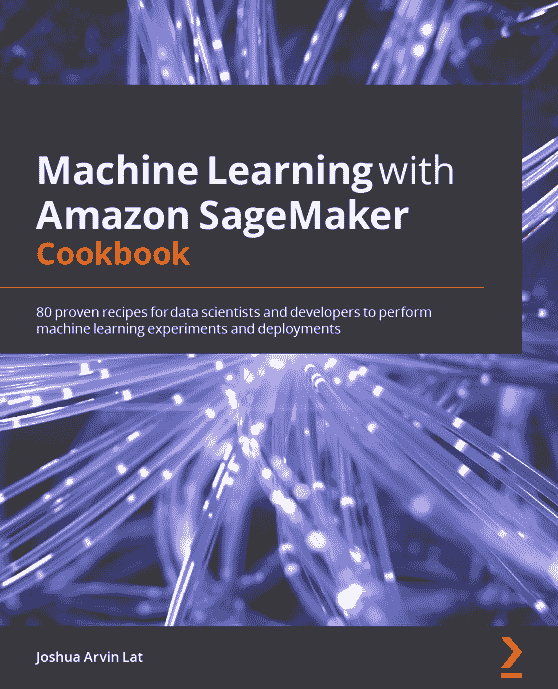
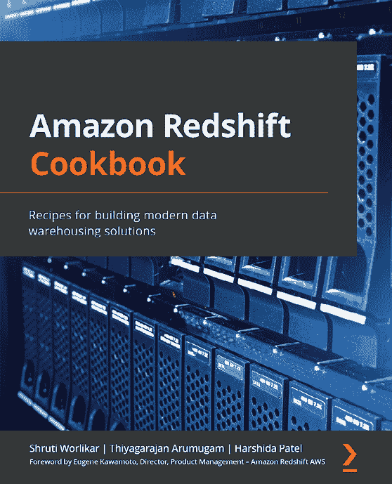

Packt.com

订阅我们的在线数字图书馆，全面访问超过 7,000 本书籍和视频，以及业内领先的工具，帮助您规划个人发展并推动职业生涯。欲了解更多信息，请访问我们的网站。

# 第十四章：为什么订阅？

+   花更少的时间学习，花更多的时间编程，使用来自 4,000 多位行业专家的实用电子书和视频

+   使用专门为您打造的技能计划提升您的学习

+   每月免费获取一本电子书或视频

+   完全可搜索，便于快速访问关键信息

+   复制、粘贴、打印和收藏内容

您知道 Packt 提供每本出版书籍的电子书版本，并且提供 PDF 和 ePub 格式的文件吗？您可以在 packt.com 升级到电子书版本，作为印刷书籍的客户，您有资格享受电子书的折扣。详情请联系我们 `customercare@packtpub.com`。

在 www.packt.com 上，您还可以阅读一系列免费的技术文章，注册多种免费的新闻通讯，并获得 Packt 书籍和电子书的独家折扣和优惠。

# 您可能喜欢的其他书籍

如果您喜欢这本书，您可能也会对 Packt 出版的其他书籍感兴趣：

**使用 Amazon SageMaker 机器学习 Cookbook**

Joshua Arvin Lat

ISBN: 9781800567030

+   训练和部署 NLP、时间序列预测及计算机视觉模型，解决不同的业务问题

+   使用自定义容器镜像推动 SageMaker 定制化的极限

+   使用 SageMaker Autopilot 的 AutoML 功能创建高质量的模型

+   使用有效的数据分析和准备技术

+   探索用于调试和管理 ML 实验及部署的解决方案

+   使用 SageMaker Clarify 处理偏差检测和 ML 可解释性需求

+   使用各种解决方案自动化中等复杂的部署和工作流程

**Amazon Redshift Cookbook**

Shruti Worlikar, Thiyagarajan Arumugam, Harshida Patel

ISBN: 9781800569683

+   使用 Amazon Redshift 构建具有大规模灵活性的千亿字节级数据仓库

+   使用 AWS 上专为此目的构建的功能和服务，将您的数据仓库解决方案与数据湖集成

+   使用有用的配方，从数据来源到消费，构建端到端的分析解决方案

+   利用 Redshift 全面的安全功能满足最苛刻的业务需求

+   在使用分析配方时，专注于架构洞察和逻辑

+   发现处理大数据的最佳实践，操作全托管解决方案

# Packt 正在寻找像您这样的作者

如果你有兴趣成为 Packt 的作者，请访问 authors.packtpub.com 并今天就申请。我们与成千上万的开发者和技术专业人士合作，帮助他们将自己的见解分享给全球技术社区。你可以提交一个通用申请，申请我们正在招聘作者的特定热门话题，或者提交你自己的创意。

# 分享你的想法

现在你已经完成了*《学习 Amazon Sagemaker（第二版）》*，我们非常希望听到你的想法！如果你是从 Amazon 购买的这本书，请点击这里直接前往 Amazon 的书评页面，分享你的反馈或在你购买该书的网站上留下评价。

你的评论对我们和技术社区非常重要，它将帮助我们确保提供优质的内容。
