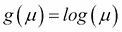

# 第五章：贝叶斯回归模型

在上一章中，我们详细介绍了贝叶斯线性回归的理论。在本章中，我们将通过一个示例问题来说明它如何应用于实际情况。为此，我们将使用 R 中的**广义线性模型**（**GLM**）包。首先，我们将向读者简要介绍 GLM 的概念。

# 广义线性回归

回想一下，在线性回归中，我们假设依赖变量*Y*和自变量*X*之间的以下函数形式：


这里，是一组基函数，是参数向量。通常，假设，因此代表一个截距或偏差项。此外，假设是一个按照均值为零、方差的正态分布分布的噪声项。我们还展示了这导致以下方程：


可以将前面的方程推广，不仅包括噪声的正态分布，还包括指数族中的任何分布（参考本章“参考文献”部分的第 1 条参考文献）。这是通过定义以下方程来实现的：


这里，*g*被称为连接函数。众所周知，如逻辑回归、对数线性模型、泊松回归等模型，都是广义线性模型（GLM）的特殊情况。例如，在普通线性回归的情况下，连接函数将是。对于逻辑回归，它是，即逻辑函数的逆，而对于泊松回归，它是。

在 GLM 的贝叶斯公式中，与普通线性回归不同，没有封闭形式的解析解。需要指定回归系数的先验概率。然后，通常通过蒙特卡洛模拟获得它们的后验概率。

# arm 包

在本章中，为了说明贝叶斯回归模型，我们将使用 R 的**arm**包。这个包是由 Andrew Gelman 及其同事开发的，可以从[`CRAN.R-project.org/package=arm`](http://CRAN.R-project.org/package=arm)网站下载。

arm 包具有`bayesglm`函数，该函数实现了具有独立正态、t 或 Cauchy 先验分布的贝叶斯广义线性模型，用于模型系数。我们将使用此函数构建贝叶斯回归模型。

# 能源效率数据集

我们将使用来自 UCI 机器学习仓库的能源效率数据集来展示贝叶斯回归（本章*参考文献*部分的参考 2）。数据集可以从网站[`archive.ics.uci.edu/ml/datasets/Energy+efficiency`](http://archive.ics.uci.edu/ml/datasets/Energy+efficiency)下载。该数据集包含具有不同建筑参数的建筑能源效率测量值。测量了两个能源效率参数：供暖负荷（*Y1*）和冷却负荷（*Y2*）。

使用的建筑参数包括：相对紧凑度（*X1*）、表面积（*X2*）、墙体面积（*X3*）、屋顶面积（*X4*）、整体高度（*X5*）、朝向（*X6*）、玻璃面积（*X7*）和玻璃面积分布（*X8*）。我们将尝试使用普通回归和贝叶斯回归，利用 arm 包的`glm`函数，将供暖负荷作为所有建筑参数的函数进行预测。我们将表明，对于同一数据集，贝叶斯回归给出了显著更小的预测区间。

# 建筑参数与能源效率的回归

在本节中，我们将对建筑的能源效率指标进行线性回归，将供暖负荷（*Y1*）作为建筑参数的函数。进行初步的描述性分析以找出哪些建筑变量具有统计学意义将是有用的。为此，我们将首先创建*Y1*和所有*X*变量的双变量图。我们还将计算*Y1*和所有*X*变量之间的 Spearman 相关系数。执行这些任务的 R 脚本如下：

```py
>library(ggplot2)
>library(gridExtra)

>df <- read.csv("ENB2012_data.csv",header = T)
>df <- df[,c(1:9)]
>str(df)
>df[,6] <- as.numeric(df[,6])
>df[,8] <- as.numeric(df[,8])

>attach(df)
>bp1 <- ggplot(data = df,aes(x = X1,y = Y1)) + geom_point()
>bp2 <- ggplot(data = df,aes(x = X2,y = Y1)) + geom_point()
>bp3 <- ggplot(data = df,aes(x = X3,y = Y1)) + geom_point()
>bp4 <- ggplot(data = df,aes(x = X4,y = Y1)) + geom_point()
>bp5 <- ggplot(data = df,aes(x = X5,y = Y1)) + geom_point()
>bp6 <- ggplot(data = df,aes(x = X6,y = Y1)) + geom_point()
>bp7 <- ggplot(data = df,aes(x = X7,y = Y1)) + geom_point()
>bp8 <- ggplot(data = df,aes(x = X8,y = Y1)) + geom_point()
>grid.arrange(bp1,bp2,bp3,bp4,bp5,bp6,bp7,bp8,nrow = 2,ncol = 4)
>detach(df)
```


```py
>cor.val <- cor(df[,1:8],df[,9],method = "spearman")
>cor.val           
[,1]
X1  0.622134697
X2 -0.622134697
X3  0.471457650
X4 -0.804027000
X5  0.861282577
X6 -0.004163071
X7  0.322860320
X8  0.068343464
```

从 b 图和相关系数值中，我们可以得出结论，变量 X6 和 X8 对 Y1 没有显著影响，因此可以从模型中删除。

## 普通回归

在我们查看贝叶斯线性回归之前，让我们先进行普通线性回归。以下 R 代码使用基础 R 中的`lm`函数在训练数据上拟合线性回归模型，并在测试数据集上预测*Y1*的值：

```py
>#Removing X6 and X8 since they don't have significant correlation with Y1
>df <- df[,c(1,2,3,4,5,7,9)]
>str(df)

>Splitting data set to Train and Test set in the ratio 80:20
>set.seed(123)
>samp <- sample.int(nrow(df),as.integer(nrow(df)*0.2),replace = F)
>dfTest <- df[samp,]
>dfTrain <- df[-samp,]
>xtest <- dfTest[,1:6]
>ytest <- dfTest[,7]

>library(arm)
>attach(dfTrain)

>#Ordinary Multivariate Regression
>fit.ols <- lm(Y1 ~ X1 + X2 + X3 + X4 + X5 + X7,data = dfTrain)
>summary(fit.ols)
>fit.coeff <- fit.ols$coefficients
>ypred.ols <- predict.lm(fit.ols,xtest,interval = "prediction",se.fit = T)
>ypred.ols$fit
>yout.ols <- as.data.frame(cbind(ytest,ypred.ols$fit))
>ols.upr <- yout.ols$upr
>ols.lwr <- yout.ols$lwr
```

## 贝叶斯回归

要执行贝叶斯线性回归，我们使用 arm 包的`bayesglm()`函数。正如我们在引言中所描述的，对于 GLM，如果我们选择`gaussian`（与正态分布相同）作为家族，并且选择`identity`作为连接函数，那么 GLM 就等同于普通线性回归。因此，如果我们使用`bayesglm()`函数并带有`gaussian`家族和`identity`连接函数，那么我们就是在执行贝叶斯线性回归。

对于贝叶斯模型，我们需要指定一个先验分布。对于高斯分布，默认设置是 `prior.mean = 0`，`prior.scale = NULL`，和 `prior.df = Inf`。以下 R 代码可用于贝叶斯线性回归：

```py
>fit.bayes <- bayesglm(Y1 ~ X1 + X2 + X3 + X4 + X5 + X7,family=gaussian(link=identity),data=dfTrain,prior.df = Inf,prior.mean = 0,prior.scale = NULL,maxit = 10000)
>ypred.bayes <- predict.glm(fit.bayes,newdata = xtest,se.fit = T)
>ypred.bayes$fit
```

为了比较普通回归和贝叶斯回归的结果，我们在一个图表上绘制测试数据的预测值以及两种方法的预测误差。为此，我们将使用**ggplot2**包：

```py
>library(ggplot2)
>library(gridExtra)
>yout.ols <- as.data.frame(cbind(ytest,ypred.ols$fit))
>ols.upr <- yout.ols$upr
>ols.lwr <- yout.ols$lwr

>p.ols <- ggplot(data = yout.ols,aes(x = yout.ols$ytest,y = yout.ols$fit)) + geom_point() + ggtitle("Ordinary Regression Prediction on Test Data") + labs(x = "Y-Test",y = "Y-Pred")
>p.ols + geom_errorbar(ymin = ols.lwr,ymax = ols.upr)yout.bayes <- as.data.frame(cbind(ytest,ypred.bayes$fit))
>names(yout.bayes) <- c("ytest","fit")
>critval <- 1.96 #approx for 95% CI
>bayes.upr <- ypred.bayes$fit + critval * ypred.bayes$se.fit
>bayes.lwr <- ypred.bayes$fit - critval * ypred.bayes$se.fit

>p.bayes <- ggplot(data = yout.bayes,aes(x = yout.bayes$ytest,y = yout.bayes$fit)) + geom_point() + ggtitle("Bayesian Regression Prediction on Test Data") + labs(x = "Y-Test",y = "Y-Pred")
>p.bayes + geom_errorbar(ymin = bayes.lwr,ymax = bayes.upr)

>p1 <-  p.ols + geom_errorbar(ymin = ols.lwr,ymax = ols.upr)
>p2 <-  p.bayes + geom_errorbar(ymin = bayes.lwr,ymax = bayes.upr)

>grid.arrange(p1,p2,ncol = 2)
```


可以看到，与普通回归相比，贝叶斯方法给出了更加紧凑的 95%置信预测区间。这是因为，在贝叶斯方法中，我们计算参数的分布。预测是通过从后验分布中抽取一系列值并平均得到最终预测和置信区间来进行的。

# 后验分布的模拟

如果想找出模型参数的后验分布，arm 包中的`sim( )`函数就变得很有用。以下 R 脚本将模拟参数的后验分布并生成一系列直方图：

```py
>posterior.bayes <- as.data.frame(coef(sim(fit.bayes)))
>attach(posterior.bayes)

>h1 <- ggplot(data = posterior.bayes,aes(x = X1)) + geom_histogram() + ggtitle("Histogram X1")
>h2 <- ggplot(data = posterior.bayes,aes(x = X2)) + geom_histogram() + ggtitle("Histogram X2")
>h3 <- ggplot(data = posterior.bayes,aes(x = X3)) + geom_histogram() + ggtitle("Histogram X3")
>h4 <- ggplot(data = posterior.bayes,aes(x = X4)) + geom_histogram() + ggtitle("Histogram X4")
>h5 <- ggplot(data = posterior.bayes,aes(x = X5)) + geom_histogram() + ggtitle("Histogram X5")
>h7 <- ggplot(data = posterior.bayes,aes(x = X7)) + geom_histogram() + ggtitle("Histogram X7")
>grid.arrange(h1,h2,h3,h4,h5,h7,nrow = 2,ncol = 3)

>detach(posterior.bayes)
```


# 练习

1.  使用来自 UCI 机器学习仓库的多变量数据集 Auto MPG（本章参考文献部分的第 3 个参考文献）。数据集可以从网站[`archive.ics.uci.edu/ml/datasets/Auto+MPG`](https://archive.ics.uci.edu/ml/datasets/Auto+MPG)下载。该数据集描述了在美国城市行驶的汽车的每加仑燃油消耗量（**mpg**）。从包含数据集的文件夹中下载两个文件：`auto-mpg.data`和`auto-mpg.names`。`auto-mpg.data`文件包含数据，格式为空格分隔。`auto-mpg.names`文件包含关于数据集的多个细节，包括每列的变量名。使用 OLS 和贝叶斯 GLM 构建燃油效率回归模型，作为排量（*disp*）、马力（*hp*）、重量（*wt*）和加速度（*accel*）的函数。使用 OLS 模型和贝叶斯 GLM 模型（使用`bayesglm`函数）预测测试数据集中的 mpg 值。计算 OLS 和贝叶斯 GLM 的**均方根误差**（**RMSE**）值，并比较两种方法的准确性和预测区间。

# 参考文献

1.  Friedman J., Hastie T., and Tibshirani R. *统计学习的要素 – 数据挖掘、推理与预测*. 施普林格统计学系列. 2009

1.  Tsanas A. and Xifara A. "使用统计机器学习工具准确估计住宅建筑的能源性能". 能源与建筑. 第 49 卷，第 560-567 页. 2012

1.  Quinlan R. "Combining Instance-based and Model-based Learning". In: Tenth International Conference of Machine Learning. 236-243\. University of Massachusetts, Amherst. Morgan Kaufmann. 1993\. Original dataset is from StatLib library maintained by Carnegie Mellon University.

# 摘要

在本章中，我们展示了如何使用能源效率数据集和 arm 包中的`bayesglm`函数，通过更紧的置信区间来提高贝叶斯回归在预测中的实用性。我们还学习了如何使用同一 R 包中的`sim`函数来模拟后验分布。在下一章中，我们将学习贝叶斯分类。
