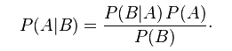

# 第六章：使用朴素贝叶斯进行社交媒体洞察

基于文本的文档包含大量信息。例如，书籍、法律文件、社交媒体和电子邮件。从基于文本的文档中提取信息对现代人工智能系统至关重要，例如在搜索引擎、法律人工智能和自动化新闻服务中。

从文本中提取有用特征是一个难题。文本本质上不是数值的，因此必须使用模型来创建可以与数据挖掘算法一起使用的特征。好消息是，有一些简单的模型在这方面做得很好，包括我们将在本章中使用的词袋模型。

在本章中，我们探讨从文本中提取特征以用于数据挖掘应用。本章中我们解决的具体问题是社交媒体中的术语消歧——根据上下文确定一个词的含义。

在本章中，我们将涵盖以下主题：

+   从社交网络 API 下载数据

+   用于文本数据的 Transformer 和模型

+   朴素贝叶斯分类器

+   使用 JSON 保存和加载数据集

+   用于特征创建的 NLTK 库

+   F 度量用于评估

# 消歧

文本数据通常被称为*非结构化格式*。文本中有很多信息，但它只是*在那里*；没有标题，没有要求的格式（除了正常的语法规则），松散的语法，以及其他问题阻碍了从文本中轻松提取信息。数据也高度连接，有很多提及和交叉引用——只是没有一种格式使我们能够轻松提取它！即使是看似简单的问题，例如确定一个词是否是名词，也有很多奇怪的边缘情况，使得可靠地完成这项任务变得困难。

我们可以将存储在书中的信息与存储在大数据库中的信息进行比较，以了解差异。在书中，有角色、主题、地点和大量信息。然而，一本书需要被阅读和解读，包括文化背景，才能获得这些信息。相比之下，数据库位于您的服务器上，具有列名和数据类型。所有信息都在那里，提取特定信息所需的解释水平相当低。

关于数据的信息，如其类型或其含义，称为元数据。文本缺乏元数据。一本书也包含一些元数据，以目录和索引的形式存在，但这些部分包含的信息量显著低于数据库。

在处理文本时，**术语消歧**是一个问题。当一个人使用“银行”这个词时，这是金融信息还是环境信息（如河岸）？这种类型的消歧在许多情况下对人类来说相当容易（尽管仍然存在一些问题），但对于计算机来说则要困难得多。

在本章中，我们将探讨在 Twitter 流中消除 Python 术语歧义的使用。当人们谈论 Python 时，他们可能谈论以下内容：

+   编程语言 Python

+   蒙提·派森，这个经典的喜剧团体

+   蛇类 Python

+   鞋类 Python

叫做 Python 的东西可能有很多。我们实验的目标是获取提到 Python 的推文，并仅根据推文的内容确定它是否在谈论编程语言。

Twitter 上的消息称为*tweet*，限制为 140 个字符。推文包括大量元数据，如发布的时间和日期、发布者等。然而，在推文主题方面，这方面的内容并不多。

在本章中，我们将执行一个包含以下步骤的数据挖掘实验：

1.  从 Twitter 下载一组推文。

1.  手动分类它们以创建数据集。

1.  保存数据集，以便我们可以复制我们的研究。

1.  使用朴素贝叶斯分类器创建一个分类器以执行术语消歧。

# 从社交网络下载数据

我们首先将从 Twitter 下载一组数据，并使用它来区分垃圾邮件和有用内容。Twitter 提供了一个强大的 API，用于从其服务器收集信息，并且这个 API 对于小规模使用是免费的。然而，如果你开始在商业环境中使用 Twitter 的数据，你需要注意一些条件。

首先，你需要注册一个 Twitter 账号（这是免费的）。如果你还没有账号，请访问[`twitter.com`](http://twitter.com)并注册一个账号。

接下来，你需要确保你每分钟只发出一定数量的请求。这个限制目前是每 15 分钟 15 个请求（这取决于具体的 API）。确保你不违反这个限制可能会很棘手，因此强烈建议你使用库与 Twitter 的 API 进行通信。

如果你正在使用自己的代码（即使用自己的代码进行网络调用）来连接基于 Web 的 API，确保你阅读了关于速率限制的文档，并理解了限制条件。在 Python 中，你可以使用`time`库在调用之间执行暂停，以确保你不违反限制。

然后，你需要一个密钥来访问 Twitter 的数据。访问[`twitter.com`](http://twitter.com)并登录你的账号。登录后，转到[`apps.twitter.com/`](https://apps.twitter.com/)并点击创建新应用。为你的应用创建一个名称和描述，以及一个网站地址。如果你没有网站可以使用，请插入一个占位符。对于这个应用，留空回调 URL 字段——我们不需要它。同意使用条款（如果你同意）并点击创建你的 Twitter 应用。

保持生成的网站打开——你需要这个页面上提供的访问密钥。接下来，我们需要一个可以与 Twitter 通信的库。有许多选择；我喜欢的一个简单地叫做`twitter`，是官方的 Twitter Python 库。

如果你使用 pip 安装你的包，你可以使用 pip3 install twitter （在命令行中）来安装`twitter`。在撰写本文时，Anaconda 不包括 twitter，因此你不能使用`conda`来安装它。如果你使用其他系统或想从源构建，请检查[`github.com/sixohsix/twitter`](https://github.com/sixohsix/twitter)上的文档。

创建一个新的 Jupyter Notebook 来下载数据。在本章中，我们将为不同的目的创建几个笔记本，因此创建一个文件夹来跟踪它们可能是个好主意。这个第一个笔记本`ch6_get_twitter`专门用于下载新的 Twitter 数据。

首先，我们导入 twitter 库并设置我们的授权令牌。消费者密钥和消费者密钥将在你的 Twitter 应用页面的“密钥和访问令牌”选项卡上可用。要获取访问令牌，你需要点击同一页面上的“创建我的访问令牌”按钮。将密钥输入以下代码中的适当位置：

```py
import twitter
consumer_key = "<Your Consumer Key Here>"
consumer_secret = "<Your Consumer Secret Here>"
access_token = "<Your Access Token Here>"
access_token_secret = "<Your Access Token Secret Here>"
authorization = twitter.OAuth(access_token, access_token_secret, consumer_key, consumer_secret)

```

我们将从 Twitter 的搜索功能获取我们的推文。我们将创建一个读取器，使用我们的授权连接到 twitter，然后使用该读取器执行搜索。在笔记本中，我们设置存储推文的文件名：

```py
import os
output_filename = os.path.join(os.path.expanduser("~"), "Data", "twitter", "python_tweets.json")

```

接下来，创建一个可以读取 Twitter 的对象。我们使用之前设置的授权对象创建此对象：

```py
t = twitter.Twitter(auth=authorization)

```

我们然后打开我们的输出文件进行写入。我们以追加模式打开它——这允许我们重新运行脚本以获取更多推文。然后我们使用我们的 Twitter 连接执行对单词 Python 的搜索。我们只想获取我们数据集的状态。此代码获取推文，使用 json 库的 dumps 函数创建字符串表示，然后将它写入文件。然后在推文下方创建一个空白行，这样我们就可以轻松地区分文件中推文的开始和结束：

```py
import json
with open(output_filename, 'a') as output_file:
    search_results = t.search.tweets(q="python", count=100)['statuses']
    for tweet in search_results:
        if 'text' in tweet:
            output_file.write(json.dumps(tweet))
            output_file.write("nn")

```

在前面的循环中，我们还进行了一个检查，看看推文中是否有文本。Twitter 返回的所有对象并不都是实际的推文（例如，一些回复可能是删除推文的操作）。关键的区别在于是否包含文本作为键，这是我们进行测试的。运行几分钟将导致 100 条推文被添加到输出文件中。

你可以反复运行此脚本以向你的数据集添加更多推文，但请注意，如果你运行得太快（即在 Twitter 返回新推文之前），你可能会在输出文件中得到一些重复的推文。对于我们的初步实验，100 条推文就足够了，但你可能需要回来重新运行此代码，以将数量增加到大约 1000。

# 加载和分类数据集

在我们收集了一组推文（我们的数据集）之后，我们需要标签来进行分类。我们将通过在 Jupyter Notebook 中设置一个表单来标记数据集，以便我们能够输入标签。我们通过加载上一节中收集的推文，遍历它们，并（手动）提供是否涉及编程语言 Python 的分类来实现这一点。

我们存储的数据集几乎，但并非完全，是**JSON**格式。JSON 是一种对内容结构要求不多的数据格式，只是对语法要求较多。JSON 背后的理念是数据以可以直接在 JavaScript 中读取的格式存在（因此得名，*JavaScript 对象表示法*）。JSON 定义了基本对象，如数字、字符串、列表和字典，使其成为存储包含非数值数据的数据集的好格式。如果你的数据集完全由数值组成，你可以使用 NumPy 这样的基于矩阵的格式来节省空间和时间。

我们的数据集与真实 JSON 之间的一个关键区别是我们包含了推文之间的换行符。这样做的原因是允许我们轻松地追加新的推文（实际的 JSON 格式并不容易做到这一点）。我们的格式是一个推文的 JSON 表示，后跟一个换行符，然后是下一个推文，依此类推。

为了解析它，我们可以使用 json 库，但我们必须首先通过换行符分割文件以获取实际的推文对象。设置一个新的 Jupyter Notebook，我称之为 ch6_label_twitter。在其中，我们首先通过遍历文件，在循环中存储推文来加载数据。下面的代码执行了一个基本的检查，以确保推文中确实有文本。如果有，我们使用 json 库来加载推文并将其添加到列表中：

```py
import json
import os

# Input filename
input_filename = os.path.join(os.path.expanduser("~"), "Data", "twitter", "python_tweets.json")
# Output filename
labels_filename = os.path.join(os.path.expanduser("~"), "Data", "twitter", "python_classes.json")

tweets = []
with open(input_filename) as inf:
    for line in inf:
        if len(line.strip()) == 0:
            continue
        tweets.append(json.loads(line))

```

我们现在对手动分类一个项目是否与我们相关感兴趣（在这种情况下，相关意味着指的是编程语言 Python）。我们将使用 Jupyter Notebook 嵌入 HTML 和 JavaScript 与 Python 之间通信的能力来创建一个推文查看器，以便我们能够轻松快速地将推文分类为垃圾邮件或非垃圾邮件。代码将向用户（你）展示一条新的推文并要求标记：*它是相关的还是不相关的？*然后它会存储输入并展示下一条需要标记的推文。

首先，我们创建一个用于存储标签的列表。这些标签将存储给定推文是否涉及编程语言 Python，这将允许我们的分类器学习如何区分含义。

我们还检查是否有任何已标记的标签并加载它们。这有助于你在标记过程中中途关闭笔记本。此代码将从你停止的地方加载标签。对于此类任务，通常考虑如何在中间保存是很重要的。没有什么比因为你的电脑在你保存标签之前崩溃而丢失一个小时的工作更痛苦了！执行此加载的代码如下：

```py
labels = []
if os.path.exists(labels_filename):
    with open(labels_filename) as inf:
        labels = json.load(inf)

```

第一次运行此程序时，不会有任何操作。在手动分类一些示例后，您可以保存进度并关闭 Notebook。之后，您可以重新打开 Notebook 并返回到之前的位置。

如果你在分类时犯了一个或两个错误，不必过于担心。如果你犯了很多错误并想重新开始，只需删除 python_classes.json 文件，上述代码将使用一个空的分类集合继续。如果您需要删除所有数据并使用新的推文重新开始，请确保删除（或移动）python_tweets.json 和 python_classes.json 两个文件。否则，这个 Notebook 会变得混乱，将旧数据集的分类结果应用于新推文。

接下来，我们创建一个简单的函数，该函数将返回需要标记的下一个推文。我们可以通过找到第一个尚未标记的推文来确定下一个推文。代码非常直接。我们通过`len(labels)`确定已标记的推文数量，并从 tweet_sample 列表中获取下一个推文：

```py
def get_next_tweet():
    return tweets[len(labels)]['text']

```

我们实验的下一步是收集用户（您！）关于哪些推文是关于 Python（编程语言）的，哪些不是的信息。

到目前为止，还没有一种好的、直接的方法在 Jupyter Notebooks 中使用纯 Python 处理如此大量的文本文档来获取交互式反馈。因此，我们将使用一些 JavaScript 和 HTML 来从用户那里获取输入。有许多方法可以做到这一点，下面只是一个例子。

为了获取反馈，我们需要一个 JavaScript 组件来加载下一个推文并显示它。我们还需要一个 HTML 组件来创建显示该推文的 HTML 元素。这里我不会详细介绍代码的细节，只是给出这个一般的工作流程：

1.  使用`load_next_tweet`获取需要分类的下一个推文

1.  使用`handle_output`将推文展示给用户

1.  等待用户按下 0 或 1，使用`$("input#capture").keypress`

1.  使用`set_label`将结果存储在 classes 列表中

这会一直进行，直到我们到达列表的末尾（此时会引发 IndexError，表示没有更多的推文可以分类）。以下是代码（记住，您可以从 Packt 或官方 GitHub 仓库获取代码）：

```py
%%html
<div name="tweetbox">
 Instructions: Click in text box. Enter a 1 if the tweet is relevant, enter 0 otherwise.<br>
 Tweet: <div id="tweet_text" value="text"></div><br>
 <input type=text id="capture"></input><br>
</div>

<script>
function set_label(label){
 var kernel = IPython.notebook.kernel;
 kernel.execute("labels.append(" + label + ")");
 load_next_tweet();
}

function load_next_tweet(){
 var code_input = "get_next_tweet()";
 var kernel = IPython.notebook.kernel;
 var callbacks = { 'iopub' : {'output' : handle_output}};
 kernel.execute(code_input, callbacks, {silent:false});
}

function handle_output(out){
 console.log(out);
 var res = out.content.data["text/plain"];
 $("div#tweet_text").html(res);
}

$("input#capture").keypress(function(e) {
 console.log(e);
 if(e.which == 48) {
 // 0 pressed
 set_label(0);
 $("input#capture").val("");
 }else if (e.which == 49){
 // 1 pressed
 set_label(1); 
 $("input#capture").val("");
 }
});

load_next_tweet();
</script>

```

您需要将所有这些代码输入到一个单独的单元中（或从代码包中复制）。它包含混合 HTML 和 JavaScript，用于从您那里获取输入以手动分类推文。如果您需要停止或保存进度，请在下一个单元中运行以下代码。它将保存您的进度（并且不会中断上面的 HTML 代码，可以继续运行）：

```py
with open(labels_filename, 'w') as outf:
    json.dump(labels, outf)

```

# 从 Twitter 创建可复制的数据集

在数据挖掘中，有很多变量。这些不是数据挖掘算法的参数，而是数据收集的方法、环境设置以及许多其他因素。能够复制您的结果是重要的，因为它使您能够验证或改进您的结果。

在一个数据集上使用算法 X 获得 80%的准确率，在另一个数据集上使用算法 Y 获得 90%的准确率，并不意味着 Y 更好。我们需要能够在相同条件下对同一数据集进行测试，以便能够正确比较。通过运行前面的代码，您将得到与我创建和使用的数据集不同的数据集。主要原因在于，Twitter 将根据您搜索的时间返回与我不同的搜索结果。

即使如此，您对推文的标注可能与我的不同。虽然有些明显的例子表明某个推文与 Python 编程语言相关，但总会有一些灰色区域，标注并不明显。我遇到的一个棘手的灰色区域是那些我无法阅读的非英语语言的推文。在这个特定的情况下，Twitter 的 API 中提供了设置语言的选择，但这些选择也不一定完美。

由于这些因素，在从社交媒体提取的数据库上复制实验是困难的，Twitter 也不例外。Twitter 明确禁止直接共享数据集。一种解决方案是仅共享推文 ID，您可以自由地分享。在本节中，我们首先创建一个可以自由分享的推文 ID 数据集。然后，我们将看到如何从该文件下载原始推文以重新创建原始数据集。首先，我们保存可复制的推文 ID 数据集。

在创建另一个新的 Jupyter Notebook 之后，首先设置文件名，就像之前做标注时一样。这是以同样的方式完成的，但有一个新的文件名，我们可以用来存储可复制的数据集。代码如下：

```py
import os
input_filename = os.path.join(os.path.expanduser("~"), "Data", "twitter", "python_tweets.json")
labels_filename = os.path.join(os.path.expanduser("~"), "Data", "twitter", "python_classes.json")
replicable_dataset = os.path.join(os.path.expanduser("~"), "Data", "twitter", "replicable_dataset.json")

```

我们以与之前笔记本相同的方式加载推文和标签：

```py
import json
tweets = []
with open(input_filename) as inf:
    for line in inf:
        if len(line.strip()) == 0:
            continue
        tweets.append(json.loads(line))
if os.path.exists(labels_filename):
    with open(labels_filename) as inf:
        labels = json.load(inf)

```

现在我们通过同时遍历推文和标签并保存到列表中来创建一个数据集。这个代码的一个重要副作用是，通过在 zip 函数中首先放置标签，它将只加载足够多的推文以匹配我们创建的标签。换句话说，您可以在部分分类的数据上运行此代码：

```py
dataset = [(tweet['id'], label) for label, tweet in zip(labels, tweets)]

```

最后，我们将结果保存在我们的文件中：

```py
with open(replicable_dataset, 'w') as outf:
    json.dump(dataset, outf)

```

现在我们已经保存了推文 ID 和标签，我们可以重新创建原始数据集。如果您想重新创建本章所使用的数据集，它可以在本书附带代码包中找到。加载前面的数据集并不困难，但可能需要一些时间。

开始一个新的 Jupyter Notebook，并将数据集、标签和推文 ID 的文件名设置为之前一样。我已经调整了这里的文件名，以确保您不会覆盖之前收集的数据集，但如果您确实想覆盖，也可以随意更改。

代码如下：

```py
import os
tweet_filename = os.path.join(os.path.expanduser("~"), "Data", "twitter", "replicable_python_tweets.json")
labels_filename = os.path.join(os.path.expanduser("~"), "Data", "twitter", "replicable_python_classes.json")
replicable_dataset = os.path.join(os.path.expanduser("~"), "Data", "twitter", "replicable_dataset.json")

```

接下来，使用 JSON 从文件中加载推文 ID：

```py
import json
with open(replicable_dataset) as inf:
    tweet_ids = json.load(inf)

```

保存标签非常简单。我们只需遍历这个数据集并提取 ID。我们可以用仅仅两行代码（打开文件并保存推文）轻松做到这一点。然而，我们无法保证我们会得到我们想要的全部推文（例如，一些可能自从收集数据集以来已被改为私密状态）因此标签可能会错误地与数据索引。例如，我在收集数据后仅一天就尝试重新创建数据集，已经有两条推文丢失（它们可能被删除或被用户设置为私密）。因此，只打印出我们需要的标签是很重要的。

要做到这一点，我们首先创建一个空的实际标签列表来存储我们从 Twitter 实际恢复的推文的标签，然后创建一个将推文 ID 映射到标签的字典。代码如下：

```py
actual_labels = []
label_mapping = dict(tweet_ids)

```

接下来，我们将创建一个 Twitter 服务器来收集所有这些推文。这需要一点时间。导入我们之前使用的 Twitter 库，创建一个授权令牌，并使用该令牌创建 Twitter 对象：

```py
import twitter
consumer_key = "<Your Consumer Key Here>"
consumer_secret = "<Your Consumer Secret Here>"
access_token = "<Your Access Token Here>"
access_token_secret = "<Your Access Token Secret Here>"
authorization = twitter.OAuth(access_token, access_token_secret, consumer_key, consumer_secret)
t = twitter.Twitter(auth=authorization)

```

接下来，我们将遍历每个推文 ID，并要求 Twitter 恢复原始推文。Twitter API 的一个优点是我们可以一次请求 100 条推文，这大大减少了 API 调用的次数。有趣的是，从 Twitter 的角度来看，无论是获取一条推文还是 100 条推文，只要是一个单一请求，它们的调用次数是相同的。

以下代码将以 100 条推文为一组遍历我们的推文，将 ID 值合并在一起，并为每个推文获取推文信息。

```py
all_ids = [tweet_id for tweet_id, label in tweet_ids]
with open(tweet_filename, 'a') as output_file:
    # We can lookup 100 tweets at a time, which saves time in asking twitter for them
    for start_index in range(0, len(all_ids), 100):
        id_string = ",".join(str(i) for i in all_ids[start_index:start_index+100])
        search_results = t.statuses.lookup(_id=id_string)
        for tweet in search_results:
            if 'text' in tweet:
                # Valid tweet - save to file
                output_file.write(json.dumps(tweet))
                output_file.write("nn")
                actual_labels.append(label_mapping[tweet['id']])

```

在此代码中，我们接着检查每条推文是否为有效的推文，如果是，就将其保存到我们的文件中。我们的最后一步是保存我们的结果标签：

```py
with open(labels_filename, 'w') as outf:
    json.dump(actual_labels, outf)

```

# 文本转换器

现在我们有了我们的数据集，我们将如何对其进行数据挖掘？

基于文本的数据集包括书籍、论文、网站、手稿、编程代码以及其他形式的书面表达。我们迄今为止看到的所有算法都处理数值或分类特征，那么我们如何将我们的文本转换为算法可以处理的形式呢？可以采取许多测量。

例如，平均单词长度和平均句子长度被用来预测文档的可读性。然而，还有很多特征类型，例如单词出现频率，我们现在将研究这些。

# 词袋模型

其中一个最简单但非常有效的模型是简单地计算数据集中的每个单词。我们创建一个矩阵，其中每一行代表我们数据集中的文档，每一列代表一个单词。单元格的值是该单词在文档中的频率。这被称为**词袋模型**。

这里是来自《指环王，J.R.R. 托尔金》的摘录：

<q>天空下，精灵王的三个戒指，</q><q>七个在石屋中的矮人领主，九个凡人，注定要死去，</q><q>一个在黑暗王座上的黑暗领主，在莫多尔的土地上，阴影笼罩。</q><q>一个戒指统治他们，一个戒指找到他们，</q><q>一个戒指将他们全部带来，在黑暗中束缚他们。</q>*在莫多尔的土地上，阴影笼罩.*<q>                                                                  - J.R.R. 托尔金的《指环王》引言</q>

在这个引语中，“the”这个词出现了九次，而“in”，“for”，“to”和“one”每个词各出现了四次。单词“ring”和“of”各出现了三次。

我们可以从这些中创建一个数据集，选择单词的子集并计数频率：

| 单词 | the | one | ring | to |
| --- | --- | --- | --- | --- |
| 频率 | 9 | 4 | 3 | 4 |

要对单个文档中的所有单词执行此操作，我们可以使用**Counter**类。在计数单词时，通常将所有字母转换为小写，我们在创建字符串时就是这样做的。代码如下：

```py
 s = """Three Rings for the Elven-kings under the sky, Seven for the Dwarf-lords in halls of stone, Nine for Mortal Men, doomed to die, One for the Dark Lord on his dark throne In the Land of Mordor where the Shadows lie. One Ring to rule them all, One Ring to find them, One Ring to bring them all and in the darkness bind them. In the Land of Mordor where the Shadows lie. """.lower()
words = s.split()
from collections import Counter
c = Counter(words)
print(c.most_common(5))

```

打印`c.most_common(5)`会给出出现频率最高的前五个单词的列表。由于只给出了五个，并且大量单词都共享第五名的平局，因此处理平局并不好。

词袋模型有三种主要类型，以及许多变化和修改。

+   第一种是使用原始频率，如前例所示。这和非归一化数据有相同的缺点——由于整体值高（如）*the*这样的词具有高方差，会掩盖低频（因此低方差）的词，尽管单词*the*的存在很少有很大的重要性。

+   第二种模型是使用归一化频率，其中每个文档的总和等于 1。这是一个更好的解决方案，因为文档的长度并不那么重要，但它仍然意味着像“the”这样的词会掩盖低频词。第三种类型是简单地使用二元特征——如果出现，则值为 1，否则为 0。在本章中，我们将使用二进制表示。

+   另一种（可以说是更受欢迎）的归一化方法是称为**词频-逆文档频率**（**tf-idf**）。在这个加权方案中，首先将词频归一化到频率，然后除以它在语料库中出现的文档数。我们将在第十章*，聚类新闻文章*中使用 tf-idf。

# n-gram 特征

标准词袋模型的一种变化称为 n-gram 模型。n-gram 模型解决了词袋模型中上下文不足的问题。在词袋模型中，只有单个单词本身被计数。这意味着像*United States*这样的常见词对，由于它们被视为单个单词，因此失去了在句子中的意义。

有一些算法可以读取一个句子，将其解析成树状结构，并利用这一点来创建非常精确的词语含义表示。不幸的是，这些算法计算成本很高，这使得将它们应用于大型数据集变得困难。

为了补偿这些关于上下文和复杂性的问题，n-gram 模型处于中间地带。它比词袋模型有更多的上下文，而在计算上只稍微昂贵一些。

n-gram 是*n*个连续、重叠的标记的子序列。在这个实验中，我们使用单词 n-gram，即单词标记的 n-gram。它们的计数方式与词袋模型相同，n-gram 形成一个放入袋中的*单词*。该数据集中单元格的值是特定 n-gram 在给定文档中出现的频率。

n 的值是一个参数。对于英语来说，将其设置为 2 到 5 之间是一个好的开始，尽管某些应用需要更高的值。n 的值越高，数据集就越稀疏，因为当 n 增加时，相同的 n-gram 出现在多个文档中的可能性就越小。n=1 的结果就是简单的词袋模型。

例如，对于`n=3`，我们在以下引语中提取了前几个 n-gram：

*永远看到生活的光明面*。

第一个 n-gram（大小为 3）是*永远看到*，第二个是*看到生活的*，第三个是*生活的光明*。正如你所看到的，n-gram 重叠并覆盖了三个单词。单词 n-gram 相对于使用单个单词有优势。这个简单的概念通过考虑其局部环境为单词使用引入了一些上下文，而不需要大量理解语言的计算开销。

使用 n-gram 的一个缺点是矩阵变得更加稀疏——单词 n-gram 不太可能重复出现（尤其是在推文和其他短文档中！）。具体到社交媒体和其他短文档，除非是转发，否则单词 n-gram 不太可能出现在太多的不同推文中。然而，在较长的文档中，单词 n-gram 对于许多应用来说非常有效。对于文本文档的另一种 n-gram 形式是字符 n-gram。话虽如此，你很快就会看到单词 n-gram 在实践中非常有效。

与使用单词集合相比，我们简单地使用字符集合（尽管字符 n-gram 在计算方式上有许多选择！）。这种类型的模型可以帮助识别拼写错误的单词，并为分类提供其他好处。我们将在本章测试字符 n-gram，并在第九章*，作者归属*中再次看到它们。

# 其他文本特征

还可以提取其他特征。这些包括句法特征，例如句子中特定单词的使用。词性标注在需要理解文本意义的文本挖掘应用中也非常流行。这类特征类型本书不会涉及。如果您想了解更多，我推荐阅读*《Python 3 Text Processing with NLTK 3 Cookbook》，作者：Jacob Perkins，Packt 出版社*。

在 Python 中处理文本数据有许多库。最广为人知的一个叫做自然语言工具包（NLTK）。scikit-learn 库也有一个 CountVectorizer 类，它执行类似的功能，建议您查看一下（我们将在第九章*，作者归属*中使用它）。NLTK 在单词分词和词性标注方面有更多功能（即识别哪些词是名词、动词等）。

我们将要使用的库叫做 spaCy。它从头开始设计，旨在为自然语言处理提供快速和可靠的性能。它不如 NLTK 知名，但正迅速增长其受欢迎程度。它也简化了一些决策，但与 NLTK 相比，它的语法稍微复杂一些。

对于生产系统，我推荐使用 spaCy，它的速度比 NLTK 快。NLTK 是为了教学而构建的，而 spaCy 是为了生产而构建的。它们有不同的语法，这意味着将代码从一个库移植到另一个库可能会有困难。如果您不打算尝试不同的自然语言解析器，我建议使用 spaCy。

# 简单贝叶斯

简单贝叶斯是一个概率模型，不出所料，它基于贝叶斯统计学的朴素解释。尽管有朴素的一面，该方法在许多情况下表现都非常出色。由于朴素的一面，它运行得相当快。它可以用于许多不同特征类型和格式的分类，但我们将专注于本章中的一个：词袋模型中的二元特征。

# 理解贝叶斯定理

对于我们大多数人来说，当我们学习统计学时，我们是从**频率统计学方法**开始的。在这个方法中，我们假设数据来自某个分布，我们的目标是确定该分布的参数。然而，这些参数可能（可能不正确地）被认为是固定的。我们使用我们的模型来描述数据，甚至测试以确保数据符合我们的模型。

贝叶斯统计学反而模拟了人们（至少，非频率统计学统计学家）实际推理的方式。我们有一些数据，我们使用这些数据来更新我们对某事发生的可能性的模型。在贝叶斯统计学中，我们使用数据来描述模型，而不是使用模型并用数据来验证它（正如频率统计学的方法）。

应该注意的是，频率统计学和贝叶斯统计学提出和回答的问题略有不同。直接的比较并不总是正确的。

贝叶斯定理计算 P(A|B) 的值。也就是说，知道 B 已经发生，事件 A 发生的概率是多少。在大多数情况下，B 是一个观察事件，例如 *昨天下雨了*，而 A 是预测今天会下雨。对于数据挖掘，B 通常是指 *我们观察到了这个样本*，而 A 是 *这个样本是否属于这个类别*（类别预测）。我们将在下一节中看到如何使用贝叶斯定理进行数据挖掘。

贝叶斯定理的方程如下：



作为例子，我们想要确定包含单词“drugs”的电子邮件是垃圾邮件的概率（因为我们认为这样的推文可能是药品垃圾邮件）。

在这个背景下，*A* 是这条推文是垃圾邮件的概率。我们可以通过计算训练数据集中垃圾邮件的百分比来直接计算 *P(A)*，这被称为先验信念。如果我们的数据集中每 100 封电子邮件中有 30 封是垃圾邮件，那么 *P(A)* 是 30/100 或 0.3。

在这个背景下，*B* 是这条推文包含单词 *drugs*。同样，我们可以通过计算数据集中包含单词 drugs 的推文百分比来计算 *P(B)*。如果我们的训练数据集中每 100 封电子邮件中有 10 封包含单词 drugs，那么 *P(B)* 是 10/100 或 0.1。注意，在计算这个值时，我们并不关心电子邮件是否是垃圾邮件。

*P(B|A)* 是如果一封电子邮件是垃圾邮件，那么它包含单词“drugs”的概率。这也可以从我们的训练数据集中轻松计算。我们查看我们的训练集以找到垃圾邮件，并计算其中包含单词“drugs”的百分比。在我们的 30 封垃圾邮件中，如果有 6 封包含单词“drugs”，那么 *P(B|A)* 就计算为 6/30 或 0.2。

从这里，我们使用贝叶斯定理来计算 *P(A|B)*，即包含单词“drugs”的推文是垃圾邮件的概率。使用前面的公式，我们看到结果是 0.6。这表明如果一封电子邮件中包含单词“drugs”，那么它有 60% 的可能是垃圾邮件。

注意前面示例的经验性质——我们直接使用来自我们的训练数据集的证据，而不是来自某种先验分布。相比之下，频率派的观点会依赖于我们创建推文中单词概率的分布来计算类似的方程。

# 简单贝叶斯算法

回顾我们的贝叶斯定理方程，我们可以使用它来计算给定样本属于给定类别的概率。这使得方程可以用作分类算法。

以 *C* 作为给定的类别，以 *D* 作为数据集中的样本，我们创建了贝叶斯定理所需的元素，随后是朴素贝叶斯。朴素贝叶斯是一种分类算法，它利用贝叶斯定理来计算新数据样本属于特定类别的概率。

*P(D)* 是给定数据样本的概率。计算这个值可能很困难，因为样本是不同特征之间复杂交互的结果，但幸运的是，它在所有类别中都是恒定的。因此，我们根本不需要计算它，因为在最后一步我们所做的只是比较相对值。

*P(D|C)* 是数据点属于该类别的概率。由于不同的特征，这也可能很难计算。然而，这就是我们引入朴素贝叶斯算法中朴素部分的地方。我们天真地假设每个特征都是相互独立的。我们不是计算 *P(D|C)* 的完整概率，而是计算每个特征 *D1, D2, D3, ...* 等等的概率。然后，我们只是将它们相乘：

P*(D|C) = P(D1|C) x P(D2|C).... x P(Dn|C)*

这些值对于二元特征相对容易计算；我们只需计算在我们的样本数据集中它等于多少的百分比。

相反，如果我们对这部分进行非朴素贝叶斯版本的实现，我们需要计算每个类别中不同特征之间的相关性。这种计算在最好情况下也是不可行的，没有大量数据或适当的语言分析模型几乎是不可能的。

从这里，算法就很简单了。我们计算每个可能类别的 P(C|D)，完全忽略 P(D) 项。然后我们选择概率最高的类别。由于 P(D) 项在各个类别中是一致的，忽略它对最终预测没有影响。

# 它是如何工作的

例如，假设我们从数据集中的一个样本中获得了以下（二元）特征值：[0, 0, 0, 1]。

我们的训练数据集包含两个类别，其中 75% 的样本属于类别 0，25% 属于类别 1。每个类别的特征值概率如下：

对于类别 0：[0.3, 0.4, 0.4, 0.7]

对于类别 1：[0.7, 0.3, 0.4, 0.9]

这些值可以这样解释：对于特征 1，在类别 0 的样本中有 30% 的情况下其值为 1。在类别 1 的样本中有 70% 的情况下其值为 1。

我们现在可以计算这个样本属于类别 0 的概率。P(C=0) = 0.75，这是类别为 0 的概率。同样，P(D) 对于朴素贝叶斯算法不是必需的，并且简单地从方程中移除。让我们看看计算过程：

```py
P(D|C=0) = P(D1|C=0) x P(D2|C=0) x P(D3|C=0) x P(D4|C=0) 
= 0.3 x 0.6 x 0.6 x 0.7 
= 0.0756

```

第二和第三个值是 0.6，因为该特征在样本中的值为 0。列出的概率是针对每个特征的值为 1 的情况。因此，0 的概率是其倒数：*P(0) = 1 – P(1)*。

现在，我们可以计算数据点属于这个类别的概率。让我们看看计算过程：

```py
P(C=0|D) = P(C=0) P(D|C=0) = 0.75 * 0.0756 = 0.0567 

```

现在，我们为类别 1 计算相同的值：

```py
P(D|C=1) = P(D1|C=1) x P(D2|C=1) x P(D3|C=1) x P(D4|C=1)
         = 0.7 x 0.7 x 0.6 x 0.9
         = 0.2646 P(C=1|D) 
         = P(C=1)P(D|C=1)
         = 0.25 * 0.2646
         = 0.06615

```

通常，P(C=0|D) + P(C=1|D) 应该等于 1。毕竟，那只有两种可能的选择！然而，由于我们没有在我们的方程中包含 P(D) 的计算，概率并不为 1。

由于*P(C=1|D)*的值大于*P(C=0|D)*，数据点应该被分类为属于类别 1。你可能已经通过查看方程式猜到了这一点；然而，你可能对最终的决定如此接近感到有些惊讶。毕竟，在计算*P(D|C)*时，类别 1 的概率要高得多。这是因为我们引入了一个先验信念，即大多数样本通常属于类别 0。

如果类别大小相等，得到的概率会有很大不同。尝试将*P(C=0)*和*P(C=1)*都改为 0.5 以实现类别大小相等，并重新计算结果。

# 应用朴素贝叶斯

现在，我们将创建一个管道，它接受一条推文并确定它是否相关，仅基于该推文的内容。

为了执行词提取，我们将使用 spaCy，这是一个包含大量用于自然语言分析的工具体库。我们将在未来的章节中也会使用 spaCy。

要在您的计算机上安装 spaCy，请使用 pip 安装该包：pip install spacy

如果不起作用，请参阅[`spacy.io/`](https://spacy.io/)上的 spaCy 安装说明，以获取您平台特定的信息。

我们将创建一个管道来提取词特征并使用朴素贝叶斯对推文进行分类。我们的管道有以下步骤：

+   使用 spaCy 的词标记化将原始文本文档转换成词频字典。

+   使用 scikit-learn 中的`DictVectorizer`转换器将这些字典转换成向量矩阵。这是必要的，以便使朴素贝叶斯分类器能够读取第一步中提取的特征值。

+   按照我们在前几章中看到的方法训练朴素贝叶斯分类器。

我们需要创建另一个名为`ch6_classify_twitter`的 Notebook（这是本章的最后一个 Notebook！）来进行分类。

# 提取词频

我们将使用 spaCy 提取我们的词频。我们仍然想在管道中使用它，但 spaCy 不符合我们的转换器接口。我们需要创建一个基本的转换器来完成这项工作，以获得 fit 和 transform 方法，使我们能够在管道中使用它。

首先，设置转换器类。在这个类中我们不需要*拟合*任何东西，因为这个转换器只是简单地提取文档中的单词。因此，我们的 fit 是一个空函数，除了返回 self，这对于转换器对象来说是为了符合 scikit-learn API。

我们的 transform 稍微复杂一些。我们想要从每个文档中提取每个单词，并记录如果它被发现则为 True。我们在这里只使用二进制特征——如果在文档中则为 True，否则为 False。如果我们想使用频率，我们将设置计数字典，就像我们在过去几个章节中所做的那样。

让我们看看代码：

```py
import spacy
from sklearn.base import TransformerMixin

# Create a spaCy parser
nlp = spacy.load('en')

class BagOfWords(TransformerMixin):
    def fit(self, X, y=None):
        return self

    def transform(self, X):
        results = []
        for document in X:
            row = {}
            for word in list(nlp(document, tag=False, parse=False, entity=False)):
                if len(word.text.strip()): # Ignore words that are just whitespace
                    row[word.text] = True
                    results.append(row)
        return results

```

结果是一个字典列表，其中第一个字典是第一条 tweet 中的单词列表，依此类推。每个字典都有一个单词作为键，其值为 True 表示该单词被发现。任何不在字典中的单词都将假定它没有出现在 tweet 中。明确指出一个单词的出现为 False 也可以，但这会占用不必要的空间来存储。

# 将字典转换为矩阵

下一步是将之前构建的字典转换为可以与分类器一起使用的矩阵。这一步通过 scikit-learn 提供的 DictVectorizer 转换器变得非常简单。

`DictVectorizer` 类简单地将字典列表转换为矩阵。这个矩阵中的特征是每个字典中的键，而值对应于这些特征在每个样本中的出现次数。在代码中创建字典很容易，但许多数据算法实现更喜欢矩阵。这使得 `DictVectorizer` 成为一个非常有用的类。

在我们的数据集中，每个字典都有单词作为键，并且只有当单词实际上出现在 tweet 中时才会出现。因此，我们的矩阵将每个单词作为特征，如果单词出现在 tweet 中，则单元格中的值为 True。

要使用 `DictVectorizer`，只需使用以下命令导入：

```py
from sklearn.feature_extraction import DictVectorizer

```

# 将所有这些组合在一起

最后，我们需要设置一个分类器，我们在这个章节中使用朴素贝叶斯。由于我们的数据集只包含二元特征，我们使用为二元特征设计的 `BernoulliNB` 分类器。作为一个分类器，它非常容易使用。与 `DictVectorizer` 一样，我们只需导入它并将其添加到我们的管道中：

```py
from sklearn.naive_bayes import BernoulliNB

```

现在是时候将这些部分组合在一起了。在我们的 Jupyter Notebook 中，设置文件名并加载数据集和类别，就像我们之前做的那样。设置 tweets 本身（不是 IDs！）和分配给它们的标签的文件名。代码如下：

```py
import os
input_filename = os.path.join(os.path.expanduser("~"), "Data", "twitter", "python_tweets.json")
labels_filename = os.path.join(os.path.expanduser("~"), "Data", "twitter", "python_classes.json")

```

加载 tweets 本身。我们只对 tweets 的内容感兴趣，所以我们提取文本值并只存储那个。代码如下：

```py
import json

tweets = []
with open(input_filename) as inf:
    for line in inf:
        if len(line.strip()) == 0: continue
        tweets.append(json.loads(line)['text'])

with open(labels_filename) as inf:
    labels = json.load(inf)

# Ensure only classified tweets are loaded
tweets = tweets[:len(labels)]

```

现在，创建一个管道，将之前的组件组合在一起。我们的管道有三个部分：

1.  我们创建的 NLTKBOW 转换器。

1.  一个 DictVectorizer 转换器。

1.  一个 BernoulliNB 分类器。

代码如下：

```py
from sklearn.pipeline import Pipeline

pipeline = Pipeline([('bag-of-words', BagOfWords()), ('vectorizer', DictVectorizer()), ('naive-bayes', BernoulliNB()) ])

```

我们现在几乎可以运行我们的管道了，我们将使用 `cross_val_score` 来做，就像我们之前多次做的那样。在我们进行数据挖掘之前，我们将介绍一个比我们之前使用的准确度指标更好的评估指标。正如我们将看到的，当每个类中的样本数量不同时，使用准确度是不够的。

# 使用 F1 分数进行评估

在选择评估指标时，始终重要的是要考虑该评估指标不适用的情况。在许多情况下，准确率是一个好的评估指标，因为它容易理解且易于计算。然而，它很容易被伪造。换句话说，在许多情况下，你可以创建具有高准确率但效用差的算法。

虽然我们的推文数据集（通常，你的结果可能会有所不同）包含大约 50%与编程相关的和 50%非编程，但许多数据集并不像这样*平衡*。

例如，一个电子邮件垃圾邮件过滤器可能期望看到 80%以上的 incoming 电子邮件是垃圾邮件。一个简单地将所有内容标记为垃圾邮件的过滤器相当无用；然而，它将获得 80%的准确率！

为了解决这个问题，我们可以使用其他评估指标。最常用的一个被称为**f1 分数**（也称为 f 分数、f 度量或这个术语的许多其他变体）。

F1 分数是基于每个类定义的，并且基于两个概念：精确度和召回率。精确度是所有预测属于特定类别的样本中，实际上属于该类的百分比。召回率是数据集中属于某个类别的样本实际上被标记为属于该类别的百分比。

在我们的应用案例中，我们可以计算两个类（python-programming 和 not python-programming）的值。

我们的精确度计算成为问题：<q>在所有被预测为相关的推文中，实际上有多少是相关的？</q>

同样，召回率成为问题：<q>在数据集中所有相关的推文中，有多少被预测为相关？</q>

在计算了精确度和召回率之后，f1 分数是精确度和召回率的调和平均值：

要在 scikit-learn 方法中使用 f1 分数，只需将 scoring 参数设置为 f1。默认情况下，这将返回标签为 1 的类的 f1 分数。在我们的数据集上运行代码，我们只需使用以下代码行：

```py
from sklearn.cross_validation import cross_val_score
scores = cross_val_score(pipeline, tweets, labels, scoring='f1')
# We then print out the average of the scores:
import numpy as np
print("Score: {:.3f}".format(np.mean(scores)))

```

结果是 0.684，这意味着我们几乎 70%的时间可以准确地确定使用 Python 的推文是否与编程语言相关。这是使用只有 300 条推文的数据集。

回去收集更多数据，你会发现结果会增加！记住，你的数据集可能不同，因此你的结果也会不同。

更多数据通常意味着更高的准确率，但这并不保证！

# 从模型中获取有用的特征

你可能会问的一个问题是，确定推文是否相关最佳特征是什么？我们可以从我们的朴素贝叶斯模型中提取这些信息，并找出根据朴素贝叶斯，哪些特征单独是最好的。

首先，我们拟合一个新的模型。虽然`cross_val_score`给出了不同交叉验证测试数据折叠的分数，但它并不容易给出训练好的模型本身。为此，我们只需用推文拟合我们的管道，创建一个新的模型。代码如下：

```py
 model = pipeline.fit(tweets, labels)

```

注意，我们在这里并不是真正评估模型，因此我们不需要对训练/测试分割那么小心。然而，在你将这些特征投入实际应用之前，你应该在单独的测试分割上进行评估。我们在这里省略这一步骤是为了清晰起见。

管道通过`named_steps`属性和步骤的名称（我们在创建管道对象本身时定义了这些名称）提供了对各个步骤的访问。例如，我们可以获取朴素贝叶斯模型：

```py
nb = model.named_steps['naive-bayes']
feature_probabilities = nb.feature_log_prob_

```

从这个模型中，我们可以提取每个单词的概率。这些存储为对数概率，即 *log(P(A|f))*，其中 *f* 是给定的特征。

这些存储为对数概率的原因是因为实际值非常低。例如，第一个值是-3.486，这对应于低于 0.03%的概率。对数概率在涉及此类小概率的计算中使用，因为它们阻止了下溢错误，其中非常小的值被四舍五入为零。鉴于所有概率都是相乘的，单个值为 0 将导致整个答案始终为 0！无论如何，值之间的关系仍然是相同的；值越高，该特征就越有用。

我们可以通过对数概率数组进行排序来获取最有用的特征。我们想要降序排列，所以首先简单地取负值。代码如下：

```py
top_features = np.argsort(-nb.feature_log_prob_[1])[:50]

```

上述代码只会给出索引，而不是实际的特征值。这并不很有用，因此我们将特征索引映射到实际值。关键是管道中的 DictVectorizer 步骤，它为我们创建了矩阵。幸运的是，这也记录了映射，使我们能够找到与不同列相关联的特征名称。我们可以从管道的这一部分提取特征：

```py
dv = model.named_steps['vectorizer']

```

从这里，我们可以通过在 DictVectorizer 的`feature_names_`属性中查找来打印出顶级特征的名称。将以下行输入到一个新单元格中并运行它，以打印出顶级特征列表：

```py
for i, feature_index in enumerate(top_features):
    print(i, dv.feature_names_[feature_index], np.exp(feature_probabilities[1][feature_index]))

```

前几个特征包括：RT，甚至 Python。根据我们收集的数据，这些很可能是噪声（尽管在编程之外使用冒号并不常见），收集更多数据对于平滑这些问题至关重要。尽管如此，查看列表，我们还是发现了一些更明显的编程特征：

```py
9 for 0.175
14 ) 0.10625
15 ( 0.10625
22 jobs 0.0625
29 Developer 0.05

```

还有一些其他内容在工作环境中提到了 Python，因此可能是指编程语言（尽管自由职业的蛇类处理者也可能使用类似术语，但在 Twitter 上这些术语不太常见）。

最后一个通常是这样的格式：<q>我们正在寻找这个工作的候选人</q>。

检查这些特征给我们带来了很多好处。我们可以训练人们识别这些推文，寻找共同点（这可以提供对主题的见解），或者甚至去除那些没有意义的特征。例如，单词 RT 在这个列表中出现的频率相当高；然而，这是 Twitter 上用于转发（即转发他人的推文）的常见短语。专家可能会决定从列表中删除这个单词，使分类器不太可能受到我们通过小数据集引入的噪声的影响。

# 摘要

在这一章中，我们探讨了文本挖掘——如何从文本中提取特征，如何使用这些特征，以及扩展这些特征的方法。在这个过程中，我们考虑了将推文置于上下文中——这条推文是否提到了 python，指的是编程语言？我们从基于 Web 的 API 下载了数据，获取了来自流行的微博网站 Twitter 的推文。这给了我们一个数据集，我们使用在 Jupyter Notebook 中直接构建的表格对其进行标记。

我们还研究了实验的可重复性。虽然 Twitter 不允许你将你的数据副本发送给其他人，但它允许你发送推文的 ID。利用这一点，我们创建了保存 ID 并重新创建大部分原始数据集的代码。并非所有推文都被返回；有些在 ID 列表创建和数据集复制的时间间隔内已被删除。

我们使用朴素贝叶斯分类器进行文本分类。这是基于贝叶斯定理的，它使用数据来更新模型，与通常先从模型开始的频率主义方法不同。这允许模型吸收和更新新数据，并纳入先验信念。此外，朴素的部分使得计算频率变得容易，无需处理特征之间的复杂相关性。

我们提取的特征是单词出现频率——这个单词是否出现在这条推文中？这个模型被称为词袋模型。虽然这丢弃了关于单词使用位置的信息，但它仍然在许多数据集上实现了很高的准确率。使用词袋模型和朴素贝叶斯进行整个流程相当稳健。你会发现它在大多数基于文本的任务上都能取得相当好的分数。在你尝试更先进的模型之前，这是一个很好的基线。作为另一个优点，朴素贝叶斯分类器没有需要设置的参数（尽管如果你愿意做一些调整，也有一些参数）。

为了扩展本章所做的工作，首先开始收集更多的数据。你还需要手动对这些数据进行分类，但你可能会发现推文之间存在一些相似性，这可能会使分类变得更容易。例如，有一个研究领域叫做局部敏感哈希（Locality Sensitive Hashes），它可以判断两条推文是否相似。两条相似的推文很可能涉及相同的话题。另一种扩展研究的方法是考虑如何构建一个模型，将推特用户的歷史数据纳入方程中——换句话说，如果用户经常推关于 python 作为编程语言的帖子，那么他们更有可能在未来的推文中使用 python。

在下一章中，我们将探讨如何从另一种类型的数据，即图中提取特征，以便在社交媒体上对关注的人提供建议。
