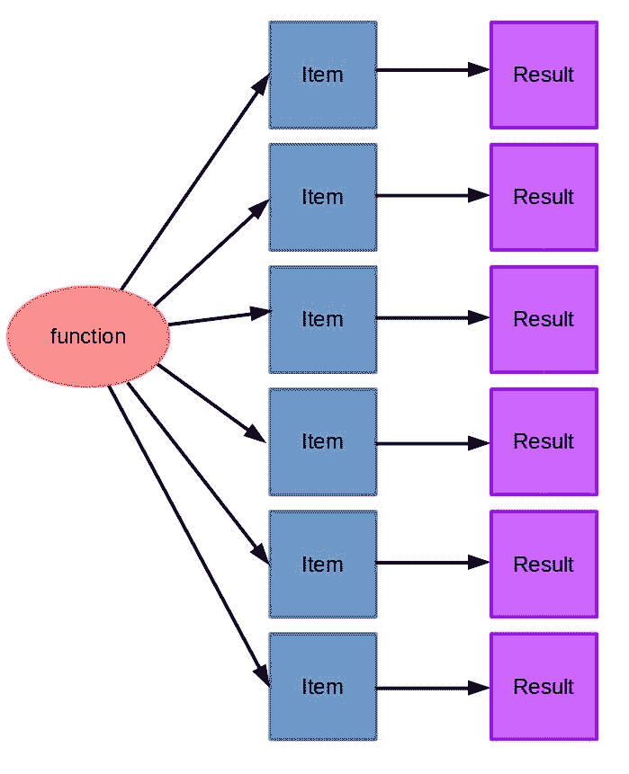
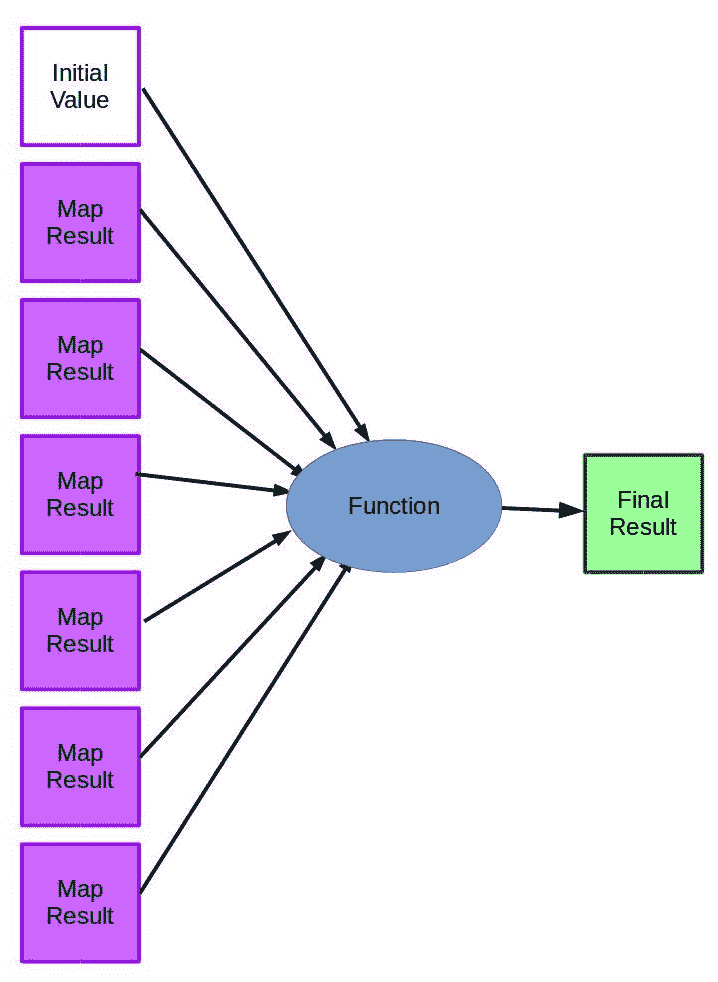

# 第十二章：与大数据一起工作

数据量正在以指数级增长。今天的系统正在生成和记录有关客户行为、分布式系统、网络分析、传感器以及许多其他来源的信息。虽然当前移动数据的大趋势正在推动当前的增长，但下一个大趋势——**物联网（IoT）**——将进一步增加增长速度。

这对数据挖掘意味着一种新的思维方式。需要高运行时间的复杂算法需要改进或丢弃，而可以处理更多样本的简单算法越来越受欢迎。例如，虽然支持向量机是优秀的分类器，但某些变体在处理非常大的数据集时难以使用。相比之下，像逻辑回归这样的简单算法在这些情况下更容易管理。

这种复杂性与分布问题只是深度神经网络（DNNs）变得如此受欢迎的原因之一。你可以使用 DNNs 创建非常复杂的模型，但也可以非常容易地将训练这些模型的负载分布到多台计算机上。

在本章中，我们将探讨以下内容：

+   大数据挑战与应用

+   MapReduce 范式

+   Hadoop MapReduce

+   mrjob，一个在亚马逊 AWS 基础设施上运行 MapReduce 程序的 Python 库

# 大数据

大数据有什么不同之处？大多数大数据倡导者谈论大数据的四个 V：

+   **Volume**：我们生成和存储的数据量正在以越来越快的速度增长，对未来的一般预测只表明将进一步增加。今天的多吉字节大小的硬盘将在几年内变成艾字节大小的硬盘，网络吞吐量也将增加。信号与噪声的比例可能非常困难，重要数据可能丢失在非重要数据的大山中。

+   **Velocity**：虽然与数据量相关，但数据速度也在增加。现代汽车有数百个传感器将数据流式传输到它们的计算机中，而这些传感器提供的信息需要以亚秒级进行分析，以便操作汽车。这不仅仅是找到数据量中的答案；这些答案通常需要迅速得出。在某些情况下，我们甚至没有足够的磁盘空间来存储数据，这意味着我们还需要决定保留哪些数据以供后续分析。

+   **Variety**：具有明确定义列的优质数据集只是我们今天拥有的数据集的一小部分。考虑一下社交媒体帖子，它可能包含文本、照片、用户提及、点赞、评论、视频、地理信息和其他字段。简单地忽略不适合你模型的数据部分会导致信息丢失，但整合这些信息本身可能非常困难。

+   **真实性**：随着数据量的增加，很难确定数据是否被正确收集——是否过时、嘈杂、包含异常值——或者总的来说是否有用。当人类无法可靠地验证数据时，能够信任数据是很困难的。外部数据集越来越多地被合并到内部数据集中，这也引发了更多与数据真实性相关的问题。

这四个主要“V”（其他人还提出了额外的“V”）概述了大数据与仅仅“大量数据”的不同之处。在这些规模下，处理数据的工程问题通常更加困难——更不用说分析问题了。虽然有很多卖假药的人夸大特定产品分析大数据的能力，但很难否认工程挑战和大数据分析潜力。

我们在书中迄今为止使用的算法是将数据集加载到内存中，然后在该内存版本上工作。这在计算速度方面带来了很大的好处（因为使用计算机内存比使用硬盘驱动器快），因为对内存中的数据进行计算比在用它之前加载样本要快得多。此外，内存数据允许我们多次迭代数据，从而提高我们的机器学习模型。

在大数据中，我们不能将数据加载到内存中。在许多方面，这可以作为一个很好的定义，来判断一个问题是否是大数据问题——如果数据可以适合你电脑的内存，那么你就不在处理大数据问题。

当查看你创建的数据时，例如你公司内部应用程序的日志数据，你可能想简单地将其全部放入一个文件中，不进行结构化，以后再使用大数据概念来分析它。最好不要这样做；相反，你应该为你的数据集使用结构化格式。原因是我们刚才概述的四个“V”实际上是需要解决以执行数据分析的问题，而不是需要努力实现的目标！

# 大数据的应用

大数据在公共和私营部门有许多用例。

人们使用基于大数据的系统最常见的体验是在互联网搜索中，例如 Google。为了运行这些系统，需要在不到一秒钟的时间内对数十亿个网站进行搜索。进行基于文本的基本搜索不足以处理这样的问题。简单地存储所有这些网站的文本就是一个大问题。为了处理查询，需要创建和实施专门针对此应用的新数据结构和数据挖掘方法。

大数据也被用于许多其他科学实验，例如大型强子对撞机，其中一部分在下面的图片中展示。它跨越 27 公里，包含 1.5 亿个传感器，每秒监测数亿次粒子碰撞。这个实验的数据量巨大，每天产生 25 拍字节的数据，经过过滤过程（如果没有过滤，每年将有 1.5 亿拍字节的数据）。对如此大量数据的分析导致了关于我们宇宙的惊人见解，但这已经是一个重大的工程和数据分析挑战。


政府越来越多地使用大数据来追踪人口、企业和与其国家相关的其他方面。追踪数百万人和数十亿次的互动（如商业交易或医疗支出）导致许多政府机构需要大数据分析。

交通管理是全球许多政府关注的重点，他们通过数百万个传感器追踪交通情况，以确定哪些道路最拥堵，并预测新道路对交通水平的影响。这些管理系统将在不久的将来与自动驾驶汽车的数据相连，从而获得更多关于实时交通状况的数据。利用这些数据的城市会发现，他们的交通流动更加顺畅。

大型零售组织正在利用大数据来改善客户体验和降低成本。这包括预测客户需求，以便拥有正确的库存水平，向客户推荐他们可能喜欢购买的产品，并跟踪交易以寻找趋势、模式和潜在的欺诈行为。能够自动创建出色预测的公司可以在较低的成本下实现更高的销售额。

其他大型企业也在利用大数据来自动化其业务的一些方面并改善其产品。这包括利用分析来预测其行业未来的趋势和跟踪外部竞争对手。大型企业还使用分析来管理自己的员工——追踪员工以寻找他们可能离职的迹象，以便在他们这样做之前进行干预。

信息安全领域也在利用大数据来寻找大型网络中的恶意软件感染，通过监控网络流量来实现。这可能包括寻找异常流量模式、恶意软件传播的证据和其他异常情况。高级持续性威胁（APTs）也是一个问题，其中一名有动机的攻击者将他们的代码隐藏在大型网络中，以在长时间内窃取信息或造成损害。寻找 APTs 通常需要法医检查许多计算机，这是一个人类难以有效完成的任务。分析有助于自动化和分析这些法医图像以找到感染。

大数据正在越来越多地应用于各个领域和应用程序，这一趋势很可能会持续下去。

# MapReduce

在大数据上进行数据挖掘和一般计算有许多概念。其中最受欢迎的是 MapReduce 模型，它可以用于对任意大型数据集进行一般计算。

MapReduce 起源于谷歌，它是在考虑分布式计算的情况下开发的。它还引入了容错性和可扩展性的改进。MapReduce 的*原始*研究于 2004 年发表，从那时起，已有成千上万个项目、实现和应用使用了它。

虽然这个概念与许多先前的概念相似，但 MapReduce 已经成为大数据分析的一个基本工具。

MapReduce 作业有两个主要阶段。

1.  第一步是 Map，通过它我们取一个函数和一个项目列表，并将该函数应用于每个项目。换句话说，我们将每个项目作为函数的输入，并存储该函数调用的结果：



1.  第二步是 Reduce，在这一步中，我们使用一个函数将 Map 步骤的结果组合起来。对于统计，这可以简单地将所有数字相加。在这个场景中，reduce 函数是一个加法函数，它会将前一个总和与新的结果相加：



在这两个步骤之后，我们将已经转换了我们的数据，并将其减少到最终结果。

MapReduce 作业可以有多个迭代，其中一些只是 Map 作业，一些只是 Reduce 作业，还有一些迭代既有 Map 步骤又有 Reduce 步骤。现在让我们看看一些更具体的例子，首先使用内置的 Python 函数，然后使用特定的 MapReduce 工具。

# MapReduce 背后的直觉

MapReduce 有两个主要步骤：`Map`步骤和`Reduce`步骤。这些步骤建立在将函数映射到列表和减少结果的函数式编程概念之上。为了解释这个概念，我们将开发代码，它将遍历一个列表的列表，并产生这些列表中所有数字的总和。

在 MapReduce 范式中，还有`shuffle`和`combine`步骤，我们将在后面看到。

首先，Map 步骤取一个函数并将其应用于列表中的每个元素。返回的结果是一个大小相同的列表，其中包含对每个元素应用函数的结果。

要打开一个新的 Jupyter Notebook，首先创建一个包含数字的列表的列表：

```py
a = [[1,2,1], [3,2], [4,9,1,0,2]]

```

接下来，我们可以使用求和函数进行`map`操作。这一步将求和函数应用于*a*中的每个元素：

```py
sums = map(sum, a)

```

虽然`sums`是一个生成器（实际值只有在请求时才会计算），但前面的步骤大约等于以下代码：

```py
sums = []
for sublist in a:
    results = sum(sublist)
    sums.append(results)

```

`reduce`步骤稍微复杂一些。它涉及到将一个函数应用于返回结果的每个元素，以及某个起始值。我们从初始值开始，然后应用给定的函数到初始值和第一个值。然后我们将给定的函数应用于结果和下一个值，依此类推

我们首先创建一个函数，该函数接受两个数字并将它们相加。

```py
def add(a, b): 
    return a + b

```

然后，我们执行 reduce 操作。`reduce`的签名是：`reduce(function, sequence, initial)`，其中函数在每一步应用于序列。在第一步中，初始值用作第一个值而不是列表的第一个元素：

```py
from functools import reduce 
print(reduce(add, sums, 0))

```

结果，25，是求和列表中每个值的总和，因此也是原始数组中每个元素的总和。

上述代码类似于以下代码：

```py
initial = 0 
current_result = initial 
for element in sums: 
    current_result = add(current_result, element)

```

在这个简单的例子中，如果我们的代码不使用 MapReduce 范式，那么代码将会大大简化，但真正的收益来自于计算的分布。例如，如果我们有一百万个子列表，并且每个子列表包含一百万个元素，我们可以在多台计算机上分布这个计算。

为了做到这一点，我们通过分割数据来分配`map`步骤。对于我们列表中的每个元素，我们将其以及我们函数的描述发送到一台计算机。然后，这台计算机将结果返回到我们的主计算机（即主节点）。

主节点然后将结果发送到一台计算机进行`reduce`步骤。在我们的例子中，一百万个子列表，我们会将一百万个任务发送到不同的计算机（同一台计算机在完成我们的第一个任务后可能被重复使用）。返回的结果将只是一个包含一百万个数字的单列表，然后我们计算这些数字的总和。

结果是，没有任何计算机需要存储超过一百万个数字，尽管我们的原始数据中包含了一万亿个数字。

# 单词计数示例

任何实际的 MapReduce 实现都比仅仅使用`map`和`reduce`步骤要复杂一些。这两个步骤都是通过键来调用的，这允许数据的分离和值的跟踪。

map 函数接受一个键值对，并返回一个键值对列表。输入和输出的键不一定相互关联。

例如，对于一个执行单词计数的 MapReduce 程序，输入键可能是一个样本文档的 ID 值，而输出键将是给定的单词。输入值将是文档的文本，输出值将是每个单词的频率。我们拆分文档以获取单词，然后产生每个单词、计数对。在这里，单词是键，计数在 MapReduce 术语中是值：

```py
from collections import defaultdict
def map_word_count(document_id, document):
    counts = defaultdict(int) 
    for word in document.split(): 
        counts[word] += 1
    for word in counts: 
        yield (word, counts[word])

```

如果你有一个非常大的数据集？你可以在遇到新单词时直接执行`yield (word, 1)`，然后在洗牌步骤中合并它们，而不是在 map 步骤中进行计数。你放置的位置取决于你的数据集大小、每份文档的大小、网络容量以及一系列其他因素。大数据是一个巨大的工程问题，为了从系统中获得最佳性能，你需要模拟数据在整个算法中的流动方式。

以单词作为关键字，我们就可以执行一个洗牌步骤，该步骤将每个键的所有值分组：

```py
def shuffle_words(results):
    records = defaultdict(list)
    for results in results_generators: 
        for word, count in results: 
            records[word].append(count)
    for word in records: 
        yield (word, records[word])

```

最后一步是减少步骤，它接受一个键值对（在这个例子中，值始终是一个列表）并生成一个键值对作为结果。在我们的例子中，键是单词，输入列表是在洗牌步骤中产生的计数列表，输出值是计数的总和：

```py
def reduce_counts(word, list_of_counts): 
    return (word, sum(list_of_counts))

```

要看到这个动作的实际效果，我们可以使用 scikit-learn 提供的 20 个新闻组数据集。这个数据集不是大数据，但我们可以在这里看到概念的实际应用：

```py
from sklearn.datasets import fetch_20newsgroups 
dataset = fetch_20newsgroups(subset='train') 
documents = dataset.data

```

然后我们应用我们的映射步骤。我们在这里使用 enumerate 来自动为我们生成文档 ID。虽然它们在这个应用中并不重要，但这些键在其他应用中很重要：

```py
map_results = map(map_word_count, enumerate(documents))

```

这里实际的结果只是一个生成器；没有产生实际的计数。尽管如此，它是一个发出（单词，计数）对的生成器。

接下来，我们执行洗牌步骤来对这些单词计数进行排序：

```py
shuffle_results = shuffle_words(map_results)

```

从本质上讲，这是一个 MapReduce 作业；然而，它只在一个线程上运行，这意味着我们没有从 MapReduce 数据格式中获得任何好处。在下一节中，我们将开始使用 Hadoop，一个开源的 MapReduce 提供者，以开始获得这种类型范式的好处。

# Hadoop MapReduce

Hadoop 是 Apache 提供的一系列开源工具，包括 MapReduce 的一个实现。在许多情况下，它是许多人所使用的默认实现。该项目由 Apache 集团管理（他们负责同名的著名网络服务器）。

Hadoop 生态系统相当复杂，包含大量工具。我们将使用的主要组件是 Hadoop MapReduce。Hadoop 中包含的其他用于处理大数据的工具如下：

+   **Hadoop 分布式文件系统（HDFS）**：这是一个可以在多台计算机上存储文件的文件系统，旨在在提供高带宽的同时，对硬件故障具有鲁棒性。

+   **YARN**：这是一种用于调度应用程序和管理计算机集群的方法。

+   **Pig**：这是一种用于 MapReduce 的高级编程语言。Hadoop MapReduce 是用 Java 实现的，而 Pig 位于 Java 实现之上，允许你用其他语言编写程序——包括 Python。

+   **Hive**：这是用于管理数据仓库和执行查询的。

+   **HBase**：这是 Google 的 BigTable 的一个实现，一个分布式数据库。

这些工具都解决了在大数据实验中出现的问题，包括数据分析。

还有基于非 Hadoop 的 MapReduce 实现，以及其他具有类似目标的项目。此外，许多云服务提供商都有基于 MapReduce 的系统。

# 应用 MapReduce

在这个应用程序中，我们将研究根据作者使用不同词汇来预测作者的性别。我们将使用朴素贝叶斯方法进行此操作，并在 MapReduce 中进行训练。最终的模型不需要 MapReduce，尽管我们可以使用 Map 步骤来这样做——也就是说，在列表中的每个文档上运行预测模型。这是 MapReduce 中数据挖掘的常见 Map 操作，而 reduce 步骤只是组织预测列表，以便可以追溯到原始文档。

我们将使用亚马逊的基础设施来运行我们的应用程序，这样我们可以利用他们的计算资源。

# 获取数据

我们将要使用的数据是一组标记了年龄、性别、行业（即工作）以及有趣的是，星座的博客。这些数据是在 2004 年 8 月从[`blogger.com`](http://blogger.com)收集的，包含超过 600,000 篇帖子，超过 1.4 亿个单词。每篇博客*可能*是由一个人写的，尽管我们投入了一些工作来验证这一点（尽管，我们永远不能完全确定）。帖子还与发布日期相匹配，这使得这是一个非常丰富的数据集。

要获取数据，请访问[`u.cs.biu.ac.il/~koppel/BlogCorpus.htm`](http://u.cs.biu.ac.il/~koppel/BlogCorpus.htm)并点击下载语料库。从那里，将文件解压缩到您的计算机上的一个目录中。

数据集以单个博客对应一个文件的方式组织，文件名表示类别。例如，以下是一个文件名：

```py
1005545.male.25.Engineering.Sagittarius.xml

```

文件名由点分隔，字段如下：

+   **博主 ID**：这是一个简单的 ID 值，用于组织身份。

+   **性别**：这是男性或女性，所有博客都被标识为这两种选项之一（此数据集中不包含其他选项）。

+   **年龄**：给出了确切的年龄，但故意存在一些间隔。存在的年龄范围在（包含）13-17 岁、23-27 岁和 33-48 岁之间。存在间隔的原因是为了允许将博客分成有间隔的年龄范围，因为将 18 岁年轻人的写作与 19 岁年轻人的写作区分开来相当困难，而且年龄本身可能已经有些过时，可能需要更新到 19 岁。

+   **行业**：包括科学、工程、艺术和房地产在内的 40 个不同行业中。还包括 indUnk，表示未知行业。

+   **星座**：这是 12 个占星术星座之一。

所有值都是自行报告的，这意味着可能会有错误或不一致，但假设它们大多是可靠的——人们有选择不设置值以保护他们隐私的方式。

单个文件采用伪 XML 格式，包含一个`<Blog>`标签，然后是一系列`<post>`标签。每个`<post>`标签之前都有一个`<date>`标签。虽然我们可以将其解析为 XML，但由于文件并非完全符合良好格式的 XML，存在一些错误（主要是编码问题），因此按行逐行解析要简单得多。为了读取文件中的帖子，我们可以使用循环遍历行。

我们设置一个测试文件名，以便我们可以看到这个动作：

```py
import os 
filename = os.path.join(os.path.expanduser("~"), "Data", "blogs", "1005545.male.25.Engineering.Sagittarius.xml")

```

首先，我们创建一个列表，以便我们可以存储每篇帖子：

```py
all_posts = []

```

然后，我们打开文件进行读取：

```py
with open(filename) as inf:
    post_start = False
    post = []
    for line in inf: 
        line = line.strip()
        if line == "<post>":
            # Found a new post
            post_start = True 
        elif line == "</post>":
            # End of the current post, append to our list of posts and start a new one
            post_start = False
            all_posts.append("n".join(post))
            post = []
        elif post_start:
            # In a current post, add the line to the text of the post
            post.append(line)

```

如果我们不在当前帖子中，我们只需忽略该行。

然后，我们可以获取每篇帖子的文本：

```py
print(all_posts[0])

```

我们还可以找出这位作者创建了多少篇帖子：

```py
print(len(all_posts))

```

# 朴素贝叶斯预测

现在，我们将使用 mrjob 实现朴素贝叶斯算法，使其能够处理我们的数据集。技术上，我们的版本将是大多数朴素贝叶斯实现的一个简化版本，没有许多您预期的功能，如平滑小值。

# mrjob 包

**mrjob**包允许我们创建可以在亚马逊基础设施上轻松计算的 MapReduce 作业。虽然 mrjob 听起来像是儿童书籍《先生们》系列的一个勤奋的补充，但它代表的是**Map Reduce Job**。

您可以使用以下命令安装 mrjob：`pip install ``mrjob`

我不得不单独使用`conda install -c conda-forge filechunkio`安装 filechunkio 包，但这将取决于您的系统设置。还有其他 Anaconda 通道可以安装 mrjob，您可以使用以下命令检查它们：

`anaconda search -t conda mrjob`

事实上，mrjob 提供了大多数 MapReduce 作业所需的标准功能。它最令人惊叹的功能是您可以编写相同的代码，在本地机器上测试（无需像 Hadoop 这样的重基础设施），然后推送到亚马逊的 EMR 服务或另一个 Hadoop 服务器。

这使得测试代码变得容易得多，尽管它不能神奇地将大问题变小——任何本地测试都使用数据集的子集，而不是整个大数据集。相反，mrjob 为您提供了一个框架，您可以使用小问题进行测试，并更有信心解决方案可以扩展到更大的问题，分布在不同的系统上。

# 提取博客帖子

我们首先将创建一个 MapReduce 程序，该程序将从每个博客文件中提取每篇帖子，并将它们作为单独的条目存储。由于我们对帖子的作者性别感兴趣，我们还将提取该信息并将其与帖子一起存储。

我们不能在 Jupyter Notebook 中做这件事，所以相反，打开一个 Python IDE 进行开发。如果您没有 Python IDE，可以使用文本编辑器。我推荐 PyCharm，尽管它有一个较大的学习曲线，而且可能对于本章的代码来说有点重。

至少，我推荐使用具有语法高亮和基本变量名补全的 IDE（最后一个有助于轻松找到代码中的错误）。

如果您仍然找不到喜欢的 IDE，您可以在 IPython 笔记本中编写代码，然后点击文件|下载为|Python。将此文件保存到目录中，然后按照我们在第十一章中概述的方式运行它，*使用深度学习对图像中的对象进行分类*。

要做到这一点，我们需要`os`和`re`库，因为我们将会获取环境变量，我们还将使用正则表达式进行单词分隔：

```py
import os 
import re

```

然后我们导入 MRJob 类，我们将从我们的 MapReduce 作业中继承它：

```py
from mrjob.job import MRJob

```

然后，我们创建一个新的类，该类继承自 MRJob。我们将使用与之前类似的循环来从文件中提取博客文章。我们将定义的映射函数将针对每一行工作，这意味着我们必须在映射函数外部跟踪不同的帖子。因此，我们将`post_start`和`post`作为类变量，而不是函数内部的变量。然后我们定义我们的映射函数——这个函数从文件中读取一行作为输入，并产生博客文章。这些行保证是从同一个作业文件中按顺序排列的。这允许我们使用上面的类变量来记录当前帖子数据：

```py
class ExtractPosts(MRJob):
    post_start = False 
    post = []

    def mapper(self, key, line):
        filename = os.environ["map_input_file"]
        # split the filename to get the gender (which is the second token)
        gender = filename.split(".")[1]
        line = line.strip()
        if line == "<post>":
            self.post_start = True
        elif line == "</post>":
            self.post_start = False
            yield gender, repr("n".join(self.post))
            self.post = []
        elif self.post_start:
            self.post.append(line)

```

与我们之前将帖子存储在列表中的做法不同，我们现在产生它们。这允许 mrjob 跟踪输出。我们产生性别和帖子，这样我们就可以记录每个记录匹配的性别。这个函数的其余部分与上面的循环定义方式相同。

最后，在函数和类外部，我们将脚本设置为在从命令行调用时运行此 MapReduce 作业：

```py
if __name__ == '__main__': 
 ExtractPosts.run()

```

现在，我们可以使用以下 shell 命令运行此 MapReduce 作业。

```py
$ python extract_posts.py <your_data_folder>/blogs/51* 
 --output-dir=<your_data_folder>/blogposts --no-output

```

提醒一下，您不需要在上面的行中输入$ - 这只是表示这是一个从命令行运行的命令，而不是在 Jupyter 笔记本中。

第一个参数，`<your_data_folder>/blogs/51*`（只需记住将`<your_data_folder>`更改为您数据文件夹的完整路径），获取数据样本（所有以 51 开头的文件，这只有 11 个文档）。然后我们将输出目录设置为一个新的文件夹，我们将它放在数据文件夹中，并指定不要输出流数据。如果没有最后一个选项，当运行时，输出数据会显示在命令行上——这对我们来说并不很有帮助，并且会大大减慢计算机的速度。

运行脚本，并且相当快地，每篇博客文章都会被提取并存储在我们的输出文件夹中。这个脚本只在本地计算机上的单个线程上运行，所以我们根本得不到加速，但我们知道代码是运行的。

现在，我们可以在输出文件夹中查看结果。创建了一堆文件，每个文件都包含每篇博客文章，每篇文章之前都标有博客作者的性别。

# 训练朴素贝叶斯

既然我们已经提取了博客文章，我们就可以在它们上面训练我们的朴素贝叶斯模型。直觉是，我们记录一个词被特定性别写下的概率，并将这些值记录在我们的模型中。为了分类一个新的样本，我们将乘以概率并找到最可能的性别。

这段代码的目的是输出一个文件，列出语料库中的每个单词，以及该单词在每个性别写作中的频率。输出文件看起来可能像这样：

```py
"'ailleurs" {"female": 0.003205128205128205}
"'air" {"female": 0.003205128205128205}
"'an" {"male": 0.0030581039755351682, "female": 0.004273504273504274}
"'angoisse" {"female": 0.003205128205128205}
"'apprendra" {"male": 0.0013047113868622459, "female": 0.0014172668603481887}
"'attendent" {"female": 0.00641025641025641}
"'autistic" {"male": 0.002150537634408602}
"'auto" {"female": 0.003205128205128205}
"'avais" {"female": 0.00641025641025641}
"'avait" {"female": 0.004273504273504274}
"'behind" {"male": 0.0024390243902439024} 
"'bout" {"female": 0.002034152292059272}

```

第一个值是单词，第二个是一个将性别映射到该性别写作中该单词频率的字典。

在你的 Python IDE 或文本编辑器中打开一个新的文件。我们还需要`os`和`re`库，以及来自`mrjob`的`NumPy`和`MRJob`。我们还需要`itemgetter`，因为我们将会对一个字典进行排序：

```py
import os 
import re 
import numpy as np 
from mrjob.job import MRJob 
from operator import itemgetter

```

我们还需要`MRStep`，它概述了 MapReduce 作业中的一个步骤。我们之前的作业只有一个步骤，它被定义为映射函数然后是减少函数。这个作业将会有多个步骤，我们将进行映射、减少，然后再进行映射和减少。直觉与我们在早期章节中使用的管道相同，其中一步的输出是下一步的输入：

```py
from mrjob.step import MRStep

```

我们然后创建我们的单词搜索正则表达式并编译它，这样我们就可以找到单词边界。这种正则表达式比我们在一些早期章节中使用的简单分割更强大，但如果你在寻找一个更准确的单词分割器，我建议使用 NLTK 或 Spacey，就像我们在第六章<q>，使用朴素贝叶斯进行社交媒体洞察</q>中做的那样：

```py
word_search_re = re.compile(r"[w']+") 

```

我们为我们的训练定义了一个新的类。我首先会提供一个完整的代码块，然后我们将回到每个部分来回顾它所做的工作：

```py
class NaiveBayesTrainer(MRJob):

    def steps(self):
    return [
            MRStep(mapper=self.extract_words_mapping,
                   reducer=self.reducer_count_words),
            MRStep(reducer=self.compare_words_reducer),
    ]

    def extract_words_mapping(self, key, value):
        tokens = value.split()
        gender = eval(tokens[0])
        blog_post = eval(" ".join(tokens[1:]))
        all_words = word_search_re.findall(blog_post)
        all_words = [word.lower() for word in all_words]
        for word in all_words:
            # Occurence probability
            yield (gender, word), 1\. / len(all_words)

    def reducer_count_words(self, key, counts):
        s = sum(counts)
        gender, word = key #.split(":")
        yield word, (gender, s)

    def compare_words_reducer(self, word, values):
        per_gender = {}
        for value in values:
            gender, s = value
            per_gender[gender] = s
            yield word, per_gender

    def ratio_mapper(self, word, value):
        counts = dict(value)
        sum_of_counts = float(np.mean(counts.values()))
        maximum_score = max(counts.items(), key=itemgetter(1))
        current_ratio = maximum_score[1] / sum_of_counts
        yield None, (word, sum_of_counts, value)

    def sorter_reducer(self, key, values):
        ranked_list = sorted(values, key=itemgetter(1), reverse=True)
        n_printed = 0
        for word, sum_of_counts, scores in ranked_list:
            if n_printed < 20:
                print((n_printed + 1), word, scores)
            n_printed += 1
        yield word, dict(scores)

```

让我们一步一步地看看这个代码的各个部分：

```py
class NaiveBayesTrainer(MRJob):

```

我们定义了我们的 MapReduce 作业的步骤。有两个步骤：

第一步将提取单词出现概率。第二步将比较两个性别，并将每个性别的概率输出到我们的输出文件。在每个 MRStep 中，我们定义映射器和减少器函数，这些函数是这个朴素贝叶斯训练器类中的类函数（我们将在下面编写这些函数）：

```py
    def steps(self):
        return [
            MRStep(mapper=self.extract_words_mapping,
                   reducer=self.reducer_count_words),
            MRStep(reducer=self.compare_words_reducer),
        ]

```

第一个函数是第一步的映射器函数。这个函数的目标是取每一篇博客文章，获取该文章中的所有单词，并记录出现次数。我们想要单词的频率，所以我们将返回`1 / len(all_words)`，这样我们就可以在之后对频率值求和。这里的计算并不完全正确——我们需要对文档数量进行归一化。然而，在这个数据集中，类的大小是相同的，所以我们方便地忽略这一点，对最终版本的影响很小。

我们还输出了文章作者的性别，因为我们稍后会需要它：

```py
    def extract_words_mapping(self, key, value):
        tokens = value.split()
        gender = eval(tokens[0])
        blog_post = eval(" ".join(tokens[1:]))
        all_words = word_search_re.findall(blog_post)
        all_words = [word.lower() for word in all_words]
        for word in all_words:
            # Occurence probability
            yield (gender, word), 1\. / len(all_words)

```

我们在上一段代码中使用了`eval`来简化从文件中解析博客文章的过程，为了这个示例。这并不推荐。相反，使用 JSON 这样的格式来正确存储和解析文件中的数据。一个可以访问数据集的恶意用户可以将代码插入这些标记中，并让这些代码在您的服务器上运行。

在第一步的 reducer 中，我们为每个性别和单词对的总频率求和。我们还更改了键，使其成为单词，而不是组合，这样当我们使用最终训练好的模型进行搜索时，我们可以按单词搜索（尽管，我们仍然需要输出性别以供以后使用）；

```py
    def reducer_count_words(self, key, counts):
        s = sum(counts)
        gender, word = key #.split(":")
        yield word, (gender, s)

```

最后一步不需要 mapper 函数，这就是为什么我们没有添加一个。数据将直接作为一种类型的身份 mapper 通过。然而，reducer 将合并给定单词下的每个性别的频率，然后输出单词和频率字典。

这为我们朴素贝叶斯实现提供了所需的信息：

```py
    def compare_words_reducer(self, word, values):
        per_gender = {}
        for value in values:
            gender, s = value
            per_gender[gender] = s
            yield word, per_gender

```

最后，我们将代码设置为在文件作为脚本运行时运行此模型。我们需要将此代码添加到文件中：

```py
if __name__ == '__main__': 
 NaiveBayesTrainer.run()

```

然后，我们可以运行这个脚本。这个脚本的输入是上一个后提取脚本（如果您愿意，实际上可以将它们作为同一个 MapReduce 作业中的不同步骤）的输出；

```py
$ python nb_train.py <your_data_folder>/blogposts/ 
 --output-dir=<your_data_folder>/models/ --no-output

```

输出目录是一个文件夹，将存储包含 MapReduce 作业输出的文件，这将是我们运行朴素贝叶斯分类器所需的概率。

# 将所有内容整合在一起

我们现在可以使用这些概率实际运行朴素贝叶斯分类器。我们将使用 Jupyter Notebook 来完成这项工作，尽管这个处理本身可以被转移到 mrjob 包中，以进行大规模处理。

首先，查看在上一个 MapReduce 作业中指定的`models`文件夹。如果输出文件多于一个，我们可以通过将它们附加在一起来合并文件，使用`models`目录内的命令行功能：

```py
cat * > model.txt

```

如果这样做，您需要更新以下代码，将`model.txt`作为模型文件名。

回到我们的 Notebook，我们首先导入一些标准导入，这些导入对于我们的脚本来说是必需的：

```py
import os 
import re
import numpy as np 
from collections import defaultdict 
from operator import itemgetter

```

我们再次重新定义我们的单词搜索正则表达式——如果您在实际应用中这样做，我建议集中化功能。对于训练和测试来说，单词的提取方式必须相同：

```py
word_search_re = re.compile(r"[w']+")

```

接下来，我们创建一个函数，从给定的文件名中加载我们的模型。模型参数将采用字典的字典形式，其中第一个键是一个单词，内部字典将每个性别映射到一个概率。我们使用`defaultdicts`，如果值不存在，则返回零；

```py
def load_model(model_filename):
    model = defaultdict(lambda: defaultdict(float))
    with open(model_filename) as inf: 
        for line in inf:
            word, values = line.split(maxsplit=1) 
            word = eval(word) 
            values = eval(values)
            model[word] = values
    return model

```

这行被分成两个部分，由空格分隔。第一部分是单词本身，第二部分是概率的字典。对于每个部分，我们运行`eval`以获取实际值，该值在之前的代码中使用`repr`存储。

接下来，我们加载我们的实际模型。你可能需要更改模型文件名——它将在最后一个 MapReduce 作业的输出目录中；

```py
model_filename = os.path.join(os.path.expanduser("~"), "models", "part-00000") 
model = load_model(model_filename)

```

例如，我们可以看到在男性与女性之间，单词 *i*（在 MapReduce 作业中所有单词都转换为小写）的使用差异：

```py
model["i"]["male"], model["i"]["female"]

```

接下来，我们创建一个函数，该函数可以使用这个模型进行预测。在这个例子中，我们不会使用 scikit-learn 接口，而是创建一个函数。我们的函数接受模型和文档作为参数，并返回最可能的性别：

```py
def nb_predict(model, document):
    probabilities = defaultdict(lambda : 1)
    words = word_search_re.findall(document)
    for word in set(words): 
        probabilities["male"] += np.log(model[word].get("male", 1e-15)) 
        probabilities["female"] += np.log(model[word].get("female", 1e-15))
        most_likely_genders = sorted(probabilities.items(), key=itemgetter(1), reverse=True) 
    return most_likely_genders[0][0]

```

重要的是要注意，我们使用了`np.log`来计算概率。朴素贝叶斯模型中的概率通常非常小。对于许多统计值来说，乘以小值是必要的，这可能导致下溢错误，即计算机的精度不够好，整个值变成 0。在这种情况下，这会导致两种性别的似然值都为零，从而导致预测错误。

为了解决这个问题，我们使用对数概率。对于两个值 a 和 b，*log(a× b)* 等于 *log(a) + log(b)*。小概率的对数是一个负值，但相对较大。例如，log(0.00001)大约是-11.5。这意味着，而不是乘以实际概率并冒着下溢错误的风险，我们可以相加对数概率，并以相同的方式比较值（数值仍然表示更高的可能性）。

如果你想要从对数概率中获取概率，确保通过使用 e 的幂来撤销对数操作。要将-11.5 转换成概率，取 e^(-11.5)，这等于 0.00001（大约）。

使用对数概率的一个问题是它们不能很好地处理零值（尽管，乘以零概率也不能）。这是因为对数(0)是未定义的。在一些朴素贝叶斯实现中，为了解决这个问题，会将所有计数加 1，但还有其他方法可以解决这个问题。这是对数值进行简单平滑的一种形式。在我们的代码中，如果对于给定的性别没有看到这个单词，我们只返回一个非常小的值。

在所有计数上加一是平滑的一种形式。另一种选择是初始化到一个非常小的值，例如 10^(-16)——只要它不是正好是 0！

回到我们的预测函数，我们可以通过复制数据集中的一个帖子来测试这个函数：

```py
new_post = """ Every day should be a half day. Took the afternoon off to hit the dentist, and while I was out I managed to get my oil changed, too. Remember that business with my car dealership this winter? Well, consider this the epilogue. The friendly fellas at the Valvoline Instant Oil Change on Snelling were nice enough to notice that my dipstick was broken, and the metal piece was too far down in its little dipstick tube to pull out. Looks like I'm going to need a magnet. Damn you, Kline Nissan, daaaaaaammmnnn yooouuuu.... Today I let my boss know that I've submitted my Corps application. The news has been greeted by everyone in the company with a level of enthusiasm that really floors me. The back deck has finally been cleared off by the construction company working on the place. This company, for anyone who's interested, consists mainly of one guy who spends his days cursing at his crew of Spanish-speaking laborers. Construction of my deck began around the time Nixon was getting out of office.
"""

```

然后，我们使用以下代码进行预测：

```py
nb_predict(model, new_post)

```

结果预测，*男性*，对于这个例子是正确的。当然，我们永远不会在单个样本上测试一个模型。我们使用了以 51 开头的文件来训练这个模型。样本并不多，所以我们不能期望很高的准确度。

我们应该做的第一件事是在更多样本上训练。我们将测试以 6 或 7 开头的任何文件，并在其余文件上训练。

在命令行和你的数据文件夹（`cd <your_data_folder>`），其中存在博客文件夹，将博客文件夹复制到一个新文件夹中。

为我们的训练集创建一个文件夹：

```py
mkdir blogs_train

```

将以 6 或 7 开头的任何文件移动到测试集，从训练集中：

```py
cp blogs/4* blogs_train/ 
cp blogs/8* blogs_train/

```

然后，为我们的测试集创建一个文件夹：

```py
mkdir blogs_test

```

将以 6 或 7 开头的任何文件移动到测试集，从训练集中：

```py
cp blogs/6* blogs_test/ 
cp blogs/7* blogs_test/

```

我们将在训练集中的所有文件上重新运行博客提取。然而，这是一个更适合云基础设施而不是我们系统的大计算量。因此，我们现在将解析工作迁移到亚马逊的基础设施。

在命令行上运行以下命令，就像之前一样。唯一的区别是我们将在不同的输入文件文件夹上训练。在运行以下代码之前，请删除博客文章和模型文件夹中的所有文件：

```py
$ python extract_posts.py ~/Data/blogs_train --output-dir=/home/bob/Data/blogposts_train --no-output

```

接下来是训练我们的朴素贝叶斯模型。这里的代码运行时间会相当长。可能需要很多很多小时。除非你有一个非常强大的系统，否则你可能想跳过本地运行这一步！如果你想跳过，请转到下一节。

```py
$ python nb_train.py ~/Data/blogposts_train/ --output-dir=/home/bob/models/ --no-output

```

我们将在测试集中的任何博客文件上进行测试。为了获取这些文件，我们需要提取它们。我们将使用`extract_posts.py` MapReduce 作业，但将文件存储在单独的文件夹中：

```py
python extract_posts.py ~/Data/blogs_test --output-dir=/home/bob/Data/blogposts_test --no-output

```

在 Jupyter Notebook 中，我们列出所有输出的测试文件：

```py
testing_folder = os.path.join(os.path.expanduser("~"), "Data", "blogposts_testing") 
testing_filenames = [] 
for filename in os.listdir(testing_folder): 
    testing_filenames.append(os.path.join(testing_folder, filename))

```

对于这些文件中的每一个，我们提取性别和文档，然后调用预测函数。我们这样做是因为有很多文档，我们不希望使用太多内存。生成器产生实际的性别和预测的性别：

```py
def nb_predict_many(model, input_filename): 
    with open(input_filename) as inf: # remove leading and trailing whitespace 
    for line in inf: 
        tokens = line.split() 
        actual_gender = eval(tokens[0]) 
        blog_post = eval(" ".join(tokens[1:])) 
        yield actual_gender, nb_predict(model, blog_post)

```

然后，我们在整个数据集上记录预测和实际的性别。这里的预测要么是男性，要么是女性。为了使用 scikit-learn 中的`f1_score`函数，我们需要将这些转换为 1 和 0。为了做到这一点，我们记录性别为男性时为 0，性别为女性时为 1。为此，我们使用布尔测试，查看性别是否为女性。然后，我们使用 NumPy 将这些布尔值转换为`int`：

```py
y_true = []
y_pred = [] 
for actual_gender, predicted_gender in nb_predict_many(model, testing_filenames[0]):                    
    y_true.append(actual_gender == "female")   
    y_pred.append(predicted_gender == "female") 
    y_true = np.array(y_true, dtype='int') 
    y_pred = np.array(y_pred, dtype='int')

```

现在，我们使用 scikit-learn 中的 F1 分数来测试这个结果的质量：

```py
from sklearn.metrics import f1_score 
print("f1={:.4f}".format(f1_score(y_true, y_pred, pos_label=None)))

```

0.78 的结果相当合理。我们可能可以通过使用更多数据来提高这个结果，但为了做到这一点，我们需要迁移到一个更强大的基础设施，它可以处理这些数据。

# 在亚马逊的 EMR 基础设施上训练

我们将使用亚马逊的**弹性映射减少**（**EMR**）基础设施来运行我们的解析和模型构建作业。

为了做到这一点，我们首先需要在亚马逊的存储云中创建一个存储桶。为此，通过访问[`console.aws.amazon.com/s3`](http://console.aws.amazon.com/s3)在您的网络浏览器中打开亚马逊 S3 控制台，并点击创建存储桶。记住存储桶的名称，因为我们稍后会用到它。

右键单击新存储桶并选择属性。然后，更改权限，授予所有人完全访问权限。这通常不是一种好的安全实践，我建议您在完成本章后更改访问权限。您可以使用亚马逊服务的高级权限来授予您的脚本访问权限，并防止第三方查看您的数据。

左键单击存储桶以打开它，然后单击创建文件夹。将文件夹命名为 blogs_train。我们将把我们的训练数据上传到这个文件夹，以便在云上进行处理。

在您的计算机上，我们将使用亚马逊的 AWS CLI，这是亚马逊云上处理的一个命令行界面。

要安装它，请使用以下命令：

```py
sudo pip install awscli

```

按照以下说明设置此程序的凭证：[`docs.aws.amazon.com/cli/latest/userguide/cli-chap-getting-set-up.html`](http://docs.aws.amazon.com/cli/latest/userguide/cli-chap-getting-set-up.html)

我们现在想要将我们的数据上传到我们的新存储桶。首先，我们需要创建我们的数据集，即所有不以 6 或 7 开头的博客。虽然还有更优雅的方式来执行这个复制操作，但没有一个是足够跨平台的，值得推荐。相反，只需简单地复制所有文件，然后从训练数据集中删除以 6 或 7 开头的文件：

```py
cp -R ~/Data/blogs ~/Data/blogs_train_large 
rm ~/Data/blogs_train_large/blogs/6* 
rm ~/Data/blogs_train_large/blogs/7*

```

接下来，将数据上传到您的亚马逊 S3 存储桶。请注意，这将花费一些时间，并且会使用相当多的上传数据（数百万字节）。对于那些互联网连接较慢的用户，在更快连接的地方进行此操作可能值得；

```py
aws s3 cp ~/Data/blogs_train_large/ s3://ch12/blogs_train_large --recursive --exclude "*" 
--include "*.xml"

```

我们将使用 mrjob 连接到亚马逊的 EMR（弹性映射减少），它为我们处理整个流程；它只需要我们的凭证来完成这项任务。按照[`pythonhosted.org/mrjob/guides/emr-quickstart.html`](https://pythonhosted.org/mrjob/guides/emr-quickstart.html)中的说明，使用您的亚马逊凭证设置 mrjob。

完成此操作后，我们仅对 mrjob 运行进行轻微的修改，以便在亚马逊 EMR 上运行。我们只需告诉 mrjob 使用-r 开关来使用 emr，然后设置我们的 s3 容器作为输入和输出目录。尽管这将运行在亚马逊的基础设施上，但它仍然需要相当长的时间来运行，因为 mrjob 的默认设置使用的是单个低功耗计算机。

```py
$ python extract_posts.py -r emr s3://ch12gender/blogs_train_large/ 
--output-dir=s3://ch12/blogposts_train/ --no-output 
$ python nb_train.py -r emr s3://ch12/blogposts_train/ --output-dir=s3://ch12/model/ --o-output

```

您将因使用 S3 和 EMR 而付费。这只会花费几美元，但如果您打算继续运行作业或在更大的数据集上执行其他作业，请记住这一点。我运行了大量的作业，总共花费了大约 20 美元。仅运行这些作业应该不到 4 美元。然而，您可以通过访问[`console.aws.amazon.com/billing/home`](https://console.aws.amazon.com/billing/home)来检查您的余额并设置价格警报；

blogposts_train 和 model 文件夹的存在并不是必需的——它们将由 EMR 创建。实际上，如果它们存在，你会得到一个错误。如果你要重新运行，只需将这些文件夹的名称更改为新的名称，但请记住将两个命令都改为相同的名称（即第一个命令的输出目录是第二个命令的输入目录）。

如果你感到不耐烦，你可以在一段时间后停止第一个任务，只需使用到目前为止收集到的训练数据。我建议至少让任务运行 15 分钟，可能至少一个小时。但是，你不能停止第二个任务并得到好的结果；第二个任务可能需要比第一个任务长两到三倍的时间。

如果你有能力购买更先进的硬件，mrjob 支持在 Amazon 的基础设施上创建集群，并且也支持使用更强大的计算硬件。你可以在命令行中指定类型和数量来在机器集群上运行一个任务。例如，要使用 16 台 c1.medium 计算机提取文本，请运行以下命令：

```py
$ python extract_posts.py -r emr s3://chapter12/blogs_train_large/blogs/ --output-dir=s3://chapter12/blogposts_train/ --no-output  --instance-type c1.medium --num-core-instances 16

```

此外，你可以单独创建集群并将任务重新附加到这些集群上。有关此过程的更多信息，请参阅 mrjob 的文档[`pythonhosted.org/mrjob/guides/emr-advanced.html`](https://pythonhosted.org/mrjob/guides/emr-advanced.html)。请注意，更高级的选项是 mrjob 的高级功能和 Amazon 的 AWS 基础设施的高级功能之间的交互，这意味着你需要研究这两种技术以获得强大的处理能力。请注意，如果你运行更多更强大的硬件实例，你将相应地支付更多费用。

现在，你可以回到 s3 控制台并从你的存储桶中下载输出模型。将其保存在本地后，我们可以回到我们的 Jupyter Notebook 并使用新的模型。我们在此重新输入代码——只有差异被突出显示，只是为了更新到我们的新模型：

```py
ws_model_filename = os.path.join(os.path.expanduser("~"), "models", "aws_model")
aws_model = load_model(aws_model_filename) 
y_true = [] 
y_pred = [] 
for actual_gender, predicted_gender in nb_predict_many(aws_model, testing_filenames[0]):
    y_true.append(actual_gender == "female") 
    y_pred.append(predicted_gender == "female") 
y_true = np.array(y_true, dtype='int') 
y_pred = np.array(y_pred, dtype='int') 
print("f1={:.4f}".format(f1_score(y_true, y_pred, pos_label=None)))

```

结果更好，达到 0.81。

如果一切按计划进行，你可能想从 Amazon S3 中删除该存储桶——你将为此付费。

# 摘要

在本章中，我们讨论了在大数据上运行任务。根据大多数标准，我们的数据集实际上相当小——只有几百兆字节。许多工业数据集要大得多，因此需要额外的处理能力来执行计算。此外，我们使用的算法可以根据不同的任务进行优化，以进一步提高可扩展性。

我们的方法从博客文章中提取单词频率，以预测文档作者的性别。我们使用基于 mrjob 的 MapReduce 项目提取博客和单词频率。有了这些提取的数据，我们就可以执行类似朴素贝叶斯（Naive Bayes）的计算来预测新文档的性别。

我们只是触及了 MapReduce 所能做到的一小部分，而且在这个应用中甚至没有充分利用它的全部潜力。为了进一步吸取教训，将预测函数转换为 MapReduce 作业。也就是说，你在 MapReduce 上训练模型以获得一个模型，然后使用 MapReduce 运行模型以获取预测列表。通过在 MapReduce 中执行评估来扩展这一过程，最终结果简单地以 F1 分数的形式返回！

我们可以使用 mrjob 库在本地进行测试，然后自动设置并使用亚马逊的 EMR 云基础设施。您可以使用其他云基础设施，甚至自定义构建的亚马逊 EMR 集群来运行这些 MapReduce 作业，但需要做一些额外的调整才能使它们运行。
