# 第四章：让应用程序理解命令

> “LUIS 在从原型到生产的过程中为我们节省了大量的时间。”
> 
> - Eyal Yavor，Meekan 的联合创始人兼 CTO

在前面的章节中，我们专注于视觉 API。从本章开始，我们将转向语言 API，我们将从**语言理解智能服务**（**LUIS**）开始。在本章中，您将学习如何创建和维护语言理解模型。

到本章结束时，我们将涵盖以下主题：

+   创建语言理解模型

+   使用 Bing 和 Cortana 预构建模型处理常见请求

# 创建语言理解模型

有时，我们可能希望我们的电脑能理解我们的需求。在我们日常的业务中，我们希望能够用常规句子与电脑或手机交谈。没有额外的帮助，这是很难做到的。

利用 LUIS 的力量，我们现在可以解决这个问题。通过创建语言理解模型，我们可以让应用程序理解用户的需求。我们还可以识别关键数据，这通常是您希望成为查询或命令一部分的数据。如果您正在询问某个问题的最新新闻，那么关键数据就是您所询问的新闻的主题。

## 创建应用程序

要开始使用 LUIS，你应该前往[`www.luis.ai`](https://www.luis.ai)。这是我们设置应用程序的地方。点击**登录或创建账户**按钮开始。

让我们创建我们的第一个应用程序。从顶部菜单点击**我的应用**。这应该会带您回到应用程序列表，列表应该是空的。点击**新建应用**。

在显示的表格中，我们填写有关我们应用程序的信息。我们需要给应用程序起一个名字。我们还需要指出一个非典型使用场景，默认设置为**其他（请指定**）。相反，将其设置为**SmartHouseApplication**。此应用程序属于**工具**领域。我们将选择英语**应用程序文化**。

可用的其他语言包括巴西葡萄牙语、中文、法语、德语、意大利语、日语和西班牙语。

下面的截图显示了我们可以如何定义应用程序：


当你点击**创建**按钮时，应用程序将被创建。这个过程大约需要一分钟或更长时间来完成，所以请耐心等待。

当应用程序创建完成后，您将被带到应用程序的主页，如下面的截图所示：

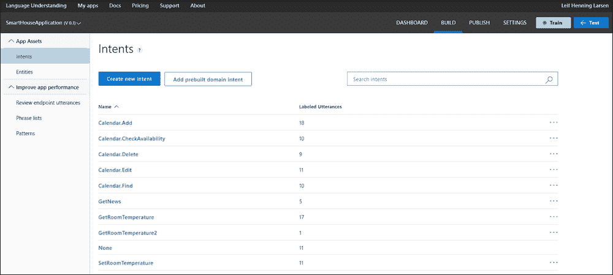

如您所见，我们有各种功能可以使用，我们将在下面介绍重要的功能。

我们将要构建的应用程序将针对我们的智能家居应用程序。我们将配置应用程序以识别设置不同房间温度的命令。此外，我们希望它能告诉我们不同房间的温度。

## 使用实体识别关键数据

LUIS 的一个关键特性是能够识别句子中的关键数据。这些关键数据实例被称为实体。在一个新闻应用程序中，实体的一个例子是主题。如果我们要求获取最新的新闻，我们可以指定一个主题供服务识别。

对于我们的应用程序，我们想要添加一个关于房间的实体。我们通过在左侧面板中选择**实体**来实现这一点。然后我们点击**添加自定义实体**。

我们将看到以下屏幕：

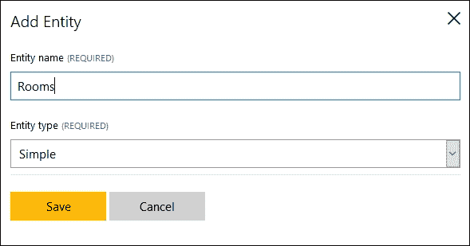

输入实体的名称并点击**保存**按钮。就这样——您现在已经创建了第一个实体。我们将在稍后看到如何使用它。

如您可能已注意到，在实体创建表单中有一个名为**实体类型**的下拉列表。实体类型是一种创建层次实体的方式，这基本上是关于定义实体之间关系的问题。

例如，您可以想象在给定的时间范围内搜索新闻。通用的顶级实体是`日期`。从那里开始，您可以定义两个子项，`StartDate`和`EndDate`。这些将由服务识别，其中将为实体及其子项构建模型。

要添加一个层次子实体，请勾选复选框并从选择中选取**层次**。为每个要添加的子项，点击**实体子项**旁边的+按钮，如图所示。输入子项的名称：

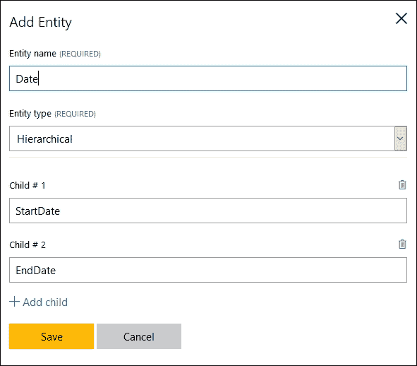

您可以添加的其他类型的实体被称为**组合实体**。这是一种由一组现有实体形成的实体类型。这就是我们所说的“具有”关系，因此组件是子项，但不是在父子关系中。

组合实体与层次实体不共享共同特征。当删除顶级实体时，不会删除组件。使用组合实体，LUIS 可以识别实体组，然后将其作为单个实体处理。

使用组合实体就像订购披萨一样。您可以通过说“我想一个大披萨，上面有蘑菇和意大利辣肠”来订购披萨。在这个例子中，我们可以看到大小作为一个实体，我们也可以看到两种配料作为实体。将这些组合起来可以形成一个组合实体，这被称为订单。

您可以添加的最后一种实体类型被称为**列表实体**。这是一个用于在话语中作为关键词或标识符使用的自定义实体值列表。

当使用实体时，有时一个实体可能由多个单词组成。在我们的例子中，对于`Rooms`实体，我们可能要求客厅。为了能够识别这样的表述，我们可以定义一个特征列表。这是一个以逗号分隔的列表，可以包含一些或所有预期的短语。

让我们为我们的应用程序添加一个。在左侧，面板底部，您将看到**Features**（功能）。选择此选项，然后点击**Add phrase list**（添加短语列表）来创建一个新的列表。将其命名为`Rooms`，并添加您预期在房屋中找到的不同房间，如下面的截图所示：

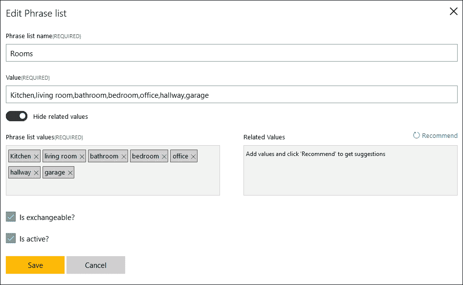

通过点击右侧的**Recommend**（推荐），LUIS 将推荐与您已输入的相关更多值。

我们将在稍后看到这是如何被利用的。

除了创建短语列表，我们还可以创建**模式特征**。使用模式特征的典型用例是当您有符合模式的数据，但无法将其作为短语列表输入时。模式特征通常与产品编号一起使用。

## 使用意图理解用户的需求

现在我们已经定义了一个实体，是时候看看它是如何与意图相匹配的了。**意图**基本上是句子的目的。

我们可以通过在左侧面板中选择**Intents**（意图）选项来向我们的应用程序添加意图。点击**Add intent**（添加意图）。当我们添加意图时，我们给它一个名字。名字应该描述意图的内容。我们想要添加一个名为`GetRoomTemperature`的意图，其目的是获取特定房间的温度，如下面的截图所示：

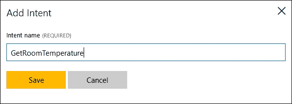

当您点击**Save**（保存）按钮时，您将被带到语句页面。在这里，我们可以添加用于意图的句子，所以让我们添加一个。输入`厨房的温度是多少？`然后按*Enter*。这个句子（或称为语句）将准备好进行标记。标记语句意味着我们定义它属于哪个意图。我们还应该确保用正确的类型标记实体。

以下截图显示了我们的第一个语句的标记过程：

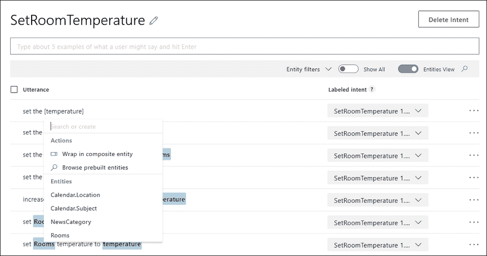

如您所见，实体已被标记。您可以通过点击单词来告诉 LUIS 一个单词是特定的实体。这将弹出一个包含所有可用实体的菜单，然后您可以从中选择正确的一个。同时，注意在下拉列表中如何选择**GetRoomTemperature**意图。完成标记您的语句后，点击**Train**。

所有应用程序都是使用默认的意图**None**创建的。这个意图将包括不属于我们应用程序的句子。如果我们说要**订购一个带蘑菇和意大利辣肠的大披萨**，这将导致意图为**None**。

当你创建意图时，你应该定义至少三到五个话语。这将给 LUIS 一些可以工作的事情，因此它可以创建更好的模型。我们将在本章后面看到我们如何提高性能。

## 使用预构建模型简化开发

构建实体和意图可以是简单的，也可以是复杂的。幸运的是，LUIS 提供了一套来自 Bing 的预构建实体。这些实体将包含在应用程序中，以及在网上，在经过标签化过程时。

以下表格描述了所有可用的预构建实体：

| 实体 | 示例 |
| --- | --- |
| `builtin.number` | 五，23.21 |
| `builtin.ordinal` | 第二，第三 |
| `builtin.temperature` | 2 摄氏度，104 华氏度 |
| `builtin.dimension` | 231 平方公里 |
| `builtin.age` | 27 岁 |
| `builtin.geography` | 城市，国家，兴趣点 |
| `builtin.encyclopedia` | 人物，组织，事件，电视剧集，产品，电影等 |
| `builtin.datetime` | 日期，时间，持续时间，设置 |

最后三个有多个子实体，如表格中**示例**列所述。

我们将添加这些预构建实体中的一个，因此请从菜单中选择**实体**。点击**添加预构建实体**，从列表中选择**温度**，然后点击**保存**。

使用新创建的实体，我们想要添加一个名为**SetTemperature**的新意图。如果示例话语是*将厨房的温度设置为 22 摄氏度*，我们可以如以下截图所示标注话语。


如您所见，我们有一个`room`实体。我们还有一个清晰标注的预构建`temperature`实体。由于正确的意图应该在下拉菜单中选择，我们可以点击**训练**按钮来保存话语。

## 预构建域

除了使用预构建实体外，我们还可以使用预构建域。这些是已经存在的实体和意图，利用了来自不同域的常用意图和实体。通过使用这些意图和实体，你可以使用通常在 Windows 中使用的模型。一个非常基本的例子是在日历中设置约会。

要使用 Cortana 的预构建域，你可以从左侧菜单中选择**预构建域**。这将打开一个可用域的列表。通过点击**添加域**，你可以添加选定的域，如以下截图所示：

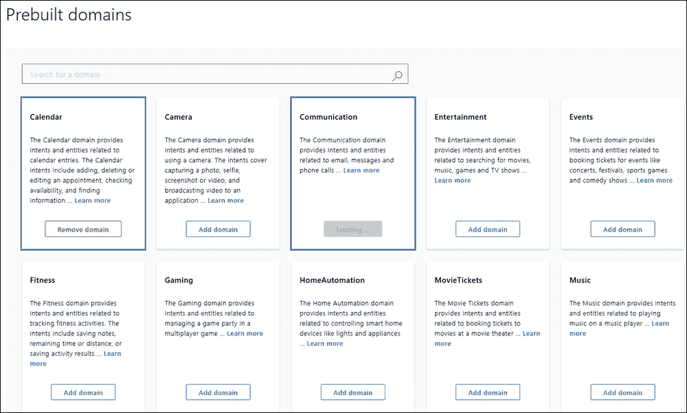

这将添加该特定域的意图和实体到已定义的意图和实体列表中，如以下截图所示：

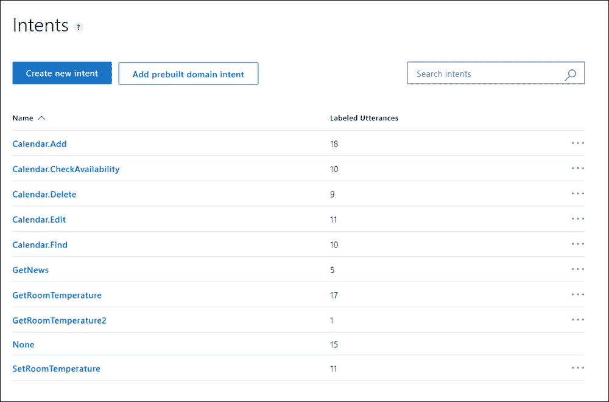

以下列表显示了 Cortana 预构建域中可用的顶级域。有关可用的预构建域的完整列表，请参阅附录 A，*LUIS 实体*：

+   `日历`

+   `相机`

+   `通信`

+   `娱乐`

+   `事件`

+   `健身`

+   `游戏`

+   `智能家居自动化`

+   `电影票`

+   `音乐`

+   `备注`

+   `设备端`

+   `地点`

+   `提醒`

+   `餐厅预订`

+   `出租车`

+   `翻译`

+   `公用事业`

+   `天气`

+   `网络`

# 训练模型

现在我们有一个工作的模型，是时候将其投入使用了。

## 训练和发布模型

使用该模型的第一步是确保模型有一些话语可以处理。到目前为止，我们为每个意图添加了一个话语。在我们部署应用程序之前，我们需要更多。

想想三种或四种设置或获取房间温度的不同方法，并将它们添加进去，指定实体和意图。此外，添加一些属于`None`意图的话语，仅作参考。

当我们添加了一些新的话语后，我们需要训练模型。这样做将使 LUIS 开发代码来识别未来的相关实体和意图。这个过程是定期进行的；然而，在发布之前，在您做出更改时进行此操作是明智的。这可以通过在顶部菜单中点击**训练**来完成。

要测试应用程序，您可以在**交互式测试**选项卡中简单地输入测试句子。这将显示任何给定句子是如何被标记的，以及服务发现了哪些意图，如下面的截图所示：

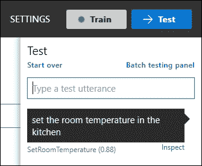

训练完成后，我们可以发布应用程序。这将部署模型到 HTTP 端点，该端点将解释我们发送给它的句子。

从左侧菜单中选择**发布**。这将显示以下屏幕：

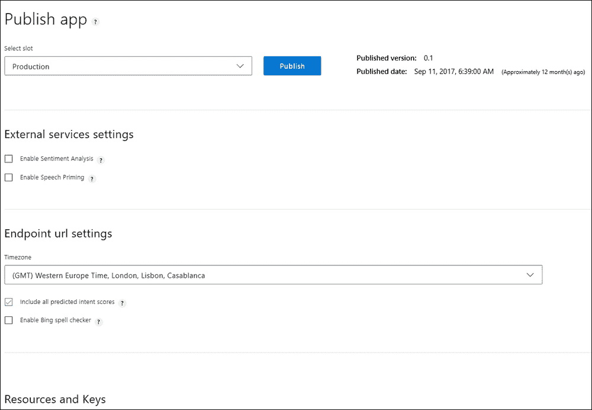

点击**发布**按钮来部署应用程序。**端点** **URL 设置**字段下的 URL 是模型部署的端点。如您所见，它指定了应用程序 ID 以及订阅密钥。

在我们继续前进之前，我们可以验证端点是否实际工作。您可以通过在文本字段中输入一个查询（例如，`获取卧室温度`）并点击链接来完成此操作。这应该会向您展示以下类似截图的内容：

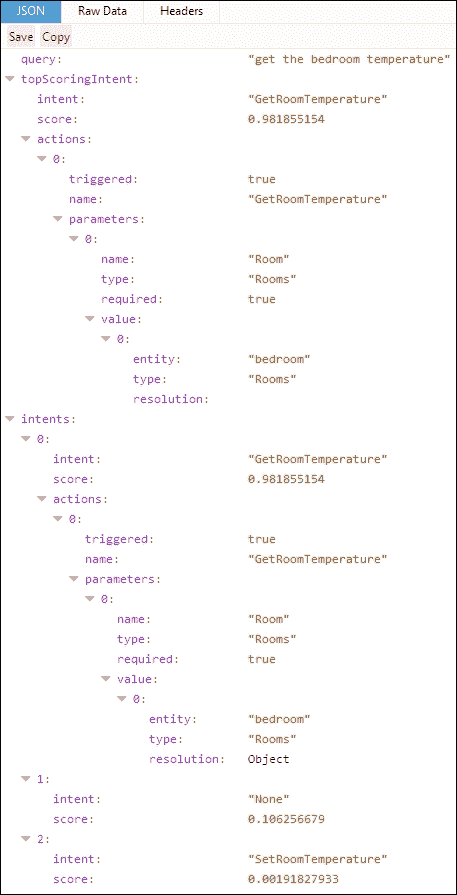

当模型发布后，我们可以继续通过代码访问它。

## 连接到智能家居应用程序

为了能够轻松地与 LUIS 一起工作，我们将想要添加 NuGet 客户端包。在智能家居应用程序中，转到 NuGet 包管理器并找到`Microsoft.Cognitive.LUIS`包。将此包安装到项目中。

我们需要添加一个名为`Luis`的新类。将文件放在`Model`文件夹下。这个类将负责调用端点并处理结果。

由于我们需要测试这个类，我们需要添加一个`View`和一个`ViewModel`。将`LuisView.xaml`文件添加到`View`文件夹中，并将`LuisViewModel.cs`添加到`ViewModel`文件夹中。

`View`应该相当简单。它应该包含两个`TextBox`元素，一个用于输入请求，另一个用于显示结果。我们还需要一个按钮来执行命令。

将`View`作为`TabItem`添加到`MainView.xaml`文件中。

`ViewModel`应该有两个`string`属性，分别对应于两个`TextBox`元素。它还需要一个`ICommand`属性用于按钮命令。

我们首先创建`Luis`类，因此打开`Luis.cs`文件。将类设置为`public`。

当我们发出请求并收到相应的结果时，我们希望触发一个事件来通知 UI。我们希望这个事件带有一些额外的参数，因此，在`Luis`类下面创建一个名为`LuisUtteranceResultEventArgs`的类，该类继承自`EventArgs`类，如下所示：

```py
    public class LuisUtteranceResultEventArgs : EventArgs {
        public string Status { get; set; }
        public string Message { get; set; }
        public bool RequiresReply { get; set; }
    }
```

这将包含一个`Status`字符串，一个`Message`状态，以及`Result`本身。回到`Luis`类，添加一个事件和一个私有成员，如下所示：

```py
    public event EventHandler<LuisUtteranceResultEventArgs> OnLuisUtteranceResultUpdated;

    private LuisClient _luisClient;
```

我们已经讨论了事件。私有成员是 API 访问对象，我们从 NuGet 安装了它：

```py
    public Luis(LuisClientluisClient) {
        _luisClient = luisClient;
    }
```

构造函数应接受`LuisClient`对象作为参数，并将其分配给之前创建的成员。

让我们创建一个辅助方法来触发`OnLuisUtteranceResultUpdated`事件，如下所示：

```py
private void RaiseOnLuisUtteranceResultUpdated( LuisUtteranceResultEventArgsargs)
{
    OnLuisUtteranceResultUpdated?.Invoke(this, args);
}
```

这纯粹是为了我们自己的方便。

为了能够发出请求，我们将创建一个名为`RequestAsync`的函数。这个函数将接受一个`string`作为参数，并返回`Task`类型。该函数应标记为`async`，如下所示：

```py
    public async Task RequestAsync(string input) {
        try {
            LuisResult result = await _luisClient.Predict(input);
```

在函数内部，我们调用`_luisClient`的`Predict`函数。这将向之前发布的端点发送查询。成功的请求将导致一个包含一些数据的`LuisResult`对象，我们将在稍后探讨。

我们在一个新函数中使用结果并处理它。我们确保捕获任何异常，并使用以下代码通知任何监听者：

```py
            ProcessResult(result);
        }
        catch(Exception ex) {
            RaiseOnLuisUtteranceResultUpdated(new LuisUtteranceResultEventArgs
            {
                Status = "Failed",
                Message = ex.Message
            });
        }
    }
```

在`ProcessResult`函数中，我们创建一个`LuisUtteranceResultEventArgs`类型的新对象。当通知监听者任何结果时将使用此对象。在这个参数对象中，我们添加`Succeeded`状态和`result`对象。我们还输出一个消息，说明顶级识别的意图。我们还添加了这个意图是所有意图中顶级意图的可能性。最后，我们还添加了识别到的意图数量：

```py
    private void ProcessResult(LuisResult result) {
        LuisUtteranceResultEventArgsargs = new LuisUtteranceResultEventArgs();

        args.Result = result;
        args.Status = "Succeeded";
        args.Message = $"Top intent is {result.TopScoringIntent.Name} with score {result.TopScoringIntent.Score}. Found {result.Entities.Count} entities.";

        RaiseOnLuisUtteranceResultUpdated(args);
    }
```

在此基础上，我们转向我们的视图模型。打开`LuisViewModel.cs`文件。确保类是`public`的，并且继承自`ObservableObject`类。

声明一个私有成员，如下所示：

```py
    private Luis _luis;
```

这将保存我们之前创建的`Luis`对象：

```py
    public LuisViewModel() {
        _luis = new Luis(new LuisClient("APP_ID_HERE", "API_KEY_HERE"));
```

我们的构造函数创建`Luis`对象，确保它使用一个新的`LuisClient`初始化。如您所注意到的，这需要两个参数，应用程序 ID 和订阅 ID。还有一个第三个参数，`preview`，但在此我们不需要设置它。

应用程序 ID 可以通过查看发布步骤中的 URL 或访问应用程序网站上的 **设置** 来找到 [`www.luis.ai`](https://www.luis.ai)。在那里，您将找到 **应用程序 ID**，如下面的截图所示：

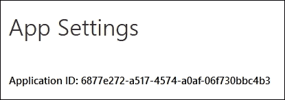

创建了 `Luis` 对象后，我们按如下方式完成构造函数：

```py
    _luis.OnLuisUtteranceResultUpdated += OnLuisUtteranceResultUpdated;
    ExecuteUtteranceCommand = new DelegateCommand(ExecuteUtterance, CanExecuteUtterance);
}
```

这将连接 `OnLuisUtteranceResultUpdated` 事件并为我们的按钮创建一个新的 `DelegateCommand` 事件。为了使我们的命令能够运行，我们需要检查我们是否在输入字段中输入了一些文本。这是使用 `CanExecuteUtterance` 完成的。

`ExecuteUtterance` 命令本身相当简单，如下面的代码所示：

```py
    private async void ExecuteUtterance(object obj) {
        await _luis.RequestAsync(InputText);
    }
```

我们所做的一切只是调用 `_luis` 对象中的 `RequestAsync` 函数。我们不需要等待任何结果，因为这些结果将来自事件。

事件处理程序 `OnLuisUtteranceResultUpdated` 将格式化结果并将它们打印到屏幕上。

首先，我们确保在当前调度线程中调用方法。这是在另一个线程中触发事件时完成的。我们创建一个 `StringBuilder`，它将用于连接所有结果，如下面的代码所示：

```py
private void OnLuisUtteranceResultUpdated(object sender, LuisUtteranceResultEventArgs e) {
    Application.Current.Dispatcher.Invoke(() => {
        StringBuilder sb = new StringBuilder();
```

首先，我们添加 `Status` 和 `Message` 状态。然后我们检查是否有检测到的实体，并添加实体数量，如下所示：

```py
    sb.AppendFormat("Status: {0}\n", e.Status);
    sb.AppendFormat("Summary: {0}\n\n", e.Message);

    if(e.Result.Entities != null&&e.Result.Entities.Count != 0) {
        sb.AppendFormat("Entities found: {0}\n", e.Result.Entities.Count);
        sb.Append("Entities:\n");
```

如果我们有任何实体，我们将遍历每个实体，打印出实体名称和值：

```py
        foreach(var entities in e.Result.Entities) {
            foreach(var entity in entities.Value) {
                sb.AppendFormat("Name: {0}\tValue: {1}\n",
                                 entity.Name, entity.Value);
            }
        }
        sb.Append("\n");
    }
```

最后，我们将 `StringBuilder` 添加到我们的 `ResultText` 字符串中，它应该在屏幕上显示，如下所示：

```py
            ResultText = sb.ToString();
        });
    }
```

一切编译完成后，结果应该看起来像下面的截图：

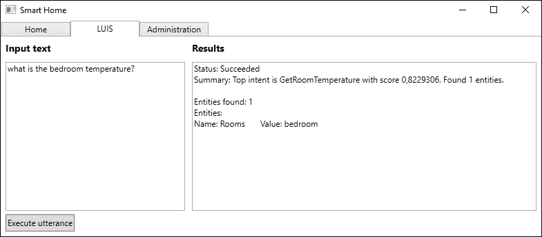

## 通过积极使用来改进模型

LUIS 是一个机器学习服务。因此，我们创建的应用程序和生成的模型可以根据使用情况进行改进。在整个开发过程中，关注性能是一个好主意。您可能会注意到一些经常被错误标记的意图，或者难以识别的实体。

### 可视化性能

在 LUIS 网站上，仪表板显示有关意图和实体分解的信息。这基本上是关于意图和实体如何在已使用的语句中分布的信息。

以下图表显示了意图分解显示的外观：


以下图表显示了实体分解的外观：

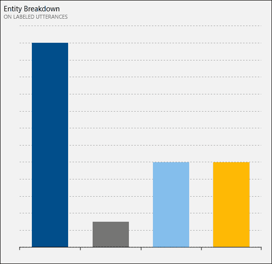

通过将鼠标悬停在不同的条形图（或饼图的扇区）上，将显示意图/实体的名称。此外，还会显示使用中意图/实体的总数百分比。

### 解决性能问题

如果您在应用程序中注意到错误，通常有四种选项可以解决它：

+   添加模型功能

+   添加标记的语句

+   寻找错误的语句标签

+   修改模式

我们现在将简要地看一下这些中的每一个。

#### 添加模型功能

添加模型功能通常是我们可以做到的，如果我们有应该被检测为实体的短语，但还没有。我们已经看到了一个例子，那就是房间实体，其中一个房间可能是客厅。

解决方案当然是添加短语列表或正则表达式功能。有三种情况这可能会有所帮助：

+   当 LUIS 无法识别相似的字词或短语时。

+   当 LUIS 在识别实体时遇到困难时，将短语列表中所有可能的实体值添加进去应该会有所帮助。

+   当使用稀有或专有词汇时。

#### 添加标记的语句

添加和标记更多语句将始终提高性能。这很可能有助于以下场景：

+   当 LUIS 无法区分两个意图时

+   当 LUIS 无法检测到周围词汇之间的实体时

+   如果 LUIS 系统性地给一个意图分配了很低的分数

#### 寻找错误的语句标签

一个常见的错误是错误地标记语句或实体。在这种情况下，您需要找到错误的语句并更正它。这可能会解决以下场景中的问题：

+   如果 LUIS 无法区分两个意图，即使相似的语句已经被标记

+   如果 LUIS 持续地错过一个实体

#### 修改模式

如果所有前面的解决方案都失败了，您仍然有模型问题，您可能需要考虑更改模式，这意味着合并、重新分组和/或删除意图和实体。

请记住，如果对人类来说标记语句很困难，那么对机器来说就更加困难了。

### 主动学习

LUIS 的一个非常不错的功能是主动学习的力量。当我们积极使用这项服务时，它会记录所有查询，因此我们可以分析使用情况。这样做可以让我们快速纠正错误，并标记我们之前没有见过的语句。

使用我们构建的应用程序——智能家庭应用程序——如果我们用语句`你能告诉我卧室的温度吗？`进行查询，模型可能不会识别这一点。如果我们调试这个过程，逐步通过`ProcessResult`函数，我们将看到以下返回值：

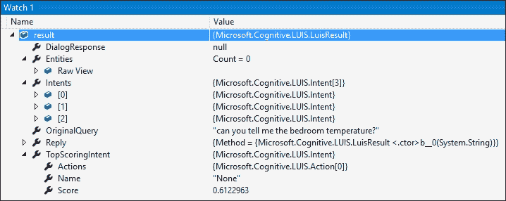

如您从前面的截图中所见，得分最高的意图是`None`，得分为`0.61`。此外，没有识别出任何实体，所以这并不好。

返回 LUIS 网站。转到**审查端点语句**页面，该页面可以在左侧菜单中找到。在这里，我们可以看到我们刚刚尝试的语句已经被添加。现在我们可以正确地标记意图和实体，如下面的截图所示：

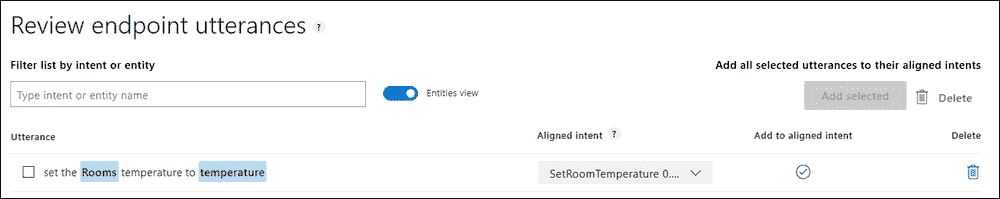

通过将话语正确地标记为意图和实体，我们将在下次以这种方式查询时得到正确的结果，如下面的截图所示：

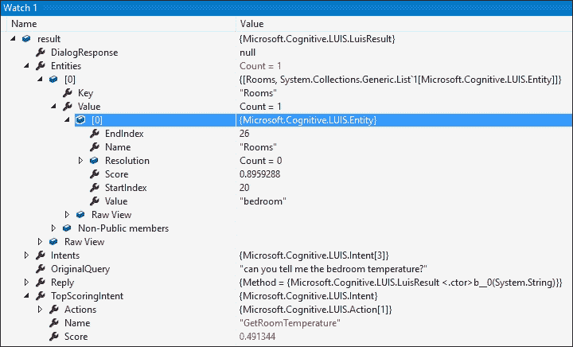

# 摘要

在本章中，我们创建了一个 LUIS 应用程序。你学习了如何创建语言理解模型，这些模型可以识别句子中的实体。你学习了如何理解用户的意图以及我们如何从这个意图中触发动作。一个重要的步骤是了解如何以各种方式改进模型。

在下一章中，我们将利用在这里学到的知识，使用 LUIS 和语音 API，使我们能够与应用程序进行语音交互。
