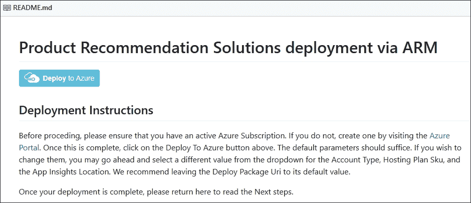
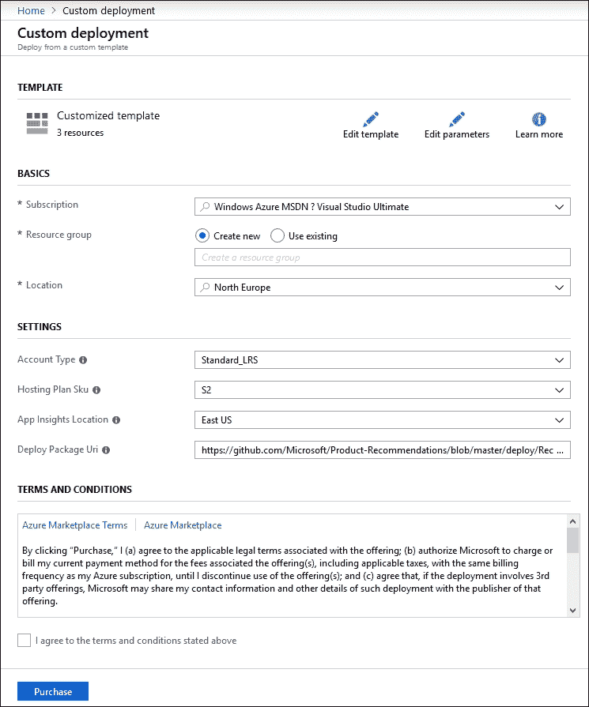
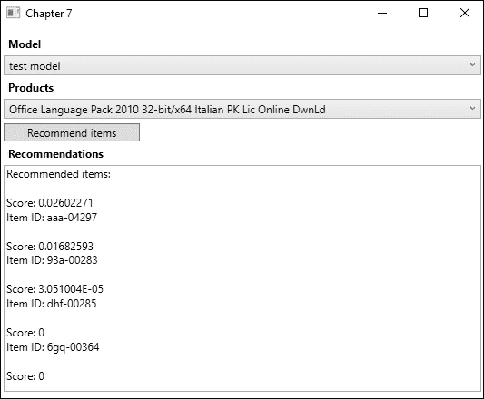

# 第七章. 为企业构建推荐系统

> “通过利用 Azure 机器学习和推荐 API，我们为零售商推出了一种新的个性化商业体验，这有助于在任何渠道上增加购物者的转化率和参与度。”
> 
> – Frank Kouretas，Orckestra 的首席产品官

在上一章中，我们介绍了剩余的语言 API。在本章中，我们将探讨推荐解决方案模板。这是一个包含运行推荐解决方案所需资源的 Microsoft Azure 模板。这是一个非常适合电子商务应用的解决方案，您可以根据不同的标准推荐不同的商品。在在线商店中，如果按照规则集进行推荐，这个过程可能会非常耗时。推荐解决方案允许我们利用机器学习的力量获得良好的推荐，从而可能增加销售额。

本章将涵盖以下主题：

+   部署推荐解决方案模板

+   训练推荐模型

+   消费推荐

# 提供个性化推荐

如果您运营一个电子商务网站，一个对客户来说很棒的功能就是推荐。使用推荐解决方案，您可以轻松地添加这个功能。利用 Microsoft Azure 机器学习，API 可以被训练以识别应该被推荐的商品。

推荐有两种常见的场景，如下所示：

+   **商品到商品推荐（I2I）**：I2I 是某些商品经常在查看其他商品之后的场景。通常，这将以“访问此商品的访客也访问了此其他商品”的形式出现。

+   **客户到商品推荐（U2I）**：U2I 是利用客户的先前行为来推荐商品的场景。例如，如果您销售电影，那么您可以根据客户的先前电影选择推荐其他电影。

使用推荐解决方案的一般步骤如下：

1.  在 Azure 中部署模板

1.  导入目录数据（您的电子商务网站中的商品）

1.  导入使用数据

1.  训练推荐模型

1.  消费推荐

如果您还没有这样做，您应该在 [`portal.azure.com`](https://portal.azure.com) 注册一个 API 密钥。

## 在 Azure 中部署推荐解决方案模板

要部署推荐解决方案，您必须有一个有效的 Microsoft Azure 订阅。

转到 [`github.com/Microsoft/Product-Recommendations/tree/master/deploy`](https://github.com/Microsoft/Product-Recommendations/tree/master/deploy) 开始部署。点击如图所示的“部署到 Azure”：



这将带您进入 Microsoft Azure 的以下页面：



输入所需信息，接受条款和条件，然后点击 **购买**。这将开始部署推荐解决方案所需资源的流程。

几分钟后，部署完成。现在您可以上传数据以训练模型。

## 导入目录数据

部署解决方案后，我们可以添加目录数据。通常，您会在这里添加数据库中的项目。项目需要作为文件上传。文件需要是 CSV 格式。

以下表格描述了您目录中每个项目所需的数据：

| 名称 | 描述 |
| --- | --- |
| 项目 ID | 给定项目的唯一标识符 |
| 项目名称 | 项目的名称 |
| 项目类别 | 项目的类别，例如硬件、软件、书籍类型等 |

此外，还有一些可选的数据字段。这些字段在以下表格中进行了描述：

| 名称 | 描述 |
| --- | --- |
| 描述 | 项目的描述 |
| 功能列表 | 一个以逗号分隔的功能列表，可以增强推荐 |

包含所有数据的文件可能包含如下所示的项目：

```py
C9F00168, Kiruna Flip Cover, Accessories, Description of item, compatibility = lumia, hardware type = mobile
```

通常，添加功能会更好，因为这可以提高推荐的质量。如果不存在任何功能，那么使用率较低的新项目不太可能被推荐。

功能应该是分类的。这意味着一个功能可以是一个价格范围。单独的价格不会作为一个好的功能。

您可以为每个项目添加多达 20 个功能。当上传包含项目功能的目录时，您需要执行排名构建。这将为每个功能进行排名，通常排名较高的功能更适合使用。

本章的代码示例包含一个示例目录。我们将使用此目录作为以下示例。或者，您可以从 Microsoft 下载一些数据，[`aka.ms/RecoSampleData`](http://aka.ms/RecoSampleData)。我们想使用 `MsStoreData.zip` 中的数据。

下载完文件后，我们可以将目录上传到我们的存储中。这可以通过前往您新创建的存储帐户并为目录创建一个新的 blob 容器来完成，如下面的截图所示：


点击 **上传**，浏览到您下载的样本文件，并选择 `catalog.csv` 文件。这将上传目录。

### 备注

注意，目录文件不是必需的，但建议您上传它，以便将其提供给模型。

目录中的项目最大数量为 100,000。任何给定的目录文件都不能超过 200 MB。如果您的文件更大，并且您还有更多项目，您可以上传多个文件。

## 导入使用数据

下一个步骤是我们需要上传使用数据。这是一个描述您过去客户所有交易的文件。文件包含行，其中每行是一个包含数据的逗号分隔行，表示交易。

必需的数据字段如下：

| 名称 | 描述 |
| --- | --- |
| 用户 ID | 每个客户的唯一标识符 |
| 项目 ID | 与目录相关联的项目唯一标识符 |
| 时间 | 交易时间 |

此外，还可以有一个名为`Event`的字段。这描述了交易类型。此字段的允许值是`Click`、`RecommendationClick`、`AddShopCart`、`RemoveShopCart`和`Purchase`。

根据目录中的先前示例，用法文件中的一行可能如下所示：

```py
    00030000D16C4237, C9F00168, 2015/08/04 T 11:02:37, Purchase
```

用法文件的最大文件大小为 200 MB。

推荐质量依赖于使用数据的数量。通常，你应该为每个项目注册大约 20 笔交易。这意味着如果你在目录中有 100 个项目，你应该在用法文件中争取达到 2,000 笔交易。

注意，当前 API 接受的交易最大数量为 500 万。如果新增交易超过此最大值，最旧的数据将被删除。

再次，你可以在[`aka.ms/RecoSampleData`](http://aka.ms/RecoSampleData)找到示例用法文件。创建另一个名为`usage`的 blob 容器，然后点击**上传**。上传样本文件夹中的所有用法文件。

## 训练模型

在目录和用法数据就绪后，是时候训练一个模型了。

### 开始训练

要开始训练过程，我们需要向新创建的应用服务上的端点发起 API 调用。这可以使用工具，如 Postman，或通过您自己的应用程序完成。我们将使用 Postman 来完成本书的目的。

### 备注

下载 Postman，请访问[`www.getpostman.com/`](https://www.getpostman.com/)。

可以通过向以下 URL 发送 POST 请求来开始训练过程：

```py
https://<service_name>.azurewebsites.net/api/models
```

请求必须包含一个头信息，`x-api-key`，包含你的 API 密钥。它还必须包含另一个头信息，`Content-Type`，应设置为`application/json`。

此外，请求必须包含包含以下内容的正文：

| 属性 | 必需 | 描述 |
| --- | --- | --- |
| `description` | 否 | 文本描述。 |
| `blobContainerName` | 是 | 存储目录和用法数据的 blob 容器的名称。 |
| `usageRelativePath` | 是 | 要用于训练的虚拟目录（包含用法文件）或特定用法文件的相对路径。 |
| `catalogFileRelativePath` | 否 | 目录文件的相对路径。 |
| `evaluationUsageRelativePath` | 否 | 要用于评估的虚拟目录（包含用法文件）或特定用法文件的相对路径。 |
| `supportThreshold` | 否 | 模型保守程度，以建模要考虑的项目共现次数衡量。 |
| `cooccurrenceUnit` | 否 | 指示在计数共现之前如何分组使用事件。 |
| `similarityFunction` | 否 | 定义要使用的相似度函数。可以是 Jaccard、Cooccurrence 或 Lift。 |
| `enableColdItemPlacement` | 否 | 这将是 `true` 或 `false`。指示是否应通过特征相似性推送冷项目。 |
| `enableColdToColdRecommendations` | 否 | 这将是 `true` 或 `false`。指示是否应计算冷项目对之间的相似性。 |
| `enableUserAffinity` | 否 | 这将是 `true` 或 `false`。定义是否应将事件类型和时间作为结果的输入。 |
| `enableBackfilling` | 否 | 这将是 `true` 或 `false`。如果没有足够的相关项返回，这将使用热门项进行回填。 |
| `allowSeedItemsInRecommendations` | 否 | 这将是 `true` 或 `false`。确定输入项是否可以作为结果返回。 |
| `decayPeriodInDays` | 否 | 事件发生的天数衰减期。事件发生的时间越长，该事件的重要性就越低。 |
| `enableUserToItemRecommendations` | 否 | 这将是 `true` 或 `false`。如果为 `true`，则在请求个性化推荐时将考虑用户 ID。 |

一个成功的调用可能会产生以下结果：|

|

返回的 `id` 字段可用于检查训练状态。|

### 验证训练完成情况|

使用前一个请求返回的 ID，我们现在可以运行一个 `GET` 请求到以下端点：|

```py
https://<service_name>.azurewebsites.net/api/models/<model_id>
```

此请求需要一个包含您的 API 密钥的标题，`x-api-key`。一个成功的请求可能会给出以下响应：|

|

GET 请求的响应|

如您所见，有一个 `modelStatus` 字段。一旦这是 `Completed`，模型就训练完成并准备好使用。您还将看到其他详细信息，例如训练时长等统计数据。|

### 小贴士|

如果您希望使用用户界面进行模型训练，您可以访问 https://<your_service>.azurewebsites.net/ui。|

## 消费推荐|

要使用我们刚刚创建的推荐模型，我们将创建一个新的示例应用程序。使用我们之前创建的 MVVM 模板创建此应用程序。|

在撰写本文时，没有为推荐 API 提供客户端包。这意味着我们需要依赖网络请求，正如我们在第六章中看到的，*理解文本*。为了加快开发时间，请从第六章的示例代码中复制 `WebRequest.cs` 文件。将此文件粘贴到 `Model` 文件夹中，并确保更新命名空间。|

### 注意|

记得添加对 System.Web 和 System.Runtime.Serialization 的引用。|

由于不需要太多的 UI，我们将所有内容添加到 `MainView.xaml` 文件中。我们需要两个 `ComboBox` 元素。这些将列出我们的推荐模型和目录项。我们还需要一个 `Button` 元素来获取推荐和一个 `TextBox` 元素来显示结果推荐。

相应的 `ViewModel`，`MainViewModel.cs`，将需要属性来对应 UI 元素。添加一个 `ObservableCollection` 的 `RecommendationModel` 类型来保存我们的模型。我们稍后会查看这个类型。我们需要一个 `RecommendationModel` 类型的属性来保存选中的模型。添加一个 `ObservableCollection` 属性的 `Product` 类型，以及相应的 `Product` 属性用于可用和选中的属性。我们还需要一个 `string` 类型的属性用于结果和一个 `ICommand` 类型的属性用于我们的按钮。

添加一个 `private` 类型的 `WebRequest` 成员，以便我们可以调用 API。

在 `Model` 文件夹中添加一个名为 `Product` 的新文件。为了使用目录中的项目，我们将加载目录文件到应用程序中，为每个项目创建一个 `Product`。确保 `Product` 看起来如下：

```py
    public class Product { 
        public string Id { get; set; } 
        public string Name { get; set; } 
        public string Category { get; set; }
        public Product(string id, string name, string category) { 
            Id = id; 
            Name = name; 
            Category = category; 
        } 
    } 
```

我们需要一个项目的 `Id`，以及 `Name` 和 `Category`。

构造函数应创建一个 `WebRequest` 对象，如下面的代码所示：

```py
    public MainViewModel() 
    { 
        _webRequest = new WebRequest ("https://<YOUR_WEB_SERVICE>.azurewebsites.net/api/models/", "API_KEY_HERE"); 
        RecommendCommand = new DelegateCommand(RecommendBook, CanRecommendBook); 

        Initialize(); 
    } 
```

当我们创建 `WebRequest` 对象时，我们指定推荐端点和我们的 API 密钥。`RecommendCommand` 语句是 `ICommand` 对象，作为一个 `DelegateCommand`。我们需要指定要执行的操作以及允许执行命令的条件。如果我们已选中推荐模型和产品，我们应该可以执行该命令。

`Initialize` 语句将确保我们获取我们的推荐模型和产品，如下面的代码所示：

```py
    private async void Initialize() { 
        await GetModels(); 
        GetProducts(); 
    } 
```

`GetModels` 方法将调用 API，如下面的代码所示：

```py
    private async Task GetModels() 
    { 
        List<RecommandationModel> models = await _webRequest.GetModels(HttpMethod.Get); 
```

此调用是一个 `GET` 请求，因此在 `GetModels` 中指定这一点。成功的调用应导致一个 JSON 响应，然后我们将其反序列化为 `RecommendationModel` 对象。这是一个数据合约，因此在一个名为 `Contracts` 的文件夹中添加一个名为 `Models.cs` 的文件。

成功的结果将给出以下输出：

```py
[
   { 
      "id": "string",
      "description": "string",
      "creationTime": "string",
      "modelStatus": "string"
   }
   {...}
   {...}
] 
```

我们有一个 `models` 数组。这个数组中的每个项目都有一个 `id`、`name`、`description`、`createdDateTime`、`activeBuildId` 和 `catalogDisplayName`。确保 `RecommendationModels` 类包含这些数据。

如果调用成功，我们将模型添加到可用模型的 `ObservableCollection` 中，如下面的代码所示：

```py
        foreach (RecommandationModel model in models) { 
            AvailableModels.Add(model); 
        }          
        SelectedModel = AvailableModels.FirstOrDefault(); 
    } 
```

当所有项目都添加后，我们将 `SelectedModel` 设置为第一个可用选项。

要添加目录中的项目，我们需要从目录文件中读取。在书中提供的示例代码中，此文件被添加到项目中并复制到输出目录。`GetProducts` 方法将如下所示：

```py
    private void GetProducts() { 
        try { 
            var reader = new StreamReader (File.OpenRead("catalog.csv")); 

            while(!reader.EndOfStream) { 
                string line = reader.ReadLine(); 
                var productInfo = line.Split(','); 

                AvailableProducts.Add(new Product(productInfo[0], productInfo[1], productInfo[2])); 
            } 

            SelectedProduct = AvailableProducts.FirstOrDefault(); 
        } 
        catch(Exception ex) { 
            Debug.WriteLine(ex.Message); 
        } 
    } 
```

这是一个基本的文件操作，从目录中读取每一行。对于每个项目，我们获取所需的信息，为每个项目创建一个`Product`。然后将其添加到`ObservableCollection`属性的`AvailableProducts`中，`SelectedProduct`是第一个可用的。

现在我们有了我们的推荐模型和我们的产品，我们可以执行推荐请求，如下面的代码所示：

```py
    private async void RecommendProduct(object obj) 
    {  
        List<RecommendedItem> recommendations = await _webRequest.RecommendItem(HttpMethod.Get, $"{SelectedModel.id}/recommend?item={SelectedProduct.Id}"); 
```

获取推荐信息的调用是一个`GET`请求。这需要我们添加`itemIds`。

`itemIds`参数必须是所选产品的 ID。

我们在`_webRequest`对象上调用`RecommendItem`方法。这是一个`GET`请求，我们需要在查询字符串中指定`SelectedModel`的 ID。我们还需要在查询字符串中添加一些内容，以便到达正确的端点。成功的响应将产生 JSON 输出，如下所示：

```py
[
   { 
      "recommendedItemId": "string",
      "score": "float"
   },
   {...}
   {...}
] 
```

结果由一个对象数组组成。每个项目都将有一个`recommendedItemId`和`score`。分数表示客户想要给定项目的可能性。

此结果应反序列化为`RecommandedItem`类型的数据契约列表，因此请确保您在`Contracts`文件夹中添加此内容。

当我们成功调用后，我们希望在 UI 中显示如下：

```py
        if(recommendations.Count == 0) { 
            Recommendations = "No recommendations found"; 
            return; 
        } 
         StringBuilder sb = new StringBuilder(); 
        sb.Append("Recommended items:\n\n"); 
```

首先，我们检查是否有任何推荐。如果没有，我们不会继续。如果有项目，我们创建一个`StringBuilder`来格式化我们的输出，如下所示：

```py
        foreach(RecommendedItem recommendedItem in recommendations)  { 
            sb.AppendFormat("Score: {0}n", recommendedItem.score); 
            sb.AppendFormat("Item ID: {0}\n", item.id); 

            sb.Append("n"); 
        } 
        Recommendations = sb.ToString(); 
    } 
```

我们遍历所有的`recommendedItems`。我们输出`score`和`id`。这将打印在 UI 上。

成功的测试运行可能给出以下结果：



有几个特殊情况需要注意：

+   如果项目列表中只有一个不存在于目录中的项目，则返回空结果

+   如果项目列表中包含一些不在目录中的项目，则从查询中删除这些项目

+   如果项目列表中只包含冷门商品（与它们没有关联使用数据的商品），则返回最受欢迎的推荐

+   如果项目列表中包含一些冷门商品，则将返回其他商品的推荐

### 基于先前活动推荐项目

要根据用户活动进行推荐，我们需要一个用户列表。由于这样的列表仅为了示例而创建可能会过于繁琐，我们将只查看制作此类推荐所需的步骤和参数。

此用途的端点略有不同，因为它是一个另一个`GET`调用。在代码中，它将如下所示：

```py
    $"{SelectedModel.id}/recommend/user?{queryString.ToString()}" 
```

查询字符串中的参数如下：

| 参数 | 描述 |
| --- | --- |
| `userId` (required) | 给定用户的唯一标识符。 |
| `numberOfResults` (required) | 返回的推荐数量。 |
| `itemsIds` (optional) | 选定项目（的）列表或单个 ID。 |
| `includeMetadata` (optional) | 如果为 true，则将包括项目的元数据。 |
| `buildId` (optional) | 一个标识我们想要使用的构建的数字。如果没有指定，则使用活动构建。 |

成功的调用将产生与其他推荐模型相同的 JSON 输出。推荐的项目当然将基于用户的过去活动。

### 注意

注意，为了能够使用此功能，在创建模型构建时必须将 U2I 设置为`true`。

# 摘要

在本章中，我们深入探讨了推荐 API。我们学习了如何使用现有的目录和用法数据设置推荐模型。使用这些模型，我们学习了如何在简单的示例应用程序中利用它们。

在下一章中，我们将从知识 API 开始。我们将学习如何构建自然语言查询并评估查询表达式。此外，我们还将学习如何为自然语言查询添加自动补全功能。
