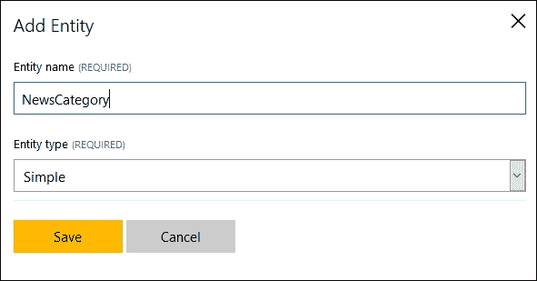
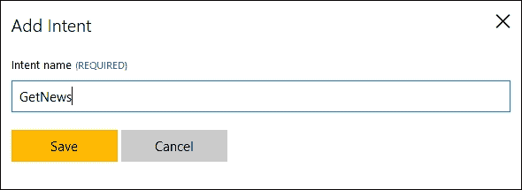
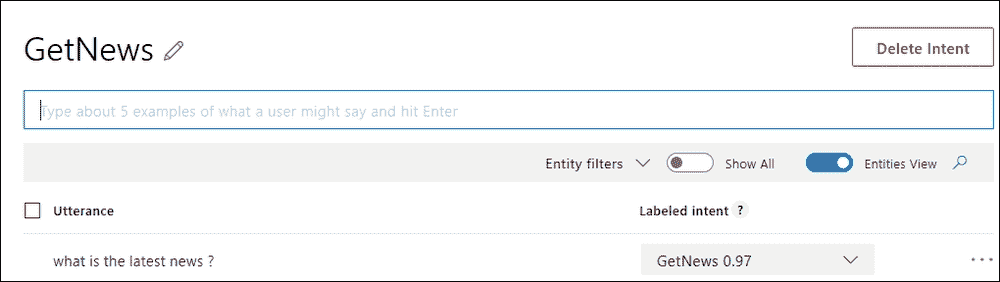
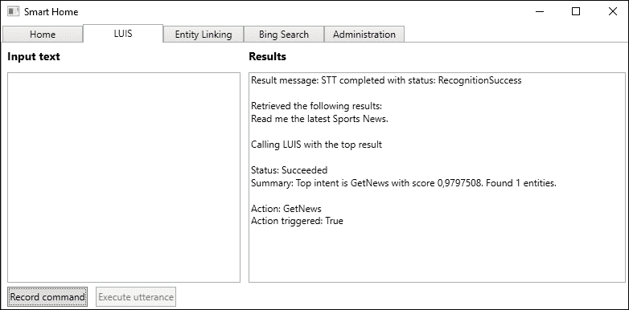

# 第十章。连接各个部分

上一章重点介绍了最后一个 API 伞形，涵盖了 Bing 搜索 API。在本章中，我们将连接各个部分。我们的智能家居应用程序目前可以利用几个 API，但主要是单独的。我们将了解如何连接 LUIS、图像分析、Bing 新闻搜索和 Bing 语音 API。我们还将探讨完成本书后您可以采取的下一步行动。

在本章中，我们将学习以下主题：

+   通过连接多个 API 使应用程序更智能

+   利用 Microsoft 认知服务的实际应用

+   下一步

# 完成我们的智能家居应用程序

到目前为止，我们看到了所有不同的 API，大多数都是作为单独的 API。智能家居应用程序背后的整个想法是同时利用几个 API。

在本章中，我们将向 LUIS 添加一个新的意图。这个意图是用来获取不同主题的最新新闻。

接下来，我们想要实际使用 Bing 新闻 API 来搜索新闻。我们将通过允许最终用户说出一个命令，使用 Bing 语音 API 将语音转换为文本来实现这一点。

当我们找到一篇新闻文章时，我们希望获取标题、发布日期和描述。如果文章有相应的图片，我们希望获取图片的描述。我们将通过添加计算机视觉 API 来完成这项工作。

在所有新闻文章信息就绪后，我们希望将这些信息读回给我们。我们将通过将文本转换为语音来实现这一点。

## 创建意图

让我们先添加我们的新意图。转到[`www.luis.ai`](https://www.luis.ai)，并使用在第四章中创建的凭据登录，*让应用程序理解命令*。从首页进入您的智能家居应用程序。

在我们开始创建意图之前，我们需要添加一个新的实体。由于我们希望能够在特定主题的新闻中获取更新，我们将添加一个`NewsCategory`实体，如下面的截图所示：



由于这个实体将独立工作，我们不需要任何子实体。

现在我们可以添加一个新的意图。转到左侧的**意图**，然后点击**添加意图**。这将打开意图创建对话框。为意图输入一个合适的名称，例如`GetNews`：



我们还需要添加一个示例命令：



添加五个或六个更多如何表达这个意图的示例。确保在继续之前训练模型。

您可以通过转到右侧的**测试**来验证测试模型。

## 更新代码

使用新的意图，我们可以开始更新智能家居应用程序。

### 从意图执行操作

我们需要做的第一步是添加一个包含意图的`enum`变量。在`Model`文件夹中创建一个名为`LuisActions.cs`的新文件，并将以下内容添加到其中：

```py
    public enum LuisActions {
        None, GetRoomTemperature, SetRoomTemperature, GetNews
    }
```

如果您定义了其他意图，请也添加它们。

这个`enum`将在以后使用，以确定触发时执行哪个动作。例如，如果我们要求获取最新的体育新闻，`GetNews`将被触发，然后继续检索新闻。

为了让我们自己更容易一些，我们将使用本章剩余部分的现有 LUIS 示例。另一种选择是将此添加到`HomeView`中，我们可以在那里持续监听用户的语音命令。

为了触发一个动作，我们需要打开`LuisViewModel.cs`文件。找到`OnLuisUtteranceResultUpdated`函数。让我们将其更新如下：

```py
    private void OnLuisUtteranceResultUpdated(object sender, LuisUtteranceResultEventArgs e)
    {
        Application.Current.Dispatcher.Invoke(async () => {
            StringBuilder sb = new StringBuilder(ResultText);

            _requiresResponse = e.RequiresReply;

            sb.AppendFormat("Status: {0}\n", e.Status);
            sb.AppendFormat("Summary: {0}\n\n", e.Message);
```

在这个时候，我们没有添加任何新内容。我们已经移除了实体的输出，因为我们不再需要它了。

如果我们发现触发了任何动作，我们想要做些事情。我们调用一个新的函数`TriggerActionExecution`，并将意图名称作为参数传递：

```py
    if (!string.IsNullOrEmpty(e.IntentName))
        await TriggerActionExectution(e.IntentName, e.EntityName);
```

我们很快就会回到这个函数。

通过添加以下代码来完成`OnLuisUtteranceResultUpdated`：

```py
            ResultText = sb.ToString();
        }); 
    }
```

再次，你应该看到没有新功能。然而，我们确实移除了最后的`else`子句。我们不希望应用程序再对我们说话总结。

创建新的`TriggerActionExecution`函数。让它接受一个`string`作为参数，并让它返回一个`Task`。将函数标记为`async`：

```py
    private async Task TriggerActionExectution(string intentName) {
        LuisActions action;
        if (!Enum.TryParse(intentName, true, out action))
            return;
```

在这里，我们解析`actionName`（意图名称）。如果没有定义动作，我们不会做任何其他事情。

定义了动作后，我们进入`switch`语句来决定要做什么。因为我们只对`GetNews`情况感兴趣，所以我们从其他选项中跳出：

```py
        switch(action) {
            case LuisActions.GetRoomTemperature:
            case LuisActions.SetRoomTemperature:
            case LuisActions.None:
            default:
                break;
            case LuisActions.GetNews:
          break;
        }
    }
```

在继续之前，确保代码可以编译。

### 命令搜索新闻

接下来，我们需要修改`Luis.cs`文件。因为我们已经为新闻主题定义了一个实体，我们想要确保我们从 LUIS 响应中获取这个值。

向`LuisUtteranceResultEventArgs`添加一个新属性：

```py
    public string EntityName { get; set; }
```

这将允许我们在接收到新闻主题值时添加它。

我们需要添加这个值。在`Luis`类中定位`ProcessResult`。修改`if`检查，使其看起来如下：

```py
        if (!string.IsNullOrEmpty(result.TopScoringIntent.Name)) {
            var intentName = result.TopScoringIntent.Name;
            args.IntentName = intentName;
        }

        else {
            args.IntentName = string.Empty;
        }

        if(result.Entities.Count > 0) {
        var entity = result.Entities.First().Value;

        if(entity.Count > 0)  {
            var entityName = entity.First().Value;
            args.EntityName = entityName;
        }
    }
```

我们确保设置最高得分的意图名称，并将其作为参数传递给事件。我们还检查是否设置了任何实体，如果是，则传递第一个。在实际应用中，你可能还会检查其他实体。

返回到`LuisViewModel.cs`文件，我们现在可以处理这个新属性。让`TriggerActionExecution`方法接受第二个`string`参数。在调用函数时，我们可以添加以下参数：

```py
    await TriggerActionExectution(e.IntentName, e.EntityName);
```

为了能够搜索新闻，我们需要添加一个`BingSearch`类型的新成员。这是我们在上一章中创建的类：

```py
    private BingSearch _bingSearch;
```

在构造函数中创建对象。

现在我们可以创建一个新的函数，称为`GetLatestNews`。这个函数应该接受一个`string`作为参数，并返回`Task`。将函数标记为`async`：

```py
private async Task GetLatestNews(string queryString)
{
    BingNewsResponse news = await _bingSearch.SearchNews (queryString, SafeSearch.Moderate);

    if (news.value == null || news.value.Length == 0)
        return;
```

当这个函数被调用时，我们在新创建的`_bingSearch`对象上调用`SearchNews`。我们将`queryString`作为参数传递，这将是动作参数。我们还设置安全搜索为`Moderate`。

成功的 API 调用将返回一个`BingNewsResponse`对象，该对象将包含一系列新闻文章。我们不会深入讨论这个类，因为我们已经在第九章中讨论过，*添加专业搜索*。

如果没有找到新闻，我们直接从函数中返回。如果我们找到了新闻，我们会做以下操作：

```py
    await ParseNews(news.value[0]);
```

我们调用一个函数`ParseNews`，稍后我们会回到这个函数。我们传递第一篇新闻文章，这将被解析。理想情况下，我们会遍历所有结果，但就我们的情况而言，这已经足够说明问题。

`ParseNews`方法应该标记为`async`。它的返回类型应该是`Task`，并且接受一个类型为`Value`的参数：

```py
private async Task ParseNews(Value newsArticle)  {
    string articleDescription = $"{newsArticle.name}, published {newsArticle.datePublished}. Description:
    {newsArticle.description}. ";

    await _ttsClient.SpeakAsync(articleDescription, CancellationToken.None);
}
```

我们创建一个包含标题、发布日期和新闻描述的字符串。使用这个字符串，我们在`_ttsClient`上调用`SpeakAsync`，让应用程序将信息读回给我们。

在这个函数就位后，我们可以执行动作。在`TriggerActionExecuted`中，从`GetNews`情况调用`GetLatestNews`。确保等待调用完成。

当应用程序编译完成后，我们可以进行测试运行：



自然地，图像的效果不如现实生活中好。如果有麦克风和扬声器或耳机连接，我们可以通过音频请求最新的新闻，并得到用音频读回的新闻。

### 描述新闻图像

新闻文章通常还带有相应的图像。作为我们已有的内容的补充，我们可以添加图像分析。

我们需要做的第一步是添加一个新的 NuGet 包。搜索`Microsoft.ProjectOxford.Vision`包，并使用**NuGet 包管理器**安装此包。

在`LuisViewModel.cs`文件中，添加以下新成员：

```py
private IVisionServiceClient _visionClient;
```

这可以在构造函数中创建：

```py
_visionClient = new VisionServiceClient("FACE_API_KEY", "ROOT_URI");
```

这个成员将是访问计算机视觉 API 的入口点。

我们希望在`ParseNews`函数中获取一个描述图像的字符串。我们可以通过添加一个新的函数来实现，这个函数叫做`GetImageDescription`。这个函数应该接受一个`string`类型的参数，它将是图像的 URL。该函数的返回类型应该是`Task<string>`，并且应该标记为`async`：

```py
private async Task<string> GetImageDescription(string contentUrl)
{
    try {
        AnalysisResult imageAnalysisResult = await _visionClient.AnalyzeImageAsync(contentUrl, new List<VisualFeature>() { VisualFeature.Description });
```

在这个函数中，我们在`_visionClient`上调用`AnalyzeImageAsync`。我们想要图像描述，所以我们指定在`VisualFeature`列表中。如果调用成功，我们期望得到一个类型为`AnalysisResult`的对象。这个对象应该包含按正确性概率排序的图像描述。

如果我们没有获取到任何描述，我们返回`none`。如果我们有描述，我们返回第一个描述的文本：

```py
    if (imageAnalysisResult == null || imageAnalysisResult.Description?.Captions?.Length == 0) 
        return "none";
    return imageAnalysisResult.Description.Captions.First().Text;
}
```

如果发生任何异常，我们将异常消息打印到调试控制台。我们还向调用者返回`none`：

```py
        catch(Exception ex) {
            Debug.WriteLine(ex.Message);
            return "none";
        }
    }
```

在 `ParseNews` 中，我们可以在函数顶部添加以下代码来获取图片描述：

```py
string imageDescription = await GetImageDescription (newsArticle.image.thumbnail.contentUrl);
```

获取图片描述后，我们可以将 `articleDescription` 字符串修改为以下内容：

```py
    string articleDescription = $"{newsArticle.name}, published
           {newsArticle.datePublished}. Description:
           {newsArticle.description}. Corresponding image is      
           {imageDescription}";
```

运行应用程序并请求新闻时，现在也会描述任何图片。这就完成了我们的智能屋应用程序。

# 使用 Microsoft Cognitive Services 的真实应用案例

目前有一些应用案例正在使用 Microsoft Cognitive Services。我们将在下面查看其中的一些。

## Uber

Uber 是一个创建用来匹配司机和寻找乘车人的应用程序。人们可以打开应用程序，请求乘车。附近的注册 Uber 司机可以接载请求乘车的人。乘车后，司机将通过应用程序获得报酬。

为了确保更安全的体验，司机的照片将被发送给乘客。这样，乘客可以放心，司机就是他们所说的那个人。这可能会引起问题，因为司机可能不会总是看起来像他们的照片。他们可能长出了胡须，或者剃掉了胡须，或者发生了类似的变化。

为了解决这个问题，Uber 决定添加一个新功能。每位司机在使用应用程序时都需要登录。这样做将定期要求他们拍照。然后，这张照片将被发送到面部 API 进行验证。如果验证失败，由于眼镜反光或其他类似原因，将要求司机移除此类物品。

根据 Uber 的说法，他们大约花费了 3 周时间将面部 API 集成到他们的系统中。

## DutchCrafters

**DutchCrafters** 是一家美国公司，销售手工家具。他们确实有一个实体店，但更重要的是，他们有一个电子商务网站。该网站包含超过 10,000 种产品，每种产品都可以定制。

他们的网站转化率较低，为了尝试提高这一比率，他们使用了手动推荐。在每种产品上手动添加推荐产品相当耗时。在考虑他们的选项时，他们发现了来自 Microsoft Cognitive Services 的推荐 API。

他们已经依赖 REST API，因此实现推荐 API 很快。DutchCrafters 表示，他们总共花费了 5 天时间来实现所需的功能。

由于他们的网站已经使用 ASP.NET 构建，并在 IIS 上运行，他们决定将所有内容迁移到云端。这样做提高了他们的网站性能，并且随着推荐 API 的加入，他们的基础也得到了加强。

在撰写本文时，他们正在使用 *你可能喜欢这个* 功能，为每种产品推荐 10 件商品。他们还在考虑添加基于用户历史数据的实时推荐功能，我们已看到这是使用推荐 API 可行的。

实施推荐 API 的直接结果是转化率的提高。他们看到转化率提高了三倍，大约 15% 的销售额来自推荐产品。

## CelebsLike.me

**CelebsLike.me** 是微软的一个网络应用程序。它主要是为了展示微软认知服务的一些功能。

该应用程序的目的是找到你的名人双胞胎。你可以上传照片，或者使用在线找到的，应用程序将匹配与类似名人相似的面孔。

该应用程序利用了 Bing 图像搜索 API、计算机视觉 API 和面部 API。它识别网络图像中的名人面孔。当有人上传自己的照片时，将使用面部特征来找到匹配的名人。

## Pivothead

**Pivothead** 是一家与可穿戴技术合作的公司。他们将眼镜与高质量的摄像头结合，提供静态图像和视频。这些眼镜允许人们捕捉他们所看到的生动视角内容。Pivothead 目前在消费市场有客户，同时也在商业市场。

随着时间的推移，Pivothead 看到了不断增长的成功，但似乎无法创建一个帮助视障和/或盲人的设备。他们在技术上遇到了困难，因为机器学习本身可能相当复杂。当他们了解到微软认知服务时，他们能够实现突破。

如果有人戴着眼镜，他们可以沿着耳塞滑动手指。这将捕捉到人面前的东西的图像。眼镜利用了微软认知服务的五个 API。这些是计算机视觉、情感、面部、语音和 LUIS。

通过分析人面前的一切图像，眼镜佩戴者将通过耳塞接收到的图像描述。如果检测到有人，将检测并描述他们的性别、外貌、所做的事情、年龄和情绪。如果检测到文本，将会读给这个人听。

根据 Pivothead 的说法，他们花了大约三个月的时间开发这些眼镜的原型。他们也表示，如果他们全职工作，可以在三周内完成。

## Zero Keyboard

**Zero Keyboard** 应用程序是由一家名为 **Blucup** 的芬兰公司创建的。该公司发现销售人员存在一个共同问题。他们希望销售人员能够在路上捕捉客户数据并生成潜在客户。

他们开始开发适用于 iOS、Android 和 Windows Phone 的应用程序来解决这个问题。该应用程序背后的想法是记录客户信息，然后自动存储在 **客户关系管理** (**CRM**) 系统中。

在开发时，Microsoft Cognitive Services 出现了，Blucup 决定尝试一下。之前，他们尝试了几种开源的语音识别软件和图像分析软件。没有一种提供了所需的质量和功能。

使用计算机视觉 API，应用程序可以拍摄名片或身份徽章，并识别文本。这些数据直接上传到他们的 CRM 系统。通过使用语音 API，销售人员还可以为每个联系人录制语音备忘录。

Blucup 表示，Microsoft Cognitive Services 提供非常准确的数据。此外，他们能够快速实现所需的 API，因为从开发者的角度来看，API 是一个很好的匹配。

## 主题

从所有这些例子中，你可以看到，Microsoft Cognitive Services 提供了高质量的服务。它也易于实现，这在考虑新的 API 时很重要。

关于 API 的另一个优点是，你不需要是数据科学家就能使用它们。尽管 API 背后的技术很复杂，但我们作为开发者，不需要考虑它。我们可以专注于我们最擅长的事情。

# 从这里去哪里

到现在为止，你应该已经了解了 Microsoft Cognitive Services 的基础知识，足以开始构建你自己的应用程序。

一个自然的下一步是尝试不同的 API。APIs 持续改进和优化。查看 API 文档，跟上变化并了解更多是值得的。此外，Microsoft 还在不断向服务中添加新的 API。在撰写这本书的过程中，我看到了三个新的 API 被添加。这些可能值得深入研究。

另一个可能性是建立在我们在智能家居应用上开始的基础上。我们已经打下了一些基础，但还有很多机会。也许你可以改进我们已经拥有的东西。也许你能看到混合其他 API 的机会，我们之前已经介绍过。

阅读这本书可能会给你一些自己的想法。一个很好的前进方式是实施它们。

正如我们所看到的，有许多可能的应用 API 的区域。只有想象力限制了使用。

也许这本书激发了你对机器学习的更深层兴趣。我们迄今为止看到的一切都是机器学习。尽管它比仅仅使用 API 更复杂，但确实值得进一步探索。

# 摘要

通过这一章，我们完成了我们的旅程。我们为新闻检索创建了一个新的意图。我们学习了如何处理从这个意图触发的动作。基于语音命令，我们成功地获取了一个主题的最新新闻，并让智能家居应用程序读给我们听。接下来，我们继续了解今天有哪些现实生活中的应用正在使用 Microsoft Cognitive Services。最后，我们通过查看完成这本书后你可以采取的一些自然下一步来结束这一章。
