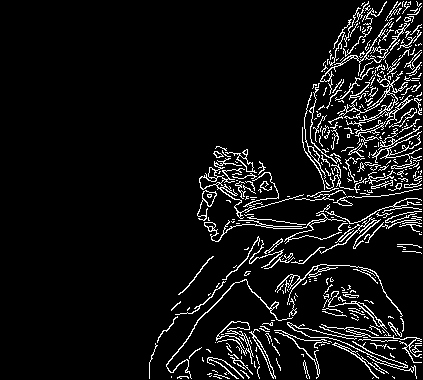
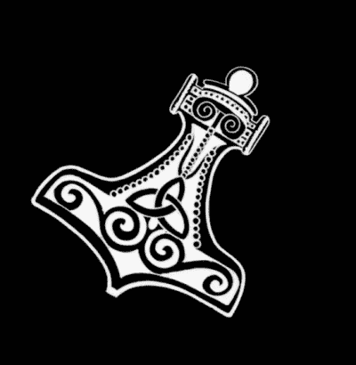
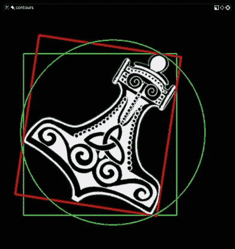
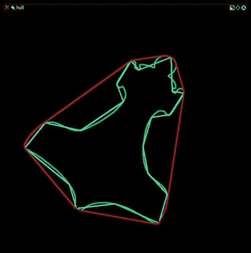
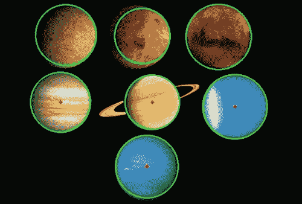

# 第三章：使用 OpenCV 3 处理图像

在处理图像的过程中，迟早你会发现自己需要修改图像：无论是应用艺术滤镜、扩展某些部分、剪切、粘贴，还是你心中能想到的其他任何操作。本章将介绍一些修改图像的技术，到本章结束时，你应该能够执行诸如在图像中检测肤色、锐化图像、标记主题轮廓以及使用线段检测器检测人行横道等任务。

# 在不同色彩空间之间转换

OpenCV 中实际上有数百种方法与色彩空间的转换相关。一般来说，在现代计算机视觉中，三种色彩空间最为常见：灰度、BGR 和**色调、饱和度、明度**（**HSV**）。

+   灰度是一种能够有效消除颜色信息，转换为灰度色调的色彩空间：这种色彩空间在中间处理中极为有用，例如人脸检测。

+   BGR 是蓝绿红色彩空间，其中每个像素是一个包含三个元素的数组，每个值代表蓝色、绿色和红色：网络开发者对颜色的类似定义应该很熟悉，只是颜色的顺序是 RGB。

+   在 HSV 色彩空间中，色调代表一种颜色调，饱和度是颜色的强度，而明度则表示其暗度（或光谱另一端的亮度）。

## 关于 BGR 的简要说明

当我最初开始处理 BGR 色彩空间时，发现有些事情并不符合预期：`[0 255 255]`的值（没有蓝色，全绿色和全红色）产生了黄色。如果你有艺术背景，你甚至不需要拿起画笔和画布就能看到绿色和红色混合成一种泥泞的棕色。这是因为计算机中使用的颜色模型被称为**加色**模型，并且与光有关。光的行为与颜料（遵循**减色**颜色模型）不同，并且——由于软件在以显示器为媒介的计算机上运行，而显示器会发出光——参考的颜色模型是加色模型。

# 傅里叶变换

在 OpenCV 中对图像和视频应用的大部分处理都涉及到以某种形式的概念——傅里叶变换。约瑟夫·傅里叶是一位 18 世纪的法国数学家，他发现了许多数学概念并使之流行，他的工作主要集中在研究热量和数学中的波形规律。特别是，他观察到所有波形都是不同频率的简单正弦波的叠加。

换句话说，你周围观察到的所有波形都是其他波形的总和。这个概念在处理图像时非常有用，因为它允许我们识别图像中信号（如图像像素）变化很大的区域，以及变化不那么剧烈的区域。然后我们可以任意标记这些区域作为噪声或感兴趣的区域，背景或前景等。这些就是构成原始图像的频率，我们有能力将它们分离，以便理解图像并推断有趣的数据。

### 注意

在 OpenCV 的上下文中，实现了一些算法，使我们能够处理图像并理解其中的数据，这些算法也在 NumPy 中重新实现，使我们的工作更加容易。NumPy 有一个**快速傅里叶变换**（**FFT**）包，其中包含`fft2()`方法。此方法允许我们计算图像的**离散傅里叶变换**（**DFT**）。

让我们使用傅里叶变换来考察图像的**幅度谱**概念。图像的幅度谱是另一个图像，它以变化的形式表示原始图像：可以想象成将图像中的所有最亮的像素拖到中心。然后，你逐渐向外工作，直到所有最暗的像素都被推到边缘。立即，你将能够看到图像中包含了多少亮暗像素以及它们分布的百分比。

傅里叶变换的概念是许多用于常见图像处理操作（如边缘检测或线形和形状检测）的算法的基础。

在详细探讨这些内容之前，让我们先看看两个概念，这两个概念与傅里叶变换结合，构成了上述处理操作的基础：高通滤波器和低通滤波器。

## 高通滤波器

**高通滤波器**（**HPF**）是一种检查图像某个区域的滤波器，根据与周围像素强度的差异来增强某些像素的强度。

以以下核为例：

```py
[[0, -0.25, 0],
 [-0.25, 1, -0.25],
 [0, -0.25, 0]]
```

### 注意

**核**是一组应用于源图像某个区域的权重，用于生成目标图像的单个像素。例如，`ksize`为`7`意味着在生成每个目标像素时考虑了`49 (7 x 7)`个源像素。我们可以将核想象成一块磨砂玻璃在源图像上移动，并让源的光线通过扩散混合。

在计算中心像素与所有直接邻居像素强度差异之和后，如果发现强度变化很大，则中心像素的强度将被增强（或不会增强）。换句话说，如果一个像素与周围像素不同，它将被增强。

这在边缘检测中特别有效，其中使用了一种称为高增强滤波器的高通滤波器。

高通滤波器和低通滤波器都使用一个名为 `radius` 的属性，它扩展了参与滤波器计算的邻居区域。

让我们通过一个 HPF 的例子来了解：

```py
import cv2
import numpy as np
from scipy import ndimage

kernel_3x3 = np.array([[-1, -1, -1],
                   [-1,  8, -1],
                   [-1, -1, -1]])

kernel_5x5 = np.array([[-1, -1, -1, -1, -1],
                       [-1,  1,  2,  1, -1],
                       [-1,  2,  4,  2, -1],
                       [-1,  1,  2,  1, -1],
                       [-1, -1, -1, -1, -1]])
```

### 注意

注意，这两个滤波器的总和为 `0`，其原因在 *边缘检测* 部分有详细解释。

```py
img = cv2.imread("../images/color1_small.jpg", 0)

k3 = ndimage.convolve(img, kernel_3x3)
k5 = ndimage.convolve(img, kernel_5x5)

blurred = cv2.GaussianBlur(img, (11,11), 0)
g_hpf = img - blurred

cv2.imshow("3x3", k3)
cv2.imshow("5x5", k5)
cv2.imshow("g_hpf", g_hpf)
cv2.waitKey()
cv2.destroyAllWindows()
```

在初始导入之后，我们定义了一个 `3x3` 的核和一个 `5x5` 的核，然后以灰度形式加载图像。通常，大多数图像处理都是使用 NumPy 完成的；然而，在这个特定的情况下，我们想要“卷积”一个图像和一个给定的核，而 NumPy 只接受一维数组。

这并不意味着不能使用 NumPy 实现深度数组的卷积，只是这可能会稍微复杂一些。相反，`ndimage`（它是 SciPy 的一部分，因此您应按照 第一章 中 *设置 OpenCV* 的说明进行安装），通过其 `convolve()` 函数使这变得简单，该函数支持 `cv2` 模块使用的经典 NumPy 数组来存储图像。

我们使用我们定义的两个卷积核应用两个 HPF。最后，我们还实现了一种通过应用低通滤波器并计算与原始图像的差异来获取 HPF 的微分方法。您将注意到第三种方法实际上效果最好，所以让我们也详细说明低通滤波器。

## 低通滤波器

如果一个 HPF 增强了像素的强度，考虑到它与邻居的差异，那么一个 **低通滤波器**（**LPF**）如果与周围像素的差异低于某个阈值，将会平滑该像素。这在去噪和模糊中得到了应用。例如，最流行的模糊/平滑滤波器之一，高斯模糊，就是一个低通滤波器，它衰减高频信号的强度。

# 创建模块

就像我们的 `CaptureManager` 和 `WindowManager` 类一样，我们的过滤器应该在 Cameo 之外可重用。因此，我们应该将过滤器分离到它们自己的 Python 模块或文件中。

让我们在 `cameo.py` 同一目录下创建一个名为 `filters.py` 的文件。在 `filters.py` 中，我们需要以下 `import` 语句：

```py
import cv2
import numpy
import utils
```

让我们在同一目录下也创建一个名为 `utils.py` 的文件。它应该包含以下 `import` 语句：

```py
import cv2
import numpy
import scipy.interpolate
```

我们将在 `filters.py` 中添加滤波函数和类，而更通用的数学函数将放在 `utils.py` 中。

# 边缘检测

边缘在人类和计算机视觉中都起着重要作用。作为人类，我们只需通过看到背光轮廓或粗糙草图，就能轻松识别许多物体类型及其姿态。确实，当艺术强调边缘和姿态时，它往往传达出原型的概念，比如罗丹的《思想者》或乔·舒斯特的《超人》。软件也可以对边缘、姿态和原型进行推理。我们将在后面的章节中讨论这些推理。

OpenCV 提供了许多边缘检测过滤器，包括`Laplacian()`、`Sobel()`和`Scharr()`。这些过滤器本应将非边缘区域变为黑色，而将边缘区域变为白色或饱和颜色。然而，它们容易将噪声误识别为边缘。这种缺陷可以通过在尝试寻找边缘之前对图像进行模糊来减轻。OpenCV 还提供了许多模糊过滤器，包括`blur()`（简单平均）、`medianBlur()`和`GaussianBlur()`。边缘检测和模糊过滤器的参数各不相同，但总是包括`ksize`，这是一个表示过滤器核宽度和高度的奇数整数。

对于模糊，让我们使用`medianBlur()`，它在去除数字视频噪声方面非常有效，尤其是在彩色图像中。对于边缘检测，让我们使用`Laplacian()`，它在灰度图像中产生粗壮的边缘线。在应用`Laplacian()`之前，但在应用`medianBlur()`之后，我们应该将图像从 BGR 转换为灰度。

一旦我们得到了`Laplacian()`的结果，我们可以将其反转以在白色背景上得到黑色边缘。然后，我们可以将其归一化（使其值范围从 0 到 1）并与源图像相乘以加深边缘。让我们在`filters.py`中实现这种方法：

```py
def strokeEdges(src, dst, blurKsize = 7, edgeKsize = 5):
    if blurKsize >= 3:
        blurredSrc = cv2.medianBlur(src, blurKsize)
        graySrc = cv2.cvtColor(blurredSrc, cv2.COLOR_BGR2GRAY)
    else:
        graySrc = cv2.cvtColor(src, cv2.COLOR_BGR2GRAY)
    cv2.Laplacian(graySrc, cv2.CV_8U, graySrc, ksize = edgeKsize)
    normalizedInverseAlpha = (1.0 / 255) * (255 - graySrc)
    channels = cv2.split(src)
    for channel in channels:
        channel[:] = channel * normalizedInverseAlpha
    cv2.merge(channels, dst)
```

注意，我们允许将核大小作为`strokeEdges()`的参数指定。`blurKsize`参数用作`medianBlur()`的`ksize`，而`edgeKsize`用作`Laplacian()`的`ksize`。在我的网络摄像头中，我发现`blurKsize`值为`7`和`edgeKsize`值为`5`看起来最佳。不幸的是，当`ksize`较大，如`7`时，`medianBlur()`会变得很昂贵。

### 小贴士

如果你在运行`strokeEdges()`时遇到性能问题，尝试减小`blurKsize`的值。要关闭模糊，将其设置为小于`3`的值。

# 自定义核 – 变得复杂

正如我们刚才看到的，OpenCV 的许多预定义过滤器使用核。记住，核是一组权重，这些权重决定了每个输出像素是如何从输入像素的邻域中计算出来的。核的另一个术语是**卷积矩阵**。它在某个区域内混合或卷积像素。同样，基于核的过滤器可能被称为卷积过滤器。

OpenCV 提供了一个非常通用的`filter2D()`函数，它可以应用我们指定的任何核或卷积矩阵。为了了解如何使用此函数，让我们首先学习卷积矩阵的格式。它是一个行和列都是奇数的二维数组。中心元素对应于一个感兴趣的像素，其他元素对应于该像素的邻居。每个元素包含一个整数或浮点值，这是一个应用于输入像素值的权重。考虑以下示例：

```py
kernel = numpy.array([[-1, -1, -1],
                      [-1,  9, -1],
                      [-1, -1, -1]])
```

在这里，感兴趣像素的权重为`9`，其直接邻居的权重各为`-1`。对于感兴趣像素，输出颜色将是其输入颜色的九倍减去所有八个相邻像素的输入颜色。如果感兴趣像素与其邻居已经有点不同，这种差异会变得更加明显。结果是，当邻居之间的对比度增加时，图像看起来会更*锐利*。

继续我们的示例，我们可以将这个卷积矩阵分别应用于源图像和目标图像，如下所示：

```py
cv2.filter2D(src, -1, kernel, dst)
```

第二个参数指定了目标图像的每个通道的深度（例如，对于每个通道 8 位，使用`cv2.CV_8U`）。一个负值（如这里所示）表示目标图像具有与源图像相同的深度。

### 注意

对于彩色图像，请注意`filter2D()`对每个通道应用内核是相同的。要使用不同通道的不同内核，我们还需要使用`split()`和`merge()`函数。

基于这个简单的示例，让我们向`filters.py`中添加两个类。一个类，`VConvolutionFilter`，将代表一般的卷积滤镜。一个子类，`SharpenFilter`，将代表我们的锐化滤镜。让我们编辑`filters.py`以实现这两个新类，如下所示：

```py
class VConvolutionFilter(object):
    """A filter that applies a convolution to V (or all of BGR)."""

    def __init__(self, kernel):
        self._kernel = kernel

    def apply(self, src, dst):
        """Apply the filter with a BGR or gray source/destination."""
        cv2.filter2D(src, -1, self._kernel, dst)

class SharpenFilter(VConvolutionFilter):
    """A sharpen filter with a 1-pixel radius."""

    def __init__(self):
        kernel = numpy.array([[-1, -1, -1],
                              [-1,  9, -1],
                              [-1, -1, -1]])
        VConvolutionFilter.__init__(self, kernel)
```

注意，权重之和为`1`。这应该在我们想要保持图像整体亮度不变时始终成立。如果我们稍微修改锐化核，使其权重之和为`0`，那么我们就有了一个将边缘变为白色、非边缘变为黑色的边缘检测核。例如，让我们将以下边缘检测滤镜添加到`filters.py`中：

```py
class FindEdgesFilter(VConvolutionFilter):
    """An edge-finding filter with a 1-pixel radius."""

    def __init__(self):
        kernel = numpy.array([[-1, -1, -1],
                              [-1,  8, -1],
                              [-1, -1, -1]])
        VConvolutionFilter.__init__(self, kernel)
```

接下来，让我们制作一个模糊滤镜。一般来说，为了产生模糊效果，权重之和应为`1`，并且在整个邻域内应为正值。例如，我们可以简单地取邻域的平均值，如下所示：

```py
class BlurFilter(VConvolutionFilter):
    """A blur filter with a 2-pixel radius."""

    def __init__(self):
        kernel = numpy.array([[0.04, 0.04, 0.04, 0.04, 0.04],
                              [0.04, 0.04, 0.04, 0.04, 0.04],
                              [0.04, 0.04, 0.04, 0.04, 0.04],
                              [0.04, 0.04, 0.04, 0.04, 0.04],
                              [0.04, 0.04, 0.04, 0.04, 0.04]])
        VConvolutionFilter.__init__(self, kernel)
```

我们使用的锐化、边缘检测和模糊滤镜都采用了高度对称的核。然而，有时使用对称性较低的核会产生有趣的效果。让我们考虑一个在一侧（具有正权重）模糊而在另一侧（具有负权重）锐化的核。这将产生一种脊状或*浮雕*效果。以下是一个可以添加到`filters.py`中的实现示例：

```py
class EmbossFilter(VConvolutionFilter):
    """An emboss filter with a 1-pixel radius."""

    def __init__(self):
        kernel = numpy.array([[-2, -1, 0],
                              [-1,  1, 1],
                              [ 0,  1, 2]])
        VConvolutionFilter.__init__(self, kernel)
```

这套自定义卷积滤镜非常基础。实际上，它比 OpenCV 的现成滤镜集更基础。然而，通过一些实验，你应该能够编写出产生独特外观的自己的核。

# 修改应用

现在我们已经有了几个滤镜的高级函数和类，将它们应用于 Cameo 捕获的帧变得非常简单。让我们编辑`cameo.py`并添加以下摘录中加粗的行：

```py
import cv2
import filters
from managers import WindowManager, CaptureManager

class Cameo(object):

    def __init__(self):
        self._windowManager = WindowManager('Cameo',
                                            self.onKeypress)
        self._captureManager = CaptureManager(
            cv2.VideoCapture(0), self._windowManager, True)
 self._curveFilter = filters.BGRPortraCurveFilter()

    def run(self):
        """Run the main loop."""
        self._windowManager.createWindow()
        while self._windowManager.isWindowCreated:
            self._captureManager.enterFrame()
            frame = self._captureManager.frame

 filters.strokeEdges(frame, frame)
 self._curveFilter.apply(frame, frame)

            self._captureManager.exitFrame()
            self._windowManager.processEvents()

    # ... The rest is the same as in Chapter 2.
```

在这里，我选择应用两种效果：描边边缘和模拟 Portra 胶片颜色。请随意修改代码以应用您喜欢的任何滤镜。

下面是 Cameo 的一个截图，展示了描边边缘和类似 Portra 的颜色：


# 使用 Canny 进行边缘检测

OpenCV 还提供了一个非常方便的函数，称为 Canny（以算法的发明者 John F. Canny 命名），它不仅因其有效性而广受欢迎，而且因其实现简单而广受欢迎，因为它在 OpenCV 程序中是一行代码：

```py
import cv2
import numpy as np

img = cv2.imread("../images/statue_small.jpg", 0)
cv2.imwrite("canny.jpg", cv2.Canny(img, 200, 300))
cv2.imshow("canny", cv2.imread("canny.jpg"))
cv2.waitKey()
cv2.destroyAllWindows()
```

结果是边缘的非常清晰的识别：



Canny 边缘检测算法相当复杂但也很有趣：它是一个五步过程，使用高斯滤波器对图像进行降噪，计算梯度，对边缘应用**非最大** **抑制**（**NMS**），对所有检测到的边缘进行双重阈值以消除假阳性，最后分析所有边缘及其相互之间的连接，以保留真实边缘并丢弃较弱的边缘。

# 轮廓检测

计算机视觉中的另一个重要任务是轮廓检测，这不仅因为检测图像或视频帧中包含的主题轮廓的明显方面，还因为与识别轮廓相关的导数操作。

这些操作包括计算边界多边形、近似形状以及通常计算感兴趣区域，这大大简化了与图像数据的交互，因为使用 NumPy 可以轻松地用数组切片定义矩形区域。在探索对象检测（包括人脸）和对象跟踪的概念时，我们将大量使用这项技术。

让我们按顺序进行，首先通过一个示例熟悉 API：

```py
import cv2
import numpy as np

img = np.zeros((200, 200), dtype=np.uint8)
img[50:150, 50:150] = 255

ret, thresh = cv2.threshold(img, 127, 255, 0)
image, contours, hierarchy = cv2.findContours(thresh, cv2.RETR_TREE, cv2.CHAIN_APPROX_SIMPLE)
color = cv2.cvtColor(img, cv2.COLOR_GRAY2BGR)
img = cv2.drawContours(color, contours, -1, (0,255,0), 2)
cv2.imshow("contours", color)
cv2.waitKey()
cv2.destroyAllWindows()
```

首先，我们创建一个 200x200 像素大小的空黑色图像。然后，我们利用 ndarray 在切片上赋值的能力，在图像的中心放置一个白色方块。

我们然后对图像进行阈值处理，并调用`findContours()`函数。此函数有三个参数：输入图像、层次结构类型和轮廓近似方法。此函数中有几个特别有趣的方面：

+   函数会修改输入图像，因此建议使用原始图像的副本（例如，通过传递`img.copy()`）。

+   其次，函数返回的层次结构树非常重要：`cv2.RETR_TREE`将检索图像中轮廓的整个层次结构，使您能够建立轮廓之间的“关系”。如果您只想检索最外层的轮廓，请使用`cv2.RETR_EXTERNAL`。这在您想要消除完全包含在其他轮廓中的轮廓时特别有用（例如，在大多数情况下，您不需要检测另一个相同类型的对象内的对象）。

`findContours`函数返回三个元素：修改后的图像、轮廓及其层次结构。我们使用轮廓在图像的颜色版本上绘制（这样我们可以在绿色上绘制轮廓），并最终显示它。

结果是一个用绿色绘制轮廓的白色正方形。虽然简单，但有效地展示了概念！让我们继续看更有意义的例子。

# 轮廓 – 包围盒、最小面积矩形和最小包围圆

找到正方形的轮廓是一个简单的任务；不规则、倾斜和旋转的形状最能发挥 OpenCV 的`cv2.findContours`实用函数的作用。让我们看看下面的图像：



在实际应用中，我们最感兴趣的是确定主题的包围盒、其最小包围矩形和其圆。结合`cv2.findContours`函数和一些其他 OpenCV 实用工具，这使得实现这一点变得非常容易：

```py
import cv2
import numpy as np

img = cv2.pyrDown(cv2.imread("hammer.jpg", cv2.IMREAD_UNCHANGED))

ret, thresh = cv2.threshold(cv2.cvtColor(img.copy(), cv2.COLOR_BGR2GRAY) , 127, 255, cv2.THRESH_BINARY)
image, contours, hier = cv2.findContours(thresh, cv2.RETR_EXTERNAL, cv2.CHAIN_APPROX_SIMPLE)

for c in contours:
  # find bounding box coordinates
  x,y,w,h = cv2.boundingRect(c)
  cv2.rectangle(img, (x,y), (x+w, y+h), (0, 255, 0), 2)

  # find minimum area
  rect = cv2.minAreaRect(c)
  # calculate coordinates of the minimum area rectangle
  box = cv2.boxPoints(rect)
  # normalize coordinates to integers
  box = np.int0(box)
  # draw contours
  cv2.drawContours(img, [box], 0, (0,0, 255), 3)

  # calculate center and radius of minimum enclosing circle
  (x,y),radius = cv2.minEnclosingCircle(c)
  # cast to integers
  center = (int(x),int(y))
  radius = int(radius)
  # draw the circle
  img = cv2.circle(img,center,radius,(0,255,0),2)

cv2.drawContours(img, contours, -1, (255, 0, 0), 1)
cv2.imshow("contours", img)
```

在初始导入之后，我们加载图像，然后在原始图像的灰度版本上应用二值阈值。通过这样做，我们在灰度副本上进行所有查找轮廓的计算，但我们绘制在原始图像上，以便利用颜色信息。

首先，让我们计算一个简单的包围盒：

```py
x,y,w,h = cv2.boundingRect(c)
```

这是一个相当直接的轮廓信息转换为`(x, y)`坐标的转换，加上矩形的宽度和高度。绘制这个矩形是一个简单的任务，可以使用以下代码完成：

```py
  cv2.rectangle(img, (x,y), (x+w, y+h), (0, 255, 0), 2)
```

其次，让我们计算包围主题的最小面积：

```py
rect = cv2.minAreaRect(c)
box = cv2.boxPoints(rect)
  box = np.int0(box)
```

这里使用的机制特别有趣：OpenCV 没有直接从轮廓信息计算最小矩形顶点坐标的功能。相反，我们计算最小矩形面积，然后计算这个矩形的顶点。请注意，计算出的顶点是浮点数，但像素是用整数访问的（您不能访问像素的一部分），因此我们需要进行这种转换。接下来，我们绘制这个盒子，这为我们提供了一个介绍`cv2.drawContours`函数的绝佳机会：

```py
cv2.drawContours(img, [box], 0, (0,0, 255), 3)
```

首先，这个函数——就像所有绘图函数一样——会修改原始图像。其次，它在其第二个参数中接受一个轮廓数组，因此您可以在一次操作中绘制多个轮廓。因此，如果您有一组代表轮廓多边形的点，您需要将这些点包装成一个数组，就像我们在前面的例子中处理我们的盒子一样。这个函数的第三个参数指定了我们要绘制的轮廓数组的索引：值为`-1`将绘制所有轮廓；否则，将绘制轮廓数组（第二个参数）中指定索引处的轮廓。

大多数绘图函数将绘图颜色和厚度作为最后两个参数。

我们将要检查的最后一个边界轮廓是最小包围圆：

```py
  (x,y),radius = cv2.minEnclosingCircle(c)
  center = (int(x),int(y))
  radius = int(radius)
  img = cv2.circle(img,center,radius,(0,255,0),2)
```

`cv2.minEnclosingCircle` 函数的唯一特殊性在于它返回一个包含两个元素的元组，其中第一个元素本身也是一个元组，表示圆心的坐标，第二个元素是这个圆的半径。在将这些值转换为整数后，画圆就变得相当简单了。

最终在原始图像上的结果看起来像这样：



# 等高线 – 凸等高线和 Douglas-Peucker 算法

大多数时候，当处理等高线时，主题将具有最多样化的形状，包括凸形。凸形是指在这个形状内部有两个点，它们之间的连线会超出形状本身的轮廓。

OpenCV 提供的第一个用于计算形状近似边界多边形的工具是 `cv2.approxPolyDP`。这个函数有三个参数：

+   等高线

+   一个 epsilon 值，表示原始等高线和近似多边形之间的最大差异（值越低，近似值越接近原始等高线）

+   一个布尔标志，表示多边形是封闭的

epsilon 值对于获得有用的等高线至关重要，因此让我们了解它代表什么。epsilon 是近似多边形周长和原始等高线周长之间的最大差异。这个差异越低，近似多边形就越接近原始等高线。

当我们已经有了一个精确表示的等高线时，你可能想知道为什么我们还需要一个近似的 polygon。答案是，多边形是一系列直线，能够在区域内定义多边形以便进一步的操作和处理，这在许多计算机视觉任务中至关重要。

现在我们已经知道了 epsilon 是什么，我们需要获取等高线周长信息作为参考值。这可以通过 OpenCV 的 `cv2.arcLength` 函数获得：

```py
epsilon = 0.01 * cv2.arcLength(cnt, True)
approx = cv2.approxPolyDP(cnt, epsilon, True)
```

实际上，我们是在指示 OpenCV 计算一个近似的多边形，其周长只能在一个 epsilon 比率内与原始等高线不同。

OpenCV 还提供了一个 `cv2.convexHull` 函数来获取凸形状的处理后的等高线信息，这是一个简单的单行表达式：

```py
hull = cv2.convexHull(cnt)
```

让我们将原始等高线、近似的多边形等高线和凸包结合在一个图像中，以观察它们之间的差异。为了简化问题，我已经将等高线应用到一张黑底图像上，这样原始主题不可见，但其轮廓是可见的：



如您所见，凸包包围了整个主题，近似多边形是最内层的多边形形状，两者之间是原始等高线，主要由弧线组成。

# 线和圆检测

检测边缘和轮廓不仅是常见且重要的任务，它们还构成了其他复杂操作的基础。线和形状检测与边缘和轮廓检测是相辅相成的，因此让我们看看 OpenCV 如何实现这些。

线和形状检测背后的理论基于一种称为 Hough 变换的技术，由 Richard Duda 和 Peter Hart 发明，他们扩展（推广）了 Paul Hough 在 20 世纪 60 年代初的工作。

让我们看看 OpenCV 的 Hough 变换 API。

## 线检测

首先，让我们使用 `HoughLines` 和 `HoughLinesP` 函数检测一些线，这是通过 `HoughLines` 函数调用来完成的。这两个函数之间的唯一区别是，一个使用标准 Hough 变换，另一个使用概率 Hough 变换（因此名称中的 `P`）。

概率版本之所以被称为概率版本，是因为它只分析点的一个子集，并估计这些点全部属于同一条线的概率。这个实现是标准 Hough 变换的优化版本，在这种情况下，它计算量更小，执行速度更快。

让我们来看一个非常简单的例子：

```py
import cv2
import numpy as np

img = cv2.imread('lines.jpg')
gray = cv2.cvtColor(img,cv2.COLOR_BGR2GRAY)
edges = cv2.Canny(gray,50,120)
minLineLength = 20
maxLineGap = 5
lines = cv2.HoughLinesP(edges,1,np.pi/180,100,minLineLength,maxLineGap)
for x1,y1,x2,y2 in lines[0]:
  cv2.line(img,(x1,y1),(x2,y2),(0,255,0),2)

cv2.imshow("edges", edges)
cv2.imshow("lines", img)
cv2.waitKey()
cv2.destroyAllWindows()
```

这个简单脚本的关键点——除了 `HoughLines` 函数调用之外——是设置最小线长度（较短的线将被丢弃）和最大线间隙，这是在两条线段开始被视为单独的线之前，线中最大间隙的大小。

还要注意，`HoughLines` 函数需要一个单通道二值图像，该图像通过 Canny 边缘检测滤波器处理。Canny 不是严格的要求；一个去噪后只代表边缘的图像，是 Hough 变换的理想来源，因此你会发现这是一种常见的做法。

`HoughLinesP` 的参数如下：

+   我们想要处理的图像。

+   线的几何表示，`rho` 和 `theta`，通常为 `1` 和 `np.pi/180`。

+   阈值，表示低于此阈值的线将被丢弃。Hough 变换使用一个由桶和投票组成的系统，每个桶代表一条线，因此任何获得 `<阈值>` 投票的线将被保留，其余的将被丢弃。

+   我们之前提到的 `MinLineLength` 和 `MaxLineGap`。

## 圆检测

OpenCV 还有一个用于检测圆的功能，称为 `HoughCircles`。它的工作方式与 `HoughLines` 非常相似，但 `minLineLength` 和 `maxLineGap` 是用于丢弃或保留线的参数，而 `HoughCircles` 有圆心之间的最小距离、最小和最大半径等参数。下面是一个必看的示例：

```py
import cv2
import numpy as np

planets = cv2.imread('planet_glow.jpg')
gray_img = cv2.cvtColor(planets, cv2.COLOR_BGR2GRAY)
img = cv2.medianBlur(gray_img, 5)
cimg = cv2.cvtColor(img,cv2.COLOR_GRAY2BGR)

circles = cv2.HoughCircles(img,cv2.HOUGH_GRADIENT,1,120,
                            param1=100,param2=30,minRadius=0,maxRadius=0)

circles = np.uint16(np.around(circles))

for i in circles[0,:]:
    # draw the outer circle
    cv2.circle(planets,(i[0],i[1]),i[2],(0,255,0),2)
    # draw the center of the circle
    cv2.circle(planets,(i[0],i[1]),2,(0,0,255),3)

cv2.imwrite("planets_circles.jpg", planets)
cv2.imshow("HoughCirlces", planets)
cv2.waitKey()
cv2.destroyAllWindows()
```

下面是结果的可视表示：



# 检测形状

使用霍夫变换检测形状仅限于圆形；然而，当我们讨论`approxPolyDP`时，我们已经隐式地探索了检测任何形状的方法。这个函数允许对多边形进行近似，所以如果你的图像包含多边形，它们将被相当准确地检测到，这结合了`cv2.findContours`和`cv2.approxPolyDP`的使用。

# 摘要

到目前为止，你应该已经对颜色空间、傅里叶变换以及 OpenCV 提供的用于处理图像的几种类型的过滤器有了很好的理解。

你还应该熟练地检测边缘、线条、圆形以及一般形状。此外，你应该能够找到轮廓并利用它们提供关于图像中包含的主题的信息。这些概念将作为探索下一章主题的理想背景。
