# 第四章：深度估计与分割

本章向您展示如何使用深度相机的数据来识别前景和背景区域，以便我们可以将效果限制在仅前景或仅背景。作为先决条件，我们需要一个深度相机，例如微软 Kinect，并且我们需要构建支持我们深度相机的 OpenCV。有关构建说明，请参阅第一章，*设置 OpenCV*。

本章我们将处理两个主要主题：深度估计和分割。我们将通过两种不同的方法来探索深度估计：首先，使用深度相机（本章第一部分的先决条件），例如微软 Kinect；然后，使用立体图像，对于普通相机就足够了。有关如何构建支持深度相机的 OpenCV 的说明，请参阅第一章，*设置 OpenCV*。本章的第二部分是关于分割，这是一种允许我们从图像中提取前景对象的技术。

# 创建模块

捕获和处理深度相机数据的代码将在`Cameo.py`外部可重用。因此，我们应该将其分离到一个新的模块中。让我们在`Cameo.py`相同的目录下创建一个名为`depth.py`的文件。在`depth.py`中，我们需要以下`import`语句：

```py
import numpy
```

我们还需要修改现有的`rects.py`文件，以便我们的复制操作可以限制在矩形的非矩形子区域内。为了支持我们将要进行的更改，让我们向`rects.py`添加以下`import`语句：

```py
import numpy
import utils
```

最后，我们应用的新版本将使用与深度相关的功能。因此，让我们向`Cameo.py`添加以下`import`语句：

```py
import depth
```

现在，让我们更深入地探讨深度主题。

# 从深度相机捕获帧

在第二章，*处理文件、相机和 GUI*中，我们讨论了计算机可以拥有多个视频捕获设备，并且每个设备可以有多个通道的概念。假设一个给定的设备是立体相机。每个通道可能对应不同的镜头和传感器。此外，每个通道可能对应不同类型的数据，例如正常彩色图像与深度图。OpenCV 的 C++版本定义了一些用于某些设备和通道标识符的常量。然而，这些常量在 Python 版本中并未定义。

为了解决这个问题，让我们在`depth.py`中添加以下定义：

```py
# Devices.CAP_OPENNI = 900 # OpenNI (for Microsoft Kinect)CAP_OPENNI_ASUS = 910 # OpenNI (for Asus Xtion)
# Channels of an OpenNI-compatible depth generator.CAP_OPENNI_DEPTH_MAP = 0 # Depth values in mm (16UC1)CAP_OPENNI_POINT_CLOUD_MAP = 1 # XYZ in meters (32FC3)CAP_OPENNI_DISPARITY_MAP = 2 # Disparity in pixels (8UC1)CAP_OPENNI_DISPARITY_MAP_32F = 3 # Disparity in pixels (32FC1)CAP_OPENNI_VALID_DEPTH_MASK = 4 # 8UC1
# Channels of an OpenNI-compatible RGB image generator.CAP_OPENNI_BGR_IMAGE = 5CAP_OPENNI_GRAY_IMAGE = 6
```

深度相关通道需要一些解释，如下所示列表中所述：

+   **深度图**是一种灰度图像，其中每个像素值代表从相机到表面的估计距离。具体来说，来自`CAP_OPENNI_DEPTH_MAP`通道的图像将距离表示为毫米的浮点数。

+   **点云图**是一个彩色图像，其中每个颜色对应于一个（x，y 或 z）空间维度。具体来说，`CAP_OPENNI_POINT_CLOUD_MAP` 通道产生一个 BGR 图像，其中 B 是 x（蓝色是右侧），G 是 y（绿色是上方），R 是 z（红色是深度），从相机的视角来看。这些值以米为单位。

+   **视差图**是一个灰度图像，其中每个像素值是表面的立体视差。为了概念化立体视差，让我们假设我们叠加了从不同视角拍摄的同一场景的两个图像。结果将类似于看到双重图像。对于场景中任何一对孪生物体上的点，我们可以测量像素距离。这种测量是立体视差。靠近的物体表现出比远处的物体更大的立体视差。因此，靠近的物体在视差图中看起来更亮。

+   一个**有效的深度掩码**显示给定像素处的深度信息是否被认为是有效的（通过非零值表示）或无效的（通过零值表示）。例如，如果深度相机依赖于红外照明器（红外闪光灯），那么从该光源被遮挡（阴影）的区域中的深度信息是无效的。

以下截图显示了一个坐在猫雕塑后面的男人的点云图：

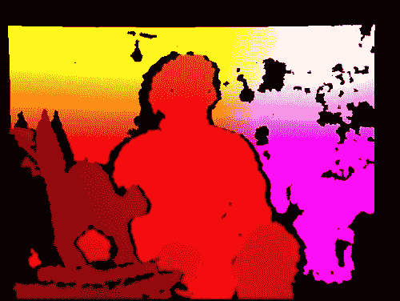

以下截图显示了一个坐在猫雕塑后面的男人的视差图：

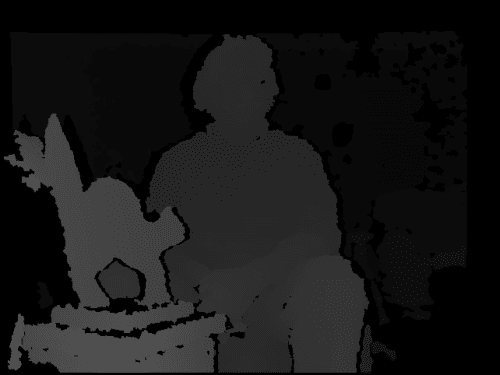

以下截图显示了坐在猫雕塑后面的男人的有效深度掩码：

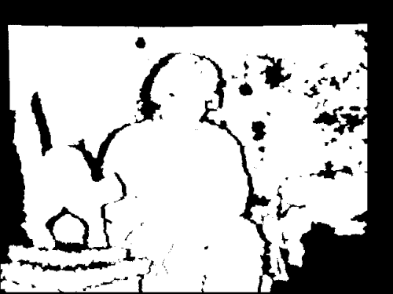

# 从视差图创建掩码

对于 Cameo 的目的，我们感兴趣的是视差图和有效深度掩码。它们可以帮助我们细化我们对面部区域的估计。

使用 `FaceTracker` 函数和正常彩色图像，我们可以获得面部区域的矩形估计。通过分析相应的视差图中的这样一个矩形区域，我们可以知道矩形内的某些像素是异常值——太近或太远，实际上不可能是面部的一部分。我们可以细化面部区域以排除这些异常值。然而，我们只应在数据有效的地方应用此测试，正如有效深度掩码所示。

让我们编写一个函数来生成一个掩码，其值对于被拒绝的面部矩形区域为 `0`，对于接受的区域为 `1`。这个函数应该接受视差图、有效深度掩码和一个矩形作为参数。我们可以在 `depth.py` 中实现它如下：

```py
def createMedianMask(disparityMap, validDepthMask, rect = None):
    """Return a mask selecting the median layer, plus shadows."""
    if rect is not None:
        x, y, w, h = rect
        disparityMap = disparityMap[y:y+h, x:x+w]
        validDepthMask = validDepthMask[y:y+h, x:x+w]
    median = numpy.median(disparityMap)
    return numpy.where((validDepthMask == 0) | \
                       (abs(disparityMap - median) < 12),
                       1.0, 0.0)
```

为了在视差图中识别异常值，我们首先使用 `numpy.median()` 函数找到中位数，该函数需要一个数组作为参数。如果数组长度为奇数，`median()` 函数返回如果数组排序后位于中间的值。如果数组长度为偶数，`median()` 函数返回位于数组中间两个排序值之间的平均值。

要根据每个像素的布尔操作生成掩码，我们使用 `numpy.where()` 并提供三个参数。在第一个参数中，`where()` 接收一个数组，其元素被评估为真或假。返回一个具有相同维度的输出数组。在输入数组中的任何元素为 `true` 时，`where()` 函数的第二参数被分配给输出数组中的相应元素。相反，在输入数组中的任何元素为 `false` 时，`where()` 函数的第三参数被分配给输出数组中的相应元素。

我们的实现将具有有效视差值且与中值视差值偏差 12 或更多的像素视为异常值。我仅通过实验选择了 12 这个值。请根据您使用特定相机设置运行 Cameo 时遇到的结果自由调整此值。

# 对复制操作进行掩码处理

作为前一章工作的部分，我们将 `copyRect()` 编写为一个复制操作，该操作限制自己仅限于源和目标图像的给定矩形。现在，我们想要进一步限制这个复制操作。我们想要使用一个与源矩形具有相同尺寸的给定掩码。

我们将只复制源矩形中掩码值为非零的像素。其他像素将保留其从目标图像中的旧值。这种逻辑，使用条件数组以及两个可能的输出值数组，可以用我们最近学习的 `numpy.where()` 函数简洁地表达。

让我们打开 `rects.py` 并编辑 `copyRect()` 以添加一个新的掩码参数。这个参数可能是 `None`，在这种情况下，我们将回退到我们旧的复制操作实现。否则，我们接下来确保掩码和图像具有相同数量的通道。我们假设掩码有一个通道，但图像可能有三个通道（BGR）。我们可以使用 `numpy.array` 的 `repeat()` 和 `reshape()` 方法向掩码添加重复的通道。

最后，我们使用 `where()` 执行复制操作。完整的实现如下：

```py
def copyRect(src, dst, srcRect, dstRect, mask = None,
             interpolation = cv2.INTER_LINEAR):
    """Copy part of the source to part of the destination."""

    x0, y0, w0, h0 = srcRect
    x1, y1, w1, h1 = dstRect

    # Resize the contents of the source sub-rectangle.
    # Put the result in the destination sub-rectangle.
    if mask is None:
        dst[y1:y1+h1, x1:x1+w1] = \
            cv2.resize(src[y0:y0+h0, x0:x0+w0], (w1, h1),
                       interpolation = interpolation)
    else:
        if not utils.isGray(src):
            # Convert the mask to 3 channels, like the image.
            mask = mask.repeat(3).reshape(h0, w0, 3)
        # Perform the copy, with the mask applied.
        dst[y1:y1+h1, x1:x1+w1] = \
            numpy.where(cv2.resize(mask, (w1, h1),
                                   interpolation = \
                                   cv2.INTER_NEAREST),
                        cv2.resize(src[y0:y0+h0, x0:x0+w0], (w1, h1),
                                   interpolation = interpolation),
                        dst[y1:y1+h1, x1:x1+w1])
```

我们还需要修改我们的 `swapRects()` 函数，该函数使用 `copyRect()` 来执行一系列矩形区域的环形交换。对 `swapRects()` 的修改非常简单。我们只需要添加一个新的 `masks` 参数，它是一个包含掩码的列表，这些掩码的元素被传递到相应的 `copyRect()` 调用中。如果给定的 `masks` 参数值为 `None`，我们将 `None` 传递给每个 `copyRect()` 调用。

以下代码展示了这一实现的完整内容：

```py
def swapRects(src, dst, rects, masks = None,
              interpolation = cv2.INTER_LINEAR):
    """Copy the source with two or more sub-rectangles swapped."""

    if dst is not src:
        dst[:] = src

    numRects = len(rects)
    if numRects < 2:
        return

    if masks is None:
        masks = [None] * numRects

    # Copy the contents of the last rectangle into temporary storage.
    x, y, w, h = rects[numRects - 1]
    temp = src[y:y+h, x:x+w].copy()

    # Copy the contents of each rectangle into the next.
    i = numRects - 2
    while i >= 0:
        copyRect(src, dst, rects[i], rects[i+1], masks[i],
                 interpolation)
        i -= 1

    # Copy the temporarily stored content into the first rectangle.
    copyRect(temp, dst, (0, 0, w, h), rects[0], masks[numRects - 1],
             interpolation)
```

注意，`copyRect()` 和 `swapRects()` 中的 `masks` 参数默认为 `None`。因此，我们这些函数的新版本与我们的 Cameo 旧版本向后兼容。

# 使用普通相机进行深度估计

深度相机是一种捕捉图像并估计物体与相机之间距离的神奇小设备，但是，深度相机是如何检索深度信息的？此外，是否可以使用普通相机重现同样的计算？

深度相机，如 Microsoft Kinect，使用一个传统的相机结合一个红外传感器，这有助于相机区分相似的对象并计算它们与相机的距离。然而，并不是每个人都能接触到深度相机或 Kinect，尤其是在你刚开始学习 OpenCV 时，你可能不会投资昂贵的设备，直到你觉得自己技能已经磨炼得很好，你对这个主题的兴趣也得到了确认。

我们的设置包括一个简单的相机，这很可能是集成在我们的机器中，或者是一个连接到我们电脑的摄像头。因此，我们需要求助于不那么花哨的方法来估计物体与相机之间的距离差异。

在这种情况下，几何学将提供帮助，特别是极线几何，它是立体视觉的几何学。立体视觉是计算机视觉的一个分支，它从同一主题的两个不同图像中提取三维信息。

极线几何是如何工作的呢？从概念上讲，它从相机向图像中的每个对象绘制想象中的线条，然后在第二张图像上做同样的事情，并基于对应对象的线条交点来计算物体的距离。以下是这个概念的一个表示：

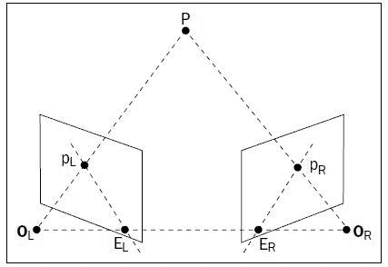

让我们看看 OpenCV 是如何应用极线几何来计算所谓的视差图，这基本上是图像中检测到的不同深度的表示。这将使我们能够提取图片的前景并丢弃其余部分。

首先，我们需要从不同的视角拍摄同一主题的两个图像，但要注意，图片是从与物体等距离的位置拍摄的，否则计算将失败，视差图将没有意义。

那么，让我们继续一个例子：

```py
import numpy as np
import cv2

def update(val = 0):
    # disparity range is tuned for 'aloe' image pair
    stereo.setBlockSize(cv2.getTrackbarPos('window_size', 'disparity'))
    stereo.setUniquenessRatio(cv2.getTrackbarPos('uniquenessRatio', 'disparity'))
    stereo.setSpeckleWindowSize(cv2.getTrackbarPos('speckleWindowSize', 'disparity'))
    stereo.setSpeckleRange(cv2.getTrackbarPos('speckleRange', 'disparity'))
    stereo.setDisp12MaxDiff(cv2.getTrackbarPos('disp12MaxDiff', 'disparity'))

    print 'computing disparity...'
    disp = stereo.compute(imgL, imgR).astype(np.float32) / 16.0

    cv2.imshow('left', imgL)
    cv2.imshow('disparity', (disp-min_disp)/num_disp)

if __name__ == "__main__":
    window_size = 5
    min_disp = 16
    num_disp = 192-min_disp
    blockSize = window_size
    uniquenessRatio = 1
    speckleRange = 3
    speckleWindowSize = 3
    disp12MaxDiff = 200
    P1 = 600
    P2 = 2400
    imgL = cv2.imread('images/color1_small.jpg')
    imgR = cv2.imread('images/color2_small.jpg')    
    cv2.namedWindow('disparity')
    cv2.createTrackbar('speckleRange', 'disparity', speckleRange, 50, update)    
    cv2.createTrackbar('window_size', 'disparity', window_size, 21, update)
    cv2.createTrackbar('speckleWindowSize', 'disparity', speckleWindowSize, 200, update)
    cv2.createTrackbar('uniquenessRatio', 'disparity', uniquenessRatio, 50, update)
    cv2.createTrackbar('disp12MaxDiff', 'disparity', disp12MaxDiff, 250, update)
    stereo = cv2.StereoSGBM_create(
        minDisparity = min_disp,
        numDisparities = num_disp,
        blockSize = window_size,
        uniquenessRatio = uniquenessRatio,
        speckleRange = speckleRange,
        speckleWindowSize = speckleWindowSize,
        disp12MaxDiff = disp12MaxDiff,
        P1 = P1,
        P2 = P2
    )
    update()
    cv2.waitKey()
```

在这个例子中，我们取同一主题的两个图像，并计算一个视差图，用较亮的颜色显示地图中靠近相机的点。用黑色标记的区域代表视差。

首先，我们像往常一样导入`numpy`和`cv2`。

让我们先暂时跳过`update`函数的定义，看看主要代码；这个过程相当简单：加载两个图像，创建一个`StereoSGBM`实例（`StereoSGBM`代表**半全局块匹配**，这是一种用于计算视差图的算法），并创建一些滑块来调整算法的参数，然后调用`update`函数。

`update`函数将滑块值应用于`StereoSGBM`实例，然后调用`compute`方法，该方法生成视差图。总的来说，相当简单！以下是第一个我使用的图像：

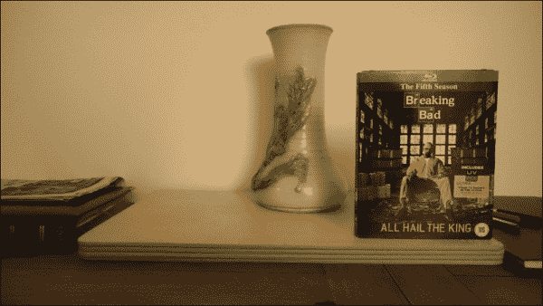

这是第二个：

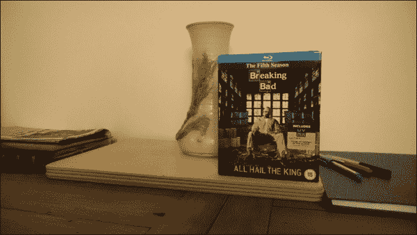

你看：这是一个既好又容易解释的视差图。

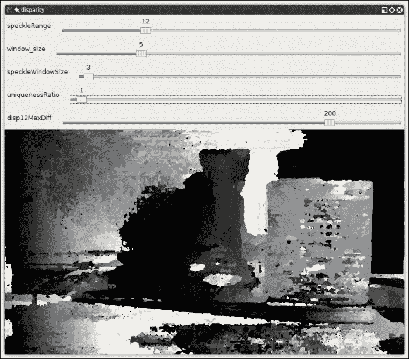

`StereoSGBM`使用的参数如下（摘自 OpenCV 文档）：

| 参数 | 描述 |
| --- | --- |
| `minDisparity` | 此参数表示可能的最小视差值。通常为零，但有时校正算法可以移动图像，因此需要相应地调整此参数。 |
| `numDisparities` | 此参数表示最大视差减去最小视差。结果值始终大于零。在当前实现中，此参数必须是 16 的倍数。 |
| `windowSize` | 此参数表示匹配块的大小。它必须是一个大于或等于 1 的奇数。通常，它应该在 3-11 的范围内。 |
| `P1` | 此参数表示控制视差平滑度的第一个参数。参见下一点。 |
| `P2` | 此参数表示控制视差平滑度的第二个参数。值越大，视差越平滑。`P1`是相邻像素之间视差变化加减 1 的惩罚。`P2`是相邻像素之间视差变化超过 1 的惩罚。算法要求`P2 > P1`。请参见`stereo_match.cpp`示例，其中显示了某些合理的`P1`和`P2`值（例如`8*number_of_image_channels*windowSize*windowSize`和`32*number_of_image_channels*windowSize*windowSize`，分别）。 |
| `disp12MaxDiff` | 此参数表示左右视差检查允许的最大差异（以整数像素为单位）。将其设置为非正值以禁用检查。 |
| `preFilterCap` | 此参数表示预滤波图像像素的截断值。算法首先计算每个像素的 x 导数，并通过`[-preFilterCap, preFilterCap]`区间剪辑其值。结果值传递给 Birchfield-Tomasi 像素成本函数。 |
| `uniquenessRatio` | 此参数表示最佳（最小）计算成本函数值相对于第二最佳值应“获胜”的百分比边缘。通常，5-15 范围内的值就足够好了。 |
| `speckleWindowSize` | 此参数表示考虑其噪声斑点和无效化的平滑视差区域的最大大小。将其设置为`0`以禁用斑点滤波。否则，将其设置为 50-200 范围内的某个值。 |
| `speckleRange` | 此参数指代每个连通组件内的最大视差变化。如果你进行斑点滤波，将参数设置为正值；它将隐式地乘以 16。通常，1 或 2 就足够了。 |

使用前面的脚本，你可以加载图像并调整参数，直到你对`StereoSGBM`生成的视差图满意为止。

# 使用 Watershed 和 GrabCut 算法进行对象分割

计算视差图对于检测图像的前景非常有用，但`StereoSGBM`并非完成此任务的唯一算法，实际上，`StereoSGBM`更多的是从二维图片中收集三维信息，而不是其他。然而，**GrabCut**是完成此目的的完美工具。GrabCut 算法遵循一系列精确的步骤：

1.  定义一个包含图片主题（s）的矩形。

1.  位于矩形外部区域自动定义为背景。

1.  背景中的数据用作参考，以区分用户定义矩形内的背景区域和前景区域。

1.  **高斯混合模型**（**GMM**）对前景和背景进行建模，并将未定义的像素标记为可能的背景和前景。

1.  图像中的每个像素通过虚拟边与周围的像素虚拟连接，每个边根据其与周围像素在颜色上的相似性获得成为前景或背景的概率。

1.  每个像素（或算法中概念化的节点）连接到前景节点或背景节点，你可以想象成这样：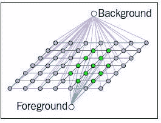

1.  在节点连接到任一终端（背景或前景，也称为源和汇）之后，属于不同终端的节点之间的边被切断（算法中著名的切割部分），这使得图像部分的分离成为可能。此图充分代表了该算法：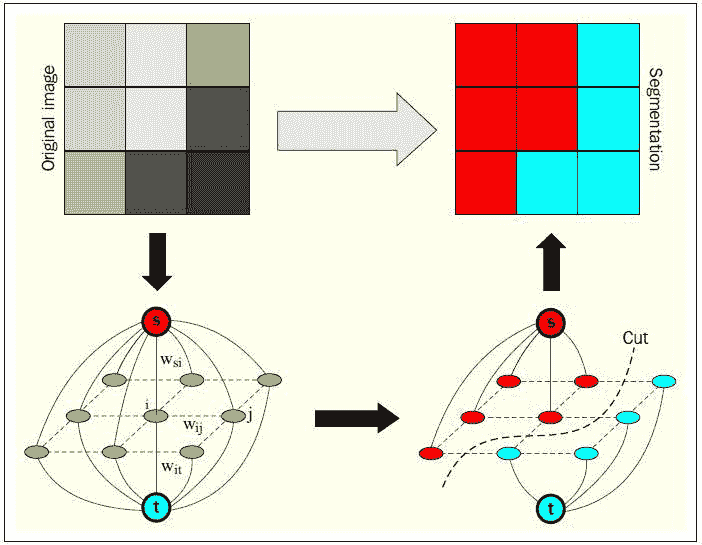

## 使用 GrabCut 进行前景检测的示例

让我们来看一个例子。我们从一个美丽的天使雕像的图片开始。

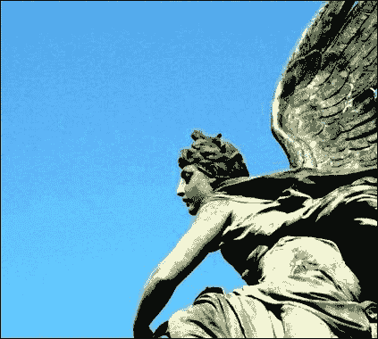

我们想要抓住我们的天使并丢弃背景。为此，我们将创建一个相对简短的脚本，该脚本将实例化 GrabCut，执行分离，然后将生成的图像与原始图像并排显示。我们将使用`matplotlib`，这是一个非常有用的 Python 库，它使得显示图表和图像变得非常简单：

```py
import numpy as np
import cv2
from matplotlib import pyplot as plt

img = cv2.imread('images/statue_small.jpg')
mask = np.zeros(img.shape[:2],np.uint8)

bgdModel = np.zeros((1,65),np.float64)
fgdModel = np.zeros((1,65),np.float64)

rect = (100,50,421,378)
cv2.grabCut(img,mask,rect,bgdModel,fgdModel,5,cv2.GC_INIT_WITH_RECT)

mask2 = np.where((mask==2)|(mask==0),0,1).astype('uint8')
img = img*mask2[:,:,np.newaxis]

plt.subplot(121), plt.imshow(img)
plt.title("grabcut"), plt.xticks([]), plt.yticks([])
plt.subplot(122), plt.imshow(cv2.cvtColor(cv2.imread('images/statue_small.jpg'), cv2.COLOR_BGR2RGB))
plt.title("original"), plt.xticks([]), plt.yticks([])
plt.show()
```

这段代码实际上非常直接。首先，我们加载我们想要处理的图像，然后我们创建一个与加载的图像形状相同的零填充掩码：

```py
import numpy as np
import cv2
from matplotlib import pyplot as plt

img = cv2.imread('images/statue_small.jpg')
mask = np.zeros(img.shape[:2],np.uint8)
```

然后，我们创建零填充的前景和背景模型：

```py
bgdModel = np.zeros((1,65),np.float64)
fgdModel = np.zeros((1,65),np.float64)
```

我们可以用数据填充这些模型，但我们将使用一个矩形来初始化 GrabCut 算法，以识别我们想要隔离的主题。因此，背景和前景模型将基于初始矩形之外的区域来确定。这个矩形在下一行定义：

```py
rect = (100,50,421,378)
```

现在来到有趣的部分！我们运行 GrabCut 算法，指定空模型和掩码，以及我们将使用矩形来初始化操作：

```py
cv2.grabCut(img,mask,rect,bgdModel,fgdModel,5,cv2.GC_INIT_WITH_RECT)
```

你也会注意到`fgdModel`后面有一个整数，这是算法将在图像上运行的迭代次数。你可以增加这些迭代次数，但像素分类会收敛到一个点，实际上，你只是在增加迭代次数而没有获得任何更多的改进。

之后，我们的掩码将改变，包含介于 0 和 3 之间的值。值`0`和`2`将被转换为零，1-3 将被转换为 1，并存储到`mask2`中，然后我们可以使用它来过滤掉所有零值像素（理论上留下所有前景像素）：

```py
mask2 = np.where((mask==2)|(mask==0),0,1).astype('uint8')
img = img*mask2[:,:,np.newaxis]
```

代码的最后部分显示了并排的图像，这是结果：

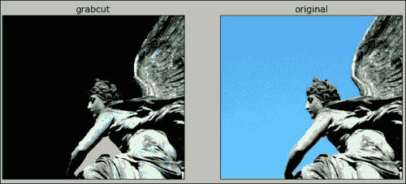

这是一个相当令人满意的结果。你会注意到天使的胳膊下留下了一块背景区域。可以通过触摸笔触来应用更多迭代；这种技术在`samples/python2`目录下的`grabcut.py`文件中有很好的说明。

## 使用 Watershed 算法进行图像分割

最后，我们简要了解一下 Watershed 算法。该算法被称为 Watershed，因为其概念化涉及水。想象一下图像中低密度（几乎没有变化）的区域为山谷，高密度（变化很多）的区域为山峰。开始往山谷中注水，直到两个不同山谷的水即将汇合。为了防止不同山谷的水汇合，你建立一道屏障来保持它们分离。形成的屏障就是图像分割。

作为一名意大利人，我喜欢食物，我最喜欢的东西之一就是一份美味的意面配以香蒜酱。所以，这是香蒜酱最重要的成分罗勒的图片：

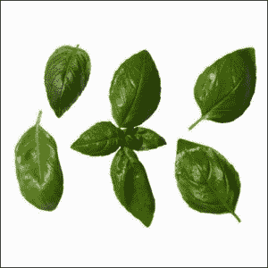

现在，我们想要分割图像，将罗勒叶从白色背景中分离出来。

再次，我们导入`numpy`、`cv2`和`matplotlib`，然后导入我们的罗勒叶图像：

```py
import numpy as np
import cv2
from matplotlib import pyplot as plt
img = cv2.imread('images/basil.jpg')
gray = cv2.cvtColor(img,cv2.COLOR_BGR2GRAY)
```

在将颜色转换为灰度后，我们对图像进行阈值处理。这个操作有助于将图像分为黑白两部分：

```py
ret, thresh = cv2.threshold(gray,0,255,cv2.THRESH_BINARY_INV+cv2.THRESH_OTSU)
```

接下来，我们通过应用`morphologyEx`变换来从图像中去除噪声，这是一个由膨胀和侵蚀图像以提取特征的操作：

```py
kernel = np.ones((3,3),np.uint8)
opening = cv2.morphologyEx(thresh,cv2.MORPH_OPEN,kernel, iterations = 2)
```

通过膨胀`morphology`变换的结果，我们可以获得图像中几乎肯定是背景的区域：

```py
sure_bg = cv2.dilate(opening,kernel,iterations=3)
```

相反，我们可以通过应用`distanceTransform`来获得确切的背景区域。在实践中，在所有最可能成为前景的区域中，一个点离背景“边界”越远，它成为前景的可能性就越高。一旦我们获得了图像的`distanceTransform`表示，我们就应用一个阈值，以高度数学的概率确定这些区域是否为前景：

```py
dist_transform = cv2.distanceTransform(opening,cv2.DIST_L2,5)
ret, sure_fg = cv2.threshold(dist_transform,0.7*dist_transform.max(),255,0)
```

在这个阶段，我们有一些确切的背景和前景。那么，中间区域怎么办？首先，我们需要确定这些区域，这可以通过从背景中减去确切的背景来完成：

```py
sure_fg = np.uint8(sure_fg)
unknown = cv2.subtract(sure_bg,sure_fg)
```

现在我们有了这些区域，我们可以构建我们著名的“障碍物”来阻止水合并。这是通过`connectedComponents`函数完成的。当我们分析 GrabCut 算法时，我们瞥了一眼图论，并将图像视为由边连接的节点集合。给定确切的背景区域，这些节点中的一些将连接在一起，但也有一些不会。这意味着它们属于不同的水谷，它们之间应该有一个障碍物：

```py
ret, markers = cv2.connectedComponents(sure_fg)
```

现在我们将背景区域的值加 1，因为我们只想让未知区域保持在`0`：

```py
markers = markers+1
markers[unknown==255] = 0
```

最后，我们打开大门！让水落下，我们的障碍物用红色绘制：

```py
markers = cv2.watershed(img,markers)
img[markers == -1] = [255,0,0]
plt.imshow(img)
plt.show()
```

现在，让我们展示结果：

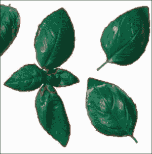

不言而喻，我现在很饿！

# 摘要

在本章中，我们学习了如何从二维输入（视频帧或图像）中收集三维信息。首先，我们考察了深度相机，然后是极线几何和立体图像，因此我们现在能够计算视差图。最后，我们探讨了两种最流行的图像分割方法：GrabCut 和 Watershed。

本章带我们进入了从图像中解释信息的世界，我们现在准备好探索 OpenCV 的另一个重要特性：特征描述符和关键点检测。
