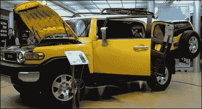
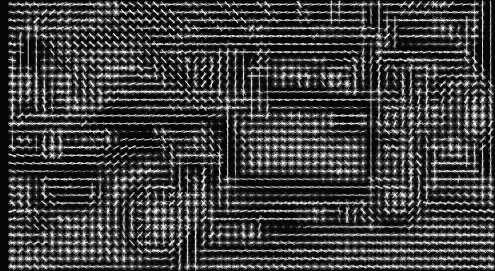
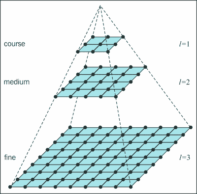
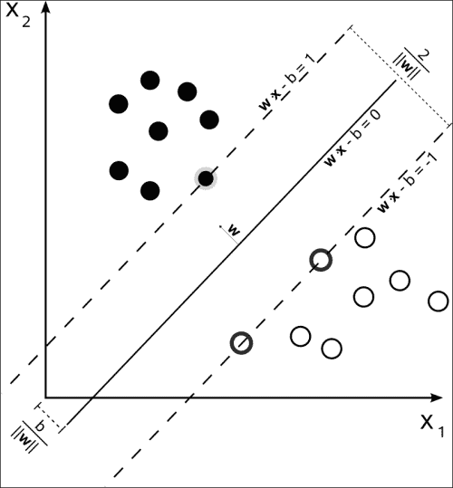
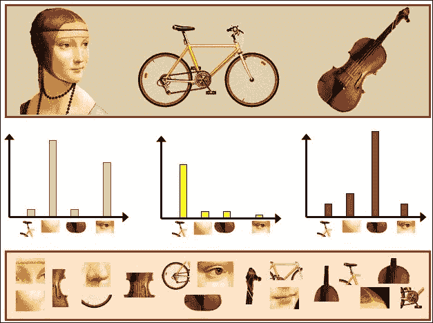
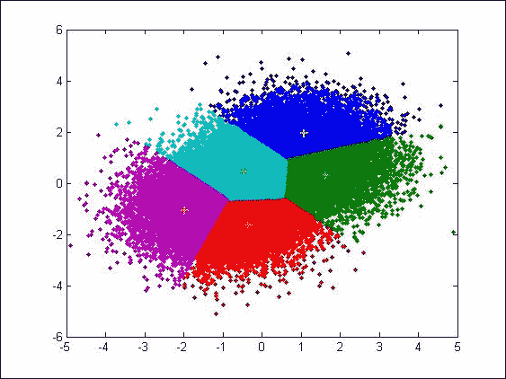
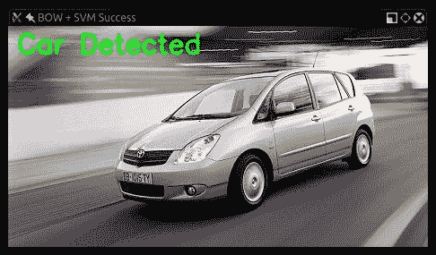
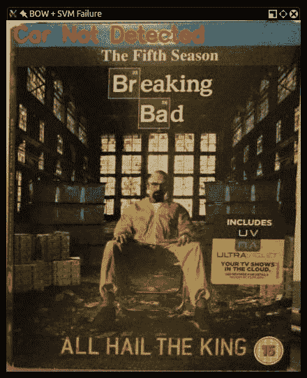
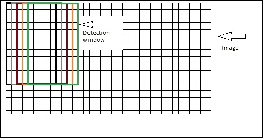
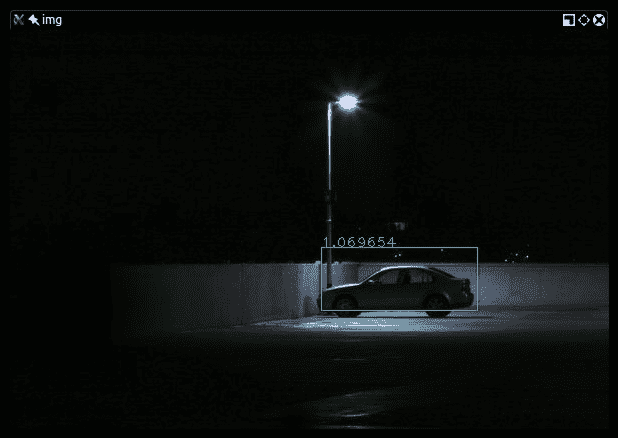

# 第七章. 检测和识别对象

本章将介绍检测和识别对象的概念，这是计算机视觉中最常见的挑战之一。你在本书中已经走得很远了，所以在这个阶段，你可能想知道你离在车内安装一个通过摄像头使用信息来告诉你周围汽车和人的位置还有多远。实际上，你离你的目标并不远。

在本章中，我们将扩展我们在讨论识别人脸时最初探讨的目标检测概念，并将其应用于各种现实生活中的对象，而不仅仅是人脸。

# 目标检测和识别技术

我们在第五章中区分了“检测和识别人脸”，我们将为了清晰起见重申：检测一个对象是程序确定图像的某个区域是否包含未识别对象的能力，而识别是程序识别此对象的能力。通常只在检测到对象的感兴趣区域中发生识别，例如，我们尝试在最初包含人脸的图像区域识别人脸。

当涉及到识别和检测对象时，计算机视觉中使用了多种技术，我们将对其进行探讨：

+   方向梯度直方图

+   图像金字塔

+   滑动窗口

与特征检测算法不同，这些技术不是相互排斥的，而是互补的。你可以在应用滑动窗口技术的同时执行**方向梯度直方图**（**HOG**）。

因此，让我们首先看看 HOG，并了解它是什么。

## HOG 描述符

HOG 是一种特征描述符，因此它属于与 SIFT、SURF 和 ORB 相同的算法家族。

它用于图像和视频处理以检测对象。其内部机制非常巧妙；图像被分成部分，并为每个部分计算梯度。当我们谈论通过 LBPH 进行人脸识别时，我们观察到了类似的方法。

然而，HOG 计算的是不基于颜色值的直方图，而是基于梯度。由于 HOG 是一种特征描述符，它能够提供对特征匹配和目标检测/识别至关重要的信息。

在深入探讨 HOG 的工作原理的技术细节之前，让我们首先看看 HOG 是如何“看”世界的；这是一张卡车的图片：



这是它的 HOG 版本：



你可以轻松地识别车轮和车辆的主要结构。那么，HOG“看到”的是什么？首先，你可以看到图像是如何被分成单元格的；这些是 16x16 像素的单元格。每个单元格包含八个方向（N、NW、W、SW、S、SE、E 和 NE）计算出的颜色梯度的视觉表示。

每个细胞中包含的这八个值是著名的直方图。因此，单个细胞获得一个独特的*签名*，你可以想象它有点像这样：


将直方图外推到描述符是一个相当复杂的过程。首先，为每个细胞计算局部直方图。这些细胞被分组到更大的区域，称为块。这些块可以由任意数量的细胞组成，但 Dalal 和 Triggs 发现，在执行人体检测时，2x2 细胞块产生了最佳结果。创建一个块宽向量，以便它可以被归一化，考虑到光照和阴影的变化（单个细胞区域太小，无法检测这种变化）。这提高了检测的准确性，因为它减少了样本和正在检查的块之间的光照和阴影差异。

简单地比较两张图像中的细胞是不行的，除非这两张图像完全相同（在大小和数据方面）。

有两个主要问题需要解决：

+   位置

+   尺度

### 尺度问题

例如，假设你的样本是从较大图像中提取的细节（比如，一辆自行车），而你正在尝试比较这两张图片。你将不会获得相同的梯度特征，检测将失败（尽管自行车出现在两张图片中）。

### 位置问题

一旦我们解决了尺度问题，我们面前又出现了一个障碍：一个可能检测到的物体可以出现在图像的任何位置，因此我们需要分部分扫描整个图像以确保我们可以识别感兴趣的区域，在这些区域内，尝试检测物体。即使样本图像和图像中的物体大小相同，也需要一种方法来指导 OpenCV 定位此物体。因此，剩余的图像被丢弃，并在可能匹配的区域进行比较。

为了避免这些问题，我们需要熟悉图像金字塔和滑动窗口的概念。

#### 图像金字塔

计算机视觉中使用的许多算法都利用一个称为**金字塔**的概念。

图像金字塔是图像的多尺度表示。这张图应该帮助你理解这个概念：



图像的多尺度表示，或图像金字塔，有助于你解决在不同尺度上检测物体的问题。这个概念的重要性可以通过现实生活中的硬事实轻松解释，例如，一个物体以与我们的样本图像中相同的精确尺度出现在图像中的可能性极低。

此外，你将了解到对象分类器（允许你在 OpenCV 中检测对象的实用工具）需要*训练*，而这种训练是通过由正匹配和负匹配组成的图像数据库提供的。在正匹配中，我们想要识别的物体在整个训练数据集中以相同的尺度出现的情况再次不太可能。

我们明白了，乔。我们需要从等式中去除比例，现在让我们看看图像金字塔是如何构建的。

图像金字塔是通过以下过程构建的：

1.  拿一个图像来说。

1.  使用任意的尺度参数调整图像的大小（更小）。

1.  平滑图像（使用高斯模糊）。

1.  如果图像大于一个任意的最小尺寸，则重复步骤 1。

尽管在本书的这一阶段只探讨了图像金字塔、尺度比和最小尺寸，但你已经处理了它们。如果你还记得第五章，*识别和检测人脸*，我们使用了`CascadeClassifier`对象的`detectMultiScale`方法。

立刻，`detectMultiScale`不再那么晦涩难懂了；事实上，它已经变得不言自明。级联分类器对象试图在输入图像的不同尺度上检测对象。第二件应该变得非常清楚的信息是`detectMultiScale()`方法的`scaleFactor`参数。此参数表示图像在金字塔的每一步中将被重采样到较小尺寸的比例。

`scaleFactor`参数越小，金字塔的层数越多，操作的速度越慢，计算量越大，尽管在一定程度上结果更准确。

因此，到目前为止，你应该已经理解了图像金字塔是什么，以及为什么它在计算机视觉中使用。现在让我们继续讨论滑动窗口。

#### 滑动窗口

**滑动窗口**是计算机视觉中的一种技术，它包括检查图像的移动部分（滑动窗口）并在这些部分上使用图像金字塔进行检测。这样做是为了在多尺度级别上检测到对象。

滑动窗口通过扫描较大图像的较小区域来解决位置问题，然后在同一图像的不同尺度上重复扫描。

使用这种技术，每个图像被分解成部分，这允许丢弃不太可能包含对象的区域，而剩余的部分则被分类。

虽然这种方法有一个问题出现：**重叠区域**。

让我们稍微扩展一下这个概念，以阐明问题的本质。比如说，你正在对图像进行人脸检测，并使用滑动窗口。

每个窗口每次滑动几个像素，这意味着滑动窗口恰好是同一张脸在四个不同位置的正匹配。自然地，我们不想报告四个匹配，而只想报告一个；此外，我们对具有良好分数的图像部分不感兴趣，而只是对具有最高分数的部分感兴趣。

这就是非极大值抑制发挥作用的地方：给定一组重叠区域，我们可以抑制所有未被赋予最大分数的区域。

### 非极大值（或非极大值）抑制

非极大值抑制（或非极大值）是一种技术，它会抑制与图像中同一区域相关的所有结果，这些结果不是特定区域的最高得分。这是因为类似位置的对齐窗口往往具有更高的得分，并且重叠区域是显著的，但我们只对具有最佳结果的窗口感兴趣，并丢弃得分较低的重叠窗口。

当使用滑动窗口检查图像时，你想要确保保留围绕同一主题的一组窗口中的最佳窗口。

为了做到这一点，你确定所有与阈值*x*以上共有窗口都将被投入非极大值抑制操作。

这相当复杂，但这还不是这个过程的结束。还记得图像金字塔吗？我们正在迭代地以较小的尺度扫描图像，以确保检测到不同尺度的对象。

这意味着你将获得一系列不同尺度的窗口，然后，将较小尺度获得的窗口大小计算为在原始尺度上检测到的，最后，将这个窗口投入原始混合中。

这听起来有点复杂。幸运的是，我们不是第一个遇到这个问题的人，这个问题已经以几种方式得到了解决。在我经验中，最快的算法是由 Tomasz Malisiewicz 博士在[`www.computervisionblog.com/2011/08/blazing-fast-nmsm-from-exemplar-svm.html`](http://www.computervisionblog.com/2011/08/blazing-fast-nmsm-from-exemplar-svm.html)实现的。示例是用 MATLAB 编写的，但在应用示例中，我们显然将使用它的 Python 版本。

非极大值抑制背后的通用方法如下：

1.  一旦构建了图像金字塔，就使用滑动窗口方法扫描图像以进行对象检测。

1.  收集所有返回了正结果（超过某个任意阈值）的当前窗口，并取一个响应最高的窗口`W`。

1.  消除与`W`显著重叠的所有窗口。

1.  将窗口移动到下一个响应最高的窗口，并重复当前尺度的过程。

当这个过程完成时，将图像金字塔中的下一个尺度向上移动并重复前面的过程。为了确保窗口在整个非极大值抑制过程结束时得到正确表示，务必计算与图像原始大小相关的窗口大小（例如，如果在金字塔中检测到原始大小的 50%的窗口，则检测到的窗口实际上在原始图像中将是四倍大）。

在此过程结束时，你将有一组得分最高的窗口。可选地，你可以检查完全包含在其他窗口中的窗口（就像我们在本章开头进行的人体检测过程那样）并消除那些窗口。

现在，我们如何确定窗口的分数？我们需要一个分类系统，该系统确定某个特征是否存在，并为这个分类提供一个置信度分数。这就是**支持向量机**（**SVM**）发挥作用的地方。

### 支持向量机

详细解释 SVM 是什么以及它做什么超出了本书的范围，但简单来说，SVM 是一种算法——给定标记的训练数据，它可以通过输出一个最优的*超平面*来使这些数据分类，用简单的话说，这就是一个最优的平面，它将不同分类的数据分开。一个视觉表示将有助于你理解这一点：



为什么它在计算机视觉和特别是对象检测中如此有用？这是因为找到属于对象和不属于对象的像素之间的最优分割线是对象检测的一个关键组成部分。

SVM 模型自 20 世纪 60 年代初以来一直存在；然而，其当前形式的实现起源于 Corinna Cortes 和 Vadimir Vapnik 于 1995 年发表的一篇论文，该论文可在[`link.springer.com/article/10.1007/BF00994018`](http://link.springer.com/article/10.1007/BF00994018)找到。

现在我们已经很好地理解了对象检测中涉及的概念，我们可以开始查看一些示例。我们将从内置函数开始，然后发展到训练我们自己的自定义对象检测器。

## 人体检测

OpenCV 自带`HOGDescriptor`，它可以进行人体检测。

这里有一个相当直接的例子：

```py
import cv2
import numpy as np

def is_inside(o, i):
    ox, oy, ow, oh = o
    ix, iy, iw, ih = i
    return ox > ix and oy > iy and ox + ow < ix + iw and oy + oh < iy + ih

def draw_person(image, person):
  x, y, w, h = person
  cv2.rectangle(img, (x, y), (x + w, y + h), (0, 255, 255), 2)

img = cv2.imread("../images/people.jpg")
hog = cv2.HOGDescriptor()
hog.setSVMDetector(cv2.HOGDescriptor_getDefaultPeopleDetector())

found, w = hog.detectMultiScale(img)

found_filtered = []
for ri, r in enumerate(found):
    for qi, q in enumerate(found):
        if ri != qi and is_inside(r, q):
            break
    else:
        found_filtered.append(r)

for person in found_filtered:
  draw_person(img, person)

cv2.imshow("people detection", img)
cv2.waitKey(0)
cv2.destroyAllWindows()
```

在常规导入之后，我们定义了两个非常简单的函数：`is_inside`和`draw_person`，它们执行两个最小任务，即确定一个矩形是否完全包含在另一个矩形内，以及在检测到的人周围绘制矩形。

然后，我们加载图像并通过一个非常简单且易于理解的代码创建`HOGDescriptor`：

```py
cv2.HOGDescriptor()
```

然后，我们指定`HOGDescriptor`将使用默认的人体检测器。

这是通过`setSVMDetector()`方法实现的，在我们介绍了 SVM 之后，它听起来可能没有我们未介绍 SVM 时那么晦涩。

接下来，我们在加载的图像上应用`detectMultiScale`。有趣的是，与所有的人脸检测算法不同，我们在应用任何形式的对象检测之前不需要将原始图像转换为灰度。

检测方法将返回一个矩形数组，这将是我们开始在图像上绘制形状的良好信息来源。如果我们这样做，然而，你会注意到一些奇怪的事情：一些矩形完全包含在其他矩形内。这明显表明检测有误，我们可以安全地假设完全包含在另一个矩形内的矩形可以被丢弃。

这正是我们定义`is_inside`函数的原因，也是我们遍历检测结果以丢弃假阳性的原因。

如果你亲自运行脚本，你将看到图像中人的周围有矩形。

## 创建和训练对象检测器

使用内置特征使得为应用程序快速构建原型变得容易，我们非常感谢 OpenCV 开发者为我们提供了诸如人脸检测或人体检测等优秀功能（真的，我们非常感激）。

然而，无论你是业余爱好者还是计算机视觉专业人士，你很可能不会只处理人和脸。

此外，如果你像我一样，你会想知道人们检测功能最初是如何创建的，以及你是否可以改进它。此外，你可能还会想知道你是否可以将相同的概念应用于检测从汽车到哥布林等各种不同类型的物体。

在企业环境中，你可能必须处理非常具体的检测，例如车牌、书封面，或者你公司可能处理的任何东西。

因此，问题是，我们如何提出自己的分类器？

答案在于 SVM 和词袋技术。

我们已经讨论了 HOG 和 SVM，现在让我们更详细地看看词袋模型。

### 词袋

**词袋**（**BOW**）这个概念最初并不是为计算机视觉设计的，相反，我们在计算机视觉的背景下使用这个概念的演变版本。所以，让我们首先谈谈它的基本版本，正如你可能猜到的，它最初属于语言分析和信息检索领域。

BOW 是一种技术，通过它我们为一系列文档中的每个单词分配一个计数权重；然后我们用代表这些计数的向量重新表示这些文档。让我们看一个例子：

+   **文档 1**：`我喜欢 OpenCV 和 Python`

+   **文档 2**：`我喜欢 C++和 Python`

+   **文档 3**：`我不喜欢洋蓟`

这三个文档使我们能够构建一个包含这些值的词典（或代码簿）：

```py
{
    I: 4,
    like: 4,
    OpenCV: 2,
    and: 2,
    Python: 2,
    C++: 1,
    dont: 1,
    artichokes: 1
}
```

我们有八个条目。现在让我们使用八个条目向量重新表示原始文档，每个向量包含词典中的所有单词，其中的值表示文档中每个术语的计数。前三个句子的向量表示如下：

```py
[2, 2, 1, 1, 1, 0, 0, 0]
[1, 1, 0, 1, 1, 1, 0, 0]
[1, 1, 0, 0, 0, 0, 1, 1]
```

这种文档表示在现实世界中有很多有效的应用，例如垃圾邮件过滤。

这些向量可以被视为文档的直方图表示，或者作为特征（就像我们在前几章中从图像中提取特征一样），可以用来训练分类器。

现在我们已经掌握了计算机视觉中 BOW 或**视觉词袋**（**BOVW**）的基本概念，让我们看看它如何应用于计算机视觉领域。

### 计算机视觉中的 BOW

到现在为止，我们已经熟悉了图像特征的概念。我们使用了特征提取器，如 SIFT 和 SURF，从图像中提取特征，以便我们可以在另一张图像中匹配这些特征。

我们也已经熟悉了代码簿的概念，并且了解 SVM，这是一个可以输入一组特征并利用复杂算法对训练数据进行分类的模型，并且可以预测新数据的分类。

因此，实现 BOW 方法将涉及以下步骤：

1.  取一个样本数据集。

1.  对于数据集中的每一张图像，提取描述符（使用 SIFT、SURF 等）。

1.  将每个描述符添加到 BOW 训练器中。

1.  将描述符聚类到*k*个簇中（好吧，这听起来有些晦涩，但请耐心听我解释）其中心（质心）是我们的视觉词。

到目前为止，我们有一个准备使用的视觉词字典。正如你所想象的那样，一个大的数据集将有助于使我们的字典在视觉词方面更加丰富。在一定程度上，词越多，越好！

在此之后，我们就可以测试我们的分类器并尝试检测了。好消息是这个过程与之前概述的非常相似：给定一个测试图像，我们可以提取特征并根据它们与最近质心的距离进行量化，从而形成一个直方图。

基于此，我们可以尝试识别视觉词并在图像中定位它们。以下是 BOW 过程的视觉表示：



这是在本章中你渴望一个实际例子，并准备好编码的时候。然而，在继续之前，我觉得有必要对 k-means 聚类的理论进行简要的探讨，这样你就可以完全理解视觉词是如何创建的，并且更好地理解使用 BOW 和 SVM 进行对象检测的过程。

#### k-means 聚类

k-means 聚类是一种向量量化方法，用于数据分析。给定一个数据集，*k*代表数据集将要被划分成的簇的数量。"means"这个词指的是数学中的均值概念，这相当基础，但为了清晰起见，这就是人们通常所说的平均值；在视觉上表示时，簇的均值是其**质心**或簇中点的几何中心。

### 注意

**聚类**指的是将数据集中的点分组到簇中。

我们将要使用的一个用于执行对象检测的类叫做`BagOfWordsKMeansTrainer`；到现在你应该能够推断出这个类的职责是创建：

> *“基于`kmeans()`的类，用于使用词袋方法训练视觉词汇”*

这是根据 OpenCV 文档的。

这里是一个具有五个簇的 k-means 聚类操作的表示：



在这漫长的理论介绍之后，我们可以看一个例子，并开始训练我们的对象检测器。

# 检测汽车

在你的图像和视频中，你可以检测到的对象类型没有虚拟限制。然而，为了获得可接受的准确度，你需要一个足够大的数据集，其中包含大小相同的训练图像。

如果我们全部自己来做，这将是一个耗时的操作（这是完全可能的）。

我们可以利用现成的数据集；有许多可以从各种来源免费下载：

+   **伊利诺伊大学**：[`l2r.cs.uiuc.edu/~cogcomp/Data/Car/CarData.tar.gz`](http://l2r.cs.uiuc.edu/~cogcomp/Data/Car/CarData.tar.gz)

+   **斯坦福大学**：[`ai.stanford.edu/~jkrause/cars/car_dataset.html`](http://ai.stanford.edu/~jkrause/cars/car_dataset.html)

### 注意

注意，训练图像和测试图像分别存储在不同的文件中。

我将在我的例子中使用 UIUC 数据集，但请自由探索互联网上的其他类型的数据集。

现在，让我们看看一个例子：

```py
import cv2
import numpy as np
from os.path import join

datapath = "/home/d3athmast3r/dev/python/CarData/TrainImages/"
def path(cls,i):
  return "%s/%s%d.pgm"  % (datapath,cls,i+1)

pos, neg = "pos-", "neg-"

detect = cv2.xfeatures2d.SIFT_create()
extract = cv2.xfeatures2d.SIFT_create()

flann_params = dict(algorithm = 1, trees = 5)flann = cv2.FlannBasedMatcher(flann_params, {})

bow_kmeans_trainer = cv2.BOWKMeansTrainer(40)
extract_bow = cv2.BOWImgDescriptorExtractor(extract, flann)

def extract_sift(fn):
  im = cv2.imread(fn,0)
  return extract.compute(im, detect.detect(im))[1]

for i in range(8):
  bow_kmeans_trainer.add(extract_sift(path(pos,i)))
  bow_kmeans_trainer.add(extract_sift(path(neg,i)))

voc = bow_kmeans_trainer.cluster()
extract_bow.setVocabulary( voc )

def bow_features(fn):
  im = cv2.imread(fn,0)
  return extract_bow.compute(im, detect.detect(im))

traindata, trainlabels = [],[]
for i in range(20):
  traindata.extend(bow_features(path(pos, i))); trainlabels.append(1)
  traindata.extend(bow_features(path(neg, i))); trainlabels.append(-1)

svm = cv2.ml.SVM_create()
svm.train(np.array(traindata), cv2.ml.ROW_SAMPLE, np.array(trainlabels))

def predict(fn):
  f = bow_features(fn);  
  p = svm.predict(f)
  print fn, "\t", p[1][0][0]
  return p

car, notcar = "/home/d3athmast3r/dev/python/study/images/car.jpg", "/home/d3athmast3r/dev/python/study/images/bb.jpg"
car_img = cv2.imread(car)
notcar_img = cv2.imread(notcar)
car_predict = predict(car)
not_car_predict = predict(notcar)

font = cv2.FONT_HERSHEY_SIMPLEX

if (car_predict[1][0][0] == 1.0):
  cv2.putText(car_img,'Car Detected',(10,30), font, 1,(0,255,0),2,cv2.LINE_AA)

if (not_car_predict[1][0][0] == -1.0):
  cv2.putText(notcar_img,'Car Not Detected',(10,30), font, 1,(0,0, 255),2,cv2.LINE_AA)

cv2.imshow('BOW + SVM Success', car_img)
cv2.imshow('BOW + SVM Failure', notcar_img)
cv2.waitKey(0)
cv2.destroyAllWindows()
```

## 我们刚才做了什么？

这需要相当多的吸收，所以让我们回顾一下我们所做的：

1.  首先，我们的常规导入之后是声明我们训练图像的基础路径。这将很有用，可以避免每次在电脑上特定文件夹中处理图像时重写基础路径。

1.  之后，我们声明一个函数，`path`：

    ```py
    def path(cls,i):
      return "%s/%s%d.pgm"  % (datapath,cls,i+1)

    pos, neg = "pos-", "neg-"
    ```

    ### 注意

    **关于路径函数的更多内容**

    这个函数是一个实用方法：给定一个类的名称（在我们的案例中，我们有两个类，`pos`和`neg`）和一个数值索引，我们返回特定测试图像的完整路径。我们的汽车数据集包含以下命名的图像：`pos-x.pgm`和`neg-x.pgm`，其中`x`是一个数字。

    立即，你会发现这个函数在迭代一系列数字（比如，20）时的有用性，这将允许你加载从`pos-0.pgm`到`pos-20.pgm`的所有图像，对于负类也是如此。

1.  接下来，我们将创建两个 SIFT 实例：一个用于提取关键点，另一个用于提取特征：

    ```py
    detect = cv2.xfeatures2d.SIFT_create()
    extract = cv2.xfeatures2d.SIFT_create()
    ```

1.  每当你看到 SIFT 时，你可以相当肯定会有一些特征匹配算法也涉及其中。在我们的案例中，我们将创建一个 FLANN 匹配器的实例：

    ```py
    flann_params = dict(algorithm = 1, trees = 5)flann = cv2.FlannBasedMatcher(flann_params, {})
    ```

    ### 注意

    目前，OpenCV 3 的 Python 版本中缺少 FLANN 的`enum`值，因此，作为算法参数传递的数字`1`代表的是`FLANN_INDEX_KDTREE`算法。我怀疑最终版本将是`cv2.FLANN_INDEX_KDTREE`，这会更有帮助。请确保检查`enum`值以获取正确的标志。

1.  接下来，我们提到 BOW 训练器：

    ```py
    bow_kmeans_trainer = cv2.BOWKMeansTrainer(40)
    ```

1.  这个 BOW 训练器使用了 40 个簇。之后，我们将初始化 BOW 提取器。这是一个 BOW 类，它将接收视觉词汇表并尝试在测试图像中检测它们：

    ```py
    extract_bow = cv2.BOWImgDescriptorExtractor(extract, flann)
    ```

1.  要从图像中提取 SIFT 特征，我们构建了一个实用方法，它接受图像的路径，以灰度读取它，并返回描述符：

    ```py
    def extract_sift(fn):
      im = cv2.imread(fn,0)
      return extract.compute(im, detect.detect(im))[1]
    ```

在这个阶段，我们已经拥有了开始训练 BOW 训练器所需的一切。

1.  让我们按类别读取每个类别中的八张图像（八个正例和八个负例）：

    ```py
    for i in range(8):
      bow_kmeans_trainer.add(extract_sift(path(pos,i)))
      bow_kmeans_trainer.add(extract_sift(path(neg,i)))
    ```

1.  为了创建视觉词的词汇表，我们将调用训练器的`cluster()`方法，该方法执行 k-means 分类并返回所说的词汇表。我们将这个词汇表分配给`BOWImgDescriptorExtractor`，以便它可以从测试图像中提取描述符：

    ```py
    vocabulary = bow_kmeans_trainer.cluster()
    extract_bow.setVocabulary(vocabulary)
    ```

1.  与在此脚本中声明的其他实用函数一样，我们将声明一个函数，该函数接受图像的路径并返回由 BOW 描述符提取器计算出的描述符：

    ```py
    def bow_features(fn):
      im = cv2.imread(fn,0)
      return extract_bow.compute(im, detect.detect(im))
    ```

1.  让我们创建两个数组来容纳训练数据和标签，并用`BOWImgDescriptorExtractor`生成的描述符填充它们，将标签与我们要提供的正负图像关联起来（`1`代表正匹配，`-1`代表负匹配）：

    ```py
    traindata, trainlabels = [],[]
    for i in range(20):
      traindata.extend(bow_features(path(pos, i))); trainlabels.append(1)
      traindata.extend(bow_features(path(neg, i))); trainlabels.append(-1)
    ```

1.  现在，让我们创建一个 SVM 的实例：

    ```py
    svm = cv2.ml.SVM_create()
    ```

1.  然后，通过将训练数据和标签包装成 NumPy 数组来对其进行训练：

    ```py
    svm.train(np.array(traindata), cv2.ml.ROW_SAMPLE, np.array(trainlabels))
    ```

我们已经准备好了一个训练好的 SVM；剩下要做的就是给 SVM 提供一些样本图像并观察它的表现。

1.  让我们先定义另一个实用方法来打印我们`predict`方法的结果并返回它：

    ```py
    def predict(fn):
      f = bow_features(fn);  
      p = svm.predict(f)
      print fn, "\t", p[1][0][0]
      return p
    ```

1.  让我们定义两个样本图像路径并将它们作为 NumPy 数组读取：

    ```py
    car, notcar = "/home/d3athmast3r/dev/python/study/images/car.jpg", "/home/d3athmast3r/dev/python/study/images/bb.jpg"
    car_img = cv2.imread(car)
    notcar_img = cv2.imread(notcar)
    ```

1.  我们将这些图像传递给训练好的 SVM，并获取预测结果：

    ```py
    car_predict = predict(car)
    not_car_predict = predict(notcar)
    ```

    自然地，我们希望汽车图像被检测为汽车（`predict()`的结果应该是`1.0`），而其他图像则不是（结果应该是`-1.0`），因此我们只有在结果符合预期时才会在图像上添加文本。

1.  最后，我们将图像显示在屏幕上，希望看到每个图像上都有正确的标题：

    ```py
    font = cv2.FONT_HERSHEY_SIMPLEX

    if (car_predict[1][0][0] == 1.0):
      cv2.putText(car_img,'Car Detected',(10,30), font, 1,(0,255,0),2,cv2.LINE_AA)

    if (not_car_predict[1][0][0] == -1.0):
      cv2.putText(notcar_img,'Car Not Detected',(10,30), font, 1,(0,0, 255),2,cv2.LINE_AA)

    cv2.imshow('BOW + SVM Success', car_img)
    cv2.imshow('BOW + SVM Failure', notcar_img)
    cv2.waitKey(0)
    cv2.destroyAllWindows()
    ```

前面的操作会产生以下结果：



这也导致了以下结果：



## SVM 和滑动窗口

检测到一个对象是一个令人印象深刻的成就，但现在我们想以以下方式将其提升到下一个层次：

+   在图像中检测同一类别的多个对象

+   确定检测到的对象在图像中的位置

为了完成这个任务，我们将使用滑动窗口方法。如果从之前对滑动窗口概念的解释中还不清楚，那么通过查看图表，采用这种方法的原因将变得更加明显：



观察块的运动：

1.  我们取图像的一个区域，对其进行分类，然后向右移动一个预定义的步长。当我们到达图像的最右边时，我们将*x*坐标重置为`0`并向下移动一个步长，然后重复整个过程。

1.  在每个步骤中，我们将使用用 BOW 训练的 SVM 进行分类。

1.  记录所有通过 SVM 预测测试的块。

1.  当你完成整个图像的分类后，缩小图像并重复整个滑动窗口过程。

继续缩放和分类，直到达到最小尺寸。

这给了你在图像的多个区域和不同尺度上检测对象的机会。

在这个阶段，你将收集有关图像内容的重要信息；然而，有一个问题：你很可能会得到许多重叠的块，这些块给你一个正分数。这意味着你的图像可能包含一个被检测四次或五次的对象，如果你报告检测结果，你的报告将非常不准确，所以这就是非极大值抑制发挥作用的地方。

### 示例 - 场景中的车辆检测

现在我们已经准备好将迄今为止学到的所有概念应用到实际例子中，并创建一个车辆检测应用程序，该程序扫描图像并在车辆周围绘制矩形。

在我们深入代码之前，让我们总结一下这个过程：

1.  获取训练数据集。

1.  创建一个 BOW 训练器并创建一个视觉词汇表。

1.  使用词汇表训练 SVM。

1.  在测试图像的图像金字塔上使用滑动窗口尝试检测。

1.  对重叠的框应用非极大值抑制。

1.  输出结果。

让我们也看看项目结构，因为它比我们迄今为止采用的经典独立脚本方法要复杂一些。

项目结构如下：

```py
├── car_detector
│   ├── detector.py
│   ├── __init__.py
│   ├── non_maximum.py
│   ├── pyramid.py
│   └── sliding_w112661222.indow.py
└── car_sliding_windows.py
```

主要程序位于 `car_sliding_windows.py`，所有实用工具都包含在 `car_detector` 文件夹中。由于我们使用 Python 2.7，我们需要在文件夹中创建一个 `__init__.py` 文件，以便将其检测为模块。

`car_detector` 模块中的四个文件如下：

+   SVM 训练模型

+   非极大值抑制函数

+   图像金字塔

+   滑动窗口函数

让我们逐一检查它们，从图像金字塔开始：

```py
import cv2

def resize(img, scaleFactor):
  return cv2.resize(img, (int(img.shape[1] * (1 / scaleFactor)), int(img.shape[0] * (1 / scaleFactor))), interpolation=cv2.INTER_AREA)

def pyramid(image, scale=1.5, minSize=(200, 80)):
  yield image

  while True:
    image = resize(image, scale)
    if image.shape[0] < minSize[1] or image.shape[1] < minSize[0]:
      break

    yield image
```

此模块包含两个函数定义：

+   Resize 接受一个图像，并按指定因子进行缩放。

+   Pyramid 接受一个图像，并返回一个直到达到最小宽度和高度约束的缩放版本。

### 注意

你会注意到图像不是通过 `return` 关键字返回，而是通过 `yield` 关键字返回。这是因为这个函数是一个所谓的生成器。如果你不熟悉生成器，请查看[`wiki.python.org/moin/Generators`](https://wiki.python.org/moin/Generators)。

这将使我们能够获得一个用于主程序处理的重缩放图像。

接下来是滑动窗口函数：

```py
def sliding_window(image, stepSize, windowSize):
  for y in xrange(0, image.shape[0], stepSize):
    for x in xrange(0, image.shape[1], stepSize):
      yield (x, y, image[y:y + windowSize[1], x:x + windowSize[0]])
```

这同样是一个生成器。虽然有点深层次嵌套，但这种机制非常简单：给定一个图像，返回一个从左边缘开始，以任意大小的步长向右移动的窗口，直到覆盖整个图像宽度，然后回到左边缘但向下移动一个步长，重复覆盖图像宽度，直到达到图像的右下角。你可以将这想象成在一张纸上写字时使用的相同模式：从左边缘开始，达到右边缘，然后从左边缘开始移动到下一行。

最后一个实用工具是非最大值抑制，它看起来像这样（Malisiewicz/Rosebrock 的代码）：

```py
def non_max_suppression_fast(boxes, overlapThresh):

  # if there are no boxes, return an empty list

  if len(boxes) == 0:

    return []

  # if the bounding boxes integers, convert them to floats --

  # this is important since we'll be doing a bunch of divisions

  if boxes.dtype.kind == "i":

    boxes = boxes.astype("float")

  # initialize the list of picked indexes 

  pick = []

  # grab the coordinates of the bounding boxes

  x1 = boxes[:,0]

  y1 = boxes[:,1]

  x2 = boxes[:,2]

  y2 = boxes[:,3]

  scores = boxes[:,4]

  # compute the area of the bounding boxes and sort the bounding

  # boxes by the score/probability of the bounding box

  area = (x2 - x1 + 1) * (y2 - y1 + 1)

  idxs = np.argsort(scores)[::-1]

  # keep looping while some indexes still remain in the indexes

  # list

  while len(idxs) > 0:

    # grab the last index in the indexes list and add the

    # index value to the list of picked indexes

    last = len(idxs) - 1

    i = idxs[last]

    pick.append(i)

    # find the largest (x, y) coordinates for the start of

    # the bounding box and the smallest (x, y) coordinates

    # for the end of the bounding box

    xx1 = np.maximum(x1[i], x1[idxs[:last]])

    yy1 = np.maximum(y1[i], y1[idxs[:last]])

    xx2 = np.minimum(x2[i], x2[idxs[:last]])

    yy2 = np.minimum(y2[i], y2[idxs[:last]])

    # compute the width and height of the bounding box

    w = np.maximum(0, xx2 - xx1 + 1)

    h = np.maximum(0, yy2 - yy1 + 1)

    # compute the ratio of overlap

    overlap = (w * h) / area[idxs[:last]]

    # delete all indexes from the index list that have

    idxs = np.delete(idxs, np.concatenate(([last],

      np.where(overlap > overlapThresh)[0])))

  # return only the bounding boxes that were picked using the

  # integer data type

  return boxes[pick].astype("int")
```

这个函数简单地接受一个矩形列表，并按其分数排序。从分数最高的盒子开始，通过计算交集面积并确定是否大于某个阈值来消除所有超出一定阈值的重叠盒子。

#### 检查 detector.py

现在，让我们检查这个程序的核心，即 `detector.py`。这有点长且复杂；然而，鉴于我们对 BOW、SVM 和特征检测/提取概念的新认识，一切应该会变得更加清晰。

这里是代码：

```py
import cv2
import numpy as np

datapath = "/path/to/CarData/TrainImages/"
SAMPLES = 400

def path(cls,i):
    return "%s/%s%d.pgm"  % (datapath,cls,i+1)

def get_flann_matcher():
  flann_params = dict(algorithm = 1, trees = 5)
  return cv2.FlannBasedMatcher(flann_params, {})

def get_bow_extractor(extract, flann):
  return cv2.BOWImgDescriptorExtractor(extract, flann)

def get_extract_detect():
  return cv2.xfeatures2d.SIFT_create(), cv2.xfeatures2d.SIFT_create()

def extract_sift(fn, extractor, detector):
  im = cv2.imread(fn,0)
  return extractor.compute(im, detector.detect(im))[1]

def bow_features(img, extractor_bow, detector):
  return extractor_bow.compute(img, detector.detect(img))

def car_detector():
  pos, neg = "pos-", "neg-"
  detect, extract = get_extract_detect()
  matcher = get_flann_matcher()
  print "building BOWKMeansTrainer..."
  bow_kmeans_trainer = cv2.BOWKMeansTrainer(1000)
  extract_bow = cv2.BOWImgDescriptorExtractor(extract, flann)

  print "adding features to trainer"
  for i in range(SAMPLES):
    print i
    bow_kmeans_trainer.add(extract_sift(path(pos,i), extract, detect))
    bow_kmeans_trainer.add(extract_sift(path(neg,i), extract, detect))

  voc = bow_kmeans_trainer.cluster()
  extract_bow.setVocabulary( voc )

  traindata, trainlabels = [],[]
  print "adding to train data"
  for i in range(SAMPLES):
    print i
    traindata.extend(bow_features(cv2.imread(path(pos, i), 0), extract_bow, detect))
    trainlabels.append(1)
    traindata.extend(bow_features(cv2.imread(path(neg, i), 0), extract_bow, detect))
    trainlabels.append(-1)

  svm = cv2.ml.SVM_create()
  svm.setType(cv2.ml.SVM_C_SVC)
  svm.setGamma(0.5)
  svm.setC(30)
  svm.setKernel(cv2.ml.SVM_RBF)

  svm.train(np.array(traindata), cv2.ml.ROW_SAMPLE, np.array(trainlabels))
  return svm, extract_bow
```

让我们来看一下。首先，我们将导入我们常用的模块，然后设置训练图像的路径。

然后，我们将定义多个实用函数：

```py
def path(cls,i):
    return "%s/%s%d.pgm"  % (datapath,cls,i+1)
```

这个函数根据基路径和类别名称返回图像的路径。在我们的例子中，我们将使用 `neg-` 和 `pos-` 类名称，因为这就是训练图像的名称（即 `neg-1.pgm`）。最后一个参数是一个整数，用于组成图像路径的最后部分。

接下来，我们将定义一个实用函数来获取 FLANN 匹配器：

```py
def get_flann_matcher():
  flann_params = dict(algorithm = 1, trees = 5)
  return cv2.FlannBasedMatcher(flann_params, {})
```

再次强调，传递给算法参数的整数 `1` 并不代表 `FLANN_INDEX_KDTREE`。

下两个函数返回 SIFT 特征检测器/提取器以及一个 BOW 训练器：

```py
def get_bow_extractor(extract, flann):
  return cv2.BOWImgDescriptorExtractor(extract, flann)

def get_extract_detect():
  return cv2.xfeatures2d.SIFT_create(), cv2.xfeatures2d.SIFT_create()
```

下一个实用工具是一个从图像中返回特征的函数：

```py
def extract_sift(fn, extractor, detector):
  im = cv2.imread(fn,0)
  return extractor.compute(im, detector.detect(im))[1]
```

### 注意

SIFT 检测器检测特征，而 SIFT 提取器提取并返回它们。

我们还将定义一个类似的实用函数来提取 BOW 特征：

```py
def bow_features(img, extractor_bow, detector):
  return extractor_bow.compute(img, detector.detect(img))
```

在 `main car_detector` 函数中，我们首先创建用于执行特征检测和提取的必要对象：

```py
  pos, neg = "pos-", "neg-"
  detect, extract = get_extract_detect()
  matcher = get_flann_matcher()
  bow_kmeans_trainer = cv2.BOWKMeansTrainer(1000)
  extract_bow = cv2.BOWImgDescriptorExtractor(extract, flann)
```

然后，我们将从训练图像中提取的特征添加到训练器中：

```py
  print "adding features to trainer"
  for i in range(SAMPLES):
    print i
    bow_kmeans_trainer.add(extract_sift(path(pos,i), extract, detect))
```

对于每个类别，我们将向训练器添加一个正图像和一个负图像。

之后，我们将指示训练器将数据聚类成 *k* 个组。

聚类后的数据现在是我们视觉词汇的词汇表，我们可以这样设置 `BOWImgDescriptorExtractor` 类的词汇表：

```py
vocabulary = bow_kmeans_trainer.cluster()
 extract_bow.setVocabulary(vocabulary)
```

#### 将训练数据与类别关联

准备好视觉词汇表后，我们现在可以将训练数据与类别关联起来。在我们的例子中，我们有两个类别：`-1` 表示负结果，`1` 表示正结果。

让我们填充两个数组，`traindata` 和 `trainlabels`，包含提取的特征及其相应的标签。通过迭代数据集，我们可以快速使用以下代码设置：

```py
traindata, trainlabels = [], []  
  print "adding to train data"
  for i in range(SAMPLES):
    print i
    traindata.extend(bow_features(cv2.imread(path(pos, i), 0), extract_bow, detect))
    trainlabels.append(1)
    traindata.extend(bow_features(cv2.imread(path(neg, i), 0), extract_bow, detect))
    trainlabels.append(-1)
```

你会注意到，在每次循环中，我们会添加一个正图像和一个负图像，然后使用 `1` 和 `-1` 的值填充标签，以保持数据与标签同步。

如果你希望训练更多类别，你可以按照以下模式进行：

```py
  traindata, trainlabels = [], []
  print "adding to train data"
  for i in range(SAMPLES):
    print i
    traindata.extend(bow_features(cv2.imread(path(class1, i), 0), extract_bow, detect))
    trainlabels.append(1)
    traindata.extend(bow_features(cv2.imread(path(class2, i), 0), extract_bow, detect))
    trainlabels.append(2)
    traindata.extend(bow_features(cv2.imread(path(class3, i), 0), extract_bow, detect))
    trainlabels.append(3)
```

例如，你可以训练一个检测器来检测汽车和人，并在包含汽车和人的图像上进行检测。

最后，我们将使用以下代码训练 SVM：

```py
  svm = cv2.ml.SVM_create()
  svm.setType(cv2.ml.SVM_C_SVC)
  svm.setGamma(0.5)
  svm.setC(30)
  svm.setKernel(cv2.ml.SVM_RBF)

  svm.train(np.array(traindata), cv2.ml.ROW_SAMPLE, np.array(trainlabels))
  return svm, extract_bow
```

有两个特定的参数我想引起你的注意：

+   **C**: 使用此参数，你可以概念化分类器的严格性或严重性。值越高，误分类的机会越少，但代价是可能无法检测到一些阳性结果。另一方面，低值可能导致过拟合，因此你可能会得到假阳性。

+   **核函数**：此参数决定了分类器的性质：`SVM_LINEAR` 表示线性 **超平面**，在实际情况中，对于二元分类（测试样本要么属于一个类别，要么不属于）非常有效，而 `SVM_RBF`（**径向基函数**）使用高斯函数来分离数据，这意味着数据被分割成由这些函数定义的多个核。当训练 SVM 进行超过两个类别的分类时，你必须使用 RBF。

最后，我们将 `traindata` 和 `trainlabels` 数组传递给 SVM 的 `train` 方法，并返回 SVM 和 BOW 提取器对象。这是因为在我们的应用中，我们不希望每次都要重新创建词汇表，所以我们将其公开以供重用。

### 嘿，我的车在哪里？

我们已经准备好测试我们的汽车检测器了！

让我们先创建一个简单的程序，该程序加载一张图片，然后分别使用滑动窗口和图像金字塔技术进行检测：

```py
import cv2
import numpy as np
from car_detector.detector import car_detector, bow_features
from car_detector.pyramid import pyramid
from car_detector.non_maximum import non_max_suppression_fast as nms
from car_detector.sliding_window import sliding_window

def in_range(number, test, thresh=0.2):
  return abs(number - test) < thresh

test_image = "/path/to/cars.jpg"

svm, extractor = car_detector()
detect = cv2.xfeatures2d.SIFT_create()

w, h = 100, 40
img = cv2.imread(test_img)

rectangles = []
counter = 1
scaleFactor = 1.25
scale = 1
font = cv2.FONT_HERSHEY_PLAIN

for resized in pyramid(img, scaleFactor):  
  scale = float(img.shape[1]) / float(resized.shape[1])
  for (x, y, roi) in sliding_window(resized, 20, (w, h)):

    if roi.shape[1] != w or roi.shape[0] != h:
      continue

    try:
      bf = bow_features(roi, extractor, detect)
      _, result = svm.predict(bf)
      a, res = svm.predict(bf, flags=cv2.ml.STAT_MODEL_RAW_OUTPUT)
      print "Class: %d, Score: %f" % (result[0][0], res[0][0])
      score = res[0][0]
      if result[0][0] == 1:
        if score < -1.0:
          rx, ry, rx2, ry2 = int(x * scale), int(y * scale), int((x+w) * scale), int((y+h) * scale)
          rectangles.append([rx, ry, rx2, ry2, abs(score)])
    except:
      pass

    counter += 1

windows = np.array(rectangles)
boxes = nms(windows, 0.25)

for (x, y, x2, y2, score) in boxes:
  print x, y, x2, y2, score
  cv2.rectangle(img, (int(x),int(y)),(int(x2), int(y2)),(0, 255, 0), 1)
  cv2.putText(img, "%f" % score, (int(x),int(y)), font, 1, (0, 255, 0))

cv2.imshow("img", img)
cv2.waitKey(0)
```

程序的显著部分是位于金字塔/滑动窗口循环内的函数：

```py
      bf = bow_features(roi, extractor, detect)
      _, result = svm.predict(bf)
      a, res = svm.predict(bf, flags=cv2.ml.STAT_MODEL_RAW_OUTPUT)
      print "Class: %d, Score: %f" % (result[0][0], res[0][0])
      score = res[0][0]
      if result[0][0] == 1:
        if score < -1.0:
          rx, ry, rx2, ry2 = int(x * scale), int(y * scale), int((x+w) * scale), int((y+h) * scale)
          rectangles.append([rx, ry, rx2, ry2, abs(score)])
```

在这里，我们提取了**感兴趣区域**（**ROI**）的特征，这对应于当前的滑动窗口，然后我们对提取的特征调用 `predict` 方法。`predict` 方法有一个可选参数 `flags`，它返回预测的分数（位于 `[0][0]` 的值）。

### 注意

关于预测分数的一番话：值越低，分类元素真正属于该类的置信度越高。

因此，我们将为分类窗口设置一个任意的阈值 `-1.0`，所有小于 `-1.0` 的窗口将被视为良好结果。随着你对你的 SVM 进行实验，你可以调整这个值，直到找到最佳的结果。

最后，我们将滑动窗口的计算坐标（即，我们将当前坐标乘以图像金字塔中当前层的缩放比例，以便在最终绘图中得到正确表示）添加到矩形数组中。

在绘制最终结果之前，我们需要执行最后一个操作：非极大值抑制。

我们将矩形数组转换为 NumPy 数组（以便进行某些只有 NumPy 才能执行的操作），然后应用 NMS：

```py
windows = np.array(rectangles)
boxes = nms(windows, 0.25)
```

最后，我们继续显示所有结果；为了方便起见，我还打印了所有剩余窗口获得的分数：



这是一个非常准确的结果！

关于支持向量机（SVM）的最后一句话：您不需要每次使用检测器时都对其进行训练，这会非常不切实际。您可以使用以下代码：

```py
svm.save('/path/to/serialized/svmxml')
```

您可以使用加载方法重新加载它，并为其提供测试图像或帧。

# 摘要

在本章中，我们讨论了许多目标检测概念，例如 HOG、BOW、SVM 以及一些有用的技术，例如图像金字塔、滑动窗口和非极大值抑制。

我们介绍了机器学习的概念，并探讨了用于训练自定义检测器的各种方法，包括如何创建或获取训练数据集以及如何对数据进行分类。最后，我们通过从头创建一个车辆检测器并验证其正确功能，将这一知识应用于实践。

所有这些概念构成了下一章的基础，我们将利用视频制作中的目标检测和分类技术，并学习如何跟踪对象以保留可能用于商业或应用目的的信息。
