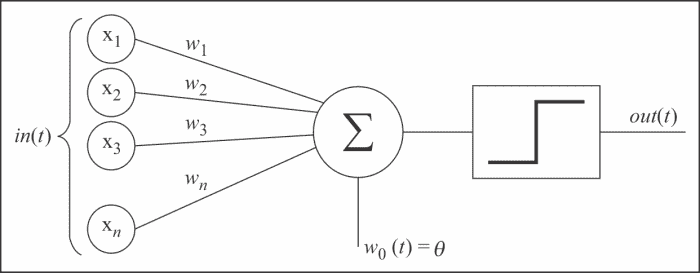
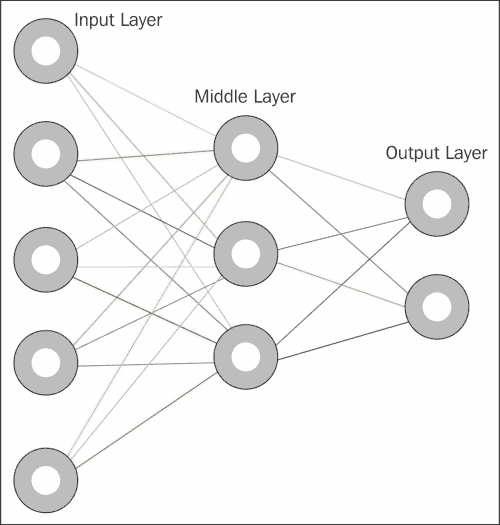
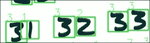

# 第九章。使用 OpenCV 的神经网络——简介

机器学习是人工智能的一个分支，它专门处理那些使机器能够识别数据中的模式和趋势，并成功进行预测和分类的算法。

OpenCV 用于完成计算机视觉中一些更高级任务的许多算法和技术与人工智能和机器学习直接相关。

本章将向您介绍 OpenCV 中的机器学习概念，如人工神经网络。这是一个温和的介绍，几乎触及了机器学习这个广阔世界的表面，而机器学习是一个不断发展的领域。

# 人工神经网络

让我们从定义**人工神经网络**（**ANN**）的几个逻辑步骤开始，而不是使用经典的单块句子，这种句子使用晦涩的术语，其含义更加晦涩。

首先，人工神经网络（ANN）是一个**统计模型**。什么是统计模型？统计模型是一对元素，即空间 `S`（一组观察值）和概率 `P`，其中 `P` 是近似 `S` 的分布（换句话说，一个会生成与 `S` 非常相似的观察值集合的函数）。

我喜欢从两个方面来考虑 `P`：作为复杂场景的简化，以及最初生成 `S` 的函数，或者至少是一组与 `S` 非常相似的观察值。

所以，人工神经网络（ANNs）是接受复杂现实，简化它，并推导出一个函数来（近似）表示从该现实预期得到的统计观察结果的模型，以数学形式呈现。

我们理解人工神经网络（ANN）的下一步是了解 ANN 如何改进简单统计模型的概念。

如果生成数据集的函数可能需要大量（未知）的输入呢？

人工神经网络采取的方法是将工作委托给多个**神经元**、**节点**或**单元**，每个单元都能够“近似”创建输入的函数。数学上，近似是定义一个更简单的函数来近似一个更复杂的函数，这使我们能够定义误差（相对于应用领域）。此外，为了提高准确性，一个网络通常被认为是一个神经网络，如果神经元或单元能够近似非线性函数。

让我们更仔细地看看神经元。

## 神经元和感知器

**感知器**是一个可以追溯到 20 世纪 50 年代的概念，简单来说，感知器是一个接受多个输入并产生单个值的函数。

每个输入都有一个与之相关的权重，表示输入在函数中的重要性。Sigmoid 函数产生一个单一值：



Sigmoid 函数是一个术语，表示该函数产生 0 或 1 的值。判别值是一个阈值；如果输入的加权和大于某个特定的阈值，感知器产生二进制分类 1，否则为 0。

这些权重是如何确定的，它们代表了什么？

神经元相互连接，每个神经元的权重集合（这些只是数值参数）定义了与其他神经元连接的强度。这些权重是“自适应的”，意味着它们会根据学习算法随时间变化。

# ANN 的结构

下面是神经网络的一个视觉表示：



如图中所示，神经网络中有三个不同的层：**输入层**、**隐藏层**（或中间层）和**输出层**。

可以有多个隐藏层；然而，一个隐藏层就足以解决大多数现实生活中的问题。

## 通过例子看网络层

我们如何确定网络的拓扑结构，以及每个层应该创建多少个神经元？让我们一层一层地做出这个决定。

### 输入层

输入层定义了网络中的输入数量。例如，假设你想创建一个 ANN，它将帮助你根据动物属性的描述确定你所看到的动物。让我们将这些属性固定为重量、长度和牙齿。这是一组三个属性；我们的网络需要包含三个输入节点。

### 输出层

输出层的数量等于我们识别的类别数。继续使用前面提到的动物分类网络的例子，我们将任意设置输出层为`4`，因为我们知道我们将处理以下动物：狗、秃鹫、海豚和龙。如果我们输入不属于这些类别的动物的数据，网络将返回最可能类似于这个未分类动物的分类。

### 隐藏层

隐藏层包含感知器。如前所述，绝大多数问题只需要一个隐藏层；从数学上讲，没有经过验证的理由说需要超过两个隐藏层。因此，我们将坚持使用一个隐藏层并与之工作。

有许多经验法则可以用来确定隐藏层中包含的神经元数量，但没有一条是固定不变的。在这种情况下，经验方法是你的朋友：用不同的设置测试你的网络，并选择最适合的那个。

这些是在构建 ANN 时最常用的规则之一：

+   隐藏神经元的数量应该在输入层和输出层的大小之间。如果输入层和输出层的大小差异很大，根据我的经验，隐藏层的大小更接近输出层是更可取的。

+   对于相对较小的输入层，隐藏神经元的数量是输入层大小的三分之二，加上输出层的大小，或者小于输入层大小的两倍。

需要牢记的一个重要因素是**过拟合**。当隐藏层中包含的信息量与训练数据提供的信息量不成比例（例如，层中神经元的数量过多）时，就会发生过拟合，这种分类并不很有意义。

隐藏层越大，网络训练所需的训练信息就越多。不用说，这将延长网络正确训练所需的时间。

因此，根据前面提到的第二个经验法则，我们的网络将有一个大小为 8 的隐藏层，因为经过几次网络的运行，我发现它能够产生最佳结果。顺便提一下，在 ANNs 的世界中，经验方法非常受鼓励。最佳的网络拓扑结构取决于网络接收到的数据类型，因此不要犹豫，尝试以试错的方式测试 ANNs。

总结一下，我们的网络具有以下大小：

+   **输入层**: `3`

+   **隐藏层**: `8`

+   **输出**: `4`

#### 学习算法

ANNs 使用了多种学习算法，但我们可以识别出三种主要的学习算法：

+   **监督学习**: 使用此算法，我们希望从 ANN 中获得一个函数，该函数描述了我们标记的数据。我们知道，事先我们知道数据的性质，并将找到描述数据的函数的过程委托给 ANN。

+   **无监督学习**: 此算法与监督学习不同；在这种情况下，数据是无标签的。这意味着我们不必选择和标记数据，但也意味着 ANN 有更多的工作要做。数据的分类通常通过（但不限于）聚类等技术获得，我们在第七章中探讨了这些技术，即*检测和识别对象*。

+   **强化学习**: 强化学习稍微复杂一些。系统接收一个输入；决策机制确定一个动作，执行并评分（成功/失败以及介于两者之间的等级）；最后，输入和动作与它们的评分配对，因此系统学会重复或改变执行特定输入或状态的行动。

现在我们对 ANNs 有一个大致的了解，让我们看看 OpenCV 如何实现它们，以及如何有效地使用它们。最后，我们将逐步过渡到一个完整的应用程序，我们将尝试识别手写数字。

# OpenCV 中的 ANNs

毫不奇怪，ANNs 位于 OpenCV 的`ml`模块中。

让我们通过一个示例来考察 ANNs，作为一个温和的介绍：

```py
import cv2
import numpy as np

ann = cv2.ml.ANN_MLP_create()
ann.setLayerSizes(np.array([9, 5, 9], dtype=np.uint8))
ann.setTrainMethod(cv2.ml.ANN_MLP_BACKPROP)

ann.train(np.array([[1.2, 1.3, 1.9, 2.2, 2.3, 2.9, 3.0, 3.2, 3.3]], dtype=np.float32),
  cv2.ml.ROW_SAMPLE,
  np.array([[0, 0, 0, 0, 0, 1, 0, 0, 0]], dtype=np.float32))

print ann.predict(np.array([[1.4, 1.5, 1.2, 2., 2.5, 2.8, 3., 3.1, 3.8]], dtype=np.float32))
```

首先，我们创建一个 ANN：

```py
ann = cv2.ml.ANN_MLP_create()
```

你可能会对函数名中的`MLP`这个缩写感到好奇；它代表**多层感知器**。到现在为止，你应该知道感知器是什么了。

在创建网络之后，我们需要设置其拓扑：

```py
ann.setLayerSizes(np.array([9, 5, 9], dtype=np.uint8))
ann.setTrainMethod(cv2.ml.ANN_MLP_BACKPROP)
```

层的大小由传递给`setLayerSizes`方法的 NumPy 数组定义。第一个元素设置输入层的大小，最后一个元素设置输出层的大小，所有中间元素定义隐藏层的大小。

然后我们将训练方法设置为反向传播。这里有两个选择：`BACKPROP`和`RPROP`。

`BACKPROP`和`RPROP`都是反向传播算法——简单来说，这些算法基于分类中的误差对权重产生影响。

这两个算法在监督学习环境中工作，这正是我们在示例中使用的内容。我们如何知道这个特定细节？看看下一个语句：

```py
ann.train(np.array([[1.2, 1.3, 1.9, 2.2, 2.3, 2.9, 3.0, 3.2, 3.3]], dtype=np.float32),
  cv2.ml.ROW_SAMPLE,
  np.array([[0, 0, 0, 0, 0, 1, 0, 0, 0]], dtype=np.float32))
```

你应该注意到许多细节。这个方法看起来与支持向量机的`train()`方法极其相似。该方法包含三个参数：`samples`、`layout`和`responses`。只有`samples`是必需参数；其他两个是可选的。

这揭示了以下信息：

+   首先，ANN，像 SVM 一样，是一个 OpenCV `StatModel`（**统计模型**）；`train`和`predict`是从基类`StatModel`继承的方法。

+   第二，仅使用`samples`训练的统计模型采用无监督学习算法。如果我们提供`layout`和`responses`，我们处于监督学习环境中。

由于我们使用的是人工神经网络（ANNs），我们可以指定将要使用的反向传播算法类型（`BACKPROP`或`RPROP`），因为——正如我们所说的——我们处于一个监督学习环境中。

那么什么是反向传播？反向传播是一个两阶段算法，它计算预测和更新的误差，并更新网络两个方向（输入层和输出层）的权重；然后相应地更新神经元权重。

让我们训练 ANN；由于我们指定了大小为 9 的输入层，我们需要提供 9 个输入，以及 9 个输出以反映输出层的大小：

```py
ann.train(np.array([[1.2, 1.3, 1.9, 2.2, 2.3, 2.9, 3.0, 3.2, 3.3]], dtype=np.float32),
  cv2.ml.ROW_SAMPLE,
    np.array([[0, 0, 0, 0, 0, 1, 0, 0, 0]], dtype=np.float32))
```

响应的结构只是一个全零的数组，在表示我们想要将输入与之关联的类别的位置上有一个`1`值。在我们的前一个例子中，我们指出指定的输入数组对应于类别 5（类别从 0 开始索引）的 0 到 8 类别。

最后，我们进行分类：

```py
print ann.predict(np.array([[1.4, 1.5, 1.2, 2., 2.5, 2.8, 3., 3.1, 3.8]], dtype=np.float32))
```

这将产生以下结果：

```py
(5.0, array([[-0.06419383, -0.13360272, -0.1681568 , -0.18708915,  0.0970564 ,
  0.89237726,  0.05093023,  0.17537238,  0.13388439]], dtype=float32))
```

这意味着提供的输入被分类为属于类别 5。这只是一个示例，分类几乎没有意义；然而，网络的行为是正确的。在这段代码中，我们只为类别 5 提供了一个训练记录，因此网络将新的输入分类为属于类别 5。

如你所猜，预测的输出是一个元组，第一个值是类别，第二个值是一个包含每个类别概率的数组。预测的类别将具有最高值。让我们继续到一个更有用的例子：动物分类。

## ANN-imal 分类

从我们上次停止的地方继续，让我们展示一个 ANN 的非常简单的例子，该 ANN 试图根据动物的统计数据（重量、长度和牙齿）进行分类。我的意图是描述一个模拟的真实场景，以便在我们开始将其应用于计算机视觉和，特别是 OpenCV 之前，提高我们对 ANN 的理解：

```py
import cv2
import numpy as np
from random import randint

animals_net = cv2.ml.ANN_MLP_create()
animals_net.setTrainMethod(cv2.ml.ANN_MLP_RPROP | cv2.ml.ANN_MLP_UPDATE_WEIGHTS)
animals_net.setActivationFunction(cv2.ml.ANN_MLP_SIGMOID_SYM)
animals_net.setLayerSizes(np.array([3, 8, 4]))
animals_net.setTermCriteria(( cv2.TERM_CRITERIA_EPS | cv2.TERM_CRITERIA_COUNT, 10, 1 ))

"""Input arrays
weight, length, teeth
"""

"""Output arrays
dog, eagle, dolphin and dragon
"""

def dog_sample():
  return [randint(5, 20), 1, randint(38, 42)]

def dog_class():
  return [1, 0, 0, 0]

def condor_sample():
  return [randint(3,13), 3, 0]

def condor_class():
  return [0, 1, 0, 0]

def dolphin_sample():
  return [randint(30, 190), randint(5, 15), randint(80, 100)]

def dolphin_class():
  return [0, 0, 1, 0]

def dragon_sample():
  return [randint(1200, 1800), randint(15, 40), randint(110, 180)]

def dragon_class():
  return [0, 0, 0, 1]

SAMPLES = 5000
for x in range(0, SAMPLES):
  print "Samples %d/%d" % (x, SAMPLES)
  animals_net.train(np.array([dog_sample()], dtype=np.float32), cv2.ml.ROW_SAMPLE, np.array([dog_class()], dtype=np.float32))
  animals_net.train(np.array([condor_sample()], dtype=np.float32), cv2.ml.ROW_SAMPLE, np.array([condor_class()], dtype=np.float32))
  animals_net.train(np.array([dolphin_sample()], dtype=np.float32), cv2.ml.ROW_SAMPLE, np.array([dolphin_class()], dtype=np.float32))
  animals_net.train(np.array([dragon_sample()], dtype=np.float32), cv2.ml.ROW_SAMPLE, np.array([dragon_class()], dtype=np.float32))

print animals_net.predict(np.array([dog_sample()], dtype=np.float32))
print animals_net.predict(np.array([condor_sample()], dtype=np.float32))
print animals_net.predict(np.array([dragon_sample()], dtype=np.float32))
```

与这个例子和虚拟例子之间有很多不同之处，所以让我们按顺序检查它们。

首先，导入一些常用的库。然后，我们导入`randint`，因为我们想生成一些相对随机的数据：

```py
import cv2
import numpy as np
from random import randint
```

然后，我们创建 ANN。这次，我们指定`train`方法为鲁棒的逆向传播（逆向传播的改进版本）和激活函数为 Sigmoid 函数：

```py
animals_net = cv2.ml.ANN_MLP_create()
animals_net.setTrainMethod(cv2.ml.ANN_MLP_RPROP | cv2.ml.ANN_MLP_UPDATE_WEIGHTS)
animals_net.setActivationFunction(cv2.ml.ANN_MLP_SIGMOID_SYM)
animals_net.setLayerSizes(np.array([3, 8, 4]))
```

此外，我们指定终止条件与上一章中我们在 CAMShift 算法中所做的方式类似：

```py
animals_net.setTermCriteria(( cv2.TERM_CRITERIA_EPS | cv2.TERM_CRITERIA_COUNT, 10, 1 ))
```

现在我们需要一些数据。我们并不真的那么关心准确表示动物，而是需要大量记录作为训练数据。因此，我们基本上定义了四个样本创建函数和四个分类函数，这些函数将帮助我们训练网络：

```py
"""Input arrays
weight, length, teeth
"""

"""Output arrays
dog, eagle, dolphin and dragon
"""

def dog_sample():
  return [randint(5, 20), 1, randint(38, 42)]

def dog_class():
  return [1, 0, 0, 0]

def condor_sample():
  return [randint(3,13), 3, 0]

def condor_class():
  return [0, 1, 0, 0]

def dolphin_sample():
  return [randint(30, 190), randint(5, 15), randint(80, 100)]

def dolphin_class():
  return [0, 0, 1, 0]

def dragon_sample():
  return [randint(1200, 1800), randint(15, 40), randint(110, 180)]

def dragon_class():
  return [0, 0, 0, 1]
```

让我们继续创建我们的假动物数据；我们将为每个类别创建 5,000 个样本：

```py
SAMPLES = 5000
for x in range(0, SAMPLES):
  print "Samples %d/%d" % (x, SAMPLES)
  animals_net.train(np.array([dog_sample()], dtype=np.float32), cv2.ml.ROW_SAMPLE, np.array([dog_class()], dtype=np.float32))
animals_net.train(np.array([condor_sample()], dtype=np.float32), cv2.ml.ROW_SAMPLE, np.array([condor_class()], dtype=np.float32))
  animals_net.train(np.array([dolphin_sample()], dtype=np.float32), cv2.ml.ROW_SAMPLE, np.array([dolphin_class()], dtype=np.float32))
        animals_net.train(np.array([dragon_sample()], dtype=np.float32),        cv2.ml.ROW_SAMPLE, np.array([dragon_class()], dtype=np.float32))
```

最后，我们打印出以下代码的结果：

```py
(1.0, array([[ 1.49817729,  1.60551953, -1.56444871, -0.04313202]], dtype=float32))
(1.0, array([[ 1.49817729,  1.60551953, -1.56444871, -0.04313202]], dtype=float32))
(3.0, array([[-1.54576635, -1.68725526,  1.6469276 ,  2.23223686]], dtype=float32))
```

从这些结果中，我们得出以下结论：

+   网络正确分类了三个样本中的两个，这并不完美，但作为一个很好的例子来说明构建和训练 ANN 所涉及的所有元素的重要性。输入层的大小对于在各个类别之间创建多样性非常重要。在我们的例子中，我们只有三个统计数据，并且特征之间存在相对重叠。

+   隐藏层的大小需要测试。你会发现增加神经元可能会在一定点提高准确性，然后它会过拟合，除非你开始用大量的数据来补偿：训练记录的数量。肯定要避免记录太少或提供大量相同的记录，因为 ANN 不会从它们中学到很多东西。

## 训练轮次

在训练 ANN 时，另一个重要的概念是轮次的概念。训练轮次是对训练数据的迭代，之后数据将用于分类测试。大多数 ANN 会在多个轮次中进行训练；你会发现一些最常用的 ANN 例子，如手写数字分类，其训练数据会迭代数百次。

我个人建议你花很多时间玩 ANN 和时代，直到你达到收敛，这意味着进一步的迭代将不再提高（至少不是明显地）结果的准确性。

以下示例可以通过以下方式修改以利用时代：

```py
def record(sample, classification):
  return (np.array([sample], dtype=np.float32), np.array([classification], dtype=np.float32))

records = []
RECORDS = 5000
for x in range(0, RECORDS):
  records.append(record(dog_sample(), dog_class()))
  records.append(record(condor_sample(), condor_class()))
  records.append(record(dolphin_sample(), dolphin_class()))
  records.append(record(dragon_sample(), dragon_class()))

EPOCHS = 5
for e in range(0, EPOCHS):
  print "Epoch %d:" % e
  for t, c in records:
    animals_net.train(t, cv2.ml.ROW_SAMPLE, c)
```

然后，从`狗`类别开始做一些测试：

```py
dog_results = 0
for x in range(0, 100):
  clas = int(animals_net.predict(np.array([dog_sample()], dtype=np.float32))[0])
  print "class: %d" % clas
  if (clas) == 0:
    dog_results += 1
```

对所有类别重复操作并输出结果：

```py
print "Dog accuracy: %f" % (dog_results)
print "condor accuracy: %f" % (condor_results)
print "dolphin accuracy: %f" % (dolphin_results)
print "dragon accuracy: %f" % (dragon_results)
```

最后，我们得到以下结果：

```py
Dog accuracy: 100.000000%
condor accuracy: 0.000000%
dolphin accuracy: 0.000000%
dragon accuracy: 92.000000%
```

考虑到我们只是在玩玩具/假数据，以及训练数据/训练迭代的规模；这教会了我们很多。我们可以诊断 ANN 对某些类别的过度拟合，因此提高你输入训练过程的数据质量非常重要。

话虽如此，现在是时候举一个现实生活中的例子了：手写数字识别。

# 使用 ANN 进行手写数字识别

机器学习的世界广阔而大部分未被探索，ANN 只是与机器学习相关联的许多概念之一，而机器学习是人工智能的许多子学科之一。为了本章的目的，我们只将在 OpenCV 的背景下探索 ANN 的概念。这绝对不是关于人工智能主题的详尽论述。

最终，我们感兴趣的是看到 ANN 在现实世界中的工作情况。所以，让我们继续前进，让它发生。

## MNIST – 手写数字数据库

在 Web 上，用于训练处理 OCR 和手写字符识别的分类器的最流行资源之一是 MNIST 数据库，可在[`yann.lecun.com/exdb/mnist/`](http://yann.lecun.com/exdb/mnist/)公开获取。

这个特定的数据库是一个免费资源，可以启动创建一个利用 ANN 识别手写数字的程序。

## 定制化训练数据

总是可能构建自己的训练数据。这需要一点耐心，但相当容易；收集大量手写数字，并创建包含单个数字的图像，确保所有图像大小相同且为灰度图。

之后，你需要创建一个机制，以确保训练样本与预期的分类保持同步。

## 初始参数

让我们看看网络中的各个单独层：

+   输入层

+   隐藏层

+   输出层

### 输入层

由于我们将利用 MNIST 数据库，输入层将有 784 个输入节点：这是因为 MNIST 样本是 28x28 像素的图像，这意味着 784 个像素。

### 隐藏层

正如我们所见，隐藏层的大小并没有一个固定的规则，我发现——通过多次尝试——50 到 60 个节点可以得到最佳结果，同时不需要大量的训练数据。

你可以根据数据量增加隐藏层的大小，但超过某个点后，这样做将没有优势；你还得准备好你的网络可能需要数小时才能训练（隐藏神经元越多，训练网络所需的时间越长）。

### 输出层

输出层将具有 10 个节点的大小。这并不令人惊讶，因为我们想要对 10 个数字（0-9）进行分类。

## 训练 epoch

我们最初将使用 MNIST 数据集的整个`train`数据集，该数据集包含超过 60,000 个手写图像，其中一半是由美国政府雇员书写的，另一半是由高中生书写的。数据量很大，所以我们不需要超过一个 epoch 就能达到可接受的检测精度。

从那里开始，如何迭代地在相同的`train`数据上训练网络取决于你，我的建议是使用准确度测试，并找到准确度“峰值”的 epoch。通过这样做，你将能够精确测量你的网络在其当前配置下所能达到的最高可能精度。

## 其他参数

我们将使用 sigmoid 激活函数，**弹性反向传播**（**RPROP**），并将每个计算的终止标准扩展到 20 次迭代，而不是像本书中涉及`cv2.TermCriteria`的每个其他操作那样使用 10 次。

### 注意

**关于训练数据和 ANN 库的重要注意事项**

在互联网上寻找资源，我发现了一篇由 Michael Nielsen 撰写的令人惊叹的文章，[`neuralnetworksanddeeplearning.com/chap1.html`](http://neuralnetworksanddeeplearning.com/chap1.html)，它说明了如何从头开始编写 ANN 库，并且这个库的代码在 GitHub 上免费提供，[`github.com/mnielsen/neural-networks-and-deep-learning`](https://github.com/mnielsen/neural-networks-and-deep-learning)；这是 Michael Nielsen 所著的《神经网络与深度学习》一书的源代码。

在`data`文件夹中，你会找到一个`pickle`文件，表示通过流行的 Python 库`cPickle`保存到磁盘上的数据，这使得加载和保存 Python 数据变得非常简单。

这个 pickle 文件是 MNIST 数据的`cPickle`库序列化版本，由于它非常有用且易于使用，我强烈建议你使用它。阻止你加载 MNIST 数据集的并不是反序列化训练数据的过程，这个过程相当繁琐，严格来说，超出了本书的范围。

其次，我想指出，OpenCV 并不是唯一允许你使用 ANN 的 Python 库，无论如何想象。网上充满了替代方案，我强烈建议你尝试，最著名的是**PyBrain**，一个名为**Lasagna**的库（作为一个意大利人，我发现它非常吸引人）以及许多自定义编写的实现，例如前面提到的 Michael Nielsen 的实现。

虽然有足够的介绍性细节，但让我们开始吧。

## 小型图书馆

在 OpenCV 中设置 ANN 并不困难，但你几乎肯定会发现自己无数次地训练网络，以寻找那个难以捉摸的百分比点，以提升你结果的准确性。

为了尽可能自动化这个过程，我们将构建一个迷你库，它封装了 OpenCV 的 ANN 原生实现，并允许我们轻松地重新运行和重新训练网络。

这里是一个包装库的示例：

```py
import cv2
import cPickle
import numpy as np
import gzip

def load_data():
  mnist = gzip.open('./data/mnist.pkl.gz', 'rb')
  training_data, classification_data, test_data = cPickle.load(mnist)
  mnist.close()
  return (training_data, classification_data, test_data)

def wrap_data():
  tr_d, va_d, te_d = load_data()
  training_inputs = [np.reshape(x, (784, 1)) for x in tr_d[0]]
  training_results = [vectorized_result(y) for y in tr_d[1]]
  training_data = zip(training_inputs, training_results)
  validation_inputs = [np.reshape(x, (784, 1)) for x in va_d[0]]
  validation_data = zip(validation_inputs, va_d[1])
  test_inputs = [np.reshape(x, (784, 1)) for x in te_d[0]]
  test_data = zip(test_inputs, te_d[1])
  return (training_data, validation_data, test_data)

def vectorized_result(j):
  e = np.zeros((10, 1))
  e[j] = 1.0
  return e

def create_ANN(hidden = 20):
  ann = cv2.ml.ANN_MLP_create()
  ann.setLayerSizes(np.array([784, hidden, 10]))
  ann.setTrainMethod(cv2.ml.ANN_MLP_RPROP)
  ann.setActivationFunction(cv2.ml.ANN_MLP_SIGMOID_SYM)
  ann.setTermCriteria(( cv2.TERM_CRITERIA_EPS | cv2.TERM_CRITERIA_COUNT, 20, 1 ))
  return ann

def train(ann, samples = 10000, epochs = 1):
  tr, val, test = wrap_data()

  for x in xrange(epochs):
    counter = 0
    for img in tr:

      if (counter > samples):
        break
      if (counter % 1000 == 0):
        print "Epoch %d: Trained %d/%d" % (x, counter, samples)
      counter += 1
      data, digit = img
      ann.train(np.array([data.ravel()], dtype=np.float32), cv2.ml.ROW_SAMPLE, np.array([digit.ravel()], dtype=np.float32))
    print "Epoch %d complete" % x
  return ann, test

def test(ann, test_data):
  sample = np.array(test_data[0][0].ravel(), dtype=np.float32).reshape(28, 28)
  cv2.imshow("sample", sample)
  cv2.waitKey()
  print ann.predict(np.array([test_data[0][0].ravel()], dtype=np.float32))

def predict(ann, sample):
  resized = sample.copy()
  rows, cols = resized.shape
  if (rows != 28 or cols != 28) and rows * cols > 0:
    resized = cv2.resize(resized, (28, 28), interpolation = cv2.INTER_CUBIC)
  return ann.predict(np.array([resized.ravel()], dtype=np.float32))
```

让我们按顺序检查它。首先，`load_data`、`wrap_data`和`vectorized_result`函数包含在 Michael Nielsen 的加载`pickle`文件的代码中。

这是一个相对简单的`pickle`文件加载过程。不过，值得注意的是，加载的数据已经被分割成`train`和`test`数据。`train`和`test`数据都是包含两个元素的元组数组：第一个是数据本身；第二个是预期的分类。因此，我们可以使用`train`数据来训练 ANN，使用`test`数据来评估其准确性。

`vectorized_result`函数是一个非常巧妙的函数，它给定一个预期的分类，创建一个包含 10 个零的数组，并将预期的结果设置为单个 1。你可能已经猜到了，这个 10 个元素的数组将被用作输出层的分类。

第一个与 ANN 相关的函数是`create_ANN`：

```py
def create_ANN(hidden = 20):
  ann = cv2.ml.ANN_MLP_create()
  ann.setLayerSizes(np.array([784, hidden, 10]))
  ann.setTrainMethod(cv2.ml.ANN_MLP_RPROP)
  ann.setActivationFunction(cv2.ml.ANN_MLP_SIGMOID_SYM)
  ann.setTermCriteria(( cv2.TERM_CRITERIA_EPS | cv2.TERM_CRITERIA_COUNT, 20, 1 ))
  return ann
```

这个函数通过指定如*初始参数*部分所示的大小，创建了一个专门针对 MNIST 手写数字识别的 ANN。

我们现在需要一个训练函数：

```py
def train(ann, samples = 10000, epochs = 1):
  tr, val, test = wrap_data()

  for x in xrange(epochs):
    counter = 0
    for img in tr:

      if (counter > samples):
        break
      if (counter % 1000 == 0):
        print "Epoch %d: Trained %d/%d" % (x, counter, samples)
      counter += 1
      data, digit = img
      ann.train(np.array([data.ravel()], dtype=np.float32), cv2.ml.ROW_SAMPLE, np.array([digit.ravel()], dtype=np.float32))
    print "Epoch %d complete" % x
  return ann, test
```

再次强调，这很简单：给定样本数量和训练轮数，我们加载数据，然后迭代样本 x 次轮数。

这个函数的重要部分是将单个训练记录分解成`train`数据和预期的分类，然后将其传递给 ANN。

为了做到这一点，我们利用`numpy`数组的`ravel()`函数，它可以将任何形状的数组“展平”成一个单行数组。例如，考虑以下数组：

```py
data = [[ 1, 2, 3], [4, 5, 6], [7, 8, 9]]
```

前面的数组一旦“展平”，就变成了以下数组：

```py
      [1, 2, 3, 4, 5, 6, 7, 8, 9] 
```

这是 OpenCV 的 ANN 在`train()`方法中期望的数据格式。

最后，我们返回了`network`和`test`数据。我们本来可以直接返回数据，但手头有`test`数据用于准确性检查是非常有用的。

我们需要的最后一个函数是`predict()`函数，用于封装 ANN 的`predict()`方法：

```py
def predict(ann, sample):
  resized = sample.copy()
  rows, cols = resized.shape
  if (rows != 28 or cols != 28) and rows * cols > 0:
    resized = cv2.resize(resized, (28, 28), interpolation = cv2.INTER_CUBIC)
  return ann.predict(np.array([resized.ravel()], dtype=np.float32))
```

这个函数接受一个 ANN 和一个样本图像；它通过确保数据的形状符合预期并在必要时调整大小，然后展平它以进行成功的预测，进行最少的“净化”操作。

我创建的文件还包含一个`test`函数来验证网络是否工作，并显示用于分类的样本。

## 主要文件

整个这一章都是一个引导性的旅程，引导我们到达这个点。实际上，我们将要使用的大多数技术都来自前面的章节，所以从某种意义上说，整本书都引导我们到达这个点。因此，让我们充分利用我们的知识。

让我们先看一下文件，然后对其进行分解以便更好地理解：

```py
import cv2
import numpy as np
import digits_ann as ANN

def inside(r1, r2):
  x1,y1,w1,h1 = r1
  x2,y2,w2,h2 = r2
  if (x1 > x2) and (y1 > y2) and (x1+w1 < x2+w2) and (y1+h1 < y2 + h2):
    return True
  else:
    return False

def wrap_digit(rect):
  x, y, w, h = rect
  padding = 5
  hcenter = x + w/2
  vcenter = y + h/2
  if (h > w):
    w = h
    x = hcenter - (w/2)
  else:
    h = w
    y = vcenter - (h/2)
  return (x-padding, y-padding, w+padding, h+padding)

ann, test_data = ANN.train(ANN.create_ANN(56), 20000)
font = cv2.FONT_HERSHEY_SIMPLEX

path = "./images/numbers.jpg"
img = cv2.imread(path, cv2.IMREAD_UNCHANGED)
bw = cv2.cvtColor(img, cv2.COLOR_BGR2GRAY)
bw = cv2.GaussianBlur(bw, (7,7), 0)
ret, thbw = cv2.threshold(bw, 127, 255, cv2.THRESH_BINARY_INV)
thbw = cv2.erode(thbw, np.ones((2,2), np.uint8), iterations = 2)
image, cntrs, hier = cv2.findContours(thbw.copy(), cv2.RETR_TREE, cv2.CHAIN_APPROX_SIMPLE)

rectangles = []

for c in cntrs:
  r = x,y,w,h = cv2.boundingRect(c)
  a = cv2.contourArea(c)
  b = (img.shape[0]-3) * (img.shape[1] - 3)

  is_inside = False
  for q in rectangles:
    if inside(r, q):
      is_inside = True
      break
  if not is_inside:
    if not a == b:
      rectangles.append(r)

for r in rectangles:
  x,y,w,h = wrap_digit(r) 
  cv2.rectangle(img, (x,y), (x+w, y+h), (0, 255, 0), 2)
  roi = thbw[y:y+h, x:x+w]

  try:
    digit_class = int(ANN.predict(ann, roi.copy())[0])
  except:
    continue
  cv2.putText(img, "%d" % digit_class, (x, y-1), font, 1, (0, 255, 0))

cv2.imshow("thbw", thbw)
cv2.imshow("contours", img)
cv2.imwrite("sample.jpg", img)
cv2.waitKey()
```

在进行初始的常规导入之后，我们导入我们创建的小型库，该库存储在`digits_ann.py`中。

我发现将函数定义在文件顶部是一个好的实践，让我们来检查一下这些函数。`inside()`函数用于判断一个矩形是否完全包含在另一个矩形内：

```py
def inside(r1, r2):
  x1,y1,w1,h1 = r1
  x2,y2,w2,h2 = r2
  if (x1 > x2) and (y1 > y2) and (x1+w1 < x2+w2) and (y1+h1 < y2 + h2):
    return True
  else:
    return False
```

`wrap_digit()`函数接受一个围绕数字的矩形，将其转换为方形，并将其中心对准数字本身，同时添加 5 点填充以确保数字完全包含在内：

```py
def wrap_digit(rect):
  x, y, w, h = rect
  padding = 5
  hcenter = x + w/2
  vcenter = y + h/2
  if (h > w):
    w = h
    x = hcenter - (w/2)
  else:
    h = w
    y = vcenter - (h/2)
  return (x-padding, y-padding, w+padding, h+padding)
```

这个函数的目的将在稍后变得清晰；现在我们不要过多地关注它。

现在，让我们创建网络。我们将使用 58 个隐藏节点，并在 20,000 个样本上进行训练：

```py
ann, test_data = ANN.train(ANN.create_ANN(58), 20000)
```

这对于初步测试来说已经足够好了，可以将训练时间缩短到一分钟或两分钟（取决于你机器的处理能力）。理想的情况是使用完整的训练数据集（50,000 个），并多次迭代，直到达到某种收敛（正如我们之前讨论的，准确性的“峰值”）。你可以通过调用以下函数来完成这项工作：

```py
ann, test_data = ANN.train(ANN.create_ANN(100), 50000, 30)
```

现在，我们可以准备数据以进行测试。为此，我们将加载一张图片，并进行一些清理：

```py
path = "./images/numbers.jpg"
img = cv2.imread(path, cv2.IMREAD_UNCHANGED)
bw = cv2.cvtColor(img, cv2.COLOR_BGR2GRAY)
bw = cv2.GaussianBlur(bw, (7,7), 0)
```

现在我们有一个灰度平滑的图像，我们可以应用阈值和一些形态学操作，以确保数字能够从背景中正确突出，并且相对干净，这样就不会因为不规则性而影响预测操作：

```py
ret, thbw = cv2.threshold(bw, 127, 255, cv2.THRESH_BINARY_INV)
thbw = cv2.erode(thbw, np.ones((2,2), np.uint8), iterations = 2)
```

### 注意

注意阈值标志，这是用于逆二值阈值的：由于 MNIST 数据库的样本是白色背景上的黑色数字（而不是白色背景上的黑色），我们将图像转换为黑色背景上的白色数字。

在形态学操作之后，我们需要识别并分离图片中的每个数字。为此，我们首先识别图像中的轮廓：

```py
image, cntrs, hier = cv2.findContours(thbw.copy(), cv2.RETR_TREE, cv2.CHAIN_APPROX_SIMPLE)
```

然后，我们遍历轮廓，并丢弃所有完全包含在其他矩形内的矩形；我们只将那些既不包含在其他矩形内，也不像图像本身那么宽的矩形添加到良好的矩形列表中。在一些测试中，`findContours`返回整个图像作为一个轮廓本身，这意味着没有其他矩形通过了`inside`测试：

```py
rectangles = []

for c in cntrs:
  r = x,y,w,h = cv2.boundingRect(c)
  a = cv2.contourArea(c)
  b = (img.shape[0]-3) * (img.shape[1] - 3)

  is_inside = False
  for q in rectangles:
    if inside(r, q):
      is_inside = True
      break
  if not is_inside:
    if not a == b:
      rectangles.append(r)
```

现在我们有了良好的矩形列表，我们可以遍历它们，并为每个我们识别的矩形定义一个感兴趣的区域：

```py
for r in rectangles:
  x,y,w,h = wrap_digit(r) 
```

这就是我们在程序开头定义的`wrap_digit()`函数发挥作用的地方：我们需要将一个感兴趣的区域传递给预测函数；如果我们简单地将一个矩形调整成方形，就会破坏我们的测试数据。

你可能会想知道为什么想到数字一。围绕数字一的矩形会非常窄，尤其是如果它没有向任何一侧倾斜太多的话。如果你只是将其调整为大正方形，那么数字一就会变得“丰满”，以至于几乎整个正方形都会变黑，使得预测变得不可能。相反，我们希望围绕识别出的数字创建一个正方形，这正是`wrap_digit()`所做的事情。

这种方法简单直接；它允许我们在数字周围画一个正方形，并同时将这个正方形作为预测的兴趣区域。一个更纯粹的方法是将原始矩形“中心”到一个`numpy`数组中，行和列等于原始矩形两个维度中较大的一个。这样做的原因是你会注意到正方形的一部分将包括相邻数字的微小部分，这可能会影响预测。使用由`np.zeros()`函数创建的正方形，不会意外地引入杂质：

```py
  cv2.rectangle(img, (x,y), (x+w, y+h), (0, 255, 0), 2)
  roi = thbw[y:y+h, x:x+w]

  try:
    digit_class = int(ANN.predict(ann, roi.copy())[0])
  except:
    continue
  cv2.putText(img, "%d" % digit_class, (x, y-1), font, 1, (0, 255, 0))
```

一旦完成对正方形区域的预测，我们就在原始图像上绘制它：

```py
cv2.imshow("thbw", thbw)
cv2.imshow("contours", img)
cv2.imwrite("sample.jpg", img)
cv2.waitKey()
```

就这样！最终结果将类似于这个：



# 可能的改进和潜在的应用

我们已经展示了如何构建一个人工神经网络（ANN），给它提供训练数据，并使用它进行分类。根据任务的不同，我们可以从多个方面进行改进，以及我们新获得知识的一些潜在应用。

## 改进

可以应用到这种方法上的改进有很多，其中一些我们已经讨论过：

+   例如，你可以扩大你的数据集并多次迭代，直到达到性能峰值

+   你还可以尝试几种激活函数（`cv2.ml.ANN_MLP_SIGMOID_SYM`并非唯一；还有`cv2.ml.ANN_MLP_IDENTITY`和`cv2.ml.ANN_MLP_GAUSSIAN`）

+   你可以利用不同的训练标志（`cv2.ml.ANN_MLP_UPDATE_WEIGHTS`，`cv2.ml.ANN_MLP_NO_INPUT_SCALE`，`cv2.ml.ANN_MLP_NO_OUTPUT_SCALE`），以及训练方法（反向传播或弹性反向传播）

除了这些，请记住软件开发的一条格言：没有单一的最佳技术，只有最适合当前工作的工具。因此，仔细分析应用需求将引导你做出最佳参数选择。例如，并不是每个人都以相同的方式绘制数字。事实上，你甚至会发现一些国家以略不同的方式绘制数字。

MNIST 数据库是在美国编制的，其中数字七被绘制成字符 7\. 但你会发现，在欧洲，数字 7 通常在数字的对角线部分中间画一条小横线，这是为了将其与数字 1 区分开来。

### 注意

要更详细地了解区域手写变体，请查看维基百科上的相关文章，它是一个很好的介绍，可在[`en.wikipedia.org/wiki/Regional_handwriting_variation`](https://en.wikipedia.org/wiki/Regional_handwriting_variation)找到。

这意味着 MNIST 数据库在应用于欧洲手写时准确性有限；一些数字的分类会比其他数字更准确。因此，你可能需要创建自己的数据集。在几乎所有情况下，利用与当前应用领域相关且属于该领域的`train`数据都是更可取的。

最后，记住一旦你对网络的准确性满意，你总是可以保存它并在以后重新加载，这样它就可以在不每次都训练神经网络的情况下用于第三方应用。

### 潜在应用

上述程序只是一个手写识别应用的基石。立即，你可以快速扩展之前的方法到视频，并实时检测手写数字，或者你可以训练你的神经网络来识别整个字母表，以构建一个完整的 OCR 系统。

车牌识别似乎是将所学知识扩展到这一点的明显延伸，并且它应该是一个更容易处理的领域，因为车牌使用的是一致的字符。

此外，为了您自己的教育或商业目的，您可以尝试使用神经网络和普通的 SVMs（带有特征检测器如 SIFT）构建一个分类器，并看看它们的基准如何。

# 摘要

在本章中，我们仅仅触及了神经网络（ANNs）这个广阔而迷人的世界的表面，重点关注了 OpenCV 对其的实现。我们学习了神经网络的结构，以及如何根据应用需求设计网络拓扑。

最后，我们利用了在前几章中探讨的各种概念来构建一个手写数字识别应用。

## 勇敢地前行…

我希望您喜欢通过 OpenCV 3 的 Python 绑定进行旅行的过程。尽管涵盖 OpenCV 3 需要一系列书籍，但我们探索了非常有趣和未来派的概念，并鼓励您联系我，让 OpenCV 社区了解您下一个基于计算机视觉的突破性项目是什么！
