# 第十二章：使用 OpenCV 进行深度学习

深度学习是机器学习的一种最先进的形式，在图像分类和语音识别方面正达到其最佳精度。深度学习还应用于其他领域，如机器人和增强学习的人工智能。这正是 OpenCV 致力于在其核心中包含深度学习的主要原因。我们将学习 OpenCV 深度学习接口的基本用法，并探讨在以下两个用例中使用它们：目标检测和面部检测。

在本章中，我们将学习深度学习的基础知识，并了解如何在 OpenCV 中使用它。为了达到我们的目标，我们将学习使用**你只看一次**（**YOLO**）算法进行目标检测和分类。

本章将涵盖以下主题：

+   什么是深度学习？

+   OpenCV 如何与深度学习协同工作以及实现深度学习**神经网络**（**NN**s）

+   YOLO - 一种非常快的深度学习目标检测算法

+   使用单次检测器进行面部检测

# 技术要求

为了轻松跟随本章内容，您需要安装已编译深度学习模块的 OpenCV。如果您没有这个模块，您将无法编译和运行示例代码。

拥有一个具有 CUDA 支持的 NVIDIA GPU 非常有用。您可以在 OpenCV 上启用 CUDA 以提高训练和检测的速度。

最后，您可以从此处下载本章使用的代码：[`github.com/PacktPublishing/Learn-OpenCV-4-By-Building-Projects-Second-Edition/tree/master/Chapter_12`](https://github.com/PacktPublishing/Learn-OpenCV-4-By-Building-Projects-Second-Edition/tree/master/Chapter_12)。

查看以下视频，看看代码的实际应用：

[`bit.ly/2SmbWf7`](http://bit.ly/2SmbWf7)

# 深度学习简介

现在，关于图像分类和语音识别，深度学习通常在科学论文中讨论。这是一个基于传统神经网络并受到大脑结构启发的机器学习子领域。为了理解这项技术，了解神经网络是什么以及它是如何工作的非常重要。

# 神经网络是什么？我们如何从数据中学习？

神经网络受到大脑结构的启发，其中多个神经元相互连接，形成一个网络。每个神经元有多个输入和多个输出，就像生物神经元一样。

这个网络是分层分布的，每一层都包含一些与前一层的所有神经元相连的神经元。它总是有一个输入层，通常由描述输入图像或数据的特征组成，以及一个输出层，通常由我们的分类结果组成。其他中间层被称为**隐藏层**。以下图展示了一个基本的具有三层神经网络的示例，其中输入层包含三个神经元，输出层包含两个神经元，隐藏层包含四个神经元：

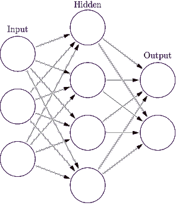

神经元是神经网络的基本元素，它使用一个简单的数学公式，我们可以在以下图中看到：

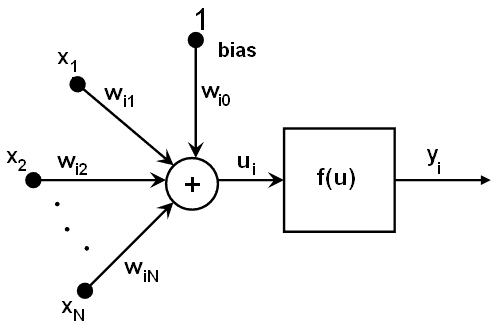

如我们所见，对于每个神经元，**i**，我们通过权重（**wi1**，**wi2**...）将所有前一个神经元的输出（即神经元**i**的输入**x1**，**x2**...）相加，并加上一个偏置值，然后将结果作为激活函数**f**的参数。最终结果是**i**神经元的输出：

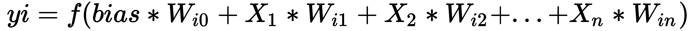

在经典神经网络中最常见的激活函数（**f**）是 Sigmoid 函数或线性函数。Sigmoid 函数使用得最为频繁，其形式如下：

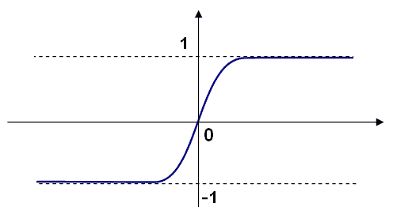

但我们如何通过这个公式和这些连接来学习神经网络？我们如何对输入数据进行分类？如果我们知道期望的输出，神经网络的学习算法可以称为**监督学习**；在学习过程中，输入模式被提供给网络的输入层。最初，我们将所有权重设置为随机数，并将输入特征送入网络，检查输出结果。如果这是错误的，我们必须调整网络的所有权重以获得正确的输出。这个算法被称为**反向传播**。如果您想了解更多关于神经网络如何学习的信息，请参阅[`neuralnetworksanddeeplearning.com/chap2.html`](http://neuralnetworksanddeeplearning.com/chap2.html)和[`youtu.be/IHZwWFHWa-w`](https://youtu.be/IHZwWFHWa-w)。

现在我们对神经网络及其内部架构有了简要的介绍，我们将探讨神经网络与深度学习之间的区别。

# 卷积神经网络

深度学习神经网络与经典神经网络有相同的背景。然而，在图像分析的情况下，主要区别在于输入层。在经典机器学习算法中，研究人员必须识别出定义图像目标的最佳特征来进行分类。例如，如果我们想要对数字进行分类，我们可以从每个图像中提取数字的边缘和线条，测量图像中对象的面积，所有这些特征都是神经网络的输入，或者任何其他机器学习算法的输入。然而，在深度学习中，你不必探索特征是什么；相反，你直接将整个图像作为神经网络的输入。深度学习可以学习最重要的特征，**深度神经网络**（**DNN**）能够检测图像或输入并识别它。

要了解这些特征是什么，我们使用深度学习和神经网络中最重要的一层：**卷积层**。卷积层的工作原理类似于卷积算子，其中核滤波器应用于整个前一层，为我们提供一个新的滤波图像，就像 sobel 算子：

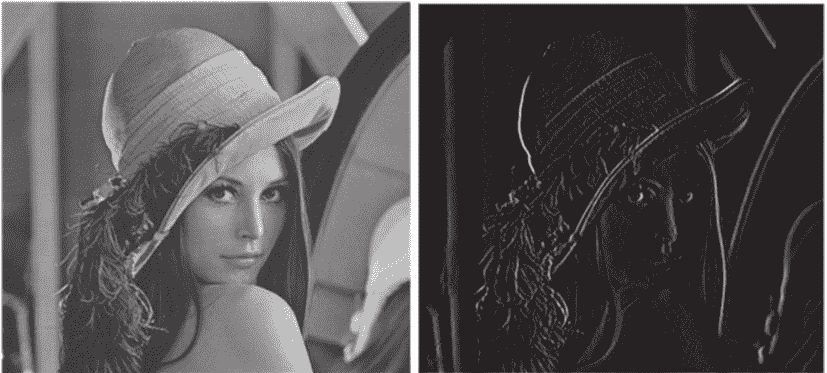

然而，在卷积层中，我们可以定义不同的参数，其中之一是应用于前一层或图像的滤波器数量和大小。这些滤波器在学习步骤中计算，就像经典神经网络中的权重一样。这是深度学习的魔力：它可以从标记图像中提取最显著的特征。

然而，这些卷积层是“深度”名称背后的主要原因，我们将在以下基本示例中看到原因。想象一下，我们有一个 100 x 100 的图像。在经典神经网络中，我们将从输入图像中提取我们可以想象的最相关特征。这通常大约是 1,000 个特征，并且随着每个隐藏层的增加或减少，这个数字可以增加或减少，但计算其权重的神经元数量在普通计算机中是合理的。然而，在深度学习中，我们通常开始应用一个卷积层——带有 64 个 3 x 3 大小的滤波器核。这将生成一个包含 100 x 100 x 64 个神经元的新层，需要计算 3 x 3 x 64 个权重。如果我们继续添加更多层，这些数字会迅速增加，需要巨大的计算能力来学习我们深度学习架构的良好权重和参数。

卷积层是深度学习架构中最重要方面之一，但还有其他重要的层，例如**池化**、**dropout**、**展平**和**softmax**。在下面的图中，我们可以看到一个基本的深度学习架构，其中堆叠了一些卷积和池化层：

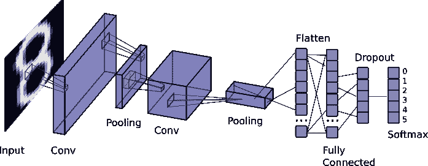

然而，还有一件非常重要的事情使得深度学习能够取得最佳结果：标注数据的数量。如果你有一个小数据集，深度学习算法将无法帮助你进行分类，因为学习特征（你的深度学习架构的权重和参数）的数据不足。然而，如果你有大量的数据，你会得到非常好的结果。但请注意，你需要大量的时间来计算和学习你架构的权重和参数。这就是为什么深度学习在早期过程中没有被使用，因为计算需要大量的时间。然而，多亏了新的并行架构，例如 NVIDIA GPU，我们可以优化学习反向传播并加快学习任务。

# OpenCV 中的深度学习

深度学习模块在 OpenCV 3.1 版本中被引入作为一个贡献模块。这被移动到 OpenCV 的一部分在 3.3 版本中，但它直到版本 3.4.3 和 4 才被开发者广泛采用。

OpenCV 仅实现深度学习用于推理，这意味着你不能在 OpenCV 中创建自己的深度学习架构进行训练；你只能导入一个预训练模型，在 OpenCV 库下执行它，并使用它作为**前馈**（推理）来获得结果。

实现前馈方法最重要的原因是优化 OpenCV 以加快计算时间和推理性能。不实现反向方法的其他原因是为了避免浪费时间开发其他库，如 TensorFlow 或 Caffe，已经专业化的东西。因此，OpenCV 创建了导入最重要的深度学习库和框架的导入器，以便能够导入预训练模型。

然后，如果你想在 OpenCV 中使用新的深度学习模型，你首先必须使用 TensorFlow、Caffe、Torch、DarkNet 框架或可以用来导出你模型为**开放神经网络交换**（**ONNX**）格式的框架来创建和训练它。使用这个框架创建模型可能很简单或很复杂，这取决于你使用的框架，但本质上你必须堆叠多个层，就像我们在之前的图中做的那样，设置 DNN 所需的参数和函数。如今，有其他工具可以帮助你创建模型而无需编码，例如[`www.tensoreditor.com`](https://www.tensoreditor.com)或[lobe.ai](https://lobe.ai/)。TensorEditor 允许你下载从可视化设计架构生成的 TensorFlow 代码，以便在计算机或云中训练。在下面的屏幕截图中，我们可以看到 TensorEditor：

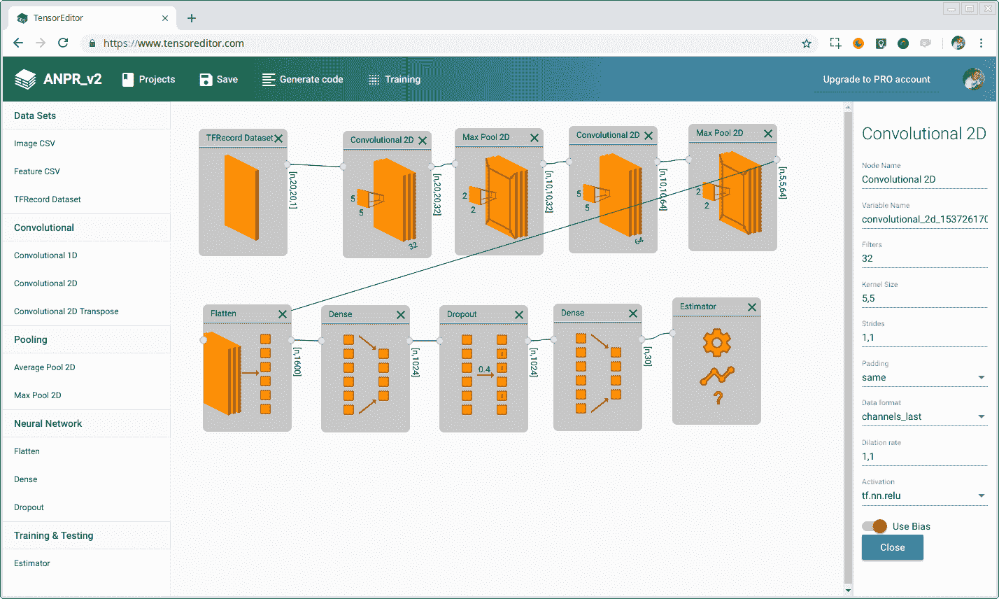

当你的模型训练完成并且你对结果感到满意时，你可以直接将其导入 OpenCV 以预测新的输入图像。在下一节中，你将看到如何在 OpenCV 中导入和使用深度学习模型。

# YOLO – 实时目标检测

要了解如何在 OpenCV 中使用深度学习，我们将展示一个基于 YOLO 算法的对象检测和分类的示例。这是最快的目标检测和识别算法之一，在 NVIDIA Titan X 上大约可以以 30 fps 的速度运行。

# YOLO v3 深度学习模型架构

在经典计算机视觉中，常见的对象检测使用滑动窗口来检测对象，通过不同窗口大小和比例扫描整个图像。这里的主要问题是扫描图像多次以找到对象所消耗的大量时间。

YOLO 通过将图划分为 S x S 网格来采用不同的方法。对于每个网格，YOLO 检查 B 个边界框，然后深度学习模型提取每个补丁的边界框、包含可能对象的置信度以及每个边界框在训练数据集中每个类别的置信度。以下截图显示了 S x S 网格：

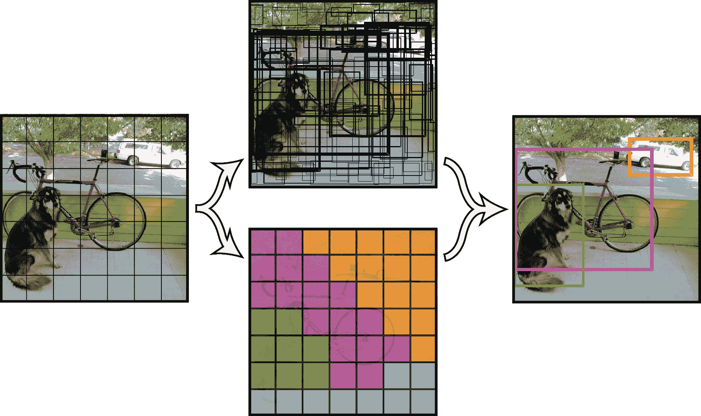

YOLO 使用每个网格 19 个和 5 个边界框进行训练，共 80 个类别。然后，输出结果为 19 x 19 x 425，其中 425 来自边界框（x, y, 宽度，高度）、对象置信度和 80 个类别的置信度乘以每个网格的边界框数量；*5_bounding boxes**(*x*,*y*,*w*,*h*,*object*_*confidence*, *classify*_*confidence*[*80*])=*5**(*4* + *1* + *80*):

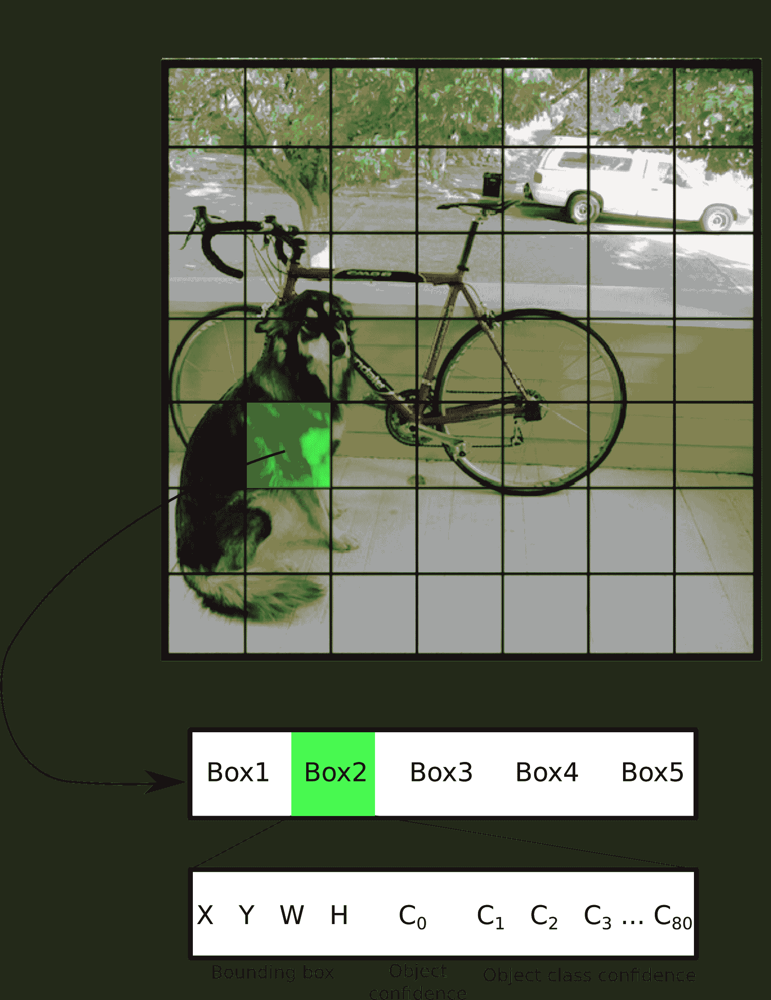

YOLO v3 架构基于 DarkNet，包含 53 层网络，YOLO 再增加 53 层，总共 106 层网络层。如果您需要一个更快的架构，可以查看版本 2 或 TinyYOLO 版本，它们使用更少的层。

# YOLO 数据集、词汇表和模型

在我们将模型导入 OpenCV 代码之前，我们必须通过 YOLO 网站获取它：[`pjreddie.com/darknet/yolo/`](https://pjreddie.com/darknet/yolo/)。该网站提供了基于**COCO**数据集的预训练模型文件，该数据集包含 80 个对象类别，例如人、雨伞、自行车、摩托车、汽车、苹果、香蕉、计算机和椅子。

要获取所有类别的名称和用于可视化的用途，请查看[`github.com/pjreddie/darknet/blob/master/data/coco.names?raw=true`](https://github.com/pjreddie/darknet/blob/master/data/coco.names?raw=true)。

名称的顺序与深度学习模型置信度的结果相同。如果您想通过类别查看 COCO 数据集的一些图像，可以探索数据集[`cocodataset.org/#explore`](http://cocodataset.org/#explore)，并下载其中一些来测试我们的示例应用程序。

要获取模型配置和预训练权重，您必须下载以下文件：

+   [`pjreddie.com/media/files/yolov3.weights`](https://pjreddie.com/media/files/yolov3.weights)

+   [`github.com/pjreddie/darknet/blob/master/cfg/yolov3.cfg?raw=true`](https://github.com/pjreddie/darknet/blob/master/cfg/yolov3.cfg?raw=true)

现在我们准备开始将模型导入到 OpenCV 中。

# 将 YOLO 导入到 OpenCV

深度学习 OpenCV 模块位于`opencv2/dnn.hpp`头文件下，我们必须将其包含在我们的源头文件和`cv::dnn 命名空间`中。

然后，我们的 OpenCV 头文件必须看起来像这样：

```py
...
#include <opencv2/core.hpp>
#include <opencv2/dnn.hpp>
#include <opencv2/imgproc.hpp>
#include <opencv2/highgui.hpp>
using namespace cv;
using namespace dnn;
...
```

我们首先要做的是导入 COCO 名称的词汇表，该词汇表位于`coco.names`文件中。此文件是一个纯文本文件，每行包含一个类别，并且按照置信度结果的相同方式排序。然后我们将读取此文件的每一行，并将其存储在一个名为`classes`的字符串向量中：

```py
...
 int main(int argc, char** argv)
 {
     // Load names of classes
     string classesFile = "coco.names";
     ifstream ifs(classesFile.c_str());
     string line;
     while (getline(ifs, line)) classes.push_back(line);
     ...

```

现在我们将导入深度学习模型到 OpenCV。OpenCV 实现了深度学习框架（如 TensorFlow 和 DarkNet）最常用的读取器/导入器，并且它们都有类似的语法。在我们的案例中，我们将使用权重导入 DarkNet 模型，并使用`readNetFromDarknet` OpenCV 函数：

```py
...
 // Give the configuration and weight files for the model
 String modelConfiguration = "yolov3.cfg";
 String modelWeights = "yolov3.weights";
// Load the network
Net net = readNetFromDarknet(modelConfiguration, modelWeights);
...
```

现在我们处于读取图像并将深度神经网络发送到推理的位置。首先，我们必须使用`imread`函数读取一个图像，并将其转换为可以读取**DotNetNuke**（**DNN**）的张量/数据块。为了从图像创建数据块，我们将使用`blobFromImage`函数，通过传递图像。此函数接受以下参数：

+   **image**：输入图像（具有 1、3 或 4 个通道）。

+   **blob**：输出`mat`。

+   **scalefactor**：图像值的乘数。

+   **size**：输出数据块所需的空间大小，作为 DNN 的输入。

+   **mean**：从通道中减去的标量，其值旨在（mean-R、mean-G 和 mean-B）的顺序，如果图像具有 BGR 排序且`swapRB`为真。

+   **swapRB**：一个标志，表示在 3 通道图像中交换第一个和最后一个通道是必要的。

+   **crop**：一个标志，表示图像在调整大小后是否将被裁剪。

你可以在以下代码片段中阅读如何读取和将图像转换为数据块的完整代码。

```py
...
input= imread(argv[1]);
// Stop the program if reached end of video
if (input.empty()) {
    cout << "No input image" << endl;
    return 0;
}
// Create a 4D blob from a frame.
blobFromImage(input, blob, 1/255.0, Size(inpWidth, inpHeight), Scalar(0,0,0), true, false);
...

```

最后，我们必须将数据块喂入深度网络，并使用`forward`函数进行推理，该函数需要两个参数：输出的`mat`结果和需要检索的层的名称：

```py
...
//Sets the input to the network
net.setInput(blob);

// Runs the forward pass to get output of the output layers
vector<Mat> outs;
net.forward(outs, getOutputsNames(net));
// Remove the bounding boxes with low confidence
postprocess(input, outs);
...
```

在`mat`输出向量中，我们包含了神经网络检测到的所有边界框，并且我们必须后处理输出，以获取置信度大于阈值的仅结果，通常为 0.5，最后应用非极大值抑制来消除冗余重叠的框。你可以在 GitHub 上找到完整的后处理代码。

我们示例的最终结果是深度学习中的多目标检测和分类，显示的窗口类似于以下内容：

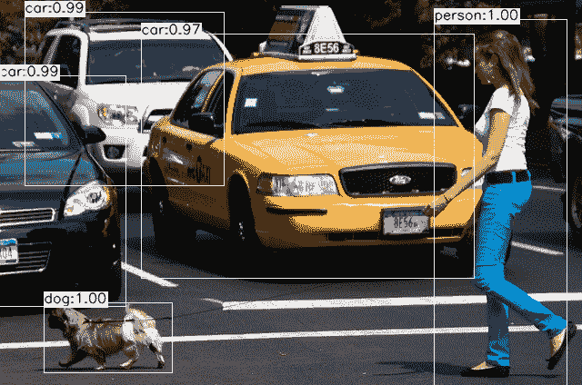

现在我们将学习另一个针对人脸检测定制的常用目标检测函数。

# 使用 SSD 进行人脸检测

**单次检测**（**SSD**）是另一种快速且准确的深度学习目标检测方法，其概念与 YOLO 类似，在该方法中，对象和边界框在相同的架构中被预测。

# SSD 模型架构

SSD 算法被称为单次检测，因为它在处理图像时，在相同的深度学习模型中同时预测边界框和类别。基本上，架构可以总结为以下步骤：

1.  一个 300 x 300 的图像被输入到架构中。

1.  输入图像通过多个卷积层，在不同的尺度上获得不同的特征。

1.  对于在步骤 2 中获得的每个特征图，我们使用一个 3 x 3 的卷积滤波器来评估一组默认边界框。

1.  对于每个评估的默认框，将预测边界框偏移量和类别概率。

模型架构看起来如下：

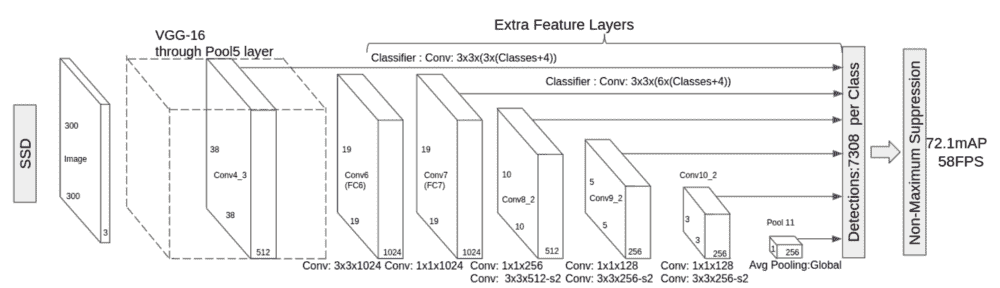

SSD 用于预测与 YOLO 类似的多类，但它可以被修改为检测单个对象，这需要更改最后一层并仅针对一个类别进行训练——这就是我们在示例中使用的内容，一个用于人脸检测的重新训练模型，其中只预测一个类别。

# 将 SSD 人脸检测导入 OpenCV

为了在我们的代码中使用深度学习，我们必须导入相应的头文件：

```py
#include <opencv2/dnn.hpp>
#include <opencv2/imgproc.hpp>
#include <opencv2/highgui.hpp>
```

之后，我们将导入所需的命名空间：

```py
using namespace cv;
using namespace std;
using namespace cv::dnn;
```

现在，我们将定义我们将要在代码中使用的目标图像大小和常量：

```py
const size_t inWidth = 300;
const size_t inHeight = 300;
const double inScaleFactor = 1.0;
const Scalar meanVal(104.0, 177.0, 123.0);
```

在这个例子中，我们需要一些参数作为输入，例如模型配置和预训练模型，如果我们将要处理相机或视频输入。我们还需要确定接受预测为正确或错误的最低置信度：

```py
const char* params
= "{ help | false | print usage }"
"{ proto | | model configuration (deploy.prototxt) }"
"{ model | | model weights (res10_300x300_ssd_iter_140000.caffemodel) }"
"{ camera_device | 0 | camera device number }"
"{ video | | video or image for detection }"
"{ opencl | false | enable OpenCL }"
"{ min_confidence | 0.5 | min confidence }";
```

现在，我们将从`main`函数开始，我们将使用`CommandLineParser`函数解析参数：

```py
int main(int argc, char** argv)
{
 CommandLineParser parser(argc, argv, params);

 if (parser.get<bool>("help"))
 {
 cout << about << endl;
 parser.printMessage();
 return 0;
 }
```

我们还将加载模型架构和预训练模型文件，并在深度学习网络中加载模型：

```py
 String modelConfiguration = parser.get<string>("proto");
 String modelBinary = parser.get<string>("model");

 //! [Initialize network]
 dnn::Net net = readNetFromCaffe(modelConfiguration, modelBinary);
 //! [Initialize network]
```

检查我们是否正确导入了网络非常重要。我们还必须检查是否导入了模型，使用`empty`函数，如下所示：

```py
if (net.empty())
 {
 cerr << "Can't load network by using the following files" << endl;
 exit(-1);
 }
```

在加载我们的网络后，我们将初始化我们的输入源，一个摄像头或视频文件，并将其加载到`VideoCapture`中，如下所示：

```py
 VideoCapture cap;
 if (parser.get<String>("video").empty())
 {
 int cameraDevice = parser.get<int>("camera_device");
 cap = VideoCapture(cameraDevice);
 if(!cap.isOpened())
 {
 cout << "Couldn't find camera: " << cameraDevice << endl;
 return -1;
 }
 }
 else
 {
 cap.open(parser.get<String>("video"));
 if(!cap.isOpened())
 {
 cout << "Couldn't open image or video: " << parser.get<String>("video") << endl;
 return -1;
 }
 }
```

现在，我们已经准备好开始捕获帧并将每个帧处理成深度神经网络以找到人脸。

首先，我们必须在循环中捕获每个帧：

```py
for(;;)
 {
 Mat frame;
 cap >> frame; // get a new frame from camera/video or read image

 if (frame.empty())
 {
 waitKey();
 break;
 }
```

接下来，我们将输入帧放入一个可以管理深度神经网络的`Mat` blob 结构中。我们必须发送具有 SSD 正确尺寸的图像，即 300 x 300（我们已初始化`inWidth`和`inHeight`常量变量），并从输入图像中减去所需的均值值，这是在 SSD 中使用定义的`meanVal`常量变量：

```py
Mat inputBlob = blobFromImage(frame, inScaleFactor, Size(inWidth, inHeight), meanVal, false, false); 
```

现在我们已经准备好将数据放入网络，并使用 `net.setInput` 和 `net.forward` 函数分别获取预测/检测结果。这会将检测结果转换为可读取的检测 `mat`，其中 `detection.size[2]` 是检测到的对象数量，`detection.size[3]` 是每个检测的结果数量（边界框数据和置信度）：

```py
 net.setInput(inputBlob, "data"); //set the network input
 Mat detection = net.forward("detection_out"); //compute output
 Mat detectionMat(detection.size[2], detection.size[3], CV_32F, detection.ptr<float>());

```

每行 `Mat` 检测包含以下内容：

+   **列 0**：存在对象的置信度

+   **列 1**：边界框的置信度

+   **列 2**：检测到的面部置信度

+   **列 3**：X 底部左边界框

+   **列 4**：Y 底部左边界框

+   **列 5**：X 顶部右边界框

+   **列 6**：Y 顶部右边界框

边界框相对于图像大小是相对的（从零到一）。

现在我们必须应用阈值，仅基于定义的输入阈值获取所需的检测：

```py
float confidenceThreshold = parser.get<float>("min_confidence");
 for(int i = 0; i < detectionMat.rows; i++)
 {
 float confidence = detectionMat.at<float>(i, 2);

 if(confidence > confidenceThreshold)
 {
```

现在我们将提取边界框，在每个检测到的面部上画一个矩形，并如下所示显示：

```py
 int xLeftBottom = static_cast<int>(detectionMat.at<float>(i, 3) * frame.cols);
 int yLeftBottom = static_cast<int>(detectionMat.at<float>(i, 4) * frame.rows);
 int xRightTop = static_cast<int>(detectionMat.at<float>(i, 5) * frame.cols);
 int yRightTop = static_cast<int>(detectionMat.at<float>(i, 6) * frame.rows);

 Rect object((int)xLeftBottom, (int)yLeftBottom, (int)(xRightTop - xLeftBottom), (int)(yRightTop - yLeftBottom));

 rectangle(frame, object, Scalar(0, 255, 0));
 }
 }
 imshow("detections", frame);
 if (waitKey(1) >= 0) break;
}
```

最终结果看起来像这样：

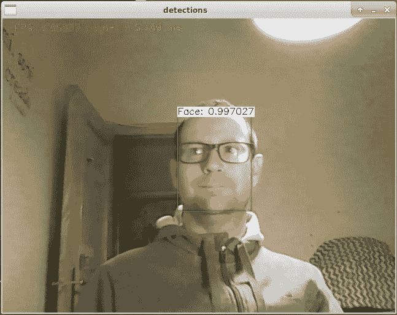

在本节中，你学习了一种新的深度学习架构 SSD，以及如何使用它进行面部检测。

# 摘要

在本章中，我们学习了什么是深度学习以及如何在 OpenCV 中使用它进行目标检测和分类。本章是使用其他模型和深度神经网络进行任何目的工作的基础。

本书教你如何获取和编译 OpenCV，如何使用基本的图像和 `mat` 操作，以及如何创建你自己的图形用户界面。你使用了基本的过滤器，并在工业检测示例中应用了所有这些。我们探讨了如何使用 OpenCV 进行面部检测以及如何对其进行操作以添加面具。最后，我们介绍了对象跟踪、文本分割和识别的非常复杂的使用案例。现在，你已准备好利用这些用例创建自己的 OpenCV 应用程序，这些用例展示了如何应用每个技术或算法。

# 进一步阅读

要了解更多关于 OpenCV 中深度学习的信息，请查看由 *Packt Publishing* 出版的 *《OpenCV 中的深度学习目标检测与识别》*。
