# 第二章：理解差动机器人的基础知识

在上一章中，我们讨论了 ROS 的基础知识、如何安装它以及 Gazebo 机器人模拟器的基础知识。正如我们已经提到的，我们将从头开始创建一个自主轮式机器人。我们将要设计的机器人是一个差动驱动机器人，这涉及到在机器人底盘的相对两侧安装两个轮子，使得机器人的方向可以通过改变两个轮子的速度来调整。

在编程机器人之前，了解差动轮式机器人的基本思想和术语将是有益的。本章将向您展示如何从数学角度分析机器人，以及如何解决机器人的运动学方程。运动学方程有助于您根据传感器的数据预测机器人的位置。

在本章中，我们将涵盖以下主题：

+   差动驱动机器人的数学建模

+   差动驱动机器人的前向运动学

+   差动驱动机器人的逆运动学

# 机器人的数学建模

移动机器人的一个重要部分是其转向系统。这将帮助机器人导航其环境。最简单且成本效益最高的转向系统之一是差动驱动系统。差动驱动机器人由两个主要轮子组成，这两个轮子安装在共同轴上，并由单独的电机控制。差动驱动系统/转向系统是一个非完整系统，这意味着它对机器人姿态的变化有约束。

汽车是一个非完整系统的例子，因为它不能在不改变其姿态的情况下改变其位置。让我们看看这种类型的机器人是如何工作的，以及我们如何从数学角度对机器人进行建模。

# 差动驱动系统和机器人运动学的介绍

**机器人运动学**是研究不考虑影响运动的力的运动数学，它主要处理控制系统的几何关系。**机器人动力学**是研究机器人的运动，其中涉及机器人运动的全部力都被建模。

移动机器人或车辆有六个**自由度**（**DOFs**），由姿态（x、y、z、滚转、俯仰和偏航）表示。这些自由度包括位置（x、y、z）和姿态（滚转、俯仰和偏航）。**滚转**指的是侧向旋转，**俯仰**指的是前后旋转，而**偏航**（称为航向或方向）指的是机器人在 x-y 平面中的移动方向。差动驱动机器人在水平面上从 x 移动到 y，因此 2D 姿态主要包含 x、y 和θ，其中θ是机器人的航向，指向机器人的前方方向。这些信息足以描述差动机器人的姿态：

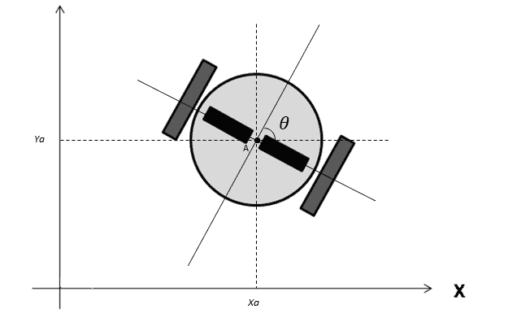

机器人在全局坐标系中的 x、y 和θ姿态

在差动驱动机器人中，运动可以通过调整左右两侧独立控制的两个电机的速度来控制，分别命名为 V-left 和 V-right。以下图像显示了市场上一些流行的差动驱动机器人：

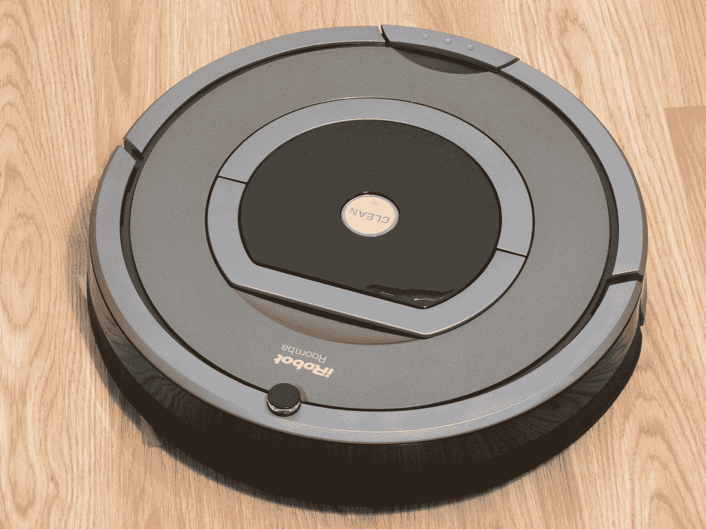

机器人 Roomba ([`en.wikipedia.org/wiki/IRobot`](https://en.wikipedia.org/wiki/IRobot))

iRobot 的 Roomba 系列自动吸尘器是一款流行的差动驱动机器人。

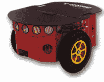

Pioneer 3-DX ([`robots.ros.org/pioneer-3-dx/`](http://robots.ros.org/pioneer-3-dx/))

Pioneer 3-DX 是来自 Omron Adept Mobile Robots 的流行的差动驱动研究平台。

# 差动式机器人的正向运动学

差动驱动系统机器人的正向运动学方程用于解决以下问题：

如果机器人在时间 *t* 处处于位置 (*x*, *y*, *θ*)，则根据控制参数 *V-left* 和 *V-right*，确定在 *t + δt* 时的姿态 (*x'*, *y'*, *θ'*)。

这种技术可以通过机器人计算来遵循特定的轨迹。

# 正向运动学方程的解释

我们可以从为正向运动学制定解决方案开始。以下图是机器人一个轮子的示意图：

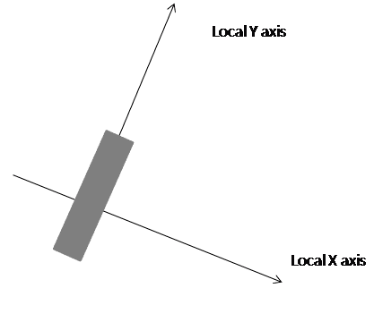

机器人单个轮子沿局部 y 轴旋转

围绕**y 轴**的运动称为滚动；其他所有运动都称为滑动。让我们假设在这种情况下没有滑动发生。当轮子完成一周旋转时，它覆盖的距离为 *2π r*，其中 *r* 是轮子的半径。我们将假设运动是二维的。这意味着表面是平坦且均匀的。

当机器人即将进行转向运动时，机器人必须绕其共同左右轮轴上的一个点旋转。机器人旋转的点称为**ICC**-瞬时曲率中心。ICC 位于机器人外部。以下图显示了差动驱动机器人的轮子配置与其 ICC 的关系：

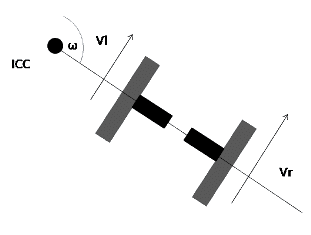

差动驱动机器人的轮子配置

推导运动学方程的中心概念是机器人的角速度 *ω*。机器人的每个轮子都绕 ICC 沿着半径为 *r* 的圆周旋转。

轮子的速度为 *v = 2 π r / T,* 其中 *T* 是轮子绕 ICC 完成一周所需的时间。角速度 *ω* 定义为 *2 π / T*，通常以每秒弧度（或度）为单位。将 *v* 和 *ω* 的方程结合，得到 *ω= 2 π / T*，我们可以得出以下结论：

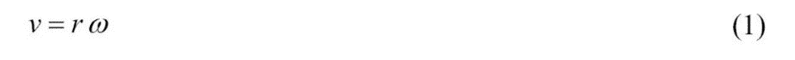

线性速度方程

差动驱动系统的详细模型如下所示：

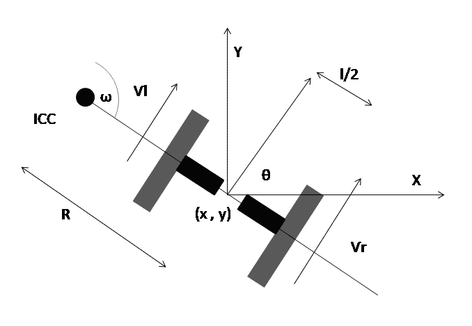

差动驱动系统的详细图示

如果我们将前一个公式应用于两个轮子，结果将是相同的，即 *ω*：

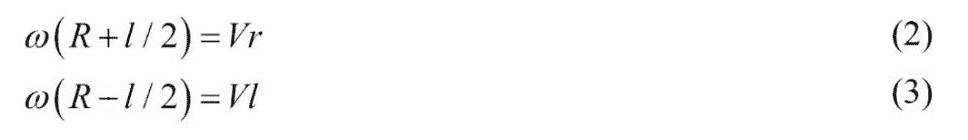

差动驱动轮方程

在这里，*R* 是 ICC 和轮轴中点的距离，*l* 是轮轴的长度。在解出 *ω* 和 *R* 后，我们得到以下结果：

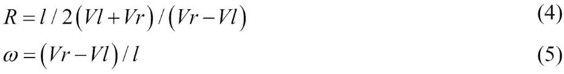

找到 ICC 到机器人中心的距离和机器人角速度的公式

前一个公式对于解决正向运动学问题很有用。假设机器人以 *ω* 的角速度移动 *δt* 秒。这将导致机器人的方向或航向改变如下：

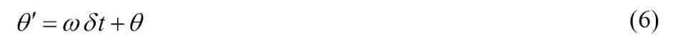

找到航向变化的公式

在这里，ICC 旋转的中心由以下基本三角学给出：

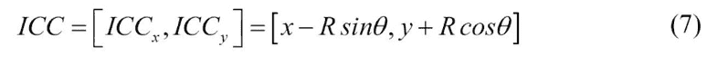

找到 ICC 的公式

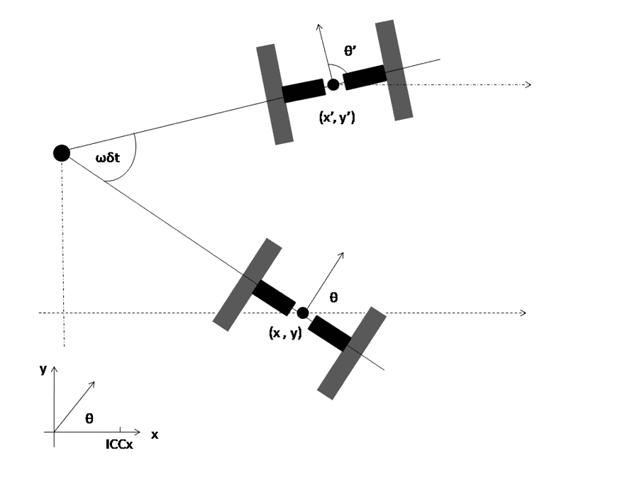

在 ICC 附近旋转机器人 ωδt 度

给定起始位置（*x*, *y*），可以使用二维旋转矩阵计算新位置（*x'*, *y'*）。在 ICC 附近以角速度 *ω* 旋转 *δt* 秒后，在时间 *t + δt* 时的位置如下：

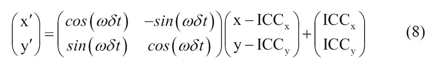

计算机器人新位置的公式

新的姿态（*x'*, *y'*, 和 *θ'*)可以从公式（6）和（8）中计算得出，给定 *ω*, *δt*, 和 *R*。

*ω* 可以从公式（5）中计算得出；*Vr* 和 *Vl* 往往更难准确测量。而不是测量速度，可以使用称为**轮编码器**的传感器来测量每个轮子的旋转。轮编码器提供的数据是机器人的**里程计**值。这些传感器安装在轮轴上，并为每个轮子旋转的每度提供二进制信号（每度可能为 0.1 毫米的量级）。我们将在*第六章，将执行器和传感器与机器人控制器接口*中查看轮编码器的详细工作原理。这些信号被输入到一个计数器中，以便 *vδt* 是从时间 *t* 到 *t + δt* 期间行驶的距离。我们可以写出以下公式：

*n * step = vδt*

从这个公式中，我们可以计算出 *v*：

从编码器数据计算线性速度的公式

如果我们将公式（9）插入到公式（3）和（4）中，我们得到以下结果：

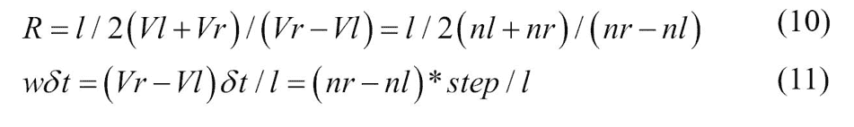

从编码器值计算 R 的公式

这里，***nl*** 和 ***nr*** 是左右轮的编码器计数。***Vl*** 和 ***Vr*** 分别是左右轮的速度。因此，机器人在姿态 (*x*, *y*, *θ*) 处站立，并在时间框架 *δt* 内移动 ***nl*** 和 ***nr*** 个计数；新的姿态 (*x'*, *y'*, *θ'*) 通过以下计算得出：

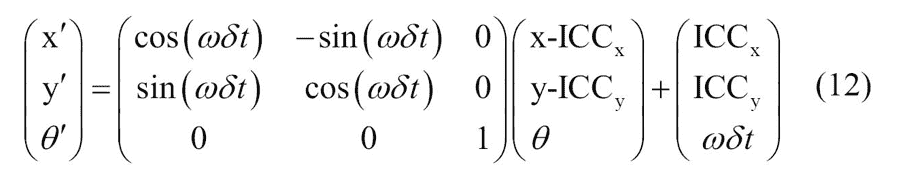

计算机器人位置从编码器值的方程

其中，

计算 ICC 和其他参数的方程

推导出的运动学方程主要取决于机器人的设计和几何形状。不同的设计可能导致不同的方程。

# 反向运动学

前向运动学方程提供了给定轮速度时的更新姿态。我们现在可以思考逆问题。

在时间 *t* 处以姿态 (*x*, *y*, *θ*) 站立，并确定 *V-left* 和 *V-right* 控制参数，以便在时间 *t + δt* 时的姿态是 (*x'*, *y'*, *θ'*)。

在差速驱动系统中，这个问题可能并不总是有解，因为这种机器人不能仅通过设置轮速度就被移动到任何姿态。这是因为非完整机器人有约束。

在非完整机器人中，如果我们允许一系列不同的 (*V-left*, *V-right*) 移动，有一些方法可以增加约束移动性。如果我们从方程 (12) 和 (15) 中插入值，我们可以识别一些可以编程的特殊动作：

+   如果 *V-right = V-left* => *nr = nl* => *R = ∞*，*ωδT = 0* =>，这意味着机器人沿直线移动，*θ* 保持不变

+   如果 *V-right = -V-left* => *nr = -nl* => *R=0*，*ωδt = 2nl * step / l* 和 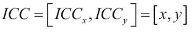 => *x' = x*，*y' = y*，*θ' = θ + ωδt* =>，这意味着机器人在 ICC 位置旋转，即任何 *θ* 都是可达到的，而 (*x*, *y*) 保持不变

结合这些操作，以下步骤可以用来从起始姿态到达任何目标姿态：

1.  旋转直到机器人的方向与从起始位置到目标位置的直线一致，*V-right = -V-left = V-rot*。

1.  直行驱动直到机器人的位置与目标位置一致，*V-right = V-left = V-ahead*。

1.  旋转直到机器人的方向与目标方向一致，*V-right = -V-left = V-rot*。在这里，*V-rot* 和 *V-ahead* 可以任意选择。

在接下来的章节中，我们将看到如何使用 ROS 实现机器人的运动学方程。

# 概述

本章讲述了差动驱动机器人的基本概念，并探讨了如何推导这类机器人的运动学方程。在章节开头，我们了解了差动驱动机器人的基础知识，然后讨论了在这些机器人中使用的正向运动学方程。这些方程通过图表进行了解释。在研究了正向运动学方程之后，我们接着探讨了差动驱动机器人的逆向运动学方程。我们还讨论了逆向运动学方程的基本内容。

在下一章中，我们将看到如何使用 ROS 和 Gazebo 创建自主移动机器人的模拟。

# 问题

1.  什么是全运动和非全运动配置？

1.  机器人运动学和动力学是什么？

1.  差动驱动机器人的 ICC 是什么？

1.  差动机器人中的正向运动学方程是什么？

1.  差动机器人中的逆向运动学方程是什么？

# 更多信息

如需了解更多关于运动学方程的信息，请参阅[`www8.cs.umu.se/~thomash/reports/KinematicsEquationsForDifferentialDriveAndArticulatedSteeringUMINF-11.19.pdf`](http://www8.cs.umu.se/~thomash/reports/KinematicsEquationsForDifferentialDriveAndArticulatedSteeringUMINF-11.19.pdf)。
