# 第三章：使用差动驱动机器人建模

在本章中，我们将探讨如何建模差动驱动机器人并在 ROS 中创建该机器人的 URDF 模型。我们将在本章中设计的机器人的主要用途是在酒店和餐厅中供应食物和饮料。该机器人命名为*Chefbot*。我们将在本章中涵盖该机器人的完整建模。

我们将查看机器人中使用的各种机械部件的 CAD 设计以及如何组装它们。我们将查看机器人的 2D 和 3D CAD 设计，并讨论如何创建机器人的 URDF 模型。

实际部署在酒店中的机器人模型可能体积较大，但在这里我们打算构建一个微型版本以测试我们的软件。如果你对从头开始构建机器人感兴趣，这一章就是为你准备的。如果你对构建机器人不感兴趣，你可以选择一些市场上已经可用的机器人平台，如 Turtlebot，与这本书一起工作。

要构建机器人硬件，首先我们需要获取机器人的要求。在获取要求后，我们可以设计它并在 2D CAD 工具中绘制模型以制造机器人部件。机器人的 3D 建模将给我们更多关于机器人外观的想法。在 3D 建模后，我们可以将设计转换为 URDF 模型，该模型可以与 ROS 一起使用。

本章将涵盖以下主题：

+   从给定的规范中设计机器人参数

+   使用 LibreCAD 在 2D 中设计机器人本体部件

+   使用 Blender 和 Python 设计 3D 机器人模型

+   为 Chefbot 创建 URDF 模型

+   在 Rviz 中可视化 Chefbot 模型

# 技术要求

要测试本章中的应用程序和代码，你需要一台安装了 ROS Kinetic 的 Ubuntu 16.04 LTS PC/笔记本电脑

# 服务机器人的要求

在设计任何机器人系统之前，首先要确定系统的要求。以下是要满足本机器人的一组机器人设计要求。这包括硬件和软件要求：

+   机器人应具备携带食物的设施

+   机器人应携带最大有效载荷 2 公斤

+   机器人的速度应在 0.25 米/秒到 0.35 米/秒之间

+   机器人的离地间隙应大于 3 厘米

+   机器人必须连续工作 2 小时

+   机器人应能够移动并向任何餐桌供应食物，避免障碍物

+   机器人高度应在 80 厘米到 100 厘米之间。

+   机器人的成本应低（低于 500 美元）

现在我们有了设计要求，例如有效载荷、速度、离地间隙、机器人高度、机器人成本以及要在机器人中实现的功能，我们可以设计机器人本体并选择符合上述要求的组件。让我们讨论我们可以用来满足这些要求的机器人机构。

# 机器人驱动机构

移动机器人导航的经济有效解决方案之一是差速驱动系统。它是移动机器人最简单的驱动机构之一，主要用于室内导航。**差速驱动机器人**由两个安装在共同轴上的车轮组成，由两个独立的电机控制。有两个称为万向轮的支撑轮。这确保了机器人的稳定性和重量分布。以下图显示了典型的差速驱动系统：

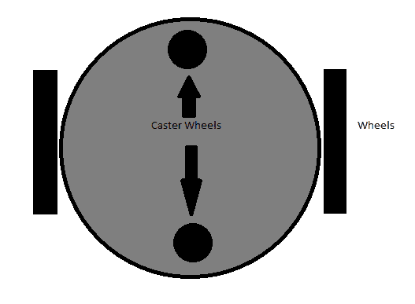

差速驱动系统

下一步是选择此机器人驱动系统的机械组件，即主要是电机、车轮和机器人底盘。根据要求，我们首先讨论如何选择电机。

# 电机和车轮的选择

在查看规格后选择电机。电机选择的一些重要参数是扭矩和转速。我们可以从给定要求中计算出这些值。

# 电机转速计算

此机器人所需的转速范围为 0.25 至 0.35m/s。在设计时，我们可以将此机器人的最大速度定为 0.35 m/s。取车轮直径为 9 cm，因为根据要求，离地间隙应大于 3 cm，我们将机器人本体固定在与电机轴相同的高度。在这种情况下，我们将获得更大的离地间隙。

使用以下方程，我们可以计算电机的转速：

*RPM = ((60 * Speed) / (3.14 * Diameter of Wheel)*

*RPM = (60 * 0.35) / (3.14 * 0.09) = 21 / 0.2826 = 74 RPM*

您还可以查看 [`www.robotshop.com/blog/en/vehicle-speed-rpm-and-wheel-diameter-finder-9786`](http://www.robotshop.com/blog/en/vehicle-speed-rpm-and-wheel-diameter-finder-9786) 了解计算方法。

使用直径为 9 厘米的车轮和 0.35 米/秒的速度计算出的转速为 74 RPM。我们可以将 80 RPM 视为标准值。

# 电机扭矩计算

让我们计算移动机器人所需的扭矩：

1.  车轮数量 = 包括两个万向轮在内的四个车轮。

1.  电机数量 = 两个。

1.  假设摩擦系数为 0.6，车轮半径为 4.5 厘米。

1.  机器人的总重量 = 机器人重量 + 负载 = (W = mg) = (~100 N + ~20 N) W= ~ 150 N，而总质量 = 12 Kg。

1.  作用在四个车轮上的重量可以表示为 *2 * N1 + 2 * N2 = W*；即，*N1* 是作用在每个万向轮上的重量，*N2* 是作用在电机轮上的重量。

1.  假设机器人处于静止状态。当机器人开始移动时，需要最大的扭矩。它还应克服摩擦。

1.  在机器人移动之前，我们可以将摩擦力表示为机器人扭矩 = 0。如果我们在此条件下获得机器人扭矩，我们可以得到以下最大扭矩：

+   +   *µ * N * r - T = 0*，其中 *µ* 是摩擦系数，*N* 是作用在每个车轮上的平均重量，*r* 是车轮半径，*T* 是扭矩。

    +   *N = W/2*（在机器人中，驱动仅针对两个轮子，因此我们取 W/2 来计算最大扭矩）。

    +   因此，我们得到：*0.6 * (120/2) * 0.045 - T = 0*

    +   因此，**T = 1.62 N-m 或 16.51 Kg-cm**

# 设计摘要

设计完成后，我们计算以下值，并将其四舍五入到市场上可用的标准电机规格：

+   电机 RPM = 80（四舍五入到标准值）

+   电机扭矩 = 18 kg-cm

+   轮径 = 9 cm

# 机器人底盘设计

在计算了机器人的电机和车轮参数之后，我们可以设计机器人底盘或机器人本体。根据要求，机器人底盘应设有放置食物的装置，它应能承受高达 5 kg 的载重，机器人的离地间隙应大于 3 cm，并且成本应低。除此之外，机器人还应设有放置电子组件的装置，例如 **个人电脑** (**PC**)、传感器和电池。

满足这些要求的最简单设计之一是多层架构，如 Turtlebot 2 (http://www.turtlebot.com/)。底盘有三层。被称为 **Kobuki** (http://kobuki.yujinrobot.com/about2/) 的机器人平台是这个平台的主要驱动机制。Roomba 平台内置了电机和传感器，因此无需担心设计机器人驱动系统。以下图片展示了 **TurtleBot 2** 机器人的底盘设计：

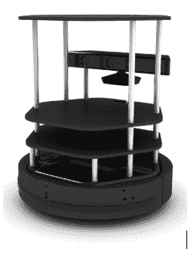

TurtleBot 2 机器人 (http://robots.ros.org/turtlebot/)

我们将设计一个类似于 TurtleBot 2 的机器人，拥有我们自己的移动平台和组件。我们的设计也有三层架构。在我们开始设计之前，让我们确定所有需要的工具。

在我们开始设计机器人底盘之前，我们需要 **计算机辅助设计** (**CAD**) 工具。可用于 CAD 的流行工具有：

+   SolidWorks ([`www.solidworks.com/default.html`](http://www.solidworks.com/default.html))

+   AutoCAD ([`www.autodesk.com/products/autocad/overview`](http://www.autodesk.com/products/autocad/overview))

+   Maya ([`www.autodesk.com/products/maya/overview`](http://www.autodesk.com/products/maya/overview))

+   Inventor ([`www.autodesk.com/products/inventor/overview`](http://www.autodesk.com/products/inventor/overview))

+   SketchUp ([`www.sketchup.com/`](http://www.sketchup.com/))

+   Blender ([`www.blender.org/download/`](http://www.blender.org/download/))

+   LibreCAD ([`librecad.org/cms/home.html`](http://librecad.org/cms/home.html))

您可以使用您熟悉的任何软件进行底盘设计。在这里，我们将演示 **LibreCAD** 中的 2D 模型以及 **Blender** 中的 3D 模型。这些应用程序的一个亮点是它们是免费的，并且适用于所有操作系统平台。我们将使用一个名为 **MeshLab** 的 3D 网格查看工具来查看和检查 3D 模型设计，并使用 Ubuntu 作为主要操作系统。此外，我们还可以在 Ubuntu 16.04 中查看这些应用程序的安装程序，以开始设计过程。我们还将提供其他平台上的应用程序安装教程链接。

# 安装 LibreCAD、Blender 和 MeshLab

**LibreCAD** 是一个免费、开源的 2D CAD 应用程序，适用于 Windows、OS X 和 Linux。**Blender** 是一个免费、开源的 3D 计算机图形软件，用于创建 3D 模型、动画和视频游戏。它附带 GPL 许可证，允许用户共享、修改和分发应用程序。**MeshLab** 是一个开源、便携和可扩展的系统，用于处理和编辑未结构化的 3D 三角形网格。

以下链接是安装 LibreCAD 在 Windows、Linux 和 OS X 中的链接：

+   访问 [`librecad.org/cms/home.html`](http://librecad.org/cms/home.html) 下载 LibreCAD

+   访问 [`librecad.org/cms/home/from-source/linux.html`](http://librecad.org/cms/home/from-source/linux.html) [从源代码构建 LibreCAD](http://librecad.org/cms/home/from-source/linux.html)

+   访问 [`librecad.org/cms/home/installation/linux.html`](http://librecad.org/cms/home/installation/linux.html) 以在 Debian/Ubuntu 中安装 LibreCAD

+   访问 [`librecad.org/cms/home/installation/rpm-packages.html`](http://librecad.org/cms/home/installation/rpm-packages.html) 以在 Fedora 中安装 LibreCAD

+   访问 [`librecad.org/cms/home/installation/osx.html`](http://librecad.org/cms/home/installation/osx.html) 以在 OS X 中安装 LibreCAD

+   访问 [`librecad.org/cms/home/installation/windows.html`](http://librecad.org/cms/home/installation/windows.html) 以在 Windows 中安装 LibreCAD

您可以在以下链接中找到有关 LibreCAD 的文档：

[`wiki.librecad.org/index.php/Main_Page`](http://wiki.librecad.org/index.php/Main_Page)。

# 安装 LibreCAD

提供了所有操作系统的安装程序。如果您是 Ubuntu 用户，您也可以直接从 Ubuntu 软件中心安装。

如果您使用的是 Ubuntu，以下是在安装 LibreCAD 时使用的命令：

```py
    $ sudo add-apt-repository ppa:librecad-dev/librecad-stable
    $ sudo apt-get update
    $ sudo apt-get install librecad

```

# 安装 Blender

访问以下下载页面以安装适用于您的操作系统平台的 Blender：[`www.blender.org/download/`](http://www.blender.org/download/)。您在这里可以找到 Blender 的最新版本。您还可以在 [`wiki.blender.org/`](http://wiki.blender.org/) 找到 Blender 的最新文档。

如果您使用的是 Ubuntu/Linux，您可以直接通过 Ubuntu 软件中心安装 Blender，或者使用以下命令：

```py
    $ sudo apt-get install blender  
```

# 安装 MeshLab

**MeshLab**适用于所有操作系统平台。以下链接将提供预构建二进制文件和 MeshLab 源代码的下载链接：[`meshlab.sourceforge.net/`](http://meshlab.sourceforge.net/)

如果你是 Ubuntu 用户，你可以使用以下命令从 apt 包管理器安装**MeshLab**：

```py
    $sudo apt-get install meshlab  
```

# 使用 LibreCAD 创建机器人的 2D CAD 图纸

我们将查看 LibreCAD 的基本界面。以下截图显示了 LibreCAD 的界面：

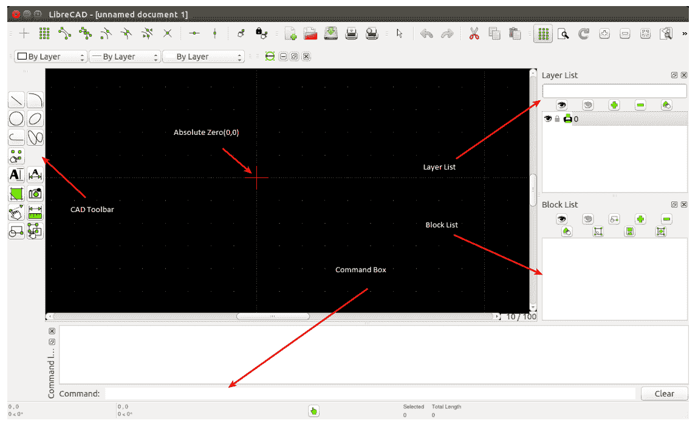

LibreCAD 工具

CAD 工具栏包含绘制模型所需的组件。以下图表显示了 CAD 工具栏的详细概述：

[`wiki.librecad.org/`](http://wiki.librecad.org/)

在以下链接中可以找到 LibreCAD 工具的详细描述：[`wiki.librecad.org/index.php/LibreCAD_users_Manual`](http://wiki.librecad.org/index.php/LibreCAD_users_Manual)

下面是每个工具的简要说明：

+   **命令框**：这是通过仅使用命令来绘制图形的工具。我们可以不触碰任何工具栏来绘制图表。关于命令框的使用说明可以在以下链接中找到：

+   **图层列表**：这将包含当前绘图使用的图层。计算机辅助绘图中的一个基本概念是使用图层来组织绘图。关于图层的详细解释可以在以下链接中找到：[`wiki.librecad.org/index.php/Layers`](http://wiki.librecad.org/index.php/Layers).

+   **块**：这是一个实体组，可以在同一张图纸中多次插入，具有不同的属性、位置、比例和旋转角度。关于块的详细解释可以在以下链接中找到：[`wiki.librecad.org/index.php/Blocks`](http://wiki.librecad.org/index.php/Blocks).

+   **绝对零点**：这是绘图的起点（0,0）。

现在，通过设置绘图单位开始草图绘制。将绘图单位设置为厘米。打开 LibreCAD，导航到编辑 | 应用程序首选项。将单位设置为厘米，如图所示：

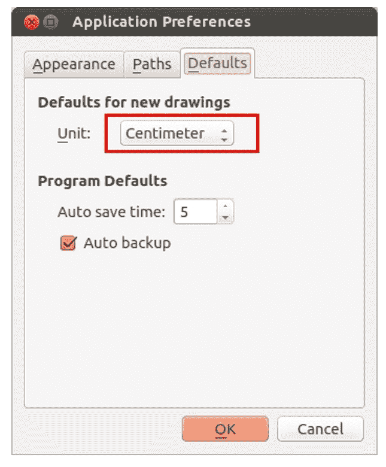

让我们从机器人的底板设计开始。底板有连接电机、放置电池和控制板的空间。

# 底板设计

以下图显示了机器人的基板。该板为差速驱动的两个电机以及基板前后每个万向轮提供了安装位置。图中将电机标记为 **M1** 和 **M2**，万向轮表示为 **C1** 和 **C2**。它还持有四个极以连接到下一板。极表示为 **P1-1**、**P1-2**、**P1-3** 和 **P1-4**。螺钉表示为 **S**，我们在这里将使用相同的螺钉。中心有一个孔，用于将电机线引到板的顶部。板在左侧和右侧切割，以便将轮子安装到电机上。从中心到万向轮的距离为 **12.5** cm，从中心到电机的距离为 **5.5** cm。极的中心长度为 **9** cm，高度为 **9** cm。所有板的孔都遵循相同的尺寸：


基板设计

图中未标注尺寸；相反，它们列在下面的表格中：

| **部件** | **尺寸(cm) (长度 x 高度) (半径)** |
| --- | --- |
| **M1** 和 **M2** | 5 x 4 |
| **C1** 和 **C2** | 半径 = 1.5 |
| **S** (螺钉) (图中未显示) | 0.15 |
| **P1-1**、**P1-2**、**P1-3**、**P1-4** | 外半径 0.7，高度 3.5cm |
| 左右轮段 | 2.5 x 10 |
| 基板 | 半径 = 15 |

我们将在稍后更详细地讨论电机尺寸和夹具尺寸。

# 基板极设计

基板有四个极以扩展到下一层。极长为 **3.5** cm，半径为 **0.7** cm。我们可以通过将空心管附着在极上扩展到下一板。在空心管顶部，我们将插入一块硬塑料以形成螺钉孔。这个孔将用于扩展到顶层。以下图中显示了基板极和每个极上的空心管。空心管的半径为 **0.75** cm，长度为 **15** cm：


15 cm 空心管设计

# 轮子、电机和电机夹具设计

我们必须决定轮子的直径并计算电机需求。在这里，我们提供了一个典型的电机和轮子，如果设计成功，我们可以使用它们：

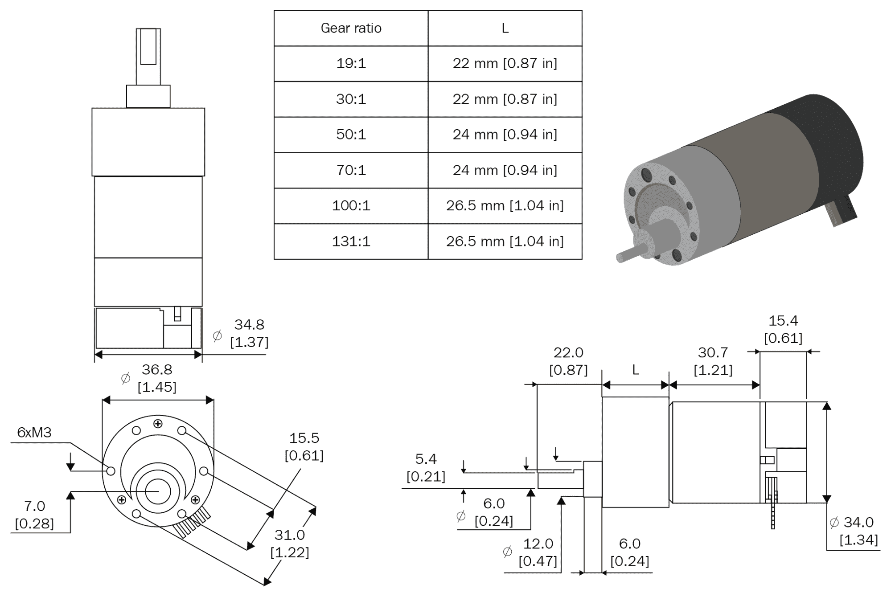

机器人电机设计

电机设计可以根据电机选择而变化；如果需要，可以将此电机作为设计并可在仿真后进行更改。电机图中的 **L** 值可以根据电机的速度和扭矩而变化。这是电机的齿轮组件。

以下图显示了一个直径为 **90** cm 的典型轮子。放置夹具后，直径为 **86.5** mm 的轮子将变为 **90** mm。


机器人轮子设计

电机需要安装在底板上。为了安装，我们需要一个可以拧到板上的夹具，并且将电机连接到夹具上。以下图显示了用于此目的的典型夹具。它是一个 L 形夹具，我们可以用它在一侧安装电机，并将另一侧固定到板上：

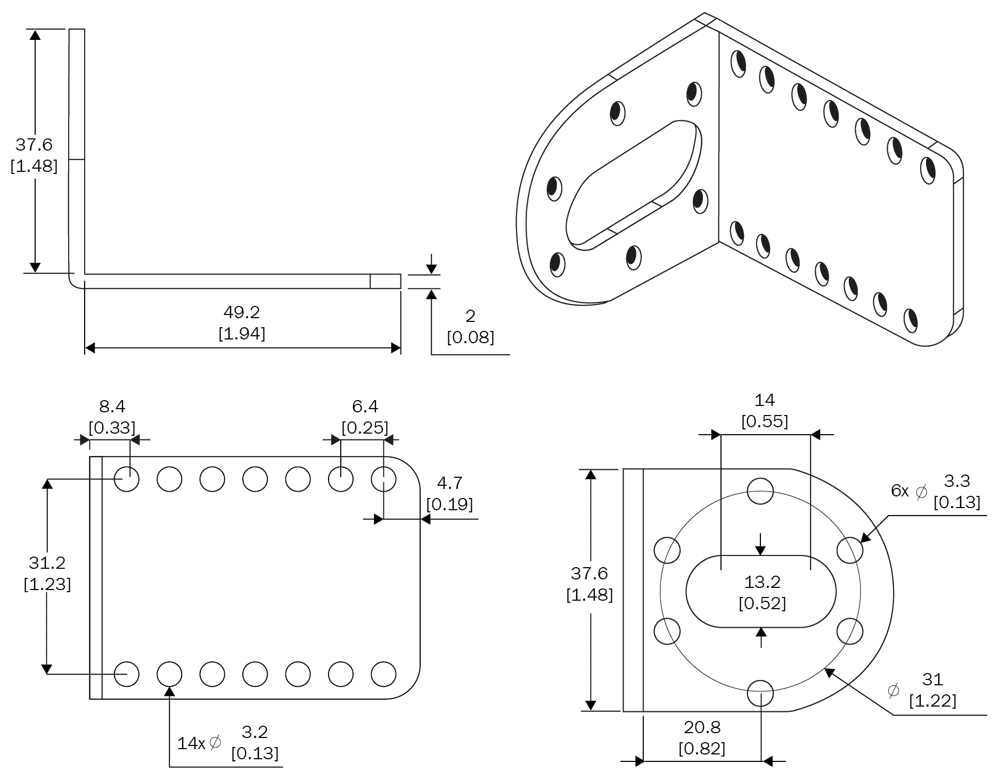

机器人典型夹具设计

# 轮子设计

轮子不需要特殊设计；我们可以使用任何可以接触地面的轮子，类似于轮子。以下链接有一个我们可以用于此设计的轮子集合：[`www.pololu.com/category/45/pololu-ball-casters`](http://www.pololu.com/category/45/pololu-ball-casters)。[`www.pololu.com/category/45/pololu-ball-casters`](http://www.pololu.com/category/45/pololu-ball-casters)

# 中间板设计

这个板的尺寸与底板相同，螺丝尺寸也类似：

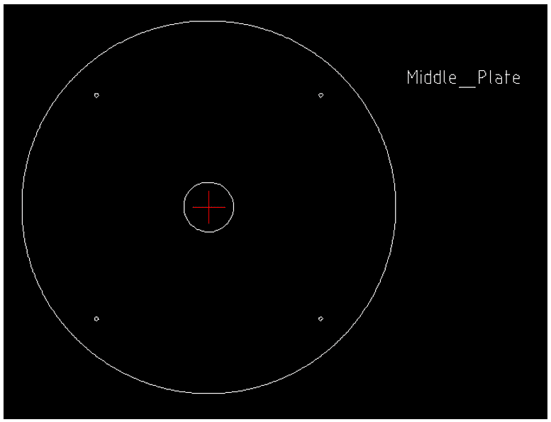

机器人中间板设计

中间板可以从底板上方支撑空心管。这种布局使用另一根从中间板延伸出来的空心管连接。从中间板延伸出来的管子底部会有一个螺丝来固定底板和中间板上的管子，并且有一个空心端来连接顶板。中间板延伸出来的管子的俯视图和侧视图如下所示：

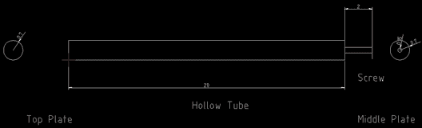

20 厘米空心管设计

这根管子将连接中间板和底板，同时提供连接顶板的功能。

# 顶板设计

顶板与其他板类似；它有四个 3 厘米的小柱子，类似于底板。柱子可以放置在中间板上的空心管上。四个柱子连接到板本身：


顶板设计

在完成顶板设计后，机器人的底盘设计几乎完成。让我们看看使用 Blender 构建这个机器人的 3D 模型。3D 模型是用于模拟目的的，我们构建的 2D 设计主要是用于制造目的。

# 使用 Blender 处理机器人的 3D 模型

在本节中，我们将设计机器人的 3D 模型。3D 模型主要用于模拟目的。建模将使用 Blender 完成。版本必须大于 2.6，因为我们只测试了这些版本的教程。

下面的截图显示了 Blender 工作空间和可用于与 3D 模型一起使用的工具：

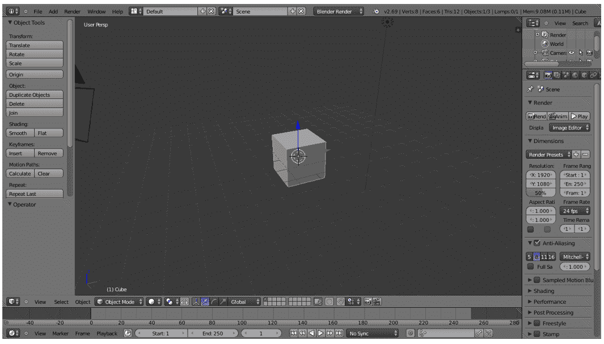

Blender 3D CAD 工具

我们在这里使用 Blender 的主要原因是我们可以使用 Python 脚本来建模机器人。Blender 内置了 Python 解释器和 Python 脚本编辑器，用于编写代码。我们在这里不会讨论 Blender 的用户界面。您可以在 Blender 的网站上找到很好的教程。有关 Blender 用户界面的信息，请参阅以下链接：[`www.blender.org/support/tutorials/`](http://www.blender.org/support/tutorials/)。

让我们开始使用 Python 在 Blender 中编写代码。

# Blender 中的 Python 脚本编写

**Blender** 主要用 C、C++ 和 Python 编写。用户可以编写自己的 Python 脚本并访问 Blender 的所有功能。如果您是 Blender Python API 的专家，可以使用 Python 脚本而不是手动建模来构建整个机器人模型。

Blender 使用 Python 3.x。Blender 的 Python API 通常很稳定，但某些区域仍在添加和改进。有关 Blender Python API 的文档，请参阅 [`www.blender.org/documentation/blender_python_api_2_69_7/`](http://www.blender.org/documentation/blender_python_api_2_69_7/)。

让我们对将在我们的机器人模型脚本中使用的 Blender Python API 进行简要概述。

# Blender Python API 简介

Blender 中的 Python API 可以完成 Blender 大多数功能。API 可以完成的主要工作如下：

+   编辑 Blender 内部的任何数据，例如场景、网格、粒子等。

+   修改用户首选项、快捷键映射和主题

+   创建新的 Blender 工具

+   使用 Python 的 OpenGL 命令绘制 3D 视图。

Blender 向 Python 解释器提供了 **bpy** 模块。此模块可以在脚本中导入，并提供对 Blender 数据、类和函数的访问；处理 Blender 数据的脚本将需要导入此模块。我们在 bpy 中将使用的主要 Python 模块如下：

+   **上下文访问**: 这提供了从 (`bpy.context`) 脚本访问 Blender 用户界面函数的权限。

+   **数据访问**: 这提供了对 Blender 内部数据（`bpy.data`）的访问。

+   **运算符**: 这为 Python 提供了调用运算符的访问权限，包括用 C、Python 或宏（`bpy.ops`）编写的运算符。

要在 Blender 中切换到脚本编写，我们需要更改 Blender 的屏幕布局。以下截图显示了帮助您切换到脚本布局的选项：


Blender 脚本选项

在选择脚本选项卡后，我们可以在 Blender 中看到文本编辑器和 Python 控制台窗口。在文本编辑器中，我们可以使用 Blender API 进行编码，并通过 Python 控制台尝试 Python 命令。单击新建按钮创建一个新的 Python 脚本，并将其命名为`robot.py`。现在，我们只能使用 Python 脚本设计机器人的 3D 模型。下一节将提供设计机器人模型的完整脚本。在运行之前，我们可以讨论代码。希望你已经从他们的网站上阅读了 Blender 的 Python API。下一节中的代码分为六个 Python 函数，用于绘制三个机器人基板、绘制电机和轮子、绘制四个支撑管，并将它们导出为**STereoLithography**（**STL**）3D 文件格式进行模拟：

# 机器人模型的 Python 脚本

以下是我们将要设计的机器人模型的 Python 脚本：

1.  在 Blender 中开始 Python 脚本之前，我们必须导入`bpy`模块。`bpy`模块包含 Blender 的所有功能，并且只能从 Blender 应用程序内部访问：

```py
import bpy 
```

1.  以下函数将绘制机器人的基板。此函数将绘制一个半径为 5 厘米的圆柱体，并在对面两侧切割一部分，以便可以使用 Blender 内的`布尔修改器`连接电机：

```py
#This function will draw base plate 
def Draw_Base_Plate(): 
```

1.  以下两个命令将在基板的两侧创建两个半径为 0.05 米的立方体。这些立方体的目的是创建一个修改器，从基板中减去立方体。因此，实际上我们将得到一个有两个切割的基板。在切割两侧后，我们将删除立方体：

```py
bpy.ops.mesh.primitive_cube_add(radius=0.05, 
       location=(0.175,0,0.09))bpy.ops.mesh.primitive_cube_add(radius=0.05, 
       location=(-0.175,0,0.09)) 

    #################################################### 
    #################################################### 

    #Adding base plate 
bpy.ops.mesh.primitive_cylinder_add(radius=0.15, 
       depth=0.005, location=(0,0,0.09)) 

    #Adding boolean difference modifier from first cube 

bpy.ops.object.modifier_add(type='BOOLEAN') 
bpy.context.object.modifiers["Boolean"].operation = 
       'DIFFERENCE'bpy.context.object.modifiers["Boolean"].object = 
 bpy.data.objects["Cube"] 
bpy.ops.object.modifier_apply(modifier="Boolean") 

    ###################################################### 
    ###################################################### 

    #Adding boolean difference modifier from second cube 

bpy.ops.object.modifier_add(type='BOOLEAN') 
bpy.context.object.modifiers["Boolean"].operation = 
       'DIFFERENCE'bpy.context.object.modifiers["Boolean"].object = 
 bpy.data.objects["Cube.001"] 
bpy.ops.object.modifier_apply(modifier="Boolean") 

    #######################################################
     ####################################################### 

    #Deselect cylinder and delete cubes 
bpy.ops.object.select_pattern(pattern="Cube") 
bpy.ops.object.select_pattern(pattern="Cube.001") 
bpy.data.objects['Cylinder'].select = False 
bpy.ops.object.delete(use_global=False) 

```

1.  以下函数将绘制连接到基板的电机和轮子：

```py
#This function will draw motors and wheels 
def Draw_Motors_Wheels():  
```

1.  以下命令将绘制一个半径为 0.045 米、深度为 0.01 米的圆柱体作为轮子。创建轮子后，它将被旋转并平移到基板的切割部分：

```py
    #Create first Wheel 

bpy.ops.mesh.primitive_cylinder_add(radius=0.045, 
       depth=0.01, location=(0,0,0.07)) 
    #Rotate 
bpy.context.object.rotation_euler[1] = 1.5708 
    #Transalation 
bpy.context.object.location[0] = 0.135 

    #Create second wheel 
bpy.ops.mesh.primitive_cylinder_add(radius=0.045, 
       depth=0.01, location=(0,0,0.07)) 
    #Rotate 
bpy.context.object.rotation_euler[1] = 1.5708 
    #Transalation 
bpy.context.object.location[0] = -0.135
```

1.  以下代码将在基板上添加两个虚拟电机。电机的尺寸已在 2D 设计中说明。电机基本上是一个圆柱体，它将被旋转并放置在基板上：

```py
    #Adding motors 

bpy.ops.mesh.primitive_cylinder_add(radius=0.018,
 depth=0.06, location=(0.075,0,0.075)) 
bpy.context.object.rotation_euler[1] = 1.5708 

bpy.ops.mesh.primitive_cylinder_add(radius=0.018,
 depth=0.06, location=(-0.075,0,0.075)) 
bpy.context.object.rotation_euler[1] = 1.5708 

```

1.  以下代码将为电机添加一个轴，类似于电机模型。轴也是一个圆柱体，它将被旋转并插入到电机模型中：

```py
    #Adding motor shaft 
bpy.ops.mesh.primitive_cylinder_add(radius=0.006,
 depth=0.04, location=(0.12,0,0.075)) 
bpy.context.object.rotation_euler[1] = 1.5708 

bpy.ops.mesh.primitive_cylinder_add(radius=0.006,
 depth=0.04, location=(-0.12,0,0.075)) 
bpy.context.object.rotation_euler[1] = 1.5708 

    #######################################################
 #######################################################
```

1.  以下代码将在基板上添加两个万向轮。目前，我们正在添加一个圆柱体作为轮子。在模拟中，我们可以将其指定为轮子：

```py
    #Adding Caster Wheel 

bpy.ops.mesh.primitive_cylinder_add(radius=0.015, 
       depth=0.05, location=(0,0.125,0.065))bpy.ops.mesh.primitive_cylinder_add(radius=0.015, 
       depth=0.05, location=(0,-0.125,0.065))
```

1.  以下代码将添加一个虚拟的 Kinect 传感器：

```py
    #Adding Kinect 

bpy.ops.mesh.primitive_cube_add(radius=0.04, 
       location=(0,0,0.26))
```

1.  此函数将绘制机器人的中间板：

```py
#Draw middle plate 
def Draw_Middle_Plate(): 
bpy.ops.mesh.primitive_cylinder_add(radius=0.15, 
       depth=0.005, location=(0,0,0.22)) 

#Adding top plate 
def Draw_Top_Plate(): 
bpy.ops.mesh.primitive_cylinder_add(radius=0.15, 
       depth=0.005, location=(0,0,0.37))
```

1.  此函数将绘制所有三个基板的所有四个支撑空心管：

```py
#Adding support tubes 
def Draw_Support_Tubes(): 
############################################################################################# 

    #Cylinders 
bpy.ops.mesh.primitive_cylinder_add(radius=0.007, 
       depth=0.30, location=(0.09,0.09,0.23))bpy.ops.mesh.primitive_cylinder_add(radius=0.007, 
       depth=0.30, location=(-0.09,0.09,0.23))bpy.ops.mesh.primitive_cylinder_add(radius=0.007, 
       depth=0.30, location=(-0.09,-0.09,0.23))bpy.ops.mesh.primitive_cylinder_add(radius=0.007, 
       depth=0.30, location=(0.09,-0.09,0.23))
```

1.  此函数将设计的机器人导出为 STL 格式。在执行脚本之前，我们必须更改 STL 文件路径：

```py
#Exporting into STL     
def Save_to_STL(): 
bpy.ops.object.select_all(action='SELECT') 
#    bpy.ops.mesh.select_all(action='TOGGLE') 
bpy.ops.export_mesh.stl(check_existing=True, 
 filepath="/home/lentin/Desktop/exported.stl", 
 filter_glob="*.stl", ascii=False, 
 use_mesh_modifiers=True, axis_forward='Y', 
 axis_up='Z', global_scale=1.0) 

#Main code 

if __name__ == "__main__": 
Draw_Base_Plate() 
Draw_Motors_Wheels() 
Draw_Middle_Plate() 
Draw_Top_Plate() 
Draw_Support_Tubes() 
Save_to_STL() 
```

1.  在文本编辑器中输入代码后，通过按下如下截图所示的“运行脚本”按钮来执行脚本。输出 3D 模型将在 Blender 的 3D 视图中显示。此外，如果我们检查桌面，我们可以看到用于模拟的 `exported.stl` 文件：

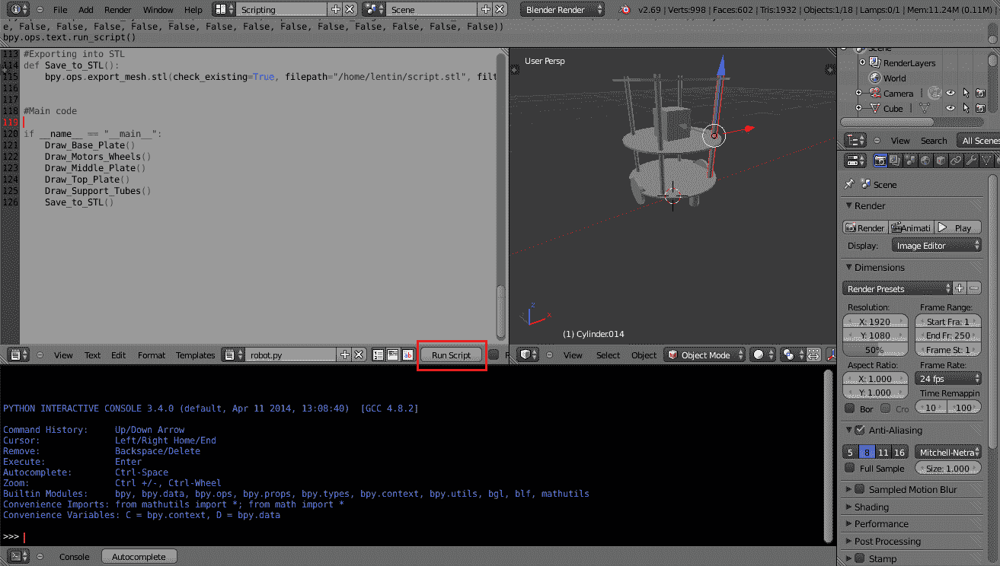

在 Blender 中运行 Python 脚本

1.  `exported.stl` 文件可以用 MeshLab 打开，以下是一个 MeshLab 的截图：

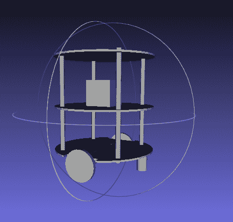

Chefbot 在 MeshLab 中的 3D 模型

# 创建机器人的 URDF 模型

ROS 中的 **机器人模型** 包含用于建模机器人各个方面的软件包，这些方面在 XML 机器人描述格式中指定。此堆栈的核心软件包是 URDF，它解析 URDF 文件并构建机器人的对象模型。

**统一机器人描述格式** (**URDF**) 是一个 XML 规范，用于描述机器人的模型。我们可以使用 URDF 表示机器人的以下特征：

+   机器人的运动学和动力学描述

+   机器人的视觉表示

+   机器人的碰撞模型

机器人的描述由一组 **连杆**（部分）、元素和一组 **关节** 元素组成，这些元素将这些连杆连接在一起。以下代码显示了典型的机器人描述：

```py

<robot name="chefbot"> 
<link> ... </link> 
<link> ... </link> 
<link> ... </link> 

<joint>  ....  </joint> 
<joint>  ....  </joint> 
<joint>  ....  </joint> 
</robot> 
```

如果您想了解更多关于 URDF 的信息，请参考以下链接：

[`wiki.ros.org/urdf`](http://wiki.ros.org/urdf) [`wiki.ros.org/urdf/Tutorials`](http://wiki.ros.org/urdf/Tutorials)

**Xacro**（XML 宏）是一种 XML 宏语言。使用 xacro，我们可以创建更短、更易读的 XML 文件。我们可以将 xacro 与 URDF 结合使用，以简化 URDF 文件。如果我们向 URDF 添加 xacro，我们必须调用额外的解析程序来将 xacro 转换为 URDF。

以下链接将提供有关 xacro 的更多详细信息：

[`wiki.ros.org/xacro`](http://wiki.ros.org/xacro)

**robot_state_publisher** 允许您将机器人的状态发布到 **tf** ([`wiki.ros.org/tf`](http://wiki.ros.org/tf)). 此节点读取名为 **robot_description** 的 URDF 参数，并从名为 **joint_states** 的主题中读取机器人的关节角度作为输入，然后使用机器人的运动学树模型发布机器人连杆的 3D 位姿。该软件包可以用作库和 ROS 节点。该软件包经过良好测试，代码稳定。

+   **世界文件**：这些代表 Gazebo 的环境，必须与机器人模型一起加载。*empty.world* 和 *playground.world* 是一些 Gazebo 世界文件的例子。*empty.world* 只包含一个空的空间。在 *playground.world* 中，环境中将有一些静态物体。我们可以使用 Gazebo 创建自己的 `*.world` 文件。我们将在下一章中进一步介绍 Gazebo 世界文件。

+   **CMakeList.txt 和 package.xml**：这些文件是在创建包的过程中创建的。`CMakeList.txt` 文件有助于在包内构建 ROS C++ 节点或库，而 `package.xml` 文件包含此包的所有依赖项列表。

# 创建 Chefbot 描述 ROS 包

`chefbot_description` 包包含我们机器人的 URDF 模型。在您自己创建此包之前，您可以查看从 `chapter3_codes` 下载的 Chefbot 的已下载包。这将帮助您加快处理速度。

让我们看看如何创建 `chefbot_description` 包。以下步骤将指导您创建此包：

1.  首先，我们需要切换到 `src` 文件夹中的 `chefbot` 文件夹：

```py
    $ cd ~/catkin_ws/src/  
```

1.  以下命令将创建包含依赖项的机器人描述包，例如 `urdf` 和 `xacro`。这将创建 `catkin_ws/src` 文件夹中的 `chefbot_description` 包：

```py
    $ catkin_create_pkgchefbot_descriptioncatkinxacro  
```

1.  将下载的 `chefbot_description` 包中的所有文件夹复制到新的包文件夹中。`meshes` 文件夹包含机器人的 3D 部分，而 `urdf` 文件夹包含具有机器人运动学和动力学模型的 URDF 文件。机器人模型被拆分为几个 xacro 文件，这使得调试更容易，可读性更好。

让我们看看这个包内部每个文件的功能。您可以检查 `chefbot_description` 内部的每个文件。以下图表显示了此包内部的文件：

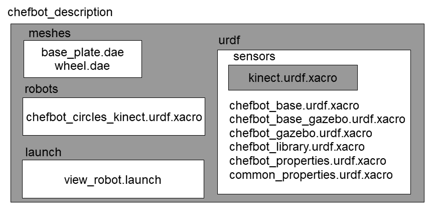*Chefbot 描述包*

包中每个文件的功能如下：

+   `urdf/chefbot.xacro`：这是包含机器人运动学和动力学参数的主要 xacro 文件。

+   `urdf/common_properties.xacro`：此 xacro 文件包含在机器人模型内部使用的某些属性及其值。例如，机器人连杆的不同颜色定义和一些常数。

+   `gazebo/chefbot.gazebo.xacro`：此文件包含机器人的仿真参数。它主要包含 Gazebo 参数和用于执行仿真的插件。这些参数只有在使用此模型启动仿真时才会生效。

+   `launch/upload_model.launch`：此启动文件有一个节点，它基本上解析机器人 xacro 文件并将解析的数据上传到名为 `robot_description` 的 ROS 参数。然后，`robot_description` 参数用于 Rviz 的可视化并在 Gazebo 中用于仿真。如果我们的 xacro 模型有误，则此启动文件将引发错误。

+   `launch/view_model.launch`：此启动文件将上传机器人 URDF 模型并在 Rviz 中查看模型。

+   `launch/view_navigation.launch`：此文件将在 Rviz 中显示 URDF 模型和与导航相关的显示类型。

+   `launch/view_robot_gazebo.launch`：这将启动 Gazebo 中的 URDF 模型并启动所有 Gazebo 插件。

+   `meshes/`：此文件夹包含机器人模型所需的网格。

+   您可以使用 *catkin_make* 命令构建工作空间。

在构建完包之后，我们可以使用以下命令在 Rviz 中启动 Chefbot 模型：

```py
    $ roslaunch chefbot_descriptionview_robot.launch  
```

Rviz 中的机器人模型如下截图所示：

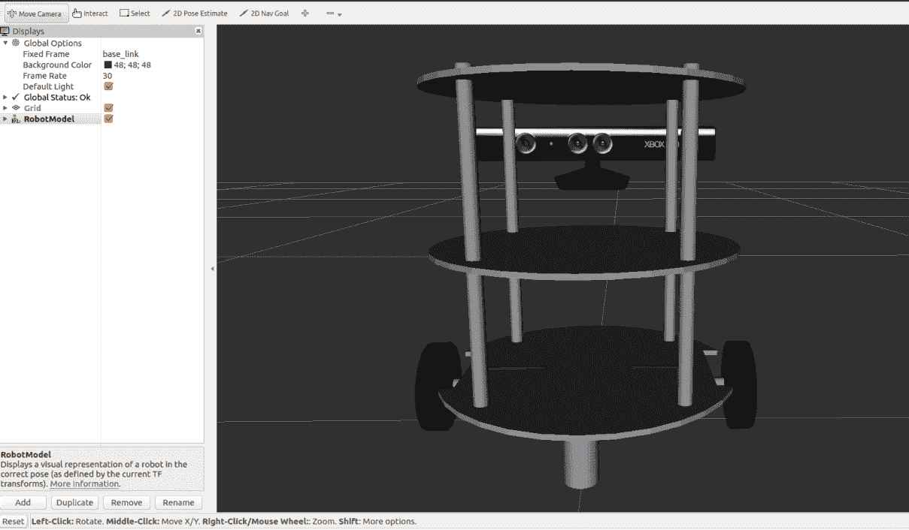

Chefbot URDF 模型在 Rviz 中

这里是用于在 Rviz 中可视化机器人的`view_robot.launch`文件：

```py
<launch> 

<!-- This launch file will parse the URDF model and create robot_description parameter  - -> 

<include file="$(find chefbot_description)/launch/upload_model.launch" /> 

<!-Publish TF from joint states -- > 

<node name="robot_state_publisher" pkg="robot_state_publisher" type="robot_state_publisher" /> 

<!-Start slider GUI for controlling the robot joints -- > 
<node name="joint_state_publisher" pkg="joint_state_publisher" type="joint_state_publisher" args="_use_gui:=True" /> 

<!-Start Rviz with a specific configuration -- > 

<node name="rviz" pkg="rviz" type="rviz" args="-d $(find chefbot_description)/rviz/robot.rviz" /> 

</launch> 
```

这里是`upload_model.launch`的定义。`xacro`命令是用来解析`chefbot.xacro`文件并将其存储到`robot_description`中的：

```py
<launch> 

<!-- Robot description --> 
<param name="robot_description" command="$(find xacro)/xacro --inorder '$(find chefbot_description)/urdf/chefbot.xacro'" /> 

</launch> 
```

我们可以查看`udf/chefbot.xacro`，这是主要的 URDF 模型文件。我们可以看到链接和关节是如何在 xacro 文件中定义的。

以下代码片段显示了机器人 xacro 模型的头文件。它有一个 XML 版本、机器人名称，并包含一些其他 xacro 文件，如`common_properties.xacro`和`chefbot.gazebo.xacro`。之后，我们可以看到在头文件中定义的一些相机属性：

```py
<?xml version="1.0"?> 

<robot name="chefbot" xmlns:xacro="http://ros.org/wiki/xacro"> 

<xacro:include filename="$(find chefbot_description)/urdf/common_properties.xacro" /> 

<xacro:include filename="$(find chefbot_description)/gazebo/chefbot.gazebo.xacro" /> 

<xacro:property name="astra_cam_py" value="-0.0125"/> 
<xacro:property name="astra_depth_rel_rgb_py" value="0.0250" /> 
<xacro:property name="astra_cam_rel_rgb_py"   value="-0.0125" /> 
<xacro:property name="astra_dae_display_scale"   value="0.8" /> 
```

以下代码片段显示了模型中链接和关节的定义：

```py
<link name="base_footprint"/> 

<joint name="base_joint" type="fixed"> 
<origin xyz="0 0 0.0102" rpy="0 0 0" /> 
<parent link="base_footprint"/> 
<child link="base_link" /> 
</joint> 
<link name="base_link"> 
<visual> 
<geometry> 
<!-- new mesh --> 
<mesh filename="package://chefbot_description/meshes/base_plate.dae" /> 
<material name="white"/> 
</geometry> 

   <origin xyz="0.001 0 -0.034" rpy="0 0 ${M_PI/2}"/> 
</visual> 
<collision> 
<geometry> 
<cylinder length="0.10938" radius="0.178"/> 
</geometry> 
<origin xyz="0.0 0 0.05949" rpy="0 0 0"/> 
</collision> 
<inertial> 
<!-- COM experimentally determined --> 
<origin xyz="0.01 0 0"/> 
<mass value="2.4"/><!-- 2.4/2.6 kg for small/big battery pack --> 

<inertia ixx="0.019995" ixy="0.0" ixz="0.0" 
iyy="0.019995" iyz="0.0"  
izz="0.03675" /> 
</inertial> 
</link> 
```

在这段代码中，我们可以看到两个名为`base_footprint`和`base_link`的链接的定义。`base_footprint`链接是一个虚拟链接，意味着它没有任何属性；它只是为了显示机器人的原点。`base_link`是机器人的原点，它具有可视和碰撞属性。我们还可以看到链接被可视化为网格文件。我们还可以在定义中看到链接的惯性参数。关节是两个链接的组合。我们可以在 URDF 中通过提及两个链接和关节的类型来定义一个关节。URDF 中有不同类型的关节可用，例如固定、旋转、连续和滑动。在这个片段中，我们创建了一个固定关节，因为这些框架之间没有运动。

本章主要介绍了 Chefbot URDF 的基础知识。在下一章中，我们将学习更多关于 Chefbot 模拟的内容，并对参数进行解释。

# 摘要

在本章中，我们讨论了 Chefbot 机器人的建模。建模涉及机器人硬件的 2D 和 3D 设计，最终形成 URDF 模型，该模型可用于 ROS。本章从机器人需要满足的各种要求开始，我们看到了如何计算各种设计参数。在计算设计参数后，我们开始设计机器人硬件的 2D 草图。设计使用 LibreCAD，一个免费的 CAD 工具完成。之后，我们使用 Python 脚本在 Blender 中进行了 3D 模型的设计。我们从 Blender 中创建了网格模型，并创建了机器人的 URDF 模型。在创建 URDF 模型后，我们探讨了如何在 Rviz 中可视化机器人。

在下一章中，我们将讨论如何模拟这个机器人并执行映射和定位。

# 问题

1.  机器人建模是什么？它的用途是什么？

1.  2D 机器人模型的目标是什么？

1.  3D 机器人模型的目标是什么？

1.  Python 脚本与手动建模相比的优势是什么？

1.  URDF 文件是什么？它的用途是什么？

# 进一步阅读

要了解更多关于 URDF 和 Xacro 以及 Gazebo 的信息，您可以参考以下书籍：*《精通 ROS 机器人编程 - 第二版》* ([`www.packtpub.com/hardware-and-creative/mastering-ros-robotics-programming-second-edition`](https://www.packtpub.com/hardware-and-creative/mastering-ros-robotics-programming-second-edition))
