# 第六章：将执行器和传感器连接到机器人控制器

在上一章中，我们讨论了构建我们的机器人所需的硬件组件的选择。机器人中的重要组件是执行器和传感器。执行器为机器人提供移动性，传感器提供有关机器人环境的信息。在本章中，我们将专注于我们将要使用的不同类型的执行器和传感器，以及它们如何与德州仪器的 32 位 ARM 微控制器板 Tiva C LaunchPad 连接，该板以 80 MHz 运行。我们将首先讨论执行器。我们将首先讨论的执行器是带编码器的直流齿轮电机。直流齿轮电机使用直流电工作，并具有齿轮减速以降低轴速度并增加最终轴的扭矩。这类电机非常经济，满足我们的机器人设计要求。我们将在我们的机器人原型中使用这种电机。

在本章的第一节中，我们将处理我们机器人驱动系统的设计。我们的机器人**驱动系统**是差速驱动，由两个带编码器的直流齿轮电机和电机驱动器组成。电机驱动器由 Tiva C LaunchPad 控制。我们将查看电机驱动器和四倍频编码器与 Tiva C Launchpad 的接口。之后，我们将查看一些可以替换现有带编码器的直流齿轮电机的最新执行器。如果所需的机器人需要更多的负载和精度，我们必须切换到这类执行器。最后，我们将查看一些常用于机器人的不同传感器。

在本章中，我们将涵盖以下内容：

+   将直流齿轮电机与 Tiva C LaunchPad 连接

+   将四倍频编码器与 Tiva C LaunchPad 连接

+   接口代码的解释

+   连接 Dynamixel 执行器

+   接口超声波传感器和红外接近传感器

+   接口惯性测量单元（IMU）

# 技术要求

您需要必要的机器人硬件组件和已在 Ubuntu 16.04 LTS 上设置的 Energia IDE。

# 将直流齿轮电机连接到 Tiva C LaunchPad

在上一章中，我们选择了 Pololu 的带编码器的直流齿轮电机和德州仪器的嵌入式板，称为 Tiva C LaunchPad。为了将电机与 LaunchPad 连接，我们需要以下组件：

+   两个 Pololu 金属齿轮电机，37Dx73L 毫米，每转 64 个脉冲编码器

+   Pololu 轮子，90x10 毫米和匹配的轮毂

+   Pololu 双 VNH2SP30 电机驱动器模块，MD03A

+   12V 的密封铅酸/锂离子电池

+   一个 3.3V 到 5V 的逻辑电平转换器；访问[`www.sparkfun.com/products/11978`](https://www.sparkfun.com/products/11978)。

+   Tiva C LaunchPad 及其兼容的接口线

以下图示显示了使用 Pololu H-Bridge 的两个电机的接口电路：

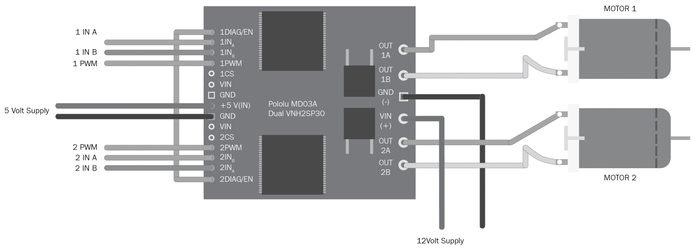

电机接口电路

要与 Launchpad 接口，我们必须在这两个电机之间连接一个电平转换器板。电机驱动器工作在 5V，而 Launchpad 工作在 3.3V，因此我们必须连接一个电平转换器，如下所示：

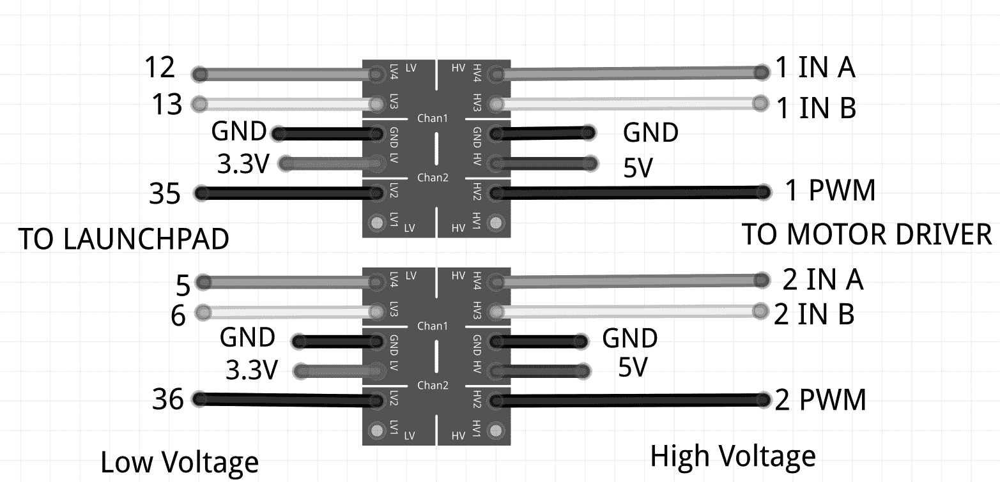

电平转换器电路

两个齿轮式直流电机连接到电机驱动器的**OUT1A**、**OUT1B**和**OUT2A**、**OUT2B**。**VIN (+)**和**GND (-)**是电机的供电电压。这些直流电机可以使用 12V 的电源，因此我们提供 12V 作为输入电压。电机驱动器将支持 5.5V 至 16V 的输入电压范围。

电机驱动器的控制信号/输入引脚位于驱动器的左侧。第一个引脚是**1DIAG/EN**；在大多数情况下，我们让这个引脚处于断开状态。这些引脚在驱动板本身中被外部拉高。这个引脚的主要用途是启用或禁用 H 桥芯片。它还用于监控 H-Bridge IC 的故障状态。引脚**1INA**和**1INB**控制电机的旋转方向。**1PWM**引脚将电机切换到开启和关闭状态。我们使用**PWM**引脚来实现速度控制。**CS**引脚将检测输出电流。它将输出每安培 0.13V 的输出电流。**VIN**和**GND**引脚提供与为电机提供的相同输入电压。我们在这里不使用这些引脚。**+5V(IN)**和**GND**引脚是电机驱动 IC 的电源。电机驱动器和电机的电源是不同的。

以下表格显示了输入和输出组合的真值表：

| INA | INB | DIAGA/ENA | DIAGB/ENB | OUTA | OUTB | CS | 操作模式 |
| --- | --- | --- | --- | --- | --- | --- | --- |
| 1 | 1 | 1 | 1 | H | H | 高阻抗 | 制动到 Vcc |
| 1 | 0 | 1 | 1 | H | L | Isense = Iout / K | 顺时针（CW） |
| 0 | 1 | 1 | 1 | L | H | Isense = Iout / K | 逆时针（CCW） |
| 0 | 0 | 1 | 1 | L | L | 高阻抗 | 断路器到 GND |

**DIAG/EN**引脚的值始终为高，因为这些引脚在驱动板本身中被外部拉高。使用上述信号组合，我们可以使机器人向任何方向移动，并通过调整 PWM 信号，我们还可以调整电机的速度。这是使用 H 桥电路控制直流电机的基本逻辑。

在将电机连接到 Launchpad 时，我们可能需要一个电平转换器。这是因为 Launchpad 的输出引脚只能提供 3.3V，但电机驱动器需要 5V 来触发；因此，我们必须将 3.3V 连接到 5V 逻辑电平转换器以开始工作。

两个电机以差动驱动机制工作。以下部分将讨论差动驱动及其操作。

# 差动轮式机器人

我们设计的机器人是一个差速轮式/驱动机器人。在差速轮式机器人中，运动基于放置在机器人身体两侧的两个单独驱动的轮子。它可以通过改变轮子的相对转速来改变方向，因此不需要额外的转向运动。为了平衡机器人，可以添加一个自由旋转的轮子或万向轮。以下图显示了差速驱动的典型表示：

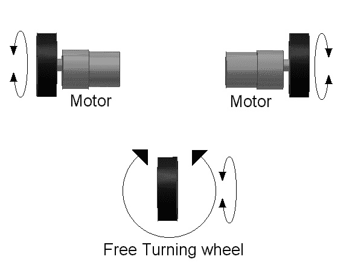

差速轮式机器人

如果两个电机方向相同，机器人将向前或向后移动。如果一个电机的速度比另一个电机快，那么机器人将转向较慢的电机一侧；因此，要向左转，停止左侧电机并移动右侧电机。以下图显示了我们在机器人中连接两个电机的方式。两个电机安装在底板相对两侧，我们在机器人的前后放置两个万向轮以平衡：

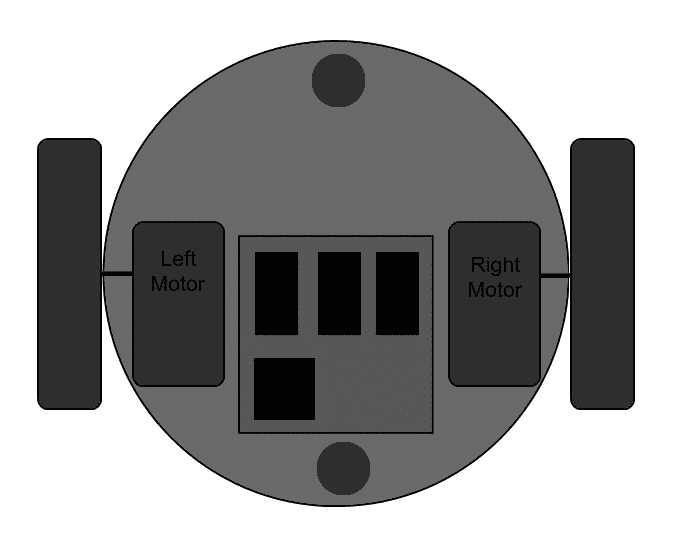

机器人底部的俯视图

接下来，我们可以根据真值表数据使用 Launchpad 编程电机控制器。编程使用一个名为 **Energia** 的 IDE 完成 ([`energia.nu/`](http://energia.nu/))。我们使用 C++ 语言编程 Launchpad，这与 Arduino 板非常相似 ([`energia.nu/Reference_Index.html`](http://energia.nu/Reference_Index.html))。

# 安装 Energia IDE

您可以从以下链接下载 Energia 的最新版本：

[`energia.nu/download/`](http://energia.nu/download/)

我们将主要在 Ubuntu 16.04 LTS，64 位系统上讨论安装过程。我们将使用的 Energia 版本是 0101E0018：

1.  从前面的链接下载 Linux 64 位 Energia。

1.  将 Energia 压缩文件解压缩到用户的 Home 文件夹中。

1.  设置 Tiva C Launchpad 板的说明在以下链接中给出：[`energia.nu/guide/guide_linux/`](http://energia.nu/guide/guide_linux/)

1.  您必须从以下链接下载 `71-ti-permissions.rules` 文件：[`energia.nu/files/71-ti-permissions.rules`](http://energia.nu/files/71-ti-permissions.rules)

1.  规则文件将授予用户对 Launchpad 板的读写权限。您必须将文件保存为 71-ti-permissions.rules，并从当前路径执行以下命令以将规则文件复制到系统文件夹以获取权限：

```py
$ sudo mv 71-ti-permissions.rules /etc/udev/rules.d/
```

1.  在复制文件后，执行以下命令以激活规则：

```py
$ sudo service udev restart
```

1.  您现在可以将 Tiva C Launchpad 连接到您的 PC，并在 Linux 终端中执行 `dmesg` 命令以查看 Linux 内核日志。如果已创建，则串行端口设备将显示在消息的末尾，如下面的截图所示：

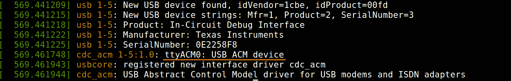

机器人底部的俯视图

1.  如果您可以看到串行端口设备，则可以在文件夹内使用以下命令启动 Energia：

```py
    $./energia  
```

以下截图显示了 Energia IDE：


Energia 集成开发环境

现在，我们必须在 IDE 中选择 tm4c123 板来编译针对该板的特定代码。为此，我们必须安装该板的包。你可以选择工具 | 板 | 板管理器来安装包。

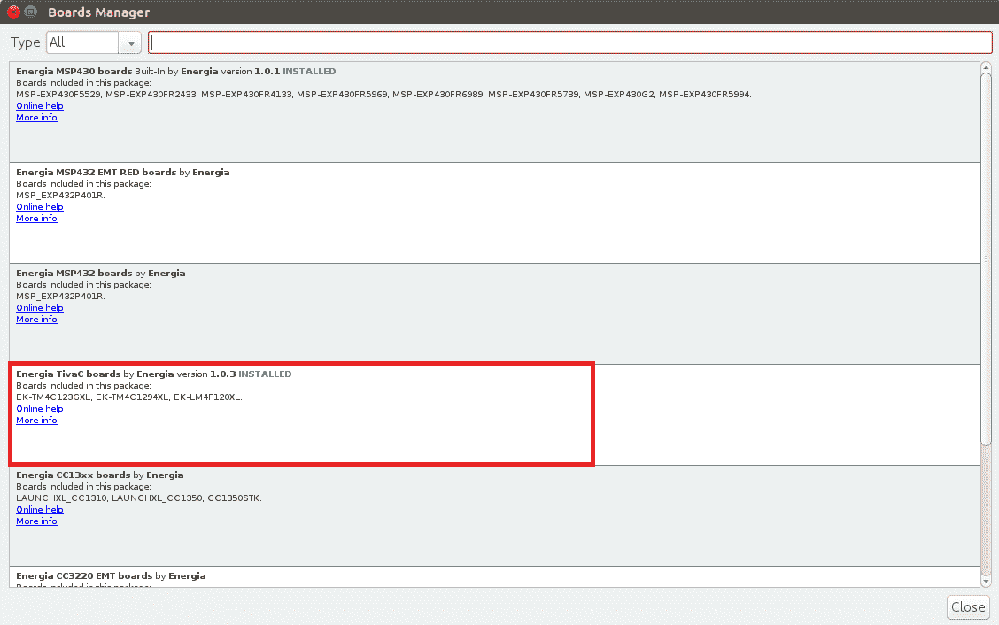

Energia 板管理器

1.  安装完包之后，你可以通过导航到工具 | 板 | Launchpad (Tiva C) w/tm4c123 (80MHz) 来选择板，如下面的截图所示：

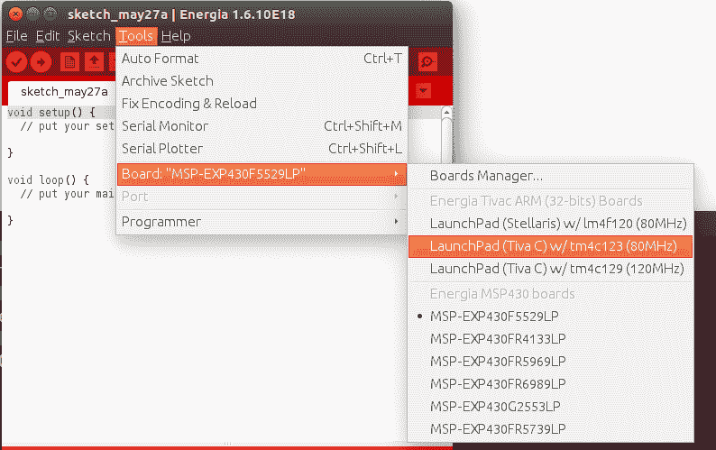

Energia 板选择

1.  然后，通过导航到工具 | 串行端口 | /dev/ttyACM0 来选择串行端口，如下面的截图所示：


Energia 串行端口选择

1.  通过使用上传按钮来编译和上传代码。上传按钮将执行这两个过程。以下截图展示了成功上传的情况：

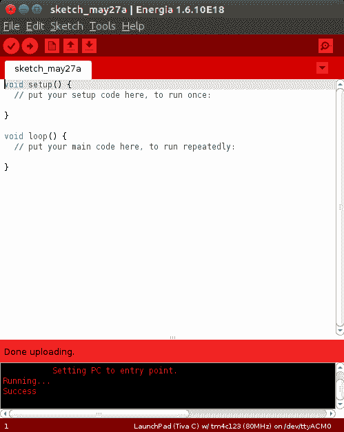

Energia 串行端口选择

访问以下链接以在 Linux、macOS X 和 Windows 上安装 Energia：

+   请参考[`energia.nu/guide/guide_linux/`](http://energia.nu/guide/guide_linux/)获取 Linux 的指南。

+   请参考[`energia.nu/Guide_MacOSX.html`](http://energia.nu/Guide_MacOSX.html)获取 macOS X 的指南。

+   请参考[`energia.nu/Guide_Windows.html`](http://energia.nu/Guide_Windows.html)获取 Windows 的指南。

# 电机接口代码

以下 Energia 代码可以用来测试差动驱动配置中的两个电机。此代码可以使机器人向前移动 5 秒，然后向后移动 5 秒。然后，机器人向左移动 5 秒，向右移动 5 秒。每次移动后，机器人将停止 1 秒。

在代码的开始部分，我们定义了两个电机的 INA、INB 和 PWM 引脚，如下所示：

```py
///Left Motor  Pins 
#define INA_1 12 
#define INB_1 13 
#define PWM_1 PC_6 

///Right Motor Pins 
#define INA_2 5 
#define INB_2 6 
#define PWM_2 PC_5 
```

Launchpad 的引脚布局信息可在以下链接找到：[`energia.nu/pin-maps/guide_tm4c123launchpad/`](http://energia.nu/pin-maps/guide_tm4c123launchpad/)

以下代码展示了移动机器人向前、向后、向左和向右的五个函数。第五个函数是停止机器人。我们将使用`digitalWrite()`函数将数字值写入引脚。`digitalWrite()`的第一个参数是引脚号，第二个参数是要写入引脚的值。该值可以是`HIGH`或`LOW`。我们将使用`analogWrite()`函数将 PWM 值写入引脚。该函数的第一个参数是引脚号，第二个是 PWM 值。此值的范围是 0-255。在高 PWM 下，电机驱动器将快速切换，速度更快。在低 PWM 下，电机驱动器内部的切换将较慢，因此电机也会较慢。目前，我们正在全速运行：

```py
void move_forward() 
{ 
    //Setting CW rotation to and Left Motor  and CCW to Right Motor  
    //Left Motor  
    digitalWrite(INA_1,HIGH); 
    digitalWrite(INB_1,LOW); 
    analogWrite(PWM_1,255); 
    //Right Motor  
    digitalWrite(INA_2,LOW); 
    digitalWrite(INB_2,HIGH); 
    analogWrite(PWM_2,255);   
} 

/////////////////////////////////////////////////////// 

void move_left() 
{ 
    //Left Motor  
    digitalWrite(INA_1,HIGH); 
    digitalWrite(INB_1,HIGH); 
    analogWrite(PWM_1,0); 
    //Right Motor  
    digitalWrite(INA_2,LOW); 
    digitalWrite(INB_2,HIGH); 
    analogWrite(PWM_2,255);   
} 

////////////////////////////////////////////////////// 

void move_right() 
{ 
      //Left Motor  
      digitalWrite(INA_1,HIGH); 
      digitalWrite(INB_1,LOW); 
      analogWrite(PWM_1,255); 
      //Right Motor  
      digitalWrite(INA_2,HIGH); 
      digitalWrite(INB_2,HIGH); 
      analogWrite(PWM_2,0);   
} 

//////////////////////////////////////////////////////// 

void stop() 
{ 
    //Left Motor  
    digitalWrite(INA_1,HIGH); 
    digitalWrite(INB_1,HIGH); 
    analogWrite(PWM_1,0); 
    //Right Motor  
    digitalWrite(INA_2,HIGH); 
    digitalWrite(INB_2,HIGH); 
    analogWrite(PWM_2,0);   
} 

///////////////////////////////////////////////// 

void move_backward() 

{ 
    //Left Motor  
    digitalWrite(INA_1,LOW); 
    digitalWrite(INB_1,HIGH); 
    analogWrite(PWM_1,255); 
    //Right Motor  
    digitalWrite(INA_2,HIGH); 
    digitalWrite(INB_2,LOW); 
    analogWrite(PWM_2,255);   
} 
```

我们首先将两个电机的`INA`和`INB`引脚设置为`OUTPUT`模式，这样我们就可以向这些引脚写入`HIGH`或`LOW`值。`pinMode()`函数用于设置 I/O 引脚的模式。`pinMode()`的第一个参数是引脚号，第二个参数是模式。我们可以将引脚设置为输入或输出。要将引脚设置为输出，将`OUTPUT`作为第二个参数；要将其设置为输入，将`INPUT`作为第二个参数，如下面的代码所示。不需要将 PWM 引脚设置为输出，因为`analogWrite()`在写入 PWM 信号时不需要设置`pinMode()`：

```py
void setup() 
{ 
   //Setting Left Motor pin as OUTPUT 
    pinMode(INA_1,OUTPUT);  
    pinMode(INB_1,OUTPUT); 
    pinMode(PWM_1,OUTPUT); 

   //Setting Right Motor pin as OUTPUT 
    pinMode(INA_2,OUTPUT); 
    pinMode(INB_2,OUTPUT); 
    pinMode(PWM_2,OUTPUT);   
} 
```

以下代码片段是代码的主循环。它将在`5`秒内调用每个函数，例如`前进()`、`后退()`、`向左移动()`和`向右移动()`。调用每个函数后，机器人将停止`1`秒：

```py
void loop() 
{ 
  //Move forward for 5 sec 
move_forward(); 
delay(5000); 
  //Stop for 1 sec 
stop(); 
delay(1000); 

  //Move backward for 5 sec 
move_backward(); 
delay(5000); 
  //Stop for 1 sec 
stop(); 
delay(1000); 

  //Move left for 5 sec 
move_left(); 
delay(5000); 
  //Stop for 1 sec 
stop(); 
delay(1000); 

  //Move right for 5 sec 
move_right(); 
delay(5000);   
  //Stop for 1 sec 
stop(); 
delay(1000); 
} 
```

# 将正交编码器与 Tiva C Launchpad 连接

轮编码器是附着在电机上以感应轮子旋转次数的传感器。如果我们知道旋转次数，我们可以计算出轮子的速度和位移。

对于这个机器人，我们选择了一个内置编码器的电机。这个编码器是正交类型，可以感应电机的方向和速度。编码器使用不同类型的传感器，如光传感器和霍尔传感器，来检测这些参数。这个编码器使用霍尔效应来感应旋转。正交编码器有两个通道，即**通道 A**和**通道 B**。每个通道将生成带有 90 度相位差的数字信号。以下图显示了典型正交编码器的波形：

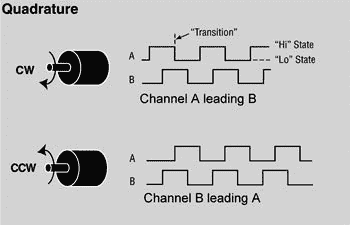

正交编码器波形

如果电机按顺时针方向旋转，**通道 A**将领先**通道 B**，如果电机按逆时针方向旋转，**通道 B**将领先**通道 A**。这个读数将有助于感应电机的旋转方向。以下部分讨论了如何将编码器输出转换为有用的测量，例如位移和速度。

# 处理编码器数据

编码器数据是两个通道的脉冲输出，相位差为 90 度。使用这些数据，我们可以找到旋转方向和电机旋转了多少次，从而找到位移和速度。

指定编码器分辨率的某些术语是**每转脉冲数**（**PPR**）或**每转线数**（**LPR**）和**每转计数**（**CPR**）。PPR 指定在电机最终轴的一转中会有多少个电脉冲（0 到 1 的转换）。一些制造商使用 CPR 而不是 PPR 的名称，因为每个脉冲将包含两个边沿（上升和下降）并且有两个脉冲通道（A 和 B）具有 90 度的相位差；总边沿数将是 PPR 数量的四倍。大多数四倍频接收器使用所谓的 4X 解码来计算来自编码器 A 和 B 通道的所有边沿，从而提供比原始 PPR 值高 4 倍的分辨率。

在我们的电机中，Pololu 指定电机轴的 CPR 为 64，这对应于变速箱输出轴的 8,400 CPR。实际上，当电机的最终轴完成一次旋转时，我们从变速箱输出轴获得 8,400 个计数。以下图表显示了我们可以如何从编码器脉冲计算计数：

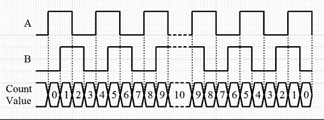

带计数值的编码器脉冲

在这个编码器规范中，给出了每转的计数；它是通过编码器通道边沿转换计算得出的。编码器通道的一个脉冲对应于四个计数。因此，为了在我们的电机中获得 8,400 个计数，PPR 将是*8,400 / 4 = 2,100*。从前面的图表中，我们将能够计算出每转的计数数，但我们还需要检测运动方向。这是因为无论机器人是向前还是向后移动，我们得到的计数都将相同；因此，检测方向对于解码信号非常重要。以下图表显示了我们可以如何解码编码器脉冲：

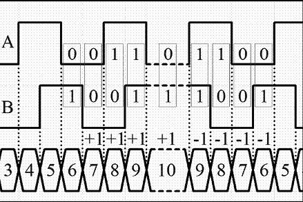

从编码器脉冲检测电机方向

如果我们观察代码模式，我们可以理解它遵循 2 位格雷码。格雷码是数字的编码，使得相邻的数字只有一个数字不同，差值为 1。格雷码([`en.wikipedia.org/wiki/Gray_code`](http://en.wikipedia.org/wiki/Gray_code))在旋转编码器中常用于高效的编码。

我们可以通过状态转换预测电机的旋转方向。状态转换表如下：

| 状态 | 顺时针转换 | 逆时针转换 |
| --- | --- | --- |
| 0,0 | 0,1 到 0,0 | 1,0 到 0,0 |
| 1,0 | 0,0 到 1,0 | 1,1 到 1,0 |
| 1,1 | 1,0 到 1,1 | 0,1 到 1,1 |
| 0,1 | 1,1 到 0,1 | 0,0 到 0,1 |

如果我们用状态转换图来表示它，将会更方便：

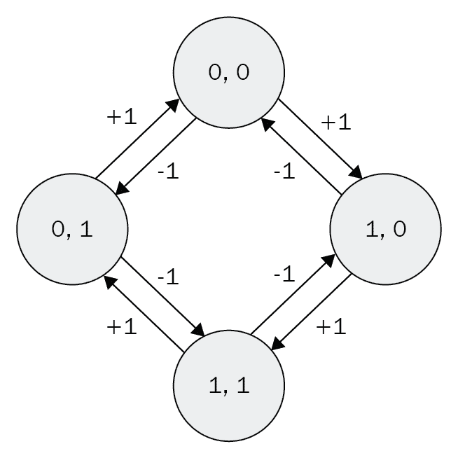

编码器的状态转换图

在获取这个格雷码后，我们可以使用微控制器处理脉冲。电机通道引脚必须连接到微控制器的中断引脚。因此，当通道有边缘转换时，它将在引脚上生成中断或触发，如果该引脚上有任何中断到达，微控制器程序中将执行一个中断服务例程，或者简单地是一个函数。它可以读取两个引脚的当前状态。根据引脚的当前状态和先前值，我们可以确定旋转方向，并决定是否需要增加或减少计数。这是编码器处理的基本逻辑。

在获取计数后，我们可以使用*Angle = (Count Value / CPR) * 360*来计算旋转角度（以度为单位）。在这里，如果我们用 8,400 代替 CPR，方程变为*Angle = 0.04285 * Count Value*；也就是说，为了转动一度，需要接收 24 个计数或六个编码通道脉冲。

以下图显示了单个电机编码器与 Tiva C LaunchPad 的接口电路：

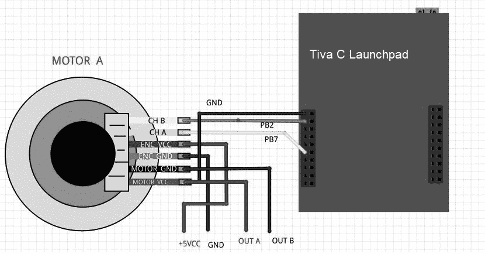

将编码器连接到 Launchpad

从上面的图中，你可以找到电机引脚 CH A 和 CH B，它们是电机编码器的输出。这些引脚连接到 Tiva C Launchpad 的 PB2 和 PB7 引脚。引脚 ENC VCC 和 ENC GND 是编码器的电源引脚，因此我们必须为这些引脚提供+5V 和 GND。下一组引脚用于为电机供电。MOTOR VCC 和 MOTOR GND 标记为 OUTA 和 OUTB，它们直接连接到电机驱动器，以控制电机速度。

编码器输出脉冲的最大电压等级在 0V 到 5V 之间。在这种情况下，我们可以直接将编码器与 Launchpad 接口，因为它可以接收高达 5V 的输入，或者我们可以使用一个 3.3V 到 5V 的电平转换器，就像我们之前用于电机驱动器接口时使用的那样。

在下一部分，我们将上传代码到 Energia 以测试四倍频编码器信号。我们需要检查是否从编码器获得了正确的计数。

# 四倍频编码器接口代码

此代码将通过串行端口打印左右电机编码器的计数。这两个编码器采用 2X 解码方案，因此我们将获得 4,200 CPR。在代码的第一部分，我们定义了两个编码器的两个通道输出引脚，并声明了两个编码器的计数变量。编码器变量在数据类型之前使用了一个`volatile`关键字。`volatile`的主要用途是带有`volatile`关键字的变量将存储在 RAM 内存中，而普通变量存储在 CPU 寄存器中。编码器值会非常快地变化，因此使用普通变量将不会准确。为了获得准确性，我们将使用`volatile`来声明编码器变量，如下所示：

```py
//Encoder pins definition 

// Left encoder 

#define Left_Encoder_PinA 31 
#define Left_Encoder_PinB 32 

volatile long Left_Encoder_Ticks = 0; 

//Variable to read current state of left encoder pin 
volatile bool LeftEncoderBSet; 

//Right Encoder 

#define Right_Encoder_PinA 33 
#define Right_Encoder_PinB 34 
volatile long Right_Encoder_Ticks = 0; 
//Variable to read current state of right encoder pin 
volatile bool RightEncoderBSet; 
```

以下代码片段是`setup()`函数的定义。在 Energia 中，`setup()`是一个用于初始化和执行变量和函数的一次性执行的内置函数。在`setup()`内部，我们使用波特率为`115200`初始化串行数据通信，并调用用户定义的`SetupEncoders()`函数来初始化编码器引脚。串行数据通信主要用于通过串行终端检查编码器计数：

```py
void setup() 
{ 
    //Init Serial port with 115200 buad rate 
  Serial.begin(115200);   
  SetupEncoders(); 
} 
```

`SetupEncoders()`的定义在下面的代码中给出。为了接收编码器脉冲，我们需要在 Launchpad 上使用两个引脚作为输入。将编码器引脚配置为 Launchpad 的输入并激活其上拉电阻。`attachInterrupt()`函数将配置编码器引脚之一为中断。`attachInterrupt()`函数有三个参数。第一个参数是引脚号，第二个参数是**中断服务例程**（**ISR**），第三个参数是中断条件，即中断必须触发 ISR 的条件。在这段代码中，我们正在配置左右编码器引脚的`PinA`作为中断；当脉冲上升时，它将调用 ISR：

```py
void SetupEncoders() 
{ 
  // Quadrature encoders 
  // Left encoder 
  pinMode(Left_Encoder_PinA, INPUT_PULLUP); 
  // sets pin A as input   
  pinMode(Left_Encoder_PinB, INPUT_PULLUP); 
  // sets pin B as input 
  attachInterrupt(Left_Encoder_PinA, do_Left_Encoder, RISING); 

  // Right encoder 
  pinMode(Right_Encoder_PinA, INPUT_PULLUP); 
  // sets pin A as input 
  pinMode(Right_Encoder_PinB, INPUT_PULLUP); 
  // sets pin B as input 

  attachInterrupt(Right_Encoder_PinA, do_Right_Encoder, RISING); 
} 
```

以下代码是 Energia 中的内置`loop()`函数。`loop()`函数是一个无限循环，我们将主要代码放在其中。在这段代码中，我们调用`Update_Encoders()`函数通过串行终端连续打印编码器值：

```py
void loop() 
{ 
  Update_Encoders();                        
} 
```

以下代码是`Update_Encoders()`函数的定义。它在一行中打印两个编码器值，以字符`e`开头，值之间用制表符分隔。`Serial.print()`函数是一个内置函数，它将打印作为参数给出的字符/字符串：

```py
void Update_Encoders() 
{ 
  Serial.print("e"); 
  Serial.print("t"); 
  Serial.print(Left_Encoder_Ticks); 
  Serial.print("t"); 
  Serial.print(Right_Encoder_Ticks); 
  Serial.print("n"); 
 } 
```

以下代码是左右编码器的 ISR 定义。当检测到每个引脚上的上升沿时，将调用其中一个 ISR。当前的中断引脚是每个编码器的`PinA`。在获取中断后，我们可以假设上升的`PinA`处于较高值状态，因此不需要读取该引脚。读取两个编码器的`PinB`并将引脚状态存储到`LeftEncoderBSet`或`RightEncoderBSet`中。将当前状态与`PinB`的先前状态进行比较，可以检测方向并根据状态转换表决定计数是否需要增加或减少：

```py
void do_Left_Encoder() 
{ 
  LeftEncoderBSet = digitalRead(Left_Encoder_PinB); 
  // read the input pin 
  Left_Encoder_Ticks -= LeftEncoderBSet ? -1 : +1; 
} 

void do_Right_Encoder() 
{ 
  RightEncoderBSet = digitalRead(Right_Encoder_PinB); 
  // read the input pin 
  Right_Encoder_Ticks += RightEncoderBSet ? -1 : +1; 
} 
```

在 Energia 中上传草图并使用串行监视器查看输出。转到工具 | 串行监视器。手动移动两个电机，你会看到计数在变化。在串行监视器中设置波特率，它与代码中初始化的波特率相同；在这种情况下，为**115200**。输出将如下所示：

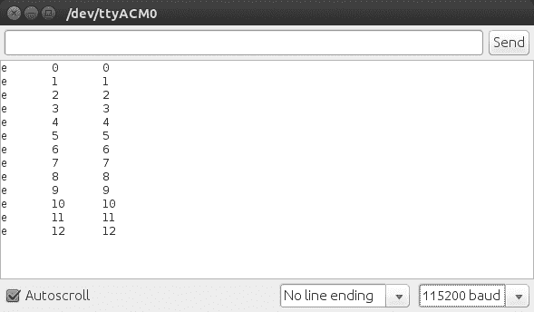

将编码器连接到 Launchpad

如果我们想将机器人升级为高精度和高负载，我们必须考虑高质量的执行器，如 Dynamixel。Dynamixel 伺服电机是智能执行器，具有内置的 PID 控制和监控伺服电机和编码器参数，如扭矩、位置等。在这个机器人中，我们没有使用 Dynamixel。

# 与 Dynamixel 执行器一起工作

**Dynamixel**是韩国制造商 ROBOTIS 开发的一种用于机器人的网络化执行器。由于其多功能扩展能力、功率反馈功能、位置、速度、内部温度、输入电压等，它被公司、大学和爱好者广泛使用。

Dynamixel 伺服电机可以串联连接；这是一种以串行方式连接设备的方法，通过连接的设备将一个设备连接到另一个设备，并可以从一个控制器控制所有连接的伺服电机。Dynamixel 伺服电机通过 RS485 或 TTL 通信。可用的 Dynamixel 伺服电机列表可在[`www.robotis.com/xe/dynamixel_en`](http://www.robotis.com/xe/dynamixel_en)找到。

Dynamixel 的接口非常简单。Dynamixel 附带一个名为 USB2Dyanmixel 的控制器，它将 USB 转换为与 Dynamixel 兼容的 TTL/RS485 电平。以下图显示了 Dynamixel 的接口图：

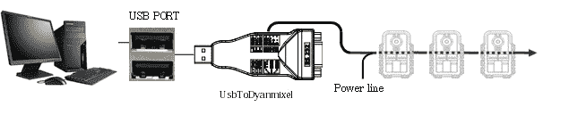

将 Dynamixel 执行器连接到 PC

ROBOTIS 提供了 Dynamixel SDK 以访问电机寄存器；我们可以读取和写入 Dynamixel 寄存器的值并检索数据，例如位置、温度、电压等。

设置 USB2Dynamixel 和 Dynamixel SDK 的说明可在[support.robotis.com/en/](http://support.robotis.com/en/)找到。

Dynamixel 可以使用 Python 库进行编程。用于处理 Dynamixel 伺服电机的 Python 库之一是**pydynamixel**。此包适用于 Windows 和 Linux。Pydynamixel 将支持 RX、MX 和 EX 系列伺服电机。

我们可以从[`pypi.python.org/pypi/dynamixel/`](https://pypi.python.org/pypi/dynamixel/)下载 pydynamixel Python 包。

下载包并将其解压到`home`文件夹。打开终端/DOS 提示符并执行以下命令：

```py
    sudo python setup.py install   
```

安装完包后，我们可以尝试以下 Python 示例，该示例将检测连接到 USB2Dynamixel 的伺服电机，并将一些随机位置写入伺服电机。此示例适用于 RX 和 MX 伺服电机：

```py
#!/usr/bin/env python 
```

以下代码将导入此示例所需的必要 Python 模块。这包括 Dynamixel Python 模块：

```py
import os 
import dynamixel 
import time 
import random 
```

以下代码定义了 Dynamixel 通信参数所需的主要参数。`nServos`变量表示连接到总线的 Dynamixel 伺服电机的数量。`portName`变量指示连接到 USB2Dynamixel 的串行端口。`baudRate`变量是 USB2Dynamixel 和 Dynamixel 的通信速度：

```py
# The number of Dynamixels on our bus. 
nServos = 1 

# Set your serial port accordingly. 
if os.name == "posix": 
    portName = "/dev/ttyUSB0" 
else: 
    portName = "COM6" 

# Default baud rate of the USB2Dynamixel device. 
baudRate = 1000000 
```

以下代码是 Dynamixel Python 函数，用于连接到 Dynamixel 伺服电机。如果连接成功，程序将打印它并扫描通信总线，从 ID `1`到`255`查找伺服电机的数量。伺服 ID 是每个伺服电机的标识。我们给定的`nServos`为`1`，因此在一台伺服电机连接到总线后，扫描将停止：

```py
# Connect to the serial port 
print "Connecting to serial port", portName, '...', 
serial = dynamixel.serial_stream.SerialStream( port=portName, baudrate=baudRate, timeout=1) 
print "Connected!" 
net = dynamixel.dynamixel_network.DynamixelNetwork( serial ) 
net.scan( 1, nServos ) 
```

以下代码将 Dynamixel ID 和伺服对象追加到`myActutors`列表中。我们可以使用伺服 ID 和伺服对象将伺服值写入每个伺服电机。我们可以使用`myActutors`列表进行进一步处理：

```py
# A list to hold the dynamixels 
myActuators = list() 
print myActuators 

This will create a list for storing  dynamixel actuators details. 

print "Scanning for Dynamixels...", 
for dyn in net.get_dynamixels(): 
    print dyn.id, 
    myActuators.append(net[dyn.id]) 
print "...Done" 
```

以下代码将随机将 450 到 600 之间的位置写入总线上的每个 Dynamixel 执行器。Dynamixel 的位置范围是 0 到 1,023。这将设置伺服参数，如`速度`、`扭矩`、`扭矩限制`、`最大扭矩`等：

```py
# Set the default speed and torque 
for actuator in myActuators: 
    actuator.moving_speed = 50 
    actuator.synchronized = True 
    actuator.torque_enable = True 
    actuator.torque_limit = 800 
    actuator.max_torque = 800 
```

以下代码将打印当前执行器的当前位置：

```py
# Move the servos randomly and print out their current positions 
while True: 
    for actuator in myActuators: 
        actuator.goal_position = random.randrange(450, 600) 
    net.synchronize() 
```

以下代码将读取执行器的所有数据：

```py
    for actuator in myActuators: 
        actuator.read_all() 
        time.sleep(0.01) 

    for actuator in myActuators: 
        print actuator.cache[dynamixel.defs.REGISTER['Id']], actuator.cache[dynamixel.defs.REGISTER['CurrentPosition']] 

    time.sleep(2) 
```

# 使用超声波距离传感器

移动机器人的一项重要能力是导航。理想的导航意味着机器人可以从当前位置规划路径到目的地，并且可以无障碍物地移动。在这个机器人中，我们使用超声波距离传感器来检测使用 Kinect 传感器无法检测到的近处物体。Kinect 和超声波声传感器的组合为这个机器人提供了理想的碰撞避免功能。

超声波距离传感器以以下方式工作。发射器将发送一种人类耳朵无法听到的超声波。在发送超声波后，它将等待发射波的回声。如果没有回声，这意味着机器人的前方没有障碍物。如果接收传感器接收到任何回声，接收器上会产生一个脉冲，它可以计算出波到达物体并返回接收传感器的总时间。如果我们得到这个时间，我们可以使用以下公式计算出障碍物的距离：

*声音速度 * 时间经过 / 2 = 物体距离*。

这里，声音速度可以取为 340 m/s。

大多数超声波距离传感器的距离范围从 2 厘米到 400 厘米。在这个机器人中，我们使用一个名为 HC-SR04 的传感器模块。我们来看看如何将 HC-SR04 与 Tiva C LaunchPad 接口，以获取障碍物的距离。

# 将 HC-SR04 接口到 Tiva C LaunchPad

以下图示说明了 HC-SR04 超声波声传感器与 Tiva C LaunchPad 的接口电路：

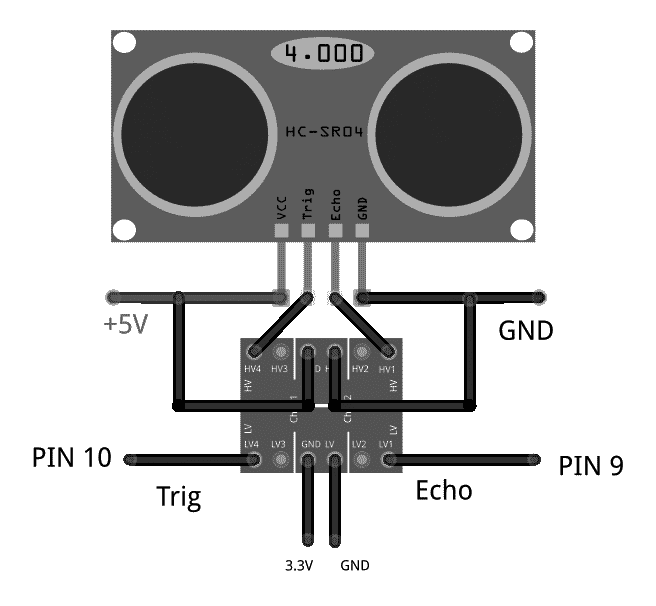

将超声波声传感器接口到 Launchpad

超声波传感器的工作电压为 5V，该传感器的输入/输出也是 5V，因此我们需要在**Trig**和**Echo**引脚上使用电平转换器以与**3.3V**级别的 Launchpad 接口。在电平转换器中，我们需要应用高电压，即 5V，和低电压，即 3.3V，如图所示，以在两个电平之间切换。**Trig**和**Echo**引脚连接在电平转换器的高电压侧，而低电压侧的引脚连接到 Launchpad。**Trig**引脚和**Echo**连接到 Launchpad 的第 10 和第 9 引脚。接口传感器后，我们可以看到如何编程这两个 I/O 引脚。

# HC-SR04 的工作原理

每个引脚上波形的时间如图所示。我们需要向触发输入应用一个短暂的 10 µs 脉冲以开始测距，然后模块将发送一个 40 KHz 的八周期超声波脉冲并提升其回声。回声是一个距离对象，其脉冲宽度和范围成比例。你可以通过以下公式计算范围，即使用发送触发信号和接收回声信号之间的时间间隔：

*距离 = 回声引脚输出高电平时间 * 速度（340 M/S）/ 2*。

在每个触发之前使用 60 毫秒的延迟将更好地避免触发和回声之间的重叠：

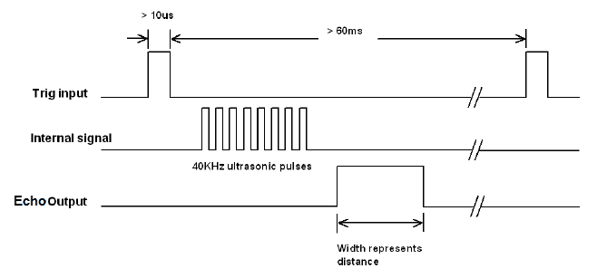

超声波传感器的输入和输出波形

# Tiva C Launchpad 的接口代码

以下为 Launchpad 的 Energia 代码读取超声波传感器的值，并通过串行端口监控这些值。

以下代码定义了用于处理超声波回声和触发引脚的 Launchpad 引脚，并定义了脉冲持续时间和距离（厘米）的变量：

```py
const int echo = 9, Trig = 10; 
long duration, cm; 
```

以下代码片段是`setup()`函数。当程序启动时，会调用`setup()`函数。使用这个函数来初始化变量、设置引脚模式、开始使用库等。`setup()`函数将在每次上电或重置 Launchpad 板后只运行一次。在`setup()`函数内部，我们使用 115200 波特率初始化串行通信，并通过调用`SetupUltrasonic();function:`来设置超声波处理引脚的模式：

```py
void setup() 
{ 

  //Init Serial port with 115200 baud rate 
  Serial.begin(115200);   
  SetupUltrasonic();   
} 
```

以下是为超声波传感器设置的 setup 函数；它将`Trigger`引脚配置为`OUTPUT`，将`Echo`引脚配置为`INPUT`。使用`pinMode()`函数将引脚设置为`INPUT`或`OUTPUT`：

```py
void SetupUltrasonic() 
{ 
 pinMode(Trig, OUTPUT); 
 pinMode(echo, INPUT);  

} 
```

创建`setup()`函数后，初始化并设置初始值，`loop()`函数将精确地执行其名称所暗示的操作，并连续循环，允许你的程序进行更改和响应。使用它来主动控制 Launchpad 板。

以下代码是该主循环。这个函数是一个无限循环，并调用`Update_Ultra_Sonic()`函数来更新并通过串行端口打印超声波读数：

```py
void loop() 
{ 
    Update_Ultra_Sonic(); 
    delay(200); 
} 
```

以下代码是`Update_Ultra_Sonic()`函数的定义。此函数将执行以下操作。首先，它将触发引脚设置为`LOW`状态 2 微秒，然后设置为`HIGH`状态 10 微秒。在 10 微秒后，它将再次将引脚返回到`LOW`状态。这是根据时序图的。我们已经看到 10 µs 是触发脉冲宽度。

在触发 10 µs 后，我们必须从 Echo 引脚读取时间持续时间。时间持续时间是声音从传感器到物体再从物体到传感器接收器传播的时间。我们可以通过使用`pulseIn()`函数来读取脉冲持续时间。在获得时间持续时间后，我们可以使用`microsecondsToCentimeters()`函数将其转换为厘米，如下面的代码所示：

```py
void Update_Ultra_Sonic() 
{ 
  digitalWrite(Trig, LOW); 
  delayMicroseconds(2); 
  digitalWrite(Trig, HIGH); 
  delayMicroseconds(10); 
  digitalWrite(Trig, LOW); 

  duration = pulseIn(echo, HIGH); 
  // convert the time into a distance 
  cm = microsecondsToCentimeters(duration); 

  //Sending through serial port 
  Serial.print("distance="); 
  Serial.print("t"); 
  Serial.print(cm); 
  Serial.print("n"); 

} 
```

以下代码是将微秒转换为厘米距离的转换函数。声速是 340 m/s，即每厘米 29 微秒。因此，我们通过将总微秒数除以 29/2 来得到总距离：

```py
long microsecondsToCentimeters(long microseconds) 
{ 
return microseconds / 29 / 2; 
} 
```

在上传代码后，从 Tools | Serial Monitor 下的 Energia 菜单打开串行监视器，并将波特率更改为 115200。超声波传感器的值在以下屏幕截图中显示：

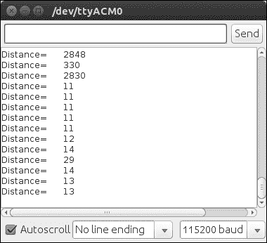

超声波距离传感器在 Energia 串行监视器中的输出

# 将 Tiva C LaunchPad 与 Python 接口

在本节中，我们将探讨如何将 Tiva C LaunchPad 与 Python 连接，以便在 PC 上接收来自 Launchpad 的数据。

**PySerial**模块可用于将 Launchpad 与 Python 接口。PySerial 的详细文档及其在 Windows、Linux 和 OS X 上的安装过程可以在此找到：[`pyserial.sourceforge.net/pyserial.html`](http://pyserial.sourceforge.net/pyserial.html)

[](http://pyserial.sourceforge.net/pyserial.html)

PySerial 可在 Ubuntu 包管理器中找到，并且可以使用以下命令在 Ubuntu 中轻松安装：

```py
    $ sudo apt-get install python-serial  
```

安装了`python-serial`包后，我们可以编写 Python 代码来与 Launchpad 进行接口。接口代码将在下一节给出。

以下代码导入了 Python 的`serial`模块和`sys`模块。`serial`模块处理 Launchpad 的串行端口，执行读取、写入等操作。`sys`模块提供了访问由解释器使用或维护的一些变量以及与解释器强交互的函数。它始终可用：

```py
#!/usr/bin/env python 
import serial 
import sys 
```

当我们将 Launchpad 连接到计算机时，该设备在操作系统上注册为虚拟串行端口。在 Ubuntu 中，设备名称看起来像`/dev/ttyACMx`。在这里，x 可以是数字；如果只有一个设备，它可能就是 0。要与 Launchpad 交互，我们只需要处理这个设备文件即可。

以下代码将尝试以`115200`波特率打开 Launchpad 的串行端口`/dev/ttyACM0`。如果失败，它将打印`Unable to open serial port`：

```py
try: 
    ser = serial.Serial('/dev/ttyACM0',115200) 
except: 
    print "Unable to open serial port" 
```

以下代码将读取串行数据，直到串行字符变为新行（`'n'`），并在终端上打印出来。如果我们按下键盘上的 Ctrl + C 以退出程序，它将通过调用`sys.exit(0)`退出：

```py
while True: 
    try: 
        line = ser.readline() 
        print line 
    except: 
        print "Unable to read from device" 
        sys.exit(0) 
```

保存文件后，使用以下命令更改文件的权限为可执行：

```py
    $ sudo chmod +X script_name
    $ ./ script_name  
```

脚本输出将如下所示：

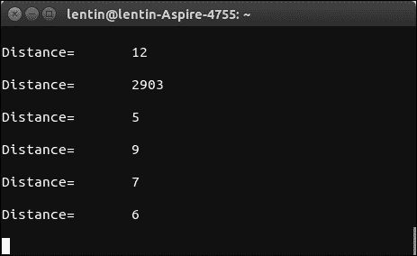

在 Energia 串行监视器中超声波距离传感器的输出

# 与红外接近传感器一起工作

红外传感器是另一种寻找障碍物和机器人距离的方法。红外距离传感器的原理基于当红外光击中障碍物时从表面反射回来的红外光。一个红外接收器将捕获反射光，并根据接收到的光量测量电压。

其中一种流行的红外距离传感器是 Sharp GP2D12。产品链接可在此找到：[`www.robotshop.com/en/sharp-gp2y0a21yk0f-ir-range-sensor.html`](http://www.robotshop.com/en/sharp-gp2y0a21yk0f-ir-range-sensor.html)

下图显示了 Sharp GP2D12 传感器：

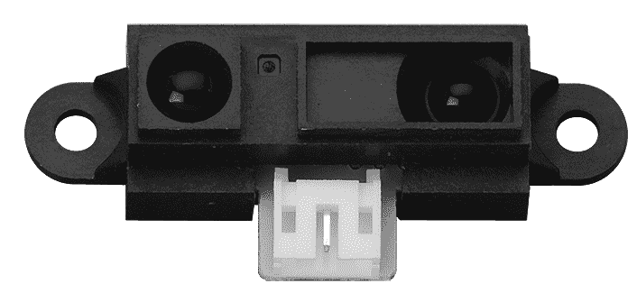

传感器发出一束红外光，并使用三角测量法来测量距离。GP2D12 的检测范围在 10 厘米到 80 厘米之间。在 80 厘米的距离上，光束宽度为 6 厘米。以下图示了红外光传感器的传输和反射：


使用红外光传感器进行障碍物感应

在传感器的左侧是红外发射器，它持续发送红外辐射。在击中一些物体后，红外光将反射，并被红外接收器接收。以下是红外传感器的接口电路图：

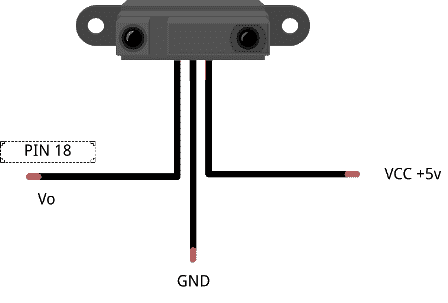

Sharp 红外传感器的引脚图

模拟输出引脚**Vo**可以连接到 Launchpad 的 ADC 引脚。本节进一步讨论了 Sharp 距离传感器与 Tiva C Launchpad 的接口代码。在此代码中，我们选择 Launchpad 的 18 号引脚，并将其设置为 ADC 模式，从 Sharp 距离传感器读取电压等级。GP2D12 红外传感器的范围方程如下：

*范围 = (6,787 / (伏特 - 3)) - 4*

在这里，*Volt*是从伏特引脚的 ADC 获取的模拟电压值。

在代码的第一个部分，我们将 Tiva C LaunchPad 的 18 号引脚设置为输入引脚，并以 115200 波特率启动串行通信：

```py
int IR_SENSOR = 18; // Sensor is connected to the analog A3 
int intSensorResult = 0; //Sensor result 
float fltSensorCalc = 0; //Calculated value 

void setup() 
{ 
Serial.begin(115200); // Setup communication with computer 
   to present results serial monitor 
} 
```

在以下代码部分，控制器持续读取模拟引脚，并将其转换为厘米距离值：

```py
void loop() 
{ 

// read the value from the ir sensor 
intSensorResult = analogRead(IR_SENSOR); //Get sensor value 

//Calculate distance in cm according to the range equation 
fltSensorCalc = (6787.0 / (intSensorResult - 3.0)) - 4.0;  

Serial.print(fltSensorCalc); //Send distance to computer 
Serial.println(" cm"); //Add cm to result 
delay(200); //Wait 
} 
```

这是连接 sharp 距离传感器的基本代码。红外传感器有一些缺点。以下是一些：

+   我们不能在直接或间接的阳光下使用它们，因此在户外机器人中很难使用它们

+   如果物体不是反光的，它们可能无法工作

+   范围方程仅在范围内有效

在下一节中，我们将讨论 IMU 及其与 Tiva C LaunchPad 的接口。IMU 可以提供里程计数据，并可作为导航算法的输入。

# 与惯性测量单元（IMU）一起工作

**惯性测量单元**（**IMU**）是一种电子设备，它通过加速度计、陀螺仪和磁力计的组合来测量速度、方向和重力。IMU 在机器人技术中有许多应用；其中一些应用用于**无人机**（**UAVs**）的平衡和机器人导航。

在本节中，我们将讨论 IMU 在移动机器人导航中的作用，以及市场上的一些最新 IMU 及其与 Launchpad 的接口。

# 惯性导航

惯性测量单元（IMU）提供相对于惯性空间的加速度和方向。如果你知道初始位置、速度和方向，你可以通过积分感知到的加速度来计算速度，第二次积分给出位置。为了获得机器人的正确方向，需要知道机器人的方向；这可以通过从陀螺仪积分感知到的角速度来获得。

以下图示说明了惯性导航系统，它将 IMU 值转换为里程计数据：

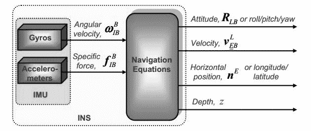

IMU 的框图

我们从 IMU 获得的数据通过使用导航方程转换为导航信息，并将它们输入到估计滤波器中，如卡尔曼滤波器。**卡尔曼**滤波器是一种从测量数据估计系统状态的算法（[`en.wikipedia.org/wiki/Kalman_filter`](http://en.wikipedia.org/wiki/Kalman_filter)）。由于加速度计和陀螺仪的误差，惯性导航系统（**INS**）的数据将会有一些漂移。为了限制漂移，惯性导航系统通常由提供直接测量积分量的其他传感器辅助。基于测量和传感器误差模型，卡尔曼滤波器估计导航方程中的误差以及所有彩色传感器的误差。以下图示说明了使用卡尔曼滤波器的辅助惯性导航系统：

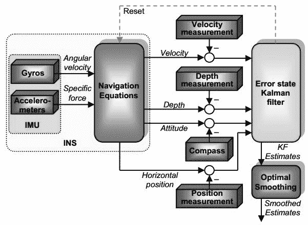

带有惯性导航系统的 IMU

除了电机编码器外，IMU 的值可以被视为里程计值，并可用于**推算导航**，即通过使用先前确定的当前位置来找到移动物体的当前位置的过程。

在下一节中，我们将探讨 InvenSense 公司最受欢迎的惯性测量单元（IMU）之一，称为**MPU 6050**。

# 将 MPU 6050 与 Tiva C LaunchPad 接口

MPU-6000/MPU-6050 系列部件是全球首款也是唯一一款专为智能手机、平板电脑、可穿戴传感器和机器人等低功耗、低成本和高性能需求设计的六轴运动跟踪设备。

MPU-6000/6050 设备将三轴陀螺仪和三轴加速度计集成在硅芯片上，并配备了一个能够处理复杂九轴运动融合算法的板载数字运动处理器。以下图示展示了 MPU 6050 的系统图和引脚分布：


MPU 6050 的框图

以下图示展示了 MPU 6050 的扩展板，并且可以从这里购买[`a.co/7C3yL96`](http://a.co/7C3yL96)：

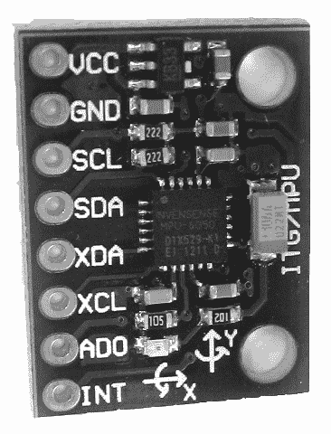

MPU 6050 扩展板

以下表格给出了 Launchpad 到 MPU 6050 的连接方式。其余引脚可以保持未连接状态：

| Launchpad 引脚 | MPU6050 引脚 |
| --- | --- |
| +3.3V | VCC/VDD |
| GND | GND |
| PD0 | SCL |
| PD1 | SDA |

以下图示展示了 MPU 6050 和 Tiva C Launchpad 的接口：

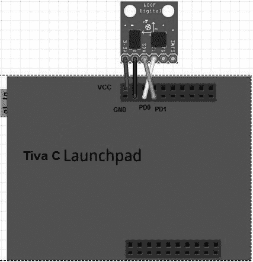

将 MPU 6050 扩展板连接到 Launchpad

MPU 6050 和 Launchpad 使用 I2C 协议进行通信。供电电压为 3.3V，由 Launchpad 提供。

# 在 Energia 中设置 MPU 6050 库

本节讨论了 Energia 的接口代码。接口代码使用了[`github.com/jrowberg/i2cdevlib/zipball/master`](https://github.com/jrowberg/i2cdevlib/zipball/master)库来连接 MPU 6050。

从上述链接下载 ZIP 文件，并在 Energia 中从文件菜单选择“首选项”，如图所示：

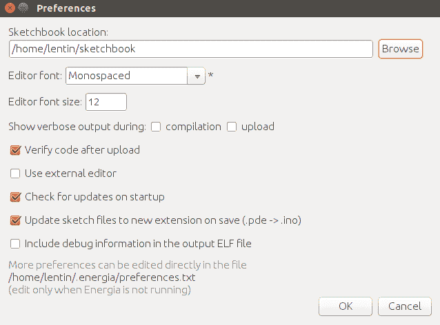

将 MPU 6050 扩展板连接到 Launchpad

在“首选项”下的 Sketchbook 位置，如图所示，创建一个名为`libraries`的文件夹。将 ZIP 文件中 Arduino 文件夹内的文件提取到`sketchbook/libraries`位置。此存储库中的 Arduino 包也兼容 Launchpad。提取的文件包含用于 MPU 6050 传感器接口的`I2Cdev`、`Wire`和`MPU6050`包。`libraries`文件夹中还有其他传感器包，但我们现在没有使用它们。

上述步骤在 Ubuntu 上执行，但对于 Windows 和 macOS X 也是相同的。

# Energia 的接口代码

此代码用于从 MPU 6050 读取原始值到 Launchpad。它使用与 Energia IDE 兼容的第三方 MPU 6050 库。以下是代码每个块的说明。

在本代码的第一部分，我们包含了将 MPU 6050 连接到 Launchpad 所需的必要头文件，例如 `12C`、`Wire` 和 `MPU6050` 库，并创建了一个名为 `accelgyro` 的 `MPU6050` 对象。`MPU6050.h` 库包含一个名为 `MPU6050` 的类，用于向传感器发送和接收数据：

```py
#include "Wire.h" 

#include "I2Cdev.h" 
#include "MPU6050.h" 

MPU6050 accelgyro; 
```

在以下部分，我们开始 I2C 和串行通信以与 MPU 6050 通信并通过串行端口打印传感器值。串行通信波特率为 `115200`，`Setup_MPU6050()` 是用于初始化 MPU 6050 通信的自定义函数：

```py
void setup() 
{ 

  //Init Serial port with 115200 buad rate 
  Serial.begin(115200);   
  Setup_MPU6050(); 
} 
```

以下部分是 `Setup_MPU6050()` 函数的定义。`Wire` 库允许您与 I2C 设备通信。MPU 6050 可以使用 I2C 进行通信。`Wire.begin()` 函数将启动 MPU 6050 和 Launchpad 之间的 I2C 通信；同时，它将使用 `MPU6050` 类中定义的 `initialize()` 方法初始化 MPU 6050 设备。如果一切顺利，它将打印连接成功；否则，它将打印连接失败：

```py
void Setup_MPU6050() 
{ 
   Wire.begin(); 

      // initialize device 
    Serial.println("Initializing I2C devices..."); 
    accelgyro.initialize(); 

    // verify connection 
    Serial.println("Testing device connections..."); 
    Serial.println(accelgyro.testConnection() ? "MPU6050 connection successful" : "MPU6050 connection failed"); 
} 
```

以下代码是 `loop()` 函数，它持续读取传感器值并通过串行端口打印其值：`Update_MPU6050()` 自定义函数负责打印来自 MPU 6050 的更新值：

```py
void loop() 
{ 

   //Update MPU 6050 
    Update_MPU6050(); 

} 
```

`Update_MPU6050()` 函数的定义如下。它声明了六个变量来处理三轴加速度计和陀螺仪的值。MPU 6050 类中的 `getMotion6()` 函数负责从传感器读取新值。读取后，它将通过串行端口打印：

```py
void Update_MPU6050() 
{ 

   int16_t ax, ay, az; 
  int16_t gx, gy, gz; 

      // read raw accel/gyro measurements from device 
    accelgyro.getMotion6(&ax, &ay, &az, &gx, &gy, &gz); 

    // display tab-separated accel/gyro x/y/z values 
    Serial.print("i");Serial.print("t"); 
    Serial.print(ax); Serial.print("t"); 
    Serial.print(ay); Serial.print("t"); 
    Serial.print(az); Serial.print("t"); 
    Serial.print(gx); Serial.print("t"); 
    Serial.print(gy); Serial.print("t"); 
    Serial.println(gz); 
    Serial.print("n"); 
} 
```

以下是从串行监视器输出的内容：

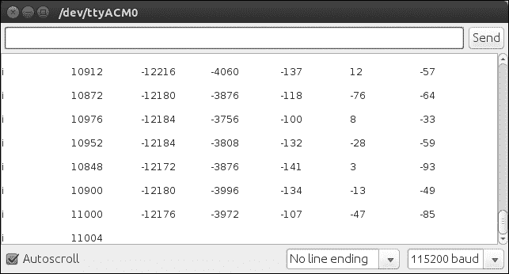

串行监视器中 MPU 6050 的输出

我们可以使用用于超声波的 Python 代码读取这些值。以下是我们运行 Python 脚本时的终端截图：

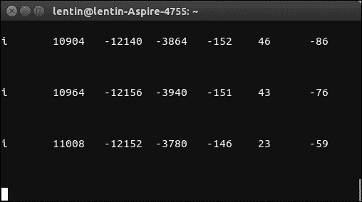

Linux 终端中 MPU 6050 的输出

# 摘要

在本章中，我们讨论了我们用于机器人的电机接口。我们研究了电机和编码器与名为 Tiva C Launchpad 的控制器板的接口。我们讨论了电机和编码器接口的控制器代码。在未来，如果机器人需要高精度和高扭矩，我们研究了可以替代当前直流电机的 Dynamixel 伺服电机。我们还研究了可以用于我们机器人的机器人传感器。我们讨论的传感器是超声波距离传感器、红外接近传感器和 IMU。这三个传感器有助于机器人的导航。我们还讨论了将这些传感器接口到 Tiva C LaunchPad 的基本代码。我们将在下一章进一步讨论该机器人使用的视觉传感器。

# 问题

1.  H-桥电路是什么？

1.  什么是四倍数编码器？

1.  4X 编码方案是什么？

1.  我们如何从编码器数据计算位移？

1.  Dynamixel 执行器的特点有哪些？

1.  超声波传感器是什么以及它们是如何工作的？

1.  你是如何从超声波传感器计算距离的？

1.  什么是红外接近传感器以及它是如何工作的？

# 进一步阅读

在以下链接中了解更多关于 Energia 编程的信息：

[`energia.nu/guide/`](http://energia.nu/guide/)
