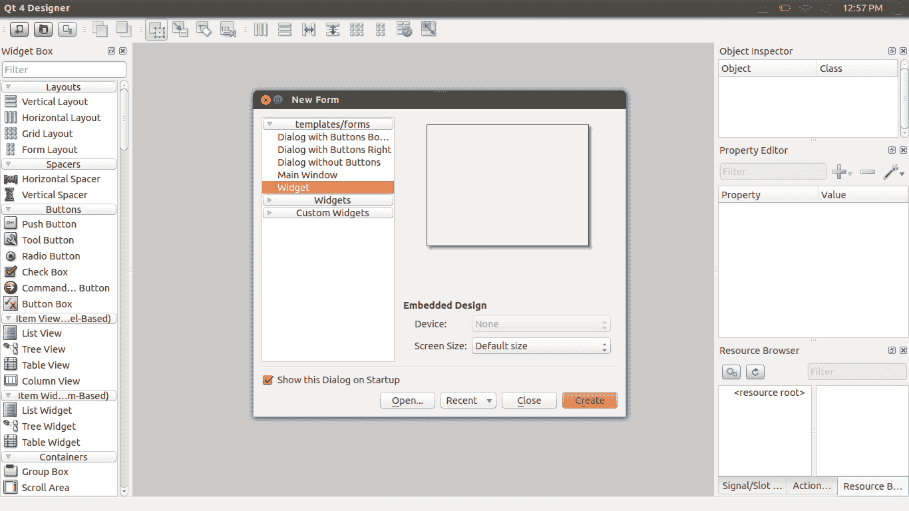
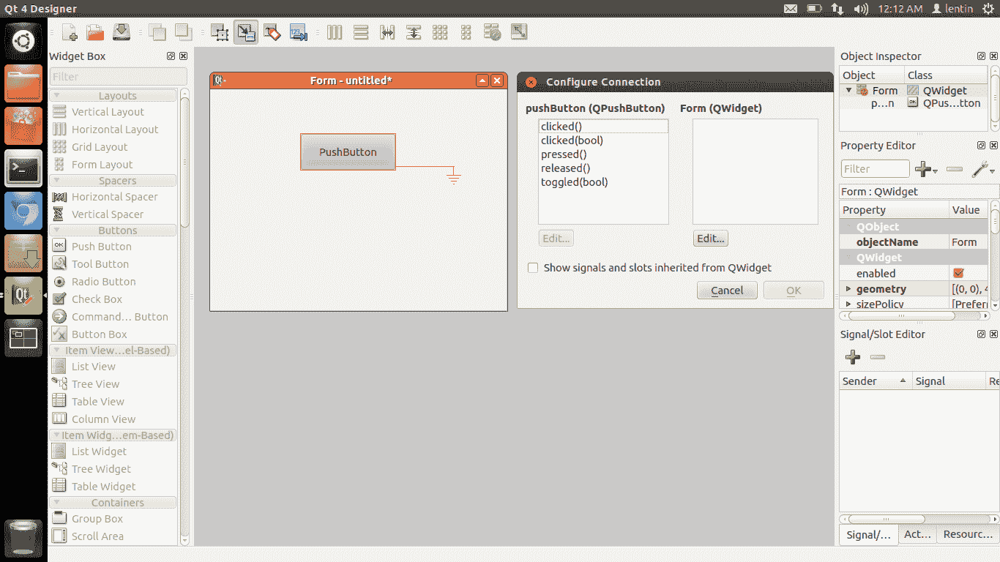
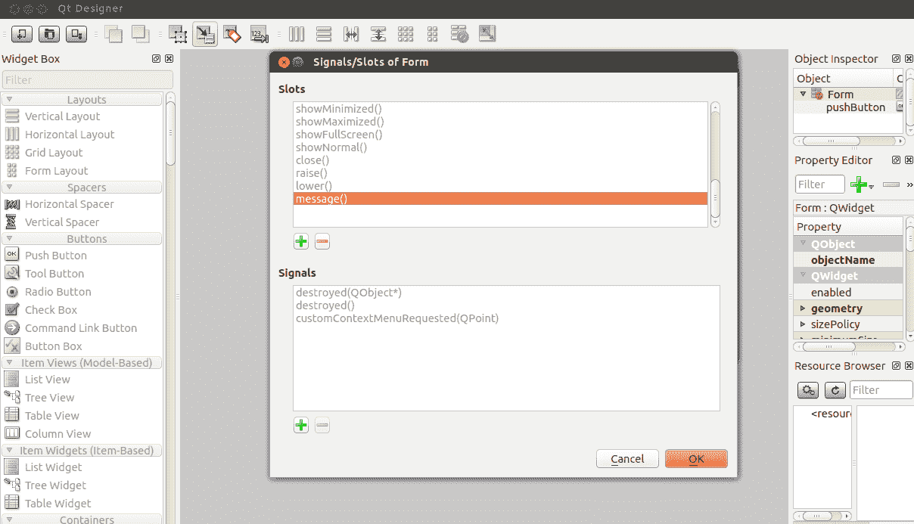
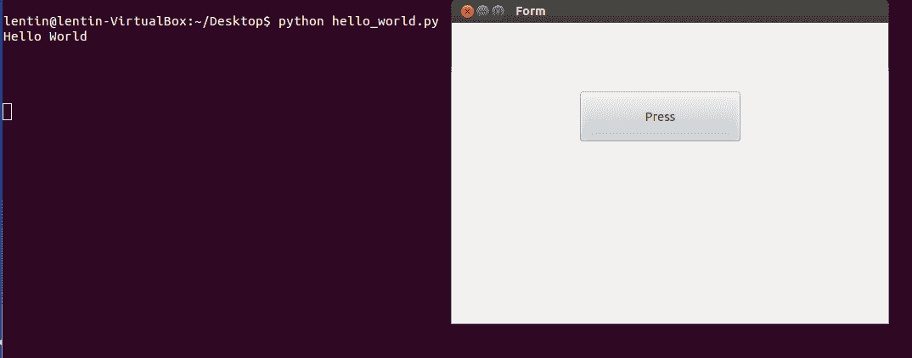
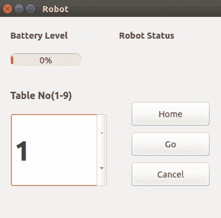
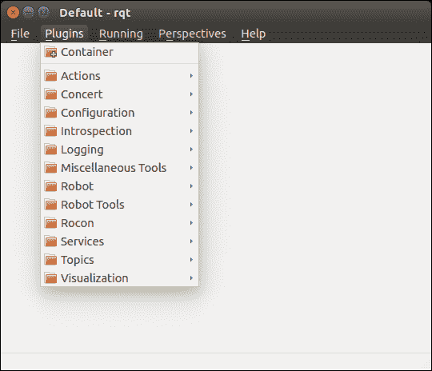
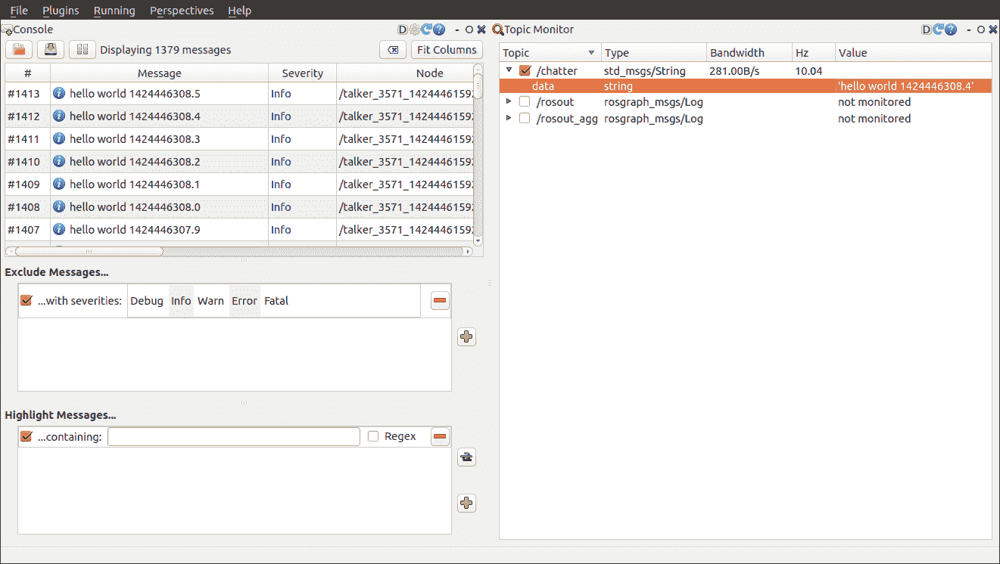

# 第九章：使用 Qt 和 Python 设计机器人 GUI

在上一章中，我们讨论了用于执行自主导航的机器人硬件组件和软件包的集成。集成之后，下一步是构建一个 GUI 来控制机器人。我们正在构建一个可以作为底层 ROS 命令触发器的 GUI。用户不必在终端上运行所有命令，而是可以通过 GUI 按钮进行操作。我们将要设计的 GUI 适用于典型的酒店房间，房间内有九张桌子。用户可以在酒店房间的地图上设置桌子位置，并命令机器人前往特定的桌子送餐。送餐后，用户可以命令机器人返回其起始位置。

本章将涵盖以下主题：

+   在 Ubuntu 上安装 Qt

+   PyQt 和 PySide 的介绍

+   Qt Designer 的介绍

+   Qt 信号和槽

+   将 Qt UI 文件转换为 Python 文件

+   与 ChefBot GUI 应用程序一起工作

+   rqt 及其特性的介绍

# 技术要求

为了测试本章中的应用程序和代码，您需要一个安装了 ROS Kinetic 的 Ubuntu 16.04 LTS PC/笔记本电脑。

您需要了解 Qt、PyQt 和 rqt 已安装。

目前最流行的两个 GUI 框架是 Qt ([`qt.digia.com`](http://qt.digia.com)) 和 GTK+ ([`www.gtk.org/`](http://www.gtk.org/))。Qt 和 GTK+是开源的、跨平台的用户界面工具包和开发平台。这两个软件框架在 Linux 桌面环境中被广泛使用，例如 GNOME 和 KDE。

在本章中，我们将使用 Qt 框架的 Python 绑定来实现 GUI，因为与其它方法相比，Qt 的 Python 绑定更容易开发。我们将探讨如何从头开始开发 GUI 并使用 Python 进行编程。在讨论基本的 Python 和 Qt 编程之后，我们将讨论 Qt 和 Python 的 ROS 接口，这些接口已经在 ROS 中可用。我们首先将了解 Qt UI 框架是什么以及如何在我们的 PC 上安装它。

# 在 Ubuntu 16.04 LTS 上安装 Qt

Qt 是一个跨平台的应用程序框架，广泛用于开发具有 GUI 界面的应用程序软件以及命令行工具。Qt 几乎在所有操作系统上都有可用，例如 Windows、macOS X、Android 等。用于开发 Qt 应用程序的主要编程语言是 C++，但还有为 Python、Ruby、Java 等语言提供的绑定。让我们看看如何在 Ubuntu 16.04 上安装 Qt SDK。我们将从 Ubuntu 的**高级包装工具**（**APT**）中安装 Qt。APT 已经包含在 Ubuntu 安装中。因此，为了安装 Qt/Qt SDK，我们可以简单地使用以下命令，该命令将从 Ubuntu 软件仓库安装 Qt SDK 及其所需依赖项。我们可以使用以下命令安装 Qt 版本 4：

```py
    $ sudo apt-get install qt-sdk  
```

此命令将安装整个 Qt SDK 及其项目所需的库。Ubuntu 仓库中提供的软件包可能不是最新版本。要获取 Qt 的最新版本，我们可以从以下链接下载适用于各种操作系统平台的 Qt 在线或离线安装程序：

[`qt-project.org/downloads`](http://qt-project.org/downloads)

在我们的系统上安装 Qt 后，我们将了解如何使用 Qt 开发 GUI 并与 Python 进行接口。

# 使用 Python 的 Qt 绑定

让我们看看如何将 Python 和 Qt 进行接口。一般来说，Python 中有用于连接 Qt 用户界面的两个模块。两个最受欢迎的框架是：

+   PyQt

+   PySide

# PyQt

**PyQt** 是最流行的 Qt 跨平台 Python 绑定之一。PyQt 由 Riverbank Computing Limited 开发和维护，为 Qt 版本 4 和 Qt 版本 5 提供绑定，并附带 GPL（版本 2 或 3）和商业许可证。PyQt 可用于 Qt 版本 4 和 5，分别称为 PyQt4 和 PyQt5。这两个模块与 Python 2 和 3 兼容。PyQt 包含 620 多个类，涵盖了用户界面、XML、网络通信、Web 等方面。

PyQt 可用于 Windows、Linux 和 macOS X。安装 PyQt 的先决条件是安装 Qt SDK 和 Python。Windows 和 macOS X 的二进制文件可在以下链接找到：

[`www.riverbankcomputing.com/software/pyqt/download`](http://www.riverbankcomputing.com/software/pyqt/download)

我们将了解如何在 Ubuntu 16.04 上使用 Python 2.7 安装 PyQt4。

# 在 Ubuntu 16.04 LTS 上安装 PyQt

如果您想在 Ubuntu/Linux 上安装 PyQt，请使用以下命令。此命令将安装 PyQt 库、其依赖项以及一些 Qt 工具：

```py
    $ sudo apt-get install python-qt4 pyqt4-dev-tools
```

# PySide

**PySide** 是一个开源软件项目，为 Qt 框架提供 Python 绑定。PySide 项目由诺基亚发起，为多个平台提供完整的 Qt 绑定。PySide 用于包装 Qt 库的技术与 PyQt 不同，但两者的 API 相似。PySide 目前不支持 Qt 5。PySide 可用于 Windows、Linux 和 macOS X。以下链接将指导您在 Windows 和 macOS X 上设置 PySide：

[`qt-project.org/wiki/Category:LanguageBindings::PySide::Downloads`](http://qt-project.org/wiki/Category:LanguageBindings::PySide::Downloads)

PySide 的先决条件与 PyQt 相同。让我们看看如何在 Ubuntu 16.04 LTS 上安装 PySide。

# 在 Ubuntu 16.04 LTS 上安装 PySide

PySide 软件包可在 Ubuntu 软件仓库中找到。以下命令将在 Ubuntu 上安装 PySide 模块和 Qt 工具：

```py
    $ sudo apt-get install python-pyside pyside-tools  
```

让我们同时使用这两个模块，并看看它们之间的区别。

# 使用 PyQt 和 PySide

安装了 PyQt 和 PySide 包之后，我们将探讨如何使用 PyQt 和 PySide 编写 Hello World GUI。PyQt 和 PySide 之间的主要区别仅在于一些命令；大多数步骤都是相同的。让我们看看如何创建 Qt GUI 并将其转换为 Python 代码。

# 介绍 Qt Designer

Qt Designer 是用于设计和向 Qt GUI 插入控件的工具。Qt GUI 基本上是一个包含其组件和控制信息 XML 文件。与 GUI 一起工作的第一步与其设计相关。Qt Designer 工具提供了各种选项来制作出色的 GUI。

通过在终端中输入 `designer-qt4` 命令来启动 Qt Designer。以下截图显示了运行此命令后您将能看到的内容：



Qt 4 Designer

上一张截图显示了 Qt Designer 界面。从新建表单窗口中选择 Widget 选项，然后点击创建按钮。这将创建一个空白的控件；我们可以从 Qt 4 Designer 的左侧拖动各种 GUI 控件到空白控件中。Qt 控件是 Qt GUI 的基本构建块。以下截图显示了从 Qt Designer 左侧窗口拖动 PushButton 的表单：


Qt Designer 控件表单

我们将要构建的 Hello World 应用程序将包含一个 PushButton。当我们点击 PushButton 时，将在终端上打印出 Hello World 消息。在构建 Hello World 应用程序之前，我们需要了解 Qt 信号和槽是什么，因为我们必须使用这些功能来构建 Hello World 应用程序。

# Qt 信号和槽

在 Qt 中，使用信号和槽功能处理 GUI 事件。当发生事件时，GUI 会发出信号。Qt 控件有许多预定义的信号，用户可以为 GUI 事件添加自定义信号。槽是响应特定信号而调用的函数。在这个例子中，我们使用 PushButton 的 `clicked()` 信号，并为该信号创建一个自定义槽。

我们可以在这个自定义函数内部编写自己的代码。让我们看看我们如何创建一个按钮，将一个信号连接到一个槽，并将整个 GUI 转换为 Python。以下是创建 Hello World GUI 应用程序所涉及的步骤：

1.  从 Qt Designer 拖动并创建一个 PushButton 到空白的表单中。

1.  为按钮点击事件分配一个槽，该事件发出一个名为 `clicked()` 的信号。

1.  将设计的 UI 文件保存为 `.ui` 扩展名。

1.  将 UI 文件转换为 Python。

1.  编写自定义槽的定义。

1.  在定义的槽/函数内打印 Hello World 消息。

我们已经从 Qt Designer 拖动了一个按钮到一个空白的表单中。按 F4 键在按钮上插入一个槽。当我们按 F4 时，PushButton 变成红色，我们可以从按钮拖动一条线并将其放置在主窗口的地面符号上。这如图所示：



在 Qt 4 Designer 中分配槽和信号

从左侧选择 clicked() 信号，然后点击 Edit... 按钮创建一个新的自定义槽。当我们点击 Edit... 按钮时，将弹出一个窗口以创建自定义函数。您可以通过点击 + 符号创建自定义函数。我们创建了一个名为 message() 的自定义槽，如下面的截图所示：



在 Qt 4 Designer 中分配槽和信号

点击 OK 按钮，将 UI 文件保存为 `hello_world.ui`，并退出 Qt Designer。在保存 UI 文件后，让我们看看如何将 Qt UI 文件转换为 Python 文件。

从以下链接了解更多关于 Qt 信号和槽的信息

[Qt 5 文档 - 信号和槽](https://doc.qt.io/qt-5/signalsandslots.html)

# 将 UI 文件转换为 Python 代码

在设计 UI 文件后，我们可以将其转换为等价的 Python 代码。转换使用 `pyuic` 编译器完成。我们在安装 PyQt/PySide 时已经安装了此工具。以下是将 Qt UI 文件转换为 Python 文件的命令：

我们必须为 PyQt 和 PySide 使用不同的命令。以下命令是将 UI 转换为其 PyQt 等价文件的命令：

```py
    $ pyuic4 -x hello_world.ui -o hello_world.py  
```

`pyuic4` 是一个 UI 编译器，用于将 UI 文件转换为等价的 Python 代码。我们需要在 `-x` 参数后指定 UI 文件名，并在 `-o` 参数后指定输出文件名。

PySide 命令的更改并不多。不再是 `pyuic4`，PySide 使用 `pyside-uic` 将 UI 文件转换为 Python 文件。其余的参数保持不变：

```py
    $ pyside-uic -x hello_world.ui -o hello_world.py  
```

上述命令将为 UI 文件生成等价的 Python 代码。这将创建一个包含 GUI 组件的 Python 类。生成的脚本将不会包含自定义函数 `message()` 的定义。我们应该添加此自定义函数以生成代码。以下步骤将指导您添加自定义函数；因此，当您点击按钮时，自定义函数 `message()` 将被执行。

# 在 PyQt 代码中添加槽定义

这里给出了 PyQt 生成的 Python 代码。`pyuic4` 和 `pyside-uic` 生成的代码相同，只是在导入模块名称时有所不同。其他部分都相同。使用 PyQt 生成的代码的解释也适用于 PySide 代码。以下是从前面的转换生成的代码。代码结构和参数可以根据您设计的 UI 文件进行更改：

```py
from PyQt4 import QtCore, QtGui 

try: 
    _fromUtf8 = QtCore.QString.fromUtf8 
except AttributeError: 
    _fromUtf8 = lambda s: s 

class Ui_Form(object): 

    def setupUi(self, Form): 
        Form.setObjectName(_fromUtf8("Form")) 
        Form.resize(514, 355) 

        self.pushButton = QtGui.QPushButton(Form) 
        self.pushButton.setGeometry(QtCore.QRect(150, 80, 191, 61)) 
        self.pushButton.setObjectName(_fromUtf8("pushButton")) 

        self.retranslateUi(Form) 
        QtCore.QObject.connect(self.pushButton, QtCore.SIGNAL(_fromUtf8("clicked()")), Form.message) 
        QtCore.QMetaObject.connectSlotsByName(Form) 

    def retranslateUi(self, Form): 
        Form.setWindowTitle(QtGui.QApplication.translate("Form", "Form", None, QtGui.QApplication.UnicodeUTF8)) 
       self.pushButton.setText( QtGui.QApplication.translate("Form", "Press", None, QtGui.QApplication.UnicodeUTF8)) 

#This following code should be added manually 
if __name__ == "__main__": 
   import sys 
    app = QtGui.QApplication(sys.argv) 
    Form = QtGui.QWidget() 
    ui = Ui_Form() 
    ui.setupUi(Form) 
    Form.show() 
    sys.exit(app.exec_()) 
```

上述代码是我们使用 Qt Designer 应用程序设计的 Qt UI 文件的等价 Python 脚本。以下是此代码的工作步骤：

1.  代码将从 `if __name__ == "__main__":` 开始执行。PyQt 代码中的第一件事是创建一个 `QApplication` 对象。`QApplication` 类管理 GUI 应用程序的流程和主要设置。`QApplication` 类包含主事件循环，其中处理和分发来自 Windows 系统和其他来源的所有事件。它还处理应用程序的初始化和终止。`QApplication` 类位于 `QtGui` 模块中。此代码创建了一个名为 `app` 的 `QApplication` 对象。我们必须手动添加主要代码。

1.  `Form = QtGui.QWidget()` 这一行创建了一个名为 `Form` 的 `QWidget` 类对象，该对象位于 `QtGui` 模块中。`QWidget` 类是 Qt 所有用户界面对象的基类。它可以接收来自主 Windows 系统的鼠标和键盘事件。

1.  `ui = Ui_Form()` 这一行创建了一个名为 `ui` 的 `Ui_Form()` 类对象，该对象在代码中定义。`Ui_Form()` 对象可以接受我们在上一行创建的 `QWidget` 类，并且可以将按钮、文本、按钮控制和其他 UI 组件添加到这个 `QWidget` 对象中。`Ui_Form()` 类包含两个函数：`setupUi()` 和 `retranslateUi()`。我们可以将 `QWidget` 对象传递给名为 `setupUi()` 的函数。此函数将在该小部件对象上添加 UI 组件，例如按钮，为信号分配槽，等等。`retranslateUi()` 函数将在需要时将 UI 语言翻译成其他语言。例如，如果我们需要从英语翻译成西班牙语，我们可以在该函数中提及相应的西班牙语单词。

1.  `Form.show()` 这一行显示带有按钮和文本的最终窗口。

接下来是创建槽函数，该函数将打印“Hello World”消息。槽定义在 `Ui_Form()` 类内部创建。以下步骤将名为 `message()` 的槽插入到 `Ui_Form()` 类中。

`message()` 函数的定义如下：

```py
    def message(self): 
    print "Hello World" 
```

这应该作为函数插入到 `Ui_Form()` 类中。还要更改 `Ui_Form()` 类中的 `setupUi()` 函数中的以下行：

```py
QtCore.QObject.connect(self.pushButton, QtCore.SIGNAL(_fromUtf8("clicked()")), Form.message) 
```

应将 `Form.message` 参数替换为 `self.message` 参数。前面的行将 PushButton 的信号 `clicked()` 连接到我们已经在 `Ui_Form()` 类中插入的 `self.message()` 插槽。

# Hello World GUI 应用程序的运行操作

在将 `Form.message` 参数替换为 `self.message` 参数后，我们可以执行代码，输出将如下所示：



运行 Pyqt4 应用程序

当我们点击“按下按钮”时，它将打印“Hello world”消息。这就是使用 Python 和 Qt 设置自定义 GUI 的全部内容。

在下一节中，我们将看到为机器人设计的实际 GUI。

# 与 ChefBot 的控制 GUI 一起工作

在 PyQt 中完成 Hello World 应用程序后，我们现在将讨论用于控制 ChefBot 的图形用户界面。构建 GUI 的主要目的是创建一种更简单的方式来控制机器人。例如，如果机器人在酒店部署以提供食物，控制这个机器人的那个人不需要了解启动和停止这个机器人的复杂命令；因此，为 ChefBot 建立 GUI 可以减少复杂性并使它对用户来说更容易。我们计划使用 PyQt、ROS 和 Python 接口来构建 GUI。ChefBot ROS 包可在以下链接的 GitHub 上找到：[`github.com/qboticslabs/learning_robotics_2nd_ed`](https://github.com/qboticslabs/learning_robotics_2nd_ed)

如果您还没有克隆代码，现在可以使用以下命令进行克隆：

```py
    $ git clone https://github.com/qboticslabs/learning_robotics_2nd_ed.git
```

命名为 `robot_gui.py` 的 GUI 代码位于 `scripts` 文件夹中，该文件夹位于 `chefbot_bringup` 包内。

以下截图显示了为 ChefBot 设计的 GUI：



运行 Pyqt4 应用程序

GUI 具有以下功能：

+   它可以监控机器人电池状态和机器人状态。机器人状态指示机器人的工作状态。例如，如果机器人遇到错误，它将在该 GUI 上指示错误。

+   它可以命令机器人移动到餐桌位置以提供食物。GUI 上有一个用于输入餐桌位置的旋转框小部件。目前，我们正在为九张餐桌的房间设计这个 GUI，但我们可能根据需求将其扩展到任何数量。输入餐桌号码后，我们可以通过点击“Go”按钮来命令机器人前往该餐桌；机器人将进入该位置。如果我们想将机器人返回到初始位置，我们可以点击“Home”按钮。如果我们想取消当前的机器人移动，点击“Cancel”以停止机器人。此 GUI 应用程序的工作原理如下：

当我们必须在酒店部署 ChefBot 时，我们必须做的第一个程序是创建房间的地图。在正确映射整个房间后，我们必须在机器人 PC 上保存地图。机器人只进行一次映射。映射后，我们可以运行定位和导航例程，并命令机器人进入地图上的一个位置。ChefBot ROS 包附带了一个类似酒店的环境的地图和模拟模型。我们现在可以运行这个模拟和定位来测试 GUI，在下一章中，我们将讨论如何使用 GUI 控制硬件。如果您在本地系统上安装了 ChefBot ROS 包，我们可以模拟一个酒店环境并测试 GUI。

使用以下命令在类似酒店的安排中启动 ChefBot 模拟：

```py
    $roslaunch chefbot_gazebo chefbot_hotel_world.launch  
```

在启动 ChefBot 模拟后，我们可以使用已构建的地图运行定位和导航例程。该地图位于`chefbot_bringup`包中。在这个包中，我们可以看到一个`map`文件夹。在这里，我们将使用这个地图进行这项测试。我们可以使用以下命令加载定位和导航例程：

```py
    $ roslaunch chefbot_gazebo amcl_demo.launch 
 map_file:=/home/<user_name>/catkin_ws/src/chefbot/chefbot_bringup/map/hotel1.yaml  
```

地图文件的路径在不同的系统中可能会变化，所以请使用你系统中的路径而不是这个路径。

如果提到的路径是正确的，它将开始运行 ROS 导航堆栈。如果我们想查看机器人在地图上的位置或手动设置机器人的初始位置，我们可以使用以下命令的 RViz：

```py
    $ roslaunch chefbot_bringup view_navigation.launch  
```

在 RViz 中，我们可以使用 2D 导航目标按钮命令机器人前往任何地图坐标。

我们也可以通过编程命令机器人前往任何地图坐标。ROS 导航堆栈使用 ROS `actionlib`库工作。ROS `actionlib`库用于执行可中断的任务；它与 ROS 服务类似。与 ROS 服务相比的一个优点是，如果我们不想在那时执行它，我们可以取消请求。

在 GUI 中，我们可以使用 Python `actionlib`库命令机器人前往地图坐标。我们可以使用以下技术获取地图上的餐桌位置。

在启动模拟器和 AMCL 节点后，启动键盘遥控并移动机器人靠近每个餐桌。使用以下命令获取机器人的平移和旋转：

```py
    $ rosrun tf tf_echo /map /base_link  
```

当我们点击“Go”按钮时，位置信息会被发送到导航堆栈，机器人规划其路径并达到目标位置。我们甚至可以在任何时候取消任务。因此，ChefBot GUI 充当一个`actionlib`客户端，它将地图坐标发送到`actionlib`服务器；即导航堆栈。

我们现在可以使用以下命令运行机器人 GUI 来控制机器人：

```py
    $ rosrun chefbot_bringup robot_gui.py  
```

我们可以选择一个餐桌编号并点击“Go”按钮，将机器人移动到每个餐桌。

假设你已经克隆了文件并获取了`robot_gui.py`文件，我们将讨论我们添加到`Ui_Form()`类中的主要插槽，用于`actionlib`客户端以及获取电池和机器人状态值。

我们需要导入以下 Python 模块来运行这个 GUI 应用程序：

```py
import rospy 
import actionlib 
from move_base_msgs.msg import * 
import time 
from PyQt4 import QtCore, QtGui 
```

我们需要的附加模块是 ROS Python 客户端`rospy`和用于向导航堆栈发送值的`actionlib`模块。`move_base_msgs`模块包含需要发送到导航堆栈的目标的消息定义。

在每个餐桌附近的机器人位置以 Python 字典的形式提及。以下代码显示了每个餐桌附近机器人的硬编码位置值：

```py
table_position = dict() 
table_position[0] = (-0.465, 0.37, 0.010, 0, 0, 0.998, 0.069) 
table_position[1] = (0.599, 1.03, 0.010, 0, 0, 1.00, -0.020) 
table_position[2] = (4.415, 0.645, 0.010, 0, 0, -0.034, 0.999) 
table_position[3] = (7.409, 0.812, 0.010, 0, 0, -0.119, 0.993) 
table_position[4] = (1.757, 4.377, 0.010, 0, 0, -0.040, 0.999) 
table_position[5] = (1.757, 4.377, 0.010, 0, 0, -0.040, 0.999) 
table_position[6] = (1.757, 4.377, 0.010, 0, 0, -0.040, 0.999) 
table_position[7] = (1.757, 4.377, 0.010, 0, 0, -0.040, 0.999) 
table_position[8] = (1.757, 4.377, 0.010, 0, 0, -0.040, 0.999) 
table_position[9] = (1.757, 4.377, 0.010, 0, 0, -0.040, 0.999) 
```

我们可以通过访问这个字典来获取机器人靠近每个餐桌的位置。

目前，我们仅为了演示目的插入了四个值。你可以通过找到其他餐桌的位置来添加更多值。

我们在`Ui_Form()`类中分配了一些变量来处理表格号、机器人的位置和`actionlib`客户端：

```py
#Handle table number from spin box 
self.table_no = 0 
#Stores current table robot position 
self.current_table_position = 0 
#Creating Actionlib client 
self.client = actionlib.SimpleActionClient('move_base',MoveBaseAction) 
#Creating goal message definition 
self.goal = MoveBaseGoal() 
#Start this function for updating battery and robot status 
self.update_values() 
```

以下代码显示了此代码中按钮和旋转框小部件的信号和槽分配：

```py
#Handle spinbox signal and assign to slot set_table_number() 
QtCore.QObject.connect(self.spinBox, QtCore.SIGNAL(_fromUtf8("valueChanged(int)")), self.set_table_number) 

#Handle Home button signal and assign to slot Home() 
QtCore.QObject.connect(self.pushButton_3, QtCore.SIGNAL(_fromUtf8("clicked()")), self.Home) 

#Handle Go button signal and assign to slot Go() 
QtCore.QObject.connect(self.pushButton, QtCore.SIGNAL(_fromUtf8("clicked()")), self.Go) 

#Handle Cancel button signal and assign to slot Cancel() 
QtCore.QObject.connect(self.pushButton_2, QtCore.SIGNAL(_fromUtf8("clicked()")), self.Cancel)
```

以下槽处理来自 UI 的旋转框值并分配一个表格号。它还将表格号转换为相应的机器人位置：

```py
def set_table_number(self): 
  self.table_no = self.spinBox.value() 
  self.current_table_position = table_position[self.table_no] 
```

这是 Go 按钮的 Go 槽的定义。此函数将所选表格的机器人位置插入到目标消息头中，并将其发送到导航堆栈：

```py
def Go(self): 

  #Assigning x,y,z pose and orientation to target_pose message 
  self.goal.target_pose.pose.position.x=float(self.current_table  _position[0]) 

  self.goal.target_pose.pose.position.y=float(self.current_table  _position[1]) 
  self.goal.target_pose.pose.position.z=float(self.current_table  _position[2]) 

  self.goal.target_pose.pose.orientation.x =     float(self.current_table_position[3]) 
  self.goal.target_pose.pose.orientation.y=   float(self.current_table_position[4]) 
  self.goal.target_pose.pose.orientation.z=   float(self.current_table_position[5]) 

  #Frame id 
  self.goal.target_pose.header.frame_id= 'map' 

  #Time stamp 
  self.goal.target_pose.header.stamp = rospy.Time.now() 

  #Sending goal to navigation stack 
  self.client.send_goal(self.goal) 
```

以下代码是`Cancel()`槽的定义。这将取消当时计划执行的机器人路径：

```py
def Cancel(self): 
  self.client.cancel_all_goals()
```

以下代码是`Home()`的定义。这将表格位置设置为零，并调用`Go()`函数。位置为零的表格是机器人的家位置：

```py
def Home(self): 
  self.current_table_position = table_position[0] 
  self.Go() 
```

以下定义是`update_values()`和`add()`函数的定义。`update_values()`方法将在线程中开始更新电池级别和机器人状态。`add()`函数将检索电池状态和机器人状态的 ROS 参数，并将它们分别设置到进度条和标签中：

```py
def update_values(self): 
    self.thread = WorkThread() 
    QtCore.QObject.connect( self.thread,    QtCore.SIGNAL("update(QString)"), self.add ) 
    self.thread.start() 
def add(self,text): 
  battery_value = rospy.get_param("battery_value") 
  robot_status = rospy.get_param("robot_status") 
   self.progressBar.setProperty("value", battery_value) 
     self.label_4.setText(_fromUtf8(robot_status)) 
```

在前面的函数中使用的`WorkThread()`类在此给出。`WorkThread()`类是从 Qt 提供的`QThread`继承而来的线程。线程简单地以特定的延迟发出`update(Qstring)`信号。在前面的`update_values()`函数中，`update(QString)`信号连接到`self.add()`槽；因此，当线程从发出`update(QString)`信号时，它将调用`add()`槽并更新电池和状态值：

```py
class WorkThread(QtCore.QThread): 
  def __init__(self): 
    QtCore.QThread.__init__(self) 
   def __del__(self): 
    self.wait() 
   def run(self): 
    while True: 
      time.sleep(0.3) # artificial time delay 
      self.emit( QtCore.SIGNAL('update(QString)'), " " ) 
      return 
```

我们已经讨论了如何为 ChefBot 制作 GUI，但这个 GUI 仅适用于控制 ChefBot 的用户。如果有人想要调试和检查机器人数据，我们可能需要使用其他工具。ROS 提供了一个优秀的调试工具，可以可视化来自机器人的数据。

rqt 工具是 ROS 中流行的工具。它基于 Qt 框架进行 GUI 开发的 ROS。让我们讨论 rqt 工具、安装过程以及如何检查来自机器人的传感器数据。

# 在 Ubuntu 16.04 LTS 中安装和使用 rqt

**rqt**是 ROS 中的一个软件框架，它以插件的形式实现了各种 GUI 工具。我们可以在 rqt 中添加可停靠的插件窗口。

在 Ubuntu 16.04 中安装 rqt 可以使用以下命令。在安装 rqt 之前，请确保您已安装 ROS Indigo 的完整安装。

```py
    $ sudo apt-get install ros-<ros_version>-rqt  
```

在安装 rqt 包之后，我们可以访问 rqt 的 GUI 实现，称为`rqt_gui`，在其中我们可以在单个窗口中停靠`rqt 插件`。

让我们从使用`rqt_gui`开始。

在运行`rqt_gui`之前，请运行`roscore`命令：

```py
    $ roscore  
```

运行以下命令以启动`rqt_gui`：

```py
    $ rosrun rqt_gui rqt_gui  
```

如果命令运行正常，我们将得到以下窗口：



运行 rqt

我们可以在运行时加载和卸载插件。要分析 ROS 消息日志，我们可以从插件 | 记录 | 控制台加载控制台插件。在以下示例中，我们加载了控制台插件并在`rospy_tutorials`内部运行了一个 talker 节点，该节点将发送一个 Hello World 消息到名为`/chatter`的主题。

运行以下命令以启动`talker.py`节点：

```py
    $rosrun rospy_tutorials talker.py  
```

在下面的屏幕截图中，`rqt_gui`加载了两个名为控制台和主题监控器的插件。主题监控器插件可以从插件 | 主题 | 主题监控器加载。控制台插件监控每个节点上打印的消息及其严重程度。这对于调试非常有用。在下面的屏幕截图中，`rqt_gui`的左侧加载了控制台插件，右侧加载了主题监控器。主题监控器将列出可用的主题并监控其值。

在下面的屏幕截图中，控制台插件监控着`talker.py`节点的消息及其严重程度，而主题监控器监控着`/chatter`主题内的值：



运行带有不同插件的 rqt

我们还可以在`rqt_gui`上可视化数据，如图像和绘图。对于机器人的导航和检查，`rqt_gui`上有嵌入 RViz 的插件。导航查看器插件从`/map`主题查看。可视化插件在插件 | 可视化中可用。

我们也可以使用 rqt 创建 GUI。创建可以加载到 rqt_gui 中的 rqt 插件的说明可以在以下位置找到：

[创建您新的 rqt 插件](http://wiki.ros.org/rqt/Tutorials/Create%20your%20new%20rqt%20plugin)

# 摘要

在本章中，我们讨论了为 ChefBot 创建一个 GUI，这个 GUI 可以被一个对机器人内部工作原理一无所知的普通用户使用。我们使用了 Qt 的 Python 绑定 PyQt 来创建这个 GUI。在我们查看主要的 GUI 设计之前，我们先看了一个 Hello World 应用程序，以便更容易地理解 PyQt。UI 设计是使用 Qt Designer 工具完成的，UI 文件是通过 Python UI 编译器转换成其等价的 Python 脚本的。在 Qt Designer 中设计完主要的 GUI 之后，我们将 UI 文件转换成 Python 脚本，并在生成的脚本中插入了必要的槽。ChefBot GUI 可以启动机器人，选择一个餐桌号，并命令机器人进入该位置。每个餐桌的位置来自生成的地图，我们在 Python 脚本中硬编码了这些位置以进行测试。当选择一个餐桌时，我们在地图上设置一个目标位置，当我们点击“前往”按钮时，机器人将移动到预定位置。用户可以在任何时候取消操作并命令机器人回到初始位置。GUI 还可以接收机器人的实时状态及其电池状态。在讨论了机器人 GUI 之后，我们看了 ROS 中的调试 GUI 工具 rqt。我们看到了一些用于调试机器人数据的插件。在下一章中，我们将看到机器人的完整测试和校准。

# 问题

1.  Linux 平台上可用的流行 UI 工具包有哪些？

1.  PyQt 和 PySide Qt 绑定之间有什么区别？

1.  你如何将 Qt UI 文件转换为 Python 脚本？

1.  Qt 信号和槽是什么？

1.  rqt 是什么？它的主要应用是什么？

# 进一步阅读

在以下链接中了解更多关于 ROS 中机器人视觉包的信息：

+   [`wiki.ros.org/rqt/UserGuide`](http://wiki.ros.org/rqt/UserGuide)

+   [`wiki.ros.org/rqt/Tutorials`](http://wiki.ros.org/rqt/Tutorials)
