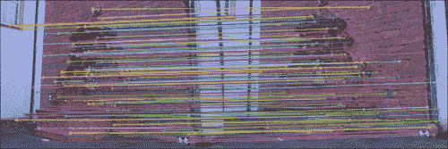
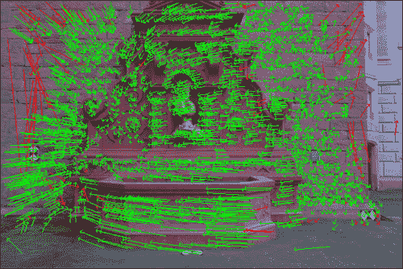
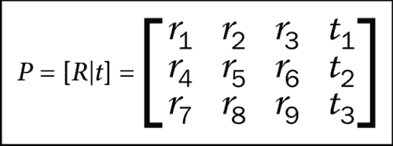
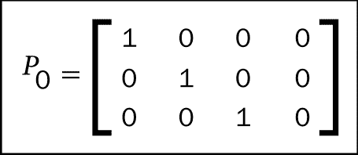
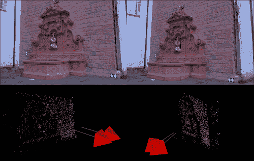
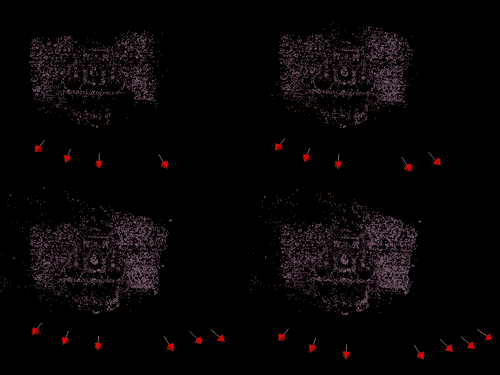

# 四、使用 OpenCV 探索运动结构

在本章中，我们将讨论使用运动结构（**SfM**），或更好称为从图像中提取的几何结构，图像使用 OpenCV 的 API 通过摄像机运动拍摄。 首先，让我们限制使用单一相机的方法原本就漫长的步伐，通常称为**单眼**方法，以及离散且稀疏的帧集，而不是连续的视频流。 这两个约束将大大简化我们将在接下来的页面中概述的系统，并帮助我们理解任何 SfM 方法的基础。 为了实现我们的方法，我们将遵循 Hartley 和 Zisserman（以下称为 H 和 Z）的脚步，它们的开创性著作《计算机视觉中的多视图几何》在第 9 至 12 章中进行了介绍。

在本章中，我们涵盖以下内容：

*   运动结构的概念
*   从一对图像估计相机运动
*   重建场景
*   多角度重建
*   优化后的重建
*   可视化 3D 点云

在本章中，我们假设使用的是经过校准的摄像机，该摄像机是事先校准的。 **校准**是计算机视觉中无处不在的操作，使用命令行工具在 OpenCV 中得到完全支持，并在前面的章节中进行了讨论。 因此，我们假设相机矩阵的固有参数存在于 K 矩阵中，这是校准过程的输出之一。

为了使语言更清晰，从现在开始，我们将摄像机称为场景的单一视图，而不是指用于拍摄图像的光学和硬件。 照相机具有在空间中的位置和观察方向。 在两个摄像头之间，有一个平移元素（在空间中移动）和方向的旋转。

我们还将场景，世界，真实或 3D 中的点的术语统一为同一事物，这是我们现实世界中存在的点。 对于在该位置和时间投影在相机传感器上的某些真实 3D 点，图像或 2D 中的点（即图像坐标中的点）也是如此。

在本章的代码部分中，您会注意到对《计算机视觉中的多视图几何》的引用，例如`// HZ 9.12`。 这指的是本书第 9 章的方程式 12。 此外，文本仅包含代码摘录，而完整的可运行代码包含在本书随附的材料中。

# 运动结构的概念

我们应该做的第一个区别是立体（或实际上是任何多视图），使用已校准装备的 3D 重建和 SfM 之间的区别。 尽管有两个或更多摄像机的装备假设我们已经知道摄像机之间的运动是什么，但在 SfM 中我们实际上并不知道该运动，我们希望找到它。 从简单的角度来看，经过校准的装备可以更精确地重建 3D 几何形状，因为在估计摄像机之间的距离和旋转方面没有错误-这是众所周知的。 实现 SfM 系统的第一步是找到摄像机之间的运动。 OpenCV 可以通过多种方式帮助我们获得此运动，特别是使用`findFundamentalMat`函数。

让我们思考一下选择 SfM 算法背后的目标。 在大多数情况下，我们希望获得场景的几何形状，例如，对象与摄影机有关以及它们的形式是什么。 假设我们已经从合理相似的角度知道了拍摄同一场景的摄像机之间的运动，那么现在我们想重建几何形状。 在计算机视觉术语中，这称为**三角剖分**，并且有很多解决方法。 这可以通过光线相交来完成，在光线相交中，我们构造了两条光线：一个来自每个相机的投影中心，另一个位于每个像面上。 理想情况下，这些光线在空间中的交集将在每个照相机中成像的现实世界中的一个 3D 点处相交，如下图所示：


实际上，射线相交是高度不可靠的。 H 和 Z 建议不要这样做。 这是因为光线通常不相交，使我们退回到使用连接两条光线的最短线段上的中点。 相反，H 和 Z 建议使用多种方法对 3D 点进行三角剖分，我们将在“重构场景”部分中讨论其中的几种方法。 OpenCV 的当前版本不包含用于三角剖分的简单 API，因此我们将自行编写这一部分。

在学习了如何从两个视图恢复 3D 几何形状之后，我们将看到如何合并同一场景的更多视图以获得更丰富的重建。 那时，在“重建的细化”部分中，大多数 SfM 方法都试图通过束调整来优化摄像机和 3D 点的估计位置束。 OpenCV 在其新的图像拼接工具箱中包含用于捆绑调整的方法。 但是，使用 OpenCV 和 C++ 的好处在于可以轻松集成到管道中的大量外部工具。 因此，我们将看到如何集成外部捆绑器调整器，即简洁的 SSBA 库。

现在，我们已经概述了使用 OpenCV 进行 SfM 的方法的概要，我们将看到如何实现每个元素。

# 从一对图像估计相机运动

在我们开始实际寻找两个摄像机之间的运动之前，让我们检查一下输入和执行此操作所需的工具。 首先，我们从空间中的不同位置（希望不是非常地多）获得同一场景的两个图像。 这是一项强大的资产，我们将确保使用它。 现在，就工具而言，我们应该看一下对我们的图像，相机和场景施加约束的数学对象。

两个非常有用的数学对象是基本矩阵（用 F 表示）和基本矩阵（用 E 表示）。 它们基本相似，不同之处在于基本矩阵假设使用已校准的摄像机。 对于我们来说就是这种情况，因此我们将选择它。 OpenCV 仅允许我们通过`findFundamentalMat`函数找到基本矩阵； 但是，使用校准矩阵`K`从中获取基本矩阵非常简单，如下所示：

```cpp
Mat_<double> E = K.t() * F * K; //according to HZ (9.12)
```

基本矩阵是`3 x 3`大小的矩阵，它在`x'Ex = 0`的情况下在一个图像中的一个点与另一图像中的一个点之间施加了约束，其中`x`是图像一中的一个点，`x'`是图像二中的对应点。 正如我们即将看到的，这非常有用。 我们使用的另一个重要事实是，基本相机是我们需要的，以便为图像恢复两个相机，尽管只是按比例绘制的。 但我们稍后再讲。 因此，如果我们获得基本矩阵，我们就会知道每个摄像机在空间中的位置以及它的位置。 如果我们有足够的约束方程，就可以很容易地计算出矩阵，这仅仅是因为每个方程都可以用来求解矩阵的一小部分。 实际上，OpenCV 允许我们仅使用七个点对来计算它，但是希望我们会有更多对，并获得更可靠的解决方案。

## 使用丰富特征描述符的点匹配

现在我们将利用我们的约束方程式来计算基本矩阵。 为了获得约束，请记住，对于图像 A 中的每个点，我们必须在图像 B 中找到一个对应点。如何实现这种匹配？ 只需使用 OpenCV 广泛的特征匹配框架，该框架在过去几年中已经非常成熟。

特征提取和描述符匹配是计算机视觉中必不可少的过程，并且在许多方法中用于执行各种操作。 例如，检测对象在图像中的位置和方向，或者通过给定查询在大型图像数据库中搜索相似图像。 本质上，**提取**意味着在图像中选择可使特征良好的点，并为其计算描述符。 **描述符**是描述图像中特征点周围周围环境的数字向量。 不同的方法为其描述符向量具有不同的长度和数据类型。 **匹配**是使用其描述符从另一组中找到对应特征的过程。 OpenCV 提供了非常简单而强大的方法来支持特征提取和匹配。 有关特征匹配的更多信息，请参见第 3 章，“无标记增强现实”。

让我们研究一个非常简单的特征提取和匹配方案：

```cpp
// detectingkeypoints
SurfFeatureDetectordetector();
vector<KeyPoint> keypoints1, keypoints2;
detector.detect(img1, keypoints1);
detector.detect(img2, keypoints2);

// computing descriptors
SurfDescriptorExtractor extractor;
Mat descriptors1, descriptors2;
extractor.compute(img1, keypoints1, descriptors1);
extractor.compute(img2, keypoints2, descriptors2);

// matching descriptors
BruteForceMatcher<L2<float>> matcher;
vector<DMatch> matches;
matcher.match(descriptors1, descriptors2, matches);
```

您可能已经看过类似的 OpenCV 代码，但让我们快速进行检查。 我们的目标是获得三个元素：两个图像的特征点，它们的描述符以及两组特征之间的匹配。 OpenCV 提供了一系列特征检测器，描述符提取器和匹配器。 在此简单示例中，我们使用`SurfFeatureDetector`函数获取**加速鲁棒特征（SURF）的 2D 位置**特征和`SurfDescriptorExtractor`函数获得 SURF 描述符。 我们使用暴力匹配器来进行匹配，这是匹配两个特征集的最直接的方法，方法是将第一集合中的每个特征与第二集合中的每个特征进行比较（因此称为暴力破解）并获得最佳匹配。

在下一个图像中，我们将在[这个页面](http://cvlab.epfl.ch/~strecha/multiview/denseMVS.html)找到的 Fountain-P11 序列的两个图像上看到特征点的匹配。



实际上，像我们刚刚执行的原始匹配只有在一定程度上才是好的，并且许多匹配可能是错误的。 因此，大多数 SfM 方法都会对匹配项执行某种形式的过滤，以确保正确性并减少错误。 筛选的一种形式是交叉检查筛选，它是内置的 OpenCV 的暴力匹配器。 即，如果第一图像的特征与第二图像的特征相匹配，并且反向检查也将第二图像的特征与第一图像的特征相匹配，则认为匹配为真。 所提供的代码中使用的另一种常见过滤机制是基于以下事实进行过滤：两个图像属于同一场景，并且它们之间具有一定的立体视图关系。 在实践中，过滤器会尝试鲁棒地计算基本矩阵，我们将在“查找相机矩阵”部分中学习该基本矩阵，并保留与该计算相对应的那些特征对，且误差很小。

## 使用光流的点匹配

使用诸如 SURF 之类的功能丰富的的替代方案是使用**光流**。 以下信息框简要介绍了光流。 OpenCV 最近扩展了其 API，以从两个图像获取流场，现在它变得更快，功能更强大。 我们将尝试将其用作匹配功能的替代方法。**

### 注意

**光流**是将一个图像中的选定点匹配到另一个图像的过程，假定两个图像都是序列的一部分并且彼此相对接近。 大多数光流方法会比较从图像 A 到图像 B 中相同区域的每个点周围的小区域，称为搜索窗口或补丁。遵循计算机视觉中一个非常普遍的规则，即亮度恒定约束（及其他名称） ，图像的小块将不会从一个图像到另一个图像急剧变化，因此它们的相减幅度应接近于零。 除了匹配补丁外，更新的光流方法还使用许多其他方法来获得更好的结果。 一种是使用图像金字塔，图像金字塔的尺寸越来越小，可以进行“从粗到细”的工作，这是计算机视觉中非常有用的技巧。 另一种方法是在流场上定义全局约束，假设这些点彼此靠近并在同一方向上“一起移动”。 可在 Packt 网站上的“使用 Microsoft Kinect 开发流体墙”一章中找到有关 OpenCV 中光流方法的更深入的综述。

通过调用`calcOpticalFlowPyrLK`函数，在 OpenCV 中使用光流相当容易。 但是，我们希望保持 OF 的结果匹配与使用丰富特征的结果相似，因为将来我们希望这两种方法可以互换。 为此，我们必须安装一种特殊的匹配方法，该方法可以与以前的基于特征的方法互换，该方法将在下面的代码部分中看到：

```cpp
Vector<KeyPoint>left_keypoints,right_keypoints;

// Detect keypoints in the left and right images
FastFeatureDetectorffd;
ffd.detect(img1, left_keypoints);
ffd.detect(img2, right_keypoints);

vector<Point2f>left_points;
KeyPointsToPoints(left_keypoints,left_points);

vector<Point2f>right_points(left_points.size());

// making sure images are grayscale
Mat prevgray,gray;
if (img1.channels() == 3) {
    cvtColor(img1,prevgray,CV_RGB2GRAY);
    cvtColor(img2,gray,CV_RGB2GRAY);
} else {
        prevgray = img1;
        gray = img2;
}

// Calculate the optical flow field:
//  how each left_point moved across the 2 images
vector<uchar>vstatus; vector<float>verror;
calcOpticalFlowPyrLK(prevgray, gray, left_points, right_points, vstatus, verror);

// First, filter out the points with high error
vector<Point2f>right_points_to_find;
vector<int>right_points_to_find_back_index;
for (unsigned inti=0; i<vstatus.size(); i++) {
    if (vstatus[i] &&verror[i] < 12.0) {
    // Keep the original index of the point in the
    // optical flow array, for future use
    right_points_to_find_back_index.push_back(i);
    // Keep the feature point itself
right_points_to_find.push_back(j_pts[i]);
} else {
        vstatus[i] = 0; // a bad flow
}
}

// for each right_point see which detected feature it belongs to
Mat right_points_to_find_flat = Mat(right_points_to_find).reshape(1,to_find.size()); //flatten array

vector<Point2f>right_features; // detected features
KeyPointsToPoints(right_keypoints,right_features);

Mat right_features_flat = Mat(right_features).reshape(1,right_features.size());

// Look around each OF point in the right image
//  for any features that were detected in its area
//  and make a match.
BFMatchermatcher(CV_L2);
vector<vector<DMatch>>nearest_neighbors;
matcher.radiusMatch(
right_points_to_find_flat,
right_features_flat,
nearest_neighbors,
2.0f);

// Check that the found neighbors are unique (throw away neighbors
//  that are too close together, as they may be confusing)
std::set<int>found_in_right_points; // for duplicate prevention
for(inti=0;i<nearest_neighbors.size();i++) {
DMatch _m;
if(nearest_neighbors[i].size()==1) {
    _m = nearest_neighbors[i][0]; // only one neighbor
} else if(nearest_neighbors[i].size()>1) {
        // 2 neighbors – check how close they are
        double ratio = nearest_neighbors[i][0].distance / nearest_neighbors[i][1].distance;
if(ratio < 0.7) { // not too close
    // take the closest (first) one
    _m = nearest_neighbors[i][0];
} else { // too close – we cannot tell which is better
        continue; // did not pass ratio test – throw away
}
} else {
        continue; // no neighbors... :(
}

// prevent duplicates
if (found_in_right_points.find(_m.trainIdx) == found_in_right_points.end()) { 
    // The found neighbor was not yet used:
    // We should match it with the original indexing 
    // ofthe left point
    _m.queryIdx = right_points_to_find_back_index[_m.queryIdx]; 
    matches->push_back(_m); // add this match
    found_in_right_points.insert(_m.trainIdx);
    }
}
cout<<"pruned "<< matches->size() <<" / "<<nearest_neighbors.size() <<" matches"<<endl;
```

函数`KeyPointsToPoints`和`PointsToKeyPoints`只是在`cv::Point2f`和`cv::KeyPoint`结构之间转换的简便函数。

在上一部分代码中，我们可以看到很多有趣的东西。 首先要注意的是，当我们使用光流时，我们的结果显示了一个特征从图像左侧的位置移动到图像右侧的另一个位置。 但是我们在图像的右侧检测到一组新特征，不一定与光流中从图像流向左侧的特征对齐。 我们必须使其一致。 要找到这些丢失的特征，我们使用 **K 最近邻**（**kNN**）半径搜索，这使我们最多获得两个特征，这些特征在距离兴趣点两个像素的半径内。

我们可以看到的另一件事是针对 kNN 的比率测试的实现，这是 SfM 中减少错误的常见做法。 从本质上讲，当我们在左侧图像中的一个特征与右侧图像中的两个特征之间具有匹配项时，它是一种过滤器，可消除混乱的匹配项。 如果右侧图像中的两个特征太靠近，或者它们之间的比率太大（接近 1.0），我们认为它们会造成混淆，请不要使用它们。 我们还安装了重复预防过滤器，以进一步删减匹配项。

下图显示了从一个图像到另一个图像的流场。 左侧图像中的粉红色箭头显示了色块从左侧图像到右侧图像的移动。 在左侧的第二张图像中，我们看到流场的一小部分被放大了。粉红色的箭头再次显示了斑块的运动，我们可以通过查看图块上的两个原始图像分段来看到它是有意义的。 右手边。 左侧图像中的视觉特征沿粉红色箭头方向在图像上向左移动，如下图所示：


使用光流代替丰富特征的优点是该过程通常更快，并且可以容纳更多的匹配点，从而使重建更加密集。 在许多光流方法中，还存在贴片整体运动的整体模型，其中通常不考虑匹配的丰富特征。 使用光流的警告是，它最适用于由相同硬件拍摄的连续图像，而丰富的特征对此几乎是不可知的。 差异是由于以下事实造成的：光流方法通常使用非常基本的特征，例如关键点周围的图像斑块，而高阶更丰富的特征（例如 SURF）会考虑每个关键点的高级信息。 使用光流或丰富的特征能是应用设计人员应根据输入做出的决定。

## 查找相机矩阵

现在我们已获得关键点之间的匹配，我们可以计算基本矩阵，并从中获得基本矩阵。 但是，我们必须首先将匹配点对准两个数组，其中一个数组中的索引对应于另一个数组中的相同索引。 这是`findFundamentalMat`函数所必需的。 我们还需要将`KeyPoint`结构转换为`Point2f`结构。 我们必须特别注意`DMatch`的`queryIdx`和`trainIdx`成员变量，它们是两个关键点之间匹配的 OpenCV 结构，因为它们必须与我们使用`matcher.match()`函数的方式保持一致。 以下代码部分显示了如何将匹配项对齐到两个相应的 2D 点集中，以及如何将其用于查找基本矩阵：

```cpp
vector<Point2f>imgpts1,imgpts2;
for( unsigned inti = 0; i<matches.size(); i++ )
{
// queryIdx is the "left" image
imgpts1.push_back(keypoints1[matches[i].queryIdx].pt);
// trainIdx is the "right" image
imgpts2.push_back(keypoints2[matches[i].trainIdx].pt);
}

Mat F = findFundamentalMat(imgpts1, imgpts2, FM_RANSAC, 0.1, 0.99, status);
Mat_<double> E = K.t() * F * K; //according to HZ (9.12)
```

稍后我们可能会使用`status`二元向量来修剪与恢复的基本矩阵对齐的那些点。 有关对基本矩阵进行修剪后的点匹配的说明，请参见下图。 红色箭头标记在找到`F`矩阵的过程中删除的特征匹配，绿色箭头表示保留的特征匹配。



现在，我们准备找到相机矩阵。 H 和 Z 的书的第 9 章详细描述了此过程。 但是，我们将使用非常简单明了的实现，而 OpenCV 使我们的工作变得非常简单。 但是首先，我们将简要检查我们将要使用的相机矩阵的结构。



这是我们相机的模型，它由两个元素组成：旋转（表示为`R`）和平移（表示为`t`）。 有趣的是，它拥有一个非常重要的方程：`x = PX`，其中`x`是图像上的 2D 点，`X`是空间中的 3D 点。 还有更多，但此矩阵为我们提供了图像点和场景点之间非常重要的关系。 因此，既然我们有寻找相机矩阵的动力，我们将看到它是如何实现的。 以下代码部分显示了如何将基本矩阵分解为旋转和平移元素：

```cpp
SVD svd(E);
Matx33d W(0,-1,0,//HZ 9.13
 1,0,0,
 0,0,1);
Mat_<double> R = svd.u * Mat(W) * svd.vt; //HZ 9.19
Mat_<double> t = svd.u.col(2); //u3
Matx34d P1(  R(0,0),R(0,1), R(0,2), t(0),
R(1,0),R(1,1), R(1,2), t(1),
R(2,0),R(2,1), R(2,2), t(2));
```

很简单。 我们要做的就是取之前获得的基本矩阵的**奇异值分解**（**SVD**），然后将其乘以一个特殊矩阵`W`。 无需太深入地研究我们所做的数学运算，我们可以说`SVD`运算将矩阵`E`分解为两部分，即旋转元素和平移元素。 实际上，基本矩阵最初是由这两个元素的乘法组成的。 为了满足我们的好奇心，我们可以查看以下基本矩阵方程，该方程出现在文献中：`E = [t]xR`。 我们看到它由平移元素和旋转元素`R`（的某种形式）组成。

我们注意到，我们刚才所做的只是给我们一个相机矩阵，那么另一个相机矩阵在哪里？ 好吧，我们在一个相机矩阵是固定且规范的（无旋转且无平移）的假设下执行此操作。 下一个相机矩阵也是规范的：



我们从基本矩阵中恢复的另一台摄像机已经相对于固定摄像机移动和旋转。 这也意味着我们从这两个相机矩阵中恢复的任何 3D 点都将在世界原点`(0, 0, 0)`拥有第一个相机。

但是，这不是完整的解决方案。 H 和 Z 在他们的书中说明了这种分解如何以及为什么实际上具有四个可能的相机矩阵，但是只有其中一个是真实的。 正确的矩阵将产生一个带有正 Z 值的重建点（位于摄像机前面的点）。 但是我们只有在了解了三角剖分和 3D 重构之后才能理解这一点，这将在下一部分中进行讨论。

我们可以想到的另一件事就是错误检查。 很多时候，根据点匹配计算基本矩阵是错误的，这会影响相机矩阵。 用错误的相机矩阵继续进行三角剖分是毫无意义的。 我们可以安装检查以检查旋转元素是否为有效的旋转矩阵。 请记住，旋转矩阵的行列式必须为 1（或 -1），我们可以简单地执行以下操作：

```cpp
bool CheckCoherentRotation(cv::Mat_<double>& R) {
if(fabsf(determinant(R))-1.0 > 1e-07) {
    cerr<<"det(R) != +-1.0, this is not a rotation matrix"<<endl;
    return false; 
    }
return true;
}
```

现在，我们可以看到所有这些元素如何组合成一个恢复`P`矩阵的函数，如下所示：

```cpp
void FindCameraMatrices(const Mat& K,
const Mat& Kinv,
const vector<KeyPoint>& imgpts1,
const vector<KeyPoint>& imgpts2,
Matx34d& P,
Matx34d& P1,
vector<DMatch>& matches,
vector<CloudPoint>& outCloud
)
{
//Find camera matrices

//Get Fundamental Matrix
Mat F = GetFundamentalMat(imgpts1,imgpts2,matches);

//Essential matrix: compute then extract cameras [R|t]
Mat_<double> E = K.t() * F * K; //according to HZ (9.12)

//decompose E to P' , HZ (9.19)
SVD svd(E,SVD::MODIFY_A);
Mat svd_u = svd.u;
Mat svd_vt = svd.vt;
Mat svd_w = svd.w;

Matx33d W(0,-1,0,//HZ 9.13
1,0,0,
0,0,1);
Mat_<double> R = svd_u * Mat(W) * svd_vt; //HZ 9.19
Mat_<double> t = svd_u.col(2); //u3

if (!CheckCoherentRotation(R)) {
    cout<<"resulting rotation is not coherent\n";
    P1 = 0;
    return;
}

P1 = Matx34d(R(0,0),R(0,1),R(0,2),t(0),
R(1,0),R(1,1),R(1,2),t(1),
R(2,0),R(2,1),R(2,2),t(2));
}
```

至此，我们有了重建场景所需的两台摄像机。 `P`变量中的第一台标准摄像机和我们计算出的第二台摄像机，在`P1`变量中形成基本矩阵。 下一部分将揭示我们如何使用这些相机获得场景的 3D 结构。

# 重建场景

接下来，我们将研究从到目前为止所获得的信息中恢复场景的 3D 结构的问题。 正如我们之前所做的那样，我们应该查看实现此目的所需的工具和信息。 在上一节中，我们从基本矩阵和基本矩阵中获得了两个相机矩阵。 我们已经讨论了这些工具如何对获取空间中点的 3D 位置有用。 然后，我们可以返回匹配点对以将数值数据填充到方程式中。 这些点对在计算所有近似计算得出的误差时也将很有用。

现在是时候看看我们如何使用 OpenCV 执行三角剖分了。 这次，我们将按照 Hartley 和 Sturm 在其文章《三角剖分》中采取的步骤，在本文中他们实现并比较一些三角剖分方法。 我们将实现其线性方法之一，因为使用 OpenCV 进行编码非常简单。

请记住，我们有两个主要的方程式是由 2D 点匹配和`P`矩阵产生的：`x = PX`和`x'= P'X`，其中`x`和`x'`匹配 2D 点，而`X`是由两个摄像机成像的真实世界 3D 点。 如果我们重写方程式，我们可以制定一个线性方程组，该方程组可以解决`X`的值，这是我们想要找到的。 假设`X = (x, y, z, 1)t`（对于距离摄像机中心不太近或太远的点的合理假设）会创建形式为`AX = B`的不均匀线性方程组。我们可以编码并求解该方程组如下：

```cpp
Mat_<double> LinearLSTriangulation(
Point3d u,//homogenous image point (u,v,1)
Matx34d P,//camera 1 matrix
Point3d u1,//homogenous image point in 2nd camera
Matx34d P1//camera 2 matrix
)
{
//build A matrix
 Matx43d A(u.x*P(2,0)-P(0,0),u.x*P(2,1)-P(0,1),u.x*P(2,2)-P(0,2),
u.y*P(2,0)-P(1,0),u.y*P(2,1)-P(1,1),u.y*P(2,2)-P(1,2),
u1.x*P1(2,0)-P1(0,0), u1.x*P1(2,1)-P1(0,1),u1.x*P1(2,2)-P1(0,2),
u1.y*P1(2,0)-P1(1,0), u1.y*P1(2,1)-P1(1,1),u1.y*P1(2,2)-P1(1,2)
  );
//build B vector
Matx41d B(-(u.x*P(2,3)-P(0,3)),
  -(u.y*P(2,3)-P(1,3)),
  -(u1.x*P1(2,3)-P1(0,3)),
  -(u1.y*P1(2,3)-P1(1,3)));

//solve for X
Mat_<double> X;
solve(A,B,X,DECOMP_SVD);

return X;
}
```

这将使我们近似于由两个 2D 点产生的 3D 点。 还有一点要注意的是，二维点用均一坐标表示，这意味着 x 和 y 值后面附加了 1。我们应确保这些点在归一化坐标中，这意味着它们乘以校准矩阵`K`。 我们可能会注意到，就像在第 9 章中 H 和 Z 所做的那样，我们可以简单地利用 KP 矩阵（`K`矩阵乘以`P`矩阵）而不是将每个点乘以矩阵`K`。 现在在点匹配上编写一个循环，以获取完整的三角剖分，如下所示：

```cpp
double TriangulatePoints(
const vector<KeyPoint>& pt_set1,
const vector<KeyPoint>& pt_set2,
const Mat&Kinv,
const Matx34d& P,
const Matx34d& P1,
vector<Point3d>& pointcloud)
{
vector<double> reproj_error;
for (unsigned int i=0; i<pts_size; i++) {
    //convert to normalized homogeneous coordinates
    Point2f kp = pt_set1[i].pt;
    Point3d u(kp.x,kp.y,1.0);
    Mat_<double> um = Kinv * Mat_<double>(u);
    u = um.at<Point3d>(0);
    Point2f kp1 = pt_set2[i].pt;
    Point3d u1(kp1.x,kp1.y,1.0);
    Mat_<double> um1 = Kinv * Mat_<double>(u1);
    u1 = um1.at<Point3d>(0);

    //triangulate
    Mat_<double> X = LinearLSTriangulation(u,P,u1,P1);

    //calculate reprojection error
    Mat_<double> xPt_img = K * Mat(P1) * X;
    Point2f xPt_img_(xPt_img(0)/xPt_img(2),xPt_img(1)/xPt_img(2));
    reproj_error.push_back(norm(xPt_img_-kp1));

    //store 3D point
    pointcloud.push_back(Point3d(X(0),X(1),X(2)));
}

//return mean reprojection error
Scalar me = mean(reproj_error);
return me[0];
}
```

在下面的图像中，我们将在[这个页面](http://cvlab.epfl.ch/~strecha/multiview/denseMVS.html)上看到来自 Fountain P-11 序列的两个图像的三角剖分结果。 顶部的两个图像是场景的原始两个视图，底部的一对是从这两个视图重建的点云的视图，包括估计的注视着喷泉的摄像机。 我们可以看到红砖墙壁的右侧部分是如何重建的，还有从墙壁突出的喷泉。



但是，正如我们前面所讨论的，我们存在一个问题，那就是重建只是规模上的。 我们应该花一点时间来理解什么是规模化的意思。 我们在两个摄像机之间获得的运动将具有一个任意的度量单位，即不是以厘米或英寸为单位，而仅仅是给定的比例单位。 我们重建的相机将是一个比例尺距离的单位。 如果我们决定以后再恢复更多摄像机，这将产生很大的影响，因为每对摄像机将具有自己的比例单位，而不是通用的单位。

现在，我们将讨论我们设置的错误度量如何帮助我们找到更可靠的重建方法。 首先，我们应该注意的是，重新投影意味着我们仅需获取三角剖分的 3D 点并将其在相机上重新成像即可获得重新投影的 2D 点，然后比较原始 2D 点和重新投影的 2D 点之间的距离。 如果此距离较大，则意味着我们在三角剖分中可能会出错，因此我们可能不希望将此点包括在最终结果中。 我们的全局度量是平均投影距离，可能会提示我们三角剖分的整体效果。 高平均重投影率可能会指出`P`矩阵存在问题，因此可能会导致基本矩阵或匹配特征点的计算出现问题。

我们应该简要地回到上一节中对相机矩阵的讨论。 我们提到可以通过四种不同的方式来合成相机矩阵`P1`，但是只有一种合成是正确的。 现在我们知道了如何对一个点进行三角剖分，现在可以添加检查以查看四个相机矩阵中的哪一个有效。 由于这是随书附带的示例代码中介绍的细节，因此我们现在将跳过实现细节。

接下来，我们将看一下恢复在同一场景中看到的更多摄像机，并结合 3D 重建结果。

# 多角度重建

现在，我们知道如何从两个摄像机恢复运动和场景的几何形状，看起来很简单，只需应用相同的过程即可获得更多摄像机和更多场景点的参数。 实际上，这件事并不是那么简单，因为我们只能得到最大比例的重建，并且每对图片给我们一个不同的比例。

有多种方法可以从多个视图正确地重建 3D 场景数据。 一种方法是切除或相机姿态估计，也称为 **N 点透视**（**PNP**），我们尝试使用我们已经找到的场景点求解新相机的位置。 另一种方法是对更多的点进行三角剖分，并查看它们如何适合我们现有的场景几何体。 这将通过**迭代最近点**（**ICP**）程序告诉我们新相机的位置。 在本章中，我们将讨论使用 OpenCV 的`solvePnP`函数实现第一种方法。

我们在这种重建中选择的第一步（通过摄像机后方切除进行增量 3D 重建）是获得基线场景结构。 当我们要基于场景的已知结构寻找任何新相机的位置时，我们需要找到一个初始结构和一个基准来使用。 我们可以使用前面讨论的方法（例如，在第一帧和第二帧之间）通过找到相机矩阵（使用`FindCameraMatrices`函数）和对几何进行三角剖分（使用`TriangulatePoints`函数）来获取基线。

找到初始结构后，我们可以继续； 但是，我们的方法需要大量的簿记。 首先，我们应该注意`solvePnP`函数需要两个对齐的 3D 和 2D 点向量。 对齐的向量表示一个向量中的第`i`个位置与另一个向量中的第`i`个位置对齐。 为了获得这些向量，我们需要在我们较早恢复的 3D 点中找到与新帧中 2D 点对齐的那些点。 一种简单的方法是为云中的每个 3D 点附加一个向量，该向量表示它来自的 2D 点。 然后，我们可以使用特征匹配来获得匹配对。

让我们介绍一下 3D 点的新结构，如下所示：

```cpp
struct CloudPoint {
cv::Point3d pt;
std::vector<int>index_of_2d_origin;
};
```

它在 3D 点的顶部保持指向每个帧具有的 2D 点的向量内的 2D 点的索引，而 2D 点对这一 3D 点有所贡献。 在对新的 3D 点进行三角剖分时，必须初始化`index_of_2d_origin`的信息，并记录参与三角剖分的摄像机。 然后，我们可以使用它从我们的 3D 点云追溯到每个帧中的 2D 点，如下所示：

```cpp
std::vector<CloudPoint> pcloud; //our global 3D point cloud

//check for matches between i'th frame and 0'th frame (and thus the current cloud)
std::vector<cv::Point3f> ppcloud;
std::vector<cv::Point2f> imgPoints;
vector<int> pcloud_status(pcloud.size(),0);

//scan the views we already used (good_views)
for (set<int>::iterator done_view = good_views.begin(); done_view != good_views.end(); ++done_view) 
{
    int old_view = *done_view; //a view we already used for reconstrcution
    //check for matches_from_old_to_working between <working_view>'th frame and <old_view>'th frame (and thus the current cloud)
    std::vector<cv::DMatch> matches_from_old_to_working = matches_matrix[std::make_pair(old_view,working_view)];
    //scan the 2D-2D matched-points
    for (unsigned int match_from_old_view=0; match_from_old_view<matches_from_old_to_working.size(); match_from_old_view++) {
    // the index of the matching 2D point in <old_view>
    int idx_in_old_view = matches_from_old_to_working[match_from_old_view].queryIdx;

    //scan the existing cloud to see if this point from <old_view> exists for (unsigned int pcldp=0; pcldp<pcloud.size(); pcldp++) {
    // see if this 2D point from <old_view> contributed to this 3D point in the cloud
    if (idx_in_old_view == pcloud[pcldp].index_of_2d_origin[old_view] && pcloud_status[pcldp] == 0) //prevent duplicates
      {
        //3d point in cloud
        ppcloud.push_back(pcloud[pcldp].pt);
        //2d point in image <working_view>
        Point2d pt_ = imgpts[working_view][matches_from_old_to_working[match_from_old_view].trainIdx].pt;
        imgPoints.push_back(pt_);

        pcloud_status[pcldp] = 1;
        break;
        }
    }
  }
}
cout<<"found "<<ppcloud.size() <<" 3d-2d point correspondences"<<endl;
```

现在，我们将场景中的 3D 点与新帧中的 2D 点对齐对齐，可以使用它们来恢复相机位置，如下所示：

```cpp
cv::Mat_<double> t,rvec,R;
cv::solvePnPRansac(ppcloud, imgPoints, K, distcoeff, rvec, t, false);

//get rotation in 3x3 matrix form
Rodrigues(rvec, R);

P1 = cv::Matx34d(R(0,0),R(0,1),R(0,2),t(0),
R(1,0),R(1,1),R(1,2),t(1),
R(2,0),R(2,1),R(2,2),t(2));
```

请注意，我们在使用`solvePnPRansac`函数而不是`solvePnP`函数的，因为它对异常值更鲁棒。 现在我们有了一个新的`P1`矩阵，我们可以简单地使用我们先前定义的`TriangulatePoints`函数，并用更多 3D 点填充点云。

在下图中，我们从第四个图像开始，在[这个页面](http://cvlab.epfl.ch/~strecha/multiview/denseMVS.html)处看到 Fountain-P11 场景的增量重建。 左上图是使用四个图像后的重建； 参与的摄像机显示为红色金字塔，白线显示方向。 其他图像显示更多的摄像机如何向云中添加更多的点。



# 优化后的重建

SfM 方法最重要的部分之一是优化和优化重建的场景，也称为**包调整**（**BA**）的过程。 此是优化步骤，其中，我们收集的所有数据均拟合为整体模型。 3D 点的位置和相机的位置都得到了优化，因此重投影误差最小化（即，将近似的 3D 点投影到图像上接近原始 2D 点的位置）。 该过程通常需要求解成千上万个参数的非常大的线性方程。 该过程可能会有些费力，但是我们之前采取的步骤将使与 Bundle Adjuster 的集成变得容易。 以前看起来有些奇怪的某些事情可能会变得清晰起来。 例如，我们为云中的每个 3D 点保留原点 2D 点的原因。

捆绑调整算法的一种实现是**简单稀疏捆绑调整**（**SSBA**）库； 我们将选择它作为我们的 BA 优化器，因为它具有简单的 API。 它只需要几个输入参数，就可以从数据结构中轻松创建这些输入参数。 我们将从 SSBA 使用的关键对象是`CommonInternalsMetricBundleOptimizer`函数，该函数执行优化。 它需要相机参数，3D 点云，与点云中每个点相对应的 2D 图像点，以及观看场景的相机。 到现在为止，这些参数应该很简单。 我们应该注意，BA 的这种方法假定所有图像都是由相同的硬件拍摄的，因此，内部通用的其他操作模式可能不会采用此方法。 我们可以按如下方式进行捆绑调整：

```cpp
voidBundleAdjuster::adjustBundle(
vector<CloudPoint>&pointcloud,
const Mat&cam_intrinsics,
conststd::vector<std::vector<cv::KeyPoint>>&imgpts,
std::map<int ,cv::Matx34d>&Pmats
)
{
int N = Pmats.size(), M = pointcloud.size(), K = -1;

cout<<"N (cams) = "<< N <<" M (points) = "<< M <<" K (measurements) = "<< K <<endl;

StdDistortionFunction distortion;

// intrinsic parameters matrix
Matrix3x3d KMat;
makeIdentityMatrix(KMat);
KMat[0][0] = cam_intrinsics.at<double>(0,0);
KMat[0][1] = cam_intrinsics.at<double>(0,1);
KMat[0][2] = cam_intrinsics.at<double>(0,2);
KMat[1][1] = cam_intrinsics.at<double>(1,1);
KMat[1][2] = cam_intrinsics.at<double>(1,2);

...

// 3D point cloud
vector<Vector3d >Xs(M);
for (int j = 0; j < M; ++j)
{
Xs[j][0] = pointcloud[j].pt.x;
Xs[j][1] = pointcloud[j].pt.y;
Xs[j][2] = pointcloud[j].pt.z;
}
cout<<"Read the 3D points."<<endl;

// convert cameras to BA datastructs
vector<CameraMatrix> cams(N);
for (inti = 0; i< N; ++i)
{
intcamId = i;
Matrix3x3d R;
Vector3d T;

Matx34d& P = Pmats[i];

R[0][0] = P(0,0); R[0][1] = P(0,1); R[0][2] = P(0,2); T[0] = P(0,3);
R[1][0] = P(1,0); R[1][1] = P(1,1); R[1][2] = P(1,2); T[1] = P(1,3);
R[2][0] = P(2,0); R[2][1] = P(2,1); R[2][2] = P(2,2); T[2] = P(2,3);

cams[i].setIntrinsic(Knorm);
cams[i].setRotation(R);
cams[i].setTranslation(T);
}
cout<<"Read the cameras."<<endl;

vector<Vector2d > measurements;
vector<int> correspondingView;
vector<int> correspondingPoint;

// 2D corresponding points
for (unsigned int k = 0; k <pointcloud.size(); ++k)
{
for (unsigned int i=0; i<pointcloud[k].imgpt_for_img.size(); i++) {
if (pointcloud[k].imgpt_for_img[i] >= 0) {
int view = i, point = k;
Vector3d p, np;

Point cvp = imgpts[i][pointcloud[k].imgpt_for_img[i]].pt;
p[0] = cvp.x;
p[1] = cvp.y;
p[2] = 1.0;

// Normalize the measurements to match the unit focal length.
scaleVectorIP(1.0/f0, p);
measurements.push_back(Vector2d(p[0], p[1]));
correspondingView.push_back(view);
correspondingPoint.push_back(point);
}
}
} // end for (k)

K = measurements.size();

cout<<"Read "<< K <<" valid 2D measurements."<<endl;

...

// perform the bundle adjustment
{
CommonInternalsMetricBundleOptimizeropt(V3D::FULL_BUNDLE_FOCAL_LENGTH_PP, inlierThreshold, K0, distortion, cams, Xs, measurements, correspondingView, correspondingPoint);

opt.tau = 1e-3;
opt.maxIterations = 50;
opt.minimize();

cout<<"optimizer status = "<<opt.status<<endl;
}

...

//extract 3D points
for (unsigned int j = 0; j <Xs.size(); ++j)
{
pointcloud[j].pt.x = Xs[j][0];
pointcloud[j].pt.y = Xs[j][1];
pointcloud[j].pt.z = Xs[j][2];
}
//extract adjusted cameras
for (int i = 0; i< N; ++i) 
{
Matrix3x3d R = cams[i].getRotation();
Vector3d T = cams[i].getTranslation();
Matx34d P; 
P(0,0) = R[0][0]; P(0,1) = R[0][1]; P(0,2) = R[0][2]; P(0,3) = T[0]; 
P(1,0) = R[1][0]; P(1,1) = R[1][1]; P(1,2) = R[1][2]; P(1,3) = T[1]; 
P(2,0) = R[2][0]; P(2,1) = R[2][1]; P(2,2) = R[2][2]; P(2,3) = T[2]; 
Pmats[i] = P; 
}
}
```

这段代码虽然很长，但主要用于将内部数据结构与 SSBA 的数据结构相互转换，并调用优化过程。

下图显示了 BA 的效果。 从两个角度看，左侧的两个图像是调整前的点云的点，右侧的图像显示了优化的云。 这种变化是非常显着的，并且从不同角度剖分的点之间的许多不对齐现在已得到了巩固。 我们还可以注意到调整是如何更好地重建平面的。


# 使用 PCL 可视化 3D 点云

在处理 3D 数据时，仅通过查看重投影误差度量或原始点信息就很难快速了解结果是否正确。 另一方面，如果我们查看点云本身，则可以立即验证它是否有意义或是否有错误。 为了可视化，我们将使用一个新兴的 OpenCV 姊妹项目，称为**点云库**（**PCL**）。 它带有许多用于可视化和分析点云的工具，例如查找平面，匹配点云，分割对象和消除离群值。 如果我们的目标不是点云，而是一些更高阶的信息（例如 3D 模型），则这些工具非常有用。

首先，我们应该在 PCL 的数据结构中表示我们的云（基本上是 3D 点列表）。 可以按照以下步骤进行：

```cpp
pcl::PointCloud<pcl::PointXYZRGB>::Ptr cloud;

void PopulatePCLPointCloud(const vector<Point3d>& pointcloud,
const std::vector<cv::Vec3b>& pointcloud_RGB
)
//Populate point cloud
{
cout<<"Creating point cloud...";
cloud.reset(new pcl::PointCloud<pcl::PointXYZRGB>);

for (unsigned int i=0; i<pointcloud.size(); i++) {
// get the RGB color value for the point
Vec3b rgbv(255,255,255);
if (pointcloud_RGB.size() >= i) {
rgbv = pointcloud_RGB[i];
}

// check for erroneous coordinates (NaN, Inf, etc.)
if (pointcloud[i].x != pointcloud[i].x || isnan(pointcloud[i].x) ||
pointcloud[i].y != pointcloud[i].y || isnan(pointcloud[i].y) ||
pointcloud[i].z != pointcloud[i].z || isnan(pointcloud[i].z) ||
fabsf(pointcloud[i].x) > 10.0 ||
fabsf(pointcloud[i].y) > 10.0 ||
fabsf(pointcloud[i].z) > 10.0) {
continue;
}

pcl::PointXYZRGB pclp;

// 3D coordinates
pclp.x = pointcloud[i].x;
pclp.y = pointcloud[i].y;
pclp.z = pointcloud[i].z;

// RGB color, needs to be represented as an integer
uint32_t rgb = ((uint32_t)rgbv[2] << 16 | (uint32_t)rgbv[1] << 8 | (uint32_t)rgbv[0]);
pclp.rgb = *reinterpret_cast<float*>(&rgb);

cloud->push_back(pclp);
}

cloud->width = (uint32_t) cloud->points.size(); // number of points
cloud->height = 1; // a list of points, one row of data
}
```

为了使可视化效果很好，我们还可以提供颜色数据作为从图像中获取的 RGB 值。 我们还可以使用**统计离群值去除**（**SOR**）工具对原始云应用过滤器，以消除可能离群的点：

```cpp
Void SORFilter() {

pcl::PointCloud<pcl::PointXYZRGB>::Ptr cloud_filtered (new pcl::PointCloud<pcl::PointXYZRGB>);

std::cerr<<"Cloud before SOR filtering: "<< cloud->width * cloud->height <<" data points"<<std::endl;

// Create the filtering object
pcl::StatisticalOutlierRemoval<pcl::PointXYZRGB>sor;
sor.setInputCloud (cloud);
sor.setMeanK (50);
sor.setStddevMulThresh (1.0);
sor.filter (*cloud_filtered);

std::cerr<<"Cloud after SOR filtering: "<<cloud_filtered->width * cloud_filtered->height <<" data points "<<std::endl;

copyPointCloud(*cloud_filtered,*cloud);
}
```

然后，我们可以使用 PCL 的 API 运行简单的点云可视化程序，如下所示：

```cpp
Void RunVisualization(const vector<cv::Point3d>& pointcloud,
const std::vector<cv::Vec3b>& pointcloud_RGB) {
PopulatePCLPointCloud(pointcloud,pointcloud_RGB);
SORFilter();
copyPointCloud(*cloud,*orig_cloud);

pcl::visualization::CloudViewer viewer("Cloud Viewer");

// run the cloud viewer
viewer.showCloud(orig_cloud,"orig");

while (!viewer.wasStopped ())
   {
// NOP
}
}
```

下图显示了使用统计异常值消除工具后的输出。 左侧的图像是 SfM 的原始合成云，带有相机位置和该云特定部分的放大视图。 右侧的图像显示了 SOR 操作后的过滤后的云。 我们可以注意到一些杂散点已被删除，留下了更干净的点云：


# 使用示例代码

我们可以在本书的辅助材料中找到 SfM 的示例代码。 现在，我们将看到如何构建，运行和利用它。 该代码利用了 CMake，这是一个类似于 Maven 或 SCons 的跨平台构建环境。 我们还应确保具有以下所有先决条件才能构建应用：

*   OpenCV v2.3 或更高版本
*   PCL v1.6 或更高版本
*   SSBA v3.0 或更高版本

首先，我们必须建立构建环境。 为此，我们可以创建一个名为`build`的文件夹，所有与构建相关的文件都将放入该文件夹； 我们现在假定所有命令行操作都在`build/`文件夹中，尽管即使不使用`build`文件夹，该过程也是相似的（取决于文件的位置）。

我们应该确保 CMake 可以找到 SSBA 和 PCL。 如果 PCL 安装正确，则应该不会有问题。 但是，我们必须设置正确的位置，才能通过`-DSSBA_LIBRARY_DIR =…`构建参数找到 SSBA 的预构建二进制文件。 如果使用 Windows 作为操作系统，则可以使用 Microsoft Visual Studio 进行构建。 因此，我们应该运行以下命令：

```cpp
cmake –G "Visual Studio 10" -DSSBA_LIBRARY_DIR=../3rdparty/SSBA-3.0/build/ ..

```

如果使用 Linux，Mac OS 或其他类似 Unix 的操作系统，则执行以下命令：

```cpp
cmake –G "Unix Makefiles" -DSSBA_LIBRARY_DIR=../3rdparty/SSBA-3.0/build/ ..

```

如果我们更喜欢在 Mac OS 上使用 XCode，请执行以下命令：

```cpp
cmake –G Xcode -DSSBA_LIBRARY_DIR=../3rdparty/SSBA-3.0/build/ ..

```

CMake 还具有为 Eclipse，代码块等构建宏的能力。 完成 CMake 的创建环境后，我们就可以开始构建了。 如果我们使用的是类似 Unix 的系统，我们可以简单地执行 make 工具，否则我们应该使用开发环境的构建过程。

构建完成后，我们应该留下一个名为`ExploringSfMExec`的可执行文件，该可执行文件将运行 SfM 进程。 不带参数运行它会导致以下结果：`Usage: ./ExploringSfMExec <path_to_images>`。

要对一组图像执行该过程，我们应在驱动器上提供一个位置以查找图像文件。 如果提供了有效位置，则该过程应该开始，并且我们应该在屏幕上看到进度和调试信息。 该过程将结束于图像产生的点云的显示。 按下`1`和`2`键将在已调整点云和未调整点云之间切换。

# 总结

在本章中，我们已经了解了 OpenCV 如何以一种既易于编码又易于理解的方式帮助我们从 Motion 处理结构。 OpenCV 的 API 包含许多有用的功能和数据结构，这些功能和数据结构使我们的生活更轻松，也有助于更清洁的实现。

但是，最新的 SfM 方法要复杂得多。 为了简单起见，我们选择忽略许多问题，通常还会进行许多错误检查。 我们针对 SfM 不同元素选择的方法也可以重新考虑。 首先，H 和 Z 提出了一种高精度的三角剖分方法，该方法可将图像域中的重投影误差降至最低。 一旦了解了多幅图像中特征之间的关系，某些方法甚至会使用 N 视图三角剖分。

如果我们想扩展和加深对 SfM 的了解，一定会从其他开源 SfM 库中受益。 一个特别有趣的项目是 libMV，它实现了大量 SfM 元素，可以互换这些元素以获得最佳结果。 华盛顿大学有很多出色的工作，可以为多种 SfM（Bundler 和 VisualSfM）提供工具。 这项工作启发了微软的在线产品 PhotoSynth。 SfM 的更多实现可随时在线获得，并且仅需搜索即可找到很多实现。

我们尚未深入讨论的另一个重要关系是 SfM 与视觉本地化和映射的关系，在**即时定位与地图构建**（SLAM）方法中更为人所知。 在本章中，我们处理了给定的图像和视频序列数据集，在这些情况下使用 SfM 是可行的。 但是，某些应用没有预先记录的数据集，因此必须即时引导重建。 这个过程被称为**地图构建**，它是在我们使用 2D 中的特征匹配和跟踪以及在三角剖分之后创建世界 3D 地图时完成的。

在下一章中，我们将了解如何使用机器学习中的各种技术将 OpenCV 用于从图像中提取车牌号。

# 参考

*   `Multiple View Geometry in Computer Vision, Richard Hartley and Andrew Zisserman, Cambridge University Press`
*   `Triangulation, Richard I. Hartley and Peter Sturm, Computer vision and image understanding, Vol. 68, pp. 146-157`
*   <http://cvlab.epfl.ch/~strecha/multiview/denseMVS.html>
*   `On Benchmarking Camera Calibration and Multi-View Stereo for High Resolution Imagery,C. Strecha, W. von Hansen, L. Van Gool, P. Fua, and U. Thoennessen, CVPR`
*   <http://www.inf.ethz.ch/personal/chzach/opensource.html>
*   <http://www.ics.forth.gr/~lourakis/sba/>
*   <http://code.google.com/p/libmv/>
*   <http://www.cs.washington.edu/homes/ccwu/vsfm/>
*   <http://phototour.cs.washington.edu/bundler/>
*   <http://photosynth.net/>
*   <http://en.wikipedia.org/wiki/Simultaneous_localization_and_mapping>
*   <http://pointclouds.org>
*   <http://www.cmake.org>