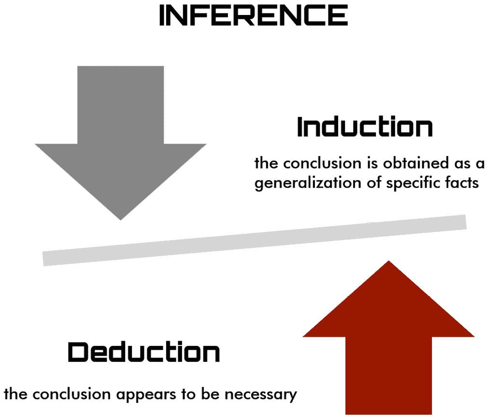
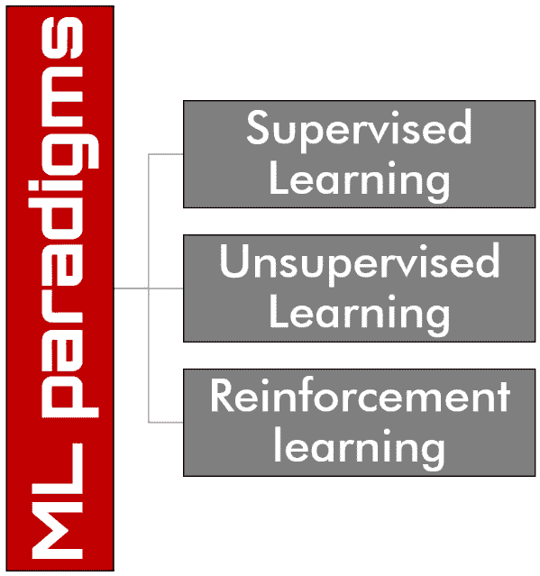
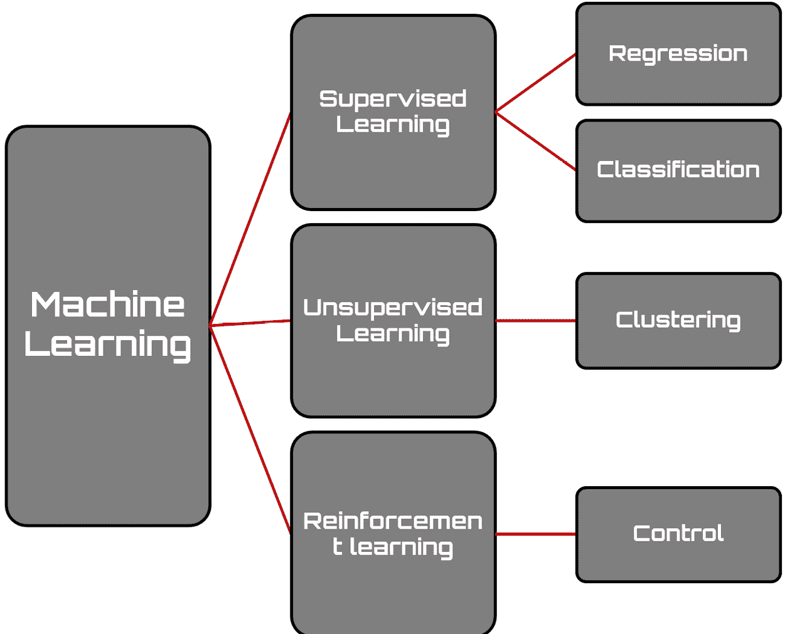
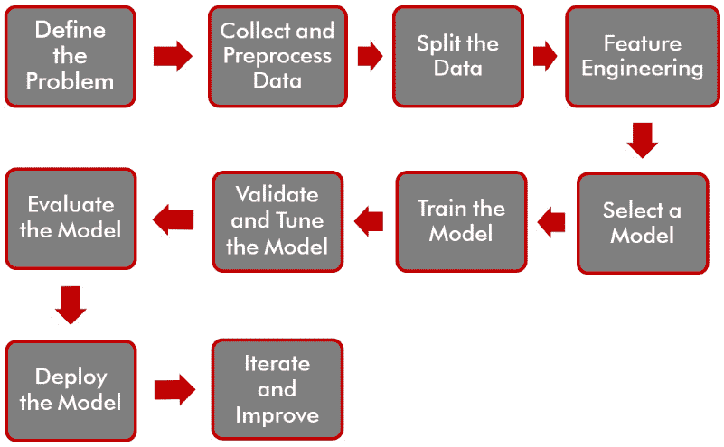

# 第一章：探索 MATLAB 在机器学习中的应用

**机器学习（ML**）是人工智能的一个分支，它基于算法和数学模型的发展，这些模型能够从数据中学习并自主适应，根据一系列目标来提高其性能。得益于这种学习能力，机器学习被广泛应用于数据分析、计算机视觉、语言建模、语音识别、医疗诊断和金融风险评估等领域。机器学习是一个不断发展的研究领域，正在改变许多科学和工业领域的面貌。本章的目标是向您提供机器学习的介绍、背景信息和基本知识，以及如何使用 MATLAB 工具应用这些概念的理解。

在本章中，我们将涵盖以下主要主题：

+   介绍机器学习

+   发现不同的学习过程类型

+   使用机器学习技术

+   探索 MATLAB 工具箱中的机器学习

+   机器学习在现实生活中的应用

# 技术要求

在本章中，我们将介绍与机器学习相关的基本概念。要理解这些主题，需要具备代数和数学建模的基本知识。同时，还需要对 MATLAB 环境有实际操作的了解。

# 介绍机器学习

机器学习基于向计算机提供大量输入数据以及相应的正确答案或标签的想法，并允许它们从这些数据中学习，识别其中的模式、关系和规律。与计算机遵循精确指令执行特定任务的传统的编程方法不同，机器学习允许机器独立地从数据中学习，并根据统计模型和预测做出决策。

机器学习的一个关键概念是泛化能力。这意味着在训练数据集中的信息上训练的模型应该能够对新数据做出准确的预测，而这些新数据是它以前从未见过的。这使得机器学习能够应用于广泛的领域。

## 如何定义机器学习

为了更好地理解机器学习（ML）的基本概念，我们可以从该领域先驱者提出的定义开始。根据亚瑟·L·塞缪尔（1959 年）的定义——“机器学习是研究计算机在没有明确编程的情况下获得学习能力的一个研究领域。”

提到的定义指的是从经验中学习的能力，这在大多数情况下是人类所做的事情。

机器学习（ML）是一个在计算机科学、统计学、神经生物学和控制理论交叉路口锻造的跨学科领域。它的实际应用已成功克服了各个领域的各种挑战，从根本上改变了软件开发范式。本质上，机器学习是一种赋予计算机一定自主性的基础方法。显然，机器学习从人类学习的研究中汲取灵感；正如人类大脑及其神经元是直觉的基础一样，人工神经网络是计算机决策的基础。机器学习通过仔细分析数据集，促进了能够准确描述数据模式的模型的创建。

作为说明，我们可以在给定系统中建立输入变量和输出变量之间的联系。实现这一目标的一种方法是通过假设存在一种生成参数数据的机制，尽管我们对参数值没有精确的了解。这一过程通常被称为采用统计方法。

## 逻辑推理分析

逻辑推理基于归纳、演绎和推理的概念。以下是它们之间的区别：

+   **归纳**是一种从具体观察或数据出发，得出一般结论的推理过程。换句话说，它是基于具体例子提取一般规则或原则。归纳对于做出预测和概括是有用的，但得到的结论并不一定是确定的。

+   **演绎**是一种从一般前提或规则出发，得出具体结论的推理过程。换句话说，它是将一般原则应用于获取具体信息。演绎基于形式逻辑和有效推理规则的使用。演绎从给定前提中产生逻辑上正确的结论。

+   最后，**推理**是一种基于现有证据或信息，引导我们得出结论、演绎或判断的推理过程。推理可能涉及归纳和演绎，以及其他形式的推理，如类比。推理可以被视为应用推理规则或策略以获取新信息或基于现有信息得出结论。

总结来说，归纳是基于从具体例子中提取一般原则，演绎是基于将一般原则应用于获得具体结论，而推理是一个更广泛的概念，它包括归纳和演绎，以及其他推理过程。

在机器学习的领域里，教师和学习者是两个关键实体，它们发挥着重要作用。教师拥有执行给定任务所需的知识，而学习者的目标是获取这些知识以执行任务。根据学习者执行的推理水平，可以区分学习策略，考虑两个极端：**无推理**和**大量推理**。

当一个计算机系统（学习者）被直接编程时，它通过不进行任何推理来获取知识，因为所有认知过程都由程序员（教师）处理。相反，当一个系统自主找到新的解决方案时，它需要大量的推理。在这种情况下，通过实验和观察获得组织化的知识。在下图中，展示了推理任务中归纳和演绎之间的区别。

图 1.1 – 逻辑推理关键点

在归纳和演绎之间有一个称为推理的中点——例如，假设一个学生试图通过将工作簿中提供的解决方案进行类比来解决数学挑战。这项活动需要推理，尽管不如发现新的数学定理那么复杂。

通过提高学习者的推理能力，对教师的依赖减少。以下机器学习努力的分类法试图从学习者与教师所需工作量的权衡角度描绘概念。

## 学习策略类型

根据执行的推理，我们可以识别出学习系统可以采用的不同机制。让我们看看其中的一些：

+   **死记硬背学习**：让我们从一个基本的方法开始，即死记硬背学习，它涉及对内容的使用，而不对其进行任何转换。没有激活推理过程，知识也没有以任何方式处理；它本质上是一个需要学习者付出相当努力的记忆过程。

+   **从指令中学习**：当从教师那里获取知识时，学习者需要将呈现的信息转换成可以内部处理的形式。此外，学习者将新知识与现有理解整合起来以有效利用它至关重要。这个过程涉及学习者一定程度的推理，但大部分责任在于教师。教师必须以逐步增强学生现有知识的方式呈现和组织知识。这符合大多数正式教育方法中采用的方法。因此，机器学习的任务涉及开发一个能够接收指令或建议、存储它并有效应用所获得知识的系统。

图 1.2 – 基于推理执行的 学习策略类型学

+   **通过类比学习**：在获取新的陈述或技能时，涉及将现有知识转换和增强，这些知识与新环境有很强的相似性。这使得转换后的知识能够在新环境中有效应用。例如，一个通过类比学习的系统可以用来将代码转换为实现密切相关功能的代码，即使它最初并不是为此目的设计的。与之前的学习机制相比，通过类比学习需要学习者进行更多的推理。学习者必须从他们的记忆中检索出与相关参数相关的相关事实或技能。然后，检索到的知识需要被转换，与新的环境相关联，并归档以供将来使用。

+   **从例子中学习**：当面对一组实例，包括支持一个想法的例子和与之矛盾的反例时，学习者推断出该想法的泛化描述。这个描述包括所有正面例子，同时系统地去除负面例子。在人工智能领域，从例子中学习已经得到了广泛的研究。在这个方法中，与从指令中学习相比，学习者进行更高程度的推理，因为没有教师提供一般性想法。它还涉及比通过类比学习略高的推理水平，因为没有提供相关想法作为开发新概念起点。

+   **从观察中学习**：这种归纳学习形式非常灵活，包括各种任务，如发现系统、理论形成以及为创建分类等级建立分组原则。与讨论的其他方法不同，这种学习形式不依赖于外部教师。相反，学习者需要参与广泛的推理。他们不会得到一组特定想法的特定例子，也没有访问到能够以自动方式将产生的实例分组为任何给定概念的正面或负面例子的预测。此外，学习者必须同时处理多个概念，这引入了在注意力分配方面的重大挑战。

+   **分块学习**：这是一种认知策略，涉及将信息分解成更小、更易于管理的单元或“块”，以增强记忆和理解。这种技术利用了大脑自然地以有意义的集群组织和处理信息的倾向。通过将相关概念分组在一起，学习者可以更容易地吸收和保留复杂材料。分块在多种教育环境中特别有效，从记忆列表和序列到掌握复杂主题。当信息被组织成连贯的块时，更容易把握不同组件之间的关系，从而促进对整体内容的更深入理解。这种方法在语言习得等领域的特别有益，将短语或单词分解成可管理的块有助于更快、更有效地学习。此外，分块促进了高效的回忆和问题解决。学习者不必努力记住单个信息片段，而是可以访问更广泛的知识块，从而实现更快、更准确的检索。这种认知策略与大脑并行处理信息的能力相一致，优化了学习过程，提高了整体认知性能。本质上，分块学习使个人能够更轻松、更有效地导航信息的复杂性。

分析一个系统可以采用的学习机制将帮助我们更好地理解在基于机器学习的系统中可以采用的不同类型的学习过程。

# 发现不同类型的学习过程

学习基于这样的理念：感知不仅应该指导行动，还应该增强代理从与世界互动以及决策过程中自动学习的能力。一个系统被认为具有学习能力，当它有一个用于做出决策的执行组件和一个用于修改执行组件以改进决策的学习组件时。学习受到从系统中学习到的组件、执行行动后收到的反馈以及所使用的表示类型的影响。

机器学习提供了几种让算法从数据中学习的方法，这些方法根据学习系统基于的反馈类型分为不同的类别。在选择用于特定问题的学习类别之前必须预先进行评估，以找到最佳解决方案。评估算法的鲁棒性是有用的，例如，即使有缺失数据，它也能做出正确预测的能力，可扩展性，算法在小或大数据集上的效率，以及可解释性，这指的是将比客观结果更为主观的结果归因于可能性的可能性。

图 1.3 – 不同类型的学习过程

根据学习过程中所经历的体验类型，可以将机器学习算法进行分类。通常将机器学习的范式分类如下：

+   **监督学习**：算法通过观察一组示例生成一个函数，这些示例中每个数据输入都有其相对的输出数据，用于构建预测模型。

+   **无监督学习**：算法试图从一般输入中推导知识，而不需要一组预先分类的示例的帮助，这些示例用于构建描述性模型。这些算法应用的典型例子是搜索引擎。

+   **强化学习**：算法可以根据执行过程中环境发生的改变来学习。代理根据其采取的行动以奖励或惩罚的形式获得反馈，这使它能够在一段时间内学习最佳策略。实际上，由于每个行动在相关环境中都有一些影响，算法是由相同的反馈环境驱动的。其中一些算法用于自动驾驶汽车和自主 AlphaGo 游戏。

让我们详细看看这些类别，分析它们的特征，并尝试理解如何为我们的问题选择最合适的范式。

## 监督学习

监督学习是一种机器学习技术，旨在使计算机系统能够自动解决任务。这个过程涉及提供输入数据，通常是向量的形式，形成一个集合，称为 *I*。输出数据定义为集合 *O*，并建立一个函数 *f* 来将每个输入与正确的答案关联起来。用于训练的这一组数据被称为训练集。

*O**=**f**(**I**)*

所有监督学习算法的潜在原理是，如果有足够的示例，算法可以创建一个派生函数 *B*，该函数近似于所需的函数 *A*。如果近似足够准确，派生函数应该提供与所需函数类似的输出答案，使其可接受。这些算法依赖于相似输入对应相似输出的假设。然而，这种假设通常并不完全成立。尽管如此，在某些情况下，这种近似是可以接受的。

在这种学习类型中，例如，可以使用正确标记的动物图像作为输入，使算法学习特定动物的特征与包含它的图像之间的相关性。这样做是为了使算法能够在给定包含该类型动物的图像输入的情况下识别它。算法学习识别某种模式以理解图像与分配的标签之间的相关性，然后推导出一个一般规则，以识别后续数据中是否存在相同的关联。

因此，要使用监督学习，必须有已知输出的数据。在完全可观察的环境中，系统可以看到其行动产生的影响，并可以使用监督学习方法来学习预测它们。如果环境不是完全可观察的，那么即时的影响可能是不可见的。这些算法的性能高度依赖于输入数据。如果只提供了少量训练输入，算法可能缺乏足够的经验来产生正确的输出。另一方面，过多的输入会使算法运行过慢，因为导出的函数变得更加复杂。

此外，监督学习算法对噪声敏感。即使是一小部分错误的数据点也可能使整个系统不可靠，导致错误决策。

当输出值是分类的，例如属于/不属于某个类别的成员资格，这被视为一个分类问题。另一方面，如果输出是在一定范围内的连续实数值，则被归类为回归问题。

## 无监督学习

无监督学习的目标是自动从数据库中提取信息，而无需事先了解要分析的内容。与监督学习不同，没有关于成员类别或对应于给定输入的输出的信息。目标是获得一个能够发现有趣属性（如具有相似特征（聚类）的示例组）的模型。这些算法的应用示例可见于搜索引擎。通过提供一个或多个关键词，它们可以生成与我们的搜索相关的链接列表。以下图中突出了监督学习与无监督学习之间的差异。

图 1.4 – 监督学习与无监督学习

无监督学习的目标是自主学习输入数据的潜在结构。结果受关于输入哪些数据以及它们呈现顺序的决策影响。这种方法以不同的方式重新组织数据，为后续分析创建更有意义的数据簇，并使发现数据中先前未注意到的模式成为可能。一个能够进行纯粹无监督学习的系统缺乏学习采取哪些行动的能力，因为它缺乏关于构成正确行动或达到期望状态的必要信息。

无监督学习通常用于聚类问题，它根据共享特征识别数据组，从而创建数据簇。此外，这种方法还用于关联学习，涉及在输入数据中识别关联规则以及在推荐系统中。

这些算法的有效性取决于它们可以从数据库中提取的信息的价值。这些算法通过仔细审查数据并积极寻找它们之间的相似性或差异来工作。当前的数据仅与描述每个个体示例的属性数组有关。

无监督学习在处理数值元素时表现出高效率，但当处理非数值数据时，其准确性会降低。通常，当数据表现出清晰有序或易于识别的明确分组时，这些算法表现良好。

## 强化学习

强化学习旨在开发能够学习和适应其环境变化的算法。这种编程技术基于算法根据其选择接收外部刺激的概念。做出正确的选择会得到奖励，而错误的选择则会受到惩罚。系统的最终目标是实现最佳可能的结果。

与监督学习不同，在监督学习中，教师为系统提供正确的输出（有指导的学习），这并不总是可行的。通常，只有定性信息可用，有时以二进制形式存在（如正确/错误或成功/失败）。这些可用的信息片段被称为强化信号。然而，系统不会提供任何关于如何更新代理作为优化算法以及环境作为我们想要学习优化器的目标函数族的指导。系统的目标是创建“智能”代理，这些代理能够从他们的经验中学习。

强化学习算法基于根据实现的目标分配的奖励来运行。这些奖励对于理解哪些动作是可取的并应该追求，以及哪些动作应该避免至关重要。没有奖励，算法将难以做出决策。当算法需要做出有后果的决策时，会使用强化学习。它不仅限于描述性，还成为指导性的，提供关于采取哪些行动的指导。这种学习在机器学习领域非常创新，非常适合理解环境是如何运作的。强化学习算法的流程在以下图中展示。

图 1.5 – 强化学习机制

一个关键方面是算法将反馈解释为强化而不是新输入的能力。强化学习的目标是利用收到的反馈构建一个最佳策略，最大化总期望奖励。特定的策略代表特定的更新公式。因此，学习策略等同于学习更新公式，因此是优化算法。这种方法允许在不明确定义从反馈中推导出的规则的情况下训练算法。这在定义规则可能具有挑战性的复杂领域特别有用，并且可以大大提高性能。

强化学习包括被动学习和主动学习。在被动学习中，智能体遵循固定的策略，旨在学习状态-动作对的效用。在某些情况下，智能体还需要学习环境的模型。在主动学习中，智能体必须学习采取哪些行动，并通过探索在环境中如何行为获得经验。实现这一策略的一种方法是通过让算法在没有提供规则的情况下玩游戏。当智能体采取允许或有益的行动时，给予正反馈，而对于不希望的行动则提供负反馈。这允许算法在游戏中学习最佳移动，而不需要了解游戏规则。智能体仅基于收到的反馈和没有先验知识，学习在环境中成功行为。

除了刚刚看到的三个学习范式（监督学习、无监督学习和强化学习）的三个支柱之外，还有一些从这些方法中衍生出来的新类型。让我们看看其中的一些。

## 半监督学习

半监督学习结合了监督学习和无监督学习的优点。最初，通过提供输入及其相应的输出采用监督方法。然后，引入额外的相似输入，但不提供相关的输出参考。这些插入的输入和输出有助于创建一个通用模型，该模型可以用于预测剩余输入的输出。

该过程从监督阶段开始，使用标记数据来训练模型。该模型学习根据提供的标签将输入映射到相应的输出。一旦训练了初始模型，就可以用它来对未标记数据进行预测。

在无监督阶段，模型使用未标记的数据来提取数据中的模式、结构或关系。这可以通过聚类、降维或生成建模等技术来完成。通过利用未标记的数据，模型可以更好地理解数据的潜在分布，并可能提高其性能。

半监督学习的目标是利用从标记和无标记数据中获得的知识来创建一个更稳健和准确的模型。通过结合标记数据的明确指导和无监督学习捕获隐藏模式的能力，半监督学习可以是一种强大的方法，特别是在获取标记数据昂贵或耗时的情况下。

## 迁移学习

迁移学习提供了将解决一个问题的获得的知识转移到有效解决类似问题的能力。重用知识的显著优势显而易见，尽管由于需要将许多机器学习算法适应特定情况，这可能并不总是可行的。

迁移学习涉及利用解决一个问题所获得的知识并将其应用于不同但相关的另一个问题。在迁移学习中，一个在大数据集上训练过的预训练模型被用作解决新任务或问题的起点。

迁移学习背后的基本思想是，一个模型在一个任务上学习到的特征对另一个任务可能是有用的。通过这种方式，迁移学习允许我们将预训练模型获得的知识和表示转移到新任务上，而不是从头开始学习过程。采用这种方法可以显著减少新任务所需的训练数据和计算资源。

迁移学习通常有两种主要方法：

+   **微调**：在这种方法中，预训练模型被进一步训练在新任务上，使用的是针对新任务的小型数据集。其想法是调整预训练模型的参数，使其对新问题更相关，同时保留它已经学习到的知识。

+   **特征提取**：采用这种方法时，预训练模型被用作一个固定的特征提取器，可供深度学习模型使用。预训练模型的早期层被冻结，只有后期层被替换或修改以适应新任务。新数据通过预训练模型传递，最后几层的输出特征被提取并用作新分类器或特定于新任务的模型的输入。

当预训练模型在大而多样化的数据集上训练时，迁移学习尤其有效，因为它倾向于学习对广泛任务有用的通用特征。通过利用现有知识，迁移学习可以实现更快的训练、更好的性能和在新任务上的改进泛化，尤其是在新任务的标记数据有限或不可用的情况下。

在介绍了不同的学习范式之后，我们可以继续分析如何使用基于机器学习的技术来解决问题。

# 使用机器学习技术

在上一节中，我们详细探讨了各种机器学习范式。因此，我们已经理解了不同方法背后的基本原理。在这个阶段，有必要了解使我们能够区分不同方法的元素是什么；换句话说，在本节中，我们将了解如何恰当地选择必要的机器学习方法以获得我们的结果。

## 选择机器学习范式

在众多选项中，包括监督和无监督方法，每种方法都采用不同的学习策略，选择合适的机器学习算法可能会感到不知所措。

没有一种普遍适用的方法，也没有一种适合所有情况的方法。在很大程度上，寻找合适的算法涉及试错；即使是经验丰富的数据科学家也无法在没有测试的情况下确定一个算法是否有效。尽管如此，算法的选择也受到诸如数据格式和类型、要提取的信息以及如何利用这些信息等因素的影响。

这里有一些指导方针，可以帮助选择最合适的方法：

+   当目标是训练一个用于预测的模型时，例如确定连续变量的未来值，如气压或股价，或执行分类任务，如从网络摄像头录像中识别车辆类型，应选择监督学习。

+   当目标是分析数据并开发一个发现有意义的内部表示的模型时，例如将数据聚类成不同的组，应选择无监督学习。

+   当目标是在一个不确定的环境中实现目标，其中所有变量都无法预测时，选择强化学习。当有多种完成任务的方式，但需要遵循某些规则时，这种方法非常有价值。例如，自动驾驶中遵守交通规则是至关重要的。

通过考虑这些因素并将它们与特定目标和数据特征相一致，一个人在选择合适的机器学习范式时可以做出更明智的选择。

学习范式和具体算法的选择显然取决于我们处理的数据的特征。这包括数据大小、质量、性质以及期望的结果和算法的实现细节。

没有一种普遍适用的方法或一刀切解决方案。确定算法适用性的唯一方法是通过实验并使用适当的指标来评估其性能。

然而，我们可以进行初步分析，以更好地理解符合我们要求的方案。我们首先考虑我们有什么（数据），可用的工具（算法），以及我们想要实现的目标（结果）。通过这种分析，我们可以收集有价值的信息来指导我们的决策过程。以下图显示了不同的学习范式和可以解决的活动。

图 1.6 – 机器学习算法分类

让我们从数据和其特征分类开始。这种分类帮助我们确定以下选项：

+   **基于输入的分类**：如果我们有标记的输入数据，这表明是一个监督学习问题。如果没有标记但我们要揭示系统的结构，这表明是一个无监督学习问题。最后，如果我们希望通过与环境交互来优化目标函数，这表明是一个强化学习问题。

+   **基于输出的分类**：如果模型的输出是数值，这表明是一个回归问题。如果输出是分类的，这表明是一个分类问题。如果输出涉及对输入数据进行分组，这表明是一个聚类问题。

一旦我们对问题进行了分类，我们就可以探索可用的工具来解决它。这涉及到识别适用的算法，并专注于实现这些工具以解决我们特定问题的所需方法。

在确定工具之后，我们需要评估它们的性能。这可以通过将选定的算法应用于我们的数据集来完成。通过仔细选择评估指标，我们可以比较每个算法的性能。

通过遵循数据分析、问题分类、工具识别和性能评估的过程，我们可以做出明智的决定，并选择最适合我们需求的算法。

## 构建机器学习模型的分步指南

一旦选择了应用于我们数据中的算法，在着手处理手头任务之前，建立一个明确的流程至关重要。在实际实施之前，分配一些时间来设置流程至关重要。在开发基于机器学习的应用程序时，此过程通常涉及以下步骤：

1.  **定义问题**：明确阐述你想要用机器学习解决的问题。确定具体任务，如分类、回归或聚类，并了解目标和要求。

1.  **收集和预处理数据**：收集与你的问题相关的数据。确保数据质量高、具有代表性，并覆盖广泛的场景。通过处理缺失值和异常值，执行数据归一化或特征缩放和数据清洗来预处理数据。任何数据驱动过程的基础在于数据本身，因此质疑如此大量数据的来源是自然的。数据收集涉及各种方法，通常通过广泛的程序，如测量活动或面对面访谈。无论采用的具体方法如何，收集到的数据通常存储在数据库中，以便进行分析并将其转化为有价值的见解和知识。

1.  **分割数据**：数据分割是机器学习中的一个关键步骤，用于有效地评估和验证模型的性能。它涉及将可用数据划分为用于训练、验证和测试的独立子集。广泛使用的数据分割技术，**训练-验证-测试分割**，允许将数据划分为训练集、验证集和测试集，如下所示：

    1.  **训练集**：用于模型训练的数据中最大的一部分。它被用来优化模型的参数并从数据中学习模式。

    1.  **验证集**：数据的一个较小子集，用于微调模型的超参数并在开发过程中评估其性能。它有助于避免过拟合并选择表现最佳的模型。

    1.  **测试集**：数据的一个独立部分，用作最终评估度量，以评估模型在未见示例上的泛化能力和性能。它提供了模型在现实世界场景中能力的无偏估计。以下流程图显示了机器学习模型的整个工作流程。

图 1.7 – 机器学习模型实现工作流程

1.  **特征工程**：从可用数据中提取或创建有意义的特征，这些特征可以帮助模型学习模式和做出准确的预测。这可能涉及转换或组合现有特征，对分类变量进行编码，或根据领域知识生成新特征。本质上，有两种主要方法：**特征提取**和**特征选择**。特征提取涉及将原始数据转换为一系列有意义的特征，这些特征可以有效地表示数据中的潜在模式和关系。它的目标是捕捉最相关的信息，并丢弃无关或冗余的数据。这个过程在处理高维或非结构化数据时尤其有用。特征选择涉及从可用特征集中选择最有信息和相关的特征子集。它有助于降低维度，提高模型的可解释性，并避免过拟合。

1.  **选择模型**：根据问题的类型、数据特征和可用资源选择合适的机器学习模型。我们已看到在选择学习范式时需要考虑哪些因素：*对算法类型的选取也需要进行充分的分析*。实际上，并非只有一种方法；有许多种，每种解决方案都有其优势和劣势。考虑如决策树、支持向量机、神经网络或集成方法等算法。研究和比较不同的模型，以确定最合适的一个，即最适合可用数据且能让我们做出充分推断和提取充分知识的模型。

1.  **训练模型**：现在，这个过程变得更加实质化。在这个阶段，机器学习成为核心，我们定义模型并继续进行训练。选定的模型开始从大量可用数据中提取有价值的见解，揭示我们之前未知的新知识。这标志着学习旅程的开始，模型深入数据以揭示尚未被揭示的模式、关系和隐藏信息。使用训练数据训练选定的模型。这涉及到向模型提供输入特征及其相应的目标值，并通过优化算法调整其内部参数。模型从训练数据中学习以做出准确的预测。

1.  **验证和调整模型**：在这个阶段，我们使用测试步骤中获得的知识来确定模型的有效性。评估一个算法涉及评估模型如何接近现实世界系统。在监督学习中，我们有已知值，这使我们能够评估算法的性能。在无监督学习中，采用替代指标来衡量成功。如果结果不满意，我们可以回顾前面的步骤，进行必要的调整，并重新测试模型，直到我们达到预期的结果。这个迭代过程允许我们在努力开发更准确和可靠的模型时进行优化和改进。在验证集上评估模型的表现。使用适合您特定问题的合适评估指标，例如准确率、精确率、召回率或均方误差。通过调整超参数，如学习率、正则化或层数，来微调模型，以优化其性能。

1.  **评估模型**：现在，我们已经到达了一个关键时刻，可以将我们的工作付诸实践。是时候将我们构建的模型应用于实际数据并评估其近似所需结果的能力了。经过彻底的训练和测试，模型现在在这个阶段被评估和估值。通过在真实数据上部署模型，我们可以观察其性能，分析其预测，并评估其与我们的期望如何相符。这一阶段使我们能够评估模型在实际场景中的实用性和有效性，为进一步的改进和优化提供宝贵的见解。一旦模型调整完毕，评估其在测试集上的性能，因为这提供了对模型在新鲜、未见数据上性能的无偏估计。评估模型的指标并分析其优势和劣势。考虑使用交叉验证等额外技术进行更稳健的评估。

1.  **部署模型**：如果模型满足预期的性能标准，就可以将其部署到实际应用中。这涉及到将模型集成到您的应用程序或系统中，并确保其与生产环境的兼容性。实施机制以监控和维护模型随时间推移的性能。构建机器学习应用的最终目标是解决问题，而这只有在机器学习模型在生产环境中被积极利用时才能实现。因此，机器学习模型的部署与开发阶段同等重要。部署意味着将训练好的机器学习模型从离线环境过渡到现有生产系统（如实时应用程序）的集成。这代表了一个必须完成的临界阶段，以使模型能够实现其预期目的并解决其设计时面临的挑战。部署建立了一个在线学习框架，其中模型会持续用新数据更新，从而实现持续改进。部署机器学习模型的精确过程取决于系统环境、模型类型和组织 DevOps 实践等因素。尽管如此，在容器化环境中，一般的部署过程可以总结为四个关键步骤，这些步骤将在稍后详细阐述。

1.  **迭代和改进**：最后，我们可以将注意力转移到最终任务上。在确认模型的函数性和评估其性能后，我们现在准备彻底分析结果，以确定任何可以进一步改进或优化的领域。这一阶段涉及对模型性能指标的全面审查，探索潜在的不足，并寻求改进的机会。通过深入分析，我们可以获得宝贵的见解，这将指导我们改进模型，解决任何限制，并最大化其功效。这一细致的评估过程对于实现高性能和稳健的机器学习解决方案至关重要。机器学习是一个迭代的过程。持续收集反馈，监控模型性能，并收集新数据以重新训练和改进模型。随着新见解的获得或需求的变化，相应地更新模型，以确保其有效性和准确性。

通过遵循这些步骤，你可以系统地构建机器学习模型，并迭代地提高其性能，以解决复杂问题并做出准确的预测或决策。

现在，我们对机器学习的基本理解以及如何选择最适合我们数据的学习范式和算法已经足够。下一步涉及对 MATLAB 环境为我们提供的资源进行初步探索，以构建我们的基于机器学习的应用程序。

# 探索 MATLAB 机器学习工具箱

到目前为止，我们已经了解了机器学习算法的功能和能力。我们还了解了如何识别各种类型的算法，选择满足我们需求的适当解决方案，并建立有效的流程。现在，是时候深入探讨在 MATLAB 环境中执行这些任务的过程了。

使用 MATLAB，解决机器学习问题的过程变得非常简单。MATLAB 提供的全面工具和功能集使用户能够轻松利用各种算法和技术。无论你是初学者还是有经验的从业者，MATLAB 都为你提供了必要的资源，让你有信心深入机器学习的世界。

MATLAB 是一个专门设计用来解决科学问题和促进设计过程的软件平台。它提供了一个集成环境，在这里计算、可视化和编程可以无缝结合。这个用户友好的环境允许使用熟悉的数学符号来表示问题和解决方案。

MATLAB 这个名字是**矩阵实验室**的缩写，突出了其最初专注于提供对矩阵相关软件方便访问的焦点。多年来，MATLAB 通过宝贵的用户反馈和输入而发展演变。MATLAB 编程语言以矩阵为中心，矩阵自然代表计算数学。这种基于矩阵的方法允许直观且高效地表示数学运算。

MATLAB 的桌面环境鼓励实验、探索和发现。其集成图形功能促进了清晰的可视化，并使用户能够全面理解底层数据。使用 MATLAB，用户能够轻松自信地参与各种科学和计算任务。

此外，MATLAB 因其广泛的专用解决方案集合而闻名，这些解决方案被称为工具箱。这些工具箱为应用问题提供特定解决方案，并为广大用户提供了无价的资源。它们提供了将 MATLAB 的能力应用于各种专用领域和技术所必需的基础和工具。每个工具箱都包含一组精心挑选的 MATLAB 函数，通常称为 M 文件，这些函数扩展了 MATLAB 环境的功能。这些工具箱针对特定的问题领域，使用户能够轻松解决复杂和专业的挑战，使 MATLAB 成为各种应用的多功能且全面的平台。

因此，让我们看看一些提供重要资源的工具箱，使我们能够充分基于机器学习构建我们的应用程序。

## 统计与机器学习工具箱

工具箱包含了一系列针对数据描述、分析和建模的函数和应用。它通过描述性统计、可视化和聚类技术促进探索性数据分析。可以对数据进行概率分布拟合，为蒙特卡洛模拟生成随机数，并执行假设检验。工具箱包括分类和回归算法，允许进行数据推理和构建预测模型。可以通过交互式方法，使用回归学习者和分类学习者应用程序，以及通过 AutoML 进行编程实现。

对于多维数据的特征提取和分析，工具箱提供了诸如**主成分分析**（PCA）、特征选择技术、降维方法和正则化等技术。这些方法有助于识别具有最大预测能力的变量。

工具箱包含一系列无监督、监督和半监督机器学习算法，包括**支持向量机**（**SVMs**）、提升决策树、浅层神经网络和 k-means 聚类。提供了可解释性技术，如部分依赖图、Shapley 和 LIME 值，并且可以自动生成 C/C++代码以进行嵌入式部署。本机 Simulink 模块块允许将预测模型与基于模型的设计和仿真集成。此外，工具箱中的许多算法旨在处理无法完全存储在内存中的数据集，从而实现大规模数据的有效处理。

该工具提供了一套全面的特性，涵盖了机器学习领域的关键领域。以下是它包含的主要主题和特性：

+   **回归技术**：这包括广泛的回归模型，如线性、广义线性、非线性、稳健、正则化、方差分析、重复测量和混合效应模型。

+   **大数据算法**：该工具提供专门为大数据分析设计的算法，包括降维、描述性统计、k-means 聚类、线性回归、逻辑回归和判别分析。

+   **概率分布**：提供了单变量和多变量概率分布，以及随机和准随机数生成器和马尔可夫链采样器。

+   **假设检验和实验设计**（**DOE**）：该工具提供了针对分布、离散度和位置的假设检验。它还提供了设计最优、因子和响应面实验的技术。

+   **分类学习器应用程序和算法**：对于监督机器学习，该工具提供了分类学习器应用程序，允许进行交互式探索和建模。它还提供了 SVMs、提升和袋决策树、k 最近邻、朴素贝叶斯、判别分析和高斯过程回归等算法。

+   **无监督机器学习算法**：该工具包括无监督机器学习算法，如 k-means 聚类、k-medoids、层次聚类、高斯混合模型和隐马尔可夫模型。

+   **贝叶斯优化**：它提供了贝叶斯优化技术来搜索最优超参数并微调机器学习算法。

这些功能共同使该工具成为各种机器学习任务的全面解决方案，并使用户能够有效地探索、分析和建模各种场景中的数据。

## 深度学习工具箱

深度学习工具箱是一个强大的资源，用于设计和实现深度神经网络。它提供了一系列算法、预训练模型和应用，以促进深度学习解决方案的开发。

下面是深度学习工具箱的关键特性：

+   **卷积神经网络**（**ConvNet, CNN**）和**长短期记忆**（**LSTM**）网络：这些网络架构能够在图像、时间序列和文本数据上执行分类和回归任务。

+   **网络架构**: 工具箱支持各种网络架构，包括**生成对抗网络**（**GANs**）和 Siamese 网络。这些架构可以通过自动微分、自定义训练周期和共享权重来构建。

+   **深度网络设计器应用**: 使用深度网络设计器应用，用户可以通过图形界面设计、分析和训练网络。这允许直观的网络探索和定制。

+   **实验管理器应用**: 实验管理器应用简化了对大量深度学习实验的监督。它协助监控训练指标、评估结果，并在各种实验之间对比代码，提供高效的流程。

+   **与其他框架的集成**: 深度学习工具箱提供了与流行的深度学习框架（如 TensorFlow 2、TensorFlow-Keras、PyTorch、**开放神经网络交换**（**ONNX**）和 Caffe）的无缝集成。这使得网络、层图和模型的导入和导出变得容易。

+   **迁移学习和预训练模型**: 工具箱通过提供对预训练模型（如 DarkNet-53、ResNet-50、NASNet 和 SqueezeNet）的访问来支持迁移学习。这些模型可以用来加速开发过程并实现优异的性能。

利用预训练的图像分类神经网络可以让你利用其从自然图像中提取有意义特征的知识。这作为学习新任务的一个有价值的起点。ImageNet 数据库通常用于训练预训练神经网络；这是在**ImageNet 大规模视觉识别挑战**（**ILSVRC**）中大量使用的数据。这些算法在包含超过一百万个图像的数据集上进行了训练，能够将图像分类到 1,000 个不同的对象类别。采用预训练神经网络并应用迁移学习通常比从头开始训练神经网络更高效、更节省时间。

深度学习工具箱使用户能够在深度学习项目中高效工作，提供高级功能、可视化工具以及与各种框架和预训练模型的兼容性。

## 强化学习工具箱

强化学习工具箱提供了一个应用、函数和一个 Simulink 模块，用于使用强化学习算法训练策略。这些算法可以用于开发复杂应用（如资源分配、机器人和自主系统）的控制器和决策算法。

使用此工具箱，你可以使用深度神经网络或查找表来表示策略和值函数，并通过与在 MATLAB 或 Simulink 中建模的环境交互来训练它们。工具箱中提供的强化学习算法可以与一个或多个智能体一起评估，或者你可以创建自己的自定义智能体。你可以灵活地实验超参数设置，监控训练进度，并通过应用程序或程序性地交互式模拟训练好的智能体。为了提高训练性能，可以在多个 CPU、GPU、计算机集群和云上并行执行模拟。

此外，ONNX 模板格式允许你从流行的深度学习框架（如 TensorFlow Keras 和 PyTorch）导入现有的策略（需要 Deep Learning Toolbox）。你还可以生成优化的 C、C++和 CUDA 代码，以便在微控制器和 GPU 上部署训练好的策略。工具箱包括参考示例，帮助你开始你的强化学习之旅。

在强化学习的背景下，环境扮演着至关重要的角色，因为它模拟了智能体运作的动态。环境遵循以下关键原则：

+   **它接收来自智能体的动作**：智能体根据其策略或决策策略选择并发送动作到环境中。

+   **它生成观察结果**：环境产生观察结果，反映了在智能体行动之后系统或环境的状态。这些观察结果捕捉了动态行为，并为智能体提供反馈。

+   **它提供奖励**：环境根据智能体动作的结果为智能体分配奖励。奖励衡量智能体的动作对实现期望的任务或目标贡献了多少。

在 MATLAB 中，你可以灵活地为你的强化学习场景创建预定义和自定义的环境。这允许你模拟智能体在学习过程中可能遇到的具体动态和交互。使用 MATLAB，你可以定义环境的规则、约束和特性，使其适应你特定的领域问题。

## 计算机视觉工具箱

MATLAB 中的计算机视觉工具箱为设计和测试计算机视觉、3D 视觉和视频处理系统提供了广泛的功能。以下是它提供的关键特性和功能：

+   **目标检测和跟踪**：你可以使用算法和函数在图像或视频中检测和跟踪对象。

+   **特征检测、提取和匹配**：工具箱包括从图像中检测和提取特征以及跨多个图像匹配特征的函数。

+   **相机标定**：自动化工作流程可用于标定单目、立体和鱼眼相机，确保精确的测量和几何变换。

+   **3D 视觉**：该工具箱为各种任务提供支持，包括立体视觉、点云处理、运动结构化和视觉**同时定位与地图构建**（**SLAM**）。

+   **计算机视觉应用**：该工具箱提供用户友好的应用，用于自动化地面实况标记和相机校准工作流程。

+   **基于深度学习的目标检测和分割**：此工具允许您使用深度学习算法（如 SSD、YOLO 和 ACF）进行目标检测。此外，它还允许使用深度学习算法（如 Mask R-CNN 和 U-Net）进行语义和实例分割。

+   **大图像支持**：该工具箱包括可以处理无法装入内存的图像的算法，从而能够分析高分辨率或吉像素图像。

+   **性能加速**：您可以利用多核处理器和 GPU 的强大功能来加速您的计算机视觉算法。

+   **代码生成**：MATLAB 的代码生成功能允许您生成 C/C++代码，以与现有代码集成、在桌面系统上进行原型设计，以及在嵌入式视觉系统上部署算法。

使用计算机视觉工具箱，您拥有一套全面的工具和函数，用于处理各种计算机视觉任务，从基本的图像处理到基于深度学习的目标检测和分割。

## 文本分析工具箱

MATLAB 中的文本分析工具箱提供了一系列算法和可视化工具，用于预处理、分析和塑造文本数据。它旨在支持各种应用，包括情感分析、语言建模、机器翻译和主题建模。以下是文本分析工具箱的关键特性：

+   **文本预处理**：您可以使用工具箱处理从各种来源提取的原始文本数据，如设备日志、新闻源、调查、操作员报告和社交媒体。工具箱提供从流行文件格式中提取文本的工具，以及执行清理、分词和停用词移除等预处理任务的工具。

+   **文本提取和转换**：使用该工具箱，您可以从文本数据中提取单个单词或 n-gram，并将它们转换为适合分析的数值表示。这使得您能够将原始文本转换为结构化和有意义的特征。

+   **统计建模**：文本分析工具箱提供机器学习技术，如**潜在语义分析**（**LSA**）、**潜在狄利克雷分配**（**LDA**）和**词嵌入**，以揭示大型文本数据集中的模式、集群和主题。这些模型有助于理解文本数据的潜在结构和内容。

+   **与其他数据源集成**：使用文本分析工具箱生成的特征能够与来自不同数据源的特征合并，包括数值或分类数据。这种集成允许您开发综合的机器学习模型，利用多种数据类型以提升性能和洞察力。

文本分析工具箱提供了一套全面的工具，用于处理和分析文本数据。通过利用机器学习技术和将文本特征与其他数据源相结合，您可以获得宝贵的洞察力，并为各种应用开发强大的预测模型。

在探索了 MATLAB 中用于构建基于机器学习应用的工具之后，我们现在可以分析现实生活中已经存在的、利用这项技术的应用示例。这样，我们将能够获得一些有趣的想法，并立即开始思考如何将机器学习应用于我们的工作环境。

# 机器学习在现实生活中的应用

作为现代创新的机器学习，已经彻底改变了众多工业和专业流程，提升了我们日常生活的各个方面。由机器学习算法驱动的智能系统具有从历史数据或以往经验中学习的能力。通过利用这种知识，机器学习应用可以生成结果和洞察力。

机器学习（ML）被应用于许多研究领域，其中主要的有以下几类：

+   知识和推理的表示，旨在通过定义符号和语言来复制人脑的推理方式，创建能够执行自动推理的机器

+   规划和协调，涉及开发系统，这些系统在给定一个应用领域时，其目标是预测未来结果并做出决策以实现这些目标并最大化其效益

+   机器人学，涉及与机械部件的运动相关的学习，以创建执行特定任务或对特定现象做出反应的动作序列，物体的操作或移动，或地图的定位或构建

+   自然语言处理，涉及对自然语言的自动解释，包括书面和口语形式

+   人工智能视觉：处理和分析图像、模式识别以及场景自动分析的一套过程，使用 2D 和 3D 技术

机器学习在现实生活中有广泛的应用；以下是一些例子：

+   **面部识别**：面部识别被广泛应用于许多应用中，例如智能手机上的生物识别认证、公共场所的安全监控以及为调查目的识别个人

+   **个性化推荐**：Netflix、Amazon 和 Spotify 等平台使用机器学习算法分析用户数据，并根据他们的口味和偏好推荐个性化的内容或产品

+   **虚拟助手**：像苹果的 Siri、亚马逊的 Alexa 和谷歌助手这样的虚拟助手依赖于机器学习算法来理解并回答用户的问题，以及在日常活动中提供信息和支持。

+   **自动驾驶汽车**：机器学习在自动驾驶汽车的开发中发挥着关键作用。自动驾驶系统使用机器学习算法来分析传感器数据，并实时做出导航和道路安全的决策。

+   **欺诈检测**：金融机构使用机器学习模型来分析消费模式和客户交易，以识别可疑行为或欺诈交易并预防欺诈。

+   **医疗诊断**：机器学习用于分析大量医疗数据，如诊断图像、患者记录和遗传数据，以帮助医生诊断和治疗疾病。

+   **优化供应链**：公司使用机器学习算法来优化库存管理操作、预测客户需求以及优化配送时间，提高效率并降低成本。

+   **情感感知**：使用机器学习算法进行情感分析在多个应用中都有使用，例如分析社交媒体上的情绪、评估用户对产品或服务的反馈，以及个性化用户体验。

这些只是机器学习在现实生活中应用的几个例子。其应用正在不断增长，其影响在不同领域日益明显。

让我们继续到下一部分总结。

# 总结

在本章中，我们开始了探索机器学习世界的激动人心的旅程，探索了一系列流行的算法以找到最适合我们特定需求的算法。我们学习了进行初步分析以确定最合适的算法的重要性，并了解了构建机器学习模型的逐步过程。

此外，我们深入研究了 MATLAB 在机器学习方面的强大功能，包括其对分类、回归、聚类和深度学习任务的支持。我们发现使用 MATLAB 应用程序进行自动模型训练和代码生成非常方便，从而简化了我们的工作流程。

我们还介绍了统计和机器学习工具箱以及深度学习工具箱，这些为我们提供了额外的工具和功能来解决我们特定的难题。我们认识到统计和代数在机器学习领域的重要性，并理解 MATLAB 如何帮助我们有效地利用这些概念。

展望下一章，我们将专注于无缝交互 MATLAB 工作空间。我们将探讨在 MATLAB 中导入和组织数据的技巧，以及从工作空间导出数据的方法。此外，我们还将学习如何为数据分析的后续阶段正确格式化和组织数据。

通过掌握这些基本技能，我们将为应对数据分析挑战并充分利用 MATLAB 在后续章节中的功能做好准备。

因此，在下一章中，我们将学习如何将数据导入和导出到 MATLAB。我们将了解如何处理不同类型的数据以及如何进行数据清洗。此外，我们还将了解探索性统计和探索性可视化、数据归一化、特征缩放和数据增强。
