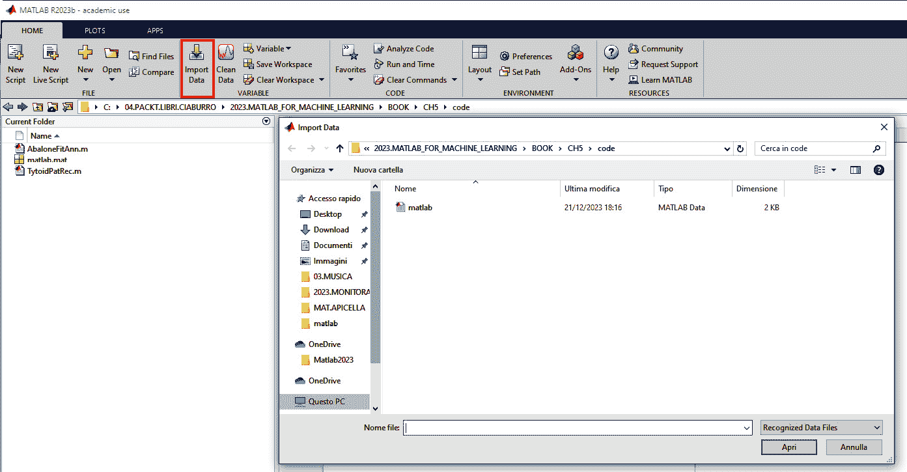
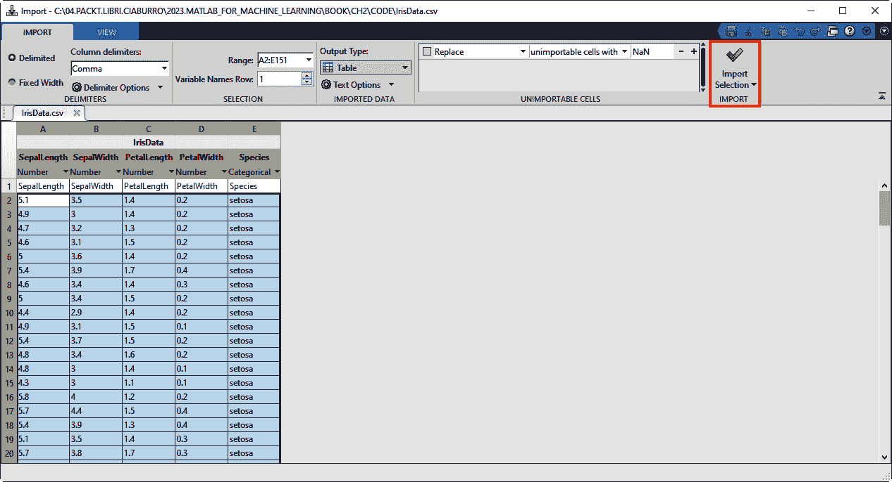
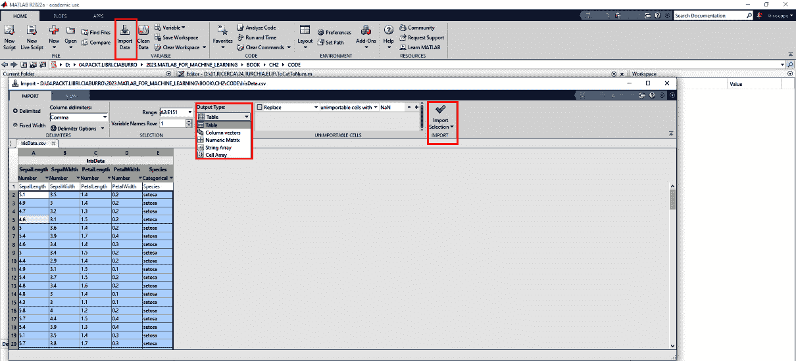
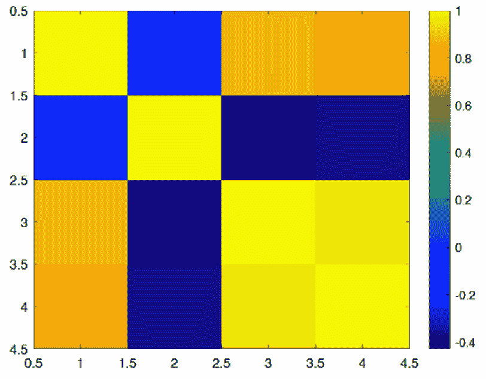
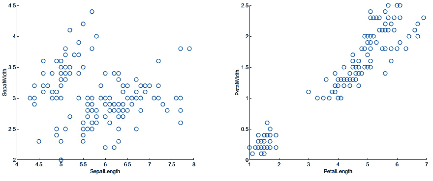

# 第二章：在 MATLAB 中处理数据

今天，生成数据的数量是巨大的；计算机、智能电视、智能手机、家用电器、信用卡、传感器、公共交通和自动化系统：这些设备轻松地产生大量数据，这里只是其中的一小部分。存储和使用此类数据服务于各种目的。一个值得注意的应用是利用**机器学习**（**ML**）算法进行数据分析。本章深入探讨了在 MATLAB 中导入和组织数据的过程。为了实现这一点，熟悉 MATLAB 工作空间以简化操作至关重要。然后，章节继续检查收集到的数据的各种数据格式，并进一步探索收集数据的各种格式，提供导入和导出数据到 MATLAB 的指导。此外，它还深入探讨了适合管理分组变量和分类数据的数据类型。该部分通过详细说明从工作空间导出数据的过程结束，包括单元数组、结构数组和表格数据，并将它们存储在 MATLAB 支持的文件格式中。

最后，它提供了关于为数据分析后续阶段组织数据的见解。

在本章中，我们将涵盖以下主要主题：

+   将数据导入 MATLAB

+   读取 ASCII 分隔的文件

+   从 MATLAB 导出数据

+   处理不同类型的数据

+   探索数据整理

+   探索探索性统计学

+   介绍探索性可视化

+   理解 MATLAB 中高级数据预处理技术

# 技术要求

在本章中，我们将介绍机器学习的基本概念。要理解这些主题，需要具备代数和数学建模的基本知识，并且还需要熟悉 MATLAB 环境。

要使用本章中的 MATLAB 代码，你需要以下文件（可在 GitHub 上找到：[`github.com/PacktPublishing/MATLAB-for-Machine-Learning-second-edition`](https://github.com/PacktPublishing/MATLAB-for-Machine-Learning-second-edition))：

+   `IrisData.csv`

+   `matrix.mat`

+   `matrix.txt`

+   `NumMatrix.txt`

+   `ItalianMuseum.xlsx`

+   `DataItalianCities.txt`

+   `coliseum.jpg`

+   `Apollo13.wav`

+   `CleaningData.xlsx`

+   `GlassIdentificationDataSet.xlsx`

# 将数据导入 MATLAB

分析环境与外部设备之间的数据交换在数据分析中起着关键作用。导入数据是指将外部数据带入软件或平台进行进一步分析、处理或存储的过程。此操作流程可以通过以下步骤在 MATLAB 中开发：

1.  **准备你的数据**：确保你的数据处于兼容的格式，如文本文件、电子表格（CSV 或 Excel）或支持的文件格式（MAT 或 HDF）。确保数据组织得当，结构正确。

1.  在 MATLAB 命令窗口中输入`importdata()`函数并按*Enter*。此函数从文件加载数据：



图 2.1 – 导入数据过程

1.  **选择您的数据文件**：在导入工具中，浏览并选择您想要导入的文件。MATLAB 支持多种文件格式，您可以从工具的下拉菜单中选择合适的文件类型。

1.  **设置导入选项**：根据文件格式，导入工具将显示不同的导入选项。您可以指定如何导入数据，例如选择要导入的数据范围，处理标题，指定列格式，或指示如何处理缺失值。根据您的数据调整这些选项。

1.  **预览和导入数据**：一旦您已配置导入选项，请点击导入工具中的**导入选择**按钮（*图 2.2*）。然后，MATLAB 将加载并预览数据。您可以在工具中查看导入的数据，以确保其显示如预期：



图 2.2 – 导入窗口

1.  **存储导入的数据**：MATLAB 通常会将数据导入适当数据类型的变量中。您可以选择将导入的数据保存到 MATLAB 工作空间中的变量，或者将其分配给特定的变量名称以进行进一步的分析和处理。

1.  **执行数据分析**：数据成功导入 MATLAB 后，您现在可以利用其广泛的内置函数和工具进行数据分析、可视化和建模。应用适当的 MATLAB 命令和函数，按需处理和分析导入的数据。

除了导入工具外，MATLAB 还提供了各种其他导入数据的功能，例如`readtable()`函数用于读取表格数据，`readmatrix()`函数用于导入 Excel 文件，`load()`用于加载 MAT 文件，等等。

## 探索导入工具

导入工具是将数据导入 MATLAB 的最简单、最用户友好的方法。它消除了您需要了解数据格式的先验知识的需求。使用导入工具，您可以轻松指定包含数据的文件，并且工具会自动处理文件内容，使导入过程无烦恼。为此，我们可以利用以下概述的导入向导：

1.  使用**导入数据**按钮（*图 2.1*）启动导入向导，该按钮打开导入数据对话框。

重要提示

还可以使用命令行通过`uiimport`命令打开导入工具。

1.  选择所需的文件；在这种情况下，让我们选择`IrisData.csv`。

1.  导入工具窗口将打开，如图 2.3 所示。

1.  导入工具窗口显示所选文件数据的预览。您可以选择选择特定数据或导入整个内容。

1.  在 **导入数据** 部分 (*图 2**.3*) 中，使用 **输出类型** 标签下方的下拉菜单指定您想要如何导入数据。可用选项如下：

    1.  **表格**：将选定的数据导入为表格。

    1.  **列向量**：将每个列作为单独的 *m*-by-1 向量导入。

    1.  **数值矩阵**：将选定的数据导入为 *m*-by-*n* 数值数组。

    1.  **字符串数组**：将选定的数据导入为具有 1-by-*N* 字符向量的字符串数组。

    1.  **单元数组**：将选定的数据导入为能够存储多种数据类型（包括数值和文本数据）的单元数组。

1.  在 **导入数据** 窗口 (*图 2**.3*) 中，在 **输出类型** 标签下方的下拉菜单中，选择 **列向量** 选项。

1.  点击 **导入选择** 按钮 (*图 2**.3*)。此操作将在 MATLAB 工作区中创建变量。

要验证导入是否成功，请检查工作区浏览器。如果出现新变量，则表示导入成功。在这种情况下，应该有五个新变量：`PetalLength`、`PetalWidth`、`SepalLength`、`SepalWidth` 和 `Species`。这些变量代表从所选文件中的五个列。

要检查每个变量的内容，您可以从 MATLAB 提示符中调用它们或在工作区浏览器中双击变量名称。此操作将打开一个变量窗口，显示值：



图 2.3 – 导入数据窗口

导入工具并非导入数据到 MATLAB 的唯一方式，尽管它是完成此任务最简单的方法。如前所述，可以通过编程方式将文件导入 MATLAB。

## 使用 load() 函数导入文件

`load()` 函数是一种以编程方式导入数据的方法：使用此函数，可以将工作区中已存在的文件中的变量导入到 MATLAB 中。

`load()` 函数适用于 MAT 文件；MAT 文件是 MATLAB 使用的二进制文件格式，用于存储变量、数据和 MATLAB 的其他对象。这些文件具有 `.mat` 扩展名，可以包含多种数据类型，包括数值数组、结构、单元数组等。在不提供任何信息的情况下仅使用 `load` 命令，我们将从名为 `matlab.mat` 的 MAT 文件中检索所有变量，假设该文件存在。如果文件不存在，将返回错误。

当在 MATLAB 中使用 `load()` 函数并指定文件名时，其行为取决于文件名参数指定的文件类型：

+   如果文件名指的是 MAT 文件，则 `load`(*filename*) 函数将导入存储在 MAT 文件中的变量并将它们添加到 MATLAB 工作区。

+   另一方面，如果文件名对应于 ASCII 文件，则执行 `load`(`'filename'`) 将创建一个双精度数组，该数组包含从文件中提取的数据。此数组可以在 MATLAB 环境中访问和处理。

假设`.mat`文件包含一个名为`matrix.mat`的单个变量，它是一个 3x3 的整数矩阵，使用以下命令：

```py
load('matrix.mat')
```

我们可以在 MATLAB 工作空间中找到一个名为`matrix`的新变量，它包含以下 3x3 矩阵：

```py
matrix
matrix =
    10    20    30
    40    50    60
    70    80    90
```

使用`load`命令是从之前的 MATLAB 会话中回忆数据的一种非常有效的方法。

重要提示

记得用单引号括起文件名；否则，MATLAB 会返回如下消息：“无法解析名称 matrix.mat”。

除了加载 MAT 文件以保存工作空间内容外，让我们探讨如何加载 ASCII 文本文件。这些文件包含纯文本数据，可以根据用于分隔文本中值的分隔符使用不同的函数来加载。

如果文本文件中的数值条目由空格、逗号、分号或制表符分隔，可以使用`load()`函数。让我们通过一个示例来演示其用法。假设我们有一个 3x3 矩阵，如前一个示例中使用的 ASCII 文件（`matrix.txt`）。

考虑以下代码片段：

```py
data = load('matrix.txt')
```

在此示例中，使用`load()`函数加载名为`matrix.txt`的文本文件的内容。该函数假定文件中的数值条目由支持的分隔符之一分隔。然后，加载的数据存储在`data`变量中，以便在 MATLAB 中进行进一步处理。请确保将`matrix.txt`替换为实际文件名，并确保文件位于当前 MATLAB 文件夹中，或者如果文件位于不同目录中，请提供文件的完整路径。

以下结果显示：

```py
data =
    10    20    30
    40    50    60
    70    80    90
```

在使用`load`命令时，尤其是在处理来自不受信任来源的 MAT 文件时，必须谨慎行事。原因是`load`命令在初始化变量的过程中可能会执行 MAT 文件中包含的代码。

# 读取 ASCII 分隔文件

MATLAB 中的`readmatrix()`函数允许您将文本文件的内容读取到矩阵中。这是从分隔或固定宽度的文本文件中加载数值数据的一种便捷方式。使用`readmatrix`的基本语法如下：

```py
NumMatrix = readmatrix('NumMatrix.txt');
```

函数将尝试自动推断文件中使用的分隔符。您还可以指定其他选项来定制`readmatrix`的行为，例如指定要读取的行或列的范围、处理缺失数据、显式指定分隔符等。以下是一个示例：

```py
NumMatrix = readmatrix('NumMatrix.txt', 'Range', 'A1:C3', 'Delimiter', ',');
```

在此示例中，使用`Range`选项指定只读取范围`A1`到`C3`中的数据，而`Delimiter`选项指定数据是以逗号分隔的。以下结果显示：

```py
NumMatrix =
    10    20    30
    40    50    60
    70    80    90
```

`readmatrix`将文件中的数据作为矩阵返回，其中每一行对应文件中的一行，每一列代表一个单独的值。

MATLAB 中的`readmatrix()`函数根据文件的文件扩展名自动检测文件导入参数：

+   如果文件扩展名是 `.txt`、`.dat` 或 `.csv`，`readmatrix` 会将其识别为分隔文本文件。

+   如果文件扩展名是 `.xls`、`.xlsb`、`.xlsm`、`.xlsx`、`.xltm`、`.xltx` 或 `.ods`，`readmatrix` 会将其识别为电子表格文件。

将数据导入 MATLAB 的另一种方法是使用 `readtable()` 函数：此函数用于将表格数据文件的正文内容读取到 MATLAB 表格中。这是一种方便处理各种格式（如 CSV、分隔文本、Excel 电子表格等）的结构化数据的方法。

使用 `readtable()` 函数的基本语法如下：

```py
TabData = readtable('IrisData.csv');
```

`readtable` 会根据文件扩展名自动检测文件格式并将数据导入到表格中。您还可以指定额外的选项来自定义 `readtable` 的行为，例如指定要读取的行或列的范围，处理缺失数据，指定变量名称和类型等。请看以下示例：

```py
TabData2 = readtable('IrisData.csv', 'Range', 'A1:C10', 'MissingRule', 'fill');
```

在这个示例中，使用 `Range` 选项指定只读取范围 `A1` 到 `C10` 的数据（只有 3 列和 10 行）。`MissingRule` 选项设置为填充以处理缺失数据。

`readtable` 将文件中的数据作为 MATLAB 表格返回，这是一个灵活的数据结构，允许轻松地操作、分析和可视化表格数据。

让我强调最后一种导入数据的方法。我指的是 `readcell()` 函数：这是用于读取基于单元的文件内容，例如 CSV 或分隔文本文件，到单元数组中。它专门设计用于处理每个元素都表示为单独单元的文件。在 MATLAB 中，单元数组是一种可以存储不同类型元素（如数字、字符串或其他 MATLAB 对象）的数据结构。与必须具有相同类型的元素的常规数组不同，单元数组允许在存储和处理异构数据时具有灵活性。

使用 `readcell` 的基本语法如下：

```py
CellArray = readcell('ItalianMuseum.xlsx');
```

`readcell()` 函数会根据文件扩展名自动检测文件格式，并将数据导入到单元数组中。至于之前的函数 (`readtable`)，我们还可以指定额外的选项来自定义 `readcell` 的行为，例如指定要读取的行或列的范围，处理缺失数据，显式指定分隔符等。`readcell` 将文件中的数据作为单元数组返回，其中每个单元代表文件中的一个元素。结果单元数组的大小和结构取决于文件的内容。

让我们看看另一个非常有用的读取格式化数据的函数：`textscan()`函数能够从单个数据集中读取字符串和数字。它通过从打开的文本文件中提取数据并将内容存储在单元数组中来实现。为了指定文本文件，使用文件标识符（例如`fileID`）。为了与文件一起工作，必须使用`fopen()`函数打开文件并检索文件标识符。不能直接打开文件并开始工作。从文件中读取数据后，使用`fclose()`函数并指定`fileID`变量来关闭文件非常重要。当使用`textscan()`函数时，需要提供一个格式说明，以定义数据应该如何解释。格式说明由表示不同数据类型的转换说明符组成。

要指定读取`DataItalianCities.txt`文件的格式，需要根据文件中数据的结构定义格式说明。假设文件中的每一行代表一个记录列表；基于这个假设，可以指定数据格式如下：

```py
formatSpec = '%s %d %f %d %d';
```

在这种格式说明中，以下适用：

+   `%s` 对应城市名称（一个字符串）

+   `%d` 对应人口（一个整数）

+   `%f` 对应表面积（浮点数）

+   `%d` 对应人口密度（一个整数）

+   `%d` 对应海拔（一个整数）

使用这种格式说明，`textscan()`函数将按指定顺序从文件中读取数据，考虑每一行包含一个字符串、一个整数和两个浮点数。

要以只读模式打开`DataItalianCities.txt`文件并将其分配给`fileID`变量，可以使用以下`fopen()`函数：

```py
fileID = fopen('DataItalianCities.txt', 'r');
```

MATLAB 中的`fopen()`函数用于以指定模式打开文件。`fopen()`函数返回一个文件标识符，由`fileID`变量表示，可以用来执行文件操作，如读取、写入或关闭文件。记住，在完成工作后，使用`fclose()`函数关闭文件。

第一个参数，`DataItalianCities.txt`，是你想要打开的文件名。确保该文件位于你的代码所在目录中，或者如果它位于其他位置，请提供完整的路径。第二个参数，`'r'`，表示你想要以只读模式打开文件。这允许你读取文件内容而不对其进行修改。执行此行后，`fileID`变量将包含打开文件的标识符或句柄，你可以使用它来对文件执行读取操作。

要使用 MATLAB 中的`textscan()`函数从打开的`DataItalianCities.txt`文件中读取数据并将其分配给`DataItalianCities`变量，可以使用以下代码：

```py
DataItalianCities = textscan(fileID, formatSpec);
```

执行此行代码后，`DataItalianCities` 变量将存储从文件中提取的数据。它将是一个单元数组，其中每个元素对应于基于指定格式的数据列。

最后，我们必须关闭文件：

```py
fclose(fileID)
```

在将数据从文件导入并分配给 `DataItalianCities` 变量后，您可以通过对数据进行各种操作来检查一切是否按预期工作。在了解了将数据导入 MATLAB 环境的几种方法之后，我们现在必须学习如何导出使用 MATLAB 工具处理的数据。这样，就可以与不同的平台交换数据，并使用获得的数据编制报告和技术笔记。

# 从 MATLAB 导出数据

导出数据对于数据科学家来说是一项关键活动：它允许您使用在数据科学中常用的高级工具和库进行高级数据分析。通过将 MATLAB 数据导出为与这些工具兼容的格式，您可以利用它们在**数据探索分析**（**EDA**）、统计建模、机器学习和可视化方面的广泛功能。从 MATLAB 导出数据具有多种用途，并在各种场景中可能有益：

+   **数据共享**：导出数据允许您与可能没有直接访问 MATLAB 的人共享您的结果、发现或处理后的数据

+   **外部分析**：导出数据使您能够使用外部软件工具或编程语言分析 MATLAB 数据

+   **文档和报告**：导出的数据可用于文档和报告目的

+   **数据备份**：导出数据作为数据备份的一种形式

+   **与其他系统集成**：导出数据允许您将 MATLAB 与其他系统或工作流程集成

在 MATLAB 中，您可以使用不同的函数和技术将数据导出到各种文件格式或外部系统，具体取决于所需的输出格式。以下是导出 MATLAB 数据的一些常用方法：

+   导出到文本文件：

    +   使用 `fprintf` 函数以格式化的方式将数据写入文本文件

    +   使用 `writematrix` 或 `writetable` 函数将数据导出到文本文件

+   导出到电子表格文件：

    +   使用 `writematrix` 函数将数值数据导出到 Excel 文件（XLSX 格式）

    +   使用 `writetable` 函数将表格数据导出到 Excel 文件或 CSV 文件

+   导出为特定文件格式：

    +   使用针对所需文件格式的特定函数，例如使用 `另存为` 将图表保存为图像文件（PNG、JPEG 等）或使用 `audiowrite` 函数导出音频数据

+   导出到数据库或外部系统：

    +   使用特定于数据库的函数或库，例如数据库工具箱或第三方库，将数据导出到 MySQL、SQLite 等数据库

+   导出到工作空间变量：

    +   使用 `save` 函数将特定的 MATLAB 工作空间变量保存到 MAT 文件中，以供以后使用

让我们看看如何使用 MATLAB 函数导出处理后的数据的几个示例。相应地，我们用于将数据导入 MATLAB 的许多函数也有相应的函数，使我们能够导出数据：

1.  我们可以开始使用 `save` 命令导出 `.mat` 格式的数据：

    ```py
    save MatlabSession.mat
    ```

    `save` 命令允许你将工作空间中的所有内容保存为具有 `.mat` 扩展名的压缩文件，通常称为 MAT 文件。这个 MAT 文件保留了变量、数据和任何其他工作空间信息，使你能够轻松地在以后的时间加载和检索保存的工作空间状态。

1.  现在，我们将创建一个示例矩阵来解释 `writematrix` 函数的用法：让我开始使用 `rand()` 函数创建一个 5x5 的矩阵。MATLAB 中的 `rand` 函数生成介于 `0` 和 `1` 之间的均匀分布的随机数。它通常用于生成随机数或创建指定大小的随机矩阵和数组。例如，我们可以编写以下命令：

    ```py
    MyMatrix1 = rand(5)
    ```

    在这个情况下，`MyMatrix1` 将是一个 5x5 的随机数矩阵，这些随机数介于 0 和 1 之间。以下是一个生成的矩阵：

    ```py
    MyMatrix1 =
        0.8147    0.0975    0.1576    0.1419    0.6557
        0.9058    0.2785    0.9706    0.4218    0.0357
        0.1270    0.5469    0.9572    0.9157    0.8491
        0.9134    0.9575    0.4854    0.7922    0.9340
        0.6324    0.9649    0.8003    0.9595    0.6787
    ```

    此外，你还可以使用其他函数，如 `randi` 来生成特定范围内的随机整数或 `randn` 来生成标准正态分布的随机数。记住，如果你需要在程序的多次运行中生成相同的随机数集，请使用 `rng` 设置随机数生成器的种子以确保可重复性。

1.  现在，我们可以通过以下命令简单地使用 `writematrix()` 函数导出生成的矩阵：

    ```py
    writematrix(MyMatrix1);
    ```

1.  我们可以在命令中使用一个参数添加特定的分隔符，如下所示：

    ```py
    writematrix(MyMatrix1,' MyMatrix1Del.txt', 'Delimiter','tab'));
    ```

1.  现在，我们可以使用相同的矩阵将数据写入电子表格文件。要导出矩阵到电子表格文件，我们可以使用 `writematrix(9)` 函数如下所示：

    ```py
    writematrix(MyMatrix1,' MyMatrix2.xlsx')
    ```

    我们还可以指定工作表和范围。一个有趣的任务是将数据追加到电子表格中。为此，我们可以创建一个新的矩阵：

    ```py
    MyMatrix2 = rand(5)
    ```

1.  然后，我们将数据追加到 `MyMatrix2.xlsx` 文件中，如下所示：

    ```py
    writematrix(MyMatrix 2,' MyMatrix2.xlsx ','WriteMode','append')
    ```

这样，第二个矩阵被追加到第一个矩阵中，同一个文件中；这是一个向单个文件添加一些信息的良好解决方案。另一个用于写入数据的函数是 `writetable()`。此函数用于将表或数据集数组中的数据写入文件。以下是如何使用 `writetable()` 将名为 `MyTable` 的表写入名为 `MyTable.csv` 的 CSV 文件的示例：

1.  首先，我们必须生成一个表格：

    ```py
    MyTable = table(['A';'B';'C'],[12524 10253;9952 14251;8521 12547],{'Rome';'Naples';'Milan'},[false;true;true])
    ```

    以下是一个生成的表格：

    ```py
    Mytable =
      3×4 table
        Var1         Var2            Var3       Var4
        ____    ______________    __________    _____
         A      12524    10253    {'Rome'  }    false
         B       9952    14251    {'Naples'}    true
         C       8521    12547    {'Milan' }    true
    ```

1.  现在，我们可以通过以下命令简单地导出表格：

    ```py
    writetable(MyTable, ' MyTable.csv');
    ```

在了解了如何在 MATLAB 环境中导入和导出文件之后，我们现在将了解如何操作特定类型的数据。

# 处理不同类型的数据

处理不同类型的数据需要了解它们的特定格式，并应用适当的技巧进行操作和分析。以下是常见的数据类型以及处理它们的一般注意事项。

## 处理图像

在 MATLAB 中，处理图像涉及加载、显示以及在图像数据上执行各种操作。以下是 MATLAB 中处理图像的简要概述：

+   `imread()` 函数。它读取图像文件并返回一个表示图像数据的数值数组。以下是一个示例：

    ```py
    img = imread('coliseum.jpg');
    ```

+   `imshow()` 函数用于显示图像。它打开一个单独的窗口并显示图像。以下是一个示例：

    ```py
    imshow(img);
    ```

+   使用 `imresize()` 将其转换为灰度图，使用 `rgb2gray()`，应用 `imfilter()` 等函数的过滤器，并执行各种其他操作。

+   `imwrite()` 函数。它接受修改后的图像数组并将其写入文件。以下是一个示例：

    ```py
    imwrite(img,'new_coliseum.jpg');
    ```

    要将数据从变量导出到 MATLAB 中用户指定的文件，我们使用了 `imwrite()` 函数。此函数将变量的数据写入文件，导出文件的格式由指定的扩展名确定。默认情况下，将在当前文件夹中创建一个新文件。输出图像的位深度取决于变量的数据类型和选择的文件格式。

这些只是 MATLAB 中处理图像的一些基本操作。对于图像处理和分析，有许多高级技术和函数可用，例如边缘检测、图像分割和目标识别。MATLAB 的图像处理工具箱为这些任务提供了一套全面的工具。

通过利用 MATLAB 的功能，您可以有效地操纵和分析图像数据，用于各种应用，包括**计算机视觉**（**CV**）、图像识别和机器学习（ML）。

## 音频数据处理

声音信号通常以数字形式存储在各种文件格式中，差异通常源于应用的压缩级别和对音质的影响。MATLAB 提供了一些处理音频文件的功能，便于执行将数据写入音频文件、检索文件信息、从音频文件中读取数据、从音频输入设备录制数据以及播放音频文件等任务。

要在 MATLAB 中导入音频文件，您可以使用 `audioread()` 函数。此函数支持多种文件格式，包括 WAV、OGG、FLAC、AU、MP3 和 MPEG-4 AAC。以下是一个示例，导入包含阿波罗 13 号原始 NASA 录音的短音频文件，其中包含著名的消息，“*休斯顿，我们遇到* *问题。*”

以下是如何使用 `audioread()` 导入音频文件的示例：

```py
[audio, sampleRate] = audioread('apollo13.wav');
```

在此代码中，以下适用：

+   `apollo13.wav` 代表您要导入的音频文件的文件名。请确保文件位于当前工作目录中，或者提供完整的文件路径。

+   `audio` 是一个变量，将存储来自文件的音频数据。

+   `sampleRate` 是音频文件的采样率，表示每秒的样本数。

执行这一行代码后，MATLAB 将从指定的文件导入音频数据，并将其存储在 `audio` 变量中。音频文件的采样率将存储在 `sampleRate` 变量中。然后，您可以使用 MATLAB 的信号处理功能进一步处理或分析音频数据。在 MATLAB 中，读取音频文件的另一种方法是交互式方法。您可以通过从 **Home** 选项卡中选择 **导入数据** 按钮，或者通过在 **当前文件夹** 浏览器中双击文件名来实现。这允许您直接将音频文件读入 MATLAB 环境中。

通过利用 MATLAB 的交互功能，您可以无缝地读取和收听音频文件，从而为处理声音信号和执行后续分析或处理任务提供便捷的工作流程，例如在这个示例中：

```py
sound(audio,sampleRate)
```

要在 MATLAB 中对音频播放有更多控制，您可以使用 `audioplayer()` 函数。这个函数允许您暂停、恢复并定义音频播放的回调。通过创建一个 `audioplayer` 对象，您可以调用其方法来播放音频并访问额外的播放功能。

下面是一个如何使用 `audioplayer()` 函数的示例：

```py
Apollo13Obj = audioplayer(audio,sampleRate);
play(Apollo13Obj);
```

现在我们已经有一个音频文件在 MATLAB 工作空间中，作为一个矩阵（audio），我们可以通过使用 `audiowrite()` 函数将其导出：

```py
audiowrite('apollo13.wav',audio,sampleRate)
```

以下命令将数据保存到当前文件夹中名为 `apollo13.wav` 的 WAV 文件中。需要注意的是，这个函数 `audiowrite()` 是多功能的，也可以将数据写入其他音频文件格式，如 OGG、FLAC 和 MPEG-4 AAC。最后，我们使用 `audioinfo()` 函数来检索刚刚创建的 WAV 文件 `apollo13.wav` 的信息：

```py
InfoAudio = audioinfo('apollo13.wav')
```

然后，使用 `audioinfo()` 函数来获取新创建的 WAV 文件 `apollo13.wav` 的详细信息，例如音频格式、持续时间、通道数和采样率。

# 探索数据整理

数据整理，也称为数据修补或数据预处理，是指清理、转换和准备原始数据以供分析的过程。它包括几个任务，如处理缺失或不一致的数据、删除重复项、重塑数据格式以及合并多个数据集。在数据整理中常用的技术包括以下内容：

+   **数据清洗**：识别和处理数据集中的缺失值、异常值和错误。这可能包括填充缺失值、删除异常值或纠正错误。

+   **数据转换**：修改数据的结构或格式，使其与所需的分析或建模技术兼容。这可能包括更改变量类型、缩放数值或编码分类变量。

+   **数据集成**：将多个数据集或数据源合并为一个单一统一的数据集。这可能涉及根据共同变量连接数据集或合并具有不同结构的数据集。

+   **数据重塑**：将数据的布局或结构转换为满足特定要求。这可能包括旋转、熔合或转置数据等任务。

+   **数据聚合**：总结或分组数据以获得更高级别的洞察。聚合可能涉及计算汇总统计量、创建聚合变量或根据特定标准分组数据。

+   **数据降维**：在不显著损失信息的情况下减少数据集的大小或维度。这可能包括特征选择或降维等技术。

数据的第一个操作是指识别、纠正和删除数据集中的一致性、错误和冗余，将其转化为有效的决策资源。让我们更深入地了解一下。

## 介绍数据清洗

MATLAB 中的数据清洗涉及执行各种操作以处理数据集中的缺失值、异常值和不一致性。以下是 MATLAB 中数据清洗的一些常见技术：

+   `isnan()`或`ismissing()`。使用均值插补（使用`mean()`）、中位数插补（使用`median()`）或插值（使用`interp1()`或`interp2()`）等技术用适当的值替换缺失值。使用`rmmissing()`等函数删除包含缺失值的行或列。

+   `isoutlier()`和`rmoutliers()`。

+   `datetime()`。

+   `str2double()`、`cell2mat()`或`datetime()`。使用范围检查、逻辑检查或自定义验证函数验证并确保数据值的正确性。

+   **数据验证和错误检查**：将数据与预定义的规则或约束进行验证，以识别任何潜在的错误或不一致性。执行数据完整性检查，以确保变量之间关系的一致性和正确性。

+   `unique()`或`duplicated()`。

现在，让我们通过一个实际示例来继续。我们将使用一个自定义设计的文件，该文件包含一小部分观察结果的数据，特别是测试结果。我们将获取一个名为`CleaningData.xlsx`的文件，这是一个包含我们之前提到的一些问题的电子表格：

```py
SampleData = readtable('CleaningData.xlsx');
```

在这个文件中，存在许多问题：空单元格、包含句点（`.`）的单元格、包含`NA`字符串的单元格、包含`NaN`字符串的单元格以及包含负数（`-19`）的单元格。`NaN`代码（`0`）。

为了更快地识别具有缺失值的观察结果，我们可以利用`ismissing()`函数。此函数使我们能够检索至少包含一个缺失值的观察结果子集。默认情况下，`ismissing()`函数仅识别以下缺失值指示符；所有其他指示符必须按以下方式指定：

```py
id = {'NA' '' '-19' -19 NaN '.'};
WrongPos = ismissing(SampleData,id);
SampleData(any(WrongPos,2),:)
```

第一行代码指定了我们在表中想要定位的数据类型，第二行标识了缺失数据的位置，最后我们只打印具有缺失数据的记录。

在下一步中，我们将用缺失值替换指标。我们将通过将指示为缺失值的`-19`替换为 MATLAB 中的标准缺失值矩阵`NaN`来清理数据。为此，我们可以使用`standardizeMissing()`函数，该函数在数组或表中用标准缺失值替换括号内的指定值：

```py
SampleData = standardizeMissing(SampleData,-19);
```

现在，让我们继续创建一个新的表，称为`SampleDataNew`，我们将使用`fillmissing()`函数用适当的值替换缺失值。此函数允许我们用指定的值填充数组或表中的缺失条目，并提供几种处理缺失值的方法。在这种情况下，我们将用表的前几行中的值填充缺失值：

```py
SampleDataNew = fillmissing(SampleData,'previous');
```

之后，没有缺失值；实际上，缺失数据已经被替换为前一个单元格中的数据。

为了消除包含缺失值的行，我们将生成一个新的表，称为`SampleDataMinor`，它仅包含没有任何缺失值的行。我们可以通过使用`rmmissing()`函数实现这一点，该函数从数组或表中删除缺失条目。通过将`rmmissing()`函数应用于包含原始数据的表，我们可以获得所需的新表`SampleDataMinor`的结果，该表排除了任何包含缺失值的行：

```py
SampleDataMinor = rmmissing(SampleData);
```

因此，12 行的表只剩下 7 行，这些是唯一包含所有正确数据的行。

数据科学家必须解决的另一个问题是异常值，这些值与数据中的其他值显著不同。它们可能会在数据分析中引起问题，尤其是在描述性统计和相关性分析中，因为它们有可能扭曲结果。识别异常值是数据清洗的重要步骤，它们也可以在数据分析的后续阶段得到解决。异常值可以根据它们在单个变量中显示的极端值被归类为单变量异常值，或者根据它们在多个变量中显示的不寻常值组合被归类为多变量异常值。在 MATLAB 中，识别异常值的过程简单而有效。你可以使用`isoutlier()`函数，该函数专门用于检测数据中的异常值。我们可以将此函数应用于前面的示例，特别是应用于包含清洗数据的`SampleDataNew`表：

```py
SampleDataOutlier = isoutlier(SampleDataNew(2:end,3:5));
```

`isoutlier()`函数返回一个逻辑数组，其中元素为`true`，如果表中相应项检测到异常值。默认情况下，MATLAB 将异常值识别为比`SampleDataOutlier`表中的`SampleDataNew`表超过三个标准差的值。

数据整理代表了一种非常有用的数据预处理技术，但这些方法需要伴随适当的探索性分析来识别趋势并选择后续数据分析中适当的技术。

# 发现探索性统计

探索性统计是指数据分析的初始阶段，在这一阶段，采用各种统计技术来理解数据集的主要特征。有许多技术可用，但最常用的一种如下。

## EDA

EDA 是一种分析数据的方法，它侧重于理解数据集中主要特征、模式和关系。它涉及使用统计技术和可视化来总结和探索数据，以获得见解并形成假设。以下是 EDA 中涉及的一些关键步骤和技术：

+   **数据摘要**：首先检查数据集的基本摘要统计量，如均值、中位数、标准差、最小值、最大值等。这提供了对数据的中心趋势、分布和分散的初步理解。

+   **数据分布**：检查单个变量的分布情况，以识别任何偏斜或非正态性。如果需要，可以应用对数、指数或幂变换等转换来规范化数据。

+   **相关性分析**：计算成对变量的相关系数，以了解它们关系的强度和方向。散点图或相关矩阵可以帮助可视化这些关系。

+   **异常值检测**：识别异常值，这些数据点与数据中的其他部分显著偏离。可以使用 z 分数、箱线图或 Mahalanobis 距离等统计方法检测异常值。

+   **多元分析**：同时分析多个变量之间的关系和相互作用。主成分分析（PCA）或聚类分析等技术可以帮助揭示数据中的潜在结构。

+   **假设检验**：根据数据中观察到的模式和关系制定和检验假设。可以使用 t 检验或卡方检验等统计测试来评估这些发现的显著性。

在介绍 EDA 概念之后，让我们看看一些实际案例。

## 实践中的 EDA

让我们看看一些有用的 EDA 案例。我们分析的第一阶段涉及估计分布的中心趋势度量，这包括确定一个代表性或中心值，该值能够有效地描述数据。我们将首先将名为 `GlassIdentificationDataSet.xlsx` 的文件导入 MATLAB：

```py
GlassData = readtable('GlassIdentificationDataSet.xlsx');
```

这是一个包含 214 条记录和 11 个变量（`id`、折射率、Na、Mg、Al、Si、K、Ca、Ba、Fe、玻璃类型）的数据集。氧化物含量的度量单位是对应氧化物的重量百分比。

为了启动我们的探索性分析，我们可以计算导入表格的最大值、平均值和最小值。MATLAB 会独立地对表格中的每一列计算这些统计数据。为了完成这项任务，我们可以使用三个有用的函数——`max()`、`mean()`和`min()`：

```py
Max = max(GlassData{:,3:8});
Mean = mean(GlassData{:,3:8});
Min = min(GlassData{:,3:8});
```

可能会有用，识别出`最小值`和`最大值`出现的记录；要获取此信息，只需指定第二个输出参数以返回行索引，如下例所示：

```py
[Max,IndRowMax] = max(GlassData{:,3:8});
```

此外，使用 MATLAB 内置函数，我们可以计算中位数和众数：

```py
Median = median(GlassData{:,3:8});
Mode = mode(GlassData{:,3:8});
```

现在我们来看看分位数和百分位数。分位数是将样本或总体的总频率划分为指定数量的相等比例的值。一种特定的分位数类型是四分位数，它将数据集划分为四个相等的组，每组包含四分之一的数据。当数据按升序排列时，第一四分位数标记了位于其下四分之一值的边界。第二四分位数，也称为中位数，位于分布的中心，一半的数据在其上方，一半在其下方。第三四分位数代表顶部四分之一和剩余数据之间的边界。百分位数的概念更为广泛。百分位数是指达到或低于某个值的案例的百分比。四分位数和百分位数之间的关系如下所示：

+   第一四分位数 = 25 百分位数

+   第二四分位数 = 50 百分位数 = 中位数

+   第三四分位数 = 75 百分位数

+   第四四分位数 = 100 百分位数

让我们计算样本分布的前三个四分位数。由于空间原因，我们将计算限制在一些列上。我们将以下列方式使用`quantile()`和`prctile()`函数：

```py
Quantile = quantile(GlassData{:,3:8}, [0.25 0.50 0.75]);
Percentiles = prctile(GlassData{:,3:8}, [0.25 0.50 0.75]);
```

让我们继续探讨如何衡量数据的离散程度。仅仅使用集中趋势的度量是不够的，以完全表征一个分布。必须用考虑数据离散程度或变异程度的度量来补充这些信息。`range()`函数提供了一种简单的方法来计算样本中最大值和最小值之间的范围或差异。它提供了一种轻松估计样本范围的方法：

```py
Range = range(GlassData{:,3:8});
```

现在我们使用`iqr()`函数来计算四分位距：四分位距定义为**第三四分位数**（**Q3**）和**第一****四分位数**（**Q1**）之间的差异。它代表了包含观察数据中间一半值的值域。四分位距作为一种离散度指数，提供了衡量数据值偏离数据集中中心值的程度的度量。它提供了关于数据分布或变异性的宝贵见解，同时与其他离散度度量（如范围或标准差）相比，对异常值不太敏感：

```py
Iqr = iqr(GlassData{:,3:8});
```

方差是一种广泛认可的变异度量，它量化了一组数字偏离其均值程度。它是通过计算每个值与其算术平均值的平方偏差的平均值来确定的。在 MATLAB 中，您可以使用`var()`函数计算每列的方差：

```py
Variance = var(GlassData{:,3:8});
```

标准差是方差的平方根，并且具有与数据相同的单位的优点。要计算每列的标准差，您可以在 MATLAB 中使用以下代码：

```py
StDev = std(GlassData{:,3:8});
```

如前所述，方差和标准差都容易受到异常值的影响。单个异常值可以显著影响这些统计量的值。即使 MAD（与标准差和方差相比对异常值不太敏感），也可能受到错误数据的影响。在 MATLAB 中，您可以使用`mad()`函数计算均值或中值绝对偏差。此函数允许您计算每个数据点的绝对偏差（与均值或中值相比），然后获得这些偏差的平均值或中值：

```py
Mad = mad(GlassData{:,3:8});
```

有多种统计度量可用于评估两组数据随时间变化的关系。两个常用的度量是相关性和协方差。协方差提供了一个非标准化的度量，表明两组数据倾向于如何一起移动。它是通过计算每个变量在每个期间的均值偏差的乘积之和来估计的。在 MATLAB 中，您可以使用`cov()`函数计算协方差。

让我们考虑一个例子，其中我们创建一个 4x4 的随机数据矩阵：

```py
DataA = rand(4);
CovarianceMatrix = cov(DataA);
```

在这个例子中，我们生成一个名为`DataA`的 4x4 矩阵，其中包含随机值。然后我们使用`cov()`函数计算协方差矩阵，并将结果存储在`CovarianceMatrix`变量中。

协方差矩阵表示数据矩阵中每一列组合之间的协方差计算。协方差符号表示两个变量之间的关系类型。正号表示它们朝同一方向移动，而负号表示它们朝相反方向移动。此外，协方差的大小反映了变量之间关系的强度。然而，仅基于协方差来解释关系的强度可能具有挑战性，因为它不是一个标准化度量。

要获得两个变量之间关系的标准化度量，通常使用相关系数。相关系数可以从协方差计算得出。在 MATLAB 中，您可以使用`corrcoef()`函数计算相关系数。此函数为数据矩阵生成一个样本相关系数矩阵，其中每一列代表一个单独的数量：

```py
CorrelationMatrix = corrcoef (DataA);
```

需要注意的是，两个随机变量的相关系数是衡量它们线性依赖程度的指标。相关系数的范围从 -1 到 1，其解释如下：接近 1 的值表示数据列之间存在强烈的正相关线性关系。接近 -1 的值表示一个数据列与另一个数据列之间存在强烈的负相关线性关系（负相关）。接近或等于 0 的值表示数据列之间几乎没有线性关系。

然而，探索性数据分析必须伴随着充分的探索性可视化分析，因为数据的可视化使得理解任何趋势成为可能。

# 介绍探索性可视化

探索性可视化是数据分析过程中的关键步骤，使我们能够深入了解数据，理解数据中的潜在模式、关系和趋势。它涉及创建数据的视觉表示，以探索其各种属性并揭示潜在的图案或异常。探索性可视化的主要目标是直观地检查数据，识别任何有趣的特征，并为进一步的调查生成假设。通过利用视觉感知的力量，我们可以更好地理解复杂的数据集并做出明智的决策。MATLAB 提供了各种用于探索性数据可视化的函数和工具。以下是探索性可视化中常用的函数：

+   `plot()`: 这个函数用于通过指定 *x* 和 *y* 坐标来创建线图、散点图或任何自定义图表。

+   `histogram()`: 这个函数创建直方图，用于可视化连续变量的分布。您可以自定义直方图的柱子数量、外观和其他属性。

+   `bar()`: 这个函数创建条形图，用于比较分类或分组数据。它允许自定义条形颜色、宽度和标签。

+   `scatter()`: 这个函数创建散点图，用于可视化两个连续变量之间的关系。您可以根据其他变量自定义标记样式、颜色和大小。

+   `boxplot()`: 这个函数创建箱线图，用于显示不同类别或组中连续变量的分布。它显示了中位数、四分位数和任何异常值。

+   `heatmap()`: 这个函数创建热图，将数据矩阵可视化为彩色单元格的网格。热图在探索多元数据集中的模式或相关性时非常有用。

+   `pairplot()`: 这个函数创建多个变量的散点图矩阵，显示成对关系。它有助于可视化变量之间的相关性。

+   `line()`: 这个函数创建线图，用于可视化变量随时间或任何连续尺度变化的趋势或进展。它在时间序列分析或绘制连续数据时非常有用。

+   `imagesc()`：这个函数创建矩阵或 2D 数据的彩色编码图像表示。它用于可视化矩阵，如热图或图像。

+   `contour()`：这个函数创建等高线图来显示 3D 表面的等高线或 2D 空间中区域的边界。等高线图用于可视化连续函数或空间数据。

为了更好地理解这个主题，也可以展示一些单变量和多变量分析的图表，例如使用`pairplot()`来展示特征之间的相关性效应，以及使用`boxplot()`来展示数据中的分散程度。

EDA 和探索性可视化分析是数据分析的必要工具。在下一节中，我们将看到一个这些探索性分析方法应用的实例。

# 理解 MATLAB 中的高级数据预处理技术

在介绍了数据预处理技术之后，在本节中，我们将通过实际例子分析 MATLAB 中的某些数据预处理技术。我们将讨论 min-max 缩放和 z 分数标准化，这两种是机器学习中常用的数据归一化技术。这两种技术都旨在将数值数据缩放到一个共同的范围，使得机器学习算法更容易从数据中学习。

## 特征缩放的数据归一化

数据归一化是预处理步骤，用于缩放和标准化数据到公共范围或分布。其目的是将不同的特征或变量带到可比较的尺度，确保没有单个特征由于其较大的幅度而主导分析。归一化数据还可以帮助提高某些机器学习算法的性能。数据归一化有多种技术，包括以下内容：

+   **Min-Max 缩放**：这种方法将数据缩放到特定的范围，通常是 0 到 1 之间。min-max 缩放的公式如下：

XNorm = (X − X_min) / (X_max − X_min)

在这里，*X* 是原始数据，*X_min* 是数据的最小值，*X_max* 是数据的最大值。在 MATLAB 中，我们可以使用`rescale()`函数如下：

```py
X=1:8
X =
     1     2     3     4     5     6     7     8
Xnorm=rescale(X)
Xnorm =
         0    0.1429    0.2857    0.4286    0.5714     0.7143    0.8571    1.0000
```

`rescale()`函数将数组`X`中的值缩放到范围`[0, 1]`。结果数组`Xnorm`与`X`具有相同的大小。

+   `0` 和标准差为 `1`。z 分数标准化的公式如下：

Xnorm = (X − mean) / standard_deviation

在这里，*X* 是原始数据，*mean* 是数据的平均值，*standard_deviation* 是数据的标准差。

我们可以使用相同的函数指定范围如下：

```py
Xnorm=rescale(X,-1,1)
Xnorm =
   -1.0000   -0.7143   -0.4286   -0.1429    0.1429     0.4286    0.7143    1.0000
```

归一化技术的选择取决于数据的性质和分析或机器学习任务的要求。考虑数据的特征并选择一个合适的归一化方法，以保留数据的含义是很重要的。

## 在 MATLAB 中引入相关性分析

相关性分析是一种统计技术，用于量化两个或更多变量之间关系的强度和方向。它帮助我们了解一个变量的变化如何与另一个变量的变化相关联。这种分析使我们能够量化两个定量变量之间的关系强度，这些变量通常受其他因素的影响，并且不是以因果关系直接相连，但仍然倾向于一起变化。

相关性在描述数据之间的直接关联中发挥着重要作用。例如，考虑风力涡轮机数据集，其中你想要探索涡轮机的高度与平均风速之间是否存在相关性。每个涡轮机都有两个相应的值：高度和风速。通过样本相关性分析这些变量，可以发现线性关系，表明随着海拔的升高，风速也增加。因此，在这种情况下，观察到的是正相关。

相关系数通过一个称为相关系数的无量纲值来量化，用*r*表示，其范围从-1 到+1。其统计显著性由 p 值表示。因此，相关性通常用两个基本数字来表示：*r*和*p*。让我解释一下相关性和 p 值的主要特征：

+   当*r*的值接近零时，线性相关性变得较弱。

+   正的*r*值表示正相关，表明两个变量倾向于平行增加。

+   负的*r*值表示负相关，这意味着一个变量倾向于随着另一个变量的减少而增加。

+   p 值提供了证据，基于观察到的样本，我们可以有信心地得出结论，总体中的相关系数与零不同。

+   缺乏单位意味着相关性是在其自身的尺度上测量的。在我们的例子中，r 值不对应于海拔或温度尺度。因此，它与其他汇总统计量（如海拔的平均值）不同，这些统计量与相应的变量处于相同的尺度上。

一旦确定了显著的相关性，其强度可以测量。完美的正相关具有 1 的值，而完美的负相关是-1。然而，在现实世界中，除非一个变量是另一个变量的直接代理，否则很难获得完美的相关性。相反，如果获得了完全相关值，这可能会表明数据中存在错误。例如，如果记录的数据代表的是海平面以上的高度而不是温度，那么它将与海拔高度表现出完美的关系。

另一个关键信息是样本大小，用 N 表示，它代表观察的数量。在大多数统计测试中，理解样本大小有助于评估其有效性以及它如何代表更大的总体。例如，如果只对 5 个营地进行了海拔和温度的测量，但相关区域包括 2,000 个，那么为了进行更具代表性的分析，适当增加样本大小是合适的。

在 MATLAB 中，您可以使用 Statistics 和 Machine Learning Toolbox 中的内置函数执行相关性分析。以下是 MATLAB 中进行相关性分析的步骤：

1.  `IrisData.csv` 文件。`Iris` 数据集是机器学习和统计学中广泛使用的数据集。它通常用于分类任务和数据分析技术的探索。该数据集包含来自三种不同的 Iris 花种（Setosa、Versicolor 和 Virginica）的四个特征（花瓣长度、花瓣宽度、花瓣长度和花瓣宽度）的测量值。数据集中的每个样本都包含四个特征测量值和相应的物种标签。目标是根据其特征测量值预测 Iris 花的物种。Iris 数据集常用于演示各种数据分析和机器学习算法，如聚类、分类和降维。它作为评估不同模型和技术性能的流行基准。总的来说，Iris 数据集提供了一个方便且广为人知的示例，用于探索和实践数据分析与机器学习概念。要在 MATLAB 中加载数据集，我们将使用 `readmatrix()` 函数，如下所示：

    ```py
    Data = readtable('IrisData.csv');
    summary(Data)
    ```

    返回以下结果：

    ```py
    Variables:
        SepalLength: 150×1 double
           Values:
                Min         4.3
                Median      5.8
                Max         7.9
        SepalWidth: 150×1 double
            Values:
                Min           2
                Median        3
                Max         4.4
        PetalLength: 150×1 double
            Values:
                Min            1
                Median      4.35
                Max          6.9
        PetalWidth: 150×1 double
            Values:
                Min         0.1
                Median      1.3
                Max         2.5
        Species: 150×1 cell array of character vectors
    ```

    现在，我们可以验证四个数值变量（`SepalLength`、`SepalWidth`、`PetalLength` 和 `PetalWidth`）之间是否存在某些相关性。

1.  使用 `corrcoef()` 函数计算变量之间的相关系数。此函数返回一个相关矩阵，显示变量之间的成对相关性，如下例所示：

    ```py
    CorrelationMatrix = corrcoef(Data{:,1:4});
    ```

    返回以下矩阵：

    ```py
    CorrelationMatrix =
        1.0000   -0.1176    0.8718    0.8179
       -0.1176    1.0000   -0.4284   -0.3661
        0.8718   -0.4284    1.0000    0.9629
        0.8179   -0.3661    0.9629    1.0000
    ```

    从相关矩阵的分析中，我们可以看到有几个接近 `1` 的数字。这样的数字表示强相关性。阅读相关矩阵的第一列，我们注意到第一个变量（花瓣长度）与第二个变量（花瓣宽度）呈弱相关性，而与第三个变量（花瓣长度）和第四个（花瓣宽度）呈强相关性。

重要提示

我将其他列的分析留给您作为练习。我只是想指出，主对角线包含所有 1，因为它们代表每个变量与其自身的相关性。

1.  MATLAB 中的 `imagesc()` 函数。此函数创建一个颜色编码的相关矩阵图像表示，使其更容易识别相关性的强度和方向。以下是一个示例：

    ```py
    imagesc(CorrelationMatrix)
    colorbar;
    ```

    结果显示在*图 2**.4*中。

    蓝色的阴影表示低相关性，而黄色的阴影表示强相关性。

1.  `corrcoef()`函数带有一个额外的输出参数以获取 p 值。以下是一个示例：

    ```py
    [CorrelationMatrix, PValues] = corrcoef(Data{:,1:4});
    ```

    现在，我们可以分析`PValues`矩阵：

    ```py
    1     0.1518 1.038e-47 2.325e-37
    0.1518 1 4.513e-08 4.073e-06
    1.038e-47 4.513e-08 1 4.675e-86
    2.325e-37 4.073e-06 4.675e-86 1
    ```

    你可以根据 p 值过滤相关矩阵，以关注统计上显著的相关性：



图 2.4 – 相关矩阵的可视化

例如，你可以设置一个阈值（*P 值 < 0.05*）并将低于阈值的关联视为显著的。

1.  MATLAB 中的`scatter()`函数。这可以帮助你可视化两个变量之间相关性的性质和强度。例如，我们可以分析花瓣长度和花瓣宽度之间的关系，这显示出较弱的相关性：

    ```py
    scatter(Data.(1),Data.(2))
    scatter(Data.(3),Data.(4))
    ```

    *图 2.5*显示了特征散点图的比较，显示出正相关。实际上，我们可以看到随着横坐标的增加，纵坐标也增加。在*图 2.4*中，我们看不到任何明显的相关性：



图 2.5 – 特征散点图

MATLAB 还提供了其他与相关性相关的函数，例如`corr()`用于计算相关系数矩阵，`corrplot()`用于创建具有自定义可视化的相关图。这些函数为 MATLAB 中的相关性分析提供了额外的选项和灵活性。

# 摘要

在本章中，我们开始探索 MATLAB 桌面及其便利的交互功能。我们熟悉了 MATLAB 工具栏，它组织成各种标签。随后，我们深入了解了 MATLAB 的导入功能，使我们能够读取不同类型的数据资源。我们获得了如何将数据交互式和程序化地导入 MATLAB 的知识。此外，我们还理解了从工作区导出数据以及处理媒体文件的过程。

接下来，我们开始了数据准备这一具有挑战性的任务。我们学习了各种技术，包括识别缺失值、修改数据类型、替换缺失值、删除不完整条目、组织表格、识别异常值以及整合多个数据源。在此之后，我们探索了探索性统计技术，这使我们能够推导出有洞察力的特征，引导我们在从数据中提取知识时选择合适的工具。我们考察了诸如均值、中位数、众数、分位数和百分位数等位置度量。此外，我们还探索了诸如范围、四分位数范围、方差、标准差、相关性和协方差等离散度度量。

我们深入到探索性可视化的领域，通过数据的视觉检查来识别特定的趋势。我们获得了创建直方图、箱线图和散点图的知识。此外，我们还深入研究了形状度量，包括偏度和峰度。最后，我们分析了两个预处理技术的实际案例，数据缩放和相关性分析。

下一章将全面介绍各种分类和回归技术，强调在 MATLAB 环境中对基础知识的理解和实际应用。重点将放在为分类分析准备数据以确保准确结果，并深入探讨**K 最近邻**（**KNN**）分析的具体细节。此外，本章还将提供将回归方法应用于用户数据的见解，探讨涉及的核心概念和算法。材料将指导你准备回归分析的数据，确保精确和有意义的成果。

# 第二部分：理解 MATLAB 中的机器学习算法

本部分介绍了预测建模和高级机器学习技术的动态世界。在这个探索过程中，我们将深入探讨使用分类和回归进行预测，通过细致的分析揭示预测结果和趋势的艺术。然后，我们将穿越聚类分析和降维的复杂领域，在这里模式出现，复杂性被提炼，从而对数据结构提供洞见。进一步探索，我们将介绍人工神经网络建模的迷人领域，这一范式受到人类大脑的启发，增强了我们理解数据内部复杂关系的能力。这次旅程以深度学习和卷积神经网络领域告终，在这里，复杂的特征被识别，使我们能够揭示大量数据集中嵌入的信息的隐藏细微之处。加入我们，一起揭开这些尖端技术的线索，解锁从数据复杂性中提取宝贵知识的能力。

本部分包含以下章节：

+   *第三章*，*使用分类和回归进行预测*

+   *第四章*，*聚类分析和降维*

+   *第五章*，*介绍人工神经网络建模*

+   *第六章*，*深度学习和卷积神经网络*
