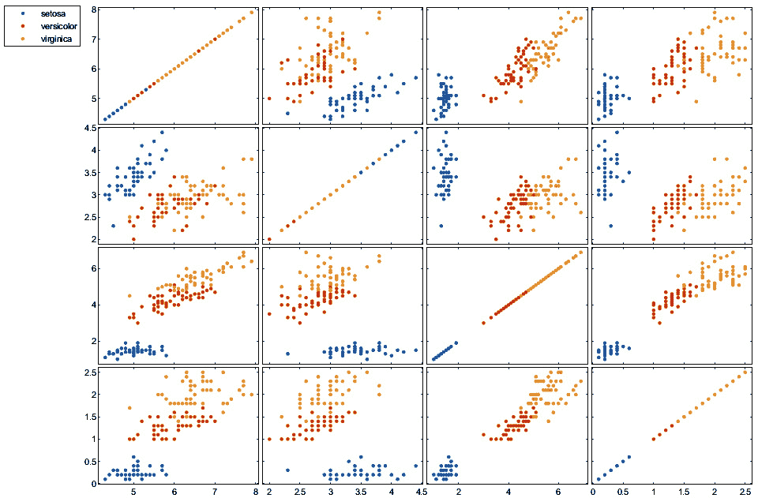
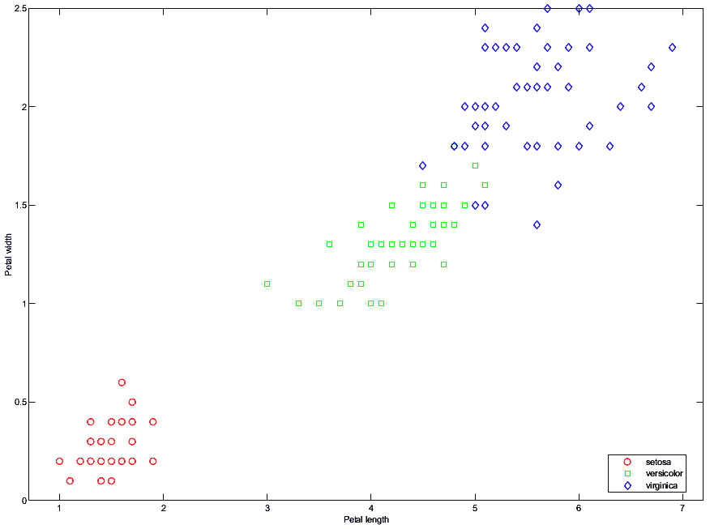
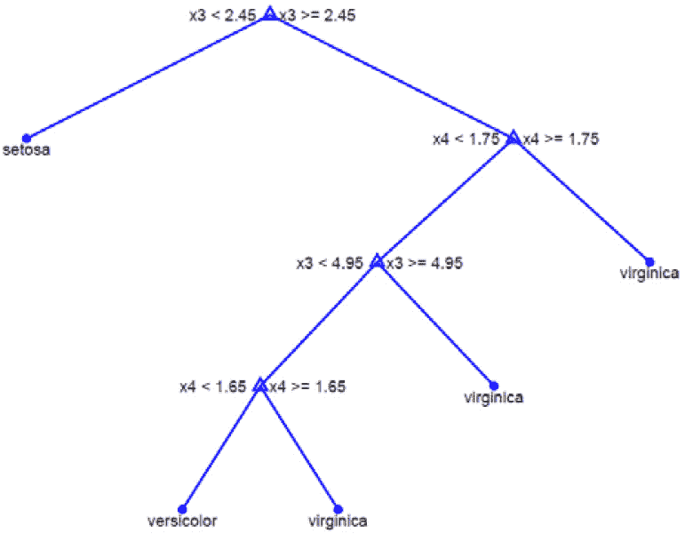
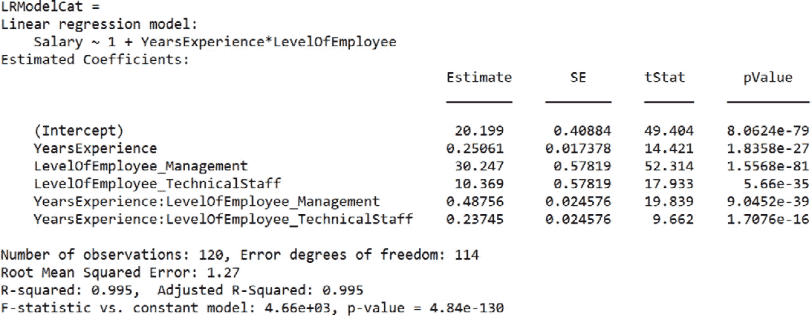
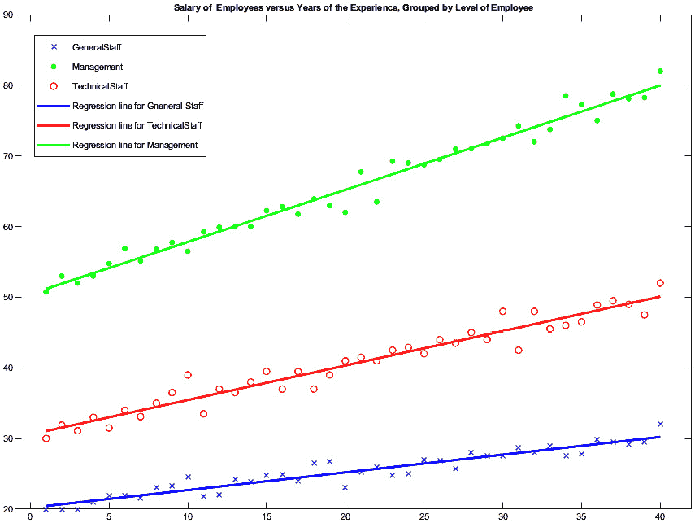
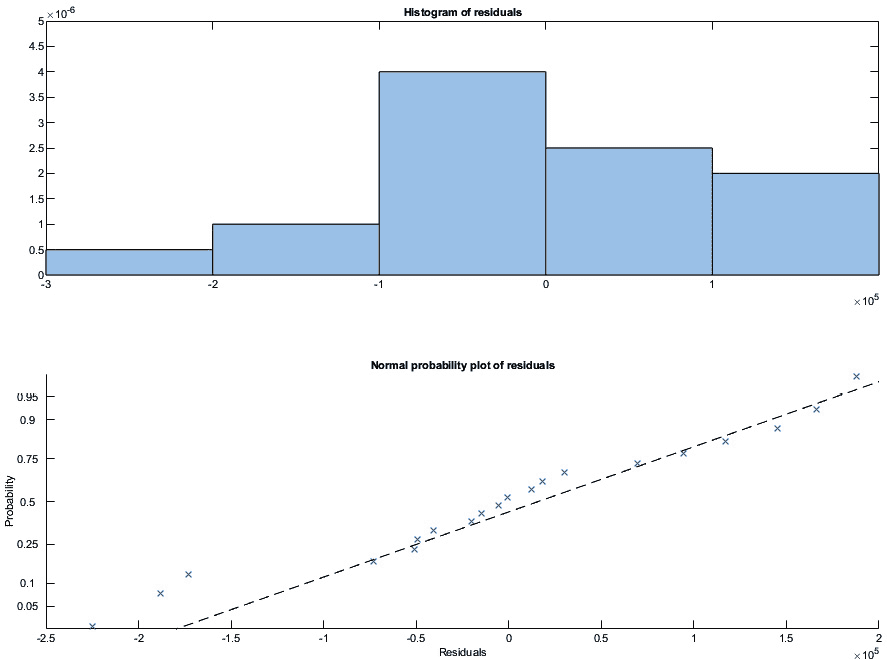
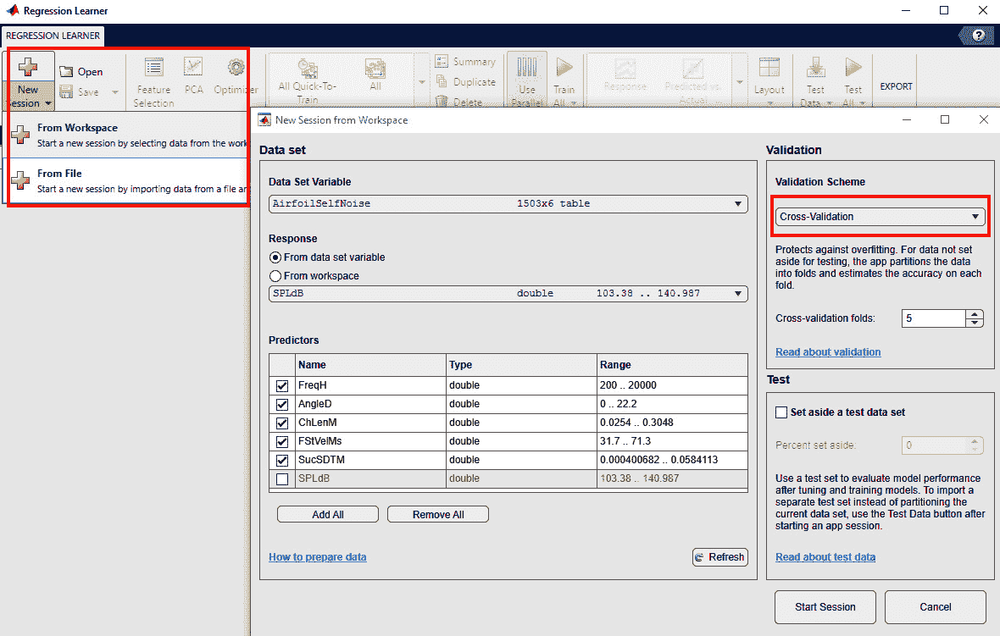

# 第三章：利用分类和回归进行预测

分类算法基于我们的观察返回准确的预测。从一组预定义的类别标签开始，分类器根据训练模型将每个输入数据分配一个类别标签。分类算法学习独立变量和分类依赖变量之间的线性或非线性关联。例如，一个分类算法可能学会预测天气为晴朗的天空、轻柔的阵雨或大雨等。回归将一组独立变量与一个依赖变量（数值或连续）相关联，例如，预测降雨量（以毫米为单位）。通过这种技术，我们可以了解依赖变量的值如何随着独立变量的变化而变化。本章将向我们展示如何使用最近邻方法对对象进行分类，以及如何在 MATLAB 环境中进行准确的回归分析。本章的目标是为你提供分类和回归技术的基本介绍、背景信息以及如何在 MATLAB 中执行这些技术的基本知识。

在本章中，我们将涵盖以下主要主题：

+   使用 MATLAB 介绍分类方法

+   构建一个有效且准确的分类器

+   探索不同的回归类型

+   在 MATLAB 中使用回归分析进行预测

+   评估模型性能

+   在 MATLAB 中使用高级技术进行模型评估和选择

# 技术要求

在本章中，我们将介绍与机器学习相关的基本概念。为了理解这些主题，需要具备代数和数学建模的基本知识。同时，也需要对 MATLAB 环境有实际操作的了解。

要使用本章中的 MATLAB 代码，你需要以下文件（可在 GitHub 上找到，网址为[`github.com/PacktPublishing/MATLAB-for-Machine-Learning-second-edition`](https://github.com/PacktPublishing/MATLAB-for-Machine-Learning-second-edition)）：

+   `datatraining.txt`

+   `VehiclesItaly.xlsx`

+   `Employees.xlsx`

+   `AirfoilSelfNoise.xlsx`

# 使用 MATLAB 介绍分类方法

**分类**方法是机器学习和数据分析的一个基本组成部分。这些方法允许我们根据特定的特征或属性将数据分类到预定义的类别或组中。通过利用分类算法，我们可以训练模型来对新数据点进行预测或分配标签。分类在各个领域都发挥着至关重要的作用，包括图像识别、垃圾邮件过滤、情感分析、欺诈检测和医疗诊断。它使我们能够做出明智的决策，识别模式，并从数据中获得洞察。

可用的分类算法众多，每种算法都有其自身的优势、假设和应用。一些常见的分类方法包括决策树、**支持向量机**（**SVMs**）、随机森林、逻辑回归和朴素贝叶斯分类器。SVM 有两种变体：SVC 用于分类和 SVR 用于回归。为了有效地应用分类方法，我们需要了解与之相关的潜在概念、技术和评估指标。此外，数据准备和特征工程在确保准确和可靠的分类结果方面发挥着至关重要的作用。

在我们的学习旅程中，我们将探索各种分类方法，学习如何在 MATLAB 环境中实现它们，并了解数据准备和模型评估的必要步骤。到结束时，你将具备将分类技术应用于自己的数据集并提取有价值见解的知识和技能。让我们从探索决策树开始。

## 决策树用于决策

**决策树**是做出选择或决策的视觉表示。它捕捉了决策过程的复杂性，其中最有趣的选项可能并不总是最有用的，情况可能并不总是提供明确的选项。通常，决策是由一系列需要评估的条件因素决定的。仅通过表格和数字来表示这一概念可能具有挑战性，因为决策背后的理由并不立即明显。

决策树结构有助于我们通过强调导致决策或评估的具体分支来以增强的可读性传达相同的信息。决策树技术通过创建具有可能结果的模型来识别策略或实现目标非常有价值。决策树的图形表示立即引导读者理解结果。与充满数字的表格相比，视觉表示更有效。人类大脑更喜欢先看到解决方案，然后再追溯理解其背后的推理，而不是被一系列代数描述、百分比和数据所描述的结果。

决策树由以下元素组成：

+   **节点**：这些包含决策过程中涉及的独立变量或因素的名称。

+   **分支**：这些被标记为独立变量的可能值，代表不同的路径或选择。

+   **叶节点**：这些代表类别或结果，观察结果根据独立变量的值进行分组。叶节点通过分支与节点相连。

使用这些工具，我们为数据分配标签，为类别分配标签以表示分类本身的置信水平。决策树提供了属于特定类别的概率或可能性，反映了分类的置信水平。

分类过程从一组已知为预分类数据（训练集）开始。目标是定义基于这些数据的规则，以表征不同的类别。一旦构建了模型，就使用单独的测试集对其进行测试。然后通过推理或归纳将这些结果描述或类别推广。然后使用这些推广的描述来分类成员类别未知的数据记录。

决策树为将对象分类到有限数量的类别提供了一种直接的方法。它们通过递归地将记录根据目标属性划分为同质子集来构建，该目标属性必须是分类的。

有两种分类规则：单变量和多变量。**单变量规则**一次考虑一个预测器或目标属性，而**多变量算法**将预测器表示为变量的线性组合。细分过程产生一个层次树结构，其中子集被称为节点，最终节点被称为叶节点。节点用属性名称标记，分支用可能的属性值标记，叶节点用表示成员类别的不同值标记。

要使用决策树对对象进行分类，我们遵循以下步骤：

1.  从树的根节点开始。

1.  选择与当前节点关联的实例属性。

1.  沿着与分配给实例的属性值对应的分支前进。

1.  如果达到叶节点，则返回与该叶节点关联的标签。否则，从*步骤 2*开始重复，从当前节点开始。

通过遍历决策树，所采取的路径代表分类规则或生产规则。分支代表不同属性所假设的值，叶节点代表分类结果。每个规则沿着树从节点到相应的叶节点书写。树中的所有可能路径代表不同的分类规则。

总结来说，在使用决策树对实例进行分类时，过程涉及从根节点开始，在每个节点选择适当的属性，根据属性值跟随相应的分支，重复这些步骤直到达到叶节点，然后返回与该叶节点关联的标签。

## 在 MATLAB 中探索决策树

在 MATLAB 环境中，Statistics and Machine Learning Toolbox 提供了从原始数据构建分类树所需的工具。在本节中，我们将深入研究许多机器学习书籍中介绍的一个著名示例——鸢尾花数据集。让我们探索如何在 MATLAB 环境中处理这个问题。我们已经在 *第二章*，*在 MATLAB 中处理数据* 中使用了这个数据集。

在这个数据集中，有三个鸢尾物种（Iris setosa、Iris virginica 和 Iris versicolor）各有 50 个样本。每个样本包含四个测量特征——花瓣长度、花瓣宽度、萼片长度和萼片宽度，所有这些都是在厘米中测量的。数据集包括以下变量：

+   萼片长度（厘米）

+   萼片宽度（厘米）

+   花瓣长度（厘米）

+   花瓣宽度（厘米）

+   类别：`setosa`、`versicolour`、`virginica`

我们的目的是创建一个分类树，能够根据花瓣和萼片的大小准确地对花卉物种进行分类。幸运的是，无需连接到之前提到的外部存档来将数据上传到 MATLAB 的工作空间。MATLAB 已经在其软件发行版中包含了一个包含必要数据的文件：

1.  要导入此数据，只需执行以下命令：

    ```py
    load fisheriris
    ```

    在 MATLAB 中，已成功导入两个变量，即 `meas` 和 `species`。`meas` 包含萼片和花瓣长度和宽度的测量值，形成一个 150x4 的双精度矩阵。另一方面，`species` 代表分类信息，其结构为一个 150x1 的单元数组。现在，让我们检查 `species` 变量中三种物种的分布情况：

    ```py
    tabulate(species)
           Value    Count   Percent
          setosa       50     33.33%
      versicolor       50     33.33%
       virginica       50     33.33%
    ```

    经过仔细分析，已经确定样本在三个物种中均匀分布。为了概述列出的花卉物种的特征，我们可以利用散点图矩阵。这以方便的矩阵格式展示了物种特征的散点图。

1.  为了有效地显示物种成对的特征并区分各自组内的观察结果，我们可以利用 `gplotmatrix()` 函数。此函数专门设计用于创建散点图矩阵：

    ```py
    gplotmatrix(meas, meas, species);
    ```

    我们想要成对比较的变量包含在 `meas` 变量中，而组包含在 `species` 变量中。结果图中的每一组坐标轴都包含一个 `meas` 列对 `meas` 列的散点图。所有图表都分组以描述变量组合的双变量关系。

    *图 3.1* 描述了三种鸢尾物种的花卉特征的散点图。



图 3.1 – 按物种分组的散点图矩阵

在对*图 3.1*进行初步分析后，很明显，`setosa`物种的值与其他两种物种明显分开，因为标记位于与其他物种不同的距离上。相反，其他两种物种的值在所有图中都表现出重叠的模式。

现在，让我们专注于调查不同物种间花瓣尺寸的变化。为了实现这一点，我们可以利用包含花瓣尺寸的两个列，特别是第三列和第四列。为了通过物种来直观地表示这些尺寸的分布，我们可以使用之前使用过的散点图的修改版。这可以通过使用`gscatter()`函数实现，该函数通过一个指定的分组变量生成分组散点图。该函数需要两个大小相同的向量作为参数。分组变量必须以分类变量、向量、字符数组或字符向量的单元格数组的形式提供：

```py
gscatter(meas(:,3), meas(:,4), species,'rgb','osd');
xlabel('Petal length');
ylabel('Petal width');
```

*图 3.2* 明确展示了三种花卉物种的分布，每个物种在图中占据不同的区域。



图 3.2 – 按物种分组的散点图

这些观察结果表明，基于花瓣特征进行分类是可行的。

1.  要创建分类树，我们可以使用`fitctree()`函数。该函数通过考虑作为输入提供的输入和输出变量生成拟合的二叉决策树：

    ```py
    ClassTree= fitctree(meas,species);
    view(ClassTree)
    ```

    以下结果被打印出来：

    ```py
    Decision tree for classification
    1  if x3<2.45 then node 2 elseif x3>=2.45 then node 3 else setosa
    2  class = setosa
    3  if x4<1.75 then node 4 elseif x4>=1.75 then node 5 else versicolor
    4  if x3<4.95 then node 6 elseif x3>=4.95 then node 7 else versicolor
    5  class = virginica
    6  if x4<1.65 then node 8 elseif x4>=1.65 then node 9 else versicolor
    7  class = virginica
    8  class = versicolor
    9  class = virginica
    view(ClassTree,'mode','graph')
    ```

    *图 3.3* 展示了树的图形表示，描绘了其分支和叶节点。每个节点都包括必须满足的条件才能遍历特定的分支。



图 3.3 – 树的图形描述

*图 3.3* 为三种花卉物种的分类提供了宝贵的见解，提供了即时信息。在许多情况下，决策树构建主要关注预测类标签或响应。一旦构建了树，预测新数据的响应就变得简单直接。

让我们考虑一个场景，其中已经确定了一个新的四个数据点的组合，代表特定花卉物种的萼片和花瓣的长度和宽度。我们可以使用这些数据来预测鸢尾花物种。

1.  要根据先前创建和训练的名为`ClassTree`的决策树预测新数据的分类，请使用以下命令：

    ```py
    predict(ClassTree,meas)
    ans =
      1×1 cell array
        {'setosa'}
    ```

    `predict()`函数返回一个向量，包含预测的预测数据类别标签，这些数据可以是表或矩阵的形式。这些预测基于训练好的分类树。在给定的情况下，只进行了一次预测，因为输入变量包含单个记录。如果使用包含多个观测值的数据矩阵，该函数将产生一系列结果，相当于数据矩阵中的行数。

    从我们的数据中构建了分类树之后，下一步是评估模型在预测新观测值方面的性能。有多种工具可以衡量树的质量。常用的方法之一是**重采样误差**，它计算预测响应与训练数据中实际响应之间的差异。它作为模型性能的初始估计，但只提供单向的洞察。高重采样误差表明树的预测可能不准确。

    要计算重采样误差，你可以使用以下命令：

    ```py
    resuberror = resubLoss(ClassTree)
    resuberror =
        0.0200
    ```

1.  获得的低值表明分类树准确地分类了数据的一个显著部分。然而，为了增强对树预测准确性的评估，我们可以执行`crossval()`和`kfoldLoss()`来进行交叉验证。

    在交叉验证期间，默认情况下，训练数据被随机分为 10 部分。随后，训练了 10 棵新树，每棵树使用数据中的 9 部分进行训练。然后，评估每棵新树的预测准确性，这些新树是在未用于训练特定树的剩余数据上进行的。与重采样误差不同，这种方法提供了一个可靠的预测准确性的估计，因为它在新鲜、未见的数据上测试了新树。

    进行交叉验证有助于评估树的泛化能力，并提供对其预测性能的更稳健的度量：

    ```py
    cvrtree = crossval(ClassTree)
    cvrtree =
      ClassificationPartitionedModel
        CrossValidatedModel: 'Tree'
             PredictorNames: {'x1'  'x2'  'x3'  'x4'}
               ResponseName: 'Y'
            NumObservations: 150
                      KFold: 10
                  Partition: [1×1 cvpartition]
                 ClassNames: {'setosa'  'versicolor'  'virginica'}
             ScoreTransform: 'none'
    ```

    我们使用了`crossval()`函数，该函数使用交叉验证进行损失估计。返回一个交叉验证的分类模型。现在 MATLAB 工作空间中可用了一些属性。

    要计算交叉验证损失，你可以以下这种方式使用`kfoldLoss()`函数：

    ```py
    cvloss = kfoldLoss(cvrtree)
    cvloss =
        0.0533
    ```

    在这里，我们使用`kfoldLoss()`函数计算了未用于训练的观测值的分类损失。计算出的低值确认了模型运行良好。

    `kfoldLoss()` 函数计算交叉验证期间所有折叠的平均损失。它提供了对分类树在未见数据上的预测准确性的度量。默认情况下，`kfoldLoss()` 使用 10 折交叉验证，将数据随机分为 10 部分。然后，每一部分被用作测试集，而剩余的数据用于训练树。

    使用`kfoldLoss()`函数可以使我们获得更可靠的树预测准确度估计，因为它评估的是模型在新和未见过的数据上的性能，而不是训练数据本身。

在本节的开头，我们列出了几种分类方法。在下一节中，我们将讨论 SVM 技术和分类的判别分析。

# 构建一个有效且准确的分类器

机器学习中的分类是一个监督学习任务，它涉及将数据分类或归类到预定义的类别或类别中。这是机器学习和数据挖掘中最基本且广泛使用的技术之一。分类的目标是开发一个模型或分类器，能够根据其特征或属性，准确地将新的、未见过的实例分配到正确的类别。分类器从标记的训练数据集中学习模式和关系，其中每个实例都与一个已知的类别标签相关联。

我们将首先讨论**SVMs**。

## SVMs explained

SVMs 是强大的监督机器学习算法，用于分类和回归任务。它们在解决具有清晰类别分离边界的复杂问题方面特别有效。SVMs 可以通过将输入空间转换到更高维的特征空间来处理线性可分和非线性可分的数据。SVMs 背后的主要思想是找到最佳可能的决策边界，即*超平面*，它最大限度地分离类别同时最小化分类错误。超平面由称为支持向量的训练示例的子集确定，它们是决策边界最近的点。SVMs 使用核函数将输入数据映射到更高维的空间，在那里线性分离更加可行。这使得 SVMs 能够通过在转换后的特征空间中找到非线性决策边界来解决非线性问题。

SVMs 在处理存在不同类别之间明显差距的复杂问题时表现出色。它们能够通过将初始输入空间转换到更高维的特征空间的过程，处理可以线性或非线性分离的数据集。SVMs 的基本概念是寻找最优决策边界，即超平面。SVMs 利用核函数将输入数据投影到这个更高维的空间，在那里实现线性分离变得更加可行。这种独特的功能使 SVMs 能够通过在转换后的特征空间中识别非线性决策边界来解决非线性问题。

SVM 的训练涉及优化一个成本函数，该函数惩罚错误分类的示例并最大化支持向量与决策边界之间的边缘。SVM 有不同变体，如用于分类任务的**C-支持向量机**（**C-SVM**）和用于回归任务的**epsilon-SVM**。SVM 在各种领域得到广泛应用，包括图像分类、文本分类、生物信息学和金融。它们因其处理高维数据的能力、处理异常值的能力以及有效地泛化到未见数据的能力而闻名。

基于支持向量机（SVM）的分类技术能够对线性和非线性数据集进行分类。在 SVM 中，训练数据实例在平面上表示，其维度等于每个实例中属性的数目。例如，一个三维平面用于表示具有三个属性的实例。SVM 分类器的三个主要组成部分如下：

+   线或超平面，它们作为将实例分类到不同类别的边界

+   边缘，即不同类别最近实例之间的距离

+   支持向量，它们是位于超平面边界内难以分类的实例

SVM 通过在更高维度的特征空间中找到一个最优超平面来分离数据，从而最大化不同类别之间的边缘。

SVM 可以处理线性可分的数据集，其中实例可以通过平面上的直线进行分离，以及非线性可分的数据集。在线性可分实例的情况下，目标是找到最大化边缘值的线或超平面。这种选择最小化了分类误差。

对于非线性可分的数据集，分类过程更为复杂。它涉及两个阶段，这两个阶段建立在先前方法的基础上。

在第一阶段，实例被映射到更高维的空间以实现线性可分性。在第二阶段，使用先前的方法找到一个最大化边缘的线或超平面，利用现在线性可分的实例。

为了处理需要非线性函数进行分离的数据集，SVM 中使用**特征空间**。这种技术涉及将初始数据映射到更高维的空间。如果初始数据有*m*维，特征空间有*n*维，且*m > n*，则应用映射函数。假设我们有一个用*x*和*y*表示的输入。核空间的概念对于仅通过标量积依赖训练数据的算法特别有用。在这种情况下，我们不需要在*m*-维空间中显式地找到*f(x)*和*f(y)*，我们只需要计算它们的标量积，表示为*f(x) · f(y)*。

函数 *f* 被用来将输入从原始 *n*-维空间映射到更高维的 *m*-空间。为了简化这种计算，特别是在大空间中，使用核函数。核函数直接提供图像的标量积，消除了显式映射的需要，使计算更高效。

K(x, y) = f(x) · f(y)

这里，我们有以下内容：

+   *x* 和 *y* 是输入向量

+   *f* 是一个转换函数

点积运算，表示为 *f(x) · f(y)*，计算了转换后的输入向量的点积。它允许我们高效地计算映射输入向量的标量积，而无需显式计算映射函数，*f(x)* 和 *f(y)*。这种点积运算是各种利用核方法进行分类和回归任务算法的一个基本组成部分。

**核函数**的目的是将输入数据转换成合适的形式，尤其是在无法确定线性可分超平面时，这种情况很常见。常用的核函数包括**线性**、**多项式**、**径向基函数**（**RBF**）和**Sigmoid**。

在这个方法中，训练阶段和随后的错误评估活动起着至关重要的作用。为此，数据被分成两个子集，分别命名为训练集和测试集。**训练集**用于算法训练，包含用于监督学习的标记输入和输出。通常，它占全部数据的约 80%。另一方面，**测试集**用于评估 SVM 的精度。它包含未用于训练的剩余数据的 20%，有助于衡量预测误差。这一阶段还用于在现实世界场景中测试算法，模拟训练模型的实际使用。

基于 SVM 的分类器的一个显著优点是它们能够处理复杂和非线性分类问题，同时确保高精度。然而，对于简单问题，精度可能与基于决策树的分类技术相当。SVM 的一些缺点包括模型创建所需的时间相对较长，尽管与神经网络相比仍然更快。另一个缺点是模型内部工作的不可解释性。

## 使用 SVM 的监督分类

监督分类是一种机器学习技术，用于将数据分类或归类到预定义的类别或类别中。监督分类依赖于标记的训练数据，其中数据点与特定类别相关联。监督分类的目的是构建一个模型，能够根据数据点的固有特征，对先前未见或新数据点的类别做出精确预测。

要了解如何在 MATLAB 中实现 SVM 算法，我们将使用用于二进制分类的数据集。**二进制分类**是一种特定的监督分类，其目标是将数据分类为两个互斥的类别或类别之一。这两个类别通常被称为正类和负类，或类别 1 和类别 0。在二进制分类中，标记的训练数据包括每个数据点与两个类别之一相关联的示例。然后，机器学习算法在此标记数据上训练，以学习一个可以准确预测未见数据点类别的模型。

数据集包括诸如`温度`、`湿度`、`光照`和`CO2`等特征，目标变量是房间占用情况。通过每分钟捕捉带时间戳的图片，获得了真实占用信息。

本实验的目的是训练一个二进制分类模型，可以根据给定的传感器数据预测房间是被占用还是未被占用。特征（`温度`、`湿度`、`光照`、`CO2`和`湿度比`）作为模型的输入，相应的占用状态（`占用`或`未占用`）作为训练和评估的目标变量。

重要提示

要下载数据集及其包含的变量简要概述，请参阅以下链接的 UCI 机器学习仓库：[`doi.org/10.24432/C5X01N`](https://doi.org/10.24432/C5X01N)。

通过分析传感器数据与真实占用情况之间的关系，模型旨在学习模式并对未见数据做出准确预测。训练过程涉及将标记数据输入到使用 SVM 的二进制分类算法中。该算法从特征及其对应的占用标签中学习，以创建一个可以对新实例进行分类的模型。

按以下步骤操作：

1.  我们首先将数据导入 MATLAB 环境。为此，我们将使用`readtable()`函数，正如我们在*第二章*中学习的，在*导入数据到 MATLAB*部分。我们需要使用包含八个变量（`Num`、`date`、`Temperature`、`Humidity`、`Light`、`CO2`、`HumidityRatio`和`Occupancy`）的`datatraining.txt`文件。但出于我们的目的，只需要六个变量，即最后六个。因此，我们必须设置一些选项来在函数调用中使用，如下所示：

    ```py
    opts = detectImportOptions('datatraining.txt');
    opts.SelectedVariableNames = [3:8];
    ```

    只选择了最后六个变量。

1.  现在我们已经准备好导入数据集：

    ```py
    DataMatrix = readtable('datatraining.txt',opts);
    ```

    我们可以在 MATLAB 工作区中看到一个名为`DataMatrix`的新变量，它是一个 814x6 大小的表格。这个表格包含五个预测变量（`温度`、`湿度`、`光照`、`CO2`和`湿度比`）和一个二分响应变量（`占用`）。

1.  要为二进制分类问题训练 SVM 分类器，我们可以使用`fitcsvm()`函数，如下所示：

    ```py
    SVMClassifier =  fitcsvm(DataMatrix(:,1:5),DataMatrix(:,6));
    ```

    `DataMatrix(:,1:5)` 参数表示预测数据，它是一个 8,143 行 5 列的矩阵，其中 8,143 是矩阵的维度，由观测值数量组成，表示数据点，而 5 表示预测变量或特征的数量。这个矩阵中的每一行代表一个独特的观测值，而每一列则对应一个单独的预测变量。`DataMatrix(:,6)` 参数表示响应数据，它是一个 8,143 行 1 列的向量。对于二元分类，这个向量应该是一个由 0 和 1 组成的二进制向量，其中 0 代表负类，1 代表正类。

    函数返回一个 `SVMClassifier` 对象，它代表训练好的 SVM 分类器。该对象包含有关训练模型的信息，例如支持向量、系数和核参数。我们只需在 MATLAB 命令提示符中输入模型名称，就可以简单地打印出一些这些信息：

    ```py
    SVMClassifier
    SVMClassifier =
      ClassificationSVM
               PredictorNames: {'Temperature'  'Humidity'  'Light'  'CO2'  'HumidityRatio'}
                 ResponseName: 'Occupancy'
        CategoricalPredictors: []
                   ClassNames: [0 1]
               ScoreTransform: 'none'
              NumObservations: 8143
                        Alpha: [256×1 double]
                         Bias: -7.1986
             KernelParameters: [1×1 struct]
               BoxConstraints: [8143×1 double]
              ConvergenceInfo: [1×1 struct]
              IsSupportVector: [8143×1 logical]
                       Solver: 'SMO'
    ```

    `fitcsvm()` 函数默认应用线性核。可以使用 `KernelFunction` 参数设置不同的核。支持的核如下：

    +   **线性**：这是一个常用的核函数。它假设数据可以通过线性决策边界或超平面分离。线性核计算输入特征向量之间的点积，这实际上测量了原始特征空间中样本之间的相似性。

    +   **多项式**：这可以用来处理非线性可分数据。它使用多项式函数将输入特征向量映射到更高维的空间，这允许学习非线性决策边界。这个核需要设置多项式的次数和尺度因子。

    +   **高斯或径向基函数（RBF）**：这可以通过将输入特征向量映射到无限维特征空间来处理非线性可分数据。当决策边界复杂或定义不明确时，RBF 核特别有效。这个核需要设置核尺度或伽马参数，它决定了每个训练样本的影响。

1.  计算重采样误差有助于我们评估所采用方法的性能。如前所述，这个误差是通过测量训练数据中预测值和实际响应之间的差异来确定的。虽然它提供了模型性能的初步估计，但它只提供了一个方向上的见解。高重采样误差意味着树模型做出的预测可能不准确：

    ```py
    ResubError = resubLoss(SVMClassifier);
    ResubError = 0.1459
    ```

    根据我们的分析，我们遇到了至少 15% 的错误。这表明在分类器的性能方面还有改进的空间。很可能是数据无法使用线性平面有效地分离，这表明需要修改核函数。

1.  为了提高模型的性能，我们可以选择基于 RBF 核的 SVM 分类器：

    ```py
    RbfSVMClassifier = fitcsvm(DataMatrix(:,1:5),DataMatrix(:,6),'Standardize',true,'KernelFunction','RBF','KernelScale','auto');
    ResubError = resubLoss(RbfSVMClassifier);
    ResubError = 0.0061
    ```

    我们最初有 15%的错误率，但已成功将其降低到 0.61%。这种显著的改进表明模型在处理数据中的非线性方面具有鲁棒性。

现在我们已经介绍了分类，是时候探索回归的世界了，它允许我们处理连续的数值。

# 探索不同类型的回归

**回归分析**是一种统计方法，用于研究一组自变量（也称为解释变量）与因变量（称为响应变量）之间的联系。通过采用这种方法，我们可以理解当解释变量改变时，响应变量的值是如何波动的。

回归分析具有双重目的：解释性和预测性。**解释性**的作用帮助我们根据特定的理论模型理解和评估自变量对因变量的影响。它使我们能够量化关系并确定效应的大小和显著性。在**预测性**方面，回归分析旨在确定自变量的最佳线性组合，以准确预测因变量的值。通过利用这种技术，我们可以根据变量之间的观察关系进行预测。

## 介绍线性回归

为了描述变量之间的关系，我们可以使用一个数学函数来捕捉观察到的行为，插值数据，并保留其关键信息的同时表示其潜在趋势。线性回归是一种旨在识别一条能够有效表示二维平面上点分布的线的特定方法。当观察到的点与线紧密一致时，这表明所选模型准确地描述了变量之间的关系。

虽然从理论上讲有无限多条线可以插值观察值，但在实践中，只有一个数学模型可以优化数据表示。在线性数学关系的情况下，变量*y*的观察值可以由变量*x*的线性函数推导出来。对于每个观察值，这种关系可以表示如下：

y = α * x + β

在给定的公式中，*x*代表解释变量，*y*代表响应变量。参数*α*和*β*分别对应于线的斜率和与*y*轴的截距。这些参数需要使用模型中包含的两个变量的收集到的观察值进行估计。

特别值得注意的是斜率 *α*，它表示解释变量每增加一个单位时平均响应的变化。当这个系数发生变化时会发生什么？如果斜率是正的，回归线从左到右上升，表明响应变量随着解释变量的增加而增加。相反，如果斜率是负的，线从左到右下降，表明响应变量随着解释变量的增加而减少。当斜率为 0 时，表示解释变量对响应值没有影响。

然而，变量之间关系的显著性并不仅仅由 *α* 的符号决定；其值同样至关重要。在正斜率的情况下，当解释变量较高时，平均响应也较高。相反，对于负斜率，当解释变量较高时，平均响应较低。斜率的大小在理解变量之间关系的强度和性质方面起着至关重要的作用。

在 MATLAB 中，您可以使用 Statistics 和 Machine Learning Toolbox 中提供的内置函数和工具执行简单线性回归。在 MATLAB 中执行简单线性回归的另一种方法是使用 `polyfit()` 和 `polyval()` 函数。这些函数允许您将数据拟合到系数线性的模式。

## MATLAB 中的线性回归模型

在 MATLAB 中构建线性回归模型的一个便捷方法是使用 `fitlm()` 函数，它是 Statistics 和 Machine Learning Toolbox 的一部分。此函数提供了一种创建和分析线性回归模型的方法。

`fitlm()` 函数在 MATLAB 中生成一个 `LinearModel` 对象。此对象包含各种属性，可以通过简单地选择它来轻松检查。此外，`LinearModel` 对象提供了一些方法，如 `plot`、`plotResiduals` 和 `plotDiagnostics`，这些方法有助于创建图表和进行诊断分析。

一个 `LinearModel` 对象封装了线性回归的训练数据、模型描述、诊断信息和拟合系数。默认情况下，当使用 `fitlm()` 函数时，表格或数据集数组中的最后一个变量被视为响应变量。或者，您可以使用公式明确指定预测变量和响应变量。此外，您可以通过使用 `ResponseVar` 名称-值对参数来指定一个特定列作为响应变量。要定义一组列作为预测变量，您可以使用 `PredictorVars` 名称-值对参数。预测变量可以是数值型或任何分组变量类型，例如逻辑型或分类型。然而，响应变量必须是数值型或逻辑型。

1.  为了了解`fitlm()`函数的功能，让我们考虑一个包括意大利注册车辆数量和各地区人口信息的数据集。该数据集包括以下字段：

    +   意大利地区名称（`Region`）

    +   每个地区的车辆注册（`Registrations`）

    +   每个地区的居民人口（`Population`）

    让我们先从将数据导入表格开始：

    ```py
    VehicleData = readtable('VehiclesItaly.xlsx');
    ```

1.  要拟合以`Registrations`变量为响应变量、`Population`为解释变量（预测变量）的线性回归模型，我们可以使用`fitlm()`函数，如下所示：

    ```py
    LRModel = fitlm(VehicleData,'Registrations~Population');
    disp(LRModel)
    ```

    打印以下信息：

    ```py
    Linear regression model:
        Registrations ~ 1 + Population
    Estimated Coefficients:
               Estimate       SE       tStat       pValue
              ________    ________    ______    __________
    (Intercept) 70549        41016      1.72       0.10258
    Population 0.59212    0.010488    56.458    1.0323e-21
    Number of observations: 20, Error degrees of freedom: 18
    Root Mean Squared Error: 1.16e+05
    R-squared: 0.994, Adjusted R-Squared: 0.994
    F-statistic vs. constant model: 3.19e+03, p-value = 1.03e-21
    ```

    线性回归模型的结果包括模型公式和估计系数。模型中的每个项都由一行表示，以下列提供了额外的信息：

    +   `Estimate`：模型中对应项的估计系数值。

    +   `SE`：估计的标准误差。

    +   `tStat`：每个系数的 t 统计量，该统计量检验系数是否为 0 的零假设，以及它是否不同于 0 的备择假设，给定模型中的其他预测变量。

    +   `pValue`：假设检验中系数等于 0 的 F 统计量的 p 值。在我们的例子中，低于 0.05 的 p 值表明，在模型的其他项中，该项在 5%的显著性水平上是显著的。

    +   解释截距增加了问题陈述的意义，因为该城市平均有 70,549 个注册。

    +   我们也可以将斜率（0.59212）解释为，随着人口每增加 1000 人，注册数量增加 592，大约每 10 个人中有 6 个人有车辆。

    `Registrations`响应变量。

1.  **调整后的 R-squared**：考虑模型中预测变量数量的 R-squared 的修改版本。

1.  **F 统计量与常量模型**：回归模型中 F 检验的检验统计量，该统计量检验响应变量与预测变量之间的显著线性回归关系。

1.  **p-value**：模型中 F 检验的 p 值。在我们的例子中，模型具有显著性，p 值非常低，为 1.03e-21。

让我们检查最后一个 MATLAB 命令的结果。在其他的值中，有两个值突出：R-squared 和 p-value。计算出的 R-squared 值非常高，等于 0.994。这表明响应变量的显著变化可以由预测变量解释。另一方面，p 值非常小，但理解其意义需要进一步探索。在统计显著性检验中，我们首先假设**零假设**，即所考虑的组之间在参数上没有差异。在零假设下，任何观察到的差异都归因于偶然。

现在我们必须做出决定，是接受还是拒绝零假设。为了做出这个决定，我们使用显著性测试来分析我们的数据。如果测试*建议*拒绝零假设，我们宣布观察到的差异在统计上是有意义的。相反，如果测试*建议*接受零假设，则认为差异在统计上不显著。统计测试的结果总是伴随着一定的不确定性和概率。因此，拒绝零假设的决定可能是正确的，但也可能是错误的。评估犯错误的概率被称为测试的**显著性水平**。

这个显著性水平，也称为 p 值，提供了观察到的差异是由于偶然性的概率的定量估计。**p 值**是一个概率，只能取 0 到 1 之间的值。接近 0 的 p 值表示观察到的差异是由于偶然性的低概率。研究人员通常选择显著性水平为 0.05（5%）或 0.01（1%）。在我们的案例中，我们计算出的 p 值为 1.03e-21，远低于所选的显著性水平。这表明观察到的差异在统计上是有意义的，并且不太可能是偶然的。

在看到了处理连续预测因子的第一个线性回归例子之后，有必要了解如何处理预测因子类型不同的情况。

# 使用 MATLAB 进行回归分析进行预测

在探索了众多线性回归实例之后，我们可以自信地断言我们已经理解了这种统计方法的内在机制。非线性回归用于在因变量和至少一个自变量之间的关系不是线性的情况下建模。与线性回归不同，线性回归假设关系是一条直线，而非线性回归允许变量之间有更复杂和灵活的关系。

到目前为止，我们一直只使用连续变量作为预测因子。然而，当预测因子是分类变量时会发生什么呢？无需担心，因为回归技术的根本原则保持不变。

## 带有分类预测因子的多元线性回归

分类变量与数值变量不同，因为它们不是来自测量操作，而是来自分类和比较操作。分类变量可以分为名义、二分或有序组。

现在，让我们深入一个现实生活中的场景。在一家公司中，我们已勤勉地收集了有关员工工资的信息，这些工资由他们的工作经验决定。我们的目标是构建一个模型，使我们能够跟踪员工工资随时间的变化。我们将员工分为三类：管理层、技术人员和一般员工。

现在我们来看一下如何实际处理 MATLAB 代码：

1.  为了开始我们的分析，我们将从名为`employees.xlsx`的 Excel 工作表中导入相关数据到 MATLAB：

    ```py
    EmployeesSalary = readtable('employees.xlsx');
    summary(EmployeesSalary)
    ```

    以下结果被打印出来：

    ```py
    Variables:
        YearsExperience: 120×1 double
            Values:
                Min            1
                Median      20.5
                Max           40
        Salary: 120×1 double
            Values:
                Min          20
                Median       41
                Max          82
        LevelOfEmployee: 120×1 cell array of character vectors
    EmployeesSalary.LevelOfEmployee=categorical(EmployeesSalary.LevelOfEmployee);
    ```

    现在我们可以检查变量的类型：

    ```py
    class(EmployeesSalary.LevelOfEmployee)
    ans =
        'categorical'
    ```

    因此，变量已修正并被 MATLAB 识别。

1.  现在，是时候通过使用`fitlm()`函数，以`Salary`作为因变量，以`YearsExperience`和`LevelOfEmployee`作为自变量来创建回归模型了。鉴于`LevelOfEmployee`是一个有三个级别（`Management`、`TechnicalStaff`和`GeneralStaff`）的分类变量，它在模型中以两个指示变量表示。在 MATLAB 中，分类预测通常作为虚拟指示变量包括。指示变量取值为 0 或 1。对于一个有 *n* 个类别的分类变量，它可以由 *n – 1* 个指示变量表示。

    为了考虑不同员工类型之间的区别，我们可以在`YearsExperience`和`LevelOfEmployee`之间加入交互项。这使我们能够捕捉到工作经验和特定员工类别之间的交互效应：

    ```py
    LRModelCat = fitlm(EmployeesSalary,'Salary~YearsExperience*LevelOfEmployee');
    ```

    让我们看看模型的特点：



图 3.4 – 回归模型摘要

根据结果，模型方程如下：

```py
Salary =
  20.2
+ 0.25 * YearsExperience
+ 30.2 * LevelOfEmployee(Management)
+ 10.4 * LevelOfEmployee(TechnicalStaff)
+ 0.49 * YearsExperience * LevelOfEmployee(Management)
+ 0.24 * YearsExperience * LevelOfEmployee(TechnicalStaff)
```

在这个方程中，`LevelOfEmployee(GeneralStaff)`这一项没有包括，因为默认情况下，第一级作为参考组。然而，`YearsExperience`和`LevelOfEmployee`的一阶项以及所有交互项都是存在的。

显然，一个适用于整个系统的单一方程式不足以获得准确的工资估计。为了解决这个问题，我们需要区分三种员工类别，并为每个类别创建单独的模型。因此，我们得到以下三个方程式来捕捉每个员工类别的工资动态：

```py
LevelOfEmployee(GeneralStaff):
Salary = 20.2 + 0.25 * YearsExperience
LevelOfEmployee(TechnicalStaff):
Salary = (20.2 + 10.4) + (0.25 + 0.24) * YearsExperience
LevelOfEmployee(Management):
Salary = (20.2 + 30.2) + (0.25 + 0.49) * YearsExperience
```

从我们刚刚看到的三个方程式的简单比较中，我们可以看出，截距随着员工类别（`20.2;20.2 + 10.4; 20.2 + 30.2`）的增加而逐渐增加；这使回归线向上移动。同样，斜率也随着员工类别的增加而逐渐增加（`0.25 ; 0.25 + 0.24; 0.25 + 0.49`），随着工作经验年数的增加，工资的增长也更大。

1.  为了增强我们对迄今为止所取得进展的理解，让我们将以下行添加到数据的散点图中：

    ```py
    Xvalues = linspace(min(EmployeesSalary.YearsExperience),max(EmployeesSalary.YearsExperience));
    figure()
    gscatter(EmployeesSalary.YearsExperience, EmployeesSalary.Salary, EmployeesSalary.LevelOfEmployee,'bgr','x.o')
    title('Salary of  Employees versus Years of the Experience, Grouped by Level of Employee')
    line(Xvalues,feval(LRModelCat,Xvalues,'GeneralStaff'),'Color','b','LineWidth',2)
    line(Xvalues,feval(LRModelCat,Xvalues,'TechnicalStaff'),'Color','r','LineWidth',2)
    line(Xvalues,feval(LRModelCat,Xvalues,'Management'),'Color','g','LineWidth',2)
    ```

    结果显示在*图 3.5*中。

    在之前建议的代码中，我们首先使用`linspace()`函数在`YearsExperience`变量的最小值和最大值之间创建一个线性间隔的向量。随后，我们生成一个散点图，展示了员工工资（`Salary`）与工作经验年数（`YearsExperience`）之间的关系，数据点按员工级别（`LevelOfEmployee`）分组。



图 3.5 – 适合三个数据组的散点图，包含三条直线

1.  最后，我们添加了代表每个员工类别相应趋势的三条线。这是通过利用`feval()`函数在`Xvalues`变量中指定的点来评估模型实现的。现在很明显，对应于三个方程的三条直线，它们在截距和斜率上都有所区别。

在详细分析了两个回归示例之后，我们可以看到如何评估迄今为止创建的模型的表现。

# 评估模型性能

**模型性能**指的是模型与给定数据的拟合程度以及准确预测结果的能力。评估模型性能对于评估其预测的可靠性和有效性至关重要。评估模型性能的一个常用指标是 R-squared 值，也称为确定系数。R-squared 衡量了模型中自变量可以解释的因变量变差的比例。R-squared 值越高，表示拟合度越好，因为它意味着数据变异性中有更大比例被模型解释。

然而，仅 R-squared 可能无法提供模型性能的完整图景。其他指标，如**均方误差**（**MSE**）或**平均绝对误差**（**MAE**），可以用来评估模型的平均预测误差。MSE 或 MAE 的值越低，表示预测性能越好。此外，考虑问题的具体背景和需求也很重要。例如，如果残差（预测值与实际值之间的差异）表现出某些模式或非随机行为，这可能表明模型遗漏了重要因素或违反了假设。

此外，可以通过交叉验证技术进一步评估模型性能，通过评估其对新、未见数据的泛化能力。这有助于确保模型没有过度拟合训练数据，并且可以在新的观测上做出准确的预测。总之，模型性能通过各种指标进行评估，包括 R 平方、MSE、MAE，以及残差和交叉验证结果。评估这些方面提供了对模型性能及其对给定任务适用性的全面理解。

在下一个示例中，我们将利用评估指标通过识别异常值来提高模型的性能。

## 减少异常值的影响

如前所述，`fitlm()` 函数生成一个包含有关线性回归的宝贵信息的 `LinearModel` 对象，包括训练数据、模型描述、诊断细节和估计系数。现在，我们可以利用这些属性从模型中获得更多见解。当我们对模型的形状有足够的了解并旨在确定其参数时，通常采用最小二乘法。它也适用于模型探索。

然而，这种方法需要手动检查数据以识别和处理异常值。因此，我们现在将检查数据中是否存在任何应该从拟合过程中排除的异常值。残差图可以帮助我们进行这种分析。最常用的图包括默认的直方图，它显示残差的范围和频率，以及概率图，它将残差的分布与具有相似方差的正态分布进行比较：

1.  我们像往常一样开始导入数据：

    ```py
    VehicleData = readtable('VehiclesItaly.xlsx');
    LRModel = fitlm(VehicleData,'Registrations~Population');
    ```

    现在，我们可以开始对模型进行评估。

1.  首先，我们提取模型的一些不同评估指标：

    ```py
    LRModel.Rsquared
    ```

    以下结果将被返回：

    ```py
    Ordinary: 0.9944
    Adjusted: 0.9941
    LRModel.MSE
    1.3407e+10
    ```

    MSE 量化了模型预测值与实际观测值之间平均平方差异。MSE 通过在整个数据集上取预测值与真实值之间平方差的平均值来计算。

    获得的 R 平方和 MSE 值将被用来比较不同模型的性能。

1.  为了说明残差图如何有助于识别异常值，我们将参考 *MATLAB 中的线性回归模型* 部分中使用的示例。我们将使用相同的模型 (`LRModel`)。为了可视化残差，我们将利用 `LinearModel` 对象的特定属性：

    ```py
    plotResiduals(LRModel)
    ```

    在分析获得的直方图时，负值中存在明显的非对称性。具体来说，接近 `-2 *105` 的观测值似乎是有潜在异常值的。为了实现更准确的拟合，我们将构建一个概率图。如前所述，*图 3**.6* 中的图显示了残差分布与具有相似方差的正态分布的比较。

    残差的概率图也揭示了潜在的异常值，尤其是在左下区域。我们可以观察到三个显著偏离虚线的值。另一方面，对于剩余的残差值，概率图看起来合理线性，表明对正态分布残差的拟合是合理的。



图 3.6 – 线性回归模型的残差直方图和残差概率图

1.  我们可以识别这些异常值，并继续从数据集中移除它们。为了定位它们，我们可以利用 `find()` 函数，检查等于 `-1.5*105` 的横坐标左侧的值：

    ```py
    outliers = find(LRModel.Residuals.Raw < -1.5*10⁵)
    ```

    以下结果被返回：

    ```py
    outliers =
         9
        13
        18
    ```

    目前，我们已经检测到数据中的异常值。

1.  现在，在这个阶段，我们可以再次创建模型，这次排除上述异常值：

    ```py
    LRModel2 = fitlm(VehicleData,'Registrations~Population','Exclude',outliers)
    LRModel2.Rsquared
    ```

    以下值将被打印：

    ```py
    Ordinary: 0.9974
    Adjusted: 0.9972
    ```

    模型的性能明显提高，这从与先前模型相比增加的 R 平方值 `0.997` 可以看出，先前模型的 R 平方值为 `0.994`。这种改进表明新模型更好地拟合了数据。现在我们将提取 MSE：

    ```py
    LRModel2.MSE
    ans =
       6.8047e+09
    ```

    通过比较，我们可以看到有所改进；均方误差（MSE）从 `1.3407e+10` 降低到 `6.8047e+09`。

为了进一步评估模型的性能，我们可以评估其他指标，如 MSE 或 MAE。此外，进行交叉验证或评估残差的分布和模式可以进一步了解模型的有效性。

讨论了使用评估指标来提高模型性能之后，现在是深入探讨这些方法并努力构建越来越有效的模型的好时机。通过采用这些技术，我们旨在提高我们模型的总体性能和预测能力。

# 使用 MATLAB 中的高级模型评估和选择技术

模型评估和选择是机器学习中的关键步骤，以确保所选模型在未见过的数据上表现良好，并且能够有效泛化。当涉及到 MATLAB 中的高级模型评估和选择技术时，有几种方法可以考虑。

在接下来的子节中，我们将探讨模型评估和选择的最重要技术。

## 理解 k 折交叉验证

**K 折交叉验证**是一种广泛使用的模型评估和选择技术。它涉及将数据集划分为 *k* 个大小相等的子集或折。模型在 *k* 次迭代中进行训练和评估，每次迭代使用一个不同的折作为验证集，而使用剩余的折作为训练集。然后，将每次迭代的结果平均，以得出全面的性能估计。这就是 k 折交叉验证运作的本质：

1.  **分割数据集**：将数据集划分为*k*个非重叠折。通常，*k*的值在 5 到 10 之间，尽管可以根据数据集大小和复杂度等因素进行调整。

1.  **训练和评估模型**：这涉及重复进行的过程，重复*k*次。在每次迭代中，使用*k – 1*个折来训练模型，然后评估其在剩余折上的性能。

1.  **性能指标聚合**：计算每个迭代中感兴趣的性能指标。然后对所有迭代的指标进行平均，以获得对模型性能的稳健估计。

1.  **模型选择**：使用平均性能指标来比较和选择不同算法或超参数配置中表现最好的模型。

K 折交叉验证有助于解决单次训练-测试分割的局限性，通过提供对模型性能的更可靠估计。它有助于评估模型对未见数据的泛化能力，并降低过拟合或欠拟合的风险。MATLAB 提供了内置函数，如`crossval()`和`cvpartition()`，以简化 k 折交叉验证的过程。这些函数自动化了过程，并允许使用 k 折交叉验证轻松实现和评估模型。

让我们看看我们如何实际进行 k 折交叉验证：

1.  为了理解交叉验证的使用，我们使用了一个 NASA 数据集，该数据集来自一系列在消声风洞中进行的空气动力学和声学实验。该数据集包括以下几个字段：

    +   频率，以赫兹为单位（命名为`FreqH`）。

    +   攻角，以度为单位（命名为`AngleD`）。

    +   弦长，以米为单位（命名为`ChLenM`）。

    +   自由流速度，以米每秒为单位（命名为`FStVelMs`）。

    +   吸入侧位移厚度，以米为单位（命名为`SucSDTM`）。

    +   比较声压级，以分贝为单位（命名为`SPLdB`）。

    如往常一样，我们开始将数据集导入 MATLAB 环境：

    ```py
    AirfoilSelfNoise = readtable('AirfoilSelfNoise.xlsx');
    ```

    因此，数据现在已可在 MATLAB 工作空间中。要在我们的模型中应用交叉验证，我们可以使用 MATLAB 环境中可用的应用程序，例如回归学习器应用程序。此应用程序简化并提高了逐步回归分析的过程。使用此应用程序，导入和探索数据、选择特征、定义验证方案、训练模型和评估结果变得非常简单快捷。应用程序提供自动训练功能，能够搜索最佳回归模型类型。它包括线性回归模型、回归树、高斯过程回归模型、支持向量回归以及回归树的集成。此外，训练好的模型可以导出到工作空间，以便与新数据一起重用或生成用于程序化回归的 MATLAB 代码。通过利用回归学习器应用程序，用户可以在执行回归分析时节省时间和精力，并从其直观界面和强大功能中受益。

    要打开应用程序，请在 MATLAB 工具栏中选择 **APPS** 选项卡，然后单击 **回归学习器** 图标。回归学习器应用程序窗口将打开，如图所示：



图 3.7 – 回归学习器应用程序窗口

要将数据从 MATLAB 工作空间导入到回归学习器应用程序中，请按照以下步骤操作：

1.  通过单击位于 **回归学习器** 选项卡 **文件** 部分的 **新会话** 按钮来打开回归学习器应用程序。

1.  将出现 **新会话** 对话框，包含三个部分：

    1.  *步骤 1*：选择一个表格或矩阵。在本节中，选择数据来源。您可以选择包含要分析数据的表格或矩阵。

    1.  *步骤 2*：选择预测变量和响应变量。在本节中，指定将作为预测变量的变量以及作为响应变量的变量。这允许您定义分析中涉及的变量类型。在这种情况下，我们可以选择 **SPLdB** 作为响应变量，其他变量作为预测变量。

    1.  *步骤 3*：定义验证方法。在本节中，您可以选择用于评估拟合模型预测准确性的验证方法类型。可以选择不同的验证方法，如交叉验证或保留验证，以估计模型在新数据上的性能。

验证方法在评估拟合模型在未见数据上做出准确预测的能力方面发挥着至关重要的作用。回归学习器应用程序提供工具来评估和比较模型，基于它们的估计性能，以便为给定数据选择最佳模型。

我们将默认选择 `5`（然后我们可以按下 **开始会话** 按钮）。

1.  要在回归学习器应用程序中选择所需的模型类型，请按照以下步骤操作：

    1.  通过点击应用中存在的箭头图标来展开**模型类型**部分。

    1.  将显示可用的回归模型列表，包括以下内容：

        +   **线性** **回归模型**

        +   **回归树**

        +   **支持向量机**（**SVMs**）

        +   **高斯过程** **回归模型**

        +   **集成** **树**

    1.  要开始，请选择**全部快速训练**选项。此选项允许您选择适用于此类问题的所有模型，因此可以快速使用默认设置训练模型。

    1.  点击**训练**图标以启动训练过程。应用将开始训练所选模型，并在**历史记录**部分显示所选模型类型。

    1.  模型训练完成后，最佳 RMSE 分数将在一个框中突出显示。这个分数表示模型的性能。

    1.  为了进一步提高模型性能，您可以尝试使用所有可用的算法进行训练。点击**全部**，然后点击**训练**。

1.  通过比较**历史记录**部分的结果，您可以观察到每个模型的 RMSE 分数。较低的 RMSE 分数表示更好的性能。在提供的示例中，高斯过程回归模型实现了*最低的 RMSE 分数（RMSE = 1.49*），而提升树模型获得了*最高的 RMSE 分数（RMSE = 6.18*）。

    为了评估获得的改进，您可以比较极端模型的预测值与实际值的对比图。在 RMSE 最低的模型中，数据点应与参考线紧密对齐，表明预测数据和实际数据之间的匹配非常接近。

总体而言，回归学习器应用提供了结果的视觉表示，使您能够轻松比较和分析不同模型的性能。让我们看看另一种选择数据的方法。

## 探索留一法交叉验证

**留一法交叉验证**（**LOOCV**）是一种用于模型评估的特定交叉验证技术。在 LOOCV 中，每个数据点依次被排除作为验证集，其余数据用于训练模型。这个过程对所有数据点重复进行，通过平均所有迭代的成果来评估模型的性能。LOOCV 技术的工作方式如下：

1.  对于数据集中的每个数据点，执行以下操作：

    +   从训练集中移除数据点

    +   使用剩余的数据点训练模型

    +   使用训练好的模型来预测移除的数据点

    +   通过比较预测值与移除数据点的实际值来评估模型的性能

1.  计算每个迭代的性能指标（如均方误差或准确率）。

1.  计算所有迭代的平均性能指标，以获得模型性能的整体估计。

LOOCV（留一法交叉验证）在数据集较小或可用数据有限时特别有用。由于每个数据点都作为一次验证集，因此 LOOCV 比其他交叉验证技术提供了对模型性能的更可靠估计。值得注意的是，这种方法适用于小数据集，因为很难判断其方差误差，因为每个折叠中的数据点几乎相同；这只意味着每个折叠中有一个新的记录。

在 MATLAB 中，您可以使用带有`LeaveOut`选项的`cvpartition()`函数来生成执行 LOOCV 的索引。然后，可以使用这些索引在循环中用于训练和验证目的的数据分区。

现在，我们将介绍自助方法。

## 介绍自助方法

自助方法是用于估计统计量抽样分布的重新抽样技术。这个过程涉及通过有放回地从原始数据集中随机选择数据点来生成多个自助样本，从而可以获得统计量的估计。这种方法使我们能够评估与所关注的统计量相关的变异性和不稳定性。

自助算法包括以下步骤：

1.  从大小为*N*的原始数据集开始。

1.  从原始数据集中随机抽取*N*个数据点进行有放回抽样以创建自助样本。这意味着自助样本中的每个数据点都是独立选择的，并且可能多次选择相同的数据点。

1.  在自助样本上计算所需的统计量。这可能包括均值、中位数、标准差或其他感兴趣的任何统计量。

1.  重复步骤 2 和步骤 3，次数等于*B*，其中*B*是所需的自助迭代次数。

1.  从每个自助样本中收集计算出的统计数据以创建自助分布。

1.  根据自助分布计算所需的置信区间或标准误差，以量化统计量周围的不确定性。

当数据的基础分布未知或分析方法不易获得时，自助方法为估计抽样分布提供了一种稳健的方法。它可以用于各种目的，例如假设检验、构建置信区间和评估模型稳定性。

自助方法的重要性在于它能够估计模型性能属性，包括诸如集中趋势和不确定性等度量，而无需对底层数据分布做出严格假设。这种方法增强了评估模型性能的可靠性和鲁棒性，尤其是在数据稀缺或数据分布定义不明确的情况下。

# 摘要

在本章中，我们获得了在 MATLAB 环境中执行准确分类任务的有价值见解。我们首先深入决策树方法的领域，熟悉了诸如节点、分支和叶节点等关键概念。通过根据目标属性反复将记录划分为同质子集，我们学会了如何有效地将对象分类到不同的类别中。此外，我们还探讨了 SVMs 的预测方面，SVMs 在解决具有清晰类别分离边界的复杂问题时特别有效。SVMs 可以通过将输入空间转换到更高维的特征空间来处理线性可分和非线性可分的数据。

在随后的部分，我们的重点转向了在 MATLAB 环境中进行精确回归分析。我们首先深入简单线性回归，了解了其定义和获得普通最小二乘估计的过程。此外，我们还探索了量化线性关系截距和斜率的多种技术。

随后，我们发现了线性回归模型构建器，这是一个构建包含训练数据、模型描述、诊断信息和线性回归所需的拟合系数的对象的有价值工具。此外，我们熟悉了正确解释模拟结果，并掌握了通过稳健回归减轻异常值影响的技术。

然后，我们了解了如何使用 MATLAB 中可用的工具对训练好的模型进行准确评估。最后，我们发现交叉验证方法可以提升模型的性能，找到表现最佳的模型。

在下一章中，我们将探讨聚类方法，以在数据集中找到隐藏的模式或分组。
