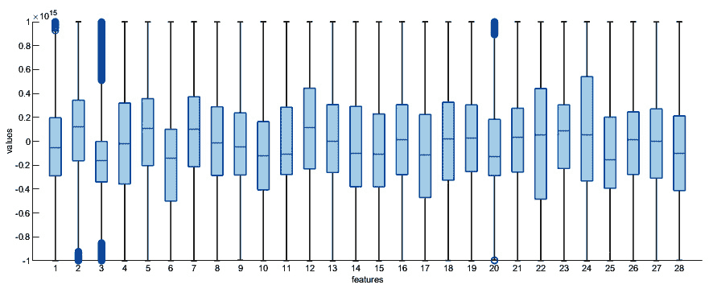
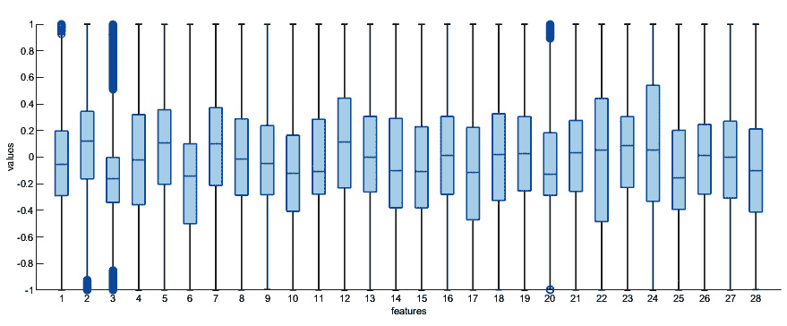

# 第十章：MATLAB 推荐系统工具

推荐系统是一种旨在预测特定用户偏好的模型。当应用于电影领域时，它转变为电影推荐引擎。这个过程涉及通过预测用户的潜在评分来过滤数据库中的项目，并促进用户与数据集中最合适内容的连接。这具有重要意义，因为在庞大的目录中，用户可能无法发现所有相关内容。有效的推荐可以增强内容消费，并且像 Netflix 这样的主要平台高度依赖它们来维持用户参与度。在本章中，我们将学习推荐系统的基础概念以及如何使用 MATLAB 构建**网络入侵检测系统**（**NIDS**）。

在本章中，我们将涵盖以下主要主题：

+   介绍推荐系统的基本概念

+   在数据中寻找相似用户

+   使用 MATLAB 创建用于网络入侵检测的推荐系统

+   部署机器学习模型

# 技术要求

在本章中，我们将介绍基本的机器学习概念。为了理解这些主题，需要具备代数和数学建模的基本知识。您还需要具备 MATLAB 的实际操作能力。

要使用本章中的 MATLAB 代码，您需要以下文件（可在 GitHub 上找到，网址为[`github.com/PacktPublishing/MATLAB-for-Machine-Learning-second-edition`](https://github.com/PacktPublishing/MATLAB-for-Machine-Learning-second-edition)）：

+   `CreditCardData.xlsx`

+   `CreditCardFraudDet.m`

+   `NDISdata.csv`

+   `NDISEnsemble.m`

# 介绍推荐系统的基本概念

**推荐系统**是一种旨在根据用户的偏好、历史行为或其他相关因素向用户建议物品或内容的信息过滤系统。这些系统在各种在线平台上被广泛使用，以帮助用户发现产品、服务、内容等。推荐系统涉及两个主要实体：**用户**和**物品**。用户是生成推荐的个体，而物品是要推荐的产物、内容或服务。这些物品可以包括电影、书籍、产品、新闻文章等。

推荐系统依赖于捕捉用户和物品之间交互的数据。这种交互数据可以包括用户评分、购买历史、点击、查看、点赞以及任何其他形式的用户与物品的互动。

有不同类型的推荐系统：

+   **协同过滤**（**CF**）：CF 方法基于其他用户的偏好和行为进行推荐。

+   **基于内容的过滤**：这种方法根据物品的属性和用户的历 史偏好向用户推荐物品。它侧重于物品的内容和描述。

+   **混合推荐系统**：这些系统整合了各种推荐技术，以提供更准确和多样化的推荐。

## 理解 CF

CF 是一种流行的技术，在推荐系统中使用，根据用户的交互和行为以及类似用户的行 为，为用户做出个性化推荐。CF 假设过去以相似方式与物品交互的用户在未来将会有相似 的偏好。

此外，CF 主要有两种类型：

+   **基于用户的**：这种类型的 CF 根据与目标用户相似的用户偏好和行为向用户推荐物品。计算目标用户与系统中所有其他用户之间的相似度得分。常见的相似度指标包括余弦相似度或皮尔逊相关系数。识别出一组与目标用户最相似的邻居用户。推荐目标用户的邻居已经交互过但目标用户尚未交互过的物品。

+   **基于物品的**：这种类型的 CF 根据用户过去交互过的物品的相似性向用户推荐物品。它根据用户交互计算系统中所有物品对之间的相似度。常见的相似度指标包括余弦相似度和 Jaccard 指数。对于目标用户，它可以识别出他们已经交互过的物品。它可以推荐与用户交互过的物品相似的物品。

CF 矩阵通常很稀疏，因为用户只与可用物品的一小部分进行交互。通过在数据中找到潜在因素，如矩阵分解等技术可以帮助解决这一问题。随着用户和物品数量的增加，用户-用户或物品-物品相似度的计算变得更加昂贵。为了可扩展性，需要进行优化。CF 在为新用户或几乎没有交互历史的物品做出推荐时可能会遇到困难。通常使用基于内容的推荐或混合模型等技术来解决这个问题。

CF 通常依赖于用户行为数据，这引发了隐私问题。可以使用差分隐私等隐私保护方法来保护用户信息。使用各种指标来评估 CF 算法的性能，包括 **平均绝对误差**（**MAE**）、**均方根误差**（**RMSE**）以及基于排名的指标，如精确率和召回率。

CF 已被广泛应用于各种领域的推荐系统，包括电子商务、电影和音乐推荐、社交网络等。虽然它能够有效地捕捉用户偏好，但它确实存在一些局限性，例如冷启动问题和需要足够的用户交互量。将 CF 与其他推荐技术相结合的混合方法可以克服一些这些局限性。

## 基于内容的过滤解释

**基于内容的过滤**是一种推荐技术，在推荐系统中用于根据物品的特征和用户偏好为用户提供个性化推荐。与依赖于用户-物品交互的协同过滤（CF）不同，基于内容的过滤专注于物品的内容，并试图将其与用户档案相匹配。

系统中的每个物品都由一组特征或属性描述。这些特征可以根据领域广泛变化，可能包括如流派、关键词、演员、导演（对于电影）、作者（对于书籍）等。对于基于文本的内容，可以使用自然语言处理技术提取关键词或主题。系统为每个用户维护一个用户档案或偏好向量，它反映了他们对不同特征或属性的偏好。这个用户档案是基于用户互动过的物品或明确评分构建的。

为了为用户生成推荐，系统计算用户档案与物品特征之间的相似度得分。相似度得分通常使用余弦相似度、**词频-逆文档频率**（**TF-IDF**）或其他距离度量技术来计算。具有最高相似度得分的物品被推荐给用户。这些是符合用户历史偏好和兴趣的物品。

基于内容的过滤在提供个性化推荐方面非常有效，因为它根据物品特征考虑了个人用户的偏好。它不依赖于用户间或物品间的比较，因此适合新用户或互动较少的用户。推荐的质量很大程度上取决于物品描述和特征的准确性和丰富性。请注意，确保高质量的元数据至关重要。

虽然基于内容的过滤擅长推荐用户之前互动过的物品，但与 CF 相比，它可能不会在推荐中引入太多的偶然性或新颖性。如果关于其特征有足够的信息，它还可以帮助解决新物品的冷启动问题。许多推荐系统将基于内容的过滤与 CF 或其他推荐技术相结合，以提高推荐质量并解决每种方法的局限性。

基于内容的过滤在新闻推荐、音乐推荐和电子商务等各个领域被广泛使用，用于建议产品。当正确实施时，它可以根据个人用户的偏好和需求提供有价值的推荐。

## 混合推荐系统

混合推荐系统是结合多种推荐技术以提供更准确和多样化推荐的推荐系统。这些系统旨在利用不同推荐方法的优势，如 CF、基于内容的过滤等，同时减轻它们的弱点。混合推荐系统在多种应用中普遍使用，以提高推荐质量并解决个别方法的局限性。

在加权混合系统中，不同的推荐技术被分配权重，这些权重决定了它们对最终推荐的影响。例如，如果历史用户交互更为关键，可能会给 CF 分配更高的权重，而对于项目特征的内容过滤则分配较低的权重。通过结合每种技术的得分并按其重要性加权，生成推荐。

在切换混合系统中，推荐方法根据某些条件或用户特征动态选择。例如，如果一个用户有大量的交互历史，可能会使用 CF，但如果他们是一个历史记录很少的新用户，可能会采用基于内容的过滤。在此方法中，不同推荐技术生成的特征或得分被组合，以创建用于项目或用户的统一特征向量。然后，使用任何单一推荐方法利用这个组合特征向量生成推荐。

级联混合系统使用一个推荐技术的输出作为另一个推荐技术的输入。例如，基于内容的过滤可能被用来生成一组初始推荐。这些推荐可以通过 CF 进一步优化以提高准确性。

在元级混合系统中，不同的推荐方法独立应用，并且它们的输出通过元学习器或元分类器进行组合。元学习器将个别推荐方法的输出作为输入，并提供最终的推荐。可以使用决策树、神经网络或集成方法如堆叠等机器学习算法作为元学习器。

在数据分析和使用户画像的领域，寻找相似用户的过程具有重大意义。让我们深入了解用于在数据集中识别和分类具有相似模式和行为的用户的技巧和方法。

# 在数据中寻找相似用户

欺诈一直以各种形式普遍存在，但新技术的出现，如**虚拟智能**（**VI**），扩大了欺诈活动的途径。在当今世界，使用信用卡和借记卡进行购买已成为标准，因此，与这些支付方式相关的欺诈正在增加。这种欺诈的后果不仅影响商家和银行，他们通常承担着财务负担，而且影响范围更广。

当客户成为欺诈的受害者时，他们可能会发现自己被银行征收更高的利率，因为他们可能被归类为高风险客户。此外，欺诈事件可能会损害商家的声誉和形象。如果客户在交易过程中遭遇欺诈，这可能会侵蚀他们对卖家的信任，可能促使他们在未来的购买中寻求竞争对手的替代品。

给定一组信用卡交易数据，欺诈识别是识别新交易是否属于欺诈交易或合法交易的过程。这样的系统不仅应该能够检测欺诈交易，而且应该以成本效益的方式完成。

通过不同的方法对交易进行分类分析，以下建议了两种具体的方法：

+   用户级别分析

+   单个交易分析

这两种方法代表了独特的策略，每种方法都有其自身的优势和局限性。每种方法都包含某些假设，这些假设的有效程度各不相同。无论如何，这两种方法都可以产生有价值的成果。在某些情况下，选择这些方法之间的差异取决于可用数据的性质，因为它可能不允许采用替代方法。

在单个交易级别分析交易是指一种方法，其中交易的分类是由其与数据集中所有其他交易的关系决定的。可以采用各种机器学习算法来完成这项任务。例如，考虑**k-最近邻**（**k-NN**）算法，该算法根据交易与数据集中其他交易的相似性来分类交易。如果一个交易与已知的欺诈交易非常相似，那么它很可能被归类为欺诈交易，反之，则被视为合法交易。这种机制通过利用同一类对象之间的相似性来识别数据模式。

在最近邻算法中，通过检查训练集中的所有数据并将记录分配给与最近元素相同的类别来对记录进行分类。其基本假设是在多维空间中，如果两个记录“接近”，它们很可能属于同一类别。为了衡量这种接近性，重要的是要采用距离度量。一个例子是欧几里得距离，或者更广泛地说，Minkowski 度量，正如我们在*第四章*中介绍的，*聚类分析和* *降维*。

最近邻规则导致了一种称为**Voronoi 划分**的空间划分。训练集中的每个元素都划定了这样一个区域，其中模式将被分类到相同的类别。为了增强这种机制的鲁棒性，一种方法是通过考虑 k 个最近的记录来分类一个记录。然后，该记录可以被分配到在所选示例中具有最大代表性的类别。为了减少对 k 的选择的敏感性，每个记录可以根据其与要分类的元素的距离，通过一个加权方案对分类做出贡献。为了使此过程有效，属性必须具有一致的价值尺度，这通常需要在数据预处理阶段进行先前的归一化。让我们学习如何构建信用卡欺诈检测系统：

1.  如同往常，我们将首先将数据导入 MATLAB 工作空间。为此，我们将使用信用卡欺诈检测数据集，该数据集包含匿名信用卡交易，被分类为欺诈或合法：

    ```py
    CreditCardData = readtable('CreditCardData.xlsx');
    ```

    数据集仅由数值输入变量组成，这些变量来自 PCA 转换。在特征中，`V1`到`V28`代表通过 PCA 获得的主成分。`Class`特征作为响应变量，在欺诈情况下值为`1`，否则为`0`。为了了解数据的分布情况，我们可以计算`class`列中的出现次数：

    ```py
    NumOcc = groupcounts(CreditCardData.Class)
    NumOcc =
            3992
             492
    ```

    `groupcounts()`函数提供了表示为`T`的表或时间表的分组变量的独特组合。它还提供了每个组内的成员数和相应的数据百分比，范围从`0`到`100`。组是根据包含在`groupvars`中的变量的行建立的，这些行具有相同的唯一值组合。结果表中的每个条目都对应于一个单独的组。

    数据集在其中一个二进制类别上是不平衡的，我们在评估结果时应考虑这一点。在机器学习中，当一个类别显著多于其他类别时，对不平衡数据进行分类是一个常见的挑战。主要类别（多数类别）通常占主导地位，这使得模型难以正确预测少数类别。

    为了检查数据的分布情况，我们可以绘制特征的箱线图：

    ```py
    boxchart(CreditCardData{:,1:28})
    xlabel('features')
    ylabel('values')
    ```

    下面的图形将被输出（*图 10**.1*）：



图 10.1 – 特征的箱线图

从*图 10**.1*的分析中，我们可以看到变量是偏斜的。我们还可以看到其中一些变量存在潜在的异常值。建议进行数据缩放。请记住，在训练机器学习模型之前对数据进行标准化或归一化是一种最佳实践。通过缩放，数据的单位被标准化，这使得比较来自不同来源或位置的数据变得更容易。

1.  数据缩放，也称为数据归一化或标准化，是机器学习和数据分析中的预处理技术，涉及将数据转换到标准化的范围或分布。数据缩放的主要目的是使你的数据集中的不同特征或变量可比较，并帮助机器学习算法表现更好。

    在缩放和标准化之间进行选择取决于你的数据集的具体要求和计划使用的机器学习算法。一般来说，建议对特征应用数据缩放，以防止某些变量主导学习过程，尤其是在对特征尺度敏感的算法中，如 kNN 或支持向量机。

    数据缩放有助于提高优化算法的收敛性，使特征更易于解释，并且还可以提高某些机器学习模型的性能。然而，需要注意的是，并非所有算法都需要数据缩放，有些情况下数据的自然尺度是有意义的，不应被改变。是否缩放数据应谨慎考虑你的具体问题和数据集的特征。

    我们将执行范围在`-1`到`1`之间的标准化：

    ```py
    DataScaled = rescale(CreditCardData{:,1:28},-1,1);
    ```

    范围在`-1`到`1`之间的标准化，也称为具有特定范围的 min-max 缩放，是一种数据缩放方法，将你的数据转换到`-1`到`1`的范围内。当你想要标准化数据同时保持负值可能性时，这种方法很有用。

    为了检查我们执行数据缩放后数据的分布情况，我们可以绘制特征的箱线图：

    ```py
    boxchart(DataScaled)
    xlabel('features')
    ylabel('values')
    ```

    下面的图表显示的是（*图 10*.*2*）：



图 10.2 – 缩放数据的箱线图

现在，很明显数据已经被缩放，以便我们拥有相同的存在区间。

1.  在基于机器学习的模型训练之前，进行数据拆分是必要的。数据拆分是指将数据集划分为用于训练、测试和验证的单独子集的过程。我们将执行训练-测试拆分，这涉及将数据集分为两部分，通常为 70-30 或 80-20 的拆分。较大的部分用于训练模型，而较小的一部分用于测试其性能：

    ```py
    n = length(CreditCardData.Class);
    SplitData = cvpartition(n,'Holdout',0.3);
    TrainIndex = training(SplitData);
    TrainData = DataScaled(TrainIndex,:);
    TestIndex = test(SplitData);
    TestData = DataScaled(TestIndex,:);
    ```

    我们通过使用`length()`函数获取数据集中观察值的数量来启动这个过程。此函数返回数组`X`中最大维度的尺寸，在向量的上下文中，这个尺寸对应于元素的总数。随后，我们使用了`cvpartition()`函数来创建数据集的随机分区。这个分区是构建基本训练集和测试集的基础，这些集对于评估统计模型至关重要。为了从原始数据集中提取训练数据索引和测试数据索引，我们使用了`training`和`test`对象函数。然后，将这些索引应用于提取相应的数据子集。

1.  k-NN 是一种多用途算法，不仅用于分类和回归任务，还用于推荐系统。它可以适应构建基于 CF 的推荐系统。我们将使用`fitcknn()`函数，如下所示：

    ```py
    WeightedKNNModel = fitcknn(...
        TrainData(:,1:28), ...
        TrainData(:,29), ...
        'Distance', 'cosine', ...
        'Exponent', [], ...
        'NumNeighbors', 10, ...
        'DistanceWeight', 'SquaredInverse');
    ```

    以下参数被传递：

    +   `TrainData(:,1:28)`

    +   `TrainData(:,29)`

    +   `余弦`（该表达式表示观察值之间夹角的余弦的补数，将它们视为向量）：

        +   Minkowski 距离指数

        +   要找到的最近邻数量：`10`

        +   距离加权函数：`SquaredInverse`（`Weight`是距离的倒数）

    我们应用了加权 k-NN 算法，这是 k-NN 算法的一种变体，在预测或分类时为邻居分配不同的权重。在传统的 k-NN 中，每个邻居对最终决策的影响是相等的，但在加权 k-NN 中，每个邻居的影响会根据某些因素进行调整，通常是邻居与查询点之间的接近度或相似度。这允许进行更准确和上下文感知的预测。

    我们首先选择一个距离度量来衡量数据点之间的相似度或差异度。我们使用了`cosine`度量，也称为余弦相似度，这是一种用于确定高维空间中两个非零向量之间相似度的相似度度量。它在各个领域都得到广泛应用，包括信息检索、自然语言处理和推荐系统。`cosine`度量衡量两个向量之间的夹角的余弦值，它提供一个介于-1 和 1 之间的值，其中 1 表示向量是相同的，0 表示它们是正交的（完全不同），-1 表示它们是相反的。

    算法随后确定*k*的值，这代表在做出预测时考虑的最近邻的数量。k 的选择取决于你的数据集和你要尝试解决的问题的具体情况。你必须计算查询点（你想要分类或预测的点）与数据集中所有其他数据点之间的距离，然后根据它们与查询点的接近程度或相似性为每个邻居计算权重。常见的分配权重的方法包括逆距离，其中较近的邻居具有更高的权重，或者基于相似性的加权，其中更相似的邻居被赋予更高的权重。你也可以选择具有最高权重的 k 个邻居。这些邻居将对最终预测产生更大的影响。对于分类任务，根据所选邻居中的多数类别将类别标签分配给查询点，权重会影响投票过程。

    这里是使用加权 k-NN 的优点：

    +   加权 k-NN 可以提供更准确的预测，因为它考虑了每个邻居对最终决策的影响。

    +   它允许更好地处理不平衡数据集，其中某些邻居可能比其他邻居更有信息量。

    +   加权 k-NN 在邻居的信息量不均等时尤其有用。

    加权 k-NN 是一种灵活且广泛使用的机器学习技术，可以应用于各种问题，包括分类、回归和推荐系统。它允许你根据数据的具体特征和你要尝试解决的问题调整算法。

1.  在训练模型后，我们必须评估其性能。我们将首先使用训练好的模型来预测数据标签：

    ```py
    PredData = predict(WeightedKNNModel,TestData(:,1:28));
    ```

    在这里，我们使用了`predict()`函数，它提供了广义线性回归模型产生的预期响应值。

    现在，我们可以评估模型的准确性，这衡量了预测模型的预测与实际或观察到的值匹配的程度。它作为模型在准确预测结果方面性能的指标：

    ```py
    accuracy = sum(PredData == TestData(:,29)) / length(TestData(:,29));
    fprintf('Accuracy: %.2f%%\n', accuracy * 100);
    Accuracy: 97.03%
    ```

    结果非常出色，证实了算法和训练参数的选择是正确的。

在网络安全不断演变的领域中，开发有效的网络入侵检测工具至关重要。下一节将探讨如何利用 MATLAB 创建针对增强网络入侵检测能力的先进推荐系统。

# 使用 MATLAB 创建网络入侵检测的推荐系统

NIDS 作为一种安全机制，用于识别和预防计算机网络中的未经授权的访问、恶意活动和潜在威胁。它涉及监控网络流量并分析它，以识别任何可疑或异常的行为。网络安全检测的主要目标是保护网络免受各种类型的攻击，例如**拒绝服务**（**DoS**）攻击、恶意软件感染、数据泄露、未经授权的访问和其他网络威胁。

网络入侵检测主要有两种方法：

+   **基于签名的检测**：这种方法涉及将网络流量模式与已知签名或已知攻击模式的数据库进行比较。如果找到匹配项，将生成警报通知网络管理员。

+   **基于异常的检测**：这种方法侧重于识别偏离正常模式的异常或可疑的网络行为。它使用机器学习算法分析网络流量，并检测可能表明正在进行或即将发生的攻击的任何异常。

NIDS 可以在网络架构的不同级别实现，例如在边界、单个主机或特定网络段内。它们收集和分析网络数据包、日志和其他网络数据，以识别并向系统管理员发出潜在入侵的警报。

以下是一些在网络安全检测中常用的技术：

+   **数据包分析**：用于检查单个网络数据包，以识别特定的攻击签名或异常

+   **协议分析**：用于分析网络协议，以检测任何异常或未经授权的活动

+   **流量分析**：用于监控网络流量模式，以识别任何突然的峰值或异常模式

+   **行为分析**：用于分析用户或主机的行为，以检测任何异常或恶意活动

NIDS 在保护计算机网络免受未经授权的访问和潜在威胁方面发挥着至关重要的作用。它们有助于及时识别和应对安全事件，最大限度地减少潜在的损害或数据泄露。

## NIDS 推荐系统

在本例中，我们将采用一种新的方法来识别和预防网络攻击：使用推荐系统进行网络入侵检测。传统的 NIDS 依赖于固定的规则和签名来检测已知的攻击模式。然而，攻击者不断进化他们的技术，这使得这些系统难以跟上。通过将推荐系统纳入网络入侵检测过程，可以利用机器学习和数据挖掘技术来增强检测能力。主要目标是利用历史网络流量数据构建一个模型，可以预测特定网络事件是正常还是恶意。

下面是使用推荐系统进行网络入侵检测的工作概述：

+   **数据收集**：收集并存储网络流量数据以进行分析。这些数据包括各种网络参数，如 IP 地址、端口号、协议、数据包大小等。

+   **特征提取**：从收集的数据中提取相关特征。这些特征可以包括流量量、连接持续时间、数据包头部和其他有助于了解网络行为的特征。

+   **数据预处理**：收集到的数据经过预处理以消除噪声、处理缺失值并归一化特征。这一步骤确保数据适合分析。

+   **训练推荐系统**：预处理后的数据用于训练推荐系统算法，例如协同过滤（CF）、矩阵分解或关联规则挖掘。此算法学习数据中的模式和关系。

+   **构建推荐模型**：训练好的算法基于网络流量数据生成推荐模型。此模型可以识别正常网络行为并检测任何偏离。

+   **实时监控**：然后使用推荐模型实时监控传入的网络流量。它分析网络事件并预测它们是否正常或可能恶意。

+   **警报生成**：当推荐模型检测到潜在的恶意网络事件时，它会触发警报以通知网络管理员。警报可以包括有关检测到的攻击类型和推荐的对策的信息。

+   **持续学习**：推荐模型可以通过结合新数据和调整其检测能力来随着时间的推移不断更新自己。这确保了系统能够有效对抗新兴威胁。

总体而言，使用推荐系统进行网络入侵检测提供了一种更动态和自适应的方法来识别网络攻击。它利用机器学习技术从历史数据中学习并智能预测网络的安全状态。这可以通过减少误报并检测新兴攻击模式来提高网络安全操作的正确性和效率。

## 在 MATLAB 中使用推荐系统进行 NIDS

在这个实际示例中，我们将使用**集成方法**构建采用推荐系统的 NIDS。集成方法是结合多个单个模型以形成一个更强大、更准确的预测器的技术。这些单个模型，也称为基础模型或弱模型，可以是任何类型，例如决策树、支持向量机或神经网络。通过结合这些基础模型的预测，集成方法旨在提高模型的整体性能和泛化能力。以下是一些流行的集成方法：

+   **Bagging**：Bagging，即**自助聚合**，涉及在不同的训练数据子集上训练多个基础模型，并带有替换。通过平均或投票各个模型的预测来做出最终的预测。

+   **Boosting**：Boosting 算法按顺序训练基础模型，每个后续模型更关注先前被错误分类的样本。通过加权投票或平均将多个模型的预测组合起来，以做出最终的预测。

+   **随机森林**：随机森林是一种集成方法，它结合了袋装和决策树。通过多数投票将训练在特征随机子集上的多个决策树集成，以形成最终的预测。

+   **自适应提升**（**AdaBoost**）：AdaBoost 是一种提升算法，它根据训练样本的分类错误分配权重。弱模型迭代训练，每个后续模型更关注被错误分类的样本。通过加权投票将多个模型的预测组合起来，以做出最终的预测。

+   **梯度提升**：梯度提升是另一种提升算法，它按顺序训练弱模型，每个后续模型使用梯度下降最小化损失函数。通过加权平均将多个模型的预测组合起来，以做出最终的预测。

集成方法已被证明在各种领域（包括分类、回归和异常检测）中提高预测模型的性能和鲁棒性是有效的。它们在机器学习和数据挖掘应用中得到了广泛的使用。

如同往常，我们首先将数据集导入 MATLAB 环境。我们将使用 Kaggle 数据集仓库中可用的网络入侵检测数据集（[`www.kaggle.com/datasets/sampadab17/network-intrusion-detection`](https://www.kaggle.com/datasets/sampadab17/network-intrusion-detection)）。该数据集包含在军事网络环境中的多种模拟入侵。目标是创建一个类似于美国空军局域网的现实环境，然后对其进行多次攻击。该环境中的每个连接代表一系列 TCP 数据包，数据在源 IP 地址和目标 IP 地址之间按照预定义的协议流动。每个连接都被分类为正常或攻击，并分配一个特定的攻击类型。连接记录包含大约 100 字节的数据。对于每个 TCP/IP 连接，从正常和攻击数据中收集了总共 41 个特征，包括定量和定性特征。数据集中的类别变量有两个类别——正常和异常：

1.  我们首先将数据集导入 MATLAB 环境：

    ```py
    NIDSTrainData = readtable('NDISdata.csv');
    summary(NIDSData)
    ```

    这个函数会打印出表格的摘要，显示变量的属性描述和一些统计数据，如数值特征的 min、median 和 max。

1.  正如我们在“在数据中找到相似用户”部分所做的那样，我们必须将数据分成两个子集：训练集和测试集。我们将使用`cvpartition()`函数来完成这项工作，如下所示：

    ```py
    n = length(NIDSData.class);
    SplitData = cvpartition(n,'Holdout',0.3);
    TrainIndex = training(SplitData);
    TrainData = NIDSData(TrainIndex,:);
    TestIndex = test(SplitData);
    TestData = NIDSData(TestIndex,:);
    ```

    我们首先使用`length()`函数来确定数据集中观察值的数量。这个函数给出了数组`X`中最大维度的尺寸，在向量的情况下，它代表元素的总数。接下来，我们利用`cvpartition()`函数将数据集随机分成训练集和测试集。这个分区是评估统计模型的基础。我们使用训练和测试对象函数提取了训练和测试数据的索引，然后使用这些索引获取相应的数据子集。

1.  现在，是时候为 NDIS 训练算法了。为此，我们将使用基于集成方法的算法：

    ```py
    predictors = TrainData(:,1:41);
    response = TrainData.class;
    ```

    我们首先设置了用于训练的数据，并将子集划分为预测变量和响应变量。这些术语在统计分析中用于描述自变量（预测变量）和因变量（响应变量）之间的关系。预测变量是用于预测、解释或说明响应变量变化的变量。它们可以是连续的或分类的，并且可能有各种级别或值。另一方面，响应变量是预测变量预测或解释的变量或结果。它也被称为因变量。在我们的案例中，它是网络入侵检测分类（异常、正常）的标签。

1.  现在，我们可以训练模型了：

    ```py
    NDISEnsModel = fitcensemble(...
        predictors, ...
        response, ...
        'Method', 'AdaBoostM1');
    ```

    作为一种分类方法，我们使用了`AdaBoostM1`。`AdaBoostM1`，也称为自适应增强，是一种可以用于分类和回归问题的机器学习算法。它在处理复杂数据集和改进弱学习算法方面特别有效。`AdaBoostM1`背后的基本概念是将多个弱分类器合并成一个健壮的分类器。弱分类器是一个基本模型，其表现略好于随机猜测。`AdaBoostM1`通过在数据集的不同加权版本上迭代训练弱分类器来实现这一点。`AdaBoostM1`背后的主要思想是将多个弱分类器结合起来创建一个强分类器。弱分类器是一个简单的模型，其表现略好于随机猜测。`AdaBoostM1`通过在数据集的不同加权版本上迭代训练弱分类器来实现这一点。

    在每次迭代中，算法会给前一次迭代中错误分类的实例分配更高的权重。这迫使弱分类器优先考虑最具挑战性的实例，增强它们对困难案例的关注。然后，使用加权多数投票方案将这些加权弱分类器组合起来，以做出最终预测。在分类任务中，最终预测是通过根据弱分类器的加权多数投票分配类标签来获得的。在回归任务中，最终预测是通过平均弱分类器的加权预测来获得的。

    `AdaBoostM1`具有几个优点。它对过拟合具有鲁棒性，可以处理具有许多特征的集合。它还可以通过调整实例的权重来处理不平衡的数据集。此外，`AdaBoostM1`可以轻松并行化，使其适合分布式计算环境。然而，`AdaBoostM1`可能对噪声数据和异常值敏感，因为它会给错误分类的实例分配更高的权重。它还需要仔细选择弱分类器，因为过于复杂或过于弱的分类器可能不会产生良好的结果。总的来说，`AdaBoostM1`是一个强大的算法，已在许多应用中得到广泛应用，包括人脸检测、物体识别和金融预测。

    让我们看看训练好的模型：

    ```py
    NDISEnsModel
    NDISEnsModel =
      ClassificationEnsemble
               PredictorNames: {1×41 cell}
                 ResponseName: 'Y'
        CategoricalPredictors: [2 3 4]
                   ClassNames: {'anomaly'  'normal'}
               ScoreTransform: 'none'
              NumObservations: 17635
                   NumTrained: 100
                       Method: 'AdaBoostM1'
                 LearnerNames: {'Tree'}
         ReasonForTermination: 'Terminated normally after completing the requested number of training cycles.'
                      FitInfo: [100×1 double]
           FitInfoDescription: {2×1 cell}
    ```

    模型的某些信息显示在上面的代码中。

1.  在训练算法后，是时候评估其性能了：

    ```py
    PredData = predict(NDISEnsModel,TestData(:,1:41));
    ```

    使用`predict()`函数获取由广义线性回归模型生成的预期响应值。通过评估模型的准确性，我们可以衡量预测模型的预测与实际观察值的一致性。这种评估作为准确预测结果的性能指标：

    ```py
    accuracy = sum(strcmpi(PredData,TestData{:,42})) / height(TestData(:,42));
    fprintf('Accuracy: %.2f%%\n', accuracy * 100);
    Accuracy: 99.79%
    ```

    这些是令人惊叹的结果，证明了集成方法在分类网络入侵方面非常有效。

在数据科学之旅的最终前沿，部署机器学习模型标志着理论实力转化为现实影响的临界阶段。下一节将深入探讨部署机器学习模型的复杂性和最佳实践，确保它们无缝集成到运营环境中。

# 部署机器学习模型

部署机器学习模型是指将训练好的模型用于对新、未见数据做出预测的过程。这涉及到将训练好的模型集成到生产环境中，使其能够接收输入数据、执行预测并返回结果。训练好的模型需要组织并打包成适合部署的格式。这可能涉及到将模型导出为其他系统可以轻松加载和使用的文件格式。通常创建一个**应用程序编程接口**（**API**）来公开机器学习模型的功能。该 API 作为其他系统或应用程序可以用来向模型发送数据和从模型接收预测的接口。

如果模型预计要处理许多并发请求，部署环境可能需要扩展以适应增加的负载。这可能涉及到设置服务器集群或使用基于云的基础设施。一旦模型被部署，重要的是要监控其性能和行为，以确保它继续提供准确的预测。监控可能包括跟踪响应时间、吞吐量或错误率等指标，以识别任何问题或性能下降。随着新数据的出现，机器学习模型通常需要更新或重新训练。因此，建立持续集成和交付流程对于轻松部署模型的新版本并确保其保持最新状态非常重要。

## 理解模型压缩

模型压缩是指在不显著影响性能的情况下减小机器学习模型大小的过程。在模型的大小或计算需求变得关键的情况下，需要模型压缩，例如在部署到资源受限的设备如智能手机或边缘设备上时。

模型压缩有几种技术：

+   **剪枝**：剪枝涉及从模型中移除不必要的连接或参数。通常，基于某个阈值，剪除权重较小的连接，从而得到参数更少、更稀疏的模型。

+   **量化**：量化是减少模型中权重和激活精度的过程。例如，可以使用 8 位整数来表示权重，而不是使用 32 位浮点值。这减少了内存需求并提高了计算效率。

+   **知识蒸馏**：知识蒸馏涉及训练一个较小的“学生”模型来模仿较大的“教师”模型的预测。教师模型的知识被转移到学生模型，从而在保持性能的同时，以紧凑的形式表示原始模型。

+   **低秩逼近**：低秩逼近技术旨在使用低秩矩阵或张量逼近模型的权重。这减少了表示模型所需的参数数量，从而减小了内存占用并加快了计算速度。

+   **紧凑架构**：这涉及设计或使用紧凑架构，如 MobileNet 或 SqueezeNet，这些架构专门设计为轻量级和高效。

这些压缩技术使模型能够在资源有限的设备上部署或在具有严格延迟或内存约束的场景中使用。然而，考虑权衡是很重要的，因为模型压缩可能会导致准确性或推理速度的轻微性能下降。

## 发现模型剪枝技术

模型剪枝是一种机器学习技术，旨在通过消除不必要的或冗余的参数、连接或节点来减小训练模型的尺寸和复杂性。模型剪枝的目的是在不显著降低准确性的情况下提高模型的效率和计算性能。

模型剪枝有几种方法，包括以下几种：

+   **权重剪枝**：在权重剪枝中，根据其幅度将模型中的单个权重设置为零或完全移除。这减少了参数数量，可以导致模型更稀疏。

+   **神经元剪枝**：神经元剪枝涉及根据其对整体性能的贡献从模型中移除整个神经元。具有低激活或对输出影响最小的神经元被剪枝。

+   **滤波器剪枝**：这种技术在**卷积神经网络**（**CNNs**）中常用。滤波器是一组特征检测器，在卷积操作期间应用于图像。滤波器剪枝涉及移除对模型准确性贡献不大的不必要滤波器。

+   **结构化剪枝**：结构化剪枝涉及移除整个层或模型块，而不是单个权重或神经元。这种方法通常会导致更高效的实现，因为移除整个层可以减少计算复杂性和内存需求。

模型剪枝可以在训练期间或作为训练后的优化步骤执行。它通常与其他技术（如正则化方法或量化）结合使用，以进一步提高剪枝模型的效率。剪枝可以在模型大小、速度和内存使用方面提供显著的好处，使其成为在资源受限设备或实时应用中部署模型的有用技术。

在 MATLAB 中，您可以使用各种技术和工具（如神经网络工具箱）执行模型剪枝。以下步骤概述了在 MATLAB 中进行模型剪枝的一般方法：

1.  使用 MATLAB 中的神经网络工具箱加载或创建您的初始神经网络模型。

1.  训练神经网络模型以在给定的任务或数据集上实现合理良好的性能。

1.  使用您选择的剪枝算法或技术来识别和从训练模型中移除不必要的权重、连接或节点。常用的剪枝技术包括基于幅度的剪枝、基于敏感度的剪枝和权重衰减剪枝。

1.  通过在验证或测试数据集上测试来评估剪枝模型的表现。确保剪枝过程不会显著降低模型的表现。

1.  如果由于剪枝导致性能下降，则对剪枝模型进行微调或重新训练以恢复任何性能下降。调整学习率或其他训练参数以优化剪枝模型的表现。

1.  重复步骤 3 到 5，直到达到所需的模型压缩或性能权衡水平。

记住，模型剪枝是一个动态和迭代的过程，需要仔细考虑模型大小、性能和计算需求之间的权衡。

## 如果需要，引入量化以在边缘设备上进行高效的推理

量化是一种用于模型压缩的技术，用于减少深度神经网络的内存占用和计算需求。它涉及将网络的权重和激活从浮点表示转换为较低精度的表示，如 8 位甚至更低。

量化会降低模型的精度，这可能导致模型精度的损失。然而，观察到许多神经网络对量化具有鲁棒性，并且仍然可以用降低精度的表示实现相似的性能。这对于具有大量参数的深度神经网络尤其如此。

在模型压缩中，量化有不同的方法：

+   **仅权重量化**：在这种方法中，仅对神经网络的权重进行量化，而激活保持原始精度。这显著降低了内存需求，因为权重通常在神经网络中消耗大部分内存。

+   **全量化**：在这种方法中，权重和激活都量化为较低的精度。这进一步降低了内存需求和计算复杂性，但与仅权重量化相比，可能导致模型精度更大的损失。

+   **动态量化**：动态量化技术根据输入数据自适应地调整推理过程中的权重和激活的精度。这允许在精度使用上具有更大的灵活性，与静态量化相比，可能导致精度改进。

+   **量化感知训练**：不是在训练后量化模型，而是量化感知训练在训练阶段本身结合量化过程。这确保了模型学会对量化具有鲁棒性，并在量化时实现更好的精度。

量化是一种在模型压缩中广泛使用的技巧，尤其在部署到资源受限的设备（如边缘设备或手机）上的深度神经网络时特别有用。它允许以减少内存需求和提高计算效率的方式高效部署模型，而不会牺牲模型精度。

## 知识蒸馏入门

知识蒸馏是一种在模型压缩中使用的技巧，它指的是减少机器学习模型的大小和复杂度，同时不会在性能上造成重大损失的过程。在知识蒸馏中，一个大的“教师”模型在数据集上训练，并用作参考来训练一个较小的“学生”模型。目标是转移知识，或学习到的表示，从教师模型到学生模型。

知识迁移是通过训练学生模型来模仿教师模型的输出实现的。通常，这涉及到在训练过程中使用教师模型的软目标或 logits，而不是使用硬标签。软目标是指教师模型为每个类别分配的概率，与 one-hot 编码的硬标签相比，可以提供更细致的信息。

在训练过程中，学生模型试图最小化其预测与教师模型提供的软目标之间的差异。这使得学生模型能够从教师提供的更丰富信息中学习，提高其对数据的理解并提高其性能。知识蒸馏可以实现显著的模型压缩，因为较小的学生模型可以捕获较大教师模型的知识，通常参数更少。此外，学生模型在推理时间和资源使用方面可以更高效，使其适合在资源受限的平台部署。

总结来说，知识蒸馏是一种在模型压缩中使用的技巧，用于将较大教师模型的知识转移到较小学生模型，从而在保持性能的同时压缩模型大小。

## 学习低秩近似

低秩近似是一种在模型压缩中使用的技巧，用于减小给定模型的大小。它涉及到通过低秩近似来近似高维权重矩阵或张量，这显著减少了表示模型所需的参数数量。在低秩近似中，对权重矩阵进行分解，将其分解为两个或更多较小的矩阵或张量。近似的秩决定了使用的较小矩阵或张量的数量。通过选择较低的秩，得到的近似将具有更少的参数，使其更紧凑和高效。

低秩近似可以应用于各种类型的模型，包括神经网络、深度学习模型和其他机器学习算法。它特别适用于减少大型模型的计算和内存需求。这使得它们可以在资源受限的设备上部署，例如移动电话或嵌入式系统。低秩近似的一种常见方法是**奇异值分解**（**SVD**），它将矩阵分解为三个矩阵，分别代表左奇异向量、奇异值和右奇异向量。选择奇异值及其对应的奇异向量子集，可以创建低秩近似。

低秩近似的其他技术包括 Tucker 分解，它将张量分解为较小的张量，以及张量-训练分解，它将张量表示为一系列矩阵乘积。这些技术可以应用于深度学习模型中通常发现的更高阶张量。

总体而言，低秩近似是模型压缩的一种强大技术，能够在不牺牲太多性能的情况下减少模型大小。它允许在资源受限的设备上高效部署模型，并加快推理时间。

# 摘要

在本章中，我们学习了推荐系统的基本概念，从这些系统的定义开始，然后了解如何解决这个问题。我们分析了不同类型的推荐系统：协同过滤（CF）、基于内容的过滤和混合推荐系统。

接下来，我们看到了如何利用数据中的相似性来识别可能的信用卡欺诈使用。为此，我们基于最近邻算法训练了一个模型，但使用了一种修改后的传统 k-NN 算法，在预测或分类过程中给邻居分配不同的权重。

然后，我们看到了如何在 MATLAB 中实现基于集成方法的 NIDS。具体来说，我们采用 AdaBoost 算法来识别局域网网络中的入侵行为。

最后，我们介绍了关于模型压缩的机器学习模型部署技术。我们分析了最流行的模型压缩技术，包括剪枝、量化、知识蒸馏和低秩近似。

在下一章中，我们将学习异常检测和故障诊断系统的基本概念。我们将了解如何使用深度学习来识别异常行为，以及如何在 MATLAB 中实现故障诊断系统。最后，我们将探讨 dropout、L1 和 L2 正则化以及提前停止。
