# 第二章：机器学习中的重要元素

在本章中，我们将讨论一些跨越所有机器学习主题的重要元素和方法，并为许多常见技术提供一个哲学基础。首先，了解数据格式和预测函数的数学基础是有用的。在大多数算法中，这些概念以不同的方式处理，但目标始终相同。更近期的技术，如深度学习，广泛使用能量/损失函数，就像本章中描述的那样，即使有细微的差别，好的机器学习结果通常与最佳损失函数的选择和使用正确的算法来最小化它有关。

# 数据格式

在监督学习问题中，将始终存在一个数据集，定义为具有每个 *m* 个特征的有限个实向量集合：


考虑到我们的方法始终是概率性的，我们需要将每个 *X* 视为从统计多元分布 *D* 中抽取的。对于我们的目的，在整体数据集 *X* 上添加一个非常重要的条件也是有用的：我们期望所有样本都是 **独立且** **同分布的**（**i.i.d**）。这意味着所有变量都属于同一个分布 *D*，并且考虑一个任意的 *m* 个值的子集，它发生的情况是：

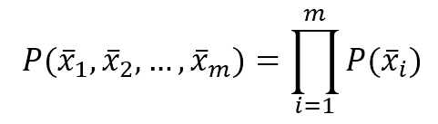

对应的输出值可以是数值-连续或分类。在前一种情况下，该过程称为 **回归**，而在第二种情况下，它称为 **分类**。数值输出的例子包括：

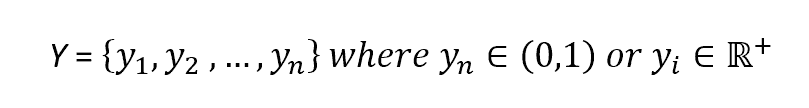

分类示例包括：

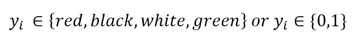

我们定义了通用的 **回归器**，一个将输入值关联到连续输出值的向量值函数，以及通用的 **分类器**，一个预测输出为分类（离散）的向量值函数。如果它们还依赖于一个内部参数向量，该向量决定了通用预测器的实际实例，则该方法称为 **参数学习方法**：

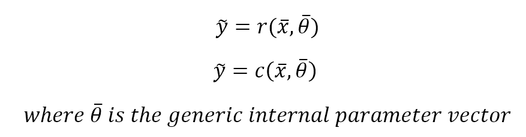

另一方面，**非参数学习**不对预测器的家族做出初始假设（例如，定义*r(...)*和*c(...)*的通用参数化版本）。一个非常常见的非参数家族被称为**基于实例的学习**，它基于仅由训练样本（实例集）确定的假设进行实时预测（无需预先计算参数值）。一种简单且广泛采用的方法是采用邻域的概念（具有固定的半径）。在分类问题中，一个新样本会自动被分类的训练元素所包围，输出类别是根据邻域中的主导元素确定的。在这本书中，我们将讨论属于此类的一个非常重要的算法家族：**基于核的支持向量机**。更多示例可以在 Russel S.，Norvig P.的《人工智能：一种现代方法》，Pearson*中找到。

内部动态和所有元素的解释都是每个单独算法特有的，因此我们更愿意现在不讨论阈值或概率，而是尝试使用一个抽象的定义。一个通用的参数化训练过程必须找到最佳参数向量，该向量在给定的特定训练数据集上最小化回归/分类误差，并且它还应该生成一个预测器，当提供未知样本时可以正确泛化。

另一种解释可以用加性噪声来表示：

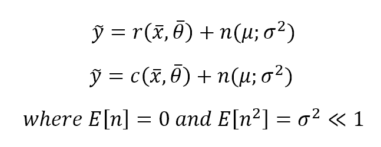

对于我们的目的，我们可以期望在完美预测中添加零均值和低方差的高斯噪声。训练任务必须通过优化参数来增加信噪比。当然，每当这样的术语不具有零均值（独立于其他*X*值）时，可能意味着存在一个必须考虑的隐藏趋势（可能是一个过早被丢弃的特征）。另一方面，高噪声方差意味着*X*是脏的，其测量不可靠。

到目前为止，我们假设回归和分类都操作于*m*-长度向量，但只产生一个值或一个标签（换句话说，一个输入向量总是与一个输出元素相关联）。然而，有许多策略来处理多标签分类和多输出回归。

在无监督学习中，我们通常只有一个输入集*X*，其中包含*m*-长度向量，我们定义聚类函数（具有*n*个目标聚类）如下：

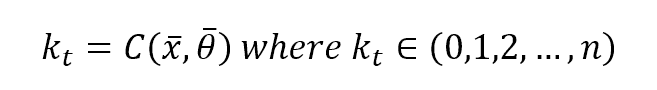

在大多数 scikit-learn 模型中，存在一个实例变量`coef_`，其中包含所有训练参数。例如，在单参数线性回归（我们将在下一章中广泛讨论它），输出将是：

```py
>>> model = LinearRegression()
>>> model.fit(X, Y)
>>> model.coef_
array([ 9.10210898])
```

# 多类策略

当输出类别的数量大于一个时，管理分类问题有两种主要可能性：

+   一对多

+   一对一

在这两种情况下，选择都是透明的，返回给用户的输出将始终是最终值或类别。然而，为了优化模型并始终选择最佳替代方案，理解不同的动态是很重要的。

# 一对多

这可能是最常用的策略，并且 scikit-learn 的大多数算法都广泛采用。如果有*n*个输出类别，将并行训练*n*个分类器，考虑到实际类别和剩余类别之间总是存在分离。这种方法相对轻量（最多需要*n-1*次检查来找到正确的类别，因此它具有*O(n)*的复杂性），因此通常是默认选择，无需进一步操作。

# 一对一

与一对多相比，一种替代方案是为每一对类别训练一个模型。复杂性不再是线性的（实际上它是*O(n²)*）并且正确的类别是通过多数投票确定的。一般来说，这种选择成本更高，只有在完整数据集比较不合适时才应采用。

如果你想了解更多关于 scikit-learn 实现的多类策略，请访问

[`scikit-learn.org/stable/modules/multiclass.html`](http://scikit-learn.org/stable/modules/multiclass.html)。

# 可学习性

一个参数模型可以被分为两部分：一个静态结构和一组动态参数。前者由特定算法的选择决定，通常是不可变的（除了模型提供某些重新建模功能的情况），而后者是我们优化的目标。考虑到*n*个无界参数，它们生成一个*n*-维空间（施加边界会产生一个子空间，在我们的讨论中不会引起相关变化）其中每个点，连同估计函数的不可变部分，代表一个学习假设*H*（与一组特定的参数相关联）：

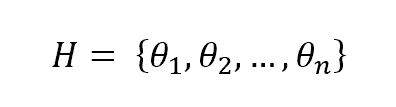

参数学习过程的目标是找到最佳假设，其对应的预测误差最小，并且剩余的泛化能力足够以避免过拟合。在下面的图中，有一个示例数据集，其点必须被分类为红色（**类别 A**）或蓝色（**类别 B**）。显示了三个假设：第一个（从左到右开始的中间线）错误地分类了一个样本，而下面和上面的分别错误地分类了 13 个和 23 个样本：

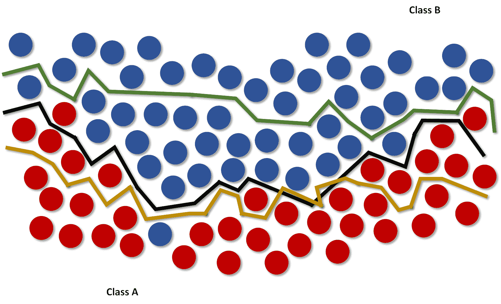

当然，第一个假设是最优的，应该被选中；然而，理解一个基本概念非常重要，这个概念可以决定潜在的过拟合。思考一个*n*-维二进制分类问题。我们说数据集*X*是***线性可分***（没有变换）的，如果存在一个超平面可以将空间分为两个子空间，只包含属于同一类的元素。移除线性的约束，我们有无穷多的使用通用超面的替代方案。然而，参数模型只采用一族非周期性和近似函数，其振荡和拟合数据集的能力由参数的数量（有时以非常复杂的方式）决定。

考虑以下图中所示的示例：

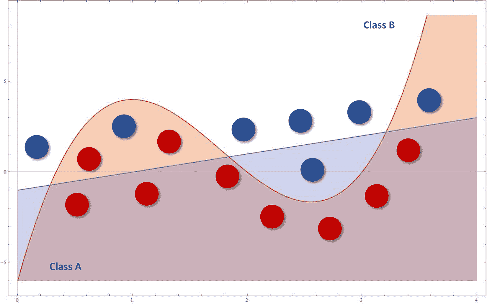

蓝色分类器是线性的，而红色的是立方的。乍一看，非线性策略似乎表现更好，因为它可以通过其凹面捕捉更多的表达能力。然而，如果按照最后四个样本（从右到左）定义的趋势添加新的样本，它们将被完全错误分类。事实上，虽然线性函数在全局上更好，但不能捕捉 0 和 4 之间的初始振荡，而立方方法可以几乎完美地拟合这些数据，但同时也失去了保持全局线性趋势的能力。因此，有两种可能性：

+   如果我们期望未来的数据与训练样本的分布完全相同，那么一个更复杂的模型可以是一个好的选择，以捕捉低级模型会丢弃的小变化。在这种情况下，一个线性（或低级）模型将导致欠拟合，因为它无法捕捉适当的表达能力水平。

+   如果我们认为未来的数据可以在局部以不同的方式分布，但保持全局趋势，那么更倾向于有更高的残余误分类错误以及更精确的泛化能力。仅关注训练数据的大模型可能导致过拟合。

# 欠拟合和过拟合

机器学习模型的目的是对一个未知函数进行近似，该函数将输入元素与输出元素（对于分类器，我们称之为类别）关联起来。然而，训练集通常是一个全局分布的表示，但它不能包含所有可能的元素；否则问题可以用一对一的关联来解决。同样，我们不知道可能的基本函数的解析表达式，因此，在训练时，必须考虑拟合模型，但保持它在面对未知输入时可以自由泛化的能力。不幸的是，这种理想条件并不总是容易找到，并且考虑两种不同的危险是很重要的：

+   **欠拟合**：这意味着模型无法捕捉出由相同的训练集所展示的动态（可能是因为其容量过于有限）。

+   **过拟合**：模型具有过度的容量，并且它不能根据训练集提供的原始动态进行泛化。它可以几乎完美地将所有已知样本与其相应的输出值关联起来，但当呈现未知输入时，相应的预测误差可能非常高。

在下面的图片中，有低容量（欠拟合）、正常容量（正常拟合）和过度容量（过拟合）插值的例子：

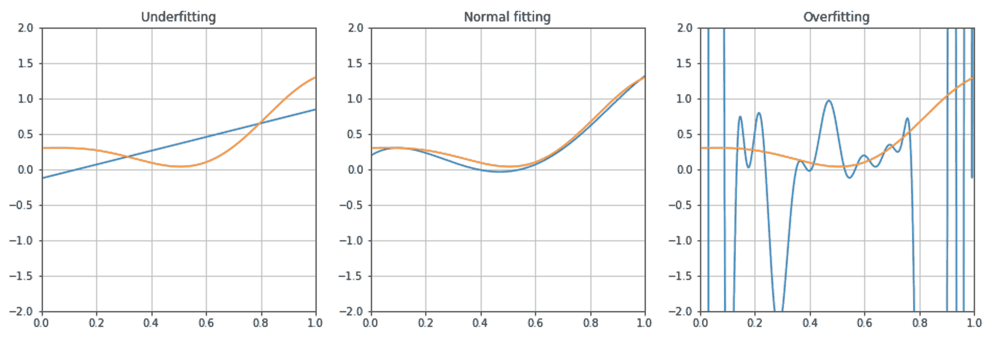

避免欠拟合和过拟合非常重要。考虑到预测误差，欠拟合更容易检测，而过拟合可能证明更难发现，因为它最初可能被认为是完美拟合的结果。

在下一章中我们将讨论的交叉验证和其他技术可以很容易地显示我们的模型如何与训练阶段从未见过的测试样本一起工作。这样，我们就可以在一个更广泛的环境中评估泛化能力（记住，我们不是处理所有可能值，而是一直处理一个应该反映原始分布的子集）。

然而，一个通用的经验法则表明，一个残差误差总是必要的，以保证良好的泛化能力，而一个在训练样本上显示 99.999...百分比的验证精度的模型几乎肯定过拟合了，并且很可能无法正确预测从未见过的输入样本。

# 误差度量

通常，当在监督场景下工作时，我们定义一个非负误差度量 *e[m]*，它接受两个参数（预期输出和预测输出），并允许我们计算整个数据集（由 *n* 个样本组成）的总误差值：

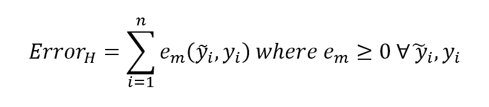

这个值也隐式地依赖于特定的假设 *H* 通过参数集，因此优化误差意味着找到一个最优假设（考虑到许多优化问题的难度，这并不是绝对最好的，但是一个可接受的近似）。在许多情况下，考虑**均方误差**（**MSE**）是有用的：

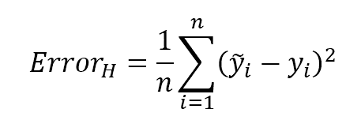

其初始值代表了一个 n 变量函数表面的一个起点。一个通用的训练算法必须找到全局最小值或一个非常接近它的点（总是有一个容忍度以避免过多的迭代和随之而来的过拟合风险）。这个度量也被称为**损失函数**，因为它的值必须通过一个优化问题来最小化。当容易确定一个必须最大化的元素时，相应的损失函数将是它的倒数。

另一个有用的损失函数被称为**零一损失**，它特别适用于二元分类（也适用于一对一多类策略）：

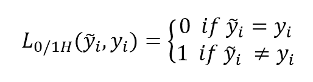

这个函数隐式地是一个指示器，可以很容易地应用于基于误分类概率的损失函数。

一个通用的（连续的）损失函数的有帮助的解释可以用势能来表示：

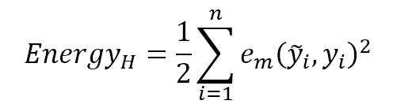

预测器就像粗糙表面上的一颗球：从一个能量（=错误）通常相当高的随机点开始，它必须移动直到它达到一个稳定的平衡点，在那里它的能量（相对于全局最小值）为零。在下面的图中，有一些不同情况的概念图示：

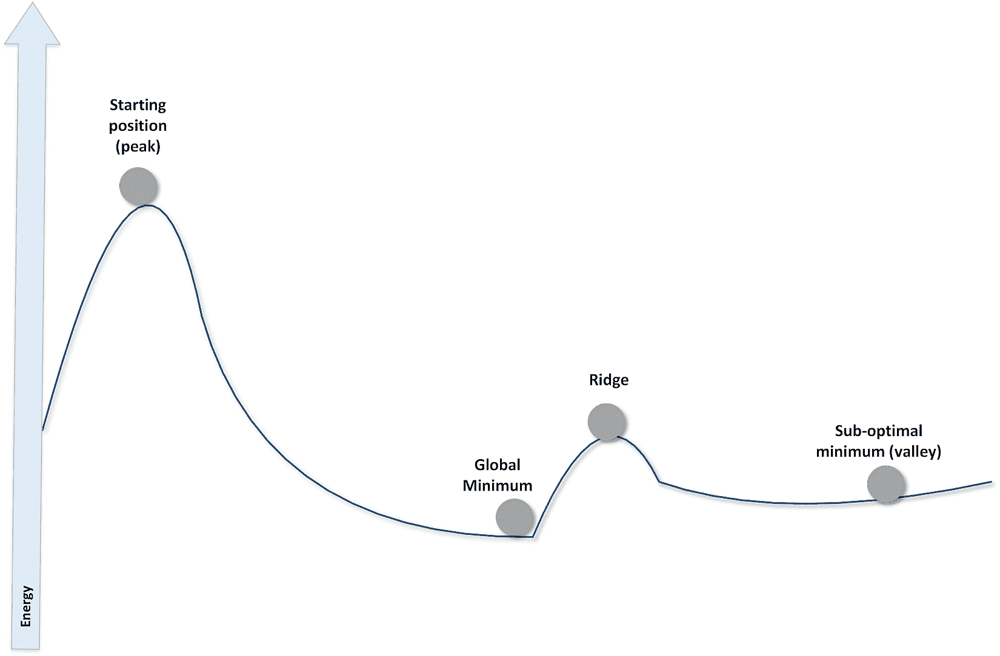

就像在物理情况中一样，起点在没有外部扰动的情况下是稳定的，因此为了启动这个过程，需要提供初始动能。然而，如果这种能量足够强大，那么在沿着斜坡下降后，球不能停在全局最小值处。剩余的动能可能足以克服脊并达到正确的山谷。如果没有其他能量来源，球就会被困在平原山谷中，无法再移动。已经开发了许多技术来解决此问题并避免局部最小值。然而，必须始终仔细分析每种情况，以了解可以接受的剩余能量（或错误）水平，或者是否最好采用不同的策略。我们将在下一章中讨论其中的一些。

# PAC 学习

在许多情况下，机器学习似乎无缝工作，但有没有什么方法可以正式确定一个概念的可学习性？1984 年，计算机科学家 L. Valiant 提出了一种数学方法来确定一个问题是否可以通过计算机学习。这种技术的名称是 **PAC**，或 **可能近似正确**。

原始公式（您可以在 Valiant L. 的《可学习理论》*《ACM 通讯》*，第 27 卷，第 11 期，1984 年 11 月中找到）基于一个特定的假设，然而，在不损失大量精度的情况下，我们可以考虑一个分类问题，其中算法 *A* 必须学习一组概念*.* 具体来说，一个概念是输入模式 *X* 的一个子集，它决定了相同的输出元素。因此，学习一个概念（参数化地）意味着最小化对应损失函数在特定类别的限制，而学习所有可能的概念（属于同一宇宙），意味着找到全局损失函数的最小值。

然而，给定一个问题，我们有许多可能的（有时，理论上无限）假设，并且通常需要进行概率权衡。因此，我们基于有限数量的输入元素和多项式时间内产生的结果，以高概率接受良好的近似。

因此，算法*A*能够学习所有概念（使它们成为 PAC 可学习的）的类别*C*，如果它能够找到一个假设*H*，通过一个*O(n^k)*过程，使得*A*，以概率*p*，可以在最大允许误差*m[e]*下正确分类所有模式。这必须对所有*X*上的统计分布和训练样本的数量有效，该数量必须大于或等于仅取决于*p*和*m[e]*的最小值。

计算复杂度的限制不是一个次要问题，实际上，我们期望我们的算法在问题相当复杂的情况下也能在合理的时间内高效地学习。当数据集太大或优化起点离可接受的最低点非常远时，指数时间可能导致计算爆炸。此外，重要的是要记住所谓的**维度诅咒**，这是一种在某些模型中经常发生的效果，其中训练或预测时间与维度成比例（不一定是线性关系），因此当特征数量增加时，模型的性能（当输入维度较小时可能是合理的）会急剧下降。此外，在许多情况下，为了捕捉完整的表达能力，需要一个非常大的数据集，而没有足够的训练数据，近似可能会变得有问题（这被称为**休斯现象**）。因此，寻找多项式时间算法不仅仅是一个简单的努力，因为它可以决定机器学习问题的成功或失败。因此，在接下来的章节中，我们将介绍一些可以用来有效地降低数据集维度而不损失信息的技术的技术。

# 统计学习方法

假设你需要从以下初始（过于简化的）基于两个参数的分类开始设计一个垃圾邮件过滤算法：

| **参数** | **垃圾邮件（***X[1]***)** | **常规邮件（***X2***)** |
| --- | --- | --- |
| *p[1]* - 包含> 5 个黑名单词汇 | 80 | 20 |
| *p[2]*- 消息长度< 20 个字符 | 75 | 25 |

我们收集了 200 封电子邮件（*X*）（为了简单起见，我们考虑*p[1]*和*p[2]*相互排斥）并且我们需要找到一对概率假设（用*p[1]*和*p[2]*来表示），以确定：

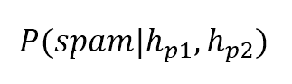

我们还假设这两个项的条件独立性（这意味着*h[p1]*和*h[p2]*以相同的方式共同贡献垃圾邮件，就像它们单独存在时一样）。

例如，我们可以考虑以下规则（假设）：“如果有超过五个黑名单词汇”或“如果消息长度小于 20 个字符”那么“垃圾邮件的概率很高”（例如，大于 50%）。然而，如果没有分配概率，当数据集发生变化时（如现实世界中的反垃圾邮件过滤器），很难进行泛化。我们还想确定一个分区阈值（如绿色、黄色和红色信号），以帮助用户决定保留什么和删除什么。

由于假设是通过数据集 *X* 确定的，我们也可以以离散形式写出：

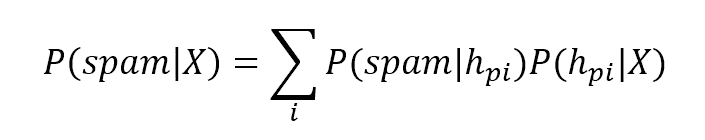

在这个例子中，确定每个项的值相当容易。然而，在一般情况下，有必要引入贝叶斯公式（将在第六章，*朴素贝叶斯*）：

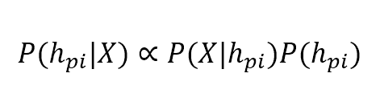

比例性是必要的，以避免引入边缘概率 *P(X)*，它只起一个规范化因子的作用（记住，在离散随机变量中，所有可能的概率结果之和必须等于 1）。

在前一个方程中，第一项被称为**后验概率**（which comes after），因为它是由一个边缘**先验概率**（which comes first）乘以一个称为**似然**的因子所确定的。为了理解这种方法的哲学，举一个简单的例子很有用：抛一个公平的硬币。每个人都知道每个面的边缘概率都是相等的，等于 0.5，但谁决定了这一点？这是逻辑和概率公理的理论结果（一个好的物理学家会说，由于我们简单地忽略了几个因素，它永远不会是 0.5）。抛硬币 100 次后，我们观察结果，令人惊讶的是，我们发现正反比略有所不同（例如，0.46）。我们如何纠正我们的估计？称为**似然**的项衡量我们的实际实验在多大程度上证实了先验假设，并确定另一个概率（**后验概率**），它反映了实际情况。因此，似然帮助我们动态地纠正估计，克服固定概率的问题。

在第六章，*朴素贝叶斯*，专门讨论朴素贝叶斯算法的章节中，我们将深入讨论这些主题，并使用 scikit-learn 实现一些示例，然而，在这里介绍两种非常普遍的统计学习方法是有用的。有关更多信息，请参阅*Russel S.，Norvig P.，人工智能：一种现代方法，Pearson*。

# MAP 学习

在选择合适的假设时，贝叶斯方法通常是最好的选择之一，因为它考虑了所有因素，并且正如我们将要看到的，即使它基于条件独立性，当某些因素部分相关时，这种方法也能完美地工作。然而，其复杂性（从概率的角度来看）可以轻易增长，因为所有项都必须始终被考虑。例如，一枚真实的硬币是一个非常短的圆柱体，所以在抛硬币时，我们也应该考虑偶数的概率。比如说，它是 0.001。这意味着我们有三种可能的结果：*P(head)* = *P(tail)* = (1.0 - 0.001) / 2.0 和 *P(even)* = 0.001。后者事件显然不太可能，但在贝叶斯学习中必须考虑（即使它会被其他项的强度所压缩）。

另一个选择是选择基于**后验概率**的最可能假设：

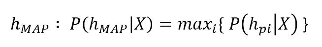

这种方法被称为**最大后验概率估计（MAP**）并且它确实可以简化某些假设非常不可能的情况（例如，在抛硬币时，MAP 假设将丢弃*P(even)*）。然而，它仍然有一个重要的缺点：它依赖于先验概率（记住，最大化后验概率意味着也要考虑先验概率）。正如 Russel 和 Norvig（Russel S.，Norvig P.，《人工智能：一种现代方法》，Pearson）所指出的，这通常是推理过程中的一个微妙部分，因为总有一个理论背景可以导致特定的选择并排除其他选择。为了仅依赖于数据，有必要采用不同的方法。

# 最大似然学习

我们已经将似然定义为贝叶斯公式中的过滤项。一般来说，它具有以下形式：

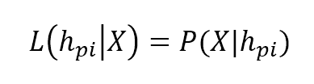

这里第一个项表示给定数据集*X*的假设的实际似然。正如你可以想象的，在这个公式中不再有先验概率，所以最大化它并不意味着接受一个理论上的偏好假设，也不考虑不可能的假设。一个非常常见的方法，称为**期望最大化（expectation-maximization**）并且被许多算法使用（我们将在逻辑回归中看到一个例子），分为两个主要部分：

+   基于模型参数确定对数似然表达式（它们将被相应优化）

+   最大化它直到残差误差足够小

对数似然（通常称为**L**）是一个有用的技巧，可以简化梯度计算。一个通用的似然表达式是：

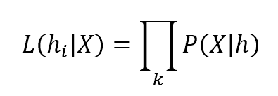

由于所有参数都在*h[i]*中，梯度是一个复杂的表达式，不太容易管理。然而，我们的目标是最大化似然，但最小化其倒数更容易：

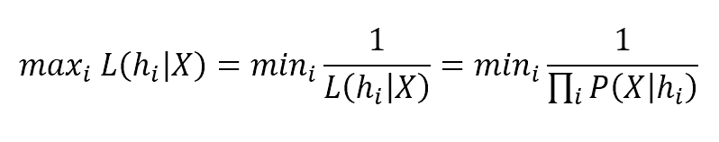

通过应用自然对数（这是一个单调函数），这可以转化为一个非常简单的表达式：

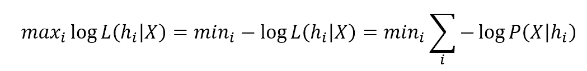

最后这一项是一个求和，它可以在大多数优化算法中轻松推导和使用。在完成这个过程后，我们可以找到一组参数，它提供了最大似然，而不需要对先验分布做出任何强烈的声明。这种方法可能看起来非常技术性，但它的逻辑实际上非常简单直观。为了理解它是如何工作的，我提出一个简单的练习，这是高斯混合技术的一部分，也在 Russel S.，Norvig P.的《人工智能：一种现代方法》，Pearson*.*中讨论过。

让我们考虑从均值为零、标准差等于 2.0 的高斯分布中抽取的 100 个点（由独立样本组成的准白色噪声）：

```py
import numpy as np

nb_samples = 100
X_data = np.random.normal(loc=0.0, scale=np.sqrt(2.0), size=nb_samples)
```

下图展示了情节：

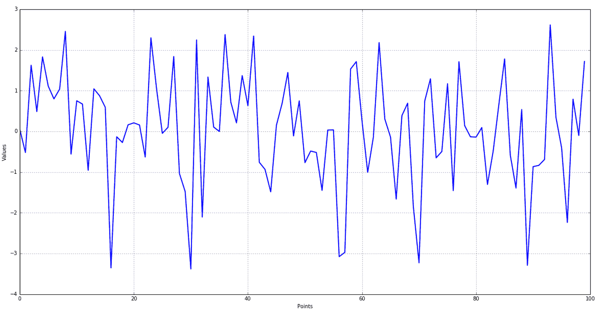

在这个情况下，没有必要进行深入探索（我们知道它们是如何生成的），然而，在将假设空间限制为高斯族（仅考虑图的情况下最合适的）之后，我们希望找到均值和方差的最佳值。首先，我们需要计算对数似然（由于指数函数的存在，这相当简单）：

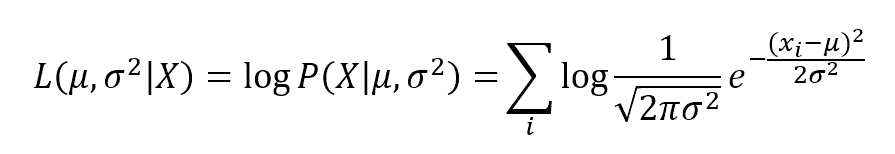

接下来提供了一个简单的 Python 实现（为了方便使用，这里只有一个数组，它包含均值（0）和方差（1））：

```py
def negative_log_likelihood(v):
 l = 0.0
 f1 = 1.0 / np.sqrt(2.0 * np.pi * v[1]) 
 f2 = 2.0 * v[1]

 for x in X_data:
 l += np.log(f1 * np.exp(-np.square(x - v[0]) / f2))

 return -l
```

然后我们需要使用任何可用的方法（梯度下降或其他数值优化算法）找到它的最小值（就均值和方差而言）。例如，使用`scipy`的最小化函数，我们可以轻松地得到：

```py
from scipy.optimize import minimize

>>> minimize(fun=negative_log_likelihood, x0=[0.0, 1.0])

 fun: 172.33380423827057
 hess_inv: array([[ 0.01571807,  0.02658017],
       [ 0.02658017,  0.14686427]])
      jac: array([  0.00000000e+00,  -1.90734863e-06])
  message: 'Optimization terminated successfully.'
     nfev: 52
      nit: 9
     njev: 13
   status: 0
  success: True
        x: array([ 0.04088792,  1.83822255])
```

接下来绘制了负对数似然函数的图表。该函数的全局最小值对应于给定一定分布下的最优似然。这并不意味着问题已经完全解决，因为该算法的第一步是确定一个期望值，这个期望值必须始终是现实的。然而，似然函数对错误的分布非常敏感，因为它在概率低时很容易接近零。因此，**最大似然**（**ML**）学习通常比需要先验分布的 MAP 学习更可取，后者在未以最合适的方式选择时可能会失败：

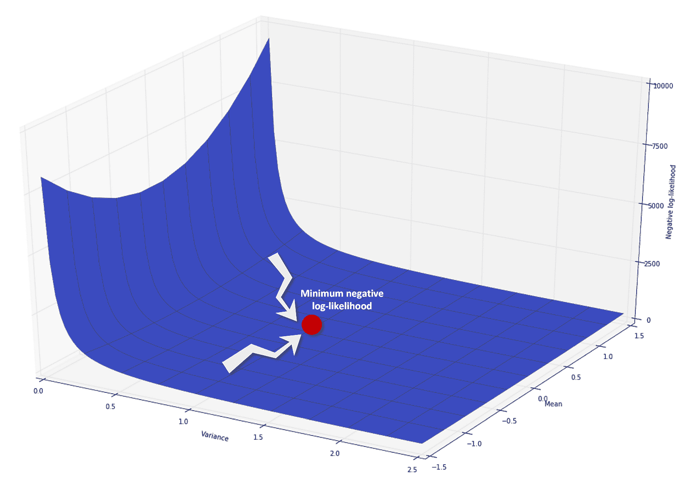

这种方法已经应用于特定的分布族（这确实很容易管理），但当模型更复杂时，它也能完美地工作。当然，始终有必要对如何确定似然性有一个初步的了解，因为多个可行的家族可以生成相同的数据集。在这些所有情况下，**奥卡姆剃刀**是最佳的前进方式：应该首先考虑最简单的假设。如果它不合适，可以给我们的模型添加额外的复杂度。正如我们将看到的，在许多情况下，最简单的解决方案就是获胜的方案，增加参数的数量或使用更详细模型只会增加噪声和过拟合的可能性。

SciPy ([`www.scipy.org`](https://www.scipy.org)) 是一组针对 Python 的高端科学和数据导向的库。它包括 NumPy、Pandas 以及许多其他有用的框架。如果你想了解更多关于 Python 科学计算的信息，请参考 Johansson R. 的 *Numerical Python*，Apress 出版，或者 Landau R. H.、Pàez M. J.、Bordeianu C. C. 的 *Computational Physics. Problem Solving with Python*，Wiley-VCH 出版。

# 信息论要素

机器学习问题也可以从信息传递或交换的角度进行分析。我们的数据集由 *n* 个特征组成，这些特征被认为是独立的（为了简单起见，即使这通常是一个现实的假设），它们来自 *n* 个不同的统计分布。因此，有 *n* 个概率密度函数 *pi*，必须通过其他 *n* 个 *q**i* 函数来近似。在任何机器学习任务中，理解两个相应的分布如何发散以及当我们近似原始数据集时损失多少信息是非常重要的。

最有用的度量称为**熵**：

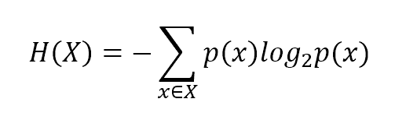

这个值与 *X* 的不确定性成正比，并且以 **比特**（如果对数的底数不同，这个单位也可能改变）来衡量。对于许多目的来说，高熵是首选的，因为它意味着某个特征包含更多的信息。例如，在抛硬币（两种可能的结果）的情况下，*H(X)* = 1 比特，但如果结果的数量增加，即使概率相同，*H(X)* 也会因为更多不同的值和因此增加的变异性而增加。可以证明，对于高斯分布（使用自然对数）：

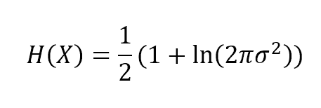

因此，熵与方差成正比，方差是衡量单个特征所携带信息量的度量。在下一章中，我们将讨论一种基于方差阈值的特征选择方法。高斯分布非常常见，因此这个例子可以被视为特征过滤的一般方法：低方差意味着低信息水平，模型通常会丢弃所有这些特征。

在以下图中，展示了高斯分布的 *H(X)* 图形，该分布以 **nats**（当使用自然对数时对应的单位）表示：

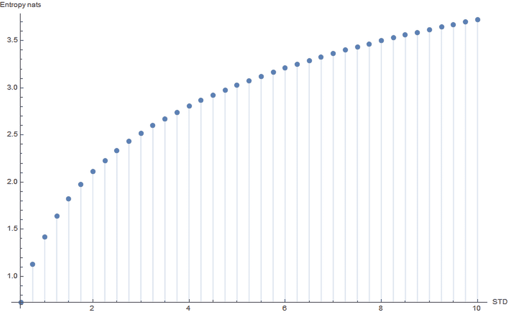

例如，如果一个数据集由一些特征组成，这些特征的方差（在这里更方便谈论标准差）介于 8 和 10 之间，而少数具有 *STD < 1.5* 的特征，后者可以在有限的信息损失下被丢弃。这些概念在现实生活中的问题中非常重要，当必须以高效的方式清理和处理大量数据集时。

如果我们有一个目标概率分布 *p(x)*，它被另一个分布 *q(x)* 近似，一个有用的度量是 *p* 和 *q* 之间的 **交叉熵**（我们使用离散定义，因为我们的问题必须通过数值计算来解决）：

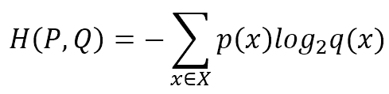

如果以 2 为底数，它衡量使用针对 *Q* 优化的代码解码从 *P* 中抽取的事件所需的位数。在许多机器学习问题中，我们有一个源分布，我们需要训练一个估计器来正确识别样本的类别。如果错误为零，*P = Q* 且交叉熵最小（对应于熵 *H(P)*）。然而，由于与 *Q* 一起工作时零错误几乎是不可能的，我们需要支付 *H(P, Q)* 位的代价，从预测开始确定正确的类别。我们的目标通常是使其最小化，以在不会改变预测输出的阈值以下减少这种“代价”。换句话说，考虑一个二元输出和 sigmoid 函数：我们有一个阈值为 0.5（这是我们能够支付的最大的“代价”），使用阶跃函数（0.6 -> 1，0.1 -> 0，0.4999 -> 0，等等）来识别正确的类别。由于我们的分类器不知道原始分布，我们不能支付这个“代价”，因此有必要将交叉熵降低到可接受的噪声鲁棒性阈值以下（这总是可以实现的最低值）。

为了理解机器学习方法的表现，引入一个 **条件** 熵或 *X* 在知道 *Y* 的知识下的不确定性也是很有用的：

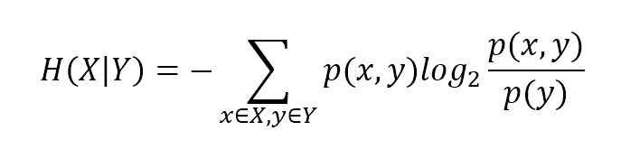

通过这个概念，可以引入互信息的思想，即两个变量共享的信息量，因此，通过 *Y* 的知识提供的关于 *X* 的不确定性减少：

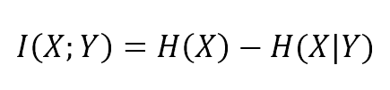

直观地，当*X*和*Y*是独立的，它们不共享任何信息。然而，在机器学习任务中，原始特征与其预测之间存在非常紧密的依赖关系，因此我们希望最大化两个分布共享的信息。如果条件熵足够小（因此*Y*能够很好地描述*X*），则互信息接近边缘熵*H(X*)，它衡量我们想要学习的信息量。

一种基于信息论的有趣的学习方法，称为**最小描述长度**（**MDL**），在 Russel S.，Norvig P.的《人工智能：一种现代方法》一书中进行了讨论，Pearson 出版社，我建议您在此处查找有关这些主题的更多信息。

# 参考文献

+   Russel S.，Norvig P.，《人工智能：一种现代方法》，Pearson

+   Valiant L.，《可学习理论》，ACM 通讯，第 27 卷，第 11 期（1984 年 11 月）

+   Hastie T.，Tibshirani R.，Friedman J.，《统计学习的元素：数据挖掘、推理和预测》，Springer

+   Aleksandrov A.D.，Kolmogorov A.N，Lavrent'ev M.A.，《数学：其内容、方法和意义》，Courier Corporation

# 摘要

在本章中，我们介绍了一些关于机器学习的主要概念。我们首先从一些基本的数学定义开始，以便对数据格式、标准和函数类型有一个清晰的认识。这种符号将在所有其他章节中采用，并且在技术出版物中也是最广泛使用的。我们讨论了 scikit-learn 如何无缝地处理多类问题，以及何时一种策略比另一种策略更可取。

下一步是引入一些关于可学习性的基本理论概念。我们试图回答的主要问题是：我们如何决定一个问题是否可以通过算法来学习，以及我们能够达到的最大精度是什么。PAC 学习是一个通用的但强大的定义，可以在定义算法边界时采用。实际上，一个 PAC 可学习的问题不仅可以通过合适的算法来管理，而且足够快，可以在多项式时间内计算。然后我们引入了一些常见的统计学习概念，特别是 MAP 和最大似然学习方法。前者试图选择最大化后验概率的假设，而后者则处理似然性，寻找与数据最吻合的假设。这种策略在许多机器学习问题中非常普遍，因为它不受先验概率的影响，并且在许多不同的环境中很容易实现。我们还给出了损失函数作为能量函数的物理解释。训练算法的目标是始终尝试找到全局最小点，这对应于误差表面的最深谷。在本章的结尾，简要介绍了信息论以及我们如何用信息增益和熵来重新解释我们的问题。每个机器学习方法都应该努力减少从预测开始并恢复原始（期望）结果所需的信息量。

在下一章中，我们将讨论特征工程的基本概念，这是几乎所有机器学习流程的第一步。我们将展示如何管理不同类型的数据（数值和分类）以及如何在信息损失不大的情况下降低维度。
