# 第八章：决策树和集成学习

在本章中，我们将讨论二进制决策树和集成方法。尽管它们可能不是最常见的分类方法，但它们提供了良好的简单性，并且可以在许多不需要高复杂性的任务中应用。当需要展示决策过程的工作原理时，它们也非常有用，因为它们基于一种可以在演示中轻松展示并逐步描述的结构。

集成方法是复杂算法的有力替代品，因为它们试图利用多数投票的统计概念。可以训练许多弱学习器来捕捉不同的元素并做出自己的预测，这些预测不是全局最优的，但使用足够数量的元素，从统计上讲，大多数预测将是正确的。特别是，我们将讨论决策树的随机森林和一些提升方法，这些方法稍微不同的算法可以通过关注误分类样本或通过持续最小化目标损失函数来优化学习过程。

# 二进制决策树

二进制决策树是一种基于顺序决策过程的结构。从根节点开始，评估一个特征并选择两个分支中的一个。这个过程会重复进行，直到达到一个最终的叶子节点，它通常代表我们寻找的分类目标。与其他算法相比，决策树在动态上似乎更简单；然而，如果数据集在保持内部平衡的同时可以分割，整个过程在预测上既直观又相对快速。此外，决策树可以有效地处理未归一化的数据集，因为它们的内部结构不受每个特征所取值的影响。在下图中，有未归一化的二维数据集的图和用逻辑回归和决策树获得的交叉验证分数：

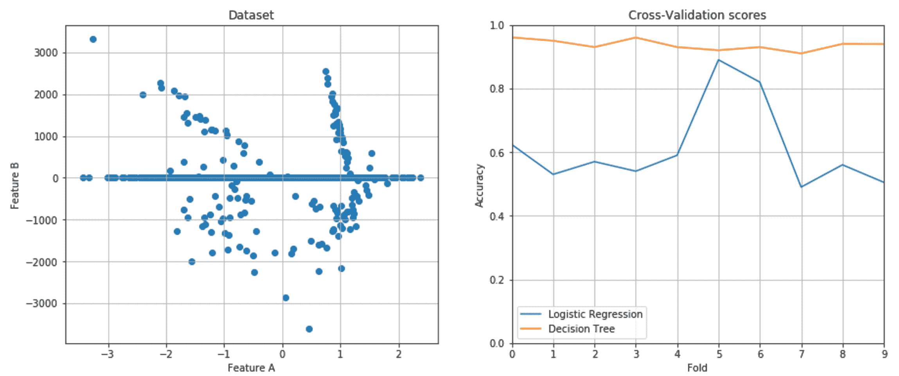

决策树始终达到接近 1.0 的分数，而逻辑回归的平均分数略大于 0.6。然而，如果没有适当的限制，决策树可能会潜在地生长到每个节点中只有一个样本（或非常少的样本）。这种情况会导致模型过拟合，并且树无法正确泛化。使用一致的测试集或交叉验证可以帮助避免这个问题；然而，在关于 scikit-learn 实现的部分，我们将讨论如何限制树的增长。

# 二进制决策

让我们考虑一个输入数据集 *X*：

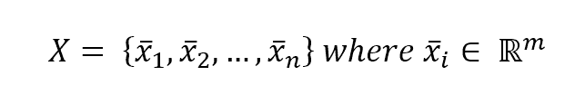

每个向量由 *m* 个特征组成，因此每个特征都可以作为基于（特征，阈值）元组的节点的好候选：

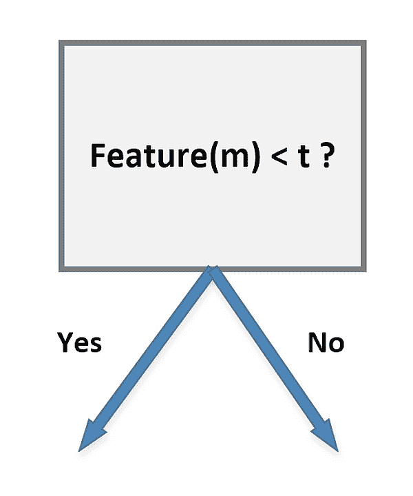

根据特征和阈值，树的结构将发生变化。直观上，我们应该选择最能分离我们的数据的特征，换句话说，一个完美的分离特征将只存在于一个节点，接下来的两个分支将不再基于它。在现实问题中，这往往是不可行的，因此需要找到最小化后续决策步骤数量的特征。

例如，让我们考虑一个学生群体，其中所有男生都有深色头发，所有女生都有金色头发，而这两个子集都有不同大小的样本。如果我们的任务是确定班级的组成，我们可以从以下细分开始：

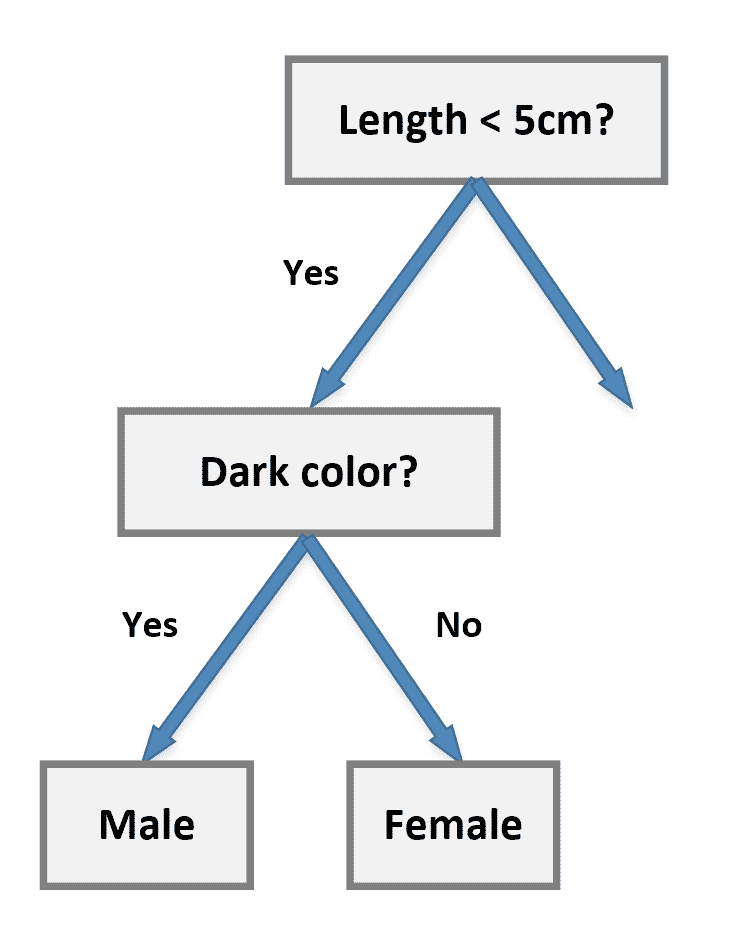

然而，包含**深色？**的块将包含男性和女性（这是我们想要分类的目标）。这个概念用术语**纯净度**（或者更常见的是其对立概念，**杂质**）来表示。一个理想的场景是基于杂质为零的节点，这样后续的所有决策都只基于剩余的特征。在我们的例子中，我们可以简单地从颜色块开始：

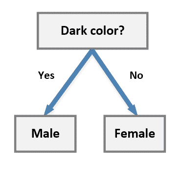

根据颜色特征，现在得到的两个集合是纯净的，这足以满足我们的任务。如果我们需要更详细的细节，例如发长，必须添加其他节点；它们的杂质不会为零，因为我们知道，例如，既有长发男生也有长发女生。

更正式地说，假设我们定义选择元组如下：

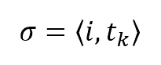

这里，第一个元素是我们想要在某个节点上分割数据集所使用的特征的索引（它只会在开始时是整个数据集；每一步之后，样本数都会减少），而第二个是确定左右分支的阈值。最佳阈值的选择是一个基本元素，因为它决定了树的结构，因此也决定了其性能。目标是减少分割中剩余的杂质，以便在样本数据和分类结果之间有非常短的决策路径。

我们还可以通过考虑两个分支来定义总杂质度量：

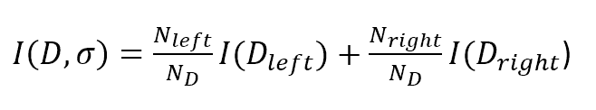

在这里，*D* 是所选节点上的整个数据集，*D[left]* 和 *D[right]* 是通过应用选择元组得到的结果子集，而 *I* 是杂质度量。

# 杂质度量

要定义最常用的杂质度量，我们需要考虑目标类别的总数：


在某个节点 *j*，我们可以定义概率 *p(i|j)*，其中 *i* 是与每个类别关联的索引 [1, *n*]。换句话说，根据频率主义方法，这个值是属于类别 *i* 的样本数与属于所选节点的总样本数之间的比率。

# Gini 不纯度指数

Gini 不纯度指数定义为：

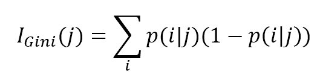

在这里，总和总是扩展到所有类别。这是一个非常常见的度量，并且被 scikit-learn 用作默认值。给定一个样本，Gini 不纯度衡量的是如果使用分支的概率分布随机选择标签时发生错误分类的概率。当节点中所有样本都被分类到单个类别时，该指标达到最小值（0.0）。

# 交叉熵不纯度指数

交叉熵度量定义为：

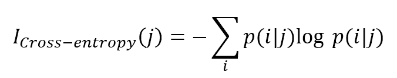

这个度量基于信息理论，并且仅在分割中存在属于单个类别的样本时假设为空值，而在类别之间有均匀分布时达到最大值（这是决策树中最坏的情况之一，因为它意味着还有许多决策步骤直到最终分类）。这个指标与 Gini 不纯度非常相似，尽管更正式地说，交叉熵允许你选择最小化关于分类不确定性的分割，而 Gini 不纯度最小化错误分类的概率。

在第二章《机器学习中的重要元素》中，我们定义了互信息的概念 *I(X; Y) = H(X) - H(X|Y)*，作为两个变量共享的信息量，从而减少了由 *Y* 的知识提供的关于 *X* 的不确定性。我们可以使用这个来定义分割提供的信息增益：

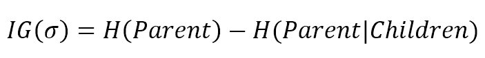

当生长树时，我们首先选择提供最高信息增益的分割，并继续进行，直到满足以下条件之一：

+   所有节点都是纯净的

+   信息增益为零

+   已达到最大深度

# 错误分类不纯度指数

错误分类不纯度是最简单的指标，定义为：


在质量性能方面，这个指标并不是最佳选择，因为它对不同的概率分布（这可以很容易地驱动选择使用 Gini 或交叉熵指标进行细分）并不特别敏感。

# 特征重要性

当使用多维数据集生长决策树时，评估每个特征在预测输出值中的重要性可能很有用。在第三章《特征选择和特征工程》中，我们讨论了一些通过仅选择最显著的特征来降低数据集维度的方法。决策树提供了一种基于每个特征确定的不纯度减少的不同方法。特别是，考虑一个特征 *x[i]*，其重要性可以确定如下：

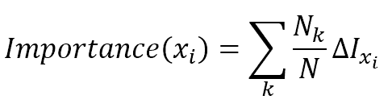

求和扩展到所有使用*x[i]*的节点，而*N[k]*是达到节点*k*的样本数量。因此，重要性是所有仅考虑使用特征分割的节点的杂质减少的加权总和。如果采用 Gini 杂质指数，这个度量也称为**Gini 重要性**。

# 使用 scikit-learn 进行决策树分类

scikit-learn 包含`DecisionTreeClassifier`类，它可以训练具有 Gini 和交叉熵杂质度量的二叉决策树。在我们的例子中，让我们考虑一个具有三个特征和三个类别的数据集：

```py
from sklearn.datasets import make_classification

>>> nb_samples = 500
>>> X, Y = make_classification(n_samples=nb_samples, n_features=3, n_informative=3, n_redundant=0, n_classes=3, n_clusters_per_class=1)
```

让我们先考虑一个默认 Gini 杂质度量的分类：

```py
from sklearn.tree import DecisionTreeClassifier
from sklearn.model_selection import cross_val_score

>>> dt = DecisionTreeClassifier()
>>> print(cross_val_score(dt, X, Y, scoring='accuracy', cv=10).mean())
0.970
```

一个非常有趣的功能是能够将树以`Graphviz`格式导出，并将其转换为 PDF。

Graphviz 是一个免费工具，可以从[`www.graphviz.org`](http://www.graphviz.org)下载。

要导出训练好的树，必须使用内置函数`export_graphviz()`：

```py
from sklearn.tree import export_graphviz

>>> dt.fit(X, Y)
>>> with open('dt.dot', 'w') as df:
 df = export_graphviz(dt, out_file=df, 
 feature_names=['A','B','C'], 
 class_names=['C1', 'C2', 'C3'])
```

在这种情况下，我们使用了`A`、`B`和`C`作为特征名称，`C1`、`C2`和`C3`作为类别名称。一旦文件创建完成，可以使用命令行工具将其转换为 PDF：

```py
>>> <Graphviz Home>bindot -Tpdf dt.dot -o dt.pdf
```

我们的示例图相当大，所以在下图中您只能看到分支的一部分：

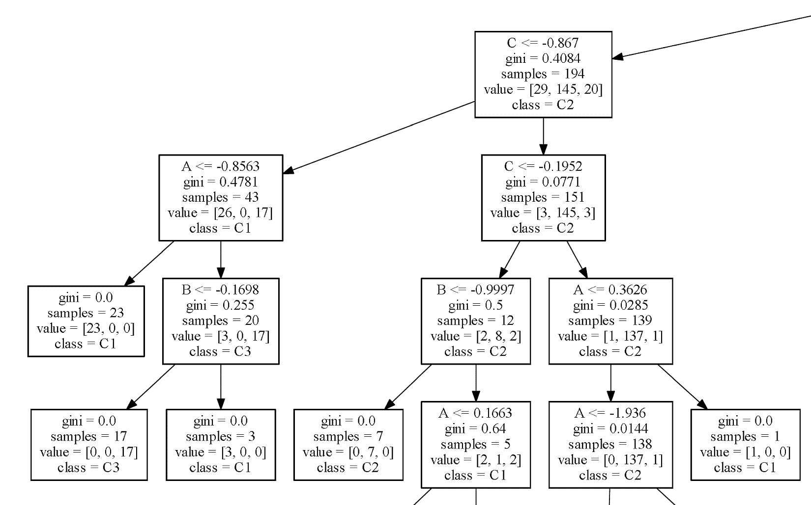

如您所见，有两种类型的节点：

+   非终端，它包含分割元组（作为特征 <= 阈值）和正杂质度量

+   终端，其中杂质度量值为空且存在一个最终的目标类别

在这两种情况下，您都可以始终检查样本数量。这种类型的图在理解需要多少决策步骤非常有用。不幸的是，即使过程相当简单，数据集的结构可能导致非常复杂的树，而其他方法可以立即找到最合适的类别。当然，不是所有特征的重要性都相同。如果我们考虑树的根和第一个节点，我们会发现能够分离大量样本的特征；因此，它们的重要性必须高于所有终端节点的重要性，在终端节点中剩余的样本数量最少。在 scikit-learn 中，在训练模型后可以评估每个特征的 Gini 重要性：

```py
>>> dt.feature_importances_
array([ 0.12066952,  0.12532507,  0.0577379 ,  0.14402762,  0.14382398,
 0.12418921,  0.14638565,  0.13784106])

>>> np.argsort(dt.feature_importances_)
array([2, 0, 5, 1, 7, 4, 3, 6], dtype=int64)
```

下图显示了重要性的绘图：

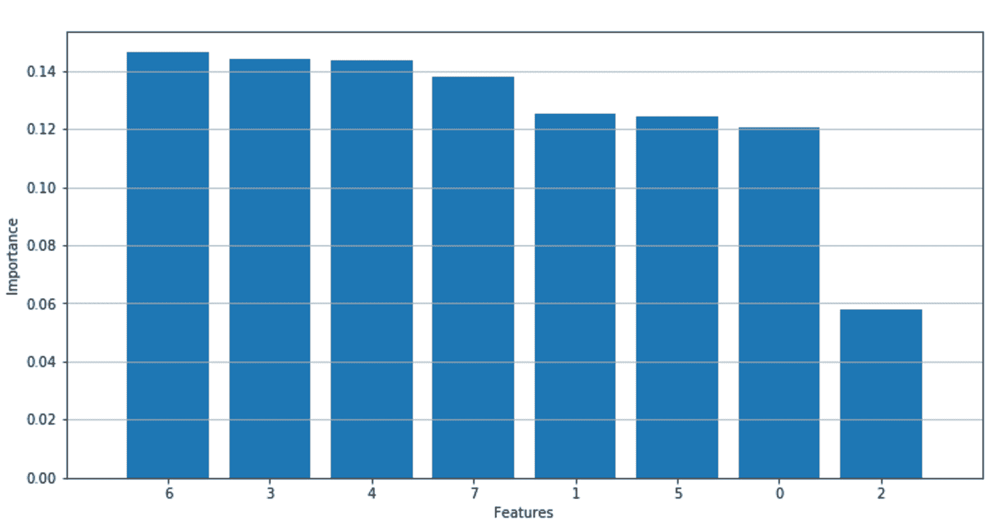

最重要的特征是 6、3、4 和 7，而例如特征 2 将非常少的样本分开，可以认为对于分类任务来说是非信息的。

在效率方面，也可以使用`max_depth`参数对树进行剪枝；然而，理解哪个值是最好的并不总是那么简单（网格搜索可以帮助完成这项任务）。另一方面，决定在每个分割点考虑的最大特征数更容易。可以使用`max_features`参数来完成这个目的：

+   如果是一个数字，该值将在每个分割时直接考虑

+   如果是 `'auto'` 或 `'sqrt'`，将采用特征数量的平方根

+   如果是 `'log2'`，将使用以 2 为底的对数

+   如果是 `'None'`，将使用所有特征（这是默认值）

通常，当总特征数量不是太高时，默认值是最好的选择，尽管当太多特征可能相互干扰时，引入小的压缩（通过 `sqrt` 或 `log2`）是有用的。另一个有助于控制性能和效率的参数是 `min_samples_split`，它指定了考虑分割的最小样本数。以下是一些示例：

```py
>>> cross_val_score(DecisionTreeClassifier(), X, Y, scoring='accuracy', cv=10).mean()
0.77308070807080698

>>> cross_val_score(DecisionTreeClassifier(max_features='auto'), X, Y, scoring='accuracy', cv=10).mean()
0.76410071007100711

>>> cross_val_score(DecisionTreeClassifier(min_samples_split=100), X, Y, scoring='accuracy', cv=10).mean()
0.72999969996999692
```

如前所述，找到最佳参数通常是一项困难的任务，而执行它的最佳方式是在包括所有可能影响准确性的值的同时进行网格搜索。

在前一个集合上使用逻辑回归（仅用于比较），我们得到：

```py
from sklearn.linear_model import LogisticRegression

>>> lr = LogisticRegression()
>>> cross_val_score(lr, X, Y, scoring='accuracy', cv=10).mean()
0.9053368347338937
```

因此，正如预期的那样，得分更高。然而，原始数据集相当简单，基于每个类别只有一个簇的概念。这允许更简单、更精确的线性分离。如果我们考虑一个具有更多变量和更复杂结构（线性分类器难以捕捉）的略微不同的场景，我们可以比较线性回归和决策树的 ROC 曲线：

```py
>>> nb_samples = 1000
>>> X, Y = make_classification(n_samples=nb_samples, n_features=8, n_informative=6, n_redundant=2,     n_classes=2, n_clusters_per_class=4)
```

结果的 ROC 曲线显示在下图中：


在 MNIST 数字数据集上使用最常见的参数进行网格搜索，我们可以得到：

```py
from sklearn.model_selection import GridSearchCV

param_grid = [
 { 
 'criterion': ['gini', 'entropy'],
 'max_features': ['auto', 'log2', None],
 'min_samples_split': [ 2, 10, 25, 100, 200 ],
 'max_depth': [5, 10, 15, None]
 }
]

>>> gs = GridSearchCV(estimator=DecisionTreeClassifier(), param_grid=param_grid,
 scoring='accuracy', cv=10, n_jobs=multiprocessing.cpu_count())

>>> gs.fit(digits.data, digits.target)
GridSearchCV(cv=10, error_score='raise',
 estimator=DecisionTreeClassifier(class_weight=None, criterion='gini', max_depth=None,
 max_features=None, max_leaf_nodes=None,
 min_impurity_split=1e-07, min_samples_leaf=1,
 min_samples_split=2, min_weight_fraction_leaf=0.0,
 presort=False, random_state=None, splitter='best'),
 fit_params={}, iid=True, n_jobs=8,
 param_grid=[{'max_features': ['auto', 'log2', None], 'min_samples_split': [2, 10, 25, 100, 200], 'criterion': ['gini', 'entropy'], 'max_depth': [5, 10, 15, None]}],
 pre_dispatch='2*n_jobs', refit=True, return_train_score=True,
 scoring='accuracy', verbose=0)

>>> gs.best_estimator_
DecisionTreeClassifier(class_weight=None, criterion='entropy', max_depth=None,
 max_features=None, max_leaf_nodes=None,
 min_impurity_split=1e-07, min_samples_leaf=1,
 min_samples_split=2, min_weight_fraction_leaf=0.0,
 presort=False, random_state=None, splitter='best')

>>> gs.best_score_
0.8380634390651085
```

在这种情况下，影响准确率最大的因素是考虑分割的最小样本数。考虑到这个数据集的结构和需要有许多分支来捕捉甚至微小的变化，这是合理的。

# 集成学习

到目前为止，我们已经在单个实例上训练模型，通过迭代算法来最小化目标损失函数。这种方法基于所谓的强学习器，或通过寻找最佳可能解决方案来优化解决特定问题的方法。另一种方法是基于一组弱学习器，这些学习器可以并行或顺序（对参数进行轻微修改）训练，并基于多数投票或结果平均作为集成使用。这些方法可以分为两大类：

+   **Bagged（或 Bootstrap）树**：在这种情况下，集成是完整构建的。训练过程基于随机选择的分割，预测基于多数投票。随机森林是 Bagged 树集成的一个例子。

+   **Boosted 树**：集成是按顺序构建的，专注于先前被错误分类的样本。Boosted 树的例子包括 AdaBoost 和梯度提升树。

# 随机森林

随机森林是一组基于随机样本构建的决策树，其分割节点的策略不同：在这种模型中，不是寻找最佳选择，而是使用随机特征子集（对于每棵树），试图找到最佳的数据分割阈值。因此，将训练出许多以较弱方式训练的树，并且每棵树都会产生不同的预测。

解释这些结果有两种方式；更常见的方法是基于多数投票（得票最多的类别将被认为是正确的）。然而，scikit-learn 实现了一个基于平均结果的算法，这产生了非常准确的预测。即使它们在理论上不同，训练好的随机森林的概率平均也不可能与多数预测相差很大（否则，应该有不同的稳定点）；因此，这两种方法通常会导致可比的结果。

例如，让我们考虑由不同数量的树组成的随机森林 MNIST 数据集：

```py
from sklearn.ensemble import RandomForestClassifier
>>> nb_classifications = 100
>>> accuracy = []

>>> for i in range(1, nb_classifications):
 a = cross_val_score(RandomForestClassifier(n_estimators=i), digits.data, digits.target,  scoring='accuracy', cv=10).mean()
 rf_accuracy.append(a)
```

下图显示了生成的图表：

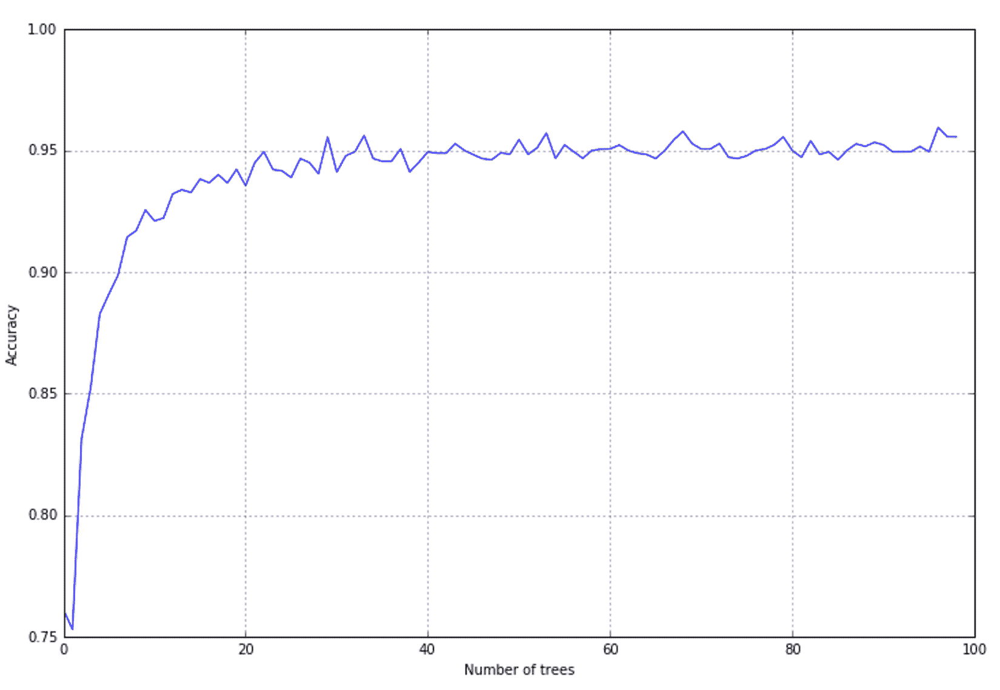

如预期，当树的数量低于最小阈值时，准确性较低；然而，当树的数量少于 10 棵时，它开始迅速增加。在 20 到 30 棵树之间可以获得最佳结果（95%），这比单棵决策树要高。当树的数量较少时，模型的方差非常高，平均过程会产生许多错误的结果；然而，增加树的数量可以减少方差，并使模型收敛到一个非常稳定的解。scikit-learn 还提供了一个方差，它增强了选择最佳阈值时的随机性。使用`ExtraTreesClassifier`类，可以实现一个随机计算阈值并选择最佳值的模型。正如官方文档中讨论的那样，这使我们能够进一步减少方差：

```py
from sklearn.ensemble import ExtraTreesClassifier
>>> nb_classifications = 100 
>>> for i in range(1, nb_classifications):
 a = cross_val_score(ExtraTreesClassifier(n_estimators=i), digits.data, digits.target,  scoring='accuracy', cv=10).mean()
 et_accuracy.append(a)
```

在准确性方面，具有相同树数量的结果略好，如下图所示：

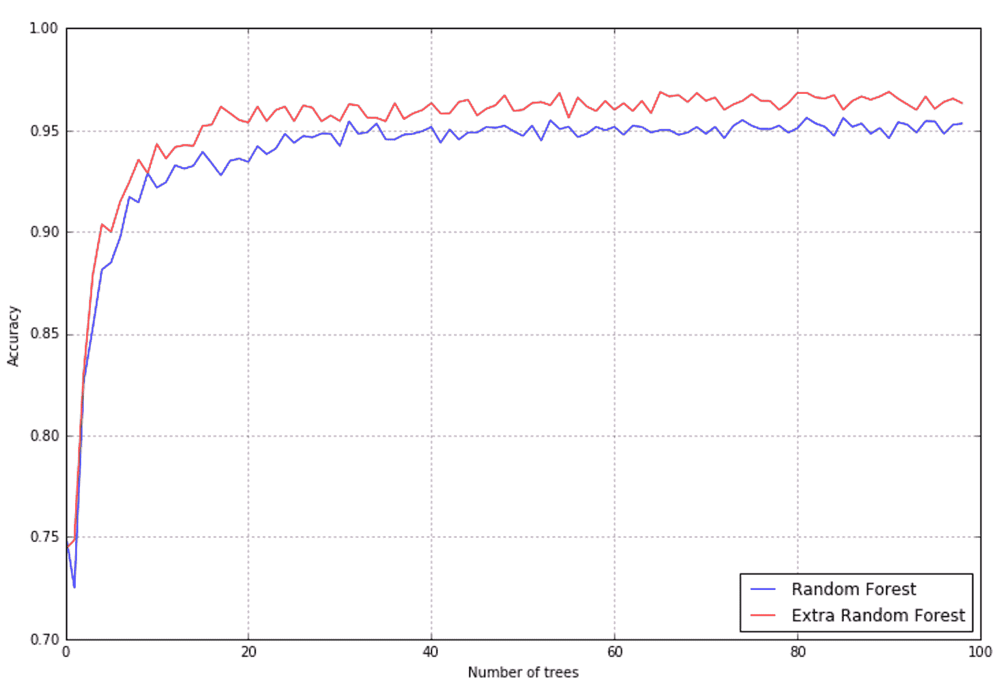

# 随机森林中的特征重要性

我们之前介绍的特征重要性概念也可以应用于随机森林，通过计算森林中所有树的平均值：

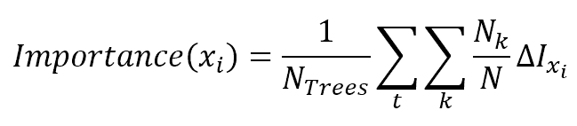

我们可以很容易地使用包含 50 个特征和 20 个非信息元素的虚拟数据集来测试重要性评估：

```py
>>> nb_samples = 1000
>>> X, Y = make_classification(n_samples=nb_samples, n_features=50, n_informative=30, n_redundant=20, n_classes=2, n_clusters_per_class=5)
```

下图展示了由 20 棵树组成的随机森林计算出的前 50 个特征的重要性：

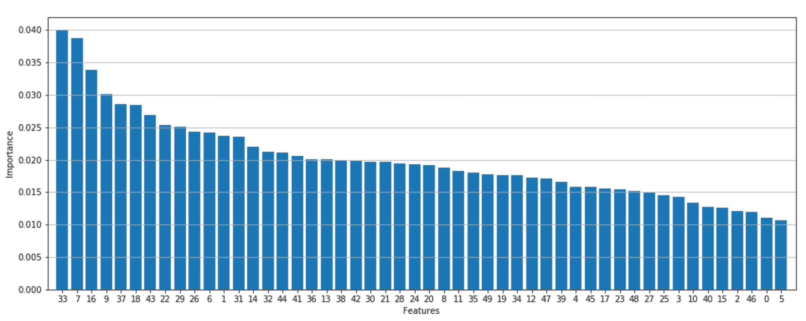

如预期的那样，有几个**非常重要**的特征，一个中等重要性的特征块，以及一个包含对预测影响相当低的特征的尾部。这种类型的图表在分析阶段也很有用，可以帮助更好地理解决策过程是如何构建的。对于多维数据集，理解每个因素的影响相当困难，有时许多重要的商业决策在没有完全意识到它们潜在影响的情况下就被做出了。使用决策树或随机森林，可以评估所有特征的“真实”重要性，并排除所有低于固定阈值的元素。这样，复杂的决策过程就可以简化，同时部分去噪。

# AdaBoost

另一种技术被称为**AdaBoost**（即**自适应提升**），其工作方式与许多其他分类器略有不同。其背后的基本结构可以是决策树，但用于训练的数据集会持续适应，迫使模型专注于那些被错误分类的样本。此外，分类器是按顺序添加的，因此新的一个通过提高那些它不如预期准确的地方的性能来增强前一个。

在每次迭代中，都会对每个样本应用一个权重因子，以增加错误预测样本的重要性并降低其他样本的重要性。换句话说，模型会反复增强，从一个非常弱的学习者开始，直到达到最大的`n_estimators`数量。在这种情况下，预测总是通过多数投票获得。

在 scikit-learn 实现中，还有一个名为`learning_rate`的参数，它衡量每个分类器的影响。默认值是 1.0，因此所有估计器都被认为是同等重要的。然而，正如我们从 MNIST 数据集中看到的那样，降低这个值是有用的，这样每个贡献都会减弱：

```py
from sklearn.ensemble import AdaBoostClassifier

>>> accuracy = []

>>> nb_classifications = 100

>>> for i in range(1, nb_classifications):
 a = cross_val_score(AdaBoostClassifier(n_estimators=i, learning_rate=0.1), digits.data, digits.target, scoring='accuracy', cv=10).mean()
>>> ab_accuracy.append(a)
```

结果显示在下图中：

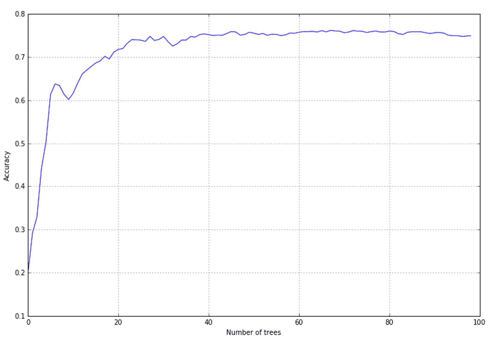

准确率不如前面的例子高；然而，可以看到当提升添加大约 20-30 棵树时，它达到了一个稳定值。对`learning_rate`进行网格搜索可以让你找到最佳值；然而，在这种情况下，顺序方法并不理想。一个经典的随机森林，从第一次迭代开始就使用固定数量的树，表现更好。这很可能是由于 AdaBoost 采用的策略；在这个集合中，增加正确分类样本的权重并降低错误分类的强度可能会在损失函数中产生振荡，最终结果不是最优的最小点。用 Iris 数据集（结构上要简单得多）重复实验可以得到更好的结果：

```py
from sklearn.datasets import load_iris

>>> iris = load_iris()

>>> ada = AdaBoostClassifier(n_estimators=100, learning_rate=1.0)
>>> cross_val_score(ada, iris.data, iris.target, scoring='accuracy', cv=10).mean()
0.94666666666666666
```

在这种情况下，学习率为 1.0 是最好的选择，很容易理解提升过程可以在几次迭代后停止。在下图中，你可以看到显示此数据集准确率的图表：

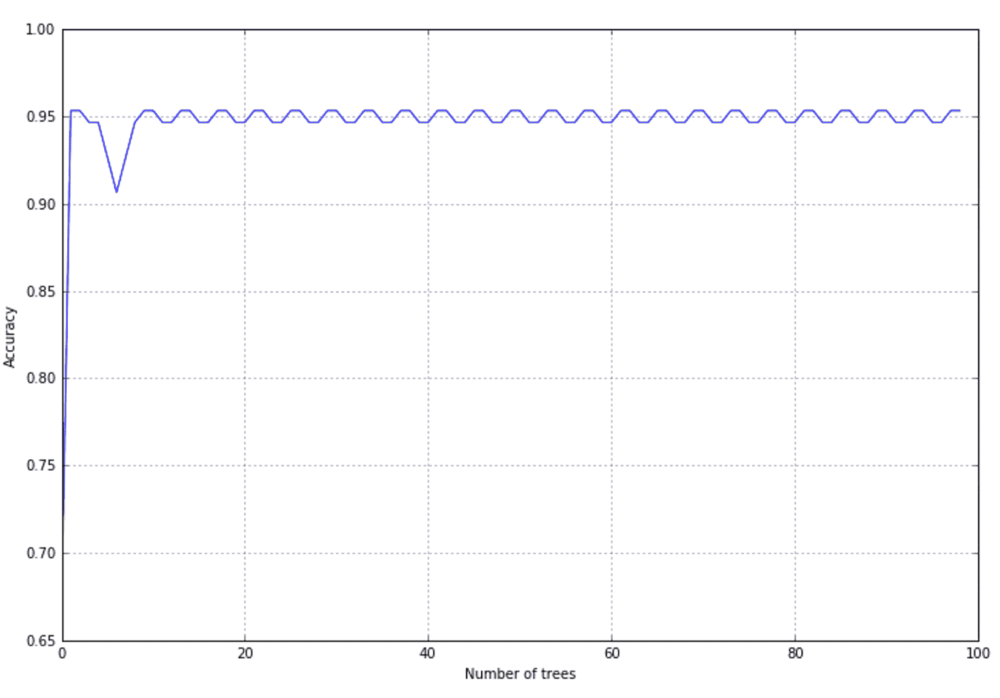

经过大约 10 次迭代后，准确率变得稳定（残差振荡可以被忽略），达到与这个数据集兼容的值。使用 AdaBoost 的优势在于资源利用；它不与一组完全配置好的分类器和整个样本集一起工作。因此，在大型数据集上训练时，它可以帮助节省时间。

# 梯度树提升

梯度树提升是一种技术，允许你逐步构建一个树集成，目标是最小化目标损失函数。集成的一般输出可以表示为：

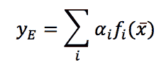

这里，*fi*是一个表示弱学习者的函数。该算法基于在每个步骤添加一个新的决策树的概念，以使用最速下降法（参见[`en.wikipedia.org/wiki/Method_of_steepest_descent`](https://en.wikipedia.org/wiki/Method_of_steepest_descent)，获取更多信息）来最小化全局损失函数：

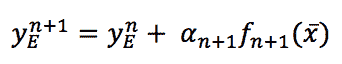

在引入梯度后，前面的表达式变为：

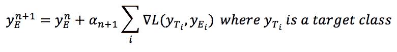

scikit-learn 实现了`GradientBoostingClassifier`类，支持两种分类损失函数：

+   二项式/多项式负对数似然（这是默认选择）

+   指数（例如 AdaBoost）

让我们使用一个由 500 个样本组成、具有四个特征（三个信息性和一个冗余）和三个类别的更复杂的虚拟数据集来评估此方法的准确率：

```py
from sklearn.datasets import make_classification

>>> nb_samples = 500

>>> X, Y = make_classification(n_samples=nb_samples, n_features=4, n_informative=3, n_redundant=1, n_classes=3)
```

现在，我们可以收集一定范围内（1, 50）的多个估计器的交叉验证平均准确率。损失函数是默认的（多项式负对数似然）：

```py
from sklearn.ensemble import GradientBoostingClassifier
from sklearn.model_selection import cross_val_score

>>> a = []
>>> max_estimators = 50

>>> for i in range(1, max_estimators):
>>> score = cross_val_score(GradientBoostingClassifier(n_estimators=i, learning_rate=10.0/float(i)), X, Y, cv=10, scoring='accuracy').mean()
>>> a.append(score)
```

在增加估计器数量（参数`n_estimators`）时，重要的是要降低学习率（参数`learning_rate`）。最佳值难以预测；因此，进行网格搜索通常很有用。在我们的例子中，我一开始设置了非常高的学习率（5.0），当估计器数量达到 100 时，收敛到 0.05。这并不是一个完美的选择（在大多数实际情况下都是不可接受的！），这样做只是为了展示不同的准确率性能。结果如下所示：

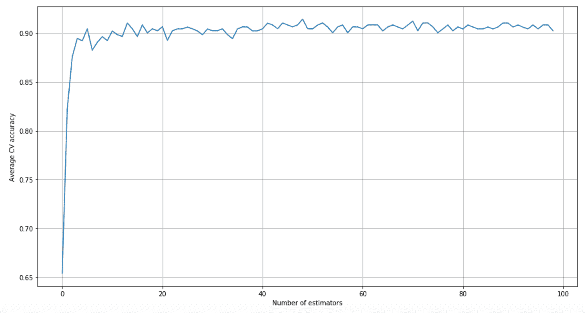

如我们所见，最佳估计器数量约为 50，学习率为 0.1。读者可以尝试不同的组合，并比较此算法与其他集成方法的性能。

# 投票分类器

类`VotingClassifier`提供了一个非常有趣的集成解决方案，它不是一个实际的分类器，而是一组不同分类器的包装，这些分类器是并行训练和评估的。预测的最终决策是根据两种不同的策略通过多数投票来确定的：

+   **硬投票**：在这种情况下，获得最多投票的类别，即*Nc*，将被选择：

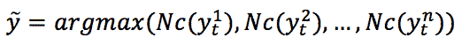

+   **软投票**：在这种情况下，每个预测类（对于所有分类器）的概率向量被相加并平均。获胜的类别是对应最高值的类别：

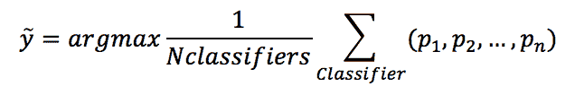

让我们考虑一个虚拟数据集，并使用硬投票策略计算准确率：

```py
from sklearn.datasets import make_classification

>>> nb_samples = 500

>>> X, Y = make_classification(n_samples=nb_samples, n_features=2, n_redundant=0, n_classes=2)
```

对于我们的示例，我们将考虑三个分类器：逻辑回归、决策树（默认使用 Gini 不纯度），以及一个 SVM（使用多项式核，并将`probability=True`设置为生成概率向量）。这个选择仅出于教学目的，可能不是最佳选择。在创建集成时，考虑每个涉及分类器的不同特征并避免“重复”算法（例如，逻辑回归和线性 SVM 或感知器可能会产生非常相似的性能）是有用的。在许多情况下，将非线性分类器与随机森林或 AdaBoost 分类器混合可能很有用。读者可以用其他组合重复此实验，比较每个单一估计器的性能和投票分类器的准确率：

```py
from sklearn.linear_model import LogisticRegression
from sklearn.svm import SVC
from sklearn.tree import DecisionTreeClassifier
from sklearn.ensemble import VotingClassifier

>>> lr = LogisticRegression()
>>> svc = SVC(kernel='poly', probability=True)
>>> dt = DecisionTreeClassifier()

>>> classifiers = [('lr', lr),
 ('dt', dt),
 ('svc', svc)]

>>> vc = VotingClassifier(estimators=classifiers, voting='hard')
```

计算交叉验证准确率，我们得到：

```py
from sklearn.model_selection import cross_val_score

>>> a = []

>>> a.append(cross_val_score(lr, X, Y, scoring='accuracy', cv=10).mean())
>>> a.append(cross_val_score(dt, X, Y, scoring='accuracy', cv=10).mean())
>>> a.append(cross_val_score(svc, X, Y, scoring='accuracy', cv=10).mean())
>>> a.append(cross_val_score(vc, X, Y, scoring='accuracy', cv=10).mean())

>>> print(np.array(a))
[ 0.90182873  0.84990876  0.87386955  0.89982873] 
```

每个单一分类器和集成方法的准确率在以下图中展示：

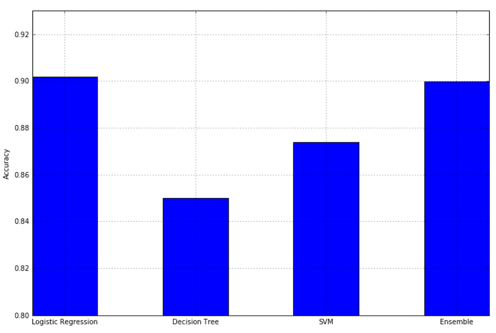

如预期，集成方法利用了不同的算法，其性能优于任何单一算法。现在我们可以用软投票重复实验，考虑到也可以通过参数`weights`引入权重向量，以给予每个分类器更多或更少的重视：

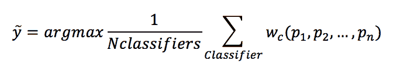

例如，考虑前面的图，我们可以决定给予逻辑回归更多的重视，而给予决策树和 SVM 较少的重视：

```py
>>> weights = [1.5, 0.5, 0.75]

>>> vc = VotingClassifier(estimators=classifiers, weights=weights, voting='soft')
```

重复相同的计算用于交叉验证准确率，我们得到：

```py
>>> print(np.array(a))
[ 0.90182873  0.85386795  0.87386955  0.89578952]
```

结果图如下所示：

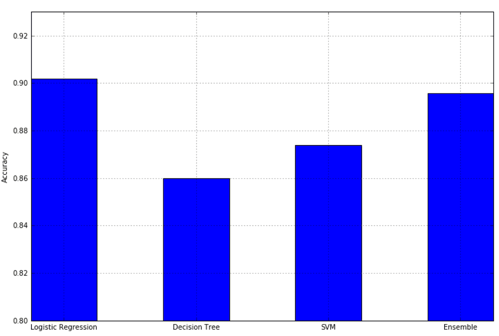

权重分配不仅限于软策略。它也可以应用于硬投票，但在此情况下，它将用于过滤（减少或增加）实际发生次数的数量。

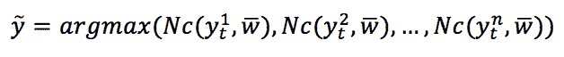

在这里，*Nc*是每个目标类别的投票数，每个投票数都乘以相应的分类器权重因子。

当单一策略无法达到所需的准确度阈值时，投票分类器可以是一个不错的选择；在利用不同的方法的同时，仅使用一小组强大（但有时有限）的学习器就可以捕捉到许多微观趋势。

# 参考文献

Louppe G.，Wehenkel L.，Sutera A.，和 Geurts P.，*在随机树森林中理解变量重要性*，NIPS 进程 2013。

# 摘要

在本章中，我们介绍了决策树作为一种特定的分类器。其概念背后的基本思想是，通过使用分裂节点，决策过程可以变成一个顺序过程，其中根据样本，选择一个分支，直到我们达到最终的叶子节点。为了构建这样的树，引入了不纯度的概念；从完整的数据集开始，我们的目标是找到一个分割点，创建两个具有最小特征数且在过程结束时应与单个目标类别相关联的独立集合。树的复杂性取决于内在的不纯度——换句话说，当总是容易确定一个最佳分离集合的特征时，深度会较低。然而，在许多情况下，这几乎是不可行的，因此生成的树需要许多中间节点来减少不纯度，直到达到最终的叶子节点。

我们还讨论了一些集成学习方法：随机森林、AdaBoost、梯度树提升和投票分类器。它们都基于训练多个弱学习器并使用多数投票或平均来评估其预测的想法。然而，虽然随机森林创建了一组部分随机训练的决策树，AdaBoost 和梯度提升树则采用逐步添加新模型的技术，并专注于那些先前被错误分类的样本，或者专注于最小化特定的损失函数。相反，投票分类器允许混合不同的分类器，在预测期间采用多数投票来决定哪个类别必须被视为获胜者。

在下一章中，我们将介绍第一种无监督学习方法，k-means，这是最广泛使用的聚类算法之一。我们将集中讨论其优势和劣势，并探索 scikit-learn 提供的某些替代方案。
