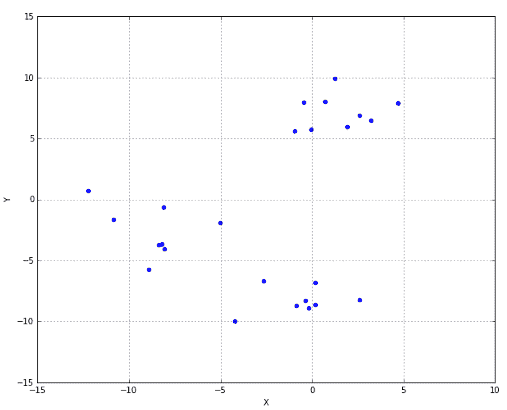
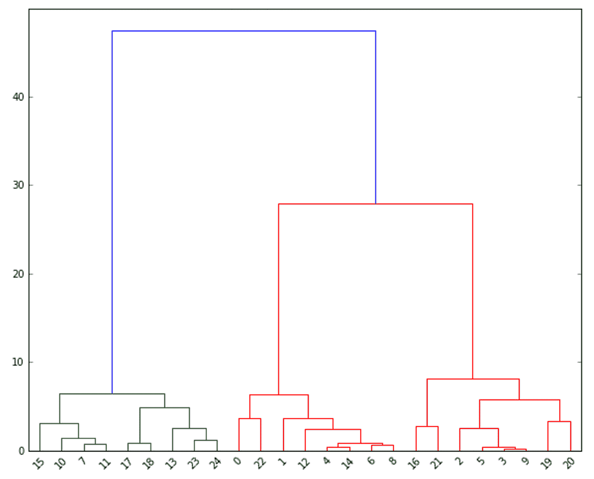
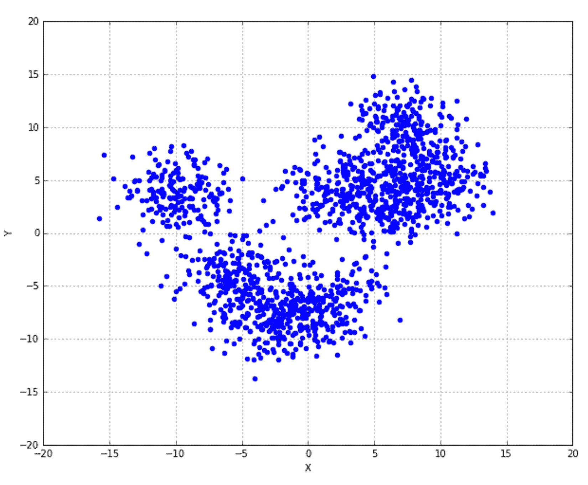
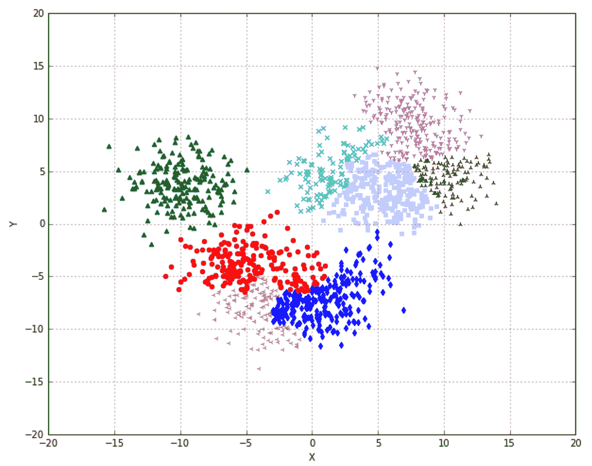
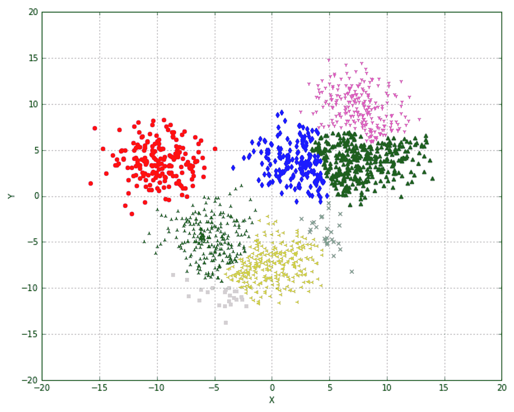
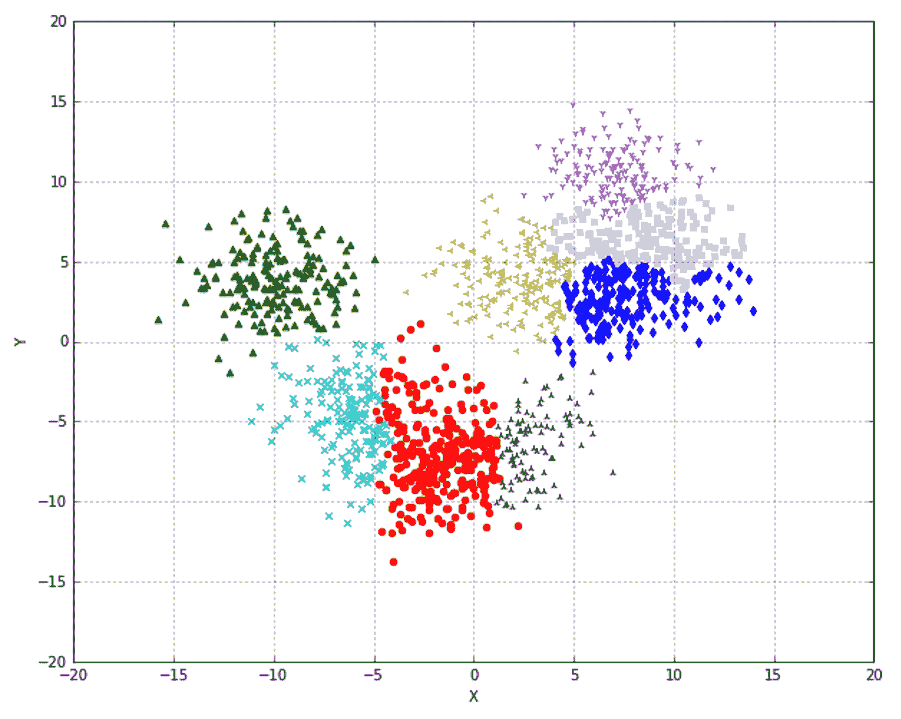
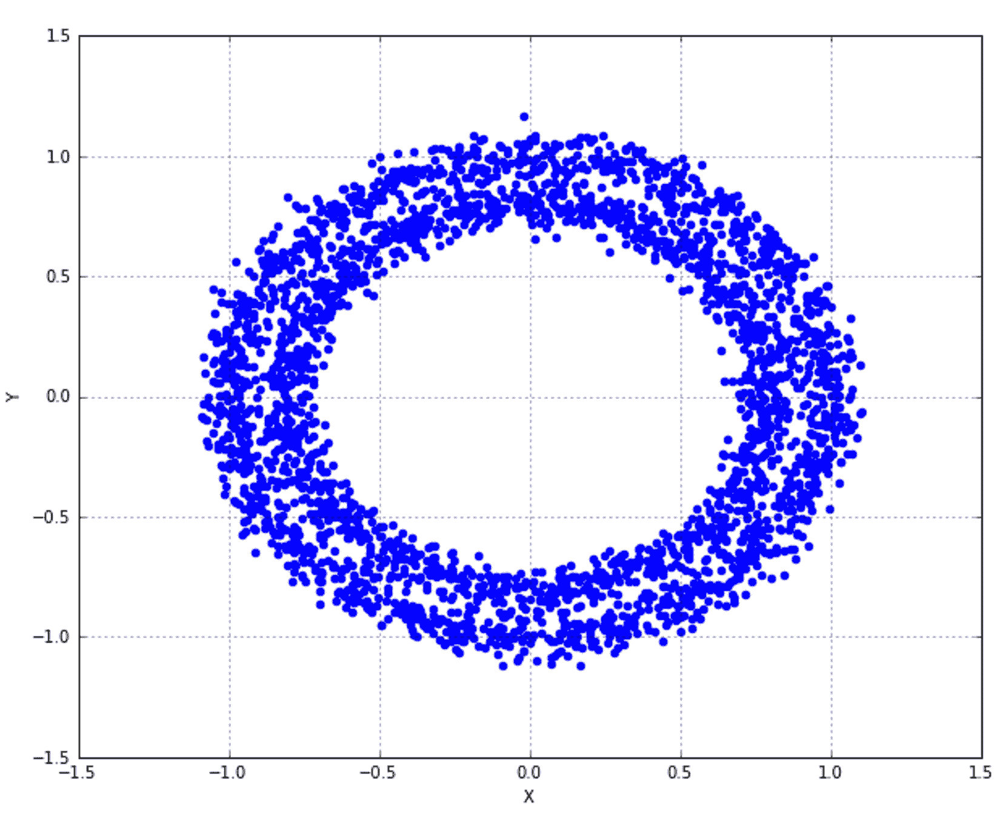
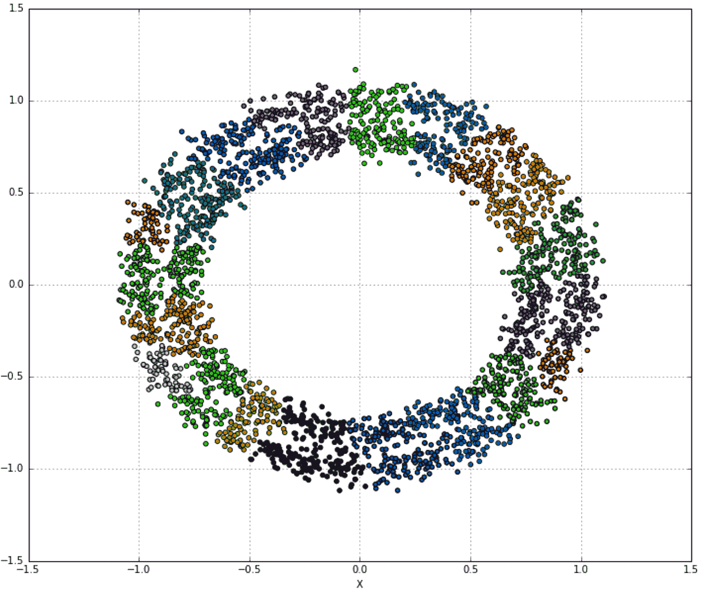

# 第十章：层次聚类

在本章中，我们将讨论一种称为层次聚类的特定聚类技术。这种方法不是与整个数据集中的关系一起工作，而是从一个包含所有元素的单个实体（分裂）或 N 个分离元素（聚合）开始，然后根据某些特定的标准分裂或合并簇，我们将分析和比较这些标准。

# 层次化策略

层次聚类基于寻找部分簇的层次结构的一般概念，这些簇是通过自下而上或自上而下的方法构建的。更正式地说，它们被称为：

+   **聚合聚类**：过程从底部开始（每个初始簇由一个元素组成）并通过合并簇进行，直到达到停止标准。一般来说，目标在过程结束时具有足够小的簇数量。

+   **分裂聚类**：在这种情况下，初始状态是一个包含所有样本的单簇，过程通过分裂中间簇直到所有元素分离。在这个点上，过程继续使用基于元素之间差异的聚合标准。一个著名的（超出了本书范围）方法称为**DIANA**，由 Kaufman L.，Roussew P.J.，*在数据中寻找群体：聚类分析导论*，Wiley 描述。

scikit-learn 仅实现聚合聚类。然而，这并不是一个真正的限制，因为分裂聚类的复杂度更高，而聚合聚类的性能与分裂方法达到的性能相当。

# 聚合聚类

让我们考虑以下数据集：


我们定义**亲和力**，这是一个具有相同维度 *m* 的两个参数的度量函数。最常见的度量（也由 scikit-learn 支持）是：

+   **欧几里得**或 *L2*：


+   **曼哈顿**（也称为城市街区）或 *L1*：


+   **余弦距离**：


欧几里得距离通常是好的选择，但有时拥有一个与欧几里得距离差异逐渐增大的度量是有用的。曼哈顿度量具有这种特性；为了展示这一点，在下面的图中有一个表示属于直线 *y = x* 的点从原点到距离的图：


余弦距离，相反，在我们需要两个向量之间角度成比例的距离时很有用。如果方向相同，距离为零，而当角度等于 180°（意味着相反方向）时，距离最大。这种距离可以在聚类必须不考虑每个点的*L2*范数时使用。例如，一个数据集可能包含具有不同尺度的二维点，我们需要将它们分组到对应于圆形扇区的聚类中。或者，我们可能对它们根据四个象限的位置感兴趣，因为我们已经为每个点分配了特定的含义（对点与原点之间的距离不变）。

一旦选择了度量（让我们简单地称之为*d(x,y)*），下一步是定义一个策略（称为**连接**）来聚合不同的聚类。有许多可能的方法，但 scikit-learn 支持三种最常见的方法：

+   **完全连接**：对于每一对聚类，算法计算并合并它们，以最小化聚类之间的最大距离（换句话说，最远元素的距离）：


+   **平均连接**：它与完全连接类似，但在这个情况下，算法使用聚类对之间的平均距离：


+   **Ward 的连接**：在这个方法中，考虑所有聚类，算法计算聚类内的平方距离之和，并合并它们以最小化它。从统计学的角度来看，聚合过程导致每个结果聚类的方差减少。该度量是：


+   Ward 的连接只支持欧几里得距离。

# 树状图

为了更好地理解聚合过程，引入一种称为**树状图**的图形方法很有用，它以静态方式显示聚合是如何进行的，从底部（所有样本都分离）到顶部（连接完全）。不幸的是，scikit-learn 不支持它们。然而，SciPy（它是其强制性要求）提供了一些有用的内置函数。

让我们从创建一个虚拟数据集开始：

```py
from sklearn.datasets import make_blobs

>>> nb_samples = 25
>>> X, Y = make_blobs(n_samples=nb_samples, n_features=2, centers=3, cluster_std=1.5)
```

为了避免结果图过于复杂，样本数量已经保持得很低。在以下图中，有数据集的表示：



现在我们可以计算树状图。第一步是计算距离矩阵：

```py
from scipy.spatial.distance import pdist

>>> Xdist = pdist(X, metric='euclidean')
```

我们选择了一个欧几里得度量，这在当前情况下是最合适的。此时，必须决定我们想要哪种连接。让我们选择 Ward；然而，所有已知的方法都是支持的：

```py
from scipy.cluster.hierarchy import linkage

>>> Xl = linkage(Xdist, method='ward')
```

现在，我们可以创建并可视化树状图：

```py
from scipy.cluster.hierarchy import dendrogram

>>> Xd = dendrogram(Xl)
```

结果图示如下截图：



在*x*轴上，有样本（按顺序编号），而*y*轴表示距离。每个弧连接两个由算法合并的簇。例如，23 和 24 是合并在一起的单个元素。然后元素 13 被聚合到结果簇中，这个过程继续进行。

如您所见，如果我们决定在距离 10 处切割图，我们将得到两个独立的簇：第一个簇从 15 到 24，另一个簇从 0 到 20。查看之前的数据集图，所有*Y* < 10 的点都被认为是第一个簇的一部分，而其他点属于第二个簇。如果我们增加距离，链接变得非常激进（特别是在这个只有少数样本的例子中），并且当值大于 27 时，只生成一个簇（即使内部方差相当高！）。

# scikit-learn 中的层次聚类

让我们考虑一个具有 8 个中心的更复杂的虚拟数据集：

```py
>>> nb_samples = 3000
>>> X, _ = make_blobs(n_samples=nb_samples, n_features=2, centers=8, cluster_std=2.0)
```

下图显示了图形表示：



我们现在可以使用不同的链接方法（始终保持欧几里得距离）进行层次聚类，并比较结果。让我们从完全链接开始（`AgglomerativeClustering`使用`fit_predict()`方法来训练模型并转换原始数据集）：

```py
from sklearn.cluster import AgglomerativeClustering

>>> ac = AgglomerativeClustering(n_clusters=8, linkage='complete')
>>> Y = ac.fit_predict(X)
```

下图显示了结果的图示（使用不同的标记和颜色）：



这种方法的结果完全糟糕。这种方法惩罚了组间方差并合并簇，这在大多数情况下应该是不同的。在之前的图中，中间的三个簇相当模糊，考虑到由点表示的簇的方差，错误放置的概率非常高。现在让我们考虑平均链接：

```py
>>> ac = AgglomerativeClustering(n_clusters=8, linkage='average')
>>> Y = ac.fit_predict(X)
```

结果显示在下述截图：



在这种情况下，簇的定义更加清晰，尽管其中一些簇可能变得非常小。尝试其他度量标准（特别是*L1*）并比较结果也可能很有用。最后一种方法，通常是最佳方法（它是默认方法），是 Ward 的链接方法，只能与欧几里得度量一起使用（也是默认的）：

```py
>>> ac = AgglomerativeClustering(n_clusters=8)
>>> Y = ac.fit_predict(X)
```

下图显示了生成的结果图：



在这种情况下，无法修改度量标准，因此，正如官方 scikit-learn 文档中建议的那样，一个有效的替代方案可能是平均链接，它可以与任何亲和力一起使用：

# 连通性约束

scikit-learn 还允许指定连接矩阵，该矩阵在寻找要合并的聚类时可以用作约束。通过这种方式，彼此距离较远的聚类（在连接矩阵中不相邻）将被跳过。创建此类矩阵的一个非常常见的方法是使用基于样本邻居数量的 k 近邻图函数（作为`kneighbors_graph()`实现），该函数根据特定的度量来确定样本的邻居数量。在以下示例中，我们考虑了一个圆形虚拟数据集（常在官方文档中使用）：

```py
from sklearn.datasets import make_circles

>>> nb_samples = 3000
>>> X, _ = make_circles(n_samples=nb_samples, noise=0.05)
```

下图显示了图形表示：



我们从基于平均连接的未结构化聚合聚类开始，并设定了 20 个聚类：

```py
>>> ac = AgglomerativeClustering(n_clusters=20, linkage='average')
>>> ac.fit(X)
```

在这种情况下，我们使用了`fit()`方法，因为`AgglomerativeClustering`类在训练后通过实例变量`labels_`公开标签（聚类编号），当聚类数量非常高时，使用此变量更方便。以下图显示了结果的图形表示：



现在我们可以尝试为*k*设定不同的约束值：

```py
from sklearn.neighbors import kneighbors_graph

>>> acc = []
>>> k = [50, 100, 200, 500]

>>> for i in range(4):
>>>    kng = kneighbors_graph(X, k[i])
>>>    ac1 = AgglomerativeClustering(n_clusters=20, connectivity=kng, linkage='average')
>>>    ac1.fit(X)
>>>    acc.append(ac1)
```

以下截图显示了生成的图表：


如您所见，施加约束（在这种情况下，基于 k 近邻）可以控制聚合如何创建新的聚类，并且可以成为调整模型或避免在原始空间中距离较大的元素（这在聚类图像时特别有用）的有力工具。

# 参考文献

Kaufman L.，Roussew P.J.，*在数据中寻找群组：聚类分析导论*，Wiley

# 摘要

在本章中，我们介绍了层次聚类，重点关注聚合版本，这是 scikit-learn 唯一支持的版本。我们讨论了哲学，这与许多其他方法采用的哲学相当不同。在聚合聚类中，过程从将每个样本视为单个聚类开始，并通过合并块直到达到所需的聚类数量。为了执行此任务，需要两个元素：一个度量函数（也称为亲和力）和一个连接标准。前者用于确定元素之间的距离，而后者是一个目标函数，用于确定哪些聚类必须合并。

我们还展示了如何使用 SciPy 通过树状图可视化这个过程。当需要保持对整个过程和最终聚类数量的完全控制，且初始时聚类数量未知（决定在哪里截断图更容易）时，这项技术非常有用。我们展示了如何使用 scikit-learn 执行基于不同指标和连接方式的层次聚类，并在本章末尾，我们还介绍了在需要强制过程避免合并距离过远的聚类时有用的连通性约束。

在下一章中，我们将介绍推荐系统，这些系统被许多不同的系统日常使用，以根据用户与其他用户及其偏好的相似性自动向用户推荐项目。
