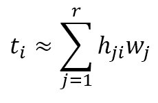
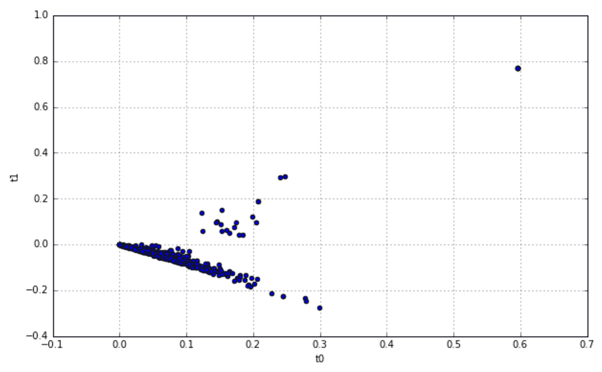
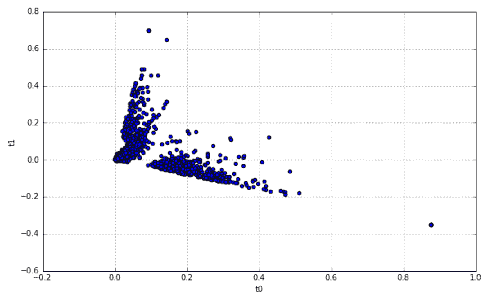
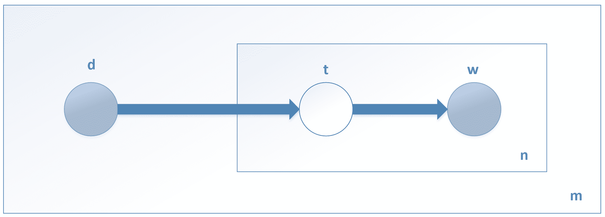
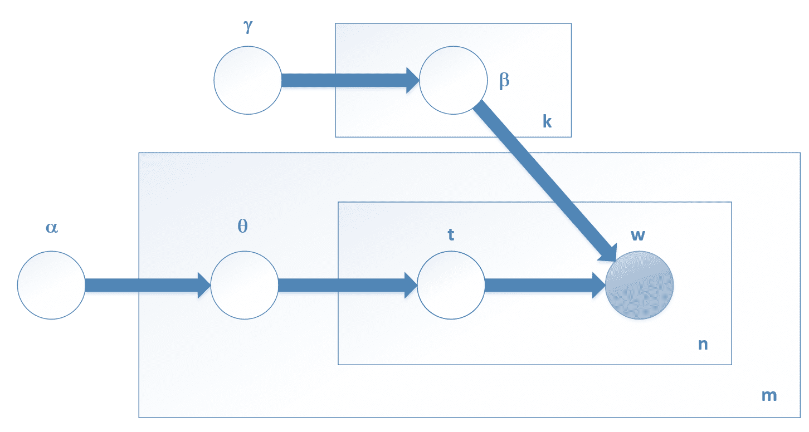

# 第十三章：自然语言处理中的主题建模和情感分析

在本章中，我们将介绍一些常见的主题建模方法，并讨论一些应用。主题建模是自然语言处理的一个重要部分，其目的是从文档语料库中提取语义信息。我们将讨论**潜在语义分析**，这是最著名的方法之一；它基于已经讨论过的基于模型的推荐系统的相同哲学。我们还将讨论其概率变体 PLSA，它旨在构建一个没有先验分布假设的潜在因子概率模型。另一方面，**潜在狄利克雷分配**是一种类似的方法，它假设潜在变量具有先验狄利克雷分布。在最后一节中，我们将通过基于 Twitter 数据集的具体示例来讨论情感分析。

# 主题建模

自然语言处理中主题建模的主要目标是分析语料库，以识别文档之间的共同主题。在这种情况下，即使我们谈论语义，这个概念也有一个特定的含义，它是由一个非常重要的假设驱动的。一个主题来源于同一文档中特定术语的使用，并且通过多个不同文档中第一个条件成立来得到证实。

换句话说，我们不考虑面向人类的语义，而是一种与有意义的文档一起工作的统计模型（这保证了术语的使用旨在表达特定的概念，因此，它们背后有人的语义目的）。因此，我们所有方法的起点都是一个发生矩阵，通常定义为文档-词矩阵（我们已经在第十二章，《自然语言处理导论》中讨论了计数向量化 tf-idf）：


在许多论文中，这个矩阵是转置的（它是一个词-文档矩阵）；然而，scikit-learn 生成文档-词矩阵，为了避免混淆，我们将考虑这种结构。

# 潜在语义分析

潜在语义分析背后的思想是将*M[dw]*分解，以提取一组潜在变量（这意味着我们可以假设它们的存在，但它们不能直接观察到）。正如在第十一章，《推荐系统导论》中讨论的那样，一个非常常见的分解方法是 SVD：


然而，我们并不对完全分解感兴趣；我们只对由前*k*个奇异值定义的子空间感兴趣：


这个近似在考虑 Frobenius 范数的情况下享有最佳声誉，因此它保证了非常高的精度。当将其应用于文档-词矩阵时，我们得到以下分解：


或者，以更紧凑的方式：


这里，第一个矩阵定义了文档和 *k* 个潜在变量之间的关系，第二个则定义了 *k* 个潜在变量和单词之间的关系。考虑到原始矩阵的结构以及本章开头所解释的内容，我们可以将潜在变量视为**主题**，它们定义了一个子空间，文档被投影到这个子空间中。现在，一个通用的文档可以这样定义：


此外，每个主题都成为单词的线性组合。由于许多单词的权重接近于零，我们可以决定只取前 *r* 个单词来定义一个主题；因此，我们得到：



在这里，每个 *h[ji]* 都是在对 *M[twk]* 的列进行排序后得到的。为了更好地理解这个过程，让我们基于布朗语料库的一个子集（来自 `news` 类别的 500 篇文档）展示一个完整的示例：

```py
from nltk.corpus import brown

>>> sentences = brown.sents(categories=['news'])[0:500]
>>> corpus = []

>>> for s in sentences:
>>>   corpus.append(' '.join(s))
```

在定义语料库之后，我们需要使用 tf-idf 方法进行分词和向量化：

```py
from sklearn.feature_extraction.text import TfidfVectorizer

>>> vectorizer = TfidfVectorizer(strip_accents='unicode', stop_words='english', norm='l2', sublinear_tf=True)
>>> Xc = vectorizer.fit_transform(corpus).todense()
```

现在可以对 `Xc` 矩阵应用 SVD（记住在 SciPy 中，`V` 矩阵已经转置）：

```py
from scipy.linalg import svd

>>> U, s, V = svd(Xc, full_matrices=False)
```

由于语料库不是非常小，设置参数 `full_matrices=False` 以节省计算时间是很有用的。我们假设有两个主题，因此我们可以提取我们的子矩阵：

```py
import numpy as np

>>> rank = 2

>>> Uk = U[:, 0:rank]
>>> sk = np.diag(s)[0:rank, 0:rank]
>>> Vk = V[0:rank, :]
```

如果我们想要分析每个主题的前 10 个单词，我们需要考虑以下几点：


因此，我们可以通过使用向量器提供的 `get_feature_names()` 方法对矩阵进行排序后，获得每个主题的最显著单词：

```py
>>> Mtwks = np.argsort(Vk, axis=1)[::-1]

>>> for t in range(rank):
>>>   print('\nTopic ' + str(t))
>>>     for i in range(10):
>>>        print(vectorizer.get_feature_names()[Mtwks[t, i]])

Topic 0
said
mr
city
hawksley
president
year
time
council
election
federal

Topic 1
plainfield
wasn
copy
released
absence
africa
clash
exacerbated
facing
difficulties
```

在这种情况下，我们只考虑矩阵 `Vk` 中的非负值；然而，由于主题是单词的混合，负成分也应该被考虑。在这种情况下，我们需要对 `Vk` 的绝对值进行排序：

```py
>>> Mtwks = np.argsort(np.abs(Vk), axis=1)[::-1]
```

如果我们想要分析一个文档在这个子空间中的表示，我们必须使用：


例如，让我们考虑我们语料库的第一个文档：

```py
>>> print(corpus[0])
The Fulton County Grand Jury said Friday an investigation of Atlanta's recent primary election produced `` no evidence '' that any irregularities took place .

>>> Mdtk = Uk.dot(sk)

>>> print('d0 = %.2f*t1 + %.2f*t2' % (Mdtk[0][0], Mdtk[0][1]))
d0 = 0.15*t1 + -0.12*t2
```

由于我们正在处理一个二维空间，绘制每个文档对应的所有点是有趣的：



在前面的图中，我们可以看到许多文档是相关的，有一个小的异常值组。这可能是由于我们选择两个主题的限制性。如果我们使用布朗语料库的两个类别（`news` 和 `fiction`）重复相同的实验，我们会观察到不同的行为：

```py
sentences = brown.sents(categories=['news', 'fiction'])
corpus = []

for s in sentences:
 corpus.append(' '.join(s))
```

我不再重复剩余的计算，因为它们是相似的。（唯一的区别是，我们的语料库现在相当大，这导致计算时间更长。因此，我们将讨论一个替代方案，它要快得多。）绘制文档对应的点，我们现在得到：



现在更容易区分两组，它们几乎是正交的（这意味着许多文档只属于一个类别）。我建议使用不同的语料库和秩重复这个实验。不幸的是，不可能绘制超过三个维度，但总是可以使用仅数值计算来检查子空间是否正确描述了潜在的语义。

如预期的那样，当发生矩阵很大时，标准的 SciPy SVD 实现可能会非常慢；然而，scikit-learn 提供了一个截断 SVD 实现，`TruncatedSVD`，它仅与子空间一起工作。结果是速度更快（它还可以直接管理稀疏矩阵）。让我们使用这个类重复之前的实验（使用完整的语料库）：

```py
from sklearn.decomposition import TruncatedSVD

>>> tsvd = TruncatedSVD(n_components=rank)
>>> Xt = tsvd.fit_transform(Xc)
```

通过`n_components`参数，可以设置所需的秩，丢弃矩阵的其余部分。在拟合模型后，我们可以直接将文档-主题矩阵*M[dtk]*作为`fit_transform()`方法的输出获得，而主题-单词矩阵*M[twk]*可以通过实例变量`components_`访问：

```py
>>> Mtws = np.argsort(tsvd.components_, axis=1)[::-1]

>>> for t in range(rank):
>>>    print('\nTopic ' + str(t))
>>>       for i in range(10):
>>>          print(vectorizer.get_feature_names()[Mwts[t, i]])

Topic 0
said
rector
hans
aloud
liston
nonsense
leave
whiskey
chicken
fat

Topic 1
bong
varnessa
schoolboy
kaboom
keeeerist
aggravated
jealous
hides
mayonnaise
fowl
```

读者可以验证这个过程可以有多快；因此，我建议只有在需要访问完整矩阵时才使用标准的 SVD 实现。不幸的是，正如文档中所述，这种方法对算法和随机状态非常敏感。它还受到称为**符号不确定性**的现象的影响，这意味着如果使用不同的随机种子，所有组件的符号都可能改变。我建议你声明：

```py
import numpy as np

np.random.seed(1234)
```

在每个文件的开始处使用固定的种子（即使是 Jupyter 笔记本）以确保可以重复计算并始终获得相同的结果。

此外，我建议使用**非负矩阵分解**重复这个实验，如第三章所述，*特征选择与特征工程*。

# 概率潜在语义分析

之前的模型是基于确定性方法，但也可以在由文档和单词确定的范围内定义一个概率模型。在这种情况下，我们不对 Apriori 概率做出任何假设（这将在下一个方法中完成），我们将确定最大化我们模型对数似然参数的参数。特别是，考虑以下图中所示的板符号（如果你想了解更多关于这种技术的信息，请阅读[`en.wikipedia.org/wiki/Plate_notation`](https://en.wikipedia.org/wiki/Plate_notation)）：



我们假设我们有一个包含 *m* 个文档的语料库，并且每个文档由 *n* 个单词组成（这两个元素都是观察到的，因此用灰色圆圈表示）；然而，我们还假设存在一组有限的 *k* 个共同潜在因子（主题），它们将文档与一组单词联系起来（由于它们没有被观察到，圆圈是白色的）。正如已经写过的，我们无法直接观察到它们，但我们允许假设它们的存在。

找到具有特定单词的文档的联合概率是：


因此，在引入潜在因子后，找到特定文档中单词的条件概率可以写成：


初始联合概率 *P(d, w)* 也可以用潜在因子表示：


这包括先验概率 *P(t)*。由于我们不想处理它，因此使用表达式 *P(w|d)* 更为可取。为了确定两个条件概率分布，一个常见的方法是 **期望最大化**（**EM**）策略。完整的描述可以在 Hofmann T.的《基于概率潜在语义分析的无监督学习》，机器学习 42，177-196，2001，Kluwer 学术出版社中找到。*在此上下文中，我们只展示最终结果，而不提供任何证明。

对数似然可以写成：


变成：


*M[dw]* 是一个出现矩阵（通常通过计数向量器获得），而 *Mdw* 是单词 *w* 在文档 *d* 中的频率。为了简化，我们将通过排除第一个项（它不依赖于 *t[k]*）来近似它：


此外，引入条件概率 *P(t|d,w)* 也是有用的，它是给定文档和单词的主题概率。EM 算法在后验概率 *P(t|d,w)* 下最大化期望的完整对数似然：


算法的 **E** 阶段可以表示为：


必须扩展到所有主题、单词和文档，并且必须按主题求和进行归一化，以确保始终具有一致的概率。

**M** 阶段分为两个计算：


在这个情况下，计算必须扩展到所有主题、单词和文档。但在第一种情况下，我们是按文档求和并按单词和文档进行归一化，而在第二种情况下，我们是按单词求和并按文档长度进行归一化。

算法必须迭代，直到对数似然停止增加其幅度。不幸的是，scikit-learn 没有提供 PLSA 实现（也许是因为下一个策略 LDA 被认为更强大和高效），因此我们需要从头编写一些代码。让我们首先定义布朗语料库的一个小子集，从`editorial`类别中取 10 个句子，从`fiction`类别中取 10 个：

```py
>>> sentences_1 = brown.sents(categories=['editorial'])[0:10]
>>> sentences_2 = brown.sents(categories=['fiction'])[0:10]
>>> corpus = []

>>> for s in sentences_1 + sentences_2:
>>>    corpus.append(' '.join(s))
```

现在我们可以使用`CountVectorizer`类进行向量化：

```py
import numpy as np

from sklearn.feature_extraction.text import CountVectorizer

>>> cv = CountVectorizer(strip_accents='unicode', stop_words='english')
>>> Xc = np.array(cv.fit_transform(corpus).todense())
```

在这一点上，我们可以定义排名（为了简单起见，我们选择 2），两个稍后将要使用的常数，以及用于存储概率 *P(t|d)*，*P(w|t)* 和 *P(t|d,w)* 的矩阵：

```py
>>> rank = 2
>>> alpha_1 = 1000.0
>>> alpha_2 = 10.0

>>> Ptd = np.random.uniform(0.0, 1.0, size=(len(corpus), rank))
>>> Pwt = np.random.uniform(0.0, 1.0, size=(rank, len(cv.vocabulary_)))
>>> Ptdw = np.zeros(shape=(len(cv.vocabulary_), len(corpus), rank))

>>> for d in range(len(corpus)):
>>>    nf = np.sum(Ptd[d, :])
>>>    for t in range(rank):
>>>       Ptd[d, t] /= nf

>>> for t in range(rank):
>>>    nf = np.sum(Pwt[t, :])
>>>    for w in range(len(cv.vocabulary_)):
>>>       Pwt[t, w] /= nf
```

两个矩阵 *P(t|d)*，*P(w|t)* 必须归一化，以便与算法保持一致；另一个初始化为零。现在我们可以定义对数似然函数：

```py
>>> def log_likelihood():
>>>    value = 0.0
>>> 
>>>    for d in range(len(corpus)):
>>>       for w in range(len(cv.vocabulary_)):
>>>          real_topic_value = 0.0
>>>
>>>          for t in range(rank):
>>>             real_topic_value += Ptd[d, t] * Pwt[t, w]
>>>
>>>          if real_topic_value > 0.0:
>>>             value += Xc[d, w] * np.log(real_topic_value)
>>> 
>>>    return value
```

最后，期望最大化函数：

```py
>>> def expectation():
>>>    global Ptd, Pwt, Ptdw
>>>
>>>    for d in range(len(corpus)):
>>>       for w in range(len(cv.vocabulary_)):
>>>          nf = 0.0
>>> 
>>>          for t in range(rank):
>>>             Ptdw[w, d, t] = Ptd[d, t] * Pwt[t, w]
>>>             nf += Ptdw[w, d, t]
>>> 
>>>          Ptdw[w, d, :] = (Ptdw[w, d, :] / nf) if nf != 0.0 else 0.0
```

在前面的函数中，当归一化因子为 0 时，每个主题的概率 *P(t|w, d)* 被设置为 0.0：

```py
>>> def maximization():
>>>    global Ptd, Pwt, Ptdw
>>>
>>>    for t in range(rank):
>>>       nf = 0.0
>>> 
>>>       for d in range(len(corpus)):
>>>          ps = 0.0
>>> 
>>>          for w in range(len(cv.vocabulary_)):
>>>             ps += Xc[d, w] * Ptdw[w, d, t]
>>> 
>>>          Pwt[t, w] = ps
>>>          nf += Pwt[t, w]
>>>
>>>       Pwt[:, w] /= nf if nf != 0.0 else alpha_1
>>>
>>>    for d in range(len(corpus)):
>>>       for t in range(rank):
>>>          ps = 0.0
>>>          nf = 0.0
>>>
>>>          for w in range(len(cv.vocabulary_)):
>>>             ps += Xc[d, w] * Ptdw[w, d, t]
>>>             nf += Xc[d, w]
>>> 
>>>          Ptd[d, t] = ps / (nf if nf != 0.0 else alpha_2)
```

当归一化因子变为 0 时，常数 `alpha_1` 和 `alpha_2` 被使用。在这种情况下，分配一个小的概率值可能是有用的；因此，我们为这些常数除以分子。我建议尝试不同的值，以便调整算法以适应不同的任务。

在这一点上，我们可以尝试我们的算法，限制迭代次数：

```py
>>> print('Initial Log-Likelihood: %f' % log_likelihood())

>>> for i in range(50):
>>>    expectation()
>>>    maximization()
>>>    print('Step %d - Log-Likelihood: %f' % (i, log_likelihood()))

Initial Log-Likelihood: -1242.878549
Step 0 - Log-Likelihood: -1240.160748
Step 1 - Log-Likelihood: -1237.584194
Step 2 - Log-Likelihood: -1236.009227
Step 3 - Log-Likelihood: -1234.993974
Step 4 - Log-Likelihood: -1234.318545
Step 5 - Log-Likelihood: -1233.864516
Step 6 - Log-Likelihood: -1233.559474
Step 7 - Log-Likelihood: -1233.355097
Step 8 - Log-Likelihood: -1233.218306
Step 9 - Log-Likelihood: -1233.126583
Step 10 - Log-Likelihood: -1233.064804
Step 11 - Log-Likelihood: -1233.022915
Step 12 - Log-Likelihood: -1232.994274
Step 13 - Log-Likelihood: -1232.974501
Step 14 - Log-Likelihood: -1232.960704
Step 15 - Log-Likelihood: -1232.950965
...
```

在第 30 步之后，可以验证收敛性。在这个时候，我们可以检查每个主题按主题权重降序排列的 *P(w|t)* 条件分布的前五项单词：

```py
>>> Pwts = np.argsort(Pwt, axis=1)[::-1]

>>> for t in range(rank):
>>>    print('\nTopic ' + str(t))
>>>       for i in range(5):
>>>          print(cv.get_feature_names()[Pwts[t, i]])

Topic 0
years
questions
south
reform
social

Topic 1
convened
maintenance
penal
year
legislators
```

# 潜在狄利克雷分配

在先前的方法中，我们没有对主题先验分布做出任何假设，这可能导致限制，因为算法没有受到任何现实世界直觉的驱动。相反，LDA 基于这样的观点：一个主题由一组重要的单词组成，通常一个文档不会涵盖许多主题。因此，主要假设是先验主题分布是对称的**狄利克雷**分布。概率密度函数定义为：


如果浓度参数 alpha 小于 1.0，分布将是稀疏的，正如所期望的那样。这允许我们模拟主题-文档和主题-单词分布，这些分布将始终集中在少数几个值上。这样我们就可以避免以下情况：

+   分配给文档的主题混合可能会变得平坦（许多主题具有相似权重）

+   考虑到单词集合，一个主题的结构可能会变得类似于背景（实际上，只有有限数量的单词必须是重要的；否则语义边界会变得模糊）。

使用板状符号，我们可以表示文档、主题和单词之间的关系，如下面的图所示：



在前面的图中，alpha 是主题-文档分布的 Dirichlet 参数，而 gamma 在主题-单词分布中具有相同的作用。Theta 相反，是特定文档的主题分布，而 beta 是特定单词的主题分布。

如果我们有一个包含 *m* 个文档和 *n* 个单词（每个文档有 *n[i]* 个单词）的语料库，并且我们假设有 *k* 个不同的主题，生成算法可以用以下步骤描述：

+   对于每个文档，从主题-文档分布中抽取一个样本（一个主题混合）：


+   对于每个主题，从主题-单词分布中抽取一个样本：


必须估计两个参数。在此阶段，考虑到发生矩阵 *M[dw]* 和表示 *m*-th 文档中 *n*-th 单词所分配的主题的符号 *z[mn]*，我们可以遍历文档（索引 *d*）和单词（索引 *w*）：

+   根据文档 *d* 和单词 *w* 选择一个主题：


+   根据以下标准选择一个单词：


在这两种情况下，一个分类分布是一个单次多项式分布。参数估计的完整描述相当复杂，超出了本书的范围；然而，主要问题是找到潜在变量的分布：


读者可以在 Blei D.，Ng A.，Jordan M.，*潜在狄利克雷分配*，《机器学习研究杂志》，3，(2003) 993-1022 中找到更多信息。然而，LDA 和 PLSA 之间一个非常重要的区别是 LDA 的生成能力，它允许处理未见过的文档。实际上，PLSA 训练过程只为语料库找到最优参数 *p(t|d)*，而 LDA 采用随机变量。可以通过定义 theta（一个主题混合）的概率为与一组主题和一组单词的联合，并给定模型参数来理解这个概念：


如前所述的论文所示，给定模型参数的文档（一组单词）的条件概率可以通过积分获得：


这个表达式显示了 PLSA 和 LDA 之间的区别。一旦学习到 *p(t|d)*，PLSA 就无法泛化，而 LDA 通过从随机变量中采样，总能找到一个适合未见文档的合适主题混合。

scikit-learn 通过 `LatentDirichletAllocation` 类提供了一个完整的 LDA 实现。我们将使用从布朗语料库的子集构建的更大的数据集（4,000 个文档）来使用它：

```py
>>> sentences_1 = brown.sents(categories=['reviews'])[0:1000]
>>> sentences_2 = brown.sents(categories=['government'])[0:1000]
>>> sentences_3 = brown.sents(categories=['fiction'])[0:1000]
>>> sentences_4 = brown.sents(categories=['news'])[0:1000]
>>> corpus = []

>>> for s in sentences_1 + sentences_2 + sentences_3 + sentences_4:
>>>    corpus.append(' '.join(s))
```

现在，我们可以通过假设我们有八个主要主题来向量化、定义和训练我们的 LDA 模型：

```py
from sklearn.decomposition import LatentDirichletAllocation

>>> cv = CountVectorizer(strip_accents='unicode', stop_words='english', analyzer='word', token_pattern='[a-z]+')
>>> Xc = cv.fit_transform(corpus)

>>> lda = LatentDirichletAllocation(n_topics=8, learning_method='online', max_iter=25)
>>> Xl = lda.fit_transform(Xc)
```

在`CountVectorizer`中，我们通过参数`token_pattern`添加了一个正则表达式来过滤标记。这很有用，因为我们没有使用完整的分词器，在语料库中也有许多我们想要过滤掉的数字。`LatentDirichletAllocation`类允许我们指定学习方法（通过`learning_method`），可以是批处理或在线。我们选择了在线，因为它更快；然而，两种方法都采用变分贝叶斯来学习参数。前者采用整个数据集，而后者使用小批量。在线选项将在 0.20 版本中删除；因此，现在使用它时，您可能会看到弃用警告。theta 和 beta Dirichlet 参数可以通过`doc_topic_prior`（theta）和`topic_word_prior`（beta）来指定。默认值（我们也是如此）是`1.0 / n_topics`。保持这两个值都很小，特别是小于 1.0，以鼓励稀疏性。最大迭代次数(`max_iter`)和其他学习相关参数可以通过阅读内置文档或访问[`scikit-learn.org/stable/modules/generated/sklearn.decomposition.LatentDirichletAllocation.html`](http://scikit-learn.org/stable/modules/generated/sklearn.decomposition.LatentDirichletAllocation.html)来应用。

现在，我们可以通过提取每个主题的前五个关键词来测试我们的模型。就像`TruncatedSVD`一样，主题-词分布结果存储在实例变量`components_`中：

```py
>>> Mwts_lda = np.argsort(lda.components_, axis=1)[::-1]

>>> for t in range(8):
>>>    print('\nTopic ' + str(t))
>>>       for i in range(5):
>>>          print(cv.get_feature_names()[Mwts_lda[t, i]])

Topic 0
code
cadenza
unlocks
ophthalmic
quo

Topic 1
countless
harnick
leni
addle
chivalry

Topic 2
evasive
errant
tum
rum
orations

Topic 3
grigory
tum
absurdity
tarantara
suitably

Topic 4
seventeenth
conant
chivalrous
janitsch
knight

Topic 5
hypocrites
errantry
adventures
knight
errant

Topic 6
counter
rogues
tum
lassus
wars

Topic 7
pitch
cards
cynicism
silences
shrewd
```

存在一些重复，这可能是由于某些主题的组成，读者可以尝试不同的先验参数来观察变化。可以进行实验来检查模型是否工作正确。

让我们考虑两份文档：

```py
>>> print(corpus[0])
It is not news that Nathan Milstein is a wizard of the violin .

>>> print(corpus[2500])
The children had nowhere to go and no place to play , not even sidewalks .
```

它们相当不同，它们的主题分布也是如此：

```py
>>> print(Xl[0])
[ 0.85412134 0.02083335 0.02083335 0.02083335 0.02083335 0.02083677
 0.02087515 0.02083335]

>>> print(Xl[2500])
[ 0.22499749 0.02500001 0.22500135 0.02500221 0.025 0.02500219
 0.02500001 0.42499674]
```

对于第一份文档，我们有一个主导主题`(0.85t[0])`，而对于第二份文档，有一个混合`(0.22t[0] + 0.22t[2 ]+ 0.42t[7])`。现在让我们考虑这两份文档的拼接：

```py
>>> test_doc = corpus[0] + ' ' + corpus[2500]
>>> y_test = lda.transform(cv.transform([test_doc]))

>>> print(y_test)
[[ 0.61242771 0.01250001 0.11251451 0.0125011 0.01250001 0.01250278
 0.01251778 0.21253611]]
```

在生成的文档中，正如预期的那样，混合比例已经发生了变化：`0.61t[0] + 0.11t[2] + 0.21t[7]`。换句话说，算法通过削弱主题 2 和主题 7，引入了之前占主导地位的主题 5（现在变得更加强大）。这是合理的，因为第一份文档的长度小于第二份，因此主题 5 不能完全抵消其他主题。

# 情感分析

自然语言处理（NLP）最广泛的应用之一是对短文本（推文、帖子、评论、评论等）的情感分析。从市场营销的角度来看，理解这些信息片段所表达的情感语义非常重要。正如你可以理解的，当评论精确且只包含一组正面/负面词汇时，这项任务可以非常简单，但当同一句子中有可能相互冲突的不同命题时，它就变得更加复杂。例如，*我喜欢那家酒店。那是一次美妙的经历*显然是一个积极的评论，而*这家酒店不错，然而，餐厅很糟糕，即使服务员很友好，我不得不与前台服务员争论再要一个枕头*。在这种情况下，情况更加难以管理，因为既有积极的也有消极的元素，导致一个中性的评论。因此，许多应用不是基于二元决策，而是承认中间级别（至少一个来表达中立）。

这种类型的问题通常是监督性的（正如我们即将要做的那样），但也有更便宜且更复杂的解决方案。评估情感的最简单方法就是寻找特定的关键词。这种基于字典的方法速度快，并且与一个好的词干提取器结合使用，可以立即标记出正面和负面的文档。然而，它不考虑术语之间的关系，也不能学习如何权衡不同的组成部分。例如，*美好的一天，糟糕的心情*将导致中性（+1，-1），而使用监督方法，模型可以学习到*mood*非常重要，并且*糟糕的心情*通常会导致负面情感。其他方法（更为复杂）基于主题建模（你现在可以理解如何应用 LSA 或 LDA 来确定基于积极或消极的潜在主题）；然而，它们需要进一步步骤来使用主题-词和主题-文档分布。在现实语义中，这可能很有帮助，例如，一个积极的形容词通常与其他类似成分（如动词）一起使用。比如说，*这家酒店很棒，我肯定会再回来*。在这种情况下（如果样本数量足够大），一个主题可以从诸如*lovely*或*amazing*等词语的组合中产生，以及（积极的）动词，如*returning*或*coming back*。

另一种方法是考虑正负文档的主题分布，并在主题子空间中使用监督方法。其他方法包括深度学习技术（如 Word2Vec 或 Doc2Vec），其基于生成一个向量空间，其中相似的词彼此靠近，以便容易管理同义词。例如，如果训练集包含句子*Lovely hotel*，但它不包含*Wonderful hotel*，Word2Vec 模型可以从其他示例中学习到*lovely*和*wonderful*非常接近；因此，新的文档*Wonderful hotel*可以立即使用第一评论提供的信息进行分类。关于这项技术的介绍和一些技术论文可以在[`code.google.com/archive/p/word2vec/`](https://code.google.com/archive/p/word2vec/)找到。

现在让我们考虑我们的例子，它基于*Twitter Sentiment Analysis Training Corpus*数据集的一个子集。为了加快过程，我们将实验限制在 100,000 条推文。下载文件后（见本段末尾的框），需要解析它（使用 UTF-8 编码）：

```py
>>> dataset = 'dataset.csv'

>>> corpus = []
>>> labels = []

>>> with open(dataset, 'r', encoding='utf-8') as df:
>>>    for i, line in enumerate(df):
>>>    if i == 0:
>>>       continue
>>> 
>>>    parts = line.strip().split(',')
>>>    labels.append(float(parts[1].strip()))
>>>    corpus.append(parts[3].strip())
```

`dataset`变量必须包含 CSV 文件的完整路径。此过程读取所有行，跳过第一行（它是标题），并将每条推文作为新的列表条目存储在`corpus`变量中，相应的情感（二进制，0 或 1）存储在`labels`变量中。在这个阶段，我们像往常一样进行，标记化、向量化，并准备训练集和测试集：

```py
from nltk.tokenize import RegexpTokenizer
from nltk.corpus import stopwords
from nltk.stem.lancaster import LancasterStemmer

from sklearn.feature_extraction.text import TfidfVectorizer
from sklearn.model_selection import train_test_split

>>> rt = RegexpTokenizer('[a-zA-Z0-9\.]+')
>>> ls = LancasterStemmer()
>>> sw = set(stopwords.words('english'))

>>> def tokenizer(sentence):
>>>    tokens = rt.tokenize(sentence)
>>>    return [ls.stem(t.lower()) for t in tokens if t not in sw]

>>> tfv = TfidfVectorizer(tokenizer=tokenizer, sublinear_tf=True, ngram_range=(1, 2), norm='l2')
>>> X = tfv.fit_transform(corpus[0:100000])
>>> Y = np.array(labels[0:100000])

>>> X_train, X_test, Y_train, Y_test = train_test_split(X, Y, test_size=0.1)
```

我们选择在`RegexpTokenizer`实例中包括点和字母数字，因为它们对于表达特定情绪很有用。此外，n-gram 的范围已被设置为（1，2），因此我们包括了二元组（读者也可以尝试三元组）。在这个阶段，我们可以训练一个随机森林：

```py
from sklearn.ensemble import RandomForestClassifier

import multiprocessing

>>> rf = RandomForestClassifier(n_estimators=20, n_jobs=multiprocessing.cpu_count())
>>> rf.fit(X_train, Y_train)
```

现在我们可以生成一些指标来评估模型：

```py
from sklearn.metrics import precision_score, recall_score

>>> print('Precision: %.3f' % precision_score(Y_test, rf.predict(X_test)))
Precision: 0.720

>>> print('Recall: %.3f' % recall_score(Y_test, rf.predict(X_test)))
Recall: 0.784 
```

性能并不出色（使用 Word2Vec 可以实现更好的准确率）；然而，对于许多任务来说是可以接受的。特别是，78%的召回率意味着错误负例的数量大约是 20%，当使用情感分析进行自动处理任务时可能很有用（在许多情况下，自动发布负面评论的风险阈值相当低，因此必须采用更好的解决方案）。性能也可以通过相应的 ROC 曲线来确认：


示例中使用的*Twitter Sentiment Analysis Training Corpus*数据集（CSV 文件格式）可以从[`thinknook.com/wp-content/uploads/2012/09/Sentiment-Analysis-Dataset.zip`](http://thinknook.com/wp-content/uploads/2012/09/Sentiment-Analysis-Dataset.zip)下载。考虑到数据量，训练过程可能非常长（甚至在较慢的机器上可能需要数小时）。

# VADER 情感分析与 NLTK

对于英语语言，NLTK 提供了一个已经训练好的模型，称为 **VADER**（**Valence Aware Dictionary and sEntiment Reasoner**），它以略不同的方式工作，并采用规则引擎与词典一起推断文本的情感强度。更多信息和细节可以在 Hutto C.J.，Gilbert E.，*VADER: A Parsimonious Rule-based Model for Sentiment Analysis of Social Media Text*，AAAI，2014* 中找到。

NLTK 版本使用 `SentimentIntensityAnalyzer` 类，可以直接使用，以获得由四个组成部分组成的极性情感度量：

+   正面因素

+   负面因素

+   中性因素

+   复合因素

前三项无需解释，而最后一个是特定度量（一个归一化的总体得分），其计算方式如下：


在这里，*Sentiment(w[i])* 是单词 *w[i]* 的情感得分，alpha 是一个归一化系数，它应该近似最大预期值（NLTK 中默认设置为 15）。这个类的使用非常直接，以下代码片段可以证实：

```py
from nltk.sentiment.vader import SentimentIntensityAnalyzer

>>> text = 'This is a very interesting and quite powerful sentiment analyzer'

>>> vader = SentimentIntensityAnalyzer()
>>> print(vader.polarity_scores(text))
{'neg': 0.0, 'neu': 0.535, 'pos': 0.465, 'compound': 0.7258} 
```

NLTK Vader 实现使用 Twython 库的一些功能。尽管这不是必需的，但为了避免警告，可以使用 pip 安装它（`pip install twython`）。

# 参考文献

+   Hofmann T.，*Unsupervised Learning by Probabilistic Latent Semantic Analysis*，Machine Learning 42，177-196，2001，Kluwer Academic Publishers。

+   Blei D.，Ng A.，Jordan M.，*Latent Dirichlet Allocation, Journal of Machine Learning Research*，3，(2003) 993-1022。

+   Hutto C.J.，Gilbert E.，*VADER: A Parsimonious Rule-based Model for Sentiment Analysis of Social Media Text*，AAAI，2014。

# 摘要

在本章中，我们介绍了主题建模。我们讨论了基于截断 SVD 的潜在语义分析、概率潜在语义分析（旨在构建一个不假设潜在因素先验概率的模型）以及潜在狄利克雷分配，后者优于前一种方法，并基于潜在因素具有稀疏先验狄利克雷分布的假设。这意味着一个文档通常只覆盖有限数量的主题，而一个主题只由少数几个重要单词来表征。

在最后一节中，我们讨论了文档的情感分析，其目的是确定一段文本是否表达了一种积极的或消极的感觉。为了展示一个可行的解决方案，我们基于一个 NLP 管道和一个随机森林构建了一个分类器，其平均性能可用于许多现实生活中的情况。

在下一章中，我们将简要介绍深度学习以及 TensorFlow 框架。由于这个主题本身就需要一本专门的书籍，我们的目标是定义一些主要概念，并通过一些实际例子进行说明。如果读者想要了解更多信息，本章末尾将提供一个完整的参考文献列表。
