# 第八章：模型评分和部署

在上一章中，我们学习了如何使用 DataRobot 生成的输出理解模型以及为什么模型会提供特定的预测。现在，我们将学习如何使用模型对输入数据集进行评分并创建用于预期应用的预测。DataRobot 自动化了许多评分和生成行级解释所需的任务。

然而，创建预测并不是这些任务的终点。在大多数情况下，这些预测需要被转换成人们或应用程序可以消费的行动。这种将预测映射到行动的过程需要理解业务，因此需要有人来解释结果（在大多数用例中）。在本章中，我们将讨论如何进行这一过程。我们将涵盖以下主要主题：

+   评分和预测方法

+   生成预测解释

+   分析预测和后处理

+   部署 DataRobot 模型

+   监控已部署的模型

# 评分和预测方法

DataRobot 提供了多种方法来使用已创建的模型对数据集进行评分。其中最简单的方法是通过 DataRobot 的**用户界面**（**UI**）进行批量评分。为此，我们需要遵循以下步骤：

1.  创建一个包含要评分的数据集的文件。鉴于我们使用的是公共数据集，我们将简单地使用相同的数据集进行评分。在实际项目中，您将能够访问一个新的数据集，您希望为该数据集创建预测。为了我们的目的，我们简单地创建了`imports-85-data.xlsx`数据集文件的副本，并将其命名为`imports-85-data-score.xlsx`。

1.  现在，让我们选择**预测**选项卡，然后选择**测试预测**选项卡，针对**XGBoost**（**XGB**）模型，如图下所示：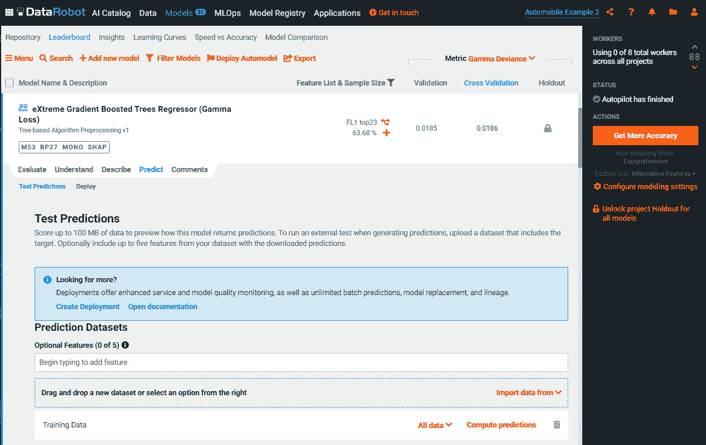

    图 8.1 – 批量评分

    在前面的屏幕截图中，您将看到有一个选项可以**拖放一个新的数据集**以将评分文件添加到模型中。

1.  让我们选择我们的`imports-85-data-score.xlsx`评分文件，并将其拖放到**拖放一个新的数据集**框中。一旦放下文件，它将被上传，您可以在界面上看到它，如图下所示：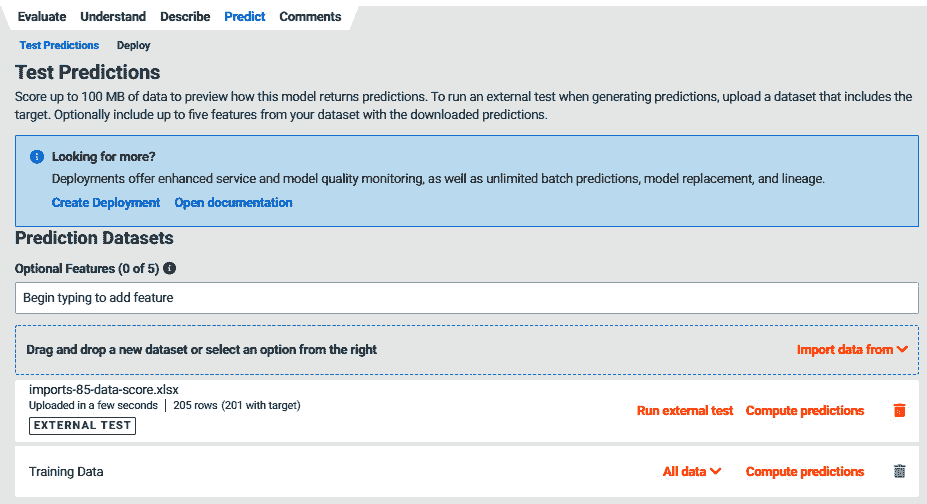

    图 8.2 – 计算预测

1.  您现在可以点击 Excel 中可以查看的`.csv`文件，如图下所示：

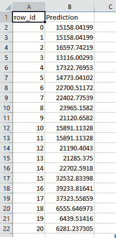

图 8.3 – 下载的预测

现在下载的预测文件可以与原始数据集合并，进行进一步分析。

评分数据集的第二种方法是使用 DataRobot 批量预测**应用程序编程接口**（**API**），将在下一节中讨论。

# 生成预测解释

在本节中，我们将重点介绍如何为评分数据集生成预测和解释。在上传评分数据集（如前节所述）后，您现在可以转到**理解**选项卡，然后选择**预测解释**选项卡，如下面的截图所示：

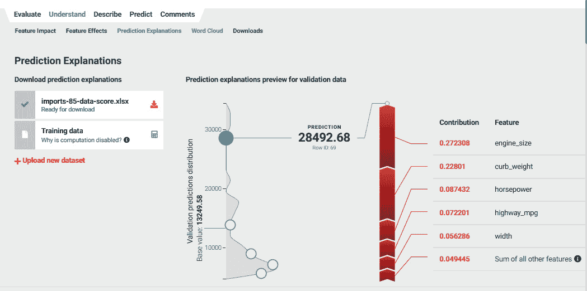

图 8.4 – 预测解释

在前面的截图中，您可以看到现在显示了已上传的评分数据集。您现在可以单击数据集文件名旁边的图标来计算解释。一旦计算完成，您将看到下载图标。您可以使用下载图标下载模型做出的预测的解释。解释以`.csv`文件的形式提供，可以使用 Excel 打开，如下面的截图所示：

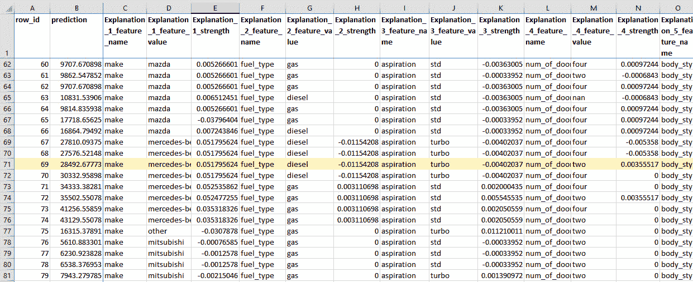

图 8.5 – 预测解释文件

在前面的截图中，我们看到文件包含预测，以及每个预测的解释。例如，如果我们查看`make`行，它解释了这辆汽车与基准值之间差异的 5.17%。同样，您可以看到每个特征值的相对贡献。请注意，文件中的特征不是按最重要的特征排序的，并且对于给定行，最重要的特征与其他行可能不同。特征重要性会随行而变化。

现在我们有了预测及其解释，让我们看看如何分析这些内容，并确定如何使用它们采取行动或做出决策。

# 分析预测和后处理

在我们部署模型之前，分析预测并查看它们是否有意义，错误中是否有某些模式，以及如何将预测转化为可操作的内容，这些都是传统数据科学工具和方法帮助不大，需要依靠判断和其他学科的方法来帮助制定下一步的方面。为此，让我们首先将评分数据集文件与解释文件结合起来。这可以在**结构化查询语言**（**SQL**）、Python 或 Excel 中完成。合并后的文件看起来大致如下：

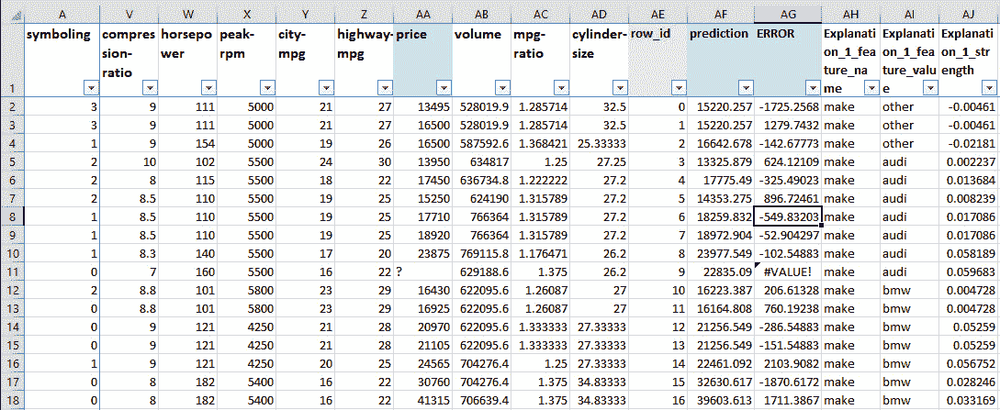

图 8.6 – 结合评分数据和预测

我们还创建了一个新的**错误**列，该列简单地从**价格**中减去**预测**。现在我们可以使用 Excel 创建数据透视表，并从多个角度查看结果。例如，让我们创建一个数据透视表，查看按**符号**计算的**错误平均值**，如下面的截图所示：

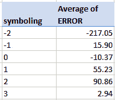

图 8.7 – 按符号计算的错误平均值

前面的截图显示，对于值**-2**，错误率要高得多。查看数据集，我们发现我们只有三个**-2**的数据点，因此模型表现不佳并不令人惊讶。这告诉我们，当**symboling**值为**-2**时，我们不能相信结果，我们应该尝试获取更多这个值的数据。这样的分析可以指出改进的领域以及需要集中精力的地方。我们还意识到，由于这是一个平均误差，我们应该使用绝对百分比误差的平均值来防止得出错误的结论，如下面的截图所示：

图 8.8 – 根据 symboling 的平均绝对百分比误差值

现在，我们看到随着**symboling**值的增加，绝对百分比误差逐渐降低。在这个阶段，除了探索输出数据并从不同角度观察以寻找线索外，没有其他硬性方法来发现洞察。通常，对错误进行排序并查看具有异常大错误的行是一个好主意，然后看看你是否能确定原因。

现在，让我们转向构建数据科学模型最重要的一个方面——理解需要采取哪些行动。现在我们已经有了一个合理的模型来预测价格，随之而来的是一个疑问：*我们应该如何利用这些信息？* 希望在项目开始时就已经确定了这次练习的目标。让我们假设目标是根据模型的预测来设定新车辆的售价，并提供所有参数，例如`engine_size`等。我们也可以想象，这样的模型在设计师试图确定不同参数（如`bore`或`width`）之间的权衡时，在设计阶段也是有用的。这进一步说明，预测模型可以多次应用于在构建模型时未考虑到的用例。

然而，这要求我们理解业务问题的更广泛背景。这是我们花费时间讨论和理解业务背景的主要原因，正如我们在*第三章*中讨论的，*理解和定义业务问题*。回顾那章可能会有所帮助，以刷新那里讨论的概念，因为我们将在那里使用一些介绍的技术，例如因果建模。

为了确定我们如何使用价格预测，让我们回顾一下我们关于价格与其他参数之间关系的了解。在*第五章*《使用 DataRobot 进行探索性数据分析》中，我们研究了关联分析信息。DataRobot 生成了使用互信息生成的关联强度。我们可以使用这些信息来绘制不同特征之间的网络图，如下面的截图所示。你可以通过为每个特征画一个圆圈，然后创建具有高关联强度的特征之间的线条来完成此操作：

图 8.9 – 特征之间的关联网络图

在*第七章*《模型理解和可解释性》中，我们看到了价格在**SHapley Additive exPlanations**（SHAP）值方面的特征重要性是特定于我们选择的模型的。以下可能代表这个问题的因果图：

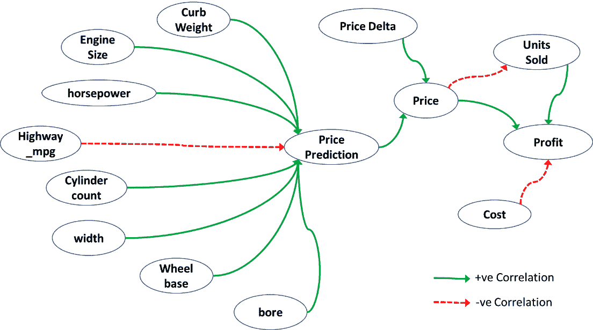

图 8.10 – XGB 模型的因果图

图表的左侧表示 SHAP 值中最重要的特征。让我们假设实际收取的价格与预测略有不同。**价格差异**特征反映了某人可能做出的收取与预测不同的价格的决定。**价格**特征影响**销量**，这最终影响盈利能力。请注意，这仅反映了一种使用此模型帮助做出定价决策的可能方式。

如果，相反，我们想象我们正在尝试帮助汽车设计团队制定最佳汽车配置，这将也是最有利可图的配置，那么我们可能会以不同的方式看待这个图。这是因为不同的汽车或发动机设计选择也会影响汽车的成本。此外，我们从*图 8.9*中知道，特征不是独立的。改变**缸径**特征将改变**发动机尺寸**和**马力**特征。因此，当我们考虑做出决策时，我们必须考虑因果影响。这是一个非常简化的视角，你可以想象，对于真实问题，这些图将更加复杂。想象一下，商业领导者通过在脑海中考虑所有这些关系来做出这些决策。这也是为什么许多时候，模型没有被商业用户使用的一个原因。

在我们的示例问题中，*图 8.10*中显示的因果图相当简单。你可以想象现实世界中的问题，其中这个图将更加复杂。在这种情况下，很难评估模型部署对生态系统的影响，这包括用户和其他利益相关者。复杂问题往往有许多未预见的后果，尤其是当受影响的是人的时候。

在这种情况下，如果潜在影响可能很大，建议在合成或模拟环境中测试新模型。完成测试和影响分析后，我们现在可以部署我们的模型。

# 部署 DataRobot 模型

DataRobot 使您轻松部署您已开发的模型。为了准备模型进行部署，以下是步骤：

1.  让我们解锁项目，以便我们可以看到保留数据集的指标，如下面的屏幕截图所示：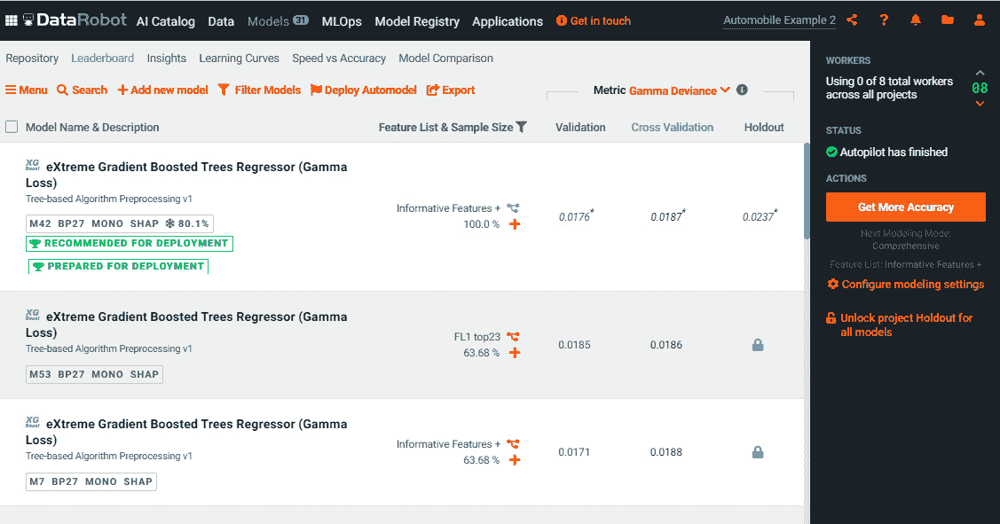

    图 8.11 – 解锁 DataRobot 模型

    在前面的屏幕截图中，您可以在界面右侧看到**解锁所有模型的保留项目**选项。

1.  您应该在选择了要部署的模型后才能解锁项目。在我们的例子中，我们选择了使用**FL1 top23**特征列表的 XGB 模型。点击此选项将打开一个对话框，如下面的屏幕截图所示：

    图 8.12 – 解锁项目保留

1.  解锁项目是一个不可逆的过程。让我们解锁项目并查看保留指标，如下面的屏幕截图所示：

    图 8.13 – 解锁的项目视图

    *图 8.13*显示，保留值高于交叉验证值，这是预期的。保留值是模型部署后应期望的性能的更好表示。

1.  现在项目已解锁，让我们用 100%的数据重新训练所选模型以提高该模型的表现。为此，点击*图 8.13*中显示的模型橙色**+**号。这将打开一个用于更改样本大小的对话框，如下面的屏幕截图所示：

    图 8.14 – 定义新的样本大小

    在前面的屏幕截图中，您可以看到更改样本大小的选项。

1.  将滑块拖到**100%**以表示您希望使用 100%的数据来训练模型，如下面的屏幕截图所示：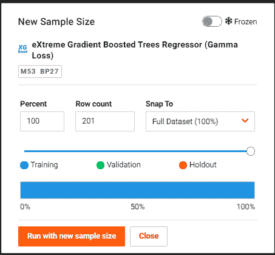

    图 8.15 – 设置新的样本大小

1.  您现在可以点击**使用新样本大小运行**按钮。DataRobot 现在将使用 100%的数据重新训练 XGB 模型。对于 XGB 模型，您现在可以点击**预测**选项卡，然后点击**部署**选项卡，如下面的屏幕截图所示：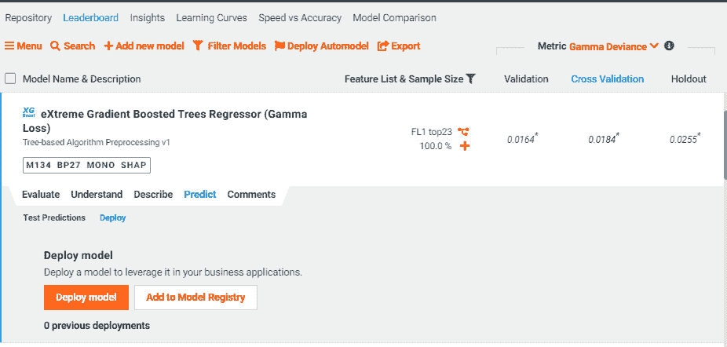

    图 8.16 – 部署模型

1.  接下来，点击**部署模型**按钮。这将打开一个新页面，如下面的屏幕截图所示：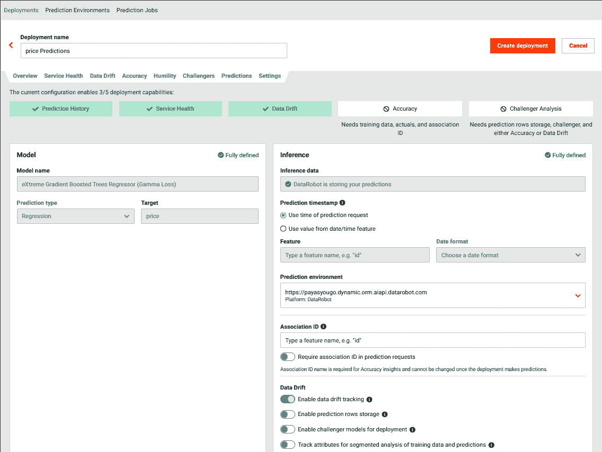

    图 8.17 – 为模型创建部署

1.  您现在可以为您的部署模型命名。您还可以选择部署模型所在的服务器环境，这是由您的管理员设置的。在**数据漂移**部分，您可以指定是否要跟踪数据漂移或启用挑战模型。您还可以启用预测行的存储，这允许 DataRobot 分析随时间推移的性能。同样，您还可以启用跟踪属性，以进行基于段落的模型性能分析。

1.  您现在可以点击`https://app2.datarobot.com`。

1.  您现在可以调用此 API 来生成预测。您也可以通过点击不同的选项卡查看有关您的部署的其他信息。如果您点击**服务健康**选项卡，您将看到一个像这样的页面：

图 8.19 – 部署的服务健康

上一张截图显示了价格预测模型的状态。它显示了已完成的预测数量、预测的响应时间以及错误率。截图没有显示任何值，因为我们刚刚部署了此模型。

我们现在可以开始监控这个部署的模型。

# 监控部署模型

如您现在所猜想的，一旦模型部署完成，数据科学团队的工作并没有结束。我们现在必须监控这个模型，看看它的表现如何，是否按预期工作，以及我们是否需要干预并做出任何更改。我们将按以下步骤进行：

1.  要了解它是如何工作的，让我们点击**预测**选项卡，如下截图所示：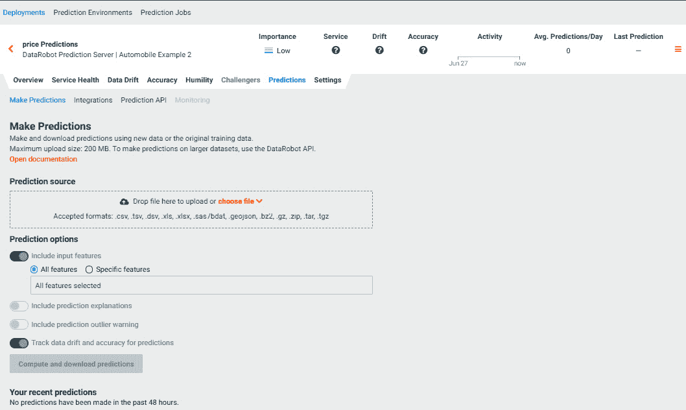

    图 8.20 – 使用部署的模型进行预测

1.  我们现在可以通过拖放文件（在这里，我们将使用在模型训练期间使用的相同文件）到**预测源**框中，上传要评分的数据集。现在我们可以看到其他选项变得可用，如下截图所示：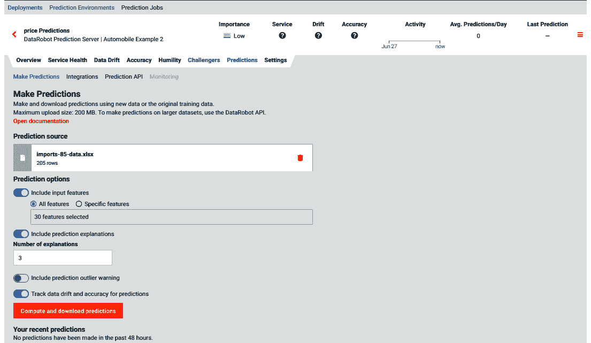

    图 8.21 – 计算数据集的预测

1.  选择选项后，我们可以点击**计算并下载预测**按钮。DataRobot 完成计算后，我们将看到输出文件变得可用，如下截图所示：

    图 8.22 – 下载预测

    现在可以下载输出文件并进行分析。由于我们感兴趣的是监控模型，让我们点击**服务健康**选项卡，如下截图所示：

    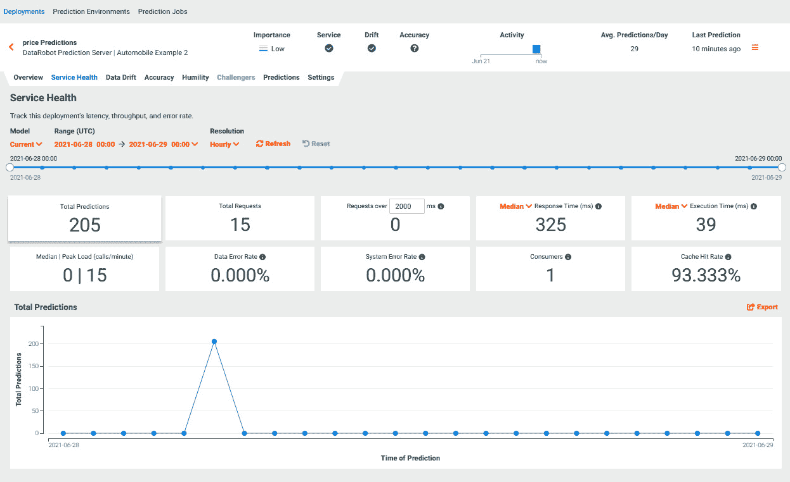

    图 8.23 – 模型的服务健康

    我们现在可以看到，该模型已服务了 15 个请求，平均响应时间为 325 毫秒（**ms**），错误率为 0%。整体服务健康看起来很好。

1.  通过点击**数据漂移**选项卡，我们可以查看模型的漂移情况，如下面的截图所示：

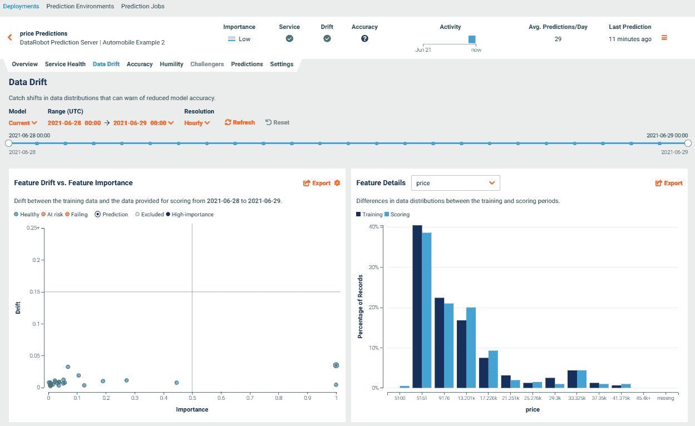

图 8.24 – 模型的数据漂移

在前面的截图顶部，在`价格`处。如果你滚动页面，你会看到更多的图表，如下面的截图所示：

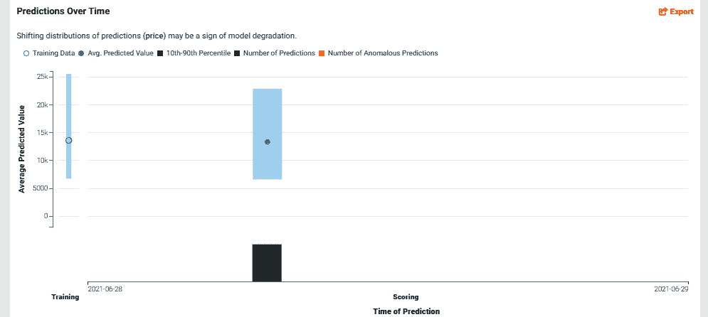

图 8.25 – 模型的数据漂移：附加信息

前面的截图显示了随时间变化的平均预测值。这将表明预测是否稳定，或者随着时间的推移是否发生了变化。你必须依靠你对业务问题的理解来确定漂移量是否可接受。DataRobot 也会通过显示红色、黄色或绿色状态来给你一个指示。红色状态表示存在需要解决的问题；同样，黄色表示你应该意识到潜在的问题，绿色表示一切看起来都很正常。一般来说，问题可能是数据管道中的错误或商业环境的改变。商业环境的改变将表明模型需要重新训练。

如果模型需要重新训练或你需要重建模型，你可以遵循我们在前几章中概述的步骤。这完成了使用 DataRobot 构建和部署模型的基本视图。

# 摘要

在本章中，我们学习了如何在训练后使用模型。我们讨论了用于评分数据集的方法以及用于分析结果输出的方法。我们还涵盖了将预测转化为行动或决策的方法和考虑因素。这是一个关键步骤，你必须与业务利益相关者合作，确保引入此模型不会引起未预见到的问题。这也是进行变革管理任务的时候，比如向受变化影响的人传达变化，并确保用户接受新流程的培训并了解如何使用新功能。

然后，我们讨论了如何使用 DataRobot 功能快速部署模型并监控模型性能。很容易低估这一功能的重要性。模型部署和监控并不容易，许多组织花费大量时间和精力试图部署模型。希望我们已经展示了如何使用 DataRobot 轻松完成这项任务。

我们现在已经完成了构建和部署模型所需的基本步骤，现在可以深入了解 DataRobot 的一些高级概念和功能。你现在可以根据你的兴趣或将要从事的项目类型深入研究高级主题。例如，如果你正在处理时间序列问题，那么你可以回顾*第九章*，*预测和时间序列建模*。
