# 第九章：预测和时序建模

在本章中，我们将了解什么是时间序列，并了解 DataRobot 如何用于建模它们。时间序列建模在商业中变得越来越有用。然而，与预测相关的挑战使得许多有技能的数据科学家成功执行时间序列建模变得相当具有挑战性，这种建模形式也可能非常耗时。DataRobot 提供了一个自动化流程，使数据科学家能够以有效和高效的方式执行时间序列项目。在本章中，我们将介绍预测的概念，强调其商业重要性和内在挑战，并说明如何使用 DataRobot 构建其模型。

到本章结束时，你将学会如何利用 DataRobot 构建时间序列预测模型。此外，我们还将探讨如何使用这些模型进行预测。在高级主题中，我们将构建多序列时间序列模型。以下是本章将涵盖的主要主题：

+   时间序列预测和建模的概念介绍

+   定义和设置时间序列项目

+   构建时间序列预测模型并理解其模型结果

+   使用时间序列模型进行预测

+   时间序列建模的高级主题

# 技术要求

本章的一些部分需要访问 DataRobot 软件和一些数据处理工具。大多数示例处理的是小型数据集，因此可以通过 Excel 处理。我们将在本章中使用的数据集将在下面描述。

## 家用电器能源预测数据集

此数据集可在加州大学欧文分校（UCI）机器学习库中访问（[`archive.ics.uci.edu/ml/datasets/Appliances+energy+prediction#`](https://archive.ics.uci.edu/ml/datasets/Appliances+energy+prediction#)）。

数据集引用

*Luis M. Candanedo*，*Véronique Feldheim*，*Dominique Deramaix*，《低能耗房屋中家电能源使用的数据驱动预测模型》，《能源与建筑》，第 140 卷，2017 年 4 月 1 日，第 81-97 页，*ISSN 0378-7788*。

此数据集捕捉了房屋中各个房间和室外环境中的温度和湿度，以及各种设备随时间推移的能源消耗。数据每 10 分钟捕获一次。这是一个典型的时间序列数据集示例。数据以`.csv`格式提供，网站还提供了各种特征的描述。此数据集中的所有特征都是数值特征。数据集还包括两个随机变量，以使问题更有趣。

# 时间序列预测建模的概念介绍

商业环境的动态特性使得时间成为商业成功的关键资源。因此，企业在决策时需要考虑时间因素。商业环境中的变化发生得非常快，这使得组织需要采取快速但经过深思熟虑的行动。分析技术为组织提供了工具，这些工具能够预测未来，从而使决策者有足够的时间确保他们的决策与组织目标一致。组织使用特定时间的数据来预测未来一段时间内的销售量。其他作者已经区分了时间序列模型和预测模型。在本章中，我们使用了这两个术语，并将**时间序列预测**视为利用基于时间的数据进行高级分析以指导商业决策的过程。

时间序列预测支持商业计划的多个方面。通过预测，人力资源和其他形式的资源规划可以优化，以确保实现预期结果。通过预测，现金流、利润和预算预测可以更加严格地建立，从而减轻人为偏见。预测销售可能会受到多种可控和非可控因素的影响。某些随时间变化的消费者因素往往会影响销售量。这些因素包括人口变化、顾客口味和兴趣的变化。此外，需求对更广泛的经济变量敏感，如通货膨胀，这些变量也会随时间变化。因此，使用一些可以作为这些消费者和经济变量代理的特征变得至关重要，除了**滞后**或历史销售数据。由于一些这些变量难以获取，分析师往往只能限于使用一些历史值和量来建模未来的结果。

尽管详细讨论时间序列超出了本书的范围，然而，理解建模时间序列的特性使得它们更具挑战性是相关的。除了本书前几章讨论的其他预测建模形式的困难之外，时间序列建模还带来了额外的挑战。线性回归建模的一个假设是观察值的独立性，即观察或数据行是独立的。然而，这个假设在时间序列建模中不可避免地被打破。在时间序列中，**自相关**自然发生，因为观察在不同时间段内是相似的。也有可能高度修正的观察不会连续发生，在这种情况下，会出现**季节性**。当固定时间段内的观察具有更高的相关性时，序列被认为是季节性的。实际上，这些是观察的周期性波动。在假日期间航班票务销售量的相似量就体现了这一点。季节性确实可能发生，但并不遵循固定的**周期性**时间框架。通常，验证周期需要比序列的其他属性（如周期性）大得多的数据集，因为周期性主要与外部因素有关，例如商业环境中的宏观经济或政治变化。

自相关还导致了**线性**，这是一个描述连续观察值相似性的总体趋势的概念，尽管它们以遵循线性趋势的方式变化。由于这种线性趋势，尽管有时会有一些综合波动，特定时间框架的平均值将遵循一个模式，但不太可能相同，因此使用了**移动平均**（**MA**）和**自回归**方法来表示时间序列。然而，序列仍然可以通过它们随时间变化的统计属性的程度来表征。当它们具有恒定的均值和方差，且与时间无关时，它们被认为是**平稳的**。最有趣的是，尽管在统计上存在问题，但某些时间序列数据具有这些特性的组合。一个很好的例子是航班量。尽管随着时间的推移逐渐增加，具有季节性，但在经济衰退期间通常会下降。在这个例子中，我们可以看到季节性、周期性和线性的元素。

有时在细节中容易丢失的概念是**可操作性**。可操作性是指利益相关者能够因为分析或模型的结果而采取行动的能力，数据科学家通常专注于预测的准确性。虽然准确性很重要，但更重要的是为决策者提供可操作的指导。一个能够让你今天采取行动的预测比一个更准确但不可操作的预测更有价值。在定义预测问题时必须小心，以确保正在开发中的模型具有可操作性。

本节中省略的对话突出了使时间序列建模对典型数据科学家更具挑战性的特性。DataRobot 开发了独特的流程，使数据科学家，包括那些统计知识有限的人，能够创建复杂且稳健的时间序列模型。在下一节中，我们将探讨如何在 DataRobot 中定义和设置时间序列问题。

# 定义和设置时间序列项目

从 *第四章*，“为 DataRobot 准备数据”到 *第八章*，“模型评分和部署”，我们探讨了在 DataRobot 中创建、理解、评分和部署基本模型的过程。我们看到了 DataRobot 自动为我们构建了几个模型，然后我们可以使用这些构建的模型对数据集进行评分。进一步地，在我们选择了一个与我们的需求最佳匹配的模型之后，DataRobot 提供了一个部署我们选定模型的过程。由于时间序列建模与其他形式的预测建模之间的差异，我们将在本节中探讨如何通过有效地定义和设置 DataRobot 中的时间序列项目来缓解问题。

我们将用于探索使用 DataRobot 进行时间序列建模的数据集是我们在 *第四章*，“为 DataRobot 准备数据”中探讨的家用电器能耗预测数据集。该项目的目标是预测能耗。这个能耗时间序列数据集包含了来自不同数据源 4 个半月的 10 分钟读数。首先，涉及的数据包括房屋内的温度和湿度。这些数据通过无线传感器网络进行监测，并且每 10 分钟存储一次。房屋中的九个房间都有温度和湿度的读数被存储在相应的时间段内。其次，还有外部数据提供了附近机场（公共来源）关于房屋外部的详细天气信息，同样是以 10 分钟为间隔。这包括风速、能见度、露点、压力和湿度。这些信息通过日期和时间与数据合并。此外，与日期和时间对齐的家用电器和照明使用情况也被附加到数据集中。

在这个数据集中，很容易看出这个时间序列预测的目标是预测能源使用。直接影响变量是房屋内的温度和大气压力；然而，房屋外部的天气数据也很重要。我们创建了计算房屋九个房间平均条件的特征。此外，我们还设计了捕捉平均房间温度与外部温度以及平均房间与外部压力之间差异的特征。由于我们有两个时间序列（电器使用和照明使用），我们将以两种方式来解决这个问题。首先，作为一个`.csv`文件，如下面的截图所示：

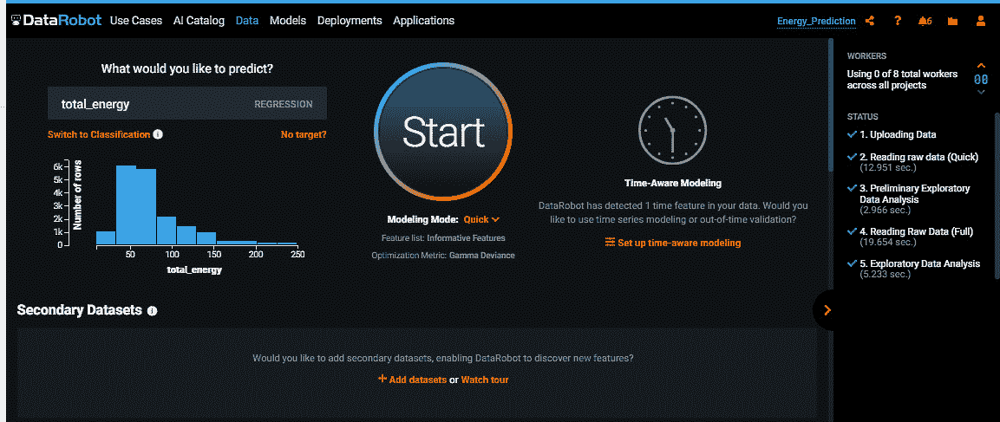

图 9.1 – 选择时间序列的目标变量

项目命名为`Energy_Prediction`，选择的目标变量是`total_energy`（照明和电器使用的总和）。我们按以下步骤进行：

1.  在选择目标变量后，我们选择时间变量和时间序列建模的性质。点击`date`特征，它指定了所有读数的日期和时间，如下面的截图所示：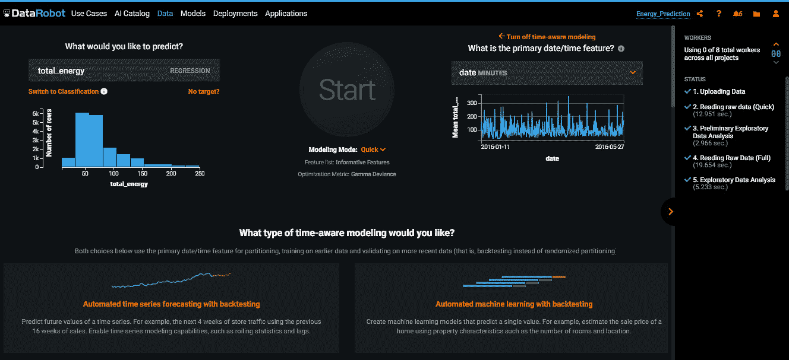

    图 9.2 – 选择时间感知函数和时间变量

1.  一旦点击了**设置时间感知建模**按钮并选择了时间特征，平台会要求选择要构建的时间感知模型类型。有两种选项——**自动时间序列预测与回测**和**自动机器学习与回测**，如下所述：

    +   **自动时间序列预测与回测**——此选项考虑过去数据来预测未来数据。对于时间序列，需要预测多个未来的点。此类时间感知项目的例子可以是使用去年销售数据来估计百货商店下一个月的每日销售额。

        **自动机器学习与回测**——自动机器学习选项，有时被称为**时间外验证**，基本上是在一行中创建基于时间的特点，然后使用一个典型的预测模型来预测该行的目标变量。在这里，我们不使用典型的交叉验证方案；相反，这种方法使用旧数据来训练，并保留新数据用于回测。我们项目的上下文问题属于预测类别，因此选择了此选项，如下面的截图所示：

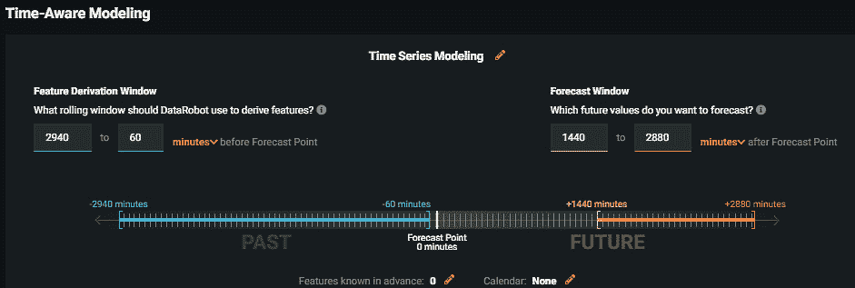

图 9.3 – 时间感知建模选项

一旦我们选择了**自动时间序列预测与回测**选项，就会看到一个**时间感知建模**选项卡（见*图 9.3*）。在这里，需要仔细选择几个选项。我们表达模型用于预测的数据回溯多远，以及模型预测多远。让我们首先考虑**特征推导窗口**选项。这个**滚动窗口**突出显示了一个滞后，与从哪个时间点进行预测（**预测点**）相关联，从而推导出时间序列模型的特征和统计数据。滚动窗口与预测点相关联，并随着时间的推移自动向前移动。在理想情况下，这个窗口应该覆盖你的数据中的季节性周期。本质上，这个窗口通常回答的问题是：*我们的模型用于预测的数据回溯多远？*此外，窗口的结束和预测时间之间应该有足够的时间，以应对任何数据摄入延迟，确保数据足够新。这个时期被称为**盲历史**。在我们的案例中，我们假设一个小时足够的时间来允许任何盲历史，因此将预测点之前的时间间隔设置为 60 分钟。考虑到我们的数据仅限于 4 个半月，我们问题中的季节性将是日夜使用。因此，我们将滚动窗口设置为 2 天（2,880 分钟），考虑到最初的 60 分钟预测点间隔，总共为 2,940 分钟。

第二个考虑因素是**预测窗口**选项。这定义了相对于预测点，我们预测多远未来。这有两个要素；首先，预测开始的时间。预测应该提供足够的时间采取行动，但又不能太远，以确保这些预测足够准确。其次，我们选择预测的结束点。这取决于起点以及我们问题的性质。因此，这个方面回答的问题是：*预测应该向前推进多远？*对于当前的问题，我们选择了一个**操作化差距**，即预测点和预测窗口开始之间的差距为 1 天（1,440 分钟）。此外，滚动窗口设置为 1 天，考虑到我们的操作化差距，变为 2,880 分钟。

在本节中设置了时间序列预测项目后，我们将现在探讨构建模型的过程，从理解特征列表及其分布到查看它们对评估模型的影响。

# 构建时间序列预测模型并理解其模型结果

与我们在*第四章*中查看的项目类似，即*为 DataRobot 准备数据*，到*第八章*中*模型评分和部署*，一旦我们完成了初始配置，我们就向上滚动并点击**开始**按钮。通过这样做，DataRobot 会自动为该项目构建时间序列模型。在我们评估模型之前，了解平台提取的特征的性质将是有用的。DataRobot 从数据中提取的特征与其他预测模型相比差异很大，如下面的截图所示：

![图 9.4 – 特征列表

![图片 B17159_09_04.jpg]

图 9.4 – 特征列表

在**特征列表**选项卡下显示的列表是作为**探索性数据分析**（**EDA**）的一部分构建的，并列出了 DataRobot 在创建模型时使用的不同特征列表。许多特征列表涉及**派生特征**，这些特征是根据时间序列的性质自动创建的。关于派生特征的进一步讨论将在本节后面进行。很容易看出，一些列表涉及从原始数据中提取的特征（例如，**时间序列提取特征**）。其他涉及仅从日期创建的特征，而有些则被认为是有信息的。大多数列表似乎是不同类型的组合（例如，**时间序列信息特征**）。重要的是，特征列表提供了每个特征列表名称的描述以及特征数量。可能至关重要的特征列表作为**排行榜**功能的一部分展示，如下面的截图所示，这指导我们最终模型的选择：

![图 9.5 – 模型排行榜

![图片 B17159_09_05.jpg]

图 9.5 – 模型排行榜

**排行榜**功能提供了对为 DataRobot 项目构建的模型的洞察。它提供了有关模型名称和**标识符**（**ID**）、它们的准确度指标以及它们的类型、版本和模型开发中的样本大小的信息。然而，在时间序列建模中，有一些差异，如下所述。首先，样本大小存在于数据范围内。这是由于时间序列数据集基于时间的特性。与其他建模形式不同，数据的顺序确实会影响结果；因此，数据是在时间范围内选择的。在这种情况下，如*图 9.5*所示，我们的模型是使用 3 个月、21 小时和 51 分钟的数据构建的。其次，我们没有**验证**和**交叉验证**列，而是有**回测 1**和**所有回测**列。回测逻辑上遵循关于样本大小的讨论（参见*第六章*，*使用 DataRobot 进行模型构建*）。回测提供了对数据子集上模型性能的评估。然而，与典型的验证不同，数据是按时间顺序排列的，回测的大小和数量可以根据需要更改。我们为这个示例项目使用了默认的回测设置，以便数据以这种方式分区，使得只有一个回测分区可用于建模。最后，在时间序列建模项目中，似乎有更多的特征列表。与其他预测项目类型一样，模型可以通过**排行榜**功能上的任何列进行排序或选择。

有许多指标可以用来评估时间序列预测模型。当然，这取决于模型本身。对于回归类型的输出，有些人提倡使用**均方根误差**（**RMSE**）。问题的本质在确定评估指标时仍然至关重要。话虽如此，**基线模型**在排行榜上的作用对于评估其他模型至关重要。基线模型在做出预测时使用最新的值。因此，将模型与基线预测蓝图进行比较在模型评估中起着关键作用，因为它在一定程度上回答了以下问题：*我们的模型在多大程度上优于从最新数据中做出的简单预测？* DataRobot 提供了**平均绝对缩放误差**（**MASE**），它将感兴趣模型的**平均绝对误差**（**MAE**）与基线模型的进行比较。例如，以下截图所示的**Eureqa 广义加性模型（250 代）**模型，在**Backtest 1**中的比较比率为约 0.76。这表明 Eureqa 模型比基线模型好约 24%。由于**保留集**指标可能会突出数据中的重大变化，因此它应包含在模型评估中，但不应单独使用。本章的*时间序列建模高级主题*部分涵盖了评估模型时的其他指示。点击模型名称可以提供关于数据和其过程的具体见解。我们现在转向我们认为对时间序列预测独特的内容，以下使用**Eureqa 广义加性模型（250 代）**作为示例：

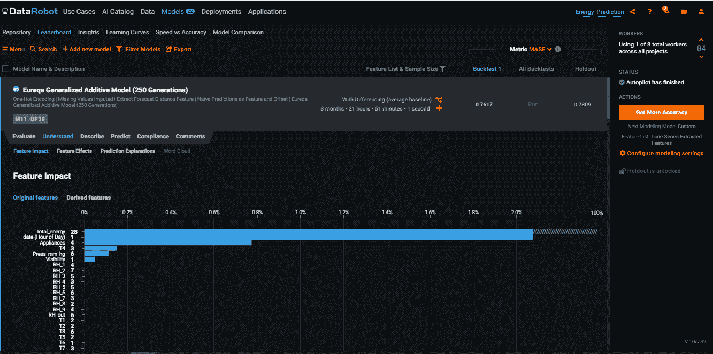

图 9.6 – 原始特征的影响

**理解**标签页向我们展示了**特征影响**、**特征效应**、**预测解释**和**词云**功能，这些我们在*第七章*的*模型理解和可解释性*中已经遇到过。**特征影响**显示了特征对模型整体准确性的相对贡献程度。点击**特征影响**标签页将打开**原始特征**页面（见*图 9.6*）。原始特征是它们在数据集中存在的特征。

在`total_energy (1440 分钟平均基线)`)中的其他标签页看起来是基于时间序列的平稳性构建的特征，如下面的截图所示。这是因为它突出了平均 1,440 分钟基线能量对模型准确性的重要性：

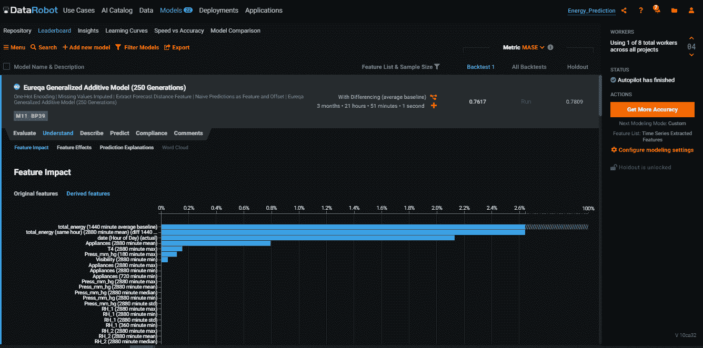

图 9.7 – 导出特征的影响

如*图 9.7*所示，相当数量的派生特征似乎是从时间序列的平稳性中创建的，这本身可能表明这个时间序列相当平稳。尽管如此，在得出这个结论时需要谨慎，因为我们的数据集只包含了 4 个半月的值得数据；例如，我们的数据集只覆盖了 2016 年 1 月到 2016 年 5 月，因此没有涵盖晚夏、秋季和早冬月份。因此，如果我们使用覆盖更长时间范围的数据集，可能会出现季节性。

DataRobot 创建了利用时间序列特性的特征，以提高其模型精度。尽管在本项目中不明显，但在存在季节性或周期性时，DataRobot 会确定周期性变化发生的时间，并相应地创建特征。基于这些信息，它接下来检测季节性模式——例如，在某个时间段内发生的季节性可以通过从时间段的开始计数或从时间段的结束计数来定义。因此，该平台可以检测并构建特征，例如，使用 3 月的最后一个周六的能源使用量来预测 4 月的最后一个周六的能源使用量。以类似的方式，DataRobot 使用基于**差分**的特征来提高模型性能。它可以使用 3 月第一周的平均使用量作为特征来预测 4 月第一周的使用量。

接下来转到**“描述”**选项卡，打开**“蓝图”**选项卡后，我们可以快速理解，这与前面章节中遇到的其他预测项目并没有太大区别：

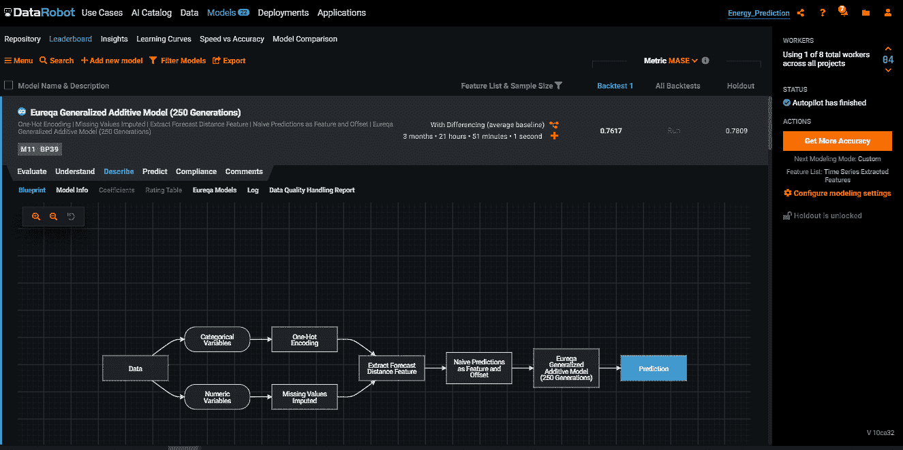

图 9.8 – 模型蓝图

我们现在已经花费时间构建和理解时间序列预测模型。下一步合乎逻辑的步骤是使用我们选定的模型进行预测。

# 使用时间序列模型进行预测

DataRobot 为我们提供了使预测变得轻松的工具。对于小于 1 **千兆字节**（**GB**）的小数据集，可以使用**“制作预测”**选项卡在**“排行榜”**功能中进行预测。这涉及到设置和上传预测数据集，然后在**“拖放新数据集”**用户界面（**UI**）功能中进行评分。对于显著更大的数据集，需要部署模型，并使用**应用程序编程接口**（**API**）进行预测。在本章中，我们将介绍第一种预测方法。关于 DataRobot 的一般模型部署和与 API 一起使用，在*第十二章*，*DataRobot Python API*中进行了广泛讨论。

时间序列模型的排行榜在评分模型方面的拖放方法与传统模型略有不同，如第八章中所述，*模型评分和部署*。当打开**制作预测**选项卡时，DataRobot 简要概述了进行预测所需数据的最新性和数量。这个概述与模型开发配置期间建立的预测窗口以及导出的特征基本一致。如下面的截图所示，预测数据集需要至少 4,320 分钟的历史数据，超出预测点前 60 分钟。此外，当模型包含涉及早期时间段的导出特征时，早期时间段也包含在数据集要求中。因为所讨论的模型具有 24 小时差异的导出特征，这增加了对 5,820 分钟的要求。这 5,820 分钟的要求包括一个初始的 60 分钟预测点间隔窗口，4,320 分钟的基础预测要求数据，以及为导出差分特征增加的 1,440 分钟。这使得模型在 1,440 分钟的操作间隔之后，能够在预测点前 2,880 分钟进行预测。其中一些特征在此处展示：

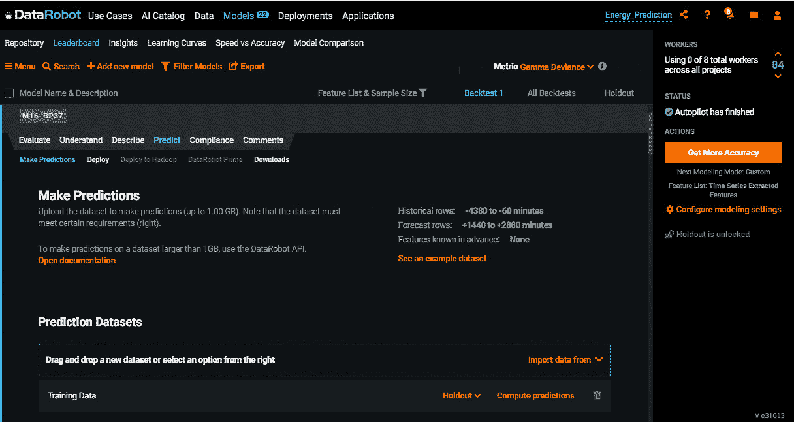

图 9.9 – 制作预测窗口

要进行预测，如果数据格式与训练数据一致，请按以下步骤操作：

1.  点击**导入数据**，允许从本地源、**统一资源定位符**（**URL**）、您现有的数据源之一或 AI 目录中摄取数据。如果在默认预测点之后没有找到行，DataRobot 将生成一个模板。为此，预测窗口内必须没有空行，并且模板文件必须满足上传大小限制条件。文件上传后，DataRobot 设置预测点并包括满足预测窗口期望所需的行。

1.  在上传数据后，点击**计算预测**按钮，如图所示，因为上传的预测文件是最新的，没有间隔，并且包含期望的行数：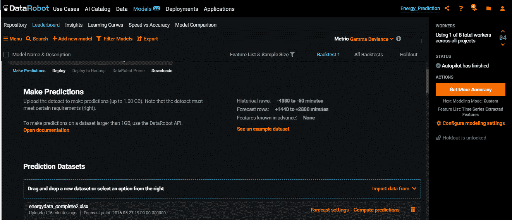

    图 9.10 – 计算时间序列预测

    *图 9.10*中的**预测设置**按钮提供了预测选项，其中预测点可能不是最新的，或者更改了预测的范围。

1.  要进行此类更改，请单击 **预测设置** 按钮，它默认打开 **预测点预测** 选项卡，如以下截图所示。此窗口提供了一个预测点滑动选项卡选择器，可以通过滑动或输入实际时间值进行配置。然而，无效的日期已被禁用：

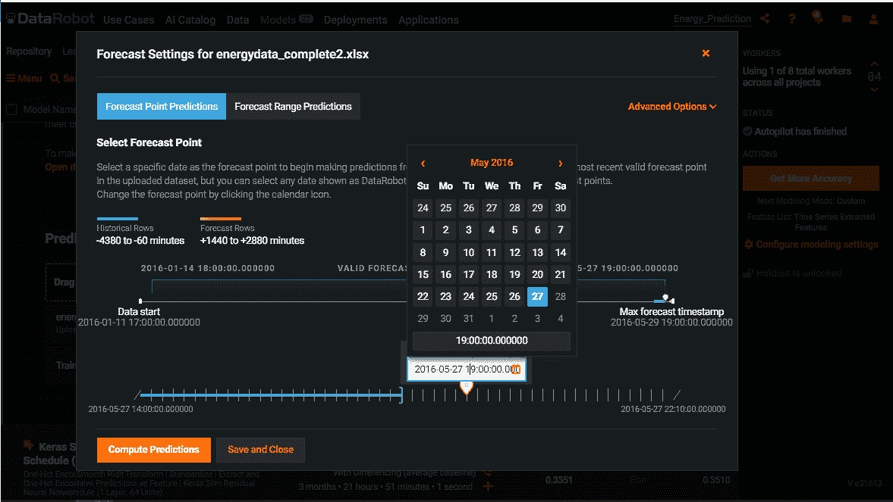

图 9.11 – 预测点预测设置

如前所述，可以选择作为预测点的次数是有限的。预测点必须小于或等于最新的一个。在本项目的情况下，这是 **2016-05-27 19:00:00:00**，这是最新的数据行时间，有 **1440** 分钟的操作间隔。可以通过类似的操作来改变预测日期范围。理想情况下，应使用 **预测范围预测** 功能来验证模型，而不是做出未来预测。

在本节中，我们强调了确保我们的时间序列模型预测数据集与训练模型数据集相似的重要性。我们继续进行预测并从模型中解释其他结果。接下来，我们将探讨更多涉及 DataRobot 时间序列建模的高级主题。

# 时间序列建模的高级主题

在本章中，我们学习了如何在 DataRobot 中配置、构建和使用基本时间序列预测模型进行预测。在前一节中，我们的注意力集中在构建只有一个时间序列的模型。然而，你可能会有这样的情况，需要做出多时间序列的预测。在我们的能源利用问题背景下，我们可能想要预测灯光和电器的使用情况。在其他地方，一家能源公司可能想要在同一模型中预测不同城市或家庭的能源使用情况。现在，我们将深入探讨这类问题的解决方案。此外，我们还将探讨未来其他高级方法可能用于评估我们的时间序列模型的方式。最后，我们将承认计划事件对时间序列的影响，并强调 DataRobot 为处理这种可能性所采取的措施。

本项目使用的数据集突出了灯光和其他电器的能源使用情况。在早期项目中，我们将所有使用量加起来作为我们的目标变量，但在本项目（命名为 `Energy_Prediction_2`）中，将构建预测每个设备类型使用情况的模型。此数据集现在有两个序列，这意味着时间戳可能会重复，但每个序列中的时间戳必须是唯一的。区分列 `Device_type` 是分配给使用情况的设备类型的 ID。在将项目验证为时间感知并选择其类型为 `Device_type` 后：

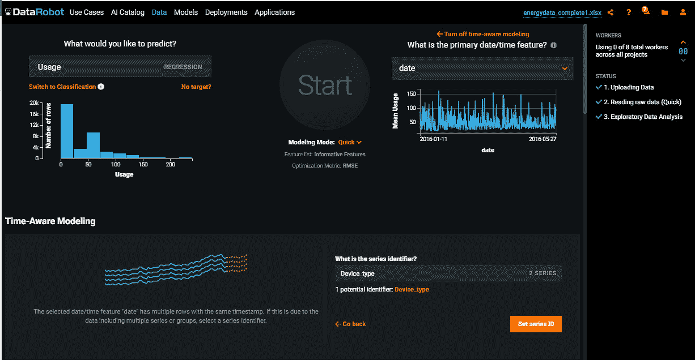

图 9.12 – 多序列时间序列预测设置

对于这个项目，我们感兴趣的是进一步评估我们的模型。因此，在自定义我们的预测窗口，在`5 + Holdout`之后。以下截图详细说明了此配置的设置，我们可以看到训练、验证和保留数据是如何从初始数据中划分出来的。重要的是要强调，为了设置回测，我们必须考虑数据中的任何形式的季节性、周期性和/或循环性，并确保每个折叠至少有一个这些实例。这是因为每个回测都应该是一个完整的数据集，所以季节性、周期性和循环性需要在每个回测中考虑。验证和间隔长度也可以更改。此项目的默认长度设置为超过 13 小时 9 分钟。您可以在以下位置查看配置：

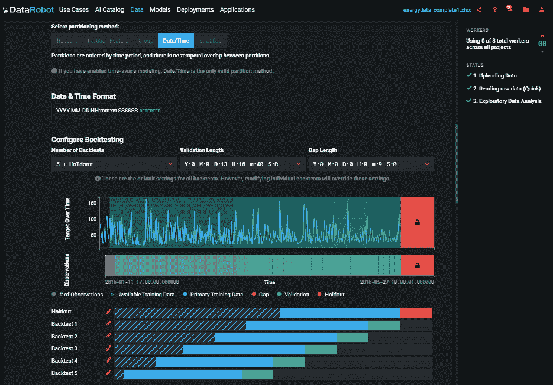

图 9.13 – 回测配置

在配置回测后，我们点击**开始**来训练模型。当模型创建后，评估过程类似于单一时间序列模型。正如以下截图所示，我们可以看到**所有回测**指标，它衡量模型在所有回测中的平均性能。因此，它提供了一种快速评估模型性能以及数据模式随时间一致性的有趣方法：

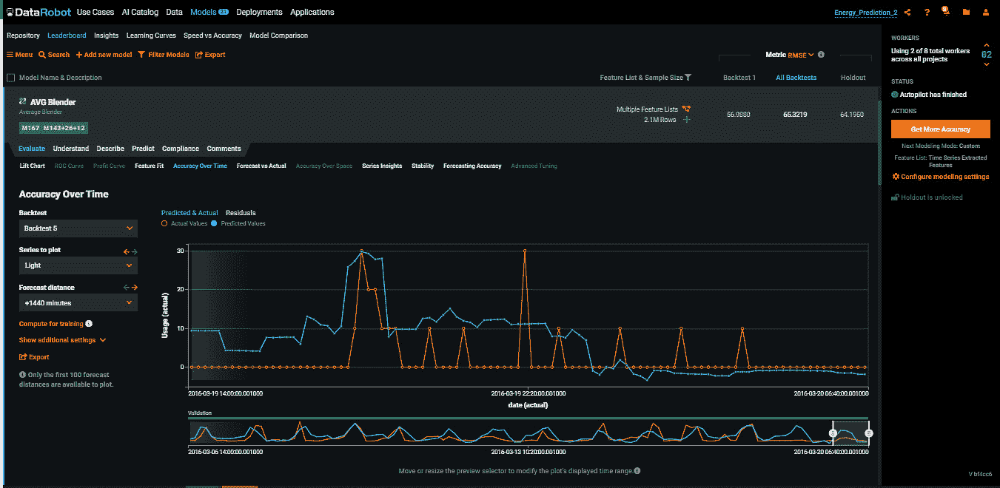

图 9.14 – 随时间变化的准确性

模型**评估**标签页中的**随时间变化的准确性**功能允许用户对他们的模型随时间进行直观且深入的评估（见*图 9.14*）。在这里，预测值和实际值被直观地展示出来。在这个窗口中，您可以选择**要绘制的序列**设置，并更改**回测**和**预测距离**设置。在商业背景下，这种视图有助于了解是否存在表现不佳的时期，这可能意味着数据中未表示的业务方面。如图所示，以下截图中的**预测准确性**窗口是另一种重要的表示，它表明模型性能如何随着预测距离的变化而变化：

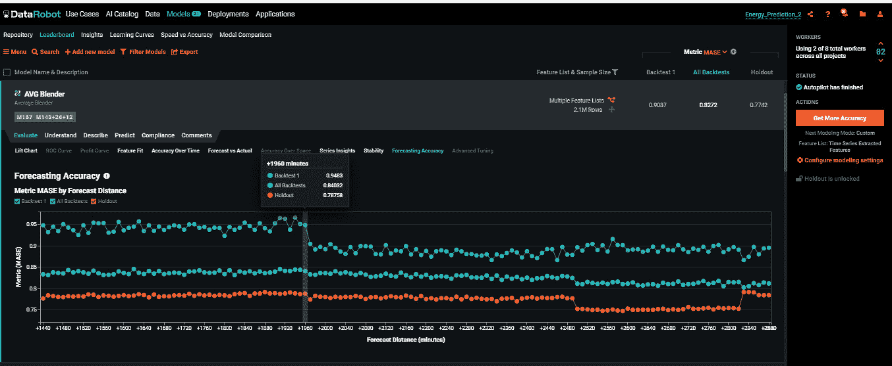

图 9.15 – 预测准确性窗口

**预测准确性**窗口突出显示了随着对未来进行预测，模型性能的变化。这个视图使我们能够评估模型性能在时间上的相似性，这表明模型可以在业务中使用。此外，当使用 MASE 性能指标时，它还突出了模型性能显著超过基线模型的情况。如图 9.15 所示，模型在**回测 1**的性能似乎在 +1,960 分钟标记处开始显著优于基线模型。稳定性视图向用户提供跨时间范围的分数度量。

随着对性能更好的模型的追求，我们需要对建模范式进行一些改变。可用于时间序列建模的默认模型可能无法提供所需性能。在这种情况下，正如在第六章*模型构建与 DataRobot*中解释的那样，模型存储库提供了选择传统时间序列模型（如**自回归积分移动平均**（ARIMA））和更近期的模型（如 Keras **长短期记忆**（LSTM）和**XGBoost**（XGB））的选项。根据研究的时间序列的性质，这些建模方法有时会提供更好的性能。

# 摘要

在本章中，我们广泛探讨了如何使用 DataRobot 构建时间序列模型。我们简要讨论了时间序列模型为商业带来的独特机会，以及它对分析师和数据科学家提出的挑战。我们使用 DataRobot 创建了单时间序列和多时间序列模型。我们还描述了如何使用 DataRobot 构建的模型进行预测。随后，我们讨论了 DataRobot 时间序列能力的先进方面。

由于其能够根据时间依赖变量预测未来可能发生的事情，预测对商业至关重要。另一个具有商业价值的领域是建议不同客户对广泛产品感兴趣的能力。这就是推荐系统发挥作用的地方。

在下一章*第十章*[*推荐系统*]中，我们将探讨如何使用 DataRobot 构建推荐引擎。
