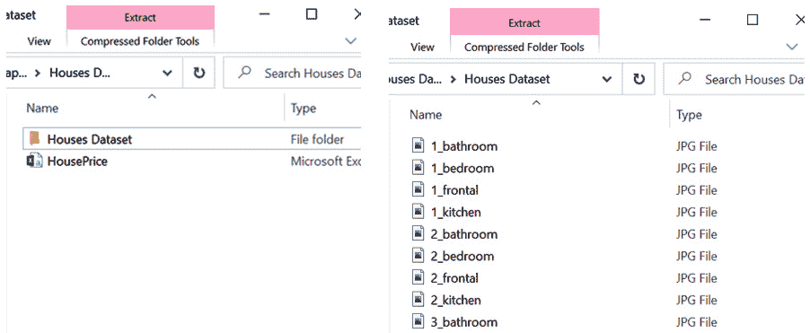
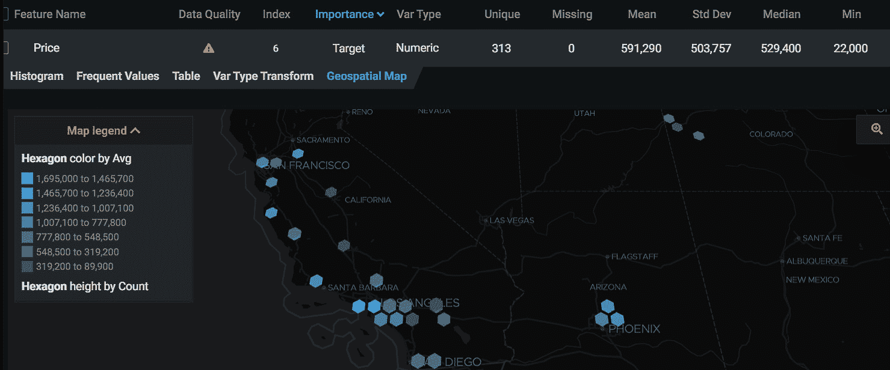
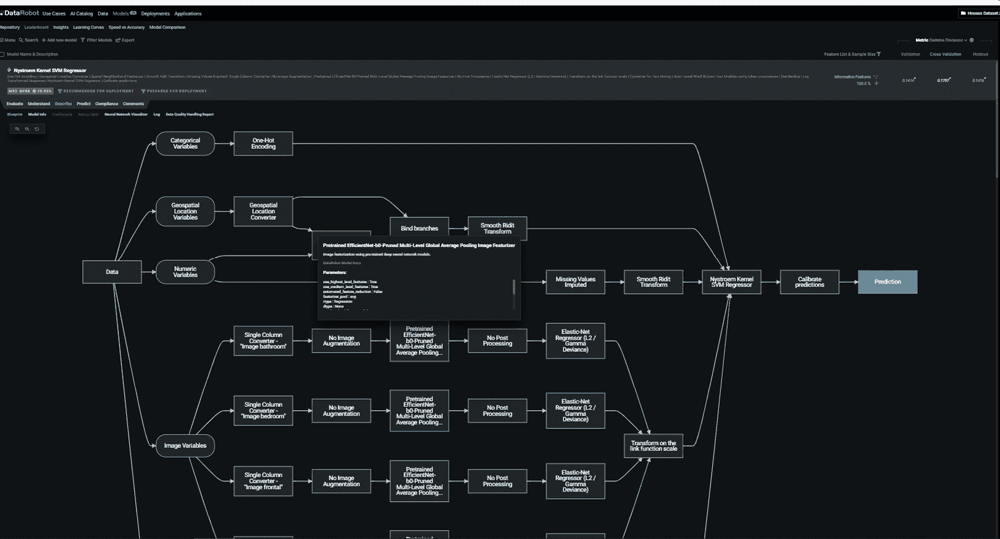
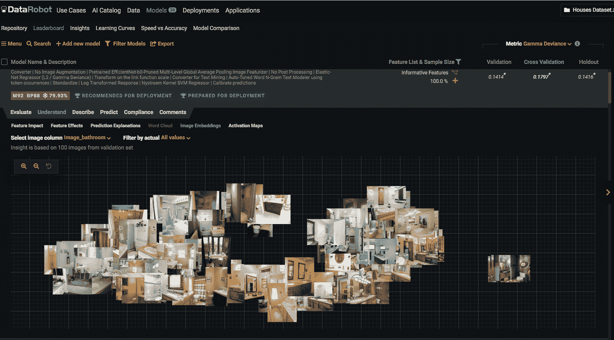
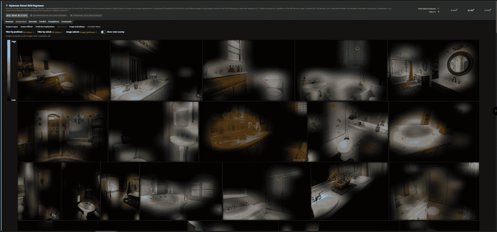
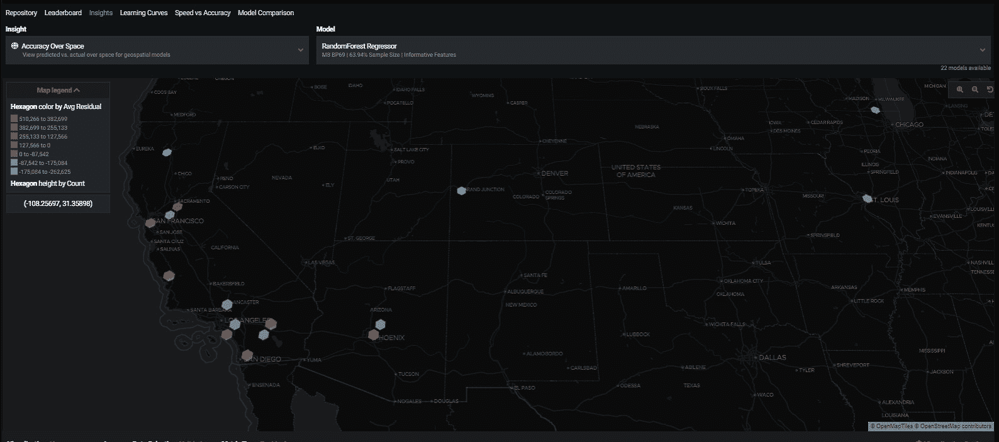
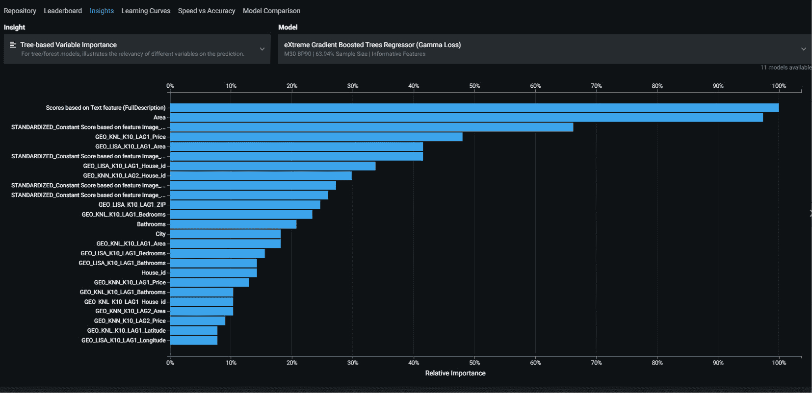
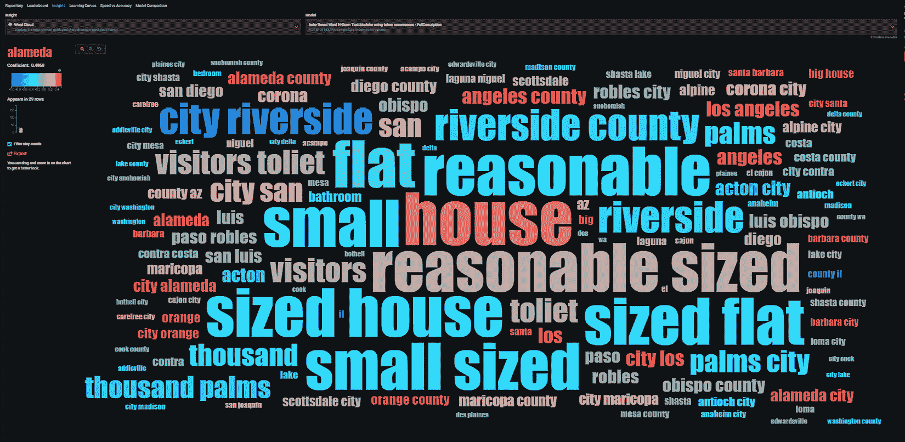
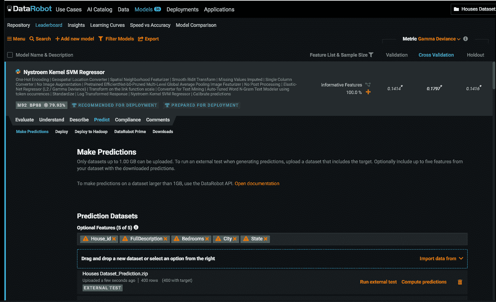
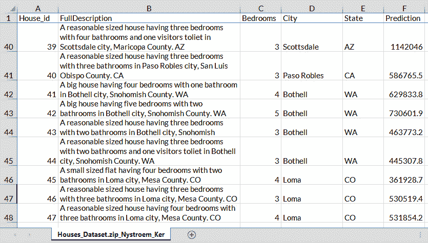

# 第十一章：处理地理空间数据、NLP 和图像处理

到目前为止，本书主要关注数值和分类特征。在大数据中，情况并不总是如此，因为大数据带来了数据种类的增加。图像、文本和地理空间数据在洞察力和解决最复杂问题方面变得越来越有价值。例如，最近，**基于位置**的数据已被用于提高广告活动的有效性。例如，可以根据用户的位置显示不同的广告；如果他们是咖啡爱好者并且靠近咖啡馆，可以向他们的移动设备发送推送通知。在其他情况下，基于高级文本分析或自然语言处理的聊天机器人为商业提供了高效有效的途径来解决客户问题。最有趣且新兴的解决商业问题的方法是使用**多模态**数据集，这些数据集在同一项目中结合了不同的变量类型。

显然，分析不同变量类型的话题本身就可以写成一本书。然而，概述不同变量类型的分析对于在构建涉及文本、图像和位置数据的多模态模型中应用 DataRobot 至关重要。考虑到这一点，在本章中，我们将深入探讨文本、图像和地理空间数据的定义和分析方法。之后，我们将使用 DataRobot 构建和利用多模态数据集的独特性来预测房价的模型进行预测。因此，以下将涵盖的主题包括：

+   地理空间、文本和图像数据的概念介绍

+   在 DataRobot 中定义和设置多模态数据

+   在 DataRobot 中使用多模态数据集构建模型

+   在 DataRobot 中使用多模态数据集进行预测

# 技术要求

本章中进行的分析和建模大多需要访问 DataRobot 软件。一些操作使用了其他工具，包括 MS Excel。本章使用的数据集是房屋数据集。

## 房屋数据集

房屋数据集可以在 Eman Hamed Ahmed 的 GitHub 账户中访问（[`github.com/emanhamed`](https://github.com/emanhamed)）。数据集中的每一行代表一栋特定的房屋。初始特征集描述了其特征、价格、邮编、卧室、浴室、厨房和正面的图像。没有缺失数据。我们继续为每栋房屋开发基于卧室数量、浴室、城市、国家、州和实际财产大小的文本描述。在其他地方，ZIP 代码被转换为纬度和经度，作为列添加到数据集中。有关基本特征的更多信息可在 GitHub 链接中找到，数据以`.csv`格式提供。

数据集引用

*《基于视觉和文本特征的房价估算。在第八届国际联合计算智能会议论文集》，*H. Ahmed E. 和 Moustafa M.* *(2016)。IJCCI 2016，ISBN 978-989-758-201-1，第 62-68 页。DOI: 10.5220/0006040700620068*

# 地理空间、文本和图像数据的概念性介绍

正如我们使用不同的感官来全面理解周围的物体一样，一个**机器学习**（**ML**）模型也受益于来自不同类型传感器和来源的数据。仅有一种类型的数据（例如，数值或分类）会限制模型的理解、可预测性和鲁棒性水平。在本节中，我们将更深入地讨论不同数据类型在构建模型中的商业重要性、相关挑战以及必要的预处理步骤，以减轻这些挑战。

## 地理空间人工智能

地理空间理解对某些行业的决策制定有着长期的影响，包括矿产开发、保险、零售和房地产。虽然数据科学的商业重要性已经确立，但基于位置的人工智能才刚刚开始获得认可。在提高业务绩效中使用机器学习凸显了在构建预测模型时，通过添加基于位置的信息和特征来增强数据集的重要性。

主要由分类数据和数值数据构建的典型机器学习（ML）模型对实现商业目标做出了巨大贡献，但决策不仅仅受数值和分类信息的影响。实际上，事件发生在特定的地点。为了使位置上下文有效地呈现商业洞察和预测，机器学习模型需要基于位置的信息。一种地理区域有效的方法可能在另一个地理区域不适用。

使用机器学习和基于位置的信息的商业影响潜力伴随着几个挑战：

+   数据集、工具和人员技能的缺乏。

+   将机器学习管道与原生基于位置的分析技术连接起来并不简单。

+   只有少数 R 和 Python 包具有地理空间功能。

+   理解这些能力需要分析师进行进一步的教育和培训。

DataRobot 的位置人工智能能力有助于缓解这些挑战。该位置人工智能能力通过增加一系列地理空间分析和建模工具来补充现有的 AutoML 体验。使用 DataRobot，可以从数据集中选择位置特征，但位置人工智能能力使平台能够自动识别地理空间数据并创建地理空间特征。可以上传多种地理空间数据文件格式。这些包括 GeoJSON、Esri 形状文件和地理数据库、PostGIS 表，以及传统的纬度和经度数据。

## 自然语言处理

作为人类，我们通过大量词汇进行有效沟通，无论是否对使用的词汇量有限制。除了词汇之外，肢体语言、语调和词汇的上下文对于有效沟通至关重要。例如，使用相同的词汇组，*猫比狗大*与*狗比猫大*具有不同的含义。自然地，人类根据自由文本进行理解、得出结论和预测未来。自由文本的使用带来了有价值的信息，从中可以挖掘出丰富的见解。然而，由于自由文本缺乏一致的结构，它们对机器处理构成了挑战。

对话和其他形式的自由文本是杂乱无章且无结构的，因为它们无法整齐地放入传统的行和列的表格中。**自然语言处理（NLP**）位于数据科学和语言学的交汇点，涉及系统地使用高级过程进行分析、理解和从自由文本中提取数据。通过 NLP，科学家可以利用自由文本生成有价值的见解，这些见解随后被集成到构建性能更好的模型中。文本挖掘允许识别与某些结果相关的独特词汇或词汇组。例如，在房价预测案例中，房屋的描述提高了模型在估计房价方面的可预测性。考虑到这一点，描述也影响了个人购买房屋的决定。个人购买房屋的倾向影响了房地产定价。NLP 算法可以识别词汇顺序的影响、影响词汇或短语以及词汇在句子中的上下文。

自然语言处理（NLP）是机器能够从文本中提取重要信息的关键。因此，NLP 允许机器通过给文本一个数字分数来决定自由文本中描述的情感，表示其对主题或事件的情感。同样，它有助于识别某些词汇最有可能属于的类别。这种能力催生了包括文本分类、命名实体识别、情感分析和文本摘要在内的多种应用。

使自由文本提供有用的见解或集成到模型中并非易事。正如之前所提到的，原始文本没有结构，因此需要引入结构。此外，许多词汇具有相同的意义，同一个词在不同的上下文中可能有不同的含义。在典型的分析过程中，需要采取许多步骤来规范化自由文本。至少需要以下四个步骤：

1.  文本处理的第一步是将文本语料库分割成单独的单词。这一步骤也称为**分词**，它使得识别关键词和短语成为可能。分割后的单词被称为标记。N-gram 是文本分析的基本单元。

1.  接下来，有一些单词对文本的意义贡献很小或没有贡献。这些通常是常见单词；例如，在英语中，我们有像 *the*、*that*、*is* 和 *these* 这样的单词。在文本挖掘的上下文中，这些单词被称为噪声或有时被称为停用词。因此，这一步被称为**噪声去除**。

1.  之后，单词会被转换成它们的词根意义。这有几个方法。作为一个例子，**词干提取**通常通过删除某些字母将单词转换成词根词干。所以，像 *happy*、*happiness*、*happily* 和 *happiest* 这样的单词都会被转换回词根词 *happ*。因为相同的单词可能有多种含义，所以在文本处理中，单词的消歧变得至关重要。而词干提取通过截断前缀或后缀将单词返回到它们的词根，**词形还原**则检查单词的上下文，以确保提取的词干被转换成逻辑基础，称为**词元**。例如，单词 *anticipate* 在词干提取后可能被转换回 *ant*。然而，在上下文中，*ant* 并没有意义；因此，词形还原将确保单词 *anticipate* 被保留。

1.  最后，但同样重要的是，有一个过程被称为 `0` 和 `255`，其中 `0` 表示完全黑色，而完全白色表示 `255`。另一方面，彩色图像有包含蓝色、绿色和红色层的 3D 数组。就像灰度图像中的黑色一样，这些层的每个都有自己的值，范围从 `0` 到 `255`，最终的色彩是这三个层对应值的组合。

    图像处理通常遵循预定义的步骤，从图像中提取有用和一致的特征，这些特征与提取的目的相一致。位于图像文件夹旁边的 `.csv` 文件。为卧室、浴室、正面视图和厨房创建了四个新的图像列。因此，`.csv` 文件上的每一行数据都有其图像的路径，如 *表 11.2* 所示。这些路径指向 ZIP 文件中相应图像文件的位置。在 ZIP 文件中，包含表格特征的 `.csv` 文件位于包含所有图像的文件夹中。每个图像都有一个独特的名称，与 `.csv` 文件上的图像路径列保持一致。ZIP 文件和 `HousePrice` 文件夹的设置如图 *图 11.1* 所示。话虽如此，数据集仍然可以通过 AI 目录进行摄取。这也给了 DataRobot 连接到其他图像数据源的能力。此外，如果您有权访问 Paxata 工具，可以在数据预处理中部署该工具：

    ![图 11.3 – ZIP 文件（左）和图像文件夹（右）的数据设置]

    

    图 11.3 – ZIP 文件（左）和图像文件夹（右）的数据设置

    *图 11.1* 左侧的图像展示了 ZIP 文件的设置方式。包含图像文件的文件夹`Houses Dataset`紧邻`HousePrice.csv`文件。右侧的图像展示了`Houses Dataset`文件夹内的图像文件。在此，图像被标记，位置与数据中的单元格`HousePrice.csv`（如*表 11.2*所示）一致。数据完全设置好后，下一步是开始模型开发。

    # 在 DataRobot 中使用多模态数据集构建模型

    在我们的 ZIP 文件中完全设置好多模态数据集后，我们进入 DataRobot 中启动项目。使用拖放方法的数据导入与早期项目类似，只是在这种情况下我们上传 ZIP 文件。在 ZIP 文件上传后，选择价格作为目标变量。DataRobot 自动检测文本、图像和地理空间字段（见*图 11.2*）。几何特征是由原始数据集中的纬度和经度变量组成的基于位置的属性。除了纬度和经度坐标外，位置特征还可以由其他原生地理空间格式形成，例如 Esri 形状文件、GeoJSON 和 PostGIS 数据库。这些可以通过拖放、AI 目录或 URL 方法上传：

    

    图 11.4 – 特征名称列表

1.  通过选择`Feature Name`列表中的`Price`选项，可以查看基于位置的列表价格的可视表示。通过点击`Geospatial Map`标签和`Compute feature over map`按钮。如*图 11.3*所示，`Geospatial Maps`窗口提供了基于位置的数据集分析可视化。它显示了空间上房产的分布——每个区域的房屋数量及其平均价格：

    图 11.5 – 地理空间地图

    地图图例提供了关于地图的重要信息。它强调六边形的颜色表示该位置的平均房价。在其他地方，它通过六边形的高度表示案例的频率。这种 ESDA 功能不仅显示了地图上房价的视觉分布，还展示了不同区域的房屋数量。对于其他特征，如房屋面积变量和卧室数量，也可以进行类似的地理空间分析。

    这种对图像特征的初步检查可以通过选择任意的图像变量进行。这显示了**特征名称**列表中的图像样本。在此，可以看到并按房价范围组织不同的图像特征。

1.  为了进一步探索物业级别的图像特征，我们点击包含图像路径的`.csv`文件，图像被集成到数据集中（见*图 11.4*）。对于每一行，图像都清晰显示。进一步滚动将显示所列物业的自由文本描述。现在，这个包含文本、位置和图像特征的多模态数据集可以用来构建更稳健的模型并预测房价：

    图 11.6 – DataRobot 对多模态数据的视图

1.  与早期项目一样，我们点击**开始**以启动模型构建过程。建模过程完成后，使用**RMSE 指标**对模型进行评估。排行榜显示 DataRobot 总共构建了 36 个模型。表现最好的是**Nystroem 核 SVM 回归器**模型。

    如*图 11.5*所示，打开模型会展示其蓝图，概述了使数据为该模型准备所需的全部步骤。由于数据的多模态特性，预处理步骤相当复杂。DataRobot 进行了地理空间处理，并将其与一些数值变量以及高级图像和文本处理（后者在*图 11.5*中不可见）集成。有关每个步骤的更多信息，点击步骤框可以提供有关建模步骤的一些见解，并链接到该步骤的全面文档：

    

    图 11.7 – 多模态数据建模的模型蓝图

1.  在`区域`内是房屋最具有影响力的特征；其次是`FullDescription`文本特征。之后，`Bedrooms`和`Image_kitchen`特征依次排列。相当有趣的是，`Image_bathroom`似乎对模型准确性有负面影响。这表明这些图像的见解将模型引向实际房价：

图 11.8 – 多模态模型的特征影响

由于这个原因，为了避免模型向改进性能发展，我们使用`卫生间`图像进行预测。通过这样做，我们将使用`卫生间`特征来展示 DataRobot 中可用的图像特征探索能力。DataRobot 通过根据图像的相似性进行无监督学习来聚类图像。仍然在`卫生间`视图内。我们可以看到 DataRobot 将相似图像聚在一起。似乎主要显示白色商品的图像位于可视化图的右侧和上部。我们可以根据房价来过滤可视化：

图 11.9 – 图像嵌入

`image_bathroom` 变量。看起来模型主要从浴室的白色装置中进行预测。这可能会提供关于为什么 `image_bathroom` 被视为对模型性能有负面影响的原因。有可能从白色装置中提取的信息误导了模型：

图 11.10 – 激活图

基于位置的信息伴随着对其他数据类型的重要补充。然而，一些模型在特定地理区域表现不佳。检查模型性能并考虑位置使分析师能够采取行动以改进模型性能。DataRobot 的 **空间精度** 功能展示了模型残差在不同位置的时空表示（例如，见 *图 11.9*）。此图表可能引导分析师考虑某些区域高残余背后的原因：

图 11.11 – 空间精度

例如，如 *图 11.9* 所示，凤凰城地区的平均残余价格超过 $380k，比大多数地区都要高。这个区域可能被认为是低收入地区。这种可视化可能将数据科学家引导到包括本地化经济指数的特征。这可能会为高残余提供解释。因此，包括这样的特征可能会提高模型的总体性能。用于测量精度的数据分区可以通过在验证、交叉验证或保留分区之间切换来设置。此外，可以根据用户的要求调整精度指标类型和聚合方式。

补充其基于位置的特征工程，DataRobot 的基于位置的统计分析能力可以利用其位置感知来创建 `eXtreme Gradient Boosted Trees Regressor (Gamma Loss)` 模型的第四个最重要的特征，`GEO_KNL_K10_LAG1_Price`，这是一个这样的特征（见 *图 11.10*）。该特征使用通过距离增加的核大小来描述价格的空间依赖结构。**k-最近邻**方法也可以部署：

图 11.12 – 空间滞后特征

文本分析信息，如词云，在`FullDescription`文本功能中不可用，这确实是该模型最具影响力的功能之一。尽管在模型蓝图（*图 11.10*）中不可见，但文本变量是通过另一个模型评分的，即`使用标记发生频率的自动调优词 N-gram 文本模型器 – FullDescription`，该模型本质上使用`FullDescription`功能转换成标记（作为*N*在*N-gram*中）并评分。之后，该特征在链接尺度上进行了转换并标准化。对于与文本相关的见解，我们转向**见解**视图，提供两种重要的文本见解能力，**词云**和**文本挖掘**。

`FullDescription`特征影响房价。如图*图 11.11*所示，单词的大小突出了标记的频率，而颜色表示其影响系数。这个系数通常标准化在-1.5 到 1.5 之间。单词的颜色越接近红色，系数就越大，因此房价也就越高：

图 11.13 – 多模态数据集的词云

我们可以假设，当`FullDescription`变量包含橙色单词、**阿拉米达县**和大的单词时，价格很可能是高的。同样，对于小型单词和**城市河畔**，预期价格会较低。文本挖掘能力使用条形图显示与词云类似的信息。

现在我们已经能够使用多模态数据集构建模型，对其特征进行分析，并评估这些模型的性能，接下来我们将专注于使用模型进行预测。

# 在 DataRobot 上使用多模态数据集进行预测

在构建模型后，在 DataRobot 上有很多方式进行预测。对于此用例，我们将使用**预测**选项卡中的`Make Prediction`方法来展示预测能力。我们最初使用本章中*定义和设置 DataRobot 中的多模态数据*部分中的步骤概述创建一个预测 ZIP 文件数据集。开发的预测数据集可以通过拖放或本地导入到高亮区域。如*图 11.12*所示，我们选择我们感兴趣的属性，包括预测数据集：

图 11.14 – 从多模态数据集中进行预测

在这个示例中，我们选择了`House_id`、`FullDescription`、`Bedrooms`、`City`和`State`。我们还可以看到预测数据集有 400 套房子。最后，`.csv`文件包含了所有请求的列（见*表 11.3*）：

表 11.15 – 多模态数据集的预测表

**预测**列显示了每行的预测价格。这完成了使用多模态数据集进行预测的过程。正如预期的那样，一旦从多模态数据集构建的模型被部署，就可以针对它们进行预测。

# 摘要

在本章中，我们探讨了如何从图像、位置和自由文本中生成洞察。通过这样做，我们强调了这些数据类型带来的好处，以及每个数据类型带来的挑战。我们还指出了这些通常是如何在主流中解决的。我们继续使用 DataRobot 构建多模态数据集的模型并进行预测。我们还研究了从模型的位置、自由文本和图像方面获取洞察的多种方式。通过展示使用多模态数据集构建模型的过程，我们展示了 DataRobot 如何简化处理不同数据类型带来的挑战。

话虽如此，重要的是要指出，DataRobot 在处理自由文本方面似乎存在一些限制。虽然该平台显著简化了文本处理的过程，但在本出版物发布时，我们尚不清楚特定领域停用词在 DataRobot 处理过程中的包含程度。似乎通用停用词被删除了，但有时需要考虑特定领域的停用词。在其他方面，在多模态建模的背景下，我们不确定模型中的文本方面是否可以调整以包含和改变词干提取和词元还原的方法。因此，建议在将文本输入 DataRobot 之前，您自行进行文本处理和特征工程，以获得更好的结果。

在本章以及之前各章中，我们使用平台与 DataRobot 进行了交互。尽管该平台具有众多功能，但这些功能也带来了一些限制。这些限制以及如何通过平台编程访问来缓解这些限制，在*第十二章**，DataRobot Python API*中得到了广泛讨论。
