# 第十三章: 模型治理和 MLOps

在前面的章节中，我们学习了如何构建、理解和部署模型。现在我们将学习如何治理这些模型，以及如何在运营中负责任地使用这些模型。在早期的章节中，我们讨论了理解业务问题的方法、模型将运行的系统以及使用模型预测的潜在后果。**MLOps**是由**机器学习**和**DevOps**组成的词汇。它由流程和实践组成，旨在高效、可靠和有效地在企业内部实现机器学习（**ML**）模型的生成。MLOps 旨在通过确保生产模型的输出质量良好并实现自动化，以确保持续满足商业价值和监管要求。它提供了一个集中式系统来管理所有生产中 ML 模型的整个生命周期。

MLOps 中的活动涵盖模型部署的所有方面，提供生产中模型的实时跟踪准确性，提供冠军挑战者流程，该流程使用实时数据持续学习和评估模型，跟踪模型的偏见和公平性，并提供一个**模型治理**框架，以确保模型在满足监管要求的同时继续产生业务影响。在第*第八章*中，*模型评分和部署*，我们讨论了在 DataRobot 平台上的模型部署。

此外，在第*第八章*中，*模型评分和部署*，我们广泛地讨论了在生产中监控模型方面的内容。鉴于模型治理在 MLOps 过程中的关键作用，在本章中，我们将介绍模型治理框架。模型监控的一个关键方面是确保模型没有偏见，对所有受模型影响的人公平，这一点我们将在本章中探讨。之后，我们将更深入地探讨如何实现 MLOps 的其他方面，包括如何维护和监控模型。因此，我们将涵盖以下主要内容：

+   模型治理

+   解决模型偏见和公平性问题

+   实施 MLOps

+   生产中通知和更改模型

# 技术要求

本章的大部分内容需要访问 DataRobot 软件。示例使用了一个相对较小的数据集，**Book-Crossing**，由三个表格组成，其操作在*第十章*中已有描述，*推荐系统*。正如数据描述中将要涵盖的，我们将创建新的字段，除了在*第十章*中使用的字段外。

## Book-Crossing 数据集

用于说明模型治理方面的示例与用于构建推荐系统的*第十章*，*推荐系统*中使用的示例相同。数据集基于蔡-尼古拉斯·齐格勒及其同事的 Book-Crossing 数据集([`www2.informatik.uni-freiburg.de/~cziegler/BX/`](http://www2.informatik.uni-freiburg.de/~cziegler/BX/))。数据是在 2004 年 8 月至 9 月间对 Book-Crossing 社区进行的为期 4 周的爬取中收集的。

重要提示

在使用此数据集之前，本书的作者已通知数据集的所有者关于本书中对其使用的说明：

*蔡-尼古拉斯·齐格勒，肖恩·M·麦克尼，约瑟夫·A·康斯坦，乔治·劳森（2005）。通过主题多样化改进推荐列表。第十四届国际万维网会议（WWW 2005）论文集。2010-2014 年 5 月，2005 年，日本千叶*。

随后的三个表格，以`.csv`格式提供，构成了这个数据集。

+   用户：此表展示了用户的概况，使用匿名`User-ID`并以整数形式呈现。还包括用户的`Location`和`Age`。

+   书籍：此表包含书籍的特征。其特征包括`ISBM`，`Book-Title`，`Book-Author`，`Year-Of-Publication`和`Publisher`。

+   评分：此表显示了评分。每一行提供了一个用户对一本书的评分。`Book-Rating`要么是隐式的`0`，要么是显式的`1`到`10`（越高，越受好评）。然而，在本项目的背景下，我们将仅关注用于模型开发的显式评分。该表还包括`User-ID`和`ISBN`字段。

此外，我们使用 Excel 创建了两个额外的字段，使用年龄和评分列。我们创建了`RatingClass`字段，该字段将评分超过`7`视为`高`评分，否则为`低`。同样，我们创建了`AgeGroup`字段；将 40 岁以上的年龄归类为`四十岁以上`，25 岁以下的年龄归类为`二十五岁以下`，否则被视为`25 至 40 岁之间`。最后，我们删除了缺失年龄列的数据行。

# 管理模型

采用 ML 管理的组织定义了一个框架，其中包含用于管理模型开发、生产和后期监控的 ML 工作流程的规则和控制。ML 的商业重要性已经确立。然而，只有一小部分投资于 ML 的公司实现了其好处。一些机构在确保 ML 项目的成果与其战略方向良好一致方面遇到了困难。重要的是，许多组织受到法规的约束，例如欧盟和欧洲经济区最近实施的通用数据保护条例，这些法规影响了这些模型及其输出的使用。企业通常需要引导其 ML 使用，以确保满足监管要求，并持续实现战略目标和价值观。

建立一个完善的治理框架可以确保数据科学家能够专注于他们角色的创新部分，即解决新问题。有了治理，数据科学家花在评估他们的模型为业务带来的商业价值、评估模型的生产性能以及检查是否存在数据漂移的时间就会减少。模型治理简化了所有生产模型的版本控制和变更跟踪过程。这始终是机器学习审计跟踪的关键方面。此外，还可以设置通知，当生产中的模型遇到异常和性能变化时，提醒利益相关者。当性能出现显著下降时，可以通过无缝的方式将生产中的模型与表现更好的挑战者模型进行交换。尽管这个过程可能需要其他利益相关者的审查和授权，但它比典型的数据科学工作流程要简单得多。

很明显，在整个过程中治理模型是一项复杂且耗时的任务。没有工具支持，数据科学团队很容易错过关键步骤。DataRobot 等工具使这项任务变得更容易，确保许多必需的任务自动完成。这种易用性有时也可能使团队在未思考的情况下使用这些工具。这同样也是危险的。因此，合理地结合使用 DataRobot 等工具和建立流程控制和审查是确保适当治理的必要条件。

DataRobot 的 MLOps 为组织提供了一个机器学习模型治理框架，有助于风险管理。使用模型治理工具，业务主管可以跟踪重要的业务指标，并确保持续满足监管要求。他们可以轻松评估生产中的模型性能，以确保模型适合使用。此外，在部署之前，模型的商业关键性已经通过治理得到定义。这确保了当模型对业务至关重要时，对模型进行的任何更改都需要在全面实施之前由利益相关者进行审查和授权。符合伦理的要求，机器学习模型的使用预期将能够实现公平的过程。因此，模型的输出应该消除任何形式的偏见。在本章的后续部分，除了 MLOps 的其他方面，我们还将探讨如何在开发阶段和在生产阶段减轻机器学习模型的偏见。

# 解决模型偏见和公平性

机器学习的一个关键特征在于它从过去学习以预测未来。这意味着未来的预测会受到过去的影响。一些训练数据集的结构可能会在机器学习模型中引入偏见。这些偏见基于人类系统中明显的不言而喻的不公平。众所周知，偏见会维持模型存在之前的偏见和不公平，可能导致意外的后果。一个无法理解人类偏见的 AI 系统，如果不仅仅是反映了，还可能加剧了训练数据集中存在的偏见。很容易理解为什么机器学习模型比男性同行更有可能预测女性的低工资。在类似的例子中，使用历史数据驱动的机器学习模型的信用卡公司可能会被引导向少数族裔背景的个人提供更高的利率。这种**未经授权的关联**是由训练数据集中固有的人类偏见引起的。在模型开发中包含带有偏见特征的无偏见特征是不公平的。一个公平的过程在预测个人信用时会考虑个人的支付历史，但基于其家庭支付历史进行预测时，可能会出现不公平的结果。

监督学习模型可能会特别不公平，因为某些数据存在循环依赖。例如，为了获得信用卡，人们需要信用历史，而要拥有信用历史，则需要信用卡。由于模型对信用评估至关重要，因此某些人几乎不可能获得信用卡。此外，关于某些子群体的数据有限，使他们更容易受到偏见的影响。这是因为这类群体训练数据的最小结果分布变化可能会扭曲该群体成员的预测结果。所有这些都指向了机器学习模型应该如何管理偏见并支持公平过程的程度。

许多行业——例如医疗保健、保险和银行——为了满足监管要求，采取具体措施防止任何形式的偏见和不公平。虽然解决人类偏见固有的挑战，但解决机器学习偏见相对容易。因此，作为机器学习治理的一部分，解决机器学习偏见在确保他们的产品不会放大对机器学习系统伦理方面的怀疑至关重要。

在解决潜在的未经授权的结果时，DataRobot 引入了偏见和公平监控与控制能力。此能力在模型开发期间进行选择和配置。让我们回顾一下，在 DataRobot 中如何解决偏见。与典型平台一样，我们上传数据，如前几章所述。在项目配置窗口（如*图 13.1*所示），我们打开**高级选项**和**偏见和公平**选项卡：

1.  在此标签页中，我们定义受保护特征，如何建立和衡量公平性，以及目标变量。我们指定预测数据集中需要保护的字段。这些字段在`AgeGroup`字段中被选中以进行保护（参见*图 13.1*）。在一些行业数据集中，必须选择诸如性别、种族、年龄和宗教等属性。这样，DataRobot 管理和展示用于衡量每个受保护字段中潜在模型偏差的指标：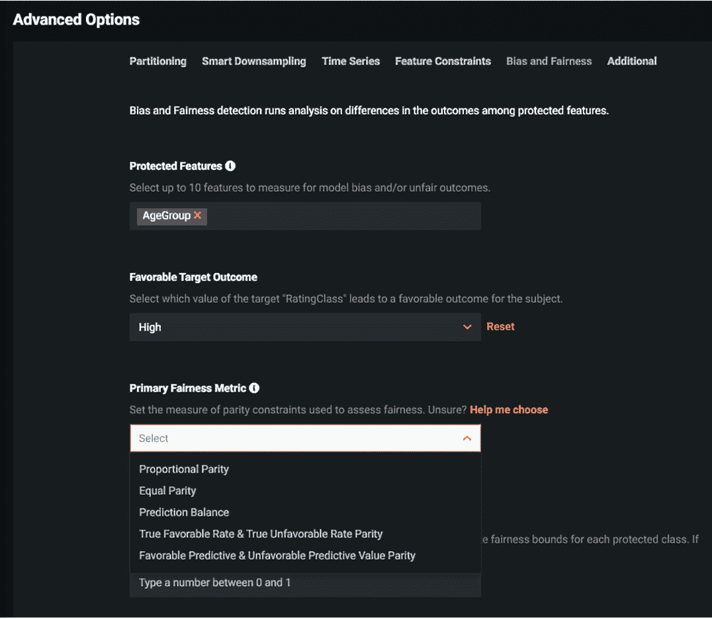

    图 13.1 – 在模型开发过程中配置偏差和公平性

1.  接下来，`RatingClass`级别的`High`。这使能够测量目标变量这一级别的偏差。

1.  `比例性公平性`、`等比例公平性`、`预测平衡`、`真实有利率与真实不利率公平性`，以及`有利预测值与不利预测值公平性`。

1.  如果用户不确定要选择哪个指标，他们可以点击**帮助我选择**，这将呈现进一步的问题集。回答这些问题将展示一个**公平性指标**值的推荐，如图*图 13.2*所示：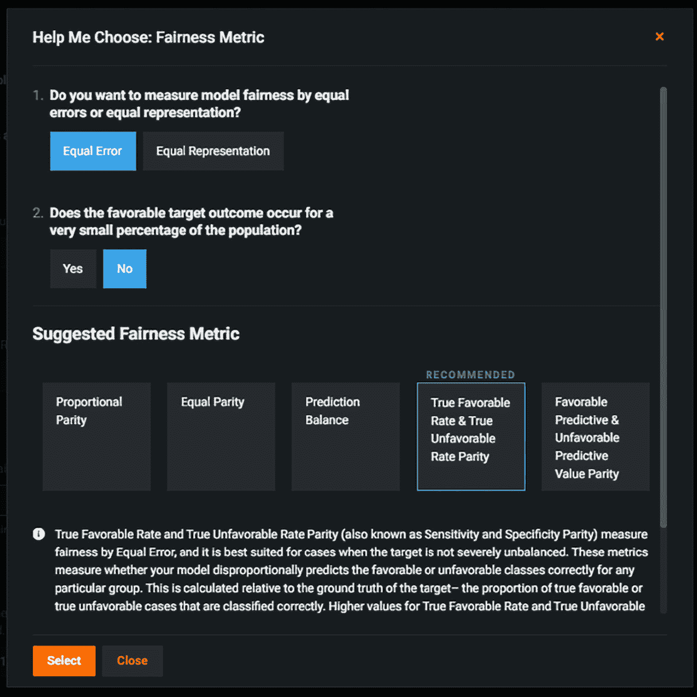

    图 13.2 – 公平性指标推荐

    在选择我们的指标时，因为我们非常关注模型在年龄组成员资格上的预测准确性相似，所以我们选择了如何衡量模型公平性的**相等误差**选项。由于我们的结果分布在高和低之间相对平衡，我们选择**否**回答**有利目标结果是否只发生在极少数人口中？**的问题。在此之后，DataRobot 建议**真实有利率与真实不利率公平性**。在整个过程中，平台提供了选项的描述，并展示了推荐指标以及其他指标的说明。

1.  在*图 13.3*中点击`AgeGroup` `Light Gradient Boosting on Elastic Predictions`模型，其得分低于默认阈值：

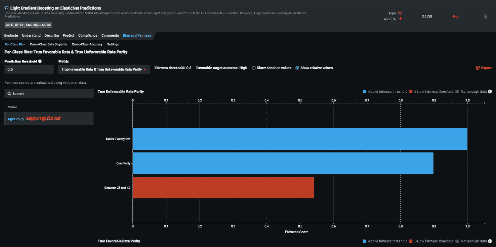

图 13.3 – 每个类别的偏差探索

根据这一结果，模型在预测`25 至 40 岁`类别中个体真实不利结果（低评级）的准确性低于其他两个类别。该类别的得分低于默认的 80%阈值。对于`25 至 40 岁`类别，应用了默认的 80%阈值。*图 13.4*展示了如何使用一组更全面的准确性指标**交叉类别准确性**来评估受保护类别的准确性：

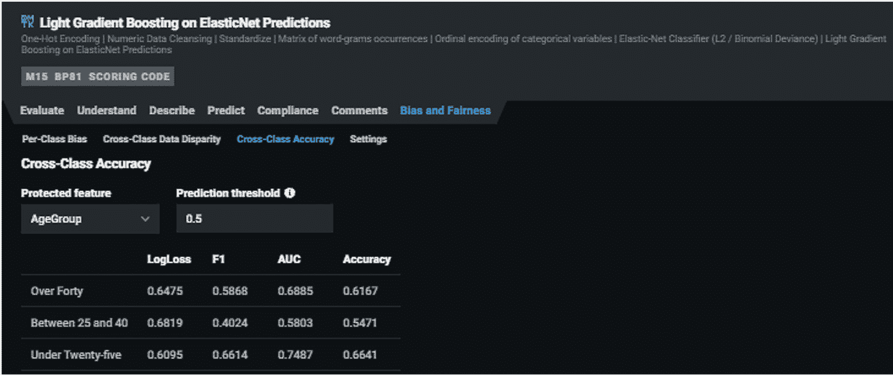

图 13.4 – 交叉类别准确性检查

`AgeGroup`类别。正如*图 13.4*所示，模型的准确性似乎在所有准确性指标上都低于`25 至 40 岁之间`类别。因为，正如之前提到的，当模型是有利类别时，它在各个类别中的表现相似，只有`25 至 40 岁之间`类别的不利结果的较低真实率似乎影响了模型的公平性。因为模型从历史数据中学习，探索可能导致这种偏差的特征可能对采取进一步行动至关重要。*图 13.5*显示了**交叉类别数据差异**功能，它深入探讨了为什么机器学习模型中存在偏差：

![图 13.5 – 两个年龄组之间的交叉类别数据差异比较]

![img/B17159_13_05.jpg]

图 13.5 – 两个年龄组之间的交叉类别数据差异比较

为了探索模型偏差背后的原因，`年龄组`特征似乎影响了模型的准确性。这是因为`年龄组`作为预测变量，与其他变量相比将具有最大的差异，因为它与预测变量相同。`年份`特征的数据差异较低，但比`年龄组`特征更重要。进一步考察右手图表（*图 13.6*）中年份的分布显示，与`25 至 40 岁之间`组相比，较老的书和缺失年份的书似乎被`四十岁以上`组评价得更多。相反，`25 至 40 岁之间`的群体似乎评价了比他们年长的对手更多的新书。

当模型偏差超过企业设定的阈值时，需要采取措施来管理这种不公平性。解决这种不公平性的选项包括删除可能导致偏差的特征、重新训练模型，或者改变模型以使其更符合伦理。大多数情况下，这些变化最终会影响模型的总体准确性。然而，在我们的例子中，`Light Gradient Boosting on Elastic Predictions`并不是我们表现最好的模型。DataRobot 在其偏差和公平性工具包中具有**偏差与准确性**排行榜比较功能（见*图 13.6*）：

![图 13.6 – 偏差与准确性排行榜]

![img/B17159_13_06.jpg]

图 13.6 – 偏差与准确性排行榜

使用训练计划的`Keras 残差 AutoInt 分类器`是最准确模型，并且达到了伦理阈值。在这种情况下，这个模型可以被部署到生产环境中。需要注意的是，基于神经网络的模型目前通常不被许多监管机构接受，但这种情况在未来可能会改变。

预计涉及评估 ML 模型偏差和公平性的流程将集成到数据科学工作流程中，以确保模型结果支持公平的过程。随着关于道德 AI 的对话在各个行业变得更加普遍，这一点变得更加重要。在探讨了确保模型公平的方法之后，我们现在将进入下一节，讨论部署公平模型、监控生产中的模型性能以及实施 MLOps 的其他方面。

# 实施 MLOps

通过其 MLOps 套件，DataRobot 提供了能力，不仅使用户能够在生产中部署模型，还能治理、监控和管理生产中的模型。在之前的章节中，我们探讨了如何在平台上部署模型以及使用 Python API 客户端。MLOps 提供了一种自动化的模型监控能力，该能力跟踪生产中模型的健康状态、准确性和数据漂移。生产模型的实时自动化监控确保了模型具有高质量的输出。此外，当出现性能下降时，相关利益相关者会收到通知，以便采取行动。

在本节中，我们将关注本书第八章“模型评分和部署”中未涉及到的模型监控方面。我们探讨了如何检查部署服务的质量，以及通过服务健康和数据漂移能力，随着时间的推移，训练数据和预测数据之间底层特征分布的变化。随着时间的推移，包含目标变量的最新数据被引入到部署中。DataRobot 随后可以检查模型的初始预测并建立模型在生产中的实际准确度。DataRobot 还提供了在生产中切换不同模型的能力。本节重点介绍生产模型准确度的评估、设置通知以及在生产中切换模型。

如你现在所猜到的，数据科学团队的工作在模型部署后并没有结束。我们现在必须监控我们的模型。在参与有关模型监控的对话之前，我们需要控制个人可以对那些部署做什么。利益相关者的角色和责任是 MLOps 治理的重要方面。成功实施 ML 解决方案取决于对角色和利益相关者在 ML 模型生产生命周期中实际职责的明确定义。正如*图 13.7*所强调的，当部署与其他利益相关者共享时，每个利益相关者都会被赋予一个角色，该角色定义了他们对该部署的访问级别：

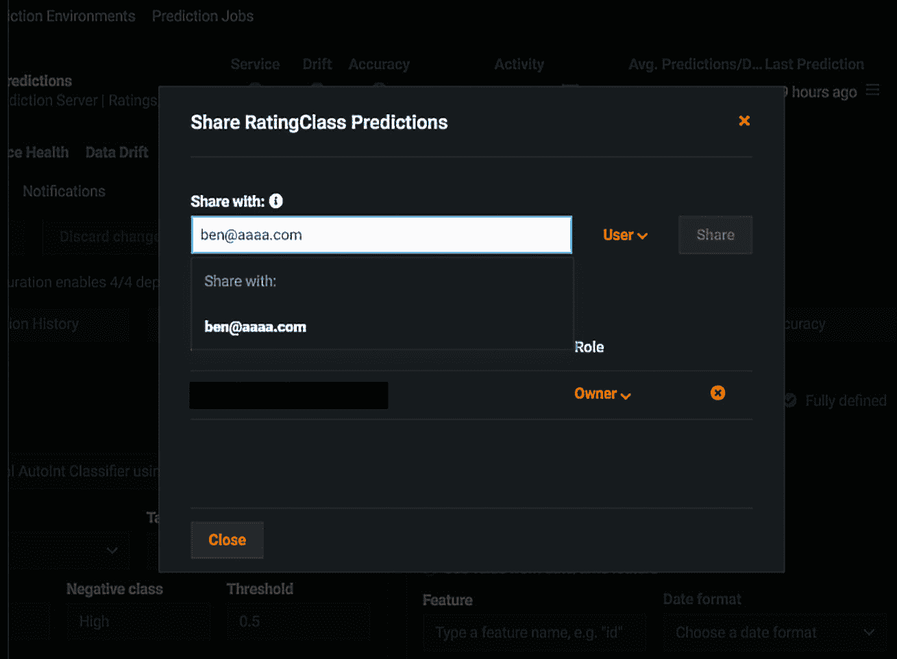

图 13.7 – 部署共享

要打开部署共享窗口（如图 13.7 所示），在模型部署后，选中右上角的部署操作按钮（三横线图标）。然后，选择**共享**。在这里，这个**RatingClass Predictions**部署与一个利益相关者共享，ben@aaaa.com。重要的是，这个人被赋予了**用户**的角色。拥有**用户**角色，这个利益相关者可以读写。实际上，他们可以查看部署，消费预测，查看部署库存，使用 API 获取数据，并将其他用户添加到部署中。**所有者**级别有额外的管理权限，可以执行业务关键操作，例如删除部署，替换模型，以及编辑部署元数据。最低的用户角色是**消费者**，它只允许利益相关者通过 API 路由消费预测。

生产模型监控确保模型在开发期间预期的高质量业务影响持续得到实现。这种质量的下降是生产数据分布变化或特征影响内生变量的程度变化的结果。例如，使用量的变化会影响客户流失，这是企业的一个重要变量。在假日期间，流失的预测会更高。如果企业没有预料到这种分布或数据漂移的变化，这种流失预测的波动会让他们感到担忧。同样，预测变量影响业务结果的程度也可能发生变化。一个例子是价格对购买倾向的影响。在大流行高峰期，个人在非必需品的购买上要保守得多。现在，想象一下在大流行之前为非必需品构建的购买倾向模型在生产中的准确性。很容易看出，模型的准确性将在生产中迅速下降，从而对业务绩效产生重大影响。这种情况下，需要监控模型部署后的性能。

在*第八章*“模型评分和部署”中，我们讨论了数据漂移，它检查训练集和生成集之间的分布变化，同时考虑到其特征重要性。在这里，我们的重点将转移到监控生产中变量对结果的影响。这种影响的变化可以通过监控生产模型的准确性来确定，这是 DataRobot 提供的一项功能。作为**部署设置**窗口的一部分，如图 13.8 所示，有一个**准确性**选项卡：

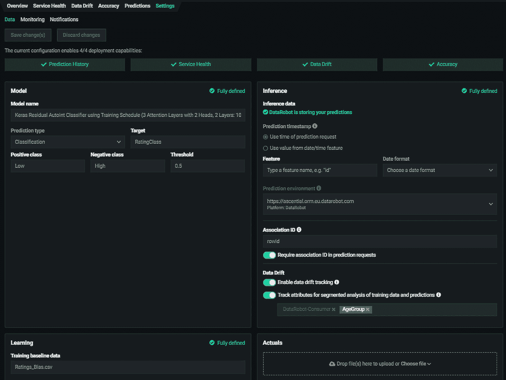

图 13.8 – 准确性设置部署窗口

**准确性**选项卡提供了对生产模型准确性的洞察。此功能使用户能够检查其生产模型随时间的变化性能。为了计算生产模型的准确性，需要提供实际结果。在上传实际结果后，为了生成准确性，需要完成一系列字段。这些包括**实际响应**和**关联 ID**字段，以及可选的**是否采取行动**和**时间戳**（参见*图 13.9*）：

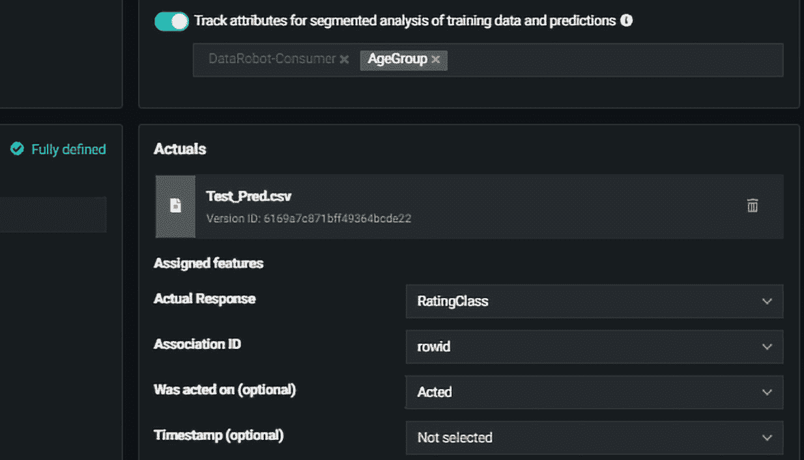

图 13.9 – 准确性设置功能

`RatingClass`。为了将其与先前的预测数据集链接，本例中的`rowid`被请求以启用此连接。需要注意的是，有时由于模型的预测结果，业务可能会采取行动，这最终可能影响结果。为了在计算准确性时考虑这种可能性，可选地请求**是否采取行动**和**时间戳**变量（参见*图 13.10*以选择这些特征）：

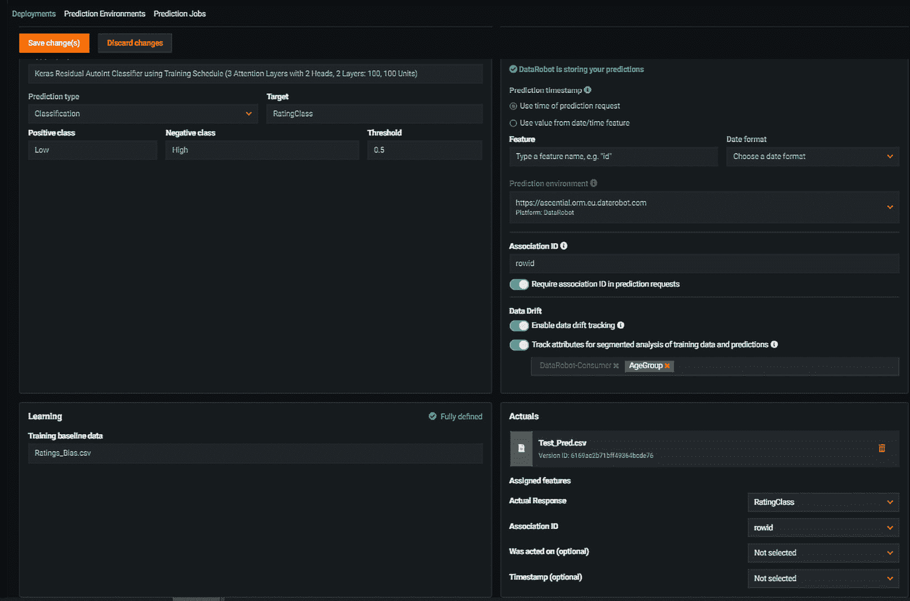

图 13.10 – 生产准确性识别特征选择

在选择必填变量后，点击**保存**按钮。这启动了计算，之后打开**准确性**窗口，显示模型的生成准确性。生产模型的性能以瓷砖和图形时间序列的形式呈现。*图 13.11*展示了**部署准确性**窗口。选择了**LogLoss**、**AUC**、**准确性**、**Kolmogorov-Smirmov**和**Gini Norm**指标瓷砖。**开始**显示了在开发过程中模型对保留数据集的性能。看起来这个模型在生产中的表现比在训练中更好。通过自定义瓷砖，可以选择其他指标及其顺序。**随时间变化的准确性**图显示了模型准确性随时间的变化情况。图上最左边的绿色点表示在开发过程中模型对保留数据集的准确性：

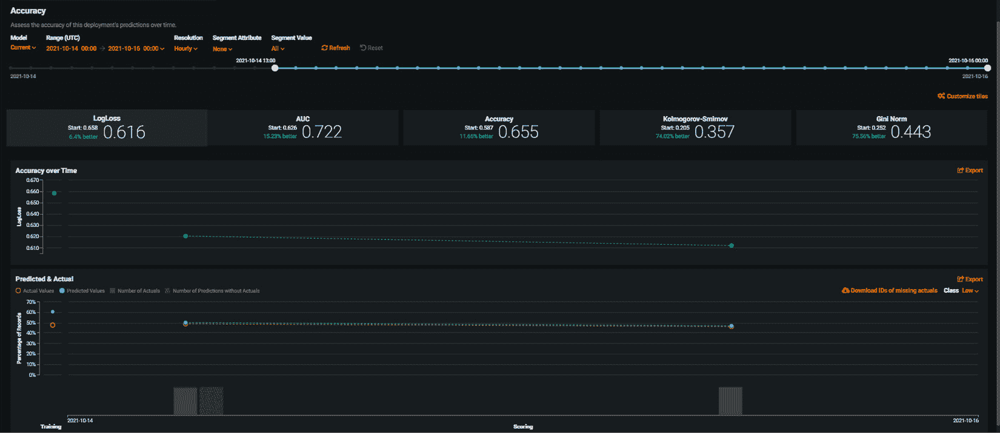

图 13.11 – 随时间推移的生产模型性能评估

`低`。有一个选项可以更改正在探索的类别。需要注意的是，使用这些选项，可以监控模型在 `AgeClass` 保护变量不同级别上的准确性。这可以通过在 **段属性** 选项中选择 `AgeClass`，然后在 **段值** 字段中选择任一级别来实现。在当前场景中，生产准确性反映了数据漂移的情况，因此可以配置通知，以便在指标以对业务产生不利影响的方式偏离时通知利益相关者。在下一节中，我们将介绍这些通知，以及如何在部署中更改模型。

# 生产中的通知和更改模型

在本章中，我们讨论了模型商业影响可能衰减的原因以及如何在 DataRobot 平台上跟踪这种影响。在端到端预测过程完全自动化且人类干预有限的情况下，确保有系统通知利益相关者生产模型性能的任何重大变化变得至关重要。DataRobot 可以发送关于服务健康、数据漂移和准确性的重大变化的通知。这些通知可以在 **部署** 窗口中设置和配置：

1.  从 **设置** 选项卡中选择 **通知**。如图 *图 13.12* 所示，提供了三个选项：发送所有事件的通知、发送关键事件的通知以及不发送任何通知。所有事件的通知通过电子邮件发送；所有部署更改都会发送给所有者：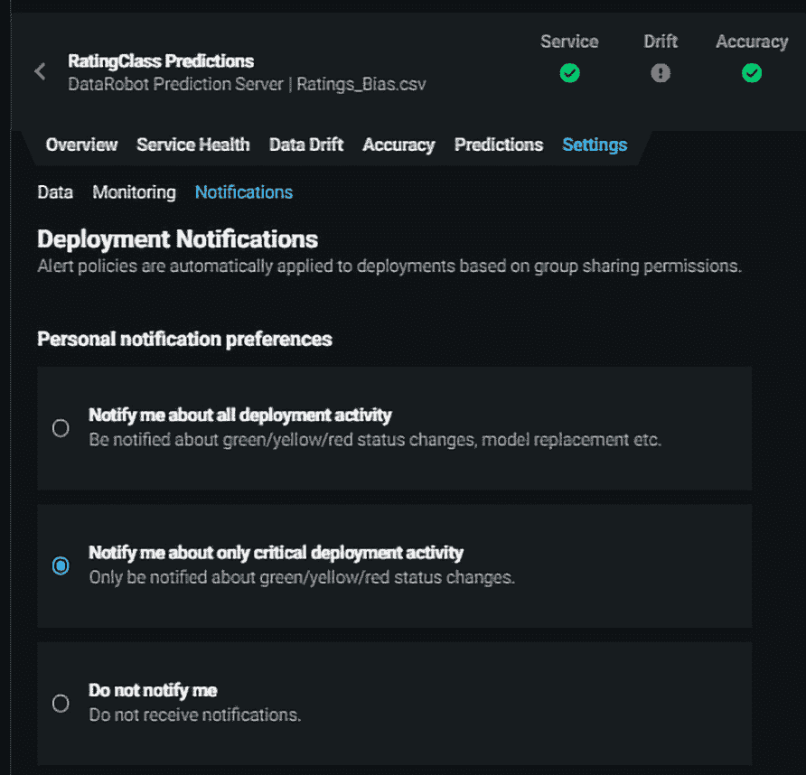

    图 13.12 – 部署通知设置

    在 *图 13.12* 中，通知被设置为仅通知我有关关键部署活动。这种设置意味着当部署过程中发生关键活动时，利益相关者会被通知。

1.  `1:00`。有选项可以设置通知在每小时到每季度监控周期之间发生。当复选框未选中时，通知被禁用：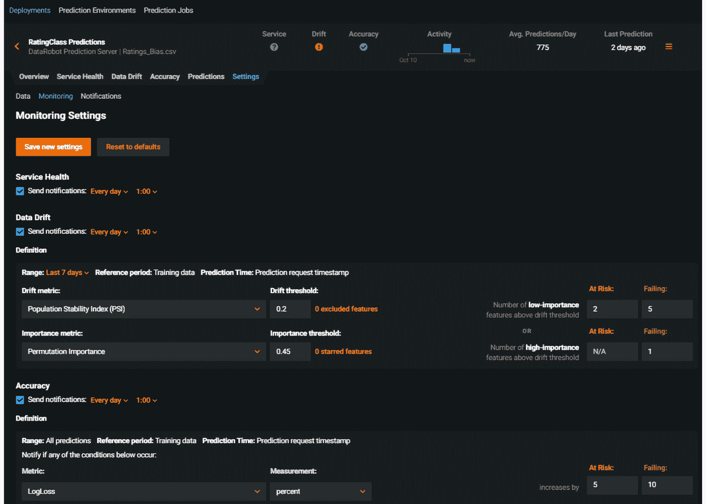

    图 13.13 – 监控通知设置

1.  `过去 7 天` 的通知，意味着将前七天的数据分布与训练数据进行比较。

1.  作为特征漂移指标，`0.2`。一些特征可以通过使用 `0.45` 作为 `0.45` 的漂移值来排除在漂移跟踪之外，如果这些值被认为超过 `0.2`。

    b. 当五个或更多低重要性特征出现显著漂移时，未能发送通知

    c. 当一个或多个高重要性特征出现 `0.45` 的漂移时，未能发送通知

1.  与 `AUC`、`Accuracy`、`Balance Accuracy`、`LogLoss` 和 `FVE Binomial` 等相关的通知。在这种情况下，选择了 `Logloss`。

    b. 选择 `percent` 变化。

    c. 然后为`每天`的`1:00`设置规则。这些可以配置为每天到每季度之间的任何频率。

1.  在此设置完成后，点击**保存新设置**按钮激活通知程序。然而，值得注意的是，任何有权访问部署的利益相关者都可以配置他们想要接收的通知。当模型的变化变得重要时，可能有必要在部署中替换模型。

    生产模型的性能往往会随着时间的推移而下降。这引发了替换部署中模型的需求。在 MLOps 提供的服务中，DataRobot 提供了模型替换功能。要更改部署中的模型，您需要导航到**部署概述**窗口。从**部署概述**窗口右侧的**操作**按钮中选择**替换模型**选项（见*图 13.14*）：

1.  点击**替换模型**选项会显示一个**粘贴 DataRobot 模型 URL**请求。此 URL 是新模型可以找到的位置，当从排行榜打开时：![Figure 13.14 – Production model replacement

    ![img/B17159_13_14.jpg]

    图 13.14 – 生产模型替换

1.  当涉及到`准确度`、`数据漂移`、`错误`、`计划刷新`和`评分速度`时。如图*图 13.15*所示，在这种情况下选择了`数据漂移`。

1.  最后，点击**接受并替换**：

![Figure 13.15 – Selecting the rationale for model replacement

![img/B17159_13_15.jpg]

图 13.15 – 选择模型替换的理由

在部署中替换了模型后，未来从这个部署中得出的预测将使用更新后的模型。重要的是要强调，模型替换只能由部署所有者执行。在某些情况下，模型的商业影响是显著的。在这种情况下，在切换模型之前，建议在合成或模拟环境中测试新模型或挑战者模型。在典型的数据科学工作流程中，冠军/挑战者模型场景已经建立。在这里，挑战者模型计算预测，并将它们的性能与生产中的冠军模型进行比较。在完成测试和影响分析后，我们现在可以部署我们的模型。DataRobot 为数据科学家提供了在冠军模型仍在生产中时测试多个挑战者模型的能力。这简化了当需要替换模型时的模型选择过程。

MLOps 还提供了让不同利益相关者审查模型变化的能力。为了实现这一点，模型在其部署中分配了重要性级别。这些重要性级别取决于模型结果对业务战略商业影响的程度、预测量以及监管期望。这些重要性级别随后驱动谁需要在实施之前审查部署的变化。

# 摘要

在本章中，我们强调了建立指导企业中 ML 模型使用的框架的价值。ML 治理能力支持用户确保 ML 模型在满足监管期望的同时继续创造商业价值。此外，我们还为不同级别的利益相关者设置了与 ML 部署相关的控制措施。在某些行业中，有必要认真考虑任何决策过程中偏差的影响。由于 ML 模型基于可能受到人类偏差影响的数据，这些模型可能会放大这种偏差。因此，我们探讨了在模型开发和之后如何减轻 ML 偏差的方法。

我们还考察了特征对结果变量的影响。这些变化可能对商业结果产生关键影响，因此需要监控模型结果在生产中的性能。在本章中，我们探讨了如何评估模型性能随时间的变化。重要的是，我们学习了如何在数据漂移或/和模型准确性发生显著变化时配置通知。此外，我们还考察了在生产中如何根据需要将模型切换到挑战者模型。

我们还强调了本章未深入探讨的一些其他 MLOps 功能。在下一章中，我们将探讨我们认为 DataRobot 和自动化机器学习未来的前景。鉴于这本书并非全面涵盖 DataRobot，且该平台持续扩展其功能，在下一章中，我们将指出一些可以获取更多开发信息的地方。
