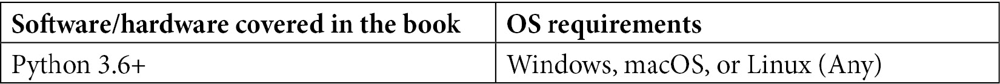

# 前言

机器学习任务的自动化使开发者有更多时间专注于由机器学习模型驱动的软件的可用性和响应性。TPOT 是一个用于使用遗传编程优化机器学习管道的 Python 自动化机器学习工具。使用 TPOT 自动化机器学习使个人和公司能够比传统方法更快、更便宜地开发生产就绪的机器学习模型。

通过这本 AutoML 实用指南，使用 Python 进行机器学习任务的开发者将能够将他们的知识付诸实践，并迅速变得高效。你将采用动手的方式来学习 AutoML 的实现及其相关方法。本书包含对基本概念的逐步解释、实际示例和自我评估问题，将向你展示如何构建自动化分类和回归模型，并将它们的性能与自定义构建的模型进行比较。随着你的进步，你还将使用仅几行代码开发最先进的模型，并看到这些模型如何在同一数据集上优于你之前的所有模型。

到这本书的结尾，你将获得信心，在生产级别上在你的组织中实施 AutoML 技术。

# 本书面向对象

对于新接触机器学习并希望在他们的应用中使用它的数据科学家、数据分析师和软件开发者，这本书将非常有用。这本书也适合希望使用机器学习自动化业务任务的企业用户。要开始，需要具备 Python 编程语言的工作知识以及机器学习的入门级理解。

# 本书涵盖内容

*第一章*，*机器学习和自动化理念*，简要介绍了机器学习，分类和回归任务之间的区别，自动化概述及其必要性，以及 Python 生态系统中的机器学习选项。

*第二章*，*深入 TPOT*，提供了 TPOT 是什么以及不是的深入概述，如何使用它来处理机器学习中的自动化，以及它可以自动化的任务类型。本章还将指导你设置编程环境。

*第三章*，*使用 TPOT 探索回归*，介绍了 TPOT 在回归任务中的应用。你将学习如何将自动化算法应用于数据，以及如何探索你的数据集。

*第四章*，*使用 TPOT 探索分类*，介绍了 TPOT 在分类任务中的应用。你将学习如何进行基本的数据探索性分析、准备数据、训练自动化模型，并将这些自动化模型与 scikit-learn 的默认模型进行比较。

*第五章*, *使用 TPOT 和 Dask 进行并行训练*，介绍了使用 Python 和 Dask 库进行并行编程的基础知识。您将学习如何使用 Dask 以并行方式训练自动化模型。

*第六章*, *深度学习入门：神经网络速成课程*，涵盖了深度学习背后的基本概念，例如神经元、层、激活函数和人工神经网络。

*第七章*, *使用 TPOT 的神经网络分类器*，提供了一个逐步指南，用于实现一个完全自动化的神经网络分类器、数据集探索、模型训练和评估。

*第八章*, *TPOT 模型部署*，带您通过模型部署的逐步指南。您将学习如何使用 Flask 和 Flask-RESTful 构建一个 REST API，然后在本地和 AWS 上部署。

*第九章*, *在生产中使用部署的 TPOT 模型*，涵盖了在笔记本环境和简单 Web 应用程序中使用部署的模型的方法。

# 要充分利用本书

您需要在您的计算机上安装 Python 3.6 或更高版本。本书的代码在 Python 3.8.x 上进行了测试，但任何高于 3.6 的版本都应该工作良好。本书不是针对特定操作系统的，因为所有代码都将独立于操作系统工作。然而，请记住，大部分代码最初是在 macOS 上运行的。



您不需要任何高级或授权软件来跟随本书。每个库都是完全开源的。

**如果您正在使用本书的数字版，我们建议您亲自输入代码或通过 GitHub 仓库（下一节中提供链接）访问代码。这样做将帮助您避免与代码复制和粘贴相关的任何潜在错误。**

# 下载示例代码文件

您可以从 GitHub 下载本书的示例代码文件：[`github.com/PacktPublishing/Machine-Learning-Automation-with-TPOT`](https://github.com/PacktPublishing/Machine-Learning-Automation-with-TPOT)。如果代码有更新，它将在现有的 GitHub 仓库中更新。

我们还有其他来自我们丰富的图书和视频目录的代码包，可在[`github.com/PacktPublishing/`](https://github.com/PacktPublishing/)找到。查看它们吧！

# 下载彩色图像

我们还提供了一个包含本书中使用的截图/图表的彩色图像的 PDF 文件。您可以从这里下载：[`static.packt-cdn.com/downloads/9781800567887_ColorImages.pdf`](https://static.packt-cdn.com/downloads/9781800567887_ColorImages.pdf)

# 使用的约定

本书使用了多种文本约定。

`文本中的代码`：表示文本中的代码单词、数据库表名、文件夹名、文件名、文件扩展名、路径名、虚拟 URL、用户输入和 Twitter 昵称。以下是一个示例：“将下载的`WebStorm-10*.dmg`磁盘映像文件作为您系统中的另一个磁盘挂载。”

代码块设置如下：

```py
output = (inputs[0] * weights[0] + 
          inputs[1] * weights[1] + 
          inputs[2] * weights[2] +
          inputs[3] * weights[3] +
          inputs[4] * weights[4] + 
          bias)
output
```

当我们希望您注意代码块中的特定部分时，相关的行或项目会被设置为粗体：

```py
CPU times: user 26.5 s, sys: 9.7 s, total: 36.2 s
Wall time: 42 s
```

任何命令行输入或输出都应如下编写：

```py
pipenv install "dask[complete]"
```

小贴士或重要注意事项

看起来是这样的。

# 联系我们

我们欢迎读者的反馈。

**一般反馈**：如果您对本书的任何方面有疑问，请在邮件主题中提及书名，并通过 customercare@packtpub.com 将邮件发送给我们。

**勘误表**：尽管我们已经尽最大努力确保内容的准确性，但错误仍然可能发生。如果您在这本书中发现了错误，我们将不胜感激，如果您能向我们报告，请访问[www.packtpub.com/support/errata](http://www.packtpub.com/support/errata)，选择您的书籍，点击勘误表提交表单链接，并输入详细信息。

**盗版**：如果您在互联网上以任何形式发现我们作品的非法副本，如果您能提供位置地址或网站名称，我们将不胜感激。请通过版权@packt.com 与我们联系，并提供材料的链接。

**如果您有兴趣成为作者**：如果您在某个领域有专业知识，并且您有兴趣撰写或为书籍做出贡献，请访问[authors.packtpub.com](http://authors.packtpub.com)。

# 评论

请留下评论。一旦您阅读并使用过这本书，为何不在购买它的网站上留下评论呢？潜在读者可以查看并使用您的客观意见来做出购买决定，我们 Packt 公司可以了解您对我们产品的看法，我们的作者也可以看到他们对书籍的反馈。谢谢！

想了解更多关于 Packt 的信息，请访问[packt.com](http://packt.com)。
