# 第四章：使用 TPOT 探索分类

在本章中，你将继续学习自动化机器学习的实际示例。你将通过三个完整的数据集，学习如何以自动化的方式使用 TPOT 处理分类任务。

我们将涵盖如数据集加载、清理、必要的数据准备和探索性数据分析等基本主题。然后，我们将深入探讨使用 TPOT 的分类。你将学习如何训练和评估自动化分类模型。

在自动训练模型之前，你将看到如何通过基本分类算法，如逻辑回归，获得良好的模型。这个模型将作为 TPOT 需要超越的基准。

本章将涵盖以下主题：

+   将自动化分类建模应用于 Iris 数据集

+   将自动化分类建模应用于 Titanic 数据集

# 技术要求

为了完成本章，你需要在计算机上安装 Python 和 TPOT。有关环境设置的详细说明，请参阅*第二章*，*深入 TPOT*。如果你对分类的概念完全陌生，请参阅*第一章*，*机器学习和自动化思想*。

你可以在此处下载本章的源代码和数据集：[`github.com/PacktPublishing/Machine-Learning-Automation-with-TPOT/tree/main/Chapter04`](https://github.com/PacktPublishing/Machine-Learning-Automation-with-TPOT/tree/main/Chapter04)

# 将自动化分类模型应用于 Iris 数据集

让我们从最基础的、最基本的数据集之一——Iris 数据集([`en.wikipedia.org/wiki/Iris_flower_data_set`](https://en.wikipedia.org/wiki/Iris_flower_data_set))开始。这里的挑战不是构建一个自动化模型，而是构建一个能够超越基准模型的模型。Iris 数据集如此简单，以至于即使是最基本的分类算法也能达到高准确率。

由于这个原因，你应该在这个部分专注于掌握分类的基础知识。你将有足够的时间担心性能问题：

1.  与回归部分一样，你应该做的第一件事是导入所需的库并加载数据集。一开始你需要`n`umpy`、`pandas`、`matplotlib`和`seaborn`。导入`matplotlib.rcParams`模块以调整默认样式。

    下面是库导入和数据集加载的代码片段：

    ```py
    import numpy as np
    import pandas as pd
    import matplotlib.pyplot as plt
    import seaborn as sns
    from matplotlib import rcParams
    rcParams['axes.spines.top'] = False
    rcParams['axes.spines.right'] = False
    df = pd.read_csv('data/iris.csv')
    df.head()
    ```

    下面是`head()`函数返回的输出：

    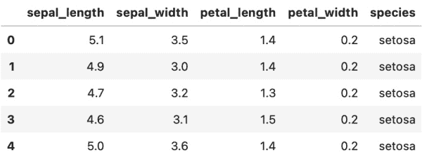

    图 4.1 – Iris 数据集的头部

    太好了——这正是我们开始所需的。

1.  下一步是检查数据质量是否足够好，可以传递给机器学习算法。这里的第一个步骤是检查缺失值。以下代码片段正是这样做的：

    ```py
    df.isnull().sum()
    ```

    输出显示在以下图中：

    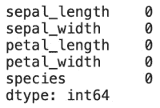

    图 4.2 – 爱丽丝数据集每列缺失值计数

    看起来没有缺失值，因此我们可以继续。

1.  现在我们来检查目标变量的类别分布。这指的是属于每个类别的实例数量——在这个例子中是`setosa`、`virginica`和`versicolor`。已知如果存在严重的类别不平衡，机器学习模型的表现会较差。

    以下代码片段可视化类别分布：

    ```py
    ax = df.groupby('species').count().plot(kind='bar', figsize=(10, 6), fontsize=13, color='#4f4f4f')
    ax.set_title('Iris Dataset target variable distribution', size=20, pad=30)
    ax.set_ylabel('Count', fontsize=14)
    ax.set_xlabel('Species', fontsize=14)
    ax.get_legend().remove()
    ```

    可视化显示在以下图中：

    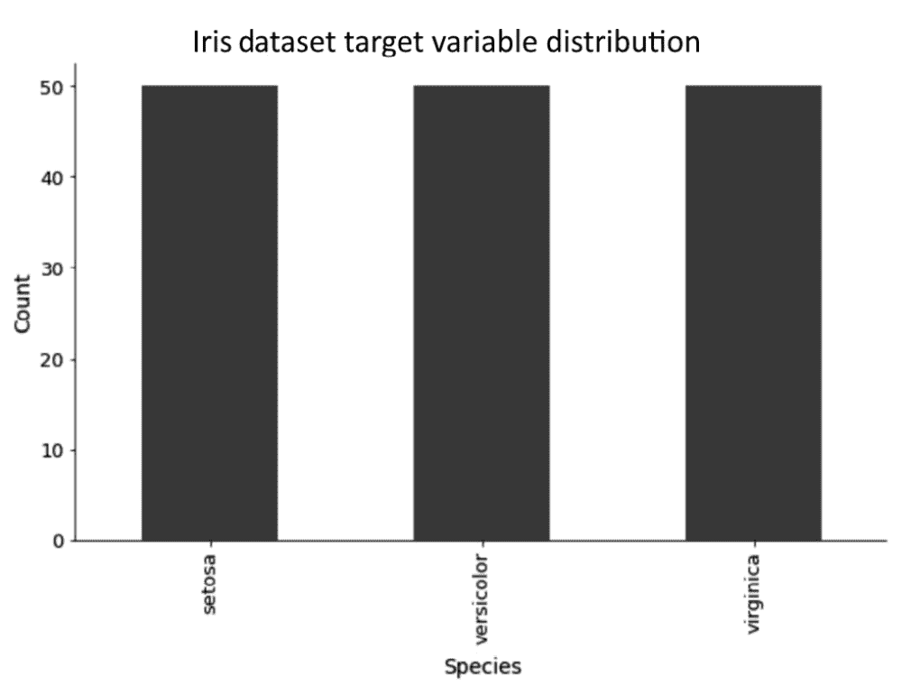

    图 4.3 – 爱丽丝数据集目标变量分布

    爱丽丝数据集非常完美——所以，在准备方面，我们再次没有什么可做的。

1.  数据探索分析和准备的最后一步是检查相关性。特征之间的高度相关性通常意味着数据集中存在一些冗余，至少在某种程度上。

    以下代码片段绘制了一个带有注释的相关矩阵：

    ```py
    plt.figure(figsize=(12, 9))
    plt.title('Correlation matrix', size=20)
    sns.heatmap(df.corr(), annot=True, cmap='Blues');
    ```

    相关矩阵显示在以下图中：

    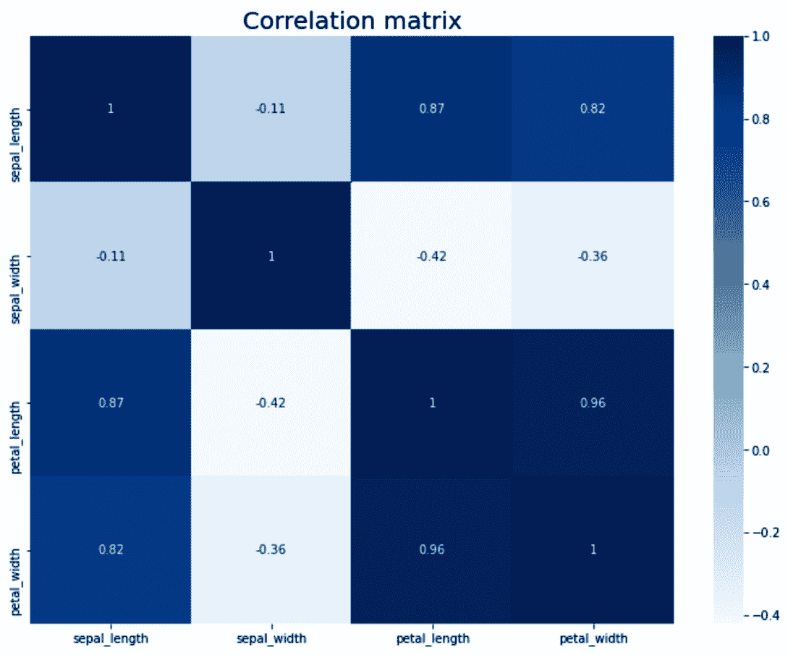

    图 4.4 – 爱丽丝数据集的相关矩阵

    如预期的那样，大多数特征之间存在强烈的关联。

    现在，你已经熟悉了爱丽丝数据集，这意味着我们可以继续进行建模。

1.  首先，让我们使用逻辑回归算法构建一个基线模型。它将作为一个起始模型，TPOT 需要超越它。

    该过程的第一步是训练/测试集划分。下面的代码片段正是这样做的，并且还打印了两个集合中的实例数量：

    ```py
    from sklearn.model_selection import train_test_split
    X = df.drop('species', axis=1)
    y = df['species']
    X_train, X_test, y_train, y_test = train_test_split(
        X, y, test_size=0.25, random_state=3
    )
    y_train.shape, y_test.shape
    ```

    实例数量显示在以下图中：

    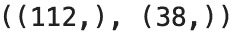

    图 4.5 – 训练集和测试集中的实例数量

    接下来，让我们构建基线模型。

1.  如前所述，我们将使用逻辑回归来完成这项工作。下面的代码片段拟合了一个逻辑回归模型，在测试集上进行了预测，并打印了实际值和预测值的混淆矩阵：

    ```py
    from sklearn.linear_model import LogisticRegression
    from sklearn.metrics import confusion_matrix
    lm = LogisticRegression(random_state=42)
    lm.fit(X_train, y_train)
    lm_preds = lm.predict(X_test)
    print(confusion_matrix(y_test, lm_preds))
    ```

    相应的混淆矩阵显示在以下图中：

    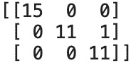

    ```py
    from sklearn.metrics import accuracy_score
    print(accuracy_score(y_test, lm_preds))
    ```

    准确率得分显示在以下图像中：

    

    图 4.7 – 使用逻辑回归在爱丽丝数据集测试集上的准确率

    如此一来——97%的准确率，并且只有一个错误分类，这是使用最简单的分类算法。让我们看看 TPOT 是否能在下一步超越它。

1.  让我们接下来构建一个自动分类模型。我们将优化准确率并训练 10 分钟——类似于我们在*第三章*，*使用 TPOT 探索回归*中所做的。下面的代码片段导入 TPOT，实例化一个管道优化器，并在训练数据集上训练模型：

    ```py
    from tpot import TPOTClassifier
    pipeline_optimizer = TPOTClassifier(
        scoring='accuracy',
        max_time_mins=10,
        random_state=42,
        verbosity=2
    )
    pipeline_optimizer.fit(X_train, y_train)
    ```

    TPOT 在我的机器上成功拟合了 18 代，如下所示：

    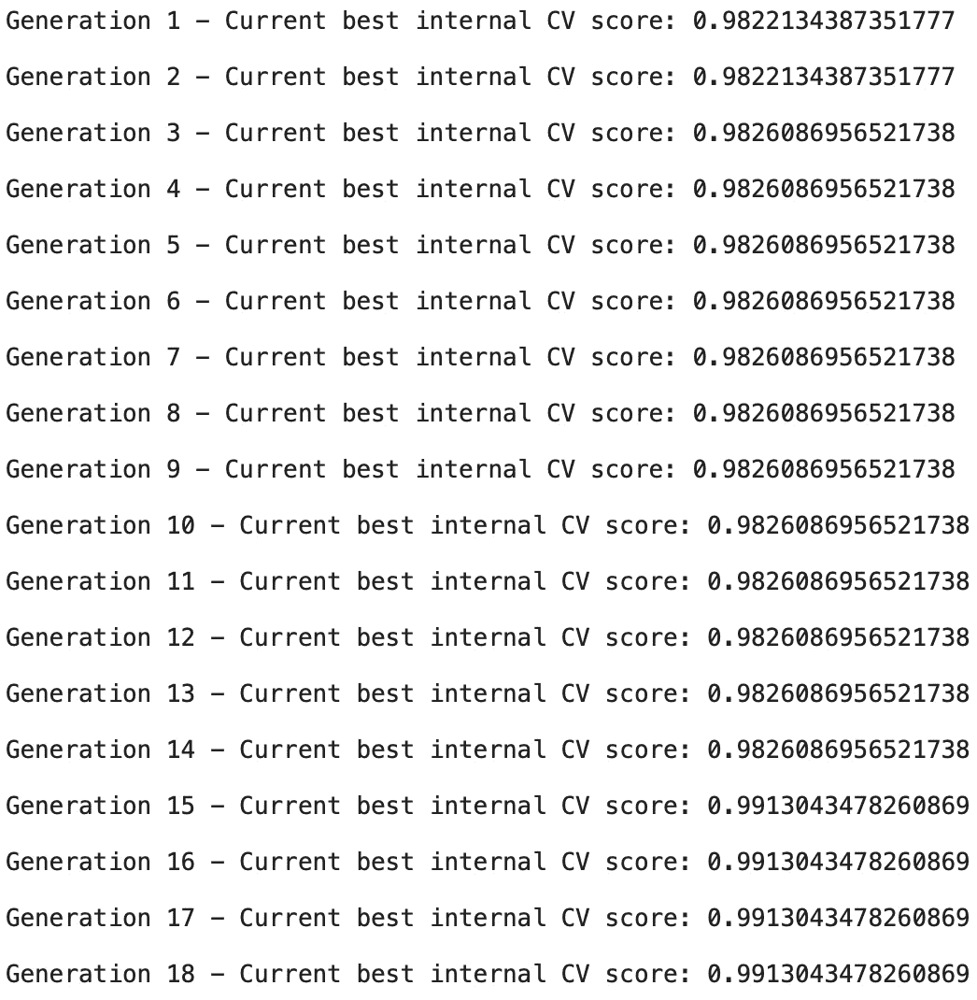

    图 4.8 – 对 Iris 数据集进行 TPOT 管道优化的输出

1.  让我们看看训练一个自动模型是否能够提高准确性。您可以使用以下代码片段来获取准确率分数：

    ```py
    tpot_preds = pipeline_optimizer.predict(X_test)
    accuracy_score(y_test, tpot_preds)
    ```

    准确率分数如下所示：

    

    图 4.9 – 使用自动模型对 Iris 数据集测试集的准确性

    如您所见，测试集上的准确率没有提高。如果您绘制目标变量和特征之间的散点图，您会看到*virginica*和*versicolor*类之间有一些重叠。这很可能是这种情况，而且无论训练多久都无法正确分类这个单独的实例。

1.  这里只剩下两件事要做，而且都是可选的。第一件事是查看 TPOT 在 10 分钟训练后宣布的最佳管道。以下代码片段将输出该管道到控制台：

    ```py
    pipeline_optimizer.fitted_pipeline_
    ```

    相应的管道如下所示：

    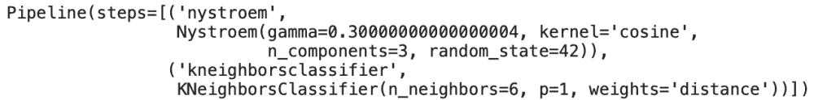

    图 4.10 – Iris 数据集的优化 TPOT 管道

1.  如同往常，您也可以使用`export()`函数导出管道：

    ```py
    pipeline_optimizer.export('iris_pipeline.py')
    ```

    整个 Python 代码如下所示：

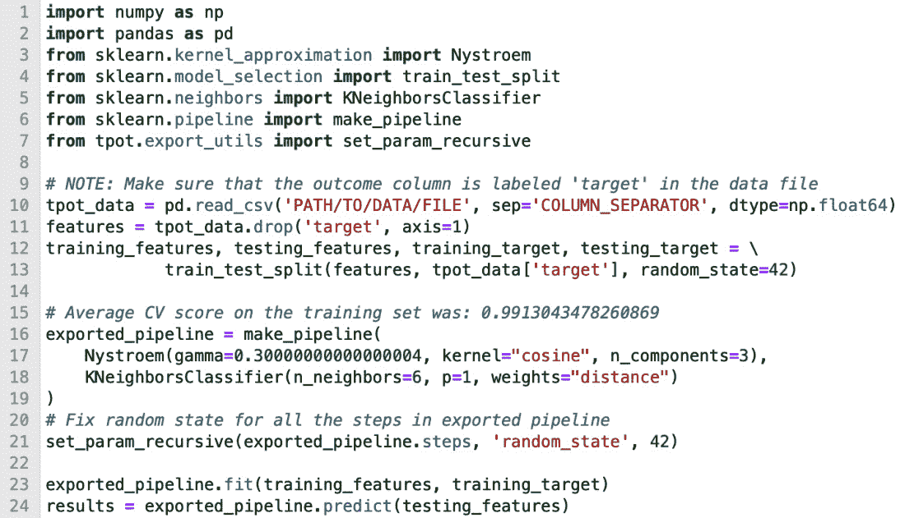

图 4.11 – Iris 数据集优化 TPOT 管道的 Python 代码

由此，您就拥有了一个使用 TPOT 的完全自动化的分类模型。是的，数据集非常基础，但原则始终如一。我们将在更复杂的数据集上构建自动模型，这样您就有机会深入研究了。

# 将自动分类建模应用于 Titanic 数据集

我们现在将应用自动 TPOT 分类建模到一个稍微复杂一些的数据集上。您将有机会使用 Titanic 数据集（[`gist.githubusercontent.com/michhar/2dfd2de0d4f8727f873422c5d959fff5/raw/fa71405126017e6a37bea592440b4bee94bf7b9e/titanic.csv`](https://gist.githubusercontent.com/michhar/2dfd2de0d4f8727f873422c5d959fff5/raw/fa71405126017e6a37bea592440b4bee94bf7b9e/titanic.csv)）——一个包含幸存和未幸存的乘客的各种属性和描述的数据集。

目标是构建一个自动化的模型，能够根据各种输入特征预测乘客是否会在事故中幸存，例如乘客等级、性别、年龄、船舱、兄弟姐妹、配偶、父母和孩子的数量，以及其他特征。

我们接下来将加载库和数据集：

1.  和往常一样，第一步是加载库和数据集。您需要`numpy`、`pandas`、`matplotlib`和`seaborn`来开始。`Matplotlib.rcParams`模块也被导入，只是为了使可视化更加吸引人。

    以下代码片段导入库，加载数据集，并显示前五行：

    ```py
    import numpy as np
    import pandas as pd
    import matplotlib.pyplot as plt
    from matplotlib import rcParams
    rcParams['axes.spines.top'] = False
    rcParams['axes.spines.right'] = False
    df = pd.read_csv('data/titanic.csv')
    df.head()
    ```

    调用`head()`函数返回数据集的前五行。它们在以下图中显示：

    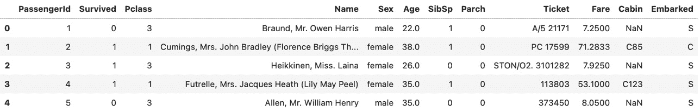

    图 4.12 – 泰坦尼克号数据集的前五行

    您现在可以继续进行探索性数据分析和准备。

1.  探索性数据分析与准备的第一步是检查缺失值。以下代码行正是如此：

    ```py
    df.isnull().sum()
    ```

    上一行代码报告了数据集中每列的缺失值数量，如下所示：

    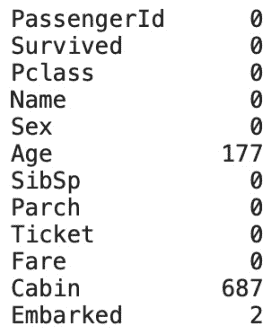

    图 4.13 – 泰坦尼克号数据集每列缺失值计数

    如您所见，数据集中存在许多缺失值。大多数缺失值出现在`Age`和`Cabin`属性中。对于`Cabin`来说很容易理解——如果乘客没有自己的船舱，则值会缺失。

    我们稍后会处理这些缺失值，但现在，让我们将重点转向数据可视化，这样您可以更好地理解数据集。

1.  为了避免代码重复，让我们定义一个单独的函数来显示条形图。该函数显示条形图，条形上方有列计数。它还允许您指定要为哪个数据集列绘制条形图，标题的值，*x*轴标签，以及*y*轴标签，还有计数的偏移量。

    您可以在此处找到该函数的代码：

    ```py
    def make_bar_chart(column, title, ylabel, xlabel, y_offset=10, x_offset=0.2):
        ax = df.groupby(column).count()[['PassengerId']].plot(
            kind='bar', figsize=(10, 6), fontsize=13, color='#4f4f4f'
        )
        ax.set_title(title, size=20, pad=30)
        ax.set_ylabel(ylabel, fontsize=14)
        ax.set_xlabel(xlabel, fontsize=14)
        ax.get_legend().remove()

        for i in ax.patches:
            ax.text(i.get_x() + x_offset, i.get_height() + y_offset, i.get_height(), fontsize=20)
        return ax
    ```

    您将在接下来的几页中广泛使用此函数。目标是可视化分类变量的分布，以便您更好地理解数据集。

1.  首先，让我们可视化有多少乘客幸存，有多少没有幸存。之前声明的`make_bar_chart()`函数对这项工作很有帮助。

    以下代码片段进行可视化：

    ```py
    make_bar_chart(
        column='Survived',
        title='Distribution of the Survived variable',
        ylabel='Count',
        xlabel='Has the passenger survived? (0 = No, 1 = Yes)'
    );
    ```

    可视化显示在以下图中：

    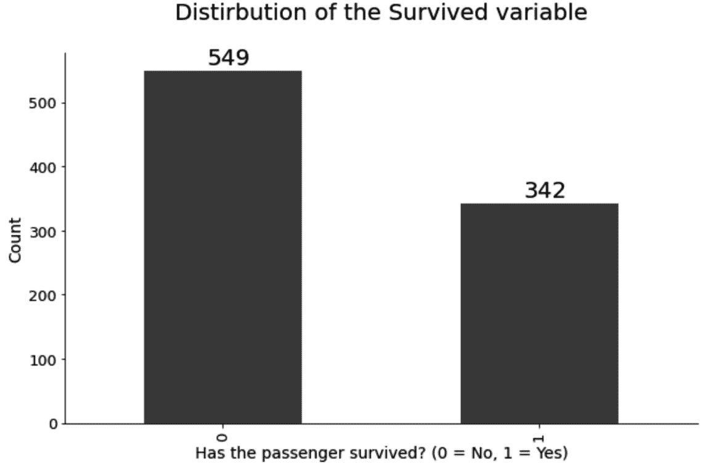

    图 4.14 – 泰坦尼克号数据集的目标类别分布

    如您所见，大多数乘客在泰坦尼克号事故中没有幸存。仅凭这一信息并不能告诉你太多，因为你不知道每个性别、乘客舱位和其他属性的乘客中有多少人幸存。

    你可以使用 `make_bar_chart()` 函数来创建此类可视化。

1.  让我们继续我们的数据可视化之旅，通过可视化每个乘客舱位的乘客数量。你可以使用相同的 `make_bar_chart()` 函数进行此可视化。只需确保相应地更改参数。

    以下代码片段可视化了每个乘客舱位的乘客数量。舱位号码越低，越好——票价更高，服务更好，也许生存的机会也更高：

    ```py
    make_bar_chart(
        column='Pclass',
        title='Distirbution of the Passenger Class variable',
        ylabel='Count',
        xlabel='Passenger Class (smaller is better)',
        x_offset=0.15
    );
    ```

    可视化显示在下图中：

    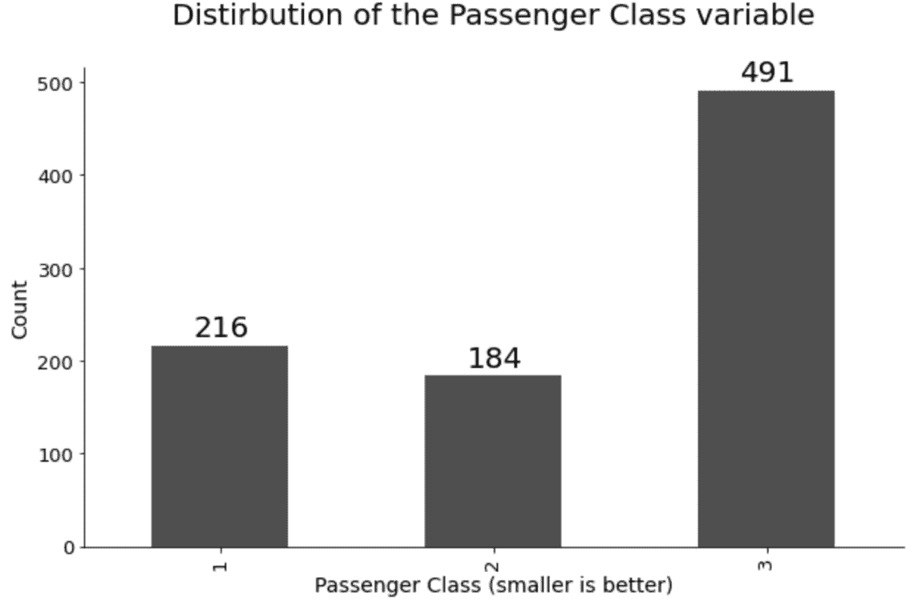

    图 4.15 – 按乘客舱位划分的乘客数量

    如您所见，大多数乘客属于三等舱。这是预期的，因为船上的工人比富人多。

1.  在数据可视化阶段的下一步，让我们看看 `Sex` 属性是如何分布的。这将让我们了解船上有更多的女性还是男性，以及差异有多大。

    以下代码片段创建了此可视化：

    ```py
    make_bar_chart(
        column='Sex',
        title='Distirbution of the Sex variable',
        ylabel='Count',
        xlabel='Gender'
    );
    ```

    可视化显示在下图中：

    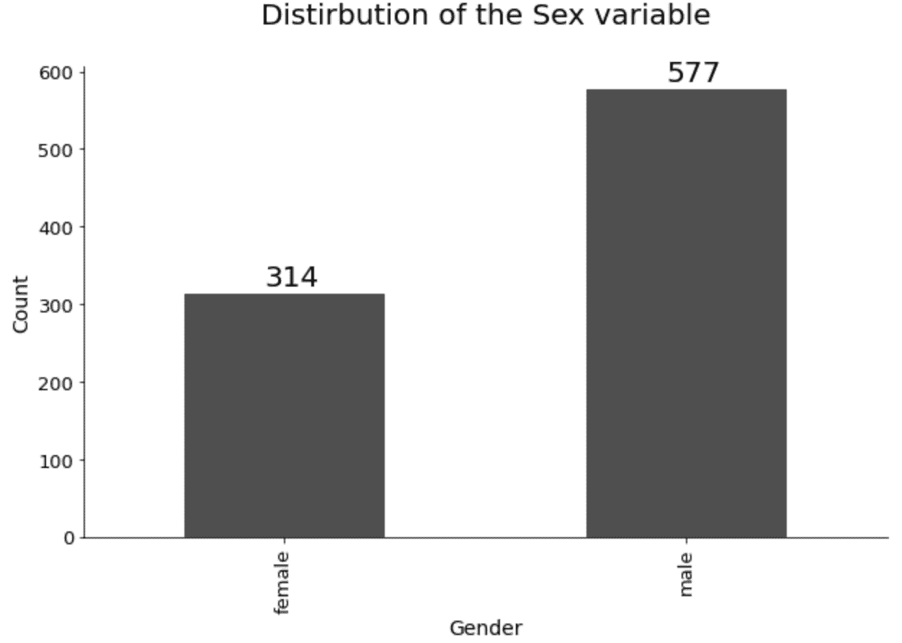

    图 4.16 – 按性别划分的乘客数量

    如您所见，船上的男性肯定更多。这与前一个可视化中得出的结论有关，我们得出结论，船上有许多工人。

    大多数工人是男性，所以这种可视化是有意义的。

1.  让我们从条形图休息一下，可视化一个连续变量以展示变化。目标是创建 `Fare` 属性的直方图，这将显示支付船票金额的分布。

    以下代码片段为所提到的属性绘制直方图：

    ```py
    plt.figure(figsize=(12, 7))
    plt.title('Fare cost distribution', size=20)
    plt.xlabel('Cost', size=14)
    plt.ylabel('Count', size=14)
    plt.hist(df['Fare'], bins=15, color='#4f4f4f', ec='#040404');
    ```

    直方图显示在下图中：

    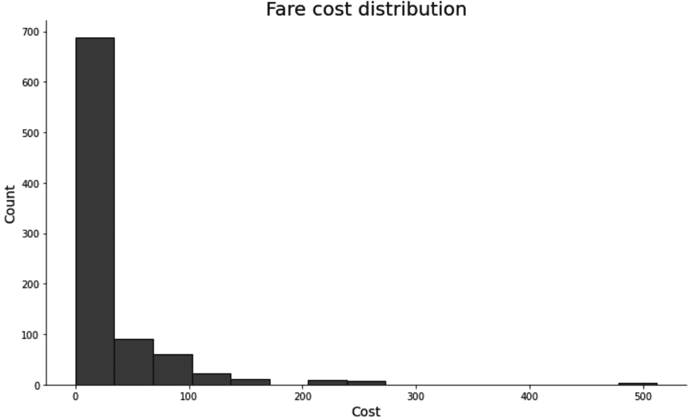

    图 4.17 – 船票变量分布

    看起来大多数乘客支付了 30 美元或更少的船票。像往常一样，总有一些极端情况。似乎有一位乘客支付了大约 500 美元的旅行费用。考虑到事情的结果，这并不是一个明智的决定。

1.  现在我们来做点不同的事情。`Name` 属性在这个格式中或多或少是无用的。但如果你仔细观察，你可以看到提到的属性中的每个值都是格式化的。

    这意味着我们可以保留第一个逗号之后的单字并将其存储在一个新变量中。我们将这个变量称为 `Title`，因为它代表乘客头衔（例如，先生、小姐等）。

    下面的代码片段提取了头衔值到一个新的属性，并使用`make_bar_chart()`函数来直观地表示泰坦尼克号乘客中的不同头衔：

    ```py
    df['Title'] = df['Name'].apply(lambda x: x.split(',')[1].strip().split(' ')[0])
    make_bar_chart(
        column='Title',
        title='Distirbution of the Passenger Title variable',
        ylabel='Count',
        xlabel='Title',
        x_offset=-0.2
    );
    ```

    结果显示在下述图中：

    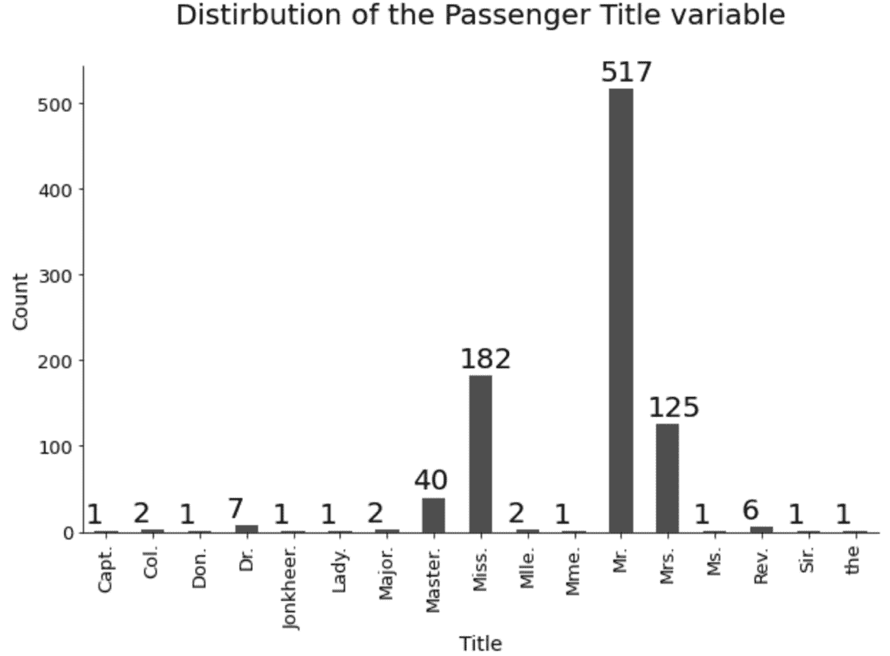

    图 4.18 – 乘客头衔分布

    这些是预期的结果。大多数乘客都有常见的头衔，例如先生和小姐。只有少数人拥有独特的头衔。您可以保留这个列不变，或者将其转换为二进制列——如果头衔是常见的，则值为零，否则为之一。您将在下一部分看到如何做到这一点。

1.  关于探索性数据分析，就到这里吧。我们已经做了很多可视化，但您总是可以自己再做更多。

    现在是时候为机器学习准备数据集了。步骤在这里描述：

    a) 删除无用的列——`Ticket`和`PassengerId`。第一个只是一个假字母和数字的集合，对预测建模没有用。第二个是一个任意 ID，很可能是用数据库序列生成的。可以通过调用`drop()`函数删除这两个。

    b) 将`Sex`属性中的值重新映射为整数。文本值*male*和*female*不能直接传递给机器学习算法。某种形式的转换是必须的——因此用 0 替换男性，用 1 替换女性。`replace()`函数是这项工作的完美候选人。

    c) 使用之前生成的`Title`列并将其转换为二进制列——如果头衔是常见的（例如，先生、小姐和夫人），则值为零，否则为之一。然后可以将该列重命名为更合适的东西，例如`Title_Unusal`。`Name`列不再需要，因此可以删除它。

    d) 通过将此属性转换为二进制列来处理`Cabin`列中的缺失值——如果船舱的值为缺失，则值为零，否则为之一。将这个新列命名为`Cabin_Known`。之后，可以删除`Cabin`列，因为它不再需要，并且不能传递给机器学习模型。

    e) 使用`Embarked`属性创建虚拟变量。该属性表示乘客进入船的港口。您将是判断这个属性是否必要的法官，但我们将保留它供 TPOT 决定。在声明虚拟变量后，将它们连接到原始数据集，并删除`Embarked`列。

    f) 以某种方式处理`Age`属性中的缺失值。有许多复杂的方法，例如*KNN 插补*或*MissForest 插补*，但为了简单起见，只需用简单平均值来插补缺失值。

    下面的代码片段显示了如何应用所有提到的转换：

    ```py
    df.drop(['Ticket', 'PassengerId'], axis=1, inplace=True)
    gender_mapper = {'male': 0, 'female': 1}
    df['Sex'].replace(gender_mapper, inplace=True)
    df['Title'] = [0 if x in ['Mr.', 'Miss.', 'Mrs.'] else 1 for x in df['Title']]
    df = df.rename(columns={'Title': 'Title_Unusual'})
    df.drop('Name', axis=1, inplace=True)
    df['Cabin_Known'] = [0 if str(x) == 'nan' else 1 for x in df['Cabin']]
    df.drop('Cabin', axis=1, inplace=True)
    emb_dummies = pd.get_dummies(df['Embarked'], drop_first=True, prefix='Embarked')
    df = pd.concat([df, emb_dummies], axis=1)
    df.drop('Embarked', axis=1, inplace=True)
    df['Age'] = df['Age'].fillna(int(df['Age'].mean()))
    df.head()
    ```

    您可以通过查看下述图来预览准备好的数据集：

    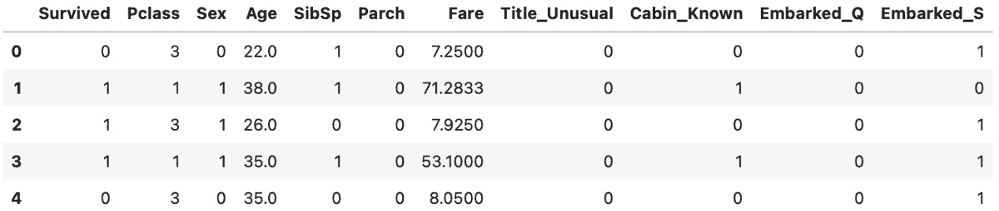

    图 4.19 – 准备好的泰坦尼克号数据集

    关于数据准备，这就是你需要做的。不需要缩放/标准化，因为 TPOT 将决定这一步是否必要。

    我们很快就会开始预测建模——只剩下一步了。

1.  在你能够训练一个分类模型之前，你必须将数据集分成训练和测试子集。记住 `random_state` 参数——如果你想得到相同的数据分割，请使用相同的值：

    ```py
    from sklearn.model_selection import train_test_split
    X = df.drop('Survived', axis=1)
    y = df['Survived']
    X_train, X_test, y_train, y_test = train_test_split(
        X, y, test_size=0.25, random_state=42
    )
    y_train.shape, y_test.shape
    ```

    最后一条代码行打印了训练和测试子集中的实例数量。你可以在以下图中看到这些数字：

    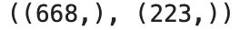

    图 4.20 – 训练和测试集中实例的数量（泰坦尼克号）

    现在，你已经准备好训练预测模型了。

1.  让我们从基线模型开始——逻辑回归。我们将在训练集上训练它，并在测试集上评估它。以下代码片段训练模型并打印混淆矩阵：

    ```py
    from sklearn.linear_model import LogisticRegression
    from sklearn.metrics import confusion_matrix
    lm = LogisticRegression(random_state=42)
    lm.fit(X_train, y_train)
    lm_preds = lm.predict(X_test)
    print(confusion_matrix(y_test, lm_preds))
    ```

    你可以在以下图中看到混淆矩阵：

    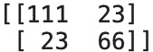

    图 4.21 – 逻辑回归混淆矩阵（泰坦尼克号）

    看起来错误肯定和错误否定（23）的数量相同。如果我们考虑比率，错误否定更多。在翻译中，基线模型更有可能说乘客幸存了，即使他们没有。

1.  解读混淆矩阵很好，但如果你想看一个具体的数字呢？由于这是一个分类问题，你可以使用准确率。但有一个“更好”的指标——**F1 分数**。这个指标的值在 0 到 1 之间（越高越好），它代表了精确率和召回率之间的调和平均值。

    下面是如何用 Python 计算它的示例：

    ```py
    from sklearn.metrics import f1_score
    print(f1_score(y_test, lm_preds))
    ```

    测试集上 F1 分数的值显示在以下图中：

    

    图 4.22 – 测试集中逻辑回归 F1 分数（泰坦尼克号）

    对于基线模型来说，0.74 的分数并不差。TPOT 能否超越它？让我们训练一个自动模型看看会发生什么。

1.  与之前类似，我们将训练一个自动分类模型 10 分钟。我们将优化 F1 分数而不是准确率。通过这样做，我们可以比较自动模型和基线模型的 F1 分数。

    以下代码片段在训练集上训练模型：

    ```py
    from tpot import TPOTClassifier
    pipeline_optimizer = TPOTClassifier(
        scoring='f1',
        max_time_mins=10,
        random_state=42,
        verbosity=2
    )
    pipeline_optimizer.fit(X_train, y_train)
    ```

    在以下图中，你可以看到训练期间在笔记本中打印的输出。TPOT 在 10 分钟内成功训练了 7 代，随着模型的训练，分数在增加：

    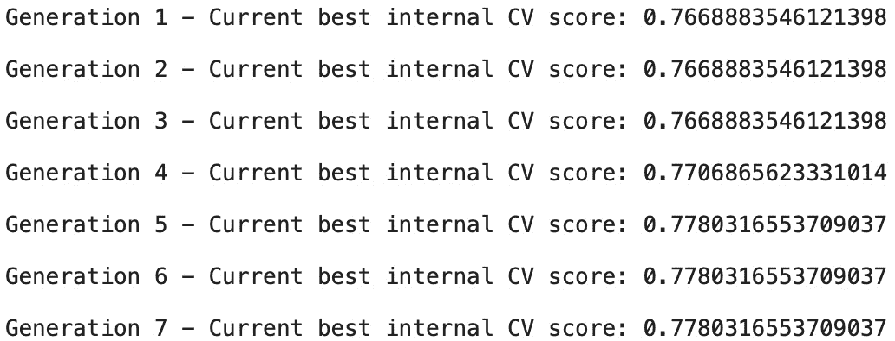

    图 4.23 – TPOT 管道优化输出（泰坦尼克号）

    您可以自由地将模型训练时间延长至 10 分钟以上。尽管如此，这个时间框架应该足以优于基线模型。

1.  让我们看看测试集中 F1 分数的值。记住，任何高于 0.7415 的值都意味着 TPOT 的表现优于基线模型。

    以下代码片段打印出 F1 分数：

    ```py
    pipeline_optimizer.score(X_test, y_test)
    ```

    对应的 F1 分数如下所示：

    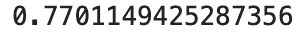

    图 4.24 – TPOT 优化模型在测试集上的 F1 分数（泰坦尼克号）

    看起来 TPOT 的表现优于基线模型——正如预期的那样。

1.  如果您更信任基本指标，例如准确率，以下是您如何在基线模型和自动化模型之间进行比较的方法：

    ```py
    tpot_preds = pipeline_optimizer.predict(X_test)
    from sklearn.metrics import accuracy_score
    print(f'Baseline model accuracy: {accuracy_score(y_test, lm_preds)}')
    print(f'TPOT model accuracy: {accuracy_score(y_test, tpot_preds)}')
    ```

    对应的准确率分数如下所示：

    

    图 3.25 – 基线模型和 TPOT 优化模型在测试集上的准确率（泰坦尼克号）

    如您所见，简单的准确率指标讲述了一个相似的故事——由 TPOT 构建的模型仍然优于基线模型。

1.  我们接近这个实战例子的尾声。还有两个可选的事情要做。第一个是查看最佳管道。您可以使用以下代码行获取它：

    ```py
    pipeline_optimizer.fitted_pipeline_
    ```

    最佳管道如下所示：

    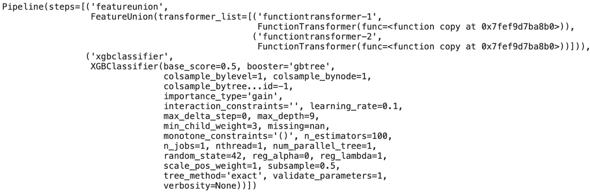

    图 4.26 – TPOT 优化后的管道（泰坦尼克号）

    如您所见，TPOT 使用极端梯度提升来解决这个分类问题。

1.  最后，您可以将最佳管道转换为 Python 代码。这样做使得代码共享的过程变得更加容易。您可以在以下位置找到相应的代码：

    ```py
    pipeline_optimizer.export('titanic_pipeline.py')
    ```

    自动化管道的完整源代码如下所示：

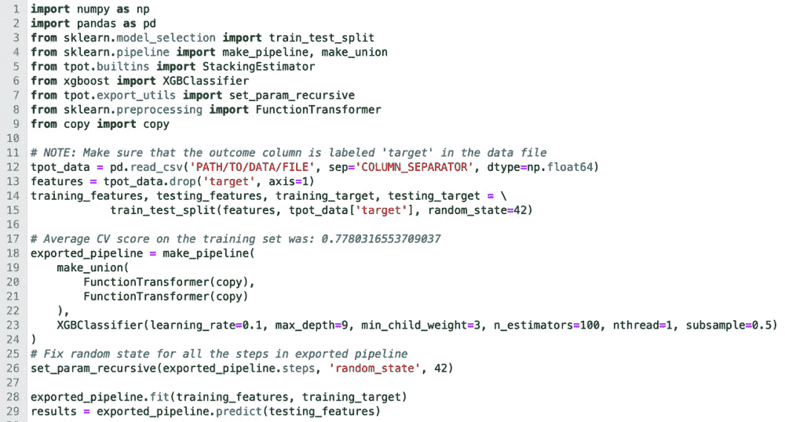

图 4.27 – 优化后的 TPOT 管道源代码（泰坦尼克号）

这样，我们就完成了在泰坦尼克号数据集上以自动化方式解决分类问题的任务。您现在已经构建了两个完全自动化的分类机器学习解决方案。让我们接下来总结这一章。

# 摘要

这是本书的第二个实战章节。您已经学会了如何使用两个深入实例在知名数据集上以自动化方式解决分类机器学习任务。毫无疑问，您现在可以使用 TPOT 解决任何类型的分类问题。

到现在为止，你已经知道如何解决回归和分类任务。但关于并行训练和神经网络呢？接下来的第五章，*第五章**，使用 TPOT 和 Dask 的并行训练*，将教你什么是并行训练以及如何使用 TPOT 来实现它。稍后，在*第六章*，*深度学习入门 – 神经网络快速课程*中，你将巩固你对基本深度学习和神经网络的知识。作为甜点，你将在*第七章*，*使用 TPOT 的神经网络分类器*中学习如何使用 TPOT 进行深度学习。

请鼓励自己使用本章介绍的工具和技术自动解决分类问题。

# 问答

1.  你能探索分类变量的分布情况吗？请解释。

1.  解释混淆矩阵以及真阳性、真阴性、假阳性和假阴性的术语。

1.  什么是精确率？请通过一个实际例子来解释。

1.  什么是召回率？请通过一个实际例子来解释。

1.  准确率和 F1 分数有什么区别？在什么情况下你会使用 F1 而不是准确率？

1.  F1 分数中的“1”代表什么？这个数字可以被改变吗？在那个情况下会发生什么？

1.  在训练过程中，TPOT 输出的是训练集还是测试集的评分指标值？请解释。
