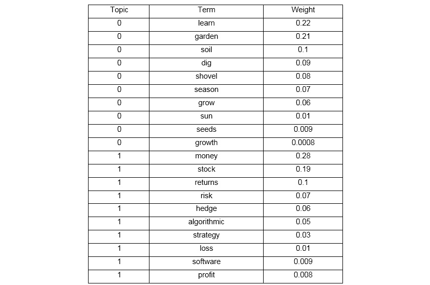
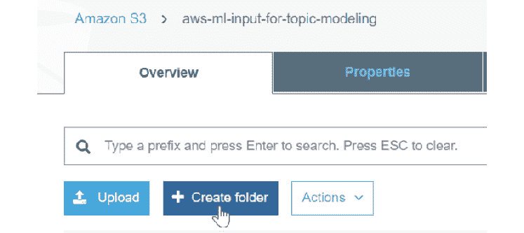
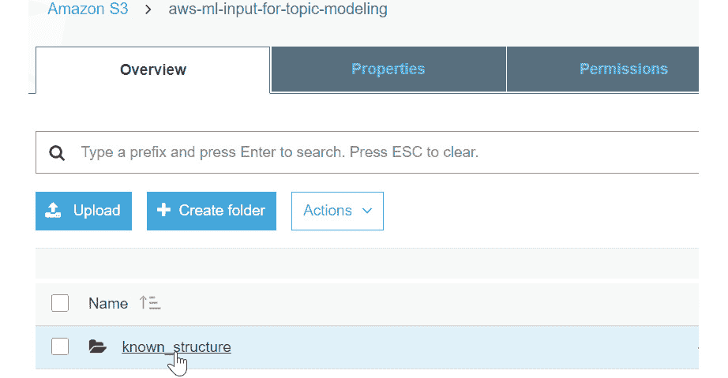
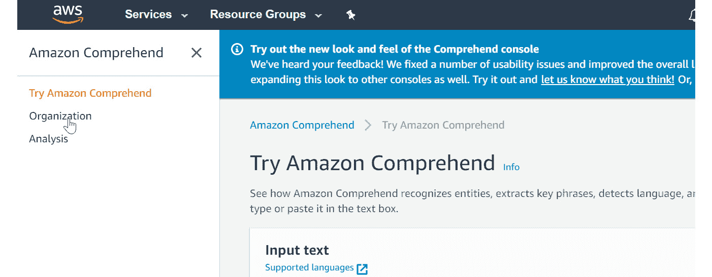
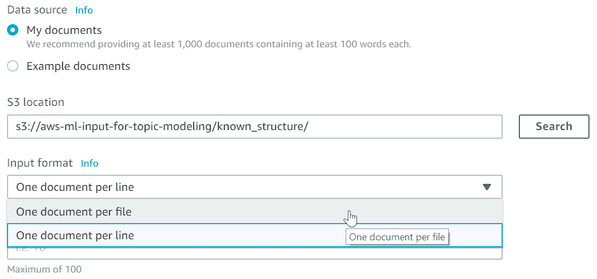
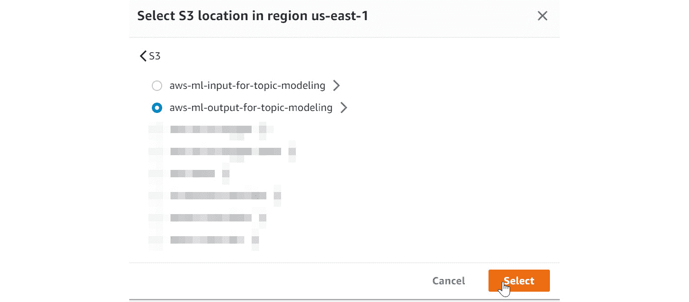
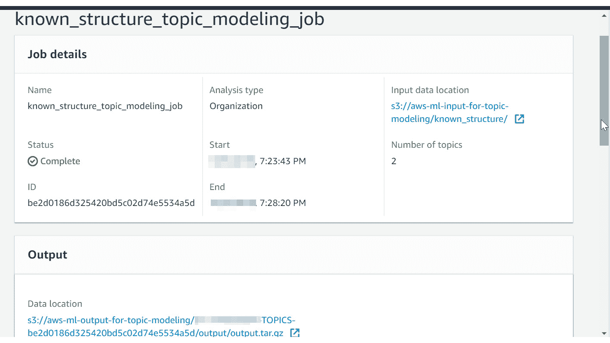
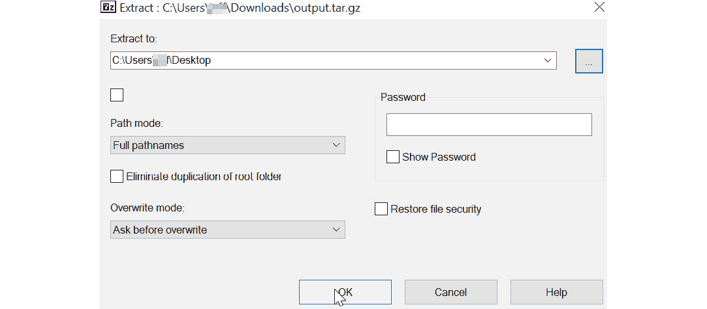
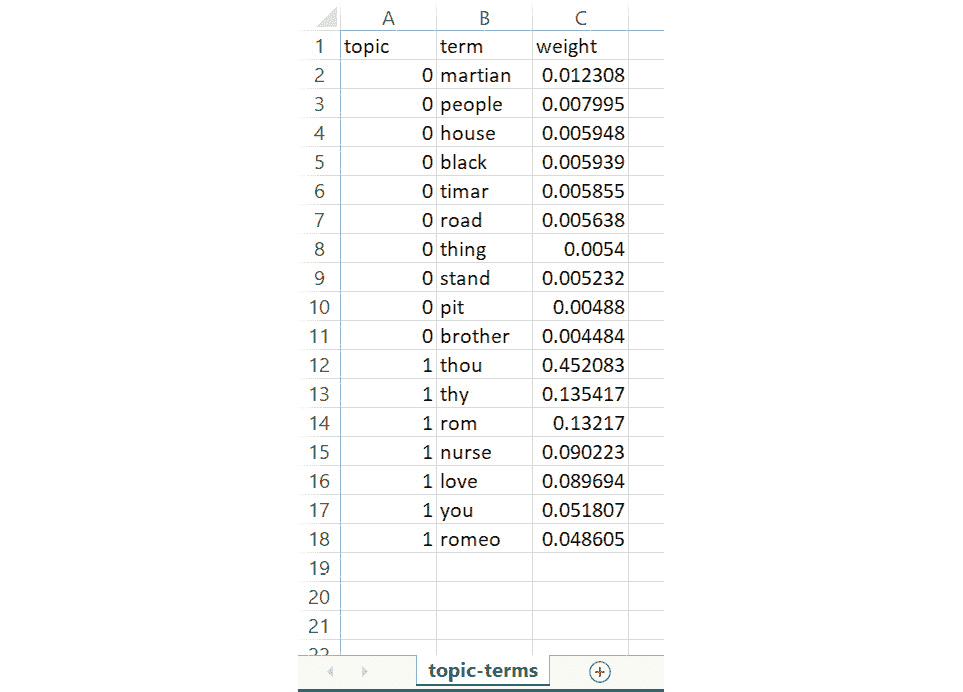
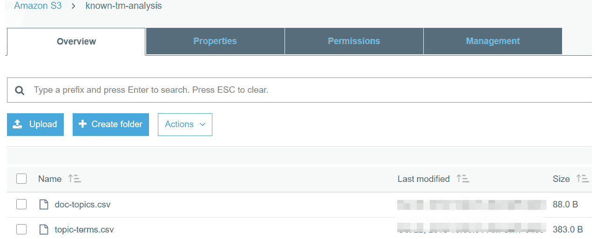

3

# 第三章：执行主题建模和主题提取

## 学习目标

到本章结束时，您将能够：

+   通过 Amazon Comprehend 的主题建模提取和分析常见主题

+   描述主题建模分析的基本原理

+   在一组文档上执行主题建模并分析结果

本章描述了使用 Amazon Comprehend 分析文档集结果的主题建模在常见主题上的应用。

## 简介

在本章的第一部分，您将学习如何分析 Amazon Comprehend 的主题建模输出。具体来说，您将学习用于主题建模的算法的基本原理，即潜在狄利克雷分配（LDA）。学习 LDA 将使您能够将主题建模应用于多种独特的商业用例。

您将接着对两个具有已知主题结构的文档执行主题建模。第一个是故事 **Romeo and Juliet**，第二个是 **War of the Worlds**。最后，您将使用 Amazon Comprehend 分析包含 1,000 篇负面电影评论的文本文档中的主题。

## 提取和分析常见主题

您还可以使用 Amazon Comprehend 分析档案库以定位库中包含的正常主题。Amazon Comprehend 会检查库中的报告，并在之后恢复与每个主题相关的最显著主题和报告。主题显示是一个非传统的过程：您提供一组文件用于训练，然后在处理完成后获取结果。Amazon Comprehend 在大型文件集上执行主题显示。为了获得最佳结果，您在提交主题显示工作时应包含大约 1,000 个文件。

### 使用潜在狄利克雷分配（LDA）进行主题建模

一组文档的主题或 **常见主题** 可以使用 Amazon Comprehend 确定。例如，您有一个电影评论网站，有两个论坛，您想确定哪个论坛正在讨论两部新上映的电影（一部关于体育，另一部关于政治主题）。您可以将论坛的文本数据提供给 Amazon Comprehend，以发现每个论坛上讨论的最突出主题。

Amazon Comprehend 用于执行主题建模的机器学习算法称为潜在狄利克雷分配（LDA）。LDA 是一个基于学习的模型，用于确定文档集合中最重要的话题。

LDA 工作的方式是它将每个文档视为主题的组合，文档中的每个单词都与这些主题之一相关联。

例如，如果文档的第一段包含像 **eat**、**chicken**、**restaurant** 和 **cook** 这样的单词，那么您可以得出结论，主题可以概括为 **Food**。如果文档的第二段包含像 **ticket**、**train**、**kilometer** 和 **vacation** 这样的单词，那么您可以得出结论，主题是 **Travel**。

### 基本 LDA 示例

主题建模可能看起来很复杂，理解 LDA 如何确定主题的基本步骤对于在更复杂的企业用例中进行主题建模至关重要。因此，让我们通过以下简单的例子来分解 LDA。

你有一篇包含五句话的文档。你的目标是确定文档中出现的两个最常见主题：

+   我喜欢吃面包和香蕉。

+   我早餐吃了一杯面包和香蕉的冰沙。

+   小狗和小猫很可爱。

+   昨天我哥哥收养了一只小狗。

+   看看这只可爱的小负鼠正在吃一块西兰花。

LDA 发现这些句子包含的主题。例如，给定上述句子并要求两个主题，LDA 可能会产生以下结果：

第 1 和第 2 句：100% 主题 A

第 3 和第 4 句：100% 主题 B

第 5 句：60% 主题 A，40% 主题 B

**主题 A**：30% 面包，15% 香蕉，10% 早餐，10% 咀嚼（因此，你可以假设主题 A 是关于食物的）

**主题 B**：20% 小狗，20% 小猫，20% 可爱，15% 小负鼠（你可以假设主题 B 是关于可爱动物的）

### 为什么使用 LDA？

当你需要找到记录中的设计，而不考虑报告本身时，LDA 很有用。LDA 可以用来创建主题，以理解档案，一般主题。这通常用于推荐系统、报告排序和文件摘要。总之，LDA 在准备带有主题和事件预测模型时很有帮助。

LDA 有许多用例。例如，你有 30,000 封用户电子邮件，并希望确定最常见的主题，以便根据最普遍的主题提供针对特定群体的推荐内容。手动阅读，甚至外包 30,000 封电子邮件的阅读，将需要大量的时间和金钱投入，而且准确性难以确认。然而，Amazon Comprehend 可以在几个步骤内无缝提供 30,000 封电子邮件中最常见的主题，并且准确性令人难以置信。首先，将电子邮件转换为文本文件，上传到 S3 存储桶，然后使用 Amazon Comprehend 进行主题建模作业。输出是两个包含相应主题和术语的`CSV`文件。

### Amazon Comprehend–主题建模指南

如果你向 Comprehend 提供尽可能大的语料库，将给出最准确的结果。更具体地说：

+   你应该在每个主题中至少使用 1,000 条记录来展示工作

+   每篇报告的长度应大约为三句话

+   如果一条记录主要由数字信息组成，你应该将其从语料库中排除

目前，主题建模仅限于两种文档语言：**英语**和**西班牙语**。

主题建模作业允许两种输入数据格式类型（见下表 1）。这使用户能够处理大量文档集合（例如，报纸文章或科学期刊），以及短文档（例如，推文或社交媒体帖子）。

**输入格式选项**：


###### Figure3.1：AWS Comprehend– 主题建模输入格式选项

**输出格式选项：**


###### Figure 3.2：AWS Comprehend – 主题建模输出文件描述

在 Amazon Comprehend 处理完您的文档集合后，建模输出两个 CSV 文件：Topic-terms.csv（见图 1）和 `doc-topics.csv`。

`topic-terms.csv` 文件提供了文档集合中主题的列表，包括术语、相应的主题和权重。例如，如果你给了 Amazon Comprehend 两个假设文档，**学习园艺**和**投资策略**，它可能会返回以下内容来描述集合中的两个主题：



###### Figure 3.3：两个文档输入的样本主题建模输出 (`topic-terms.csv`) 

`doc-topics.csv` 文件提供了为主题建模作业提供的文档列表，包括文档名称、相应的主题及其在每个文档中的比例。给定两个假设文档，`learning_to_garden.txt` 和 `investment_strategies.txt`，你可以期待以下输出：


###### Figure 3.4：两个文档输入的样本主题建模输出 (`doc-topics.csv`)。

### 练习 13：已知主题结构的主题建模

在这个练习中，我们将使用 Amazon Comprehend 对两个已知主题的文档（**罗密欧与朱丽叶**和**世界大战**）进行主题建模。我们使用两个已知主题来更好地理解 LDA。在进行练习之前，先看看数据管道架构的概述：


###### Figure 3.5：数据管道架构概述

以下是为完成已知主题结构的主题建模的步骤：

1.  我们需要一个输入和输出 S3 存储桶。让我们创建两个。导航到 [`s3.console.aws.amazon.com/s3/`](https://s3.console.aws.amazon.com/s3/)。

1.  现在，点击**创建存储桶**按钮创建一个存储桶：

    ###### Figure 3.6：创建存储桶

1.  对于存储桶名称，输入一个描述功能的唯一名称。在这里，使用名称 `aws-ml-input-for-topic-modeling`。点击**创建**按钮：

    #### 注意

    点击创建与点击下一步使用所有默认设置：属性和权限。

    

    ###### Figure 3.7：创建存储桶名称输入

1.  现在，点击**创建**按钮创建一个文件夹：

    ###### Figure 3.8：在 S3 中为主题建模输入创建文件夹

1.  现在，输入`known_structure`作为文件夹名称，然后点击`'known_structure'`文件夹名称

1.  在点击`known_structure`文件夹后：

    ###### 图 3.9：输入桶界面

1.  现在，点击**上传**按钮：

    ###### 图 3.10：上传界面

1.  现在，系统将提示您添加文件。点击**添加文件**或将文件拖放到屏幕上：

    ###### 图 3.11 添加文件界面

1.  导航到下载并上传以下两个文本文件到机器上：

    #### 注意

    您可以从/lesson3/topic_a/romeo_and_juliet.txt [`github.com/TrainingByPackt/Machine-Learning-with-AWS/blob/master/lesson3/topic_a/romeo_and_juliet.txt`](https://github.com/TrainingByPackt/Machine-Learning-with-AWS/blob/master/lesson3/topic_a/romeo_and_juliet.txt) /lesson3/topic_a/the_war_of_the_worlds.txt [`github.com/TrainingByPackt/Machine-Learning-with-AWS/blob/master/lesson3/topic_a/the_war_of_the_worlds.txt`](https://github.com/TrainingByPackt/Machine-Learning-with-AWS/blob/master/lesson3/topic_a/the_war_of_the_worlds.txt)下载 Romeo and Juliet 文本文件。

1.  文件上传完成后，点击`known_structure`文本文件

1.  导航到 Amazon S3 主界面：

    ###### 图 3.13：Amazon S3

1.  接下来，创建一个输出 S3 桶。使用相同的 S3 桶创建过程。点击**创建****桶**按钮：

    ###### 图 3.14：创建一个桶

1.  现在，命名桶，然后点击**创建**按钮：

    ###### 图 3.15：主题建模的创建桶输出

1.  导航到 Amazon Comprehend：[`console.aws.amazon.com/comprehend/`](https://console.aws.amazon.com/comprehend/). 如果出现以下屏幕，请点击**尝试 Amazon Comprehend**：

    ###### 图 3.16：Amazon Comprehend 主界面

1.  现在，点击左侧工具栏中的**组织**：

    ###### 图 3.17：Amazon Comprehend 组织界面

1.  现在，在**名称**字段中点击`known_structure_topic_modeling_job`：

    ###### 图 3.18：主题建模作业名称

1.  现在，向下滚动到**选择输入数据**，然后点击**搜索**：

    ###### 图 3.19：点击搜索以定位主题建模输入数据源

1.  导航到`known_structure`文件夹，然后点击**选择**：

    ###### 图 3.20：点击选择 S3 文件夹

1.  现在，从下拉菜单中选择**每个文件一个文档**：

    ###### 图 3.21：选择每个文件一个文档

1.  现在，输入**两个**作为您需要的**主题数量**：

    ###### 图 3.22：输入 2 以执行主题建模的主题数量

1.  接下来，点击**搜索**以搜索之前创建的存储桶：

    ###### 图 3.23：点击搜索主题建模 S3 输出位置

1.  一旦找到您创建的存储桶，点击您创建的存储桶以输出主题建模：

    ###### 图 3.24：选择输出 S3 存储桶

1.  现在，选择适当的存储桶，然后点击**选择**：

    ###### 图 3.25：通过点击选择进行确认

1.  向下滚动以选择一个**IAM**角色，然后点击创建**IAM**角色的圆圈：

    ###### 图 3.26：选择创建 IAM 角色

1.  现在，从**访问权限**中选择**输入**和**输出 S3 存储桶**：

    ###### 图 3.27：提供输入和输出 S3 存储桶的权限

1.  在名称后缀字段中输入`myTopicModelingRole`，然后点击**创建作业**按钮：

    ###### 图 3.28：点击创建作业按钮

1.  创建作业可能需要几分钟，但完成后，您将被重定向到 Comprehend 主屏幕：

    ###### 图 3.29：Comprehend 主屏幕

1.  在作业处理过程中，显示的状态将是**进行中**：

    ###### 图 3.30：显示进行中状态

1.  当状态更新为**完成**时，点击主题建模作业名称：

    ###### 图 3.31：显示完成状态

1.  现在，向下滚动到**输出**部分：

    ###### 图 3.32：主题建模输出显示主屏幕

1.  点击**数据位置**下的超链接：

    ###### 图 3.33：主题建模数据输出超链接位置

1.  点击输出文件夹的链接：

    ###### 图 34：主题建模输出文件夹

1.  点击输出文件夹。然后，点击`output.tar.gz`并下载文件：

    ###### 图 3.35：点击下载

1.  点击`output.tar.gz`并选择**在文件夹中显示**。点击**确定**以在桌面提取文件：

    ###### 图 3.36：点击确定

1.  导航到你的桌面。将提取两个文件：`doc-topics.csv`和`topics-terms.csv`。将有两个文件要检查：`topic-terms.xlsx`和`doc-topics.xlsx`：


###### 图 3.37：主题建模输出 CSV 文件

#### 注意

你的 Topic-terms.csv 和 doc-topics.csv 结果应与以下结果相同。如果你的结果不相同，请使用本章剩余部分提供的输出文件，这些文件位于 Lesson3\topic_a\doc-topics.csv [`github.com/TrainingByPackt/Machine-Learning-with-AWS/blob/master/lesson3/topic_a/doc-topics.csv`](https://github.com/TrainingByPackt/Machine-Learning-with-AWS/blob/master/lesson3/topic_a/doc-topics.csv)和 lesson3\topic_a\topic-terms.csv [`github.com/TrainingByPackt/Machine-Learning-with-AWS/blob/master/lesson3/topic_a/topic-terms.csv`](https://github.com/TrainingByPackt/Machine-Learning-with-AWS/blob/master/lesson3/topic_a/topic-terms.csv).

以下为生成的输出：



###### 图 3.38：`topic-terms.csv`结果


###### 图 3.39：doc-topics.csv 结果

### 练习 14：执行已知结构分析

在这个练习中，我们将以编程方式上传 CSV 文件（`doc-topics.csv`和`Topic-terms.csv`）到 S3，根据主题列合并 CSV 文件，并将输出打印到控制台。以下是执行已知结构分析步骤：

#### 注意

对于这个步骤，你可以跟随练习并输入代码，或者从源代码文件夹`local_csv_to_s3_for_analysis.py`中获取它，并将其粘贴到编辑器中。源代码可在以下 GitHub 仓库中找到：[`github.com/TrainingByPackt/Machine-Learning-with-AWS/blob/master/lesson3/topic_a/local_csv_to_s3_for_analysis.py`](https://github.com/TrainingByPackt/Machine-Learning-with-AWS/blob/master/lesson3/topic_a/local_csv_to_s3_for_analysis.py).

1.  首先，我们将使用以下命令导入`boto3`：

    ```py
    import boto3
    ```

1.  接下来，我们将使用以下命令导入`pandas`：

    ```py
    import pandas as pd 
    ```

1.  现在，我们将使用以下命令创建 S3 客户端对象：

    ```py
    s3 = boto3.client('s3')
    ```

1.  接下来，我们将创建一个具有唯一桶名的变量。在这里，选定的桶名是`known-tm-analysis`，但你需要创建一个唯一的名称：

    ```py
    bucket_name = '<insert a unique bucket name>' #  
    ```

1.  接下来，创建一个新的桶：

    ```py
    s3.create_bucket(Bucket=bucket_name)
    ```

1.  创建要导入的 CSV 文件名列表：

    ```py
    filenames_list = ['doc-topics.csv', 'topic-terms.csv']
    ```

1.  现在，使用以下代码行迭代每个文件以上传到 S3：

    ```py
    for filename in filenames_list:
        s3.upload_file(filename, bucket_name, filename)
    ```

1.  接下来，检查文件名是否为`doc-topics.csv`：

    ```py
        if filename == 'doc-topics.csv':
    ```

1.  现在，使用以下命令获取`doc-topics.csv`文件对象并将其分配给`obj`变量：

    ```py
     obj = s3.get_object(Bucket=bucket_name, Key=filename)
    ```

1.  接下来，读取`csv`对象并将其分配给`doc_topics`变量：

    ```py
            doc_topics = pd.read_csv(obj['Body'])
        else:
            obj = s3.get_object(Bucket=bucket_name, Key=filename)
            topic_terms = pd.read_csv(obj['Body'])
    ```

1.  现在，使用以下命令合并主题列上的文件，以获取每个文档中最常见的术语：

    ```py
    merged_df = pd.merge(doc_topics, topic_terms, on='topic')
    Print the merged_df to the console
    print(merged_df)
    ```

1.  接下来，导航到命令提示符中`CSV`文件的位置，并使用以下命令执行代码：

    ```py
    python local_csv_to_s3.py
    ```

1.  控制台输出是一个合并的`dataframe`，它提供了具有相应术语及其权重的`docnames`（见以下内容）：

    ###### 图 3.40：已知结构主题建模合并结果

1.  要验证 CSV 文件，导航到 S3（如果新存储桶没有出现，请重新加载页面），并在 S3 中创建了新的存储桶。单击存储桶以验证成功导入：

    ###### 图 3.41：已知-tm-analysis S3 存储桶

1.  存储桶中将有两个 CSV 文件：`doc-topics.csv`和`topic-terms.csv`：



###### 图 3.42：上传到 S3 的主题建模结果

### 活动 4：对一组未知主题的文档执行主题建模

在这个活动中，我们将对一组未知主题的文档执行主题建模。我们将考虑一个例子。假设您的雇主希望您构建一个数据管道来分析存储在具有唯一 ID 文件名的单独文本文件中的负面电影评论。因此，您需要执行主题建模以确定哪些文件代表相应的主题。总的来说，负面评论为公司带来更多的货币收益或损失，因此，他们优先考虑负面评论而不是正面评论。公司的最终目标是将这些数据集成到反馈聊天机器人应用程序中。为了确保这一点正确发生，您需要有一个包含负面评论的文件。此活动的预期结果将是负面电影评论文件的主题建模结果。

**执行主题建模**

1.  导航到以下链接以获取包含负面评论的文本数据文件：[`github.com/TrainingByPackt/Machine-Learning-with-AWS/blob/master/lesson3/activity/localfoldernegative_movie_review_files/cv000_29416.txt`](https://github.com/TrainingByPackt/Machine-Learning-with-AWS/blob/master/lesson3/activity/localfoldernegative_movie_review_files/cv000_29416.txt)。

1.  使用唯一名称创建一个用于主题建模的存储桶。

1.  为主题建模创建一个文件夹。

1.  导入操作系统和 Boto3。提及您的唯一存储桶名称。

1.  收集所有本地路径的工作目录并将它们转换为文本文件。

1.  创建一个包含所有文本文件的列表。

1.  遍历文件并将它们上传到 S3。

1.  在组织中创建一个使用 Amazon Comprehend 的作业。

1.  根据要求选择输入数据。它可能是 **我的文档** 或 **示例文档**。

1.  从数据源中选择文件。

1.  应用输入格式。

1.  提供要建模的主题数量。

1.  选择 IAM 角色，并创建一个作业。

1.  下载输出文件并提取文件。

1.  生成的输出将包括两个 `.CSV` 文件。

**未知主题分析**

1.  导入 `Boto3` 和 `pandas`。

1.  创建 S3 客户端。

1.  使用唯一名称创建一个新的存储桶。

1.  创建要导入的 CSV 文件名列表。

1.  检查文件名并将其分配给 **obj** 变量。

1.  读取 **obj** 变量。

1.  在主题列上合并文件。

1.  将合并的文件打印到控制台。

    #### 注意

    要了解详细步骤，请参阅本书末尾的附录 A，第 203 页的 *附录 A*。

### 摘要

在本章中，我们学习了如何从 AWS Comprehend 分析主题建模结果。你现在能够将 S3 用于存储数据，并使用它进行数据分析。此外，我们还学习了在执行主题建模之前如何分析已知主题的文档，以及那些已知主题的文档。后者需要额外的分析来确定相关主题。

在下一章中，我们将深入探讨聊天机器人的概念以及它们通过自然语言处理的理解。
