5

# 第五章：使用语音与聊天机器人交互

## 学习目标

到本章结束时，你将能够：

+   将 Amazon Connect 设置为个人呼叫中心

+   将 MarketNanny 聊天机器人集成到 Amazon Connect

+   使用语音和语音与聊天机器人交互

+   将自定义机器人连接到 Amazon Connect

本章描述了使用语音和语音与聊天机器人交互的 Amazon Connect 服务。

## 简介

在上一章中，你学习了如何使用**Amazon Lex**服务创建`MarketNanny`聊天机器人。你能够通过文本框使用自然语言语音与聊天机器人交互，并且聊天机器人能够查询外部服务 API 以获取发送回你的信息。

在本章中，你将使用语音而不是文本与`MarketNanny`聊天机器人交互。首先，你将在 Amazon Connect 内设置一个呼叫中心，并配备本地电话号码。然后，你将`MarketNanny`连接到 Amazon Connect。

最后，你将通过与它通话来测试聊天机器人；这将通过调用它来完成。到本章结束时，你将能够通过电话界面使用 Amazon Connect 界面与你的`MarketNanny`机器人交谈。

## Amazon Connect 基础知识

**Amazon Connect**是 AWS 提供的一项服务，允许创建基于云的接触中心。这意味着人们可以使用电话号码来联系该服务，并与机器人或人类代表进行对话。在这种情况下，我们主要对使用我们之前构建的聊天机器人来自动化交互感兴趣。

Amazon Connect 的一些关键特性如下：

+   使用图形编辑器定义的工作流程设置和连接 Connect 很容易。

+   没有需要部署或管理的基础设施，因此接触中心可以快速扩展和缩减。

+   这是一种**按使用付费的服务**，因此没有设置或月费。我们将使用免费层，所以我们不应该需要为使用该服务付费。对于商业用途，费用基于每分钟费率。

+   Connect 部署在 42 个可用区，分布在 16 个地理区域内。

### 免费层级信息

在这本书中，你将只使用所提供服务的免费层级。然而，了解免费使用的限制和定价同样重要。

你应该检查官方网页 https://aws.amazon.com/connect/。一个单独的接触中心可能包括一定数量的 Amazon Connect 服务使用量和包括 60 分钟入站和出站通话的直接拨打号码。这可能会根据你的区域设置而变化。

#### 注意

对于这本书，你不需要使用免费层级的所有服务。如果你超出了免费层级的限制，你将根据在：https://aws.amazon.com/connect/pricing/上发布的费率向 Amazon 付费。

## 与聊天机器人交互

使用 Connect 通过语音与您的聊天机器人交互，需要您首先在 Connect 中设置一个呼叫中心。呼叫中心将获得一个免费的本地电话号码（或在美国为免费长途电话号码）。此号码可以连接到`MarketNanny`）。聊天机器人使用 Lambda **无服务器服务**从外部 API 获取数据并将其回传给电话中的用户：

*图片参考*：https://aws.amazon.com/connect/connect-lexchatbot/

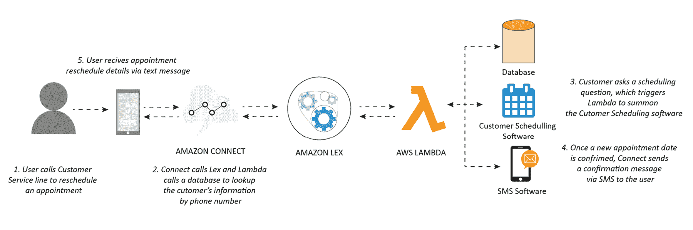

###### 图 5.1：使用 Amazon Connect、Lex 和 Lambda 的基于语音的聊天机器人应用程序示例

## 通过 Amazon Connect 使用呼叫中心与您的聊天机器人交谈

使用 Amazon Connect，我们可以创建一个呼叫中心应用程序，使我们能够通过语音命令连接到我们在上一章中构建的聊天机器人（`MarketNanny`），而不是通过文本框；

要创建 Amazon Connect 呼叫中心，您需要创建一个 Amazon Connect 实例。每个示例都包含与您的呼叫焦点相关的多数资产和设置。您可以从 Amazon Connect 支持中管理您场景的设置。您也可以从您的联系焦点内部管理联系焦点的设置。

您可以创建各种实例；然而，每个实例的能力仅限于您创建它的 AWS 区域内。设置、客户、测量和详细信息在 Amazon Connect 实例之间不共享。

#### 注意

必须拥有 AWS 账户。可以通过控制台页面访问 Amazon Lex 服务。

### 练习 18：创建个人呼叫中心

在这个练习中，我们将使用 Amazon Connect 创建一个个人呼叫中心，并将您的`MarketNanny`聊天机器人连接到它。我们已经在本章中讨论了 Amazon Connect 服务：

1.  对于第一步，导航到 AWS 控制台中的 Amazon Connect 服务页面。您可以选择链接进行导航，或直接访问此 URL：https://console.aws.amazon.com/connect: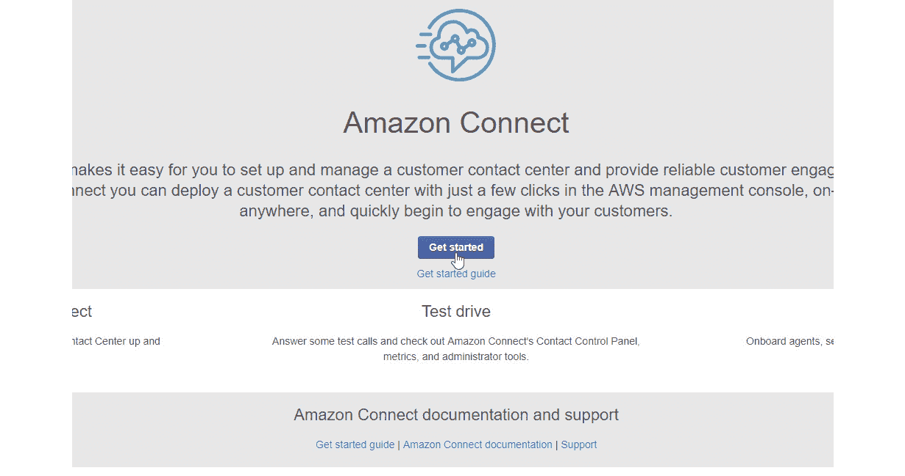

    ###### 图 5.2：Amazon Connect 欢迎屏幕

1.  点击**开始**按钮创建一个新的**呼叫中心**。在随后的第一个屏幕中，保持默认选项将用户存储在 Amazon Connect 中，并为您的应用程序输入一个名称。该名称在 AWS 中是唯一的，不允许重复，因此您可能需要尝试一下或给名称添加数字，直到得到一个唯一的名称。

1.  完成后，点击**下一步**按钮：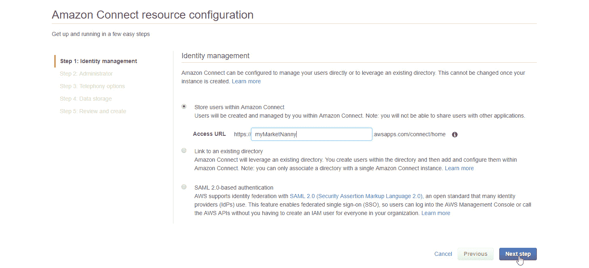

    ###### 图 5.3：Amazon Connect 资源配置屏幕的第 1 步

1.  在下一步中，添加新`管理员`的信息，将`电子邮件地址`设置为您的电子邮件地址。同样，完成后再次点击**下一步**按钮：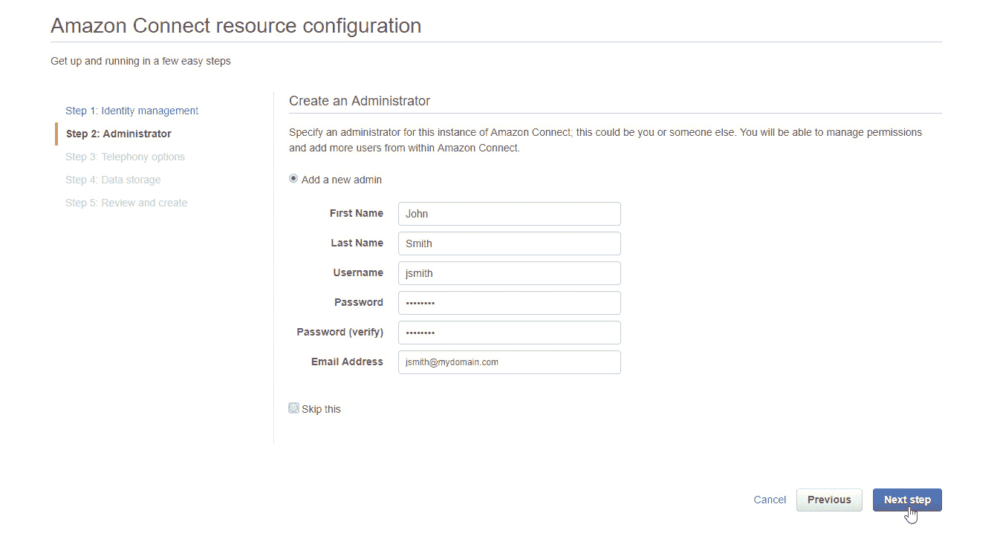

    ###### 图 5.4：Amazon Connect 资源配置界面的第二步

1.  在下一步中，请保持**来电**复选框选中，并取消选中**去电**复选框：

    #### 注意

    在此情况下，我们对我们机器人向任何人发起通话没有要求，但我们确实希望它能够接收通话。

    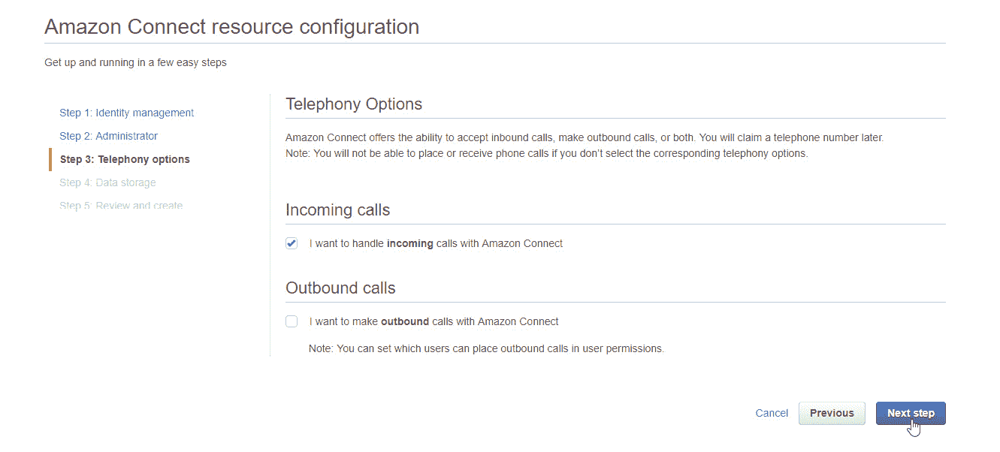

    ###### 图 5.5：Amazon Connect 资源配置界面的第三步

1.  完成后，点击**下一步**按钮。

1.  接下来，您将看到一个信息屏幕，告知您您正在授予呼叫中心应用程序读取和写入您的 S3 存储桶中的数据、加密或解密数据以及读取和写入`CloudWatch`日志的权限。

1.  它还将显示您的`数据`和`联系流程`日志存储的`S3 存储桶`的位置：

    #### 注意

    注意，有一个**自定义**设置链接可以进一步自定义这些位置，但我们不会使用它。

    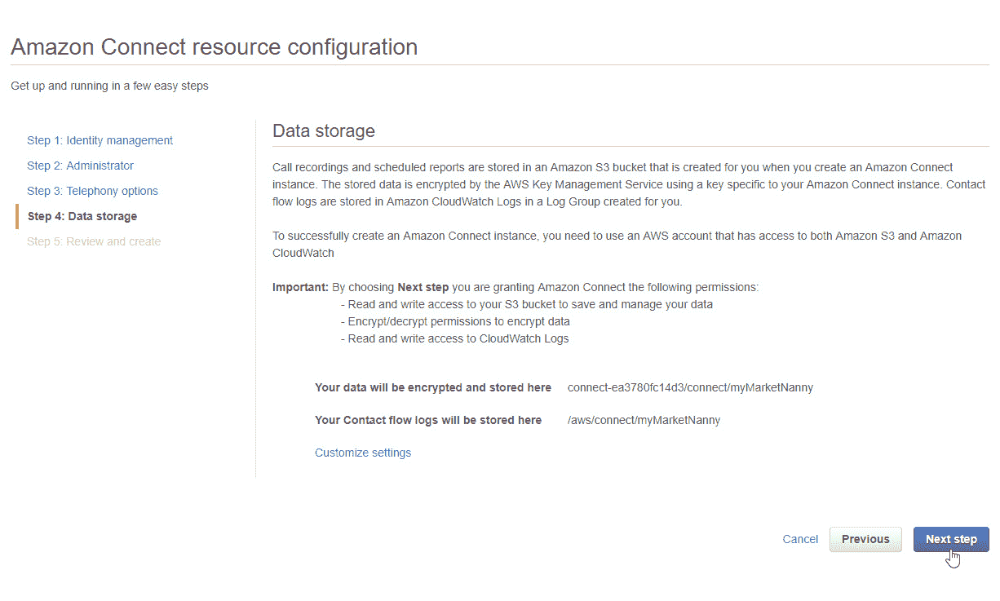

    ###### 图 5.6：Amazon Connect 资源配置界面的第四步

1.  这将带您进入最终屏幕，该屏幕将为您提供对您的**联系中心**应用程序所有设置的回顾：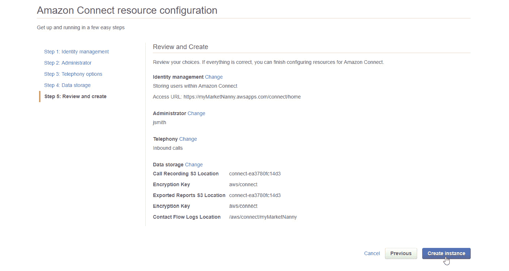

    ###### 图 5.7：Amazon Connect 资源配置界面的第五步

1.  现在，点击**创建实例**按钮以创建您的应用程序。您应该会看到一个对话框：

    ###### 图 5.8：设置 Amazon Connect

1.  几分钟或两分钟后，它将完成设置过程，并带您进入一个**成功**界面，在那里您可以点击**开始**按钮直接进入您的应用程序：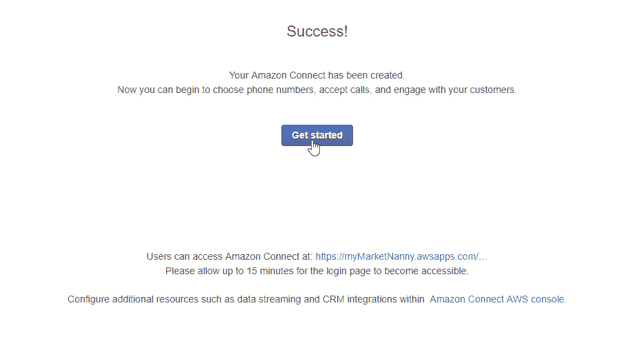

    ###### 图 5.9：成功界面

    #### 注意

    应用程序的设置可能需要长达 15 分钟，所以如果您最初未能成功进入应用程序页面，请保持耐心，偶尔再试一次，直到成功为止。

1.  通常，这不会花费很长时间，并且通常应用程序页面将立即可访问。

### 练习 19：为您的呼叫中心获取免费电话号码

在这个练习中，我们将为我们的定制呼叫中心获取一个免费号码。可以通过 Amazon Connect 提供的免费层服务获取免费电话号码。以下是为获取免费号码的完成步骤：

1.  您个人呼叫中心的欢迎屏幕应该可见，如果不可见，您可以在之前屏幕中显示的`URL`中轻松访问它，在您点击**开始**按钮之前：

    #### 注意

    在我的情况下，它是 https://mymarketnanny.awsapps.com/connect；在您的应用中，它将基于您自己的应用程序名称。

    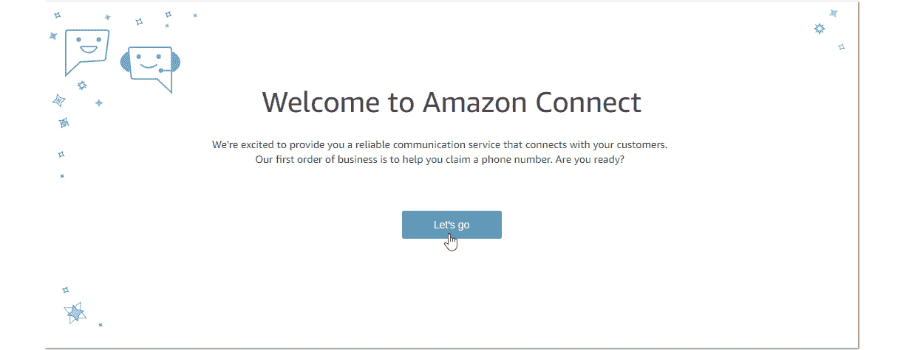

    ###### 图 5.10：Amazon Connect 欢迎屏幕

1.  在这一点上，您可以点击您的呼叫中心应用程序的**本地**电话号码。在此屏幕上，您可以选择您的国家：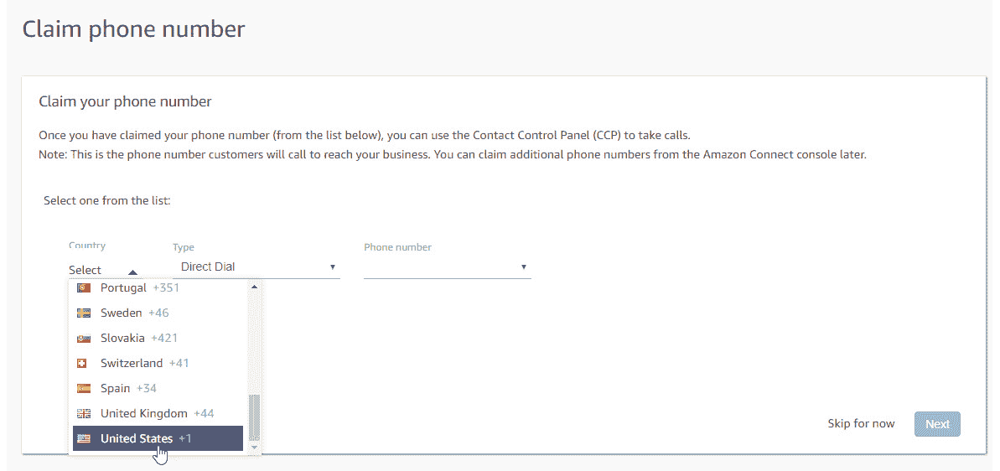

    ###### 图 5.11：索赔电话号码屏幕

1.  将**类型**保留为**默认**（直接拨打）选项，并从电话号码下拉菜单中选择一个电话号码。在大多数情况下，这应该是一个您当地的号码。如果您选择了一个不是本地的号码，您可能会根据拨打该号码的成本付费：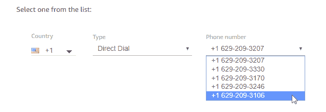

    ###### 图 5.12：电话号码选择

1.  完成后，点击**下一步**按钮。这将允许您通过拨打新电话号码来测试您的电话号码。您应该会听到一条以**你好**开头的信息，感谢您的来电。这些都是 Amazon Connect 虚拟联系中心可以为您实现的一些示例。

1.  这将随后是一个选项列表；您可以在有时间的时候尝试它们，看看它们会做什么。现在，点击**继续**按钮，这将带您到**仪表板**屏幕：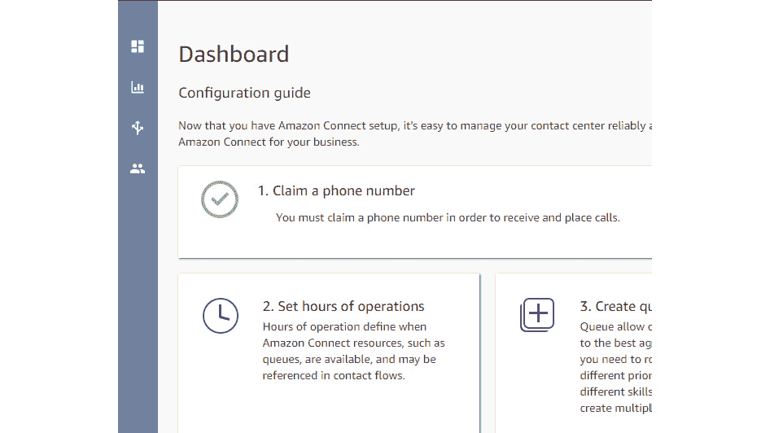

    ###### 图 5.13：Amazon Connect 仪表板屏幕

1.  您现在已经在 Amazon Connect 上拥有了一个工作的呼叫中心应用程序。

## 使用 Amazon Lex 聊天机器人和 Amazon Connect

使用 Amazon Lex，您可以创建智能聊天机器人。这可以通过将联系流程转换为常规对话来实现。Amazon Connect 服务通过启用创建一个联系中心（基于云）以及生成动态流程来补充上述功能。这为您的来电者提供个性化的体验。此外，来电者在通话过程中输入的**双音多频**（**DTMF**）数字可以很容易地被这些聊天机器人识别。

当 Amazon Lex 和 Amazon Connect 协同工作时，聊天机器人可以评估来电者的意图。此外，您可以使用 AWS Lambda 函数以及您的聊天机器人来处理来电请求，向来电者提供信息，并查询应用程序。这些聊天机器人能够通过智能管理对话和根据来电者的即时响应审查回复来维持上下文。

在下一节中，我们将连接您的 *MarketNanny* 聊天机器人到呼叫中心，这样用户就可以通过电话说话，并将他们的语音自动转换为文本话语，然后发送到 Lex 聊天机器人。

### 理解联系流程

**联系流程**定义了客户在与您的呼叫中心互动时经历的每个体验步骤。您可以通过使用提供的联系流程模板来创建联系流程。您也可以使用**创建**联系流程编辑器从头开始创建自己的联系流程。

**联系**流程设计器屏幕提供了一种在拖放环境中可视创建联系流程的方法。联系流程由左侧面板中的节点组成，在设计师区域（在“显示更多流程信息”链接下）可以访问。

节点根据`交互`、`设置`、`分支`、`集成`和`终止`/`转接`类别进行分类。可以通过点击类别名称旁边的下拉图标来隐藏或显示每个类别中的节点。您将通过为您的聊天机器人创建联系流程来探索一些可用的节点。

联系流程是用户（通常是主管）逐步刷新框架中每个进入的通话设置的方式，以确保用户听到定制和相关的选项。虽然有许多预设计的联系流程，但您将为您的`MarketNanny`聊天机器人创建一个新的流程。

### 联系流程模板

以下是可以使用的模板：

+   **客户队列流程**：管理客户在队列中的体验，在连接到客服代表之前。

+   **客户等待流程**：管理客户在等待时的体验。

+   **客户旁白流程**：管理在加入客服代表之前，客户在电话呼入过程中体验到的内容。

+   **外呼旁白流程**：管理在连接到客服代表之前，客户在电话外呼过程中体验到的内容。

+   **客服代表等待流程**：监督专家在与客户等待时的体验。使用此流，在客户等待时，至少可以播放一个声音提示到专家，使用 Loop 提示方块。

+   **客服旁白流程**：管理客服代表在电话呼入过程中，在加入客户之前体验到的内容。

+   **转接到客服代表流程**：管理客服代表在转接到另一个客服代表时的体验。

+   **转接到队列流程**：管理客服代表在转接到另一个队列时的体验。

在下一节中，我们将设置您的呼叫中心，使其能够接受来电，将您的`MarketNanny`聊天机器人连接到呼叫中心，以便用户可以通过电话说话，并且将用户的语音自动转换为文本话语，该话语将被发送到 Lex 聊天机器人。

聊天机器人随后继续处理话语，查找意图和槽位，并通过您在上一节中设置的 Lambda 函数来满足它。

为了将您的呼叫中心实例与您的聊天机器人连接，您需要暂时返回主屏幕（不是仪表板）。选择`联系`流程的链接。

### 练习 20：将呼叫中心连接到您的 Lex 聊天机器人

在这个练习中，您将设置您的呼叫中心，使其能够接受来电，并将您的`MarketNanny`聊天机器人连接到呼叫中心。以下为完成步骤：

#### 注意

这不是之前的仪表板屏幕。你可能会在那里找到一个联系流程条目，但它不是我们感兴趣的。

1.  在这里，您将找到一个标题为 Amazon Lex 的部分，在 Lex 机器人下有一个下拉菜单。点击下拉菜单以找到作为条目的`MarketNanny`机器人，并选择它，然后选择**保存 Lex 机器人**链接来保存它：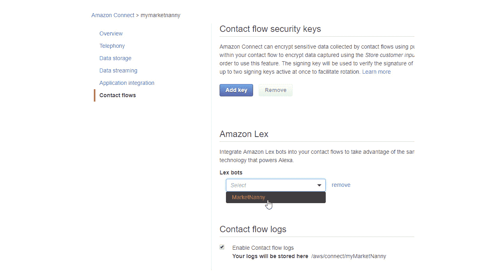

    ###### 图 5.14：带有 Lex 机器人选择下拉菜单的联系流程屏幕

1.  现在，您可以通过选择**概览**链接并点击登录为**管理员**按钮来导航回**仪表板**屏幕。**仪表板**屏幕将在新的浏览器标签页中打开：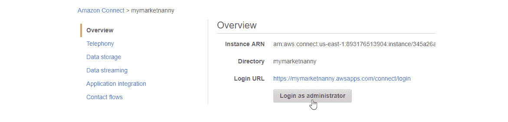

    ###### 图 5.15：登录为管理员屏幕

1.  在仪表板屏幕上，选择**路由**图标，当它打开时，选择**联系流程**：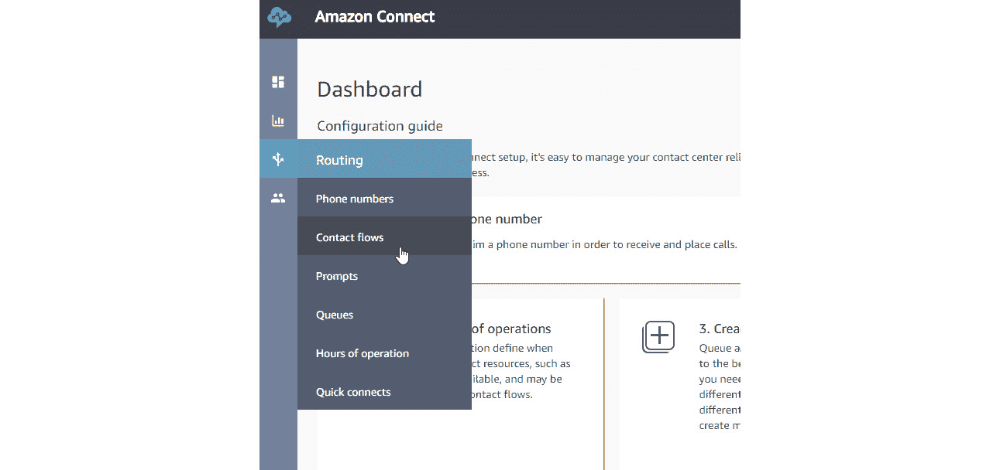

    ###### 图 5.16：从仪表板选择路由和联系流程

1.  这将带您到一个**联系流程**屏幕，而不是我们之前所在的屏幕。这个屏幕是**联系流程设计器**，您可以在其中设计和创建**新的**联系流程：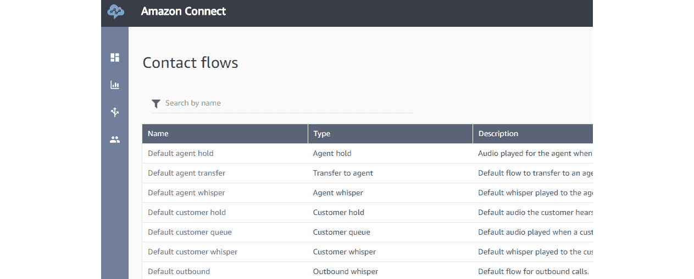

    ###### 图 5.17：联系流程屏幕

1.  点击`MarketNannyFlow`：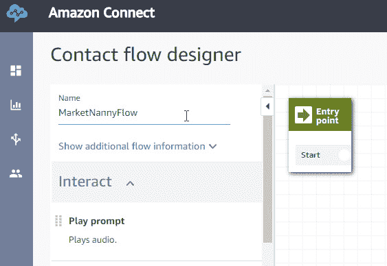

    ###### 图 5.18：联系流程设计器屏幕

1.  你将为你的聊天机器人的联系流程使用的第一个节点是**设置声音**节点。你可以在**设置**类别下找到它，并将其拖动到**入口点**节点右侧的图形视图中，该节点已经显示在视图中。

1.  通过点击输出圆圈并使用鼠标将其拖动到**设置声音**节点左侧的输入凸起处，将入口节点输出与**设置声音**节点输入连接起来：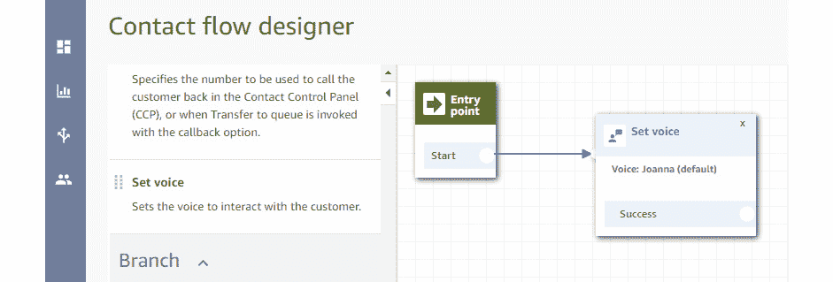

    ###### 图 5.19：带有设置声音节点的联系流程设计器屏幕

1.  接下来，你可以通过点击节点顶部来设置节点的属性。这将弹出一个面板，显示在屏幕的右侧，其中包含你可以设置的相应属性。

1.  对于此组件，它提供了**语言**和**声音**属性，这两个属性都可以通过在每个属性标签下的下拉菜单中选择一个值来设置。你可以设置适合你场景的值，然后点击**保存**按钮：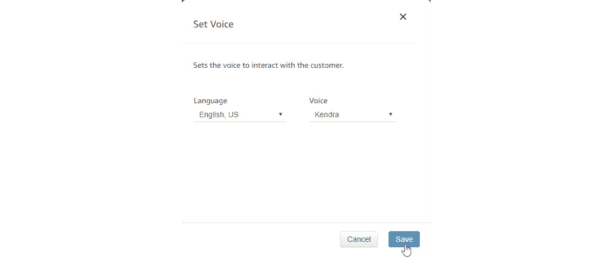

    ###### 图 5.20：设置声音节点的属性

1.  下一个要添加的节点是 **获取客户输入** 节点，您可以在交互选项卡下找到它。您可以像连接 **设置声音** 到入口节点一样，将此节点的输入连接到 **设置声音** 节点的输出：

    ###### 图 5.21：添加获取客户输入节点

1.  首先，选择 `文本` `到` `语音`（临时）选项，并点击其下的 **输入文本**。在输入文本框中，输入以下问候语等：

    ```py
    Hi this is the Market Nanny chatbot. How may I help you today?
    ```

    #### 注意

    随意替换为可能更适合您的其他文本。

1.  这是当 **联系中心** 应用程序首次接听电话时将转换为语音问候的文字：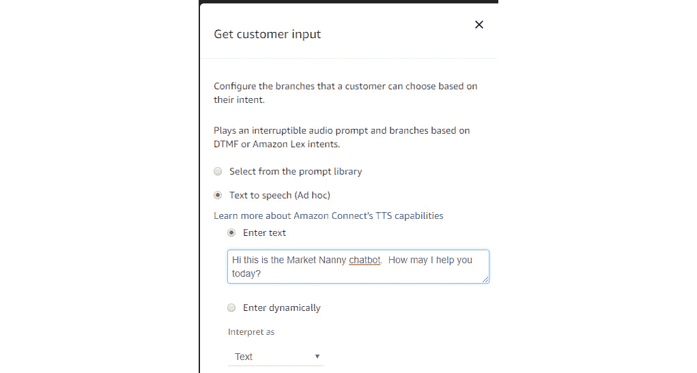

    ###### 图 5.22：获取客户输入属性

1.  接下来，向下滚动设置面板并选择 Amazon Lex 子部分，而不是 `DTMF` 部分。在这里，您将能够配置节点以与您的聊天机器人一起工作。

    #### 注意

    DTMF 部分提供了一种通过电话按键操作与呼叫者进行交互的方法，但今天我们不会涉及这一点。我们更感兴趣的是让我们的聊天机器人与呼叫者进行交互！

1.  在本节中，在 Lex 机器人下，您可以输入您的聊天机器人的名称和别名。在名称下，输入 `MarketNanny`，并在 `$LATEST` 下。

1.  `$LATEST` 是一个系统定义的别名，它指定联系中心将始终访问最近发布的 `MarketNanny` 聊天机器人版本：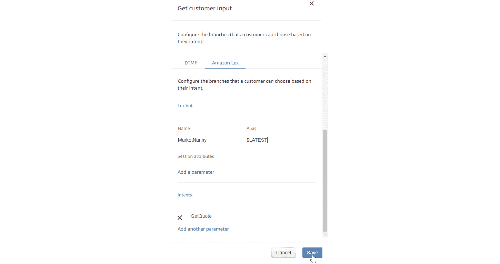

    ###### 图 5.23：获取客户输入属性中的 Amazon Lex 属性

1.  最后，在意图部分指定 `GetQuote` 意图。由于这是我们目前正在处理的唯一意图，请单击 **保存** 按钮：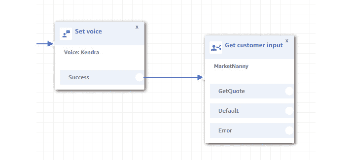

    ###### 图 5.24：获取客户输入节点中的 GetQuote 意图

1.  您现在可以看到，**获取客户输入** 节点已更改以显示其属性面板中指定的意图：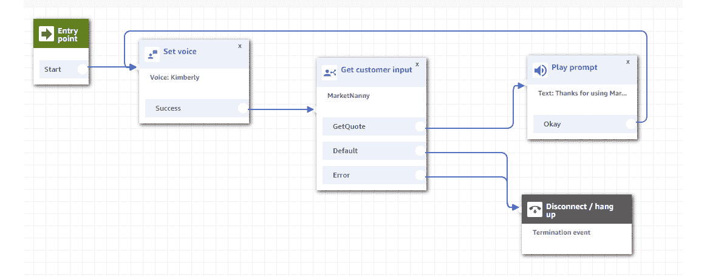

    ###### 图 5.25：完整联系中心流程

1.  您可以通过添加两个更多节点来完成流程：

    +   从 `交互` 部分选择 `播放` 提示。在属性面板中，将提示属性设置为文本到语音（临时），并在以下文本框中输入文本：

        ```py
        "Thanks for using MarketNanny" Feel free to ask me something else.
        ```

    +   从 `终止`/`转接` 部分的 `断开连接`/`挂断`。不要设置任何属性。

1.  按照之前所示连接节点。

1.  将 **获取客户输入** 中的默认和错误状态输出连接到 **断开连接**/**挂断** 节点的输入。

1.  将 `GetQuote` 输出连接到播放提示节点。

1.  将 `播放` 提示的输出连接到 **设置** 声音的输入。这确保了您可以在保持正确提问的情况下与您的聊天机器人进行交互。

1.  最后，点击屏幕右上角**保存**按钮旁边的下拉图标，并选择**保存和发布**以发布联系流程：

    ###### 图 5.26：保存和发布部分

1.  作为最后一步，你将连接你的呼叫中心电话号码到刚刚创建的新联系流程。

1.  从屏幕左侧的菜单面板中选择**路由**菜单，然后从该菜单中选择**电话号码**项：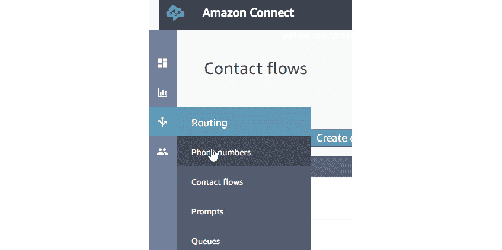

    ###### 图 5.27：从仪表板选择路由和电话号码

1.  这将打开`MarketNanny`。

1.  选择电话号码将带你去到编辑电话号码页面：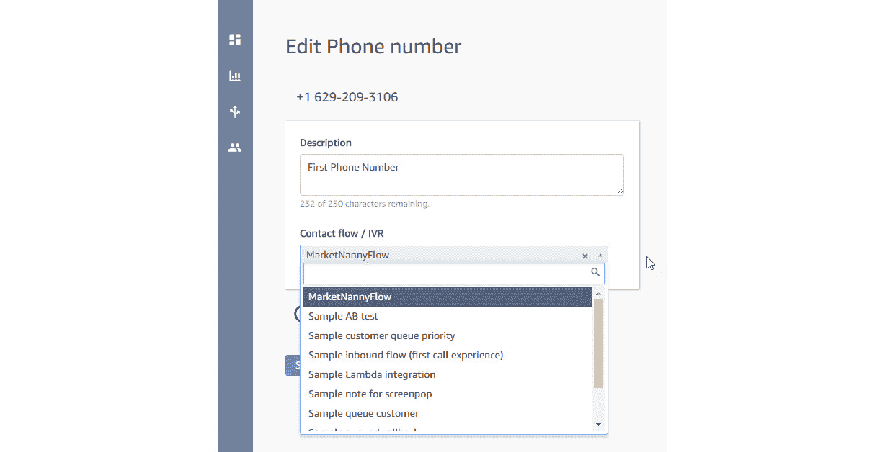

    ###### 图 5.28：编辑电话号码屏幕

1.  在这里，点击`MarketNannyFlow`下的下拉菜单。

1.  拨打你的呼叫中心电话号码以验证你是否可以通过与它说话来与你的`MarketNanny`聊天机器人交互！

### 活动一：创建自定义机器人和将机器人与 Amazon Connect 连接

在这个活动中，我们将创建一个用于检查**账户余额**的**Amazon Lex**机器人。该机器人将检查账户余额。一个**Amazon Lex**机器人通过**自动语音识别**（**ASR**）和**自然语言理解**（**NLU**）能力进行控制，这与推动 Amazon Alexa 的类似创新。为此，我们将考虑以下示例：假设用户想要检查他们的账户余额；用户可能会使用**我想检查我的账户余额**。你可以配置 Amazon Lex 机器人的意图到 Amazon Connect 实例。你可以创建一个联系流程并添加你的 Amazon Lex 机器人。为了确保这正确发生，你需要导航到 Amazon Lex 服务和 Amazon Connect 服务以连接机器人：

1.  创建一个 Amazon Lex 机器人。

1.  通过创建意图并添加槽位来配置机器人。

1.  配置机器人并配置机器人错误处理，例如当呼叫者的言语不被理解时。

1.  构建和测试机器人。

1.  发布机器人并创建一个别名。

1.  将机器人添加到你的 Amazon Connect。

1.  创建一个联系流并将其包括在内。

1.  将联系流程分配给电话号码。

    #### 注意

    要参考详细步骤，请参阅本书末尾的附录 A 第 225 页。

## 摘要

在本章的第一部分，你学习了 Amazon Connect 的基础知识，甚至查看了 Amazon Connect 的免费层版本。后来，我们探讨了使用 Amazon Connect、Lex 和 Lambda 的基于语音的聊天机器人应用程序示例。接下来，我们创建了一个个人呼叫中心。

你还学会了如何为个人呼叫中心获取一个免费电话号码。我们还了解了如何使用 Amazon Lex 聊天机器人和 Amazon Connect 配合联系流程和不同的模板。最后，你学习了如何将呼叫中心连接到你的 Lex 聊天机器人。

在下一章中，你将学习如何使用计算机视觉和 Amazon Rekognition 服务来分析图像。Amazon Rekognition 服务用于检测图像中的物体、场景和文本。它还用于匹配不同图像中的面部，并比较这两张图像之间是如何紧密相连的。
