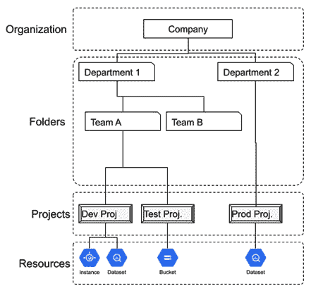
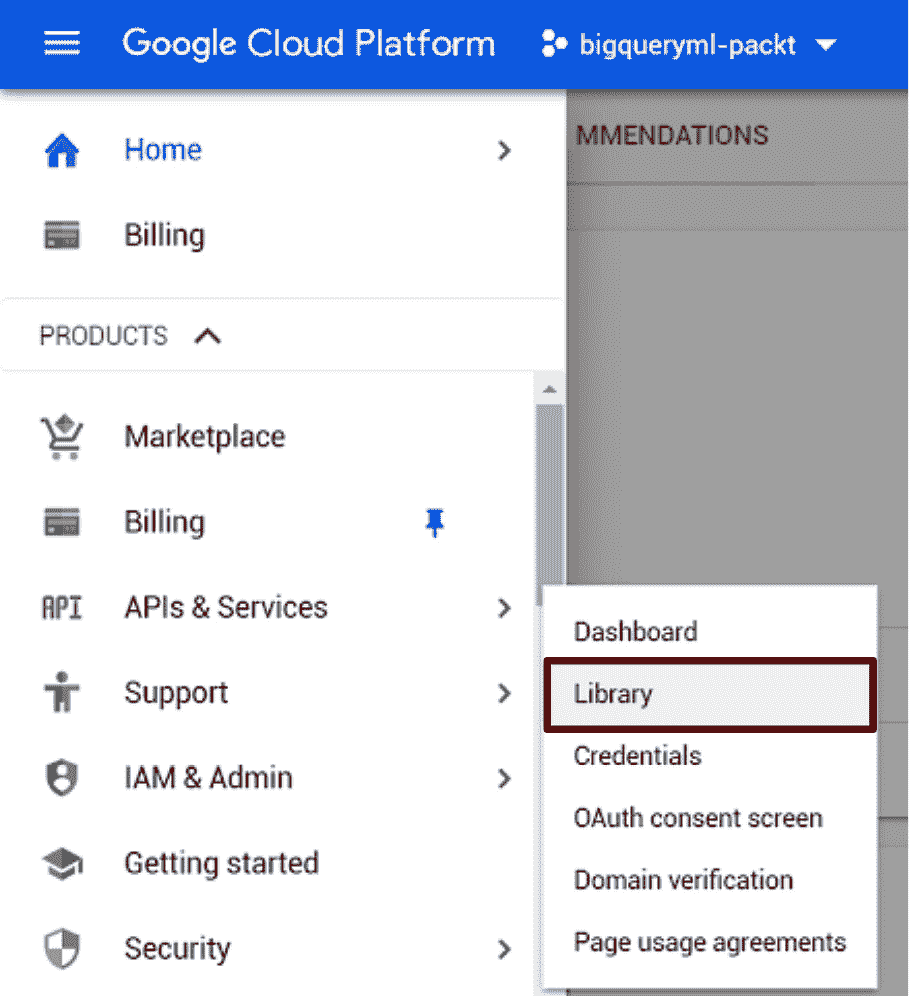
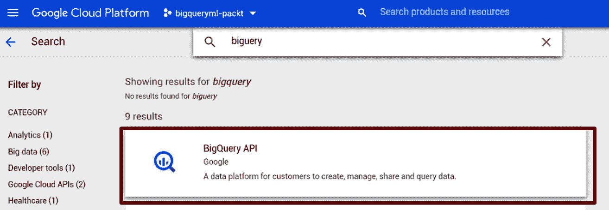
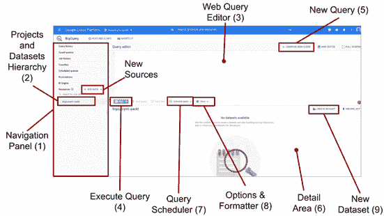
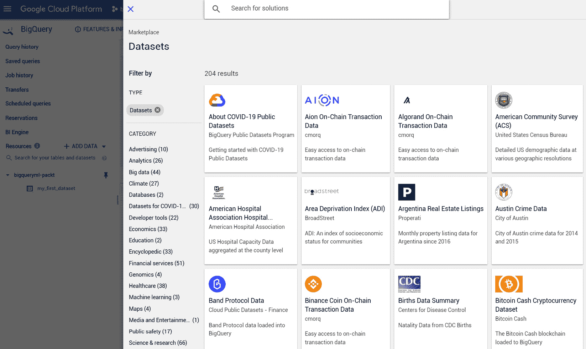
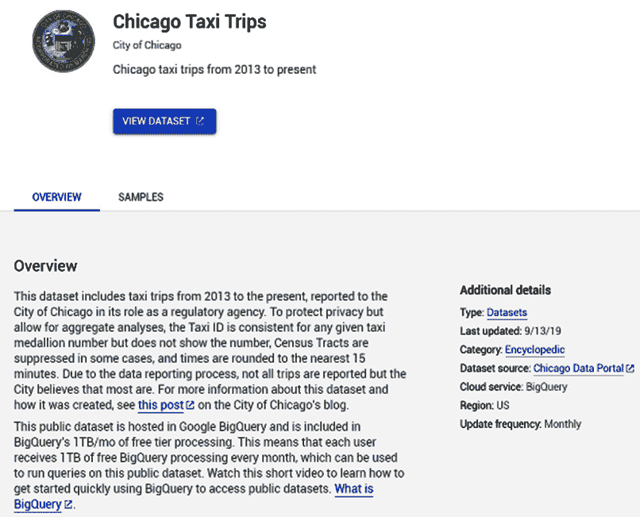
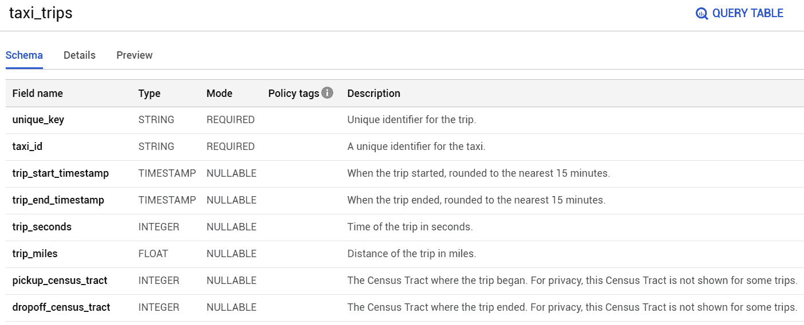

# 第二章：设置您的 GCP 和 BigQuery 环境

使用新的公共云提供商的第一步可能很复杂，有时您可能会被面前所有的服务和选项所压倒。云服务提供商提供各种组件和资源来解决不同的用例。有了这么多模块，决定使用哪个服务并不容易。幸运的是，为了创建和运行一个 **Google Cloud Platform** (**GCP**) 项目，您不需要具备特定的技术技能或大量的预算来投资。无论您是私人用户还是大公司的员工，GCP 都提供了通过在平台上创建账户和项目来使用其云服务的机会。还可以利用免费试用来获取信用并测试产品一段时间。

本章涵盖的主题将帮助您为您的技术环境建立一个坚实的基础，并且所涵盖的任务应该只执行一次。为了避免任何不确定性和迷失方向，在本章中，您将逐步通过以下活动：

+   创建您的 GCP 账户和项目

+   激活 BigQuery

+   发现 BigQuery 网页用户界面

+   探索 BigQuery 公共数据集

# 技术要求

本章要求您能够访问网页浏览器。为了执行本章中描述的步骤，我们建议使用以下之一：

+   Google Chrome

+   Firefox

+   Microsoft Edge

+   Microsoft Internet Explorer 11+

+   Safari 8+（不支持 Safari 私密浏览模式）

现在您已经准备好了一个受支持的网页浏览器，让我们深入了解创建新的 GCP 账户和项目。

# 创建您的 GCP 账户和项目

开始使用 GCP 的第一步是创建一个新的 **GCP 账户** 和一个新的 **项目**。项目是多个 GCP 资源的一个容器，通常用户通过他们的账户访问它。GCP 资源的例子包括 Google Compute Engine 虚拟机、Google Cloud Storage 存储桶、App Engine 实例和 BigQuery 数据集。GCP 项目还与一个计费账户相关联，所有服务消费的成本都会计费到这个账户。GCP 对象可以按层次结构组织。项目是层次结构的第一级，可以分组到 **文件夹** 中。每个文件夹可以有另一个文件夹或 **组织** 节点作为父节点。组织位于 GCP 层次结构的顶部，并且不能有父节点。

在以下图中，您可以看到由一个组织节点、两个主要文件夹和两个嵌套文件夹组成的层次结构，这些文件夹连接到三个不同的 GCP 项目：

](img/B16722_02_001.jpg)

图 2.1 – 由资源、项目、文件夹和组织组成的 GCP 资源层次结构

根据 GCP 最佳实践，建议您创建不同的项目以分离不同的环境，例如 **开发**、**测试**、**质量保证** 和 **生产**。文件夹特别有用，可以隔离属于不同部门或同一公司内部不同团队的作业。创建组织节点不是必需的，但可以用来将整个公司或法律实体的所有作业分组。组织和文件夹节点用于在公司各部门之间分配统一的政策和权限，并具有独特和集中的控制点。

小贴士

要使用 GCP 文件夹，创建组织节点是强制性的。如果未创建组织节点，则每个项目将被视为与其他项目逻辑上分离，并且不能分组到文件夹中。

为了进行本书的动手练习，我们只需创建一个 GCP 项目。这是我们组织本书各章节中创建的所有 BigQuery 数据集的唯一必需品。

现在我们已经了解了 GCP 资源的组织方式，让我们看看如何创建一个新的 **Google 帐户**。

## 注册 GCP 帐户

要开始使用 GCP，我们至少需要一个用户。用户是在 **身份和访问管理**（**IAM**）系统中配置的 **成员**。IAM 的目标是授予适当的访问权限和权限给适当的成员。GCP 支持不同类型的成员：

+   **Google 帐户**：任何可能与 GCP 交互的人，通过电子邮件地址识别，例如 Gmail 帐户。

+   **服务帐户**：一个技术用户，不直接与人类用户关联。它被分配给 GCP 服务以与其他资源交互和访问。

+   `user2@companyxyz.com` 和 `user3@companyxyz.com`。

+   **云身份域**：类似于 Google Workspace 域，唯一的区别是，这个用户组无法访问 Google 的生产力套件。

+   **Google 组**：代表一组帐户。它与电子邮件别名相关联，并可用于将相同的权限和授权分配给多个帐户。

为了我们的目的，我们将使用 Google 提供的免费试用版创建一个简单的 Google 帐户，该试用版可在以下地址找到：[`cloud.google.com/free`](https://cloud.google.com/free)：

![图 2.2 – Google Cloud 网页访问 GCP 免费试用

![图 2.2 – 访问 GCP 免费试用的 Google Cloud 网页

![图 2.2 – 访问 GCP 免费试用的 Google Cloud 网页

此免费选项让您可以免费开始使用 GCP，并提供以下服务：

+   利用每个 GCP 服务免费层的可能性，包括 BigQuery。此选项没有到期日期。

+   300 美元的有限信用额度，以克服免费层的限制或使用其他服务。此信用额度在 90 天后到期。

如果你还没有创建 GCP 项目，请先选择**免费开始**，或者点击**登录**以访问您现有的 GCP 控制台。出于教育目的，我们将选择**免费开始**以展示整个账户创建过程，如下面的截图所示：

![图 2.3 – 为 GCP 创建 Google 账户

![图片 B16722_02_003.jpg]

图 2.3 – 为 GCP 创建 Google 账户

如果你没有现有的电子邮件地址，你可以在 GCP 注册过程中直接创建一个 Gmail 账户。在账户创建过程中，您需要指定您的名字和姓氏、现有的或新的电子邮件地址以及一个强大的密码以访问 GCP。

接受隐私条款后，您将被重定向到 GCP 注册过程，该过程基本上由两个步骤组成：

1.  在第一步，您需要选择您的国家，阅读并同意服务条款，然后注册以接收来自 Google 及其合作伙伴的更新。如*图 2.4*右侧所示，注册页面总结了免费试用版的主要条件：![图 2.4 – GCP 账户创建的第一步

    ![图片 B16722_02_004.jpg]

    图 2.4 – GCP 账户创建的第一步

1.  第二步要求您提供所有必要的 GCP 项目计费信息。这一步要求您提供账单地址和信用卡以开始使用 GCP：![图 2.5 – 创建 GCP 账户所需提供的信息

    ![图片 B16722_02_005.jpg]

    图 2.5 – 创建 GCP 账户所需提供的信息

1.  在过程结束时，选择**开始我的免费试用**；您将准备好访问 Google Cloud Console 的主页。

    小贴士

    虽然创建 Google Cloud 账户需要信用卡，但只有在您明确决定将账户从免费层升级到付费版本时，才会使用信用卡。

现在我们已经创建了我们的 Google 账户，并且第一次访问了 Google Cloud Console，在下一节中，我们将探索这个网络界面的主要功能。

## 探索 Google Cloud Console

Google Cloud Console 允许用户通过图形用户界面访问和使用所有 GCP 资源。

在下面的截图中，您可以查看 Google Cloud Console 及其主要部分：

![图 2.6 – Google Cloud Console 功能概述

![图片 B16722_02_006.jpg]

图 2.6 – Google Cloud Console 功能概述

从左上角开始，你可以看到汉堡按钮以访问导航菜单（`1`）。此菜单允许你在所有 GCP 资源之间浏览并选择要使用的服务。向右移动，紧接在 GCP 标志之后，你会看到当前 GCP 项目的名称（`2`），它显示当前正在使用的环境。搜索栏（`3`），位于页面顶部，允许我们在项目中查找特定的资源或技术，可以被视为导航菜单的替代品。

专注于右上角，我们可以找到（`4`）。此工具提供了从 Google Cloud Console 直接使用 Linux 命令行的可能性，这是免费的。这个 Linux 环境已经预先配置了 Google Cloud SDK，以便轻松地在你 GCP 项目中配置和管理资源。此外，它还可以用于临时存储数据，因为它提供了 5 GB 的免费容量。

向左移动，你可以看到账户设置（`5`）功能，用于访问你的 Google 账户资料，并在需要时注销。

屏幕的大部分中央区域被仪表板（`6`）占据。它包含一些卡片，可以让你一眼了解你的 GCP 项目概览。这些卡片是可以通过右侧的`7`按钮显示或隐藏的小部件。

现在我们已经查看了 GCP 控制台的首页，我们准备好创建一个新的 GCP 项目，该项目将托管本书的所有动手活动。

## 创建 GCP 项目

正如我们解释的，GCP 项目是我们使用的所有 GCP 资源的容器。每个项目都有以下特征：

+   **项目名称**：在创建阶段选择的一个易于记忆和可读的名称。名称不必是唯一的；它具有纯粹描述性的功能，可以在项目创建后更改。

+   **项目 ID**：这是一个唯一的标识符，由用户分配或在创建新项目时由 Google 自动生成。与项目名称不同，它不能被修改。ID 需要在 GCP 中是唯一的。

+   **项目编号**：由 GCP 自动生成且用户无法更改的标识符。它在 GCP 中也是唯一的。

在 Google Cloud Console 的**项目信息**卡片中查看，所有这些标识符都可以轻松读取：

![Figure 2.7 – The Project info widget shows the identifiers of a GCP project

![img/B16722_02_007.jpg]

图 2.7 – 项目信息小部件显示了 GCP 项目的标识符

通过选择当前正在使用的项目名称，我们可以访问我们允许访问的所有 GCP 项目列表：

![Figure 2.8 – By selecting the name of the project in use, it is possible to change it

![img/B16722_02_008.jpg]

图 2.8 – 通过选择正在使用的项目名称，可以更改它

点击会弹出一个窗口，允许我们更改当前项目或浏览 GCP 的组织、文件夹和项目层次结构。在我们的情况下，唯一的现有 GCP 项目是**我的第一个项目**，这是在注册过程中自动创建的。

让我们逐步了解创建新项目的流程：

1.  通过在窗口右上角选择**新建项目**按钮，可以创建一个新环境来逻辑上分离云工作负载。就我们的目的而言，我们将创建一个专门的 GCP 项目来托管本书章节中后续的所有动手练习：![图 2.9 – 此窗口允许您选择现有项目或创建新项目

    ![img/B16722_02_009.jpg]

    图 2.9 – 此窗口允许您选择现有项目或创建新项目

1.  在下一步中，您需要填写项目名称。在这种情况下，我们将使用`bigqueryml-packt`，但您可以选择另一个名称。这也是将您的 GCP 项目链接到父对象（如组织或文件夹）的地方。选择**编辑**后，您还有机会更改自动生成的项目 ID。通过点击**创建**按钮，您将创建新项目：![图 2.10 – 新建项目窗口允许您选择项目名称、ID 和位置

    ![img/B16722_02_010.jpg]

    图 2.10 – 新建项目窗口允许您选择项目名称、ID 和位置

1.  几秒钟后，我们将在 GCP 控制台的右上角通过点击铃铛图标收到关于新项目创建的通知：![图 2.11 – 当创建新项目并准备好使用时，GCP 用户会收到通知

    ![img/B16722_02_011.jpg]

    图 2.11 – 当创建新项目并准备好使用时，GCP 用户会收到通知

1.  创建后，新的 GCP 项目也将在项目层次结构中可见，并且可以选择它作为当前工作环境：

![图 2.12 – 项目创建后，可以将其设置为当前项目

![img/B16722_02_012.jpg]

图 2.12 – 项目创建后，可以将其设置为当前项目

现在我们已经创建了一个新项目，是时候开始使用 BigQuery 了。在下一节中，我们将学习在使用之前如何激活该服务。

# 激活 BigQuery

每个 GCP 服务都可以根据客户需求和需要实现的使用场景来启用或禁用。就我们的目的而言，我们将展示激活 BigQuery 服务的必要步骤，但同样的方法可以扩展到其他 GCP 技术：

小贴士

启用或禁用 GCP 服务不会影响您 GCP 项目的计费。您只需为实际使用的 GCP 组件付费，而不是仅仅因为启用了服务。

1.  第一步是访问 API 和服务库，这可以在 Google Cloud Console 的导航菜单中轻松找到：

    图 2.13 – 从 GCP 控制台的导航菜单，可以访问 GCP 服务库

    此功能允许您浏览整个 GCP 服务库，并选择要开启或关闭的服务。

1.  如果我们在搜索栏中搜索 *bigquery*，第一个结果将是 **BigQuery API**：

    图 2.14 – 使用搜索栏查找 bigquery，可以找到 BigQuery API 服务

1.  点击 **BigQuery API** 后，我们将被重定向到一个专门针对 BigQuery 服务的页面，在那里可以阅读服务的描述，访问 BigQuery 文档，并在之前未启用的情况下启用服务。如果服务已被禁用，直接从导航菜单访问 BigQuery 将会重定向我们到同一页面。

1.  选择 **启用** 按钮，GCP 将激活 BigQuery，让您开始使用它。一旦服务有效启用，您将被重定向到服务的仪表板，该仪表板显示了使用统计概览，并允许您使用 **禁用 API** 按钮禁用此组件。

到目前为止，我们已经创建了一个新的 Google 账户和一个专门的 GCP 项目，并已启用 BigQuery；现在是时候查看 BigQuery 网络界面了。

# 发现 BigQuery 网络用户界面

当 BigQuery API 启用时，为了访问 BigQuery UI，您可以在 GCP 导航菜单中打开并从 Google Cloud 服务列表中选择 **BigQuery**。

初看（见下面的截图），BigQuery UI 可能看起来很复杂，因为它包含大量信息和按钮。在屏幕左侧，我们可以看到一个由导航面板（**1**）占据的列。此面板分为两个主要部分。在上一个部分中，您可以访问以下内容：

+   **查询历史**，它跟踪所有之前执行的查询及其执行状态。

+   **保存的查询**，一个存储您保存并频繁使用的查询的区域。

+   **作业历史**，以跟踪所有批量加载、导出和复制操作及其执行状态。

+   **传输** 功能使我们能够将数据导入 BigQuery，利用来自 **软件即服务**（**SaaS**）应用程序的 **BigQuery 数据传输服务**，例如 Google Analytics、Google Ads 或 Amazon S3。

+   **计划查询**，以定期计划查询或监控已计划执行的查询。

+   **预留**，以固定费率模型预留 BigQuery 处理能力。

+   **BI Engine** 允许您在 BigQuery 上激活内存层，以进一步提高性能并获得报告活动的亚秒级延迟。

+   **资源** 允许您浏览不同的 GCP 项目和数据集。

在导航面板的下半部分，我们可以访问和浏览项目、相关的 BigQuery 数据集以及如表、视图和机器学习模型（**2**）等数据结构：

图 2.15 – BigQuery 网页界面的所有功能

在网页页面的顶部中央，您可以使用 **Web 查询编辑器**（**3**）编写 SQL 语句，并使用 **运行** 按钮（**4**）运行这些查询。开发者可以通过右上角的 **隐藏编辑器** 按钮，或通过选择 **编写新查询**（**5**）来隐藏 Web 查询编辑器。在查询编辑器下方，您可以可视化执行查询的结果以及每个选中项的详细信息（**6**），例如数据集或表。在网页界面的两个部分之间，可以访问 **查询调度器** 工具（**7**）。点击 **更多** 按钮（**8**），也可以访问 BigQuery 选项和 SQL 格式化器，后者用于使 SQL 查询易于阅读。

在 **bigqueryml-packt** 面板的右侧，您可以选择/点击 **创建数据集**（**9**）来创建一个新的 BigQuery 数据集。

小贴士

在 BigQuery 选项中，您可以找到启用或禁用 BigQuery 缓存的选项。如果启用缓存，BigQuery 会尝试使用可用的缓存结果。如果查询结果已经在缓存中，则不会执行查询。缓存用于节省计算资源并获得高性能。如果查询包含非确定性函数，例如 `CURRENT_TIMESTAMP()` 和 `NOW()`，则不会使用缓存，BigQuery 将执行查询语句。

在本节中，我们分析了 BigQuery 网页界面中所有可用的主要功能。现在，我们可以开始探索 **BigQuery 公共数据集**并了解如何在我们的项目中使用它们。

# 探索 BigQuery 公共数据集

收集大量数据对于开发机器学习用例至关重要。这类活动被认为是数据管理领域中最痛苦的工作之一。实际上，它需要工具和最佳实践来定期监控和从物理世界收集信息，将其转换为数据。多亏了 **云公共数据集计划**，我们被允许使用已经收集并导入到 BigQuery 中的数据。

**BigQuery 公共数据集**可在**Google Cloud Marketplace**的**数据集**部分找到，这些数据集对所有 GCP 用户公开可用，并准备好使用。所有数据集的列表可通过此 URL 访问：[`console.cloud.google.com/marketplace/browse?filter=solution-type:dataset`](https://console.cloud.google.com/marketplace/browse?filter=solution-type:dataset)。这些数据集不仅由谷歌提供，还由许多大公司和公共机构提供，这些机构为维护这个大约 200 个数据集的多学科集合做出了贡献。一些贡献者包括 GitHub、NOAA、NASA、芝加哥市、牛津大学和美国交通部。

公共数据集也可以直接从 BigQuery UI 访问。在接下来的几页中，我们将逐步了解如何开始使用它们。

## 搜索公共数据集

从 BigQuery UI，我们可以在导航菜单中选择**添加数据**按钮，然后点击**探索公共数据集**以打开一个覆盖窗口，该窗口将显示按感兴趣类别划分的 BigQuery 公共数据集。

在下面的屏幕截图中，你可以看到一些 BigQuery 公共数据集：

![图 2.16 – 主 BigQuery UI 中嵌入的 BigQuery 公共数据集视图]

![图 2.16 – 主 BigQuery UI 中嵌入的 BigQuery 公共数据集视图]

从这个屏幕，你可以上下滚动以探索可用的数据集，使用搜索栏查找特定主题，或使用**类别**菜单来筛选主题。

为了我们的目的，我们将寻找由芝加哥市发布的与**芝加哥出租车行程**相关的公开数据。为了找到这个数据集，建议搜索关键词“芝加哥出租车”，并选择唯一一个名为**芝加哥出租车行程**的项目。

在下面的屏幕截图中，你可以看到数据集的描述：

![图 2.17 – 可从 Google Cloud Marketplace 访问的芝加哥出租车行程公共数据集概述]

Google Cloud Marketplace

![图 2.17 – 可从 Google Cloud Marketplace 访问的芝加哥出租车行程公共数据集概述]

在**概述**部分，数据集被描述，并在右侧提供了附加信息。在这种情况下，我们可以读到该数据集每月更新，并在芝加哥数据门户上发布。

点击`bigquery-public-data`项目。浏览这个 GCP 项目，你会找到`chicago_taxi_trips`数据集，它只包含一个表：`taxi_trips`。

## 分析一个表

点击表名将允许您深入了解`taxi_trips`数据的一些方面。在**模式**选项卡中，我们可以探索构成所选表的字段。一些列被定义为**必需的**，而其他列是**可空的**。感谢数据集的发布者，这个表也得到了很好的文档记录，我们可以阅读每个字段的简短描述。这类信息将有助于我们在构建机器学习模型之前实施新用例的初期阶段：

图 2.18 – 通过导航菜单选择表名可以访问表模式

要深入了解表的技术细节，我们可以转到**详细信息**选项卡。本节显示了以下相关信息：

+   表的大小以 GB 为单位。

+   表中的行数。

+   表的创建日期以及最后一次更新的时间。

+   表存储的 BigQuery 区域。在这种情况下，数据存储在多区域 US。

    小贴士

    **行数**和**最后修改日期**为机器学习提供了基本信息。为了训练有效的模型，我们需要确保我们有足够的记录，并且这些记录不是过时的。使用记录数量不足或旧数据可能会产生低质量的机器学习模型。

**预览**选项卡提供了我们可以从表中收集到的最后可用信息。此功能允许我们查看存储在表中的数据样本，并一眼了解其内容。

在下面的屏幕截图中，您可以使用**预览**功能可视化表的记录：

图 2.19 – 预览选项卡展示了`taxi_trips`表的记录样本

小贴士

从`SELECT COUNT(*)`查询中访问信息。要查看记录样本，建议使用表上的`SELECT *`。

# 摘要

在本章的第二部分，我们迈出了 GCP 的第一步。在开始注册过程之前，我们查看 GCP 资源的层次结构，由多个项目、文件夹和组织节点组成。

之后，我们学习了如何创建新账户并利用 Google 提供的免费试用。然后，我们从网络浏览器中探索了 Google Cloud Console，并创建了一个新的 GCP 项目，我们将在下一章中使用它来托管我们的机器学习用例。

完成设置操作后，我们启用了 BigQuery API 以开始访问这个无服务器分析数据仓库。

由于 BigQuery 提供了许多不同的功能，我们逐步介绍了它们，探索了它们的实用性。其中最重要的功能之一是将公共数据集添加到我们的控制台。这一功能使我们能够访问和使用公司及公共机构已经编译好的表格。数据集已准备好使用，并且可以用来开发我们的用例。

对于本章，我们专注于由芝加哥市发布的关于出租车行程信息的表格。这个表格为我们提供了探索表格的技术细节以及如何预览其中数据的机会。

在下一章中，我们将编写我们的第一个 SQL 语句，以便对机器学习模型开发过程中极其宝贵的所有基本操作充满信心。

# 进一步阅读

以下链接将为您提供本章更多资源：

+   **Google Cloud 试用**: [`cloud.google.com/free`](https://cloud.google.com/free)

+   **在 GCP 中启用 API**: [`cloud.google.com/endpoints/docs/openapi/enable-api`](https://cloud.google.com/endpoints/docs/openapi/enable-api)

+   **BigQuery 网页界面**: [`console.cloud.google.com/bigquery`](https://console.cloud.google.com/bigquery)

+   **BigQuery 网页界面文档**: [`cloud.google.com/bigquery/docs/bigquery-web-ui`](https://cloud.google.com/bigquery/docs/bigquery-web-ui)

+   **BigQuery 公共数据集市场**: [`console.cloud.google.com/marketplace/browse?filter=solution-type:dataset`](https://console.cloud.google.com/marketplace/browse?filter=solution-type:dataset)

+   **BigQuery 公共数据集文档**: [`cloud.google.com/bigquery/public-data`](https://cloud.google.com/bigquery/public-data)

+   **芝加哥市数据门户**: [`data.cityofchicago.org/`](https://data.cityofchicago.org/)
