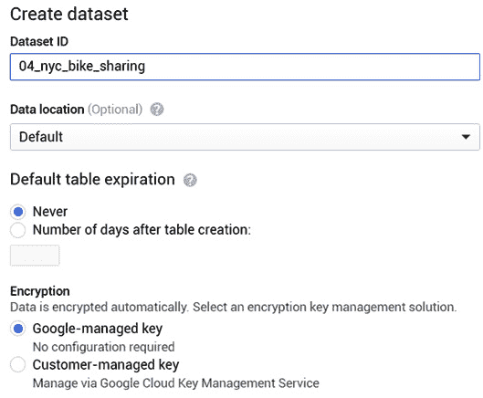
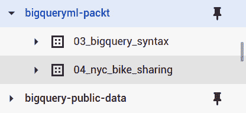
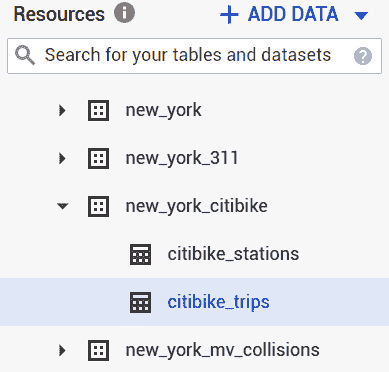
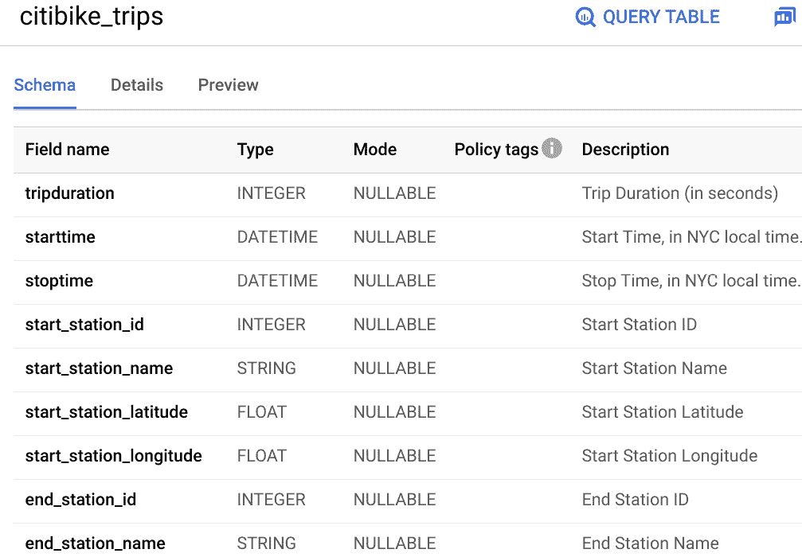
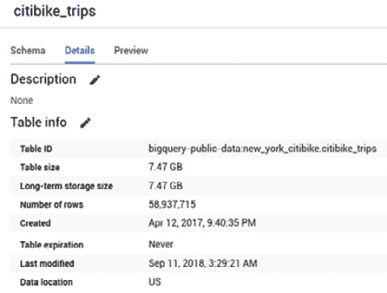
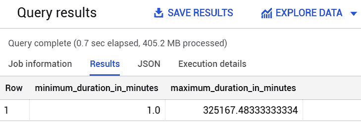
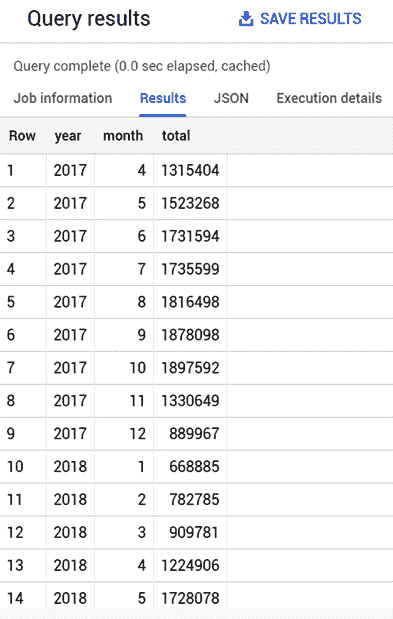
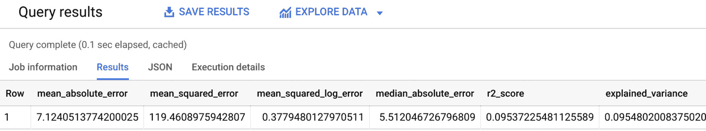
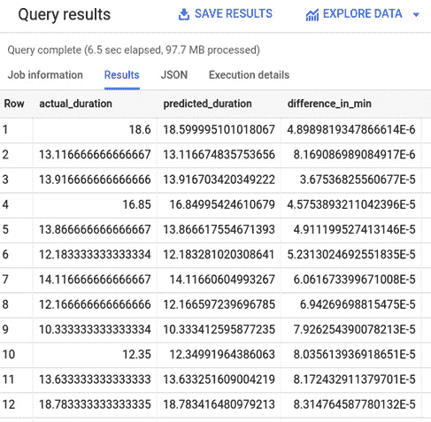

# 第四章：使用线性回归预测数值

对于需要根据预算和资源来规划战略的公司来说，预测数值可能具有极大的价值。在大多数行业中，预测数字可能比竞争对手带来巨大的商业优势，并能够开启新的商业场景。

线性回归起源于统计学领域，成为执行此类任务最知名的机器学习技术之一。在数据科学中，线性回归模型用于寻找和量化不同变量之间原因和效果之间的关系。这类模型在需要预测数值测量的不同商业场景中非常有用。

在本章中，我们将通过利用大查询 ML 构建线性回归模型的所有必要步骤，这将简化并加速开发过程的各个阶段。

通过采用逐步和渐进的方法，我们将涵盖以下主题：

+   介绍业务场景

+   发现线性回归

+   探索和理解数据集

+   训练线性回归模型

+   评估线性回归模型

+   利用线性回归模型

+   提炼业务结论

让我们开始吧！

# 技术要求

本章要求您能够访问网络浏览器并能够利用以下功能：

+   一个 GCP 账户以访问 Google Cloud Console

+   一个 GCP 项目来托管 BigQuery 数据集

现在，让我们深入分析和发展我们的大查询 ML 线性回归模型的部分。

查看以下视频以查看代码的实际应用：[`bit.ly/2Rru9wA`](https://bit.ly/2Rru9wA)

# 介绍业务场景

想象一下，你是一名在纽约市一家大型公司工作的商业分析师。你的公司管理着全国最大的共享单车项目。它利用了 10,000 辆自行车，并在纽约的不同地区（曼哈顿、布鲁克林、皇后区和泽西城）实现了 600 个站点。

以下是从纽约市的一个共享单车站拍摄的照片：

![图 4.1 – 纽约市共享单车服务由 Citi Bike 提供

]

图 4.1 – 由 Citi Bike 提供的纽约市共享单车服务

多亏了公司的远见和创新精神，自 2013 年以来已经收集了大量的数据，并且每天都在更新。这些数据包含了很多关于服务使用情况的信息，可以用来提取非常有趣的统计数据。

在撰写本文时，共享单车服务对所有已注册每周、每月或年度订阅的客户开放。然而，这对那些只在城市逗留几天的人（如游客或商务旅行者）来说既不便利也不容易获得。

考虑到在纽约市仅停留几天的庞大人群，公司希望人们能够仅租用几小时的自行车。因此，管理层正在考虑启用新的按使用付费的租赁选项的可能性。

公司的目标是为这部分客户创造一个完全数字化的体验，并正在考虑开发一个新移动应用程序。如果客户提前表明他们的出发站和到达站，移动应用程序应该能够预测平均旅行时间和行程的成本估算。多亏了这个功能，客户可以提前知道旅行时间是否与他们的时间表相匹配，以及与其他公共交通服务相比是否更便宜。

公司的一位经理可能会要求你使用**机器学习**（**ML**）来开发将被引入新移动应用程序的预测系统。该机器学习系统应使用已收集并存储在 BigQuery 公共数据集中的数据来预测自行车租赁的旅行时间。

既然我们已经解释并理解了问题陈述，让我们来看看我们可以使用的机器学习技术来预测诸如旅行时间这样的数值。

# 发现线性回归

**线性回归**是我们可以在拥有连续数值进行预测时应用的最简单技术之一。这是一个众所周知的算法，最初在统计学中引入，用于分析不同变量之间的相关性。

重要提示

在统计学中，回归一词表示两个变量是相关的。这个术语描述了因果关系。原因被称为**自变量**，而效果被称为**因变量**。因变量可以作为自变量的函数来计算。

下面的图表显示了两个变量之间简单线性关系的图形表示：

![图 4.2 – 简单线性回归的表示

![图片 B16722_04_002.jpg]

图 4.2 – 简单线性回归的表示

线性回归模型试图通过找到标签与其特征之间最佳线性关系来预测标签。如果机器学习模型只使用一个输入变量，则该模型定义为**简单线性回归**。如果 ML 模型基于多个特征，则称为**多元线性回归**。

在我们的业务场景中，行程的持续时间可以用一个数值来表示，因此我们可以使用线性回归方法来训练我们的机器学习模型。简单线性回归的一个例子是利用仅一个变量，例如起止站之间的距离，来预测结果。多元线性回归基于多个输入变量。在我们的场景中，这可能包括起止站之间的距离、骑行者的年龄以及租赁发生的星期几。

训练线性回归模型意味着尝试找到可以用于输入变量（称为特征）和输出变量（称为标签）之间线性方程的系数值。

我们不会在这本书中详细介绍线性回归的所有细节，但我们可以提及一些线性关系的例子，以更好地理解这个概念。在现实生活中，我们可以找到许多可以用线性回归很好地估计的度量，例如以下内容：

+   人的体重取决于他们的身高。

+   公司的收入是客户数量的函数。

+   飞机消耗的燃料量取决于航行的距离。

现在我们已经学习了线性回归的基础知识，是时候看看我们将用于构建机器学习模型的数据集了。

# 探索和理解数据集

在深入到机器学习实现之前，分析我们用例中可用的数据是必要的。由于机器学习训练基于示例，我们需要清楚地了解要考虑哪些数据，并检查可用记录的质量。

小贴士

数据科学家和商业分析师花费大量时间和资源来清楚地理解数据集，检查它们的质量，并准备它们。尽管这些操作似乎与实现机器学习算法没有直接联系，但如果你希望得到可靠的结果，它们是至关重要的。模型的实际训练是开始于理解数据、控制其质量并准备数据这一更长旅程的最后一英里。

让我们从清楚地了解我们数据集中用于构建用例的信息开始。

## 理解数据

为了清楚地了解我们将要用于实现此用例的数据集，我们需要做以下事情：

1.  登录 Google Cloud 控制台，从导航菜单访问 BigQuery 用户界面：![图 4.3 – 从 GCP 控制台访问 BigQuery 服务

    ![img/B16722_04_003.jpg]

    图 4.3 – 从 GCP 控制台访问 BigQuery 服务

1.  在我们*第二章*，“设置您的 GCP 和 BigQuery 环境”中创建的项目下创建一个新的数据集。为此，我们需要在 BigQuery 导航菜单中选择我们的 GCP 项目，并点击 `04_nyc_bike_sharing`，保留所有其他选项的默认值：

    图 4.4 – 创建新的 BigQuery 数据集以托管我们的用例资产

    此数据集将包含我们的 BigQuery ML 模型以及我们在本章后续步骤中创建的所有中间表。

    一旦创建了数据集，它将在 BigQuery 导航菜单中可见，如下截图所示：

    

    图 4.5 – 新数据集在 GCP 项目中可用，并在 BigQuery 导航菜单中可见

1.  打开托管所有 BigQuery 公共数据集的 **bigquery-public-data** GCP 项目，浏览项目直到找到 **new_york_citibike** 数据集。在这个公共数据集中，我们将看到两个 BigQuery 表：**citibike_stations** 和 **citibike_trips**。第一个表是我们自行车共享服务的站点注册表，而第二个表对我们用例来说最有兴趣。我们现在可以开始分析它：

    图 4.6 – 纽约 Citi Bike 公共数据集包含两个不同的表，这些表可以用于我们的业务场景

1.  让我们在 BigQuery 导航菜单中点击 **citibike_trips** 表以访问该表的架构：

    图 4.7 – citibike_trips 表的结构列出了所有可以作为标签和特征的字段

    该表有良好的文档说明，对于每一列，我们可以轻松理解其名称、数据类型和内容的意义。

    此表包含对我们用例相关的信息：**tripduration** 字段表示每次自行车租赁的持续时间，以秒为单位。**tripduration** 的值是一个数值，这是我们业务场景中想要预测的，因此它将成为我们的 **标签**。

    表格中的所有其他字段都是潜在的**特征**。实际上，我们有关于起始站和终点站、行程发生时间以及一些关于客户的信息，例如他们的年龄。所有这些列都可能是特征的良好候选者，因为站点的位置与要通过的距离直接相关，并影响行程的持续时间。此外，骑行开始的时间可能会影响持续时间，因为在某些日子里，街道可能会更繁忙。然后，从客户的角度来看，我们可能会猜测年轻人骑得比老年人快。从模式的角度来看，我们可以得出结论，这个表格代表了一个很好的数据集，用于开发我们的机器学习模型，但我们需要进一步检查我们的初步猜测。

1.  作为下一步，让我们看看表格中有多少条记录，以及这些记录是否足够满足我们的需求。

    点击**详情**标签页，我们可以看到该表格包含超过 5800 万条记录：



图 4.8 – citibike_trips 表的详情标签页显示了可用的记录数

我们可以非常自信地使用如此大量的数据来构建 ML 模型。

在本节中，我们了解了仅通过分析 BigQuery 用户界面提供的元数据，我们可以获得多少信息。现在，是时候查看这个表格中的实际数据并有效地使用它了。

## 检查数据质量

数据质量对于构建健壮的机器学习模型至关重要。ML 模型从示例中学习。如果示例包含错误数据，模型不可避免地会从这些错误中学习并在实际使用中应用它们。

让我们开始分析用于构建我们的 ML 模型的数据库集：

1.  首先，我们将关注`tripduration`字段。这是我们希望用我们的机器学习模型进行预测的列，它代表我们的标签：

    ```py
    SELECT COUNT(*)
    FROM
      `bigquery-public-data.new_york_citibike.citibike_trips`
    WHERE
      tripduration is NULL
      OR tripduration<=0;
    ```

    这个查询语句计算了`tripduration`为空或小于零的行数。尽管表格描述报告称该数据集只包含持续时间大于 1 分钟的行程，但我们可以立即注意到这个查询的结果是一个大于 0 的数字。事实上，我们可以找到超过五百万条`tripduration`字段未正确赋值的记录。由于我们不能在标签的空值或错误值上训练模型，我们需要将这些记录排除在我们的用例之外。

1.  接下来，我们将检查`tripduration`字段的最低值和最高值，以证明任何可能对我们的机器学习模型性能产生不良影响的异常值：

    ```py
    SELECT  MIN (tripduration)/60 minimum_duration_in_minutes,
            MAX (tripduration)/60  maximum_duration_in_minutes
    FROM
      `bigquery-public-data.new_york_citibike.citibike_trips`
    WHERE
      tripduration is not NULL
      AND tripduration>0;
    ```

    虽然最小租赁时间是 1 分钟，但我们看到最大值与自行车共享服务的正常功能不兼容。实际上，最大时长超过 300,000 分钟，这大约相当于超过 225 天的租赁期。

    在下面的屏幕截图中，你可以看到查询的结果：

    

    图 4.9 – 查询结果，证明了`tripduration`列中存在异常值

    在准备我们的数据集时，我们会考虑所有这些因素，以避免对机器学习模型造成任何影响。

1.  然后，我们可以对所有可能的机器学习模型特征列应用类似的检查，排除那些`tripduration`值非显著性的记录：

    ```py
    SELECT  COUNT(*)
    FROM
      `bigquery-public-data.new_york_citibike.citibike_trips`
    WHERE
      (tripduration is not NULL
      AND tripduration>0) AND (
      starttime is NULL
      OR start_station_name is NULL
      OR end_station_name is NULL
      OR start_station_latitude is NULL
      OR start_station_longitude is NULL
      OR end_station_latitude is NULL
      OR end_station_longitude is NULL);
    ```

    使用这个查询语句，我们只关注租赁时长大于零且非空的记录。查询的目标是检查所有其他潜在特征字段不为空。

    在这种情况下，查询返回零。因此，我们可以确信，排除`tripduration`为`NULL`的行，我们将在其他列得到有意义的值。

1.  之后，我们可以分析`birth_year`列，该列代表使用自行车共享服务的客户的出生年份：

    ```py
    SELECT  COUNT(*)
    FROM
      `bigquery-public-data.new_york_citibike.citibike_trips`
    WHERE
      (tripduration is not NULL
      AND tripduration>0)
      AND ( birth_year is NULL);
    ```

    `SELECT COUNT (*)`语句寻找客户出生年份为空的记录。查询过滤了`tripduration`为`NULL`或小于零的记录。

    执行查询后，我们可以立即注意到有超过五百万条记录的`birth_year`字段为`NULL`。我们需要在用例的后续阶段过滤这些记录。

    小贴士

    为了加速在表上编写`SELECT`语句的过程并避免任何错误，BigQuery 允许你使用**查询表**按钮，该按钮会自动生成一个 SQL 占位符，你只需选择要提取的字段。此外，你还可以从导航菜单中选择表名，或从**模式**标签中选择列名，以自动将所选对象的名称包含在你正在编写的 SQL 查询中。

现在我们已经对我们的数据集进行了质量检查，让我们将行划分为三个不同的表：训练、评估和预测。

## 数据集划分

开发机器学习模型的主要原则之一是将我们的数据集划分为训练集和评估集，然后在不同记录上应用机器学习模型。

让我们从以下步骤开始划分数据集：

1.  要了解数据如何在年份和月份之间分布，我们可以使用以下查询语句：

    ```py
    SELECT
      EXTRACT (YEAR FROM starttime) year,
      EXTRACT (MONTH FROM starttime) month,
      count(*) total
    FROM
      `bigquery-public-data.new_york_citibike.citibike_trips`
    WHERE 
      EXTRACT (YEAR FROM starttime)=2017 OR
      EXTRACT (YEAR FROM starttime)=2018
      AND (tripduration>=3*60 AND tripduration<=3*60*60)
      AND  birth_year is not NULL
      AND birth_year < 2007
    GROUP BY
      year, month 
    ORDER BY
      year, month asc;
    ```

    `SELECT` 语句从 `starttime` 字段中提取年份和月份，该字段表示自行车行程开始的精确时刻。

    要提取整个时间戳的一部分，我们可以使用 `EXTRACT` 函数，该函数接受一个参数，如 `YEAR`、`MONTH`、`QUARTER`、`WEEK`、`DAYOFYEAR` 或 `DAYOFWEEK` 作为输入，然后跟随着 `FROM` 关键字和包含日期表达式的字段。

    该查询已经排除了我们在上一节中找到的所有不良记录，并专注于 `2017` 和 `2018` 年。

    为了排除 `tripduration` 列中的异常值，我们只考虑了租赁时间至少为 3 分钟且最多为 3 小时的行。

    我们还可以添加一个过滤条件到客户的出生年份，通过过滤所有 `birth_year` 为空的记录，并忽略所有在 `2007` 年之后出生的客户。

    该查询通过 `GROUP BY` 子句计算每年和每月分割结果的数量，并按照 `ORDER BY` 子句中指定的升序模式对这些时间段进行排序。

    在下面的屏幕截图中，您可以看到查询的结果：

    

    图 4.10 – 查询结果按月描述了分割情况

    从查询结果中，我们可以看到数据集从 2017 年 4 月到 2018 年 5 月。我们可以使用一个经验法则，保留 80% 的数据用于训练，10% 用于评估，剩余的 10% 用于预测。通过将此规则应用于我们的数据集，我们将使用前 11 个月进行训练阶段，接下来的 2 个月用于评估阶段，最后一个月用于预测阶段。

1.  应用我们在上一步中决定的内容，让我们创建一个只包含用于训练我们的 BigQuery ML 模型的行的表格：

    ```py
    CREATE OR REPLACE TABLE `04_nyc_bike_sharing.training_table` AS
      SELECT 
        tripduration/60 tripduration,
                            starttime,
                            stoptime,
                            start_station_id,
                            start_station_name, 
                            start_station_latitude,
                            start_station_longitude, 
                            end_station_id,
                            end_station_name, 
                            end_station_latitude,
                            end_station_longitude, 
                            bikeid,
                            usertype,
                            birth_year, 
                            gender,
                            customer_plan
      FROM
        `bigquery-public-data.new_york_citibike.citibike_trips`
      WHERE 
        (
           (EXTRACT (YEAR FROM starttime)=2017 AND
             (EXTRACT (MONTH FROM starttime)>=04 OR
               EXTRACT (MONTH FROM starttime)<=10))
            OR (EXTRACT (YEAR FROM starttime)=2018 AND
              (EXTRACT (MONTH FROM starttime)>=01 OR
                EXTRACT (MONTH FROM starttime)<=02))
        )
        AND (tripduration>=3*60 AND tripduration<=3*60*60)
        AND birth_year is not NULL
        AND birth_year < 2007;
    ```

    查询的结果存储在我们创建的新 `04_nyc_bike_sharing.training_table` 表中，以支持我们用例的后续步骤。

    `SELECT` 语句从 BigQuery 公共数据集的 `citibike_trips` 表中提取所有字段，并将 `tripduration` 的值从秒转换为分钟。

    `WHERE` 子句允许我们只考虑我们想要用于训练阶段的月份。时间范围从 2017 年 4 月到 2018 年 2 月。我们还在同一个子句中应用了来自数据质量检查的过滤器。

1.  现在我们已经定义了训练数据集，我们可以创建另一个表，专门用于包含用于评估我们的机器学习模型的记录：

    ```py
    CREATE OR REPLACE TABLE `04_nyc_bike_sharing.evaluation_table` AS
    SELECT 
        tripduration/60 tripduration,
                           starttime,
                           stoptime,
                           start_station_id,
                           start_station_name, 
                           start_station_latitude,
                           start_station_longitude, 
                           end_station_id,
                           end_station_name, 
                           end_station_latitude,
                           end_station_longitude, 
                           bikeid,
                           usertype,
                           birth_year, 
                           gender, 
                           customer_plan
                  FROM
        `bigquery-public-data.new_york_citibike.citibike_trips`
                  WHERE 
        (EXTRACT (YEAR FROM starttime)=2018 AND 
          (EXTRACT (MONTH FROM starttime)=03 OR 
            EXTRACT (MONTH FROM starttime)=04))
        AND (tripduration>=3*60 AND tripduration<=3*60*60)
        AND  birth_year is not NULL
        AND birth_year < 2007;
    ```

    该查询与用于创建训练表的语句非常相似。唯一的区别是 `WHERE` 子句中我们选择的时期。对于 `evaluation_table`，我们的 `SELECT` 语句专注于 2018 年 3 月和 4 月的记录，这些记录之前已被排除在训练表之外。

1.  使用相同的方法，我们也可以创建用于测试我们的机器学习模型的表：

    ```py
    CREATE OR REPLACE TABLE `04_nyc_bike_sharing.prediction_table` AS
    SELECT 
        tripduration/60 tripduration,
                        starttime,
                        stoptime,
                        start_station_id,
                        start_station_name, 
                        start_station_latitude,
                        start_station_longitude, 
                        end_station_id,
                        end_station_name, 
                        end_station_latitude,
                        end_station_longitude, bikeid,
                        usertype, birth_year, gender, 
                        customer_plan
    FROM
        `bigquery-public-data.new_york_citibike.citibike_trips`
    WHERE 
        EXTRACT (YEAR FROM starttime)=2018
        AND EXTRACT (MONTH FROM starttime)=05
        AND (tripduration>=3*60 AND tripduration<=3*60*60)
        AND birth_year is not NULL
        AND birth_year < 2007;
    ```

    查询将应用必要的逻辑，但只会考虑 2018 年 5 月的月份。

现在我们已经分割了数据集，并且清楚哪些记录用于训练、评估和测试阶段，让我们深入了解 ML 模型的创建。

# 训练线性回归模型

训练 BigQuery ML 模型不是一个一次性操作，而是一个可能需要多次尝试和迭代的过程，以更接近最终目标，即开发出符合业务场景要求的有效资产，具有良好的性能。对于我们的用例，我们将尝试多次改进我们的 ML 模型。让我们开始吧：

1.  首先，让我们开始训练一个新的名为`trip_duration_by_stations`的机器学习模型：

    ```py
    CREATE OR REPLACE MODEL `04_nyc_bike_sharing.trip_duration_by_stations`
    OPTIONS
      (model_type='linear_reg') AS
    SELECT
      start_station_name,
      end_station_name,
      tripduration as label
    FROM
      `04_nyc_bike_sharing.training_table`;
    ```

    在这个语句中，我们可以注意到`CREATE OR REPLACE MODEL`关键字，它用于创建一个新的模型。该关键字后面跟着模型的标识符，该标识符是通过连接数据集和 ML 模型名称来表示的。

    在这些第一行之后，我们有`OPTIONS`关键字，其中指定了要使用的机器学习模型的类型。在这种情况下，我们使用的是由`model_type='linear_reg'`标识的线性回归。

    在`OPTIONS`之后，我们需要指定机器学习模型将要训练的记录集。对于这次首次尝试，我们将决定只使用两个特征：自行车行程的起始站和终点站名称。

    使用`as label`关键字，我们指示 BigQuery 将`tripduration`用作我们机器学习模型的标签。作为替代，可以在包含`INPUT_LABEL_COLS`关键字的`OPTIONS`列表中包含标签，如下面的代码片段所示：

    ```py
    OPTIONS
      (model_type='linear_reg'
     input_label_cols=['tripduration'])
    ```

    几秒钟后，BigQuery ML 模型将被创建并在导航菜单下的`04_nyc_bike_sharing`数据集中可用。选择 ML 模型并点击`trip_duration_by_stations`。

    在这种情况下，我们将关注**平均绝对误差**。这个值表示实际值和标签预测值之间的平均距离。

    如以下截图所示，它非常接近 7 分钟：

    ![Figure 4.11 – The Evaluation tab shows some key performance indicators of the ML model

    ![img/B16722_04_011.jpg]

    图 4.11 – 评估选项卡显示了机器学习模型的一些关键性能指标

1.  现在，让我们尝试用其他可以带来额外价值的特征来丰富 ML 模型：

    ```py
    CREATE OR REPLACE MODEL `04_nyc_bike_sharing.trip_duration_by_stations_and_day`
    OPTIONS
      (model_type='linear_reg') AS
    SELECT
      start_station_name,
      end_station_name,
        IF (EXTRACT(DAYOFWEEK FROM starttime)=1 OR
              EXTRACT(DAYOFWEEK FROM starttime)=7, 
              true, false) is_weekend,
      tripduration as label
    FROM
      `04_nyc_bike_sharing.training_table`;
    ```

    在这个第二个模型中，我们添加了一个名为`is_weekend`的新特征。这个字段是一个`IF`语句，如果该天是星期日或星期六，则返回`true`，表示值为`1`和`7`；否则，为`false`。

    如果我们检查这个新的 BigQuery ML 模型的平均绝对误差，我们可以注意到我们通过一个值为 6.7784 的值略微提高了我们模型的性能。

1.  由于我们通过添加更多特征获得了一些改进，让我们尝试将客户的年龄作为新的参数包含到我们的 ML 模型中：

    ```py
    CREATE OR REPLACE MODEL 
      `04_nyc_bike_sharing.trip_duration_by_stations_day_age`
    OPTIONS
      (model_type='linear_reg') AS
    SELECT
      start_station_name,
      end_station_name,
      IF (EXTRACT(DAYOFWEEK FROM starttime)=1 OR
            EXTRACT(DAYOFWEEK FROM starttime)=7, 
            true, false) is_weekend,
      EXTRACT(YEAR FROM starttime)-birth_year as age,
      tripduration as label
    FROM
      `04_nyc_bike_sharing.training_table`;
    ```

    与之前的模型相比，我们添加了新的 `age` 列，该列是 `starttime` 年份与客户出生年份之差。

    执行查询语句后，我们将看到新的 `age` 特征并没有提高我们的 ML 模型的性能。这是因为平均绝对误差为 6.9508。这个值与我们的第一次尝试相比有所改善，但比第二次尝试要差。

在本节中，我们在尝试使用数据集的不同特征创建不同的 ML 模型。接下来，我们将继续使用 `trip_duration_by_stations_and_day` 模型，该模型在训练阶段在平均绝对误差方面实现了最佳性能。

现在，让我们学习如何开始评估阶段。

# 评估线性回归模型

对于我们 BigQuery ML 模型的评估阶段，我们将使用 `ML.EVALUATE` 函数以及我们明确创建的用于存储评估记录的表。这些记录与训练阶段使用的行完全分开。

让我们执行以下查询以评估我们的 ML 模型在评估表上的性能：

```py
SELECT
  *
FROM
  ML.EVALUATE(MODEL `04_nyc_bike_sharing.trip_duration_by_stations_and_day`,
    (
    SELECT
          start_station_name,
          end_station_name,
          IF (EXTRACT(DAYOFWEEK FROM starttime)=1 OR 
                EXTRACT(DAYOFWEEK FROM starttime)=7, 
                true, false) is_weekend,
          tripduration as label
    FROM
          `04_nyc_bike_sharing.evaluation_table`));
```

`SELECT` 语句提取了 `ML.EVALUATE` 函数返回的所有字段。评估函数应用于 ``04_nyc_bike_sharing.trip_duration_by_stations_and_day` `` 模型以及从 `evaluation_table` 表中提取的行。

最内部的 `SELECT` 提取了用于训练 ML 模型的相同字段，作为应用相同转换的特征，例如在 `is_weekend` 字段上，该字段使用与训练阶段相同的逻辑计算。

查询结果显示平均绝对误差非常接近 7 分钟，这与训练阶段实现的 6.7784 的值相似。因此，我们可以说 ML 模型在不同于训练数据集的数据集上保持了其性能。我们可以说该模型没有受到过拟合的影响。

在下面的屏幕截图中，您可以查看由评估查询提取的性能指标：

![Figure 4.12 – 评估函数的查询结果显示了 ML 关键性能指标]

在评估表上计算的性能



图 4.12 – 评估函数的查询结果显示了在评估表上计算的 ML 关键性能指标

现在我们已经训练了模型，并且对评估阶段的成果也感到满意，让我们学习如何将我们的机器学习模型应用于其他记录并获取预测。

# 利用线性回归模型

要使用我们的 BigQuery ML 模型，我们将使用 `ML.PREDICT` 函数以及我们明确创建的用于存储尚未使用的记录的表。

以下查询将使用 `prediction_table` 中的数据预测标签：

```py
SELECT
   tripduration as actual_duration,
   predicted_label as predicted_duration,
   ABS(tripduration - predicted_label) difference_in_min
FROM
  ML.PREDICT(MODEL `04_nyc_bike_sharing.trip_duration_by_stations_and_day`,
    (
    SELECT
          start_station_name,
          end_station_name,
          IF (EXTRACT(DAYOFWEEK FROM starttime)=1 OR 
                EXTRACT(DAYOFWEEK FROM starttime)=7, 
                true, false) is_weekend,
          tripduration
    FROM
          `04_nyc_bike_sharing.prediction_table`
    ))
    order by  difference_in_min asc;
```

查询语句由 `SELECT` 关键字组成，它提取了租赁的实际和预测持续时间。它计算分钟差异并按分钟差异的最小值到最大值对结果进行排序。为了计算差异，我们使用了 `ABS` 函数，该函数提取数字的绝对值。

`ML.PREDICT` 函数应用于 `SELECT` 语句，该语句从 `prediction_table` 中提取特征和实际持续时间。最后一个字段仅用于与预测值进行比较，并不用于运行机器学习模型。

在下面的屏幕截图中，您可以查看查询执行的结果：




图 4.13 – PREDICT 函数的查询结果显示了实际和预测的持续时间。

现在我们已经应用了我们的模型，让我们制定一些最终考虑事项，并向我们的经理们提供关于预测自行车租赁行程持续时间的可能性的答案。

# 提炼业务结论

在本节中，我们将使用应用我们的机器学习模型得到的结果制定一些最终考虑事项。

通过在先前的查询中添加一个父 `SELECT COUNT` 语句，我们可以确定有多少预测值与实际值相差小于 `15` 分钟。

让我们执行以下查询来计算行程持续时间预测与实际值相差多远的情况：

```py
SELECT COUNT (*)
FROM (
SELECT
   tripduration as actual_duration,
   predicted_label as predicted_duration,
   ABS(tripduration - predicted_label) difference_in_min
FROM
  ML.PREDICT(MODEL `04_nyc_bike_sharing.trip_duration_by_stations_and_day`,
    (
    SELECT
          start_station_name,
          end_station_name,
          IF (EXTRACT(DAYOFWEEK FROM starttime)=1 OR 
                EXTRACT(DAYOFWEEK FROM starttime)=7, 
                true, false) is_weekend,
          tripduration
    FROM
          `04_nyc_bike_sharing.prediction_table`
    ))
    order by difference_in_min asc) where difference_in_min<=15;
```

`SELECT COUNT` 查询的结果返回了 1,548,370 个预测值，预测值与实际值之间的差异小于 `15` 分钟。

考虑到 `prediction_table` 表的总大小为 1,728,078，我们可以这样说，在 89.6% 的情况下，我们的机器学习模型能够预测行程持续时间，误差在 15 分钟以内。

由于我们之前表达的原因，我们可以建议管理层从新的按需和按次付费定价模型开始，采用季度费用。采用这种策略，当客户在特定的一天从起始站取车并在移动应用程序上指定目的地时，我们的模型将能够预测行程的确切费用，平均绝对误差约为 7 分钟。该应用程序将提供 89.6% 的准确价格估计给我们的客户。

# 摘要

在本章中，我们基于现实生活中的场景构建了我们的第一个机器学习用例。在简要介绍用例之后，我们发现了线性回归是什么以及它如何用于预测数值。

在实际开发机器学习模型之前，我们了解到，对数据有清晰的理解并检查其质量是获得有效机器学习模型的基本要求。为了从坚实的基础开始，我们利用了 BigQuery 公共数据集，该数据集收集了有关纽约市自行车共享服务所有租赁信息。

在训练模型时，我们使用了不同的特征来了解哪些变量与构建我们的 BigQuery ML 模型相关。

然后，我们选择了一个机器学习模型继续到评估阶段。在这个阶段，我们使用了 BigQuery 评估函数来验证机器学习模型是否也能在训练数据集之外的新的行上有效工作。

最后，我们将我们的机器学习模型应用于第三个记录子集，以预测每辆自行车租赁的时长。我们通过利用用户选择的起始站和结束站以及行程发生的星期几来完成这项工作。

我们还计算出其中 89%的时长与实际行程时长相差不到 15 分钟。因此，我们可以得出结论，如果公司对我们的新按次付费服务实施季度票价，我们可以为我们的客户提供良好的用户体验。

在下一章中，我们将探讨二元逻辑回归以及如何使用 BigQuery ML 来预测布尔变量。

# 进一步阅读

+   **纽约市自行车共享公共数据集**：[`console.cloud.google.com/marketplace/product/city-of-new-york/nyc-citi-bike`](https://console.cloud.google.com/marketplace/product/city-of-new-york/nyc-citi-bike)

+   **BigQuery ML 创建模型**：[`cloud.google.com/bigquery-ml/docs/reference/standard-sql/bigqueryml-syntax-create`](https://cloud.google.com/bigquery-ml/docs/reference/standard-sql/bigqueryml-syntax-create)

+   **BigQuery ML 评估模型**：[`cloud.google.com/bigquery-ml/docs/reference/standard-sql/bigqueryml-syntax-evaluate`](https://cloud.google.com/bigquery-ml/docs/reference/standard-sql/bigqueryml-syntax-evaluate)

+   **BigQuery ML 预测**：[`cloud.google.com/bigquery-ml/docs/reference/standard-sql/bigqueryml-syntax-predict`](https://cloud.google.com/bigquery-ml/docs/reference/standard-sql/bigqueryml-syntax-predict)

+   **BigQuery ML 线性回归示例**：[`cloud.google.com/bigquery-ml/docs/bigqueryml-natality`](https://cloud.google.com/bigquery-ml/docs/bigqueryml-natality)
