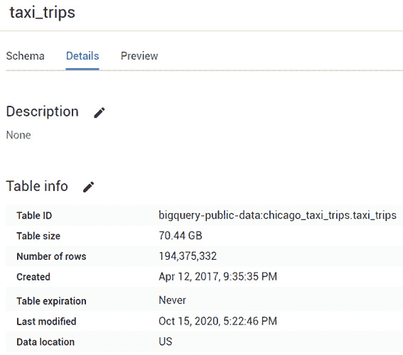
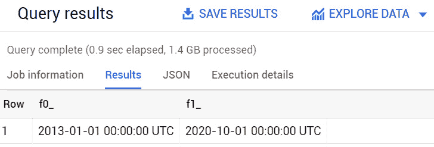
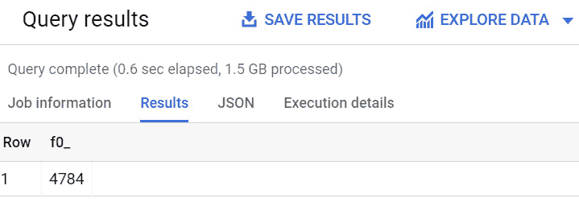
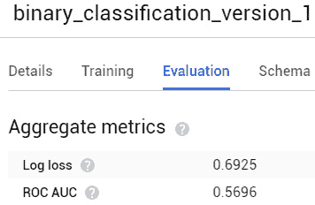
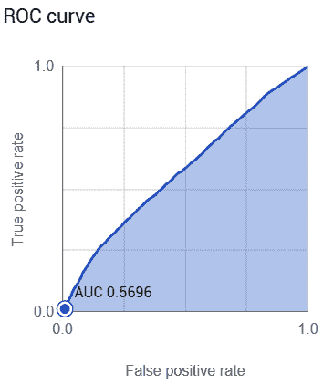
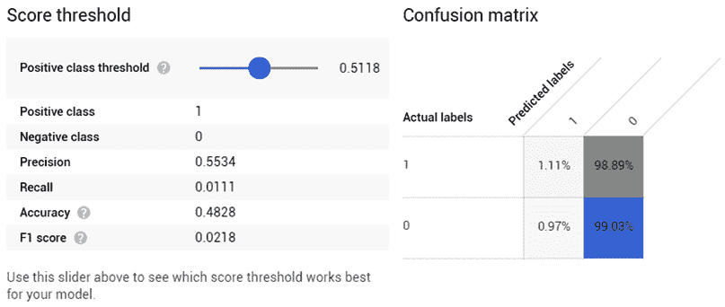
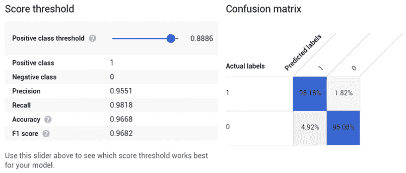
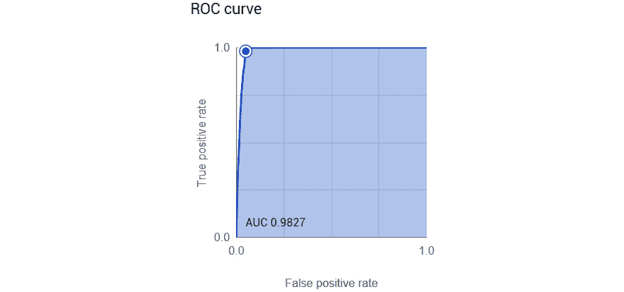
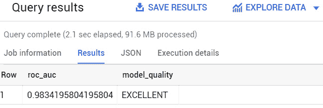

# 第五章：使用二元逻辑回归预测布尔值

二元逻辑回归是最广泛使用的**机器学习（ML**）算法之一，用于预测未来事件和行为分类。它在不同的行业和环境中都有应用。可以使用这种技术预测的变量包括购买产品的倾向以及特定服务获得正面或负面客户反馈的概率。

大多数数字原生公司以订阅模式提供他们的服务。在流媒体视频服务、电信运营商和付费电视中，二元逻辑回归技术被广泛用于预测客户流失的可能性。预测这类信息对于针对营销活动和针对购买意愿最高、能增加收入的客户提供的特别优惠至关重要。

在本章中，我们将看到实施二元逻辑回归模型所需的所有阶段，利用 BigQuery ML。

使用 BigQuery ML SQL 语言，我们将探讨以下主题：

+   介绍业务场景

+   发现二元逻辑回归

+   探索和理解数据集

+   训练二元逻辑回归模型

+   评估二元逻辑回归模型

+   使用二元逻辑回归模型

+   提出业务结论

# 技术要求

本章需要访问网络浏览器，并能够利用以下功能：

+   一个 GCP 账户以访问 Google Cloud Console

+   一个 GCP 项目来托管 BigQuery 数据集

现在我们已经准备好了技术要求，让我们深入分析和发展我们的 BigQuery ML 二元逻辑回归模型。

查看以下视频，以查看代码的实际应用：[`bit.ly/2QXCGHM`](https://bit.ly/2QXCGHM)

# 介绍业务场景

在本节中，我们将介绍将使用二元逻辑回归来解决的问题的业务场景。

让我们以一个例子为例，你是一位对机器学习充满热情的出租车司机。你现在在芝加哥工作，你的目标是为你所有的同事提供一个额外的工具，以了解从你的顾客那里获得小费的概率。

获取顾客的提示对出租车司机来说非常重要，这有助于增加他们的收入。预测获得小费的可能性可能对以下情况很有用，例如知道何时为特定客户群体预留特别温和的待遇。

在以下照片中，你可以看到芝加哥的一辆出租车：


图 5.1 – 芝加哥的出租车

芝加哥市自 2013 年以来收集了大多数出租车行程的信息。这个数据集可在 BigQuery 公共数据集市场（[`console.cloud.google.com/marketplace/details/city-of-chicago-public-data/chicago-taxi-trips`](https://console.cloud.google.com/marketplace/details/city-of-chicago-public-data/chicago-taxi-trips)）中找到，并且可以轻松访问和使用。

你的目标是利用关于出租车行程的可用信息，例如支付类型、行驶里程、车费以及出租车公司的名称，来预测出租车司机在出租车行程结束时是否会收到小费。

既然我们已经解释并理解了业务场景，让我们看看我们可以用来预测特定事件是否会发生的人工智能技术。

# 发现二元逻辑回归

在本节中，我们将学习什么是**二元逻辑回归**，并了解可以使用此机器学习算法解决的问题用例。

**逻辑回归**是一种分类机器学习技术，可以用来预测分类变量。当要预测的变量是二元且只能假设两个值时（例如，真或假、是或否、1 或 0），我们可以应用**二元逻辑回归**。

为了预测两个标签中的一个，此机器学习算法计算两种不同结果的可能性，并允许我们选择一个概率阈值以获得二元变量的最终分类。

由于这是一个基于回归技术的算法，标签的预测基于一组称为特征的独立变量，这些变量用于预测称为标签的因变量。

这种人工智能技术可以用于回答不同行业的相关业务问题，例如以下问题：

+   这个客户会买我的产品吗？

+   我的客户对我的服务满意吗？

+   我的客户在接下来的几个月内会取消我的服务吗？

+   这个学生会通过下一场考试吗？

+   这个人下一年会患上糖尿病吗？

在我们的业务场景中，可以通过二元逻辑回归预测出租车行程结束时获得小费的可能性。实际上，我们感兴趣的是预测某个事件是否会发生。如果出租车司机将获得小费，二元分类变量将被赋予值 1，否则为 0。

训练二元逻辑回归模型意味着尝试找到可以用于输入变量（称为特征）和二元输出变量（称为标签）之间方程的系数值。

训练完成后，我们将利用**混淆矩阵**来评估我们的二元逻辑回归模型的表现。在这个矩阵中，行表示标签的预测值，而列用于存储实际值。

以下图表示了一个用于评估二元逻辑回归性能的混淆矩阵：

![图 5.2 – 混淆矩阵

![图 5.3 – chicago_taxi_trips 数据集只包含一个表：taxi_trips]

图 5.2 – 混淆矩阵

此矩阵使我们能够可视化机器学习算法的性能，比较正确预测与错误预测。

从混淆矩阵中将要展示的数字中，我们可以提取出逻辑回归模型的基本性能指标：**曲线下面积**（**AUC**）和**接收者操作特征**（**ROC**）。**ROC**曲线帮助我们测量具有各种阈值的分类场景的性能。基本上，它告诉我们我们的机器学习模型在预测正确类别方面的能力。

**ROC**曲线是使用以下两个参数绘制的图表：

+   **假正率**位于横坐标轴上。此参数是**假正例**数量与**假正例**和**真反例**之和的比率。

+   **真正率**位于纵坐标轴上。此参数也称为模型的**召回率**。它是**真正例**与**真正例**和**假反例**之和的比率。

如果**曲线下面积**，称为**AUC**，很高且接近 1，则模型更有可能能够预测正确的标签。

我们已经学习了二元逻辑回归的基础知识；现在是时候看看我们将用它来构建机器学习模型的数据集了。

# 探索和理解数据集

如我们在*第四章*，“使用线性回归预测数值”中学习的，在深入机器学习实现之前，分析我们用例中的可用数据是必要的。我们需要首先对可用于我们业务场景的数据有一个清晰的理解。

## 理解数据

要开始探索数据，我们需要做以下事情：

1.  登录 Google Cloud 控制台，并通过导航菜单访问**BigQuery**用户界面。

1.  在我们*第二章*，“设置您的 GCP 和 BigQuery 环境”中创建的项目中创建一个新的数据集。对于此用例，我们将使用默认选项创建名为`05_chicago_taxi`的数据集。

1.  打开`bigquery-public-data` GCP 项目，该项目托管所有 BigQuery 公共数据集，浏览项目直到找到`chicago_taxi_trips`数据集。在这个公共数据集中，我们只能看到一个 BigQuery 表：`taxi_trips`。此表包含关于在芝加哥市发生的出租车行程的所有信息，我们将使用它来训练和测试我们的机器学习模型：![图 5.3 – The chicago_taxi_trips 数据集只包含一个表：taxi_trips

    ![图 5.3 – chicago_taxi_trips 数据集只包含一个表：taxi_trips]

    图 5.3 – The chicago_taxi_trips 数据集只包含一个表：taxi_trips

1.  让我们点击名为`tips`的列，该列以数值`FLOAT`格式表示。显然，这可能会看起来像一个问题，因为我们的机器学习模型只能预测布尔值。这种情况可以通过应用以下规则轻松克服：如果`tips`的值大于 0，则标签为 1，否则为 0。

    我们可以利用表中的所有其他列作为我们机器学习模型的**特征**。出租车行程的持续时间可能是一个好的特征，因为在较长的行程中，出租车司机有更多时间熟悉顾客，而短途行程只有几分钟。接车和下车地点可能会影响小费，因为我们可以想象，一些地区比其他地区更有利可图。例如，一个城市中有很多商业和大型公司办公区的地区可能会增加得到小费的可能性。

    用于支付出租车费用的支付类型是我们分析中的另一个重要因素。当你需要用电子支付方式支付给出租车司机时，通常通过在**销售点**（**POS**）设备上按一个按钮来给小费会更简单。

    此外，出租车公司的名字也可能是需要考虑的另一个重要特征。一些出租车公司可以在服务、司机的专业性和车辆的舒适性方面为顾客提供更好的体验。所有这些因素都可能影响顾客给出租车司机小费的决定。

    从模式的角度来看，这个表格包含了许多有用的信息，这些信息可以用来开发我们的二元逻辑回归模型。让我们继续分析，深化我们对数据的理解。

1.  作为下一步，让我们看看表中记录的数量以及它们是否足够用于我们的目的。在**详细信息**标签页中，我们可以注意到该表包含超过 1.94 亿条记录。我们可以有信心用这么多的数据来构建我们的机器学习模型：

    图 5.4 – taxi_trips 表上的详细信息标签页显示了记录数以及以 GB 为单位的表格大小

1.  现在，让我们看看`taxi_trips`表中的实际数据：

    ```py
    SELECT *
    FROM
      `bigquery-public-data.chicago_taxi_trips.taxi_trips`
    LIMIT 10;
    ```

    查询显示了表中的所有字段，并过滤出前 10 行。使用`LIMIT 10`子句来限制结果集中的记录数，并从表中返回随机选择的行。

1.  在预览了表格内容之后，我们可以分析我们数据集的时间范围：

    ```py
    SELECT MIN(trip_start_timestamp),  MAX(trip_start_timestamp)
    FROM
      `bigquery-public-data.chicago_taxi_trips.taxi_trips`;
    ```

    查询提取了`trip_start_timestamp`字段的最低值和最高值，以便清楚地了解数据收集的时期。

    在下面的屏幕截图中，您可以查看查询执行的结果：

    

    图 5.5 – 查询返回 trip_start_timestamp 字段的最小值和最大值

    在撰写本书时，最小值是 2013 年 1 月 1 日，而最大值是 2020 年 10 月 1 日。

1.  然后，我们可以对作为我们的标签基础的 `tips` 字段进行数据质量检查。事实上，如果 `tips` 列大于 0，我们可以假设出租车司机收到了顾客的小费：

    ```py
    SELECT COUNT(*)
    FROM
      `bigquery-public-data.chicago_taxi_trips.taxi_trips`
    WHERE
            tips IS NULL;
    ```

    在下面的屏幕截图中，您可以看到查询的结果：



图 5.6 – 查询返回 4,784 条 tips 字段为空的记录

执行 `SELECT COUNT(*)` 查询，我们可以注意到有 4,784 条记录的 `tips` 字段为空。在创建 ML 模型时，我们将考虑这一方面，过滤掉这些行。

在本节中，我们已经分析了我们可以利用来构建我们的 ML 模型的数据集，因此现在让我们开始将其分割成三个不同的集合：训练、评估和分类。

## 数据集分段

在实现我们的二元逻辑回归模型之前，让我们根据 ML 开发的主要阶段来分割我们的数据集：训练、评估和使用：

1.  要了解数据如何在年份和月份之间分布，我们可以使用以下查询语句：

    ```py
    SELECT     EXTRACT (YEAR FROM trip_start_timestamp) year,
               EXTRACT (MONTH FROM trip_start_timestamp) month,
               COUNT(*) total
    FROM
              `bigquery-public-data.chicago_taxi_trips.taxi_trips`
    WHERE 
               tips IS NOT NULL AND
               trip_seconds IS NOT NULL AND
               trip_miles IS NOT NULL AND
               fare IS NOT NULL AND
               tolls IS NOT NULL AND
               pickup_location IS NOT NULL AND
               dropoff_location IS NOT NULL AND
               pickup_latitude IS NOT NULL AND
               pickup_longitude IS NOT NULL AND
               dropoff_latitude IS NOT NULL AND
               dropoff_longitude IS NOT NULL AND
               company IS NOT NULL AND
               trip_miles > 1 AND
               trip_seconds > 180
    GROUP BY
              year, month
    ORDER BY
               year, month ASC;
    ```

    `SELECT` 语句提取了关于出租车行程发生的年份和月份的信息，并为每个月计算了总行程数。这种聚合是通过查询末尾的 `GROUP BY` 子句实现的。

    查询从 `taxi_trips` 表中提取记录，但应用了一些重要的过滤器。所有 `tips` 字段为空的记录以及所有潜在特征等于 `NULL` 的行都被排除。

    为了排除异常值和可能的错误测量，我们决定只保留持续时间超过 3 分钟且超过一英里的出租车行程。

    多亏了 `ORDER BY` 子句，结果按升序排列：

    

    图 5.7 – 查询返回 taxi_trips 表中记录的分布

    关注最近的几个月，我们可以立即注意到 2020 年 4 月的数字下降。这种突然的下降可能是由于为管理 COVID-19 大流行而引入的限制所导致的。为了避免任何事件对我们分析的影响，让我们只关注 2019 年。我们将使用从 2019 年 1 月到 2019 年 10 月的时间框架来分割我们的数据集。

1.  让我们创建一个包含将要用于训练我们的 BigQuery ML 模型的行的表。对于此用例，我们将仅选择从 2019 年 1 月到 2019 年 8 月（包括）发生的出租车行程：

    ```py
    CREATE OR REPLACE TABLE `05_chicago_taxi.training_table` AS
        SELECT *
        FROM
              `bigquery-public-data.chicago_taxi_trips.taxi_trips`
        WHERE
               tips IS NOT NULL AND
               trip_seconds IS NOT NULL AND
               trip_miles IS NOT NULL AND
               fare IS NOT NULL AND
               tolls IS NOT NULL AND
               pickup_location IS NOT NULL AND
               dropoff_location IS NOT NULL AND
               pickup_latitude IS NOT NULL AND
               pickup_longitude IS NOT NULL AND
               dropoff_latitude IS NOT NULL AND
               dropoff_longitude IS NOT NULL AND
               company IS NOT NULL AND
               trip_miles > 1 AND
               trip_seconds > 180 AND
               EXTRACT (YEAR FROM trip_start_timestamp) = 2019 AND
               (EXTRACT (MONTH FROM trip_start_timestamp) >=1 AND EXTRACT (MONTH FROM trip_start_timestamp)<=8);
    ```

    从`CREATE TABLE`语句中，我们可以注意到查询过滤掉了所有具有空特征和标签的行，这些特征和标签在机器学习模型的实现过程中可能会引起问题。

1.  之后，我们创建另一个表格，专门用于评估我们的机器学习模型的记录：

    ```py
    CREATE OR REPLACE TABLE `05_chicago_taxi.evaluation_table` AS
        SELECT *
        FROM
              `bigquery-public-data.chicago_taxi_trips.taxi_trips`
        WHERE
               tips IS NOT NULL AND
               trip_seconds IS NOT NULL AND
               trip_miles IS NOT NULL AND
               fare IS NOT NULL AND
               tolls IS NOT NULL AND
               pickup_location IS NOT NULL AND
               dropoff_location IS NOT NULL AND
               pickup_latitude IS NOT NULL AND
               pickup_longitude IS NOT NULL AND
               dropoff_latitude IS NOT NULL AND
               dropoff_longitude IS NOT NULL AND
               company IS NOT NULL AND
               trip_miles > 1 AND
               trip_seconds > 180 AND
               EXTRACT (YEAR FROM trip_start_timestamp) = 2019 AND
               EXTRACT (MONTH FROM trip_start_timestamp) = 09;
    ```

    与包含训练数据的表格相比，唯一的区别在于我们选择的月份来创建这个表格。在这种情况下，我们选择包含与 2019 年 9 月相关的记录。

1.  最后的准备步骤是基于创建我们将用于测试二元逻辑回归模型的表格。让我们根据以下 SQL 语句创建`classification_table`：

    ```py
    CREATE OR REPLACE TABLE `05_chicago_taxi.classification_table` AS
        SELECT *
        FROM
              `bigquery-public-data.chicago_taxi_trips.taxi_trips`
        WHERE
               tips IS NOT NULL AND
               trip_seconds IS NOT NULL AND
               trip_miles IS NOT NULL AND
               fare IS NOT NULL AND
               tolls IS NOT NULL AND
               pickup_location IS NOT NULL AND
               dropoff_location IS NOT NULL AND
               pickup_latitude IS NOT NULL AND
               pickup_longitude IS NOT NULL AND
               dropoff_latitude IS NOT NULL AND
               dropoff_longitude IS NOT NULL AND
               company IS NOT NULL AND
               trip_miles > 1 AND
               trip_seconds > 180 AND
               EXTRACT (YEAR FROM trip_start_timestamp) = 2019 AND
               EXTRACT (MONTH FROM trip_start_timestamp) = 10;
    ```

    多亏了我们在查询中应用的筛选和过滤器，我们的集合将只包含与 2019 年 10 月相关的记录。我们还可以注意到，所有其他过滤器在三个数据集（训练、评估和分类）中保持不变且一致。

现在我们已经将数据集分为三个部分，让我们开始实际训练二元逻辑回归机器学习模型。

# 训练二元逻辑回归模型

正如我们在*第四章*中已经做的那样，*使用线性回归预测数值值*，我们将采用增量方法来尝试在每次尝试中提高我们的机器学习模型的表现：

1.  让我们开始训练我们的第一个机器学习模型，`binary_classification_version_1`：

    ```py
    CREATE OR REPLACE MODEL `05_chicago_taxi.binary_classification_version_1`
    OPTIONS
      (model_type='logistic_reg', labels = ['will_get_tip']) AS
        SELECT
            trip_seconds,
            IF(tips>0,1,0) AS will_get_tip
        FROM  `05_chicago_taxi.training_table`;
    ```

    在这个 BigQuery ML 语句中，我们可以看到用于开始模型训练的`CREATE OR REPLACE MODEL`关键字。这些关键字后面跟着机器学习模型的标识符。在标识符之后，我们可以注意到`OPTIONS`子句。作为我们的选项，我们选择使用`logistic_reg`算法来训练模型，并使用`will_get_tip`字段作为目标标签。

    `SELECT`语句指出，如果`tips`字段的值大于 0，则`will_get_tip`标签的值为`1`，否则为`0`。在`SELECT`语句中，我们还包含了我们第一次尝试使用的唯一特征：`trip_seconds`。这个特征代表出租车行程的持续时间（以秒为单位）。

    最后，`SELECT`语句基于我们创建的用于训练模型的表格：`05_chicago_taxi.training_table`。

1.  训练结束后，我们可以从 BigQuery 导航菜单中访问机器学习模型，查看模型的表现。选择**评估**选项卡，我们可以看到**ROC AUC**值。在这种情况下，我们可以看到我们没有取得很好的结果，因为它没有接近 1；它是**0.5696**：

    图 5.8 – 评估选项卡显示了与训练的机器学习模型相关的 ROC AUC 值

    在同一个选项卡中，我们还可以看到 ROC 曲线：

    

    

    图 5.9 – 在评估标签页中，也可以图形化分析 ROC 曲线并看到 ROC 曲线下的蓝色区域

    如前图所示，表示真正例与假正例之间比率的 ROC 曲线并没有接近 1。曲线下的蓝色区域大约占整个正方形的 50%。

    如下截图所示，我们还可以在同一标签页中利用混淆矩阵来根据不同的阈值实验机器学习模型的输出：

    

    

    图 5.10 – 在评估标签页中，也可以查看分类模型的混淆矩阵

1.  让我们尝试通过添加有助于预测小费概率的特征来改进我们的机器学习模型。我们将引入出租车行程的票价、行程中支付的费用以及出租车公司的名称作为新的特征：

    ```py
    CREATE OR REPLACE MODEL `05_chicago_taxi.binary_classification_version_2`
    OPTIONS
      (model_type='logistic_reg', labels = ['will_get_tip']) AS
        SELECT
            trip_seconds,
            fare,
            tolls,
            company,
            IF(tips>0,1,0) AS will_get_tip
        FROM  `05_chicago_taxi.training_table`;
    ```

    `CREATE OR REPLACE MODEL`部分与之前的一个类似，但包括了之前提到的新的功能。尽管增加了新的字段，但在**ROC AUC**方面的改进并不显著。实际上，通过这次尝试，我们已经达到了**0.5902**的值。

1.  是时候介绍一个可能对我们机器学习模型开发极为有帮助的特征了。下一个机器学习模型`binary_classification_version_3`将引入客户支付出租车司机的支付类型：

    ```py
    CREATE OR REPLACE MODEL `05_chicago_taxi.binary_classification_version_3`
    OPTIONS
      (model_type='logistic_reg', labels = ['will_get_tip']) AS
        SELECT
            trip_seconds,
            fare,
            tolls,
            company,
            payment_type,
            IF(tips>0,1,0) AS will_get_tip
        FROM  `05_chicago_taxi.training_table`; 
    ```

    在训练这个机器学习模型之后，我们可以立即注意到**ROC AUC**值的巨大提升。将支付方式作为特征添加到我们的模型中，我们达到了**0.9809**的值。这非常接近 1，代表了我们二元逻辑回归模型性能的显著提升。

1.  在前一个代码块中，我们使用`binary_classification_version_3`机器学习模型所取得的结果已经是一个很好的结果了。让我们看看是否可以通过利用出租车行程的接车和下车位置信息来进一步改进我们的分类模型：

    ```py
    CREATE OR REPLACE MODEL `05_chicago_taxi.binary_classification_version_4`
    OPTIONS
      (model_type='logistic_reg', labels = ['will_get_tip']) AS
        SELECT
            trip_seconds,
            fare,
            tolls,
            company,
            payment_type,
            pickup_location,
            dropoff_location,
            IF(tips>0,1,0) AS will_get_tip
        FROM  `05_chicago_taxi.training_table`; 
    ```

    查询语句与其他训练语句非常相似，但引入了两个额外的特征：`pickup_location`和`dropoff_location`。这两个字段代表出租车行程开始和结束的区域。

    在训练机器学习模型之后，我们可以立即欣赏到我们进一步提高了分类模型的性能。这从**ROC AUC**值中可以清楚地看出，其值为**0.9827**。

    通过查看**混淆矩阵**，我们可以选择最佳阈值，以在真正例和真负例预测之间取得正确的平衡。

    阈值值影响真正例率和假正例率之间的比率。找到最佳阈值意味着找到一个值，以最大化真正例率并最小化假正例率。

    在以下屏幕截图中，您可以看到混淆矩阵和 **正类阈值** 滑块：



图 5.11 – 混淆矩阵显示了在预测标签与实际标签方面的出色表现

所有其他关键性能指标，如精确率、召回率和准确率，都非常高，接近 1 的最大值。

从图形角度来看，我们可以欣赏到我们 ML 模型的优秀质量。事实上，ROC 曲线下方的蓝色区域非常接近 1，几乎覆盖了整个正方形的面积。以下截图显示了最后一个 ML 模型的 ROC 曲线，并显示我们的 ML 模型已经取得了优异的结果：



图 5.12 – ROC 曲线下方的面积非常接近 1，并且几乎填满了整个正方形

在本节中，我们利用数据集中可用的特征训练了一些二元逻辑回归 ML 模型。为了进行评估阶段，我们选择使用表现最佳的 `binary_classification_version_4` 模型。现在，让我们看看如何开始评估阶段。

# 评估二元逻辑回归模型

为了评估我们的 BigQuery ML 模型，我们将使用 `ML.EVALUATE` 函数和专门创建的作为评估数据集的表。

以下查询将告诉我们模型是否过度拟合，或者是否也能在新数据上表现良好：

```py
SELECT
  roc_auc,
  CASE
    WHEN roc_auc > .9 THEN 'EXCELLENT'
    WHEN roc_auc > .8 THEN 'VERY GOOD'
    WHEN roc_auc > .7 THEN 'GOOD'
    WHEN roc_auc > .6 THEN 'FINE'
    WHEN roc_auc > .5 THEN 'NEEDS IMPROVEMENTS'
  ELSE
  'POOR'
END
  AS model_quality
FROM 
  ML.EVALUATE(MODEL `05_chicago_taxi.binary_classification_version_5`,
    (
    SELECT
        trip_seconds,
        fare,
        tolls,
        company,
        payment_type,
        pickup_location,
        dropoff_location,
        IF(tips>0,1,0) AS will_get_tip
     FROM `05_chicago_taxi.evaluation_table`));
```

`SELECT` 语句提取了 `ML.EVALUATE` 函数返回的 `roc_auc` 值，并提供了对模型质量的清晰描述，从 `'POOR'` 级别开始，到 `'EXCELLENT'` 级别，经过一些中间阶段，如 `'NEEDS IMPROVEMENTS'` 和 `'GOOD'`。

执行查询，我们可以看到分数非常高，结果是 `EXCELLENT`：



图 5.13 – 评估阶段返回了我们的 BigQuery ML 模型的优秀质量结果

现在我们已经评估了我们的 ML 模型，让我们看看我们如何将其应用于其他记录以获取预测结果。

# 使用二元逻辑回归模型

在本节中，我们将使用 ML 模型来预测客户获得小费的概率。

为了测试我们的 BigQuery ML 模型，我们将在 `classification_table` 表上使用 `ML.PREDICT` 函数：

```py
SELECT predicted_will_get_tip, predicted_will_get_tip_probs, will_get_tip actual
FROM
  ML.PREDICT(MODEL`05_chicago_taxi.binary_classification_version_5`,
    (
      SELECT
        trip_seconds,
        fare,
        tolls,
        company,
        payment_type,
        pickup_location,
        dropoff_location,
        IF(tips>0,1,0) AS will_get_tip
       FROM `05_chicago_taxi.classification_table`));
```

查询由一个`SELECT`语句组成，该语句提取了`will_get_tip`字段的实际和预测值。如果没有指定，`ML.PREDICT`将使用值`0.5`作为默认阈值。

查询的输出显示了以下列：

+   第一列中的预测标签

+   第二列和第三列中每个标签的计算概率

+   从`classification_table`中提取的实际值作为最后一列

在下面的屏幕截图中，你可以看到查询执行的结果：

![Figure 5.14 – 查询的输出显示了预测标签与实际标签的比较

![img/B16722_05_014.jpg]

图 5.14 – 查询的输出显示了预测标签与实际标签的比较

现在我们已经测试了我们的 BigQuery ML 模型，让我们对根据我们所拥有的出租车行程信息预测客户是否会给出租车司机小费的可能性进行一些最终考虑。

# 提出业务结论

在本节中，我们将使用我们的机器学习模型，并了解 BigQuery ML 模型能够预测实际结果多少次。

使用默认阈值`0.5`，让我们看看 ML 模型能够正确识别司机是否会得到小费多少次：

```py
SELECT COUNT(*)
FROM (
      SELECT predicted_will_get_tip, predicted_will_get_tip_probs, will_get_tip actual_tip
      FROM
        ML.PREDICT(MODEL`05_chicago_taxi.binary_classification_version_5`,
          (
            SELECT
              trip_seconds,
              fare,
              tolls,
              company,
              payment_type,
              pickup_location,
              dropoff_location,
              IF(tips>0,1,0) AS will_get_tip
             FROM `05_chicago_taxi.classification_table`)))
WHERE
       predicted_will_get_tip =  actual_tip;
```

为了计算这个值，我们引入了`WHERE`子句，仅过滤那些预测值等于实际值的行。

`SELECT COUNT`返回了 727,462 个预测值，与预测值等于实际值相对应。

在总共 744,058 行中，我们可以说，我们的模型在标准阈值为 0.5 的情况下，在 97.76%的情况下预测了正确的结果。

由于我们利用 BigQuery ML 创建了一个非常有效的二元逻辑回归模型，我们现在有信心向我们的出租车司机提供见解和建议。了解提前得到小费的概率，他们可以根据他们服务的客户得到小费的概率采取不同的行为。

# 摘要

在本章中，我们实现了一个二元逻辑回归模型。我们基于芝加哥市收集的出租车服务数据介绍了业务场景。之后，我们学习了二元逻辑回归技术如何用于预测二元值。

为了构建一个有效的模型，我们对数据进行详细分析，然后根据我们的需求将数据集分为三个表：一个用于存放训练数据，第二个用于评估，最后一个用于应用我们的分类模型。

在 BigQuery ML 模型的训练阶段，我们根据混淆矩阵和 ROC AUC 值不断改进 ML 模型的性能。

之后，我们在一组新的记录上评估了最佳的机器学习模型，以验证是否存在过拟合，并增加对我们二元逻辑回归模型高质量的好感。

最后，我们将我们的机器学习模型应用于最后一批记录，以预测每次出租车行程结束时客户是否得到小费的可能性。我们发现我们的机器学习模型能够正确预测客户行为在 97%以上的情况下。

在下一章中，我们将介绍多类逻辑回归，并学习如何根据树木的特征将它们分类到不同的物种。

# 更多资源

+   **芝加哥出租车行程公共数据集**：[`console.cloud.google.com/marketplace/details/city-of-chicago-public-data/chicago-taxi-trips`](https://console.cloud.google.com/marketplace/details/city-of-chicago-public-data/chicago-taxi-trips)

+   **芝加哥开放数据**：[`data.cityofchicago.org/`](https://data.cityofchicago.org/)

+   **BigQuery ML 创建模型**：[`cloud.google.com/bigquery-ml/docs/reference/standard-sql/bigqueryml-syntax-create`](https://cloud.google.com/bigquery-ml/docs/reference/standard-sql/bigqueryml-syntax-create)

+   **BigQuery ML 评估模型**：[`cloud.google.com/bigquery-ml/docs/reference/standard-sql/bigqueryml-syntax-evaluate`](https://cloud.google.com/bigquery-ml/docs/reference/standard-sql/bigqueryml-syntax-evaluate)

+   **BigQuery ML 预测**：[`cloud.google.com/bigquery-ml/docs/reference/standard-sql/bigqueryml-syntax-predict`](https://cloud.google.com/bigquery-ml/docs/reference/standard-sql/bigqueryml-syntax-predict)

+   **BigQuery ML 二元逻辑回归示例**：[`cloud.google.com/bigquery-ml/docs/logistic-regression-prediction`](https://cloud.google.com/bigquery-ml/docs/logistic-regression-prediction)
