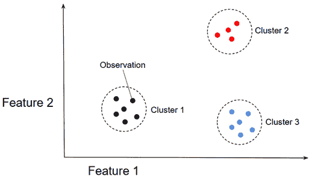
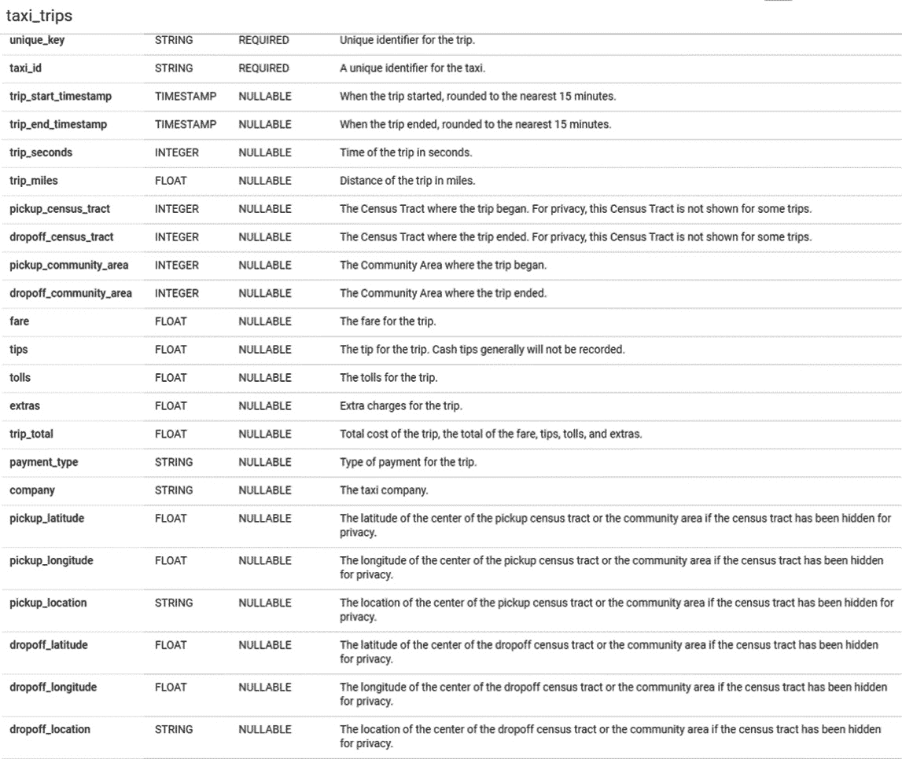
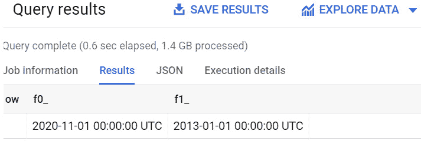
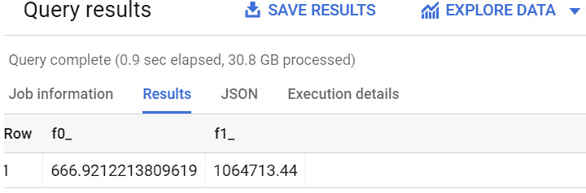
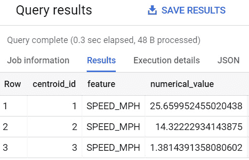
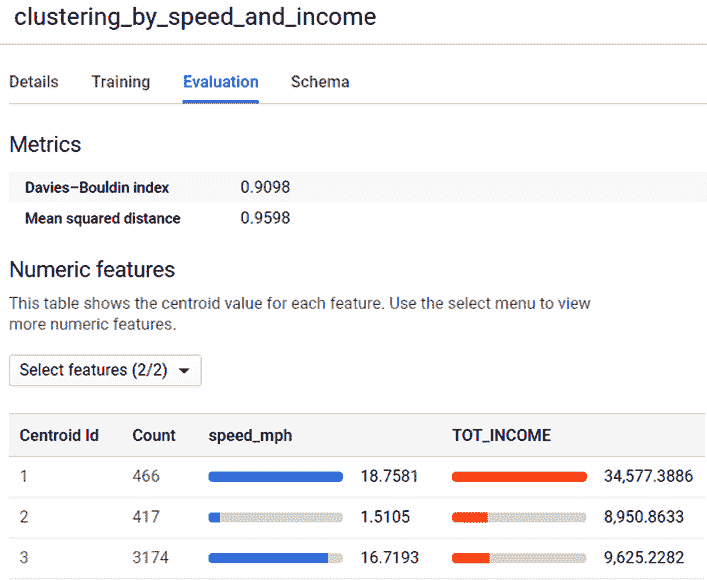

# 第七章：使用 K-Means 算法进行聚类

在本章中，我们将介绍无监督机器学习，并学习如何使用 BigQuery ML 构建 K-Means 算法将相似数据聚类到多个类别中。

当我们拥有没有任何标签的数据集，并且需要在没有初始知识的情况下推断数据结构时，无监督机器学习特别有用。

在不同的行业中，根据一组特定的特征识别相似的事件、对象和人物非常有价值。K-Means 聚类通常用于根据一组特定的特征识别相似的客户、文档、产品、事件或物品。

在本章中，我们将重点关注广泛用于揭示结构化和非结构化数据相似性的 K-Means 聚类算法。我们将通过构建 K-Means 聚类模型所需的所有步骤，利用 BigQuery ML 进行操作。

采用增量方法，我们将探讨以下主题：

+   介绍业务场景

+   发现 K-Means 聚类

+   探索和理解数据集

+   训练 K-Means 聚类模型

+   评估 K-Means 聚类模型

+   使用 K-Means 聚类模型

+   提炼业务结论

# 技术要求

本章要求您能够访问网络浏览器，并能够利用以下内容：

+   一个用于访问 GCP 控制台的 **Google Cloud Platform** (**GCP**) 账户

+   一个用于托管 BigQuery 数据集的 GCP 项目

现在我们已经准备好了技术要求，让我们深入分析和发展我们的 BigQuery ML 聚类模型。

查看以下视频以查看代码的实际应用：[`bit.ly/2Rx2Uk5`](https://bit.ly/2Rx2Uk5)

# 介绍业务场景

想象一下，你是一名为芝加哥大型出租车公司工作的商业分析师。这些出租车公司每天要完成数千次行程，以满足整个城市的公共交通需求。出租车司机的工作和行为对于为公司创造收入和为所有客户提供有效服务至关重要。

对于我们的业务场景，让我们想象所有出租车公司都想给表现最好的司机额外奖励。公司的目标是根据生成的收入和驾驶速度将司机分为三个不同的类别。这三个群体可以描述如下：

+   **顶级司机**是全年收入和效率最佳的员工。这个群体将获得巨大的额外奖励。

+   **优秀司机**是表现良好但并不突出的司机。这个群体将不会获得任何奖励。

+   **中性司机**是在收入和效率方面结果中性或负面的司机。

识别聚类参数不是事先已知的，因为它们可以根据不同的因素（如盈利能力、速度和交通状况）而变化。有些年份比其他年份更有利可图，而且驾驶速度可能会受到特定交通状况的影响。

作为一名商业分析师，你的任务是找到最佳的算法，根据描述的分类将芝加哥出租车司机聚类，以便根据他们的表现将司机分为三个类别。

既然我们已经解释并理解了问题陈述，让我们看看我们可以用来预测数值（如行程持续时间）的机器学习技术。

# 发现 K-Means 聚类

在本节中，我们将了解什么是**无监督学习**，并学习**K-Means**聚类技术的基础知识。

**K-Means**是一种**无监督学习**算法，用于解决聚类问题。这种技术用于将数据分类到一组类别中。字母*k*代表事先固定的聚类数量。在我们的业务场景中，我们将使用三个不同的聚类。

重要提示

虽然监督学习基于对训练数据集中标签输出值事先的知识，但无监督学习并不利用标记数据集。其目标是推断训练数据集中的数据结构，而不需要任何先验知识。

每个数据簇都由一个**质心**来表征。质心代表簇的中点，在训练阶段根据模型特征被识别。

在 K-Means 聚类模型训练之后，每个实体都可以与最近的质心关联，并包含在其中一个*k*个聚类中。

在下面的图中，你可以查看基于两个特征和一个*k*等于`3`的值的简单聚类模型的图形表示：



图 7.1 – K-Means 聚类的图形表示

在前面的笛卡尔图中，你可以看到一些由点表示的观测值。该图由两个轴组成，这两个轴对应于用于训练 K-Means 聚类机器学习模型的特征。

根据两个特征值的差异，一些观测值比其他观测值更接近。假设我们需要将观测值聚类成三个不同的类别，K-Means 模型被训练出来以找到将观测值划分为不同类别的三个区域。

我们不会在本书中详细介绍 K-Means 聚类算法的所有细节，但我们可以提到一些此类算法适用的用例示例。在现实生活中，我们可以找到许多可以用聚类模型解决的问题，例如以下情况：

+   **客户细分**：在公司的客户基础上找到相似的客户，以提高营销活动和促销活动的有效性

+   **员工细分**：识别表现最佳的员工

+   **文档分类**：根据标签、主题、作者和发布日期将文档聚类到多个类别中

在我们的业务场景中，我们将基于三个不同的聚类：**顶级**、**良好**和**中性**驾驶员，训练一个 K-Means 聚类模型。为了实现我们的目标，我们将使用有关每位出租车驾驶员产生的收入和驾驶速度的信息，驾驶速度是行驶英里数与每次行程花费时间的比率。

我们已经学习了 K-Means 聚类的基础知识，现在是时候看看我们将用于构建机器学习模型的数据集了。

# 探索和理解数据集

在深入到机器学习实现之前，我们将开始分析用于训练我们的机器学习模型的数据集。

对于这个用例，我们将使用我们在*第五章*中已经使用过的 BigQuery 公共数据集，*使用二元逻辑回归预测布尔值*。这个数据集包含了由*芝加哥市*收集的出租车行程信息，您可以通过以下链接找到：[`console.cloud.google.com/marketplace/details/city-of-chicago-public-data/chicago-taxi-trips`](https://console.cloud.google.com/marketplace/details/city-of-chicago-public-data/chicago-taxi-trips)。

让我们先清楚地了解我们数据集中所拥有的信息，以便构建我们的 K-Means 聚类模型。

## 理解数据

在本节中，我们将探索我们将用于开发我们的 BigQuery ML 模型的数据结构。

要开始探索数据，我们需要做以下几步：

1.  登录 GCP，并通过导航菜单访问**BigQuery**用户界面。

1.  在*第二章*中创建的项目下创建一个新的数据集，*设置您的 GCP 和 BigQuery 环境*。对于这个用例，我们将创建一个带有默认选项的`07_chicago_taxi_drivers`数据集。

1.  打开`bigquery-public-data` GCP 项目，该项目托管所有 BigQuery 公共数据集，浏览项目直到找到`chicago_taxi_trips`数据集。在这个公共数据集中，我们可以看到只有一个 BigQuery 表：`taxi_trips`。这个表包含了关于在芝加哥市发生的所有出租车行程的信息，我们将使用它来训练和测试我们的 K-Means 聚类模型。

我们已经在*第五章*中使用了相同的数据，*使用二元逻辑回归预测布尔值*。因此，我们已经了解了`taxi_trips`表及其字段的总体架构。

在下面的屏幕截图中，您可以查看属于`taxi_trips`表的完整字段列表：



图 7.2 – 属于 taxi_trips 表的字段列表

对于此用例，我们关注以下字段，这些字段将用于创建我们的机器学习模型：

+   `trip_miles`：包含出租车司机在特定行程中行驶的英里数。

+   `trip_seconds`：表示每次出租车行程的持续时间，以秒为单位。

+   `fare`：这是乘客支付给出租车司机的费用，代表司机的收入。

+   `提示`：此列包含出租车司机从乘客那里收到的小费金额。

我们故意忽略与出租车行程成本相关的其他列，例如`tolls`和`extras`，因为这些值不会直接受到出租车司机活动的影响。

在本节中，我们已选择了用于训练我们的机器学习模型的表和列。现在，是时候查看数据，以便我们了解如何使用它。

## 检查数据质量

在本节中，我们在开发我们的机器学习模型之前将应用一些数据质量检查。

数据质量对于构建有效的 K-Means 聚类模型至关重要。由于目标是将观测值聚类到多个类别中，数据中的异常值可以基于数据中的错误值创建不平衡的聚类。

让我们开始分析用于构建我们的机器学习模型的数据集，如下所示：

1.  为了确定我们数据集的时间范围，让我们提取`trip_start_timestamp`字段的最低值和最高值，如下所示：

    ```py
    SELECT MAX(trip_start_timestamp),
           MIN(trip_start_timestamp)
    FROM
    `bigquery-public-data.chicago_taxi_trips.taxi_trips`;
    ```

    在执行此`2013`到`2020`。

    查询结果如下所示：

    

    图 7.3 – 查询结果显示了数据集的时间范围

    为了解决我们的业务场景，我们可以关注发生在`2020`年的出租车行程。

1.  在第二步中，我们将检查速度（以每小时英里为单位）和出租车司机收入的最高值。让我们执行以下查询：

    ```py
    SELECT MAX (speed_mph), MAX (tot_income)
    FROM (
          SELECT taxi_id,
                 AVG(trip_miles/(trip_seconds/60/60)) AS speed_mph,
                 SUM (fare+tips) AS tot_income
          FROM `bigquery-public-data.chicago_taxi_trips.taxi_trips` 
          WHERE 
                EXTRACT(YEAR from trip_start_timestamp) = 2020
                AND trip_seconds > 0
                AND trip_miles >0
                AND fare > 0
          GROUP BY taxi_id);
    ```

    内部`SELECT`语句通过将`trip_miles`字段的值除以以小时表示的行程持续时间（`trip_seconds/60/60`）来计算平均速度。计算出的值存储在`speed_mph`列中。它还创建了`tot_income`字段，该字段将每个`taxi_id`字段的`fare`和`tips`值相加。使用`EXTRACT(YEAR from trip_start_timestamp) = 2020`过滤器，我们只选择发生在`2020`年的出租车行程。在`trip_seconds`、`trip_miles`和`fare`字段上添加过滤器，我们还排除了数据集中可能出现的所有空值和`NULL`值。最外层的`SELECT`语句使用`MAX (speed_mph), MAX (tot_income)`关键字确定平均速度和收入的最高值。

    查询的结果在以下屏幕截图中进行展示：



图 7.4 – 查询结果显示了速度和收入方面的异常值

从结果来看，很明显，数据集中包含一些与实际用例不兼容的异常值。事实上，最大平均速度约为 667 英里/小时，出租车司机的最高收入超过 100 万美元（**USD**）。

我们刚刚执行的查询指出，我们的数据集中存在一些不切实际的数据值，需要在接下来的步骤中过滤掉。

现在我们已经对我们的数据集进行了一些质量检查，让我们专注于创建我们的训练数据集。

## 创建训练数据集

对于 K-Means 聚类，我们只需要创建一个用于训练和测试机器学习模型的训练数据集。

让我们开始创建将用于训练两个不同的 K-Means 聚类模型的训练数据集，如下所示：

1.  首先，让我们通过运行以下代码创建一个只包含`speed_mph`字段作为 K-Means 聚类模型输入特征的表格：

    ```py
    CREATE OR REPLACE TABLE `07_chicago_taxi_drivers.taxi_miles_per_minute` AS 
    SELECT *
    FROM (
                    SELECT taxi_id,
                             AVG(trip_miles/(trip_seconds/60/60)) AS speed_mph
                    FROM `bigquery-public-data.chicago_taxi_trips.taxi_trips` 
                    WHERE 
                          EXTRACT(YEAR from trip_start_timestamp) = 2020
                           AND trip_seconds > 0
                           AND trip_miles >0
                    GROUP BY taxi_id
          )
    WHERE 
          speed_mph BETWEEN 0 AND 50;
    ```

    查询在`07_chicago_taxi_drivers`数据集中创建了`taxi_miles_per_minute`表格。

    表格包含两个不同的字段：`taxi_id`列中的出租车标识符，以及`speed_mph`字段中的平均速度（以英里/小时表示）。平均速度是使用`GROUP BY taxi_id`子句为`taxi_trips`表中的每个`taxi_id`字段计算的。新表格仅包括 2020 年发生的出租车行程。

    查询的最后两行包含用于过滤异常值的`WHERE`子句。我们假设最大合理的平均速度是`50`英里/小时。

1.  在第二步中，我们将创建另一个表格来存储额外的特征（即`tot_income`），如下所示：

    ```py
    CREATE OR REPLACE TABLE `07_chicago_taxi_drivers.taxi_speed_and_income` AS
    SELECT *
    FROM (
            SELECT taxi_id,
                    AVG(trip_miles/(trip_seconds/60/60)) AS speed_mph,
                   SUM (fare+tips) AS tot_income
            FROM `bigquery-public-data.chicago_taxi_trips.taxi_trips` 
            WHERE 
                  EXTRACT(YEAR from trip_start_timestamp) = 2020
                  AND trip_seconds > 0
                  AND trip_miles >0
                  AND fare > 0
            GROUP BY taxi_id
          )
    WHERE 
          speed_mph BETWEEN 0 AND 50
          AND tot_income BETWEEN 0 AND 150000;
    ```

    查询的执行生成了`taxi_speed_and_income`表格。此表格包括使用与*步骤 1*相同的规则计算的`speed_mph`字段。表格还包括`tot_income`字段。此值是每个`taxi_id`字段和 2020 年整个期间的`fare`和`tips`的`SUM`。

    与*步骤 1*中创建的表格相比，我们添加了一个额外的过滤器，将年度`tot_income`值限制在 150,000。

    此第二个表格将用于创建另一个基于两个`speed_mph`和`tot_income`特征的 K-Means 聚类机器学习模型。

现在我们已经创建了我们的 BigQuery ML 模型将要训练的表格，让我们深入到机器学习模型的创建中。

# 训练 K-Means 聚类模型

在本节中，我们将创建两个不同的 K-Means 机器学习模型。第一个模型将使用 `taxi_miles_per_minute` 作为训练数据集，而第二个模型将包括 `tot_income` 作为特征，并利用 `taxi_speed_and_income`。让我们按以下步骤进行：

1.  作为第一步，让我们通过运行以下代码开始训练一个名为 `clustering_by_speed` 的机器学习模型：

    ```py
    CREATE OR REPLACE MODEL `07_chicago_taxi_drivers.clustering_by_speed`
    OPTIONS(model_type='kmeans', num_clusters=3, kmeans_init_method = 'KMEANS++') AS
      SELECT * EXCEPT (taxi_id)
      FROM `07_chicago_taxi_drivers.taxi_miles_per_minute`;
    ```

    SQL 语句的前几行由 `CREATE OR REPLACE MODEL` 关键字组成，后跟 `07_chicago_taxi_drivers.clustering_by_speed` 机器学习模型的标识符和 `OPTIONS` 子句。

    现在，让我们看看我们用来训练机器学习模型的选项。选定的模型类型是 `'kmeans'`。此选项描述了我们用于训练模型的技术。`num_clusters` 选项的值为 `3`，因为我们试图将观测值分类到三个不同的簇中：*Top*、*Good* 和 *Neutral*。

    默认情况下，BigQuery ML 使用随机起点开始训练 K-Means 聚类算法。机器学习模型的质量也取决于这一点，这一点是由 BigQuery 随机选择的。通过使用 `kmeans_init_method = 'KMEANS++'` 选项，该点利用 `taxi_miles_per_minute` 表初始化，除了 `taxi_id` 列，该列仅在预测阶段使用。

1.  在第一个机器学习模型训练完成后，让我们再训练第二个模型，该模型还包括出租车司机在该年的 `tot_income` 值，如下面的代码片段所示：

    ```py
    CREATE OR REPLACE MODEL `07_chicago_taxi_drivers.clustering_by_speed_and_income`
    OPTIONS(model_type='kmeans', num_clusters=3, standardize_features = true, kmeans_init_method = 'KMEANS++') AS
      SELECT * EXCEPT (taxi_id)
      FROM `07_chicago_taxi_drivers.taxi_speed_and_income`;
    ```

    这个查询与用于创建先前 K-Means 聚类模型的 SQL 语句非常相似，但我们立即可以注意到一个相关的差异。`clustering_by_speed_and_income` 模型是使用一个额外的选项 `standardize_features = true` 训练的。当您有不同数量级的数值特征时，此选项特别有用。在这种情况下，模型正在使用 `speed_mph` 字段（从 0 到 50）和 `tot_income` 字段，其值可以达到 150,000。

现在我们已经基于 K-Means 聚类算法训练了两个不同的机器学习模型，让我们看看如何利用 BigQuery ML SQL 语法和 BigQuery **用户界面**（**UI**）来评估它们。

# 评估 K-Means 聚类模型

在本节中，我们将学习如何评估我们的 K-Means 聚类模型性能。

K-Means 聚类模型的评估阶段与我们之前章节中执行的监督机器学习模型不同。让我们看看评估我们的机器学习模型需要采取的步骤，如下所示：

1.  让我们通过运行以下代码提取上一节中训练的第一个机器学习模型的质心：

    ```py
    SELECT *
    FROM ML.CENTROIDS
            (MODEL `07_chicago_taxi_drivers.clustering_by_speed`)
    ORDER BY centroid_id;
    ```

    `ML.CENTROIDS`函数返回 K-Means 模型质心的信息。它接受模型名称作为输入，放在圆括号内，前面是`MODEL`关键字。

    重要提示

    质心代表 K-Means 聚类模型中一个集群的中心。在机器学习模型的训练阶段，质心会迭代优化以最小化质心与训练数据集中观测值之间的距离。当训练阶段结束时，质心会稳定下来。BigQuery ML 在相对损失改进小于`MIN_REL_PROGRESS`参数指定的值时停止迭代。

    查询的执行返回三个质心，如下截图所示：

    

    图 7.5 – 查询结果显示机器学习模型识别的质心

    在这种情况下，每个质心仅用代表出租车驾驶员平均速度的`speed_mph`特征的数值来表示。

1.  可以通过 BigQuery UI 获取相同的信息。从 BigQuery 导航菜单中选择`clustering_by_speed`模型，访问`1`属于第一个集群，代表平均速度最佳的出租车驾驶员：*顶级驾驶员*。从 BigQuery UI，我们还可以注意到 869 名出租车驾驶员属于这个集群。

    第二个质心包括大部分人口，`speed_mph`值为 14.3222。这个质心是*良好驾驶员*集群的中心。

    最后一个质心是速度最慢的驾驶员所在集群的中心，包含 425 个观测值，属于*中性驾驶员*集群。

1.  如果我们选择从 BigQuery UI 的**评估**标签页分析`clustering_by_speed_and_income`模型，我们将看到以下信息：

图 7.7 – 基于速度和收入的聚类 BigQuery ML 模型的评估标签页

观察由第二个模型识别的集群和质心，我们可以立即注意到集群基于两个不同的特征：`speed_mph`和`tot_income`。

第一个集群，编号为`1`，包括速度和年收入最佳的 466 名驾驶员：*顶级驾驶员*。第二个集群包含表现最差的 417 名*中性驾驶员*。最后一个质心包括大多数驾驶员，是*良好驾驶员*集群。

小贴士

训练不同迭代的 K-Means 聚类可以生成不同的值，这取决于 BigQuery ML 使用的初始化种子。可能发生的情况是质心的位置与本节中显示的值不同。

现在我们已经查看了 K-Means 聚类模型训练产生的结果，让我们开始使用它们将出租车司机分类到不同的聚类中。

# 使用 K-Means 聚类模型

在本节中，我们将了解如何在新数据上使用我们的 K-Means 聚类模型。

要使用我们的 BigQuery ML 模型，我们将在创建用于训练机器学习模型的同一张表上使用`ML.PREDICT`函数。

在这种情况下，我们还将包括`taxi_id`列，该列标识每个出租车司机。以下查询将根据`speed_mph`和`tot_income`字段的值将每个`taxi_id`字段分类到最近的聚类：

```py
SELECT
  * EXCEPT(nearest_centroids_distance)
FROM
  ML.PREDICT( MODEL `07_chicago_taxi_drivers.clustering_by_speed_and_income`,
    (
      SELECT *
      FROM
        `07_chicago_taxi_drivers.taxi_speed_and_income`
    ));
```

查询语句由一个`SELECT`关键字组成，该关键字提取了`ML.PREDICT`函数返回的所有列，除了`nearest_centroids_distance`字段。

查询的执行生成了以下屏幕截图所示的结果：

![图 7.8 – 查询结果展示了 K-Means 聚类模型的应用

![img/B16722_07_009.jpg]

图 7.8 – 查询结果展示了 K-Means 聚类模型的应用

每个`taxi_id`字段被分配到一个特定的质心及其对应的聚类。分配从第一列`CENTROID_ID`中可见。

现在我们已经应用了我们的模型，让我们制定一些最终考虑事项，并提供一份可以奖励的出租车司机名单，因为他们属于*顶级司机*聚类。

# 提炼业务结论

在本节中，我们将使用我们机器学习模型应用的结果制定一些最终考虑事项。

使用*使用 K-Means 聚类模型*部分中执行的查询，我们可以创建一个包含由`clustering_by_speed_and_income` K-Means 机器学习模型识别的*顶级司机*的表，如下所示：

```py
CREATE OR REPLACE TABLE `07_chicago_taxi_drivers.top_taxi_drivers_by_speed_and_income` AS
SELECT
  * EXCEPT(nearest_centroids_distance)
FROM
  ML.PREDICT( MODEL `07_chicago_taxi_drivers.clustering_by_speed_and_income`,
    (
      SELECT *
      FROM
        `07_chicago_taxi_drivers.taxi_speed_and_income`
    ))
WHERE CENTROID_ID=1; 
```

查询的执行生成一个包含所有被分类到`CENTROID_ID=1`聚类并对应于*顶级司机*聚类的司机的`top_taxi_drivers_by_speed_and_income`表。请注意，K-Means 聚类算法并不总是返回相同的分割。因此，`CENTROID_ID=1`的子句可以根据每个训练阶段生成的结果而变化。

此结果集包括应奖励其表现的出租车司机的标识符。

# 摘要

在本章中，我们构建了我们的无监督机器学习模型。在简要介绍业务场景后，我们发现了无监督机器学习是什么，并使用 K-Means 聚类算法将相似观察结果分组到同一聚类中。

在深入开发机器学习模型之前，我们对数据集进行了数据质量检查，并选择了用作机器学习模型特征的字段。

在训练阶段，我们训练了两个不同的机器学习模型，以学习如何创建 K-Means 聚类模型。

然后，我们评估了两个模型，利用 BigQuery ML SQL 语法和 BigQuery UI 中可用的功能。

在最后一步，我们测试了我们的机器学习模型，根据数据集中的特征将可用的出租车驾驶员聚类到由 K-Means 模型生成的聚类中。

最后，我们还创建了一个属于 *Top Drivers* 聚类的驾驶员列表，这些驾驶员可以受到奖励，因为他们可以被认为是与其他驾驶员平均水平的顶尖表现者。

在下一章中，我们将介绍使用时间序列数据进行预测。

# 更多资源

+   **芝加哥出租车行程公共数据集**: [`console.cloud.google.com/marketplace/details/city-of-chicago-public-data/chicago-taxi-trips`](https://console.cloud.google.com/marketplace/details/city-of-chicago-public-data/chicago-taxi-trips)

+   **芝加哥开放数据**: [`data.cityofchicago.org/`](https://data.cityofchicago.org/)

+   `CREATE MODEL` **语句**: [`cloud.google.com/bigquery-ml/docs/reference/standard-sql/bigqueryml-syntax-create`](https://cloud.google.com/bigquery-ml/docs/reference/standard-sql/bigqueryml-syntax-create)

+   `ML.EVALUATE` **函数**: [`cloud.google.com/bigquery-ml/docs/reference/standard-sql/bigqueryml-syntax-evaluate`](https://cloud.google.com/bigquery-ml/docs/reference/standard-sql/bigqueryml-syntax-evaluate)

+   `ML.PREDICT` **函数**: [`cloud.google.com/bigquery-ml/docs/reference/standard-sql/bigqueryml-syntax-predict`](https://cloud.google.com/bigquery-ml/docs/reference/standard-sql/bigqueryml-syntax-predict)

+   **BigQuery ML K-Means 聚类示例**: [`cloud.google.com/bigquery-ml/docs/kmeans-tutorial`](https://cloud.google.com/bigquery-ml/docs/kmeans-tutorial)
