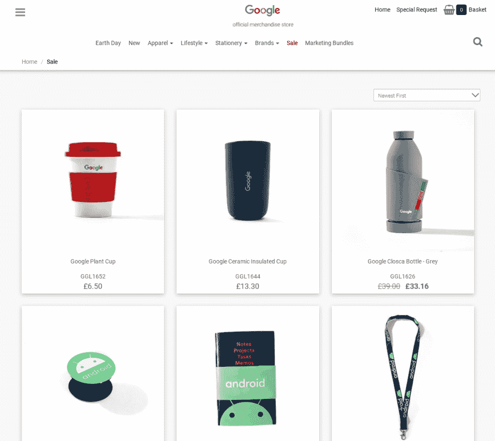

# 第九章：通过矩阵分解建议合适的产品

建议合适的产品是**机器学习**（**ML**）最常见应用之一。每天，产品推荐系统影响着我们在互联网上的选择。新闻通讯、电子商务网站、视频流媒体公司以及许多其他服务利用这种强大的 ML 技术，为我们提供有关可能购买或喜欢的产品的有意义建议。

在本章中，我们将以实际操作和实用性的方法，执行构建新推荐引擎的主要实现步骤，该引擎使用矩阵分解算法。

通过逐步和增量方法，利用 BigQuery ML，我们将涵盖以下主题：

+   介绍业务场景

+   发现矩阵分解

+   配置 BigQuery Flex Slots

+   探索和准备数据集

+   训练矩阵分解模型

+   评估矩阵分解模型

+   使用矩阵分解模型

+   提出业务结论

# 技术要求

本章要求您能够访问网络浏览器，并利用以下资源：

+   一个 GCP 账户来访问 Google Cloud 控制台。

+   一个 GCP 项目来托管 BigQuery 数据集。

+   BigQuery Flex slots 用于在 BigQuery ML 中训练矩阵分解模型。这类算法的训练仅适用于固定价格客户或预留客户。如果您使用的是按需定价的 BigQuery，我们将向您展示如何使用 BigQuery Flex Slots。

现在技术要求已经明确，让我们看看关于 BigQuery ML 矩阵分解模型的使用案例。

# 介绍业务场景

想象一下，你是一名为 Google 商品电子商务店工作的商业分析师。该网站向不同用户销售不同的谷歌品牌产品。一些用户已注册并有自己的标识符，他们的点击流活动收集在特定的数据集中。

重要提示

**点击流数据**是用户在特定网站上导航时留下的数字足迹。这些数据通常包括他们访问的网页、在每个页面上花费的时间、使用的设备、流量来源以及其他相关信息。

在这个场景中，数据是通过 Google 从 Google 商品电子商务门户使用**Google Analytics 360**收集的。这个工具可以集成到任何网站，并允许我们收集有关门户中每个页面上用户行为的详细信息，以便进行进一步分析和分析。

以下截图是 Google 商品店，该店销售谷歌品牌的设备：



图 9.1 – Google 商品店的截图

对于我们的业务场景，我们将设想我们的经理要求我们构建一个新的推荐引擎，以提高客户的使用体验以及他们的电子商务销售额。

我们的目标是开发一个机器学习模型，为在网站上注册的每位客户推荐合适的产品。为了实现这一目标，我们将使用已经收集并发布在 BigQuery 公共数据集中的 Google 商品店点击流数据。

作为业务分析师，我们的工作是分析数据，构建一个有效的推荐引擎，并使用现有数据向营销团队提供有意义的见解。

现在我们已经解释并理解了业务场景，让我们来看看我们将用于构建电子商务门户推荐引擎的机器学习技术。

# 发现矩阵分解

在本节中，我们将学习什么是**矩阵分解**，以及它是如何被用来构建推荐引擎的。

**矩阵分解**代表了一类通常用于构建推荐引擎的算法。这些算法建立在表示用户和项目之间交互的矩阵上。在这些类型的矩阵中，以下情况会发生：

+   每个用户或客户都由一行表示。

+   每个项目或产品对应于矩阵的一列。

+   矩阵的每个单元格都填充了一个数值：**反馈**。

这种**反馈**代表了一个特定用户对特定项目的评分。

在下面的屏幕截图中，我们可以看到一个矩阵的例子，其中行是视频流服务的客户，列是平台提供的电影。一些单元格包含一个从**1**到**5**的评分：

![图 9.2 – 推荐矩阵的表示

![img/B16722_09_002.jpg]

图 9.2 – 推荐矩阵的表示

在这个例子中，我们可以说**用户 1**对电影**闪灵**给出了平均评分，但对**泰坦尼克号**不喜欢。另一方面，**用户 4**对**泰坦尼克号**给出了最高评分，但没有对其他电影进行评分。

根据不同的业务场景，这种反馈可以被考虑为明确的或隐式的：

+   当用户自愿对特定项目进行评分时，例如在评论网站上，就有**明确的反馈**。

+   如果没有明确的反馈，推荐系统的开发者可以通过**隐式反馈**进行计算和推断。例如，如果客户购买了一个产品，我们可以假设他们会为该商品给出积极的反馈。

在电子商务数据中，用户往往不会明确给出反馈，但可以从收集过程中的其他信息中提取，例如点击次数、在特定页面上的时间或用户购买特定产品的数量。

矩阵分解算法在现实场景中得到广泛应用。以下是一些例子：

+   在在线书店中看到的推荐书籍。

+   我们可以在视频流服务中看到的推荐电视剧。

+   在我们的社交媒体动态中突出显示的帖子。

+   互联网广告系统推荐的商品。

在本节中，我们学习了矩阵分解的基础知识。现在，让我们配置 BigQuery Flex 槽位。

# 配置 BigQuery Flex 槽位

在本章中，我们将了解如何配置 BigQuery **Flex 槽位**以训练我们的机器学习模型。

BigQuery **槽位**是 BigQuery 分析能力的单位，用于执行 SQL 查询和训练 BigQuery ML 模型。一个 BigQuery 槽位代表一个**虚拟计算处理单元**（**VCPU**）的计算能力。

**Flex 槽位**允许我们在短时间内购买 BigQuery 分析能力。它们通常用于快速满足至少持续 60 秒的资源突发需求。

启用 Flex 槽位是训练矩阵分解模型所必需的；否则，BigQuery 将在训练阶段返回错误。

让我们看看如果我们使用按需计划，我们如何启用 BigQuery Flex 槽位：

1.  如果您尚未启用 BigQuery 预订，我们需要从左侧的 BigQuery 菜单访问**预订**：

    图 9.3 – 从 BigQuery 导航菜单访问预订

1.  点击**购买槽位**按钮以初始化 BigQuery Flex 槽位的购买过程：

    图 9.4 – 预订页面截图

1.  选择要购买的 Flex 槽位的最小数量；即**100**。然后，点击**下一步**按钮：

    图 9.5 – BigQuery 购买槽位过程

1.  在确认文本框中写下**CONFIRM**并点击蓝色**购买**按钮来确认您的选择：

    图 9.6 – 确认您的 BigQuery 槽位购买

1.  一旦确认购买，您就可以切换到**分配**选项卡来分配您刚刚购买的预订。

1.  在**分配**选项卡上，在第一个下拉菜单中选择您的 GCP 项目，在第二个下拉菜单中选择 Flex 槽位的预订。然后，点击**创建**按钮以完成您的配置：

    图 9.7 – 分配 BigQuery 槽位

1.  当分配完成时，我们可以返回 BigQuery 主页。

    重要提示

    警告：请记住在本用例结束时禁用 BigQuery 槽位的预订。每个 BigQuery 槽位每小时收费 0.04 美元。忘记禁用此预订将为您的 GCP 项目产生意外的账单。

在本节中，我们学习了如何购买 BigQuery Flex Slots 以便我们可以使用矩阵分解。现在，我们将专注于数据探索和准备步骤。

# 探索和准备数据集

在本节中，我们将分析我们将用于训练 BigQuery ML 模型的数据，并应用数据准备步骤。

让我们先清楚地了解 BigQuery 公共数据集中可用的 Google Analytics 数据，以便我们可以构建我们的推荐系统。

## 理解数据

在本节中，我们将导入必要的数据，然后理解数据集中将用于训练 BigQuery ML 模型的最相关字段。

在我们开始开发机器学习模型之前，我们将查看数据集及其模式。要开始探索数据集，我们需要执行以下操作：

1.  登录我们的 Google Cloud Console，并通过导航菜单访问 **BigQuery** 用户界面。

1.  在我们创建的项目下创建一个新的数据集，该项目位于 *第二章*，*设置您的 GCP 和 BigQuery 环境*。对于此用例，我们将使用默认选项创建 `09_recommendation_engine` 数据集。

1.  之后，我们需要打开托管 BigQuery 公共数据集的 `bigquery-public-data` GCP 项目，并浏览数据集，直到我们找到 `google_analytics_sample`。

1.  BigQuery 公共数据集包含多个表，这些表托管着 Google Analytics 示例数据。每个表根据它所引用的年份和月份展示不同的后缀：

    图 9.8 – 包含 ga_sessions 表的 Google Analytics 示例数据集

    我们将使用 **ga_sessions** 表来构建我们的矩阵分解模型。

    小贴士

    **ga_sessions** 表没有很好地描述，但如果我们需要关于这个数据集的更多信息，我们可以利用 BigQuery 文档中提供的示例，文档链接为 [`support.google.com/analytics/answer/4419694?hl=en`](https://support.google.com/analytics/answer/4419694?hl=en)。

1.  为了简化数据访问过程，让我们创建一个统一的单一表，将所有具有不同后缀的表合并在一起。让我们执行以下 SQL 语句：

    ```py
    CREATE OR REPLACE TABLE `09_recommendation_engine.all_ga_sessions` AS
    SELECT * FROM `bigquery-public-data.google_analytics_sample.ga_sessions_*`;
    ```

    查询创建了一个名为 `all_ga_sessions` 的新表，位于我们的 `09_recommendation_engine` 数据集中。此表将来自不同 `ga_sessions` 表的所有数据存储到一个独特的结构中。为了统一所有记录，我们使用了通配符字符，`*`。

    小贴士

    将 `ga_sessions_*` 表放入我们的新结构 `all_ga_sessions` 中。

1.  现在，我们可以简单地查询 `all_ga_sessions` 以预览其架构：

    ```py
    SELECT * FROM `09_recommendation_engine.all_ga_sessions`
    TABLESAMPLE SYSTEM (10 PERCENT);
    ```

    查询结果指出，表的架构相当复杂，包含多个嵌套字段。幸运的是，为了我们的目的，我们只需关注其中的一些：

    `fullVisitorID` 代表每个浏览谷歌网站的注册用户的标识符。

    `productSku` 是识别 Google 目录中特定产品的产品代码。一些产品的示例包括杯子、T 恤、包和袜子。

    `action_type` 列表示用户在网页会话期间执行的操作。如果此字段等于 `6`，则该行表示客户购买的具体产品。

既然我们已经确定了哪些列将用于我们的 ML 模型，现在是时候准备我们的训练数据集了。

## 创建训练数据集

在本节中，我们将创建将托管我们 BigQuery ML 模型训练数据的表。

为了训练我们的模型，我们将创建一个表，该表将托管网站上注册客户所进行的所有购买。

让我们创建包含三个字段的 `product_purchases` 表：

+   每个用户的代码：`fullVisitorId`

+   购买产品的标识符：`purchased_product_id`

+   `quantity` 字段，指定客户购买的产品数量

执行以下 SQL 语句以创建表：

```py
CREATE OR REPLACE TABLE `09_recommendation_engine.product_purchases` AS
SELECT    fullVisitorId,
          hits_product.productSKU AS purchased_product_id,
          COUNT(hits_product.productSKU) AS quantity
FROM
          `09_recommendation_engine.all_ga_sessions`,
          UNNEST(hits) AS hits,
          UNNEST(hits.product) AS hits_product
WHERE fullVisitorId IN (
                         SELECT fullVisitorId
                         FROM
                `09_recommendation_engine.all_ga_sessions`,
                         UNNEST(hits) AS hits
                         WHERE 
                     hits.eCommerceAction.action_type = '6'
                         GROUP BY fullVisitorId
                          )
GROUP BY fullVisitorId, purchased_product_id;
```

最内层的查询从 `all_ga_sessions` 表中提取所有通过 `fullVisitorId` 识别的顾客，这些顾客至少在电子商务门户上购买过产品。为了识别这些购买，我们在 `WHERE` 子句中添加了 `hits.eCommerceAction.action_type = '6'`。为了获取 `fullVisitorId` 的唯一值，查询利用了 `GROUP BY fullVisitorId` 子句。

在嵌套查询的 `FROM` 子句中，我们使用 `UNNEST` 函数提取原始表中存在的嵌套字段并访问它们。

重要提示

**UNNEST** 是一个用于将数组转换为多行集合的函数。它接受一个数组作为输入，并返回一个表，其中每行对应数组中的一个项目。

在最外层的查询中，我们仅提取与我们用例相关的三个字段：`fullVisitorId`、`purchased_product_id` 和我们的总 `quantity`。此最后指标是通过使用 `SUM` 操作符在特定用户购买特定产品时进行的所有交易获得的。

既然我们已经创建了推荐引擎将训练的表，让我们创建 BigQuery ML 模型。

# 训练矩阵分解模型

在本节中，我们将训练 BigQuery ML 矩阵分解模型，以便使用我们已准备好的电子商务数据构建推荐系统。

让我们从执行以下 SQL 语句开始训练 `purchase_recommender` ML 模型：

```py
CREATE OR REPLACE MODEL `09_recommendation_engine.purchase_recommender`
OPTIONS(model_type='matrix_factorization',
        user_col='fullVisitorID',
        item_col='purchased_product_id',
        rating_col='quantity',
        feedback_type='implicit'
        )
AS
SELECT fullVisitorID, purchased_product_id, quantity 
FROM `09_recommendation_engine.product_purchases`; 
```

查询的前几行由 `CREATE OR REPLACE MODEL` 关键字组成，后面跟着新 ML 模型的标识符 `` `09_recommendation_engine.purchase_recommender` `` 和 `OPTIONS`。

现在，让我们关注我们用于训练 BigQuery ML 模型的 `OPTIONS` 值：

+   模型类型是 `'matrix_factorization'`。此选项描述了我们用于训练推荐模型的算法。

+   `user_col='fullVisitorID'` 选项指定哪个列代表推荐引擎的用户。在我们的案例中，我们使用 `fullVisitorID` 字段，该字段分配给电子商务门户的注册客户。

+   使用 `item_col='purchased_product_id'` 选项时，我们使用客户购买的产品代码来识别模型中的每个项目。

+   由于我们没有产品的明确评分，我们将选择 `feedback_type='implicit'` 并使用购买的 `quantity` 值作为推荐引擎的评分。在这种情况下，我们假设如果用户购买了大量的产品，他们对产品感兴趣并且对产品满意。

大约 7 分钟后，矩阵分解模型将被训练，我们可以进入下一个阶段：评估阶段。

# 评估矩阵分解模型

在本节中，我们将评估我们在上一节中训练的矩阵分解模型的性能。

矩阵分解模型的评估阶段可以使用 `ML.EVALUATE` BigQuery ML 函数或通过 BigQuery UI 进行。

让我们执行以下查询以提取表征我们刚刚训练的推荐模型的全部评估参数：

```py
SELECT
  *
FROM
  ML.EVALUATE(MODEL `09_recommendation_engine.recommender`,
    (
    SELECT * FROM `09_recommendation_engine.product_visits`));
```

此查询的结果显示在下图中：


图 9.9 – 从矩阵分解模型评估中提取的记录

可以通过从 BigQuery 导航菜单中选择 ML 模型，然后访问**评估**选项卡来获取相同的信息。

在下图中，您可以查看 BigQuery ML 模型的评估指标：


图 9.10 – 矩阵分解模型的评估选项卡

由于**均方误差**的值非常低，我们可以对我们的矩阵分解模型所取得的结果感到满意。

在本节中，我们学习了如何访问我们推荐模型的性能指标。现在，让我们使用推荐模型来找到最佳产品，向我们的客户推荐。

# 使用矩阵分解模型

在本节中，我们将测试矩阵分解模型，以获取我们网站用户的推荐产品。

要使用我们的 BigQuery ML 模型，我们将使用 `ML.RECOMMEND` 函数，同时指定预测的参数。

推荐引擎除了模型本身外，不需要任何额外的输入参数。如果模型有一个输入列，则模型将只返回输入行中的推荐。如果没有提供输入值，则模型将对原始数据集中用户和项目的每个组合应用预测。

`ML.RECOMMEND` 返回三列：

+   代表用户的列。在我们的实现中，这由`fullVisitorID`列标识。

+   专门针对推荐给特定用户的项目的领域。在我们的案例中，这由`purchased_product_id`列表示。

+   第三列代表在显式矩阵分解模型中的预测评分。如果模型是隐式的，就像在我们的案例中一样，该字段存储了推荐的预测置信度。

让我们执行以下查询，以实现一个包含由我们的矩阵分解模型生成的所有推荐的表：

```py
CREATE OR REPLACE TABLE `09_recommendation_engine.product_recommendations` AS
    SELECT
      DISTINCT fullVisitorID, purchased_product_id, predicted_quantity_confidence
    FROM
      ML.RECOMMEND(MODEL`09_recommendation_engine.purchase_recommender`,
        (
        SELECT
          fullVisitorID
        FROM
          `09_recommendation_engine.product_purchases` ));
```

该查询创建了一个名为`product_recommendations`的新表，该表存储了用户和项目的`DISTINCT`对。在我们的案例中，这些对由`fullVisitorID`和`purchased_product_id`列组成。

对于每一对，`ML.RECOMMEND`函数还返回一个预测置信度，表示特定用户对电子商务目录中的产品感兴趣的概率。

现在我们已经得到了推荐引擎的输出，让我们学习如何从业务角度使用这些数据。

# 提取业务结论

现在我们已经应用了 BigQuery ML 模型，让我们学习如何从业务角度使用生成的结果来提高我们的销售策略的有效性。

从`product_recommendations`表中，我们可以提取相关信息，我们可以使用这些信息来改进我们的营销活动或广告策略，然后针对更有可能购买特定产品的用户进行定位。

例如，通过执行以下查询，我们可以从我们的电子商务门户中提取出前`100`个最有可能购买特定产品的用户：

```py
SELECT *
FROM
    `09_recommendation_engine.product_recommendations`
ORDER BY predicted_quantity_confidence DESC
LIMIT 100;
```

执行此 SQL 语句返回以下结果：


图 9.11 – 最有可能购买特定产品的客户

我们刚刚提取的列表可以发送到我们的营销办公室，以创建定制营销活动。或者，它也可以用于我们的电子商务门户，为特定注册客户推荐最有趣的产品。

# 摘要

在本章中，我们基于矩阵分解算法构建了一个推荐引擎。在介绍了业务场景之后，我们发现了矩阵分解是什么以及显式模型和隐式模型之间的区别。在深入数据探索之前，我们启用了 BigQuery Flex Slots，这对于训练这类机器学习算法是必要的。

然后，我们对 Google 从 Google Merchandise 电子商务门户收集的样本数据进行了分析和数据准备步骤。在这里，我们专注于构建我们的 BigQuery ML 模型所必需的字段。

接下来，我们创建了我们的训练表，其中包括每个用户所做的购买，以及每个产品的相关数量。

之后，我们在准备好的数据上训练了我们的矩阵分解模型。当模型训练完成后，我们使用 SQL 代码和 BigQuery UI 评估了其关键性能指标。

最后，我们使用我们新的矩阵分解模型生成了一些推荐，并提取了一份 100 名客户的清单，这些客户有很高的购买产品组合的倾向。

在下一章中，我们将介绍用于预测二元值的 XGBoost 算法。

# 进一步资源

+   **Google Analytics 360 公共数据集**: [`console.cloud.google.com/marketplace/product/obfuscated-ga360-data/obfuscated-ga360-data`](https://console.cloud.google.com/marketplace/product/obfuscated-ga360-data/obfuscated-ga360-data)

+   **BigQuery ML 创建模型**: [`cloud.google.com/bigquery-ml/docs/reference/standard-sql/bigqueryml-syntax-create`](https://cloud.google.com/bigquery-ml/docs/reference/standard-sql/bigqueryml-syntax-create)

+   **BigQuery ML 评估模型**: [`cloud.google.com/bigquery-ml/docs/reference/standard-sql/bigqueryml-syntax-evaluate`](https://cloud.google.com/bigquery-ml/docs/reference/standard-sql/bigqueryml-syntax-evaluate)

+   **BigQuery ML 推荐**: [`cloud.google.com/bigquery-ml/docs/reference/standard-sql/bigqueryml-syntax-recommend`](https://cloud.google.com/bigquery-ml/docs/reference/standard-sql/bigqueryml-syntax-recommend)

+   **BigQuery ML 显式矩阵分解示例**: [`cloud.google.com/bigquery-ml/docs/bigqueryml-mf-explicit-tutorial`](https://cloud.google.com/bigquery-ml/docs/bigqueryml-mf-explicit-tutorial)

+   **BigQuery ML 隐式矩阵分解示例**: [`cloud.google.com/bigquery-ml/docs/bigqueryml-mf-implicit-tutorial#implicit-model`](https://cloud.google.com/bigquery-ml/docs/bigqueryml-mf-implicit-tutorial#implicit-model)
