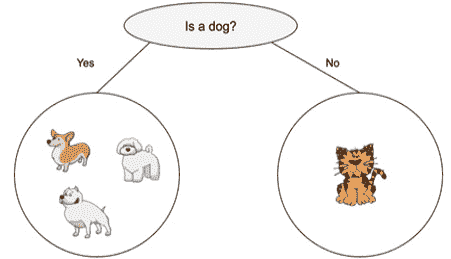
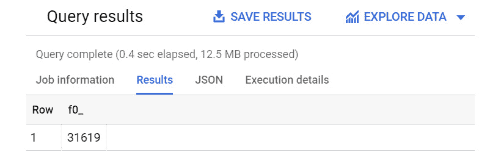
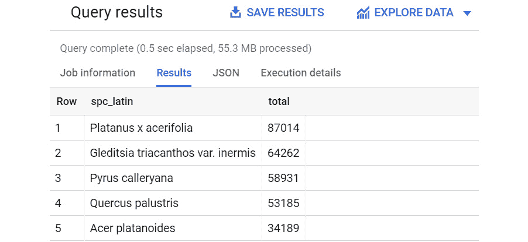
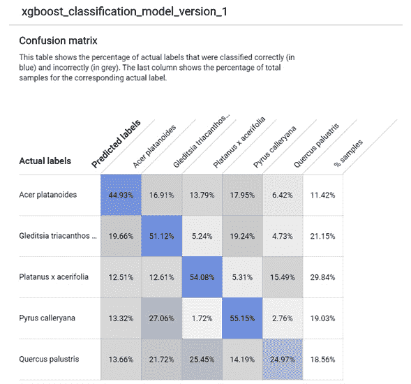
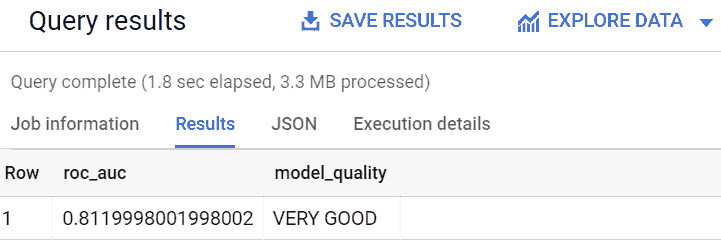
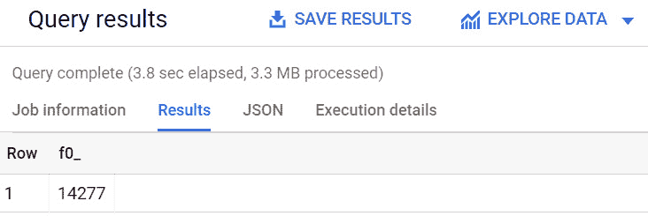
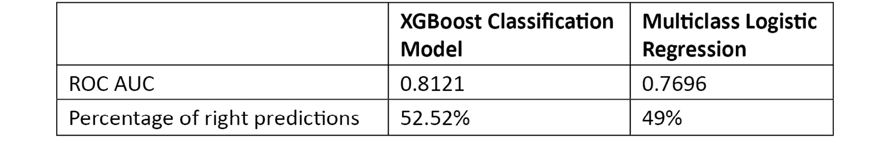

# 第十章：使用 XGBoost 预测布尔值

**极端梯度提升**（**XGBoost**）是数据科学家可以利用来解决复杂用例的最强大的机器学习（ML）库之一。它最初是一个研究项目，第一个版本于 2014 年发布。由于其功能和可移植性，这个机器学习库的受欢迎程度迅速增长。实际上，它被用于重要的 Kaggle 机器学习竞赛，并且现在可用于不同的编程语言和不同的操作系统。

这个库可以用来解决不同的机器学习（ML）问题，并且专门为结构化数据设计。XGBoost 也最近被发布用于 BigQuery ML。多亏了这项技术，BigQuery 用户现在可以使用这个库实现分类和回归机器学习模型。

在本章中，我们将看到实现 XGBoost 分类模型的所有必要阶段，以便根据其特征将纽约市的树木分类到不同的物种。

使用 BigQuery ML SQL 语法，我们将探讨以下主题：

+   介绍业务场景

+   发现 XGBoost 增强树分类模型

+   探索和理解数据集

+   训练 XGBoost 分类模型

+   评估 XGBoost 分类模型

+   使用 XGBoost 分类模型

+   绘制商业结论

# 技术要求

本章要求您能够访问网络浏览器，并能够利用以下资源：

+   一个 **Google Cloud Platform**（**GCP**）账户以访问 Google Cloud 控制台

+   一个 GCP 项目来托管 BigQuery 数据集

现在我们已经满足了技术要求，让我们深入分析和开发我们的 BigQuery ML XGBoost 分类模型。

查看以下视频以查看代码的实际应用：[`bit.ly/3ujnzH3`](https://bit.ly/3ujnzH3)

# 介绍业务场景

在本节中，我们将介绍将使用 XGBoost 分类算法解决的业务场景。

业务场景与在第六章中介绍和使用的用例非常相似，*使用多类逻辑回归对树木进行分类*。在本章中，我们将使用相同的数据集，但将应用更先进的机器学习算法。

我们可以总结并记住，机器学习模型的目标是自动根据纽约市树木的特征，如位置、大小和健康状况，将它们分类到不同的物种。

正如我们在*第九章*中做的，*通过矩阵分解建议合适的产品*，我们可以只关注城市中存在的五种最常见的树木物种。

现在我们已经解释并理解了业务场景，让我们看看我们可以用来根据特征自动分类树木的机器学习技术。

# 发现 XGBoost 提升树分类模型

在本节中，我们将了解 XGBoost 提升树分类模型是什么，以及我们将理解哪些分类用例可以使用这个机器学习算法来解决。

XGBoost 是一个开源库，为不同的语言提供了一个可移植的梯度提升框架。XGBoost 库适用于不同的编程语言，如 C++、Java、Python、R 和 Scala，并且可以在不同的操作系统上运行。XGBoost 用于处理监督学习用例，其中我们使用标记的训练数据来预测目标变量。

XGBoost 在机器学习社区中的普及度逐年增长，因为它经常是许多在机器学习竞赛中获胜团队的选项，例如 2016 年的*Kaggle - 高能物理与机器学习奖*。

XGBoost 提升树的分类能力基于使用多个决策树来分类数据，从而实现预测。

在以下图表中，你可以看到一个简单的表示用于分类动物的决策树：



图 10.1 – 决策树的表示

XGBoost 分类模型可以回答与多类逻辑回归相同的问题，例如以下问题：

+   我的客户的评论是*中立*、*正面*还是*负面*？

+   我的客户属于*金*、*银*还是*铜*级别？

+   特定客户的流失概率是*高*、*中*还是*低*？

+   图像识别算法识别的是*猫*、*狗*、*老鼠*还是*牛*？

在我们的业务场景中，我们可以利用 XGBoost 提升树分类模型将纽约市的树木分为五种不同的物种。实际上，我们对根据每棵树的特征预测物种感兴趣。

在 XGBoost 算法的训练阶段，机器学习模型试图找到为每棵树分配的最佳值，以最小化最终的误差指标。

训练完成后，我们将比较这个模型的结果与我们之前在*第六章*，“使用多类逻辑回归分类树木”中得到的成果。

现在我们已经学习了 XGBoost 提升树算法的基础知识，是时候看看我们将用于构建我们的机器学习模型的数据集了。

# 探索和理解数据集

在本节中，我们将分析和准备用于我们用例的数据集。我们将从一些数据质量检查开始，然后我们将数据分割成训练、评估和测试表。

由于数据集已经在*第六章*，*使用多类逻辑回归对树木进行分类*中使用过，因此我们不会从开始分析。相反，我们将专注于我们业务场景中最相关的查询。

## 检查数据质量

为了开始我们的数据探索并进行数据质量检查，我们需要执行以下操作：

1.  登录我们的 Google Cloud 控制台，并通过导航菜单访问**BigQuery** **用户界面**（**UI**）。

1.  在*第二章*，*设置您的 GCP 和 BigQuery 环境*中创建的项目下创建一个新的数据集。对于此用例，我们将创建一个名为`10_nyc_trees_xgboost`的数据集，并使用默认选项。

1.  首先，让我们通过执行以下查询来检查所有记录在`spc_latin`字段中是否包含有效的值：

    ```py
    SELECT  COUNT(*)
    FROM    `bigquery-public-data.new_york_trees.tree_census_2015`
    WHERE
             spc_latin is NULL;
    ```

    如以下屏幕截图所示，存在`spc_latin`列。这些记录将在训练阶段被过滤掉：

    

    图 10.2 – 查询结果显示应过滤掉一些记录

1.  在此第一次检查之后，我们需要验证是否有任何潜在的特征由`NULL`值表示。由于`sidewalk`和`health`字段中存在`NULL`值，我们将运行以下`COUNT`查询以检查三条记录。尽管数量很少，我们将在以下查询中过滤掉这些记录，以仅使用有意义的记录。

1.  然后，我们可以从 BigQuery 公共数据集中提取最常见的五种树种。让我们执行以下查询：

    ```py
    SELECT   spc_latin,
             COUNT(*) total
    FROM    `bigquery-public-data.new_york_trees.tree_census_2015`
    WHERE
             spc_latin is NOT NULL
             AND zip_city is NOT NULL
             AND tree_dbh is NOT NULL
             AND boroname is NOT NULL
             AND nta_name is NOT NULL
             AND health is NOT NULL
             AND sidewalk is NOT NULL
    GROUP BY
             spc_latin
    ORDER BY
             total desc
    LIMIT 5; 
    ```

    查询将`total`计算为每个`spc_latin`字段记录的数量。使用`ORDER BY`子句按`total`字段从大到小的值排序结果。然后，使用`LIMIT 5`子句仅返回前五条记录。

    在以下屏幕截图中，您可以查看查询结果，该结果显示了数据集中最常见的五种树种：

    

    图 10.3 – 数据集中最常见的树种

1.  为了将这些五种树种实体化到表中，让我们执行以下代码来创建一个名为`10_nyc_trees_xgboost.top5_species`的表：

    ```py
    CREATE OR REPLACE TABLE `10_nyc_trees_xgboost.top5_species` AS
          SELECT   spc_latin,
             COUNT(*) total
          FROM    `bigquery-public-data.new_york_trees.tree_census_2015`
          WHERE
                   spc_latin is NOT NULL
                   AND zip_city is NOT NULL
                   AND tree_dbh is NOT NULL
                   AND boroname is NOT NULL
                   AND nta_name is NOT NULL
                   AND health is NOT NULL
                   AND sidewalk is NOT NULL
          GROUP BY
                   spc_latin
          ORDER BY
                   total desc
          LIMIT 5;
    ```

    与之前*第 5 步*中执行的查询的唯一区别在于使用了`CREATE OR REPLACE TABLE`关键字，这些关键字被用来将查询的结果实体化到新表中。

在本节中，我们已经分析了 BigQuery 公共数据集的数据质量。现在，让我们开始将其分割成三个不同的表，用于训练、评估和分类阶段。

## 分割数据集

在实现我们的 XGBoost 分类模型之前，让我们根据机器学习开发生命周期的主要阶段来分割我们的数据集：训练、评估和使用。为了将记录随机分成三个不同的表格，我们将在`tree_id`数值字段上使用`MOD`函数。按照以下步骤操作：

1.  首先，让我们创建一个包含训练数据集的表格。为此，我们执行以下 SQL 语句：

    ```py
    CREATE OR REPLACE TABLE `10_nyc_trees_xgboost.training_table` AS 
    SELECT  *
    FROM    `bigquery-public-data.new_york_trees.tree_census_2015`
    WHERE
             zip_city is NOT NULL
             AND tree_dbh is NOT NULL
             AND boroname is NOT NULL
             AND nta_name is NOT NULL
             AND health is NOT NULL
             AND sidewalk is NOT NULL
             AND spc_latin in 
             (SELECT spc_latin from `10_nyc_trees_xgboost.top5_species`) 
             AND MOD(tree_id,11)<=8; 
    ```

    查询创建了一个包含原始数据集中所有列的`10_nyc_trees_xgboost.training_table`表格，通过`SELECT *`语句应用了所有必要的过滤器，以获取`spc_latin`标签和所有其他特征的空值。

    使用`IN`子句，`training_table`将只包含与数据集中我们已识别的前五种最常见的物种相关的记录。

    查询的最后一条语句，带有`MOD(tree_id,11)<=8`子句，使我们能够从整个数据集中仅选择 80%的记录。`MOD`代表*模*，返回`tree_id`除以 11 的余数。通过使用小于或等于运算符（`<=`），我们大约提取了整个数据集的 80%。

1.  采用类似的方法，我们可以创建一个名为`10_nyc_trees_xgboost.evaluation_table`的表格，该表格将用于评估我们的机器学习模型。让我们执行以下`CREATE TABLE`语句：

    ```py
    CREATE OR REPLACE TABLE `10_nyc_trees_xgboost.evaluation_table` AS 
    SELECT  *
    FROM    `bigquery-public-data.new_york_trees.tree_census_2015`
    WHERE
             zip_city is NOT NULL
             AND tree_dbh is NOT NULL
             AND boroname is NOT NULL
             AND nta_name is NOT NULL
             AND health is NOT NULL
             AND sidewalk is NOT NULL
             AND spc_latin in 
             (SELECT spc_latin from `06_nyc_trees.top5_species`) 
             AND MOD(tree_id,11)=9;
    ```

    与我们创建训练表时的情况相反，对于`evaluation_table`表，我们通过应用`MOD(tree_id,11)=9`过滤器，仅从整个数据集中选择 10%的记录。

1.  最后，我们将执行以下 SQL 语句以创建一个名为`10_nyc_trees_xgboost.classification_table`的表格，该表格将用于应用我们的 XGBoost 分类模型：

    ```py
    CREATE OR REPLACE TABLE `10_nyc_trees_xgboost.classification_table` AS 
    SELECT  *
    FROM    `bigquery-public-data.new_york_trees.tree_census_2015`
    WHERE
             zip_city is NOT NULL
             AND tree_dbh is NOT NULL
             AND boroname is NOT NULL
             AND nta_name is NOT NULL
             AND health is NOT NULL
             AND sidewalk is NOT NULL
             AND spc_latin in 
             (SELECT spc_latin from `10_nyc_trees_xgboost.top5_species`) 
             AND MOD(tree_id,11)=10;
    ```

    这个新表格与之前的表格非常相似，但多亏了`MOD`函数，它将包含数据集剩余的 10%。

在本节中，我们分析了包含纽约市树木信息的数据集，对数据进行了一些数据质量检查以排除空值，并分割了数据集，重点关注最常见的五种物种。现在我们已经完成了准备工作，是时候继续前进并开始训练我们的 BigQuery ML 模型了。

# 训练 XGBoost 分类模型

现在我们已经将数据集分割成多个表格以支持机器学习模型生命周期的不同阶段，让我们专注于训练我们的 XGBoost 分类模型。按照以下步骤操作：

1.  让我们从训练我们的第一个机器学习模型`xgboost_classification_model_version_1`开始，如下所示：

    ```py
    CREATE OR REPLACE MODEL `10_nyc_trees_xgboost.xgboost_classification_model_version_1`
    OPTIONS
      ( MODEL_TYPE='BOOSTED_TREE_CLASSIFIER',
        BOOSTER_TYPE = 'GBTREE',
        NUM_PARALLEL_TREE = 1,
        MAX_ITERATIONS = 50,
        TREE_METHOD = 'HIST',
        EARLY_STOP = FALSE,
        AUTO_CLASS_WEIGHTS=TRUE
      ) AS
    SELECT
      zip_city,
      tree_dbh,
      spc_latin as label
    FROM
      `10_nyc_trees_xgboost.training_table` ;
    ```

    在这个 BigQuery ML 语句中，我们可以看到使用`CREATE OR REPLACE MODEL`关键字来启动模型的训练。这些关键字后面跟着机器学习模型的标识符。

    在标识符之后，我们可以注意到一个`OPTIONS`子句。对于`MODEL_TYPE`，我们选择了`BOOSTED_TREE_CLASSIFIER`选项，这允许我们构建 XGBoost 分类模型。`BOOSTER_TYPE = 'GBTREE'`子句被认为是训练 XGBoost 提升树模型的默认选项。

    为了限制训练的复杂性和资源消耗，我们选择仅通过`NUM_PARALLEL_TREE = 1`子句并行训练一棵树，并使用`MAX_ITERATIONS`在`50`次迭代后停止训练。

    XGBoost 文档中建议对于大型数据集使用`HIST`参数，并使用`EARLY_STOP = FALSE`子句来防止在第一次迭代后停止训练阶段。

    最后一个选项，`AUTO_CLASS_WEIGHTS=TRUE`，用于平衡权重——在数据集不平衡的情况下——以及一些可能比其他树种更频繁出现的树种。

    这个模型的第一版本试图预测每棵树的物种，仅利用树木种植地的`zip_city`代码和树木的直径`tree_dbh`。

1.  训练结束后，我们可以从 BigQuery 导航菜单中访问机器学习模型，查看模型的性能。选择**评估**选项卡，我们可以看到**ROC AUC**值。在这种情况下，该值为**0.7775**，如下面的截图所示：

    图 10.4 – XGBoost 分类模型的评估指标

    在相同的**评估**选项卡中，我们还可以可视化混淆矩阵，该矩阵显示了预测值与实际值相等多少次，如下面的截图所示：

    

    图 10.5 – 评估选项卡显示了 XGBoost 分类模型的混淆矩阵

1.  让我们尝试通过添加有助于将树木分类为不同物种的特征来改进我们的机器学习模型。让我们通过运行以下代码来训练我们 BigQuery 机器学习模型的第二个版本：

    ```py
    CREATE OR REPLACE MODEL `10_nyc_trees_xgboost.xgboost_classification_model_version_2`
    OPTIONS
      ( MODEL_TYPE='BOOSTED_TREE_CLASSIFIER',
        BOOSTER_TYPE = 'GBTREE',
        NUM_PARALLEL_TREE = 1,
        MAX_ITERATIONS = 50,
        TREE_METHOD = 'HIST',
        EARLY_STOP = FALSE,
        AUTO_CLASS_WEIGHTS=TRUE
      ) AS
    SELECT
      zip_city,
      tree_dbh,
      boroname,
      nta_name,
      spc_latin as label
    FROM
      `10_nyc_trees_xgboost.training_table` ;
    ```

    与之前的*步骤 1*的第一次尝试相比，我们包括了额外的特征。事实上，我们将包含在`boroname`字段和`nta_name`字段中的区名添加到特征中，这些字段提供了与树木在城市中位置相关的更具体信息。

    执行 SQL 语句后，让我们访问新模型的**评估**选项卡，看看我们是否提高了其性能。查看**ROC AUC**值为**0.80**，我们可以看到与第一个版本相比，我们模型的性能略有提高。

1.  然后，我们将尝试向我们的机器学习模型添加与树木健康和其根系侵入性相关的其他特征，这些侵入性可能会损坏相邻的人行道，如下所示：

    ```py
    CREATE OR REPLACE MODEL `10_nyc_trees_xgboost.xgboost_classification_model_version_3`
    OPTIONS
      ( MODEL_TYPE='BOOSTED_TREE_CLASSIFIER',
        BOOSTER_TYPE = 'GBTREE',
        NUM_PARALLEL_TREE = 5,
        MAX_ITERATIONS = 50,
        TREE_METHOD = 'HIST',
        EARLY_STOP = FALSE,
        AUTO_CLASS_WEIGHTS=TRUE
      ) AS
    SELECT
      zip_city,
      tree_dbh,
      boroname,
      nta_name,
      health,
      sidewalk,
      spc_latin as label
    FROM
      `10_nyc_trees_xgboost.training_table`;
    ```

    与之前的 ML 模型相比，`xgboost_classification_model_version_3` 模型包含一个 `health` 字段，用于描述我们树木的健康状况，以及一个 `sidewalk` 字段，用于指定树木的根是否损坏相邻的人行道。

1.  在 BigQuery UI 的 **评估** 选项卡中查看我们最后 ML 模型的性能，我们可以注意到我们在 **ROC AUC** 方面又取得了提高，值为 **0.8121**。

在本节中，我们通过尝试在我们的数据集中使用不同的特征创建了不同的 ML 模型。在接下来的步骤中，我们将使用具有最高 `xgboost_classification_model_version_3` 的模型。

现在，让我们开始在评估数据集上对 XGBoost 分类模型进行评估阶段。

# 评估 XGBoost 分类模型

为了评估我们的 BigQuery ML 模型，我们将使用 `ML.EVALUATE` 函数以及我们专门创建的作为评估数据集的表格。

以下查询将告诉我们模型是否过度拟合，或者是否也能在新数据上表现良好：

```py
SELECT
  roc_auc,
  CASE
    WHEN roc_auc > .9 THEN 'EXCELLENT'
    WHEN roc_auc > .8 THEN 'VERY GOOD'
    WHEN roc_auc > .7 THEN 'GOOD'
    WHEN roc_auc > .6 THEN 'FINE'
    WHEN roc_auc > .5 THEN 'NEEDS IMPROVEMENTS'
  ELSE
  'POOR'
END
  AS model_quality
FROM 
  ML.EVALUATE(MODEL `10_nyc_trees_xgboost.xgboost_classification_model_version_3`,
    (
    SELECT
       zip_city,
       tree_dbh,
       boroname,
       nta_name,
       health,
       sidewalk,
       spc_latin as label
     FROM `10_nyc_trees_xgboost.evaluation_table`));
```

`SELECT` 语句提取了 `ML.EVALUATE` 函数返回的 `roc_auc` 值，并提供了对模型质量的清晰描述，从 `'POOR'` 开始，可以达到 `'EXCELLENT'` 等级，经过一些中间阶段，如 `'NEEDS IMPROVEMENTS'` 和 `'GOOD'`。

执行查询，我们可以看到分数是 **非常好**，如下面的截图所示：

![图 10.6 – 评估阶段为我们的 BigQuery ML 模型的质量返回了“非常好”]



图 10.6 – 评估阶段为我们的 BigQuery ML 模型的质量返回了“非常好”

现在我们已经评估了我们的 ML 模型，让我们看看我们如何将其应用于其他记录以获得树木的分类。

# 使用 XGBoost 分类模型

在本节中，我们将使用 ML 模型根据树木的特征将树木分类到五种不同的物种。

为了测试我们的 BigQuery ML 模型，我们将在 `classification_table` 表上使用 `ML.PREDICT` 函数，如下所示：

```py
SELECT
  tree_id,
  actual_label,
  predicted_label_probs,
  predicted_label
FROM
  ML.PREDICT (MODEL `10_nyc_trees_xgboost.xgboost_classification_model_version_3`,
    (
    SELECT
       tree_id,
       zip_city,
       tree_dbh,
       boroname,
       nta_name,
       health,
       sidewalk,
       spc_latin as actual_label
    FROM
      `10_nyc_trees_xgboost.classification_table`
     )
  );
```

查询由一个 `SELECT` 语句组成，该语句提取 `tree_id` 值、树木的实际物种、每个预测物种的概率以及预测物种。

在下面的截图中，你可以看到查询执行的结果：

![图 10.7 – 查询输出显示了实际标签和预测标签]

与相关的概率


图 10.7 – 查询输出显示了实际标签和预测标签以及相关的概率

在前面截图显示的两行中，标识为 **283502** 和 **226929** 的树木被很好地分类到 **Acer platanoides** 物种，置信度为 61%。

现在我们已经测试了我们的 BigQuery ML 模型，让我们通过比较 XGBoost 分类模型与在第六章中使用的逻辑回归的结果来做出一些最终考虑。

# 绘制业务结论

在本节中，我们将使用我们的 ML 模型，并了解 BigQuery ML 模型在`classification_table`表中能够将树木正确分类的次数。

让我们执行以下查询来计算预测物种与实际物种一致性的次数：

```py
SELECT COUNT(*)
FROM (
      SELECT
        tree_id,
        actual_label,
        predicted_label_probs,
        predicted_label
      FROM
        ML.PREDICT (MODEL `10_nyc_trees_xgboost.xgboost_classification_model_version_3`,
          (
          SELECT
             tree_id,
             zip_city,
             tree_dbh,
             boroname,
             nta_name,
             health,
             sidewalk,
             spc_latin as actual_label
          FROM
            `10_nyc_trees_xgboost.classification_table`
           )
        )
)
WHERE
      actual_label = predicted_label; 
```

为了计算这个值，我们通过仅过滤预测值等于实际值的行，引入了一个`WHERE`子句。

如以下截图所示，`SELECT COUNT`返回了**14277**条记录：



图 10.8 – 查询输出显示了分类模型预测正确物种的次数

在`classification_table`表中存储的 27,182 行数据中，我们可以说我们的模型在 52.52%的情况下将树木正确分类。

在以下表中，XGBoost 分类模型的结果与在*第六章*中应用的多元逻辑回归的结果进行了比较，*使用多元逻辑回归对树木进行分类*：



图 10.9 – XGBoost 分类模型和多类逻辑回归的比较

观察前面的表格，我们可以得出结论，为了将纽约市的树木分类到最常见的五种物种，与多元逻辑回归模型相比，XGBoost 分类模型能够实现更好的结果。

# 摘要

在本章中，我们实现了一个 XGBoost 分类模型。我们回忆了在*第六章*中已经使用的业务场景，*使用多元逻辑回归对树木进行分类*，基于自动分类纽约市树木的需求。之后，我们学习了 XGBoost 提升树分类模型的基础知识。

为了构建一个有效的模型，我们进行了数据质量检查，然后根据我们的需求将数据集分割成三个表：一个用于存放训练数据，第二个用于评估阶段，最后一个用于应用我们的分类模型。

在 BigQuery ML 模型的训练阶段，我们不断改进了 ML 模型的性能，使用 ROC AUC 作为**关键性能指标**（**KPI**）。

之后，我们评估了最佳 ML 模型在新的记录集上的表现，以避免任何过拟合，从而对我们 XGBoost 分类模型的高质量更加有信心。

最后，我们将我们的 BigQuery ML 模型应用于最后一批记录，根据它们的特征将树木分类到物种中。我们发现我们的 ML 模型在 52.52% 的情况下能够正确分类树木。然后，我们还比较了 XGBoost 模型的性能与我们在 *第六章* 中进行的多元逻辑回归训练，即 *使用多元逻辑回归分类树木*，并注意到 XGBoost 的性能超过了多元逻辑回归训练。

在下一章中，我们将学习关于高级 **深度神经网络**（**DNNs**），利用 BigQuery SQL 语法。

# 进一步资源

+   **纽约市街道树木普查公共数据集**：[`console.cloud.google.com/marketplace/product/city-of-new-york/nyc-tree-census`](https://console.cloud.google.com/marketplace/product/city-of-new-york/nyc-tree-census)

+   **XGBoost 主页**：[`xgboost.ai/`](https://xgboost.ai/)

+   **XGBoost 文档**：[`xgboost.readthedocs.io/en/latest/index.html`](https://xgboost.readthedocs.io/en/latest/index.html)

+   `CREATE MODEL` **语句用于提升树模型**：[`cloud.google.com/bigquery-ml/docs/reference/standard-sql/bigqueryml-syntax-create-boosted-tree`](https://cloud.google.com/bigquery-ml/docs/reference/standard-sql/bigqueryml-syntax-create-boosted-tree)

+   `ML.EVALUATE` **函数**：[`cloud.google.com/bigquery-ml/docs/reference/standard-sql/bigqueryml-syntax-evaluate`](https://cloud.google.com/bigquery-ml/docs/reference/standard-sql/bigqueryml-syntax-evaluate)

+   `ML.PREDICT` **函数**：[`cloud.google.com/bigquery-ml/docs/reference/standard-sql/bigqueryml-syntax-predict`](https://cloud.google.com/bigquery-ml/docs/reference/standard-sql/bigqueryml-syntax-predict)
