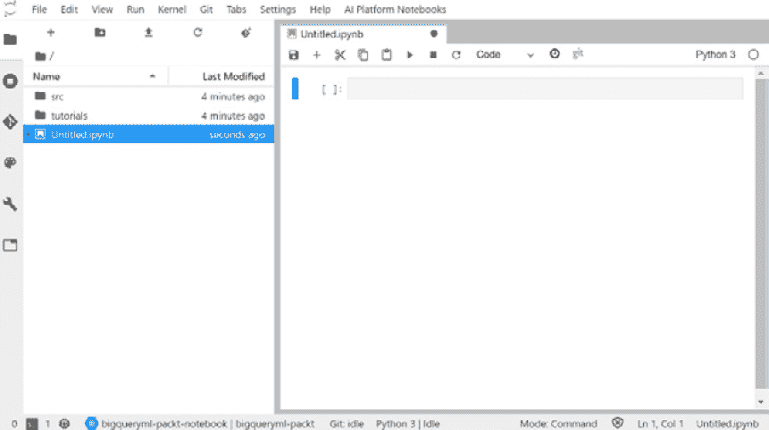
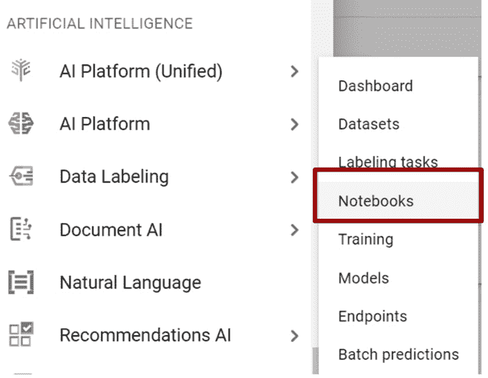
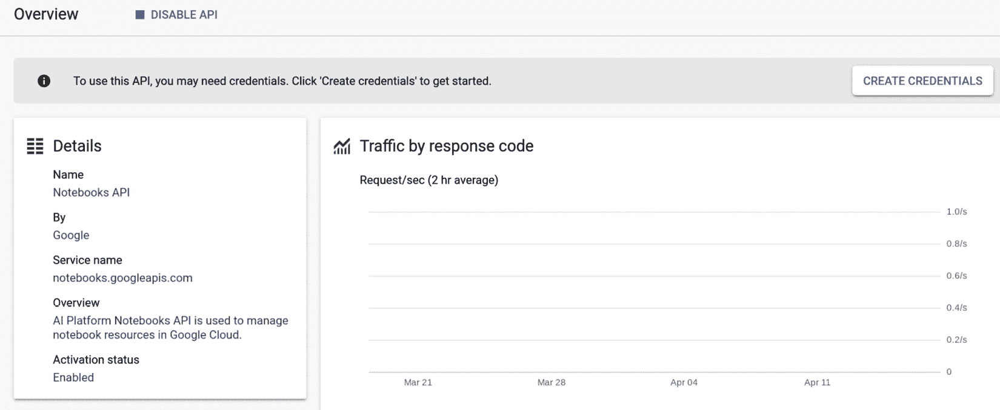
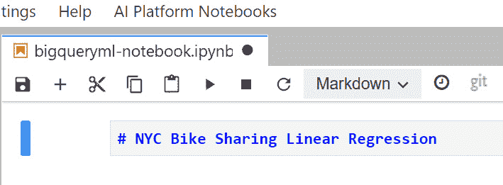
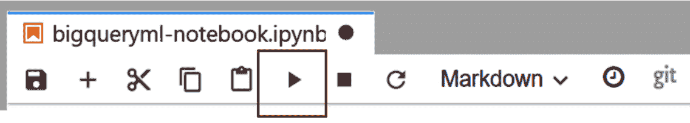
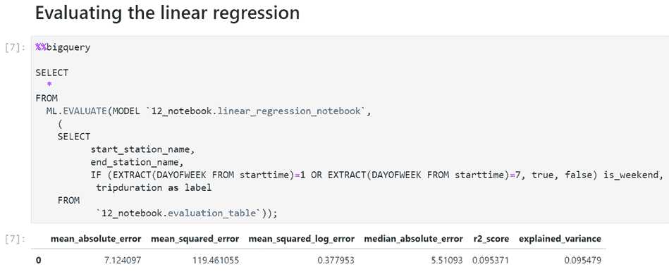
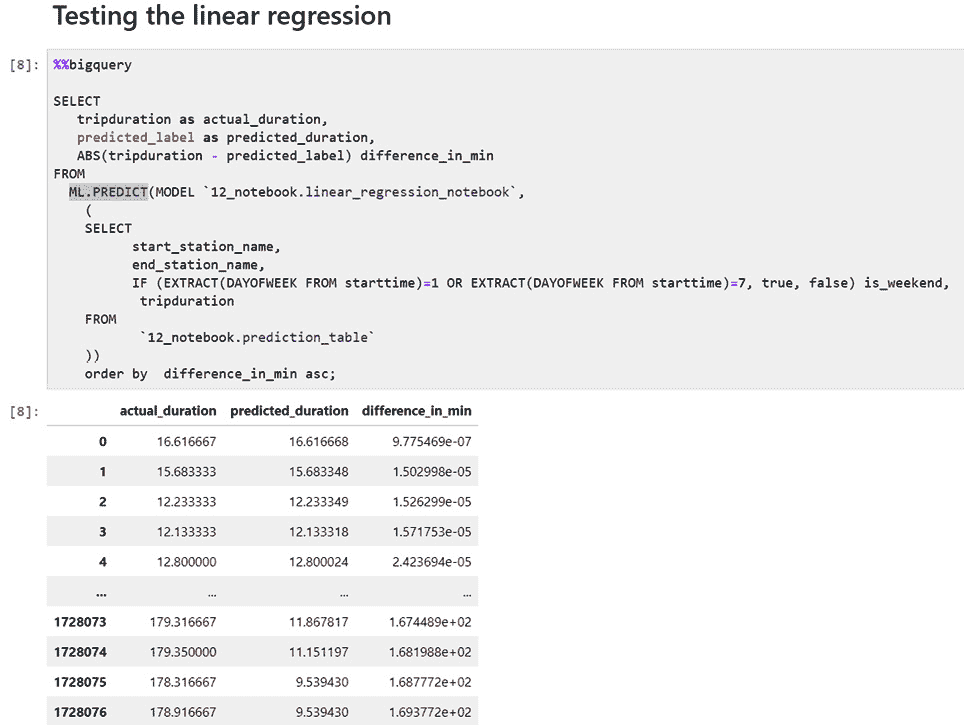

# 第十二章：使用 AI 笔记本与 BigQuery ML

对于数据科学家和机器学习工程师来说，笔记本是一个基本的生产力工具。笔记本允许我们与计算资源进行交互，因为我们可以使用它们来编写和执行代码，可视化结果，并与其他数据科学家分享成果。数据工程师、数据科学家和机器学习工程师在将代码部署到生产环境之前进行实验和探索数据。他们利用笔记本，因为它们提供了一个灵活且敏捷的环境来开发和测试。

在本章中，我们将学习 **AI 平台笔记本** 是什么，如何配置笔记本环境，以及如何使用它来开发 BigQuery ML 模型。

我们将从了解笔记本的基础知识开始，然后开始进行一些与 **Google Cloud Platform**（**GCP**）的动手实践。

在本章中，我们将涵盖以下主题：

+   发现 AI 平台笔记本

+   在笔记本中实现 BigQuery ML 模型

# 技术要求

本章要求您能够访问网络浏览器，并可以利用以下资源：

+   一个 GCP 账户以访问 Google Cloud Console

+   一个用于托管 BigQuery 数据集的 GCP 项目

现在我们已经了解了本章的技术要求，让我们学习如何使用 AI 平台笔记本开发机器学习模型。

查看以下视频以了解代码的实际应用：[`bit.ly/2QVZ1oY`](https://bit.ly/2QVZ1oY)

# 发现 AI 平台笔记本

在本节中，我们将学习 **AI 平台笔记本** 是什么以及它能够提供的优势。

**AI 平台笔记本** 是一个完全托管的服务，允许数据工程师和数据科学家使用 JupyterLab 开发环境。此服务允许我们开发、评估、测试和部署机器学习模型。

**JupyterLab** 是由 Project Jupyter 开发和维护的一个面向数据科学家的网络工具（[`jupyter.org/about`](https://jupyter.org/about)）。该项目的目标是开发开源软件和标准，为不同的编程语言提供独特的界面。

使用 AI 平台笔记本与 JupyterLab 可以带来几个优势：

+   我们可以轻松设置预配置的机器学习环境，其中包含最重要的和最有用的 ML 库，如 TensorFlow、Keras、PyTorch 等。

+   我们可以通过根据我们的需求增加硬件资源的大小来利用云的可扩展性。例如，我们可以通过增加 RAM 或添加 **图形处理单元**（**GPU**）来提高我们笔记本的性能。

+   我们可以在不进行任何额外配置的情况下从我们的笔记本访问其他 Google Cloud 服务。从 AI 平台笔记本，我们可以轻松利用 BigQuery、Dataflow 和 Dataproc。

+   我们可以将我们的开发环境与代码版本控制应用程序（如 Git）集成。

+   我们可以轻松地将我们的笔记本与同事或朋友分享，从而加快协作速度并提高生产力。

    在以下屏幕截图中，您可以看到 JupyterLab 笔记本的网页界面：



图 12.1 – JupyterLab 的网页界面

笔记本可以包含描述性内容、代码块和结果。它由一系列可执行的单元格组成。有两种类型的单元格：

+   **代码单元格**：包含可执行的代码以运行。它们的执行结果将在代码之后立即可视化。

+   **Markdown 单元格**：包含 HTML 代码以生成标题、列表和格式化文本。这些单元格通常用于描述代码，并使整个笔记本易于阅读和理解。

让我们进入下一节！

## AI 平台笔记本定价

在本节中，您将了解 AI 笔记本的价格是如何计算并记入您的 Google Cloud 账户的。

由于 JupyterLab 软件是开源的，当您使用 AI 平台笔记本时，您只需为消耗的 Google Cloud 资源付费。

要开始使用 AI 平台笔记本，您需要支付以下费用：

+   **Google Compute Engine**（**GCE**），用于部署您的开发环境的虚拟机。GCE 根据您配置的虚拟 CPU 数量、内存和磁盘收费。

+   任何可以从笔记本调用的其他服务，例如 BigQuery。

    小贴士

    记得在您不使用 AI 平台笔记本时关闭托管它的 GCE。如果虚拟机保持激活状态，即使您实际上没有使用，您也将继续为这些资源付费。

现在，我们已经了解了 AI 平台笔记本是什么以及为什么在开发机器学习模型时它可能很有用，在下一节中，我们将了解如何配置我们的第一个笔记本。

## 配置第一个笔记本

在本节中，我们将设置我们的第一个 AI 平台笔记本，该笔记本将用于训练、评估和测试 BigQuery ML 模型。

登录 GCP 控制台后，我们可以开始配置我们的第一个笔记本。让我们开始吧：

1.  首先，让我们浏览控制台的导航菜单，直到我们找到**AI 平台（统一）**项。从子菜单中选择**笔记本**：

    图 12.2 – 控制菜单中的 AI 平台笔记本

1.  如果这是我们第一次访问此服务，我们将被要求启用 API。我们可以点击蓝色的**启用**按钮开始使用该服务：

    图 12.3 – 启用笔记本 API

1.  几分钟后，服务将被启用并准备好使用。我们将被重定向到一个包含我们刚刚启用的 API 统计信息的网页：

    图 12.4 – Notebooks API 的统计信息

1.  再次从控制台的导航菜单中选择 **Notebooks** 项，我们将访问专门用于 AI 平台笔记本的页面。通过选择蓝色 **创建实例** 按钮，我们将开始配置笔记本：![图 12.5 – 创建新实例

    ![图片 B16722_12_005.jpg]

    图 12.5 – 创建新实例

1.  要创建笔记本实例，我们需要选择 **Instance name** 为 `bigqueryml-packt-notebook`，**Region** 为 **us-west1**，**Zone** 为 **use-west1-a**，**Operating System** 为 **Debian 10**，以及 **Environment** 为 **Python 3 (with Intel MKL)**。

1.  滚动到配置页面，选择 **n1-standard-2** 作为 **机器类型**。之后，我们可以通过点击蓝色 **创建** 按钮开始创建实例：![图 12.7 – 创建笔记本实例的附加选项

    ![图片 B16722_12_007.jpg]

    图 12.7 – 创建笔记本实例的附加选项

1.  几分钟后，笔记本实例将准备好使用。在选择了 **打开 JUPYTERLAB** 后，JupyterLab 笔记本将打开一个包含开发环境的新窗口：![图 12.8 – GCP 项目中可用的笔记本实例列表

    ![图片 B16722_12_008.jpg]

    图 12.8 – GCP 项目中可用的笔记本实例列表

1.  在 JupyterLab 笔记本的网页界面中，我们可以通过选择笔记本类型为 **Python 3** 来初始化第一个笔记本文件：![图 12.9 – 选择笔记本中使用的运行时引擎

    ![图片 B16722_12_009.jpg]

    图 12.9 – 选择笔记本中使用的运行时引擎

1.  在做出此选择后，将创建一个新的笔记本文件，并准备好供我们开发 BigQuery ML 机器学习模型：

![图 12.10 – 当笔记本初始化时，显示一个空文件

![图片 B16722_12_010.jpg]

图 12.10 – 当笔记本初始化时，显示一个空文件

在本节中，我们配置了我们的第一个 AI 平台笔记本。在下一节中，我们将使用它来执行一些代码块，以创建、评估和测试一个 BigQuery ML 机器学习模型。

# 在笔记本中实现 BigQuery ML 模型

在本节中，我们将利用在 *配置第一个笔记本* 部分配置的笔记本实例来运行 BigQuery SQL 语句并开发 BigQuery ML 机器学习模型。

要了解如何使用笔记本，我们将重用我们在 *第四章* 中构建的一些代码块，*使用线性回归预测数值*。重要的是要记住，用例的目标是预测纽约市自行车共享服务的每次骑行时间。为了实现这一目标，我们训练了一个简单的线性回归机器学习模型。在本节中，我们将使用相同的技巧；也就是说，我们将代码嵌入到 AI 平台笔记本中。

## 编译 AI 笔记本

在本节中，我们将使用**代码**单元格嵌入 SQL 查询，并使用**Markdown**单元格创建标题和描述。让我们通过执行以下步骤开始编译我们的笔记本：

1.  首先，让我们为我们的笔记本创建一个标题。从单元格类型下拉菜单中，我们可以选择**Markdown**并将以下代码块插入到笔记本的第一个单元格中：

    ```py
    # NYC Bike Sharing Linear Regression
    ```

    在以下屏幕截图中，您可以看到第一个单元格的配置方式：

    

    图 12.11 – Markdown 单元格的示例

    文本前面的**#**字符用于识别一级标题。

1.  通过在笔记本菜单中点击**+**按钮，您将添加一个新的单元格。让我们选择**Markdown**作为单元格类型，并插入以下文本，该文本描述了笔记本：

    ```py
    The following steps will show you how to train, evaluate and test a linear regression model using BigQuery ML.
    ```

1.  为了检查我们是否正确地编写了之前的步骤，我们可以使用笔记本菜单中的运行按钮。我们可以运行每个单元格以可视化结果：

    图 12.12 – 笔记本菜单中的运行按钮

    在以下屏幕截图中，您可以看到执行前两个步骤的结果，其中包含标题和简短描述：

    

    图 12.13 – 执行前几个单元格的结果

1.  让我们在模型的数据准备部分开始之前添加一个副标题。我们将在文本之前添加另一个`##`字符来识别二级标题。它可以被认为是我们在*步骤 1*中编写的标题的副标题。

1.  现在，我们准备好创建`12_notebook` BigQuery 数据集，该数据集将用于托管我们的 BigQuery ML 模型。让我们在当前 GCP 项目中的`US`下创建一个`12_notebook`数据集。在单元格末尾，`print`命令用于显示确认消息，表明数据集已成功创建。

1.  现在，我们可以添加一个新的`12_notebook.training_table`表格：

    ```py
    %%bigquery
    ### Creation of the training table ###
    CREATE OR REPLACE TABLE `12_notebook.training_table` AS
                  SELECT 
                        tripduration/60 tripduration,
                        starttime,
                        stoptime,
                        start_station_id,
                        start_station_name,
                        start_station_latitude,
                        start_station_longitude,
                        end_station_id,
                        end_station_name,
                        end_station_latitude,
                        end_station_longitude,
                        bikeid,
                        usertype,
                        birth_year,
                        gender,
                        customer_plan
                  FROM
                        `bigquery-public-data.new_york_citibike.citibike_trips`
                  WHERE 
                        (
                            (EXTRACT (YEAR FROM starttime)=2017 AND
                              (EXTRACT (MONTH FROM starttime)>=04 OR EXTRACT (MONTH FROM starttime)<=10))
                            OR (EXTRACT (YEAR FROM starttime)=2018 AND
                              (EXTRACT (MONTH FROM starttime)>=01 OR EXTRACT (MONTH FROM starttime)<=02))
                        )
                        AND (tripduration>=3*60 AND tripduration<=3*60*60)
                        AND  birth_year is not NULL
                        AND birth_year < 2007;
    ```

    `%%bigquery`关键字允许我们包含包含 SQL 查询的代码块。SQL 语句将通过 AI 平台笔记本和关系型数据库的本地集成直接在 BigQuery 上运行。

    创建表格的业务逻辑与我们用于在*第四章*中创建`04_nyc_bike_sharing.training_table`表格的方式相同，*使用线性回归预测数值*。

1.  现在，让我们在*第四章*中包含一个额外的`04_nyc_bike_sharing.evaluation_table`表格，*使用线性回归预测数值*。

1.  最后，让我们在*第四章*中添加另一个`04_nyc_bike_sharing.prediction_table`表格，*使用线性回归预测数值*。

1.  让我们在模型的训练部分开始之前添加一个副标题。我们将通过插入以下标题来添加一个**Markdown**单元格：

    ```py
    ## Training the linear regression
    ```

1.  现在，我们已经准备好编写将使用笔记本训练我们的机器学习模型的 BigQuery ML 查询。让我们添加一个新的`` `12_notebook.trip_duration_notebook` ``机器学习模型，它包含我们在*第四章*中使用的相同业务逻辑，即使用`` `04_nyc_bike_sharing.trip_duration_by_stations_and_day` ``模型来训练。

1.  让我们在模型的训练部分开始之前添加一个副标题。我们将通过插入以下标题来添加一个**Markdown**单元格：

    ```py
    ## Evaluating the linear regression
    ```

1.  现在，我们已经准备好编写将评估机器学习模型的 BigQuery ML 查询。让我们添加一个新的`` `12_notebook.trip_duration_notebook` ``机器学习模型，它包含我们在*第四章*中使用的相同业务逻辑，即使用`` `04_nyc_bike_sharing.trip_duration_by_stations_and_day` ``模型来评估。

1.  让我们在模型的预测部分开始之前添加一个副标题。我们将通过插入以下标题来添加一个**Markdown**单元格：

    ```py
    ## Testing the linear regression
    ```

1.  现在，我们可以包含我们将用于我们的机器学习模型的 BigQuery ML 查询。让我们添加一个新的`` `12_notebook.trip_duration_notebook` ``机器学习模型，它包含我们在*第四章*中使用的相同业务逻辑，即使用`` `04_nyc_bike_sharing.trip_duration_by_stations_and_day` ``模型来预测数值。

1.  在编译阶段结束时，我们可以使用主菜单中的**保存笔记本**按钮或使用**另存为笔记本…**选项来保存笔记本。

在本节中，我们使用代码单元格和 Markdown 单元格编译了我们的笔记本。在下一节中，我们将运行笔记本中编写的代码。

## 在 AI 笔记本中运行代码

在本节中，我们将运行我们在*编译 AI 笔记本*部分编写的代码。让我们先看看我们准备好的笔记本。

在下面的屏幕截图中，我们可以可视化我们的 AI 笔记本，它交替显示描述性单元格和代码单元格：

![Figure 12.14 – The entire notebook file compiled

![img/B16722_12_014.jpg]

图 12.14 – 整个笔记本文件已编译

要运行整个笔记本，我们只需在窗口顶部打开**运行**菜单并选择**运行所有单元格**，如图所示：

![Figure 12.15 – Running all the cells

![img/B16722_12_015.jpg]

图 12.15 – 运行所有单元格

选择**运行所有单元格**后，AI 平台笔记本中的所有单元格将依次执行。

在评估步骤结束时，`ML.EVALUATE`函数的结果将在*评估线性回归*部分显示。

以下截图显示了评估阶段返回的值：



图 12.16 – 评估函数返回的值

在预测步骤结束时，`ML.PREDICT`函数的结果将在“测试线性回归”部分显示。

在以下截图中，我们可以可视化笔记本末尾呈现的结果：



图 12.17 – PREDICT 函数返回的值

如您所见，在执行代码块后，笔记本立即在 SQL 语句之后呈现预测结果。如果我们希望提高 BigQuery ML 开发步骤的可读性和理解性，这一特性尤为重要。

在本节中，我们学习了如何编译人工智能笔记本以及如何运行包含代码块或标题和描述的所有单元格。

# 摘要

在本章中，我们学习了人工智能笔记本是什么以及为什么它们在机器学习模型开发中可能很有用，我们还了解了定价模型。我们发现了 Google AI Platform Notebooks 与开源环境 JupyterLab 之间的关系。

首先，我们使用 Google Cloud Console 网页界面配置了我们的第一个笔记本实例。然后，我们使用这个新实例开发了一个简单的线性回归模型，同时在笔记本文件中交替使用代码块和描述性单元格。

最后，我们在笔记本中执行了所有步骤，并在其网页界面中直接可视化结果。

在下一章中，我们将学习如何使用 BigQuery ML 直接从 BigQuery 调用 TensorFlow 模型。

# 更多资源

+   **纽约自行车共享公共数据集**：[`console.cloud.google.com/marketplace/product/city-of-new-york/nyc-citi-bike`](https://console.cloud.google.com/marketplace/product/city-of-new-york/nyc-citi-bike)

+   **BigQuery ML 创建模型**：[`cloud.google.com/bigquery-ml/docs/reference/standard-sql/bigqueryml-syntax-create`](https://cloud.google.com/bigquery-ml/docs/reference/standard-sql/bigqueryml-syntax-create)

+   **BigQuery ML 评估模型**：[`cloud.google.com/bigquery-ml/docs/reference/standard-sql/bigqueryml-syntax-evaluate`](https://cloud.google.com/bigquery-ml/docs/reference/standard-sql/bigqueryml-syntax-evaluate)

+   **BigQuery ML PREDICT**：[`cloud.google.com/bigquery-ml/docs/reference/standard-sql/bigqueryml-syntax-predict`](https://cloud.google.com/bigquery-ml/docs/reference/standard-sql/bigqueryml-syntax-predict)

+   **BigQuery ML 线性回归示例**：[`cloud.google.com/bigquery-ml/docs/bigqueryml-natality`](https://cloud.google.com/bigquery-ml/docs/bigqueryml-natality)

+   **Jupyter Notebooks 最佳实践**: [`cloud.google.com/blog/products/ai-machine-learning/best-practices-that-can-improve-the-life-of-any-developer-using-jupyter-notebooks`](https://cloud.google.com/blog/products/ai-machine-learning/best-practices-that-can-improve-the-life-of-any-developer-using-jupyter-notebooks)

+   **在 AI 平台上原型设计模型**: [`codelabs.developers.google.com/codelabs/prototyping-caip-notebooks/#0`](https://codelabs.developers.google.com/codelabs/prototyping-caip-notebooks/#0)
