# 第三章：SQL 和关系型数据库入门

根据《大数据分析与应用杂志》最近发表的一篇文章，互联网上的每一秒，都会发生以下情况：

+   制作了 70 万条状态更新。

+   发送了 1,100 万条消息。

+   接收了 1.7 亿封电子邮件。

+   新增了 1,820 **太字节** (**TB**) 的数据。

断言商业环境中数据以史无前例的速度快速增长是一种低估。随着这一主要信息爆炸，全球各地的公司都在投入大量资本，努力有效地捕捉、分析和从这些数据中为公司带来收益。数据可以管理和随后检索以提供可操作见解的主要方法之一是通过**结构化查询语言** (**SQL**)。

类似于我们使用**终端命令行**创建**目录**，或者 Python 进行计算，你可以使用**SQL**在本地计算机上或远程云中创建和管理数据库。SQL 的形式和风味取决于你选择的平台，每种形式都包含略微不同的语法。然而，SQL 通常由四种主要类型的语言语句组成，这些将在下面概述：

+   **数据操纵语言** (**DML**)：查询和编辑数据

+   **数据定义语言** (**DDL**)：查询和编辑数据库表

+   **数据控制语言** (**DCL**)：创建角色和添加权限

+   **事务控制语言** (**TCL**)：管理数据库事务

全球大多数公司都有自己的**最佳实践**，当涉及到 DDL、DCL 和 TCL 以及数据库如何集成到他们的企业系统中。然而，DML 通常是相同的，并且通常是任何给定数据科学家的主要关注点。为此，我们将本章重点放在与 DML 相关的应用上。到本章结束时，你将获得一些最重要的数据库概念的强烈介绍，完全安装 MySQL Workbench 到你的本地机器上，并部署了一个完整的**亚马逊网络服务关系数据库服务** (**AWS RDS**)服务器来托管和提供你的数据。请注意，所有这些功能都可以后来用于你自己的事业。让我们开始吧！

本章我们将涵盖以下主题：

+   探索关系型数据库

+   教程：MySQL 入门

# 技术要求

在本章中，我们将探讨关系数据库背后的主要概念、其优势和应用。我们将重点关注一种特定的关系数据库“风味”，即 MySQL。我们将通过其常见的**用户界面**（**UI**），称为**MySQL Workbench**来使用 MySQL。无论您使用的是 Mac 还是 PC，MySQL Workbench 的安装过程都将非常相似，我们将在本章后面一起进行操作。此界面将允许您与本地机器或云端远程托管的数据库进行交互。在本章中，我们将部署和托管我们的数据库服务器在 AWS 云中，因此您需要有一个 AWS 账户。您可以通过访问 AWS 网站([`aws.amazon.com/`](https://aws.amazon.com/))并注册为新用户来创建账户。

# 探索关系数据库

数据库类型繁多——例如**面向对象**（**OO**）数据库、图数据库和关系数据库——每种数据库都提供特定的功能。

**面向对象数据库**最适合与面向对象数据一起使用。这些数据库中的数据通常由包含字段、函数和属性等成员的对象组成；然而，对象之间的关系并没有得到很好的捕捉。

另一方面，正如其名所示，**图数据库**最适合用于由节点和边组成的数据。生物技术领域图数据库最常见的应用之一是小分子药物设计。分子由节点和边以某种形式连接在一起——这些关系最好在图数据库中捕捉。然而，分子之间的关系在这里也没有得到很好的捕捉。

最后，正如其名所示，**关系数据库**最适合用于关系至关重要的数据库。关系数据库在生物技术和医疗保健领域的最重要应用之一是围绕患者数据。由于患者数据的复杂性，关系数据库常用于存储患者数据。患者将有许多不同的字段，如姓名、地址、位置、年龄和性别。患者将被开具多种药物，每种药物都包含其自身的子字段，如大量的数字、数量和过期日期。每个批次将有一个生产地点、生产日期及其相关成分，每个成分也将有其各自的参数，等等。这种数据的复杂性和其相关关系最好在关系数据库中捕捉。

关系型数据库是标准的数字数据库，以列和行的形式存储表格，这些列和行相互关联。两个表格之间的关系以**唯一标识符**（**UID**）或**主键**（**PK**）的形式存在。这个键作为单个表格中每行的唯一值，使用户能够将一个表格的行与另一个表格中相应的行匹配。这些表格在技术上并没有任何连接方式；它们只是相互引用或关联。让我们来看一个简单的例子，关于患者数据。

如果我们创建一个包含患者姓名、联系信息、药店和开具处方的医生的患者数据表，我们可能会得到一个类似的表格：

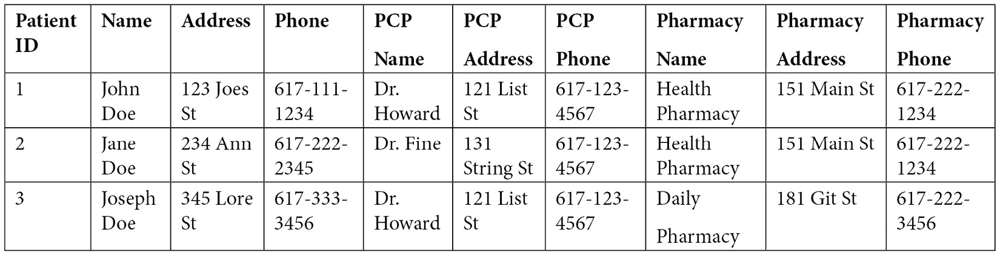

图 3.1 – 显示示例患者数据集的表格

从最初的角度来看，这个表格是完美的。我们左边的列表中清晰地列出了患者的信息，包括他们的姓名、地址和电话号码。我们还列出了患者的相应**初级保健医生**（**PCP**），包括他们的相关姓名、地址和电话号码。最后，我们还列出了患者的相应药店及其相关的联系信息。如果我们试图生成一个包含所有患者及其相应 PCPs 和药店的数据库，这将是一个完美的表格。然而，将这些数据存储在数据库中则是一个不同的故事。

注意到一些初级保健医生（PCP）的姓名和他们的联系信息是重复的。同样，一家药店在我们的列表中出现多次，因为我们已经在同一表格中两次列出了名称、地址和电话号码。从三行表格的角度来看，这种重复是可以忽略不计的。然而，当我们把这个表格从 3 个患者扩展到 30,000 个患者时，重复可能会从数据库的角度（存储数据）和计算的角度（检索数据）变得非常昂贵。

我们可以选择不使用单一表格来存储所有数据，而是拥有多个表格，当它们为了特定目的（例如生成数据集）临时联合时，从长远来看会显著降低成本。将数据拆分或**规范化**到更小的表格中的这种想法是关系型数据库的核心。关系型数据库的主要目的是提供一个方便且高效的流程来存储和检索信息，同时尽可能减少重复。为了使这个数据库更加“关系型”，我们可以将数据拆分为三个表格——药店、患者和初级保健医生（PCPs）——这样我们只存储每个条目一次，但使用键系统来引用它们。

在这里，你可以看到常用的**统一建模语言**（**UML**）图，通常用于描述关系型数据库。由单线分成三条线的连接表示一种**一对多**的关系。在以下情况下，一家药店可以有多个患者，一个 PCP 也可以有多个患者，但一个患者只能有一个 PCP，也只能有一个药店。能够快速理解数据库设计并将其转换为 UML 图（或反之亦然）是处理数据库时的一项优秀技能，通常被视为一个优秀的面试话题——我实际上几年前就收到了这个问题：

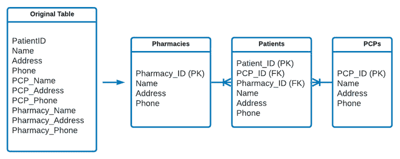

图 3.2 – 将更大的表规范化为较小的关系表的过程

上一张图展示了原始表可以如何拆分。注意，每个表都有一个 ID；这个 ID 是其 UID 或 PK。与其他表相连的表使用**外键**（**FK**）进行引用。例如，一个 PCP 可以有多个患者，但每个患者只有一个 PCP；因此，每个患者条目都需要有与其关联的 PCP 的外键。很有趣，对吧？

以这种方式分离数据的过程被称为数据库**规范化**，大多数关系型数据库都必须遵循一系列规则才能正确地进行规范化。数据科学家通常不会设计大型企业数据库（我们将这些任务留给数据库管理员）。然而，我们经常设计较小的**概念验证**数据库，这些数据库遵循非常相似的标准。更常见的是，我们与规模显著更大的企业数据库进行交互，这些数据库通常处于关系状态或以数据湖的形式存在。在两种情况下，对关系型数据库的结构和基本概念有扎实的知识对于任何数据科学家来说都非常有价值。

## 数据库规范化

在准备一个**规范化**的数据库时，我们必须考虑许多规则，通常被称为**范式**。在关系型数据库的背景下，我们将简要讨论三个范式，如下所示：

### 第一范式

为了满足数据库规范化的**第一范式**（**1NF**），每个单元格中的值在意义上必须是**原子的**，即每个单元格只包含一种类型的数据。例如，包含地址如**5 First Street, Boston MA 02215**的列包含非原子数据，违反了此规则，因为它在一个单元格中包含了街道号码、街道名称、城市、州和邮政编码。我们可以通过将其拆分为五个列来规范化这些数据，如下所示：

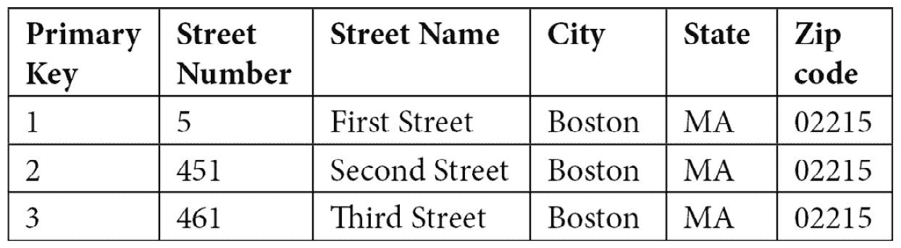

图 3.3 – 表格显示如何将地址拆分为单个原子单元

现在我们已经对第一种数据规范化形式有了更好的理解，让我们继续探索第二种形式。

### 第二范式

为了满足**第二范式**（**2NF**）的条件，表必须有一个**PK**作为 UID，并且除了 PK 之外的所有字段必须完全依赖于整个键。例如，我们可以有一个包含所有患者的表，在这个表中，患者的名字、姓氏和电话号码依赖于 PK。这个键代表患者，不代表其他任何东西。我们还可以有一个代表 PCPs、他们的位置、相关医院等的另一个表。然而，从数据库规范化的角度来看，将此类信息添加到代表患者的表中是不合适的。

为了满足患者数据库的此条件，我们需要将表拆分，使得患者数据在一个表中，而相关的 PCP 在第二个表中，通过 FK 连接，正如我们在前面的例子中看到的。

### 第三范式

为了满足**第三范式**（**3NF**）的条件，我们必须满足 1NF 和 2NF 的条件，并且确保表中的所有字段在功能上相互独立——换句话说，没有字段可以是计算字段。例如，一个标题为*年龄*的字段，其值为 27 岁、32 岁和 65 岁，在这里是不合适的，因为这些是计算出来的量。相反，可以使用一个标题为*出生日期*的字段，并关联相应的日期来满足这个条件。

大多数数据科学家在结构化主要数据库和规范化它们方面花费的时间很少；然而，他们花费大量时间理解数据库结构，并形成查询以正确和高效地检索数据。因此，对数据库的坚实基础理解始终是有用的。

尽管数据库管理员和数据工程师倾向于在结构化和规范化数据库上花费更多时间，但在理解这些结构并开发有效查询以正确和高效地检索数据时，数据科学家端花费的时间也很多。因此，无论使用哪种类型的数据库，对数据库的坚实基础理解始终是有用的。

## 关系型数据库的类型

根据商业数据库提供商的不同，你可能会遇到几种不同的**SQL**版本。许多这些数据库可以分为两大类：**开源**或**企业级**。开源数据库通常是免费的，允许学生、教育者和独立用户根据他们的具体条款和条件无限制地使用他们的软件。另一方面，企业数据库通常在大公司中很常见。现在，我们将探讨大多数行业中常见的几种数据库，包括技术、生物技术和医疗保健行业。

### 开源

以下列表显示了一些常见的开源数据库：

+   **SQLite**：一个符合**原子性、一致性、隔离性、持久性**（**ACID**）标准的**关系数据库管理系统**（**RDBMS**），常用于较小的本地托管项目。SQLite 可以在 Python 语言中使用来存储数据。

+   **MySQL**：虽然不符合 ACID 标准，但 MySQL 提供了与 SQLite 相似的功能，但规模更大，可以存储更多的数据，并提供多用户访问。

+   **PostgreSQL**：一个符合 ACID 标准的数据库系统，提供更快的数据处理速度，更适合拥有更大用户群体的数据库。

现在让我们来探索一些企业选项。

### 企业

以下列表显示了一些常见的企业数据库：

+   **AWS RDS**：一个基于云的关系数据库服务，提供可扩展且成本效益高的服务来存储、管理和检索数据。

+   **Microsoft SQL Server**：一个类似于 MySQL Workbench 的企业级关系数据库管理系统，提供云托管服务以存储和检索数据。

+   **系统应用和产品在数据处理中**（**SAP**）：一个用于存储和检索服务的 RDBS 解决方案，常用于库存和制造数据。

现在，让我们动手操作 MySQL。

# 教程 – MySQL 入门

在接下来的教程中，我们将探讨启动基于云的服务器以托管私有关系型数据库的最常见过程之一。首先，我们将安装一个**实例**的 MySQL——这是最受欢迎的数据库管理平台之一。然后，我们将创建一个完整的免费层**AWS RDS 服务器**并将其连接到 MySQL 实例。最后，我们将上传一个关于小分子毒性和其相关属性的本地**逗号分隔值**（**CSV**）文件，并开始探索和学习如何从我们的数据集中查询数据。

你可以在这里看到 AWS RDS 连接到 MySQL 实例的表示：

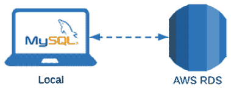

图 3.4 – 显示 MySQL 将连接到 AWS RDS 的示意图

重要提示

注意，虽然这个教程涉及到在这个 AWS RDS 实例中创建数据库以存储毒性数据集，但你将能够回收所有组件用于未来的项目，并创建多个新的数据库，而无需重复教程。让我们开始吧！

## 安装 MySQL Workbench

在众多数据库设计工具中，MySQL Workbench 通常是最容易设计、实施和使用的。MySQL Workbench 简单来说是一个由 Oracle 开发的**图形用户界面**（**GUI**）虚拟数据库设计工具，它允许用户为各种项目创建、设计、管理和交互数据库。或者，MySQL 也可以以 MySQL Shell 的形式使用，允许用户通过终端命令行与数据库交互。对于那些对使用终端命令行工作感兴趣的人，可以通过访问[`dev.mysql.com/downloads/shell/`](https://dev.mysql.com/downloads/shell/)并使用**微软安装程序**（**MSI**）来下载 MySQL Shell。然而，为了本教程的目的，我们将使用 MySQL Workbench，因为它具有用户友好的界面。让我们开始吧！按照以下步骤进行：

1.  在您的本地计算机上安装 MySQL Workbench 相对简单且易于完成。请前往[`dev.mysql.com/downloads/workbench/`](https://dev.mysql.com/downloads/workbench/)，选择您的操作系统，然后点击**下载**，如图所示：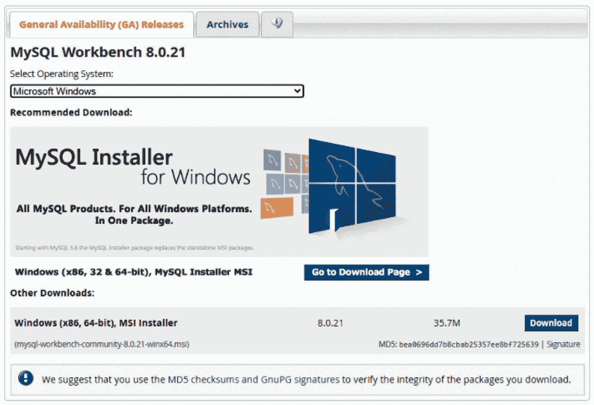

    图 3.5 – MySQL 安装程序页面

1.  下载文件后，点击**安装**。如果您有特定的标准需要满足，请按照安装步骤进行；否则，选择所有默认选项。确保允许 MySQL 选择标准目标文件夹，然后选择**完整**设置类型，如图所示：

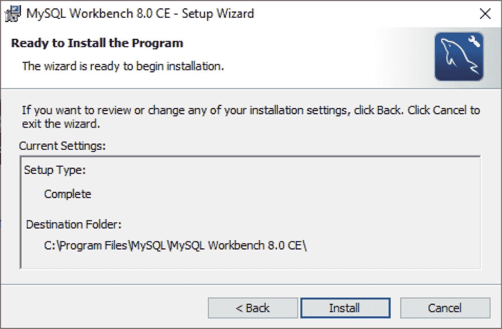

图 3.6 – MySQL 安装程序页面（继续）

这样，MySQL Workbench 现在已成功安装在您的本地机器上。我们将前往 AWS 网站创建一个远程数据库实例供我们使用。请注意，我们假设您已经创建了一个 AWS 账户。

## 在 AWS 上创建 MySQL 实例

让我们创建一个 MySQL 实例，如下所示：

1.  导航到[`www.aws.amazon.com`](https://www.aws.amazon.com)，并登录您的 AWS 账户。登录后，前往 AWS 管理控制台，并在**数据库**部分选择**RDS**，如图所示：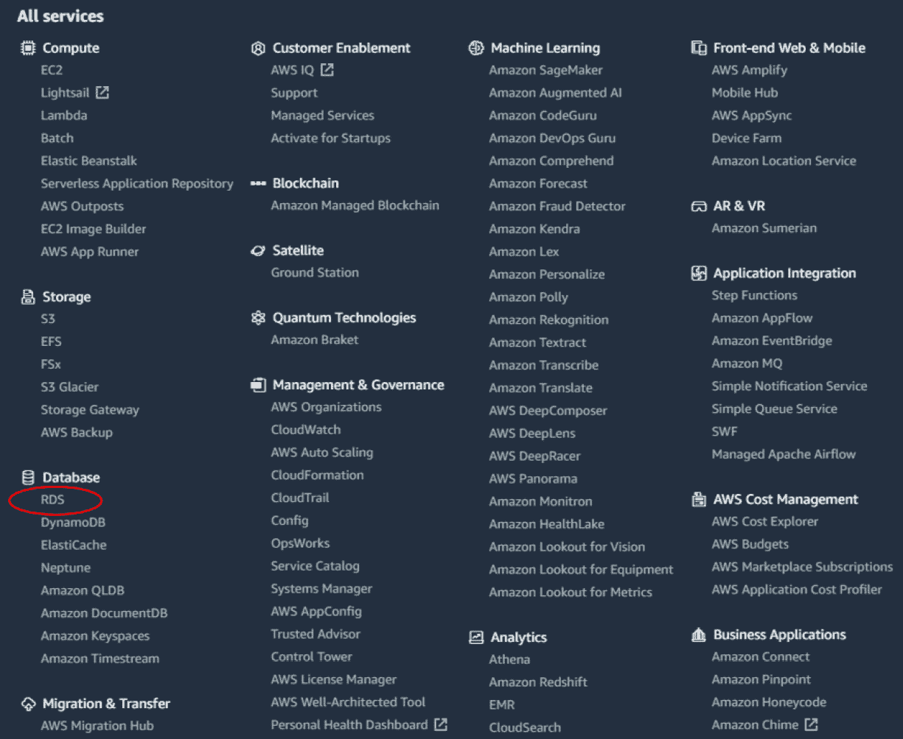

    图 3.7 – AWS 管理控制台页面

1.  从页面顶部点击**创建数据库**按钮。选择数据库创建方法的**标准创建**选项，然后选择**MySQL**作为引擎类型，如图所示：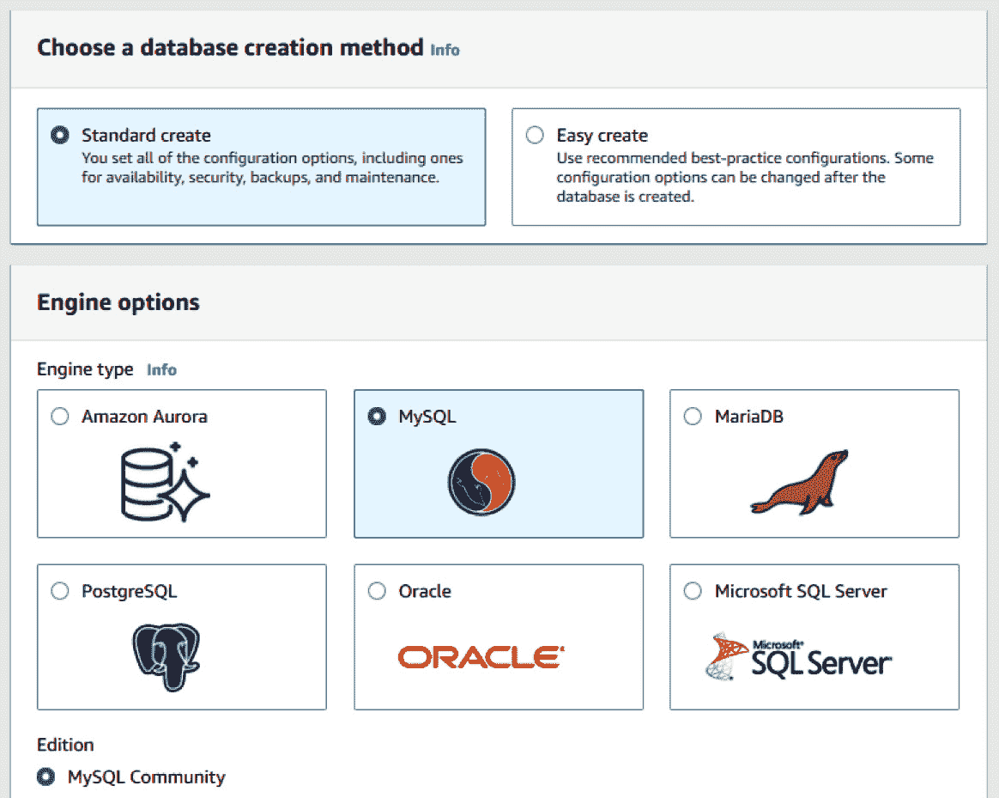

    图 3.8 – RDS 引擎选项

1.  在**模板**部分，您将拥有三个不同的选项：**生产环境**、**开发/测试**和**免费层**。如果您打算使用生产级服务器，当然可以选择前两个选项，但我建议您选择第三个选项，**免费层**，以便充分利用其免费的优势。以下截图显示了选择此选项的情况：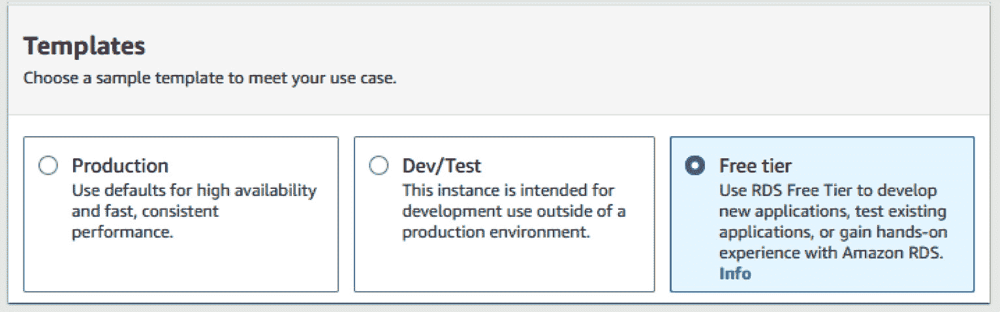

    图 3.9 – RDS 模板选项

1.  在`toxicitydatabase`的`admin`用户下，接着输入您选择的密码。您还可以利用 AWS 提供的**自动生成密码**功能。如果您选择此选项，密码将在实例创建后对您可用。该过程在以下截图中展示：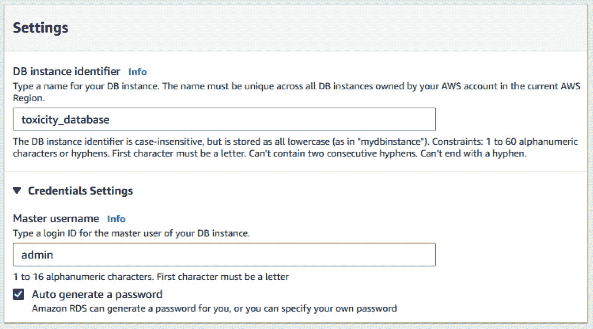

    图 3.10 – RDS 设置选项

1.  在`db.t2.micro`实例类型下。对于存储，选择默认参数，其中**存储类型为通用型(SSD)**选项被选中，并为服务器分配 20**千兆字节**（**GB**）的大小。请确保禁用自动扩展功能，因为我们不需要此功能。

1.  最后，当涉及到连接性时，选择您的默认**虚拟私有云**（**VPC**），然后选择默认子网。请确保将**公共访问**设置更改为**是**，因为这将允许我们从本地的 MySQL 安装连接到实例。接下来，确保在**数据库身份验证**部分的**密码和 IAM 数据库身份验证**选项被选中，如图所示。然后，点击**创建数据库**：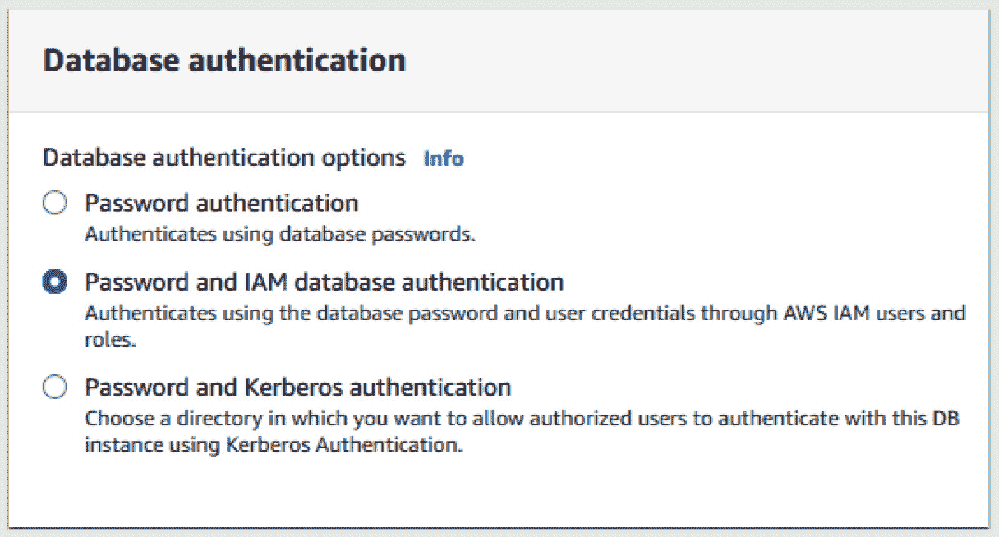

    图 3.11 – RDS 密码生成选项

1.  一旦开始数据库创建过程，您将被重定向到您的 RDS 控制台，其中包含数据库列表，您将看到正在创建的`toxicitydataset`数据库，如图所示。请注意，数据库的**状态**列将显示为**挂起**一段时间。在此期间，如果您请求 AWS 为您自动生成数据库密码，您将在页面顶部的**查看连接详情**按钮中找到它。请注意，出于安全原因，*这些凭据将永远不会再次向您展示*。请确保打开这些详情并将所有内容复制到安全位置。通过本地 MySQL 界面连接到这个远程数据库需要主**用户名**、主**密码**和指定的**端点**值。这样，我们现在已经创建了一个 AWS RDS 服务器，我们可以现在离开 AWS 保持当前状态，并将全部注意力转向 MySQL Workbench：

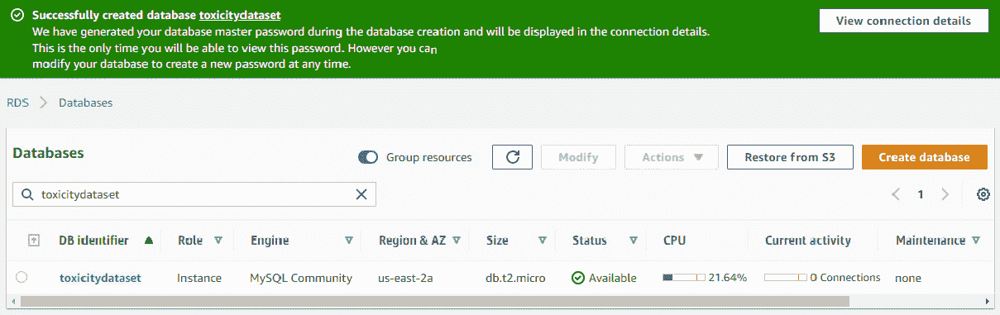

图 3.12 – RDS 菜单

在我们的 AWS 基础设施准备就绪后，让我们开始使用我们新创建的数据库。

## 使用 MySQL

一旦 AWS 上的设置完成，请继续打开 MySQL Workbench。请注意，您可能会被提示重新启动计算机。按照以下步骤操作：

1.  您应该会看到一个欢迎信息，然后是各种选项。在**MySQL 连接**部分的右侧，点击**+**号以添加新的连接，如图所示：

    图 3.13 – MySQL 连接按钮

1.  在此菜单中，我们将创建一个名为`toxicity_db_tutorial`的新数据库连接。我们将选择`标准（TCP/IP）`连接方法。将**主机名**字段更改为在 AWS 连接详情页面中提供的端点。接下来，添加在 AWS 中指定或为您生成的用户名和密码。务必将您的密码保存在保险库中，以便稍后访问。最后，点击**测试连接**按钮。过程如图所示。如果所有步骤都正确执行，您应该收到**成功连接**的响应：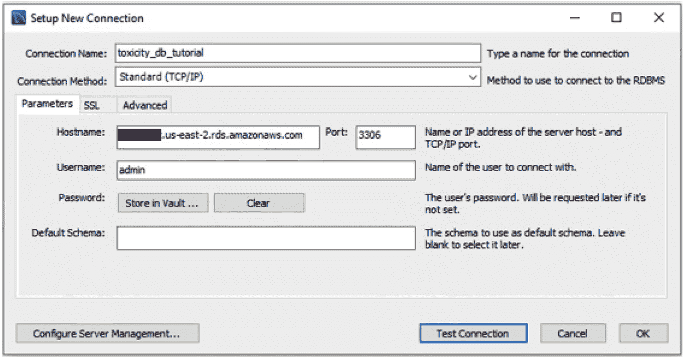

    图 3.14 – MySQL 设置新连接菜单

1.  在主菜单中，您应该在**MySQL 连接**部分下看到新连接。双击新创建的连接，输入您的 root 计算机密码（如果未保存在保险库中），然后点击**确定**。这样，我们就已创建了一个新的数据库连接，并使用 MySQL Workbench 连接到了它。

1.  MySQL 的文档非常全面，因为它包含了许多几乎需要一本自己的书来完全涵盖的功能。为了本教程的目的，我们将专注于数据科学领域中常用功能的一个子集。在**MySQL Workbench**窗口中，用户应该注意三个主要部分——**模式导航器**、**查询编辑器**和**输出窗口**，如图所示：

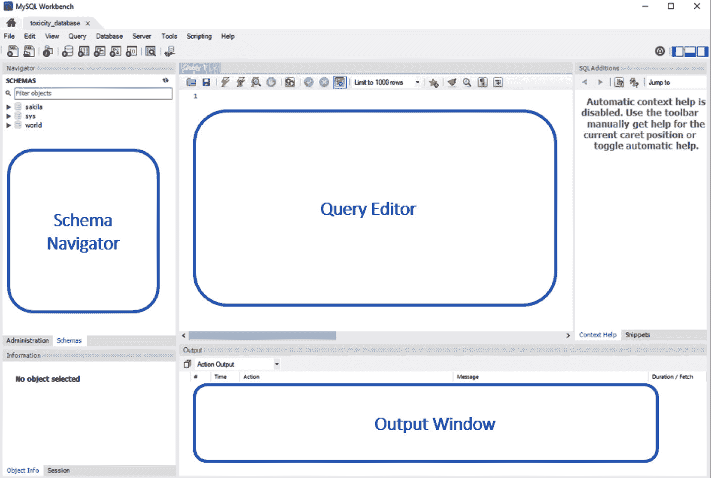

图 3.15 – MySQL Workbench 预览

**模式导航器**是窗口中允许用户在数据库之间导航的部分。根据您询问的人和上下文，单词“模式”和“数据库”有时是同义的，可以互换使用。在本书的上下文中，我们将“模式”定义为数据库的蓝图，“数据库”本身即为数据库。

**查询编辑器**是页面中您作为用户将执行 SQL 脚本的部分。在此部分中，可以创建、更新、查询或删除数据。您可以使用**输出窗口**（正如其名所示），用于显示执行查询的输出。如果查询出错或发生意外情况，您可能会在这里找到关于它的一个重要信息。

## 创建数据库

在我们开始进行任何查询之前，我们需要一些数据来工作。让我们看看我们新服务器上当前存在的数据库。在查询编辑器中输入 `SHOW DATABASES;`，然后点击 **执行** () 按钮。你将得到一个系统上可用的数据库列表。大多数这些数据库要么是从以前的项目创建的，要么是系统用来管理数据的。无论如何，让我们避免使用那些。现在，按照以下步骤操作：

1.  我们可以使用以下 SQL 语句创建一个新的数据库：

    ```py
    CREATE DATABASE IF NOT EXISTS toxicity_db_tutorial;
    ```

1.  在输出窗口中，你应该看到一条消息确认此语句的执行成功。现在，让我们继续用之前存在的 CSV 文件填充我们的数据库。从模式导航器中选择 **模式** 选项卡，并使用带有两个圆形箭头的图标刷新列表。你将看到新创建的数据库出现在列表中，如图所示：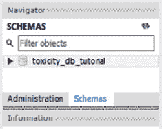

    图 3.16 – MySQL 模式列表

1.  接下来，在数据库上右键单击，然后点击 `dataset_toxicity_sd.csv` CSV 文件。当提示选择目的地时，选择默认参数，允许 MySQL 在 `toxicity_db_tutorial` 数据库中创建一个名为 `dataset_toxicity_sd` 的新表。在 **导入配置** 设置中，允许 MySQL 为数据集选择默认数据类型。继续通过向导直到导入过程完成。鉴于我们的服务器是远程的，文件传输可能需要一些时间。

1.  一旦文件完全导入到 AWS RDS，我们现在就可以检查我们的数据并开始运行一些 SQL 语句。如果你在模式导航器中点击表，你会看到从 CSV 文件中导入的所有列的列表，如下面的截图所示：

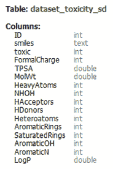

图 3.17 – 毒性数据集的列列表

仔细查看这些列，我们注意到我们开始于一个 `ID` 列，它作为我们的 PK 或 UID，数据类型为 `int`，即整数。然后我们注意到一个名为 `smiles` 的列，它是一个文本或字符串，代表分子的实际化学结构。接下来，我们有一个名为 `toxic` 的列，它表示化合物的 *毒性*，用 *1* 表示有毒，或用 *0* 表示无毒。我们将 `toxic` 列称为我们的 `FormalCharge` 到 `LogP` 是分子的 **属性** 或 **特征**。我们在下一章将要着手的主要目标之一是开发一个预测模型，使用这些特征作为输入数据并尝试预测毒性。现在，我们将使用这个数据集来探索 SQL 及其最常用的 **子句** 和 **语句**。

## 查询数据

文件已完全导入到 AWS RDS，我们现在可以运行一些命令了。

我们将从一个简单的`SELECT`语句开始，我们将从新创建的表中检索所有数据。我们可以在`SELECT`命令之后使用`*`参数来表示特定表中的所有数据。表本身可以使用以下语法在末尾指定：`<database_name>.<table_name>:`

在实际命令中，它看起来是这样的：

```py
SELECT * from toxicity_db_tutorial.dataset_toxicity_sd;
```

这给我们以下输出：

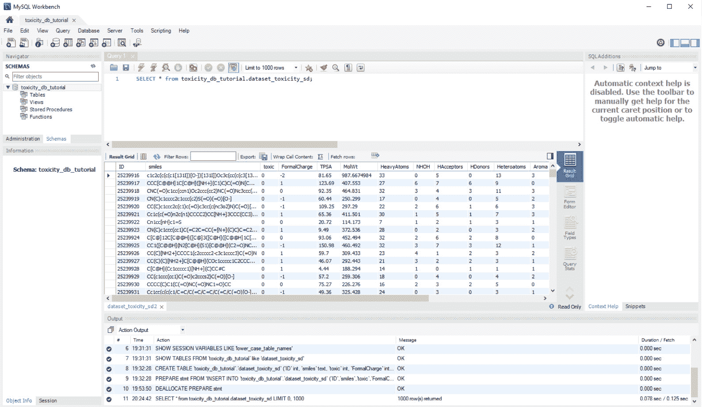

图 3.18 – MySQL Workbench 查询预览

在任何给定的查询中，我们很少会查询所有列和所有行。通常情况下，我们会将列限制在我们感兴趣的列上。我们可以通过将`*`参数替换为感兴趣列的列表来实现这一点，如下所示：

```py
SELECT 
  ID,
      TPSA,
      MolWt,
      LogP,
      toxic
 from toxicity_db_tutorial.dataset_toxicity_sd;
```

注意，列之间用逗号分隔，而语句中的其他参数则不是。除了限制列数外，我们还可以使用`LIMIT`子句来限制行数，后面跟我们要检索的行数，如下所示：

```py
SELECT 
  ID,
      TPSA,
      MolWt,
      LogP,
      toxic
 from toxicity_db_tutorial.dataset_toxicity_sd LIMIT 10;
```

除了指定我们的列和行之外，我们还可以对列值应用操作，如加法、减法、乘法和除法。我们还可以根据特定的条件集过滤我们的数据。例如，我们可以运行一个简单的查询，查询数据库中所有有毒化合物（`toxic=1`）的`ID`和`smiles`列，如下所示：

```py
SELECT 
  ID,
    SMILES,
     toxic
 from toxicity_db_tutorial.dataset_toxicity_sd
 WHERE toxic=1;
```

同样，我们也可以通过将语句的最后一行更改为`WHERE toxic = 0`或`WHERE toxic != 1`来找到所有非有毒化合物。我们可以在`WHERE`子句中添加更多的条件来扩展此查询。

## 条件查询

条件查询可以根据具体的使用场景更有效地过滤数据。我们可以使用`AND`运算符来查询与特定毒性相关的数据，`AND`运算符将确保需要满足两个条件，如下面的代码片段所示：

```py
SELECT 
  ID,
      SMILES,
     toxic
 from toxicity_db_tutorial.dataset_toxicity_sd
 WHERE toxic=1 AND MolWt > 500;
```

或者，我们也可以使用`OR`运算符，其中只需要满足一个条件——例如，前面的查询需要数据具有毒性值为`1`和摩尔质量为`500`，因此返回 26 行数据。在这里使用`OR`运算符将需要满足*任一*条件，因此返回 318 行。运算符也可以组合使用。例如，如果我们想查询具有`1`个氢受体和`1`、`2`或`3`个氢供体的所有分子的 ID、smiles 表示和毒性，我们可以使用以下语句来完成此查询：

```py
SELECT 
   ID,
      SMILES,
      toxic
 from toxicity_db_tutorial.dataset_toxicity_sd
 WHERE HAcceptors=1 AND (HDonors = 1 OR HDonors = 2 OR HDonors = 3);
```

重要的一点是，当指定连续顺序中的多个`OR`运算符，例如三个`HDonors`值时，可以使用`BETWEEN`运算符来避免不必要的重复。

## 数据分组

在对数据库进行查询时，一个常见的做法是按某一列对数据进行分组。让我们以一个必须检索数据集中有毒与无毒化合物实例总数的情况为例。我们可以通过使用`WHERE`语句轻松查询值为`1`或`0`的实例。然而，如果结果的数量是`100`而不是`2`呢？运行这个查询 100 次，每次迭代替换值，将不可行。对于这种类型的操作，或者任何分组值重要的操作，我们可以使用`GROUP BY`语句与`COUNT`函数的组合，如下面的代码片段所示：

```py
SELECT 
  ID,
    SMILES,
    COUNT(*) AS count
 from toxicity_db_tutorial.dataset_toxicity_sd
 GROUP BY toxic
```

这在下面的屏幕截图中有显示：

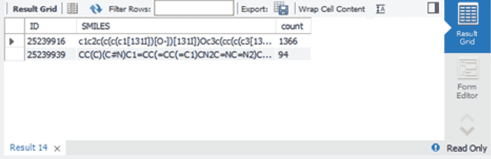

图 3.19 – MySQL Workbench GROUPBY 预览

现在我们已经探讨了如何分组我们的数据，接下来让我们学习如何对数据进行排序。

## 数据排序

在某些情况下，你的数据可能需要以某种方式排序，无论是升序还是降序。为此，你可以使用`ORDER BY`子句，其中排序列直接列出，后跟`ASC`表示升序或`DESC`表示降序。这在下面的代码片段中有说明：

```py
SELECT 
  ID,
     SMILES,
  toxic,
   ROUND(MolWt, 2) AS roundedMolWt
 from toxicity_db_tutorial.dataset_toxicity_sd
 ORDER BY roundedMolWt DESC
```

## 表的连接

经常在查询记录时，表已经被规范化，如前所述，以确保它们的数据以关系方式正确存储。通常情况下，你将需要合并或连接两个表，以便在开始任何类型的有意义`JOIN`子句之前准备你感兴趣的数据集。

将相同的`dataset_orderQuantities_sd.csv`数据集导入到同一个数据库中。回想一下，你可以在导入向导中指定相同的数据库名称，但不同的表名称。一旦加载，我们现在将有一个包含两个表的数据库：`dataset_toxicity_sd`和`dataset_orderQuantities_sd`。

如果我们对每个表运行`SELECT *`语句，我们会注意到这两个数据集唯一共有的列是`ID`列。这将成为连接两个数据集的 UID。然而，我们也注意到毒性数据集有`1461`行，而`orderQuantities`数据集有 728 行。这意味着一个数据集缺失了很多行。这就是不同类型的`JOIN`子句发挥作用的地方。

将两个数据集想象成需要用维恩图表示的圆圈，其中一个圆圈（*A*）包含 `1461` 行数据，另一个圆圈（*B*）包含 728 行数据。我们可以使用 `INNER JOIN` 函数将表连接起来，从而丢弃任何不匹配的行。注意，这在以下屏幕截图中被表示为两个圆圈的交集，即 *A  B*。或者，我们可以在数据上运行 `LEFT JOIN` 或 `RIGHT JOIN` 语句，忽略由 *A'  B* 或 *A  B'* 表示的其中一个数据集的不同内容。最后，我们可以使用 `OUTER JOIN` 语句将数据连接起来，无论缺失哪些行，这被称为并集，或 *A  B*：

]

图 3.20 – 四种主要连接方法的表示

当你开始探索数据集并连接表时，你会发现最常用的 `JOIN` 子句实际上是 `INNER JOIN` 语句，这正是我们特定应用所需要的。我们将按照以下结构构建语句：我们将选择感兴趣的列，指定源表，然后运行一个内部连接，将两个 `ID` 列匹配在一起。代码在以下代码片段中展示：

```py
SELECT
  dataset_toxicity_sd.id,
     dataset_toxicity_sd.SMILES,
     dataset_orderQuantities_sd.quantity_g
FROM
  toxicity_db_tutorial.dataset_toxicity_sd
INNER JOIN toxicity_db_tutorial.dataset_orderQuantities_sd
  ON dataset_toxicity_sd.id = dataset_orderQuantities_sd.id
```

通过这样，我们成功地管理了我们的第一个数据集（仅包含个别研究和开发分子及其相关属性）并将其与另一个表（包含这些分子的订购数量）连接起来，使我们能够确定我们目前库存中的物质。现在，如果我们需要找到具有特定 **亲脂性**（**logP**）的所有化合物，我们可以确定我们库存中有哪些以及它们的数量。

# 摘要

当涉及到查询关系数据库中的大量数据时，SQL 是一种强大的语言——这项技能将在所有技术领域以及大多数生物技术领域为你提供良好的服务。随着大多数公司开始扩大其数据库能力，你可能会遇到许多不同类型的数据库，尤其是关系数据库。

在理论方面，我们讨论了关系数据库的一些最重要的特征以及数据通常是如何进行规范化的。我们查看了一个患者数据的例子以及如何将表规范化以减少存储时的重复。我们还查看了一些市场上今天可用和广泛使用的开源和商业数据库。

当涉及到应用时，我们组装了一个健壮的 AWS RDS 数据库服务器并将其部署到云端。然后，我们将本地 MySQL 实例连接到该服务器，并使用 CSV 文件填充了一个新数据库。接着，我们回顾了目前在业界使用的最常见 SQL 语句和子句。我们探讨了选择、过滤、分组和排序数据的方法。然后，我们查看了一个将两个表连接起来的示例，并了解了我们可用的不同连接方法。

尽管这本书旨在向您介绍每位数据科学家都应该了解的一些最重要的核心概念，但在 SQL 中还有许多其他主题我们没有涉及。我敦促您查阅 MySQL 文档，以了解许多其他令人兴奋的语句，这些语句允许您以许多不同的形状和大小查询数据。SQL 总是专门用于检索和审查表格形式的数据，但永远不会是可视化数据的适当工具——这项任务最好留给 Python 及其众多的可视化库，这些内容将是下一章的重点。
