# 第四章：使用 Python 可视化数据

无论你从事哪个领域的工作，你选择的职业道路，或者你正在从事的具体项目，有效地向他人传达信息的能力始终是有用的。事实上，正好一百年前，在 1921 年，弗雷德里克·R·巴纳德首次说出了你可能无数次听过的短语：*一张图片胜过千言万语*。

近年来，在机器学习领域涌现出许多新技术，结构化、处理和分析的数据量呈指数增长。将原始数据转化为有意义的、易于传达的图表的能力是当今行业中最受欢迎的技能组合之一。大多数大型公司和企业的决策通常都是数据驱动的，而开始关于你关心的领域的对话的最佳方式是创建关于它的有意义的可视化。考虑以下内容：

+   人类大脑处理可视化比文本快 60,000 倍。

+   人类大脑处理的信息中，近 90%是通过视觉完成的。

+   可视化比即使是简单的文本更容易被阅读，概率高达 30 倍。

可视化并不总是关于推动对话或说服对立的一方同意某事——它们通常被用作调查和探索数据以揭示隐藏洞察力的手段。在几乎每一个机器学习项目中，你都将投入大量精力来探索数据，通过称为**探索性数据分析**（**EDA**）的过程来揭示其隐藏的**特征**。EDA 通常在任何类型的机器学习项目之前进行，以便更好地理解数据、其特征及其限制。以这种方式探索数据最好的方式是将其以视觉形式呈现，这样你可以揭示比单纯的数值更多的内容。

在接下来的章节中，我们将探讨一些有用的步骤，以开发针对特定数据集的稳健可视化。我们还将探索目前在**Python**社区中使用的最常见可视化库。最后，我们将探索几个数据集，并学习如何为它们开发一些最常见的可视化。

在本章中，我们将涵盖以下主要主题：

+   探索数据可视化的六个步骤

+   常用的可视化库

+   教程 - 在 Python 中可视化数据

# 技术要求

在本章中，我们将应用我们在*第二章*中展示的 Python 和`pip`安装程序的理解，即*介绍 Python 和命令行*。回想一下，安装库的过程是通过命令行完成的：

```py
$ pip install library-name
```

因此，现在我们已经准备好了，让我们开始吧！

# 探索数据可视化的六个步骤

当涉及到有效地传达数据中的关键趋势时，数据呈现的方式始终非常重要。在向观众展示任何类型的数据时，有两个主要考虑因素：首先，选择正确的数据段来支持论点；其次，选择最有效的可视化方式来支持论点。在制作新的可视化时，你可以遵循以下六个步骤来帮助你：

1.  **获取**: 从其来源处获取数据。

1.  **理解**: 了解数据并理解其类别和特征。

1.  `NaN`值和损坏的条目。

1.  **我的任务**: 识别模式或设计新的功能。

1.  **浓缩**: 隔离最有用的特征。

1.  **表示**: 为这些功能选择一个表示方式。

让我们详细看看每个步骤。

第一步是从其来源处获取你的数据。这个来源可能是一个简单的 CSV 文件，一个关系型数据库，甚至是一个**NoSQL**数据库。

第二步，理解数据的内容及其上下文非常重要。作为一名数据科学家，你的目标是站在利益相关者的角度，尽可能好地理解他们的数据。通常，与**主题专家**（SME）的简单交谈可以节省你数小时的时间，因为它会突出显示关于数据的你原本不知道的事实。

第三，**过滤**数据始终至关重要。大多数数据科学在现实世界中的应用很少涉及现成的数据集。通常，原始数据将是主要的数据来源，而数据科学家和开发人员需要确保任何缺失值和损坏的条目得到处理。数据科学家通常将这一步骤称为**预处理**，我们将在*第五章*中更详细地探讨，*理解机器学习*。

数据预处理完成后，我们的下一个目标是**挖掘**数据，试图识别模式或设计新的功能。在简单的数据集中，值通常可以快速可视化为增加或减少，使我们能够轻松理解趋势。在多维数据集中，这些趋势往往更难以发现。例如，时间序列图可能显示一个增加的趋势，然而，这个图的第一次导数可能会暴露与**季节性**相关的趋势。

一旦确定了感兴趣的趋势，代表该趋势的数据通常会被从其他数据中**隔离**出来。最后，使用与之相匹配的可视化来**表示**这个趋势。

重要的是要理解，这些步骤绝对不是硬性规定，而应该被视为有用的指南，以帮助您生成有效的可视化。并非每个可视化都需要每个步骤！实际上，某些可视化可能需要其他步骤，有时顺序可能不同。我们将在本章的“*教程 – 在 Python 中可视化数据*”部分中通过一系列步骤来生成一些可视化。当我们这样做的时候，尝试回忆这些步骤，看看您是否能识别出它们。

在我们开始生成一些有趣的视觉效果之前，让我们谈谈我们将需要的库。

# 常用可视化库

Python 中有无数的可视化库可用，每天都有新的库发布。可视化库可以分为两大类：**静态可视化**库和**交互式可视化**库。静态可视化是由绘制的值组成的图像，用户无法点击。另一方面，交互式可视化不仅仅是图像，而是可以点击、变形、移动和按特定方向缩放的表示。静态可视化通常用于电子邮件通信、印刷出版物或演示文稿，因为它们是你不希望他人更改的视觉内容。然而，交互式可视化通常用于仪表板和网站（如 **AWS** 或 **Heroku**），预期用户将与之交互并按允许的方式探索数据。

以下开源库目前在行业中非常受欢迎。每个库都有其自身的优缺点，具体细节如下表所示：

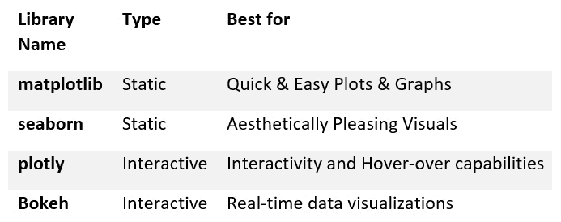

图 4.1 – Python 中最常见的可视化库列表

现在我们已经了解了可视化库，让我们继续下一节！

# 教程 – 在 Python 中可视化数据

在本教程的过程中，我们将从各种来源检索几个不同的数据集，并通过各种类型的可视化来探索它们。为了创建这些视觉效果，我们将结合使用一些开源可视化库来实现许多可视化步骤。让我们开始吧！

## 获取数据

回想一下，在 *第三章* “*SQL 和关系型数据库入门*”中，我们使用 AWS 创建并部署了一个数据库到云端，使我们能够使用 `sqlalchemy` 查询数据：

1.  让我们从上一章生成的 `endpoint`、`username` 和 `password` 值中直接查询该数据集。请将这些值作为 Python 中的变量列出：

    ```py
    ENDPOINT=" yourEndPointHere>"
    PORT="3306"
    USR="admin"
    DBNAME="toxicity_db_tutorial"
    PASSWORD = "<YourPasswordHere>"
    ```

1.  当变量被各自的参数填充后，我们现在可以使用 `sqlalchemy` 查询这些数据。由于我们对整个数据集感兴趣，我们可以简单地运行一个 `SELECT * FROM dataset_toxicity_sd` 命令：

    ```py
    from sqlalchemy import create_engine
    import pandas as pd
    db_connection_str =
    'mysql+pymysql://{USR}:{PASSWORD}@{ENDPOINT}:{PORT}/{DBNAME}'.format(USR=USR, PASSWORD=PASSWORD, ENDPOINT=ENDPOINT, PORT=PORT, DBNAME=DBNAME)
    db_connection = create_engine(db_connection_str)
    df = pd.read_sql('SELECT * FROM dataset_toxicity_sd',
    con=db_connection)
    ```

    或者，您也可以简单地使用 `read_csv()` 函数将相同的数据集作为 CSV 文件导入：

    ```py
    df = pd.read_csv("../../datasets/dataset_toxicity_sd.csv")
    ```

1.  我们可以使用 `head()` 函数快速查看数据集以了解其内容。回想一下，我们可以通过使用双中括号 (`[[ ]]`) 指定我们感兴趣的列名来选择性地减少列的数量：

    ```py
    df[["ID", "smiles", "toxic"]].head() 
    ```

    这给出了以下输出：

    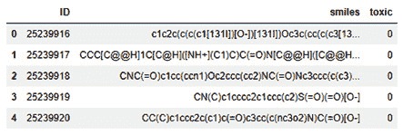

    图 4.2 – 来自毒性数据集选定列的 DataFrame 表示

    如果您还记得，这个数据集中有很多列，从一般数据如主键 (`ID`) 到结构 (`smiles`) 和毒性 (`toxic`)，应有尽有。此外，还有许多描述和表示数据集的特征，从总的极性表面积 (`TPSA`) 到亲脂性 (`LogP`)。 

1.  我们还可以通过使用 `pandas` 中的 `describe()` 函数来了解这个数据集背后的一些一般统计信息 – 例如，与每个列相关的最大值、最小值和平均值：

    ```py
    df[["toxic", "TPSA", "MolWt", "LogP"]].describe()
    ```

    这导致了以下表格：

    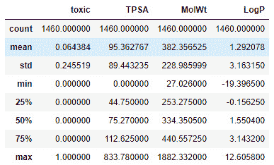

    图 4.3 – 来自毒性数据集选定列的一些一般统计信息

    立即，我们注意到 `FormalCharge` 和 `LogP` 具有负值。因此，这个现实世界的数据集非常多样且分布广泛。

1.  在我们进一步探索数据集之前，我们需要确保没有缺失值。为此，我们可以使用 `pandas` 库提供的 `isna()` 函数进行快速检查。我们可以将其与 `sum()` 函数链式使用，以获取每个列的缺失值总和：

    ```py
    df.isna().sum()
    ```

    结果如 *图 4.4* 所示：

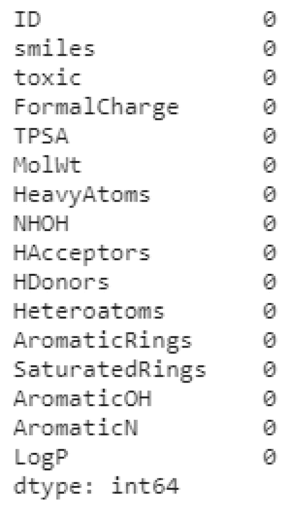

图 4.4 – DataFrame 中缺失值的列表

幸运的是，这个特定数据集中没有缺失值，因此我们可以自由地继续创建一些图表和视觉元素。

重要提示

`dropna()` 函数。另一个选项是使用 `fillna()` 或 `replace()` 函数将任何缺失值替换为常用值。最后，您还可以使用 `mean()` 函数将缺失值替换为所有其他值的平均值。您选择的方法将高度依赖于列的标识和含义。

## 使用条形图总结数据

**条形图**或**条形图**通常用于描述*分类数据*，其中条形的长度或高度与它们所代表的类别值成比例。条形图提供了对数据集中心趋势的视觉估计，估计的不确定性由误差线表示。

因此，让我们创建我们的第一个条形图。我们将使用`seaborn`库来完成这个特定的任务。有几种不同的方式来设置你的图表样式。在本教程的目的上，我们将使用`seaborn`的`darkgrid`样式。

让我们绘制`TPSA`特征相对于`FormalCharge`特征，以了解它们之间的关系：

```py
import pandas as pd
import seaborn as sns
plt.figure(figsize=(10,5))
sns.barplot(x="FormalCharge", y="TPSA", data=df);
```

我们最初的结果显示在*图 4.5*中：

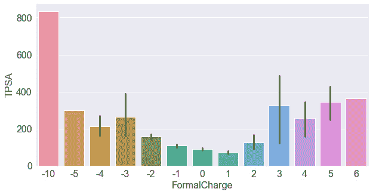

图 4.5 – TPSA 和 FormalCharge 特征的条形图

立即，我们可以看到两者之间有趣的关系，即在`TPSA`特征倾向于增加，当`FormalCharge`的绝对值远离零时。如果你正在跟随提供的`HDonors`而不是`TPSA`：

```py
sns.barplot(x="FormalCharge", y="HDonors", data=df)
```

我们可以在*图 4.6*中看到后续的输出：

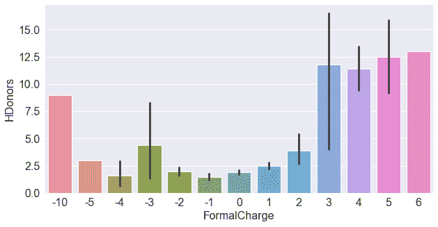

图 4.6 – HDonors 和 FormalCharge 特征的条形图

观察图表，我们并没有看到两个变量之间强烈的关联。最高和最低的正式电荷实际上显示了更高的氢供体。让我们将其与`HAcceptors`进行比较——在这个数据集中类似的一个特征。我们可以单独绘制这个特征，就像我们处理氢供体一样，或者我们可以将它们两个合并到一个图表中。我们可以通过*隔离*感兴趣的特征（你还记得这个步骤的名称吗？）然后*重塑*数据集。Python 中的 DataFrames 通常使用四个常见的函数进行**重塑**：


图 4.7 – 四个最常见的 DataFrame 重塑函数

每个函数都用于以特定方式重塑数据。`pivot()`函数通常用于重塑按其索引组织的 DataFrame。`stack()`函数通常与多索引 DataFrame 一起使用——这允许你*堆叠*你的数据，使表格变得*长而窄*而不是*宽而短*。`melt()`函数在意义上与`stack()`函数相似，因为它也*堆叠*你的数据，但它们之间的区别在于`stack()`会将压缩的列插入到内部索引中，而`melt()`将创建一个名为`Variable`的新列。最后，`unstack()`是`stack()`的简单相反，即数据从*长*转换为*宽*。

为了比较氢供体和受体，我们将使用`melt()`函数，你可以在*图 4.8*中看到它。请注意，在这个过程中创建了两个新列：`Variable`和`Value`：

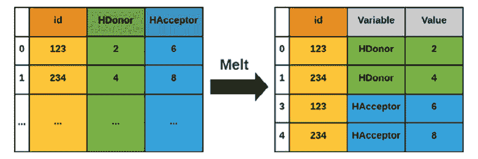

图 4.8 – melt()函数的图形表示

首先，我们创建一个名为`df_iso`的变量来表示独立的 DataFrame，然后我们使用`melt()`函数将其数据*熔化*并分配给一个新的变量`df_melt`。我们还可以打印数据的形状来证明如果列的长度正好*加倍*，则列*堆叠*是正确的。回想一下，你也可以使用`head()`函数来检查数据：

```py
df_iso = df[["FormalCharge", "HDonors", "HAcceptors"]]
print(df_iso.shape)
    (1460, 3)
df_melted = pd.melt(df_iso, id_vars=["FormalCharge"],
                    value_vars=["HDonors", "HAcceptors"])
print(df_melted.shape)
    (2920, 3)
```

最后，当数据正确排序后，我们可以继续绘制这些数据，指定 x 轴为`FormalCharge`，y 轴为`value`：

```py
sns.barplot(data=df_melted, x='FormalCharge', y='value', 
            hue='variable')
```

执行这一行代码后，我们将得到以下图形：

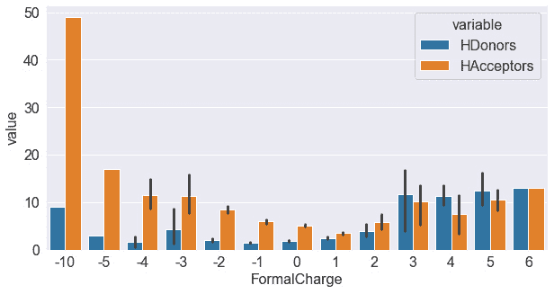

图 4.9 – 相对于 FormalCharge 的两个特征的条形图

当你开始探索`seaborn`库中的众多函数和类时，在编写代码时参考文档可以帮助你调试错误，并发现你可能不知道的新功能。你可以在[`seaborn.pydata.org/api.html`](https://seaborn.pydata.org/api.html)查看 Seaborn 文档。

## 处理分布和直方图

`40`：

```py
plt.figure(figsize=(10,5))
plt.title("Histogram of Molecular Weight (g/mol)", fontsize=20)
plt.xlabel("Molecular Weight (g/mol)", fontsize=15)
plt.ylabel("Frequency", fontsize=15)
df["MolWt"].hist(figsize=(10, 5), 
                          bins=40, 
                          xlabelsize=10, 
                          ylabelsize=10, 
                          color = "royalblue")
```

我们可以在*图 4.10*中看到此代码的输出：

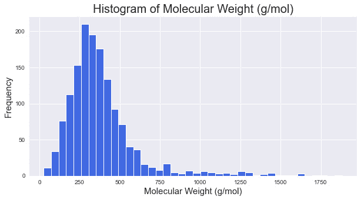

图 4.10 – 分子量直方图，分组大小为 40

当你探索 Python 中的更多可视化方法时，你会注意到大多数库都提供了一些已经开发并优化以执行特定任务的快速函数。我们可以对每个特征进行相同的数据重塑过程，并通过它们迭代来为每个特征绘制直方图，或者我们可以简单地使用`hist()`函数对它们进行集体处理：

```py
dftmp = df[["MolWt", "NHOH", "HAcceptors", "Heteroatoms", 
                     "LogP", "TPSA"]]
dftmp.hist(figsize=(30, 10), bins=40, xlabelsize=10,
                    ylabelsize=10, color = "royalblue")
```

后续输出可以在*图 4.11*中看到：

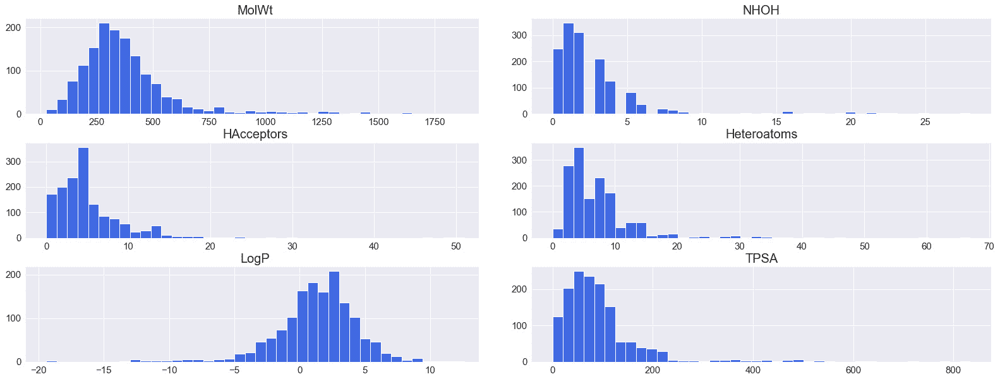

图 4.11 – 使用 hist()函数自动化的各种特征的系列直方图

直方图也可以叠加，以便在同一张图上展示两个特征。当这样做时，我们需要通过使用`alpha`参数给图表一定的透明度：

```py
dftmp = df[["MolWt","TPSA"]]
x1 = dftmp.MolWt.values
x2 = dftmp.TPSA.values
kwargs = dict(histtype='stepfilled', alpha=0.3, 
              density=True, bins=100, ec="k")
plt.figure(figsize=(10,5))
plt.title("Histogram of Molecular Weight (g/mol)", 
           fontsize=20)
plt.xlabel("Molecular Weight (g/mol)", fontsize=15)
plt.ylabel("Frequency", fontsize=15)
plt.xlim([-100, 1000])
plt.ylim([0, 0.01])
plt.hist(x1, **kwargs)
plt.hist(x2, **kwargs)
plt.legend(dftmp.columns)
plt.show()
```

我们可以在*图 4.12*中看到前一个命令的输出：

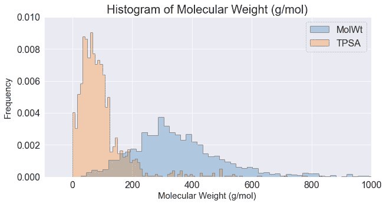

图 4.12 – 两个直方图的叠加，其透明度已降低

直方图是总结和可视化大量数据的绝佳方式，尤其是当使用 `hist()` 函数的功能如此简单时。你会发现大多数库，如 `pandas` 和 `numpy`，都有许多具有类似功能的功能。

## 使用散点图可视化特征

**散点图**是基于*笛卡尔坐标系*的表示，允许在二维和三维空间中创建可视化。散点图由 x 轴和 y 轴组成，通常还伴随着一个额外的特征，允许在数据内部进行分离。当与第三个特征结合使用时，散点图最为有效，该特征可以通过颜色或形状表示，具体取决于可用的数据类型。让我们来看一个简单的例子：

1.  我们将查看一个简单的散点图示例，展示 `TPSA` 相对于 `HeavyAtoms` 特征：

    ```py
    plt.figure(figsize=(10,5))
    plt.title("Scatterplot of Heavy Atoms and TPSA", fontsize=20)
    plt.ylabel("Heavy Atoms", fontsize=15)
    plt.xlabel("TPSA", fontsize=15)
    sns.scatterplot(x="TPSA", y="HeavyAtoms", data=df)
    ```

    前述代码的输出可以在*图 4.13*中看到：

    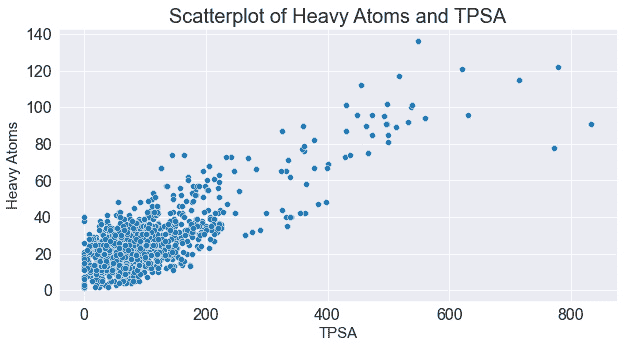

    图 4.13 – TPSA 和 HeavyAtoms 特征的散点图

    立即，我们注意到这两个特征之间存在一些依赖关系，如轻微的正相关性所示。

1.  我们可以通过使用 `hue` 和 `size` 参数分别改变颜色和大小来查看第三个特征，例如 `MolWt`。这使我们能够在同一张图上绘制三个或四个特征，从而对数据集进行出色的解释。我们可以看到 `TPSA` 相对于 `HeavyAtoms` 的一些趋势，以及 `MolWt` 的增加：

    ```py
    plt.figure(figsize=(10,5))
    plt.title("Scatterplot of Heavy Atoms and TPSA", fontsize=20)
    plt.ylabel("Heavy Atoms", fontsize=15)
    plt.xlabel("Molecular Weight (g/mol)", fontsize=15)
    sns.scatterplot(x="TPSA",y="HeavyAtoms", 
    size="MolWt", hue="MolWt", data=df)
    ```

    前述代码的输出可以在*图 4.14*中看到：

    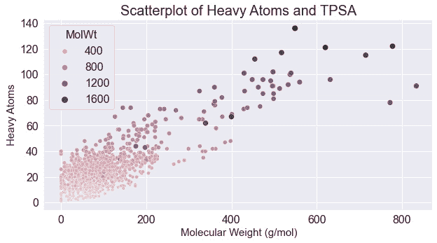

    图 4.14 – 两个特征的散点图，第三个特征通过大小和颜色表示

1.  作为二维散点图的替代，我们可以使用三维散点图来引入以新维度形式存在的另一个特征。我们可以利用 `Plotly` 库来实现一些三维功能。为此，我们可以使用 `scatter_3d` 函数定义一个 `fig` 对象，然后定义我们数据源和感兴趣的轴：

    ```py
    import plotly.express as px
    fig = px.scatter_3d(df, x='TPSA', y='LogP', z='HeavyAtoms',
                         color='toxic', opacity=0.7)
    fig.update_traces(marker=dict(size=4))
    fig.show()
    ```

    此代码的输出将生成*图 4.15*：

    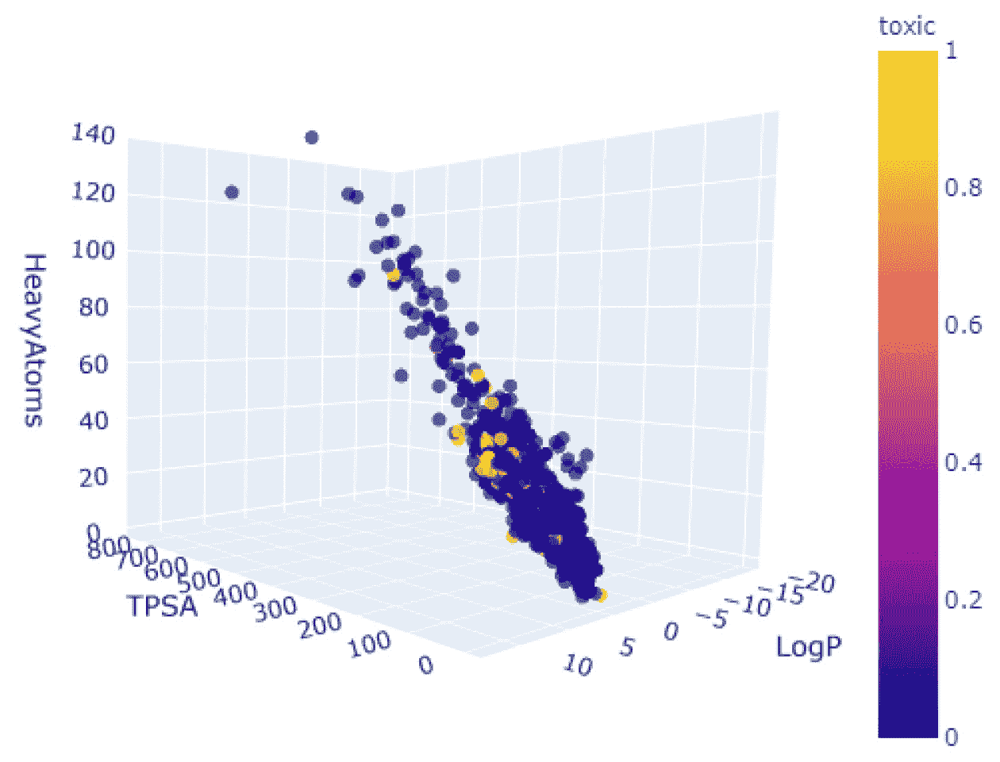

    图 4.15 – 以毒性着色的三个特征的 3D 散点图

1.  我们不是增加更多功能，而是可以向散点图添加一些更多元素来帮助解释 x 和 y 坐标上的两个特征。我们之前注意到数据集中存在轻微的相关性，这似乎非常适合探索。很有趣的是，看看这种相关性是否对有毒和非有毒化合物都成立。我们可以使用`lmplot()`函数来感知这种相关性，该函数允许我们在散点图中以*线性回归*的形式图形化地表示相关性：

    ```py
    sns.lmplot(x="HAcceptors", y="TPSA", hue="toxic", 
             data=df, markers=["o", "x"], height = 5, 
             aspect = 1.7, palette="muted");
    plt.xlim([0, 16])
    plt.ylim([0, 400])
    ```

    后续输出可以在*图 4.16*中看到：

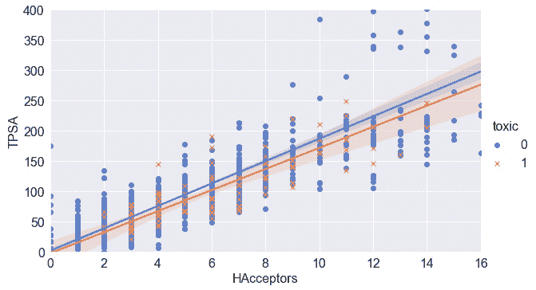

图 4.16 – 两个特征及其相关性的散点图

散点图是描绘数据关系和开始理解它们可能具有的任何依赖关系或相关性的绝佳方式。绘制回归或最佳拟合线可以让你对任何可能的关系有所了解。我们将在下一节中更详细地探讨这一点。

## 使用热图识别相关性

现在我们已经在我们数据集中的两个分子特征之间建立了相关性，让我们调查看看是否还有其他的相关性。我们可以轻松地遍历每一组特征，绘制它们，并查看它们各自的回归来确定是否存在相关性。在 Python 中，建议尽可能自动化，幸运的是，这项任务已经自动化了！所以，让我们来看看：

1.  使用`pairplot()`函数将接受你的数据集作为输入，并返回一个包含你数据集中所有特征的散点图的图形。为了将图形放入本页的范围内，只选择了最有趣的特征。然而，我挑战你运行提供的 Jupyter 笔记本中的代码，看看是否有其他有趣的趋势：

    ```py
    featOfInterest = ["TPSA", "MolWt", "HAcceptors",
           "HDonors", "toxic", "LogP"]
    sns.pairplot(df[featOfInterest], hue = "toxic", markers="o")
    ```

    结果以许多较小的图形的形式呈现，如*图 4.17*所示：

    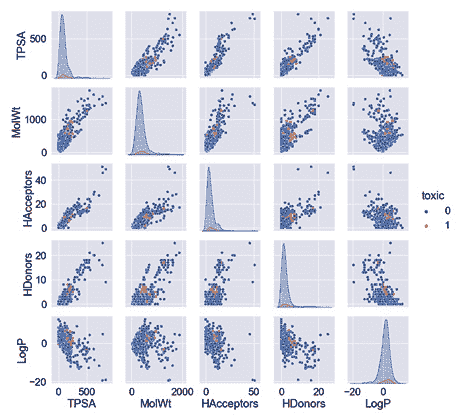

    图 4.17 – 显示所选特征的毒性数据集的 pairplot()图形

1.  或者，我们可以使用`corr()`函数与 DataFrame 本身结合来捕获每个特征对的*皮尔逊相关系数*：

    ```py
    df[["TPSA", "MolWt", "HeavyAtoms", "NHOH", "HAcceptors", 
              "HDonors", "AromaticRings", "LogP", "AromaticN"]].corr()
    ```

    我们可以在*图 4.18*中以 DataFrame 的形式回顾这些相关性：

    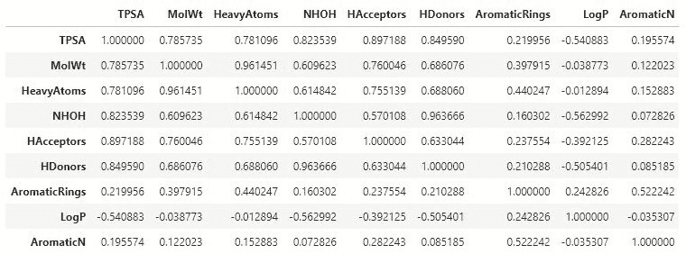

    图 4.18 – 显示所选特征之间相关性的 DataFrame

1.  为了得到更吸引人的结果，我们可以在`heatmap()`函数中包裹我们的数据，并应用颜色图来显示强相关性的深色和弱相关性的浅色：

    ```py
    sns.heatmap(df[["TPSA", "MolWt", "HeavyAtoms", "NHOH", 
                  "HAcceptors", "HDonors", "AromaticRings", 
                  "LogP", "AromaticN"]].corr(), 
                  annot = True,  cmap="YlGnBu")
    ```

    我们之前编写的一些代码随着我们开始将多个函数**串联**在一起而变得有些复杂。为了提供一些关于语法和结构的清晰度，让我们更仔细地看看以下函数。我们首先在`seaborn`库中调用主`heatmap`类（记住我们给它取了别名`sns`）。然后我们添加我们的数据集，包含感兴趣特征的切片集。然后我们应用相关函数以获取相应的相关性，并最终添加一些额外的参数来调整图表的样式和颜色：

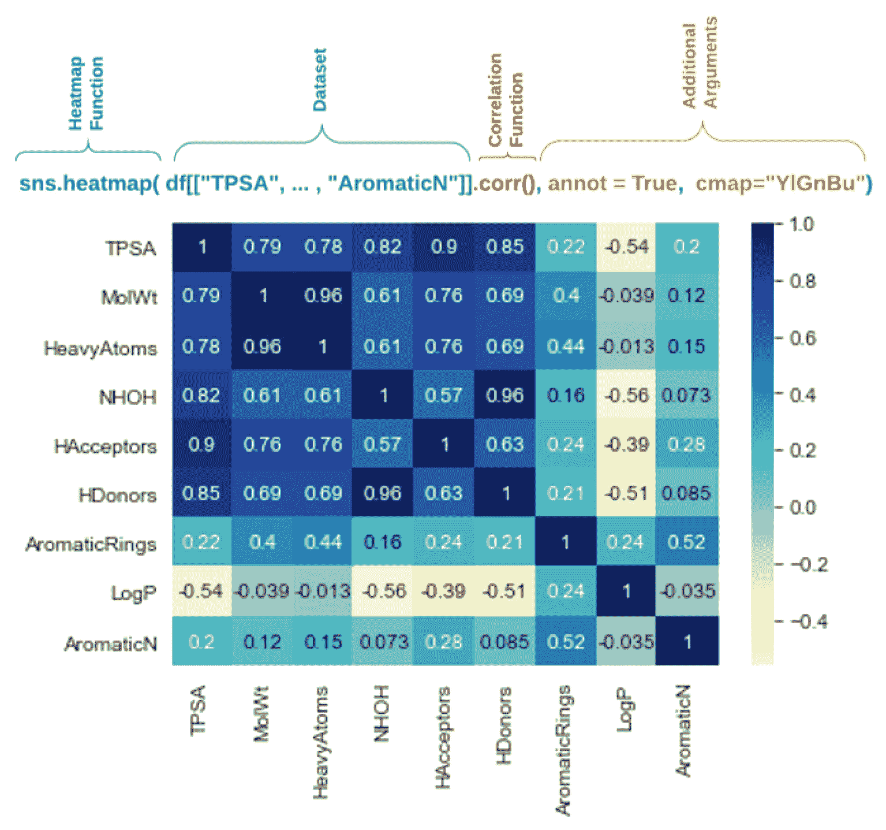

图 4.19 – 展示所选特征之间相关性的热图

无论您是在分析数据还是准备预测模型，识别数据集中的相关性总是有用的。您会发现`corr()`及其许多衍生函数在机器学习领域中被广泛使用。

## 显示序列和时间序列图

我们迄今为止探索的数据集和特征都是以**结构化**和**表格化**的形式提供的，存在于 DataFrame 的行和列中。这些行之间是完全独立的。并非所有数据集都是这种情况，**依赖性**（尤其是**基于时间的依赖性**）有时是我们需要考虑的因素。例如，考虑一个**Fast All**（**FASTA**）序列——即一种基于文本的格式，常用于生物信息学领域，通过字母代码表示核苷酸或氨基酸序列。在分子生物学和遗传学中，**鸟嘌呤-胞嘧啶**（**GC**）**含量**是一个用于确定 DNA 或 RNA 分子中氮碱基百分比的指标。让我们通过使用 COVID-19 数据的 FASTA 文件来探索绘制这种序列数据的图表：

1.  我们将开始使用`wget`库导入数据集的过程：

    ```py
    import wget
    url_covid = "https://ftp.expasy.org/databases/uniprot/pre_release/covid-19.fasta"
    filename = wget.download(url_covid, out="../../datasets")
    ```

1.  接下来，我们可以使用`Biopython`（也称为`Bio`）库来计算 GC 含量——这是计算分子生物学领域中最常用的 Python 库之一。`Biopython`库的文档和教程可以在[`biopython.org/DIST/docs/tutorial/Tutorial.html`](http://biopython.org/DIST/docs/tutorial/Tutorial.html)找到。

1.  我们将使用`SeqIO`和`GC`类解析文件，并将结果写入`gc_values_covid`变量：

    ```py
    from Bio import SeqIO
    from Bio.SeqUtils import GC
    gc_values_covid = sorted(GC(rec.seq) for rec in 
        SeqIO.parse("../../datasets/covid-19.fasta", "fasta"))
    ```

    请注意，前述代码中文件的路径可能会根据文件保存的目录而改变。

1.  最后，我们可以使用`pylab`或`matplotlib`来绘制结果：

    ```py
    import pylab
    plt.figure(figsize=(10,5))
    plt.title("COVID-19 FASTA Sequence GC%", fontsize=20)
    plt.ylabel("GC Content %", fontsize=15)
    plt.xlabel("Genes", fontsize=15)
    pylab.plot(gc_values_covid)
    pylab.show()
    ```

    后续输出可以在*图 4.20*中看到：

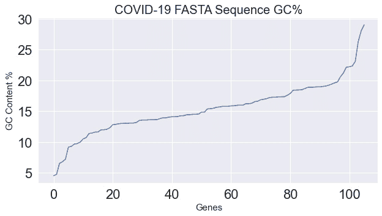

图 4.20 – 展示 COVID-19 序列 GC 含量的图表

虽然有许多非基于时间的顺序数据集，如 `text`、`images` 和 `audio`，但也有基于时间的数据集，如 `stock prices` 和 `manufacturing processes`。在实验室空间中，也有许多设备也利用基于时间序列的方法，例如与色谱相关的方法。例如，考虑 `time-series` 数据集，并在时间上叠加 `Temperature` 和 `Pressure`：

```py
dfts = pd.read_csv("../../datasets/dataset_pressure_ts.csv")
plt.title("Timeseries of an LCMS Chromatogram (Pressure & 
     Temperature)", fontsize=20)
plt.ylabel("Pressure (Bar)", fontsize=15)
plt.xlabel("Run Time (min)", fontsize=15)
ax1 = sns.lineplot(x="Run Time", y="Pressure",
                      data=dfts, color = "royalblue", 
                      label = "Pressure (Bar)");
ax2 = sns.lineplot(x="Run Time", y="Temperature",
                      data=dfts, color = "orange", 
                      label = "Pressure (Bar)");
```

此代码的输出可以在 *图 4.21* 中看到：

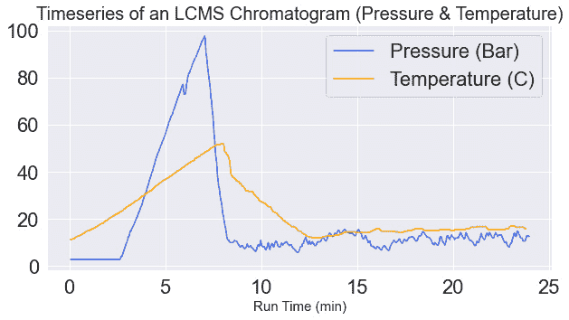

图 4.21 – 显示失败 LCMS 运行的温度和压力的时间序列图

我们注意到，在这张图的最初 5 分钟内，温度和压力参数增加得相当快。在 6.5 分钟范围内出现某种下降，系统保持了一段时间的增加，然后两个参数开始急剧下降并稳定在其各自的范围内。这是一个仪器故障的例子，而且这是一个一个精细调校的机器学习模型能够相对于其成功的对应物检测到的情形。我们将在*第七章* *监督机器学习*中更详细地探讨这个异常检测模型的发展。

## 使用桑基图强调流程

数据科学中的一种流行可视化形式是 **桑基图** – 由米纳德对拿破仑入侵俄罗斯的军队的经典描绘而闻名。桑基图的主要目的是在流程图上以比例宽度来可视化一个量的大小：

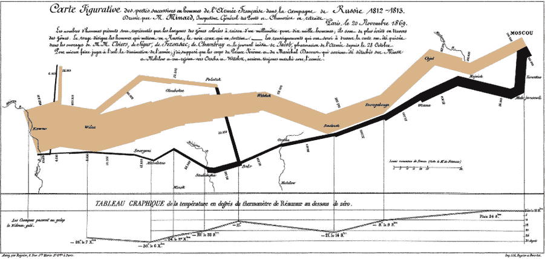

图 4.22 – 查尔斯·约瑟夫·米纳德绘制的桑基图，描绘了拿破仑的俄国远征

桑基图常用于描绘各个领域的许多应用。桑基图在生物技术和健康领域的应用包括以下内容：

+   临床试验期间的药物候选描述

+   合成分子的工艺流程图

+   微生物发酵的工艺流程图

+   项目流程图和成功率

+   描述组织内部成本的财务图

让我们可视化一个公司药物候选管道的简单示例。我们将考虑候选人的总数，按阶段进行分类，最后按小分子或大分子进行指定。我们可以利用 `Plotly` 库来帮助我们完成这项工作：

```py
import plotly.graph_objects as go
fig = go.Figure(data=[go.Sankey(node = dict(pad = 50, 
      thickness = 10,
                 line = dict(color = "black", width = 0.5),
                 label = ["Drug Candidates", "Phase 1", "Phase 2",
                 "Phase 3", "Small Molecules", "Large Molecules"],
                 color = "blue"),
                 link = dict(
                 source = [0,  0, 0, 1,  2, 3, 1, 2, 3],
                 target = [1,  2, 3, 4,  4, 4, 5, 5, 5],
                 value = [15, 4, 2, 13, 3, 1, 2, 1, 1]
  ))]) 
```

这段代码相当长且复杂，让我们尝试将其分解。`figure`对象包含我们需要考虑的几个参数。第一个是`pad`，它描述了可视化中`*节点*`之间的间距。第二个描述了节点的`thickness`值。第三个设置了线的`color`和`width`值。第四个包含节点的`label`名称。最后，我们到达了数据，其结构与我们习惯的方式略有不同。在这种情况下，数据集被分为一个`source`数组（或起源），一个`target`数组，以及与之相关的`value`数组。从左侧开始，我们看到`source`的第一个值是节点`0`，它流向节点`1`的`target`，`value`为`15`。以这种方式阅读过程使数据流对用户或开发者更清晰。最后，我们可以使用`show()`继续绘制图像：

```py
fig.update_layout(title_text="Drug Candidates within a Company Pipeline", font_size=10)
fig.show()
```

下图显示了前面代码的输出：

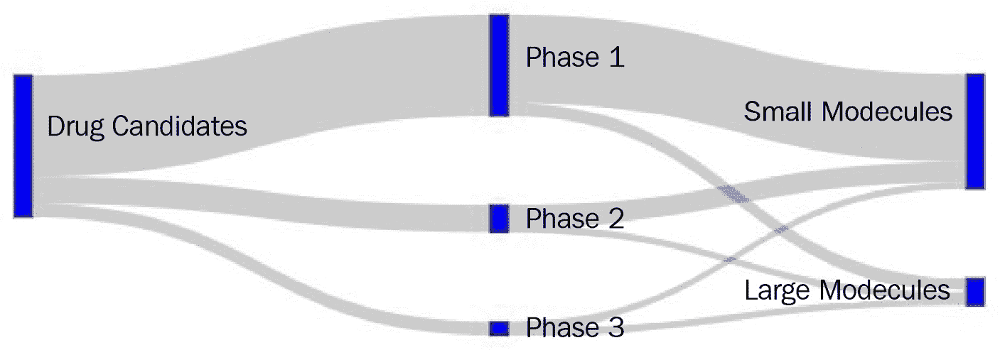

图 4.23 – 表示公司流程的桑基图

桑基图是展示随时间或按类别信息流动或转移的绝佳方式。在上一个例子中，我们探讨了其在管道中小分子和大分子中的应用。现在让我们看看我们如何可视化这些分子。

## 可视化小分子

当涉及到小分子时，我们可以使用各种软件平台和在线服务以多种方式可视化它们。幸运的是，存在一个优秀的库，通常用于`rdkit`库，可以使用`pip`安装：

```py
import pandas as pd
import rdkit
from rdkit import Chem
```

我们可以解析在本教程中较早导入的 DataFrame，并通过索引提取一个示例`smiles`字符串。然后，我们可以使用`rdkit`库中的`Chem`类的`MolFromSmiles()`函数，以`smiles`字符串作为单一参数来创建分子对象：

```py
df = pd.read_csv("../../datasets/dataset_toxicity_sd.csv")
m = Chem.MolFromSmiles(df["smiles"][5])
m
```

这个变量的输出可以在*图 4.24*中看到：

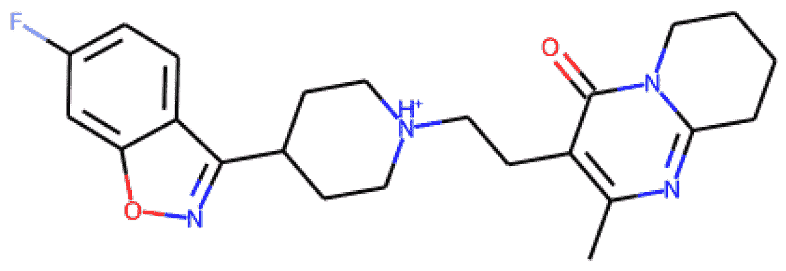

图 4.24 – 小分子的表示

我们可以通过查看不同的索引值来检查另一个分子的结构：

```py
m = Chem.MolFromSmiles(df["smiles"][20])
m
```

这次，我们的输出如下：

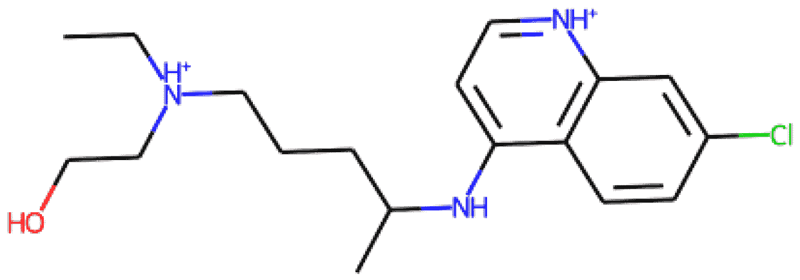

图 4.25 – 小分子的表示

除了渲染小分子的打印版描述外，`rdkit`库还支持与小型分子分析、预测和计算相关的广泛功能。此外，该库还支持使用电荷计算以及相似性图：

```py
from rdkit.Chem import AllChem
from rdkit.Chem.Draw import SimilarityMaps
AllChem.ComputeGasteigerCharges(m)
contribs = [m.GetAtomWithIdx(i).GetDoubleProp('_GasteigerCharge') for i in range(m.GetNumAtoms())]
fig = SimilarityMaps.GetSimilarityMapFromWeights(m, 
             contribs, contourLines=10, )
```

前面代码的输出可以在*图 4.26*中看到：

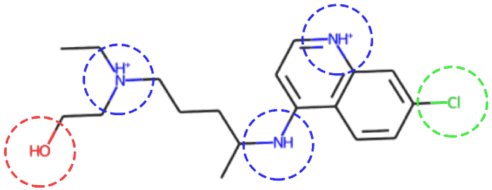

图 4.26 – 小分子电荷的表示

现在我们已经了解了如何使用 RDKit 来表示小分子，那么让我们来看看这个工具在处理大分子时的应用。

## 可视化大分子

有许多专为研究和发展目的设计用于可视化、模拟和分析大分子的 Python 库。目前，最常用的库之一是`py3Dmol`。该库专门用于在 Jupyter Notebook 环境中进行 3D 可视化，允许创建可用于发表的 3D 蛋白质可视化图像。该库可以通过`pip`框架轻松下载。

1.  我们可以使用`py3dmol`库，并在以下函数中直接查询蛋白质结构来开始这个视觉化的开发：

    ```py
    import py3Dmol
    largeMol = py3Dmol.view(query='pdb:6xmk', 
                               width=600,
                               height=600)
    ```

1.  导入库后，可以使用`py3Dmol`中的`view`类指定一个名为`lm`的新变量对象。此函数有三个主要参数。第一个是感兴趣蛋白的标识，即`6xmk`。第二个和第三个参数分别是显示窗口的宽度和高度。有关 PDB 文件更多信息，请访问`stick`参数：

    ```py
     largeMol.setStyle({'stick':{'color':'spectrum'}})
     largeMol
    ```

    执行此行代码后，我们得到该分子的以下图像：

    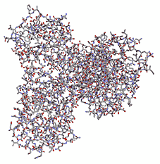

    图 4.27 – 以球棍模型表示的大分子或蛋白质

1.  注意到我们添加了一个`stick`参数来显示最后一个结构。我们可以将此参数更改为`cartoon`来查看基于其*二级结构*的蛋白质的卡通表示：

    ```py
    largeMol.setStyle({'cartoon':{'color':'spectrum'}})
    largeMol
    ```

    当执行这一行代码时，我们得到以下分子的图像：

    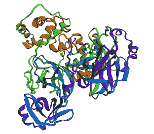

    图 4.28 – 大分子或蛋白质的二级结构表示

1.  可以添加许多其他更改和论点来定制此可视化，以适应用户的特定目标。其中之一是添加一个**范德华表面**，这允许展示分子相互作用可能发生的区域。我们将只将此表面添加到这个蛋白质的两个链中的**一个**：

    ```py
    lm = py3Dmol.view(query='pdb:6xmk')
    chA = {'chain':'A'}
    chB = {'chain':'B'}
    lm.setStyle(chA,{'cartoon': {'color':'spectrum'}}) 
    lm.addSurface(py3Dmol.VDW, {'opacity':0.7, 'color':'white'}, chA)
    lm.setStyle(chB,{'cartoon': {'color':'spectrum'}})
    lm.show()
    ```

    我们可以在*图 4.29*中看到此代码的输出：

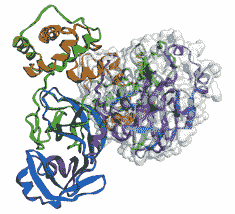

图 4.29 – 一种表示大分子或蛋白质二级结构的方法，其中一个链上带有范德华表面

近年来，对大分子，或称**生物制品**的研究，在生物技术领域显示出巨大的增长。在本章中，我们简要介绍了用于可视化这些复杂分子的许多方法之一——这是任何生物信息学项目的重要第一步。

# 摘要

可视化可以是有用的、强大的、令人信服的工具，有助于说明观点并引导特定方向的对话。为了创建适当的可视化，需要采取某些步骤和技术，以确保您的图表正确且有效。

在本章中，我们探讨了创建适当可视化时需要遵循的六个主要步骤。我们还探讨了在 Python 范围内许多不同的方法和库，以帮助您为特定的目标创建和设计可视化。我们探讨了某些基本可视化，如条形图、直方图和散点图，以一次分析几个特征。我们还探讨了更复杂可视化，如配对图、热图、桑基图和分子表示，通过这些我们可以探索更多特征。

我们还提到了**相关性**的概念以及某些特征如何与其他特征建立关系——这是一个我们将在下一章关注**机器学习**时更详细探讨的概念。
