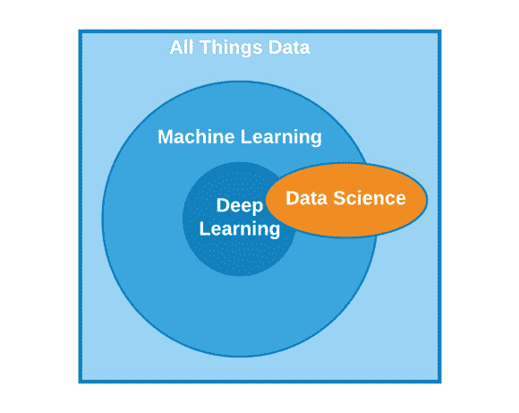
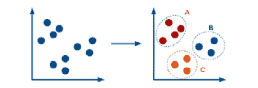
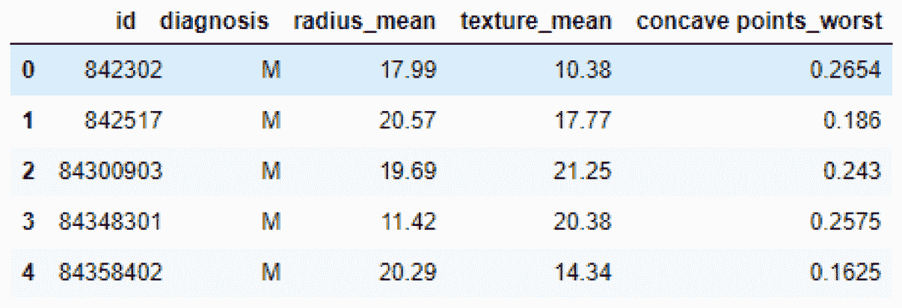
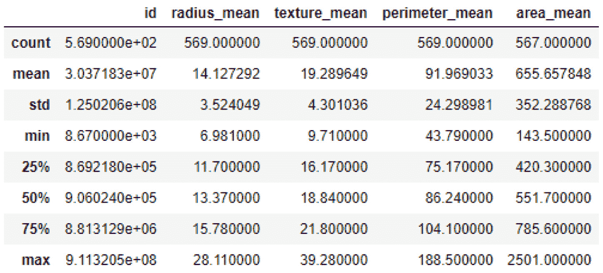
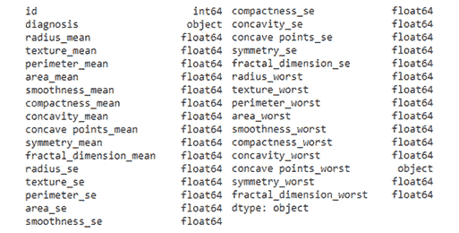
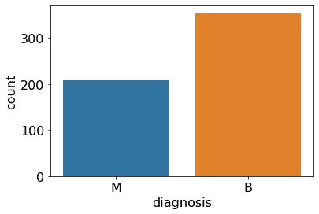
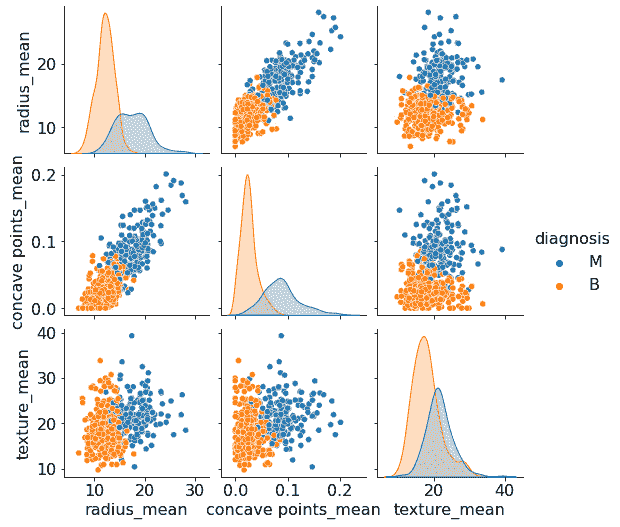
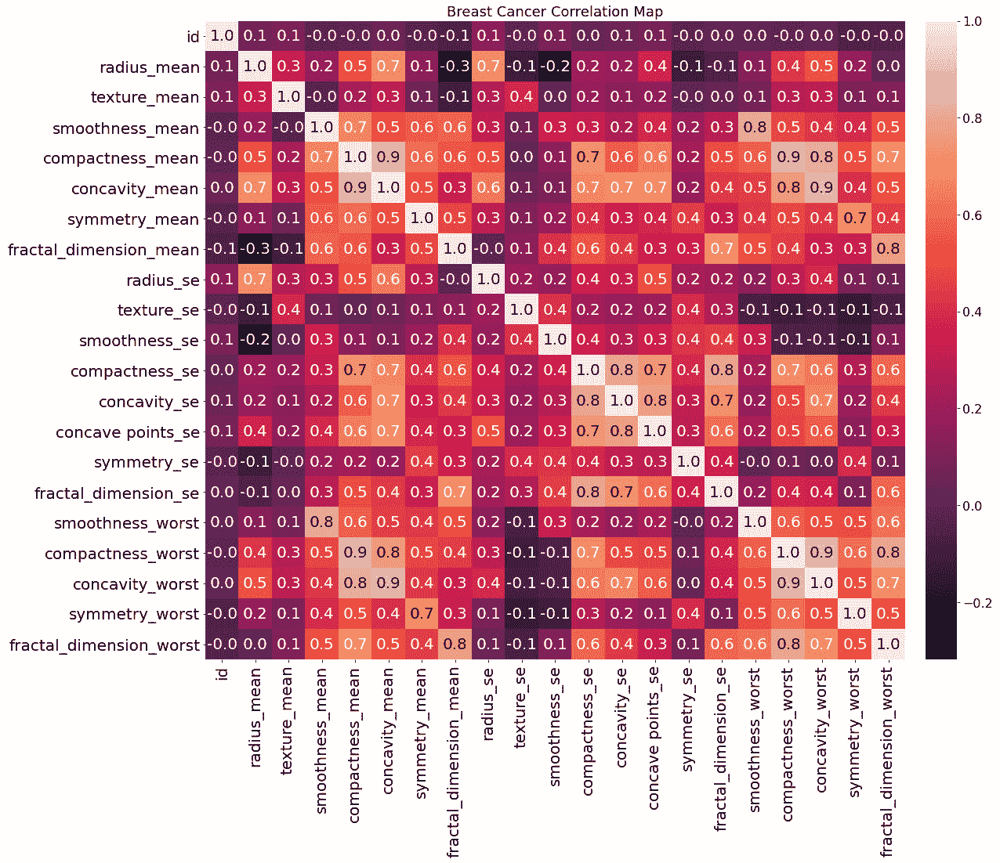

# 第五章：理解机器学习

在过去的几年里，你很可能已经听到了许多流行词汇，如**人工智能**（**AI**）、**机器学习**（**ML**）和**深度学习**（**DL**），这些词汇在大多数主要行业中引起了波澜。尽管这些短语在公司全体员工和领导层的会议中往往被互换使用，但每个短语实际上都指代一个独特概念。因此，让我们更仔细地看看这些短语实际上指的是什么。

人工智能通常指的是由软件和机器展现出的类似人类智能的总体领域。我们可以将人工智能视为一个空间，它包含了本书范围内我们将讨论的许多主题。

在人工智能领域，存在一个我们称之为**机器学习**的子领域。机器学习可以被定义为*研究算法与数据相结合以开发预测模型*。

在机器学习领域，还存在另一个我们称之为**深度学习**的子领域。我们将**DL**定义为*通过使用人工神经网络特别应用机器学习*。

既然我们已经更好地理解了这些术语之间的差异，让我们更详细地定义机器学习的概念。根据你询问的人不同，你将遇到几种不同的机器学习定义。物理学家倾向于将定义与*性能优化*的应用联系起来，而数学家倾向于将定义与*统计概率*联系起来，最后，计算机科学家倾向于将定义与*算法*和*代码*联系起来。在某种程度上，三者都是技术正确的。为了本书的目的，我们将机器学习定义为研究使用计算机代码开发数学优化模型，该模型能够从历史数据中*学习*或*泛化*，以解锁有用的见解并做出预测。

尽管这个定义可能看起来很简单，但大多数有经验的面试候选人仍然倾向于在定义这个概念时感到困难。请注意我们在这里使用的确切措辞，因为它可能在未来的某个场合证明是有用的。

在本章的进程中，我们将探讨机器学习的各个方面，并回顾开发**预测模型**时开发者必须采取的一些最常见步骤。

在本章中，我们将回顾以下主要主题：

+   理解机器学习

+   过拟合与欠拟合

+   开发机器学习模型

考虑到所有这些，让我们开始吧！

# 技术要求

在本章中，我们将应用我们对`pandas`和`numpy`的理解。此外，我们还将使用一些机器学习库，如`sklearn`和`tensorflow`。回想一下，安装新库的过程可以通过命令行完成：

```py
$ pip install library-name
```

让我们开始！

# 理解机器学习

在介绍中，我们广泛地定义了与本书相关的机器学习的概念。有了这个定义，现在让我们看看一些例子来阐述我们的定义。在最广泛的意义上，机器学习可以分为四个领域：**分类**、**回归**、**聚类**和**降维**。这四个类别通常被称为**数据科学**领域。数据科学是一个非常广泛的概念，用于指代与数据相关的各种应用，以及人工智能及其子集。我们可以在*图 5.1*中可视化这些领域之间的关系：



图 5.1 – 人工智能与其他领域相关的领域

在心中牢记这些概念，让我们更详细地讨论这四种机器学习方法。

`X`)及其后续的输出值（通常称为`ŷ`）用于训练一个*分类器*。这个分类器然后可以用于对新数据和未见数据做出预测。我们可以在*图 5.2*中直观地表示这一点：


图 5.2 – 分类模型的示例

**聚类**在模型结果为标签（或类别）的意义上与分类相似，但这里的区别在于聚类模型不是基于预定义的类别列表进行训练，而是基于对象之间的相似性。聚类模型然后将数据点分组到*簇*中。形成的簇的总数不一定事先就知道，这很大程度上取决于模型训练的参数。在以下示例中，使用原始数据集形成了三个簇：



图 5.3 – 聚类模型的示例

另一方面，当涉及到`X`)及其后续的输出值（通常称为`ŷ`）用于训练一个*回归器*时。这个回归器然后可以用于对新数据和未见数据做出预测：


图 5.4 – 回归模型的示例

最后，当涉及到**降维**时，机器学习不仅可以用于预测值的目的，而且在将数据从*高维*表示转换为*低维*表示的意义上得到应用。以我们在前几章中使用的庞大的毒性数据集为例。我们可以应用如**主成分分析**（PCA）这样的方法，通过*结合这些特征的重要性*，将 10 多个特征列减少到只有两到三列。我们将在*第七章*“理解监督机器学习”中更详细地探讨这一点。我们可以在*图 5.5*中看到这一过程的视觉表示：


图 5.5 – 降维模型的一个示例

机器学习领域非常广泛、复杂，远远超出了我们刚才提到的四个基本示例。然而，ML 模型的最常见应用往往集中在 *预测一个类别*、*预测一个值* 或 *在数据中揭示隐藏的见解* 上。

作为科学家，我们总是希望尽可能好地组织我们的思想，而且正如所发生的那样，我们刚才讨论的概念可以分为两大类：`X`) 和输出 (`ŷ`)。我们称这种方法为 *监督* 方法，因为模型是经过（监督）训练的，其输出标签对应于哪个输入值。另一方面，UML 包括仅知道输入 (`X`) 的 ML 模型。回顾我们刚才讨论的四种方法，我们可以根据这两种学习方法来划分它们，即 **分类** 和 **回归** 属于 SML，而 **聚类** 和 **降维** 属于 UML：


图 5.6 – 监督学习和无监督学习的表示

在接下来的章节中，我们将探讨许多属于这四个一般类别的流行 ML 模型和算法。随着你的学习，我鼓励你开发自己的思维导图，并将每个四个类别进一步分支到你将要学习的所有不同模型中。例如，我们将在本章的 *保存模型以部署* 部分探讨一个 *朴素贝叶斯* 模型，这可以添加到 *图 5.6* 的 **分类** 分支中。也许你可以为每个模型添加一些关于模型本身的注释。在准备技术面试时，地图或视觉辅助工具可能很有用。

在我们开发的每个模型中，我们将遵循一系列特定的步骤来获取我们的数据，对其进行预处理，构建模型，评估其性能，最后，如果模型足够好，将其部署给我们的最终用户或数据工程师。在我们开始开发模型之前，让我们讨论一下被称为 *过拟合* 和 *欠拟合* 的常见危险。

# 过拟合和欠拟合

在 SML 的背景下，我们将通过用历史数据**拟合**我们的模型来准备我们的模型。拟合模型的过程通常输出一个度量，表示模型在多大程度上能够泛化到与训练模型的数据相似的数据。使用这个输出，通常以**精确度**、**准确度**和**召回率**的形式，我们可以确定我们实施的方法或更改的参数是否对我们的模型产生了积极的影响。如果我们回顾本章前面关于 ML 模型的定义，我们特别将它们称为从历史数据中**学习**或**泛化**的模型。能够从历史数据中学习的模型被称为**拟合良好**的模型，从某种意义上说，它们能够在新的、未见过的数据上准确执行。

也有一些情况是模型欠拟合。**欠拟合**的模型在数据集上通常表现不佳，这意味着它们没有学会很好地泛化。这些情况通常是由于为给定的数据集选择了不适当的模型，或者对该模型的参数/超参数设置不足。

重要提示

**参数和超参数**：请注意，虽然参数和超参数是经常可以互换使用的术语，但两者之间是有区别的。**超参数**是模型估计器没有学习到的参数，必须手动调整。

也有一些情况是模型过拟合。**过拟合**的模型是那些对数据集**了解**得有点太多的模型，这意味着它们不再是**学习**而是在**记忆**。过拟合通常发生在模型开始从数据集中的噪声中学习，并且不再能够很好地泛化到新数据时。拟合良好、过拟合和欠拟合模型之间的区别可以在**图 5.7**中看到：


图 5.7 – 过拟合和欠拟合数据的表示

每个数据科学家的目标都是开发一个在您感兴趣的指标上具有最佳性能的平衡模型。确保您正在开发一个既不过度拟合也不会欠拟合的平衡模型的最佳方法之一是在事先分割您的数据集，并确保模型只训练在数据的一个子集上。我们可以将数据集分为两类：*训练数据*和*测试数据*（也常被称为*验证数据*）。我们可以使用训练数据集来训练模型，并使用测试数据集来测试（或验证）模型。用于此目的的最常见的类是来自`sklearn`的`train_test_split()`类。如果您将数据集视为`X`是您的输入变量，`ŷ`是您的输出，您可以使用以下代码片段来分割数据集。首先，我们导入数据。然后，我们隔离我们感兴趣的特性并输出它们各自的变量。然后，我们实现`train_test_split()`函数来相应地分割数据：

```py
import pandas as pd
from sklearn.model_selection import train_test_split
df = pd.read_csv("../../datasets/dataset_wisc_sd.csv")
X = df.drop(columns = ["id", "diagnosis"])
y = df.diagnosis.values
X_train, X_test, y_train, y_test = train_test_split(X, y)
```

我们可以在*图 5.8*中可视化分割后的数据集：


图 5.8 – 用于训练和测试的数据的视觉表示

以这种方式分割数据后，我们现在可以使用`X_train`和`y_train`来训练我们的模型，以及使用`X_test`和`y_test`来测试（或验证）我们的模型。默认分割比例是 75%训练数据到 25%测试数据；然而，我们可以传递`test_size`参数来改变这个比例。我们通常希望尽可能多地训练数据，但仍然保留有意义的未见过数据量，因此*75/25*在行业中是一个普遍接受的比率。有了这个概念，让我们继续开发一个完整的机器学习模型。

# 开发机器学习模型

作为终端用户，我们每天都会与许多机器学习模型进行交互，而我们可能甚至没有意识到这一点。回想一下你今天所做的一切活动：浏览社交媒体、查看电子邮件，或者你可能访问了一家商店或超市。在这些环境中，你很可能已经与一个已经部署的机器学习模型进行了交互。在社交媒体上，你信息流中显示的帖子很可能是监督**推荐**模型的输出。你打开的电子邮件很可能是使用**分类**模型过滤掉的垃圾邮件。最后，杂货店中商品的种类数量很可能是**回归**模型的输出，允许它们预测今天的需求。在这些模型中，大量的时间和精力都投入到了确保它们能够正确运行。在这些情况下，虽然模型的开发很重要，但最重要的是如何提前准备数据。作为科学家，我们总是倾向于尽可能好地组织我们的思想和过程，因此让我们为开发机器学习模型的过程组织一个工作流程：

1.  **数据获取**：通过 SQL 查询、本地导入或 API 请求收集数据

1.  **EDA 和预处理**：理解和清理数据集

1.  **模型开发和验证**：训练模型并验证结果

1.  **部署**：使你的模型可供最终用户使用

考虑到这些步骤，让我们继续开发我们的第一个模型。

我们首先导入我们的数据。我们将使用一个我们尚未使用过的新数据集，称为“威斯康星乳腺癌”数据集。这是一个*多元*数据集，于 1995 年发布，包含数百个乳腺癌肿瘤的实例。这些肿瘤以测量值的形式描述，我们将将其用作*特征*（`X`）。数据集还包括有关每个实例的恶性信息，我们将使用它作为我们的输出*标签*（`ŷ`）。鉴于我们既有输入数据又有输出数据，这就需要使用一个*分类*模型。

## 数据获取

让我们导入我们的数据并检查其整体形状：

```py
import pandas as pd
import numpy as np
df = pd.read_csv("../../datasets/dataset_wisc_sd.csv")
df.shape
```

我们注意到有 569 行数据（我们通常称之为*观测值*）和 32 列数据（我们通常称之为*特征*）。我们通常希望我们的数据集拥有比特征多得多的*观测值*。关于两者之间理想比例并没有金科玉律，但通常你希望观测值至少比特征多 10 倍。所以，对于 32 列，你希望至少有 320 个观测值——在这个案例中我们确实做到了！

## 探索性数据分析与预处理：

**探索性数据分析**（**EDA**）可以说是任何机器学习项目中最重要的且耗时最长的步骤之一。这一步骤通常包括许多更小的步骤，其目标如下：

+   理解数据和其特征。

+   解决任何不一致或缺失值。

+   检查特征之间的任何相关性。

请注意，我们执行这些步骤的顺序可能因数据集而异。考虑到所有这些，让我们开始吧！

### 检查数据集

在导入数据集后的第一步之一是快速检查数据的质量。回想一下，我们可以使用方括号（`[]`）来指定感兴趣的列，并且我们可以使用`head()`或`tail()`函数来查看数据的前五行或后五行：

```py
df[["id", "diagnosis", "radius_mean", "texture_mean", "concave points_worst"]].head()
```

我们可以在*图 5.9*中看到此代码的结果：



图 5.9 – 威斯康星乳腺癌数据集的样本

我们可以快速了解数据组织得非常好，并且从第一眼看上去，似乎没有任何问题值，例如不寻常的字符或缺失值。查看这些选择的列，我们注意到在开头有一个唯一的标识符，由*整数*组成，后面跟着诊断（**M** = **malignant** 和 **B** = **benign**）由*字符串*组成。其余的列都是特征，它们看起来都是*浮点数*（小数）数据类型。我鼓励你扩展前面表格的范围，并探索这个数据集中所有的其他特征。

除了探索值之外，我们还可以探索`pandas`库中`describe()`函数提供的某些汇总统计。使用此函数，我们可以了解总数，以及一些描述性统计，如平均值、最大值和最小值：

```py
df[["id", "diagnosis", "radius_mean", "texture_mean", "perimeter_mean", "area_mean", "concave points_worst"]].describe()
```

此函数的输出可以在以下屏幕截图中看到：



图 5.10 – DataFrame 的某些汇总统计表

检查代码，我们注意到我们请求了七个列的统计信息，然而，表中只出现了五个。我们可以看到`id`值（它们是*主键*或*唯一标识符*）在这里进行了汇总。这些值没有意义，因为一组主键的平均值、最大值和最小值告诉我们什么都没有。我们可以暂时忽略这个列。我们还请求了`diagnosis`列；然而，`diagnosis`列不使用数值。相反，它包含*字符串*。最后，我们看到`concave points_worst`特征也没有包含在这个表中，这表明数据类型由于某种原因不是数值。我们将在下一节清理数据时更仔细地查看这一点。

### 清理值

在处理机器学习项目时，清理数据集中的值是其中最重要的步骤之一。数据科学家在描述模型时经常说“垃圾输入，垃圾输出”。如果你想拥有一个强大的预测模型，那么确保支持它的数据质量良好是一个重要的第一步。

首先，让我们更仔细地查看数据类型，因为这里可能存在一些不一致性。我们可以使用以下代码来获取每个 32 个列的数据类型感：

```py
df.dtypes
```

我们可以在*图 5.11*中看到这段代码的输出，其中列出了列名及其相应的数据类型：



图 5.11 – 一个数据集中所有列及其相应数据类型的列表

查看列出的数据类型，我们看到`id`列被列为整数，而`diagnosis`列被列为对象，这似乎与它在*图 5.9*中看起来像单个字母字符串的事实一致。查看特征，它们都被列为浮点数，这与我们之前看到的一致，除了一个特征：`concave points_worst`。这个特征被列为对象，表明它可能是一个字符串。我们之前提到，这个列由浮点值组成，因此这个列本身应该是浮点类型。让我们早点看看这个不一致性。我们可以尝试将列*转换*为浮点类型，而不是使用`astype()`函数：

```py
df['concave points_worst'] = df['concave points_worst'].astype(float)
```

然而，你会发现这段代码会出错，表明存在一行包含`\\n`字符，并且它无法将字符串转换为浮点数。这被称为*换行符*，它是你在处理数据集时遇到的最常见项目或*杂质*之一。让我们继续前进，确定包含此字符的行，并决定如何处理它。我们可以使用`contains()`函数来查找特定字符串的所有实例：

```py
df[df['concave points_worst'].str.contains(r"\\n")]
```

这个函数的输出显示，只有索引为`146`的行包含这个字符。让我们更仔细地查看`146`行的特定单元格：

```py
df["concave points_worst"].iloc[146]
```

我们看到单元格包含`0.1865\\n\\n`字符串。看起来字符被打印了两次，而且只在这一行。如果我们打开 CSV 文件并手动纠正这个值，那很容易，因为这种情况只发生了一次。然而，如果这个字符串出现了 10 次或 100 次呢？幸运的是，我们可以使用一个`replace()`函数来*替换*它们。我们可以将这个函数特别链接到`df`上，而不是单个列，以确保函数解析整个 DataFrame：

```py
df = df.replace(r'\\n','', regex=True)
```

正则表达式是一个强大的工具，你将经常依赖它来完成各种文本匹配和清理任务。你可以使用正则表达式函数来删除空格、数字、字符或字符的异常组合。我们可以再次检查特定单元格的值来双重验证正则表达式函数的成功：

```py
df["concave points_worst"].iloc[146]
```

现在的值仅为`0.1865`，这表明函数实际上成功了。我们现在可以使用`astype()`函数将列的类型转换为浮点，然后使用`df.dtypes`来确认是否列出了正确的数据类型。

到目前为止，我们已经能够解决无效字符进入数据集的问题。然而，对于缺失的项怎么办？我们可以使用 `isna()` 函数快速检查我们的数据集，以确定是否有任何缺失值：

```py
df.isna().values.sum()
```

返回的值显示，有七行数据中存在缺失值。回想一下，在 *第四章*，*使用 Python 可视化数据* 中，我们讨论了几种处理缺失值的方法。鉴于我们有一个足够大的数据集，使用 `dropna()` 函数简单地删除这些几行是合适的：

```py
df = df.dropna()
```

在实现函数前后，我们可以检查数据集的形状，以确保确实删除了正确的行数。

在数据集清理之前花些时间是推荐的，因为它将有助于防止后续出现问题和异常错误。始终重要的是要检查 *数据类型* 和 *缺失值*。

### 理解数据的意义

现在，让我们更仔细地查看数据集内的某些数据，从第二列的输出值开始。我们知道这些值对应于标签，*M* 代表 *恶性*，*B* 代表 *良性*。我们可以使用 `value_counts()` 函数来确定每个类别的总和：

```py
df['diagnosis'].value_counts()
```

结果显示，良性肿块有 354 个实例，恶性肿块有 208 个实例。我们可以使用 `seaborn` 库来可视化这个比例：

```py
sns.countplot(df['diagnosis'])
```

以下是可以看到此代码输出的内容：



图 5.12 – 展示每个类别的实例数量的条形图

在大多数机器学习模型中，我们试图确保输出列是 *平衡良好* 的，即类别大致相等。在包含例如 95 行恶性观察和 5 行良性观察的不平衡数据集上训练模型会导致性能不佳的不平衡模型。除了可视化诊断或输出列之外，我们还可以使用我们回顾过的 `pairplot()` 函数来可视化特征，以了解任何趋势或相关性。我们可以使用一些特征来实现这一点：

```py
sns.pairplot(df[["diagnosis", "radius_mean", "concave points_mean", "texture_mean"]], hue = 'diagnosis')
```

下面的图表显示了这一结果：



图 5.13 – 选择特征的配对图

查看这些最后的几个图表，我们注意到数据集的两个簇之间存在明显的分离。簇似乎表现出**正态分布**的一些特征，即大多数点都集中在中心附近，而远离中心的点较少。鉴于这种性质，我们可能首先尝试在这个数据集中使用的模型是**朴素贝叶斯分类器**，这种分类器通常适用于此类数据。然而，我们将在本章的后面部分更详细地讨论这个模型。

在这些图表中的每一个，我们都看到两个类别之间存在某种程度的重叠，这表明仅凭两列数据不足以保持良好的分离度。因此，我们可以确保我们的机器学习模型利用更多的列，或者我们可以尝试消除可能造成这种重叠的任何潜在异常值——或者我们可以两者都做！

首先，我们可以利用一些描述性*统计量*。具体来说，我们可以使用`dfm`。然后，我们可以使用`radius_mean`特征定义第一四分位数（`Q1`）和第三四分位数（`Q3`）：

```py
dfm = df[df["diagnosis"] == "M"]
Q1 = dfm['radius_mean'].quantile(0.25)
Q3 = dfm['radius_mean'].quantile(0.75)
IQR = Q3 - Q1
```

然后，我们可以打印这些变量的输出，结合`mean()`和`median()`函数来确定 IQR，以了解数据的分布。我们可以使用`seaborn`中提供的`boxplot()`函数将这些指标与上下限范围一起可视化：

```py
sns.boxplot(x='diagnosis', y='radius_mean', data=df)
```

这给我们带来了*图 5.14*：


图 5.14 – 半径均值特征的箱线图

使用上下限范围，我们可以使用`pandas`库中的`query()`类过滤 DataFrame，排除任何超出此范围的数据：

```py
df = df.query('(@Q1 - 1.5 * @IQR) <= radius_mean <= (@Q3 + 1.5 * @IQR)')
```

执行代码后，我们已经成功从数据集中移除了几个异常值。如果我们继续使用前面的散点图之一重新绘制数据，我们会看到虽然重叠确实有所减少，但两个类别之间仍然存在相当大的重叠，这表明我们开发的任何未来模型都需要利用多个列以确保在开发鲁棒分类器时能够实现足够的分离。在我们开始训练任何分类器之前，我们首先需要解决特征中可能存在的任何*相关性*。

### 寻找相关性

经过过滤掉异常值后，我们现在可以开始仔细观察数据集中特征之间的任何相关性。鉴于这个数据集包含 30 个特征，我们可以利用我们在*第四章*，“使用 Python 可视化数据”中实现的`corr()`类。我们可以从`seaborn`创建一个`corr()`函数和`heatmap()`函数：

```py
f, ax=plt.subplots( figsize = (20,15))
sns.heatmap(df.corr(), annot= True, fmt = ".1f", ax=ax)
plt.xticks(fontsize=18)
plt.yticks(fontsize=18)
plt.title('Breast Cancer Correlation Map', fontsize=18)
plt.show()
```

这段代码的输出可以在*图 5.15*中看到，显示了一个各种特征的散点图，其中相关性最高的特征以较浅的颜色显示，相关性最低的特征以较深的颜色显示：


图 5.15 – 展示特征相关性的热图

当我们查看这个热图时，我们看到这个数据集中多个特征之间存在大量的相关性。例如，`radius_worst` 特征与 `perimeter_mean` 和 `area_mean` 特征之间存在着非常强的相关性。当数据集中的独立变量或特征之间存在强相关性时，这被称为 `corr()` 函数，并创建这些值的矩阵。然后我们可以选择上三角（热图的一半）并识别相关性大于 `0.90` 的特征：

```py
corr_matrix = df.corr().abs()
upper = corr_matrix.where(np.triu(np.ones(corr_matrix.shape), k=1).astype(np.bool))
to_drop = [column for column in upper.columns if any(upper[column] > 0.90)]
```

`to_drop` 变量现在代表一个应该删除的列的列表，以确保我们设置的阈值以上的任何相关性都能被有效移除。注意，我们使用了 **列表推导**（这是我们曾在 *第二章*，*介绍 Python 和命令行*）来快速有效地遍历这些值。然后我们可以继续从我们的数据集中删除这些列：

```py
df.drop(to_drop, axis=1, inplace=True)
```

我们可以再次绘制热图以确保任何潜在的多重共线性问题得到解决：



图 5.16 – 展示特征相关性的热图，无多重共线性

注意，高度相关的特征组不再存在。现在我们已经解决了相关性问题，不仅确保了我们创建的任何潜在模型都不会因任何与 *多重共线性* 相关的性能问题而受到影响，而且无意中还将数据集的特征列从 30 列减少到只有 19 列，这使得处理和可视化变得稍微容易一些！现在数据集已经完全预处理完毕，我们现在可以开始训练并准备一些机器学习模型。

## 开发和验证模型

现在数据已经准备好，我们可以探索一些模型。回想一下，我们在这里的目标是开发一个 *分类* 模型。因此，我们的第一步将是分离我们的 `X` 和 *ŷ* 值。

1.  我们将创建一个变量 `X`，代表数据集中所有的特征（排除 `id` 和 `diagnosis` 列，因为这些不是特征）。然后我们将创建一个变量 `y`，代表输出列：

    ```py
    X = df.drop(columns = ["id", "diagnosis"])
    y = df.diagnosis.values
    ```

    在我们将要处理的大多数数据集中，我们通常会看到值的大小有很大的差异，也就是说，一列可能是 1,000 的数量级，而另一列可能是 0.1 的数量级。这意味着具有远大值的特征会被模型认为对预测有更大的贡献——这并不正确。例如，考虑一个项目，我们试图使用 30 个不同的特征来预测分子的亲脂性，其中一个特征是分子量——这个特征具有显著大的值，但贡献并不大。

1.  为了应对这个挑战，数据集中的值必须使用`sklearn`库中的`StandardScaler()`函数进行标准化：

    ```py
    from sklearn.preprocessing import StandardScaler
    scaler = StandardScaler()
    X_scaled = pd.DataFrame(scaler.fit_transform(X), columns = X.columns)
    ```

1.  现在特征已经标准化，我们的下一步是将数据分成我们的*训练集*和*测试集*。回想一下，训练集的目的是训练模型，测试集的目的是测试模型。这样做是为了避免在开发过程中的任何*过拟合*：

    ```py
    from sklearn.model_selection import train_test_split
    X_train, X_test, y_train, y_test = train_test_split(X_scaled, y, random_state=40)
    ```

    现在数据已经分成四个变量，我们现在可以开始训练几个模型，首先是**高斯朴素贝叶斯分类器**。这个模型是一个基于贝叶斯定理应用的监督算法。这个模型被称为*朴素*，因为它假设每个*观测值*的特征是相互独立的，这很少是真实的。然而，这个模型仍然表现出强大的性能。高斯朴素贝叶斯分类器背后的主要思想可以从*概率*的角度来考察。为了解释我们的意思，考虑以下方程：

    

    这表示标签的概率（给定一些数据）等于数据（给定标签——高斯，给定正态分布）的概率乘以标签的概率（先验概率），所有这些除以数据的概率（预测先验概率）。鉴于这样一个模型的简单性，朴素贝叶斯分类器在相对于更复杂的模型时可以非常快地使用。

1.  让我们看看它的实现。我们首先导入我们感兴趣的库：

    ```py
       from sklearn.naive_bayes import GaussianNB
       from sklearn.metrics import accuracy_score
    ```

1.  接下来，我们可以创建一个实际模型的实例，我们将这个变量称为`gnb_clf`：

    ```py
       gnb_clf = GaussianNB()
    ```

1.  然后，我们可以使用之前分离开的训练数据集来拟合或训练模型：

    ```py
       gnb_clf.fit(X_train, y_train)
    ```

1.  最后，我们可以使用训练好的模型对测试数据进行预测，并将结果与已知值进行比较。我们可以使用一个简单的准确率分数来测试模型：

    ```py
    gnb_pred = gnb_clf.predict(X_test)
       print(accuracy_score(gnb_pred, y_test))
      0.95035
    ```

    有了这个，我们已经成功开发了一个大约 95%准确率的模型——对我们第一个模型来说，这真是个不错的开始！

1.  虽然准确率始终是一个出色的指标，但它不是我们用来评估模型性能的唯一指标。我们还可以使用`sklearn`提供的`classification_report()`函数：

    ```py
    from sklearn.metrics import classification_report
    print(classification_report(gnb_pred, y_test))
    ```

    通过查看以下输出，我们可以看到我们感兴趣的两种类别（B 和 M）及其相应的指标：`precision`、`recall`和`f1-score`：


图 5.17 – Naïve Bayes 分类器的分类报告

我们将在*第七章*“理解监督机器学习”中更详细地讨论这些指标。现在，我们可以看到所有这些指标都很高，这表明模型表现相当不错。

## 保存模型以部署

当一个机器学习模型经过训练并在合理的准确度水平上运行时，我们可能希望使这个模型可供他人使用。然而，我们不会直接将数据或代码交付给数据工程师以部署模型到生产环境中。相反，我们希望交付一个单一的已训练模型，他们可以将其部署而无需担心任何移动部件。幸运的是，有一个名为`pickle`的出色库可以帮助我们将模型收集成一个单一实体，从而允许我们保存模型。回想一下，我们在*第二章*“Python 和命令行入门”中探讨了`pickle`库。我们通过使用`dump()`函数来*pickle*一个模型，例如我们命名为`gnb_clf`的模型：

```py
import pickle
pickle.dump(gnb_clf, open("../../models/gnb_clf.pickle", 'wb'))
```

为了证明模型确实正确保存，我们可以使用`load()`函数加载它，然后再次计算准确度得分：

```py
loaded_gnb_clf = pickle.load(open("../../models/gnb_clf.pickle", 'rb'))
loaded_gnb_clf.score(X_test, y_test)
```

注意，这个评分计算的结果与之前看到的相同（95%），这表明模型确实正确地保存了！

# 摘要

在本章中，我们迈出了雄心勃勃的一步，去理解机器学习（ML）中一些最重要和有用的概念。我们回顾了用于描述该领域与人工智能（AI）领域相关的各种术语，检查了机器学习的主要领域以及*监督学习*和*无监督学习*的统治类别，然后继续探讨为给定数据集开发机器学习模型的全过程。

在开发我们的模型时，我们探索了许多有用的步骤。我们探索并预处理了数据，以消除不一致性和缺失值。我们还对数据进行详细了解，并随后解决了与*多重共线性*相关的问题。接下来，我们开发了一个*高斯 Naïve Bayes*分类模型，它以稳健的 95%准确率运行——而且是在我们的第一次尝试中！最后，我们查看了一种数据科学家将完全训练好的模型交给数据工程师以将机器学习模型投入生产的最常见方式。

尽管我们在这章中花时间理解了监督分类器范围内的机器学习，但在下一章中，我们将通过训练几个无监督模型，获得对细微差别和差异的更深入理解。
