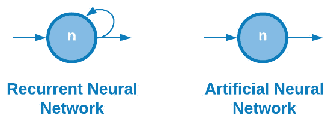
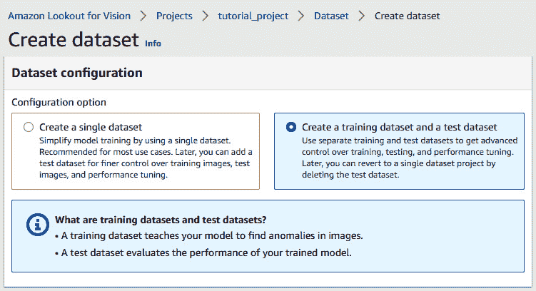

# 第八章：理解深度学习

在整本书中，我们考察了监督学习和无监督机器学习领域的许多工具和方法。在无监督学习领域，我们探讨了**聚类**和**降维**，而在监督学习领域，我们探讨了**分类**和**回归**。在所有这些领域，我们探讨了为我们的数据集开发强大预测模型的最流行算法。然而，正如我们处理的一些数据所看到的，这些模型的表现存在许多限制，这些限制不能通过额外的调整和超参数优化来克服。在这些情况下，数据科学家通常会转向**深度学习**领域。

如果您还记得我们在第五章“机器学习简介”中看到的整体人工智能空间图，我们会注意到这个整体空间被称为**人工智能**（**AI**）。在人工智能空间内，我们将机器学习定义为开发模型从数据中学习或泛化并做出预测的能力。现在，我们将探讨机器学习的一个子集，称为**深度学习**，它专注于使用深度神经网络开发和提取数据中的模式。

在本章中，我们将探讨神经网络和深度学习与生物技术领域的相关思想。特别是，我们将涵盖以下主题：

+   理解深度学习领域

+   探索深度学习模型的类型

+   选择激活函数

+   使用损失来衡量进度

+   使用 Keras 库开发模型

+   教程 – 使用 Keras 和 MLflow 通过 LSTMs 进行蛋白质序列分类

+   教程 – 使用 AWS Lookout for Vision 进行异常检测

考虑到这些部分，让我们开始吧！

# 理解深度学习领域

正如我们在引言中提到的，深度学习是机器学习空间的一个子集或分支，它专注于使用神经网络开发模型。使用神经网络进行深度学习的理念源于人类大脑中的神经网络。让我们了解更多关于这个内容。

## 神经网络

与机器学习类似，开发深度学习模型的理念不是明确定义决策或预测的步骤。这里的主要思想是从数据中泛化。深度学习通过将人脑的树突、细胞体和突触之间的平行关系，在深度学习的背景下，它们作为给定模型的输入、节点和输出，如图所示，使得这一点成为可能：


图 8.1 – 人脑与神经网络的比较

这种实现背后的最大好处之一是特征工程的概念。在这本书的早期，我们看到了如何使用各种方法创建或总结特征，例如基本的数学运算（x2）或通过如**主成分分析**（PCA）等复杂算法。手动构建的特征可能非常耗时，在实践中不可行，这就是深度学习领域可以发挥作用的地方，它能够直接从数据中学习给定数据集的许多潜在特征。

在生物技术领域，大多数应用，从治疗发现的早期阶段到下游的制造，通常是数据丰富的过程。然而，收集到的许多数据本身可能几乎没有任何用途，或者收集的数据可能是针对特定分子的不同批次。也许对于某些分子数据量很大，而对于其他分子则较少。在这些许多情况下，使用深度学习模型可以帮助我们处理与之前讨论的传统机器学习模型相关的特征。

我们可以将特征视为三个不同级别：

+   **低级特征**，例如单个氨基酸、一个蛋白质或小分子的元素。

+   **中级特征**，例如蛋白质的氨基酸序列和小分子的官能团。

+   **高级特征**，例如蛋白质的整体结构或分类，或小分子的几何形状。

下图展示了这些特征的图形表示：


图 8.2 – 三种类型的特征及其一些相关示例

在许多情况下，构建一个健壮的深度学习模型可以解锁相对于其机器学习对应模型更强大的预测模型。在我们已经探索的许多机器学习模型中，我们尝试通过调整和调整超参数来提高模型性能，并且有意识地决定使用具有足够数据量的数据集。增加数据集的大小可能不会导致我们的机器学习模型有任何显著的改进。然而，这并不总是适用于深度学习模型，当有更多数据可用时，深度学习模型往往会提高性能。我们可以在以下图表中看到这种视觉表示：


图 8.3 – 机器学习与深度学习的图形表示

在机器学习的背景下使用神经网络在近年来经历了重大增长，这可以归因于大多数行业大数据使用的增加，计算硬件（如 CPU 和 GPU）成本的降低，以及支持今天大多数开源软件和包的社区的增长。用于开发深度学习模型的最常见的两个包是 TensorFlow 和 Keras – 我们将在本章后面探讨这两个包。在我们这样做之前，让我们先谈谈深度学习模型背后的架构。

## 感知器

深度学习模型最重要的构建块之一是感知器。感知器是一种用于开发监督二分类算法的算法，由弗兰克·罗森布拉特于 1958 年首次发明，有时被称为深度学习的之父。感知器通常由四个主要部分组成：

+   **输入**值，通常是从给定的数据集中获取的。

+   **权重**，即乘以输入值的值。

+   **净和**，即所有输入值的总和。

+   **激活函数**，它将结果值映射到输出。

下面的图显示了感知器这四个部分的图形表示：


图 8.4 – 一个感知器的图形表示

感知器到达给定输入值预测输出的三个主要步骤如下：

1.  **输入值**（x1，x2 等）乘以其相应的权重（w1，w2 等）。这些权重在模型的训练过程中确定，以便为每个输入值分配不同的权重。

1.  每次计算的所有值都汇总到一个称为**加权求和**的值中。

1.  然后将加权求和应用于**激活函数**，将值映射到给定的输出。所使用的特定激活函数取决于给定的情况。例如，在单位步长激活函数的背景下，值将被映射到 0 或 1。

从数学的角度来看，我们可以定义输出值，，如下所示：


在这个方程中，*g*是激活函数，*w*o 是偏置，最后的组成部分是输入值的**线性组合**的总和：


因此，在这个方程中，和考虑了最终的输出值。

感知器是现有最简单的深度学习构建块之一，可以通过增加**隐藏层**的数量来大幅扩展。隐藏层是位于输入层和输出层之间的层。具有很少隐藏层的模型通常被称为**神经网络**或多层感知器，而具有许多隐藏层的模型被称为**深度神经网络**。

这些每一层都由几个**节点**组成，数据流与之前看到的感知器类似。输入节点的数量（*x*1*, x*2*, x*3）通常对应于给定数据集中的**特征**数量，而输出节点的数量通常对应于输出数量。

以下图是神经网络与深度学习之间差异的图形表示：


图 8.5 – 神经网络与深度学习之间的差异

在前一张图中，我们可以看到由输入层、一个包含四个节点的单个隐藏层和一个包含四个节点的输出层组成的神经网络或多层感知器（在左侧）。与之前看到的单个感知器类似，这里的想法是隐藏层中的每个节点都会接收输入节点，乘以某个值，然后通过一个**激活函数**传递以产生输出。在右侧，我们可以看到一个类似模型，但值在确定最终输出值之前会通过几个隐藏层。

## 探索不同类型的深度学习模型

现在有各种各样的神经网络和深度学习架构，它们在功能、形状、数据流等方面有所不同。近年来，有三种类型的神经网络因其对各种类型数据的承诺和鲁棒性而获得了极大的普及。首先，我们将探讨这些架构中最简单的一种，被称为多层感知器。

### 多层感知器

**多层感知器**（**MLP**）是**人工神经网络**（**ANNs**）中最基本的一种类型。这种网络简单地由层组成，数据以正向方式在这些层中流动，如前一张图所示。数据从输入层流向一个或多个隐藏层，然后最终流向输出层，在那里产生预测。本质上，每一层都试图学习和计算某些权重。ANNs 和 MLPs 有多种不同的形状和大小：它们可以在每一层有不同的节点数、不同的输入数，甚至不同的输出数。我们可以在以下图中看到这种视觉描述：


图 8.6 – MLP 的两个示例

MLP 模型通常非常通用，但最常用于结构化表格数据，例如我们一直在工作的结构化蛋白质分类数据集。此外，它们还可以用于图像数据或甚至文本数据。然而，MLPs 在处理如蛋白质序列和时间序列数据等序列数据时通常会遇到困难。

### 卷积神经网络

**卷积神经网络**（**CNNs**）是常用的深度学习算法，用于处理和分析图像数据。CNNs 可以接受图像作为输入数据，并通过权重和偏置重新结构化它们以确定重要性，从而使其能够区分一个图像相对于另一个图像的特征。类似于我们之前讨论的深度学习如何类似于大脑中的神经元，CNNs 在区域敏感性方面也类似于人脑和视觉皮层的神经元连接，类似于感受野的概念。CNN 模型最大的成功之一是它们能够通过使用过滤器捕获图像中的空间依赖性和时间依赖性。我们可以在以下图表中看到这一视觉表示：


图 8.7 – CNN 的表示

以创建图像分类模型的想法为例。我们可以使用 ANN 并将 2D 像素图像通过展平转换为向量。一个 4x4 像素矩阵的图像现在将变成一个 1x16 的向量。这种变化将导致两个主要缺点：

+   图像的空间特征将会丢失，从而降低任何训练模型的鲁棒性。

+   随着图像尺寸的增长，输入特征的数量将急剧增加。

CNNs 可以通过从图像中提取高级特征来克服这一点，这使得它们在基于图像的数据集中非常有效。

### 循环神经网络

**循环神经网络**（**RNNs**）是常用的算法，通常应用于基于序列的数据集。它们的架构与我们之前讨论的 ANNs 非常相似，但 RNNs 可以通过内部记忆记住它们的输入，这使得它们在先前数据非常重要的序列数据集中非常有效。

以一个由各种氨基酸组成的蛋白质序列为例。为了预测蛋白质的类别或其一般结构，模型不仅需要知道使用了哪些氨基酸，还需要知道它们的使用顺序。RNNs 及其许多衍生品在生物技术和生物技术领域的深度学习许多进步中起到了核心作用。我们可以在以下图表中看到这一视觉表示：



图 8.8 – ANN 节点与 RNN 节点的表示

使用 RNN 作为预测模型有几个优点，主要好处如下：

+   它们能够捕捉数据点之间的依赖关系，例如句子中的单词

+   它们能够在时间步长之间共享参数，从而降低整体计算成本

由于这个原因，RNN 已成为开发解决与蛋白质和 DNA 等科学序列数据以及文本和时间序列数据相关问题的模型时越来越受欢迎的架构。

### 长短期记忆

**长短期记忆**（**LSTM**）模型是一种设计用于处理基于序列问题的长期依赖能力的 RNN。通常与基于文本的数据一起用于分类、翻译和识别，LSTMs 在近年来获得了前所未有的流行。我们可以像之前那样描绘标准 RNN 的结构，但结构略有不同：


图 8.9 – RNN 与 LSTM 的内部工作原理

在前面的图中，*X*t 是一个输入向量，*h*t 是一个隐藏层向量，*o*t 是一个输出向量。另一方面，使用一些相同的元素，LSTM 的结构可以相当相似。不深入细节，LSTM 的核心思想是细胞状态（顶部水平线）。这个状态的工作方式类似于传送带，数据线性地通过它。细胞内的门是可选地允许信息添加到状态的方法。LSTM 有三个门，都指向细胞状态。

虽然 LSTM 模型及其相关图表一开始可能让人感到有些令人畏惧，但它们在各种领域一次又一次地证明了它们的价值。最近，LSTM 模型被用作抗体设计的生成模型，以及蛋白质序列-结构分类的分类模型。现在我们已经探讨了几个常见的深度学习架构，让我们继续探索它们的主要组件：激活函数。

# 选择激活函数

回想一下，在前一节中，我们使用激活函数将一个值映射到特定的输出，这取决于该值。我们将激活函数定义为一种数学函数，它使用输入值定义单个节点的输出。用人类大脑的类比，这些函数简单地充当守门人，决定什么将被*触发*到下一个神经元。激活函数应该具有一些特性，以便模型能够从它那里最有效地学习：

+   避免梯度消失

+   低计算成本

人工神经网络使用称为梯度下降的过程进行训练。在这个例子中，让我们假设有一个两层神经网络：


整个网络可以表示如下：


在反向传播步骤中计算权重时，结果如下：


确定导数后，函数变为如下：


如果这个过程在反向传播步骤中通过许多层继续进行，那么初始层的梯度值将会有相当大的减少，从而阻碍模型的学习能力。这就是**梯度消失**的概念。

另一方面，**计算成本**也是在设计并部署任何给定模型之前必须考虑的一个特性。从一层到另一层的激活函数必须多次计算，因此计算成本应保持在最低，以避免更长的训练周期。从输入层到输出层的信息流动被称为**正向传播**。

有许多不同类型的激活函数，它们通常用于各种目的。尽管这不是一条硬性规则，但一些激活函数通常与特定的深度学习层一起使用。例如，`sigmoid` 和 **Tanh** 激活函数通常与 **RNNs** 一起使用。让我们花点时间看看你可能在旅途中遇到的三种最常见的激活函数：


图 8.10 – 按模型类型划分的各种激活函数

在心中有了这些类型的一些概念后，让我们更深入地探讨它们。`sigmoid` 函数可能是深度学习领域中应用最广泛的一些函数。它是一种非线性激活函数，有时也被称为逻辑函数（还记得逻辑回归吗？提示提示）。`sigmoid` 函数的独特之处在于它们可以将值映射到 0 或 1。使用 `numpy` 库，我们可以轻松地编写一个 `Python` 函数来计算它：

```py
import numpy as np
def sigmoid_function(x):
    return 1 / (1 + np.exp(-x))
```

使用这个函数以及 `numpy` 库，我们可以生成一些数据并相应地绘制 `sigmoid` 函数：

```py
x1 = np.linspace(-10, 10, 100)
y1 = [sigmoid_function(i) for i in x1]
plt.plot(x1,y1)
```

作为回报，我们得到以下图表，显示了 `sigmoid` 函数的曲线性质。注意上下限分别是 1 和 0：


图 8.11 – 一个简单的 sigmoid 函数

`sigmoid` 激活函数的一个最大问题是输出可能会**饱和**，即大于 1.0 的值被映射到 1，而小于 0 的值被映射到 0。这可能导致某些模型无法泛化或从数据中学习，这与我们在本章前面讨论的梯度消失问题有关。

另一方面，另一个常见的激活函数是`sigmoid`函数。Tanh 函数在意义上是对称的，因为它通过点(0, 0)，并且它的值范围在 1 和-1 之间，与它的`sigmoid`对应函数不同，使其成为一个稍微更好的函数。我们不必像之前那样在 Python 中定义我们的函数，而是可以利用`numpy`库中的优化函数：

```py
x2 = np.linspace(-5, 5, 100)
y2 = np.tanh(x2)
plt.plot(x2, y2)
```

执行此代码后，我们得到以下图表。注意图表的中心是点(0, 0)，而上下值分别为 1.00 和-1.00：


图 8.12 – 简单的 Tanh 函数

与其`sigmoid`对应函数类似，`sigmoid`，使其成为一个稍微更好的函数来使用。

最后，另一个常用的激活函数是**Rectified Linear Unit**（**ReLU**）。**ReLU**激活函数是专门开发来避免处理较大数值时的饱和现象的。该函数的非线性特性使其能够学习数据中的模式，而其线性特性使得它相对于我们迄今为止看到的其他函数更容易解释。让我们继续在 Python 中探索这一点：

```py
def relu_function(x):
    return np.array([0, x]).max()
x3 = np.linspace(-5, 5, 100)
y3 = [relu_function(i) for i in x3]
plt.plot(x3, y3)
```

执行此代码后得到以下图表。注意**ReLU**函数利用了激活函数的线性和非线性特性，使其兼具两者的优点：


图 8.13 – 简单的 ReLU 函数

**ReLU**激活函数已经成为数据科学家中最受欢迎的激活函数之一，如果不是**最受欢迎**的，这得益于其实施的简便性和在模型开发和训练过程中的稳健速度。然而，**ReLU**激活函数确实有其缺点。例如，当 x = 0（在点 0, 0）时，该函数不可微分，因此无法计算该值的梯度下降。

另一个值得提及的激活函数被称为**Softmax**。**Softmax**与我们迄今为止看到的其他激活函数非常不同，因为它为一系列值计算一个概率分布，这些值与向量中每个值的相对尺度成比例，它们的总和始终等于 1。

常用于`numpy`库：

```py
def softmax_function(x):
    ex = np.exp(x - np.max(x))
    return ex / ex.sum()
x4 = [1, 2, 3, 4, 5]
y4 = softmax_function(x4)
print(y4)
```

打印值后，我们得到以下结果：


图 8.14 – Softmax 函数的结果

使用**Softmax**作为激活函数的两个主要优势是输出值介于 0 和 1 之间，并且它们总是加起来等于 1.0。作为回报，这使得函数可以用来理解交叉熵中的发散概念。我们将在本章后面更详细地探讨这个话题。

我们之前讨论的各种激活函数在应用于各种应用时各有优缺点。例如，`sigmoid`函数通常用于二元和多标签分类应用，而**Softmax**函数通常用于多类分类。这并不是一个硬性规则，而只是一个指南，帮助你将函数与其最有可能成功的应用相匹配：


图 8.15 – 按问题类型划分的激活函数

激活函数是任何深度学习模型的重要组成部分，并且通常被视为*变革者*，因为仅仅改变一个函数为另一个函数就可以极大地提高模型的表现。在下一节中，我们将更详细地探讨如何在深度学习的范围内量化模型性能。

# 使用损失衡量进度

当我们讨论分类和回归的领域时，我们概述了一些衡量和量化我们模型之间性能的度量。当涉及到分类时，我们使用了**精确度**和**准确度**，而在回归中，我们使用了**MAE**和**MSE**。在深度学习的范围内，我们将使用一个称为**损失**的度量。神经网络的**损失**简单地说就是由于做出错误预测而产生的成本的度量。以一个简单的具有三个输入值和一个输出值的神经网络为例：


图 8.16 – 展示输入和输出值的神经网络

在这个例子中，我们使用*[2.3, 3.3, 1.2]*作为模型的输入值，相对于实际值 1.0 的预测值为 0.2。我们可以如下展示损失：


在这个函数中，是预测值，而是实际值。

另一方面，**经验损失**是整个数据集总损失的度量。我们可以如下表示经验损失：


在这个函数中，我们计算所有计算的损失总和。

在整个模型训练过程中，我们的主要目标将是通过一个称为**损失优化**的过程来最小化这个损失。损失优化的主要思想是确定一组权重，以帮助实现可能的最小损失。我们可以将梯度下降的概念可视化为一个从初始起始值（损失高）移动到最终值（损失低）的过程。我们的目标是确保收敛到全局最小值而不是局部最小值，如下面的图所示：


图 8.17 – 损失优化过程

我们每向前迈出一步以接近最小值，都称为一个**学习步**，其**学习率**通常由用户决定。这个参数只是我们可以使用 Keras 指定的许多参数之一，我们将在下一节中了解它。

## 使用 Keras 进行深度学习

在数据科学的领域内，各种**框架**的可用性和使用始终是我们用来标准化开发和部署模型的方法的关键。到目前为止，我们已将机器学习努力集中在使用 scikit-learn 框架上。在本节中，我们将了解三个专注于深度学习的全新框架：**Keras**、**TensorFlow**和**PyTorch**。这两个框架在数据科学家开发各种深度学习模型时最为流行，因为它们提供了针对众多问题和用例的全面 API 列表。

## 理解 Keras 和 TensorFlow 之间的区别

虽然这两个平台允许用户开发深度学习模型，但有一些区别需要了解。TensorFlow 被称为端到端的机器学习平台，提供了全面的库、工具和众多资源。用户可以管理数据、开发模型和部署解决方案。与大多数其他库不同，**TensorFlow**通过其 API 提供低级和高级抽象，使用户在开发模型时具有很大的灵活性。另一方面，**Keras**提供用于开发神经网络的 API，这些 API 使用**TensorFlow**运行。这个库的高级特性使得用户只需几行 Python 代码就可以开始开发和训练复杂的神经网络。Keras 通常被认为用户友好、模块化和可扩展。还有一个在深度学习空间中常用的第三方库，称为**PyTorch**。**PyTorch**是一个低级 API，以其在模型训练过程中的卓越速度和优化而闻名。这个库中的架构通常很复杂，不适合初学者材料，因此它们不在这个书的范围内。然而，它值得提及，因为它是在机器学习空间中最常见的库之一，你可能会遇到。让我们更详细地看看这三个：


图 8.18 – 三种最常见的深度学习框架的比较

每个库都有其优缺点，你应该根据你设定的任务选择其中一个库。鉴于我们第一次探索深度学习模型的发展，我们将专注于使用 Keras 库。

## Keras 和人工神经网络入门

在我们进行完整教程之前，让我们看看使用`Keras`库的一个示例，因为我们尚未探索其功能性和代码：

1.  首先，我们需要一些样本数据来使用。让我们利用`sklearn`中的`make_blobs`类来创建一个`分类`数据集。

1.  我们将指定需要两个类别（二分类）和`5`的聚类标准差，以确保两个聚类重叠，使数据集更具挑战性：

    ```py
    from sklearn.datasets import make_blobs
    X, y = make_blobs(n_samples=2000, centers=2, n_features=4, random_state=1, cluster_std=5)
    ```

1.  接下来，我们可以使用`MinMaxScaler()`类对数据进行缩放：

    ```py
    from sklearn.preprocessing import MinMaxScaler
    scalar = MinMaxScaler()
    scalar.fit(X)
    X_scaled = scalar.transform(X)
    ```

1.  在此转换之后，我们可以将数据分为训练集和测试集，类似于我们之前所做的那样：

    ```py
    from sklearn.model_selection import train_test_split
    X_train, X_test, y_train, y_test = train_test_split(X_scaled, y, test_size=0.25)
    ```

1.  让我们先转换数组为 DataFrame，以便在之前检查数据的前几行：

    ```py
    dfx_train = pd.DataFrame(X_train, columns=["Feature1", "Feature2", "Feature3", "Feature4"])
    dfx_train.head()
    ```

    这将生成以下表格：

    

    图 8.19 – 特征 DataFrame 中的数据示例

1.  我们可以使用`seaborn`库来绘制训练数据集的前两个特征，以检查两个聚类的重叠情况：

    ```py
    sns.scatterplot(x=dfx_train.Feature1, y=dfx_train.Feature2, hue=y_train)
    ```

    下面的图表显示了前面代码的输出：

    

    图 8.20 – 显示两个类别重叠性质的散点图

    在这里，我们可以看到数据混合得相当好，这使得我们探索的一些机器学习模型难以以高精度**准确度**将两个类别分开。

1.  数据准备就绪后，我们可以继续使用 Keras 库。设置模型最流行的方法之一是使用`Keras`中的`Sequential()`类。让我们继续导入该类并实例化一个新的模型：

    ```py
    from keras.models import Sequential
    model = Sequential()
    ```

1.  现在模型已经实例化，我们可以使用`Dense`类向我们的模型添加一个新层。我们还可以指定`节点`（`4`），`input_shape`（`4`，对应四个特征），`activation`（`relu`）以及层的唯一`名称`：

    ```py
    from keras.layers import Dense
    model.add(Dense(4, input_shape=(4,), activation='relu', name="DenseLayer1")) 
    ```

1.  要回顾我们迄今为止构建的模型，我们可以使用`summary()`函数：

    ```py
    model.summary()
    ```

    这将给我们提供一些关于迄今为止模型的信息和细节：

    

    图 8.21 – 模型摘要的样本输出

1.  我们可以通过在事实之后再次使用`model.add()`函数向我们的模型添加更多层，也许会有不同数量的节点：

    ```py
    model.add(Dense(8, activation='relu', name="DenseLayer2"))
    ```

1.  由于我们正在开发一个`0`和`1`，模型只能有一个输出值。因此，我们需要添加一个额外的层，将节点数量从 8 减少到 1。此外，我们将激活函数改为`sigmoid`：

    ```py
    model.add(Dense(1, activation='sigmoid', name="DenseLayer3"))
    ```

1.  现在我们已经设置了模型的总体架构，我们需要使用`compile`函数并指定我们的损失。由于我们正在创建一个二元分类器，我们可以使用`binary_crossentropy`损失，并将准确率指定为我们感兴趣的主要指标：

    ```py
    model.compile(loss='binary_crossentropy', optimizer='adam', metrics=["accuracy"])
    ```

    模型准备就绪后，让我们使用摘要函数再次检查它：

    

    图 8.22 – 模型摘要的样本输出

    到目前为止，模型相当简单。它将在第一层接收具有四个特征的数据库，将其扩展到第二层的八个节点，然后在第三层减少到一个单一输出。模型设置完毕后，我们可以继续训练它。

    我们可以通过使用`model.fit()`函数并指定`X_train`和`y_train`集合来训练一个模型。此外，我们将指定 50 个`epochs`进行训练。**epochs**简单地是遍历或迭代的次数。我们还可以控制模型的详细程度，以便我们可以控制训练过程中想要看到的数据输出量。

1.  回想一下，在我们早期的机器学习模型中，我们只使用了训练数据来训练模型，并在训练完成后保留了测试数据来测试模型。这里我们将使用相同的方法；然而，我们将利用`validation split`在训练过程中的高级特性。深度学习模型几乎总是会过拟合你的数据。在训练过程中使用验证分割可以帮助减轻这一点：

    ```py
    history = model.fit(X_train, y_train, epochs=50, verbose=1, validation_split=0.2)
    ```

    当模型开始训练过程时，它将开始产生以下输出。您可以通过查看左侧的**epochs**数量和右侧的**指标**来监控性能。在训练模型时，我们的目标是确保**损失**指标持续下降，而准确率在上升。以下屏幕截图展示了这一点的示例：

    

    图 8.23 – 模型输出的样本

1.  模型训练完成后，让我们快速检查分类指标，就像之前做的那样，以了解性能。我们可以通过使用测试数据并使用`classification_report`来计算我们的指标开始。请注意，`predict()`方法不返回一个类别，而是一个概率，需要将其四舍五入到`0`或`1`，因为这是一个**二元分类**问题：

    ```py
    y_pred = (model.predict(X_test) > 0.5).astype("int32").ravel()
    from sklearn.metrics import classification_report
    print(classification_report(y_pred, y_test))
    ```

    打印报告后，我们将得到以下结果：

    

    图 8.24 – 模型的结果

1.  我们可以看到包含模型训练历史的`history`变量：

    ```py
    fig = plt.figure(figsize=(10,10))
    # total_rows, total_columns, subplot_index(1st, 2nd, etc..)
    plt.subplot(2, 2, 1)
    plt.title("Accuracy", fontsize=15)
    plt.xlabel("Epochs", fontsize=15)
    plt.ylabel("Accuracy (%)", fontsize=15)
    plt.plot(history.history["val_accuracy"], label='Validation Accuracy', linestyle='dashed')
    plt.plot(history.history["accuracy"], label='Training Accuracy')
    plt.legend(["Validation", "Training"], loc="lower right")
    plt.subplot(2, 2, 2)
    plt.title("Loss", fontsize=15)
    plt.xlabel("Epochs", fontsize=15)
    plt.ylabel("Loss", fontsize=15)
    plt.plot(history.history["val_loss"], label='Validation loss', linestyle='dashed')
    plt.plot(history.history["loss"], label='Training loss')
    plt.legend(["Validation", "Training"], loc="lower left")
    ```

    执行此代码后，我们将收到以下图表，它显示了模型训练过程中的准确率和损失的变化：


图 8.25 – 模型的准确率和损失

在训练模型时，请记住，主要目标是确保损失随着时间逐渐减少，而不是增加。此外，我们的次要目标是确保模型的准确率缓慢而稳定地增加。在尝试诊断表现不佳的模型时，第一步是生成此类图表，在尝试通过改变模型来改善指标之前，了解任何潜在的问题。

当我们在前几章中与大多数机器学习模型合作时，我们了解到我们可以通过以下方式改变这些指标：

+   改进我们的数据预处理。

+   调整我们的超参数或更改模型。在深度学习的范畴内，除了之前提到的选项外，我们还有一些额外的工具可以调整以满足我们的需求。例如，我们可以通过添加或删除层和节点来改变整体架构。此外，我们还可以更改每一层的激活函数，使其与我们的问题陈述最为契合。我们还可以更改优化器或优化器的学习率（在这个模型中是 Adam）。

由于可以做出许多可能对任何给定模型产生重大影响的更改，我们需要组织我们的工作。我们既可以创建多个模型并在电子表格中手动记录我们的指标，也可以利用专门为处理此类用例设计的库：**MLflow**。我们将在下一节中更详细地了解**MLflow**。

# 教程 – 使用 Keras 和 MLflow 进行蛋白质序列分类

深度学习在近年来获得了极大的流行，促使许多科学家转向该领域作为解决和优化科学问题的新的手段。在生物技术领域，深度学习最流行的应用之一涉及**蛋白质序列**数据。到目前为止，在这本书中，我们专注于开发针对**结构化**数据的预测模型。现在，我们将把注意力转向那些在某种意义上是**序列性**的数据，即序列中的元素与其前一个元素之间存在某种关系。在本教程中，我们将尝试开发一个蛋白质**序列分类**模型，我们将根据已知的家族访问号对蛋白质序列进行分类，使用**Pfam**([`pfam.xfam.org/`](https://pfam.xfam.org/))数据集。

重要提示

`Pfam`数据集：Pfam：2021 年的蛋白质家族数据库 J. Mistry, S. Chuguransky, L. Williams, M. Qureshi, G.A. Salazar, E.L.L. Sonnhammer, S.C.E. Tosatto, L. Paladin, S. Raj, L.J. Richardson, R.D. Finn, A. Bateman Nucleic Acids Research (2020) doi: 10.1093/nar/gkaa913 (`Pfam：2021 年的蛋白质家族数据库`).

`Pfam`数据集包含几个列，如下所示：

+   `Family_id`：序列所属家族的名称（例如，filamin）

+   `Family Accession`：我们的模型将尝试预测的类别或输出

+   `Sequence`：我们将用作模型输入的氨基酸序列

在本教程中，我们将使用序列数据开发几个预测模型，以确定每个序列的相关家族访问号。这些序列处于原始状态，长度和大小不同。我们需要预处理数据并按这种方式构建它，以便为序列分类做准备。至于标签，我们将使用一组**平衡**的不同标签来开发模型，以确保模型不会学习任何特定的偏差。

当我们开始开发理想的分类模型时，我们需要调整许多可能的参数以最大化性能。为了跟踪这些变化，我们将使用 MLflow ([`mlflow.org`](https://mlflow.org)) 库。**MLflow** 中有四个主要组件：

+   **MLflow 跟踪**：允许用户记录和查询实验

+   **MLflow 项目**：打包数据科学代码

+   **MLflow 模型**：部署训练好的机器学习模型

+   **MLflow 注册表**：存储和管理你的模型

在本教程中，我们将探讨如何使用 MLflow 跟踪来跟踪和管理蛋白质序列分类模型的发展。考虑到这些事项，让我们开始吧。

## 导入必要的库和数据集

我们将开始导入标准的库集合，然后是格式为 CSV 文档的数据集：

```py
import pandas as pd
import numpy as np
from tensorflow.keras.utils import to_categorical
import matplotlib.pyplot as plt
import seaborn as sns
sns.set_style("darkgrid")
```

现在库已经导入，我们也可以导入数据集。我们将首先指定路径，然后使用 `for` 循环连接数据集：

```py
PATH = "../../../datasets/dataset_pfam/"
files = []
for i in range(8):
    df = pd.read_csv(PATH+f"dataset_pfam_seq_sd{i+1}.csv", index_col=None, header=0)
    files.append(df)

df = pd.concat(files, axis=0, ignore_index=True)
df.shape
```

在导入数据集后，我们立即注意到它包含五个列和约 1.3 百万行数据 – 比我们之前处理的数据略大。我们可以使用 `.head()` 函数快速查看数据集：


图 8.26 – 蛋白质序列数据集的数据样本

数据集成功导入后，让我们进一步探索数据集的详细信息。

## 检查数据集

我们可以使用 `isna()` 函数确认 DataFrame 中数据的完整性，然后使用 `sum()` 函数按列进行总结：

```py
df.isna().sum()
```

现在，让我们更仔细地查看数据集的 `family_accession` 列（我们的模型输出）。我们可以通过分组列并使用 `value_counts()` 函数，然后使用 `n_largest()` 函数来检查实例总数，以获取该列中最常见的 10 个条目：

```py
df["family_accession"].groupby(df["family_accession"]).value_counts().nlargest(10)
```

数据分组将产生以下结果：


图 8.27 – 数据集中值计数高于 1,200 的类别摘要

在这里，我们可以看到 1,500 条条目似乎是前 10 个值截止点。我们还可以通过了解序列的平均长度来更仔细地查看序列列（我们模型的输入），我们可以使用`seaborn`库中的`displot()`函数绘制每个序列长度的计数：

```py
sns.displot(df["sequence"].apply(lambda x: len(x)), bins=75, height=4, aspect=2) 
```

执行此代码将产生以下结果：


图 8.28 – 数据集中序列长度计数的直方图

从这张图以及使用`mean()`和`median()`函数，我们可以看到平均长度和最常见的长度大约是 155 和 100 个氨基酸。我们将在确定输入序列的截止值时使用这些数字。

既然我们对数据有了更好的了解，现在是时候为我们的分类模型准备数据集了。理论上，我们可以在整个数据集上无限制地训练模型 - 然而，模型将需要更长的时间来训练。此外，如果不考虑平衡性而在所有数据上训练，我们可能会在模型中引入偏差。为了减轻这两种情况，让我们通过过滤至少有 1,200 个**观测值**的分类来减少这个数据集：

```py
df_filt = df.groupby("family_accession").filter(lambda x: len(x) > 1200)
```

由于一些类别的观测值明显多于 1,200 个，我们可以使用`sample()`函数随机选择恰好 1,200 个观测值：

```py
df_bal = df_filt.groupby('family_accession').apply(lambda x: x.sample(1200))
```

现在，我们可以使用`head()`函数检查过滤和平衡后的数据集：

```py
df_red = df_bal[["family_accession", "sequence"]].reset_index(drop=True)
df_red.head()
```

`head()`函数将产生以下结果：


图 8.29 – 以 DataFrame 形式的数据样本

我们可以通过检查`value_counts()`函数的长度来检查这个数据集中我们将有多少个类别：

```py
num_classes = len(df_red.family_accession.value_counts())
```

如果我们检查`num_classes`变量，我们将看到总共有 28 个可能的类别。

## 数据集拆分

数据准备就绪后，我们的下一步将是将数据集拆分为训练、测试和验证集。我们将再次使用`sklearn`中的`train_test_split`函数来完成此操作：

```py
from sklearn.model_selection import train_test_split
X_train, X_test = train_test_split(df_red, test_size=0.25)
X_val, X_test = train_test_split(X_test, test_size=0.50)
```

数据现在已拆分，让我们继续预处理它。

## 数据预处理

数据拆分后，我们需要预处理数据集以便用于我们的神经网络模型。首先，我们需要将序列减少到最常见的 20 种氨基酸，并将序列转换为整数。这将加快训练过程。首先，我们将创建一个包含氨基酸及其对应值的字典：

```py
aa_seq_dict = {'A': 1,'C': 2,'D': 3,'E': 4,'F': 5,'G': 6,'H': 7,'I': 8,'K': 9,'L': 10,'M': 11,'N': 12,'P': 13,'Q': 14,'R': 15,'S': 16,'T': 17,'V': 18,'W': 19,'Y': 20}
```

接下来，我们可以遍历序列并将字符串值转换为相应的整数。请注意，我们将为此完成训练、测试和验证集：

```py
def aa_seq_encoder(data):
    full_sequence_list = []
    for i in data['sequence'].values:
        row_sequence_list = []
        for j in i:
            row_sequence_list.append(aa_seq_dict.get(j, 0))
        full_sequence_list.append(np.array(row_sequence_list))
    return full_sequence_list

X_train_encode = aa_seq_encoder(X_train) 
X_val_encode = aa_seq_encoder(X_val) 
X_test_encode = aa_seq_encoder(X_test)
```

接下来，我们需要填充序列以确保它们的长度都相同。为了实现这一点，我们可以使用`keras`中的`pad_sequences`函数。我们将为每个序列指定`max_length`为 100，因为这与我们之前看到的中间值相近。此外，我们将使用`'post'`来填充序列，以确保我们在序列的末尾而不是开头进行填充：

```py
from keras.preprocessing.sequence import pad_sequences
max_length = 100
X_train_padded = pad_sequences(X_train_encode, maxlen=max_length, padding='post', truncating='post')
X_val_padded = pad_sequences(X_val_encode, maxlen=max_length, padding='post', truncating='post')
X_test_padded = pad_sequences(X_test_encode, maxlen=max_length, padding='post', truncating='post')
```

我们可以使用其中一个序列快速查看我们所做的更改。首先，我们有原始序列作为一个`字符串`：

```py
X_train.sequence[1][:30]
'LRDLRHFLAVAEEGHIGRAAARLHLSQPPL'
```

接下来，我们可以将序列编码以去除不常见的氨基酸，并将字符串转换为整数列表：

```py
X_train_encode[1][:30]
array([ 7, 10, 15, 18, 10,  3, 18, 16, 14, 17, 15,  5, 12, 10,  7, 16, 15, 12, 12,  8, 18,  4, 14,  5, 17,  4,  2])
```

最后，我们可以将序列的长度限制为 100 个元素，或者用零**填充**以达到 100 个元素：

```py
X_train_padded[1][:30]
array([ 7, 10, 15, 18, 10,  3, 18, 16, 14, 17, 15,  5, 12, 10,  7, 16, 15, 12, 12,  8, 18,  4, 14,  5, 17,  4,  2,  0,  0,  0])
```

现在我们已经预处理了输入数据，我们还需要预处理输出值。我们可以使用`sklearn`中的`LabelEncoder`类来完成这个任务。我们的主要目标是将数据框列中的标签列表转换为编码后的列表：

```py
from sklearn.preprocessing import LabelEncoder
le = LabelEncoder()
y_train_enc = le.fit_transform(X_train['family_accession'])
y_val_enc = le.transform(X_val['family_accession'])
y_test_enc = le.transform(X_test['family_accession'])
```

最后，我们可以使用`sklearn`中的`to_categorical`函数将类别向量转换为二进制类别矩阵：

```py
from tensorflow.keras.utils import to_categorical
y_train = to_categorical(y_train_enc)
y_val = to_categorical(y_val_enc)
y_test = to_categorical(y_test_enc)
```

要回顾我们在这里所做的更改，我们可以使用`DataFrame`的单个列：

```py
X_train['family_accession']
```

我们可以在以下图表中看到这个结果：


图 8.30 – 类别列表

接下来，我们必须将类别编码成一系列数值，每个数值代表一个特定的类别：

```py
y_train_enc
array([ 4,  3, 21, ..., 10, 15, 12], dtype=int64)
```

最后，我们必须将结构转换为**二进制类别矩阵**，使得每一行都是一个包含 27 个零和一个 1 的列表，1 代表它所属的类别：

```py
y_train[5]
array([0., 0., 0., 0., 0., 0., 0., 0., 0., 0., 0., 0., 0., 0., 0., 0., 0., 0., 1., 0., 0., 0., 0., 0., 0., 0., 0., 0.], dtype=float32)
```

这样，我们的数据集已经完全预处理完毕，准备好在教程的模型开发阶段使用。

## 使用 Keras 和 MLflow 开发模型

与我们之前使用`Keras`库开发模型的例子类似，我们再次将使用`Sequential`类：

1.  我们将首先从 Keras 导入我们需要的层和其他项目：

    ```py
    import tensorflow as tf
    from keras.models import Sequential
    from keras.layers import Dense, Conv1D, MaxPooling1D, Flatten, Input, Bidirectional, LSTM, Dropout
    from keras.layers.embeddings import Embedding
    from keras.regularizers import l2
    from keras.models import Model
    import mlflow
    import mlflow.keras
    ```

1.  现在，我们可以使用序列类创建一个新的模型实例，并通过添加一些感兴趣的层来填充它。我们首先添加一个嵌入层，将正整数转换为密集向量。我们将指定`input_dim`为`21`来表示氨基酸索引的大小加 1，以及`output_dim`为 32。此外，我们将`input_length`设置为`max_length`减去序列的长度：

    ```py
    model = Sequential()
    model.add(Embedding(21, 8, input_length=max_length, name="EmbeddingLayer"))
    ```

1.  接下来，我们将添加一个 LSTM 层，并用`Bidirectional`层包装，以在两个方向上运行输入——从过去到未来和从未来到过去：

    ```py
    model.add(Bidirectional(LSTM(8), name="BidirectionalLayer"))
    ```

1.  接下来，我们将添加一个`Dropout`层，以帮助防止模型过拟合：

    ```py
    model.add(Dropout(0.2, name="DropoutLayer"))
    ```

1.  最后，我们将以一个`Dense`层结束，并将节点数设置为`28`，以便与输出形状相对应。注意，我们在这里使用 Softmax 激活函数：

    ```py
    model.add(Dense(28, activation='softmax', name="DenseLayer"))
    ```

1.  模型的架构准备就绪后，我们可以分配一个优化器（Adam），编译模型，并检查摘要：

    ```py
    opt = tf.keras.optimizers.Adam(learning_rate=0.1)
    model.compile(optimizer=opt, loss='categorical_crossentropy', metrics=['accuracy'])
    ```

1.  现在，让我们继续使用`fit()`函数训练我们的模型并分配 30 个 epoch。注意，从我们之前的教程中可以看出，训练深度学习模型可能非常耗时且昂贵，因此训练一个没有学习的模型可能是一种巨大的时间浪费。为了减轻这种情况，我们可以在 Keras 中实现所谓的回调，即在模型不再学习（即损失不再下降）时结束训练周期：

    ```py
    from keras.callbacks import EarlyStopping
    es = EarlyStopping(monitor='val_loss', patience=5, verbose=1)
    ```

1.  最后，我们可以继续通过调用`autolog()`函数和拟合模型来记录我们的新运行，就像我们之前做的那样。MLflow 提供了许多不同的方法来记录参数和指标，你不仅限于使用`autolog()`：

    ```py
    mlflow.keras.autolog()
    history = model.fit(
        X_train_padded, y_train,
        epochs=30, batch_size=256,
        validation_data=(X_val_padded, y_val),
        callbacks=[es]
        )
    ```

    假设你正确地遵循了这些步骤，模型将打印一条消息说明正在使用 MLflow，你应该看到一个新的目录出现在你的当前笔记本旁边。在完成训练过程后，你可以像之前那样绘制结果，得到以下图表：


图 8.31 – 该模型第一次迭代的准确率和结果

在这里，我们可以看到准确率似乎保持在 80-85%左右，而损失保持在 0.6 到 0.8 之间。我们可以看到模型没有在学习。也许需要改变参数？让我们继续将节点数从`8`改为`12`，将学习率从`0.1`改为`0.01`。在编译新模型、调用`autolog()`函数和训练新数据集后，我们将得到一个新的图表：


图 8.32 – 该模型下一次迭代的准确率和结果

在这里，我们可以看到模型的损失，无论是训练还是验证，都相当好地下降，直到回调在约 30 个 epoch 时停止训练。另一方面，准确率在开始时急剧上升，随后稳定上升，也停止在过程的 30 个 epoch 处。我们可以不断地做出改变并多次调用`autolog()`函数，让系统代表我们记录变化和产生的指标。经过几次迭代后，我们可以使用`mlflow ui`来检查我们模型的性能。在笔记本本身中，输入以下命令：

```py
!mlflow ui
```

接下来，导航到`http://localhost:5000/`。在那里，你将能够看到`MLflow` UI，你将能够查看模型、它们的参数和相关的指标：


图 8.33 – MLflow UI 的示例

这样，你可以选择最佳模型并继续你的项目。

## 检查模型的性能

现在已经选出了表现最好的模型，让我们更好地了解其相关的`classification_report`，正如我们之前所做的那样，几乎达到了 99%的精确率和召回率。或者，鉴于我们总共有 28 个类别，我们可以使用混淆矩阵来更好地了解数据：

```py
from sklearn.metrics import confusion_matrix
y_pred = model.predict(X_test_padded)
cf_matrix = confusion_matrix(np.argmax(y_test, axis=1), np.argmax(y_pred, axis=1))
```

在计算了混淆矩阵后，我们可以使用热图来可视化结果：

```py
import seaborn as sns
plt.figure(figsize=(15,10))
sns.heatmap(cf_matrix, annot=True, fmt='', cmap='Blues')
```

执行此操作后，我们将得到以下图表：


图 8.34 – 模型结果的混淆矩阵

在这里，我们可以看到模型的性能相当稳健，因为它给出了非常好的结果！Keras、TensorFlow 和 PyTorch 是伟大的包，可以帮助我们开发稳健且具有高影响力的模型来解决特定问题。通常，我们会发现 AWS 可能已经存在一个（或一组）模型，可以用很少或没有代码来解决我们的复杂问题。我们将在下一节中探讨这个例子。

# 教程 – 使用 AWS Lookout for Vision 进行制造中的异常检测

在上一节中，我们准备并训练了一个深度学习模型来对给定的蛋白质类别进行分类。我们经历了数据预处理、模型开发、测试参数、编辑架构以及选择最大化我们感兴趣指标的组合的过程。虽然这个过程通常会产生良好的结果，但我们有时可以利用 AWS 等平台架构自动为我们开发模型。在本教程中，我们将利用一个名为**AWS Lookout for Vision**的工具([`aws.amazon.com/lookout-for-vision/`](https://aws.amazon.com/lookout-for-vision/))来帮助我们准备一个能够检测数据集中异常的模型。

在整个教程中，我们将使用一个包含与制造**药物产品**（**DP**）相关的图像的数据集。每张图像都包含一个在制造周期结束时捕获的瓶子的图像。大多数瓶子都很干净，没有杂质。然而，一些瓶子含有轻微的杂质，如下面的图所示：


图 8.35 – 一个合格瓶与损坏瓶的示例

拒绝损坏或杂质瓶子的过程通常是通过手工完成的，可能相当耗时。我们被要求实施一个自动化的解决方案来解决这个问题，而我们只有几天的时间来完成。与其开发我们自己的定制深度学习模型来检测图像中的异常，我们可以利用**Amazon Lookout for Vision**。在本教程中，我们将首先将我们的图像数据集上传到 S3，将图像导入框架，并开始训练我们的模型。考虑到这一点，让我们开始吧！

在本书的 GitHub 仓库中，您可以找到一个名为`vials_input_dataset_s3`的目录，其中包含了一组正常和损坏的试管。如果我们仔细查看我们的数据集，我们会注意到它使用目录层次结构构建，如图所示：


图 8.36 – 一个合格的试管与一个损坏的试管的示例

我们将首先将图像导入到本书中一直使用的同一个 S3 存储桶中：

1.  首先，从 AWS 控制台中导航到 S3 并选择感兴趣的存储桶。在这种情况下，我将选择**biotech-machine-learning**。

1.  接下来，点击橙色**上传**按钮，选择**vials_input_dataset_s3**文件夹，然后点击**上传**。这个过程可能需要几分钟，具体取决于您的网络连接。

1.  现在，点击页面右上角的**复制 S3 URI**按钮。我们将在几分钟后需要这个 URI。

现在，我们的数据已可用于在 S3 存储桶中使用。接下来，我们可以专注于将数据导入模型并开始模型训练过程：

1.  首先，导航到 AWS 控制台中的 Amazon Lookout for Vision。然后，点击**开始使用**按钮：

    图 8.37 – Amazon Lookout for Vision 的前页

1.  点击页面右侧的**创建项目**按钮，并为您的项目命名。

1.  一旦项目创建完成，请继续点击页面左侧的**创建数据集**按钮。

1.  选择第二个选项以**创建训练数据集和测试数据集**：

    图 8.38 – 在 AWS Lookout for Vision 中创建数据集

1.  接下来，在`training`路径内，如图所示：

    图 8.39 – 在 AWS Lookout for Vision 中创建数据集

1.  此外，请确保选择**自动标注**选项，以确保我们的标签被 AWS 接收。

1.  对于测试数据集，重复此过程，但请确保在 S3 URI 路径中将“training”替换为`validation`。然后，点击**创建数据集**。

1.  一旦数据集创建完成，您将被带到一个新的页面，您可以在此页面上直观地检查数据集的准备工作。然后，您可以在页面的右上角点击**训练模型**按钮以开始模型训练过程。这个过程可能耗时，可能需要几个小时：


图 8.40 – 训练模型前的数据集

通过这样做，您将看到模型的最终结果，它将显示精确度、召回率和 F1 分数，如下面的截图所示：


图 8.41 – 模型性能指标页面

完成最后一步后，我们成功开发了一个能够检测制造过程中异常的稳健模型！我们不仅能够在短短几小时内创建模型，而且还做到了无需任何代码！

# 摘要

在本章中，我们迈出了重大步伐，涵盖了深度学习和神经网络*必须了解*的相当一部分元素。首先，我们研究了神经网络的根源以及它们是如何产生的，然后深入探讨了感知器及其基本功能形式。然后，我们开始了一段探索最常见四种神经网络的旅程：MLP、CNN、RNN 和 LSTM。我们更好地理解了如何选择激活函数、衡量损失以及使用 Keras 库实现我们的理解。

接下来，我们采取了一种更少理论性和更多实践性的方法，因为我们处理了第一个具有序列性质的数据集。我们花费了大量时间进行数据预处理，开发我们的模型，使用 MLflow 组织模型开发，并审查其性能。遵循这些步骤使我们能够为当前问题创建一个定制且合适的模型。最后，我们通过使用 AWS Lookout for Vision 训练一个能够检测安瓿瓶图像中异常的模型，采取了一种无代码的方法。

深度学习和神经网络的应用在过去几年中确实经历了重大增长，在下一章中，我们将看到与自然语言处理相关的深度学习应用。
