# 第九章：自然语言处理

在上一章中，我们讨论了使用深度学习不仅解决以表格形式存在的结构化数据，还包括顺序数据，其中元素的顺序很重要。在本章中，我们将讨论另一种形式的顺序数据——文本，这属于一个被称为**自然语言处理**（**NLP**）的领域。我们可以将 NLP 定义为人工智能的一个子集，它与机器学习和深度学习的领域都有重叠，特别是在语言学和计算机科学领域之间的交互。

使用 NLP 进行各种任务的许多知名和有详细记录的应用和成功案例。从垃圾邮件检测器到文档分析器等不同产品都涉及一定程度上的 NLP。在本章中，我们将探讨涉及 NLP 的几个不同领域和应用。

正如我们观察到的许多其他数据科学领域一样，NLP 领域同样广阔且分散，有无数的工具和应用，一本书根本无法完全涵盖。在本章中，我们将努力突出您可能会遇到的最常见和最有用的应用。

在本章中，我们将从结构化和非结构化数据的角度探讨许多与 NLP 相关的流行领域。我们将探讨几个主题，如实体识别、句子分析、主题建模、情感分析和自然语言搜索引擎。

在本章中，我们将涵盖以下主题：

+   NLP 简介

+   使用 NLTK 和 SciPy 开始 NLP

+   与结构化数据一起工作

+   教程——抽象聚类和主题建模

+   与非结构化数据一起工作

+   教程——使用 transformers 开发科学数据搜索引擎

带着这些目标，让我们开始吧。

# NLP 简介

在**生物技术**领域内，我们经常出于多种原因转向**NLP**，这通常涉及组织数据和开发模型以找到科学问题的答案。与迄今为止我们调查的许多其他领域不同，NLP 的独特之处在于我们专注于一种手头的数据类型：文本数据。当我们想到 NLP 领域的文本数据时，我们可以将其分为两大类：**结构化数据**和**非结构化数据**。我们可以将结构化数据视为存在于表格和数据库中的文本字段，其中项目是有组织的、标记的，并且相互链接以便于检索，例如 SQL 或 DynamoDB 数据库。另一方面，我们有所谓的非结构化数据，如文档、PDF 和图像，它们可以包含既不可搜索也不易访问的静态内容。以下图表中可以看到一个例子：

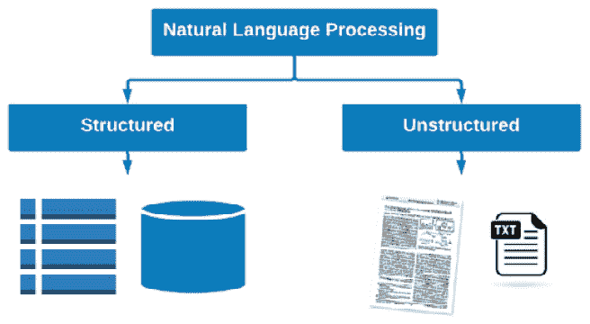

图 9.1 – NLP 中的结构化和非结构化数据

通常，我们希望将文档或基于文本的数据用于各种目的，如下所示：

+   **生成洞察**：寻找趋势、关键词或关键短语

+   **分类**：自动为各种目的标记文档

+   **聚类**：根据特征和特性将文档分组在一起

+   **搜索**：快速在历史文档中找到重要知识

在这些示例中，我们需要将我们的数据从非结构化数据转换为结构化状态，以实现这些任务。在本章中，我们将探讨一些关于 NLP 空间的重要和有用的概念和工具，您应该了解。

# 使用 NLTK 和 SciPy 开始 NLP 之旅

Python 语言中有许多不同的 NLP 库可供用户使用，以完成各种不同的数据分析、洞察生成或预测模型准备任务。为了开始我们在 NLP 领域的旅程，我们将利用两个流行的库，即**NLTK**和**SciPy**。我们将从导入这两个库开始：

```py
import nltk
import scipy
```

通常，我们会想要为了特定目的解析和分析原始文本片段。以以下关于生物技术领域的段落为例：

```py
paragraph = """Biotechnology is a broad area of biology, involving the use of living systems and organisms to develop or make products. Depending on the tools and applications, it often overlaps with related scientific fields. In the late 20th and early 21st centuries, biotechnology has expanded to include new and diverse sciences, such as genomics, recombinant gene techniques, applied immunology, and development of pharmaceutical therapies and diagnostic tests. The term biotechnology was first used by Karl Ereky in 1919, meaning the production of products from raw materials with the aid of living organisms."""
```

在这里，有一个字符串被分配给了`paragraph`变量。段落可以使用`sent_tokenize()`函数分割成句子，如下所示：

```py
from nltk.tokenize import sent_tokenize
nltk.download('popular')
sentences = sent_tokenize(paragraph)
print(sentences)
```

打印这些句子后，我们将得到以下输出：

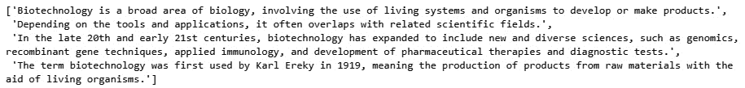

图 9.2 – 从初始段落中分割出的句子样本列表

同样，我们可以使用`word_tokenize()`函数将段落分割成单个单词：

```py
from nltk.tokenize import word_tokenize
words = word_tokenize(sentences[0])
print(words)
```

打印结果后，您将得到一个类似于以下屏幕截图中的列表：

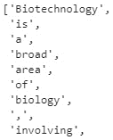

图 9.3 – 从第一句中分割出的单词样本列表

通常，我们想知道句子中给定单词的词性。我们可以使用`pos_tag()`函数在给定的字符串上执行此操作 – 在这种情况下，段落的第一个句子：

```py
tokens = word_tokenize(sentences[0])
tags = nltk.pos_tag(tokens)
print(tags)
```

打印标签后，我们得到一个列表，其中单词或标记列在左侧，而相关的词性列在右侧。例如，`Biotechnology`和`biology`被标记为专有名词，而`involving`和`develop`被标记为动词。我们可以在以下屏幕截图中看到这些结果的示例：

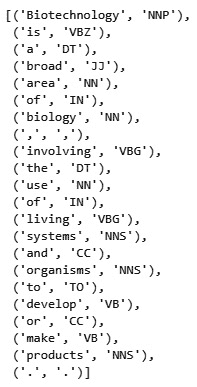

图 9.4 – 领词性标注方法的结果

除了理解词性之外，我们通常还想知道特定文本字符串中给定单词的频率。为此，我们可以将段落标记为单词，按单词分组，计算实例并绘制它们，或者使用 NLTK 的内置功能：

```py
freqdist = nltk.FreqDist(word_tokenize(paragraph))
import matplotlib.pyplot as plt
import seaborn as sns
plt.figure(figsize=(10,3))
plt.xlabel("Samples", fontsize=20)
plt.xticks(fontsize=14)
plt.ylabel("Counts", fontsize=20)
plt.yticks(fontsize=14)
sns.set_style("darkgrid")
freqdist.plot(30,cumulative=False) 
```

通过这样做，您将收到以下输出：

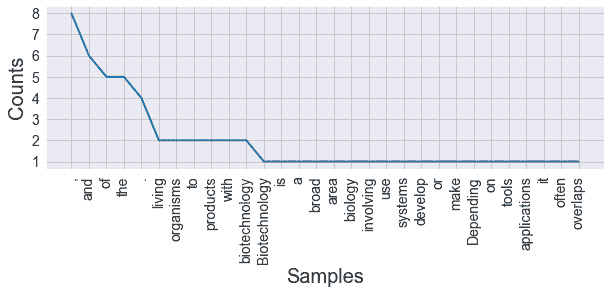

图 9.5 – 计算频率（含停用词）的结果

在这里，我们可以看到最常见的元素是逗号、句号和其他无关紧要的词。对于任何给定分析无关紧要的词被称为`regex`。让我们继续准备一个函数来清理我们的文本：

```py
from nltk.corpus import stopwords
from nltk.tokenize import word_tokenize
nltk.download('punkt')
nltk.download('stopwords')
import re
STOP_WORDS = stopwords.words()
def cleaner(text):
    text = text.lower() #Convert to lower case
    text = re.sub("[^a-zA-Z]+", ' ', text) # Only keep text, remove punctuation and numbers
    text_tokens = word_tokenize(text) #Tokenize the words
    tokens_without_sw = [word for word in text_tokens if not word in STOP_WORDS] #Remove the stop words
    filtered_sentence = (" ").join(tokens_without_sw) # Join all the words or tokens back to a single string
    return filtered_sentence
```

在这个函数中，有四个主要步骤。首先，我们将文本转换为小写以保持一致性；然后，我们使用正则表达式删除所有标点符号和数字。之后，我们将字符串拆分为单个标记，并删除如果它们在我们的停用词列表中的单词，最后将单词重新组合成一个字符串。

重要提示

请注意，文本清理脚本通常针对特定用例是特定的，这意味着并非所有用例都需要相同的步骤。

现在，我们可以将`cleaner`函数应用于我们的段落：

```py
clean_paragraph = cleaner(paragraph)
clean_paragraph
```

我们可以在以下屏幕截图中看到此函数的输出：

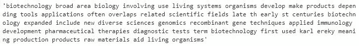

图 9.6 – 文本清理函数的输出

在重新计算使用干净文本的频率后，我们可以重新绘制数据并查看结果：

```py
import matplotlib.pyplot as plt
import seaborn as sns
plt.figure(figsize=(10,3))
plt.xlabel("Samples", fontsize=20)
plt.xticks(fontsize=14)

plt.ylabel("Counts", fontsize=20)
plt.yticks(fontsize=14)

sns.set_style("darkgrid")
freqdist.plot(30,cumulative=False)
```

此代码的输出可以在以下屏幕截图中看到：

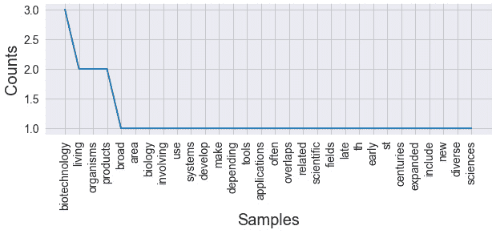

图 9.7 – 计算频率（不含停用词）的结果

随着我们开始深入挖掘我们的文本，我们通常会希望不仅通过它们的词性来标记项目，还要通过它们的实体来标记，这样我们就可以在称为`spacy`库的过程中解析日期、人名以及许多其他内容：

```py
import spacy
spacy_paragraph = nlp(paragraph)
spacy_paragraph = nlp(paragraph)
print([(X.text, X.label_) for X in spacy_paragraph.ents])
```

打印结果后，我们获得一个项目及其相关实体标签的列表。请注意，该模型不仅识别了年份`1919`作为`DATE`实体，还识别了描述如`21st centuries`作为`DATE`实体：

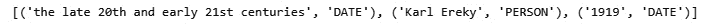

图 9.8 – 显示文本及其后续标签的 NER 模型的结果

我们还可以使用`render`函数在 Jupyter Notebook 中从视觉角度显示标签：

```py
from spacy import displacy
displacy.render(nlp(str(sentences)), jupyter=True, style='ent')
```

执行此代码后，我们将收到原始段落，它已被根据识别的实体标签着色，使我们能够直观地查看结果：

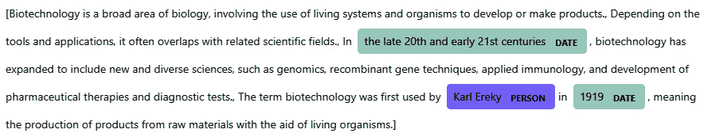

图 9.9 – 在 Jupyter Notebook 中渲染的 NER 模型的结果

我们还可以使用 SciPy 通过相同的 `render()` 函数实现对文本中词性的视觉理解：

```py
displacy.render(nlp(str(sentences[0])), style='dep', jupyter = True, options = {'distance': 120})
```

我们可以在以下图表中看到此命令的输出：

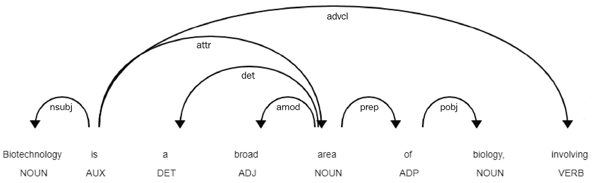

图 9.10 – POS 模型在 Jupyter Notebook 中渲染的结果

这为我们理解并可视化句子结构提供了一个很好的方法。在完成一些基本分析后，让我们继续探索使用结构化数据的 NLP 应用。

# 处理结构化数据

现在我们已经探索了一些 NLP 的基础知识，让我们深入研究一些更复杂且在生物技术和生命科学领域常见的用例。当处理基于文本的数据时，与单个字符串相比，更常见的是处理更大的数据集。通常情况下，我们希望这些数据集涉及特定研究主题相关领域的科学数据。让我们继续学习如何使用 Python 检索科学数据。

## 搜索科学文章

要使用 Python 程序化检索科学出版物数据，我们可以利用来自 *PubMed* 的 `pymed` 库([`pubmed.ncbi.nlm.nih.gov/`](https://pubmed.ncbi.nlm.nih.gov/))。让我们继续构建一个示例数据集：

1.  首先，让我们导入我们的库并实例化一个新的 `PubMed` 对象：

    ```py
    from pymed import PubMed
    pubmed = PubMed()
    ```

1.  接下来，我们需要定义并运行我们的查询。让我们继续搜索与单克隆抗体相关的一切，并检索 `100` 个结果：

    ```py
    query = "monoclonal antibody"
    results = pubmed.query(query, max_results=100)
    ```

1.  在找到结果后，我们可以遍历我们的结果以检索给定文章的所有可用字段：

    ```py
    articleList = []
    for article in results:
        articleDict = article.toDict()
        articleList.append(articleDict)
    ```

1.  最后，我们可以将我们的列表转换为 DataFrame 以便于使用：

    ```py
    df = pd.DataFrame(articleList)
    df.head()
    ```

    以下为输出：

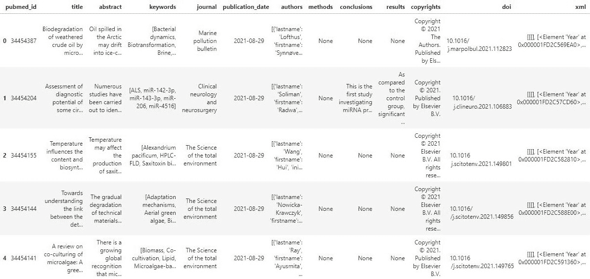

图 9.11 – 显示 PubMed 搜索结果的 DataFrame

在完成最后一步后，我们有一个包含科学摘要及其相关元数据的完整数据集。在下一节中，我们将更深入地探索这些数据，并开发一些可视化来表示它。

## 探索我们的数据集

现在我们有一些数据可以处理了，让我们继续探索它。如果你还记得前面许多章节的内容，我们经常以各种方式探索我们的数值数据集。我们可以分组列，探索趋势，并找到相关性——这些任务在处理文本时可能无法完成。让我们实现一些 NLP 方法，以稍微不同的方式探索数据。

### 检查字符串长度

由于我们已经在 pandas DataFrame 中结构化我们的数据集，我们通常想要探索的第一个项目之一就是基于文本数据的字符串长度分布。在当前数据集中，包含文本的两个主要列是`title`和`abstract` – 让我们继续绘制长度分布图：

```py
sns.displot(df.abstract.str.len(), bins=25)
sns.displot(df.title.str.len(), bins=25)
```

以下为输出：

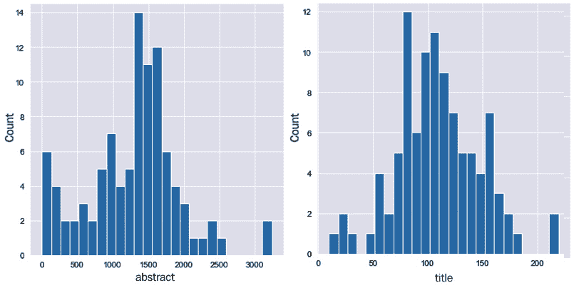

图 9.12 – 摘要平均长度（左侧）和标题平均长度（右侧）的频率分布

在这里，我们可以看到大多数摘要的平均长度约为 1,500 个字符，而标题约为 100 个字符。由于标题可能包含文章的重要关键词或标识符，类似于摘要，因此将两者合并为一个单独的列以一起分析是明智的。我们可以简单地使用`+`运算符将它们合并：

```py
df["text"] = df["title"] + " " + df["abstract"]
df[["title", "abstract", "text"]]
```

我们可以在以下屏幕截图中看到这个新列：

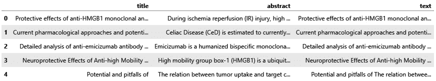

图 9.13 – 显示标题、摘要和文本列的样本 DataFrame

通过对每一列使用`mean()`函数，我们可以看到标题平均有 108 个字符，摘要有 1,277 个字符，而组合文本列有 1,388 个字符。

与其他数据集类似，我们可以使用`value_counts()`函数来快速了解最常见的单词：

```py
df.text.str.split(expand=True).stack().value_counts()
```

立即，我们注意到我们的数据集中充满了停用词：

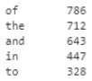

图 9.14 – 数据集中最频繁出现的单词样本

我们可以实施与之前相同的`cleaner`函数来删除这些停用词和任何其他不希望存在的值。请注意，DataFrame 中的某些单元格可能为空，这取决于查询方式和返回的结果。我们将在下一节中对此进行更详细的探讨。

### 清理文本数据

我们可以在函数顶部添加一个快速检查，通过检查值的类型来确保不会遇到错误：

```py
from nltk.corpus import stopwords
STOP_WORDS = stopwords.words()
def cleaner(text):
    if type(text) == str:
        text = text.lower()
        text = re.sub("[^a-zA-Z]+", ' ', text)
        text_tokens = word_tokenize(text)
        tokens_without_sw = [word for word in text_tokens if not word in STOP_WORDS]
        filtered_sentence = (" ").join(tokens_without_sw)
        return filtered_sentence
```

我们可以在一个样本字符串上快速测试这个功能：

```py
cleaner("Biotech in 2021 is a wonderful field to work and study in!")
```

该函数的输出可以在以下屏幕截图中看到：

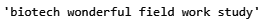

图 9.15 – 清理函数的结果

函数运行正常后，我们可以将其应用于 DataFrame 中的`text`列，并创建一个新列，该列包含使用`apply()`函数清理后的文本，该函数允许我们对 DataFrame 的所有行迭代应用给定函数：

```py
df["clean_text"] = df["text"].apply(lambda x: cleaner(x))
```

我们可以通过检查感兴趣的列来检查我们函数的性能：

```py
df[["text", "clean_text"]].head()
```

我们可以在以下屏幕截图中看到这两个列：

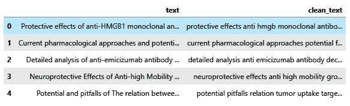

图 9.16 – 显示原始和清理文本的 DataFrame

如果我们继续检查`clean_text`列的`value_counts()`，就像我们之前做的那样，你会注意到停用词已被移除，并且现在更有用的关键词已填充在顶部。

### 创建词云

另一种流行且有用的方法，可以通过使用词云来快速了解给定基于文本数据集的内容。`wordclouds`库：

1.  首先，我们需要导入函数，然后创建一个`wordcloud`对象，我们将指定一系列参数。我们可以调整图像的尺寸、颜色和数据，如下所示：

    ```py
    from wordcloud import WordCloud, STOPWORDS
    plt.figure(figsize=(20,10))
    # Drop nans
    df2 = df[["clean_text"]].dropna()
    # Create word cloud
    wordcloud = WordCloud(width = 5000, 
                          height = 3000, 
                          random_state=1, 
                          background_color='white', 
                          colormap='Blues', 
                          collocations=False, 
                          stopwords = STOPWORDS).generate(' '.join(df2['clean_text']))
    ```

1.  现在，我们可以使用`imshow()`函数从`matplotlib`库中渲染图像：

    ```py
    plt.figure( figsize=(15,10) )
    plt.imshow(wordcloud)
    ```

    以下为输出结果：

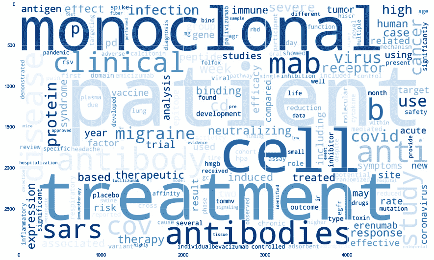

图 9.17 – 表示数据集中单词频率的词云

在本节中，我们调查了几种快速分析基于文本数据的流行方法，作为在执行任何类型严格分析或模型开发过程之前的初步步骤。在下一节中，我们将使用这个数据集训练一个模型来研究主题。

# 教程 – 聚类和主题建模

与我们迄今为止看到的一些前例类似，我们的大部分数据要么可以在监督设置中分类，要么在无监督设置中聚类。在大多数情况下，基于文本的数据通常以原始和未标记的形式提供给我们，这意味着它是现实世界数据。

让我们看看一个例子，我们可以从无监督的角度理解我们的数据并对它进行标记。我们在这里的主要目标将是预处理我们的原始文本，将数据聚类成五个簇，然后确定每个簇的主要主题。如果你正在使用提供的代码和文档进行操作，请注意，你的结果可能会有所不同，因为数据集是动态的，其内容会随着新数据被填充到 PubMed 数据库中而变化。我敦促你根据你感兴趣的主题定制查询。考虑到这一点，让我们继续开始。

我们将首先使用`pymed`库查询一些数据，检索几百篇摘要和标题来工作：

```py
def dataset_generator(query, num_results, ):
    results = pubmed.query(query, max_results=num_results)
    articleList = []
    for article in results:
        articleDict = article.toDict()
        articleList.append(articleDict)
    print(f"Found {len(articleList)} results for the query '{query}'.")
    return pd.DataFrame(articleList)
```

我们不是做一个单一的查询，而是做几个查询，并将结果合并到一个单独的 DataFrame 中：

```py
df1 = dataset_generator("monoclonal antibodies", 600)
df2 = dataset_generator("machine learning", 600)
df3 = dataset_generator("covid-19", 600)
df4 = dataset_generator("particle physics", 600)
df = pd.concat([df1, df2, df3, df4])
```

观察数据，我们可以看到一些单元格有缺失（`nan`）值。鉴于我们的目标仅涉及基于文本的字段（标题和摘要），让我们将任何清理方法的范围限制在这些列上：

```py
df = df[["title", "abstract"]]
```

由于我们关注的是每篇文章的整体内容，我们可以将标题和摘要合并到一个新的列中，称为`text`：

```py
df["text"] = df["title"] + " " + df["abstract"]
df = df.dropna()
print(df.shape)
```

观察数据集，我们可以看到我们有 560 行和 3 列。科学文章可以非常详细，包含许多停用词。鉴于我们的目标是检测由关键词表示的主题，让我们从我们的文本中移除任何标点符号、数值和停用词：

```py
def cleaner(text):
    if type(text) == str:
        text = text.lower()
        text = re.sub("[^a-zA-Z]+", ' ', text)
        text_tokens = word_tokenize(text)
        tokens_without_sw = [word for word in text_tokens if not word in STOP_WORDS]
        filtered_sentence = (" ").join(tokens_without_sw)
        return filtered_sentence
df["text"] = df["text"].apply(lambda x: cleaner(x))
```

我们可以通过检查在实施脚本前后每篇文章的平均单词数来确保数据已被清理。在我们的例子中，我们可以看到我们开始时的平均单词数是 190，最终的平均单词数是 123。

数据现在已清理，我们可以继续提取我们的特征。我们将使用一种相对简单且常见的方法，称为**TFIDF** – 一种衡量单词原创性的度量，其中每个单词都与它在文章中出现的次数进行比较，相对于该单词在文章中出现的次数。我们可以将 TFIDF 视为两个单独的项目 – **词频**（**TF**）和**逆文档频率**（**IDF**） – 我们可以如下表示：


在前面的方程中，*t*是术语或关键词，而*d*是文档或 – 在我们的情况下 – 文章。这里的主要思想是捕捉那些可以作为主要主题描述的重要关键词，但忽略那些几乎在每篇文章中都出现的关键词。我们将首先从`sklearn`导入`TfidfVectorizer`：

```py
from sklearn.feature_extraction.text import TfidfVectorizer
```

接下来，我们将通过拟合我们的数据集并转换值将基于文本的数据转换为数值特征：

```py
vectors = TfidfVectorizer(stop_words="english", max_features=5500)
vectors.fit(df.text.values)
features = vectors.transform(df.text.values)
```

我们可以通过检查`features`变量的形状来确认我们确实有 560 行，正如我们在应用 TFIDF 之前所做的那样，以及与之相对应的 5500 个特征列。接下来，我们可以继续使用我们迄今为止探索的许多聚类方法之一来聚类我们的文档。

让我们实现`MiniBatchKMeans`并指定我们想要检索的聚类数量为`4`：

```py
from sklearn.cluster import MiniBatchKMeans
cls = MiniBatchKMeans(n_clusters=4)
cls.fit(features)
```

当处理大型数据集时，特别是在生产环境中，通常建议避免使用 pandas DataFrame，因为根据您需要实现的过程，有更高效的方法可用。鉴于我们只处理 560 行数据，并且我们的目标是聚类数据和检索主题，我们再次将使用 DataFrame 来管理我们的数据。让我们继续将我们的预测聚类添加到我们的 DataFrame 中：

```py
df["cluster"] = cls.predict(features)
df[["text", "cluster"]].head()
```

我们可以在下面的屏幕截图中看到这个命令的输出：

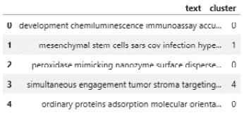

图 9.18 – 显示清洗后的文本及其相关聚类的 DataFrame

在数据聚类后，让我们将此数据绘制在二维散点图上。鉴于我们有数千个特征，我们可以使用**PCA**算法将这些特征减少到仅用于可视化的两个特征：

```py
from sklearn.decomposition import PCA
pca = PCA(n_components=2)
pca_features_2d = pca.fit_transform(features.toarray())
pca_features_2d_centers = pca.transform(cls.cluster_centers_)
```

让我们继续将这些两个主成分添加到我们的 DataFrame 中：

```py
df["pc1"], df["pc2"] = pca_features_2d[:,0], pca_features_2d[:,1]
df[["text", "cluster", "pc1", "pc2"]].head()
```

我们可以在下面的屏幕截图中看到这个命令的输出：

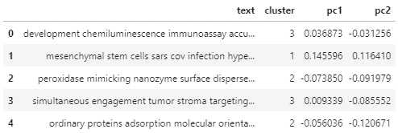

图 9.19 – 显示文本、簇和主成分的 DataFrame

在这里，我们可以看到每一行文本现在都有一个簇，以及一组以主成分形式表示的坐标。接下来，我们将绘制我们的数据，并按簇着色：

```py
plt.figure(figsize=(15,8))
new_cmap = matplotlib.colors.LinearSegmentedColormap.from_list("mycmap", colors)
plt.scatter(df["pc1"], df["pc2"], c=df["cluster"], cmap=new_cmap)
plt.scatter(pca_features_2d_centers[:, 0], pca_features_2d_centers[:,1], marker='*', s=500, c='r')
plt.xlabel("PC1", fontsize=20)
plt.ylabel("PC2", fontsize=20)
```

执行此代码后，我们将得到以下输出：

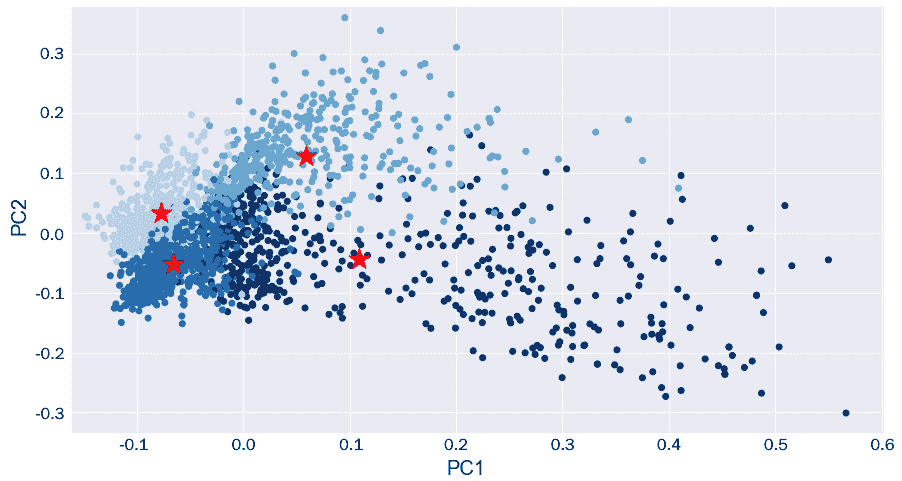

图 9.20 – 按簇着色的主成分散点图，星号代表簇中心

在这里，我们可以看到簇之间似乎有一些适当的分离！最左边的两个簇似乎在其分布中具有较小的方差，而其他两个则分布得更广。鉴于我们将相当数量的特征降低到只有两个主成分，它们之间一定程度的重叠是合理的，尤其是考虑到所有文章都是科学性的。

现在，让我们计算一下在我们数据集中发现的一些最突出的主题：

1.  首先，我们将开始实现 TFIDF：

    ```py
    from sklearn.feature_extraction.text import CountVectorizer, TfidfVectorizer
    vectors = TfidfVectorizer(max_features=5500, stop_words="english")
    nmf_features = vectors.fit_transform(df.text)
    ```

1.  接下来，我们将降低数据的维度。然而，这次，我们将使用**非负矩阵分解**（**NMF**）来降低我们的数据，而不是 PCA。我们需要指定我们感兴趣的主题数量：

    ```py
    from sklearn.decomposition import NMF
    n_topics = 10
    cls = NMF(n_components=n_topics)
    cls.fit(features)
    ```

1.  现在，我们可以指定每个主题要检索的关键词数量。之后，我们将遍历组件并检索感兴趣的关键词：

    ```py
    num_topic_words = 3
    feature_names = vectors.get_feature_names()
    for i, j in enumerate(cls.components_):
        print(i, end=' ')
        for k in j.argsort()[-1:-num_topic_words-1:-1]:
            print(feature_names[k], end=' ')
    ```

    执行此循环后，我们将检索以下输出：

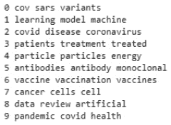

图 9.21 – 数据集的前 10 个主题，每个主题由三个关键词表示

我们可以使用这些主题建模方法从数据集中提取见解和趋势，使用户能够进行高级解释，而无需深入整个数据集。在整个教程中，我们考察了聚类和主题建模的经典方法之一：使用**TFIDF**和**NMF**。然而，存在许多其他使用语言模型的方法，例如**BERT**和**BioBERT**，以及**Gensim**和**LDA**等库。如果您对这个领域感兴趣，我强烈建议您探索这些库以获取更多信息。

通常，您可能不会以可用的格式拥有您的数据。在本教程中，我们的数据集结构在 DataFrame 中，准备好使用以进行切片和切块。然而，在许多情况下，我们感兴趣的数据可能是未结构化的，例如在 PDF 中。我们将在下一节中探讨如何处理这些情况。

# 处理未结构化数据

在上一节中，我们探讨了在处理基于文本的数据时进行的一些最常见的任务和流程。通常情况下，你会发现你处理的数据通常不是结构化的，或者可能不是数字化的。例如，一家决定将所有打印文档转换为数字状态的公司。或者可能是一家维护大量文档的公司，这些文档都没有结构化或组织化。对于这类任务，我们可以依赖几个 AWS 产品来帮助我们。在接下来的几节中，我们将探讨两个最有用的 NLP 工具。

## 使用 AWS Textract 进行 OCR

在我看来，**AWS**中可用最有用的工具之一是一个名为**AWS Textract**的**光学字符识别**（**OCR**）工具。这个工具背后的主要思想是使用 Textract 内部实现的预构建机器学习模型，使用户能够从图像或静态 PDF 文档中提取文本、表格和其他有用的项目。

例如，用户可以将图像或扫描的 PDF 文档上传到 Textract，这些文档在其他情况下是不可搜索的，并从中提取所有基于文本的内容，如下面的图所示：

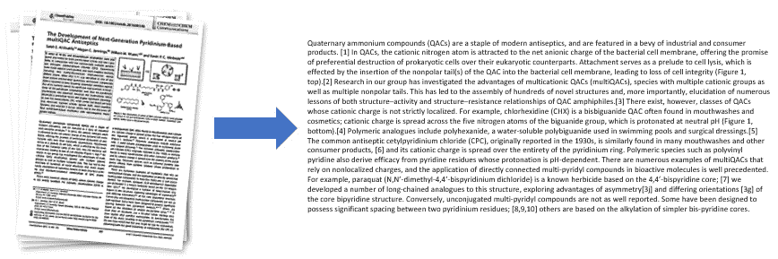

图 9.22 – 一个示意图，展示了将原始 PDF 文件结构化为有组织的数字文本

除了提取文本外，用户还可以提取类似以下在打印和手写形式中找到的关键值对：

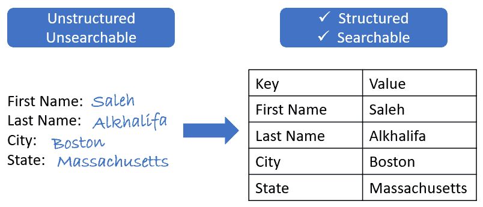

图 9.23 – 一个示意图，展示了将手写数据结构化为有组织的表格

要使用`boto3`。我们可以使用`pip`安装 Boto3。当在 SageMaker 中使用 Boto3 时，您不需要使用任何访问密钥来利用该服务。然而，如果您正在使用 Jupyter Notebook 的本地实现，您将需要能够使用访问密钥进行身份验证。**访问密钥**可以轻松地在几个简单的步骤中创建：

1.  导航到 AWS 控制台，并从**服务**菜单中选择**IAM**。

1.  在左侧的**访问管理**选项卡下，点击**用户**，然后**添加用户**。

1.  继续为您的用户命名，例如`ml-biotech-user`，并启用**程序访问**选项：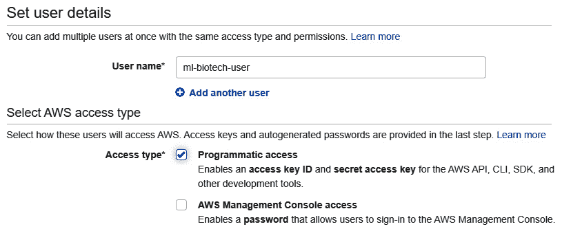

    图 9.24 – 设置 AWS IAM 角色的策略

1.  接下来，选择顶部的**直接附加现有策略**选项，并添加感兴趣的策略。继续添加 Textract、Comprehend 和 S3，因为我们将需要这三个角色：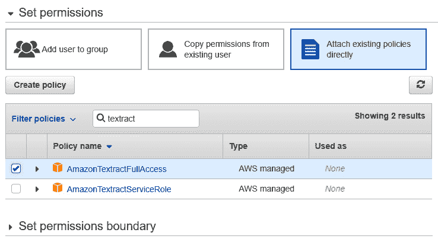

    图 9.25 – 设置 AWS IAM 角色的策略

1.  在为您的用户添加一些描述性标签之后，您将获得两项内容：您的**访问密钥 ID**和**AWS 密钥访问密钥**。请确保将这两项内容复制到安全的地方。出于安全考虑，在离开此页面后，您将无法从 AWS 中检索它们。

现在我们有了访问密钥，让我们继续在感兴趣的文档上实现 Textract。我们可以通过几个步骤来完成这项工作。

1.  首先，我们需要将我们的数据上传到我们的**S3 存储桶**。我们可以使用本书前面使用过的同一个 S3 存储桶。我们需要指定我们的密钥，然后使用 Boto3 客户端连接到 AWS：

    ```py
    AWS_ACCESS_KEY_ID = "add-access-key-here"
    AWS_SECRET_ACCESS_KEY = "add-secret-access-key-here"
    AWS_REGION = "us-east-2"
    s3_client = boto3.client('s3', aws_access_key_id=AWS_ACCESS_KEY_ID, aws_secret_access_key=AWS_SECRET_ACCESS_KEY, region_name=AWS_REGION)
    ```

1.  连接设置好之后，我们可以继续上传一个示例 PDF 文件。请注意，您可以提交 PDF 文件以及图像文件（PNG）。让我们使用`upload_fileobj()`函数上传我们的 PDF 文件：

    ```py
    with open("Monoclonal Production Article.pdf", "rb") as f:
        s3_client.upload_fileobj(f, "biotech-machine-learning", "pdfs/Monoclonal Production Article.pdf")
    ```

1.  现在我们已经上传了 PDF，我们可以使用 Textract。首先，我们需要使用 Boto3 客户端进行连接。请注意，我们将所需的资源从`'s3'`更改为`'textract'`，因为我们现在使用的是不同的服务：

    ```py
    textract_client = boto3.client('textract', aws_access_key_id=AWS_ACCESS_KEY_ID, aws_secret_access_key=AWS_SECRET_ACCESS_KEY, region_name=AWS_REGION)
    ```

1.  接下来，我们可以使用`start_document_text_detection()`方法将文件发送到 Textract，其中我们指定存储桶的名称和文档的名称：

    ```py
    response = textract_client.start_document_text_detection(
                       DocumentLocation={'S3Object': {'Bucket': "biotech-machine-learning", 'Name': "pdfs/Monoclonal Production Article.pdf"} })
    ```

1.  我们可以通过检查响应变量中的状态码来确认任务已成功启动。经过一段时间（取决于作业的持续时间），我们通过指定`JobId`来检索结果：

    ```py
    results = textract_client.get_document_text_detection(JobId=response["JobId"])
    ```

    立即，我们会注意到`results`变量只是一个可以解析和遍历的大 JSON。请注意，JSON 的结构相当复杂且详细。

1.  最后，我们可以通过遍历`Blocks`并收集`LINE`类型块的文本来收集所有文本：

    ```py
    documentText = ""
    for item in results["Blocks"]:
        if item["BlockType"] == "LINE":
            documentText = documentText + item["Text"]
    ```

如果您打印`documentText`变量，您将看到从该文档成功收集到的所有文本！Textract 可以是一个非常有用的工具，可以将文档从非结构化和不可搜索的状态转换为更结构化和可搜索的状态。通常，大多数基于文本的数据将以非结构化格式存在，您会发现 Textract 是这些类型应用中最有用的资源之一。Textract 通常与其他 AWS 资源结合使用，以最大化工具的效用，例如**DynamoDB**用于存储或**Comprehend**用于分析。我们将在下一节中探讨 Comprehend。

## 使用 AWS Comprehend 进行实体识别

在本章前面，我们使用 SciPy 库实现了一个 NER 模型，用于检测给定文本部分的实体。现在，让我们探索一个更强大的 NER 实现，称为**AWS Comprehend**。Comprehend 是一种 NLP 服务，旨在发现非结构化文本数据中的见解，使用户能够提取关键短语、计算情感、识别实体等等。让我们继续探索这个工具。

与其他`boto3`客户端类似：

```py
comprehend_client = boto3.client('comprehend', aws_access_key_id=AWS_ACCESS_KEY_ID, aws_secret_access_key=AWS_SECRET_ACCESS_KEY, region_name=AWS_REGION)
```

接下来，我们可以继续使用`detect_entities()`函数来识别文本中的实体。我们可以使用之前使用 Textract 生成的`documentText`字符串：

```py
response = comprehend_client.detect_entities(
    Text=documentText[:5000],
    LanguageCode='en',
)
print(response["Entities"])
```

打印出响应后，我们将看到检测到我们文本块中的每个实体的结果。此外，我们还可以将结果组织到 DataFrame 中：

```py
pd.DataFrame(response["Entities"]).sort_values(by='Score', ascending=False).head()
```

按照分数排序值后，我们可以看到我们的结果以结构化的方式列出：

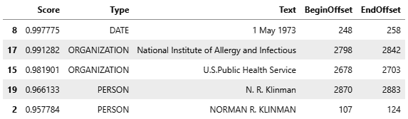

图 9.26 – 一个示例 DataFrame，显示 AWS Comprehend 实体 API 的结果

除了实体之外，Comprehend 还可以检测文本中的关键短语：

```py
response = comprehend_client.detect_key_phrases(
    Text=documentText[:5000],
    LanguageCode='en',
)
response["KeyPhrases"][0]
```

在打印列表中的第一个项目时，我们可以看到分数、短语和在字符串中的位置：

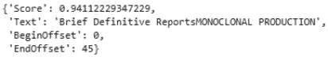

图 9.27 – AWS Comprehend 关键短语 API 的结果

此外，我们还可以使用`detect_sentiment()`函数来检测情感：

```py
response = comprehend_client.detect_sentiment(
    Text=documentText[:5000],
    LanguageCode='en',
)
print(response)
```

我们可以打印出响应变量以获取字符串的结果。我们可以看到，情感被标记为中性，这对于一般不带积极或消极语调的科学数据声明是有意义的：

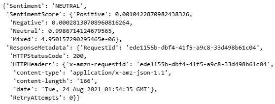

图 9.28 – AWS Comprehend 情感 API 的结果

最后，Comprehend 还可以使用`detect_dominant_language()`函数检测文本中的主要语言：

```py
response = comprehend_client.detect_dominant_language(
    Text=documentText[:5000],
)
response
```

在这里，我们可以看到，打印出响应后，我们可以感受到语言，以及模型关联的分数或概率：

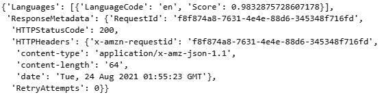

图 9.29 – AWS Comprehend 语言检测 API 的结果

AWS Textract 和 AWS Comprehend 是目前最顶尖的 NLP 工具之一，在结构化和分析大量非结构化文本文档方面发挥了关键作用。今天的大多数基于 NLP 的应用程序通常至少使用这些技术中的一种，如果不是两种。有关 Textract 和 Comprehend 的更多信息，我强烈建议您访问 AWS 网站([`aws.amazon.com/`](https://aws.amazon.com/))。

到目前为止，我们已经学习了如何分析和转换基于文本的数据，尤其是在将数据从非结构化状态转换为更结构化状态时。现在，文档已经更加组织化，下一步是能够以某种方式使用它们，例如通过搜索引擎。在下一节中，我们将学习如何使用**transformers**创建**语义搜索**引擎。

# 教程 – 使用 transformers 开发科学数据搜索引擎

到目前为止，我们是从逐词的角度来看待文本的，也就是说，我们保持文本原样，无需以任何方式转换或嵌入它。在某些情况下，将单词转换为数值或**嵌入（embeddings**）可以打开许多新的大门，解锁许多新的可能性，尤其是在深度学习方面。在这个教程中，我们的主要目标将是开发一个搜索引擎来查找和检索科学数据。我们将通过实现一个重要的、有用的深度学习自然语言处理（NLP）架构，即转换器（transformer）来实现这一点。这里的优点是，我们将设计一个强大的语义搜索引擎，因为我们现在可以搜索想法或语义意义，而不仅仅是关键词。

我们可以将转换器（transformers）视为一种深度学习模型，它使用称为**自注意力（self-attention**）的机制来解决基于序列的任务。我们可以将自注意力视为一种帮助将句子或嵌入中的不同部分联系起来以创建表示的方法。简单来说，模型试图将句子视为想法，而不是单个单词的集合。

在我们开始使用转换器之前，让我们更多地谈谈**嵌入（embeddings**）的概念。我们可以将嵌入视为表示一个项目（在我们的情况下是一个单词或句子）的低维数值或连续数字的向量。我们通常将单词和句子转换为嵌入，以便模型在处理大型数据集时更容易执行机器学习任务。在自然语言处理（NLP）和神经网络的环境中，使用嵌入有三个主要原因：

+   为了减少大量文本数据的**维度（dimensionality**）

+   为了计算两个不同文本之间的**相似度（similarity**）

+   为了**可视化（visualize**）文本部分之间的关系

现在我们对嵌入及其在 NLP 中的作用有了更好的理解，让我们继续使用一个真实的科学搜索引擎的实例来开始。我们将首先导入我们将需要的几个库： 

```py
import scipy
import torch
import pandas as pd
from sentence_transformers import SentenceTransformer, util
```

要创建我们的嵌入（embeddings），我们需要一个模型。我们有选择创建一个针对我们的数据集定制的模型。这里的优点是，如果模型是在我们领域的文本上训练的，那么我们的结果可能会得到改善。或者，我们可以使用从`SentenceTransformer`网站（[`www.sbert.net/`](https://www.sbert.net/)）可用的其他预训练模型。让我们下载这些预训练模型之一：

```py
model = SentenceTransformer('msmarco-distilbert-base-v4')
```

接下来，我们可以创建一个测试数据库，并用几句话填充它：

```py
database = df["abstract"].values 
```

接下来，我们可以调用`encode()`函数将我们的字符串列表转换为嵌入列表：

```py
database_embeddings = model.encode(database)
```

如果我们使用`len()`函数检查数据库的长度和`database_embeddings`的长度，我们会发现它们包含相同数量的元素，因为应该为每段文本有一个嵌入。如果我们打印嵌入数据库的第一个元素的内容，我们会发现内容现在只是一个向量的列表：

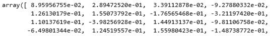

图 9.30 – 一个嵌入文本的视图

现在我们已经将我们的文档嵌入，用户可能会想要搜索或查询特定的短语。我们可以像对待其他人一样将用户的查询编码，但将那个值分配给一个新的变量，我们将称之为`query_embedding`：

```py
query = "One of the best discoveries were monoclonal antibodies"
query_embedding = model.encode(query)
```

在查询和句子嵌入之后，我们可以计算项目之间的距离。这里的思路是，与用户查询更相似的文档将具有较短的距离，而那些不太相似的文档将具有较长的距离。请注意，我们在这里使用余弦作为距离和相似度的度量，因此，我们也可以使用其他方法，例如`euclidean`距离：

```py
import scipy
cos_scores = util.pytorch_cos_sim(query_embedding, 
                             database_embeddings)[0]
```

让我们继续准备一个单一的`runSearch`函数，该函数包含查询、编码器以及显示我们结果的方法。这个过程从几个打印语句开始，然后将新的查询编码到一个名为`query_embedding`的变量中。然后计算距离，并按距离对结果进行排序。最后，遍历结果并打印每个的分数、标题和摘要：

```py
def askQuestion(query, top_k):
    print(f"#########################################")
    print(f"#### {query} ####")
    print(f"#########################################")
    query_embedding = model.encode(query, convert_to_tensor=True)
    cos_scores = util.pytorch_cos_sim(query_embedding, 
                 database_embeddings)[0]
    top_results = torch.topk(cos_scores, k=top_k)

    for score, idx in zip(top_results[0], top_results[1]):
        print("#### Score: {:.4f}".format(score))
        print("#### Title: ", df.loc[float(idx)].title)
        print("#### Abstract: ", df.loc[float(idx)].abstract)
        print("#################################")

```

现在我们已经准备好了我们的函数，我们可以用我们的感兴趣查询来调用它：

```py
query = ' What is known about the removal of harmful cyanobacteria?
askQuestion(query, 5)        
```

调用函数后，我们会检索几个类似打印的结果。我们可以在下面的屏幕截图中的一个结果中看到，显示了文章的`score`、`title`和`abstract`属性：

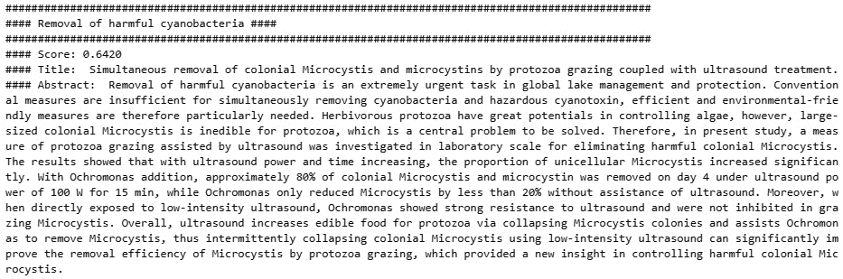

图 9.31 – 科学文本语义搜索模型的输出结果

通过这样，我们已经成功开发了一个能够搜索科学文献的语义搜索模型。请注意，查询本身并不是与模型返回的顶部结果直接字符串匹配。再次强调，这里的想法不是匹配关键词，而是计算嵌入之间的距离，这代表了相似性。

# 摘要

在本章中，我们尝试冒险地涵盖广泛的 NLP 主题。我们使用 NLTK 和 spaCy 库探索了一系列入门主题，如命名实体识别（NER）、分词和词性。然后，我们通过结构化数据集的视角来探索 NLP，其中我们利用`pymed`库作为科学文献的来源，并在预处理步骤中分析和清理数据。接下来，我们开发了一个词云来可视化给定数据集中单词的频率。最后，我们开发了一个聚类模型来分组我们的摘要，并开发了一个主题建模模型来识别突出主题。

我们随后通过非结构化数据的视角来探索自然语言处理（NLP），在这个过程中，我们研究了两种常见的 AWS NLP 产品。我们使用 Textract 将 PDF 和图像转换为可搜索和结构化的文本，并使用 Comprehend 进行分析和提供见解。最后，我们学习了如何使用深度学习转换器开发语义搜索引擎，以找到相关信息。

本章特别独特之处在于，我们了解到文本是一种基于序列的数据类型，这使得它的用途和应用与我们在之前工作中处理的其他许多数据集截然不同。随着全球各地的公司开始将传统文档迁移到数字空间，搜索文档和识别见解的能力将具有极大的价值。在下一章中，我们将考察另一种称为时间序列的基于序列的数据类型。
